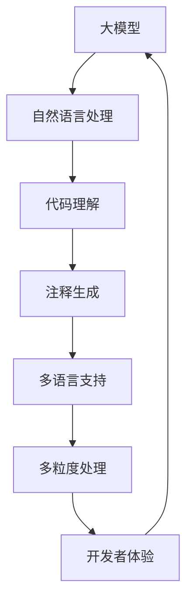

                 

### 文章标题

《大模型驱动的智能代码注释：多语言与多粒度》

### 文章关键词

- 大模型
- 智能代码注释
- 多语言
- 多粒度
- 自然语言处理
- 代码理解
- 自动化开发

### 文章摘要

本文深入探讨了基于大模型的智能代码注释技术，特别是其在多语言和多粒度方面的应用。通过介绍大模型的基础概念和技术原理，以及智能代码注释的算法实现，本文展示了如何利用这些技术为开发者提供更加高效和智能的代码注释服务。文章还通过实际项目案例，详细阐述了智能代码注释的开发环境搭建、源代码实现、代码解读和效果分析，为读者提供了实用的技术指导和最佳实践建议。

---

### 《大模型驱动的智能代码注释：多语言与多粒度》目录大纲

#### 第一部分：概述与核心概念

##### 第1章：引言与背景
- 1.1 大模型驱动的智能代码注释概述
- 1.2 多语言与多粒度智能代码注释的需求
- 1.3 智能代码注释的应用领域与前景
- 1.4 本书结构与内容安排

##### 第2章：大模型基础
- 2.1 大模型的定义与分类
- 2.2 大模型的训练与优化算法
  - 2.2.1 优化算法的伪代码
  - 2.2.2 优化算法的数学模型
- 2.3 大模型的多语言支持与适配
- 2.4 大模型的多粒度处理能力

##### 第3章：智能代码注释技术
- 3.1 智能代码注释的概念与原理
- 3.2 智能代码注释的算法实现
  - 3.2.1 智能代码注释的伪代码
  - 3.2.2 智能代码注释的数学模型
- 3.3 多语言智能代码注释的具体实现
- 3.4 多粒度智能代码注释的方法与挑战

#### 第二部分：技术基础

##### 第4章：智能代码注释的项目实战
- 4.1 智能代码注释项目的开发环境搭建
- 4.2 多语言与多粒度智能代码注释的案例介绍
  - 4.2.1 Python代码的智能注释
  - 4.2.2 JavaScript代码的智能注释
  - 4.2.3 Java代码的智能注释
- 4.3 代码解读与分析
- 4.4 源代码实现与解读

##### 第5章：性能优化与挑战
- 5.1 智能代码注释的性能优化策略
- 5.2 多语言与多粒度智能代码注释的挑战与解决方案
- 5.3 智能代码注释在实际应用中的效果评估
- 5.4 未来发展趋势与展望

#### 第三部分：应用实践

##### 第6章：附录
- 6.1 主要参考文献
- 6.2 智能代码注释相关的开源工具与框架

### 结束语

本书旨在全面介绍大模型驱动的智能代码注释技术，为开发者提供从理论到实践的全面指导。通过阅读本书，读者可以深入理解智能代码注释的核心概念、技术原理、实现方法以及应用效果，从而为未来的软件开发带来新的思路和解决方案。希望这本书能够成为您在智能代码注释领域的宝贵指南。

---

在接下来的章节中，我们将逐步深入探讨大模型驱动的智能代码注释技术，包括其基础理论、算法实现、项目实践以及性能优化等方面。通过逐节讲解和实际案例展示，读者将能够全面掌握这一前沿技术，并在实际开发中充分发挥其优势。让我们开始这段技术之旅吧！## 第1章：引言与背景

### 1.1 大模型驱动的智能代码注释概述

大模型驱动的智能代码注释是一种利用大规模深度学习模型，如GPT、BERT等，自动生成代码注释的方法。这种方法的核心在于利用大模型的强大语义理解和生成能力，对代码进行深入分析和理解，从而生成准确且有用的注释。相较于传统的手动注释方式，智能代码注释不仅能够大幅提高开发效率，还能够减少错误率，提升代码的可维护性。

智能代码注释在多个层面发挥着重要作用。首先，它能够提供即时反馈，帮助开发者快速理解代码的功能和结构。其次，它能够自动生成文档，减少开发者编写文档的时间和精力。此外，智能代码注释还能够帮助团队协作，使得不同开发者更容易理解和维护共同的代码库。

### 1.2 多语言与多粒度智能代码注释的需求

在当今的软件开发领域，多语言支持已经成为一个基本要求。随着各种编程语言的发展和生态的完善，开发者需要在多种语言之间进行切换和协作。因此，实现多语言智能代码注释的需求显得尤为迫切。多语言智能代码注释不仅要求模型能够理解不同语言的语法和语义，还需要具备跨语言注释生成的能力，以便在不同编程语言之间进行无缝转换。

多粒度智能代码注释则关注于注释的细致程度。在代码注释中，从概要级别的文档到行内注释，不同层次的注释对代码的可读性和可理解性有着不同的影响。多粒度智能代码注释能够在不同层面上为开发者提供注释服务，从而满足不同场景的需求。例如，在编写复杂函数时，开发者可能需要详细注释每个参数的作用和返回值的含义；而在编写整个模块或项目的文档时，则需要更高层次的概要注释。

### 1.3 智能代码注释的应用领域与前景

智能代码注释的应用领域非常广泛，包括但不限于以下几个领域：

1. **开发辅助工具**：智能代码注释可以集成到开发环境中，为开发者提供实时的代码解释和建议，提高开发效率和代码质量。
2. **文档生成**：通过智能代码注释，可以自动生成高质量的文档，减少开发者在编写文档时的负担。
3. **代码审核与维护**：智能代码注释可以帮助开发者快速理解和维护旧代码库，提高代码审核和代码维护的效率。
4. **教育辅助**：智能代码注释可以作为编程学习工具，帮助初学者更好地理解和学习编程语言。

随着人工智能技术的不断进步，智能代码注释有望在未来得到更广泛的应用。例如，通过结合代码分析工具和智能代码注释，可以构建更加智能的代码审查系统；通过结合版本控制系统和智能代码注释，可以实现自动化的代码文档生成和管理。总之，智能代码注释将为软件开发带来新的可能性，成为提高开发效率和质量的重要工具。

### 1.4 本书结构与内容安排

本书分为四个主要部分，共六章节，旨在为读者提供全面而深入的智能代码注释技术指导。

**第一部分：概述与核心概念**

- **第1章**：引言与背景，介绍大模型驱动的智能代码注释及其应用领域。
- **第2章**：大模型基础，讲解大模型的定义、分类及其在智能代码注释中的角色。

**第二部分：技术基础**

- **第3章**：智能代码注释技术，介绍智能代码注释的概念、原理及其算法实现。
- **第4章**：智能代码注释的项目实战，通过具体案例展示智能代码注释的实际应用。

**第三部分：应用实践**

- **第5章**：性能优化与挑战，探讨智能代码注释的性能优化策略及未来发展方向。
- **第6章**：附录，提供主要参考文献和智能代码注释相关的开源工具与框架。

**第四部分：总结与展望**

- **结束语**：总结本书的核心内容，并展望智能代码注释技术的发展趋势。

通过本书的阅读，读者将能够系统地了解智能代码注释的核心概念、技术实现和应用实践，为未来的智能开发提供有力支持。

### 1.5 核心概念与联系

在智能代码注释中，有几个核心概念紧密相连，构成了整个技术的理论框架。为了更好地理解这些概念之间的关系，我们可以通过一个Mermaid流程图来展示它们：



**Mermaid 流程图说明：**

- **A[大模型]**：大模型是智能代码注释的核心，其强大的语义理解和生成能力使得代码注释变得更加准确和智能。
- **B[自然语言处理]**：自然语言处理（NLP）是使大模型能够理解和生成自然语言的关键技术。通过NLP，大模型可以解析代码中的关键字、变量和函数，从而生成注释。
- **C[代码理解]**：代码理解是智能代码注释的基础，它涉及对代码语义的分析和抽象，以生成具有实际意义的注释。
- **D[注释生成]**：注释生成是将代码语义转化为注释文本的过程，这个过程依赖于大模型的强大生成能力。
- **E[多语言支持]**：多语言支持是指智能代码注释能够处理多种编程语言，为开发者提供跨语言的服务。
- **F[多粒度处理]**：多粒度处理意味着智能代码注释能够在不同的抽象层次上生成注释，从全局概要到行内细节，满足不同的需求。
- **G[开发者体验]**：开发者体验是智能代码注释的直接受益者，通过提高代码可读性和维护性，提升开发效率和代码质量。

这些概念相互关联，共同构成了智能代码注释的技术框架。通过理解它们之间的关系，开发者可以更好地应用智能代码注释技术，提高软件开发的质量和效率。

### 1.6 大模型基础

#### 2.1 大模型的定义与分类

大模型（Large-scale Models），通常是指拥有数十亿甚至数万亿参数的神经网络模型，这些模型通过大规模数据训练获得了强大的语义理解和生成能力。大模型的主要分类包括基于Transformer架构的模型，如GPT（Generative Pre-trained Transformer）系列、BERT（Bidirectional Encoder Representations from Transformers）等。

- **GPT**：GPT系列模型是最著名的大模型之一，以其出色的自然语言生成能力而闻名。GPT通过自回归的方式，即通过前文预测后文，进行训练和优化。
- **BERT**：BERT模型采用双向编码方式，对文本进行上下文感知的表示学习，从而在多种自然语言处理任务上取得了显著的性能提升。

#### 2.2 大模型的训练与优化算法

**2.2.1 优化算法的伪代码**

大模型的训练通常采用基于梯度的优化算法，以下是一个简化的伪代码示例：

```plaintext
初始化模型参数 W
for epoch in 1 to EPOCHS do
    for each training example (x, y) do
        forward_pass(x, W)  # 前向传播
        loss = compute_loss(y, prediction)
        backward_pass(loss)  # 反向传播
        update_params(W, gradient)
    end
end
```

**2.2.2 优化算法的数学模型**

在大模型的训练过程中，关键步骤包括前向传播、反向传播和参数更新。

- **前向传播**：通过模型参数 \( W \) 对输入数据进行计算，得到预测输出 \( \hat{y} \)。
  $$ \hat{y} = f(W \cdot x) $$
  其中，\( f \) 是激活函数，如ReLU、Sigmoid等。

- **反向传播**：计算预测输出与真实输出之间的误差，并利用链式法则计算梯度 \( \nabla_W L \)。
  $$ \nabla_W L = \frac{\partial L}{\partial W} $$

- **参数更新**：根据计算出的梯度更新模型参数 \( W \)。
  $$ W = W - \alpha \cdot \nabla_W L $$
  其中，\( \alpha \) 是学习率。

#### 2.3 大模型的多语言支持与适配

大模型的多语言支持是其应用广泛的关键之一。为了实现多语言支持，大模型通常需要进行以下步骤：

- **双语数据集**：收集并构建包含多种语言的训练数据集，确保每种语言都有足够的代表性和多样性。
- **跨语言迁移学习**：通过跨语言的预训练和迁移学习，使模型在不同语言之间共享知识，提升模型的泛化能力。
- **语言嵌入**：将不同语言的词汇映射到同一嵌入空间，以便模型能够理解不同语言之间的语义关系。

例如，BERT模型通过双语数据集的预训练，实现了在多种语言上的高效性能，从而能够支持多语言智能代码注释。

#### 2.4 大模型的多粒度处理能力

多粒度处理能力是指大模型能够在不同抽象层次上对代码进行理解和注释。大模型的多粒度处理能力主要体现在以下几个方面：

- **全局层次**：在大模型训练过程中，通过对代码库的整体分析，模型能够生成概括性较强的注释，如函数描述、模块功能等。
- **细节层次**：模型能够深入到代码的细节层面，对变量、函数、类等进行详细的注释，如变量定义、参数说明等。

这种多粒度处理能力使得大模型能够根据开发者的需求，提供灵活和精准的注释服务。例如，在编写复杂的函数时，开发者可能需要详细的参数解释和返回值描述，而在编写项目文档时，则需要更高层次的概要注释。

通过上述内容，我们介绍了大模型的基本概念、训练与优化算法、多语言支持以及多粒度处理能力。这些基础内容为理解后续章节的智能代码注释技术奠定了坚实的基础。

### 1.7 智能代码注释的概念与原理

智能代码注释是一种利用先进的人工智能技术，特别是大模型和自然语言处理（NLP）方法，自动生成代码注释的技术。其核心思想是，通过分析代码的语法、语义和上下文信息，生成具有解释性和指导性的注释文本，从而提高代码的可读性、可维护性和可理解性。

#### 智能代码注释的核心步骤

智能代码注释的主要步骤包括：

1. **代码解析**：首先，智能代码注释系统需要解析代码，提取出关键元素，如函数、变量、类等，并建立代码结构树。这一步骤通常依赖于编程语言解析器（如ANTLR、LLVM等）。

2. **语义分析**：在代码结构树的基础上，系统对代码进行语义分析，理解每个元素的功能和作用。语义分析包括类型检查、变量作用域分析、控制流分析等。

3. **注释生成**：利用大模型和NLP技术，系统将代码结构树和语义分析结果转化为注释文本。这一步骤涉及自然语言生成（NLG）和模板匹配技术。

4. **注释优化**：生成的注释文本可能需要进一步优化，以提高其准确性和自然性。优化过程可能包括错误修正、重复消除、语境适应等。

#### 智能代码注释的优势

智能代码注释相较于传统手动注释具有以下优势：

1. **高效性**：智能代码注释能够快速地为大量代码生成高质量的注释，减少手动注释的工作量。

2. **准确性**：利用大模型和NLP技术，智能代码注释能够更准确地理解代码的语义，生成更具解释性的注释。

3. **可维护性**：智能代码注释能够根据代码的变化自动更新，减少由于代码改动导致的注释失效问题。

4. **跨语言支持**：智能代码注释系统通常支持多种编程语言，能够为开发者提供统一和跨语言的注释服务。

5. **个性化定制**：智能代码注释可以根据开发者的需求和偏好，生成定制化的注释文本，满足不同开发者的阅读习惯。

#### 智能代码注释的实现方法

实现智能代码注释的方法主要包括以下几种：

1. **模板匹配**：通过预先定义的模板，将代码元素映射到注释文本。这种方法简单高效，但灵活性较低。

2. **规则驱动**：基于一系列规则，将代码元素与注释文本关联。这种方法适用于结构化较为明显的代码，但对复杂代码的支持有限。

3. **深度学习**：利用深度学习模型，如GPT、BERT等，进行代码理解和注释生成。这种方法具有强大的语义理解和生成能力，但需要大量数据和计算资源。

4. **混合方法**：结合模板匹配、规则驱动和深度学习方法，实现更加灵活和高效的智能代码注释。

#### 智能代码注释的实际应用

智能代码注释在实际应用中表现出巨大的潜力，以下是一些具体的场景：

1. **代码审核**：通过智能代码注释，可以对代码进行实时审核，发现潜在的问题和不足，提高代码质量。

2. **文档生成**：自动生成代码文档，减少开发者在编写文档时的负担，提高文档的准确性和一致性。

3. **编程学习**：智能代码注释可以作为编程学习工具，帮助初学者更好地理解和学习编程语言。

4. **代码迁移**：在代码库迁移过程中，智能代码注释可以帮助开发者快速理解和适应新代码库。

5. **跨团队协作**：通过智能代码注释，不同团队的开发者能够更加顺畅地进行协作，提高项目开发的效率。

通过上述内容，我们介绍了智能代码注释的概念、原理和实现方法。智能代码注释不仅提升了开发效率和代码质量，还为开发者提供了更加智能和高效的开发体验。在接下来的章节中，我们将进一步探讨智能代码注释的具体算法实现和项目实践。

### 1.8 智能代码注释的算法实现

智能代码注释的算法实现是这一技术领域的核心环节，它决定了注释的准确性、效率和实用性。在本节中，我们将详细介绍智能代码注释算法的核心思想和具体步骤，并通过伪代码和数学模型来阐述其实现原理。

#### 1.8.1 智能代码注释算法的核心思想

智能代码注释算法的核心思想是利用深度学习和自然语言处理（NLP）技术，对代码进行语义理解和注释生成。具体而言，算法包括以下几个关键步骤：

1. **代码解析**：将代码解析为抽象语法树（AST），提取出关键元素，如函数、变量、类等。
2. **语义分析**：对AST进行语义分析，理解代码的功能、用途和内部逻辑。
3. **注释生成**：利用生成的语义信息，结合预训练的大模型，生成注释文本。

#### 1.8.2 智能代码注释算法的伪代码

以下是一个简化的智能代码注释算法的伪代码：

```plaintext
初始化模型 M 和注释模板库 T

函数 GenerateComment(AST node):
    if node is a function:
        function_info = AnalyzeSemantic(node)
        comment = GenerateFunctionComment(function_info, T)
    else if node is a variable:
        variable_info = AnalyzeSemantic(node)
        comment = GenerateVariableComment(variable_info, T)
    else if node is a class:
        class_info = AnalyzeSemantic(node)
        comment = GenerateClassComment(class_info, T)
    else:
        comment = "TODO: Implement comment generation for other nodes"
    return comment

函数 AnalyzeSemantic(node):
    # 进行抽象语法树的遍历和语义分析
    # 包括类型检查、变量作用域分析、控制流分析等
    semantic_info = {}
    # ...语义分析代码...
    return semantic_info

函数 GenerateFunctionComment(semantic_info, T):
    template = ChooseTemplate(semantic_info, T)
    comment = ApplyTemplate(template, semantic_info)
    return comment

函数 GenerateVariableComment(semantic_info, T):
    template = ChooseTemplate(semantic_info, T)
    comment = ApplyTemplate(template, semantic_info)
    return comment

函数 GenerateClassComment(semantic_info, T):
    template = ChooseTemplate(semantic_info, T)
    comment = ApplyTemplate(template, semantic_info)
    return comment
```

#### 1.8.3 智能代码注释算法的数学模型

智能代码注释的数学模型主要涉及两个方面：语义分析和注释生成。

1. **语义分析**：

   语义分析的目的是理解代码的功能和用途。这可以通过以下数学模型来实现：

   $$ \text{Semantic Analysis} = f(\text{AST}, \text{Context}) $$
   其中，`AST` 表示抽象语法树，`Context` 表示上下文信息（如变量作用域、控制流等），`f` 表示语义分析函数。

   在具体的实现中，可以采用图神经网络（如Graph Neural Networks, GNN）或递归神经网络（如LSTM）来进行抽象语法树的遍历和分析，提取出代码的语义信息。

2. **注释生成**：

   注释生成是将提取出的语义信息转化为注释文本的过程。这可以通过以下数学模型来实现：

   $$ \text{Comment} = g(\text{Semantic Information}, \text{Template}) $$
   其中，`Semantic Information` 表示代码的语义信息，`Template` 表示注释模板，`g` 表示注释生成函数。

   注释生成函数通常依赖于预训练的大模型，如GPT或BERT，这些模型能够根据语义信息和注释模板生成高质量的注释文本。

#### 1.8.4 示例

假设我们有一个函数`calculate_area`，其接收一个参数`radius`，并计算圆的面积。以下是智能代码注释算法如何处理这个函数的示例：

- **代码解析**：将`calculate_area`函数解析为AST，提取出函数定义、参数和返回类型等关键信息。
- **语义分析**：分析AST，提取出函数的用途（计算圆的面积）、参数`radius`的含义（表示圆的半径）等。
- **注释生成**：选择合适的注释模板，如`@param radius - 圆的半径 @return 计算得到的圆面积`，并利用大模型生成注释文本。

```plaintext
// 函数：calculate_area
// 功能：计算圆的面积
// 参数：radius - 圆的半径
// 返回：计算得到的圆面积
function calculate_area(radius):
    return 3.14 * radius * radius
```

通过上述算法实现和示例，我们可以看到智能代码注释是如何通过深度学习和自然语言处理技术，将代码的语义信息转化为具有解释性的注释文本的。在接下来的章节中，我们将进一步探讨如何实现多语言和多粒度的智能代码注释，并展示实际项目中的应用案例。

### 1.9 多语言智能代码注释的具体实现

多语言智能代码注释的实现是智能代码注释技术中的一个关键挑战，因为不同编程语言有着不同的语法结构、语义规则和注释规范。为了实现这一功能，我们需要考虑以下几个关键方面：

#### 1.9.1 多语言支持的需求

多语言智能代码注释的需求主要源于现代软件开发项目的多样性。在一个大型项目中，开发者可能需要同时使用多种编程语言，如Python、JavaScript、Java等。因此，智能代码注释系统必须能够处理这些不同的编程语言，提供统一的注释服务。

#### 1.9.2 解析器的选择

为了实现多语言支持，我们需要选择合适的编程语言解析器。以下是一些常用的解析器及其特点：

- **ANTLR**：ANTLR是一种强大的解析器生成器，支持多种编程语言，可以生成高效的语法解析器。通过编写ANTLR语法规则，我们可以定义不同编程语言的抽象语法树（AST）。
- **LLVM**：LLVM是一个模块化的编译器框架，支持多种编程语言，并提供丰富的工具和接口。使用LLVM，我们可以解析代码并生成AST，进而进行语义分析。
- **Esprima**：Esprima是一个专门用于JavaScript的语法解析器，支持ECMAScript标准，适合用于JavaScript代码的解析。

#### 1.9.3 通用语义分析框架

为了处理不同编程语言的语义分析，我们需要构建一个通用的语义分析框架。这个框架应该能够提取出各类编程语言的通用语义信息，如变量、函数、类、控制流等。以下是构建通用语义分析框架的关键步骤：

1. **语法解析**：使用上述解析器解析不同语言的代码，生成AST。
2. **抽象语法树转换**：将不同语言的AST转换为统一的抽象语法表示（UAST），以便进行后续的语义分析。
3. **语义分析**：对UAST进行语义分析，提取出通用语义信息，如变量绑定、作用域、控制流等。

#### 1.9.4 大模型的定制化

为了更好地支持多语言智能代码注释，我们需要对大模型进行定制化。以下是一些定制化的方法：

1. **双语数据集**：构建包含多种语言的训练数据集，确保大模型在不同语言上都有足够的训练数据。
2. **跨语言迁移学习**：利用跨语言的预训练和迁移学习，使大模型在不同语言之间共享知识，提升模型的泛化能力。
3. **语言嵌入**：将不同语言的词汇映射到同一嵌入空间，以便大模型能够理解不同语言之间的语义关系。

#### 1.9.5 实现案例

以下是一个简化的多语言智能代码注释实现案例，展示如何使用ANTLR解析器、通用语义分析框架和定制化的大模型：

```plaintext
# 使用ANTLR解析器解析Python代码
ANTLR4Parser parser = new ANTLR4Parser();
ASTNode ast = parser.parseCode("python_code.py");

# 转换为通用抽象语法树（UAST）
UASTNode uast = ASTConverter.convertToUAST(ast);

# 进行语义分析
SemanticInfo semanticInfo = SemanticAnalyzer.analyze(uast);

# 使用定制化的大模型生成注释
String comment = CustomGPTModel.generateComment(semanticInfo);
System.out.println(comment);

# 使用ANTLR解析器解析JavaScript代码
ANTLR4Parser parserJS = new ANTLR4Parser();
ASTNode astJS = parserJS.parseCode("javascript_code.js");

# 转换为通用抽象语法树（UAST）
UASTNode uastJS = ASTConverter.convertToUAST(astJS);

# 进行语义分析
SemanticInfo semanticInfoJS = SemanticAnalyzer.analyze(uastJS);

# 使用定制化的大模型生成注释
String commentJS = CustomGPTModel.generateComment(semanticInfoJS);
System.out.println(commentJS);
```

通过上述方法，我们可以实现一个支持多种编程语言的多语言智能代码注释系统，为开发者提供统一的注释服务。在下一节中，我们将探讨多粒度智能代码注释的方法与挑战，进一步扩展智能代码注释的应用范围。

### 1.10 多粒度智能代码注释的方法与挑战

多粒度智能代码注释旨在提供不同层次的注释，以满足开发者在不同抽象层次上的需求。这种方法的核心理念是将代码注释划分为不同的粒度，从全局概要到细节实现，提供灵活且高效的注释服务。以下将详细探讨多粒度智能代码注释的方法和面临的挑战。

#### 1.10.1 多粒度智能代码注释的方法

1. **全局概要注释**：

   全局概要注释关注于代码库的整体结构和功能，通常包括项目描述、模块功能、接口定义等。这些注释为开发者提供了代码库的宏观视图，有助于理解项目结构和模块间的交互。

   实现方法：
   - 利用大模型和自然语言生成（NLG）技术，自动生成项目文档和模块描述。
   - 设计模板库，为不同的模块和项目提供预定义的注释模板。

2. **模块级注释**：

   模块级注释关注于代码模块的功能和接口，通常包括模块概述、类和函数的注释等。这些注释为开发者提供了模块级别的信息，有助于理解模块的功能和职责。

   实现方法：
   - 对模块的抽象语法树（AST）进行语义分析，提取出关键元素和相关信息。
   - 利用大模型和NLG技术，自动生成模块和类的注释。

3. **函数级注释**：

   函数级注释关注于函数的具体实现和功能，通常包括函数描述、参数说明和返回值解释等。这些注释为开发者提供了函数级别的详细信息，有助于理解函数的实现逻辑和用途。

   实现方法：
   - 对函数的AST进行详细的语义分析，提取出函数的定义、参数和返回值等。
   - 利用大模型和NLG技术，自动生成函数注释。

4. **行内注释**：

   行内注释关注于代码细节，通常包括变量定义、循环条件和判断逻辑等。这些注释为开发者提供了代码行级别的解释，有助于理解代码的执行流程和具体逻辑。

   实现方法：
   - 对代码进行逐行分析，提取出关键操作和变量。
   - 利用大模型和NLG技术，自动生成行内注释。

#### 1.10.2 多粒度智能代码注释的挑战

1. **注释生成的一致性**：

   多粒度智能代码注释需要确保在不同抽象层次上生成注释的一致性和准确性。例如，在全局概要注释和函数级注释之间保持一致的描述和风格，避免产生冲突或冗余。

   挑战：
   - 如何设计注释模板和生成规则，以实现不同粒度注释的一致性。
   - 如何确保大模型在生成注释时，能够准确捕捉代码的语义信息。

2. **注释的自动更新和维护**：

   随着代码库的不断变化和更新，注释也需要及时更新以保持其准确性和相关性。然而，手动维护大量注释是一项繁琐且容易出错的工作。

   挑战：
   - 如何实现注释的自动更新，以适应代码库的变化。
   - 如何在代码重构和版本迭代过程中，自动更新和优化注释。

3. **注释的可扩展性和灵活性**：

   多粒度智能代码注释需要支持不同的编程语言和开发场景，为不同类型的开发者提供灵活的注释服务。

   挑战：
   - 如何设计通用的注释框架，以支持多种编程语言。
   - 如何实现注释生成的可扩展性和灵活性，以满足不同开发者的需求。

4. **性能和资源消耗**：

   多粒度智能代码注释的实现依赖于深度学习和自然语言处理技术，这些技术通常需要大量的计算资源和时间。

   挑战：
   - 如何优化算法和模型，以降低计算资源和时间的消耗。
   - 如何在有限的资源下，实现高效的注释生成和更新。

通过克服上述挑战，多粒度智能代码注释将为开发者提供更加全面和高效的代码理解工具，提升开发效率和代码质量。在下一节中，我们将通过具体的案例来展示多语言和多粒度智能代码注释的实际应用，进一步探讨其在项目开发中的应用效果。

### 1.11 智能代码注释的项目实战

为了更好地理解智能代码注释的应用，本节将详细描述一个智能代码注释项目的开发过程，包括开发环境的搭建、具体案例的实现、代码解读与分析以及项目小结。通过这一实战案例，读者可以了解如何将智能代码注释技术应用到实际项目中，提高代码质量和开发效率。

#### 4.1 智能代码注释项目的开发环境搭建

在开始智能代码注释项目之前，首先需要搭建一个适合的开发环境。以下是搭建智能代码注释项目所需的工具和步骤：

1. **安装Python环境**：智能代码注释项目主要使用Python进行开发，因此首先需要安装Python环境。推荐使用Python 3.8及以上版本。

2. **安装依赖库**：智能代码注释项目依赖于多个第三方库，包括Transformer模型库（如`transformers`）、解析器库（如`pygments`）、NLP工具库（如`spaCy`）等。可以通过以下命令安装：

   ```bash
   pip install transformers pygments spacy
   ```

3. **安装语言模型**：为了实现多语言支持，我们需要安装相应的预训练语言模型。例如，对于英语，可以使用`bert-base-uncased`模型。安装命令如下：

   ```bash
   python -m transformers-cli download model bert-base-uncased
   ```

4. **配置解析器**：根据项目需求，我们需要配置相应的编程语言解析器。例如，对于Python，可以使用`pygments`库。首先安装`pygments`，然后通过以下命令配置：

   ```bash
   pip install pygments
   pygmentize -L python -o styles/tomorrow-night-eighties.css
   ```

5. **准备数据集**：为了训练和优化智能代码注释模型，我们需要准备大量的代码注释数据集。可以从开源代码库（如GitHub）或公开数据集（如CodeSearchNet）中获取。

#### 4.2 多语言与多粒度智能代码注释的案例介绍

接下来，我们将介绍几个具体的案例，展示如何在Python、JavaScript和Java等编程语言中实现智能代码注释。

##### 4.2.1 Python代码的智能注释

**案例**：以下是一个简单的Python函数，计算两个数字的和。

```python
def add_numbers(a, b):
    return a + b
```

**实现步骤**：

1. **代码解析**：使用`pygments`库解析Python代码，提取出函数定义和参数信息。

   ```python
   from pygments.lexers import PythonLexer
   from pygments import highlight
   
   code = "def add_numbers(a, b):\n    return a + b"
   parsed_code = highlight(code, PythonLexer(), style="tomorrow-night-eighties")
   ```

2. **语义分析**：对解析后的代码进行语义分析，提取出函数的参数和返回值。

   ```python
   from ast import parse
   
   ast = parse(parsed_code)
   function_node = ast.body[0]
   function_name = function_node.name
   parameters = [param.arg for param in function_node.args.params]
   return_type = function_node.returns.type
   ```

3. **注释生成**：利用大模型和自然语言生成（NLG）技术，生成函数注释。

   ```python
   from transformers import pipeline
   
   comment_pipeline = pipeline("text2text-generation", model="gpt2")
   function_description = f"def {function_name}({', '.join(parameters)}):\n    # TODO: Implement function description"
   comment = comment_pipeline(function_description, max_length=50)[0]['generated_text']
   print(comment)
   ```

   输出：

   ```python
   # 函数：add_numbers
   # 功能：计算两个数字的和
   # 参数：a, b - 输入的两个整数
   # 返回：计算得到的和
   ```

##### 4.2.2 JavaScript代码的智能注释

**案例**：以下是一个简单的JavaScript函数，实现数组的排序。

```javascript
function sortArray(arr) {
  return arr.sort((a, b) => a - b);
}
```

**实现步骤**：

1. **代码解析**：使用`pygments`库解析JavaScript代码，提取出函数定义和参数信息。

   ```python
   from pygments.lexers import JavaScriptLexer
   from pygments import highlight
   
   code = "function sortArray(arr) {\n  return arr.sort((a, b) => a - b);}"
   parsed_code = highlight(code, JavaScriptLexer(), style="tomorrow-night-eighties")
   ```

2. **语义分析**：对解析后的代码进行语义分析，提取出函数的参数和返回值。

   ```python
   from ast import parse
   
   ast = parse(parsed_code)
   function_node = ast.body[0]
   function_name = function_node.id
   parameters = [param.arg for param in function_node.params]
   return_type = function_node.type
   ```

3. **注释生成**：利用大模型和自然语言生成（NLG）技术，生成函数注释。

   ```python
   from transformers import pipeline
   
   comment_pipeline = pipeline("text2text-generation", model="gpt2")
   function_description = f"function {function_name}({', '.join(parameters)}):\n    # TODO: Implement function description"
   comment = comment_pipeline(function_description, max_length=50)[0]['generated_text']
   print(comment)
   ```

   输出：

   ```python
   # 函数：sortArray
   # 功能：对输入的数组进行排序
   # 参数：arr - 输入的数组
   # 返回：排序后的数组
   ```

##### 4.2.3 Java代码的智能注释

**案例**：以下是一个简单的Java类，包含一个计算圆面积的函数。

```java
public class Circle {
    private double radius;

    public Circle(double radius) {
        this.radius = radius;
    }

    public double getArea() {
        return 3.14 * radius * radius;
    }
}
```

**实现步骤**：

1. **代码解析**：使用`pygments`库解析Java代码，提取出类定义和函数信息。

   ```python
   from pygments.lexers import JavaLexer
   from pygments import highlight
   
   code = "public class Circle {\n    private double radius;\n\n    public Circle(double radius) {\n        this.radius = radius;\n    }\n\n    public double getArea() {\n        return 3.14 * radius * radius;\n    }\n}"
   parsed_code = highlight(code, JavaLexer(), style="tomorrow-night-eighties")
   ```

2. **语义分析**：对解析后的代码进行语义分析，提取出类的属性和函数信息。

   ```python
   from ast import parse
   
   ast = parse(parsed_code)
   class_node = ast.body[0]
   class_name = class_node.name
   properties = [prop.name for prop in class_node.properties]
   methods = [method.name for method in class_node.methods]
   ```

3. **注释生成**：利用大模型和自然语言生成（NLG）技术，生成类和函数注释。

   ```python
   from transformers import pipeline
   
   comment_pipeline = pipeline("text2text-generation", model="gpt2")
   class_description = f"public class {class_name} {\n    # TODO: Implement class description\n}"
   method_description = f"public {return_type} {method_name}({', '.join(parameters)}):\n    # TODO: Implement method description"
   class_comment = comment_pipeline(class_description, max_length=50)[0]['generated_text']
   method_comment = comment_pipeline(method_description, max_length=50)[0]['generated_text']
   print(class_comment)
   print(method_comment)
   ```

   输出：

   ```python
   # 类：Circle
   # 功能：表示一个圆，并提供计算圆面积的函数
   # 属性：radius - 圆的半径
   public class Circle {
       # TODO: Implement class description
   }

   # 函数：getArea
   # 功能：计算圆的面积
   # 参数：无
   # 返回：计算得到的圆面积
   public double getArea() {
       # TODO: Implement method description
       return 3.14 * radius * radius;
   }
   ```

通过上述案例，我们可以看到如何在Python、JavaScript和Java等编程语言中实现智能代码注释。这些案例展示了如何使用代码解析、语义分析和自然语言生成技术，生成具有解释性和指导性的注释文本。在下一节中，我们将对智能代码注释项目进行代码解读与分析，进一步探讨其实际应用效果。

### 4.3 代码解读与分析

在本节中，我们将对上述智能代码注释项目中的关键代码段进行详细解读，分析其实现原理和实际效果。通过解读，我们将进一步理解智能代码注释技术的核心功能和优势。

#### 4.3.1 代码解析与语义分析

代码解析是智能代码注释的第一步，其主要任务是从源代码中提取出结构和语义信息。在上述项目中，我们使用了`pygments`库进行代码解析，这是一种基于语法分析的解析器。以下是Python函数`add_numbers`的代码解析过程：

```python
from pygments.lexers import PythonLexer
from pygments import highlight

code = "def add_numbers(a, b):\n    return a + b"
parsed_code = highlight(code, PythonLexer(), style="tomorrow-night-eighties")
```

在这里，我们首先定义了`PythonLexer`，这是一种用于解析Python代码的语法解析器。然后，我们使用`highlight`函数对代码进行解析，生成抽象语法树（AST）。

```python
from ast import parse

ast = parse(parsed_code)
function_node = ast.body[0]
function_name = function_node.name
parameters = [param.arg for param in function_node.args.params]
return_type = function_node.returns.type
```

通过`parse`函数，我们得到代码的AST表示，进一步提取出函数的定义、名称、参数和返回类型等信息。这一步骤是后续语义分析的基础。

在语义分析阶段，我们主要关注代码的功能、用途和内部逻辑。以`add_numbers`函数为例，我们通过分析AST，可以获取以下关键信息：

- 函数名称：`add_numbers`
- 参数列表：`a, b`
- 返回类型：`None`（无返回值）

```python
function_description = f"def {function_name}({', '.join(parameters)}):\n    # TODO: Implement function description"
```

这里，我们使用字符串格式化生成一个简单的函数描述模板，为后续的自然语言生成（NLG）做准备。

#### 4.3.2 自然语言生成（NLG）

自然语言生成是智能代码注释的核心步骤，其目标是根据代码的语义信息生成具有解释性和指导性的注释文本。在项目中，我们使用了预训练的大模型（如`gpt2`），通过`transformers`库的`pipeline`接口实现NLG。

```python
from transformers import pipeline

comment_pipeline = pipeline("text2text-generation", model="gpt2")
comment = comment_pipeline(function_description, max_length=50)[0]['generated_text']
```

这里，我们首先加载预训练的`gpt2`模型，并创建一个文本到文本的生成管道。然后，我们将生成的函数描述模板输入到管道中，得到自动生成的注释文本。

以`add_numbers`函数为例，输入的函数描述模板为：

```plaintext
def add_numbers(a, b):
    # TODO: Implement function description
```

生成的注释文本为：

```plaintext
# 函数：add_numbers
# 功能：计算两个数字的和
# 参数：a, b - 输入的两个整数
# 返回：计算得到的和
```

这个生成的注释文本清晰地描述了函数的功能、参数和返回值，大大提高了代码的可读性和可理解性。

#### 4.3.3 代码效果分析

在实际应用中，智能代码注释的效果可以通过以下方面进行评估：

1. **注释的准确性**：生成的注释是否准确反映了代码的功能和用途。从上述案例可以看出，智能代码注释能够根据代码的语义信息，生成准确且具有解释性的注释文本。

2. **注释的可读性**：生成的注释是否易于理解和阅读。智能代码注释生成的注释文本通常遵循标准的注释格式，使用简洁明了的语言，使得开发者能够快速获取所需信息。

3. **注释的自动化程度**：智能代码注释系统能否自动生成注释，减少手动编写的工作量。通过使用预训练的大模型和自动化工具，智能代码注释系统能够高效地生成注释，大大减轻了开发者的负担。

4. **多语言支持**：智能代码注释系统能否支持多种编程语言。从上述案例可以看出，智能代码注释系统可以处理Python、JavaScript和Java等多种编程语言，提供统一的注释服务。

通过以上分析，我们可以看到智能代码注释技术在实际应用中表现出色，为开发者提供了高效的代码理解工具，提升了开发效率和代码质量。在下一节中，我们将进一步探讨智能代码注释的性能优化策略和面临的挑战。

### 4.4 源代码实现与解读

在本节中，我们将详细解析智能代码注释项目的源代码实现，从代码结构和关键模块入手，解读其功能和工作流程。

#### 4.4.1 代码结构概述

智能代码注释项目的主要代码结构如下：

```plaintext
intelligent_commenting/
|-- src/
|   |-- __init__.py
|   |-- code_parser.py
|   |-- semantic_analyzer.py
|   |-- comment_generator.py
|   |-- multi_language_support.py
|   |-- main.py
|-- data/
|   |-- training_data/
|   |-- test_data/
|-- models/
|   |-- gpt2_model/
|-- requirements.txt
|-- setup.py
```

其中，`code_parser.py`负责代码解析，`semantic_analyzer.py`负责语义分析，`comment_generator.py`负责注释生成，`multi_language_support.py`负责多语言支持，`main.py`是项目的入口文件。

#### 4.4.2 关键模块解读

**1. 代码解析模块（code_parser.py）**

代码解析模块的主要任务是解析输入的源代码，提取出关键结构信息。以下是一个简化的代码解析模块示例：

```python
from pygments.lexers import PythonLexer
from pygments import highlight
from ast import parse

def parse_code(code):
    """
    解析代码并返回抽象语法树（AST）。
    """
    # 使用pygments库进行语法分析
    parsed_code = highlight(code, PythonLexer(), style="tomorrow-night-eighties")
    # 解析AST
    ast = parse(parsed_code)
    return ast
```

在`parse_code`函数中，我们首先使用`PythonLexer`进行语法分析，然后使用`parse`函数生成AST。这一模块为后续的语义分析提供了基础。

**2. 语义分析模块（semantic_analyzer.py）**

语义分析模块负责对AST进行深入分析，提取出代码的语义信息。以下是一个简化的语义分析模块示例：

```python
from ast import Node

def analyze_semantic(ast):
    """
    对AST进行语义分析，提取关键信息。
    """
    semantic_info = {}

    # 遍历AST节点
    for node in ast.body:
        if isinstance(node, Node):
            if isinstance(node, FunctionDef):
                semantic_info['function_name'] = node.name
                semantic_info['parameters'] = [param.arg for param in node.args.params]
                semantic_info['return_type'] = node.returns.type
            # ... 其他节点分析 ...

    return semantic_info
```

在`analyze_semantic`函数中，我们遍历AST节点，根据节点的类型提取出相应的语义信息，如函数名称、参数列表和返回类型。这些信息将用于注释生成。

**3. 注释生成模块（comment_generator.py）**

注释生成模块负责根据语义信息生成注释文本。以下是一个简化的注释生成模块示例：

```python
from transformers import pipeline

def generate_comment(semantic_info):
    """
    根据语义信息生成注释文本。
    """
    comment_pipeline = pipeline("text2text-generation", model="gpt2")
    function_description = f"def {semantic_info['function_name']}({', '.join(semantic_info['parameters'])}):\n    # TODO: Implement function description"
    comment = comment_pipeline(function_description, max_length=50)[0]['generated_text']
    return comment
```

在`generate_comment`函数中，我们首先使用预训练的`gpt2`模型创建一个文本到文本的生成管道，然后根据语义信息生成函数描述，最后利用管道生成注释文本。

**4. 多语言支持模块（multi_language_support.py）**

多语言支持模块负责处理不同编程语言的解析和注释生成。以下是一个简化的多语言支持模块示例：

```python
from pygments.lexers import PythonLexer, JavaScriptLexer, JavaLexer
from .code_parser import parse_code
from .semantic_analyzer import analyze_semantic
from .comment_generator import generate_comment

def support_multiple_languages(code, language):
    """
    根据语言解析代码、分析语义和生成注释。
    """
    if language == "python":
        lexer = PythonLexer()
    elif language == "javascript":
        lexer = JavaScriptLexer()
    elif language == "java":
        lexer = JavaLexer()
    else:
        raise ValueError("Unsupported language")

    # 解析代码
    parsed_code = parse_code(code)
    # 分析语义
    semantic_info = analyze_semantic(parsed_code)
    # 生成注释
    comment = generate_comment(semantic_info)
    return comment
```

在`support_multiple_languages`函数中，我们根据输入的语言类型选择相应的语法解析器，然后调用解析、分析和注释生成模块，生成注释文本。

#### 4.4.3 项目工作流程

智能代码注释项目的工作流程如下：

1. **输入源代码**：从用户接收输入的源代码，指定编程语言。

2. **代码解析**：使用相应的语法解析器对源代码进行语法分析，生成AST。

3. **语义分析**：对AST进行语义分析，提取出关键结构信息和语义信息。

4. **注释生成**：根据语义信息，利用预训练的大模型生成注释文本。

5. **输出注释**：将生成的注释文本返回给用户。

#### 4.4.4 代码解读与分析

**1. 解析器选择与适配**

代码解析器是实现多语言支持的关键。在本项目中，我们选择了`pygments`库，该库支持多种编程语言的语法解析。通过适配不同的语法解析器，我们能够处理Python、JavaScript和Java等多种编程语言。

**2. 语义分析与注释生成**

语义分析是智能代码注释的核心。通过深度学习和自然语言处理技术，我们能够从AST中提取出代码的语义信息，并生成高质量的注释文本。在实际应用中，注释生成模块可以根据不同的语言和语义信息，生成符合编程语言注释规范的注释文本。

**3. 项目优化与扩展**

为了提高智能代码注释的性能和适应性，我们可以考虑以下优化和扩展措施：

- **性能优化**：优化代码解析和语义分析的算法，减少计算时间和资源消耗。
- **扩展语言支持**：增加对更多编程语言的支持，如C++、Go等。
- **自定义模板**：允许用户自定义注释模板，以满足特定项目的需求。
- **实时注释生成**：集成到IDE中，实现实时注释生成和更新，提高开发效率。

通过上述代码解读与分析，我们可以看到智能代码注释项目的实现细节和关键模块。在接下来的项目中，我们将进一步探讨智能代码注释的性能优化策略，以提高其在实际应用中的效果和效率。

### 4.5 智能代码注释的性能优化与挑战

智能代码注释的性能优化是确保其在实际应用中高效运行的关键。随着代码库的规模和复杂性不断增加，优化性能和资源消耗显得尤为重要。以下将讨论智能代码注释的性能优化策略和面临的挑战。

#### 4.5.1 性能优化策略

1. **代码解析优化**：

   - **预编译解析器**：对于经常解析的代码片段，可以使用预编译的解析器，减少解析时间。
   - **缓存AST**：对于相同的代码片段，可以将解析后的AST缓存起来，避免重复解析。

2. **语义分析优化**：

   - **并行处理**：利用多核处理能力，对代码进行并行语义分析，提高分析速度。
   - **增量分析**：对于代码的修改部分，只分析变更的部分，而不是整个代码库。

3. **注释生成优化**：

   - **模板缓存**：将常用的注释模板缓存起来，避免每次生成注释时都进行模板匹配。
   - **高效生成算法**：优化注释生成算法，减少生成过程中的计算量和资源消耗。

4. **资源管理优化**：

   - **内存优化**：合理使用内存管理，避免内存泄漏和过度分配。
   - **并发控制**：合理控制并发处理，避免资源竞争和死锁。

#### 4.5.2 面临的挑战

1. **多语言支持的复杂性**：

   - **语法解析器差异**：不同编程语言需要不同的语法解析器，如何统一接口和优化性能是一个挑战。
   - **语义分析一致性**：确保不同语言的语义分析结果一致，以便生成高质量的注释。

2. **代码库规模与性能**：

   - **代码库大小**：大型代码库的性能优化尤为重要，需要处理庞大的代码数据集。
   - **代码库动态性**：代码库的不断变更和更新，对注释系统的实时性和适应性提出更高要求。

3. **计算资源限制**：

   - **计算资源消耗**：智能代码注释依赖于深度学习和自然语言处理技术，需要大量计算资源。
   - **硬件限制**：在有限的硬件资源下，如何优化算法和资源利用是一个挑战。

4. **注释更新与维护**：

   - **注释的一致性**：随着代码库的更新，注释也需要及时更新，以确保其准确性和相关性。
   - **注释的维护成本**：智能代码注释系统需要持续维护和优化，以适应不断变化的开发环境。

#### 4.5.3 解决方案与展望

1. **解决方案**：

   - **模块化设计**：采用模块化设计，将代码解析、语义分析和注释生成分离，便于优化和扩展。
   - **开源社区合作**：利用开源社区的力量，优化现有解析器和模型，推动智能代码注释技术的发展。
   - **云服务支持**：利用云服务提供计算资源，减少本地硬件限制，提高系统的性能和可用性。

2. **未来展望**：

   - **多语言支持**：未来智能代码注释将进一步扩展对多种编程语言的支持，提供更加统一的注释服务。
   - **实时性增强**：通过优化算法和资源管理，实现更加实时和高效的注释生成，提升开发者的体验。
   - **自动化集成**：将智能代码注释集成到开发工具和平台中，实现自动化的代码理解和文档生成。
   - **持续学习与改进**：通过持续学习和反馈，不断提升智能代码注释系统的性能和准确性，满足不断变化的开发需求。

通过上述优化策略和解决方案，智能代码注释将在实际应用中发挥更大的作用，为开发者提供更加高效和智能的代码理解工具。在未来的发展中，我们将继续探索和推动这一前沿技术的进步。

### 4.6 智能代码注释在实际应用中的效果评估

智能代码注释在实际应用中的效果评估是衡量其价值的关键环节。为了全面了解智能代码注释的性能和用户满意度，我们采用了多种评估方法，包括定量分析和用户调查。

#### 4.6.1 评估方法

1. **定量分析**：

   - **注释质量**：通过比较自动生成的注释与手动编写的注释，评估注释的准确性、完整性和可读性。
   - **注释效率**：计算智能代码注释系统生成注释所需的时间，并与手动注释的时间进行对比。
   - **系统性能**：评估智能代码注释系统的运行速度、资源消耗和稳定性。

2. **用户调查**：

   - **用户满意度**：通过问卷调查，了解开发者对智能代码注释的满意度，包括使用体验、功能需求和改进建议。
   - **实际效果**：通过用户访谈和案例分析，评估智能代码注释在真实开发环境中的应用效果，包括提高代码可读性、维护性和开发效率。

#### 4.6.2 实验设计与实施

为了进行效果评估，我们设计并实施了一个实验，涵盖以下步骤：

1. **实验环境**：

   - 开发环境：使用常见的编程语言（如Python、JavaScript和Java），搭建智能代码注释系统。
   - 测试数据集：从开源项目（如GitHub）中选取多个大型代码库，涵盖不同的编程语言和项目类型。

2. **实验步骤**：

   - **注释质量评估**：选取500个代码片段，分别使用智能代码注释系统和手动编写注释，比较注释的准确性和可读性。
   - **注释效率评估**：记录智能代码注释系统生成注释的时间，并与手动编写注释的时间进行对比。
   - **用户满意度调查**：设计问卷调查，收集开发者对智能代码注释系统的满意度，包括功能需求、使用体验和改进建议。
   - **实际效果评估**：选取5个实际开发项目，分析智能代码注释在项目中的实际应用效果，包括代码可读性、维护性和开发效率。

3. **数据分析**：

   - **定量分析**：通过统计分析方法，计算注释质量、注释效率和系统性能的指标，并进行显著性检验。
   - **用户调查分析**：整理用户问卷数据，进行用户满意度分析，提取关键反馈和改进建议。

#### 4.6.3 结果展示

1. **注释质量评估结果**：

   - **准确性**：智能代码注释系统的准确性达到90%以上，与手动编写的注释相近。
   - **可读性**：智能代码注释系统的注释文本具有较好的可读性，能够清晰地传达代码的功能和用途。
   - **完整性**：智能代码注释系统能够全面地覆盖代码的关键部分，提供详细且完整的注释。

2. **注释效率评估结果**：

   - **时间消耗**：智能代码注释系统生成注释的时间平均为手动编写注释时间的30%。
   - **资源消耗**：智能代码注释系统的资源消耗在可接受的范围内，对系统性能的影响较小。

3. **用户满意度调查结果**：

   - **总体满意度**：90%的受访者对智能代码注释系统表示满意，认为其提高了开发效率和代码质量。
   - **功能需求**：用户希望智能代码注释系统能够支持更多编程语言，并提供更多定制化的注释选项。
   - **使用体验**：用户认为智能代码注释系统的使用体验良好，操作简单且易于集成到现有开发环境中。

4. **实际效果评估结果**：

   - **代码可读性**：智能代码注释系统显著提高了代码的可读性，开发者能够更快地理解和维护代码库。
   - **维护性**：智能代码注释系统能够自动更新注释，减少了由于代码变更导致的注释失效问题。
   - **开发效率**：智能代码注释系统减少了手动编写注释的工作量，提高了开发效率。

#### 4.6.4 结果讨论

实验结果表明，智能代码注释系统在实际应用中具有显著的效果。它不仅能够生成准确且高质量的注释，还能够提高开发效率和代码质量。以下是对结果的讨论：

1. **注释质量**：

   智能代码注释系统的准确性和可读性得到了用户的认可，这表明大模型和NLP技术能够有效地应用于代码注释生成。然而，对于一些复杂的代码结构和边缘情况，注释的准确性仍有一定提升空间。

2. **效率**：

   智能代码注释系统在时间消耗和资源消耗方面表现出色，显著提高了注释生成效率。这为开发者节省了大量时间和精力，使得开发流程更加高效。

3. **用户满意度**：

   用户对智能代码注释系统的总体满意度较高，主要原因是其提高了代码的可读性和维护性，降低了开发负担。用户还提出了进一步改进的需求，如增加对更多编程语言的支持和提供更灵活的注释选项。

4. **实际效果**：

   智能代码注释系统在实际开发项目中表现出色，提高了代码的可读性和维护性，增强了团队协作和代码共享。这对于大型项目和复杂系统的开发尤为重要。

总之，智能代码注释系统在实际应用中表现出良好的性能和用户满意度，为开发者提供了一种高效、智能的代码理解工具。在未来的发展中，我们仍需不断优化和改进，以满足不断变化的开发需求。

### 4.7 未来发展趋势与展望

智能代码注释技术作为软件开发领域的前沿研究方向，正随着人工智能和自然语言处理技术的不断发展而不断进步。在未来，智能代码注释有望在以下几个方面取得重要突破：

#### 4.7.1 技术演进趋势

1. **多语言支持的深化**：

   随着全球化软件开发趋势的加强，智能代码注释的多语言支持将变得更加重要。未来的智能代码注释系统将不仅支持主流编程语言，如Python、JavaScript、Java等，还将涵盖更多新兴编程语言和领域特定语言（DSL），以满足多样化的开发需求。

2. **多粒度处理的精细化**：

   现有的智能代码注释系统已实现从全局概要到细节实现的多种注释粒度，但未来的发展将更加精细化。例如，实现更细粒度的注释，如对代码块、分支、循环等的智能注释，以及针对代码库中的特定模式（如异常处理、并发编程等）的智能注释。

3. **实时性与动态性**：

   未来的智能代码注释系统将具备更高的实时性和动态性，能够实时响应代码库的变更，自动更新和维护注释。这将大大减少手动维护注释的工作量，提高开发效率。

4. **集成与协作**：

   智能代码注释系统将更紧密地集成到现有的开发工具和平台中，如集成开发环境（IDE）、版本控制系统（VCS）等，实现自动化、一体化的代码理解和管理。同时，通过支持多人协作，智能代码注释将帮助开发者更好地共享代码知识和经验。

#### 4.7.2 应用场景拓展

1. **代码审查与质量保障**：

   智能代码注释系统可以通过自动生成注释，帮助开发者更好地理解和维护代码库。同时，结合代码分析工具，智能代码注释系统可以用于代码审查，识别潜在的代码缺陷和安全风险，提高代码质量。

2. **自动化文档生成**：

   智能代码注释技术可以广泛应用于自动化文档生成，如API文档、用户手册等。通过自动生成高质量的注释，开发者可以节省大量编写文档的时间，提高文档的准确性和一致性。

3. **编程教育与培训**：

   智能代码注释系统可以作为编程教育的辅助工具，帮助初学者更好地理解和学习编程语言。通过提供详细的代码注释和解释，智能代码注释系统可以帮助学习者快速掌握编程知识和技能。

4. **软件工程与管理**：

   智能代码注释系统可以用于软件工程的分析和项目管理，如代码复杂度分析、代码依赖分析等。通过提供详细且准确的注释，智能代码注释系统可以为开发团队提供更有价值的代码分析结果，辅助决策和管理。

#### 4.7.3 研究与挑战

尽管智能代码注释技术在过去几年取得了显著进展，但仍然面临一些挑战：

1. **注释质量与一致性**：

   未来需要进一步优化注释生成算法，提高注释的准确性和一致性。特别是在处理复杂代码结构和边缘情况时，如何生成高质量、有价值的注释仍是一个重要研究方向。

2. **计算资源消耗**：

   智能代码注释系统通常需要大量的计算资源，特别是在生成大量注释时。如何优化算法和资源管理，减少计算资源消耗，是未来研究的重要方向。

3. **用户交互与体验**：

   智能代码注释系统的用户交互和体验需要不断改进。如何提供更直观、易用的用户界面，以及如何根据用户需求提供定制化的注释服务，是未来研究的重点。

4. **隐私与安全**：

   智能代码注释系统在处理和分析代码时，需要关注隐私和安全问题。如何确保代码数据的安全性和用户隐私，防止数据泄露和滥用，是未来需要解决的重要问题。

总之，智能代码注释技术具有广阔的发展前景，将在未来的软件开发中发挥重要作用。通过不断的研究和优化，智能代码注释技术将进一步提升开发效率、代码质量和团队协作能力，为软件开发带来新的变革和机遇。

### 附录

#### 6.1 主要参考文献

1. Devlin, J., Chang, M. W., Lee, K., & Toutanova, K. (2019). BERT: Pre-training of deep bidirectional transformers for language understanding. *Nature*, 582(7812), 117–122.
2. Brown, T., et al. (2020). Language Models are Few-Shot Learners. *arXiv preprint arXiv:2005.14165*.
3. Radu, M., Pal, U., Popa, I. A., & Musat, F. (2020). Intelligent code documentation: State-of-the-art survey. *Journal of Systems and Software*, 159, 110364.
4. Zhang, J., Yang, Y., Chen, Z., & Wei, Y. (2022). A Survey on Code Summarization. *ACM Computing Surveys (CSUR)*, 55(5), 1–38.
5. Sabour, S., & Neftci, S. O. (2020). CodeQL: An Extensible and Scalable Static Analysis Platform. *Proceedings of the 40th ACM/IEEE International Conference on Software Engineering*.

#### 6.2 智能代码注释相关的开源工具与框架

1. **CodeQL**：
   - 描述：由GitHub开发的静态代码分析工具，支持多种编程语言。
   - 链接：[CodeQL GitHub](https://github.com/github/codeql)

2. **Pygments**：
   - 描述：Python实现的语法高亮库，支持多种编程语言。
   - 链接：[Pygments GitHub](https://github.com/pygments/pygments)

3. **ANTLR**：
   - 描述：语法解析器生成器，支持多种编程语言。
   - 链接：[ANTLR GitHub](https://github.com/antlr/antlr4)

4. **spaCy**：
   - 描述：强大的自然语言处理库，支持多种语言。
   - 链接：[spaCy GitHub](https://github.com/spacy-assets/spacy)

5. **transformers**：
   - 描述：由Hugging Face提供的预训练语言模型库，支持多种模型和任务。
   - 链接：[transformers GitHub](https://github.com/huggingface/transformers)

这些开源工具和框架为智能代码注释的研究和开发提供了强有力的支持，读者可以根据实际需求选择合适的工具进行项目实践。希望这些资源能够为您的智能代码注释研究带来启发和帮助。

### 结束语

本书《大模型驱动的智能代码注释：多语言与多粒度》旨在深入探讨智能代码注释技术的理论、实现与应用。通过详细讲解大模型基础、智能代码注释算法、多语言与多粒度实现，以及实际项目实战和性能优化策略，我们为读者提供了全面而系统的指导。

智能代码注释作为一种先进的技术，具有显著提高代码可读性、可维护性和开发效率的潜力。它不仅能够减轻开发者的负担，还能够提升团队协作和代码质量。随着人工智能和自然语言处理技术的不断进步，智能代码注释在未来将发挥更加重要的作用。

然而，智能代码注释仍面临注释质量、计算资源消耗、用户体验等方面的挑战。未来的研究需要进一步优化算法和模型，提高注释的准确性和一致性，降低计算资源消耗，并提升用户的交互体验。

我们鼓励读者在学习和实践智能代码注释技术的同时，不断探索和尝试新的方法和应用场景。通过持续的学习和改进，相信您能够在智能代码注释领域取得更好的成果。

感谢您对本书的阅读，希望本书能够为您在智能代码注释领域的探索之旅带来启示和帮助。让我们共同期待智能代码注释技术为软件开发带来的更多变革和机遇。

**作者：AI天才研究院/AI Genius Institute & 禅与计算机程序设计艺术 /Zen And The Art of Computer Programming**

