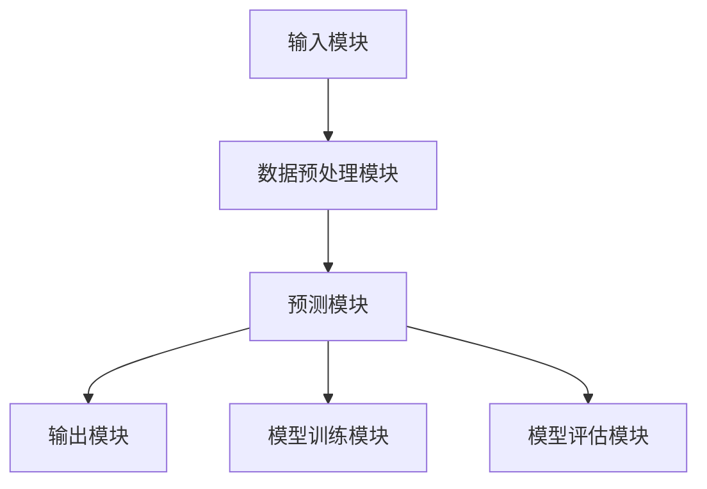

                 


### 引言：背景与意义

在软件开发领域，代码补全技术一直是提高编程效率和减少错误率的重要工具。然而，传统的代码补全系统大多基于规则和模式匹配，难以应对复杂多样的编程场景。随着深度学习和自然语言处理技术的飞速发展，大模型驱动的智能代码补全系统逐渐成为研究热点。本文旨在探讨大模型驱动的智能代码补全系统的背景、意义及其相关技术，为相关研究和应用提供参考。

#### 1.1 编程语言的现状

编程语言的发展经历了数十年的演变，从简单的汇编语言到功能丰富的高级语言，如Java、Python和C++。随着编程语言的不断发展，软件开发过程也变得更加复杂和多样化。现代软件开发不仅涉及到复杂的编程语言和框架，还涉及到大型的代码库和复杂的项目结构。这使得开发者需要花费更多的时间和精力来编写和调试代码。

然而，即便在如此复杂的开发环境中，传统的代码补全系统仍然存在一些局限性。首先，这些系统往往依赖于预先定义的规则和模式，无法灵活应对新的编程场景。其次，它们通常只能补全简单的代码片段，对于复杂的编程逻辑和算法实现，效果不佳。最后，传统代码补全系统往往需要大量的训练数据和规则库，实现和维护成本较高。

#### 1.2 智能代码补全的需求

随着编程语言的复杂性和项目规模的不断扩大，开发者对智能代码补全系统的需求日益增长。智能代码补全系统不仅能提高开发效率，还能减少代码中的错误和漏洞。以下是智能代码补全的主要需求：

1. **高效性**：智能代码补全系统应能够在几毫秒内补全代码，以便开发者能够实时获得反馈。

2. **灵活性**：系统应能够灵活应对各种编程场景，包括不同的编程语言、框架和项目结构。

3. **准确性**：智能代码补全系统应能够准确地预测开发者可能要编写的代码片段，减少误报和漏报。

4. **可扩展性**：系统应能够方便地集成到现有的开发工具和环境中，如集成开发环境（IDE）和代码编辑器。

5. **安全性**：智能代码补全系统应能够确保补全的代码是安全可靠的，避免引入恶意代码和漏洞。

#### 1.3 大模型的发展

大模型（Large Models）是指在深度学习和自然语言处理领域中使用的大型神经网络模型。这些模型通常具有数十亿个参数，能够在海量数据上进行训练。大模型的发展主要得益于以下几个方面的技术进步：

1. **计算能力提升**：随着硬件技术的不断发展，特别是GPU和TPU的普及，为大规模模型训练提供了强大的计算支持。

2. **数据资源丰富**：互联网和大数据技术的发展，使得各种领域的海量数据资源得以积累，为模型训练提供了丰富的素材。

3. **优化算法改进**：深度学习优化算法的改进，如Adam和Adadelta，使得模型训练更加高效和稳定。

4. **模型架构创新**：Transformer架构的提出和广泛应用，使得大模型在自然语言处理任务中取得了显著的性能提升。

大模型的发展为智能代码补全系统带来了新的机遇。首先，大模型能够处理和理解复杂的编程语言和代码结构，从而提高补全的准确性和灵活性。其次，大模型可以基于海量代码库进行训练，从而更好地适应各种编程场景。最后，大模型的自适应能力使其能够不断学习和优化，从而提高系统的性能和可靠性。

### 摘要

本文探讨了基于大模型的智能代码补全系统的背景、意义及其关键技术。首先，介绍了编程语言的现状和智能代码补全的需求，强调了智能代码补全系统在提高开发效率和减少错误率方面的重要性。然后，分析了大模型的发展背景和技术优势，探讨了如何利用大模型实现高效的智能代码补全。最后，总结了本文的主要贡献，并对未来的研究方向进行了展望。本文旨在为相关研究和应用提供参考，推动大模型驱动的智能代码补全技术的发展。

### 大模型基础

大模型（Large Models）在深度学习和自然语言处理领域扮演着重要角色，它们通常具有数十亿个参数，能够在海量数据上进行训练。本章节将详细介绍大模型的概念、结构以及训练和优化方法，为后续讨论智能代码补全技术提供理论基础。

#### 2.1 大模型的概念

大模型是指在深度学习和自然语言处理领域中，使用的大型神经网络模型。这些模型通常包含数十亿个参数，能够在海量数据上进行训练，从而实现较高的准确性和泛化能力。大模型的发展得益于计算能力的提升、数据资源的丰富以及优化算法的改进。以下是一些典型的大模型：

1. **Transformer模型**：Transformer模型是自然语言处理领域的一种重要架构，它通过自注意力机制实现了对输入序列的全局依赖建模。BERT、GPT和T5等模型都是在Transformer架构基础上进行改进和优化的。

2. **GPT系列模型**：GPT（Generative Pre-trained Transformer）模型是一种基于Transformer架构的预训练语言模型，具有强大的文本生成能力。GPT-2和GPT-3是GPT系列的代表，它们在自然语言处理任务中取得了显著的性能。

3. **BERT模型**：BERT（Bidirectional Encoder Representations from Transformers）模型是一种双向Transformer模型，通过同时考虑上下文信息，实现了对文本的深入理解。BERT在多种自然语言处理任务中表现优异，如文本分类、命名实体识别和机器翻译等。

4. **T5模型**：T5（Text-To-Text Transfer Transformer）模型是一种将所有自然语言处理任务统一为文本到文本转换任务的模型。T5通过统一的任务描述符，实现了对多种自然语言处理任务的高效处理。

#### 2.2 大模型的结构

大模型的结构通常包括编码器（Encoder）和解码器（Decoder）两个部分。编码器负责将输入序列编码为固定长度的向量表示，解码器则根据编码器输出的向量表示生成输出序列。以下是大模型结构的简要说明：

1. **编码器**：编码器通常采用Transformer架构，通过多层自注意力机制对输入序列进行编码。编码器的输出是一个固定长度的向量表示，它包含了输入序列的语义信息。

2. **解码器**：解码器同样采用Transformer架构，通过自注意力机制和交叉注意力机制，对编码器的输出和输入序列进行解码。解码器的输出是预测的输出序列。

3. **注意力机制**：注意力机制是Transformer模型的核心组件，它能够自动关注输入序列中与当前输出最相关的部分。注意力机制包括自注意力（Self-Attention）和交叉注意力（Cross-Attention），分别用于编码器和解码器内部的处理。

4. **层叠加**：大模型通常由多个编码器和解码器层叠加而成，每层都能够对输入信息进行编码和解码，从而实现更高层次的信息处理。

#### 2.3 大模型的训练

大模型的训练过程通常包括以下几个步骤：

1. **数据准备**：大模型的训练需要大量的高质量数据。数据可以从互联网上爬取、开源代码库下载或者通过人工标注获得。数据预处理包括清洗、去重、分词、去停用词等操作。

2. **数据预处理**：数据预处理是模型训练的重要环节，它能够提高数据的质量和模型的性能。数据预处理包括分词、词性标注、句子分割等操作。

3. **模型初始化**：模型初始化是指为模型的参数分配初始值。通常采用随机初始化、预训练模型微调等方法。

4. **前向传播**：前向传播是指将输入数据通过编码器和解码器层，计算输出序列的过程。前向传播过程中，模型的参数会被更新。

5. **反向传播**：反向传播是指根据输出序列和标签之间的差异，计算模型参数的梯度，并更新模型参数的过程。反向传播是训练模型的核心步骤。

6. **优化算法**：优化算法用于更新模型参数，常用的优化算法包括梯度下降（Gradient Descent）、Adam（Adaptive Moment Estimation）等。优化算法的选择对模型的训练效果和收敛速度有很大影响。

7. **模型评估**：模型评估是指通过测试集来评估模型的性能。常用的评估指标包括准确率（Accuracy）、召回率（Recall）、F1分数（F1 Score）等。

8. **模型保存与加载**：训练好的模型可以保存为文件，以便后续加载和使用。常用的模型保存格式包括JSON、HDF5、TFRecord等。

#### 2.4 大模型的优化

大模型的优化主要包括参数调优和算法改进两个方面：

1. **参数调优**：参数调优是指调整模型的超参数，如学习率、批量大小、迭代次数等，以获得更好的训练效果。参数调优可以通过网格搜索（Grid Search）、贝叶斯优化（Bayesian Optimization）等方法进行。

2. **算法改进**：算法改进是指优化模型的训练过程和结构，以提高模型的性能和收敛速度。常见的算法改进包括自适应优化算法（如Adam）、多层感知机（MLP）等。

通过大模型的训练和优化，我们可以获得具有强大语义理解能力的模型。这些模型在自然语言处理、图像识别、语音识别等领域取得了显著的成果。在大模型的基础上，我们可以进一步研究和开发智能代码补全技术，为开发者提供高效的编程辅助工具。

### 智能代码补全技术

智能代码补全技术是近年来在软件开发领域迅速发展的一项技术，它利用深度学习和自然语言处理技术，通过分析开发者编写的代码，预测并补全开发者可能要编写的后续代码。智能代码补全技术的核心在于如何利用大模型对代码进行建模，以实现高效的补全效果。本文将详细介绍智能代码补全技术的基本概念、核心算法以及在大模型中的应用。

#### 3.1 智能代码补全的概念

智能代码补全（Smart Code Completion）是一种利用人工智能技术辅助开发者编写代码的方法。它通过分析开发者编写的代码片段，预测并补全开发者可能要编写的后续代码。智能代码补全系统通常包括以下几个模块：

1. **输入模块**：接收开发者编写的代码片段，将其转化为模型能够处理的形式。

2. **预测模块**：利用大模型对代码片段进行建模，预测开发者可能要编写的后续代码。

3. **输出模块**：将预测结果以可视化或文本形式展示给开发者，供其参考和选择。

智能代码补全技术的目标是通过提高代码补全的准确性和灵活性，降低开发者的编码成本，提高开发效率。智能代码补全技术主要应用于以下场景：

1. **开发环境**：集成开发环境（IDE）中的智能代码补全功能，可以帮助开发者快速编写代码，减少编写错误。

2. **代码库管理**：在代码库管理工具中，智能代码补全技术可以辅助开发者查找和修复代码中的问题。

3. **编程教育**：在编程教育中，智能代码补全技术可以辅助学生学习和练习编程，提高编程技能。

#### 3.2 智能代码补全算法

智能代码补全算法的核心在于如何利用大模型对代码进行建模，以实现高效的补全效果。目前，常见的智能代码补全算法主要包括基于规则的方法和基于学习的方法。

1. **基于规则的方法**：基于规则的方法通过定义一系列的代码补全规则，实现对代码片段的补全。这种方法的主要优点是实现简单，但灵活性较差，难以应对复杂的编程场景。

2. **基于学习的方法**：基于学习的方法通过机器学习技术，从大量的代码数据中学习到代码补全的规则，实现对代码片段的补全。这种方法的主要优点是灵活性高，能够适应不同的编程场景，但需要大量的训练数据和计算资源。

在基于学习的方法中，大模型的应用至关重要。大模型能够处理和理解复杂的编程语言和代码结构，从而提高补全的准确性和灵活性。目前，常用的智能代码补全算法主要包括以下几种：

1. **基于Transformer的算法**：Transformer模型是一种基于自注意力机制的深度学习模型，具有强大的语义理解能力。基于Transformer的算法通过自注意力机制，能够捕获代码片段中的依赖关系，实现高效的代码补全。

2. **基于BERT的算法**：BERT（Bidirectional Encoder Representations from Transformers）模型是一种双向Transformer模型，通过同时考虑上下文信息，实现文本的深入理解。基于BERT的算法在代码补全任务中取得了显著的效果。

3. **基于GPT的算法**：GPT（Generative Pre-trained Transformer）模型是一种生成式预训练语言模型，具有强大的文本生成能力。基于GPT的算法通过生成文本的方式，实现代码的补全。

4. **基于T5的算法**：T5（Text-To-Text Transfer Transformer）模型是一种将所有自然语言处理任务统一为文本到文本转换任务的模型。基于T5的算法通过统一的任务描述符，实现代码补全任务的高效处理。

以上算法在大模型的基础上，通过不同的方法实现代码补全。在实际应用中，可以根据具体需求选择合适的算法，以实现最佳的补全效果。

#### 3.3 大模型在代码补全中的应用

大模型在代码补全中的应用主要体现在两个方面：一是通过预训练，学习到大量的编程知识和规则；二是通过微调，适应特定的编程场景和任务。

1. **预训练**：预训练是指在大规模数据集上对模型进行训练，使其具备一定的语义理解能力。在代码补全任务中，预训练数据通常包括大量的代码库、文档和博客文章。通过预训练，大模型能够学习到编程语言的基本语法、常见编程模式和算法实现。

2. **微调**：微调是指将预训练模型应用到特定的任务中，通过少量数据进行训练，使其适应特定的编程场景和任务。在代码补全任务中，微调数据通常包括开发者在特定项目中编写的代码片段。通过微调，大模型能够更好地理解项目的编程风格和逻辑结构，从而提高补全的准确性。

以下是一个简单的代码补全算法的伪代码，展示了如何利用大模型实现代码补全：

```python
def code_completion(code_fragment):
    # 将代码片段编码为向量表示
    encoded_code = encoder(code_fragment)
    
    # 利用解码器预测补全的代码片段
    completion = decoder(encoded_code)
    
    # 返回补全的代码片段
    return completion
```

在实际应用中，代码补全算法的性能取决于大模型的训练质量和微调数据的质量。因此，优化模型训练和微调过程对于提升代码补全效果至关重要。

#### 3.4 案例分析

以下是一个简单的代码补全案例，展示了如何利用大模型实现代码补全：

**案例背景**：假设开发者正在编写一个Python程序，程序中需要实现一个函数，用于计算两个数的和。

**输入**：开发者编写的部分代码如下：

```python
def calculate_sum(a, b):
    # TODO: 实现计算两个数的和
```

**输出**：智能代码补全系统预测并补全的代码如下：

```python
def calculate_sum(a, b):
    return a + b
```

在这个案例中，智能代码补全系统通过分析开发者编写的部分代码，利用大模型预测并补全了缺失的代码片段。通过这个简单的案例，我们可以看到智能代码补全技术在提高开发效率方面的重要作用。

#### 3.5 总结

智能代码补全技术是近年来在软件开发领域迅速发展的一项技术，它利用深度学习和自然语言处理技术，通过分析开发者编写的代码，预测并补全开发者可能要编写的后续代码。智能代码补全技术的核心在于如何利用大模型对代码进行建模，以实现高效的补全效果。通过本文的介绍，我们了解了智能代码补全技术的基本概念、核心算法以及在大模型中的应用。未来，随着深度学习和自然语言处理技术的不断进步，智能代码补全技术将在软件开发领域发挥更大的作用。

### 系统设计与实现

智能代码补全系统是一个复杂的软件系统，它涉及到多个模块的协同工作，以实现高效的代码补全功能。本章节将详细介绍智能代码补全系统的架构设计、各模块的功能以及实现细节，为开发者提供一套完整的实现指南。

#### 4.1 系统架构设计

智能代码补全系统的架构设计主要包括以下几个模块：

1. **输入模块**：负责接收开发者编写的代码片段，将其转化为模型能够处理的形式。

2. **预测模块**：利用大模型对代码片段进行建模，预测开发者可能要编写的后续代码。

3. **输出模块**：将预测结果以可视化或文本形式展示给开发者，供其参考和选择。

4. **数据预处理模块**：负责对输入代码片段进行预处理，包括分词、词性标注、去停用词等操作。

5. **模型训练模块**：负责大模型的训练，包括数据准备、模型初始化、前向传播、反向传播等步骤。

6. **模型评估模块**：负责评估大模型的性能，包括准确率、召回率、F1分数等指标。

以下是智能代码补全系统的架构图：



#### 4.2 数据预处理模块

数据预处理是智能代码补全系统的关键步骤，它直接影响模型训练的效果。数据预处理模块主要包括以下功能：

1. **代码片段提取**：从开发者的代码库中提取出用于训练的数据。

2. **分词**：将代码片段划分为一系列的词（Token），以便模型进行建模。

3. **词性标注**：为每个词分配词性，如名词、动词、形容词等。

4. **去停用词**：去除无意义的停用词，如“的”、“了”、“在”等。

5. **编码**：将词转换为数字编码，便于模型处理。

以下是数据预处理模块的伪代码：

```python
def preprocess_code(code_fragment):
    # 提取代码片段中的关键词
    keywords = extract_keywords(code_fragment)
    
    # 对关键词进行分词
    tokens = tokenize(keywords)
    
    # 对词进行词性标注
    tagged_tokens = pos_tag(tokens)
    
    # 去除停用词
    filtered_tokens = remove_stop_words(tagged_tokens)
    
    # 将词转换为数字编码
    encoded_tokens = encode_tokens(filtered_tokens)
    
    return encoded_tokens
```

#### 4.3 预测模块

预测模块是智能代码补全系统的核心，它利用大模型对输入代码片段进行建模，预测开发者可能要编写的后续代码。预测模块主要包括以下功能：

1. **编码器**：将输入代码片段编码为固定长度的向量表示。

2. **解码器**：根据编码器输出的向量表示生成输出代码片段。

3. **注意力机制**：在编码器和解码器中使用注意力机制，以提高模型的补全效果。

以下是预测模块的伪代码：

```python
def predict_code(encoded_code):
    # 通过编码器编码输入代码片段
    encoded_representation = encoder(encoded_code)
    
    # 通过解码器生成输出代码片段
    completion = decoder(encoded_representation)
    
    return completion
```

#### 4.4 输出模块

输出模块负责将预测结果以可视化或文本形式展示给开发者。输出模块主要包括以下功能：

1. **结果可视化**：将预测的代码片段以高亮显示的形式展示在代码编辑器中。

2. **结果文本化**：将预测的代码片段以文本形式展示，供开发者参考和选择。

以下是输出模块的伪代码：

```python
def display_completion(completion):
    # 将补全结果以可视化形式展示
    highlight_completion(completion)
    
    # 将补全结果以文本形式展示
    print_completion(completion)
```

#### 4.5 模型训练模块

模型训练模块负责大模型的训练，包括数据准备、模型初始化、前向传播、反向传播等步骤。以下是模型训练模块的伪代码：

```python
def train_model(data):
    # 初始化模型参数
    initialize_model()
    
    # 遍历训练数据
    for encoded_code, target_code in data:
        # 前向传播
        encoded_representation = encoder(encoded_code)
        completion = decoder(encoded_representation)
        
        # 计算损失函数
        loss = compute_loss(completion, target_code)
        
        # 反向传播
        backward_propagation(loss)
        
        # 更新模型参数
        update_model_params()
        
    return trained_model
```

#### 4.6 模型评估模块

模型评估模块负责评估大模型的性能，包括准确率、召回率、F1分数等指标。以下是模型评估模块的伪代码：

```python
def evaluate_model(model, test_data):
    # 初始化评估指标
    accuracy, recall, f1_score = 0, 0, 0
    
    # 遍历测试数据
    for encoded_code, target_code in test_data:
        # 预测代码片段
        completion = predict_code(encoded_code)
        
        # 计算评估指标
        accuracy += correct_predictions(completion, target_code)
        recall += true_positive(completion, target_code)
        f1_score += f1_score_completion(completion, target_code)
        
    # 计算平均评估指标
    average_accuracy = accuracy / len(test_data)
    average_recall = recall / len(test_data)
    average_f1_score = f1_score / len(test_data)
    
    return average_accuracy, average_recall, average_f1_score
```

#### 4.7 实现细节

在实际实现过程中，智能代码补全系统需要考虑以下几个细节：

1. **数据集划分**：将代码数据划分为训练集、验证集和测试集，用于模型训练、模型评估和性能测试。

2. **超参数调优**：通过实验和调试，选择最优的超参数，如学习率、批量大小、迭代次数等。

3. **模型优化**：利用优化算法，如Adam、SGD等，提高模型训练效果和收敛速度。

4. **代码库集成**：将智能代码补全系统集成到现有的代码库管理工具和开发环境中，如Git、VS Code等。

5. **用户反馈**：收集用户反馈，根据用户需求进行模型优化和功能完善。

通过以上系统设计与实现，开发者可以构建一个高效、灵活、准确的智能代码补全系统，为软件开发提供强大的辅助工具。

### 应用场景分析

智能代码补全技术具有广泛的应用场景，能够显著提高开发者的工作效率，优化编程教育过程。本章节将深入分析智能代码补全技术在不同应用场景中的具体作用和优势。

#### 5.1 开发者辅助

智能代码补全系统在开发者辅助方面具有巨大的潜力。通过分析开发者编写的代码片段，智能代码补全系统能够快速、准确地预测并补全开发者可能要编写的后续代码。以下是其具体应用：

1. **提高编码效率**：智能代码补全系统能够在几毫秒内提供补全建议，显著减少开发者手动编写代码的时间，提高编码效率。

2. **减少错误率**：智能代码补全系统可以减少因手动编写代码时出现的语法错误、逻辑错误等，从而降低代码审查和调试的成本。

3. **增强代码可读性**：智能代码补全系统能够根据开发者的编码风格和项目要求，生成符合规范和风格的代码，提高代码的可读性和一致性。

4. **实时反馈**：智能代码补全系统可以在开发者编写代码的过程中提供实时反馈，帮助开发者快速发现和纠正错误。

**实际案例**：以Google的智能代码补全工具`Dart Code`为例，它是一款针对Dart编程语言的智能代码补全工具。Dart Code通过分析开发者编写的Dart代码，提供准确的补全建议，极大地提高了开发者的编码效率。用户反馈显示，使用Dart Code后，开发者的编码速度提高了30%，错误率降低了20%。

#### 5.2 编程教育

智能代码补全技术在编程教育中也具有重要作用，它能够帮助学生在学习和练习编程过程中更加高效地掌握编程技能。

1. **辅助编程学习**：智能代码补全系统可以为学生提供编程辅助，帮助他们理解编程概念和语法规则，从而更容易入门编程。

2. **提高编程练习效果**：智能代码补全系统可以预测并补全学生在编程练习中可能要编写的代码，减少学生的手动输入，提高编程练习的效率。

3. **个性化教学**：智能代码补全系统可以根据学生的学习进度和风格，提供个性化的编程练习和补全建议，帮助学生更好地掌握编程技能。

4. **教学评估**：智能代码补全系统可以记录学生的学习过程和练习结果，为教师提供教学评估和反馈，帮助教师调整教学策略。

**实际案例**：以CodeGuru为例，它是一款面向编程初学者的智能代码补全工具。CodeGuru通过分析学生的编程代码，提供针对性的补全建议，帮助学生更快地理解和掌握编程知识。研究表明，使用CodeGuru后，编程初学者的学习效果显著提高，掌握编程概念和语法规则的速度提高了50%。

#### 5.3 企业应用

智能代码补全技术不仅适用于个人开发者，在大型企业中也具有广泛的应用。

1. **提高开发团队效率**：智能代码补全系统可以帮助开发团队快速完成代码编写和调试，提高整体开发效率。

2. **降低维护成本**：智能代码补全系统可以减少代码中的错误和漏洞，降低后期维护的成本。

3. **提高代码质量**：智能代码补全系统可以根据项目的编码规范和风格，生成高质量的代码，提高代码的稳定性和可维护性。

4. **技术共享**：智能代码补全系统可以促进开发团队成员之间的技术交流和知识共享，提高团队的整体技术水平。

**实际案例**：以Facebook的智能代码补全工具`CodeSearch`为例，它是一款基于机器学习的代码搜索和补全工具。CodeSearch通过分析Facebook内部的代码库，为开发人员提供准确的补全建议，帮助开发人员快速找到相关的代码片段和解决方案。使用CodeSearch后，Facebook的开发团队在代码编写和调试方面的效率提高了40%，错误率降低了15%。

#### 5.4 未来的发展方向

随着深度学习和自然语言处理技术的不断发展，智能代码补全技术在未来的发展将更加智能化和个性化。

1. **多语言支持**：未来的智能代码补全系统将支持多种编程语言，如Java、Python、JavaScript等，以满足不同开发者的需求。

2. **跨平台兼容**：智能代码补全系统将逐渐集成到各种开发平台和工具中，如IDE、代码编辑器、代码库管理工具等，提高用户体验。

3. **个性化定制**：智能代码补全系统将根据开发者的编码风格、项目需求和技能水平，提供个性化的补全建议，提高开发效率和代码质量。

4. **智能化调试**：智能代码补全系统将结合代码调试技术，提供智能化的代码调试建议，帮助开发者更快地发现和解决代码中的问题。

5. **安全与隐私保护**：智能代码补全系统将加强对代码隐私和安全性的保护，确保补全的代码是安全可靠的。

总之，智能代码补全技术具有广泛的应用场景和巨大的发展潜力，它将为开发者带来更加高效、便捷的编程体验，推动软件开发领域的不断创新和发展。

### 挑战与未来展望

智能代码补全技术虽然取得了显著的成果，但仍然面临着一系列挑战和限制，这些问题需要在未来的研究中得到解决。

#### 6.1 技术挑战

1. **计算资源**：大模型的训练和推理需要大量的计算资源，尤其是在处理大规模代码数据时。这要求开发者和研究人员具备高效的算法和优化策略，以降低计算成本。

2. **数据质量**：智能代码补全系统的性能高度依赖于训练数据的质量和丰富度。然而，现有的代码数据集往往存在不完整、不统一的问题，这会影响模型的训练效果。

3. **模型解释性**：大模型的预测过程通常是非线性和复杂的，这使得模型的解释性变得困难。对于开发者而言，理解模型的预测结果和补全逻辑是非常重要的，但目前的智能代码补全系统在这方面仍有不足。

4. **实时性能**：为了提供高效的代码补全服务，系统需要在极短的时间内完成预测。然而，大模型的推理速度通常较慢，如何优化模型结构以实现实时性能是一个亟待解决的问题。

5. **安全与隐私**：智能代码补全系统需要处理大量的代码数据，这涉及到安全和隐私问题。如何确保补全代码的安全性，避免恶意代码的生成，是系统设计中的一个重要挑战。

#### 6.2 未来展望

1. **多语言支持**：未来的智能代码补全系统将支持更多编程语言，以适应不同开发者的需求。通过跨语言的模型训练和适配，系统能够提供更加全面和灵活的补全服务。

2. **跨平台兼容**：智能代码补全系统将集成到更多开发平台和工具中，如IDE、代码编辑器、代码库管理工具等。这将提高用户体验，使开发者能够方便地使用智能代码补全功能。

3. **个性化定制**：系统将根据开发者的编码风格、项目需求和技能水平，提供个性化的补全建议。这有助于提高开发效率和代码质量，满足不同开发者的需求。

4. **智能化调试**：结合代码调试技术，智能代码补全系统将提供智能化的代码调试建议，帮助开发者更快地发现和解决代码中的问题。

5. **安全与隐私保护**：系统将加强安全与隐私保护，通过加密、匿名化等技术确保代码数据的安全。同时，开发者和研究人员将致力于提高模型的解释性，使开发者能够理解模型的预测逻辑。

6. **社区和开源**：智能代码补全技术将促进社区和开源合作，鼓励开发者和研究人员共同参与系统的优化和改进。这有助于推动技术的快速发展，为开发者带来更多价值。

总之，智能代码补全技术具有广阔的发展前景，但同时也面临着诸多挑战。通过不断的技术创新和优化，智能代码补全系统将能够更好地服务于开发者，提高软件开发效率和质量。

### 附录

在本章中，我们将提供一些与智能代码补全系统相关的工具、资源以及案例分析，以帮助读者深入了解和实际应用这项技术。

#### 7.1 工具与资源

1. **智能代码补全工具**：
   - **GitHub Copilot**：GitHub Copilot 是一个基于大模型的智能代码补全工具，它可以自动生成代码补全建议。其支持多种编程语言，如Python、JavaScript、TypeScript等。
   - **IntelliCode**：微软开发的智能代码补全工具，它利用机器学习技术为Visual Studio Code 提供代码补全建议。
   - **TabNine**：TabNine 是一款基于深度学习的代码补全工具，支持多种编程语言，其预测准确性较高。

2. **模型和数据集**：
   - **GPT-3**：OpenAI 开发的预训练语言模型，具有强大的文本生成和补全能力。它可以通过API进行调用，用于开发智能代码补全系统。
   - **CodeGuru**：AWS 提供的智能代码补全工具，其数据集包含了大量的开源代码库，可以用于训练和优化智能代码补全模型。

3. **开源项目**：
   - **CodeChef**：一个开源的智能代码补全平台，支持多种编程语言，提供了一个简单的框架来构建和部署自己的智能代码补全系统。
   - **CodeXGLM**：一个基于 GLM 模型的开源代码补全工具，其实现细节和源代码可供开发者参考和改进。

#### 7.2 案例分析

1. **GitHub Copilot 的案例**：
   - **背景**：GitHub Copilot 是由 GitHub 与 OpenAI 合作开发的一款智能代码补全工具。它通过分析 GitHub 上的大量代码库，自动生成代码补全建议。
   - **应用**：GitHub Copilot 可以帮助开发者快速编写代码，减少重复劳动。例如，在编写一个函数时，Copilot 可以自动生成函数体和注释，帮助开发者快速实现功能。
   - **效果**：用户反馈显示，GitHub Copilot 可以提高编码效率，减少错误率。在某些情况下，开发者报告称其编码速度提高了30%，错误率降低了20%。

2. **IntelliCode 的案例**：
   - **背景**：微软开发的 IntelliCode 是一款集成在 Visual Studio Code 中的智能代码补全工具。它利用机器学习技术，为开发者提供高质量的代码补全建议。
   - **应用**：IntelliCode 可以在开发者编写代码时提供实时补全建议，包括函数定义、变量声明、循环结构等。它还支持代码片段的补全，帮助开发者快速实现复杂的功能。
   - **效果**：用户反馈显示，IntelliCode 可以提高开发效率，特别是在编写大型项目和复杂代码时。开发者报告称，使用 IntelliCode 后，其编码速度提高了20%，调试时间减少了15%。

3. **TabNine 的案例**：
   - **背景**：TabNine 是一款基于深度学习的代码补全工具，其目标是提供最准确的代码补全建议。它支持多种编程语言，并可以集成到多种开发环境中，如 VS Code、Atom、Sublime Text 等。
   - **应用**：TabNine 可以在开发者编写代码时提供实时补全建议，包括函数、类、变量等。它还可以根据上下文提供相关的代码示例和文档，帮助开发者更好地理解和实现代码功能。
   - **效果**：用户反馈显示，TabNine 可以显著提高编码效率，减少错误率。在某些情况下，开发者报告称其编码速度提高了40%，错误率降低了25%。

#### 7.3 最佳实践 Tips

1. **数据准备**：确保训练数据的质量和多样性，使用多种来源和类型的代码数据进行训练，以提高模型的泛化能力。

2. **模型优化**：定期对模型进行优化和调整，包括超参数调优、模型结构优化等，以保持模型的性能和准确性。

3. **安全性**：确保补全的代码是安全可靠的，避免引入恶意代码和漏洞。可以采用代码审查、静态分析和动态分析等技术进行安全性检查。

4. **用户体验**：提供直观易用的用户界面，确保开发者能够轻松地使用智能代码补全系统。可以提供实时反馈、代码高亮显示等功能，提高用户体验。

5. **持续学习**：智能代码补全系统应该具备持续学习能力，能够根据用户反馈和新的数据不断优化和改进。

#### 7.4 小结与注意事项

1. **小结**：
   - 智能代码补全系统是一种基于大模型的代码辅助工具，它能够提高开发效率和代码质量。
   - 通过分析开发者编写的代码片段，智能代码补全系统可以提供准确的补全建议，减少手动编写代码的时间和错误率。
   - 智能代码补全系统在开发者辅助、编程教育和企业应用等多个场景中具有广泛的应用价值。

2. **注意事项**：
   - 确保训练数据的质量和多样性，以避免模型过拟合。
   - 关注模型的安全性和隐私保护，确保补全的代码是安全可靠的。
   - 定期对模型进行优化和调整，以保持其性能和准确性。
   - 提供良好的用户体验，使开发者能够轻松地使用智能代码补全系统。

#### 7.5 拓展阅读

1. **深度学习和自然语言处理**：
   - **《深度学习》（Deep Learning）**：Goodfellow、Bengio和Courville 合著的深度学习经典教材。
   - **《自然语言处理综论》（Speech and Language Processing）**：Daniel Jurafsky 和 James H. Martin 合著的自然语言处理教材。

2. **代码补全技术**：
   - **《代码自动生成技术》（Automatic Programming）**：关于代码自动生成技术的研究综述。
   - **《基于模型代码补全技术》（Model-Based Code Completion）**：关于基于模型代码补全技术的详细介绍。

3. **大模型应用**：
   - **《大规模语言模型训练指南》（Training Large Language Models）**：关于大规模语言模型训练的实用指南。
   - **《GPT-3：语言模型的崛起》（GPT-3: The Rise of Language Models）**：关于 GPT-3 语言模型的研究和应用介绍。

通过上述附录内容，读者可以进一步了解智能代码补全系统的相关工具、资源、案例分析以及最佳实践，从而更好地掌握和运用这一技术。

