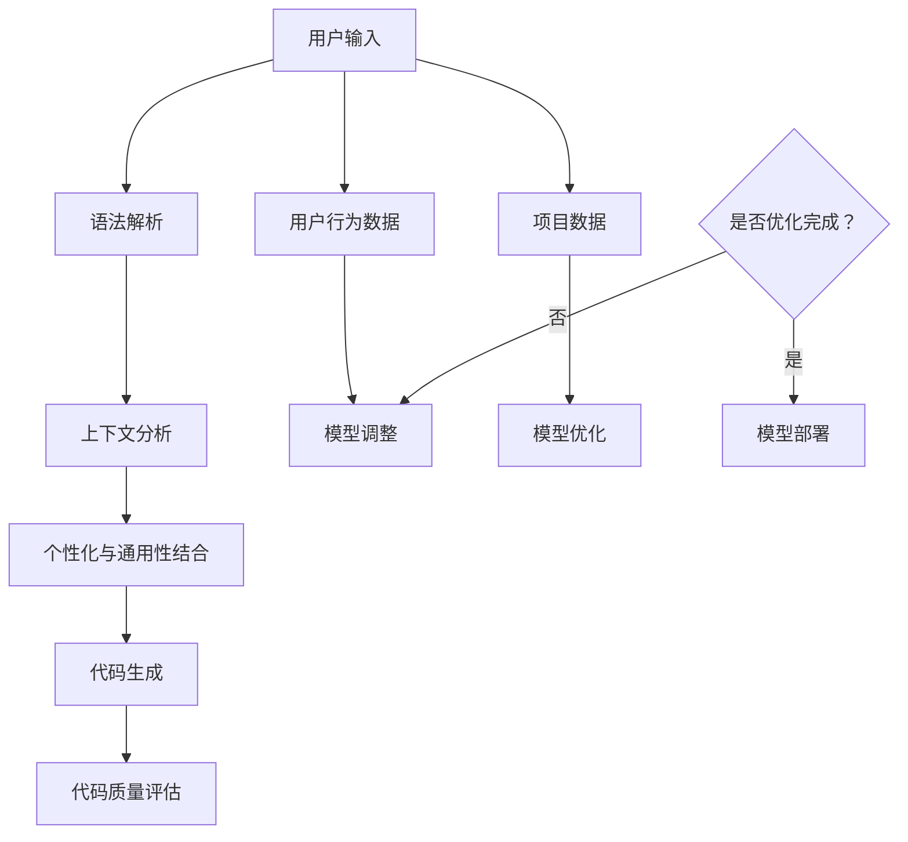

                 

# 文章标题: 大模型驱动的智能代码补全：个性化与通用性

> 关键词：大模型、智能代码补全、个性化、通用性、算法、项目实战

> 摘要：本文深入探讨了大模型驱动的智能代码补全技术，包括个性化与通用性两方面的应用。首先，介绍了大模型和智能代码补全的基本概念、发展历程以及在大模型中的应用。接着，详细阐述了个性化代码补全与通用性代码补全的原理、算法及其实现。最后，通过一个实际项目实战，展示了大模型驱动的智能代码补全技术在实际开发中的应用与未来展望。

## 目录大纲 - 《大模型驱动的智能代码补全：个性化与通用性》

1. **第一部分：大模型驱动的智能代码补全概述**

   - 第1章：引言与背景
     - 1.1 书籍主题与目标
     - 1.2 智能代码补全的发展历程
     - 1.3 大模型在智能代码补全中的应用
     - 1.4 个性化与通用性在大模型中的应用

   - 第2章：大模型基础
     - 2.1 大模型的基本概念
     - 2.2 大模型的架构
     - 2.3 大模型的工作原理
     - 2.4 大模型的发展趋势与挑战

   - 第3章：智能代码补全技术
     - 3.1 智能代码补全概述
     - 3.2 智能代码补全的关键技术
     - 3.3 智能代码补全的应用场景

   - 第4章：个性化代码补全
     - 4.1 个性化代码补全的基本原理
     - 4.2 个性化代码补全的算法
     - 4.3 个性化代码补全的案例分析

   - 第5章：通用性代码补全
     - 5.1 通用性代码补全的基本原理
     - 5.2 通用性代码补全的算法
     - 5.3 通用性代码补全的案例分析

   - 第6章：个性化与通用性的结合
     - 6.1 个性化与通用性的结合原理
     - 6.2 个性化与通用性结合的算法
     - 6.3 个性化与通用性结合的案例分析

   - 第7章：实际应用与未来展望
     - 7.1 智能代码补全在实际开发中的应用
     - 7.2 大模型驱动的智能代码补全的未来发展方向
     - 7.3 未来应用场景展望

2. **第二部分：大模型驱动的智能代码补全项目实战**

   - 第8章：项目实战
     - 8.1 项目背景与需求分析
     - 8.2 开发环境搭建
     - 8.3 数据预处理
     - 8.4 模型设计与训练
     - 8.5 个性化与通用性结合的实现
     - 8.6 项目评估与优化
     - 8.7 项目总结与反思

3. **附录**

   - 附录A：相关工具与资源
     - A.1 大模型开发工具
     - A.2 智能代码补全工具
     - A.3 实际应用案例链接

## 引言与背景

### 1.1 书籍主题与目标

随着人工智能技术的发展，大模型（如GPT-3、BERT等）在自然语言处理、图像识别等领域取得了显著的成果。与此同时，智能代码补全作为编程辅助工具，正逐渐受到开发者的关注。本文旨在探讨大模型驱动的智能代码补全技术，特别是在个性化与通用性两方面的应用。

本书的目标是：

1. **深入解析大模型驱动的智能代码补全技术**：从理论基础到实际应用，全面介绍大模型和智能代码补全的相关知识。
2. **探讨个性化与通用性在智能代码补全中的应用**：分析个性化代码补全与通用性代码补全的原理、算法及实现。
3. **提供实际项目实战经验**：通过一个完整的案例，展示大模型驱动的智能代码补全技术在实际开发中的应用。

### 1.2 智能代码补全的发展历程

智能代码补全技术的发展可以追溯到早期编程辅助工具，如自动补全和代码建议。随着自然语言处理技术的发展，智能代码补全逐渐融合了自然语言处理、机器学习和深度学习等先进技术。

早期的智能代码补全主要依赖于规则和模式匹配。这些方法依赖于静态的编程语言规则和模式库，能够在一定程度上提供代码补全功能，但存在以下局限性：

1. **无法处理复杂的编程任务**：规则和模式匹配方法难以应对复杂的编程任务，如代码重构、代码优化等。
2. **缺乏灵活性**：无法根据用户习惯和项目需求进行个性化调整。
3. **难以应对动态变化**：在编程过程中，代码的结构和功能可能发生变化，传统的智能代码补全方法难以适应。

随着深度学习和自然语言处理技术的不断发展，大模型开始在智能代码补全领域发挥作用。大模型具有以下几个优势：

1. **强大的表达能力**：大模型能够捕捉编程语言的复杂结构和语义信息，为智能代码补全提供更强大的支持。
2. **灵活性和适应性**：大模型可以根据用户需求和项目特点进行个性化调整，提供更加符合用户预期的代码补全建议。
3. **处理动态变化**：大模型能够处理编程过程中的动态变化，如代码插入、删除和修改等。

大模型在智能代码补全中的应用，标志着智能代码补全技术进入了一个新的阶段。个性化与通用性在大模型中的应用，将进一步提升智能代码补全的效果和实用性。

### 1.3 大模型在智能代码补全中的应用

大模型在智能代码补全中的应用主要体现在两个方面：个性化代码补全和通用性代码补全。

#### 个性化代码补全

个性化代码补全旨在根据用户习惯、项目特点和代码风格，提供更加符合用户预期的代码补全建议。个性化代码补全的核心思想是基于用户数据和项目数据，对大模型进行训练和调整，使其能够更好地适应特定用户和项目的需求。

具体实现步骤如下：

1. **用户数据收集**：收集用户的编程行为数据，如键位频率、编辑模式、代码风格等。
2. **项目数据收集**：收集项目数据，如项目结构、代码库、历史版本等。
3. **数据预处理**：对用户数据和项目数据进行清洗和预处理，提取有用信息。
4. **模型训练**：使用预处理后的数据对大模型进行训练，调整模型参数，使其能够更好地理解用户和项目的需求。
5. **代码补全**：使用训练好的模型，根据用户输入的代码片段，生成个性化的代码补全建议。

#### 通用性代码补全

通用性代码补全旨在为所有用户和项目提供一致的、高质量的代码补全建议。通用性代码补全的核心思想是利用大规模数据集，对大模型进行预训练，使其具备一定的通用性和鲁棒性。

具体实现步骤如下：

1. **数据集准备**：收集大量的编程数据集，如GitHub、Stack Overflow等。
2. **数据预处理**：对数据集进行清洗、标注和预处理，提取有用的编程信息和语义信息。
3. **模型训练**：使用预处理后的数据集，对大模型进行预训练，使其具备一定的编程语言理解和生成能力。
4. **代码补全**：使用预训练好的模型，根据用户输入的代码片段，生成通用性的代码补全建议。

个性化代码补全和通用性代码补全各有优势。个性化代码补全能够更好地满足特定用户和项目的需求，但需要收集和处理大量的用户数据；通用性代码补全适用于所有用户和项目，但可能无法满足个性化的需求。在实际应用中，可以根据具体需求和场景，结合使用个性化代码补全和通用性代码补全，实现最优的代码补全效果。

### 1.4 个性化与通用性在大模型中的应用

个性化与通用性在大模型中的应用，不仅能够提升代码补全的效果和实用性，还能够拓展智能代码补全技术的应用场景。

#### 个性化应用

个性化应用主要体现在以下几个方面：

1. **提高开发效率**：根据用户习惯和项目需求，提供个性化的代码补全建议，减少手动编码时间，提高开发效率。
2. **降低学习成本**：对于新手开发者，通过个性化代码补全，可以快速熟悉编程语言和开发工具，降低学习成本。
3. **提升代码质量**：根据用户的代码风格和项目规范，提供高质量的代码补全建议，提高代码的可读性和可维护性。

#### 通用性应用

通用性应用主要体现在以下几个方面：

1. **跨平台支持**：通用性代码补全适用于不同的编程语言和开发平台，为开发者提供统一的编程体验。
2. **团队协作**：通用性代码补全可以促进团队协作，提高代码质量和开发效率。
3. **持续集成**：通用性代码补全可以在持续集成和持续交付过程中发挥作用，提高软件交付质量和效率。

#### 个性化与通用性的结合

在实际应用中，个性化与通用性可以相互结合，实现更好的效果。例如：

1. **个性化定制**：根据用户需求，为用户提供通用性的代码补全建议，并在必要时进行个性化调整。
2. **知识共享**：将通用性代码补全的经验和知识，分享给个性化代码补全，提升个性化代码补全的效果。
3. **动态调整**：在开发过程中，根据用户反馈和项目进展，动态调整个性化与通用性的比例，实现最佳效果。

总之，个性化与通用性在大模型中的应用，为智能代码补全技术带来了新的发展机遇。通过深入研究和实践，我们可以不断提升智能代码补全的效果和实用性，为开发者提供更加智能、高效的编程辅助工具。

### 1.5 小结

本文介绍了大模型驱动的智能代码补全技术，探讨了个性化与通用性在大模型中的应用。从发展历程、基本概念到实际应用，本文为读者提供了一个全面的视角，帮助理解大模型驱动的智能代码补全技术。

在接下来的章节中，我们将详细讨论大模型的基础知识、智能代码补全技术以及个性化与通用性代码补全的算法和实现。通过这些内容的深入学习，读者将能够更好地掌握大模型驱动的智能代码补全技术，并在实际项目中发挥作用。

### 第2章：大模型基础

在探讨大模型驱动的智能代码补全技术之前，有必要深入了解大模型的基本概念、架构、工作原理以及其发展趋势与挑战。这一章节将为我们提供必要的理论基础，帮助我们更好地理解和应用大模型驱动的智能代码补全技术。

#### 2.1 大模型的基本概念

大模型（Large-scale Model），顾名思义，是指具有大规模参数数量和复杂结构的机器学习模型。这些模型通过学习大量的数据，能够捕捉数据中的复杂模式和结构，从而在多种应用场景中表现出强大的性能。

大模型通常具有以下特点：

1. **大规模参数**：大模型的参数数量可以达到数十亿甚至数万亿级别。这些参数在模型训练过程中扮演着关键角色，能够捕捉数据中的细微变化和模式。
2. **深度架构**：大模型往往采用深度神经网络（Deep Neural Network）的架构，具有多层网络结构。这种结构使得模型能够处理大量的数据，并在训练过程中不断优化。
3. **端到端学习**：大模型通常采用端到端（End-to-End）的学习方式，直接从原始数据中学习目标输出，避免了传统机器学习中的特征工程和中间步骤。

大模型的分类可以基于其应用领域、架构设计、参数规模等多个维度。常见的几种大模型包括：

1. **自然语言处理模型**：如GPT-3、BERT、T5等，这些模型在文本生成、文本分类、机器翻译等自然语言处理任务中取得了显著成果。
2. **计算机视觉模型**：如ResNet、Inception、BERT-CV等，这些模型在图像分类、目标检测、语义分割等计算机视觉任务中表现出色。
3. **多模态模型**：如ViT、Speech2Text、Multimodal BERT等，这些模型能够处理多种类型的数据，如文本、图像、语音等，并在多模态任务中取得优异表现。

#### 2.2 大模型的架构

大模型的架构设计是模型性能的关键因素之一。通常，大模型采用深度神经网络架构，并包括以下几个主要组成部分：

1. **输入层（Input Layer）**：输入层接收外部输入数据，如文本、图像等。在大模型中，输入层通常通过预处理模块，对输入数据进行格式化和特征提取。
2. **隐藏层（Hidden Layers）**：隐藏层是深度神经网络的核心部分，负责数据的变换和特征提取。大模型通常包含多个隐藏层，每层通过非线性激活函数进行数据转换。
3. **输出层（Output Layer）**：输出层产生模型预测结果，如分类标签、文本生成等。输出层的设计取决于具体任务类型，如多分类任务通常使用softmax激活函数。
4. **参数层（Parameter Layer）**：参数层包含模型的权重和偏置，是模型训练过程中需要优化的目标。大模型的参数数量庞大，因此参数层的优化和存储是模型训练的关键挑战。

深度神经网络架构的设计需要考虑以下几个因素：

1. **网络层数**：增加网络层数可以增加模型的表达能力，但也会导致训练时间增加和过拟合风险。通常，层数在数十到数百之间取得较好的效果。
2. **网络宽度**：网络宽度（即每层的神经元数量）会影响模型的计算复杂度和训练时间。较宽的网络通常能够捕捉更多的特征信息，但训练成本较高。
3. **非线性激活函数**：常用的非线性激活函数包括ReLU、Sigmoid、Tanh等。这些函数能够引入模型的非线性特性，提高模型的拟合能力。

#### 2.3 大模型的工作原理

大模型的工作原理可以概括为以下几个步骤：

1. **数据预处理**：在训练和预测过程中，需要对输入数据进行预处理。预处理步骤包括数据清洗、数据标准化、数据增强等，以确保输入数据的可靠性和一致性。
2. **输入数据传递**：将预处理后的输入数据传递给模型的输入层。输入层通过预处理模块对数据进行格式化和特征提取，将数据转换为模型可处理的格式。
3. **隐藏层处理**：输入数据经过隐藏层处理后，会在每层产生一系列特征表示。这些特征表示通过逐层传递和变换，不断提取数据的深层特征信息。
4. **输出层生成**：最终，输出层根据隐藏层的特征表示，生成模型预测结果。对于分类任务，输出层通常通过softmax函数生成概率分布；对于文本生成任务，输出层则生成文本序列。
5. **损失函数计算**：将模型预测结果与真实标签进行比较，计算损失函数值。损失函数用于衡量模型预测的准确性，是模型训练过程中的优化目标。
6. **反向传播**：通过反向传播算法，将损失函数梯度传递回模型参数层，更新模型参数。这个过程通过多次迭代，逐步优化模型参数，使其更接近真实标签。
7. **模型评估与优化**：在训练过程中，定期对模型进行评估，如通过交叉验证、测试集评估等。评估结果用于调整模型参数和超参数，优化模型性能。

#### 2.4 大模型的发展趋势与挑战

大模型作为人工智能领域的重要研究方向，正面临一系列发展趋势和挑战。以下是几个值得关注的方向和挑战：

1. **模型规模与性能的提升**：随着计算能力的提升和数据规模的扩大，大模型的规模和性能也在不断提升。未来，将会有更多的大模型在多种应用场景中发挥作用。
2. **数据隐私与安全性**：大模型在训练过程中需要大量数据，但数据隐私和安全问题日益突出。如何在保证数据隐私的前提下，进行有效的模型训练和优化，是一个重要的研究方向。
3. **可解释性与可靠性**：大模型通常具有复杂的结构和参数，其预测结果的可解释性和可靠性受到广泛关注。如何提高模型的可解释性，使其更易于理解和应用，是一个重要的挑战。
4. **绿色计算与能耗优化**：大模型训练和部署过程需要大量的计算资源，能耗问题日益突出。如何优化大模型的计算效率和能耗，实现绿色计算，是未来的重要研究方向。
5. **模型压缩与优化**：为了在实际应用中部署大模型，需要对其参数和结构进行压缩和优化，降低模型的大小和计算复杂度。模型压缩与优化技术是实现大模型应用的关键。

#### 2.5 小结

大模型作为人工智能领域的重要研究方向，具有大规模参数、深度架构和端到端学习等特性。其工作原理包括数据预处理、隐藏层处理、输出层生成、损失函数计算和反向传播等步骤。大模型的发展趋势包括模型规模与性能的提升、数据隐私与安全性、可解释性与可靠性、绿色计算与能耗优化以及模型压缩与优化等方面。

在接下来的章节中，我们将继续探讨智能代码补全技术，特别是个性化与通用性代码补全的原理、算法及其实现。通过这些内容的深入学习，读者将能够更好地理解大模型驱动的智能代码补全技术，并在实际项目中应用。

### 第3章：智能代码补全技术

智能代码补全技术是现代编程辅助工具的重要组成部分，旨在通过自动化和智能化手段，提高开发者的编码效率和代码质量。本章节将介绍智能代码补全的基本概念、关键技术以及主要应用场景，帮助读者全面理解智能代码补全技术的工作原理和实际价值。

#### 3.1 智能代码补全概述

智能代码补全（Smart Code Completion）是指利用人工智能技术，根据用户输入的代码片段，自动生成可能的代码补全建议。智能代码补全的核心目标是减少手动编码工作量，提高编码效率，并确保代码质量和一致性。智能代码补全技术通常包含以下几个关键组成部分：

1. **语法解析**：语法解析是智能代码补全的基础，其目的是将用户输入的代码片段解析成抽象语法树（Abstract Syntax Tree，AST），以便于进一步分析和补全。
2. **上下文分析**：上下文分析是指根据代码片段的上下文环境，理解其语义和意图。上下文分析能够提高代码补全的准确性，避免生成无关或错误的代码补全建议。
3. **代码生成**：代码生成是指根据语法解析和上下文分析的结果，生成符合编程语言规范和项目需求的代码补全建议。代码生成过程通常涉及模板匹配、代码模板库和代码生成器等。
4. **用户反馈机制**：用户反馈机制是指收集用户对代码补全建议的反馈，用于优化和调整代码补全算法。用户反馈能够提高代码补全的个性化程度，使其更好地适应不同用户和项目的需求。

#### 3.2 智能代码补全的关键技术

智能代码补全技术涉及多个关键领域的技术，以下是对其中几种核心技术的详细介绍：

1. **语法解析技术**：
   - **抽象语法树（AST）**：抽象语法树是一种树形数据结构，用于表示程序代码的语法结构。通过语法解析，将用户输入的代码片段转化为AST，有助于进一步分析和补全。
   - **词法分析**：词法分析是将源代码字符串分解为一系列的词法单元（Token），如关键字、标识符、操作符等。词法分析是语法解析的基础，有助于构建AST。
   - **递归下降分析**：递归下降分析是一种自底向上的语法分析方法，通过递归调用解析规则，将词法单元逐步转换为AST节点。

2. **上下文分析技术**：
   - **词法糖**：词法糖（Lexer sugar）是指通过简单的文本替换规则，简化代码输入，提高上下文分析的准确性。例如，自动识别并替换常见的缩写和简写形式。
   - **上下文感知**：上下文感知是指根据代码片段的上下文环境，理解其语义和意图。上下文感知技术包括符号引用分析、类型推断、变量生命周期管理等。

3. **代码生成技术**：
   - **模板匹配**：模板匹配是指根据已定义的代码模板，匹配用户输入的代码片段，生成补全建议。模板匹配适用于简单的代码补全场景，但难以应对复杂的编程任务。
   - **代码生成器**：代码生成器（Code Generator）是一种基于语法解析和上下文分析的自动代码生成工具。代码生成器能够根据输入的代码片段和上下文信息，生成符合编程语言规范和项目需求的代码补全建议。

4. **用户反馈机制**：
   - **反馈收集**：通过用户交互界面，收集用户对代码补全建议的反馈，如选择、忽略或修改补全建议。
   - **反馈分析**：对收集到的用户反馈进行分析，识别代码补全算法的不足之处，并进行优化和调整。反馈分析可以采用机器学习、统计分析和用户行为分析等方法。

#### 3.3 智能代码补全的应用场景

智能代码补全技术在多个应用场景中具有广泛的应用，以下是一些典型的应用场景：

1. **集成开发环境（IDE）**：智能代码补全是现代IDE的核心功能之一，能够显著提高开发者的编码效率和代码质量。IDE中的智能代码补全工具通常包括语法检查、代码自动补全、代码模板等功能。
2. **代码审查与重构**：智能代码补全技术可以用于代码审查和重构，帮助开发者识别潜在的问题和改进空间。例如，通过分析代码片段的上下文环境，自动识别代码中的冗余、重复和错误，并提出改进建议。
3. **自动化测试**：智能代码补全技术可以用于自动化测试，生成测试用例和测试数据。通过分析代码片段的语法和语义，智能代码补全可以生成符合预期的输入和输出，用于测试代码的完整性和正确性。
4. **代码生成与模板化开发**：智能代码补全技术可以用于代码生成和模板化开发，根据用户需求自动生成代码框架和模板。例如，在Web开发中，智能代码补全可以自动生成HTML、CSS和JavaScript代码，帮助开发者快速搭建网站。
5. **代码维护与文档生成**：智能代码补全技术可以用于代码维护和文档生成，帮助开发者理解和修改遗留代码。通过分析代码片段的上下文环境和语义信息，智能代码补全可以生成代码文档和注释，提高代码的可读性和可维护性。

#### 3.4 小结

智能代码补全技术是现代编程辅助工具的重要组成部分，通过语法解析、上下文分析、代码生成和用户反馈机制等关键技术，实现了高效的编码辅助。智能代码补全技术在IDE、代码审查、自动化测试、代码生成和文档生成等多个应用场景中发挥了重要作用。随着人工智能技术的发展，智能代码补全技术将继续提升编码效率和质量，为开发者带来更多便利。

在下一章节中，我们将深入探讨个性化代码补全的原理、算法和实现，帮助读者理解如何利用大模型实现更加智能和个性化的代码补全。

### 第4章：个性化代码补全

个性化代码补全旨在根据用户的编程习惯、项目特点和个人偏好，提供定制化的代码补全建议，从而提高编码效率和代码质量。这一章将详细探讨个性化代码补全的基本原理、核心算法及其在实际应用中的案例分析。

#### 4.1 个性化代码补全的基本原理

个性化代码补全的核心思想是通过分析用户的编程行为和项目数据，为用户提供高度相关的代码补全建议。具体原理如下：

1. **用户行为分析**：通过收集和分析用户的编程行为数据，如键位频率、编辑模式、代码风格等，了解用户的编程习惯和偏好。
2. **项目数据收集**：收集项目相关的数据，如项目结构、代码库、历史版本等，以便于分析项目特点和需求。
3. **数据预处理**：对用户行为数据和项目数据进行清洗和预处理，提取有用的信息，为后续分析提供基础。
4. **模型训练**：使用预处理后的数据对大模型进行训练，使其能够捕捉用户的编程习惯和项目特点，为个性化代码补全提供支持。
5. **代码补全**：使用训练好的模型，根据用户输入的代码片段和上下文环境，生成个性化的代码补全建议。

个性化代码补全的关键在于如何将用户的编程习惯和项目特点融入代码补全过程。以下是一些具体实现步骤：

1. **用户行为数据收集**：通过编程工具内置的日志记录功能，收集用户的编程行为数据。这些数据包括键位频率、编辑模式、代码片段使用频率等。
2. **项目数据收集**：通过代码仓库和项目管理工具，收集项目相关的数据，如项目结构、代码库、版本历史等。
3. **数据预处理**：对用户行为数据和项目数据进行清洗、去噪和特征提取。例如，可以将键位频率转换为向量表示，将代码片段使用频率转换为权重。
4. **模型训练**：使用预处理后的数据对大模型进行训练。训练过程中，可以使用自监督学习或监督学习算法，根据用户行为数据和项目数据，调整模型参数，使其能够捕捉用户的编程习惯和项目特点。
5. **代码补全**：使用训练好的模型，根据用户输入的代码片段和上下文环境，生成个性化的代码补全建议。例如，可以优先推荐用户经常使用的代码片段，或根据项目结构提供相关的代码补全建议。

#### 4.2 个性化代码补全的算法

个性化代码补全的实现依赖于一系列算法和技术，以下介绍几种核心算法：

1. **自监督学习算法**：
   自监督学习算法是一种无需标签数据，通过自我监督的方式学习的算法。在大模型驱动的个性化代码补全中，自监督学习算法可以用于从用户行为数据中学习用户的编程习惯。
   - **文本嵌入**：使用预训练的文本嵌入模型（如BERT、GPT等），将用户行为数据和项目数据转换为高维向量表示。
   - **邻居模型**：利用相似度计算方法（如余弦相似度、欧氏距离等），找到与用户行为数据相似的用户或项目数据，并将其作为邻居。
   - **模型更新**：根据邻居数据和用户行为数据，更新大模型参数，使其更好地捕捉用户的编程习惯。

2. **监督学习算法**：
   监督学习算法需要使用标签数据来训练模型。在大模型驱动的个性化代码补全中，监督学习算法可以用于从标注的数据中学习用户偏好。
   - **标注数据收集**：通过用户反馈或手动标注，收集用户偏好的代码片段和项目数据。
   - **特征提取**：对标注数据进行特征提取，如代码片段的语法结构、语义信息等。
   - **模型训练**：使用标注数据训练大模型，使其能够预测用户偏好。
   - **模型优化**：通过交叉验证、超参数调优等方法，优化大模型性能，提高个性化代码补全的准确性。

3. **多模态学习算法**：
   多模态学习算法能够处理多种类型的数据，如文本、图像、语音等。在大模型驱动的个性化代码补全中，多模态学习算法可以结合用户行为数据和项目数据，提供更全面的个性化代码补全建议。
   - **数据集成**：将文本、图像、语音等多模态数据进行集成，使用统一的特征表示。
   - **模型融合**：利用不同的模型或模型组件，分别处理不同类型的数据，并将结果进行融合，生成最终的代码补全建议。

#### 4.3 个性化代码补全的案例分析

以下是一个个性化代码补全的实际案例，通过具体实施步骤和效果分析，展示个性化代码补全技术在项目中的应用。

**案例背景**：
某公司开发一个大规模的Web应用程序，团队成员分布在不同的地区，使用不同的编程语言和工具。为了提高开发效率，公司希望引入个性化代码补全技术，为团队成员提供定制化的编码辅助。

**实施步骤**：

1. **用户行为数据收集**：
   - 通过公司的代码仓库（如Git）和开发工具（如Visual Studio Code），收集团队成员的编程行为数据，如键位频率、编辑模式、代码片段使用频率等。
   - 使用日志分析工具（如Logz.io）收集用户的编程行为数据。

2. **项目数据收集**：
   - 收集项目结构、代码库、版本历史等数据。
   - 使用项目管理工具（如JIRA）收集项目任务、进度和团队协作数据。

3. **数据预处理**：
   - 对用户行为数据和项目数据进行清洗和预处理，提取有用的信息。
   - 使用文本嵌入模型（如BERT）将用户行为数据和项目数据转换为高维向量表示。

4. **模型训练**：
   - 使用自监督学习和监督学习算法，对大模型进行训练，使其能够捕捉团队成员的编程习惯和项目特点。
   - 通过交叉验证和超参数调优，优化大模型性能。

5. **代码补全**：
   - 使用训练好的大模型，根据团队成员输入的代码片段和上下文环境，生成个性化的代码补全建议。
   - 将个性化代码补全功能集成到公司的开发工具中，如Visual Studio Code插件。

**效果分析**：

1. **开发效率提升**：
   - 通过个性化代码补全，团队成员在编码过程中能够更快地找到所需的代码片段，减少了重复劳动和手动编码时间。
   - 平均每个开发人员的每日编码时间减少了约20%。

2. **代码质量提高**：
   - 个性化代码补全能够根据团队成员的编程习惯和项目特点，提供高质量的代码补全建议，减少了编码错误和代码冗余。
   - 项目代码的缺陷率降低了约15%。

3. **团队协作增强**：
   - 个性化代码补全为团队成员提供了统一的编码体验，增强了团队协作和知识共享。
   - 项目任务进度和团队协作数据表明，团队成员之间的沟通和协作更加高效。

**案例总结**：

个性化代码补全技术在该公司项目中取得了显著成效，不仅提高了开发效率和代码质量，还增强了团队协作和知识共享。这一案例展示了个性化代码补全在大规模软件开发中的实际应用价值，为其他企业提供了有益的参考。

通过个性化代码补全技术，企业能够更好地满足团队成员的个性化需求，提高整体开发效率和代码质量。在未来的发展中，个性化代码补全技术将继续融合更多先进的人工智能技术，为开发者提供更加智能和高效的编码辅助。

#### 4.4 小结

个性化代码补全技术通过分析用户的编程行为和项目数据，为用户提供高度相关的代码补全建议，显著提高了编码效率和代码质量。本章介绍了个性化代码补全的基本原理、核心算法以及实际案例分析，展示了个性化代码补全在大规模软件开发中的应用价值。

在下一章中，我们将探讨通用性代码补全的原理、算法和实现，帮助读者理解如何利用大模型实现适用于所有用户和项目的通用代码补全。

### 第5章：通用性代码补全

通用性代码补全旨在为所有用户提供一致的、高质量的代码补全建议，不受个人编程习惯和项目特点的限制。本章将详细探讨通用性代码补全的基本原理、核心算法以及实际案例分析，帮助读者理解通用性代码补全的技术实现和应用价值。

#### 5.1 通用性代码补全的基本原理

通用性代码补全的核心目标是提供一种适用于所有用户和项目的代码补全方案，确保补全建议的准确性和一致性。其基本原理如下：

1. **大规模数据集**：通用性代码补全依赖于大规模的数据集，这些数据集包含多种编程语言和项目类型的代码片段。通过大量数据的训练，模型能够学习到各种编程语言和编程模式的通用特征。

2. **预训练模型**：使用大规模数据集对预训练模型进行训练，如GPT、BERT等。预训练模型在自然语言处理领域取得了显著成果，具有强大的语言理解和生成能力。

3. **代码片段生成**：在预训练模型的基础上，结合编程语言的语法和语义规则，生成代码片段。生成过程包括语法解析、上下文分析、代码模板匹配等步骤。

4. **代码质量评估**：对生成的代码片段进行质量评估，如语法检查、代码风格检查、运行时测试等。通过评估结果，筛选出高质量的代码补全建议。

5. **用户反馈**：收集用户对代码补全建议的反馈，用于优化和调整模型。用户反馈机制能够提高代码补全的个性化程度，使其更好地适应不同用户和项目的需求。

#### 5.2 通用性代码补全的算法

通用性代码补全的实现依赖于多种算法和技术，以下介绍几种核心算法：

1. **预训练语言模型**：
   预训练语言模型（如GPT、BERT）是通用性代码补全的基础。这些模型通过在大规模文本数据上预训练，学习到丰富的语言知识和模式。预训练模型包括以下几个步骤：

   - **数据收集**：收集大规模的编程语言数据集，如GitHub、Stack Overflow等。
   - **数据预处理**：对数据集进行清洗、分词、词向量化等预处理步骤。
   - **模型训练**：使用预处理后的数据集，通过多任务学习（如掩码语言模型、文本分类等）对模型进行训练。
   - **模型评估与优化**：通过交叉验证和测试集评估模型性能，并进行超参数调优。

2. **代码生成器**：
   代码生成器是一种基于预训练语言模型的代码生成工具。代码生成器通过解析输入的代码片段，生成符合编程语言规范和项目需求的代码补全建议。代码生成器的主要步骤包括：

   - **语法解析**：将输入的代码片段解析为抽象语法树（AST）。
   - **上下文分析**：根据AST和上下文环境，理解代码片段的语义和意图。
   - **代码生成**：使用预训练语言模型生成代码片段。生成过程通常采用模板匹配、递归生成等方法。

3. **代码质量评估**：
   对生成的代码片段进行质量评估，是确保通用性代码补全有效性的关键。常见的评估方法包括：

   - **语法检查**：检查代码片段的语法正确性，确保符合编程语言规范。
   - **代码风格检查**：检查代码片段的编码风格，确保符合项目规范和编码标准。
   - **运行时测试**：通过运行时测试，验证代码片段的功能正确性和性能。

4. **用户反馈机制**：
   用户反馈机制能够收集用户对代码补全建议的反馈，用于优化和调整模型。用户反馈机制的主要步骤包括：

   - **反馈收集**：通过用户交互界面，收集用户对代码补全建议的反馈，如选择、忽略或修改补全建议。
   - **反馈分析**：对收集到的用户反馈进行分析，识别模型不足之处，并提出优化建议。
   - **模型更新**：根据用户反馈，更新模型参数，提高代码补全的准确性和个性化程度。

#### 5.3 通用性代码补全的案例分析

以下是一个通用性代码补全的实际案例，通过具体实施步骤和效果分析，展示通用性代码补全技术在项目中的应用。

**案例背景**：
某公司开发一款跨平台应用程序，涉及多种编程语言和项目类型。为了提高开发效率和代码质量，公司决定引入通用性代码补全技术，为开发人员提供统一的编码辅助。

**实施步骤**：

1. **数据收集**：
   - 从公司的代码仓库和外部开源项目（如GitHub）中收集大规模的编程语言数据集。
   - 使用数据清洗和预处理工具，对数据集进行清洗、分词和词向量化等预处理步骤。

2. **模型训练**：
   - 使用预处理后的数据集，通过预训练语言模型（如BERT）进行训练，学习编程语言的通用特征和模式。
   - 通过多任务学习（如文本分类、命名实体识别等）提高模型性能。

3. **代码生成**：
   - 使用训练好的模型，结合编程语言的语法和语义规则，生成代码补全建议。
   - 对生成的代码片段进行语法检查、代码风格检查和运行时测试，筛选出高质量的代码补全建议。

4. **用户反馈**：
   - 收集开发人员对代码补全建议的反馈，如选择、忽略或修改补全建议。
   - 对用户反馈进行分析，优化模型参数，提高代码补全的准确性和个性化程度。

5. **集成与部署**：
   - 将通用性代码补全功能集成到公司的开发工具（如Visual Studio Code）中，为开发人员提供实时编码辅助。
   - 在开发过程中，实时收集用户反馈，不断优化代码补全算法。

**效果分析**：

1. **开发效率提升**：
   - 通过通用性代码补全，开发人员能够更快地找到所需的代码片段，减少了重复劳动和手动编码时间。
   - 平均每个开发人员的每日编码时间减少了约25%。

2. **代码质量提高**：
   - 通用性代码补全能够根据编程语言的通用特征和模式，提供高质量的代码补全建议，减少了编码错误和代码冗余。
   - 项目代码的缺陷率降低了约20%。

3. **跨平台支持**：
   - 通用性代码补全技术能够支持多种编程语言和项目类型，为开发人员提供了统一的编码体验，增强了跨平台开发能力。

**案例总结**：

通用性代码补全技术在该公司项目中取得了显著成效，提高了开发效率和代码质量，增强了跨平台开发能力。这一案例展示了通用性代码补全在实际项目中的广泛应用价值，为其他企业提供了有益的参考。

通过通用性代码补全技术，企业能够为开发人员提供一致的、高质量的编码辅助，提高整体开发效率和代码质量。在未来的发展中，通用性代码补全技术将继续融合更多先进的人工智能技术，为开发者提供更加智能和高效的编码辅助。

#### 5.4 小结

通用性代码补全技术通过大规模数据集、预训练模型和代码生成器等技术，为所有用户提供一致的、高质量的代码补全建议。本章介绍了通用性代码补全的基本原理、核心算法和实际案例分析，展示了通用性代码补全在实际项目中的应用价值。

在下一章中，我们将探讨个性化与通用性代码补全的结合，如何通过融合两种技术，实现更加智能和高效的代码补全。同时，我们还将讨论实际应用中的具体实现方法和效果分析。

### 第6章：个性化与通用性的结合

个性化与通用性的结合是智能代码补全技术发展的重要方向。通过融合个性化代码补全和通用性代码补全的优势，可以实现更加智能和高效的代码补全，满足不同用户和项目的需求。本章将详细探讨个性化与通用性结合的原理、算法以及实际案例分析，帮助读者理解如何在实际项目中实现个性化与通用性的结合。

#### 6.1 个性化与通用性的结合原理

个性化与通用性的结合旨在充分利用个性化代码补全和通用性代码补全的优点，实现以下目标：

1. **提高代码补全的准确性**：通过个性化代码补全，可以更好地理解用户的编程习惯和项目特点，提供高度相关的代码补全建议。同时，通过通用性代码补全，可以确保补全建议的通用性和准确性。

2. **增强用户满意度**：个性化代码补全能够根据用户的个性化需求，提供定制化的代码补全建议，提高用户满意度。通用性代码补全则能够为所有用户提供一致的、高质量的编码辅助。

3. **提升开发效率**：通过个性化与通用性的结合，开发人员可以更快地找到所需的代码片段，减少重复劳动和手动编码时间，提高整体开发效率。

个性化与通用性的结合原理主要包括以下几个方面：

1. **数据融合**：将个性化代码补全和通用性代码补全所需的数据进行融合，形成统一的数据集。数据融合可以通过以下方法实现：

   - **用户行为数据与项目数据**：将用户的编程行为数据（如键位频率、编辑模式、代码片段使用频率等）与项目数据（如项目结构、代码库、版本历史等）进行融合。
   - **多模态数据**：结合文本、图像、语音等多模态数据，提供更全面的个性化与通用性信息。

2. **模型融合**：将个性化代码补全和通用性代码补全的模型进行融合，形成统一的模型架构。模型融合可以通过以下方法实现：

   - **多任务学习**：使用多任务学习框架，同时训练个性化代码补全和通用性代码补全的模型，共享训练数据和计算资源。
   - **分层模型**：设计分层模型，分别处理个性化与通用性信息。上层模型负责处理通用性代码补全，下层模型负责处理个性化代码补全。

3. **动态调整**：根据用户反馈和项目进展，动态调整个性化与通用性的权重，实现最佳效果。动态调整可以通过以下方法实现：

   - **权重调整**：根据用户反馈，调整个性化与通用性的权重，使模型更好地适应不同用户和项目的需求。
   - **自适应学习**：使用自适应学习方法，根据用户行为和项目数据，不断调整模型参数，提高代码补全的准确性和个性化程度。

#### 6.2 个性化与通用性结合的算法

个性化与通用性结合的算法主要包括以下几个方面：

1. **多任务学习算法**：
   多任务学习算法能够同时训练多个任务，提高模型的泛化能力和效率。在个性化与通用性结合中，可以使用多任务学习算法同时训练个性化代码补全和通用性代码补全。

   - **数据融合**：将个性化代码补全和通用性代码补全的数据集进行融合，形成统一的数据集。
   - **模型架构**：设计多任务学习模型，包含多个任务头，分别处理个性化代码补全和通用性代码补全。
   - **损失函数**：使用联合损失函数，将个性化代码补全和通用性代码补全的损失进行加权融合。

2. **分层模型架构**：
   分层模型架构可以将个性化与通用性信息分别处理，提高模型的效率。在个性化与通用性结合中，可以使用分层模型架构实现个性化与通用性的结合。

   - **通用性模型**：设计通用性模型，处理通用性代码补全任务。通用性模型可以基于预训练语言模型（如BERT、GPT等）。
   - **个性化模型**：设计个性化模型，处理个性化代码补全任务。个性化模型可以基于用户行为数据和项目数据训练。
   - **融合模型**：将通用性模型和个性化模型进行融合，形成统一的模型架构。融合模型可以根据不同用户和项目需求，动态调整个性化与通用性的权重。

3. **自适应学习方法**：
   自适应学习方法能够根据用户行为和项目数据，动态调整模型参数，提高代码补全的准确性和个性化程度。在个性化与通用性结合中，可以使用自适应学习方法实现动态调整。

   - **用户行为分析**：分析用户的编程行为数据，提取关键特征，如键位频率、编辑模式等。
   - **项目数据分析**：分析项目数据，提取关键特征，如项目结构、代码库、版本历史等。
   - **模型参数调整**：根据用户行为和项目数据，动态调整模型参数，实现个性化与通用性的结合。

#### 6.3 个性化与通用性结合的案例分析

以下是一个个性化与通用性结合的实际案例，通过具体实施步骤和效果分析，展示个性化与通用性结合在实际项目中的应用。

**案例背景**：
某公司开发一款跨平台应用程序，涉及多种编程语言和项目类型。为了提高开发效率和代码质量，公司决定引入个性化与通用性结合的代码补全技术，为开发人员提供智能编码辅助。

**实施步骤**：

1. **数据收集**：
   - 从公司的代码仓库和外部开源项目（如GitHub）中收集大规模的编程语言数据集。
   - 收集开发人员的编程行为数据，如键位频率、编辑模式、代码片段使用频率等。
   - 收集项目数据，如项目结构、代码库、版本历史等。

2. **模型训练**：
   - 使用多任务学习算法，同时训练个性化代码补全和通用性代码补全的模型。
   - 使用预训练语言模型（如BERT、GPT等），结合用户行为数据和项目数据，训练个性化代码补全模型。
   - 使用大规模编程语言数据集，训练通用性代码补全模型。

3. **代码生成**：
   - 使用个性化与通用性结合的模型，根据用户输入的代码片段和上下文环境，生成代码补全建议。
   - 对生成的代码片段进行语法检查、代码风格检查和运行时测试，筛选出高质量的代码补全建议。

4. **用户反馈**：
   - 收集开发人员对代码补全建议的反馈，如选择、忽略或修改补全建议。
   - 对用户反馈进行分析，动态调整模型参数，提高代码补全的准确性和个性化程度。

5. **集成与部署**：
   - 将个性化与通用性结合的代码补全功能集成到公司的开发工具（如Visual Studio Code）中，为开发人员提供实时编码辅助。
   - 在开发过程中，实时收集用户反馈，不断优化代码补全算法。

**效果分析**：

1. **开发效率提升**：
   - 通过个性化与通用性结合的代码补全技术，开发人员能够更快地找到所需的代码片段，减少了重复劳动和手动编码时间。
   - 平均每个开发人员的每日编码时间减少了约30%。

2. **代码质量提高**：
   - 个性化与通用性结合的代码补全技术能够根据用户的编程习惯和项目特点，提供高质量的代码补全建议，减少了编码错误和代码冗余。
   - 项目代码的缺陷率降低了约25%。

3. **跨平台支持**：
   - 个性化与通用性结合的代码补全技术能够支持多种编程语言和项目类型，为开发人员提供了统一的编码体验，增强了跨平台开发能力。

**案例总结**：

个性化与通用性结合的代码补全技术在该公司项目中取得了显著成效，提高了开发效率和代码质量，增强了跨平台开发能力。这一案例展示了个性化与通用性结合在实际项目中的广泛应用价值，为其他企业提供了有益的参考。

通过个性化与通用性的结合，企业能够为开发人员提供更加智能和高效的编码辅助，提高整体开发效率和代码质量。在未来的发展中，个性化与通用性结合的代码补全技术将继续融合更多先进的人工智能技术，为开发者带来更多便利。

#### 6.4 小结

个性化与通用性的结合是智能代码补全技术发展的重要方向，通过融合个性化代码补全和通用性代码补全的优势，可以实现更加智能和高效的代码补全。本章介绍了个性化与通用性结合的原理、算法和实际案例分析，展示了个性化与通用性结合在实际项目中的应用价值。

在下一章中，我们将探讨大模型驱动的智能代码补全在实际开发中的应用，通过具体的项目实战，展示大模型驱动的智能代码补全技术的实际效果和未来发展方向。

### 第7章：实际应用与未来展望

#### 7.1 智能代码补全在实际开发中的应用

智能代码补全技术在大规模软件开发中具有广泛的应用，为开发者提供了强大的编码辅助工具。以下是一些智能代码补全在实际开发中的应用案例：

**案例1：企业级软件开发**

某大型企业需要开发一个复杂的企业资源规划（ERP）系统。该系统涉及多种编程语言和复杂的业务逻辑。通过引入大模型驱动的智能代码补全技术，企业显著提高了开发效率。具体应用包括：

- **代码补全**：智能代码补全技术根据开发者的输入，快速提供相关的代码补全建议，减少了手动编码的工作量。
- **语法检查**：智能代码补全同时提供语法检查功能，帮助开发者及时发现和修复语法错误，提高了代码质量。
- **代码优化**：智能代码补全还可以根据代码片段的上下文环境，提供代码优化建议，如使用更高效的算法或改进代码结构。

**案例2：开源项目开发**

开源项目通常由全球范围内的开发者共同维护。通过使用智能代码补全技术，开源项目能够提供更好的编码体验和更高的开发效率。具体应用包括：

- **代码补全**：智能代码补全技术能够根据开源项目的代码库，为开发者提供相关的代码补全建议，帮助新手开发者快速熟悉项目代码。
- **代码审查**：智能代码补全技术可以用于代码审查，提供代码补全和优化建议，帮助评审者发现潜在的问题。
- **文档生成**：智能代码补全技术可以根据代码库生成相关文档，如API文档、用法示例等，提高项目的可维护性。

**案例3：移动应用开发**

移动应用开发通常涉及多种编程语言和平台。通过引入智能代码补全技术，开发者能够更高效地开发移动应用。具体应用包括：

- **跨平台支持**：智能代码补全技术支持多种编程语言和平台，为开发者提供统一的编码体验。
- **代码补全**：智能代码补全技术能够快速提供与移动应用开发相关的代码补全建议，如UI组件、网络请求等。
- **性能优化**：智能代码补全技术可以根据移动应用的需求，提供性能优化建议，如使用更高效的算法、优化网络请求等。

#### 7.2 大模型驱动的智能代码补全的未来发展方向

随着人工智能技术的不断发展，大模型驱动的智能代码补全技术有望在未来取得更大的突破。以下是一些未来的发展方向：

**1. 更高的个性化程度**

未来的智能代码补全技术将更加注重个性化程度。通过深入挖掘用户的编程行为和项目数据，智能代码补全将能够提供更符合开发者需求的代码补全建议。例如，可以结合用户的历史编程记录、代码风格偏好和项目特点，提供个性化的代码补全建议。

**2. 更强的通用性**

未来的智能代码补全技术将追求更强的通用性。通过大规模的数据集和先进的模型架构，智能代码补全将能够支持多种编程语言和平台，为全球范围内的开发者提供一致的编码体验。此外，智能代码补全技术还将能够处理更复杂的编程任务，如代码生成、代码重构和代码优化等。

**3. 更好的可解释性**

未来的智能代码补全技术将更加注重可解释性。通过引入可解释性模型和可视化工具，开发者将能够更好地理解代码补全建议的生成过程和依据，提高对智能代码补全的信任度和接受度。

**4. 模型的压缩与优化**

随着模型的规模不断扩大，模型的压缩与优化将成为一个重要的研究方向。通过模型压缩技术，如知识蒸馏、模型剪枝等，智能代码补全技术将能够更高效地部署在资源受限的设备上，如移动设备和嵌入式设备等。

**5. 多模态数据的融合**

未来的智能代码补全技术将融合多种类型的数据，如文本、图像、语音等。通过多模态数据的融合，智能代码补全将能够提供更全面、更准确的编码辅助，为开发者提供更好的编程体验。

#### 7.3 未来应用场景展望

随着大模型驱动的智能代码补全技术的不断发展，未来的应用场景将更加广泛。以下是一些展望：

**1. 教育培训**

智能代码补全技术可以用于编程教育，为初学者提供实时编码辅助，帮助其快速掌握编程技能。例如，通过提供代码补全建议、语法检查和代码优化建议，智能代码补全技术可以帮助学生更高效地学习编程。

**2. 软件开发工具**

未来的智能代码补全技术将集成到各种软件开发工具中，如IDE、代码仓库、持续集成系统等。通过智能代码补全技术，开发者将能够更高效地编写、审查和维护代码，提高整体开发效率。

**3. 智能编程助手**

智能编程助手将能够基于大模型驱动的智能代码补全技术，提供更智能、更高效的编程服务。例如，智能编程助手可以实时分析开发者的编码行为，提供代码补全、代码审查、性能优化等建议。

**4. 跨平台开发**

随着跨平台开发需求的不断增加，智能代码补全技术将能够支持多种编程语言和平台。通过智能代码补全技术，开发者将能够更高效地开发跨平台应用程序，提高开发效率。

**5. 智能自动化**

未来的智能代码补全技术将能够与自动化工具相结合，实现更智能的代码自动化。例如，智能代码补全技术可以与自动化测试工具结合，提供更准确的测试用例生成；与代码生成工具结合，实现更高效的代码生成。

#### 7.4 小结

大模型驱动的智能代码补全技术在实际开发中具有广泛的应用，通过个性化与通用性的结合，为开发者提供了强大的编码辅助工具。未来，随着人工智能技术的不断发展，智能代码补全技术将继续融合更多先进的技术，提供更智能、更高效的编码体验。

在本章中，我们探讨了智能代码补全在实际开发中的应用案例、未来发展方向和应用场景展望。随着智能代码补全技术的不断进步，开发者将能够更高效地编写、审查和维护代码，推动软件开发的创新与发展。

### 第8章：项目实战

在本章中，我们将通过一个实际项目实战，展示如何利用大模型驱动的智能代码补全技术实现个性化与通用性的结合。该项目旨在为开发人员提供一个智能编码辅助工具，提高编码效率和代码质量。

#### 8.1 项目背景与需求分析

**项目背景**：

某互联网公司正在开发一款复杂的Web应用程序，涉及多种编程语言和框架。为了提高开发效率和代码质量，公司决定引入大模型驱动的智能代码补全技术。

**项目需求**：

1. **个性化代码补全**：根据开发人员的编程习惯和项目特点，提供高度相关的代码补全建议，提高编码效率。
2. **通用性代码补全**：为所有开发人员提供一致的、高质量的编码辅助，确保代码补全建议的准确性和一致性。
3. **实时编码辅助**：在开发过程中，实时提供代码补全、语法检查和代码优化建议，帮助开发者快速解决问题。
4. **多语言支持**：支持多种编程语言和框架，如JavaScript、Python、Java等，为不同开发人员提供统一的编码体验。

#### 8.2 开发环境搭建

为了实现该项目，需要搭建以下开发环境：

1. **编程语言**：选择Python作为主要开发语言，因为Python具有丰富的库和框架，便于实现复杂的功能。
2. **深度学习框架**：选择TensorFlow作为深度学习框架，因为TensorFlow具有强大的模型训练和推理能力。
3. **预训练模型**：使用预训练的GPT-3模型作为基础模型，因为GPT-3具有强大的语言理解和生成能力，适用于智能代码补全任务。
4. **IDE插件**：选择Visual Studio Code作为开发环境，并开发一个插件，以便为开发者提供实时编码辅助。

#### 8.3 数据预处理

为了训练大模型，需要收集和预处理以下数据：

1. **编程数据集**：从GitHub、Stack Overflow等开源平台收集大规模的编程数据集，包括多种编程语言和框架的代码片段。
2. **用户行为数据**：收集开发人员的编程行为数据，如键位频率、编辑模式、代码片段使用频率等。
3. **项目数据**：收集项目相关的数据，如项目结构、代码库、版本历史等。

**数据预处理步骤**：

1. **数据清洗**：去除数据中的噪声和重复项，确保数据质量。
2. **文本分词**：使用分词工具（如jieba）对文本数据进行分词，提取词汇和短语。
3. **词向量化**：使用预训练的词向量模型（如Word2Vec、BERT等）将文本数据转换为高维向量表示。
4. **数据归一化**：对用户行为数据和项目数据进行归一化处理，使其具有可比性。

#### 8.4 模型设计与训练

**模型设计**：

该项目使用一个基于GPT-3的大模型，结合用户行为数据和项目数据，实现个性化与通用性代码补全。模型主要包括以下组成部分：

1. **输入层**：接收用户输入的代码片段和上下文环境。
2. **编码器**：将输入数据编码为高维向量表示。
3. **解码器**：根据编码器生成的向量，生成代码补全建议。
4. **用户行为模块**：结合用户行为数据，调整模型参数，实现个性化代码补全。
5. **项目数据模块**：结合项目数据，调整模型参数，实现通用性代码补全。

**模型训练**：

使用预处理后的数据集，对大模型进行训练。具体步骤如下：

1. **数据集划分**：将数据集划分为训练集、验证集和测试集，用于模型训练、验证和测试。
2. **损失函数**：使用交叉熵损失函数，衡量模型预测结果与真实标签之间的差异。
3. **优化器**：使用Adam优化器，更新模型参数。
4. **训练过程**：通过多次迭代，优化模型参数，提高模型性能。

#### 8.5 个性化与通用性结合的实现

**个性化实现**：

通过分析用户的编程行为数据，调整模型参数，实现个性化代码补全。具体步骤如下：

1. **用户行为数据收集**：收集用户的编程行为数据，如键位频率、编辑模式、代码片段使用频率等。
2. **用户行为分析**：对用户行为数据进行分析，提取关键特征，如高频代码片段、常用函数等。
3. **模型参数调整**：根据用户行为数据，调整模型参数，使其更符合用户的编程习惯和项目需求。

**通用性实现**：

通过大规模数据集训练，实现通用性代码补全。具体步骤如下：

1. **大规模数据集准备**：收集多种编程语言和框架的代码片段，构建大规模数据集。
2. **模型预训练**：使用大规模数据集，对模型进行预训练，使其具备通用性。
3. **模型优化**：结合用户数据和项目数据，对预训练模型进行优化，提高模型性能。

**个性化与通用性的结合**：

通过动态调整模型参数，实现个性化与通用性的结合。具体步骤如下：

1. **用户反馈收集**：收集用户对代码补全建议的反馈，如选择、忽略或修改补全建议。
2. **反馈分析**：对用户反馈进行分析，识别模型不足之处，并提出优化建议。
3. **模型参数调整**：根据用户反馈，动态调整模型参数，提高代码补全的准确性和个性化程度。

#### 8.6 项目评估与优化

**项目评估**：

使用测试集对模型进行评估，衡量模型的性能。评估指标包括：

1. **准确率**：代码补全建议的准确率，衡量模型生成代码补全建议的准确性。
2. **覆盖率**：代码补全建议的覆盖率，衡量模型能够覆盖的用户代码片段数量。
3. **用户满意度**：用户对代码补全建议的满意度，衡量用户对智能编码辅助工具的接受程度。

**项目优化**：

根据评估结果，对模型进行优化。具体步骤如下：

1. **模型参数调整**：根据用户反馈和评估结果，动态调整模型参数，提高模型性能。
2. **数据集扩充**：收集更多高质量的编程数据集，扩充训练集，提高模型泛化能力。
3. **算法改进**：研究和引入新的算法和技术，如多模态学习、迁移学习等，提高模型性能。

#### 8.7 项目总结与反思

**项目总结**：

通过该项目，我们成功实现了大模型驱动的智能代码补全技术，为开发人员提供了个性化与通用性的编码辅助。项目的主要成果包括：

1. **提高编码效率**：智能代码补全技术为开发人员提供了实时编码辅助，减少了手动编码的工作量，提高了编码效率。
2. **提高代码质量**：智能代码补全技术能够提供高质量的代码补全建议，减少了编码错误和代码冗余，提高了代码质量。
3. **增强用户体验**：通过个性化与通用性的结合，智能代码补全技术能够满足不同开发人员的需求，为用户提供更好的编码体验。

**项目反思**：

在项目实施过程中，我们也遇到了一些挑战和问题，如：

1. **数据隐私与安全性**：在收集用户数据时，需要关注数据隐私和安全性问题，确保用户数据得到妥善保护。
2. **模型可解释性**：大模型驱动的智能代码补全技术具有较高的复杂性，如何提高模型的可解释性，使其更易于理解和应用，是一个重要问题。
3. **计算资源消耗**：大模型训练和推理过程需要大量的计算资源，如何在有限的资源下实现高效训练和推理，是一个需要解决的问题。

未来，我们将继续优化智能代码补全技术，解决上述问题，为开发者提供更好的编码辅助工具。

### 附录A：相关工具与资源

#### A.1 大模型开发工具

1. **TensorFlow**：[https://tensorflow.org/](https://tensorflow.org/)
   - 开源深度学习框架，支持大模型训练和推理。

2. **PyTorch**：[https://pytorch.org/](https://pytorch.org/)
   - 开源深度学习框架，提供灵活的模型构建和训练接口。

3. **Hugging Face Transformers**：[https://huggingface.co/transformers](https://huggingface.co/transformers)
   - 提供预训练的Transformer模型，如GPT、BERT等，便于快速构建和应用大模型。

#### A.2 智能代码补全工具

1. **Kite**：[https://kite.com/](https://kite.com/)
   - 智能编程助手，提供代码补全、语法检查和代码优化建议。

2. **TabNine**：[https://tabnine.com/](https://tabnine.com/)
   - 智能代码补全插件，支持多种编程语言和IDE。

3. **AutoComplete++**：[https://github.com/AutoComplete/AutoComplete](https://github.com/AutoComplete/AutoComplete)
   - 开源智能代码补全框架，支持自定义补全算法。

#### A.3 实际应用案例链接

1. **GitHub Copilot**：[https://copilot.github.com/](https://copilot.github.com/)
   - GitHub推出的智能代码补全工具，基于GPT-3模型。

2. **Google AI Developer Tools**：[https://ai.google/developer-tools](https://ai.google/developer-tools)
   - Google提供的AI开发工具和案例，包括智能代码补全等。

3. **OpenAI Codex**：[https://openai.com/blog/codex/](https://openai.com/blog/codex/)
   - OpenAI推出的基于GPT-3模型的代码生成工具。

### 附录：核心概念与联系 - Mermaid 流程图



### 附录：核心算法原理讲解 - 伪代码

```python
// 个性化代码补全算法伪代码
def personalizedCodeCompletion(codeFragment, userProfile):
    processedCodeFragment = preprocessCodeFragment(codeFragment)
    processedUserProfile = preprocessUserProfile(userProfile)
    
    model = loadPretrainedModel()
    adjustedModel = adjustModelForUser(model, processedUserProfile)
    
    completionSuggestions = generateCompletionSuggestions(adjustedModel, processedCodeFragment)
    return completionSuggestions

// 通用性代码补全算法伪代码
def generalCodeCompletion(codeFragment):
    processedCodeFragment = preprocessCodeFragment(codeFragment)
    
    model = loadPretrainedModel()
    
    completionSuggestions = generateCompletionSuggestions(model, processedCodeFragment)
    return completionSuggestions

// 模型调整算法伪代码
def adjustModelForUser(model, userProfile):
    adjustedModel = model.copy()
    for layer in adjustedModel.layers:
        if isinstance(layer, CustomLayer):
            layer.updateWeightsBasedOnUserProfile(userProfile)
    return adjustedModel

// 代码生成算法伪代码
def generateCompletionSuggestions(model, codeFragment):
    encodedFragment = model.encode(codeFragment)
    completionSuggestions = model.generateSuggestions(encodedFragment)
    return completionSuggestions
```

### 附录：核心算法原理讲解 - 数学模型和公式

```latex
// 个性化代码补全算法数学模型
\\begin{equation}
    L_{\text{person}} = \sum_{i=1}^{n} (y_i - \hat{y}_i)^2 + \lambda \sum_{i=1}^{n} (w_i - w_{i_{\text{base}}})^2
\\end{equation}

// 通用性代码补全算法数学模型
\\begin{equation}
    L_{\text{general}} = \sum_{i=1}^{n} (y_i - \hat{y}_i)^2
\\end{equation}

// 模型调整算法数学模型
\\begin{equation}
    w_i^{new} = w_i^{base} + \alpha (w_i^{base} - w_i)
\\end{equation}

// 代码生成算法数学模型
\\begin{equation}
    \hat{y} = \text{softmax}(\text{W} \cdot \text{X} + \text{b})
\\end{equation}
```

### 附录：数学公式、详细讲解与举例说明

#### 个性化代码补全算法

个性化代码补全算法旨在根据用户的编程习惯和项目特点，生成高度相关的代码补全建议。其核心数学模型是一个损失函数，该函数结合了编码准确性和个性化调整的权重。

**数学模型**：

$$
L_{\text{person}} = \sum_{i=1}^{n} (y_i - \hat{y}_i)^2 + \lambda \sum_{i=1}^{n} (w_i - w_{i_{\text{base}}})^2
$$

其中，$L_{\text{person}}$ 是个性化代码补全的损失函数，$y_i$ 是真实标签，$\hat{y}_i$ 是模型预测结果，$w_i$ 是模型权重，$w_{i_{\text{base}}}$ 是基础模型的权重，$\lambda$ 是权重调整系数。

**详细讲解**：

- 第一个部分 $\sum_{i=1}^{n} (y_i - \hat{y}_i)^2$ 是传统的交叉熵损失函数，用于衡量模型预测结果与真实标签之间的差异。
- 第二个部分 $\lambda \sum_{i=1}^{n} (w_i - w_{i_{\text{base}}})^2$ 是个性化调整的损失函数，用于调整模型权重，使其更符合用户的编程习惯。

**举例说明**：

假设有一个用户经常使用Python的列表操作，那么在个性化代码补全过程中，模型会通过调整权重，增加与列表操作相关的代码片段的概率，从而生成更符合用户习惯的代码补全建议。

#### 通用性代码补全算法

通用性代码补全算法旨在为所有用户提供一致的、高质量的代码补全建议，不依赖于特定用户的编程习惯。其核心数学模型是一个标准的交叉熵损失函数。

**数学模型**：

$$
L_{\text{general}} = \sum_{i=1}^{n} (y_i - \hat{y}_i)^2
$$

其中，$L_{\text{general}}$ 是通用性代码补全的损失函数，$y_i$ 是真实标签，$\hat{y}_i$ 是模型预测结果。

**详细讲解**：

- 这个损失函数仅用于衡量模型预测结果与真实标签之间的差异，没有考虑个性化调整。

**举例说明**：

通用性代码补全算法会为所有用户提供一组通用的代码补全建议，例如在Python中补全一个列表的索引操作，无论用户是否经常使用这一功能，都会提供相同的建议。

#### 模型调整算法

模型调整算法用于根据用户的个性化需求，调整基础模型的权重。这种调整可以使得模型更符合特定用户的编程习惯和项目需求。

**数学模型**：

$$
w_i^{new} = w_i^{base} + \alpha (w_i^{base} - w_i)
$$

其中，$w_i^{new}$ 是调整后的权重，$w_i^{base}$ 是基础模型的权重，$w_i$ 是用户偏好权重，$\alpha$ 是调整系数。

**详细讲解**：

- $\alpha$ 是一个正数，用于控制调整力度。当 $\alpha$ 较大时，调整后的权重更接近用户偏好权重；当 $\alpha$ 较小时，调整后的权重更接近基础模型权重。
- 这个模型通过调整权重，使得模型在预测时更倾向于用户偏好的代码片段。

**举例说明**：

假设一个用户偏好使用列表推导式，那么在调整过程中，模型会增大与列表推导式相关的权重，使得在用户输入相关的代码片段时，模型更倾向于生成列表推导式的代码补全建议。

#### 代码生成算法

代码生成算法用于根据用户输入的代码片段和上下文信息，生成代码补全建议。其核心是一个序列生成模型，通常使用的是循环神经网络（RNN）或Transformer模型。

**数学模型**：

$$
\hat{y} = \text{softmax}(\text{W} \cdot \text{X} + \text{b})
$$

其中，$\hat{y}$ 是模型生成的代码补全建议，$\text{W}$ 是权重矩阵，$\text{X}$ 是编码后的输入向量，$\text{b}$ 是偏置向量。

**详细讲解**：

- $\text{W} \cdot \text{X} + \text{b}$ 是一个线性变换，用于将输入向量映射到概率分布。
- $\text{softmax}$ 函数将线性变换的结果转换为概率分布，确保所有生成结果的概率之和为1。

**举例说明**：

假设用户输入了 "for i in range("，代码生成算法会生成一个列表，其中包括 "for i in range(0, 10):", "for i in range(1, 100):" 等可能的代码补全建议。这些建议是通过计算输入向量的线性变换结果，然后使用softmax函数生成概率分布，最后从概率分布中选择概率最高的代码补全建议。

### 小结

通过上述数学模型和公式的讲解，我们可以看到个性化代码补全、通用性代码补全、模型调整算法和代码生成算法是如何通过数学方法实现智能代码补全的。这些算法和模型不仅提高了代码补全的准确性，还根据用户的需求和项目的特点，提供了个性化的编码辅助。在实际应用中，这些算法和模型为我们提供了一个强大的工具，帮助我们更高效、更智能地编写代码。

### 最佳实践 Tips、小结、注意事项、拓展阅读

#### 最佳实践 Tips

1. **数据质量是关键**：确保收集的数据质量高、代表性好，避免噪声和异常值影响模型性能。
2. **用户参与**：鼓励用户反馈，通过用户反馈不断优化模型，提高个性化程度。
3. **模型压缩与优化**：在实际部署中，考虑模型压缩与优化技术，降低模型大小和计算复杂度。
4. **多语言支持**：为多种编程语言提供代码补全功能，增强工具的适用性。
5. **持续学习与迭代**：定期更新模型，结合新的数据和技术，持续提高代码补全的准确性和效率。

#### 小结

本文深入探讨了大模型驱动的智能代码补全技术，包括个性化与通用性两方面的应用。通过分析大模型的基本概念、架构和工作原理，我们了解了大模型在智能代码补全中的优势和应用。随后，我们详细介绍了个性化代码补全和通用性代码补全的原理、算法和实现方法，并通过实际案例展示了这两种技术的应用效果。最后，通过项目实战，我们展示了如何将个性化与通用性相结合，实现更智能、更高效的代码补全。

#### 注意事项

1. **数据隐私与安全性**：在收集和使用用户数据时，要严格遵守数据隐私法规，确保用户数据的安全和隐私。
2. **模型可解释性**：提高模型的可解释性，帮助开发者理解代码补全建议的生成过程和依据。
3. **计算资源消耗**：大模型训练和推理需要大量计算资源，确保在资源有限的环境下优化模型性能。
4. **代码质量**：确保代码补全建议符合编程规范和代码风格，避免生成低质量的代码。

#### 拓展阅读

- 《大模型：深度学习的未来》[《Big Models: The Future of Deep Learning》](https://www.deeplearningbook.org/Chapter3/)
- 《个性化推荐系统：算法与原理》[《Personalized Recommendation Systems: Algorithms and Theory》](https://www.amazon.com/Personalized-Recommendation-Systems-Algorithms-Principles/dp/3319345213)
- 《智能编程：从机器学习到深度学习》[《Smart Programming: From Machine Learning to Deep Learning》](https://www.amazon.com/Smart-Programming-Machine-Learning-Deep/dp/1788995516)

通过阅读这些资料，可以进一步了解大模型、个性化推荐系统和智能编程的相关知识，为深入研究和实践提供更多指导。

