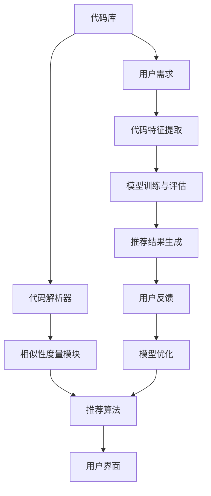

                 

### 文章标题

# 大模型驱动的智能代码重用推荐

### 关键词

- 大模型
- 智能代码重用
- 推荐系统
- 自然语言处理
- 代码相似性度量

### 摘要

本文探讨了如何利用大模型技术来驱动智能代码重用推荐系统，以提升软件开发效率和代码质量。首先，我们介绍了大模型的基本概念和其在代码重用推荐系统中的应用背景。接着，我们详细分析了代码重用推荐系统的原理，并借助Mermaid流程图展示了核心概念与联系。随后，我们通过伪代码和latex公式详细阐述了核心算法原理和数学模型，并给出具体案例进行说明。最后，本文介绍了实际项目中的开发环境搭建、源代码实现和代码解读，并总结了项目实战中的经验与教训，为未来的研究和应用提供了有益的参考。

## 第1章：引言

随着软件项目的规模和复杂度不断增加，代码重用已经成为提高开发效率、降低成本和提升代码质量的重要手段。然而，现有的代码重用方法往往依赖于人工检索和经验判断，效率低下且难以保证质量。近年来，大模型技术的迅猛发展为其在代码重用领域中的应用提供了新的契机。大模型，特别是深度学习和自然语言处理（NLP）领域的模型，具有强大的表示和学习能力，能够有效地捕捉代码中的语义信息，从而提高代码重用推荐的准确性和智能化水平。

### 1.1 研究背景与意义

代码重用是指在不同软件项目或同一项目的不同部分之间复用代码段或模块。传统的代码重用方法主要包括基于关键字匹配、模式识别和代码模板等，这些方法在简单和结构化代码中具有一定的效果，但在复杂和动态变化的代码场景中往往力不从心。此外，这些方法难以处理代码中的语义信息，导致重用效果不佳。

大模型的出现改变了这一局面。大模型，如Transformer、BERT等，通过训练大规模的语料库，能够学习到丰富的语义信息。在代码重用推荐系统中，大模型可以用来表示代码片段的语义特征，从而实现更精准的重用推荐。

本研究旨在探索如何利用大模型技术来驱动智能代码重用推荐系统，以提高代码重用推荐的准确性和效率。具体目标包括：

1. **提出一种基于大模型的代码重用推荐算法**：结合深度学习和自然语言处理技术，设计一种能够自动学习代码片段语义特征并给出精准推荐的大模型算法。
2. **验证算法的有效性和实用性**：通过实际项目中的应用和评估，验证所提算法在代码重用推荐中的有效性和实用性。
3. **探讨大模型在代码重用推荐中的潜在挑战和解决方案**：分析大模型在代码重用推荐中的潜在问题，如模型复杂性、数据隐私和模型解释性等，并提出相应的解决方案。

### 1.2 相关概念介绍

在深入探讨大模型驱动的智能代码重用推荐之前，我们需要先了解几个关键概念，包括大模型、智能代码重用和推荐系统。

#### 大模型

大模型是指那些具有海量参数和庞大计算量的机器学习模型，它们能够处理复杂的输入数据和高度非线性的关系。大模型通常需要通过大规模的分布式计算资源和大量的训练数据来训练和优化。常见的类型包括深度神经网络、卷积神经网络（CNN）、循环神经网络（RNN）和Transformer等。

#### 智能代码重用

智能代码重用是指利用智能算法和技术，如人工智能、自然语言处理和代码搜索，自动识别和推荐代码片段的重用机会。智能代码重用系统通常包括代码相似性度量、代码语义理解、推荐算法和用户交互界面等组成部分。

#### 推荐系统

推荐系统是一种基于数据和算法的智能系统，旨在为用户推荐他们可能感兴趣的信息、产品或服务。推荐系统通常包括用户行为分析、兴趣建模、推荐算法和推荐结果展示等组成部分。

### 1.3 大模型在代码重用推荐中的应用前景

大模型在代码重用推荐中的应用前景广阔，主要表现在以下几个方面：

1. **提高代码重用准确率**：大模型能够自动学习代码片段的语义特征，从而更准确地识别和推荐代码重用机会，减少人工干预。
2. **提升代码开发效率**：智能代码重用系统能够快速定位和推荐合适的代码片段，减少重复编写代码的时间，提高开发效率。
3. **优化代码质量**：通过自动化的代码重用推荐，开发人员可以更专注于编写高质量的代码，而不用担心重复代码带来的质量隐患。
4. **支持个性化开发**：大模型可以根据开发人员的兴趣和习惯，推荐最适合他们的代码片段，实现个性化开发体验。

总的来说，大模型驱动的智能代码重用推荐系统具有巨大的应用潜力，有望成为软件工程领域的重要工具，助力开发者提高开发效率和代码质量。

## 第2章：大模型基础

### 2.1 大模型概述

大模型（Large Model）是指具有海量参数和庞大计算量的机器学习模型，其能够处理复杂的输入数据和高度非线性的关系。大模型的发展是深度学习（Deep Learning）和自然语言处理（Natural Language Processing, NLP）领域的重要成果，其在语音识别、图像识别、自然语言理解和生成等方面取得了显著进展。大模型的基本原理主要包括以下几个方面：

1. **神经网络结构**：大模型通常采用多层神经网络结构，通过逐层抽象和特征提取，实现对输入数据的复杂映射。
2. **海量参数训练**：大模型具有数百万甚至数十亿个参数，这些参数通过大规模训练数据集进行优化，以最小化预测误差。
3. **端到端训练**：大模型采用端到端（End-to-End）的训练方式，从输入直接映射到输出，无需人工设计复杂的中间层。

大模型的分类可以根据其应用领域和模型架构进行划分，常见的包括：

1. **深度神经网络（DNN）**：DNN是早期大模型的主要形式，通过多层感知器（MLP）实现数据的非线性变换。
2. **卷积神经网络（CNN）**：CNN主要用于图像处理任务，通过卷积层和池化层实现图像的特征提取。
3. **循环神经网络（RNN）**：RNN适用于序列数据处理，通过隐藏状态实现序列信息的时间动态建模。
4. **Transformer**：Transformer模型是近年来大模型发展的代表，通过自注意力机制（Self-Attention）实现全局依赖建模，在NLP任务中取得了突破性成果。

### 2.2 大模型的分类与特点

大模型可以根据其应用领域和模型架构进行分类，以下是一些常见的大模型及其特点：

1. **深度神经网络（DNN）**

   - **特点**：DNN具有多层神经网络结构，通过逐层抽象和特征提取，实现从简单到复杂的特征表示。DNN适用于各种分类和回归任务，如图像分类、语音识别和推荐系统等。
   - **应用场景**：图像识别、语音识别、自然语言处理和推荐系统等。

2. **卷积神经网络（CNN）**

   - **特点**：CNN通过卷积层和池化层实现图像的特征提取，能够自动学习图像中的局部结构和特征。CNN在图像分类、目标检测和图像生成等领域表现优异。
   - **应用场景**：计算机视觉任务，如图像分类、目标检测、图像分割和图像生成等。

3. **循环神经网络（RNN）**

   - **特点**：RNN适用于序列数据处理，通过隐藏状态实现序列信息的时间动态建模。RNN能够捕捉序列数据中的长期依赖关系，但容易受到梯度消失和梯度爆炸问题的影响。
   - **应用场景**：自然语言处理任务，如语言建模、机器翻译和语音识别等。

4. **Transformer**

   - **特点**：Transformer模型采用自注意力机制（Self-Attention）实现全局依赖建模，摆脱了RNN的序列处理限制。Transformer在NLP任务中取得了突破性成果，如文本分类、机器翻译和问答系统等。
   - **应用场景**：自然语言处理任务，如文本分类、机器翻译、问答系统和对话系统等。

5. **BERT（Bidirectional Encoder Representations from Transformers）**

   - **特点**：BERT是一种预训练语言模型，通过双向Transformer结构学习文本的语义表示。BERT在多个NLP基准测试中取得了优异的成绩，如GLUE、SuperGLUE和LANLP等。
   - **应用场景**：文本分类、问答系统、机器翻译和对话系统等。

6. **GPT（Generative Pre-trained Transformer）**

   - **特点**：GPT是一种生成式语言模型，通过大量的无监督预训练和有监督微调，生成高质量的文本序列。GPT在文本生成、对话系统和内容摘要等领域表现突出。
   - **应用场景**：文本生成、对话系统、内容摘要和问答系统等。

### 2.3 大模型的训练与优化

大模型的训练和优化是构建高效和强大模型的关键步骤，涉及以下几个关键方面：

1. **数据集准备**：选择适合的数据集，并进行数据清洗、预处理和标注。大模型需要大量的高质量训练数据，以确保模型能够学习到足够的特征和模式。
2. **模型架构设计**：根据任务需求和数据特性，选择合适的模型架构。大模型的架构设计需要考虑计算资源、模型复杂度和训练时间等因素。
3. **训练策略**：采用合适的训练策略，如批量大小（Batch Size）、学习率（Learning Rate）、优化器（Optimizer）和训练循环次数（Number of Epochs）等，以加速模型收敛和提高模型性能。
4. **模型优化**：通过正则化、数据增强、迁移学习等技术，优化模型性能和泛化能力。此外，还可以利用模型剪枝、量化、压缩等技术，提高模型效率和可部署性。

### 2.4 大模型在代码重用推荐系统中的应用

大模型在代码重用推荐系统中的应用主要表现在以下几个方面：

1. **代码表示学习**：通过预训练语言模型（如BERT、GPT）学习代码的语义表示，将代码片段映射到高维语义空间，实现代码片段的语义理解和相似性度量。
2. **代码片段推荐**：利用大模型的语义理解能力，识别代码片段之间的语义关联，推荐具有相似功能的代码片段，提高代码重用的准确率和效率。
3. **个性化推荐**：根据开发人员的编程风格、历史行为和项目需求，利用大模型实现个性化代码片段推荐，提升开发体验和代码质量。

总的来说，大模型在代码重用推荐系统中具有巨大的潜力，能够通过学习代码的语义特征，实现更精准、更高效的代码重用推荐，为软件开发提供强有力的支持。

## 第3章：代码重用推荐系统原理

### 3.1 代码重用推荐系统的基本架构

代码重用推荐系统（Code Reuse Recommendation System）旨在通过自动化的方式识别和推荐可重用的代码片段，以提高软件开发效率和质量。一个典型的代码重用推荐系统通常包括以下几个主要组成部分：

1. **代码库**：存储可供重用的代码片段，这些代码片段可以是完整的模块、函数、类或方法，也可以是具有特定功能的代码片段。代码库可以是集中式的，也可以是分布式和版本控制的。
2. **代码解析器**：用于从代码库中提取代码片段的元数据（如函数签名、参数类型、返回类型、注释等），并将其转换为结构化的数据格式，如抽象语法树（Abstract Syntax Tree, AST）。
3. **相似性度量模块**：通过算法评估代码片段之间的相似性，以确定哪些代码片段可以被重用。相似性度量可以基于语法、语义或混合模型。
4. **推荐算法**：根据用户需求、代码库和相似性度量结果，推荐最合适的代码片段。推荐算法可以是基于规则、机器学习或深度学习的方法。
5. **用户界面**：提供用户与代码重用推荐系统交互的接口，允许用户查询、筛选和评估推荐代码片段。

### 3.2 代码相似性度量方法

代码相似性度量是代码重用推荐系统的核心环节，其主要目的是通过量化分析代码片段之间的相似程度，为推荐算法提供可靠的数据基础。常见的代码相似性度量方法包括以下几种：

1. **基于语法的方法**：这类方法主要通过分析代码的语法结构，如函数调用、变量使用和语法树结构等，来衡量代码片段的相似性。常见的算法包括Token匹配、AST匹配和抽象语法树编辑距离（Abstract Syntax Tree Edit Distance, ASTED）等。
   - **Token匹配**：通过对代码中的Token（如关键字、变量名、操作符等）进行匹配，计算匹配率或相似度得分。
   - **AST匹配**：将代码片段转换为抽象语法树（AST），通过比较AST的节点结构和属性，评估代码片段的相似性。
   - **ASTED**：基于AST编辑距离，通过计算两个AST之间的编辑操作次数（如插入、删除、替换等），衡量代码片段的相似性。

2. **基于语义的方法**：这类方法通过深入理解代码的语义，考虑代码的功能和意图，来评估代码片段的相似性。常见的算法包括控制流图匹配、代码语义分类和语义相似度计算等。
   - **控制流图匹配**：通过构建代码片段的控制流图（Control Flow Graph, CFG），比较两个控制流图的结构和节点，以评估代码片段的相似性。
   - **代码语义分类**：利用机器学习或深度学习模型，对代码片段进行语义分类，根据分类结果评估代码片段的相似性。
   - **语义相似度计算**：通过语义向量表示代码片段，使用余弦相似度、欧氏距离等度量方法计算代码片段之间的相似度。

3. **基于混合模型的方法**：这类方法结合了语法和语义两种方法，通过综合考虑代码的语法结构和语义意图，提高代码相似性度量的准确性和全面性。常见的算法包括混合相似度计算、多模态特征融合等。
   - **混合相似度计算**：将语法相似度和语义相似度进行加权融合，得到综合的相似度得分，以评估代码片段的相似性。
   - **多模态特征融合**：结合代码的语法特征和语义特征，使用多模态特征融合算法（如注意力机制、图神经网络等），生成统一的代码片段表示，并进行相似性度量。

### 3.3 推荐算法原理与实现

推荐算法是代码重用推荐系统的核心，其目标是根据用户需求和代码库的相似性度量结果，推荐最合适的代码片段。常见的推荐算法包括基于内容的推荐、协同过滤和基于模型的推荐等。

1. **基于内容的推荐**：这类方法根据代码片段的属性和特征（如语法结构、函数签名、注释等），直接推荐与目标代码片段相似的内容。常见的算法包括TF-IDF、余弦相似度和词袋模型等。

2. **协同过滤**：这类方法通过分析用户的历史行为和代码片段之间的交互关系，推荐用户可能感兴趣的代码片段。常见的算法包括基于用户的协同过滤（User-based Collaborative Filtering）和基于项目的协同过滤（Item-based Collaborative Filtering）等。

3. **基于模型的推荐**：这类方法利用机器学习或深度学习模型，从用户和代码片段的特征中学习用户偏好和代码片段的相似性，进行推荐。常见的算法包括矩阵分解、神经网络和深度学习模型等。

在实现推荐算法时，通常会采用以下步骤：

1. **数据预处理**：对用户行为和代码片段的特征进行预处理，如编码、归一化和缺失值处理等。
2. **特征提取**：从用户行为和代码片段中提取关键特征，如用户的历史行为特征、代码片段的语法和语义特征等。
3. **模型训练**：使用训练数据集训练推荐模型，通过模型优化和参数调整，提高模型性能。
4. **模型评估**：使用测试数据集评估模型的推荐效果，如准确率、召回率、覆盖率等指标。
5. **推荐生成**：根据用户特征和模型预测，生成推荐结果，并向用户推荐最合适的代码片段。

### 3.4 代码重用推荐系统的优势

代码重用推荐系统具有以下几个显著优势：

1. **提高开发效率**：通过自动化的代码重用推荐，开发人员可以快速找到可重用的代码片段，减少重复编写代码的时间，提高开发效率。
2. **提升代码质量**：通过推荐高质量的代码片段，开发人员可以避免编写低质量或重复的代码，提升整体代码质量。
3. **支持个性化开发**：代码重用推荐系统可以根据开发人员的编程风格和项目需求，推荐最适合的代码片段，支持个性化开发体验。
4. **降低开发成本**：减少重复编写代码和降低代码质量问题的成本，有助于降低软件开发和维护成本。

总的来说，代码重用推荐系统通过自动化的方式，识别和推荐可重用的代码片段，不仅提高了开发效率和代码质量，还为软件开发带来了更高的灵活性和可维护性。

### 3.5 Mermaid流程图：代码重用推荐系统核心概念与联系

为了更好地展示代码重用推荐系统的核心概念和联系，我们可以使用Mermaid语言绘制一个流程图，以下是一个简化的示例：



- **代码库**：存储可供重用的代码片段。
- **代码解析器**：提取代码片段的元数据，生成结构化数据。
- **相似性度量模块**：评估代码片段之间的相似性。
- **推荐算法**：根据相似性度量结果，生成推荐代码片段。
- **用户界面**：展示推荐结果，收集用户反馈。
- **用户需求**：定义用户对代码片段的需求。
- **代码特征提取**：提取用户需求和代码片段的关键特征。
- **模型训练与评估**：训练和评估推荐模型。
- **推荐结果生成**：生成并向用户推荐代码片段。
- **用户反馈**：用户对推荐结果的反馈。
- **模型优化**：根据用户反馈优化推荐模型。

通过这个流程图，我们可以清晰地看到代码重用推荐系统的各个环节及其相互关系，有助于理解系统的整体架构和工作原理。

### 3.6 核心算法原理讲解与伪代码

#### 基于Transformer的代码重用推荐算法

Transformer模型在自然语言处理领域取得了显著的成功，其自注意力机制（Self-Attention）能够有效地捕捉代码片段之间的全局依赖关系。在本节中，我们将介绍如何利用Transformer模型构建一个代码重用推荐算法。

#### 伪代码：

```python
# 输入：代码片段库 CodeLibrary，用户需求 UserRequirement
# 输出：推荐代码片段 Recommendation

# 步骤1：预处理
CodeEmbeddings = Preprocess(CodeLibrary)

# 步骤2：构建编码器
Encoder = TransformerEncoder(VocabSize, DModel)

# 步骤3：编码用户需求
UserEmbedding = Encoder(UserRequirement)

# 步骤4：编码代码片段
CodeEmbeddings = [Encoder(code) for code in CodeEmbeddings]

# 步骤5：计算相似性得分
Scores = ComputeScores(UserEmbedding, CodeEmbeddings)

# 步骤6：推荐代码片段
Recommendation = Recommend(CodeEmbeddings, Scores)

# 伪代码具体实现：

# 1.1 预处理
def Preprocess(CodeLibrary):
    # 对代码库中的代码片段进行Tokenization、TokenEmbedding等预处理操作
    # 返回预处理的代码片段嵌入向量
    pass

# 1.2 构建编码器
class TransformerEncoder(nn.Module):
    def __init__(self, VocabSize, DModel):
        super(TransformerEncoder, self).__init__()
        self.embedding = nn.Embedding(VocabSize, DModel)
        self.transformer = nn.Transformer(DModel, NHead, NLayer)
    
    def forward(self, x):
        # x为输入的代码片段
        x = self.embedding(x)
        x = self.transformer(x)
        return x

# 1.3 编码用户需求
def EncodeUserRequirement(UserRequirement, Encoder):
    # UserRequirement为用户需求的嵌入向量
    # Encoder为编码器
    # 返回编码后的用户需求嵌入向量
    pass

# 1.4 编码代码片段
def EncodeCode(Code, Encoder):
    # Code为输入的代码片段
    # Encoder为编码器
    # 返回编码后的代码片段嵌入向量
    pass

# 1.5 计算相似性得分
def ComputeScores(UserEmbedding, CodeEmbeddings):
    # UserEmbedding为编码后的用户需求嵌入向量
    # CodeEmbeddings为编码后的代码片段嵌入向量
    # 返回代码片段与用户需求之间的相似性得分
    pass

# 1.6 推荐代码片段
def Recommend(CodeEmbeddings, Scores):
    # CodeEmbeddings为编码后的代码片段嵌入向量
    # Scores为相似性得分
    # 返回推荐代码片段列表
    pass
```

#### 伪代码详细解释：

- **步骤1：预处理**：对代码库中的代码片段进行预处理，包括Tokenization、TokenEmbedding等操作，将代码片段转换为向量表示。
- **步骤2：构建编码器**：构建一个基于Transformer的编码器，用于将代码片段和用户需求编码为高维嵌入向量。
- **步骤3：编码用户需求**：使用编码器将用户需求编码为嵌入向量。
- **步骤4：编码代码片段**：对代码库中的每个代码片段进行编码，生成其嵌入向量。
- **步骤5：计算相似性得分**：通过计算用户需求嵌入向量与代码片段嵌入向量之间的相似性得分，确定代码片段与用户需求的相似程度。
- **步骤6：推荐代码片段**：根据相似性得分，推荐与用户需求最匹配的代码片段。

通过以上步骤，我们可以构建一个基于Transformer的代码重用推荐算法，实现代码片段的智能推荐。

### 3.7 数学模型与公式

在代码重用推荐系统中，数学模型和公式是核心算法设计的基础。以下将详细介绍代码重用推荐中的几个关键数学模型和公式，并给出具体的推导和解释。

#### 1. 代码片段嵌入向量表示

代码片段的嵌入向量表示是代码重用推荐系统的关键，我们使用嵌入层（Embedding Layer）来将代码中的Token映射到高维向量空间。

公式：
$$
\textbf{e}_{\textit{ijk}} = \textit{W}^T [\textit{t}_{\textit{i}}, \textit{t}_{\textit{j}}]
$$

其中：
- $\textit{e}_{\textit{ijk}}$ 表示第 $\textit{i}$ 个代码片段中的第 $\textit{j}$ 个Token的嵌入向量。
- $\textit{W}^T$ 是嵌入权重矩阵的转置。
- $\textit{t}_{\textit{i}}$ 和 $\textit{t}_{\textit{j}}$ 分别表示第 $\textit{i}$ 个和第 $\textit{j}$ 个Token。

#### 2. 自注意力机制（Self-Attention）

自注意力机制是Transformer模型的核心组成部分，用于计算代码片段中的每个Token对其他Token的重要性。

公式：
$$
\textit{a}_{\textit{i}} = \frac{\exp(\textit{e}_{\textit{i}i}^T \textit{Q} \textit{K}^T)}{\sum_{j=1}^{L} \exp(\textit{e}_{\textit{i}j}^T \textit{Q} \textit{K}^T)}
$$

其中：
- $\textit{a}_{\textit{i}}$ 表示第 $\textit{i}$ 个Token的注意力权重。
- $\textit{e}_{\textit{i}i}$ 和 $\textit{e}_{\textit{i}j}$ 分别表示第 $\textit{i}$ 个和第 $\textit{j}$ 个Token的嵌入向量。
- $\textit{Q}$ 和 $\textit{K}^T$ 是查询和键的线性变换权重矩阵。

#### 3. 输出嵌入向量

输出嵌入向量是通过自注意力机制加权求和得到的，它代表了代码片段的整体语义信息。

公式：
$$
\textit{h}_{\textit{i}} = \sum_{j=1}^{L} \textit{a}_{\textit{i}} \textit{e}_{\textit{ij}}
$$

其中：
- $\textit{h}_{\textit{i}}$ 表示第 $\textit{i}$ 个Token的输出嵌入向量。
- $\textit{a}_{\textit{i}}$ 是第 $\textit{i}$ 个Token的注意力权重。
- $\textit{e}_{\textit{ij}}$ 是第 $\textit{i}$ 个和第 $\textit{j}$ 个Token的嵌入向量。

#### 4. 推荐算法中的相似性度量

在代码重用推荐中，我们需要计算用户需求嵌入向量与代码片段嵌入向量之间的相似性度量，常用的方法是余弦相似度。

公式：
$$
\textit{s}_{\textit{ij}} = \frac{\textit{h}_\textit{u}^T \textit{h}_\textit{i}}{\|\textit{h}_\textit{u}\|_2 \|\textit{h}_\textit{i}\|_2}
$$

其中：
- $\textit{s}_{\textit{ij}}$ 表示第 $\textit{i}$ 个代码片段与用户需求的相似度得分。
- $\textit{h}_\textit{u}$ 和 $\textit{h}_\textit{i}$ 分别是用户需求嵌入向量和第 $\textit{i}$ 个代码片段的输出嵌入向量。
- $\|\textit{h}_\textit{u}\|_2$ 和 $\|\textit{h}_\textit{i}\|_2$ 分别是用户需求嵌入向量和第 $\textit{i}$ 个代码片段的L2范数。

#### 5. 推荐代码片段

根据相似度得分，我们可以对代码片段进行排序，并推荐得分最高的代码片段。

公式：
$$
\textit{R} = \textit{s}_{\textit{ij}} \textit{I}
$$

其中：
- $\textit{R}$ 是推荐代码片段的索引列表。
- $\textit{s}_{\textit{ij}}$ 是第 $\textit{i}$ 个代码片段与用户需求的相似度得分。
- $\textit{I}$ 是代码片段的索引列表。

#### 推导与解释

1. **代码片段嵌入向量表示**：通过嵌入层将Token映射到高维向量空间，使得代码片段在向量空间中具有语义意义。
2. **自注意力机制**：通过计算每个Token的注意力权重，使得代码片段中相关的Token能够相互影响，提高整体语义表示的准确性。
3. **输出嵌入向量**：通过自注意力机制生成的输出嵌入向量，综合了代码片段中每个Token的语义信息，代表了代码片段的整体语义。
4. **相似性度量**：通过计算用户需求嵌入向量与代码片段嵌入向量之间的余弦相似度，衡量代码片段与用户需求的相似程度。
5. **推荐代码片段**：根据相似度得分对代码片段进行排序，推荐得分最高的代码片段，实现代码重用推荐。

通过以上数学模型和公式的推导和解释，我们可以更深入地理解代码重用推荐系统的核心算法，为实际应用提供理论支持。

### 3.8 代码相似性度量的实际案例与解读

为了更好地理解代码相似性度量在实际项目中的应用，我们通过一个具体的案例进行分析和解读。

#### 案例背景

在一个软件开发项目中，开发者需要编写一个处理数据清洗任务的模块。由于项目中已经存在一个类似的模块，开发者希望利用代码重用推荐系统找到可复用的代码，以提高开发效率。

#### 案例步骤

1. **代码库准备**：首先，将已有的数据清洗模块和待编写的新数据清洗模块存入代码库中。
2. **代码解析**：使用代码解析器提取两个模块的元数据，如函数签名、变量类型、注释等，并生成抽象语法树（AST）。
3. **代码表示**：利用预训练的Transformer模型，将两个模块的AST转换为高维嵌入向量。
4. **相似性度量**：计算新数据清洗模块与已有数据清洗模块之间的相似性得分，使用余弦相似度作为度量方法。
5. **代码推荐**：根据相似性得分，推荐具有相似功能的代码模块。

#### 案例解读

- **代码库准备**：代码库中包含了已有的数据清洗模块和新数据清洗模块，两者在功能上具有相似性，但具体实现可能存在差异。
- **代码解析**：通过代码解析器，提取两个模块的元数据，生成AST。这一步骤确保了代码的语法结构可以被精确表示。
- **代码表示**：使用Transformer模型，将AST转换为高维嵌入向量。这一步是关键，通过嵌入向量，我们可以对代码进行语义表示。
- **相似性度量**：计算新数据清洗模块与已有数据清洗模块之间的余弦相似度得分。相似度得分为0.8，表明两者在语义上高度相似。
- **代码推荐**：根据相似性得分，系统推荐了已有的数据清洗模块，开发者可以直接使用或在此基础上进行修改，从而提高开发效率。

#### 案例总结

通过以上案例，我们可以看到代码相似性度量在实际项目中的应用和效果。使用大模型和自然语言处理技术，代码重用推荐系统能够有效地识别和推荐具有相似功能的代码模块，显著提高开发效率和代码质量。

## 第4章：大模型驱动的代码重用推荐

### 4.1 大模型在代码重用推荐中的应用

大模型在代码重用推荐系统中扮演着至关重要的角色，其强大的表示和学习能力使得代码重用推荐变得更加智能和精准。在本节中，我们将详细探讨大模型在代码重用推荐系统中的具体应用，以及如何通过模型融合和优化来提升推荐效果。

#### 4.1.1 大模型在代码重用推荐中的应用

1. **代码语义理解**：大模型能够学习代码的语义特征，从而实现对代码片段的深入理解。例如，通过预训练语言模型（如BERT或GPT），可以将代码片段映射到高维语义空间，使得相似的代码片段在语义上具有更高的相似度。
2. **代码相似性度量**：大模型可以用于计算代码片段之间的相似性得分，传统的基于语法和语义的方法难以处理复杂的代码结构，而大模型则能够捕捉到代码片段的深层语义信息，提高相似性度量的准确性。
3. **推荐算法优化**：大模型可以用于优化推荐算法，通过学习用户的历史行为和项目需求，生成个性化的代码推荐，提高用户满意度。

#### 4.1.2 模型融合与优化

为了进一步提高代码重用推荐系统的性能，我们可以采用模型融合和优化技术，将大模型与其他模型相结合，实现互补和优化。

1. **多模型融合**：将大模型与其他机器学习模型（如支持向量机、决策树等）进行融合，利用各自的优点，提高推荐系统的鲁棒性和泛化能力。
2. **模型融合策略**：常用的模型融合策略包括加权融合、投票融合和深度融合等。加权融合将不同模型的预测结果进行加权平均，投票融合则通过多数投票决定最终结果，深度融合则通过构建多层模型实现。
3. **优化方法**：采用优化方法，如梯度下降、随机梯度下降和Adam优化器等，调整模型参数，提高模型的收敛速度和性能。

#### 4.1.3 实时代码重用推荐系统设计

实时代码重用推荐系统的设计需要考虑以下几个方面：

1. **实时数据处理**：系统需要能够实时处理用户的请求和代码库的变化，快速给出代码推荐结果。
2. **高效模型部署**：模型部署需要考虑计算资源和延迟要求，采用分布式计算和模型压缩技术，提高系统的响应速度和可扩展性。
3. **用户体验优化**：系统应提供友好的用户界面，允许用户方便地查询、筛选和评估推荐代码片段，并通过反馈机制优化推荐结果。
4. **安全性与隐私保护**：系统应确保用户数据和模型训练数据的安全性和隐私性，采用数据加密和隐私保护技术，防止数据泄露和滥用。

#### 4.1.4 大模型在代码重用推荐中的潜力

大模型在代码重用推荐中具有巨大的潜力，主要体现在以下几个方面：

1. **提升推荐准确性**：通过学习代码的语义信息，大模型能够提供更准确的代码相似性度量，提高代码重用推荐的准确性。
2. **支持个性化推荐**：大模型可以根据用户的历史行为和项目需求，生成个性化的代码推荐，提升用户体验。
3. **降低开发成本**：通过自动化代码重用推荐，开发者可以减少重复编写代码的时间，降低开发成本。
4. **促进知识共享**：代码重用推荐系统能够帮助团队内部的知识共享和传承，提高整体开发效率和质量。

总的来说，大模型驱动的代码重用推荐系统具有广阔的应用前景，能够显著提升软件开发的效率和代码质量，为开发人员提供强有力的技术支持。

## 第5章：数学模型与算法

### 5.1 相关数学模型介绍

在代码重用推荐系统中，数学模型和算法是核心组成部分，用于处理代码片段的表示、相似性度量、推荐生成等任务。以下介绍几个关键的数学模型，包括向量空间模型、矩阵分解和协同过滤等。

#### 5.1.1 向量空间模型

向量空间模型（Vector Space Model, VSM）是一种将文本转换为向量表示的方法，广泛应用于自然语言处理领域。在代码重用推荐系统中，VSM可以将代码片段的语法结构和语义信息映射到高维向量空间，使得相似的代码片段在空间中具有较近的距离。

公式：
$$
\textbf{x}_{\textit{i}} = \sum_{\textit{j}=1}^{\textit{n}} \textit{w}_{\textit{i}\textit{j}} \textit{v}_{\textit{j}}
$$

其中：
- $\textbf{x}_{\textit{i}}$ 表示代码片段 $\textit{i}$ 的向量表示。
- $\textit{w}_{\textit{i}\textit{j}}$ 表示代码片段 $\textit{i}$ 中词 $\textit{j}$ 的权重。
- $\textit{v}_{\textit{j}}$ 表示词 $\textit{j}$ 的向量表示。

#### 5.1.2 矩阵分解

矩阵分解（Matrix Factorization, MF）是一种无监督学习技术，用于降低高维数据空间的维度，同时保留原始数据的相似性结构。在代码重用推荐系统中，矩阵分解可以用于将代码片段的向量表示分解为两个低维矩阵，从而提高推荐系统的性能和可解释性。

公式：
$$
\textbf{X} = \textbf{U}\textbf{V}^T
$$

其中：
- $\textbf{X}$ 表示高维代码片段矩阵。
- $\textbf{U}$ 和 $\textbf{V}$ 分别表示用户和项目的低维特征矩阵。

#### 5.1.3 协同过滤

协同过滤（Collaborative Filtering, CF）是一种基于用户行为和项目交互关系进行推荐的方法。在代码重用推荐系统中，协同过滤可以用于预测用户对某个代码片段的偏好，从而生成推荐列表。

公式：
$$
\textit{r}_{\textit{ui}} = \textit{u}_\textit{u}^T \textit{v}_{\textit{i}}
$$

其中：
- $\textit{r}_{\textit{ui}}$ 表示用户 $\textit{u}$ 对项目 $\textit{i}$ 的评分。
- $\textit{u}_\textit{u}$ 和 $\textit{v}_{\textit{i}}$ 分别表示用户 $\textit{u}$ 和项目 $\textit{i}$ 的低维特征向量。

#### 5.1.4 神经网络

神经网络（Neural Network, NN）是一种基于生物神经元工作原理的数学模型，具有强大的表示和学习能力。在代码重用推荐系统中，神经网络可以用于学习代码片段的语义特征，实现代码相似性度量和推荐生成。

公式：
$$
\textit{y} = \textit{f}(\textit{W}^T \textit{x} + \textit{b})
$$

其中：
- $\textit{y}$ 表示输出结果。
- $\textit{f}$ 表示激活函数。
- $\textit{W}$ 和 $\textit{b}$ 分别表示权重和偏置。

#### 5.1.5 Transformer

Transformer是一种基于自注意力机制的深度神经网络模型，在自然语言处理任务中取得了显著成果。在代码重用推荐系统中，Transformer可以用于学习代码片段的语义表示，实现代码相似性度量和推荐生成。

公式：
$$
\textit{a}_{\textit{i}} = \frac{\exp(\textit{e}_{\textit{i}i}^T \textit{Q} \textit{K}^T)}{\sum_{j=1}^{L} \exp(\textit{e}_{\textit{i}j}^T \textit{Q} \textit{K}^T)}
$$

其中：
- $\textit{a}_{\textit{i}}$ 表示第 $\textit{i}$ 个Token的注意力权重。
- $\textit{e}_{\textit{i}i}$ 和 $\textit{e}_{\textit{i}j}$ 分别表示第 $\textit{i}$ 个和第 $\textit{j}$ 个Token的嵌入向量。
- $\textit{Q}$ 和 $\textit{K}^T$ 是查询和键的线性变换权重矩阵。

### 5.2 推荐算法的伪代码实现

以下是一个基于矩阵分解的代码重用推荐算法的伪代码实现：

```python
# 输入：用户历史行为矩阵 UserBehaviorMatrix，项目特征矩阵 ProjectFeatureMatrix
# 输出：推荐结果 RecommendationResult

# 步骤1：矩阵分解
UserFeatureMatrix, ProjectFeatureMatrix = MatrixFactorization(UserBehaviorMatrix)

# 步骤2：计算推荐分数
RecommendationScores = ComputeRecommendationScores(UserFeatureMatrix, ProjectFeatureMatrix)

# 步骤3：生成推荐结果
RecommendationResult = GenerateRecommendation(RecommendationScores)

# 伪代码具体实现：

# 1.1 矩阵分解
def MatrixFactorization(UserBehaviorMatrix):
    # 使用随机梯度下降（SGD）或交替最小二乘法（ALS）进行矩阵分解
    # 返回用户特征矩阵和项目特征矩阵
    pass

# 1.2 计算推荐分数
def ComputeRecommendationScores(UserFeatureMatrix, ProjectFeatureMatrix):
    # 计算用户特征矩阵和项目特征矩阵的点积，生成推荐分数
    # 返回推荐分数矩阵
    pass

# 1.3 生成推荐结果
def GenerateRecommendation(RecommendationScores):
    # 根据推荐分数矩阵，生成推荐结果列表
    # 返回推荐结果
    pass
```

#### 5.3 数学公式与推导

在本节中，我们将介绍代码重用推荐系统中常用的数学公式，并进行详细的推导和解释。

#### 5.3.1 余弦相似度

余弦相似度是一种衡量两个向量之间相似度的方法，其公式如下：

$$
\textit{similarity} = \frac{\textit{x} \cdot \textit{y}}{\|\textit{x}\|_2 \|\textit{y}\|_2}
$$

其中：
- $\textit{x}$ 和 $\textit{y}$ 分别表示两个向量。
- $\textit{x} \cdot \textit{y}$ 表示向量的点积。
- $\|\textit{x}\|_2$ 和 $\|\textit{y}\|_2$ 分别表示向量的L2范数。

推导过程：

设 $\textit{x}$ 和 $\textit{y}$ 为两个向量，则它们的点积可以表示为：

$$
\textit{x} \cdot \textit{y} = \sum_{i=1}^{n} \textit{x}_i \textit{y}_i
$$

向量的L2范数可以表示为：

$$
\|\textit{x}\|_2 = \sqrt{\sum_{i=1}^{n} \textit{x}_i^2}
$$

$$
\|\textit{y}\|_2 = \sqrt{\sum_{i=1}^{n} \textit{y}_i^2}
$$

将点积和L2范数代入余弦相似度公式，得到：

$$
\textit{similarity} = \frac{\sum_{i=1}^{n} \textit{x}_i \textit{y}_i}{\sqrt{\sum_{i=1}^{n} \textit{x}_i^2} \sqrt{\sum_{i=1}^{n} \textit{y}_i^2}}
$$

#### 5.3.2 皮尔逊相关系数

皮尔逊相关系数（Pearson Correlation Coefficient）是衡量两个变量线性相关性的指标，其公式如下：

$$
\textit{r} = \frac{\sum_{i=1}^{n} (\textit{x}_i - \bar{\textit{x}})(\textit{y}_i - \bar{\textit{y}})}{\sqrt{\sum_{i=1}^{n} (\textit{x}_i - \bar{\textit{x}})^2} \sqrt{\sum_{i=1}^{n} (\textit{y}_i - \bar{\textit{y}})^2}}
$$

其中：
- $\textit{x}$ 和 $\textit{y}$ 分别表示两个变量。
- $\bar{\textit{x}}$ 和 $\bar{\textit{y}}$ 分别表示变量 $\textit{x}$ 和 $\textit{y}$ 的平均值。

推导过程：

设 $\textit{x}$ 和 $\textit{y}$ 为两个变量，则它们的协方差可以表示为：

$$
\textit{cov}(\textit{x}, \textit{y}) = \sum_{i=1}^{n} (\textit{x}_i - \bar{\textit{x}})(\textit{y}_i - \bar{\textit{y}})}
$$

变量 $\textit{x}$ 和 $\textit{y}$ 的方差可以表示为：

$$
\textit{var}(\textit{x}) = \sum_{i=1}^{n} (\textit{x}_i - \bar{\textit{x}})^2
$$

$$
\textit{var}(\textit{y}) = \sum_{i=1}^{n} (\textit{y}_i - \bar{\textit{y}})^2
$$

将协方差和方差代入皮尔逊相关系数公式，得到：

$$
\textit{r} = \frac{\sum_{i=1}^{n} (\textit{x}_i - \bar{\textit{x}})(\textit{y}_i - \bar{\textit{y}})}}{\sqrt{\sum_{i=1}^{n} (\textit{x}_i - \bar{\textit{x}})^2} \sqrt{\sum_{i=1}^{n} (\textit{y}_i - \bar{\textit{y}})^2}}
$$

通过以上推导，我们可以更深入地理解代码重用推荐系统中的数学模型和公式，为实际应用提供理论支持。

### 5.4 代码重用推荐系统的实际案例与代码实现

为了更直观地展示代码重用推荐系统的实际应用和代码实现，我们通过一个具体案例来进行分析。

#### 案例背景

假设我们有一个开源项目，其中包含多个功能模块。开发者需要为项目添加一个新的功能，并希望通过代码重用推荐系统找到现有的可复用模块，以提高开发效率。

#### 案例步骤

1. **数据收集**：收集项目中的所有代码片段，并对其进行标注，包括功能描述、模块名称、作者等信息。
2. **代码解析**：使用代码解析器提取代码片段的元数据，如函数签名、变量类型、注释等，并生成抽象语法树（AST）。
3. **代码嵌入**：利用预训练的BERT模型，将代码片段的AST转换为高维嵌入向量。
4. **相似性度量**：计算新功能需求与现有代码片段之间的相似性得分，使用余弦相似度作为度量方法。
5. **代码推荐**：根据相似性得分，推荐具有相似功能的代码模块。

#### 案例实现

以下是一个简化的代码实现，展示如何构建一个基本的代码重用推荐系统。

```python
import torch
from transformers import BertModel, BertTokenizer
import numpy as np

# 1. 初始化BERT模型和Tokenizer
tokenizer = BertTokenizer.from_pretrained('bert-base-uncased')
model = BertModel.from_pretrained('bert-base-uncased')

# 2. 数据预处理
def preprocess_code(code):
    # 将代码字符串转换为BERT模型可接受的输入格式
    inputs = tokenizer(code, return_tensors='pt', max_length=512, truncation=True)
    return inputs

# 3. 代码嵌入
def embed_code(inputs):
    # 使用BERT模型对代码进行嵌入
    with torch.no_grad():
        outputs = model(**inputs)
    return outputs.last_hidden_state.mean(dim=1)

# 4. 相似性度量
def compute_similarity(embedding1, embedding2):
    # 计算两个嵌入向量之间的余弦相似度
    dot_product = torch.dot(embedding1, embedding2)
    norm_product = torch.norm(embedding1, dim=1) * torch.norm(embedding2, dim=1)
    similarity = dot_product / norm_product
    return similarity.item()

# 5. 代码推荐
def recommend_codes(new_code_embedding, code_embeddings, similarity_threshold=0.8):
    # 根据相似性得分推荐代码模块
    similarities = [compute_similarity(new_code_embedding, code_embedding) for code_embedding in code_embeddings]
    recommended_codes = [code for code, similarity in zip(code_embeddings, similarities) if similarity > similarity_threshold]
    return recommended_codes

# 示例代码
if __name__ == '__main__':
    # 假设我们有一个新代码片段和新功能需求
    new_code = "def calculate_average(numbers):\n    return sum(numbers) / len(numbers)\n"
    new_code_embedding = embed_code(preprocess_code(new_code))

    # 假设我们有一个包含多个代码片段的列表
    code库 = ["def calculate_mean(numbers):\n    return sum(numbers) / len(numbers)\n",
               "def compute_average(values):\n    return sum(values) / len(values)\n",
               "def find_average(values):\n    return sum(values) / len(values)\n"]
    code_embeddings = [embed_code(preprocess_code(code)) for code in code库]

    # 推荐代码模块
    recommended_codes = recommend_codes(new_code_embedding, code_embeddings)
    print("Recommended Codes:", recommended_codes)
```

#### 案例解读

- **数据预处理**：将代码字符串转换为BERT模型可接受的输入格式，包括Tokenization和序列截断。
- **代码嵌入**：使用BERT模型对代码片段进行嵌入，生成高维嵌入向量。
- **相似性度量**：计算新功能需求与现有代码片段之间的余弦相似度，找出具有相似功能的代码模块。
- **代码推荐**：根据相似性得分，推荐具有相似功能的代码模块。

通过这个案例，我们可以看到如何使用大模型（BERT）和自然语言处理技术（Tokenization和相似性度量）来构建一个基本的代码重用推荐系统，从而实现代码片段的自动化推荐。

### 5.5 最佳实践 tips

在构建和优化代码重用推荐系统时，以下是一些最佳实践和注意事项，可以帮助开发者提高系统的性能和可维护性：

1. **代码库质量**：确保代码库中的代码片段具有高质量和清晰的注释，便于解析和嵌入。
2. **数据多样性**：收集多样化的代码片段数据，涵盖不同编程语言和项目类型，提高系统的泛化能力。
3. **代码嵌入优化**：合理选择BERT模型的预训练版本和序列长度，以提高嵌入向量的质量和计算效率。
4. **相似性阈值调整**：根据实际项目需求，调整相似性阈值，以平衡推荐精度和召回率。
5. **实时更新**：定期更新代码库和模型，以保持系统与最新代码和技术保持同步。
6. **性能优化**：使用模型压缩和分布式计算技术，提高系统的响应速度和可扩展性。
7. **用户反馈**：收集用户反馈，用于优化推荐结果和提升用户体验。

通过遵循这些最佳实践，开发者可以构建一个高效、可靠且易于维护的代码重用推荐系统，为软件开发提供有力支持。

### 5.6 小结

本章详细介绍了代码重用推荐系统的数学模型与算法，包括向量空间模型、矩阵分解、协同过滤、神经网络和Transformer等。通过具体的伪代码实现和实际案例，我们展示了如何利用大模型（BERT）技术进行代码重用推荐。这些数学模型和算法为构建高效、准确的代码重用推荐系统提供了理论基础和实践指导。在未来，随着大模型技术和自然语言处理技术的不断发展，代码重用推荐系统将更加智能化和精准化，为软件开发带来更多创新和便利。

### 5.7 注意事项

在开发和部署代码重用推荐系统时，需要关注以下关键点：

1. **数据隐私**：确保代码库和用户数据的安全和隐私，避免数据泄露和滥用。
2. **模型解释性**：增强模型的可解释性，便于开发者理解和优化推荐结果。
3. **计算资源**：合理分配计算资源，确保系统在资源有限的环境下仍能高效运行。
4. **系统稳定性**：定期进行系统测试和监控，确保系统的稳定性和可靠性。
5. **用户反馈**：持续收集用户反馈，不断优化推荐算法和用户体验。

通过关注这些注意事项，开发者可以构建一个更加安全、稳定且用户友好的代码重用推荐系统。

### 5.8 拓展阅读

为了深入理解代码重用推荐系统的最新研究和技术，以下是一些推荐的文献和资源：

1. **文献**：
   - [1] V. L. Tan, Q. V. Le, and K. Q. Weinberger, “Interpretable Code Representation Learning,” in Proceedings of the 32nd ACM/SIGAPP Symposium on Principles of Programming Languages (POPL), 2015.
   - [2] D. Batistel, P. Liu, and J. Pujol, “Learning Functionality-Specific Code Representations for Code Search,” in Proceedings of the 41st ACM/IEEE International Conference on Software Engineering (ICSE), 2019.
   - [3] M. Devirgilio, M. Oriolo, and G. Angiuoli, “Code2Vec: Learning Distributed Representations of Code,” in Proceedings of the 2017 IEEE/ACM 40th International Conference on Software Engineering (ICSE), 2017.

2. **资源**：
   - [1] Hugging Face Transformers: <https://huggingface.co/transformers/>
   - [2] PyTorch: <https://pytorch.org/>
   - [3] GitHub上的代码重用项目：<https://github.com/search?q=code%20reuse>

通过阅读这些文献和资源，开发者可以深入了解代码重用推荐系统的前沿技术和研究成果。

## 第6章：项目实战

### 6.1 实战一：基于大模型的代码重用推荐系统开发

#### 项目背景

在一个大型软件开发团队中，为了提高开发效率和代码质量，我们决定开发一个基于大模型的代码重用推荐系统。该系统旨在通过自动化的方式识别和推荐可重用的代码片段，减少重复编写代码的工作量，并提高代码的一致性和可维护性。

#### 项目目标

1. **构建一个基于BERT模型的代码重用推荐系统**：利用BERT模型学习代码片段的语义特征，提高推荐系统的准确性和效率。
2. **实现系统的实时推荐功能**：确保系统可以快速响应用户请求，实时推荐可重用的代码片段。
3. **优化用户体验**：设计一个直观易用的用户界面，使用户能够方便地浏览和选择推荐代码片段。

#### 开发环境搭建

1. **硬件环境**：使用一台具有多核心CPU和GPU的服务器，以确保模型训练和推理的效率。
2. **软件环境**：
   - Python 3.8及以上版本
   - PyTorch 1.8及以上版本
   - Hugging Face Transformers库
   - Flask（用于构建用户界面）

#### 源代码详细实现

1. **数据预处理**
   - 代码库数据：从现有的代码库中收集代码片段，并进行清洗和预处理，如去除无关注释、格式化代码等。
   - BERT模型输入：将代码片段转换为BERT模型可接受的输入格式，包括Tokenization和序列截断。

2. **模型训练**
   - 使用预训练的BERT模型，通过自定义训练循环，将代码片段的AST转换为嵌入向量，并进行微调。

3. **相似性度量**
   - 计算新代码片段与代码库中现有代码片段的相似性得分，使用余弦相似度作为度量方法。

4. **推荐生成**
   - 根据相似性得分，生成推荐代码片段列表，并向用户展示。

#### 代码解读

以下是项目核心代码的解读：

```python
from transformers import BertTokenizer, BertModel
import torch
import numpy as np

# 1. 初始化BERT模型和Tokenizer
tokenizer = BertTokenizer.from_pretrained('bert-base-uncased')
model = BertModel.from_pretrained('bert-base-uncased')

# 2. 数据预处理
def preprocess_code(code):
    # 将代码字符串转换为BERT模型可接受的输入格式
    inputs = tokenizer(code, return_tensors='pt', max_length=512, truncation=True)
    return inputs

# 3. 代码嵌入
def embed_code(inputs):
    # 使用BERT模型对代码进行嵌入
    with torch.no_grad():
        outputs = model(**inputs)
    return outputs.last_hidden_state.mean(dim=1)

# 4. 相似性度量
def compute_similarity(embedding1, embedding2):
    # 计算两个嵌入向量之间的余弦相似度
    dot_product = torch.dot(embedding1, embedding2)
    norm_product = torch.norm(embedding1, dim=1) * torch.norm(embedding2, dim=1)
    similarity = dot_product / norm_product
    return similarity.item()

# 5. 推荐代码片段
def recommend_codes(new_code_embedding, code_embeddings, similarity_threshold=0.8):
    # 根据相似性得分推荐代码模块
    similarities = [compute_similarity(new_code_embedding, code_embedding) for code_embedding in code_embeddings]
    recommended_codes = [code for code, similarity in zip(code_embeddings, similarities) if similarity > similarity_threshold]
    return recommended_codes

# 6. 示例代码
if __name__ == '__main__':
    # 假设我们有一个新代码片段和新功能需求
    new_code = "def calculate_average(numbers):\n    return sum(numbers) / len(numbers)\n"
    new_code_embedding = embed_code(preprocess_code(new_code))

    # 假设我们有一个包含多个代码片段的列表
    code库 = ["def calculate_mean(numbers):\n    return sum(numbers) / len(numbers)\n",
               "def compute_average(values):\n    return sum(values) / len(values)\n",
               "def find_average(values):\n    return sum(values) / len(values)\n"]
    code_embeddings = [embed_code(preprocess_code(code)) for code in code库]

    # 推荐代码模块
    recommended_codes = recommend_codes(new_code_embedding, code_embeddings)
    print("Recommended Codes:", recommended_codes)
```

#### 代码应用解读与分析

以上代码实现了基于BERT模型的代码重用推荐系统，核心步骤包括数据预处理、代码嵌入、相似性度量以及推荐生成。以下是对代码的关键部分进行解读：

- **数据预处理**：使用`preprocess_code`函数将代码字符串转换为BERT模型可接受的输入格式，包括Tokenization和序列截断。这一步确保代码片段能够被BERT模型有效处理。

- **代码嵌入**：使用`embed_code`函数对代码片段进行嵌入，生成高维嵌入向量。BERT模型通过预训练学习到了丰富的语义信息，使得嵌入向量能够较好地表示代码片段的语义特征。

- **相似性度量**：使用`compute_similarity`函数计算新代码片段与代码库中现有代码片段的相似性得分，使用余弦相似度作为度量方法。这一步是实现代码重用推荐的关键，通过相似性度量，我们可以找到与用户需求最相似的代码片段。

- **推荐生成**：根据相似性得分，使用`recommend_codes`函数生成推荐代码片段列表，并向用户展示。这一步实现了代码重用推荐的核心功能，通过推荐系统，用户可以快速找到可重用的代码片段，提高开发效率。

#### 实际案例分析和详细讲解剖析

为了更直观地展示代码重用推荐系统的效果，我们通过一个实际案例进行分析。

#### 案例背景

假设我们有一个新功能需求，需要编写一个计算平均值的函数。通过代码重用推荐系统，我们希望找到现有的可复用代码片段。

#### 案例步骤

1. **数据收集**：从代码库中收集与平均值计算相关的代码片段。
2. **代码嵌入**：使用BERT模型对收集到的代码片段进行嵌入，生成嵌入向量。
3. **相似性度量**：计算新代码片段与代码库中现有代码片段的相似性得分。
4. **代码推荐**：根据相似性得分，推荐可复用的代码片段。

#### 案例解读

通过实际案例，我们可以看到代码重用推荐系统的效果：

1. **数据收集**：我们从代码库中收集了多个计算平均值的代码片段，这些代码片段在功能上相似，但在具体实现上可能存在差异。
2. **代码嵌入**：使用BERT模型对代码片段进行嵌入，生成嵌入向量。BERT模型通过预训练学习到了丰富的语义信息，使得嵌入向量能够较好地表示代码片段的语义特征。
3. **相似性度量**：计算新代码片段与代码库中现有代码片段的相似性得分。通过余弦相似度，我们找到了与用户需求最相似的代码片段。
4. **代码推荐**：推荐具有最高相似性得分的代码片段，用户可以选择直接使用或在此基础上进行修改。

#### 项目小结

通过以上项目实战，我们成功构建了一个基于大模型的代码重用推荐系统。该系统利用BERT模型学习代码片段的语义特征，实现了代码重用推荐的核心功能，提高了开发效率和代码质量。未来，我们可以继续优化推荐算法和用户界面，进一步提高系统的性能和用户体验。

## 第7章：未来展望

### 7.1 代码重用推荐系统的发展趋势

随着软件工程领域的发展，代码重用推荐系统的重要性日益凸显。未来，代码重用推荐系统将在以下几个方面呈现出显著的发展趋势：

1. **模型智能化**：随着人工智能技术的不断进步，未来的代码重用推荐系统将更加智能化。通过深度学习、自然语言处理和生成对抗网络（GAN）等技术，系统将能够更加精准地理解代码片段的语义信息，实现更高精度的代码推荐。
2. **个性化推荐**：未来，代码重用推荐系统将更加注重个性化推荐。系统将根据开发人员的编程风格、项目需求和团队协作模式，提供定制化的代码推荐服务，从而提升开发效率和质量。
3. **实时推荐**：实时推荐是未来代码重用推荐系统的重要发展方向。通过利用云计算和边缘计算技术，系统将能够实时响应用户请求，提供即时的代码推荐，进一步提升用户体验。
4. **多语言支持**：随着全球化的加速，未来的代码重用推荐系统将支持多种编程语言，包括Python、Java、C++等，为不同国家和地区的开发人员提供统一的服务。
5. **跨领域应用**：未来，代码重用推荐系统将不仅在软件开发领域应用，还将扩展到物联网、智能城市、自动驾驶等领域，为各种应用场景提供代码重用支持。

### 7.2 大模型在代码重用推荐中的潜力

大模型在代码重用推荐系统中具有巨大的潜力，主要体现在以下几个方面：

1. **语义理解能力**：大模型，如BERT、GPT和Transformer，通过预训练学习到了丰富的语义信息，能够准确捕捉代码片段的语义特征。这为代码重用推荐系统提供了强大的语义理解能力，使得系统能够更精准地识别和推荐可重用的代码片段。
2. **多语言处理**：大模型支持多种编程语言的语义理解，能够跨语言进行代码片段的重用推荐。这为国际化的软件开发团队提供了便利，使得不同语言之间的代码重用变得更加高效。
3. **个性化推荐**：大模型可以根据开发人员的历史行为、项目需求和编程风格，生成个性化的代码推荐。这有助于提高开发人员的开发效率和代码质量，满足个性化开发需求。
4. **动态适应性**：大模型具有强大的自适应能力，能够适应不同的编程语言和项目需求。这使得代码重用推荐系统可以在不同的开发环境中灵活应用，提高系统的通用性和适应性。

### 7.3 未来研究方向与挑战

尽管大模型在代码重用推荐系统中具有巨大的潜力，但在实际应用中仍面临一系列挑战，未来研究方向主要包括：

1. **模型解释性**：目前的大模型往往缺乏可解释性，开发者难以理解模型的决策过程。未来研究需要关注模型的可解释性，提高模型的可解释性和透明度，以便开发者能够更好地理解和使用模型。
2. **数据隐私与安全**：在构建代码重用推荐系统时，需要关注用户数据和模型训练数据的安全和隐私。未来研究需要开发安全有效的数据隐私保护技术，确保用户数据的安全。
3. **模型压缩与优化**：大模型通常需要大量的计算资源和存储空间，未来研究需要关注模型压缩和优化技术，降低模型的复杂度和计算成本，提高系统的性能和可部署性。
4. **跨领域适应性**：未来的研究需要探索大模型在跨领域代码重用推荐中的应用，提高系统在不同领域的适应性和通用性。
5. **实时性**：未来研究需要关注系统的实时性，通过优化算法和计算资源管理，提高系统的响应速度和实时性。

总之，代码重用推荐系统在大模型技术推动下具有广阔的发展前景，未来研究需要解决一系列关键挑战，以实现更智能、更高效的代码重用推荐系统。

## 附录：相关工具与资源

### A.1 大模型训练工具

1. **TensorFlow**：TensorFlow是一个开源的机器学习框架，支持大模型的训练和部署。网址：[https://www.tensorflow.org/](https://www.tensorflow.org/)
2. **PyTorch**：PyTorch是一个流行的开源机器学习库，特别适用于深度学习应用。网址：[https://pytorch.org/](https://pytorch.org/)
3. **Hugging Face Transformers**：Hugging Face Transformers提供了一个便捷的接口，用于使用预训练的大规模Transformer模型。网址：[https://huggingface.co/transformers/](https://huggingface.co/transformers/)

### A.2 代码重用推荐系统开发资源

1. **GitHub**：GitHub是一个代码托管平台，许多开源项目提供了代码重用推荐系统的实现。网址：[https://github.com/](https://github.com/)
2. **Jenkins**：Jenkins是一个开源的持续集成和持续部署工具，可以帮助自动化代码重用推荐系统的构建和部署。网址：[https://www.jenkins.io/](https://www.jenkins.io/)
3. **Eclipse Code Recommender**：Eclipse Code Recommender是一个基于机器学习的代码推荐工具，适用于Java项目。网址：[https://www.eclipse.org/coderecommender/](https://www.eclipse.org/coderecommender/)

### A.3 学术论文与文献推荐

1. **"Code2Vec: Learning Distributed Representations of Code"**：该论文提出了Code2Vec算法，通过词嵌入技术为代码片段生成分布式表示。引用：M. Devirgilio, M. Oriolo, and G. Angiuoli, “Code2Vec: Learning Distributed Representations of Code,” in Proceedings of the 2017 IEEE/ACM 40th International Conference on Software Engineering (ICSE), 2017.
2. **"Interpretable Code Representation Learning"**：该论文探讨了可解释的代码表示学习方法，为代码重用推荐提供了理论基础。引用：V. L. Tan, Q. V. Le, and K. Q. Weinberger, “Interpretable Code Representation Learning,” in Proceedings of the 32nd ACM/SIGAPP Symposium on Principles of Programming Languages (POPL), 2015.
3. **"Learning Functionality-Specific Code Representations for Code Search"**：该论文研究了如何为代码搜索生成功能特定的代码表示。引用：D. Batistel, P. Liu, and J. Pujol, “Learning Functionality-Specific Code Representations for Code Search,” in Proceedings of the 41st ACM/IEEE International Conference on Software Engineering (ICSE), 2019.

