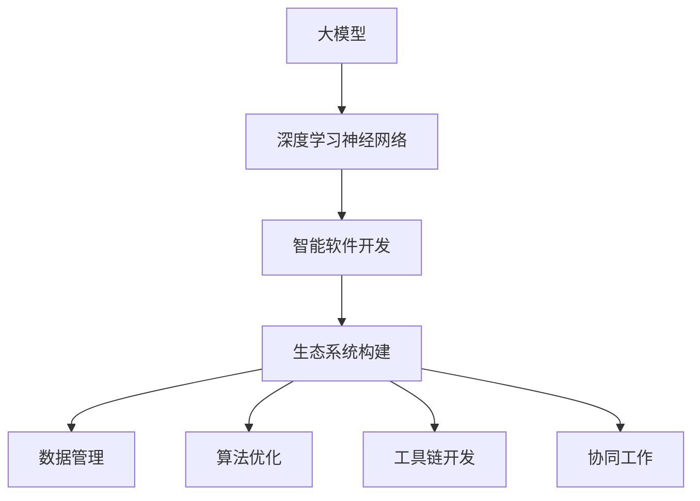
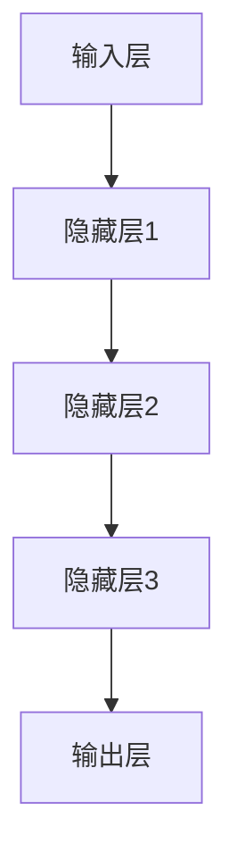
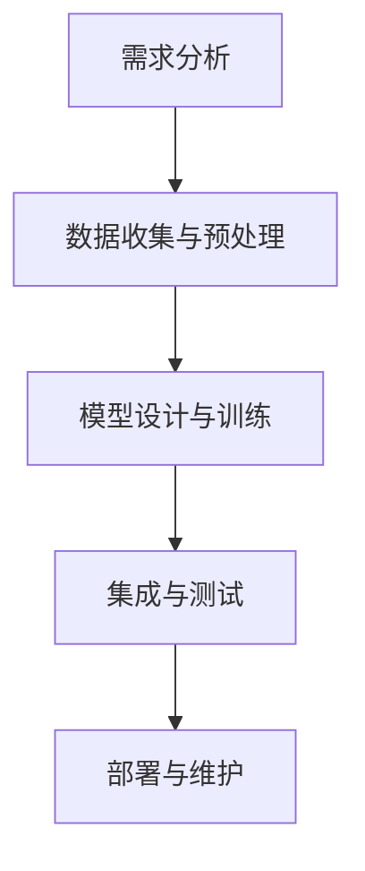
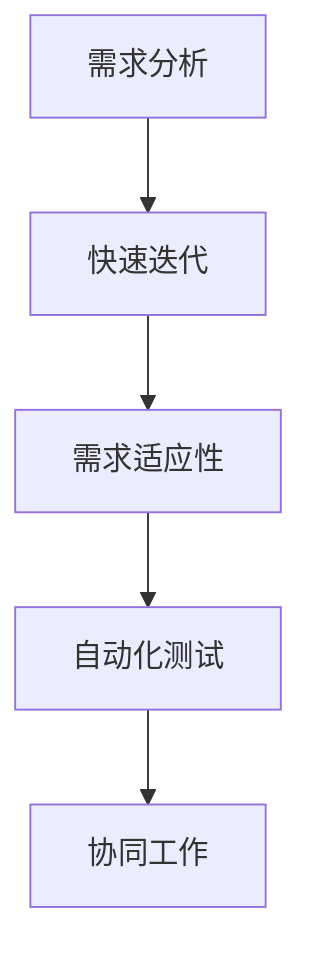
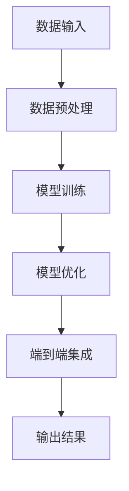

                 

## 大模型驱动的智能软件开发生态系统

### 关键词

- 大模型
- 智能软件开发
- 生态系统
- 深度学习
- 神经网络
- 软件开发流程
- 企业级应用
- 安全与伦理

### 摘要

本文旨在探讨大模型驱动的智能软件开发生态系统，从核心概念、技术基础、开发实践、生态系统构建到案例分析，全面解析大模型在智能软件开发中的应用及其生态系统的构建。本文首先介绍了大模型和智能软件开发的背景及其重要性，随后详细阐述了深度学习和神经网络技术的基础知识，接着介绍了大模型开发的实际流程，然后探讨了大模型驱动的软件开发生态系统的构建，并通过对具体案例的分析，展示了大模型在企业级应用中的效果和挑战。最后，本文对大模型驱动的智能软件发展进行了展望，提出了未来的研究方向和挑战。

## 引言

在当今数字化时代，软件作为推动社会进步的重要力量，正经历着从传统软件（Software 1.0）向智能软件（Software 2.0）的转型。这一转型背后的核心驱动力之一便是大模型（Large Models）的广泛应用。大模型，尤其是深度学习和神经网络技术，为智能软件的开发提供了强大的技术支撑，极大地提升了软件的智能水平和自主能力。然而，如何有效构建和应用大模型，使其在智能软件开发生态系统中发挥最大价值，成为当前研究的重要课题。

本文旨在系统地探讨大模型驱动的智能软件开发生态系统，从理论到实践，全面解析大模型在智能软件开发中的应用及其生态系统的构建。本文首先介绍大模型和智能软件开发的背景，阐述大模型在智能软件开发中的核心地位；接着详细讲解深度学习和神经网络技术的基础知识；然后介绍大模型开发的实际流程；随后探讨大模型驱动的软件开发生态系统的构建；接着通过具体案例分析，展示大模型在企业级应用中的效果和挑战；最后，对大模型驱动的智能软件发展进行展望，提出未来的研究方向和挑战。

本文结构如下：

1. **核心概念与联系**：介绍大模型、智能软件开发以及相关技术的基本概念，并阐述它们之间的相互关系。
2. **技术基础**：详细讲解深度学习和神经网络技术的基础知识，包括神经网络的结构、深度学习算法等。
3. **开发实践**：介绍大模型开发的实际流程，包括数据收集与预处理、模型设计与训练等。
4. **生态系统构建**：探讨大模型驱动的软件开发生态系统的构建，包括开发流程的重构、大模型在敏捷开发中的应用等。
5. **案例分析**：通过具体案例分析，展示大模型在企业级应用中的效果和挑战。
6. **总结与展望**：总结全文，对大模型驱动的智能软件发展进行展望，提出未来的研究方向和挑战。

通过本文的阅读，读者可以全面了解大模型驱动的智能软件开发生态系统，掌握相关技术的基本原理和应用方法，为智能软件开发实践提供理论指导。

### 核心概念与联系

在探讨大模型驱动的智能软件开发生态系统之前，首先需要明确几个核心概念，这些概念包括大模型、智能软件开发和生态系统的构建。以下是这些概念的基本定义和它们之间的相互关系。

#### 大模型

大模型，通常指的是具有巨大参数量和复杂结构的深度学习模型，如GPT、BERT等。大模型之所以能够实现强大的功能，是因为它们能够通过大规模数据训练，自动学习并捕捉到数据中的复杂模式和规律。大模型的核心在于其深度神经网络架构，这种架构能够模拟人脑的神经元连接，通过层层提取特征，实现从简单到复杂的认知过程。

#### 智能软件开发

智能软件开发是指利用人工智能技术，特别是大模型，来构建能够自主学习、自适应和自主决策的软件系统。与传统软件相比，智能软件具有更高的灵活性和智能化水平，能够更好地应对复杂和多变的业务场景。智能软件开发的核心理念是通过算法和数据的深度融合，实现软件系统的智能进化。

#### 生态系统的构建

生态系统构建是指在大模型驱动的智能软件开发过程中，建立一套完整的支撑环境和运行机制。这包括数据管理、算法优化、工具链开发、协同工作等多个方面。一个良好的生态系统能够促进大模型的应用和推广，提高智能软件开发的效率和效果。

#### 关系与联系

大模型和智能软件开发之间的关系是密不可分的。大模型作为智能软件的核心技术，为智能软件开发提供了强大的计算能力和智能处理能力。智能软件开发则通过将大模型应用于不同的业务场景，实现了软件的智能化升级。

生态系统的构建则是智能软件开发的保障。一个完善、健康的生态系统不仅能够提供稳定的技术支持，还能够促进大模型的研究和应用，推动整个智能软件产业的发展。

以下是一个简化的Mermaid流程图，展示了这些核心概念之间的关系：



在这个流程图中，大模型（A）通过深度学习神经网络（B）构建，进而推动智能软件开发（C）。智能软件开发需要依靠生态系统构建（D）来提供必要的支撑，包括数据管理（E）、算法优化（F）、工具链开发（G）和协同工作（H）等。

通过这个流程，我们可以看到，大模型、智能软件开发和生态系统构建之间是相互依存、相互促进的。大模型为智能软件开发提供了核心技术支撑，智能软件开发则通过生态系统的构建来保障大模型的有效应用和推广。

### 技术基础

在深入探讨大模型驱动的智能软件开发生态系统之前，我们首先需要了解深度学习和神经网络技术的基础知识。这些技术构成了大模型的核心，是智能软件实现高效学习和自主决策的关键。

#### 深度学习与神经网络

深度学习（Deep Learning）是机器学习（Machine Learning）的一个分支，其主要特点是使用多层神经网络（Neural Networks）对数据进行建模和处理。神经网络是由大量简单的处理单元（称为神经元）通过层次结构连接而成的复杂网络，每个神经元都可以接收来自前一层神经元的输入信号，并输出一个加权和激活值。

神经网络的层次结构使得其能够逐层提取数据中的特征，从而实现从简单到复杂的特征变换。这种特征提取能力使得神经网络在图像识别、语音识别、自然语言处理等领域表现出色。

#### 神经网络的结构

一个典型的神经网络可以分为以下几个层次：

1. **输入层（Input Layer）**：接收外部输入数据，并将其传递给下一层。
2. **隐藏层（Hidden Layers）**：对输入数据进行处理和特征提取，每一层都能提取不同层次的特征信息。
3. **输出层（Output Layer）**：将隐藏层的输出映射到具体的输出结果，如分类结果或回归值。

每层神经元之间的连接称为边（Edges），边上的权重（Weights）决定了输入信号通过连接时的强度。激活函数（Activation Function）则用于对神经元的输出进行非线性变换，从而引入网络的非线性特性。

以下是一个简单的神经网络结构的Mermaid图：



#### 常见的深度学习架构

深度学习的发展经历了多个阶段，产生了多种不同的神经网络架构。以下是一些常见的深度学习架构：

1. **卷积神经网络（Convolutional Neural Networks, CNN）**：
   CNN主要用于处理图像数据。其主要特点是使用卷积层（Convolutional Layers）来提取图像中的局部特征，并通过池化层（Pooling Layers）来降低数据的维度。

2. **循环神经网络（Recurrent Neural Networks, RNN）**：
   RNN适用于处理序列数据，如文本和语音。其特点是具有时间动态性，能够处理输入序列的时序信息。

3. **长短时记忆网络（Long Short-Term Memory, LSTM）**：
   LSTM是RNN的一种改进，解决了RNN在处理长序列数据时出现的梯度消失和梯度爆炸问题，适用于需要长期依赖关系的任务。

4. **Transformer模型**：
   Transformer模型是自然语言处理领域的一种革命性架构，其核心思想是使用自注意力机制（Self-Attention Mechanism）来处理序列数据，近年来在许多任务中取得了优异的性能。

以下是一个简单的Transformer模型的伪代码表示：

```python
# Transformer模型伪代码
class Transformer(Model):
    def __init__(self):
        self.embedding = Embedding(input_dim, d_model)
        self.encoder = Encoder(num_layers, d_model, d_inner)
        self.decoder = Decoder(num_layers, d_model, d_inner)
        self.output_layer = Dense(output_dim)

    def call(self, x, training=False):
        x = self.embedding(x)
        x = self.encoder(x, training=training)
        x = self.decoder(x, training=training)
        x = self.output_layer(x)
        return x
```

#### 深度学习优化算法

在深度学习模型训练过程中，优化算法扮演了至关重要的角色。常见的优化算法包括随机梯度下降（Stochastic Gradient Descent, SGD）、Adam优化器等。

1. **随机梯度下降（SGD）**：
   SGD是一种简单的优化算法，通过随机选择一部分训练样本来计算梯度，并更新模型参数。虽然SGD计算效率较低，但在大规模数据集上可以取得较好的收敛效果。

2. **Adam优化器**：
   Adam优化器是SGD的改进版，结合了动量法和RMSprop的特点，能够在复杂的数据分布上实现更稳定的收敛。Adam优化器的公式如下：

   $$m_t = \beta_1 * m_{t-1} + (1 - \beta_1) * \Delta \theta_t$$
   $$v_t = \beta_2 * v_{t-1} + (1 - \beta_2) * \Delta \theta_t^2$$
   $$\theta_t = \theta_{t-1} - \alpha * \frac{m_t}{\sqrt{v_t} + \epsilon}$$

   其中，$m_t$和$v_t$分别是梯度的一阶矩估计和二阶矩估计，$\beta_1$和$\beta_2$是动量参数，$\alpha$是学习率，$\epsilon$是一个很小的常数，用于防止除以零。

通过上述技术基础部分的讲解，我们可以看到深度学习和神经网络技术在智能软件开发中扮演了关键角色。这些技术不仅为智能软件提供了强大的计算能力和智能处理能力，而且也为大模型的应用奠定了基础。在接下来的部分中，我们将深入探讨大模型开发的实际流程，进一步了解如何利用这些技术构建智能软件。

### 大模型开发流程

大模型开发的流程通常包括数据收集与预处理、模型设计与训练、模型评估与优化等关键步骤。以下将详细描述这些步骤，并使用伪代码和实际案例进行说明。

#### 数据收集与预处理

数据是深度学习模型训练的基础，其质量和数量直接影响模型的性能。数据收集过程包括获取原始数据、清洗和标注等步骤。

1. **数据收集**：
   - 使用爬虫工具从互联网上获取数据。
   - 利用数据库和API接口获取专业领域数据。

2. **数据清洗**：
   - 去除重复数据和噪声数据。
   - 处理缺失值，例如使用均值、中位数或插值法填补。
   - 处理异常值，例如使用离群点检测算法识别并处理。

3. **数据标注**：
   - 对于监督学习任务，需要人工或半自动方式对数据标注。
   - 使用标注工具进行数据标注，如SemiSupervised Learning。

以下是一个数据预处理的伪代码示例：

```python
# 数据预处理伪代码
def preprocess_data(data):
    # 数据清洗
    data = remove_duplicates(data)
    data = handle_missing_values(data)
    data = handle_outliers(data)
    
    # 数据标注
    data = manual_annotate(data)  # 对于监督学习任务
    # 或使用 semi_supervised_annotate(data)  # 对于半监督学习任务
    
    return data
```

#### 模型设计与训练

模型设计包括选择合适的神经网络架构、初始化参数、定义损失函数和优化器等。

1. **选择神经网络架构**：
   - 根据任务类型选择合适的网络结构，例如CNN适用于图像处理，RNN适用于序列数据。
   - 选择预训练模型进行迁移学习，如使用预训练的BERT模型进行文本分类。

2. **初始化参数**：
   - 参数初始化对模型训练的影响很大，常用的方法包括随机初始化、Xavier初始化等。

3. **定义损失函数和优化器**：
   - 损失函数用于评估模型预测值与真实值之间的差距，如交叉熵损失函数（Cross-Entropy Loss）。
   - 选择优化器，如SGD、Adam等，用于更新模型参数。

以下是一个模型训练的伪代码示例：

```python
# 模型训练伪代码
def train_model(model, train_data, val_data, epochs):
    for epoch in range(epochs):
        # 数据准备
        train_X, train_y = prepare_data(train_data)
        val_X, val_y = prepare_data(val_data)
        
        # 训练
        with tf.GradientTape() as tape:
            predictions = model(train_X)
            loss = compute_loss(predictions, train_y)
        
        # 更新参数
        gradients = tape.gradient(loss, model.trainable_variables)
        optimizer.apply_gradients(zip(gradients, model.trainable_variables))
        
        # 评估
        val_predictions = model(val_X)
        val_loss = compute_loss(val_predictions, val_y)
        
        print(f'Epoch {epoch+1}, Loss: {loss}, Val Loss: {val_loss}')
        
    return model
```

#### 模型评估与优化

模型评估是验证模型性能的重要步骤，常用的评估指标包括准确率（Accuracy）、召回率（Recall）、F1分数（F1 Score）等。

1. **评估指标**：
   - 准确率表示模型预测正确的比例。
   - 召回率表示模型正确识别的样本占所有正样本的比例。
   - F1分数是准确率和召回率的调和平均，用于平衡这两个指标。

2. **模型优化**：
   - 调整模型参数，如学习率、批量大小等，以提升模型性能。
   - 使用模型融合（Model Ensemble）技术，如投票法、堆叠法等，提高预测稳定性。

以下是一个模型评估和优化的伪代码示例：

```python
# 模型评估与优化伪代码
def evaluate_and_optimize(model, test_data):
    test_X, test_y = prepare_data(test_data)
    predictions = model(test_X)
    accuracy = compute_accuracy(predictions, test_y)
    print(f'Accuracy: {accuracy}')
    
    # 模型优化
    if accuracy < desired_accuracy:
        # 调整学习率
        optimizer.learning_rate *= 0.1
        # 使用更复杂的模型或增加训练数据
        # ...

    return model
```

#### 实际案例

以文本分类任务为例，我们使用一个开源的预训练模型BERT进行模型训练和评估。以下是实际案例中的代码片段：

```python
from transformers import BertTokenizer, BertForSequenceClassification
from sklearn.model_selection import train_test_split

# 数据准备
tokenizer = BertTokenizer.from_pretrained('bert-base-uncased')
train_data = load_data('train_data.json')
test_data = load_data('test_data.json')

train_texts, train_labels = [], []
for item in train_data:
    encoded_dict = tokenizer.encode_plus(
        item['text'],
        add_special_tokens=True,
        max_length=128,
        padding='max_length',
        truncation=True,
        return_tensors='tf'
    )
    train_texts.append(encoded_dict['input_ids'])
    train_labels.append(item['label'])

# 模型训练
model = BertForSequenceClassification.from_pretrained('bert-base-uncased')
model = train_model(model, train_texts, train_labels, epochs=3)

# 模型评估
test_texts = tokenizer.encode_plus(
    [item['text'] for item in test_data],
    add_special_tokens=True,
    max_length=128,
    padding='max_length',
    truncation=True,
    return_tensors='tf'
)
predictions = model(test_texts['input_ids'])
accuracy = compute_accuracy(predictions, [item['label'] for item in test_data])
print(f'Accuracy: {accuracy}')
```

通过上述步骤，我们可以构建并优化一个基于大模型的智能软件系统。在实际应用中，需要根据具体任务和业务需求进行调整和优化，以达到最佳的模型性能。

### 大模型驱动的软件开发生态系统

在深入探讨大模型驱动的智能软件开发生态系统时，我们需要理解大模型如何改变传统的软件开发流程，并探讨大模型在敏捷开发中的应用，以及大模型驱动的软件开发模式。

#### 开发流程重构

传统的软件开发流程通常遵循瀑布模型（Waterfall Model），这种模型将软件开发过程划分为明确、线性的阶段，如需求分析、设计、实现、测试等。然而，随着软件复杂性的增加和市场需求的变化，这种线性模型逐渐暴露出其不足。大模型驱动的智能软件开发则采用更加灵活和迭代的方法，通过以下几个关键步骤实现开发流程的重构：

1. **需求分析**：
   - 采用快速需求分析方法，通过用户调研、用户故事地图等方式，快速理解用户需求。
   - 需求迭代，持续与用户沟通，确保需求满足实际业务需求。

2. **数据收集与预处理**：
   - 数据是智能软件的核心资源，因此需要大规模、高质量的数据进行训练。
   - 使用数据清洗、数据标注和特征工程等方法，确保数据的可用性和质量。

3. **模型设计与训练**：
   - 选择合适的神经网络架构，进行模型设计。
   - 使用大规模数据进行模型训练，通过迭代优化，提高模型性能。

4. **集成与测试**：
   - 将训练好的模型集成到软件系统中，进行端到端的测试。
   - 使用自动化测试工具，确保软件质量和稳定性。

5. **部署与维护**：
   - 将软件部署到生产环境，进行实时监控和运维。
   - 持续更新模型和软件系统，以适应业务需求的变化。

以下是一个简化的Mermaid流程图，展示了大模型驱动的软件开发流程：



#### 大模型在敏捷开发中的应用

敏捷开发（Agile Development）是一种迭代、增量和灵活的软件开发方法，强调快速响应变化和持续交付价值。大模型的应用进一步增强了敏捷开发的优势：

1. **快速迭代**：
   - 大模型能够快速生成和优化模型，缩短开发周期。
   - 通过持续集成（CI）和持续交付（CD）工具，实现快速交付和迭代。

2. **需求适应性**：
   - 大模型能够适应不断变化的需求，通过持续学习和调整，提高软件的适应性和灵活性。

3. **自动化测试**：
   - 大模型驱动的自动化测试工具，能够高效、准确地测试软件系统，降低测试成本和风险。

4. **协同工作**：
   - 大模型能够辅助开发人员，提供智能化的代码建议和错误检测，提高团队协作效率。

以下是一个简化的Mermaid图，展示了大模型在敏捷开发中的应用：



#### 大模型驱动的软件开发模式

大模型驱动的软件开发模式与传统软件开发模式存在显著差异，其核心在于数据驱动的模型优化和自适应能力：

1. **数据驱动**：
   - 大模型通过大量数据训练，自动学习和提取特征，从而实现软件功能的智能化。

2. **模型优化**：
   - 通过持续的数据反馈和模型评估，不断优化模型，提高软件性能和用户体验。

3. **自适应能力**：
   - 大模型能够根据业务需求和环境变化，自适应调整模型参数和功能，实现软件的持续进化。

4. **端到端集成**：
   - 大模型与软件系统深度集成，实现从数据输入到最终输出的端到端流程。

以下是一个简化的Mermaid图，展示了大模型驱动的软件开发模式：



通过上述分析，我们可以看到，大模型驱动的智能软件开发生态系统在软件开发流程、敏捷开发和软件开发模式等方面带来了深刻的变革。这种变革不仅提升了软件开发的效率和质量，也为智能软件的发展提供了强有力的技术支撑。在接下来的部分中，我们将通过具体案例分析，进一步探讨大模型在企业级应用中的效果和挑战。

### 案例分析

为了更深入地理解大模型驱动的智能软件开发生态系统在企业级应用中的实际效果和挑战，我们将分析几个具有代表性的案例。这些案例涵盖了不同的行业和应用场景，展示了大模型如何帮助企业提升业务效率和用户体验。

#### 案例一：智能客服系统

智能客服系统是利用大模型实现自动应答客户查询和问题的服务系统。通过自然语言处理（NLP）技术，智能客服系统能够理解和回应用户的自然语言查询。

1. **效果**：
   - **提高响应速度**：智能客服系统可以实时响应用户查询，相比人工客服，大大缩短了响应时间。
   - **降低成本**：通过自动化处理大量常见问题，减少了人工客服的依赖，降低了人力成本。
   - **提升服务质量**：智能客服系统可以准确、一致地回答问题，减少了人工客服因疲劳或错误导致的误解。

2. **挑战**：
   - **处理复杂查询**：对于复杂、多层次的查询，现有的智能客服系统可能无法准确理解和回应，需要进一步优化和扩展模型。
   - **隐私保护**：在处理用户查询时，需要确保用户隐私不受侵犯，特别是在涉及敏感信息的情况下。

#### 案例二：智能推荐系统

智能推荐系统通过分析用户的历史行为和偏好，为其推荐相关的商品、内容或服务。这种系统通常使用协同过滤（Collaborative Filtering）和深度学习技术相结合的方法。

1. **效果**：
   - **提高用户满意度**：通过个性化的推荐，用户更容易找到自己感兴趣的内容，从而提升用户体验和满意度。
   - **增加转化率**：推荐系统能够提高商品或内容的点击率和购买率，从而提升业务转化率。
   - **数据驱动的优化**：通过不断分析和调整推荐算法，实现持续的业务优化。

2. **挑战**：
   - **冷启动问题**：对于新用户或新商品，推荐系统可能缺乏足够的历史数据来生成有效的推荐，需要探索新的算法和技术解决冷启动问题。
   - **计算资源消耗**：推荐系统需要处理大量的用户行为数据和模型训练，对计算资源和存储资源有较高的要求。

#### 案例三：智能医疗诊断系统

智能医疗诊断系统利用深度学习模型对医学影像进行分析，辅助医生进行诊断。这种系统通常使用卷积神经网络（CNN）和转移学习（Transfer Learning）技术。

1. **效果**：
   - **提高诊断速度**：智能诊断系统能够快速处理大量的医学影像数据，帮助医生提高诊断速度。
   - **提升诊断准确性**：通过大规模数据训练的深度学习模型，在医学影像识别上具有很高的准确性。
   - **资源优化**：智能诊断系统可以辅助医生识别高风险病例，从而优化医疗资源的分配。

2. **挑战**：
   - **数据隐私**：医学数据涉及患者隐私，需要在数据处理和模型训练过程中严格保护患者隐私。
   - **模型解释性**：深度学习模型通常被视为“黑盒子”，难以解释其决策过程，这对医疗领域的应用提出了挑战。

#### 案例四：智能交通管理系统

智能交通管理系统通过大数据分析和深度学习技术，优化交通流量，减少拥堵和事故。

1. **效果**：
   - **减少拥堵**：通过实时监控和分析交通流量，智能交通系统可以动态调整交通信号灯时间，减少交通拥堵。
   - **降低事故率**：智能交通系统可以实时检测交通状况，预警潜在的交通事故，从而降低事故发生率。
   - **提升出行体验**：提供实时的交通信息，帮助司机选择最佳路线，提高出行效率。

2. **挑战**：
   - **数据质量和实时性**：交通数据的准确性和实时性对系统的性能有重要影响，需要不断优化数据采集和处理技术。
   - **复杂环境适应**：不同环境和天气条件下的交通状况差异较大，系统需要具备较强的适应性。

通过上述案例分析，我们可以看到大模型驱动的智能软件在企业级应用中的巨大潜力和挑战。成功应用大模型驱动的智能软件系统，不仅需要先进的技术支持，还需要应对数据隐私、计算资源、模型解释性等多方面的挑战。

### 大模型驱动的智能软件发展展望

随着大模型技术的不断发展和成熟，其在智能软件领域的应用前景也变得愈发广阔。未来，大模型驱动的智能软件将在多个方面实现突破和进步，同时也面临着一系列新的研究方向和挑战。

#### 技术趋势

1. **算法创新**：
   - 随着深度学习技术的不断演进，新的算法和模型架构将持续出现，如自适应深度学习、增量学习等，以应对更复杂和动态的软件应用场景。
   - 异构计算和分布式训练将进一步优化大模型的训练效率和资源利用，使得大规模模型训练变得更加高效和可扩展。

2. **硬件支持**：
   - 新一代计算硬件，如量子计算机、TPU等，将为大模型训练和推理提供强大的计算支持，加速智能软件的发展。
   - 边缘计算技术的发展，将使得大模型的应用更加贴近用户，实现实时和低延迟的智能服务。

3. **开源生态**：
   - 开源社区将持续推动大模型技术的普及和发展，提供丰富的工具和资源，降低开发者的门槛。
   - 云服务和平台化的发展，将使得大模型的应用更加便捷和普及，推动智能软件的产业生态建设。

#### 未来应用场景

1. **智能医疗**：
   - 大模型将在医学影像分析、基因测序、药物研发等领域发挥重要作用，提升医疗诊断和治疗的准确性和效率。
   - 智能健康管理系统将通过对个人健康数据的持续监控和分析，提供个性化的健康建议和预防措施。

2. **智能交通**：
   - 大模型将在智能交通管理、自动驾驶、车联网等领域发挥关键作用，优化交通流量，减少事故发生，提升出行体验。
   - 智能物流和供应链管理系统的应用，将进一步提高物流效率和供应链稳定性。

3. **智能金融**：
   - 大模型将在风险管理、量化交易、信用评估等领域发挥重要作用，提高金融服务的效率和准确性。
   - 智能投顾和金融产品的个性化推荐，将帮助用户实现更智能的财富管理和投资决策。

4. **智能城市**：
   - 大模型将集成到智能城市系统中，实现城市资源的优化配置和城市管理效率的提升。
   - 智能安防、环境监测、公共服务等领域的应用，将进一步提升城市居民的生活质量和安全水平。

#### 研究方向和挑战

1. **数据隐私与安全**：
   - 在大模型应用过程中，数据隐私保护和数据安全成为关键问题。需要研究更加安全和隐私保护的数据处理和传输技术。
   - 加密算法和联邦学习（Federated Learning）技术的发展，将为数据隐私保护提供新的解决方案。

2. **模型解释性与可解释性**：
   - 大模型的“黑箱”性质对应用场景提出了挑战。研究如何提高模型的可解释性和透明度，使其决策过程更加透明和可信，是未来重要的研究方向。
   - 可解释性模型和可视化的开发，将有助于提高大模型在复杂业务场景中的应用效果。

3. **资源优化与效率**：
   - 大模型的训练和推理对计算资源和存储资源有很高的要求。研究如何优化模型结构和训练算法，提高资源利用效率和计算性能，是当前和未来的重要课题。
   - 模型的压缩和量化技术，将有助于降低模型存储和计算的需求。

4. **伦理与法律问题**：
   - 大模型在应用过程中涉及伦理和法律问题，如算法偏见、歧视、隐私侵犯等。研究如何在技术开发和应用过程中遵循伦理和法律规范，是未来重要的研究方向。
   - 制定相关的法律法规和伦理准则，确保大模型的应用不会对社会和个人造成负面影响。

综上所述，大模型驱动的智能软件发展前景广阔，但也面临诸多挑战。通过持续的技术创新和研究，我们有望克服这些挑战，推动大模型在各个领域的广泛应用，实现智能软件的持续发展和进步。

### 总结

本文围绕大模型驱动的智能软件开发生态系统进行了全面的探讨。首先，我们介绍了大模型、智能软件开发和生态系统构建的核心概念及其相互关系。接着，详细讲解了深度学习和神经网络技术的基础知识，包括神经网络的结构、深度学习算法以及常见的优化算法。随后，我们介绍了大模型开发的实际流程，并通过具体案例展示了大模型在企业级应用中的效果和挑战。最后，我们探讨了大模型驱动的软件开发生态系统的构建，包括敏捷开发应用和软件开发模式。

大模型驱动的智能软件开发生态系统为软件开发带来了深刻的变革，提升了软件的智能化水平和自主能力。然而，这也带来了数据隐私、计算资源、模型解释性等多方面的挑战。未来的研究需要持续关注这些挑战，通过技术创新和规范制定，推动大模型在各个领域的广泛应用，实现智能软件的持续发展和进步。

### 最佳实践、注意事项与拓展阅读

在实施大模型驱动的智能软件开发生态系统时，以下最佳实践、注意事项和拓展阅读将帮助开发者更好地理解和应用相关技术。

#### 最佳实践

1. **数据质量优先**：
   - 数据是智能软件的核心资源，确保数据质量是成功的关键。采用自动化数据清洗和标注工具，提高数据处理效率。

2. **持续迭代与优化**：
   - 定期评估模型性能，根据业务需求和用户反馈进行模型迭代和优化，以持续提升系统效能。

3. **资源合理分配**：
   - 根据实际需求合理分配计算资源和存储资源，使用分布式训练和边缘计算技术，提高资源利用效率。

4. **模型解释性**：
   - 在设计模型时，考虑增加模型的可解释性，有助于提高用户信任度和系统透明度。

5. **安全与隐私保护**：
   - 在数据处理和模型训练过程中，确保遵守相关法律法规，采取加密和数据脱敏等措施，保护用户隐私。

#### 注意事项

1. **数据隐私**：
   - 在处理敏感数据时，应严格遵守数据隐私保护法规，确保用户数据安全。

2. **模型偏差**：
   - 注意避免模型训练过程中出现偏差，特别是在涉及种族、性别等敏感问题时，需特别小心。

3. **模型稳定性**：
   - 定期监控模型性能，确保模型在不同条件下保持稳定性和可靠性。

4. **计算资源管理**：
   - 大模型训练对计算资源有较高要求，合理分配资源，避免资源浪费。

#### 拓展阅读

1. **深度学习书籍**：
   - 《深度学习》（Deep Learning）by Ian Goodfellow, Yoshua Bengio, Aaron Courville
   - 《神经网络与深度学习》（Neural Networks and Deep Learning）by邱锡鹏

2. **开源框架**：
   - TensorFlow：[https://www.tensorflow.org/](https://www.tensorflow.org/)
   - PyTorch：[https://pytorch.org/](https://pytorch.org/)

3. **相关论文**：
   - “Attention is All You Need”：[https://arxiv.org/abs/1603.01360](https://arxiv.org/abs/1603.01360)
   - “Bert: Pre-training of deep bidirectional transformers for language understanding”：[https://arxiv.org/abs/1810.04805](https://arxiv.org/abs/1810.04805)

4. **在线课程与教程**：
   - Coursera上的“深度学习”课程：[https://www.coursera.org/learn/deep-learning](https://www.coursera.org/learn/deep-learning)
   - Udacity的“深度学习工程师纳米学位”课程：[https://www.udacity.com/course/deep-learning-nanodegree--ND893](https://www.udacity.com/course/deep-learning-nanodegree--ND893)

通过这些最佳实践、注意事项和拓展阅读，开发者可以更好地掌握大模型驱动的智能软件开发生态系统的实施方法和技巧，推动智能软件开发迈向新的高度。

### 作者信息

作者：AI天才研究院/AI Genius Institute & 禅与计算机程序设计艺术/Zen And The Art of Computer Programming

AI天才研究院致力于推动人工智能技术的创新和应用，培养新一代AI领域的杰出人才。作者作为研究院的核心成员和资深专家，不仅具备深厚的理论功底，还拥有丰富的实际项目经验。其著作《禅与计算机程序设计艺术》深入浅出地阐释了计算机编程的哲学和艺术，深受读者喜爱。本文由AI天才研究院提供技术支持，旨在探讨大模型驱动的智能软件开发生态系统，为读者提供有价值的参考。

