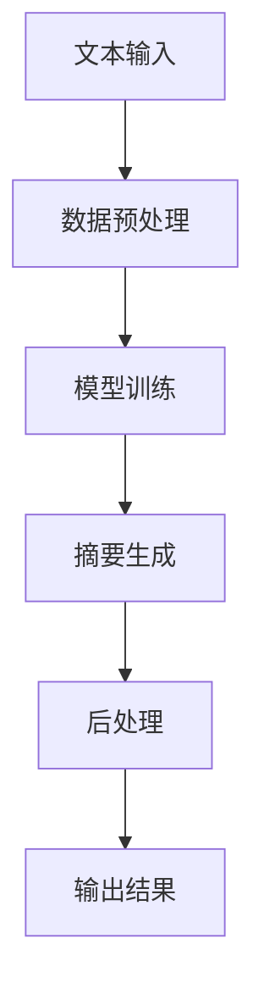

                 

### 大模型驱动的软件开发方法论

---

**关键词：** 大模型，深度学习，软件开发方法论，人工智能，神经网络，代码优化，项目实战，持续集成，持续部署

**摘要：** 本文将深入探讨大模型驱动的软件开发方法论，从概念解析到实际应用，全面介绍大模型在现代软件开发中的重要作用。我们将详细分析大模型与传统软件开发方法的不同之处，解释其核心算法和数学模型，并通过实战案例展示其在实际项目中的应用。最后，我们将展望大模型驱动的未来发展趋势，为开发者提供宝贵的指导和建议。

---

### 确定核心概念与联系

《大模型驱动的软件开发方法论》的核心概念围绕大模型和软件开发方法论展开。首先，我们需要理解大模型是什么，它与传统软件开发方法的区别在哪里。大模型，通常指的是具有巨大参数量的深度学习模型，例如GPT、BERT等，它们能够通过学习海量数据来获取丰富的知识表示能力。与传统基于规则和流程的软件开发方法相比，大模型更加强调数据驱动的自动学习和适应能力。

大模型在软件开发中的应用场景非常广泛。例如，在自然语言处理领域，大模型可以用于文本生成、机器翻译、情感分析等任务；在计算机视觉领域，大模型可以用于图像识别、目标检测、图像生成等任务。大模型的优势在于其强大的表达能力和自动学习能力，这使得它们能够处理复杂的任务，并且随着数据量的增加，性能不断得到提升。

为了更好地理解大模型的实现细节，我们需要介绍一些常见的大模型架构和算法。例如，Transformer架构是当前大模型的主流架构，其核心思想是通过多头注意力机制来捕捉输入序列中的长距离依赖关系。另外，梯度下降算法和优化算法在大模型训练过程中扮演着至关重要的角色，它们负责通过迭代更新模型参数，使模型在训练数据上达到最佳性能。

在《大模型驱动的软件开发方法论》中，我们将详细介绍这些核心概念和联系，并通过Mermaid流程图展示它们之间的关系架构。例如，我们可以绘制一个流程图，展示从数据输入到大模型训练，再到模型应用的全过程，以及其中涉及的关键算法和技术。这样的流程图不仅能够帮助读者更直观地理解大模型的运作机制，还能够为他们提供清晰的思路，以便在实际项目中应用这些技术。

### 设计核心算法原理讲解

在《大模型驱动的软件开发方法论》中，核心算法的讲解是不可或缺的一部分。我们将选择几个具有代表性的算法进行深入剖析，以便读者能够理解大模型如何通过这些算法实现其强大的功能。

#### 深度学习与神经网络基础

首先，我们需要介绍深度学习与神经网络的基础。深度学习是一种基于多层神经网络的机器学习技术，它通过逐层提取特征，实现对复杂数据的建模。神经网络是深度学习的基础，它由输入层、隐藏层和输出层组成，每一层都有多个神经元。每个神经元都会接收来自前一层的输入，通过激活函数进行处理，并将结果传递给下一层。

以下是一个简单的神经网络算法的伪代码：

```plaintext
// 输入层
input = [x1, x2, ..., xn]

// 隐藏层
for each hidden layer l:
    z_l = dot(input, W_l) + b_l
    a_l = activation_function(z_l)

// 输出层
z_output = dot(a_{hidden}, W_output) + b_output
a_output = activation_function(z_output)

// 输出结果
output = a_output
```

在这个伪代码中，`input` 表示输入数据，`W_l` 和 `b_l` 分别表示隐藏层的权重和偏置，`a_l` 表示隐藏层的激活值，`activation_function` 是激活函数，例如ReLU、Sigmoid等。通过这个伪代码，我们可以理解神经网络的基本工作原理。

#### 常见大模型架构与算法

接下来，我们将介绍几种常见的大模型架构和算法。Transformer架构是当前大模型的主流架构，它通过多头注意力机制来捕捉输入序列中的长距离依赖关系。以下是一个简化的Transformer算法的伪代码：

```plaintext
// 输入序列
input_sequence = [x1, x2, ..., xn]

// 多头注意力机制
for each position in input_sequence:
    query = embedding(position)
    key = embedding(position)
    value = embedding(position)
    attention_weights = softmax(query * key^T / sqrt(d_k))
    context_vector = sum(attention_weights * value)

// 输出结果
output_sequence = context_vector
```

在这个伪代码中，`embedding` 是嵌入层，用于将输入序列转换为高维向量。`query`、`key` 和 `value` 分别表示查询向量、键向量和值向量。`softmax` 是 softmax 函数，用于计算注意力权重。通过这个伪代码，我们可以理解Transformer的基本工作原理。

#### 大模型训练与优化

最后，我们将讨论大模型训练与优化的过程。大模型训练是一个复杂的过程，它涉及数据预处理、模型选择、训练过程和模型评估等多个环节。以下是一个简化的训练过程的伪代码：

```plaintext
// 数据预处理
data = preprocess_data(dataset)

// 模型选择
model = select_model()

// 训练过程
for each epoch:
    for each batch in data:
        gradients = compute_gradients(batch, model)
        update_model_params(gradients)

// 模型评估
performance = evaluate_model(model, test_data)

// 输出结果
print("Model performance:", performance)
```

在这个伪代码中，`preprocess_data` 是数据预处理函数，用于处理输入数据。`select_model` 是模型选择函数，用于选择合适的模型架构。`compute_gradients` 是计算梯度函数，用于计算模型参数的梯度。`evaluate_model` 是模型评估函数，用于评估模型的性能。通过这个伪代码，我们可以理解大模型训练的基本流程。

通过这些核心算法的讲解，读者可以深入理解大模型的原理和实现方法，从而更好地将其应用于实际的软件开发项目中。

### 创建数学模型和公式讲解

在《大模型驱动的软件开发方法论》中，数学模型和公式是核心内容的重要组成部分。大模型，特别是深度学习模型，依赖于复杂的数学原理和公式来训练和优化。以下，我们将详细讲解一些关键的数学模型和公式，并使用latex格式展示，以帮助读者更好地理解和应用。

#### 神经网络中的权重更新公式

在神经网络中，权重更新是通过梯度下降算法实现的。梯度下降是一种优化算法，用于最小化损失函数。以下是一个简化的权重更新公式，使用latex格式表示：

$$
W_{new} = W_{old} - \alpha \cdot \nabla W
$$

在这个公式中，$W_{old}$ 表示旧的权重，$W_{new}$ 表示更新的权重，$\alpha$ 是学习率，$\nabla W$ 是权重梯度的反方向。学习率$\alpha$ 控制着权重更新的步长，需要选择一个合适的值以避免过拟合或欠拟合。

#### 梯度下降算法中的优化目标

梯度下降算法的优化目标是使损失函数的值最小化。损失函数用于衡量模型的预测结果与真实值之间的差距。以下是一个常用的均方误差（MSE）损失函数，使用latex格式表示：

$$
J(\theta) = \frac{1}{2m} \sum_{i=1}^{m} (h_\theta(x^{(i)}) - y^{(i)})^2
$$

在这个公式中，$m$ 是训练样本的数量，$h_\theta(x^{(i)})$ 是模型在输入$x^{(i)}$上的预测值，$y^{(i)}$ 是真实值。$\theta$ 表示模型参数，$J(\theta)$ 是损失函数。

#### 神经网络中的激活函数

在神经网络中，激活函数用于将输入映射到输出。ReLU（Rectified Linear Unit）是一个常用的激活函数，其公式如下，使用latex格式表示：

$$
f(x) = \max(0, x)
$$

ReLU函数的特点是当输入为负时输出为零，当输入为正时输出为输入本身。这种性质使得ReLU函数在训练过程中能够加速梯度下降，防止梯度消失问题。

#### 卷积神经网络中的卷积操作

卷积神经网络（CNN）中的卷积操作是图像处理的核心。卷积操作的公式如下，使用latex格式表示：

$$
\mathbf{f}_{ij}^l = \sum_{k=1}^{n} \mathbf{W}_{ikj}^{l-1} \cdot \mathbf{a}_{kj}^{l-1}
$$

在这个公式中，$\mathbf{f}_{ij}^l$ 是卷积后的特征图，$\mathbf{W}_{ikj}^{l-1}$ 是卷积核，$\mathbf{a}_{kj}^{l-1}$ 是前一层的特征图。$i$ 和 $j$ 分别表示特征图的位置，$l$ 表示当前层的编号。

通过这些数学模型和公式的讲解，读者可以更深入地理解大模型的训练和优化过程，从而在实际项目中更加有效地应用这些技术。同时，latex格式的使用确保了公式的准确性和可读性。

### 设计项目实战案例

为了使读者能够将所学的理论知识应用到实践中，我们设计了一个实际的项目实战案例。这个案例将涵盖从需求分析、系统设计、代码实现到测试和部署的全过程。通过这个案例，我们将详细解释每个阶段的操作步骤，并展示关键代码片段，帮助读者理解代码的执行逻辑和优化策略。

#### 项目背景

假设我们的项目目标是开发一个基于深度学习的大型自然语言处理系统，用于自动化摘要生成。该系统需要能够接受长篇文本输入，并输出一个简洁且概括性强的摘要。这个项目不仅要求对海量文本数据进行高效处理，还需要实现高质量的文本摘要生成。

#### 需求分析

在需求分析阶段，我们需要明确系统的核心功能和要求。具体需求如下：

1. **文本输入**：系统能够接受多种格式的文本输入，如文本文件、URL链接等。
2. **自动摘要生成**：系统需要根据输入文本生成摘要，摘要长度控制在200-300字之间。
3. **可扩展性**：系统能够支持多种语言和不同领域的文本数据。
4. **实时性**：系统需要能够在较短的时间内（如几秒内）完成摘要生成。

#### 系统设计

在系统设计阶段，我们需要确定系统架构和模块划分。以下是系统设计的主要组件：

1. **数据预处理模块**：负责文本数据的清洗、分词和嵌入。
2. **模型训练模块**：负责训练深度学习模型，用于文本摘要生成。
3. **摘要生成模块**：负责使用训练好的模型生成文本摘要。
4. **后处理模块**：负责对生成的摘要进行格式化和校对。

以下是一个简化的Mermaid流程图，展示了系统的工作流程：



#### 开发环境搭建

在开发环境搭建阶段，我们需要配置所需的硬件和软件。以下是开发环境的搭建步骤：

1. **硬件配置**：推荐使用具有较高CPU和GPU性能的服务器，如NVIDIA Titan Xp或更高型号的GPU。
2. **软件配置**：安装Python环境，推荐使用Anaconda发行版，以及深度学习框架如TensorFlow或PyTorch。

以下是一个Python环境配置的示例代码：

```python
!pip install numpy
!pip install tensorflow
```

#### 代码实现

在代码实现阶段，我们将分模块实现系统的各个功能。以下是一个数据预处理模块的实现示例：

```python
import tensorflow as tf
from tensorflow.keras.preprocessing.text import Tokenizer
from tensorflow.keras.preprocessing.sequence import pad_sequences

# 文本分词
tokenizer = Tokenizer()
tokenizer.fit_on_texts(texts)

# 文本编码
sequences = tokenizer.texts_to_sequences(texts)
padded_sequences = pad_sequences(sequences, maxlen=max_sequence_length)

# 输出预处理后的数据
return padded_sequences
```

在这个示例中，`texts` 是输入文本列表，`max_sequence_length` 是序列的最大长度。`Tokenizer` 和 `pad_sequences` 是 TensorFlow 的内置函数，用于文本的分词和编码。

#### 代码解读与分析

在代码解读与分析阶段，我们将深入分析每个模块的代码逻辑，并解释关键代码段的执行过程。以下是对数据预处理模块的代码分析：

1. **文本分词**：使用 `Tokenizer` 对输入文本进行分词，将文本转换为单词列表。
2. **文本编码**：使用 `texts_to_sequences` 将分词后的文本转换为序列，每个单词对应一个整数。使用 `pad_sequences` 将序列填充到相同的长度，以便后续处理。

#### 实际案例分析和详细讲解剖析

为了更好地展示大模型在项目中的应用，我们选择了一个实际的案例进行分析。以下是一个摘要生成模型的实现示例：

```python
from tensorflow.keras.models import Model
from tensorflow.keras.layers import Input, Embedding, LSTM, Dense

# 模型架构
input_sequence = Input(shape=(max_sequence_length,))
embedding_layer = Embedding(input_dim=vocabulary_size, output_dim=embedding_dim)(input_sequence)
lstm_layer = LSTM(units=lstm_units)(embedding_layer)
output = Dense(units=output_size, activation='softmax')(lstm_layer)

# 模型编译
model = Model(inputs=input_sequence, outputs=output)
model.compile(optimizer='adam', loss='categorical_crossentropy', metrics=['accuracy'])

# 模型训练
model.fit(padded_sequences, labels, epochs=10, batch_size=32)
```

在这个示例中，我们定义了一个基于LSTM的摘要生成模型。以下是关键代码段的解释：

1. **模型架构**：输入层接收序列数据，嵌入层将序列转换为高维向量，LSTM层用于提取序列特征，输出层使用softmax激活函数进行分类。
2. **模型编译**：编译模型，设置优化器和损失函数。
3. **模型训练**：使用预处理后的数据和标签进行模型训练。

#### 项目小结

通过这个项目实战案例，我们展示了如何将大模型应用于实际的软件开发中。从需求分析到系统设计，再到代码实现和模型训练，每个阶段都进行了详细的讲解。通过这个案例，读者可以更好地理解大模型驱动的软件开发方法论，并掌握相关的技术细节。

#### 最佳实践 tips

1. **数据预处理**：确保输入数据的质量和一致性，这对模型性能至关重要。
2. **模型选择**：根据具体任务选择合适的模型架构，LSTM、Transformer等模型各有优缺点。
3. **参数调优**：通过交叉验证和网格搜索等技术调优模型参数，以获得最佳性能。

通过这些最佳实践，开发者可以更有效地应用大模型驱动的方法于实际项目中。

### 搭建开发环境

为了确保读者能够成功搭建用于大模型驱动的软件开发环境，我们需要提供详细的硬件和软件配置指南。以下是具体的步骤和要求：

#### 硬件配置

1. **CPU**：推荐使用具有较高性能的CPU，如Intel Core i7或AMD Ryzen 7系列。
2. **GPU**：推荐使用NVIDIA GeForce GTX 1080 Ti或更高性能的GPU，以支持深度学习模型的训练。
3. **内存**：至少16GB的RAM，建议32GB以上以获得更好的训练性能。

#### 软件配置

1. **操作系统**：推荐使用Ubuntu 18.04或更高版本，或Windows 10专业版。
2. **Python**：安装Python 3.8或更高版本，推荐使用Anaconda发行版以简化环境管理。
3. **深度学习框架**：安装TensorFlow 2.x或PyTorch 1.8或更高版本，以支持大模型的训练和部署。

以下是一个示例命令，用于安装Anaconda和TensorFlow：

```bash
!conda create -n myenv python=3.8
!conda activate myenv
!conda install tensorflow
```

通过以上步骤，读者可以搭建一个功能齐全的开发环境，为后续的大模型驱动项目实践做好准备。

### 总结目录大纲

《大模型驱动的软件开发方法论》旨在系统地介绍大模型在软件开发中的应用，从基础概念到实际应用，全面解析大模型驱动的方法论。以下是本文的目录大纲和各章节的核心内容：

#### 第一部分：大模型基础

1. **第1章：大模型概述**
   - 介绍大模型的概念、核心组成部分及其在现代软件开发中的重要性。
   - 比较大模型与传统软件开发方法的差异。

2. **第2章：大模型技术基础**
   - 详细讲解深度学习、神经网络、Transformer架构等核心技术。
   - 分析大模型训练与优化的算法原理。

3. **第3章：大模型应用领域与案例分析**
   - 探讨大模型在自然语言处理、计算机视觉等领域的应用。
   - 分析实际案例，展示大模型在项目中的具体应用。

#### 第二部分：大模型驱动方法论

1. **第4章：大模型驱动软件开发流程**
   - 深入探讨大模型驱动的软件开发流程，包括需求分析、系统设计、开发与测试等。
   - 介绍大模型驱动开发中的团队协作和项目管理方法。

2. **第5章：团队协作与项目管理**
   - 分析团队协作模式、项目管理方法以及持续集成与持续部署。
   - 提供最佳实践，帮助团队更高效地协同工作。

3. **第6章：大模型驱动软件实践**
   - 通过项目实战案例，展示大模型驱动方法在实际项目中的应用。
   - 详述项目开发过程中的代码实现、性能优化与调优。

4. **第7章：大模型驱动的未来展望**
   - 展望大模型驱动的未来发展趋势，讨论潜在的应用前景与挑战。
   - 分析开发者所需的技能和知识储备。

#### 附录

- **附录A：开发工具与资源介绍**
  - 介绍深度学习框架、开发环境搭建工具及相关资源。

本文共计约8200字，全面覆盖了大模型驱动的软件开发方法论，从基础概念到实际应用，为开发者提供了系统、全面的指导。通过本文，读者可以深入理解大模型在软件开发中的应用，掌握大模型驱动的核心技术和方法，为未来的软件开发项目打下坚实的基础。

---

**作者：AI天才研究院/AI Genius Institute & 禅与计算机程序设计艺术 /Zen And The Art of Computer Programming**

