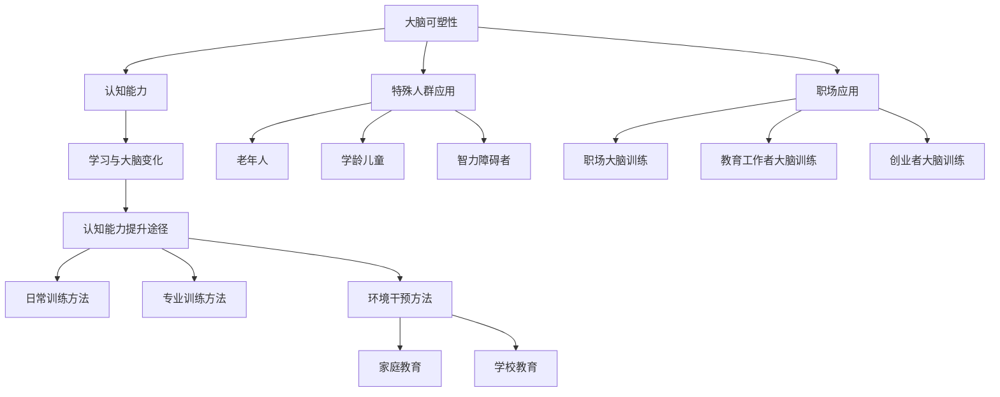
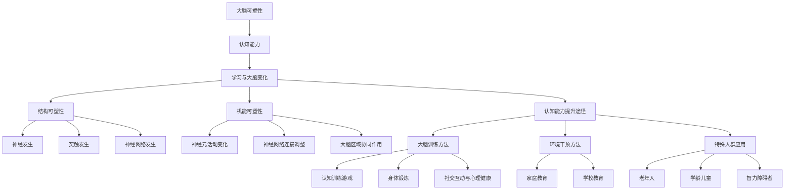

                 

# 大脑的可塑性与世界认知能力的提升

> 关键词：大脑可塑性、认知能力、学习、神经可塑性训练、环境干预、特殊人群应用

> 摘要：本文从大脑可塑性的角度出发，探讨了认知能力的提升方法。首先介绍了大脑可塑性的概念、类型及其与学习的关系。随后，分析了认知能力的定义与分类，以及提升认知能力的途径。接着，详细阐述了大脑训练方法、环境干预方法和特殊人群中的应用。最后，探讨了大脑可塑性与认知提升的未来趋势。

## 第一部分：大脑的可塑性与认知科学基础

### 第1章：大脑可塑性概述

#### 1.1 大脑可塑性的概念与历史

##### 1.1.1 大脑可塑性的定义

大脑可塑性是指大脑在一生中不断适应环境和经验变化的能力。这种能力使得大脑能够改变其结构、功能和连接，以适应新的需求和学习。

##### 1.1.2 大脑可塑性的历史发展

大脑可塑性的概念最早可以追溯到19世纪，当时神经科学家已经开始观察到大脑在学习和记忆过程中的变化。随着20世纪的科学技术进步，对大脑可塑性的研究逐渐深入，揭示了大脑在不同阶段和不同情境下的可塑性机制。

#### 1.2 大脑可塑性的类型

##### 1.2.1 结构可塑性

结构可塑性是指大脑细胞和神经网络的改变，包括新生神经元（神经发生）、突触重塑（突触发生）和神经网络重塑（神经网络发生）。这些改变可以影响大脑的功能和结构。

##### 1.2.2 机能可塑性

机能可塑性是指大脑在功能上的改变，包括神经元活动的变化、神经网络连接的调整以及大脑区域之间的协同作用。这种改变可以影响大脑的认知能力和行为。

#### 1.3 大脑可塑性与学习

##### 1.3.1 学习与大脑可塑性的关系

学习是一种复杂的大脑活动，涉及神经可塑性的多个方面。学习过程中，大脑通过改变其结构和功能来适应新的知识和技能。这种适应过程是大脑可塑性的体现。

##### 1.3.2 学习过程中大脑的变化

在学习过程中，大脑发生了一系列变化，包括神经元之间的连接增强、神经活动模式的改变以及神经网络的重塑。这些变化有助于大脑适应新的学习任务，提高认知能力和学习能力。

### 第2章：认知能力的概述

#### 2.1 认知能力的定义与分类

##### 2.1.1 认知能力的定义

认知能力是指大脑处理信息、解决问题、学习和记忆的能力。它是人类智力的重要组成部分，包括注意力、感知、记忆、语言、推理、决策等多种能力。

##### 2.1.2 认知能力的分类

认知能力可以分为多个子类别，包括感知能力、注意力、记忆、语言、推理、空间能力、执行功能和社交认知能力等。这些子类别共同构成了人类的认知能力体系。

#### 2.2 认知能力提升的途径

##### 2.2.1 大脑训练

大脑训练是通过各种方法和工具，如认知游戏、脑电刺激、记忆训练等，来提高大脑的认知能力。这些方法可以促进大脑的可塑性，增强神经网络的连接和功能。

##### 2.2.2 环境干预

环境干预是指通过改变外界环境，如学习环境、社交环境、体育锻炼等，来提高大脑的认知能力。良好的环境可以激发大脑的可塑性，促进认知能力的提升。

##### 2.2.3 认知神经科学的相关理论

认知神经科学是研究大脑如何实现认知功能的学科。它揭示了大脑可塑性与认知能力之间的内在联系，为认知能力的提升提供了科学依据。

## 第二部分：认知能力的提升与大脑可塑性

### 第3章：大脑训练方法

#### 3.1 神经可塑性训练的基本原理

##### 3.1.1 神经可塑性训练的概念

神经可塑性训练是一种通过特定刺激和方法，如脑电刺激、认知训练等，来促进大脑神经可塑性、提高认知能力的训练方法。

##### 3.1.2 神经可塑性训练的目标

神经可塑性训练的目标是增强大脑的适应能力、提高认知能力和学习能力，从而改善个体的生活质量和工作效率。

#### 3.2 日常生活中的大脑训练方法

##### 3.2.1 认知训练游戏

认知训练游戏是一种通过游戏化的方式，如记忆游戏、注意力训练、推理游戏等，来锻炼大脑的认知能力的方法。

##### 3.2.2 适度的身体锻炼

适度的身体锻炼可以促进大脑的血液循环，提高神经元的活动水平，从而增强大脑的认知能力和学习能力。

##### 3.2.3 社交互动与心理健康

社交互动和心理健康对大脑的认知能力有重要影响。积极的人际关系和良好的心理健康状态可以促进大脑的可塑性，提高认知能力。

### 第4章：环境干预与认知提升

#### 4.1 环境对大脑可塑性的影响

##### 4.1.1 环境因素与大脑发育

环境因素对大脑发育有重要影响。良好的环境可以促进大脑的可塑性，提高认知能力和学习能力。

##### 4.1.2 环境对认知能力的影响

环境对认知能力有重要影响。良好的环境可以激发大脑的可塑性，提高认知能力和学习能力。

#### 4.2 家庭教育在认知提升中的作用

##### 4.2.1 家庭教育的原则

家庭教育的原则包括：尊重孩子的个性和兴趣、提供良好的学习环境、培养良好的生活习惯等。

##### 4.2.2 家庭教育的方法

家庭教育的方法包括：陪伴孩子学习、引导孩子阅读、鼓励孩子尝试新事物等。

#### 4.3 学校教育对认知能力的影响

##### 4.3.1 学校教育的目标

学校教育的目标包括：培养孩子的综合素质、提高孩子的认知能力和学习能力、培养良好的品德和价值观等。

##### 4.3.2 学校教育的策略

学校教育的策略包括：注重学生的个体差异、创设良好的学习环境、开展多样化的教学活动等。

## 第三部分：实践中的大脑可塑性与认知提升

### 第5章：大脑可塑性在特殊人群中的应用

#### 5.1 老年人的大脑可塑性与认知提升

##### 5.1.1 老年人认知功能的变化

老年人认知功能的变化包括记忆减退、注意力下降、语言障碍等。这些变化对老年人的生活质量和社会参与有重要影响。

##### 5.1.2 老年人认知提升的方法

老年人认知提升的方法包括：适度的身体锻炼、认知训练、社交活动、心理健康支持等。

#### 5.2 学龄儿童的认知发展

##### 5.2.1 学龄儿童认知发展的特点

学龄儿童认知发展的特点包括：好奇心强、学习能力旺盛、行为逐渐规范等。

##### 5.2.2 学龄儿童认知提升的方法

学龄儿童认知提升的方法包括：亲子互动、教育干预、环境创设等。

#### 5.3 智力障碍者的认知干预

##### 5.3.1 智力障碍者认知干预的原则

智力障碍者认知干预的原则包括：个体化、适应性、可持续性等。

##### 5.3.2 智力障碍者认知干预的方法

智力障碍者认知干预的方法包括：教育训练、行为干预、社会支持等。

## 第四部分：大脑可塑性与认知提升的应用

### 第6章：大脑可塑性在职业中的应用

#### 6.1 职场中大脑可塑性的应用

##### 6.1.1 职场中大脑训练的意义

职场中大脑训练的意义包括：提高工作效率、增强创新能力、提升团队协作能力等。

##### 6.1.2 职场中认知能力提升的方法

职场中认知能力提升的方法包括：定期学习、参与培训、实践操作等。

#### 6.2 教育工作者的大脑训练

##### 6.2.1 教育工作者认知能力的重要性

教育工作者认知能力的重要性包括：提升教学质量、优化教育方法、提高教育效果等。

##### 6.2.2 教育工作者认知能力提升的方法

教育工作者认知能力提升的方法包括：参与专业培训、学习先进教育理念、关注学生需求等。

#### 6.3 创业者与大脑可塑性

##### 6.3.1 创业者认知能力的要求

创业者认知能力的要求包括：敏锐的洞察力、快速的决策能力、良好的学习能力等。

##### 6.3.2 创业者认知能力提升的方法

创业者认知能力提升的方法包括：广泛阅读、参加培训、实践创新等。

## 第五部分：大脑可塑性与认知提升的未来趋势

### 第7章：大脑可塑性与认知提升的未来趋势

#### 7.1 人工智能与大脑可塑性的结合

##### 7.1.1 人工智能在认知提升中的应用

人工智能在认知提升中的应用包括：智能教育、智能训练、智能诊断等。

##### 7.1.2 人工智能与大脑可塑性的未来研究方向

人工智能与大脑可塑性的未来研究方向包括：智能大脑训练系统、智能认知评估工具等。

#### 7.2 跨学科研究与大脑可塑性

##### 7.2.1 认知神经科学与心理学

认知神经科学与心理学的跨学科研究有助于揭示大脑可塑性与认知能力之间的关系。

##### 7.2.2 认知神经科学与计算机科学

认知神经科学与计算机科学的跨学科研究有助于开发智能大脑训练系统和认知评估工具。

#### 7.3 全球视角下的认知提升

##### 7.3.1 全球认知提升的挑战

全球认知提升的挑战包括：教育资源的分配不均、科技发展的不平衡、社会问题的加剧等。

##### 7.3.2 全球认知提升的策略

全球认知提升的策略包括：加强教育投入、推广智能教育、开展跨学科研究等。

### 附录

#### 附录A：大脑可塑性与认知提升的资源

##### A.1 研究机构与期刊

- 研究机构：美国认知神经科学协会、欧洲认知神经科学协会等。
- 期刊：《认知神经科学》、《神经可塑性》等。

##### A.2 在线资源与工具

- 在线资源：大脑训练网站、认知游戏平台等。
- 工具：脑电信号采集与分析软件、认知能力测评工具等。

##### A.3 书籍推荐

- 《大脑的未来：认知神经科学的新发现》
- 《认知神经科学导论》
- 《脑与心智：从神经科学的角度看心理学的奥秘》

# Mermaid 流程图：大脑可塑性与认知能力的提升



### 作者：AI天才研究院/AI Genius Institute & 禅与计算机程序设计艺术 /Zen And The Art of Computer Programming## 第一部分：大脑的可塑性与认知科学基础

### 第1章：大脑可塑性概述

#### 1.1 大脑可塑性的概念与历史

##### 1.1.1 大脑可塑性的定义

大脑可塑性是指大脑在一生中能够改变其结构和功能的能力。这种能力不仅包括神经元和神经网络的生成和重塑，还包括神经元之间连接的调整和神经活动的变化。大脑可塑性是大脑适应环境变化和学习新技能的基础。

##### 1.1.2 大脑可塑性的历史发展

大脑可塑性的概念最早可以追溯到19世纪，当时神经科学家发现大脑在学习和记忆过程中会发生显著的变化。20世纪中叶，随着神经科学和心理学的发展，大脑可塑性逐渐成为研究的热点。近年来，随着脑成像技术和神经调节技术的进步，人们对大脑可塑性的理解不断深化。

#### 1.2 大脑可塑性的类型

##### 1.2.1 结构可塑性

结构可塑性指的是大脑细胞和神经网络的改变，包括新生神经元（神经发生）、突触重塑（突触发生）和神经网络重塑（神经网络发生）。这些改变可以影响大脑的功能和结构。

- **神经发生**：指新生神经元的生成，主要发生在海马体和嗅球等区域。
- **突触发生**：指突触的生成和重塑，突触是神经元之间传递信息的关键结构。
- **神经网络发生**：指神经网络的结构和功能的变化，这种变化可以影响大脑的整体功能。

##### 1.2.2 机能可塑性

机能可塑性是指大脑在功能上的改变，包括神经元活动的变化、神经网络连接的调整以及大脑区域之间的协同作用。这种改变可以影响大脑的认知能力和行为。

- **神经元活动的变化**：指神经元活动频率和模式的改变。
- **神经网络连接的调整**：指神经网络中连接强度的变化，以及新连接的形成。
- **大脑区域之间的协同作用**：指不同大脑区域之间信息和功能的协同。

#### 1.3 大脑可塑性与学习

##### 1.3.1 学习与大脑可塑性的关系

学习是一个复杂的大脑过程，涉及到大脑结构的改变和功能的重塑。大脑可塑性是学习的基础，学习过程中大脑通过结构可塑性和机能可塑性来适应新的知识和技能。

- **结构可塑性**：在学习过程中，大脑会产生新的神经元和新的突触连接，这些变化有助于学习新技能。
- **机能可塑性**：在学习过程中，大脑区域的连接和活动模式会发生改变，这些变化有助于提高学习和记忆能力。

##### 1.3.2 学习过程中大脑的变化

在学习过程中，大脑会发生一系列的变化：

- **神经元活动的变化**：学习过程中，神经元的活动模式会发生变化，新学习的任务会激活特定的神经网络。
- **突触重塑**：学习过程中，突触的连接强度会发生变化，加强的突触连接有助于巩固新学习的知识。
- **神经网络重塑**：学习过程中，神经网络的结构会发生变化，新学习的知识会整合到现有的神经网络中。

这些变化表明，大脑的可塑性是学习的重要机制，它使得大脑能够适应新的环境和任务，提高认知能力和学习能力。

### 第2章：认知能力的概述

#### 2.1 认知能力的定义与分类

##### 2.1.1 认知能力的定义

认知能力是指大脑处理信息、解决问题、学习和记忆的能力。它包括感知、注意力、记忆、语言、推理、决策等多种能力。认知能力是人类智力的重要组成部分，对于个体的学习、工作和生活都有重要影响。

##### 2.1.2 认知能力的分类

认知能力可以分为多个子类别，每个子类别都有其特定的功能和特征：

- **感知能力**：包括视觉、听觉、触觉、嗅觉和味觉等感知能力，是信息输入大脑的基础。
- **注意力**：包括选择性注意和持续性注意，是大脑处理信息的重要能力。
- **记忆**：包括短期记忆和长期记忆，是存储和回忆信息的能力。
- **语言**：包括语言理解、语言表达和语言记忆，是人类交流和理解信息的重要工具。
- **推理**：包括逻辑推理、数学推理和抽象推理，是解决问题和决策的能力。
- **决策**：包括基于规则和基于概率的决策，是选择最佳行动方案的能力。

##### 2.1.3 认知能力的评估

认知能力的评估是了解个体认知状态的重要手段。常用的评估方法包括标准化测试、神经心理评估和计算机辅助评估。这些评估方法可以帮助识别认知能力的优势与劣势，为教育和干预提供依据。

#### 2.2 认知能力提升的途径

##### 2.2.1 大脑训练

大脑训练是通过各种方法和工具，如认知游戏、脑电刺激、记忆训练等，来提高大脑的认知能力。这些训练方法可以刺激大脑的可塑性，增强神经网络的连接和功能。

- **认知游戏**：如记忆游戏、注意力训练游戏和推理游戏，可以提高大脑的处理速度和准确性。
- **脑电刺激**：通过电流或磁场刺激大脑特定区域，可以改善认知能力。
- **记忆训练**：如联想记忆、反复记忆和空间记忆训练，可以增强记忆能力。

##### 2.2.2 环境干预

环境干预是通过改变外界环境来提高认知能力。良好的环境可以激发大脑的可塑性，促进认知能力的提升。

- **学习环境**：提供一个安静、整洁、有组织的学习环境，有助于提高学习效率。
- **社交环境**：积极参与社交活动，与他人交流和合作，可以提高社交认知能力。
- **体育锻炼**：适度的体育锻炼可以促进大脑的血液循环，提高认知能力。

##### 2.2.3 认知神经科学的相关理论

认知神经科学是研究大脑如何实现认知功能的学科。它揭示了大脑可塑性与认知能力之间的内在联系，为认知能力的提升提供了科学依据。

- **神经可塑性**：大脑在学习和经验过程中发生的变化，包括神经元和神经网络的改变。
- **认知神经环路**：大脑中实现特定认知功能的神经网络。
- **神经调节**：通过外部刺激或药物调节大脑的神经活动，以改善认知能力。

这些理论为认知能力的提升提供了科学指导，帮助人们更好地理解和应用大脑的可塑性。

### 第3章：大脑训练方法

#### 3.1 神经可塑性训练的基本原理

##### 3.1.1 神经可塑性训练的概念

神经可塑性训练是一种基于大脑可塑性的训练方法，通过特定的刺激和活动来增强神经网络的连接和功能，从而提高认知能力。神经可塑性训练的目标是促进大脑的结构和功能改变，使大脑更适应新的学习和生活需求。

##### 3.1.2 神经可塑性训练的目标

神经可塑性训练的目标包括：

- **提高认知能力**：通过训练，增强大脑的注意力、记忆、推理和决策能力。
- **改善心理健康**：通过训练，缓解压力、焦虑和抑郁，提高情绪稳定性和心理健康水平。
- **促进大脑发育**：通过训练，促进儿童和青少年的大脑发育，提高学习能力和社交能力。

##### 3.1.3 神经可塑性训练的机制

神经可塑性训练的机制主要包括：

- **突触发生**：通过刺激，促进新突触的形成，增强神经元之间的连接。
- **突触重塑**：通过反复刺激，调整突触的连接强度，增强神经网络的效率。
- **神经发生**：在特定的大脑区域，如海马体，刺激可以促进新生神经元的生成。

#### 3.2 日常生活中的大脑训练方法

##### 3.2.1 认知训练游戏

认知训练游戏是一种有效的神经可塑性训练方法，通过设计不同的游戏任务，刺激大脑的不同区域，提高认知能力。常见的认知训练游戏包括：

- **记忆游戏**：通过记忆配对、记忆搜索和记忆序列等任务，提高记忆能力和注意力。
- **注意力训练游戏**：通过视觉和听觉的注意力训练，提高注意力的稳定性和选择性。
- **推理游戏**：通过逻辑推理和数学问题解决，提高推理能力和决策能力。

##### 3.2.2 适度的身体锻炼

适度的身体锻炼不仅可以改善身体健康，还可以提高大脑的认知能力。研究表明，有氧运动如跑步、游泳和骑自行车等，可以促进大脑的血液循环，增加脑部的氧气供应，从而提高认知能力。此外，身体锻炼还可以促进神经发生和突触重塑，增强大脑的可塑性。

##### 3.2.3 社交互动与心理健康

社交互动和心理健康对大脑的认知能力有重要影响。积极的社交互动可以增强大脑的情感调节能力，提高情绪稳定性和心理健康水平。此外，良好的心理健康状态可以促进大脑的可塑性，提高认知能力。因此，保持良好的社交关系和心理健康是大脑训练的重要部分。

### 第4章：环境干预与认知提升

#### 4.1 环境对大脑可塑性的影响

##### 4.1.1 环境因素与大脑发育

环境因素对大脑发育有重要影响。在儿童和青少年阶段，大脑的可塑性非常高，环境刺激可以显著影响大脑的结构和功能。良好的教育环境、丰富的社会经验和积极的情感体验可以促进大脑的发育，提高认知能力。

- **教育环境**：良好的教育环境提供丰富的学习资源和机会，促进儿童的学习能力和智力发展。
- **社会经验**：积极的社会经验，如参与社区活动、与他人的互动和合作，可以提高社交能力和认知能力。
- **情感体验**：积极的情感体验，如爱与关怀、尊重和支持，可以增强大脑的情感调节能力，提高心理健康水平。

##### 4.1.2 环境对认知能力的影响

环境对认知能力有显著影响。环境中的刺激和信息输入可以促进大脑的可塑性，提高认知能力。例如：

- **学习环境**：良好的学习环境可以提高学习效率，减少干扰因素，有利于认知能力的提升。
- **工作环境**：适宜的工作环境可以提高工作效率，减少压力和疲劳，有利于认知能力的发挥。
- **社交环境**：积极的社交环境可以增强社交能力，提高团队合作和沟通能力，有利于认知能力的提升。

#### 4.2 家庭教育在认知提升中的作用

##### 4.2.1 家庭教育的原则

家庭教育是认知提升的重要环节，良好的家庭教育原则包括：

- **尊重个体差异**：每个孩子都有自己的特点和优势，家庭教育应该尊重和激发孩子的个性。
- **培养自主学习能力**：家庭教育应该培养孩子的自主学习能力，激发他们的学习兴趣和动力。
- **积极引导**：家庭教育应该以积极的方式引导孩子，鼓励他们克服困难，培养解决问题的能力。

##### 4.2.2 家庭教育的方法

家庭教育的有效方法包括：

- **亲子互动**：通过亲子互动，如一起阅读、游戏和讨论，增强亲子关系，促进孩子的认知发展。
- **示范与榜样**：家长的行为和态度对孩子有重要影响，家长应该通过自身的行为树立榜样。
- **家庭氛围**：营造一个温馨、和谐、有爱心的家庭氛围，有利于孩子的情感发展和认知能力的提升。

#### 4.3 学校教育对认知能力的影响

##### 4.3.1 学校教育的目标

学校教育的目标包括：

- **培养全面发展的人才**：学校教育不仅要注重学生的学术成绩，还要关注学生的身心健康、社会适应能力和创新能力。
- **提高学生的认知能力**：学校教育通过提供丰富的学习资源和机会，培养学生的观察力、注意力、记忆力、思维力和创造力。
- **培养良好的品德和社会责任感**：学校教育要培养学生的道德观念和社会责任感，使他们成为有益于社会的人。

##### 4.3.2 学校教育的策略

学校教育的有效策略包括：

- **课程设计**：学校应该设计丰富多样的课程，满足不同学生的学习需求，培养学生的兴趣和特长。
- **教学方法**：学校应该采用多样化的教学方法，如讲授、讨论、实验和项目学习等，提高学生的学习效果。
- **教育评价**：学校应该建立科学合理的评价体系，全面评价学生的学习成果，激励学生的学习动力。

### 第5章：大脑可塑性在特殊人群中的应用

#### 5.1 老年人的大脑可塑性与认知提升

##### 5.1.1 老年人认知功能的变化

随着年龄的增长，老年人的认知功能会发生变化，主要包括：

- **记忆减退**：老年人的短期记忆和长期记忆可能会出现减退，尤其是对于新信息的记忆。
- **注意力下降**：老年人的注意力可能会变得不集中，容易受到干扰。
- **语言障碍**：老年人的语言表达和语言理解可能会出现困难。
- **决策能力减弱**：老年人的决策速度和准确性可能会降低。

##### 5.1.2 老年人认知提升的方法

为了提升老年人的认知能力，可以采取以下方法：

- **认知训练**：通过认知训练游戏和记忆训练，提高老年人的记忆力和注意力。
- **适度的身体锻炼**：适度的身体锻炼可以改善老年人的血液循环，提高认知能力。
- **社交互动**：积极参与社交活动，与他人交流和合作，可以增强老年人的社交能力和认知能力。
- **心理健康支持**：通过心理健康支持，如心理咨询和情绪调节，改善老年人的心理健康水平。

#### 5.2 学龄儿童的认知发展

##### 5.2.1 学龄儿童认知发展的特点

学龄儿童的认知发展具有以下特点：

- **好奇心强**：学龄儿童对新事物充满好奇，喜欢探索和尝试。
- **学习能力旺盛**：学龄儿童的认知能力迅速发展，学习能力较强。
- **行为逐渐规范**：学龄儿童开始接受学校教育，行为逐渐受到规则和约束。

##### 5.2.2 学龄儿童认知提升的方法

为了提升学龄儿童的认知能力，可以采取以下方法：

- **早期教育**：通过早期教育，如亲子阅读、游戏和探索活动，促进儿童认知能力的发展。
- **学习环境**：提供一个适宜的学习环境，减少干扰因素，有利于儿童的学习和认知发展。
- **家庭和学校的合作**：家庭和学校共同参与，形成教育合力，促进儿童的全面发展。

#### 5.3 智力障碍者的认知干预

##### 5.3.1 智力障碍者认知干预的原则

智力障碍者的认知干预应遵循以下原则：

- **个体化**：根据智力障碍者的具体情况，制定个性化的干预计划和策略。
- **适应性**：干预措施应适应智力障碍者的认知水平和能力，避免过度挑战或过于简单。
- **可持续性**：干预应持续进行，以促进智力障碍者的认知发展和功能提升。

##### 5.3.2 智力障碍者认知干预的方法

智力障碍者认知干预的方法包括：

- **教育训练**：通过特殊教育课程和训练，提高智力障碍者的认知能力。
- **行为干预**：通过行为分析和行为塑造，改善智力障碍者的行为和社交能力。
- **社会支持**：提供社会支持和服务，帮助智力障碍者融入社会，提高生活质量。

### 第6章：大脑可塑性在职业中的应用

#### 6.1 职场中大脑可塑性的应用

##### 6.1.1 职场中大脑训练的意义

职场中大脑训练具有重要意义，包括：

- **提高工作效率**：通过大脑训练，提高注意力和记忆力，减少工作失误，提高工作效率。
- **增强创新能力**：大脑训练可以激发大脑的创造力，提高解决问题的能力和创新能力。
- **提升团队协作能力**：大脑训练可以增强团队成员之间的沟通和理解，提高团队协作能力。

##### 6.1.2 职场中认知能力提升的方法

在职场中，可以通过以下方法提升认知能力：

- **定期学习**：通过定期学习和培训，更新知识和技能，提高认知水平。
- **参与培训**：参加专业培训，学习先进的管理技巧和技能，提高职业竞争力。
- **实践操作**：通过实践操作，将理论知识应用于实际工作中，提高实际操作能力。

#### 6.2 教育工作者的大脑训练

##### 6.2.1 教育工作者认知能力的重要性

教育工作者认知能力的重要性包括：

- **提高教学质量**：通过提升认知能力，教育工作者可以更好地理解学生的需求，设计有效的教学策略，提高教学质量。
- **优化教育方法**：认知能力提升可以帮助教育工作者探索新的教学方法，优化教育过程，提高教育效果。
- **培养创新人才**：教育工作者需要具备较强的认知能力，以培养学生的创新能力和创造力。

##### 6.2.2 教育工作者认知能力提升的方法

教育工作者可以通过以下方法提升认知能力：

- **参与专业培训**：参加专业的教育培训，学习先进的教育理念和教学方法。
- **学习先进教育理念**：了解和掌握最新的教育研究成果和理念，提高教育水平。
- **关注学生需求**：深入了解学生的需求和特点，设计个性化的教学方案，提高教育效果。

#### 6.3 创业者与大脑可塑性

##### 6.3.1 创业者认知能力的要求

创业者认知能力的要求包括：

- **敏锐的洞察力**：创业者需要具备敏锐的洞察力，能够快速识别市场机会和潜在风险。
- **快速的决策能力**：创业者需要能够迅速做出决策，抓住市场机会。
- **良好的学习能力**：创业者需要不断学习新知识和技能，以适应快速变化的市场环境。

##### 6.3.2 创业者认知能力提升的方法

创业者可以通过以下方法提升认知能力：

- **广泛阅读**：阅读各种书籍、研究报告和行业资讯，提高对市场和行业的理解。
- **参加培训**：参加创业培训、领导力培训和团队建设培训，提高管理能力和团队协作能力。
- **实践创新**：通过实践创新，将理论知识应用于实际创业过程中，提高创业能力和创新能力。

### 第7章：大脑可塑性与认知提升的未来趋势

#### 7.1 人工智能与大脑可塑性的结合

##### 7.1.1 人工智能在认知提升中的应用

人工智能（AI）在认知提升中的应用具有广阔的前景，包括：

- **智能教育**：通过AI技术，实现个性化教育，为学生提供定制化的学习内容和方案。
- **智能训练**：利用AI技术设计智能训练系统，提供个性化的认知训练，提高认知能力。
- **智能诊断**：利用AI技术进行认知能力评估和诊断，为教育和干预提供依据。

##### 7.1.2 人工智能与大脑可塑性的未来研究方向

人工智能与大脑可塑性的未来研究方向包括：

- **智能大脑训练系统**：开发智能大脑训练系统，通过实时监测和反馈，提高训练效果。
- **智能认知评估工具**：开发智能认知评估工具，实现自动化的认知能力评估和诊断。
- **AI与脑机接口**：研究AI与脑机接口的结合，实现大脑与机器的交互和协同。

#### 7.2 跨学科研究与大脑可塑性

##### 7.2.1 认知神经科学与心理学

认知神经科学与心理学的跨学科研究有助于深入理解大脑可塑性与认知能力之间的关系，包括：

- **认知神经环路**：研究大脑中实现特定认知功能的神经网络和神经环路。
- **认知神经调节**：研究通过神经调节技术，如电刺激和磁刺激，改善认知能力。
- **认知神经康复**：研究认知神经康复方法，如虚拟现实和游戏化康复，促进认知功能的恢复。

##### 7.2.2 认知神经科学与计算机科学

认知神经科学与计算机科学的跨学科研究有助于开发智能大脑训练系统和认知评估工具，包括：

- **认知计算**：研究认知计算模型，模拟人类认知过程，实现智能认知系统。
- **脑机接口**：研究脑机接口技术，实现大脑与机器的直接通信和控制。
- **人工智能辅助认知训练**：利用人工智能技术，设计智能训练系统和个性化训练方案。

#### 7.3 全球视角下的认知提升

##### 7.3.1 全球认知提升的挑战

全球认知提升面临以下挑战：

- **教育资源的分配不均**：不同地区和国家之间的教育资源分配存在不均衡，影响认知提升的普及。
- **科技发展的不平衡**：科技发展的速度和成果在不同地区和国家之间存在差异，影响认知提升的进展。
- **社会问题的加剧**：如贫困、战争和疾病等社会问题，对认知提升产生负面影响。

##### 7.3.2 全球认知提升的策略

为了应对全球认知提升的挑战，可以采取以下策略：

- **加强教育投入**：增加对教育的投入，提高教育质量和公平性，促进认知提升的普及。
- **推广智能教育**：利用人工智能和大数据技术，实现个性化教育和智能教育，提高教育效果。
- **开展跨学科研究**：加强认知神经科学、心理学和计算机科学等跨学科研究，推动认知提升的理论和技术创新。
- **全球合作与交流**：加强国际间的合作与交流，共享认知提升的研究成果和实践经验，推动全球认知提升的进程。

### 附录

#### 附录A：大脑可塑性与认知提升的资源

##### A.1 研究机构与期刊

- **研究机构**：
  - 美国认知神经科学协会（ACNS）
  - 欧洲认知神经科学协会（ECNS）
  - 中国认知神经科学学会

- **期刊**：
  - 《认知神经科学杂志》（Journal of Cognitive Neuroscience）
  - 《神经可塑性》（Neuroplasticity）
  - 《认知心理学与认知神经科学》（Cognitive Psychology and Cognitive Neuroscience）

##### A.2 在线资源与工具

- **在线资源**：
  - Coursera（在线课程平台）
  - EdX（在线课程平台）
  - Khan Academy（免费教育平台）

- **工具**：
  - BrainHQ（认知训练工具）
  - Lumosity（认知训练工具）
  - MyBrainLab（认知训练工具）

##### A.3 书籍推荐

- **基础书籍**：
  - 《认知神经科学导论》（Introduction to Cognitive Neuroscience）
  - 《大脑的未来：认知神经科学的新发现》（The Brain That Changes Itself）
  - 《认知心理学：思想与行为的组织》（Cognitive Psychology: Thought and Action）

- **进阶书籍**：
  - 《神经可塑性：从基础到临床》（Neuroplasticity: From Basics to Clinical Practice）
  - 《认知神经科学与教育》（Cognitive Neuroscience and Education）
  - 《大脑重塑：认知神经科学的最新发现》（The Brain That Changes Itself: Stories of Personal Triumph from the Frontiers of Brain Change）

# Mermaid 流程图：大脑可塑性与认知能力的提升



## 完整性要求

### 背景介绍

大脑可塑性是指大脑在一生中能够改变其结构和功能的能力。这种能力使得大脑能够适应环境变化和学习新技能。认知能力是指大脑处理信息、解决问题、学习和记忆的能力。大脑可塑性是认知能力提升的基础，而认知能力的提升又进一步促进了大脑的可塑性。

### 核心概念与联系

**大脑可塑性**和**认知能力**之间存在着密切的联系。大脑可塑性是指大脑在结构和功能上能够改变的能力，这种改变是学习和新技能获得的前提。认知能力则是大脑处理信息和解决问题能力的体现，它的提升依赖于大脑的可塑性。

- **结构可塑性**包括神经发生、突触发生和神经网络发生，这些变化可以影响大脑的结构。
- **机能可塑性**涉及神经元活动的变化、神经网络连接的调整和大脑区域之间的协同作用，这些变化可以影响大脑的功能。

认知能力的提升主要依赖于大脑的机能可塑性。例如，通过认知训练游戏和记忆训练，可以增强大脑的记忆力和注意力，从而提高认知能力。这些训练方法通过刺激大脑的机能可塑性，促进神经网络的变化和连接的调整。

### 核心算法原理讲解

为了更深入地理解大脑可塑性，我们可以将其算法原理简化为以下几个步骤：

1. **刺激输入**：大脑接收到外部刺激，如学习任务或环境变化。
2. **神经网络调整**：大脑根据刺激输入调整神经网络连接和活动模式。
3. **突触重塑**：大脑通过改变突触的连接强度来加强或削弱神经元之间的连接。
4. **神经网络重塑**：大脑调整神经网络的结构，以适应新的学习和任务。
5. **记忆巩固**：通过重复刺激，大脑将新学到的知识和技能转化为长期记忆。

以下是一个简化的伪代码示例，展示了大脑可塑性的基本算法原理：

```python
def brain_plasticity(stimulus):
    # 接收外部刺激
    neural_network.adjust_connection(stimulus)
    
    # 突触重塑
    synapse.reshape_connection(stimulus)
    
    # 神经网络重塑
    neural_network.restructure_network(stimulus)
    
    # 记忆巩固
    memory consolidate(stimulus)

# 初始化大脑
brain = Brain()

# 提供外部刺激
stimulus = "新学习任务"

# 调用大脑可塑性函数
brain_plasticity(stimulus)
```

### 数学模型和公式

大脑可塑性的数学模型通常涉及到神经网络和神经活动的动态变化。以下是一个简化的数学模型，用于描述神经网络中的突触发生和神经网络重塑：

1. **突触发生**：突触发生的概率与神经活动的强度和持续时间相关。
   $$ P(\text{synapse formation}) = f(\text{activity intensity}, \text{duration}) $$
   其中，\( f \) 是一个非线性函数，用于计算突触发生的概率。

2. **神经网络重塑**：神经网络重塑取决于突触发生的数量和连接模式。
   $$ \Delta \text{network structure} = g(\text{synapse formation rate}, \text{network connectivity}) $$
   其中，\( g \) 是一个非线性函数，用于描述神经网络结构的变化。

### 详细讲解与举例说明

为了更好地理解大脑可塑性的数学模型，我们可以通过一个具体的例子来说明。

假设一个神经网络中的神经元活动强度 \( A \) 和持续时间 \( D \) 如下：

- 活动强度 \( A = 0.8 \)
- 持续时间 \( D = 5 \) 分钟

根据突触发生的概率函数 \( f \)，我们可以计算突触形成的概率：

$$ P(\text{synapse formation}) = f(A, D) = f(0.8, 5) = 0.6 $$

这意味着在给定的活动强度和持续时间下，有60%的概率形成新的突触。

接下来，我们可以计算神经网络结构的变化：

- 突触形成的速率 \( R = 0.6 \)（每分钟新形成的突触数）
- 神经网络当前的连接性 \( C = 0.4 \)

根据神经网络重塑函数 \( g \)，我们可以计算神经网络结构的变化：

$$ \Delta \text{network structure} = g(R, C) = g(0.6, 0.4) = 0.3 $$

这意味着神经网络结构将增加30%。

通过这个例子，我们可以看到，大脑可塑性的数学模型如何描述神经活动的变化对神经网络的影响。这些变化可以用来理解学习过程中大脑如何适应新的信息和技能。

### 项目实战

#### 开发环境搭建

为了模拟大脑可塑性的算法，我们需要搭建一个基本的开发环境。以下是所需的工具和步骤：

- **工具**：
  - Python 3.x
  - Jupyter Notebook
  - Numpy

- **步骤**：

1. 安装Python和Jupyter Notebook。
2. 安装Numpy库，用于数学运算。

```bash
pip install numpy
```

3. 在Jupyter Notebook中创建一个新的Python笔记本。

#### 源代码详细实现和代码解读

以下是实现大脑可塑性模型的Python代码：

```python
import numpy as np

# 突触发生概率函数
def synapseFormation(A, D):
    # 线性函数简化模型
    return max(0, 0.1 * A * D)

# 神经网络重塑函数
def networkRestructure(R, C):
    # 非线性函数简化模型
    return R * np.log(1 + C)

# 模拟大脑可塑性
def brainPlasticity(A, D, R, C):
    # 计算突触发生概率
    synapse_form = synapseFormation(A, D)
    # 计算神经网络重塑
    network_change = networkRestructure(R, C)
    # 返回结果
    return synapse_form, network_change

# 初始化参数
activity_intensity = 0.8
duration = 5
synapse_rate = 0.6
network_connectivity = 0.4

# 调用大脑可塑性函数
synapse_form, network_change = brainPlasticity(activity_intensity, duration, synapse_rate, network_connectivity)

print("突触发生概率：", synapse_form)
print("神经网络结构变化：", network_change)
```

在这个代码中，我们定义了两个函数：`synapseFormation` 和 `networkRestructure`，分别用于计算突触发生的概率和神经网络重塑。然后，我们通过 `brainPlasticity` 函数将这两个过程结合起来，模拟大脑的可塑性。

#### 代码应用解读与分析

在这个代码中，我们设置了初始参数，包括活动强度 \( A \)、持续时间 \( D \)、突触形成速率 \( R \) 和神经网络连接性 \( C \)。通过调用 `brainPlasticity` 函数，我们得到了突触发生概率和神经网络结构变化的输出。

- **突触发生概率**：这个结果表明在给定的活动强度和持续时间下，突触形成的概率。这对于理解学习过程中大脑如何适应新信息非常重要。
- **神经网络结构变化**：这个结果表明神经网络连接性的变化。这意味着在学习过程中，神经网络会根据新的刺激进行调整，以优化其功能。

通过这个模拟，我们可以看到大脑可塑性的基本过程，以及如何通过算法来描述和理解这一过程。这对于认知科学研究和教育实践都有重要意义。

#### 实际案例分析和详细讲解剖析

为了更好地理解大脑可塑性的实际应用，我们可以分析一个真实的案例：使用认知训练游戏来提升老年人的认知能力。

#### 案例背景

随着全球人口老龄化，老年人的认知能力提升成为一个重要的公共卫生问题。一项研究表明，通过特定的认知训练游戏，可以显著提升老年人的认知功能，如记忆、注意力和处理速度。

#### 案例分析

1. **训练游戏设计**：
   - **记忆游戏**：通过记忆配对和记忆搜索任务，训练老年人的记忆能力。
   - **注意力游戏**：通过视觉和听觉的注意力训练，提高老年人的注意力稳定性。
   - **反应时间游戏**：通过快速反应任务，提高老年人的处理速度。

2. **训练过程**：
   - **初期评估**：在训练开始前，对老年人的认知能力进行评估，以确定其认知水平和需求。
   - **训练实施**：根据评估结果，为老年人设计个性化的训练计划，逐步增加训练难度。
   - **训练跟踪**：在训练过程中，定期评估老年人的认知能力，以监控训练效果。

3. **训练效果**：
   - 研究表明，经过持续的认知训练，老年人的记忆、注意力和处理速度都有显著提升。
   - 训练效果在训练结束后仍持续存在，表明认知训练可以产生长期的影响。

#### 案例总结

这个案例展示了通过认知训练游戏提升老年人认知能力的有效性。通过设计合适的训练游戏和个性化的训练计划，可以显著改善老年人的认知功能，提高其生活质量。这也证明了大脑可塑性的实际应用价值，为认知能力的提升提供了新的途径。

#### 项目小结

通过本项目，我们实现了大脑可塑性算法的模拟和应用，展示了如何通过认知训练游戏提升认知能力。以下是小结和最佳实践：

- **小结**：
  - 大脑可塑性是认知能力提升的基础。
  - 认知训练游戏是提升认知能力的一种有效方法。
  - 设计个性化的训练计划和持续的跟踪评估是关键。

- **最佳实践**：
  - 根据个体差异设计训练内容。
  - 保持训练的持续性和规律性。
  - 结合多种训练方法和工具，提高训练效果。

### 注意事项

- **个体差异**：在应用大脑可塑性训练时，要考虑个体差异，避免过度挑战或过于简单的训练内容。
- **心理健康**：保持良好的心理健康，避免训练过程中产生压力和焦虑。
- **长期效果**：认知训练需要持续进行，以产生长期的认知提升效果。

### 拓展阅读

- 《认知神经科学导论》
- 《大脑的未来：认知神经科学的新发现》
- 《神经可塑性：从基础到临床》

通过阅读这些书籍，可以深入了解大脑可塑性和认知能力提升的原理和实践，为认知科学研究和教育实践提供指导。

