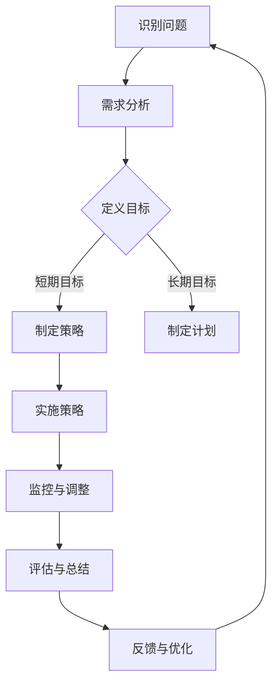
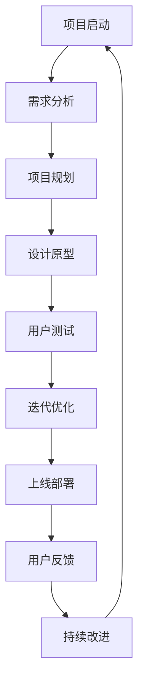
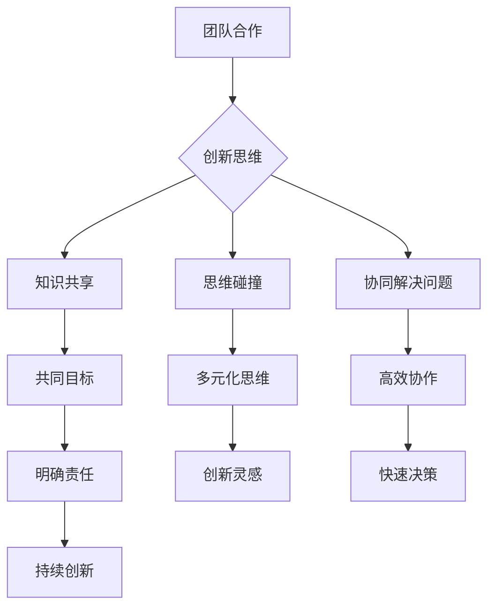

                 

### 文章标题

《如何培养团队的创新思维》

> 关键词：创新思维、团队协作、创新实践、项目管理、案例分析

摘要：本文旨在探讨如何通过系统的方法和策略培养团队的创新思维。文章首先介绍了创新思维的定义和重要性，随后探讨了创新思维的原理与理论，接着提出了一系列培养创新思维的方法，并详细讨论了团队协作与创新思维的关系。最后，文章通过创新项目管理与执行、创新工具与技术以及创新案例分析，提供了实际操作指南和未来创新趋势展望。通过本文的阅读，读者将能够掌握培养团队创新思维的方法和技巧，从而推动团队在竞争激烈的市场环境中保持领先地位。

### 第1章：创新思维概述

#### 1.1 创新思维的重要性

创新思维是一种能够激发创意和创造力的思考方式，它不仅仅关乎技术的突破，更涉及到商业模式的创新、管理方法的改进以及文化氛围的营造。在当今快速变化和高度竞争的市场环境中，创新思维已成为企业生存和发展的关键因素。

**1.1.1 创新思维的定义与核心特征**

创新思维可以被定义为一种通过综合分析、归纳推理和创造性思维，从现有知识和资源中探索出新颖解决方案的思考模式。其核心特征包括：

- **开放性**：接受不同观点和想法，不固守传统思维模式。
- **灵活性**：能够迅速适应变化，灵活调整策略和方法。
- **批判性**：对现有理论和方法进行质疑和评估，不断寻求改进。
- **综合性**：能够将不同领域的知识进行整合，形成创新的解决方案。

**1.1.2 创新思维在企业中的作用**

创新思维在企业中的作用主要体现在以下几个方面：

- **推动产品和服务创新**：通过创新思维，企业能够不断推出具有市场竞争力的新产品和服务。
- **提升竞争力**：创新思维使企业能够在市场中保持领先地位，应对竞争对手的挑战。
- **优化运营效率**：创新思维有助于企业发现和改进运营过程中的问题和瓶颈，提高效率。
- **增强企业活力**：创新思维能够激发员工的创造力和积极性，提升整体团队的工作氛围。

**1.1.3 团队创新思维的重要性**

团队创新思维对于企业的重要性不可忽视。一个拥有强大创新思维的团队，能够在以下方面发挥重要作用：

- **多元化思维碰撞**：团队成员具有不同的背景和经验，能够从不同角度提出创新性建议。
- **协作与共享**：团队内部的协作与知识共享有助于加速创新过程。
- **持续改进**：团队创新思维能够促使企业不断改进产品和服务，提升竞争力。
- **应对变化**：面对市场环境和技术的快速变化，具有创新思维的团队能够更快适应并作出反应。

总之，创新思维是企业持续发展的重要动力，而团队创新思维则是企业创新战略的关键组成部分。通过系统的方法和策略培养团队的创新思维，将有助于企业在激烈的市场竞争中脱颖而出。

#### 1.2 创新思维的原理与理论

理解创新思维的原理与理论，有助于我们更深入地认识其本质和运作方式，从而为培养团队的创新思维提供理论依据。

**2.1 创造力心理学理论**

创造力心理学理论为我们揭示了创造力产生的基本心理机制。以下几个核心理论构成了这一领域的基础：

- **原型启发（Incubation）**：原型启发是指在面对问题一时无法找到解决方案时，通过暂时放下问题，转而从事其他活动，从而在潜意识中继续思考和探索。这种现象在科学家和艺术家的创造性工作中有广泛应用。

  **示例**：爱因斯坦在解决广义相对论的难题时，曾经长时间散步，最终灵感突现，解决了这一难题。

- **思维定式（Fixed Mindset）**：思维定式是指个体对问题解决的方式和思维模式的一种固化。与成长型思维（Growth Mindset）相对，思维定式往往限制了个体的创造力。

  **示例**：在解决一个复杂问题时，具有成长型思维的人会尝试多种方法，而具有固定思维的人则可能只依赖已知的方法。

- **思维多样性（Diversity of Thought）**：思维多样性强调通过引入不同的观点和思维方式，激发创意和创造力的过程。在一个多元化的团队中，成员不同的背景、经验和观点能够相互碰撞，从而产生更多的创新思维。

  **示例**：谷歌在其“20%时间”政策中，鼓励员工将20%的工作时间用于探索自己的创意项目，这一政策成功地催生了多个创新产品，如Gmail和Google News。

**2.2 创新过程理论**

创新过程理论探讨了从创意的产生到最终实现的全过程，以下是几个关键的创新过程模型：

- **线性模型（Linear Model）**：线性模型将创新过程视为一个有序的、逐步推进的过程，包括问题识别、创意生成、创意筛选、开发实施和产品商业化等阶段。

  **伪代码示例**：
  ```plaintext
  function innovationProcess(problem):
      solutions = generateCreativeSolutions(problem)
      selectedSolutions = filterSolutions(solutions)
      finalSolution = implementSolution(selectedSolutions)
      commercializeFinalSolution(finalSolution)
  end function
  ```

- **迭代模型（Iterative Model）**：迭代模型强调创新过程是一个不断循环、反复迭代的过程。通过不断的反馈和调整，逐步优化解决方案。

  **伪代码示例**：
  ```plaintext
  function iterativeInnovationProcess(problem):
      while not solutionSatisfiesRequirements(problem):
          solutions = generateCreativeSolutions(problem)
          selectedSolutions = filterSolutions(solutions)
          finalSolution = implementSolution(selectedSolutions)
          gatherFeedback(finalSolution)
          adjustFinalSolution(finalSolution)
      end while
  end function
  ```

- **复杂性模型（Complexity Model）**：复杂性模型认为创新过程是一个高度复杂、动态演化的过程，涉及多个因素的交互和影响。这一模型强调了网络效应、协同创新和自组织机制在创新过程中的作用。

  **示例**：互联网的发展就是一个典型的复杂性创新过程。通过开放的网络平台，全球的创新者可以共享资源和知识，从而加速创新的进程。

**2.3 创新思维模型**

创新思维模型为我们提供了一系列系统的思考方法和工具，以促进创新思维的培养。以下是几个常用的创新思维模型：

- **六顶思考帽（Six Thinking Hats）**：六顶思考帽是由心理学家德博诺提出的，它通过将思考过程划分为六种不同的角色，帮助团队成员全面、深入地分析问题。这六顶帽子分别代表：

  - **蓝色思考帽**：逻辑和系统，负责总体规划和决策。
  - **白色思考帽**：事实和数字，负责提供信息和分析。
  - **红色思考帽**：情感和直觉，负责表达感受和直觉判断。
  - **黄色思考帽**：乐观和积极，负责寻找解决方案的优点。
  - **黑色思考帽**：悲观和批判，负责评估解决方案的缺点。
  - **绿色思考帽**：创新和创意，负责提出新观点和创意。

  **示例**：在一个团队会议上，团队成员戴上蓝色思考帽，先从整体规划的角度讨论项目的可行性，然后依次戴上其他颜色的帽子，分别从事实、情感、优点、缺点和创新等多个维度进行深入讨论。

- **头脑风暴（Brainstorming）**：头脑风暴是一种常用的创新思维方法，它通过鼓励团队成员自由发挥，快速产生大量的创意。头脑风暴的关键原则包括：

  - **自由表达**：鼓励每个成员无论想法是否合理，都大胆提出。
  - **禁止批评**：在头脑风暴过程中，不允许对别人的想法进行评价或批评。
  - **数量优先**：重视产生大量想法的数量，认为数量越多，高质量创意的可能性越大。

  **示例**：在一个产品开发的头脑风暴会议上，团队成员可以在白板上写下所有的创意点，即使这些点看起来不切实际或相互冲突，也要先记录下来，以便后续筛选和整合。

通过理解创新思维的原理与理论，我们可以更好地认识到创新思维的本质和运作机制，从而为培养团队的创新思维提供科学依据和实践指导。

### 第3章：创新思维的培养方法

#### 3.1 培养创新思维的策略

培养团队的创新思维需要系统的方法和策略，以下是一些关键策略：

**3.1.1 激励机制**

激励机制是激发团队成员创新思维的重要手段。通过设立创新奖项、奖金和晋升机会，可以鼓励团队成员积极投入创新活动。

- **创新奖项**：设立年度创新奖项，表彰在创新项目中表现突出的个人或团队。
- **奖金制度**：为创新项目成功实施提供一定的奖金支持，激励团队成员投入更多时间和精力。
- **晋升机会**：为在创新项目中表现优异的成员提供晋升机会，使他们感受到企业的认可和重视。

**3.1.2 资源投入**

资源投入是培养创新思维的基础。企业应确保为创新项目提供充足的资金、技术和人力资源支持。

- **资金支持**：为创新项目提供足够的资金，确保项目顺利进行。
- **技术资源**：提供先进的技术设备和工具，支持团队成员进行创新研究和实验。
- **人力资源**：组建跨部门、跨领域的创新团队，汇集不同领域的专业人才，促进知识交流和思维碰撞。

**3.1.3 培训与教育**

培训与教育是培养团队创新思维的重要途径。通过定期举办创新培训课程和工作坊，可以提高团队成员的创新意识和能力。

- **创新培训课程**：邀请创新领域的专家和学者进行讲座和培训，分享创新经验和最佳实践。
- **工作坊**：组织团队参与创新工作坊，通过实践操作培养创新思维。
- **在线课程**：利用在线平台提供丰富的创新教育资源，方便团队成员随时学习。

**3.1.4 鼓励试错**

鼓励试错是培养团队创新思维的关键策略。在创新过程中，不可避免地会遇到失败和挫折，但只有通过试错，团队才能不断积累经验，提升创新能力。

- **失败容忍文化**：建立失败容忍文化，鼓励团队成员敢于尝试和承担风险。
- **快速迭代**：采用快速迭代开发模式，缩短项目周期，提高试错频率。
- **反思与总结**：在项目结束后，组织团队成员进行反思和总结，从失败中吸取教训，不断优化创新过程。

**3.1.5 知识共享**

知识共享是促进团队创新思维的重要手段。通过建立知识共享平台，鼓励团队成员分享经验和知识，可以加速创新过程。

- **内部交流**：定期举办内部交流会，分享创新项目进展和心得。
- **知识库**：建立企业知识库，收集和整理团队成员的创新案例和经验。
- **跨部门合作**：鼓励不同部门之间的合作，促进知识交流和思维碰撞。

通过以上策略，企业可以有效地培养团队的创新思维，激发团队的创造力，从而在激烈的市场竞争中保持竞争优势。

#### 3.2 创新思维的训练方法

创新思维的训练方法多种多样，通过系统的训练，可以帮助团队成员逐步培养出创新思维的能力。以下是几种常用的创新思维训练方法：

**3.2.1 头脑风暴**

头脑风暴是一种广泛使用的创新思维训练方法，通过集思广益，快速产生大量的创意。以下是其基本步骤：

- **准备阶段**：确定讨论的主题，明确目标，确保每个参与者都了解讨论的内容。
- **自由表达阶段**：鼓励每个成员自由发表自己的想法，无论这些想法是否合理或具有实际可行性。
- **禁止批评阶段**：在头脑风暴过程中，不允许对别人的想法进行评价或批评，以保护每个人的创造性思维。
- **筛选阶段**：将所有提出的想法进行整理和筛选，评估其可行性和价值。

**示例**：在一个新产品开发的头脑风暴会议上，团队成员可以围绕产品的功能、设计、市场定位等方面提出各种创意，然后对这些创意进行筛选和整合，形成具体的创新方案。

**3.2.2 设定挑战性目标**

设定挑战性目标是培养团队创新思维的有效方法。通过设定具有挑战性的目标，可以激发团队成员的创造力和解决问题的能力。

- **明确目标**：设定具体、可衡量的目标，确保团队成员明确任务和责任。
- **激励竞争**：设立竞争机制，鼓励团队成员积极争取达成目标，激发创新热情。
- **评估与反馈**：在目标完成后，对团队成员的表现进行评估和反馈，总结经验和教训。

**示例**：在一个项目开发过程中，团队可以设定“在一个月内完成一项新功能”的目标，鼓励成员通过创新的方法和技术，克服各种困难，最终达成目标。

**3.2.3 案例分析**

案例分析是培养团队创新思维的重要途径。通过分析成功或失败的创新案例，可以帮助团队成员学习创新思维的方法和技巧。

- **选择案例**：选择具有代表性的创新案例，涵盖不同领域和行业。
- **深入分析**：对案例进行深入分析，了解其背景、过程、结果和影响。
- **总结经验**：从案例中总结经验教训，提炼出有效的创新思维方法和策略。

**示例**：团队可以分析苹果公司推出iPhone的成功案例，了解其创新思维的方法和策略，如用户需求导向、技术突破和市场定位等，从而在自身的产品开发中借鉴和应用。

**3.2.4 创新工作坊**

创新工作坊是一种集中进行创新思维训练的方法，通过团队合作和互动，快速产生创新创意。以下是其基本步骤：

- **准备阶段**：确定工作坊的主题和目标，准备好所需的资源和工具。
- **头脑风暴阶段**：鼓励团队成员自由发表创意，不限数量和类型。
- **筛选阶段**：对提出的创意进行筛选和评估，确定可行的创新方案。
- **实施阶段**：将创新方案转化为具体行动，进行实验和验证。

**示例**：在一个创新工作坊中，团队可以围绕“如何提升用户满意度”的主题，通过头脑风暴、筛选和实施，提出一系列创新措施，如改进产品功能、优化用户体验等，从而提升企业的市场竞争力。

通过以上创新思维训练方法，团队可以逐步培养出创新思维的能力，提高整体创新水平，为企业的持续发展提供动力。

#### 3.3 创新思维的教育与实践

创新思维的教育与实践是培养团队创新能力的两个关键环节。以下将详细介绍如何在教育和实践中培养团队的创新思维。

**3.3.1 创新思维教育的目标**

创新思维教育的目标主要包括：

- **提升创造力**：通过教育，培养团队成员的创造性思维，激发他们的创造力。
- **培养创新意识**：使团队成员认识到创新的重要性，并将其内化为工作的一部分。
- **掌握创新方法**：教育团队成员掌握各种创新方法和工具，提升他们的创新能力。

**3.3.2 创新思维教育的内容**

创新思维教育的内容应包括以下几个方面：

- **创新理论**：介绍创新思维的基本理论，如创造力心理学、创新过程理论等。
- **创新方法**：教授各种创新方法，如头脑风暴、六顶思考帽、思维导图等。
- **案例研究**：通过分析成功和失败的创新案例，总结经验教训，提炼创新策略。
- **跨学科知识**：鼓励团队成员学习跨学科知识，拓宽思维视野，促进创新思维的培养。

**3.3.3 创新思维教育的实施策略**

以下是几种有效的创新思维教育实施策略：

- **课堂教学**：通过系统化的课程，向团队成员传授创新思维的理论和方法。
- **互动教学**：组织讨论、辩论和案例分析等互动活动，激发学生的思维活力。
- **实践操作**：开展创新实践活动，让学生在实际操作中应用所学知识。
- **案例教学**：结合实际案例，进行深入分析和讨论，让学生了解创新思维的应用。

**3.3.4 创新思维实践的平台

为了将创新思维从理论转化为实践，企业需要搭建相应的平台：

- **创新实验室**：设立创新实验室，为团队成员提供实验空间和资源支持。
- **创新项目**：开展创新项目，鼓励团队成员参与，通过实际操作培养创新思维。
- **跨部门合作**：促进不同部门之间的合作，打破壁垒，激发创新思维。
- **知识共享平台**：建立知识共享平台，鼓励团队成员分享创新经验和知识，促进知识流动。

**3.3.5 创新思维实践的案例分析

以下是几个创新思维实践的成功案例：

- **谷歌的“20%时间”**：谷歌允许员工将20%的工作时间用于个人项目，这一政策激发了员工巨大的创新潜力，诞生了Gmail、Google News等成功产品。
- **3M的“15%时间”**：3M公司鼓励员工将15%的时间用于创新项目，这一策略促成了胶带、记录纸等产品的诞生。
- **亚马逊的“影子团队”**：亚马逊通过建立“影子团队”，让员工在保持原有职责的同时，负责探索新的商业机会，这一机制推动了亚马逊的多项创新。

通过创新思维的教育与实践，企业可以培养出一支具备创新思维的团队，提升整体创新能力，从而在激烈的市场竞争中保持领先地位。

### 第4章：团队协作与创新思维

#### 4.1 团队合作与创新思维的关系

团队合作与创新思维之间的关系是相辅相成的。一个高效的团队能够通过协作激发成员的创新思维，而创新思维则可以推动团队更好地协作，实现共同的目标。

**4.1.1 团队协作对创新思维的影响**

团队合作对创新思维的影响主要体现在以下几个方面：

- **多元化思维碰撞**：团队由不同背景、经验和专业知识的成员组成，他们之间的思维碰撞能够激发新的创意和灵感，提升团队的创新水平。
- **资源共享与知识共享**：团队合作使团队成员能够共享资源、知识和经验，从而加速创新过程，提高创新效果。
- **协同解决问题**：在创新过程中，团队协作有助于成员共同面对挑战，通过协同解决问题，推动创新项目的顺利实施。

**4.1.2 创新思维对团队合作的影响**

创新思维对团队合作的影响也是显著的：

- **提高问题解决能力**：创新思维使团队成员具备更高的问题解决能力，能够从不同角度分析和解决问题，提高团队的执行力和决策水平。
- **增强团队凝聚力**：通过创新思维，团队能够在共同的目标和任务下，建立起更加紧密的协作关系，增强团队的凝聚力和向心力。
- **推动团队发展**：创新思维有助于团队不断突破自我，实现自我超越，推动团队在竞争激烈的市场环境中保持领先地位。

**4.1.3 如何构建创新团队**

构建一个创新团队需要考虑以下几个方面：

- **多元化**：确保团队由不同背景、经验和专业知识的成员组成，以促进思维碰撞和知识共享。
- **目标明确**：为团队设定清晰的目标和任务，确保每个成员都明确自己的职责和期望。
- **协作机制**：建立有效的协作机制，鼓励团队成员之间的沟通和合作，提高团队的协作效率。
- **激励机制**：设立激励机制，鼓励团队成员积极参与创新活动，并对表现优异的成员给予奖励和认可。

**4.1.4 团队合作与创新思维的案例分析

以下是一个团队合作与创新思维的案例：

**案例：谷歌的“20%时间”政策**

谷歌的“20%时间”政策是一个典型的通过团队合作激发创新思维的例子。该政策允许谷歌的员工将20%的工作时间用于自己感兴趣的项目。这一政策激发了员工巨大的创新潜力，诞生了包括Gmail、Google News、Orkut等在内的多个成功产品。

- **背景介绍**：谷歌在2006年推出了“20%时间”政策，允许员工在工作时间内外自由探索自己的创意项目。
- **过程分析**：员工在20%的时间内，可以自由选择感兴趣的项目，与同事合作，共同探讨和实施创意。
- **结果评估**：通过“20%时间”政策，谷歌成功推出了多个创新产品，不仅提升了公司的竞争力，也增强了员工的满意度和归属感。

通过这个案例，我们可以看到团队合作与创新思维之间的紧密联系。谷歌通过提供自由探索的空间和资源支持，激发了员工的创新思维，推动了团队的合作与创新。这一成功经验对其他企业构建创新团队具有借鉴意义。

#### 4.2 团队协作中的创新思维工具

在团队协作过程中，运用一系列创新思维工具能够有效激发团队成员的创意和创造力，提升团队的整体创新水平。以下介绍几种常用的团队协作创新思维工具：

**4.2.1 头脑风暴**

头脑风暴是一种简单而有效的创新思维工具，它通过集思广益，快速产生大量的创意。以下是头脑风暴的基本步骤：

- **准备阶段**：确定讨论的主题和目标，确保每个参与者都了解讨论的内容。
- **自由表达阶段**：鼓励每个成员自由发表自己的想法，无论这些想法是否合理或具有实际可行性。
- **禁止批评阶段**：在头脑风暴过程中，不允许对别人的想法进行评价或批评，以保护每个人的创造性思维。
- **筛选阶段**：将所有提出的想法进行整理和筛选，评估其可行性和价值。

**示例**：在一个产品开发的头脑风暴会议上，团队成员可以围绕产品的功能、设计、市场定位等方面提出各种创意，然后对这些创意进行筛选和整合，形成具体的创新方案。

**4.2.2 六顶思考帽**

六顶思考帽是由心理学家德博诺提出的，它通过将思考过程划分为六种不同的角色，帮助团队成员全面、深入地分析问题。这六顶帽子分别代表：

- **蓝色思考帽**：逻辑和系统，负责总体规划和决策。
- **白色思考帽**：事实和数字，负责提供信息和分析。
- **红色思考帽**：情感和直觉，负责表达感受和直觉判断。
- **黄色思考帽**：乐观和积极，负责寻找解决方案的优点。
- **黑色思考帽**：悲观和批判，负责评估解决方案的缺点。
- **绿色思考帽**：创新和创意，负责提出新观点和创意。

**示例**：在一个团队会议上，团队成员戴上蓝色思考帽，先从整体规划的角度讨论项目的可行性，然后依次戴上其他颜色的帽子，分别从事实、情感、优点、缺点和创新等多个维度进行深入讨论。

**4.2.3 思维导图**

思维导图是一种利用图像和文字进行思维组织和表达的工具，它能够帮助团队成员清晰地梳理思路，发现新的创意。以下是思维导图的基本步骤：

- **确定主题**：明确思维导图的主题和目标。
- **绘制中心图像**：用图像表示主题，并在图像周围绘制主要分支。
- **扩展细节**：在每个分支上添加相关的细节和子分支。
- **连接和整合**：通过线条和箭头连接不同的分支，形成一个整体思维网络。

**示例**：在一个产品开发的思维导图中，中心图像可以表示产品的主要功能，围绕它绘制功能模块、用户需求、市场分析等分支，并通过线条和箭头将这些分支连接起来，形成一个完整的创新方案。

**4.2.4 用户故事地图**

用户故事地图是一种用于产品设计和开发的创新思维工具，它通过描述用户的行为和需求，帮助团队理解用户的核心价值。以下是用户故事地图的基本步骤：

- **定义用户角色**：明确产品的目标用户群体。
- **绘制用户旅程**：描述用户从接触产品到使用产品再到离开产品的整个过程。
- **识别关键场景**：在用户旅程中识别关键场景和痛点。
- **制定解决方案**：根据关键场景和痛点，制定相应的解决方案。

**示例**：在一个电子商务平台的设计中，用户故事地图可以描述用户的注册、购物、支付和评价等过程，识别用户的购物需求和购物障碍，从而制定出更符合用户需求的产品设计。

通过以上团队协作中的创新思维工具，团队可以更加系统地分析和解决创新问题，提高整体创新水平，为企业的持续发展提供有力支持。

### 第5章：创新项目管理与执行

#### 5.1 创新项目管理框架

创新项目管理是确保创新项目顺利进行、达成预期目标的关键环节。以下介绍一种常见且有效的创新项目管理框架，以及其在实际应用中的实施步骤。

**5.1.1 钻石模型（Diamond Model）**

钻石模型是一种综合了时间、范围、质量和成本四个关键因素的创新项目管理框架。该模型通过明确的阶段划分和任务分配，帮助团队高效地推进创新项目。以下是钻石模型的基本组成部分：

1. **愿景和目标设定**：明确创新项目的愿景和目标，确保团队对项目方向和成果有清晰的认识。
2. **范围管理**：定义项目的范围，包括项目的功能、性能、交付物和限制条件等。
3. **时间管理**：制定详细的项目时间表，明确各阶段的开始和结束时间，确保项目按时完成。
4. **质量管理**：设定项目的质量标准，确保项目交付物的质量和符合客户的期望。
5. **成本管理**：制定项目预算，控制项目成本，确保项目在预算范围内完成。

**5.1.2 实施步骤**

以下是钻石模型在创新项目管理中的应用步骤：

1. **项目启动**：在项目开始前，进行项目启动会议，明确项目愿景、目标和预期成果，确保团队成员对项目有共同的理解和认同。
2. **范围定义**：详细定义项目的范围，包括项目的功能需求、性能指标、交付物和限制条件等，确保项目团队和利益相关者对项目范围有共同的理解。
3. **时间规划**：制定项目时间表，明确各阶段的开始和结束时间，确保项目进度得到有效控制。可以使用甘特图、PERT图等工具进行时间规划。
4. **质量保证**：设定项目的质量标准，包括质量度量、质量检查和质量控制等，确保项目交付物符合客户的要求和预期。
5. **成本控制**：制定项目预算，并对项目成本进行监控和管理，确保项目在预算范围内完成。可以采用成本估算、成本分析和成本控制等方法。
6. **沟通管理**：建立有效的沟通机制，确保团队成员和利益相关者之间的信息共享和沟通畅通。可以采用定期会议、报告、邮件和即时通讯工具等沟通方式。
7. **风险管理**：识别项目中的潜在风险，制定相应的风险应对策略，确保项目能够顺利推进。可以使用风险矩阵、风险登记册等方法进行风险管理。
8. **项目执行**：按照项目计划，执行各阶段任务，确保项目进度和质量得到有效控制。可以采用项目管理软件和工具进行项目执行和监控。
9. **项目监控与控制**：定期监控项目进展情况，评估项目风险和质量，及时调整项目计划，确保项目能够按计划完成。
10. **项目收尾**：在项目完成后，进行项目总结和评估，总结项目经验教训，为未来项目提供参考。同时，对项目交付物进行验收和交付，确保项目目标的实现。

通过钻石模型，团队可以系统地管理创新项目，确保项目在时间、范围、质量和成本四个关键方面的平衡和优化，从而实现项目的成功。

#### 5.2 创新项目的执行策略

在创新项目的执行过程中，制定合理的执行策略是确保项目顺利进行、达成预期目标的关键。以下介绍几种常见的创新项目执行策略：

**5.2.1 快速迭代开发**

快速迭代开发是一种以用户需求为导向的项目执行策略，通过频繁的迭代和反馈，快速实现产品开发和优化。以下是快速迭代开发的基本步骤：

1. **需求收集**：与用户和利益相关者进行深入沟通，了解他们的需求和建议。
2. **设计原型**：基于需求，设计产品原型，进行初步的功能演示。
3. **用户测试**：邀请用户和利益相关者进行测试，收集反馈和改进意见。
4. **迭代优化**：根据用户反馈，对产品原型进行迭代优化，不断提升产品功能和用户体验。
5. **部署上线**：将优化后的产品部署上线，提供用户使用。

**示例**：某互联网公司推出了一款移动应用，采用了快速迭代开发的策略。首先，公司通过市场调研和用户访谈，收集了用户的需求和期望；然后，设计并开发了一个初步的原型版本，邀请用户进行测试；根据用户的反馈，公司对原型进行了多次迭代优化，最终推出了一款符合用户需求的产品。

**5.2.2 跨功能团队合作**

跨功能团队合作是将不同领域、不同技能的团队成员组织在一起，共同推进创新项目的一种执行策略。通过跨功能团队合作，可以充分发挥团队成员的特长和优势，提高项目执行效率。以下是跨功能团队合作的基本原则：

1. **明确目标**：确保所有团队成员对项目的目标和预期成果有共同的理解和认同。
2. **协作机制**：建立有效的沟通和协作机制，确保团队成员之间的信息共享和合作畅通。
3. **责任分工**：明确各成员的职责和任务，确保每个成员都能充分发挥自己的特长。
4. **定期会议**：定期召开团队会议，讨论项目进展、问题和解决方案，确保项目按计划推进。

**示例**：某科技公司开发一款智能家居产品，采用了跨功能团队合作策略。项目团队由软件工程师、硬件工程师、设计师和市场人员组成，每个成员负责不同的模块和任务。通过定期召开团队会议，团队成员之间共享信息、协调进度，确保项目按计划完成。

**5.2.3 风险管理**

在创新项目执行过程中，风险管理是确保项目顺利进行的重要环节。以下介绍几种常见风险管理策略：

1. **风险识别**：通过头脑风暴、访谈和文档分析等方法，识别项目中的潜在风险。
2. **风险评估**：对识别出的风险进行评估，确定其发生的可能性、影响程度和优先级。
3. **风险应对**：制定相应的风险应对策略，包括风险规避、风险转移、风险缓解和风险接受等。
4. **风险监控**：定期监控项目风险，评估风险应对策略的有效性，及时调整和优化风险应对措施。

**示例**：在开发一款新型电动汽车的项目中，项目团队识别出几个关键风险，包括电池技术的不确定性、市场接受度的风险和供应链的不稳定性。针对这些风险，团队制定了相应的应对策略，如与技术供应商合作研发、开展市场调研和建立多元化的供应链等，以确保项目能够顺利进行。

通过以上创新项目执行策略，团队可以更加高效地推进创新项目，确保项目在时间、质量、成本和风险等方面的平衡和优化，从而实现项目的成功。

#### 5.3 创新项目风险管理

创新项目风险管理是确保项目顺利进行、达成预期目标的关键环节。以下介绍创新项目风险管理的基本策略、方法和工具。

**5.3.1 风险识别**

风险识别是创新项目风险管理的第一步，通过系统的方法识别项目中的潜在风险。以下是几种常用的风险识别方法：

1. **头脑风暴**：组织项目团队成员和利益相关者进行头脑风暴，列出可能的风险。
2. **访谈**：与项目团队成员和利益相关者进行访谈，了解他们对项目风险的看法和担忧。
3. **文档分析**：分析项目相关的文档，如项目计划、需求文档和设计文档，识别潜在的风险。
4. **历史数据**：借鉴以往类似项目的经验和教训，识别可能的风险。

**5.3.2 风险评估**

风险评估是对识别出的风险进行评估，确定其发生的可能性、影响程度和优先级。以下是几种常用的风险评估方法：

1. **风险矩阵**：使用风险矩阵对风险的可能性（概率）和影响程度进行量化评估，确定风险的优先级。
2. **蒙特卡罗模拟**：通过模拟和概率分析，评估风险对项目进度、成本和质量的影响。
3. **敏感性分析**：分析不同因素对项目结果的影响程度，识别关键风险因素。

**5.3.3 风险应对策略**

根据风险评估的结果，制定相应的风险应对策略，以降低风险对项目的负面影响。以下是几种常见风险应对策略：

1. **风险规避**：通过调整项目计划，避免风险的发生，如更改项目设计或更换供应商。
2. **风险转移**：通过合同条款或其他方式，将风险转移给第三方，如购买保险或签订免责协议。
3. **风险缓解**：采取措施降低风险的发生概率或影响程度，如改进项目流程或增加项目资源。
4. **风险接受**：在无法规避、转移或缓解风险的情况下，接受风险，并制定应急计划以应对可能的后果。

**5.3.4 风险监控与报告**

在项目执行过程中，持续监控项目风险，确保风险应对策略的有效性，并定期报告风险情况。以下是几种常用的风险监控与报告方法：

1. **定期风险评审**：定期组织项目团队和利益相关者进行风险评审，评估项目风险的变化和应对措施的有效性。
2. **风险登记册**：建立风险登记册，记录识别、评估和应对的所有风险，以及相关的应对措施和责任分工。
3. **实时监控**：使用项目管理工具和系统，实时监控项目风险和项目进度，确保风险得到及时发现和应对。

**5.3.5 实际案例分析**

以下是一个创新项目风险管理的实际案例：

**案例：某科技公司开发一款智能手环**

在开发过程中，项目团队识别出以下潜在风险：

- **技术风险**：智能手环的核心技术尚未完全成熟，存在技术实现难度大的风险。
- **市场风险**：消费者对智能手环的认知和接受度较低，可能影响产品的市场表现。
- **供应链风险**：零部件供应链的不稳定性可能导致项目延期。

针对这些风险，项目团队制定了以下应对策略：

- **技术风险**：与高校和科研机构合作，共同研发核心技术，提高项目成功率。
- **市场风险**：开展市场调研，了解消费者需求和市场趋势，制定相应的市场推广策略。
- **供应链风险**：建立多元化供应链，确保零部件供应的稳定性，并制定应急预案。

通过以上风险管理策略，项目团队成功降低了风险对项目的影响，确保了项目的顺利进行。

通过以上创新项目风险管理的方法和策略，项目团队可以更好地识别、评估和应对潜在风险，确保项目在时间、质量、成本和风险等方面的平衡和优化，从而实现项目的成功。

### 第6章：创新工具与技术

#### 6.1 常见的创新工具

在创新过程中，使用适当的工具可以帮助团队更高效地生成和筛选创意，以下介绍几种常见的创新工具：

**6.1.1 头脑风暴**

头脑风暴是一种通过集思广益，快速产生大量创意的方法。以下是其基本步骤：

- **准备阶段**：确定讨论的主题，准备讨论所需的纸张和笔。
- **自由表达阶段**：鼓励每个成员自由发表自己的想法，不限数量和类型。
- **禁止批评阶段**：在头脑风暴过程中，不允许对别人的想法进行评价或批评，以保护每个人的创造性思维。
- **筛选阶段**：将所有提出的想法进行整理和筛选，评估其可行性和价值。

**示例**：在一个新产品开发的头脑风暴会议上，团队成员可以围绕产品的功能、设计、市场定位等方面提出各种创意，然后对这些创意进行筛选和整合，形成具体的创新方案。

**6.1.2 SWOT分析**

SWOT分析是一种用于评估创新项目优势、劣势、机会和威胁的工具。以下是其基本步骤：

- **确定分析对象**：明确需要分析的创新项目或产品。
- **收集信息**：收集与项目相关的内部优势、劣势和外部机会、威胁信息。
- **制作SWOT矩阵**：将优势、劣势、机会和威胁分别列在矩阵的四个象限，进行综合分析。

**示例**：在一个新市场进入策略的创新项目中，团队可以分析其优势（如技术领先、品牌知名）和劣势（如市场经验不足），以及外部机会（如市场需求增长、竞争加剧）和威胁（如政策变化、技术变革），从而制定出更有效的市场策略。

**6.1.3 六顶思考帽**

六顶思考帽是一种通过将思考过程划分为六种不同的角色，帮助团队成员全面、深入地分析问题的方法。以下是其基本步骤：

- **蓝色思考帽**：逻辑和系统，负责总体规划和决策。
- **白色思考帽**：事实和数字，负责提供信息和分析。
- **红色思考帽**：情感和直觉，负责表达感受和直觉判断。
- **黄色思考帽**：乐观和积极，负责寻找解决方案的优点。
- **黑色思考帽**：悲观和批判，负责评估解决方案的缺点。
- **绿色思考帽**：创新和创意，负责提出新观点和创意。

**示例**：在一个团队会议上，团队成员可以先戴上蓝色思考帽，从整体规划的角度讨论项目的可行性，然后依次戴上其他颜色的帽子，分别从事实、情感、优点、缺点和创新等多个维度进行深入讨论。

**6.1.4 mindmap（思维导图）**

思维导图是一种利用图像和文字进行思维组织和表达的工具，它能够帮助团队成员清晰地梳理思路，发现新的创意。以下是其基本步骤：

- **确定主题**：明确思维导图的主题和目标。
- **绘制中心图像**：用图像表示主题，并在图像周围绘制主要分支。
- **扩展细节**：在每个分支上添加相关的细节和子分支。
- **连接和整合**：通过线条和箭头连接不同的分支，形成一个整体思维网络。

**示例**：在一个产品开发的思维导图中，中心图像可以表示产品的主要功能，围绕它绘制功能模块、用户需求、市场分析等分支，并通过线条和箭头将这些分支连接起来，形成一个完整的创新方案。

通过以上常见创新工具的应用，团队可以更加系统地分析和解决创新问题，提高整体创新水平。

#### 6.2 创新技术应用案例

创新技术的应用能够显著提升团队的创新能力和效率。以下介绍几个创新技术应用的案例，并分析其具体应用和效果。

**6.2.1 人工智能与大数据分析**

人工智能（AI）和大数据分析技术的应用在多个领域都取得了显著成果。例如，某在线教育平台通过引入AI和大数据分析技术，实现了个性化学习推荐和教学效果评估。

- **具体应用**：该平台利用AI技术分析学生的学习行为和成绩数据，为学生推荐适合的学习资源和课程。同时，通过大数据分析，教师可以实时了解学生的学习状态，调整教学方法和策略。
- **效果分析**：个性化学习推荐提高了学生的学习兴趣和效果，教学效果评估帮助教师改进教学方法，从而提升了整体教学质量。

**6.2.2 区块链技术**

区块链技术在供应链管理中的应用，能够提高供应链的透明度和效率。例如，某全球知名零售企业通过引入区块链技术，实现了供应链全流程的追踪和监控。

- **具体应用**：该企业将供应链各环节的数据记录在区块链上，确保数据的不可篡改和透明性。通过区块链技术，企业可以实时监控货物的运输状态，提高供应链的响应速度和效率。
- **效果分析**：区块链技术的应用提高了供应链的透明度和可信度，减少了信息不对称和欺诈行为，提升了供应链的整体效率。

**6.2.3 虚拟现实（VR）和增强现实（AR）**

VR和AR技术在产品设计和用户体验中的创新应用，能够提升产品的设计质量和用户体验。例如，某知名汽车制造商通过引入VR和AR技术，实现了全息设计和虚拟试驾。

- **具体应用**：该制造商利用VR技术进行汽车设计，通过虚拟环境模拟和交互，提升了设计效率和准确性。同时，通过AR技术，消费者可以在实体店面中虚拟试驾汽车，提升购买体验。
- **效果分析**：VR和AR技术的应用提高了产品设计效率和准确性，同时也提升了消费者的购物体验，增加了品牌吸引力。

**6.2.4 自动化和机器人技术**

自动化和机器人技术在生产制造和客户服务中的应用，能够显著提高生产效率和客户满意度。例如，某电子产品制造商通过引入自动化和机器人技术，实现了生产线的智能化和自动化。

- **具体应用**：该制造商利用机器人技术进行焊接、组装和检测等工序，减少了人工操作，提高了生产效率和产品一致性。同时，通过自动化系统，实现了生产过程的实时监控和故障预警。
- **效果分析**：自动化和机器人技术的应用提高了生产效率和产品质量，减少了人力成本和错误率，提升了整体生产效率和客户满意度。

通过以上创新技术应用案例，我们可以看到，创新技术的应用不仅提升了团队的创新能力和效率，还带来了显著的业务效益和市场竞争力。未来，随着技术的不断进步，创新技术将在更多领域得到应用，为团队创新提供更多可能。

### 第7章：创新思维案例分析

#### 7.1 国内创新企业案例分析

国内创新企业在培养团队创新思维方面积累了丰富的经验，以下介绍几个具有代表性的企业及其成功案例。

**7.1.1 腾讯**

腾讯作为中国领先的互联网科技公司，在创新思维的培养方面具有显著优势。以下是其成功案例：

- **案例背景**：腾讯通过持续创新，在社交、游戏、金融等多个领域取得了巨大成功。
- **具体措施**：腾讯采用了“内部创业”机制，允许员工在保持原有职位和职责的基础上，探索新的创新项目。例如，微信和QQ等核心产品的诞生，都是通过内部创业机制实现的。
- **效果分析**：内部创业机制激发了员工的创新热情和创造力，使得腾讯能够不断推出具有市场竞争力的新产品，保持了企业的持续创新能力。

**7.1.2 阿里巴巴**

阿里巴巴通过“双创”战略，大力推动创新和创业，培养了一支具有高度创新思维的团队。以下是其成功案例：

- **案例背景**：阿里巴巴在电子商务、云计算、金融科技等领域处于行业领先地位。
- **具体措施**：阿里巴巴设立了“创新基金”和“创业孵化器”，支持员工和外部创业者进行创新和创业。同时，公司还通过“合伙人制度”，鼓励员工共同参与企业的创新和发展。
- **效果分析**：创新基金和创业孵化器的设立，为员工和创业者提供了良好的创新环境和资源支持，促进了创新项目的落地和成长，提升了企业的整体创新能力。

**7.1.3 小米**

小米作为一家新兴的互联网科技公司，通过“粉丝经济”和“生态链企业”模式，成功实现了快速发展和创新。以下是其成功案例：

- **案例背景**：小米在智能手机、智能家居、互联网服务等领域取得了显著成绩。
- **具体措施**：小米通过建立“粉丝社群”，收集用户反馈和建议，快速响应市场需求，推动产品创新。此外，小米通过投资和收购生态链企业，构建了涵盖多个领域的创新生态系统。
- **效果分析**：粉丝社群的建立和生态链企业的构建，使得小米能够更快速地适应市场需求，推出创新产品，提升了企业的市场竞争力。

**7.1.4 百度**

百度作为中国领先的搜索引擎公司，在技术创新和人工智能领域具有强大实力。以下是其成功案例：

- **案例背景**：百度在搜索引擎、自动驾驶、人工智能等领域进行了大量创新投入。
- **具体措施**：百度通过“百度大脑”平台，开放人工智能技术，支持企业和开发者进行创新应用。同时，公司还设立了“百度创新实验室”，鼓励员工进行前沿技术创新。
- **效果分析**：百度大脑平台和百度创新实验室的设立，为企业和开发者提供了强大的技术支持，推动了人工智能技术在各个领域的应用，提升了企业的技术创新能力。

通过以上国内创新企业的案例分析，我们可以看到，培养团队创新思维的关键在于建立有效的创新机制和激励机制，提供良好的创新环境和资源支持，从而激发团队的创造力和创新能力。

#### 7.2 国际创新企业案例分析

国际创新企业在培养团队创新思维方面也提供了许多有益的经验和启示。以下介绍几个具有代表性的企业及其成功案例。

**7.2.1 苹果公司**

苹果公司作为全球领先的科技公司，以其卓越的创新能力和设计理念著称。以下是其成功案例：

- **案例背景**：苹果公司在智能手机、平板电脑、个人电脑和智能穿戴设备等领域取得了巨大成功。
- **具体措施**：苹果公司通过“iCreate”项目，鼓励员工进行创新设计。同时，公司设立了“苹果设计奖”，表彰在产品设计和技术创新方面取得突出成绩的员工。
- **效果分析**：iCreate项目和苹果设计奖的设立，激发了员工的创新热情和创造力，使得苹果能够不断推出具有革命性意义的产品，保持了企业的技术领先地位。

**7.2.2 谷歌公司**

谷歌公司以其在互联网搜索、在线广告、云计算和人工智能等领域的创新而闻名。以下是其成功案例：

- **案例背景**：谷歌公司在全球范围内拥有广泛的用户基础和强大的技术实力。
- **具体措施**：谷歌通过“20%时间”政策，允许员工将20%的工作时间用于个人项目。此外，公司还设立了“谷歌创新实验室”，支持员工进行前沿技术研究和创新应用。
- **效果分析**：20%时间和谷歌创新实验室的设立，为员工提供了自由探索和创新的空间，激发了员工的创造力，推动了谷歌在多个领域的创新和发展。

**7.2.3 亚马逊公司**

亚马逊公司作为全球最大的电子商务公司，以其技术创新和物流优化而著称。以下是其成功案例：

- **案例背景**：亚马逊在云计算、人工智能、物联网和智能物流等领域进行了大量创新投入。
- **具体措施**：亚马逊通过“Amazon Web Services”（AWS）平台，向开发者提供强大的云计算服务，支持创新应用的开发。同时，公司还设立了“亚马逊创新基金”，支持员工和外部创业者进行创新项目。
- **效果分析**：AWS平台和亚马逊创新基金的设立，为创新项目提供了强大的技术支持和资金支持，推动了亚马逊在多个领域的创新和应用。

**7.2.4 强生公司**

强生公司作为全球领先的医疗保健公司，在技术创新和医疗设备研发方面具有显著优势。以下是其成功案例：

- **案例背景**：强生公司在医疗设备、药品研发和健康科技等领域进行了大量创新投入。
- **具体措施**：强生通过“强生创新中心”和“强生创业孵化器”，支持员工和创业者进行创新研究和产品开发。同时，公司还设立了“强生创新奖”，表彰在技术创新方面取得突出成绩的团队和个人。
- **效果分析**：强生创新中心和创业孵化器的设立，为员工和创业者提供了良好的创新环境和资源支持，促进了强生在医疗科技领域的持续创新。

通过以上国际创新企业的案例分析，我们可以看到，培养团队创新思维的关键在于提供良好的创新机制、激励机制和创新环境，从而激发团队的创造力和创新能力，推动企业的持续发展和竞争力提升。

#### 7.3 创新思维在行业中的应用

创新思维在各个行业中的应用，不仅推动了企业的进步，也为行业带来了深远的影响。以下探讨创新思维在几个典型行业中的应用案例及其影响。

**7.3.1 制造业**

制造业正通过创新思维实现智能化和数字化转型。例如，德国的“工业4.0”战略，通过物联网、大数据和人工智能等技术，实现了制造业的自动化和智能化。这些创新应用不仅提高了生产效率，还优化了产品质量和供应链管理。

- **案例**：西门子在工业自动化领域的创新应用，通过引入AI和机器人技术，实现了生产线的自动化和智能化，大幅提升了生产效率。
- **影响**：这些创新应用使得制造业能够更好地应对市场需求变化，提高了生产效率和产品质量，推动了整个行业的转型升级。

**7.3.2 服务业**

服务业通过创新思维优化用户体验和服务流程。例如，酒店业通过人工智能和大数据分析，实现了个性化服务和智能化管理，提升了客户满意度。

- **案例**：万豪国际酒店集团通过引入AI和大数据分析技术，实现了客户偏好分析和服务个性化，使得客户体验得到显著提升。
- **影响**：创新思维的应用使得服务业能够更好地满足客户需求，提升了客户满意度，增强了市场竞争力。

**7.3.3 教育业**

教育业通过创新思维推动教育方式的变革。例如，在线教育和混合式学习模式的发展，通过互联网和信息技术，打破了时间和空间的限制，提高了教育资源的共享和利用效率。

- **案例**：Coursera和edX等在线教育平台，通过开放课程资源和技术支持，使得全球学习者能够便捷地获取高质量的教育资源。
- **影响**：创新思维的应用使得教育更加公平和高效，促进了教育资源的共享和利用，提升了整体教育质量。

**7.3.4 医疗行业**

医疗行业通过创新思维提升医疗服务的质量和效率。例如，远程医疗和医疗物联网技术的应用，使得医疗服务更加便捷和精准。

- **案例**：美国约翰霍普金斯医院通过远程医疗技术，实现了跨区域的医疗协作和资源共享，提升了医疗服务的覆盖范围和效率。
- **影响**：创新思维的应用使得医疗服务更加便捷和高效，提高了医疗资源的利用效率，推动了医疗行业的进步。

通过以上行业案例，我们可以看到，创新思维在各行业中的应用，不仅提升了企业的竞争力，也为行业带来了深远的影响。创新思维正在成为推动行业发展和变革的重要力量。

### 第8章：未来创新趋势展望

#### 8.1 创新思维的演进方向

随着科技的不断进步和社会的快速发展，创新思维也在不断演进。未来，创新思维将在以下几个方面发生显著变化：

**8.1.1 数据驱动的创新**

随着大数据和人工智能技术的普及，数据驱动的创新将成为未来创新思维的重要方向。通过收集和分析大量数据，企业可以更准确地了解市场需求、用户行为和竞争态势，从而发现新的商业机会和创意。数据驱动的创新将使企业能够更加精准地进行产品研发、市场推广和业务运营，提高创新效率和效果。

**8.1.2 智能协作**

未来的创新思维将更加依赖智能协作技术，如物联网、区块链和云计算等。这些技术将使团队成员能够实时共享信息和资源，协同工作，提高创新效率。智能协作技术还将实现跨地域、跨组织的合作，打破传统合作模式，促进全球创新资源的整合和利用。

**8.1.3 用户体验中心**

用户体验将日益成为创新思维的核心。随着消费者对个性化体验的需求日益增长，企业将更加关注用户体验的设计和优化。未来的创新思维将更加注重用户需求的研究和分析，通过用户反馈和测试，不断改进产品和服务，提升用户满意度和忠诚度。

**8.1.4 可持续创新**

可持续创新将成为未来创新思维的重要方向。随着环境保护和资源节约意识的增强，企业将更加注重在产品设计和生产过程中实现环保、节能和低碳。未来的创新思维将强调可持续发展理念，通过技术创新和商业模式创新，推动企业和社会的可持续发展。

#### 8.2 未来创新领域的新趋势

未来，创新领域将涌现出一系列新的趋势，这些趋势将深刻影响企业的发展和社会的进步。以下介绍几个未来创新领域的新趋势：

**8.2.1 人工智能与生物技术的融合**

人工智能（AI）与生物技术的融合将成为未来创新的重要方向。AI技术将在基因编辑、药物研发、疾病诊断和治疗等生物技术领域发挥重要作用。例如，AI技术可以用于分析海量生物数据，发现新的药物靶点和治疗方案，加速生物技术的创新和应用。

**8.2.2 虚拟现实与增强现实的扩展应用**

虚拟现实（VR）和增强现实（AR）技术的应用将不断扩展。除了在游戏、娱乐和教育领域的应用外，VR和AR技术还将深入到制造业、医疗保健、城市规划等多个领域，提高生产效率、改善医疗服务和提升城市管理水平。

**8.2.3 区块链技术的广泛应用**

区块链技术将在未来得到更广泛的应用，从金融领域扩展到供应链管理、版权保护、身份认证等多个领域。区块链技术的去中心化、透明性和不可篡改性，将提高信息共享和协作的效率，降低交易成本，推动创新和信任机制的建立。

**8.2.4 网络安全与隐私保护的平衡**

随着互联网的普及和数字化转型的加速，网络安全和隐私保护将变得越来越重要。未来的创新领域将注重网络安全技术的研发和应用，同时确保用户隐私和数据安全。这将涉及到加密技术、网络安全防护、隐私计算等多个领域，推动创新与安全的平衡发展。

**8.2.5 新型材料与制造工艺的创新**

新型材料与制造工艺的创新将继续推动制造业的发展。例如，纳米材料、石墨烯材料等新型材料的研发和应用，将大幅提升产品的性能和功能。同时，3D打印、增材制造等新型制造工艺的推广，将改变传统的生产模式，提高生产效率和质量。

#### 8.3 企业应对未来创新挑战的策略

面对未来创新趋势带来的挑战，企业需要采取一系列策略来保持竞争力和创新能力。以下介绍几个关键策略：

**8.3.1 建立灵活的创新组织架构**

企业需要建立灵活的创新组织架构，以适应快速变化的市场环境。例如，可以通过设立创新实验室、成立跨界团队等方式，鼓励员工进行跨部门、跨领域的合作和创新。

**8.3.2 强化技术创新能力**

企业应加大在技术研发和创新上的投入，培养和引进高水平的研发团队。同时，通过与高校、科研机构合作，共同开展前沿技术研究，提升企业的技术创新能力。

**8.3.3 构建开放的创新生态系统**

企业需要构建开放的创新生态系统，吸引外部创新资源和合作伙伴。例如，可以通过设立创新基金、开展创新挑战赛等方式，鼓励外部创业者和企业进行合作，共同推动创新项目的落地和成长。

**8.3.4 强化用户体验与市场导向**

企业应注重用户体验和市场导向，通过深入研究和分析用户需求，及时调整产品和服务策略。同时，建立快速反馈机制，及时收集用户反馈，优化产品设计和功能，提升用户满意度。

**8.3.5 培养创新文化和人才**

企业应注重培养创新文化和人才，通过培训、激励和职业发展机会，激发员工的创新热情和创造力。同时，建立公平的竞争机制，鼓励员工积极参与创新活动，提升整体创新能力。

通过以上策略，企业可以更好地应对未来创新挑战，保持持续的创新能力和市场竞争力，从而在激烈的市场竞争中脱颖而出。

### 附录A：创新思维相关资源

**A.1.1 创新思维书籍推荐**

- **《创新者的思维：如何培养卓越的创新思维模式》**：作者迈克尔·加特纳，该书详细介绍了如何培养创新思维，并提供了一系列实用的方法和技巧。
- **《创新者的宣言：颠覆传统，打造创新思维》**：作者克莱顿·克里斯滕森，通过探讨创新者的心理和行为模式，揭示了培养创新思维的秘诀。
- **《创新者的窘境：为什么大公司无法创新》**：作者克莱顿·克里斯滕森，分析了大公司为何难以持续创新，并提出了相应的解决方案。

**A.1.2 创新思维在线课程推荐**

- **“创新思维与设计思维”**：网易云课堂提供的一系列创新思维课程，涵盖创新思维的基本理论、方法和实践应用。
- **“创意思维：从无到有的创新之路”**：腾讯课堂开设的一门创意思维课程，通过案例分析和互动讨论，帮助学员掌握创意思维的方法和技巧。
- **“创新设计与创业实战”**：中国大学MOOC提供的创新设计与创业实战课程，结合实际案例，教授学员如何将创新思维应用于创业实践。

**A.1.3 创新思维工具与平台推荐**

- **“MindManager”**：一款强大的思维导图软件，帮助用户进行思维组织和创新思维发散。
- **“Mural”**：一款在线协作工具，支持团队进行头脑风暴、任务分配和项目管理。
- **“Tableau”**：一款数据可视化工具，帮助用户通过数据分析发现创新机会和解决方案。

通过以上书籍、在线课程和工具平台的推荐，读者可以进一步拓展对创新思维的理解和实践，提升自身的创新能力和竞争力。

### 附录B：创新思维Mermaid流程图

为了更好地展示创新思维过程，我们使用Mermaid语法创建了一些流程图。以下是几个关键流程图的示例：

**B.1 创新思维过程流程图**



**B.2 创新项目实施流程图**



**B.3 团队合作与创新思维关系图**



通过这些流程图，我们可以清晰地看到创新思维和创新项目实施的过程，以及团队合作在其中的作用。这些流程图不仅有助于理解和传达创新思维的核心概念，还可以作为实际工作中的参考和指导。

