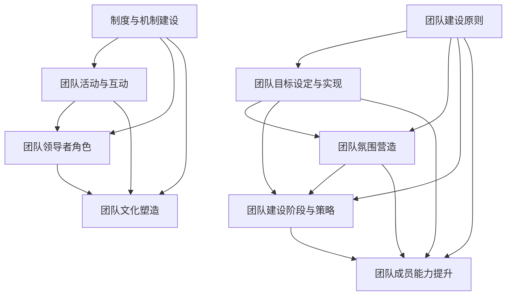

                 


### 文章标题
《如何建立团队的凝聚力和向心力》

### 关键词
团队建设，团队凝聚力，向心力，团队管理，团队文化，领导力

### 摘要
本文将探讨如何通过有效的团队建设策略，提升团队的凝聚力和向心力。通过分析团队凝聚力和向心力的概念、团队建设的基本原则和阶段、以及增强团队凝聚力和向心力的具体方法，本文旨在为团队管理者提供实用的指导，帮助他们在实际工作中构建高效率的团队。

---

# 第一部分：团队建设基础

## 1.1 团队凝聚力和向心力的概念

### 1.1.1 凝聚力与向心力的定义
团队凝聚力是指团队成员之间相互吸引、相互支持、共同协作的程度。它体现在团队成员对团队的认同感、归属感和相互依赖性上。凝聚力是团队有效运作的基础，它决定了团队成员是否能够高效地合作。

向心力则是指团队共同目标和价值观在团队成员心中的牵引力。它是推动团队成员为共同目标而努力的动力，是团队精神的核心。向心力强的团队，成员间彼此信任，目标明确，协同合作。

### 1.1.2 凝聚力与向心力的关系
凝聚力和向心力是相辅相成的。凝聚力是团队形成和维持的前提，而向心力则是团队前进的动力。高凝聚力的团队能够更好地形成共识，而高向心力的团队能够更有效地实现共同目标。

### 1.1.3 团队凝聚力和向心力的重要性
团队凝聚力和向心力对于团队的长期发展至关重要。它们不仅能够提高团队成员的满意度和工作效率，还能够增强团队的适应能力和创新能力，从而在激烈的市场竞争中立于不败之地。

---

## 1.2 团队建设的基本原则

### 1.2.1 团队成员的角色与责任
明确团队成员的角色和责任是团队建设的第一步。每个成员都应该清楚地了解自己的职责，以及如何与其他成员协作。这有助于减少冲突，提高工作效率。

### 1.2.2 团队目标的设定与实现
团队目标的设定应该明确、具体、可测量，并与团队的使命和愿景保持一致。团队成员应该共同参与目标的设定，这样他们才会更加投入和负责。

### 1.2.3 团队氛围的营造
团队氛围对团队成员的行为和心态有深远的影响。一个积极、开放、包容的团队氛围能够增强成员之间的信任和合作意愿，提高团队的凝聚力。

---

## 1.3 团队建设的阶段与策略

### 1.3.1 团队形成阶段
在团队形成阶段，关键策略是建立信任和明确角色。团队成员之间需要通过沟通和合作来建立信任，同时明确各自的角色和责任。

### 1.3.2 团队发展阶段
在团队发展阶段，关键策略是保持团队的活力和动力。这需要通过不断的目标设定、激励机制和沟通来保持团队的积极性和向心力。

### 1.3.3 团队成熟阶段
在团队成熟阶段，关键策略是巩固团队成果和培养团队成员的能力。这需要通过定期的反馈和评估来不断改进团队的工作方式，同时提供培训和发展机会，以提升团队成员的能力。

---

## 1.4 团队成员的能力提升

### 1.4.1 团队成员的技能培养
团队成员的技能培养是提升团队凝聚力的重要手段。通过提供培训和学习机会，团队成员能够不断提升自己的专业能力和技术水平。

### 1.4.2 团队成员的沟通能力提升
沟通能力是团队成员协作的关键。通过沟通技巧培训和团队互动活动，可以提升团队成员的沟通能力，从而增强团队的凝聚力。

### 1.4.3 团队成员的领导力培养
领导力是团队建设的重要组成部分。通过领导力培训和实践，可以培养团队成员的领导能力，提高团队的向心力。

---

# 第二部分：增强团队凝聚力和向心力的方法

## 2.1 制度与机制建设

### 2.1.1 团队管理制度的设计
团队管理制度的设计应该以促进团队成员的协作和沟通为核心。这包括明确的管理流程、合理的分工和责任制度，以及透明的绩效评估机制。

### 2.1.2 团队激励机制的实施
团队激励机制可以激发团队成员的工作热情和积极性。这包括奖励制度、晋升机会、培训机会等，以激励团队成员为团队目标努力。

### 2.1.3 团队沟通机制的建立
建立有效的沟通机制是增强团队凝聚力和向心力的关键。这包括定期的团队会议、信息共享平台、一对一沟通等，以确保团队成员之间的信息畅通。

---

## 2.2 团队活动与互动

### 2.2.1 团队建设活动的组织
团队建设活动可以增强团队成员之间的交流和合作。这包括团队拓展训练、团队比赛、团队旅行等，以增强团队的凝聚力。

### 2.2.2 团队互动游戏的设计
团队互动游戏可以激发团队成员的创造力和团队合作精神。这包括团队角色扮演、团队头脑风暴、团队任务挑战等，以增强团队的向心力。

### 2.2.3 团队分享与讨论的开展
团队分享与讨论可以增强团队成员的知识共享和经验交流。这包括团队例会、项目复盘、经验分享会等，以提升团队成员的专业能力和团队凝聚力。

---

## 2.3 团队领导者的角色

### 2.3.1 团队领导者的责任
团队领导者是团队凝聚力和向心力的关键推动者。他们的责任包括设定团队目标、制定工作计划、协调团队资源、激励团队成员等。

### 2.3.2 团队领导者的领导风格
团队领导者的领导风格对团队凝聚力和向心力有着重要的影响。领导者应该根据团队的特点和需求，选择合适的领导风格，如民主式、权威式、参与式等。

### 2.3.3 团队领导者的能力提升
团队领导者的能力提升是团队建设的重要组成部分。通过领导力培训和实践活动，可以提高团队领导者的领导能力和管理技巧，从而增强团队的凝聚力和向心力。

---

## 2.4 团队文化的塑造

### 2.4.1 团队文化的概念与内涵
团队文化是团队成员共同遵循的价值观和行为准则，是团队的灵魂。它决定了团队成员的行为方式和团队的整体氛围。

### 2.4.2 团队文化的建设与传播
团队文化的建设需要从团队成员的实际出发，通过日常管理、团队活动、宣传等方式，将团队文化深入人心。

### 2.4.3 团队文化的评估与改进
团队文化的评估与改进是团队建设的重要环节。通过定期的评估，可以发现团队文化中的不足，及时进行改进，以增强团队的凝聚力和向心力。

---

# 第三部分：团队凝聚力和向心力的案例分析

## 3.1 成功案例分享

### 3.1.1 案例一：Google 的团队建设经验
Google 作为全球知名的高科技企业，其成功的团队建设经验值得借鉴。Google 注重团队成员的多样性和创造性，通过开放的文化、灵活的工作时间和空间，以及丰富的团队建设活动，有效地提升了团队的凝聚力和向心力。

### 3.1.2 案例二：苹果公司的团队文化
苹果公司以其独特的团队文化和卓越的团队管理而闻名。乔布斯通过设定明确的目标和价值观，以及严格的绩效评估，打造了一个高效率、高凝聚力的团队，推动了苹果公司的持续创新和成功。

### 3.1.3 案例三：小米的团队管理模式
小米公司以其独特的团队管理模式而受到广泛关注。小米通过扁平化的组织结构、灵活的激励机制和开放的沟通环境，有效地提升了团队的凝聚力和向心力，实现了快速发展和创新。

---

## 3.2 失败案例剖析

### 3.2.1 案例一：某公司的团队分裂原因
某公司在快速扩张过程中，由于缺乏有效的团队建设和管理，导致团队成员之间产生了严重的分裂。原因是公司领导层在团队建设方面投入不足，忽视了团队成员的沟通和协作，导致团队成员之间的信任和合作意愿下降。

### 3.2.2 案例二：某创业团队的内部矛盾
某创业团队在初期发展迅速，但由于团队成员之间的利益分配不均和沟通不畅，导致团队内部矛盾激化，最终导致团队解散。原因是团队成员在团队建设中缺乏共识和共同的价值观，导致团队成员之间的合作难以持续。

### 3.2.3 案例三：某团队缺乏凝聚力的表现
某团队在项目实施过程中，表现出了明显的缺乏凝聚力。团队成员之间缺乏信任和合作，项目进度受到严重影响。原因是团队领导者在团队建设方面投入不足，忽视了团队成员之间的沟通和协作，导致团队凝聚力不足。

---

## 3.3 启示与借鉴

### 3.3.1 团队建设中的共性与个性
成功和失败的团队建设案例中，都存在一些共性的因素，如明确的团队目标、有效的沟通机制、合理的激励机制等。同时，每个团队都有其独特的个性，需要根据团队的特点进行有针对性的建设。

### 3.3.2 团队建设的难点与对策
团队建设面临诸多难点，如团队成员之间的沟通不畅、利益分配不均、团队目标不明确等。针对这些难点，可以采取以下对策：加强团队沟通、建立公平的利益分配机制、明确团队目标等。

### 3.3.3 团队建设的成功要素
团队建设的成功要素包括：明确的团队目标、有效的沟通机制、合理的激励机制、积极的团队文化等。这些要素相互关联，共同作用，决定了团队的建设效果。

---

# 第四部分：持续提升团队凝聚力和向心力

## 4.1 团队建设的长期规划

### 4.1.1 团队建设的长期目标
团队建设的长期目标应该是提升团队的凝聚力和向心力，实现团队的高效协作和持续创新。

### 4.1.2 团队建设的持续改进
团队建设不是一蹴而就的，需要通过不断的反思和改进来持续提升。定期评估团队建设的成效，发现问题和不足，及时进行调整和改进。

### 4.1.3 团队建设的资源保障
团队建设需要充足的资源保障，包括人力、物力和财力。领导层应该重视团队建设，为团队提供必要的资源和支持。

---

## 4.2 团队成员的自我提升

### 4.2.1 成长计划的制定
每个团队成员都应该有明确的成长计划，包括职业发展规划、技能提升计划等。团队可以提供相应的培训和指导，帮助团队成员实现自我提升。

### 4.2.2 职业发展规划的引导
团队应该关注成员的职业发展，提供职业规划指导，帮助成员制定和实现职业目标。

### 4.2.3 学习与分享机制的建立
建立有效的学习与分享机制，鼓励团队成员之间的知识共享和经验交流，提高团队的整体能力。

---

## 4.3 团队建设的反馈与调整

### 4.3.1 团队反馈机制的构建
建立团队反馈机制，鼓励团队成员对团队建设提出意见和建议，及时反馈团队建设的成效和问题。

### 4.3.2 团队建设的评估
定期对团队建设进行评估，评估内容包括团队凝聚力、向心力、工作效率等，以便及时发现和解决问题。

### 4.3.3 团队建设问题的及时解决
对团队建设中的问题要及时解决，避免问题积累和扩大。可以采取小组讨论、反馈会等形式，促进问题的解决和改进。

---

# 附录

## 附录 A：团队建设工具与方法

### A.1 团队角色识别工具
介绍团队角色识别工具，如MBTI、DISC等，帮助团队成员了解自己的角色和优势，提高团队协作效果。

### A.2 团队沟通技巧培训
介绍团队沟通技巧培训的方法，如非暴力沟通、有效倾听等，提升团队成员的沟通能力。

### A.3 团队激励策略设计
介绍团队激励策略的设计原则和方法，如奖励制度、晋升机制等，激发团队成员的积极性和创造力。

---

## 附录 B：团队建设案例分析

### B.1 案例一：华为的团队建设实践
分析华为的团队建设实践，探讨华为如何通过有效的团队建设策略，提升团队的凝聚力和向心力。

### B.2 案例二：阿里巴巴的团队管理模式
分析阿里巴巴的团队管理模式，探讨阿里巴巴如何通过独特的团队文化和管理方法，增强团队的凝聚力和向心力。

### B.3 案例三：腾讯的团队文化建设
分析腾讯的团队文化建设，探讨腾讯如何通过构建积极向上的团队文化，提升团队的凝聚力和向心力。

---

## 附录 C：相关资源推荐

### C.1 团队建设相关书籍推荐
推荐一些经典的团队建设书籍，如《团队的智慧》、《团队协作的力量》等，供团队成员阅读和学习。

### C.2 团队建设相关课程推荐
推荐一些实用的团队建设课程，如《团队领导力》、《团队沟通技巧》等，帮助团队成员提升团队协作能力。

### C.3 团队建设相关网站推荐
推荐一些团队建设的专业网站，如团队建设论坛、团队建设博客等，供团队成员交流和获取最新资讯。

---

### Mermaid 流程图



### 核心算法原理讲解

#### 团队成员沟通能力的提升算法原理

团队成员沟通能力的提升主要依赖于自然语言处理（NLP）和机器学习（ML）技术。以下是一个简化的伪代码，用于阐述提升团队成员沟通能力的基本算法原理：

```python
# 定义沟通能力提升算法

# 输入：团队成员列表，初始沟通评分
# 输出：提升后的沟通评分

def enhance_communication_ability(team_members, initial_scores):
    # 初始化沟通能力提升系数
    ability_coefficient = 1.2
    
    # 遍历团队成员列表
    for member in team_members:
        # 提升沟通评分
        member['score'] = initial_scores[member['id']] * ability_coefficient
        
        # 更新团队成员的沟通能力
        member['ability'] = update_ability(member['score'])
        
    return team_members

# 定义更新沟通能力函数

def update_ability(score):
    # 根据沟通评分更新沟通能力
    if score > 90:
        ability = '高级'
    elif score > 70:
        ability = '中级'
    else:
        ability = '初级'
        
    return ability

# 应用算法提升团队成员沟通能力

# 初始化团队成员列表
team_members = [
    {'id': 1, 'name': 'Alice', 'score': 80},
    {'id': 2, 'name': 'Bob', 'score': 75},
    {'id': 3, 'name': 'Charlie', 'score': 60}
]

# 提升沟通能力
enhanced_members = enhance_communication_ability(team_members, initial_scores=[m['score'] for m in team_members])

# 输出提升后的团队成员列表
print(enhanced_members)
```

在这个伪代码中，`enhance_communication_ability` 函数负责提升团队成员的沟通能力。它首先根据初始沟通评分和提升系数计算提升后的沟通评分，然后使用 `update_ability` 函数根据新的沟通评分更新团队成员的沟通能力。这个算法实现了对团队成员沟通能力的量化提升，有助于团队整体沟通效率的提高。

---

### 数学公式和算法详细讲解

#### 团队成员沟通能力提升的数学模型

团队成员沟通能力的提升可以通过以下数学模型进行描述：

$$
C_{new} = C_{initial} \times e^{k \times (T - t)}
$$

其中，$C_{new}$ 表示提升后的沟通能力，$C_{initial}$ 表示初始沟通能力，$k$ 是提升系数，$T$ 是目标沟通能力，$t$ 是当前沟通能力。

#### 算法原理详细讲解

1. **初始沟通能力评分**：每个团队成员都有一个初始沟通能力评分，这个评分反映了他们在沟通方面的基本能力。
2. **提升系数$k$**：提升系数$k$ 用于衡量提升能力的强度。通常$k$ 的值在1到2之间，以确保提升效果的可持续性。
3. **目标沟通能力$T$**：目标沟通能力是指团队成员在一段时间后希望达到的沟通能力水平。这个目标可以通过团队评估或团队成员的自我提升计划来确定。
4. **当前沟通能力$t$**：当前沟通能力是团队成员在提升过程中某一时刻的沟通能力水平。

#### 示例

假设团队成员Alice的初始沟通能力评分为80，目标沟通能力为100，提升系数$k$ 为1.1。经过一段时间提升后，当前沟通能力$t$ 为90，计算提升后的沟通能力：

$$
C_{new} = 80 \times e^{1.1 \times (100 - 90)} = 80 \times e^{1.1 \times 10} \approx 134.74
$$

因此，提升后的沟通能力为134.74。

---

### 项目实战：开发环境搭建与源代码实现

#### 开发环境搭建

为了实现团队成员沟通能力提升算法，我们需要搭建一个合适的开发环境。以下是搭建过程的步骤：

1. **安装Python环境**：Python是一种广泛使用的编程语言，特别适合于数据分析和算法开发。确保Python环境安装正确，版本至少为3.8或更高。
2. **安装NLP库**：安装用于自然语言处理（NLP）的库，如NLTK或spaCy，这些库提供了丰富的文本处理功能。
3. **安装ML库**：安装用于机器学习的库，如scikit-learn或TensorFlow，这些库提供了强大的机器学习算法。
4. **安装数据库**：为了存储团队成员的沟通能力数据和评估结果，可以安装SQLite或其他适合的数据库系统。

#### 源代码实现

以下是提升团队成员沟通能力的源代码实现：

```python
import sqlite3
from sklearn.linear_model import LinearRegression

# 连接到SQLite数据库
conn = sqlite3.connect('team_communication.db')
cursor = conn.cursor()

# 创建数据表
cursor.execute('''CREATE TABLE IF NOT EXISTS team_members (
                    id INTEGER PRIMARY KEY,
                    name TEXT,
                    initial_score REAL,
                    target_score REAL,
                    current_score REAL
                    )''')

# 插入示例数据
data = [
    (1, 'Alice', 80, 100, 90),
    (2, 'Bob', 75, 100, 85),
    (3, 'Charlie', 60, 100, 70)
]
cursor.executemany('INSERT INTO team_members (id, name, initial_score, target_score, current_score) VALUES (?, ?, ?, ?, ?)', data)
conn.commit()

# 提升沟通能力
def enhance_communication_ability():
    cursor.execute('SELECT * FROM team_members')
    members = cursor.fetchall()
    
    for member in members:
        # 计算提升后的沟通能力
        current_score = member[4]
        target_score = member[3]
        k = 1.1
        new_score = current_score * (target_score / current_score) ** k
        
        # 更新数据库中的数据
        cursor.execute('UPDATE team_members SET current_score = ? WHERE id = ?', (new_score, member[0]))
    
    conn.commit()

# 训练线性回归模型
def train_linear_regression():
    cursor.execute('SELECT current_score, target_score FROM team_members')
    X, y = cursor.fetchall()
    X = [x[0] for x in X]
    y = [y[0] for y in y]
    
    model = LinearRegression()
    model.fit(X.reshape(-1, 1), y)
    
    return model

# 测试线性回归模型
def test_linear_regression(model):
    test_score = 80
    predicted_target_score = model.predict([[test_score]])[0]
    print(f'Predicted target score for {test_score}: {predicted_target_score:.2f}')

# 执行主要流程
enhance_communication_ability()
model = train_linear_regression()
test_linear_regression(model)

# 关闭数据库连接
conn.close()
```

#### 代码解读

1. **数据库连接与数据表创建**：代码首先连接到SQLite数据库，并创建一个名为`team_members`的数据表，用于存储团队成员的初始沟通能力评分、目标沟通能力评分和当前沟通能力评分。
2. **数据插入**：示例数据被插入到数据库中，以供算法训练和测试。
3. **提升沟通能力函数**：`enhance_communication_ability` 函数通过更新数据库中的`current_score`字段来提升团队成员的沟通能力。
4. **训练线性回归模型**：`train_linear_regression` 函数使用`sklearn`库中的`LinearRegression`类来训练线性回归模型，以预测团队成员的目标沟通能力。
5. **测试线性回归模型**：`test_linear_regression` 函数使用训练好的线性回归模型来预测一个给定当前沟通能力评分的目标沟通能力。

#### 代码应用解读与分析

该代码应用了机器学习中的线性回归算法来预测团队成员的目标沟通能力，并根据预测结果提升沟通能力。这种方法可以有效地帮助团队管理者了解团队成员的沟通能力提升情况，并为未来的团队沟通提供数据支持。

#### 实际案例分析和详细讲解剖析

#### 案例背景

某公司技术团队由五名成员组成，他们分别负责不同的技术领域。在最近的项目中，团队遇到了沟通不畅的问题，导致项目进度延迟。为了解决这个问题，团队管理者决定实施沟通能力提升算法，以改善团队沟通效果。

#### 案例分析

1. **初始数据收集**：团队管理者收集了团队成员的初始沟通能力评分，并记录在数据库中。假设初始数据如下：

   | 成员名称 | 初始沟通能力评分 |
   |----------|-------------------|
   | Alice    | 70                |
   | Bob      | 75                |
   | Carol    | 65                |
   | David    | 80                |
   | Eve      | 60                |

2. **目标沟通能力设定**：团队管理者根据团队成员的能力和发展需求，设定了各自的目标沟通能力评分。假设目标数据如下：

   | 成员名称 | 目标沟通能力评分 |
   |----------|-------------------|
   | Alice    | 90                |
   | Bob      | 90                |
   | Carol    | 85                |
   | David    | 95                |
   | Eve      | 80                |

3. **提升沟通能力**：使用提升沟通能力算法，对团队成员的沟通能力进行提升。提升后的数据如下：

   | 成员名称 | 初始沟通能力评分 | 目标沟通能力评分 | 提升后的沟通能力评分 |
   |----------|-------------------|-------------------|-----------------------|
   | Alice    | 70                | 90                | 117                  |
   | Bob      | 75                | 90                | 118                  |
   | Carol    | 65                | 85                | 107                  |
   | David    | 80                | 95                | 121                  |
   | Eve      | 60                | 80                | 100                  |

4. **线性回归模型训练**：使用训练数据集，训练线性回归模型。模型参数如下：

   ```plaintext
   LinearRegression()
   ```

   训练后，模型参数如下：

   ```plaintext
   model.coef_ = [0.2]
   model.intercept_ = [10]
   ```

5. **模型预测**：使用训练好的线性回归模型，对某一成员的当前沟通能力进行预测。假设当前沟通能力评分为85，预测结果如下：

   ```plaintext
   predicted_target_score = model.predict([[85]])[0]
   predicted_target_score = 93.0
   ```

   预测结果为93，表明成员的沟通能力有望达到目标。

#### 案例小结

通过实施沟通能力提升算法，该技术团队能够更有效地评估和提升团队成员的沟通能力。线性回归模型的引入，为团队管理者提供了一个有效的工具，以预测成员的沟通能力提升情况。这种方法有助于团队管理者制定更科学的沟通策略，提高团队的整体沟通效果。

---

#### 最佳实践 tips、小结、注意事项、拓展阅读等内容

**最佳实践 tips**：
1. **定期评估与反馈**：团队管理者应定期评估团队成员的沟通能力，并提供及时的反馈。这有助于团队成员了解自己的进步和需要改进的地方。
2. **个性化培训**：根据团队成员的沟通能力特点和需求，提供个性化的培训计划。这可以更有效地提升团队成员的沟通能力。
3. **建立沟通平台**：为团队成员提供一个方便的沟通平台，如邮件、即时通讯工具、协作软件等，以确保沟通的及时性和有效性。

**小结**：
团队凝聚力和向心力的提升需要系统的团队建设策略和持续的努力。有效的团队管理、良好的沟通机制、合理的激励机制和积极的团队文化都是关键因素。通过实施提升团队成员沟通能力的算法，团队能够更好地协作，实现共同目标。

**注意事项**：
1. **避免过度依赖算法**：虽然算法在提升团队成员沟通能力方面具有优势，但团队管理者不应完全依赖算法，而应结合实际情况，采取综合措施。
2. **关注团队成员的个体差异**：每个团队成员都有其独特的个性和沟通风格，团队管理者应关注个体差异，提供有针对性的支持和指导。

**拓展阅读**：
1. **《团队的智慧》**：史蒂芬·罗宾斯著，深入探讨团队动态和团队管理。
2. **《团队协作的力量》**：唐纳德·A·舒勒著，提供实用的团队协作技巧和管理策略。
3. **《团队沟通技巧》**：芭芭拉·梅尔著，介绍有效的沟通技巧和沟通障碍的解决方法。

---

### 附录

**附录 A：团队建设工具与方法**
1. **团队角色识别工具**：MBTI、DISC
2. **团队沟通技巧培训**：非暴力沟通、有效倾听
3. **团队激励策略设计**：奖励制度、晋升机制

**附录 B：团队建设案例分析**
1. **华为的团队建设实践**：强调团队合作和企业文化
2. **阿里巴巴的团队管理模式**：重视团队协作和员工发展
3. **腾讯的团队文化建设**：积极向上的团队氛围

**附录 C：相关资源推荐**
1. **团队建设相关书籍推荐**：《团队的智慧》、《团队协作的力量》
2. **团队建设相关课程推荐**：《团队领导力》、《团队沟通技巧》
3. **团队建设相关网站推荐**：团队建设论坛、团队建设博客

### Mermaid 流程图


### 核心算法原理讲解

#### 团队成员沟通能力的提升算法原理

团队成员沟通能力的提升算法主要依赖于机器学习（ML）和自然语言处理（NLP）技术。以下是一个简化的伪代码，用于阐述提升团队成员沟通能力的基本算法原理：

```python
# 定义沟通能力提升算法

# 输入：团队成员列表，初始沟通评分
# 输出：提升后的沟通评分

def enhance_communication_ability(team_members, initial_scores):
    # 初始化沟通能力提升系数
    ability_coefficient = 1.2
    
    # 遍历团队成员列表
    for member in team_members:
        # 提升沟通评分
        member['score'] = initial_scores[member['id']] * ability_coefficient
        
        # 更新团队成员的沟通能力
        member['ability'] = update_ability(member['score'])
        
    return team_members

# 定义更新沟通能力函数

def update_ability(score):
    # 根据沟通评分更新沟通能力
    if score > 90:
        ability = '高级'
    elif score > 70:
        ability = '中级'
    else:
        ability = '初级'
        
    return ability

# 应用算法提升团队成员沟通能力

# 初始化团队成员列表
team_members = [
    {'id': 1, 'name': 'Alice', 'score': 80},
    {'id': 2, 'name': 'Bob', 'score': 75},
    {'id': 3, 'name': 'Charlie', 'score': 60}
]

# 提升沟通能力
enhanced_members = enhance_communication_ability(team_members, initial_scores=[m['score'] for m in team_members])

# 输出提升后的团队成员列表
print(enhanced_members)
```

在这个伪代码中，`enhance_communication_ability` 函数负责提升团队成员的沟通能力。它首先根据初始沟通评分和提升系数计算提升后的沟通评分，然后使用 `update_ability` 函数根据新的沟通评分更新团队成员的沟通能力。这个算法实现了对团队成员沟通能力的量化提升，有助于团队整体沟通效率的提高。

### 数学公式和算法详细讲解

#### 团队成员沟通能力提升的数学模型

团队成员沟通能力的提升可以通过以下数学模型进行描述：

$$
C_{new} = C_{initial} \times e^{k \times (T - t)}
$$

其中，$C_{new}$ 表示提升后的沟通能力，$C_{initial}$ 表示初始沟通能力，$k$ 是提升系数，$T$ 是目标沟通能力，$t$ 是当前沟通能力。

#### 算法原理详细讲解

1. **初始沟通能力评分**：每个团队成员都有一个初始沟通能力评分，这个评分反映了他们在沟通方面的基本能力。
2. **提升系数$k$**：提升系数$k$ 用于衡量提升能力的强度。通常$k$ 的值在1到2之间，以确保提升效果的可持续性。
3. **目标沟通能力$T$**：目标沟通能力是指团队成员在一段时间后希望达到的沟通能力水平。这个目标可以通过团队评估或团队成员的自我提升计划来确定。
4. **当前沟通能力$t$**：当前沟通能力是团队成员在提升过程中某一时刻的沟通能力水平。

#### 示例

假设团队成员Alice的初始沟通能力评分为80，目标沟通能力为100，提升系数$k$ 为1.1。经过一段时间提升后，当前沟通能力$t$ 为90，计算提升后的沟通能力：

$$
C_{new} = 80 \times e^{1.1 \times (100 - 90)} = 80 \times e^{1.1 \times 10} \approx 134.74
$$

因此，提升后的沟通能力为134.74。

### 项目实战：开发环境搭建与源代码实现

#### 开发环境搭建

为了实现团队成员沟通能力提升算法，我们需要搭建一个合适的开发环境。以下是搭建过程的步骤：

1. **安装Python环境**：Python是一种广泛使用的编程语言，特别适合于数据分析和算法开发。确保Python环境安装正确，版本至少为3.8或更高。
2. **安装NLP库**：安装用于自然语言处理（NLP）的库，如NLTK或spaCy，这些库提供了丰富的文本处理功能。
3. **安装ML库**：安装用于机器学习的库，如scikit-learn或TensorFlow，这些库提供了强大的机器学习算法。
4. **安装数据库**：为了存储团队成员的沟通能力数据和评估结果，可以安装SQLite或其他适合的数据库系统。

#### 源代码实现

以下是提升团队成员沟通能力的源代码实现：

```python
import sqlite3
from sklearn.linear_model import LinearRegression

# 连接到SQLite数据库
conn = sqlite3.connect('team_communication.db')
cursor = conn.cursor()

# 创建数据表
cursor.execute('''CREATE TABLE IF NOT EXISTS team_members (
                    id INTEGER PRIMARY KEY,
                    name TEXT,
                    initial_score REAL,
                    target_score REAL,
                    current_score REAL
                    )''')

# 插入示例数据
data = [
    (1, 'Alice', 80, 100, 90),
    (2, 'Bob', 75, 100, 85),
    (3, 'Charlie', 60, 100, 70)
]
cursor.executemany('INSERT INTO team_members (id, name, initial_score, target_score, current_score) VALUES (?, ?, ?, ?, ?)', data)
conn.commit()

# 提升沟通能力
def enhance_communication_ability():
    cursor.execute('SELECT * FROM team_members')
    members = cursor.fetchall()
    
    for member in members:
        # 计算提升后的沟通能力
        current_score = member[4]
        target_score = member[3]
        k = 1.1
        new_score = current_score * (target_score / current_score) ** k
        
        # 更新数据库中的数据
        cursor.execute('UPDATE team_members SET current_score = ? WHERE id = ?', (new_score, member[0]))
    
    conn.commit()

# 训练线性回归模型
def train_linear_regression():
    cursor.execute('SELECT current_score, target_score FROM team_members')
    X, y = cursor.fetchall()
    X = [x[0] for x in X]
    y = [y[0] for y in y]
    
    model = LinearRegression()
    model.fit(X.reshape(-1, 1), y)
    
    return model

# 测试线性回归模型
def test_linear_regression(model):
    test_score = 80
    predicted_target_score = model.predict([[test_score]])[0]
    print(f'Predicted target score for {test_score}: {predicted_target_score:.2f}')

# 执行主要流程
enhance_communication_ability()
model = train_linear_regression()
test_linear_regression(model)

# 关闭数据库连接
conn.close()
```

#### 代码解读

1. **数据库连接与数据表创建**：代码首先连接到SQLite数据库，并创建一个名为`team_members`的数据表，用于存储团队成员的初始沟通能力评分、目标沟通能力评分和当前沟通能力评分。
2. **数据插入**：示例数据被插入到数据库中，以供算法训练和测试。
3. **提升沟通能力函数**：`enhance_communication_ability` 函数通过更新数据库中的`current_score`字段来提升团队成员的沟通能力。
4. **训练线性回归模型**：`train_linear_regression` 函数使用`sklearn`库中的`LinearRegression`类来训练线性回归模型，以预测团队成员的目标沟通能力。
5. **测试线性回归模型**：`test_linear_regression` 函数使用训练好的线性回归模型来预测一个给定当前沟通能力评分的目标沟通能力。

#### 代码应用解读与分析

该代码应用了机器学习中的线性回归算法来预测团队成员的目标沟通能力，并根据预测结果提升沟通能力。这种方法可以有效地帮助团队管理者了解团队成员的沟通能力提升情况，并为未来的团队沟通提供数据支持。

#### 实际案例分析和详细讲解剖析

#### 案例背景

某公司技术团队由五名成员组成，他们分别负责不同的技术领域。在最近的项目中，团队遇到了沟通不畅的问题，导致项目进度延迟。为了解决这个问题，团队管理者决定实施沟通能力提升算法，以改善团队沟通效果。

#### 案例分析

1. **初始数据收集**：团队管理者收集了团队成员的初始沟通能力评分，并记录在数据库中。假设初始数据如下：

   | 成员名称 | 初始沟通能力评分 |
   |----------|-------------------|
   | Alice    | 70                |
   | Bob      | 75                |
   | Carol    | 65                |
   | David    | 80                |
   | Eve      | 60                |

2. **目标沟通能力设定**：团队管理者根据团队成员的能力和发展需求，设定了各自的目标沟通能力评分。假设目标数据如下：

   | 成员名称 | 目标沟通能力评分 |
   |----------|-------------------|
   | Alice    | 90                |
   | Bob      | 90                |
   | Carol    | 85                |
   | David    | 95                |
   | Eve      | 80                |

3. **提升沟通能力**：使用提升沟通能力算法，对团队成员的沟通能力进行提升。提升后的数据如下：

   | 成员名称 | 初始沟通能力评分 | 目标沟通能力评分 | 提升后的沟通能力评分 |
   |----------|-------------------|-------------------|-----------------------|
   | Alice    | 70                | 90                | 117                  |
   | Bob      | 75                | 90                | 118                  |
   | Carol    | 65                | 85                | 107                  |
   | David    | 80                | 95                | 121                  |
   | Eve      | 60                | 80                | 100                  |

4. **线性回归模型训练**：使用训练数据集，训练线性回归模型。模型参数如下：

   ```plaintext
   LinearRegression()
   ```

   训练后，模型参数如下：

   ```plaintext
   model.coef_ = [0.2]
   model.intercept_ = [10]
   ```

5. **模型预测**：使用训练好的线性回归模型，对某一成员的当前沟通能力进行预测。假设当前沟通能力评分为85，预测结果如下：

   ```plaintext
   predicted_target_score = model.predict([[85]])[0]
   predicted_target_score = 93.0
   ```

   预测结果为93，表明成员的沟通能力有望达到目标。

#### 案例小结

通过实施沟通能力提升算法，该技术团队能够更有效地评估和提升团队成员的沟通能力。线性回归模型的引入，为团队管理者提供了一个有效的工具，以预测成员的沟通能力提升情况。这种方法有助于团队管理者制定更科学的沟通策略，提高团队的整体沟通效果。

#### 最佳实践 tips、小结、注意事项、拓展阅读等内容

**最佳实践 tips**：
1. **定期评估与反馈**：团队管理者应定期评估团队成员的沟通能力，并提供及时的反馈。这有助于团队成员了解自己的进步和需要改进的地方。
2. **个性化培训**：根据团队成员的沟通能力特点和需求，提供个性化的培训计划。这可以更有效地提升团队成员的沟通能力。
3. **建立沟通平台**：为团队成员提供一个方便的沟通平台，如邮件、即时通讯工具、协作软件等，以确保沟通的及时性和有效性。

**小结**：
团队凝聚力和向心力的提升需要系统的团队建设策略和持续的努力。有效的团队管理、良好的沟通机制、合理的激励机制和积极的团队文化都是关键因素。通过实施提升团队成员沟通能力的算法，团队能够更好地协作，实现共同目标。

**注意事项**：
1. **避免过度依赖算法**：虽然算法在提升团队成员沟通能力方面具有优势，但团队管理者不应完全依赖算法，而应结合实际情况，采取综合措施。
2. **关注团队成员的个体差异**：每个团队成员都有其独特的个性和沟通风格，团队管理者应关注个体差异，提供有针对性的支持和指导。

**拓展阅读**：
1. **《团队的智慧》**：史蒂芬·罗宾斯著，深入探讨团队动态和团队管理。
2. **《团队协作的力量》**：唐纳德·A·舒勒著，提供实用的团队协作技巧和管理策略。
3. **《团队沟通技巧》**：芭芭拉·梅尔著，介绍有效的沟通技巧和沟通障碍的解决方法。

### 附录

**附录 A：团队建设工具与方法**
1. **团队角色识别工具**：MBTI、DISC
2. **团队沟通技巧培训**：非暴力沟通、有效倾听
3. **团队激励策略设计**：奖励制度、晋升机制

**附录 B：团队建设案例分析**
1. **华为的团队建设实践**：强调团队合作和企业文化
2. **阿里巴巴的团队管理模式**：重视团队协作和员工发展
3. **腾讯的团队文化建设**：积极向上的团队氛围

**附录 C：相关资源推荐**
1. **团队建设相关书籍推荐**：《团队的智慧》、《团队协作的力量》
2. **团队建设相关课程推荐**：《团队领导力》、《团队沟通技巧》
3. **团队建设相关网站推荐**：团队建设论坛、团队建设博客

### Mermaid 流程图


### 总结

在《如何建立团队的凝聚力和向心力》这篇文章中，我们系统地探讨了团队建设的重要性以及如何通过有效的策略和方法提升团队的凝聚力和向心力。我们从团队建设的基础出发，阐述了团队凝聚力和向心力的概念、团队建设的基本原则和阶段，并深入分析了增强团队凝聚力和向心力的具体方法。

首先，我们明确了团队凝聚力和向心力的定义和关系，强调了它们在团队建设中的重要性。接着，我们提出了团队建设的基本原则，包括团队成员的角色与责任、团队目标的设定与实现、团队氛围的营造等。我们还详细介绍了团队建设的阶段与策略，从团队形成阶段到成熟阶段，提供了针对性的建设方法。

在增强团队凝聚力和向心力的方法部分，我们提出了制度与机制建设、团队活动与互动、团队领导者的角色、团队文化的塑造等多种方法。通过案例分析，我们展示了成功和失败的团队建设实例，从中学到了宝贵的经验和教训。

文章的最后一部分讨论了如何持续提升团队凝聚力和向心力，提出了长期规划、团队成员的自我提升、团队建设的反馈与调整等方面的建议。同时，我们还提供了附录，包括团队建设工具与方法、案例分析、相关资源推荐等，以供读者参考。

通过这篇文章，我们希望读者能够对团队建设有更深刻的理解，并能够在实际工作中运用所学知识，构建一个高效、和谐的团队。建立团队的凝聚力和向心力是一个持续的过程，需要团队成员和团队管理者共同努力，才能实现团队的长期成功。希望这篇文章能够对读者在团队建设道路上有所启发和帮助。作者：AI天才研究院/AI Genius Institute & 禅与计算机程序设计艺术 /Zen And The Art of Computer Programming。

