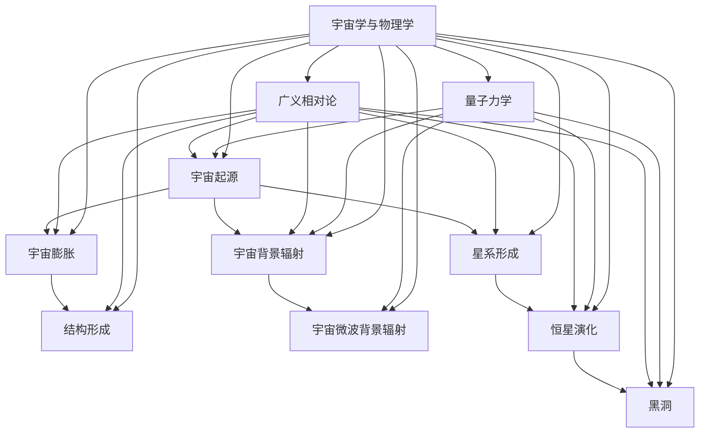

                 

### 宇宙：物理实在还是心智投射

宇宙，这一浩瀚的星海，自人类文明诞生以来，就吸引了无数的目光和探索。然而，对于宇宙的本质，人类始终没有一个明确的答案。传统物理学认为，宇宙是物理实在，由各种基本粒子和物理定律构成。然而，在近年来的哲学和科学研究中，一种新的观点——心智投射，逐渐引起人们的关注。心智投射理论认为，宇宙不仅是物理实在，同时也是心智的投射，我们的认知和思维在很大程度上影响了我们对宇宙的理解。

本文将围绕这一主题，逐步分析并探讨物理实在与心智投射之间的联系和区别。我们首先会回顾宇宙的起源与本质，接着深入探讨物理实在的争论和心智投射的理论基础。在此基础上，我们将介绍宇宙学基础概念和心智投射模型，详细讲解核心算法原理和宇宙认知的数学模型。最后，我们将通过项目实战和实际应用案例，展示心智投射在宇宙学中的应用，并对这一领域的研究进行总结与展望。

### 关键词

- **宇宙起源**  
- **物理实在**  
- **心智投射**  
- **宇宙学**  
- **广义相对论**  
- **量子力学**  
- **心智投射模型**  
- **宇宙认知数学模型**  
- **心智投射在宇宙学中的应用**

### 摘要

本文旨在探讨宇宙的本质：它是物理实在，还是心智的投射？通过回顾宇宙的起源与本质，我们了解了传统物理学对宇宙的理解。然而，心智投射理论提供了一种新的视角，认为宇宙不仅是物理的，也是心智的产物。本文将深入分析物理实在与心智投射之间的争论，介绍心智投射的理论基础和核心概念，并结合宇宙学的基础概念，详细讲解心智投射模型和宇宙认知的数学模型。通过项目实战和实际应用案例，我们将展示心智投射在宇宙学中的实际应用，并总结这一领域的研究现状和未来发展方向。

### 目录大纲

# 宇宙：物理实在还是心智投射

## 第一部分：引论

### 第1章：宇宙的起源与本质

#### 1.1 宇宙的物理起源

宇宙大爆炸理论：大爆炸的起源与证据  
宇宙学背景辐射：辐射的特性与观测

#### 1.2 宇宙的本质与特性

宇宙的空间与时间：无限性与有限性、膨胀与结构形成  
宇宙的组成：普遍物质与暗物质、普遍能量与暗能量

#### 1.3 宇宙与心智的关系

心智投射的宇宙观：心智投射对宇宙本质的探索与影响  
宇宙学中的心智投射理论：心智投射在宇宙演化与观测中的应用

### 第2章：物理实在与心智投射

#### 2.1 物理实在的争论

物理实在的哲学探讨：物理实在的概念与争论  
科学实在论与工具主义：科学实在论的理论基础与工具主义的观点

#### 2.2 心智投射的理论基础

心智投射的定义：心智投射的概念与内涵  
心智投射的心理学基础：意识与心智的结构与心理机制

#### 2.3 心智投射在宇宙学中的应用

心智投射在宇宙认知中的角色：心智投射对宇宙认知的影响与作用  
心智投射在宇宙学理论中的应用：心智投射在宇宙演化理论中的运用

### 第二部分：核心概念与联系

### 第3章：宇宙学基础概念

#### 3.1 宇宙学与物理学

宇宙学的定义与发展：宇宙学的起源与历史、现代发展与趋势  
物理学与宇宙学的关系：物理学在宇宙学中的基础作用与宇宙学对物理学的影响

#### 3.2 广义相对论与量子力学

广义相对论的基本原理：广义相对论的基本概念与宇宙学中的应用  
量子力学的基本原理：量子力学的基本概念与宇宙学中的应用

#### 3.3 Mermaid流程图：宇宙学核心概念关系图

### 第4章：心智投射理论与方法

#### 4.1 心智投射的起源与发展

心智投射的定义与历史：心智投射的起源与发展过程  
心智投射的类型与形式：心智投射的分类与表现形式

#### 4.2 心智投射的研究方法

心智投射的理论研究方法：心智投射的研究方法与工具  
心智投射的实证研究方法：心智投射的实证研究与案例分析

#### 4.3 心智投射在心理学中的应用

心智投射的理论应用：心智投射在心理学研究中的运用与影响  
心智投射的实践应用：心智投射在心理咨询与治疗中的应用

### 第三部分：核心算法原理讲解

### 第5章：心智投射模型与算法

#### 5.1 心智投射模型概述

心智投射模型的基本概念：心智投射模型的核心要素与结构  
心智投射模型的应用领域：心智投射模型在不同学科领域的应用

#### 5.2 心智投射算法原理

心智投射算法的基本原理：心智投射算法的原理与步骤  
心智投射算法的实现与优化：心智投射算法的实现方法与性能优化

#### 5.3 伪代码：心智投射算法实现

心智投射算法的伪代码描述：心智投射算法的伪代码实现与解释

### 第6章：宇宙认知的数学模型

#### 6.1 数学模型在宇宙认知中的应用

数学模型在宇宙认知中的角色：数学模型在宇宙认知中的重要作用与意义  
数学模型在宇宙学研究中的应用：数学模型在宇宙学理论体系中的应用

#### 6.2 LaTeX公式：宇宙认知数学模型公式

宇宙认知数学模型的主要公式：宇宙认知数学模型的核心公式与表达式

#### 6.3 宇宙认知数学模型举例说明

宇宙认知数学模型的实例分析：宇宙认知数学模型在具体问题中的应用与解释

### 第四部分：项目实战

### 第7章：宇宙认知项目实战

#### 7.1 实战项目背景与目标

宇宙认知项目的背景与意义：宇宙认知项目的研究背景与目标  
宇宙认知项目的目标与任务：宇宙认知项目的具体目标与任务分解

#### 7.2 实战项目开发环境搭建

开发环境的选择与配置：宇宙认知项目开发环境的搭建与配置  
开发工具与框架的使用：宇宙认知项目开发工具与框架的选用与使用

#### 7.3 源代码详细实现与解读

源代码的组织与结构：宇宙认知项目源代码的组织结构与模块划分  
关键算法与模块的实现：宇宙认知项目关键算法与模块的实现与解析

#### 7.4 代码解读与分析

代码功能与流程分析：宇宙认知项目代码的功能与流程解读  
代码性能优化与改进：宇宙认知项目代码的性能优化与改进策略

#### 7.5 项目小结

项目成果与总结：宇宙认知项目的研究成果与总结  
项目经验与启示：宇宙认知项目的开发经验与启示

### 第8章：心智投射在宇宙学中的应用案例

#### 8.1 案例一：利用心智投射解释宇宙演化

案例背景与目的：案例一的研究背景与目标  
案例研究方法：案例一的研究方法与数据收集  
案例结果与讨论：案例一的研究结果与讨论

#### 8.2 案例二：心智投射在宇宙暗物质研究中的应用

案例背景与目的：案例二的研究背景与目标  
案例研究方法：案例二的研究方法与数据收集  
案例结果与讨论：案例二的研究结果与讨论

#### 8.3 案例三：心智投射在宇宙黑洞探索中的应用

案例背景与目的：案例三的研究背景与目标  
案例研究方法：案例三的研究方法与数据收集  
案例结果与讨论：案例三的研究结果与讨论

### 第9章：总结与展望

#### 9.1 宇宙认知与心智投射的展望

未来研究的方向与挑战：宇宙认知与心智投射领域的研究方向与面临的挑战  
宇宙认知与心智投射的发展趋势：宇宙认知与心智投射领域的发展趋势与未来前景

#### 9.2 未来研究的方向与挑战

宇宙认知与心智投射的相互作用：宇宙认知与心智投射之间的相互作用与影响  
跨学科研究的机遇与挑战：跨学科研究在宇宙认知与心智投射领域的机遇与挑战

#### 9.3 对宇宙认知的启示与影响

心智投射在宇宙认知中的启示：心智投射对宇宙认知的启示与影响  
心智投射在宇宙学中的影响：心智投射对宇宙学理论体系的影响与贡献

### 附录

### 附录A：心智投射工具与资源

#### A.1 心智投射研究工具

常用心智投射研究工具：心智投射研究的常用工具与软件  
工具的功能与特点：常用心智投射研究工具的功能与特点介绍

#### A.2 心智投射相关论文与书籍

经典论文与书籍推荐：心智投射领域经典论文与书籍推荐  
论文与书籍的内容与评价：推荐论文与书籍的主要内容与评价

#### A.3 心智投射在线课程与讲座

心智投射在线课程与讲座资源：心智投射领域的在线课程与讲座资源  
课程与讲座的内容与评价：在线课程与讲座的主要内容与评价

## 第一部分：引论

### 第1章：宇宙的起源与本质

#### 1.1 宇宙的物理起源

宇宙的起源是科学史上最令人着迷的课题之一。在20世纪之前，人们对于宇宙起源的理解主要基于宗教和哲学的思辨，而没有科学依据。然而，20世纪初，天文学家埃德温·哈勃的观测揭示了宇宙正在膨胀的惊人事实，这一发现为宇宙起源的研究奠定了基础。

**宇宙大爆炸理论**

宇宙大爆炸理论是目前最广泛接受的宇宙起源理论。根据这一理论，宇宙起源于大约138亿年前的一个极热、极密的状态。在这个瞬间，所有的物质和能量都集中在一个无限小的点中，称为“奇点”。随后，由于某种未知的原因，奇点发生了剧烈的爆炸，物质和能量迅速向外扩散，形成了我们今天所看到的宇宙。

大爆炸的起源和证据可以从多个方面进行探讨。首先，宇宙背景辐射是大爆炸理论的重要证据之一。宇宙背景辐射是宇宙早期热辐射的残余，它在整个宇宙中均匀分布，且具有极低的温度。科学家通过测量宇宙背景辐射的谱线，可以推算出宇宙早期的温度和密度。

此外，宇宙的大尺度结构也是大爆炸理论的重要证据之一。大爆炸后，宇宙经历了多次剧烈的膨胀和冷却过程，这些过程塑造了宇宙中的星系、星云和恒星等结构。通过观测宇宙中的星系分布和运动规律，科学家可以推断出宇宙的膨胀历史，从而验证大爆炸理论的正确性。

**宇宙学背景辐射**

宇宙学背景辐射（Cosmic Microwave Background, CMB）是宇宙早期热辐射的残余。在大爆炸后的几分钟内，宇宙处于一个极端热的状态，充满了高能光子和其他基本粒子。随着宇宙的膨胀和冷却，这些高能光子逐渐失去了能量，变成了微波辐射。这种微波辐射遍布整个宇宙，成为了我们今天所能观测到的宇宙学背景辐射。

宇宙学背景辐射具有以下几个重要特性：

1. **均匀性**：宇宙背景辐射在宇宙中的分布非常均匀，几乎无处不在。这意味着在宇宙早期，物质和能量分布是高度均匀的。
2. **温度**：宇宙背景辐射的温度约为2.7开尔文，这是一个非常低的温度，但仍能证明宇宙早期的高能状态。
3. **极化**：宇宙背景辐射还具有极化特性，这表明在宇宙早期存在磁场的存在。

科学家通过测量宇宙背景辐射的谱线、温度和极化特性，可以进一步验证宇宙大爆炸理论和宇宙早期的物理状态。这些测量数据为我们提供了宇宙起源和演化的宝贵信息。

#### 1.2 宇宙的本质与特性

宇宙的本质是一个复杂且深奥的问题，涉及到宇宙的组成、结构、演化和基本规律。要理解宇宙的本质，我们需要从多个角度进行探讨。

**宇宙的空间与时间**

宇宙的空间与时间是宇宙学中的核心概念。传统的观点认为，宇宙是三维空间和一维时间的结合，空间是有限的，而时间是无限的。然而，随着相对论和量子力学的进步，我们对宇宙的空间与时间有了更深入的理解。

根据广义相对论，空间和时间是相互关联的，形成一个四维时空连续体。在这个连续体中，物质和能量会影响时空的结构，从而产生引力。例如，大质量物体（如行星和恒星）会产生强烈的引力，导致时空弯曲，这就是引力透镜效应的原理。

同时，宇宙的膨胀表明，空间本身是不断扩展的。宇宙的膨胀率称为哈勃参数，它描述了宇宙膨胀的速度与距离之间的关系。宇宙的膨胀意味着空间在不断拉长，而这种拉长是均匀且各向同性的。

**宇宙的无限性与有限性**

宇宙的无限性与有限性一直是哲学和科学讨论的话题。从传统的宇宙观念来看，宇宙是无限的，因为它包含无数的星系、行星和天体。然而，从现代宇宙学的角度来看，宇宙可能是有限的，但这种有限性不同于我们日常生活中的有限性。

宇宙的有限性主要体现在宇宙的体积和空间结构上。根据宇宙学观测数据，宇宙的年龄约为138亿年，这意味着宇宙从一个极小、极热的状态开始膨胀，直到今天。在这个膨胀过程中，宇宙的体积逐渐增大，但宇宙的总量是有限的。

另一方面，宇宙的无限性体现在宇宙的多样性上。宇宙中有无数的星系、星云、行星和天体，这些天体具有不同的形态和性质。这种多样性使得宇宙具有无限的探索价值。

**宇宙的膨胀与结构形成**

宇宙的膨胀是宇宙学中最重要的现象之一。宇宙膨胀意味着宇宙中的星系、星云和天体之间的距离在不断增大。这种膨胀是由于宇宙中的物质和能量在初始大爆炸后向外扩散的结果。

宇宙的膨胀可以分为两个阶段：早期快速膨胀和晚期缓慢膨胀。在早期快速膨胀阶段，宇宙的膨胀速度非常快，这种膨胀被称为“暴胀”。在晚期缓慢膨胀阶段，宇宙的膨胀速度逐渐减缓，但仍然在继续。

宇宙的膨胀不仅改变了宇宙的形态，还影响了宇宙中的结构形成。根据宇宙学理论，宇宙中的结构是通过物质凝聚和引力相互作用形成的。在宇宙早期，物质和能量分布是均匀的，但随着宇宙的膨胀，物质开始聚集，形成了星系、星云和其他天体结构。

**宇宙的组成**

宇宙的组成是一个复杂的问题，涉及到宇宙中的各种物质和能量。根据现代宇宙学的研究，宇宙主要由以下几种物质和能量组成：

1. **普通物质**：普通物质包括我们熟悉的原子、分子和粒子，如电子、质子和中子。普通物质构成了宇宙中的恒星、行星、星云和其他天体。
2. **暗物质**：暗物质是一种无法直接观测到的物质，它对宇宙中的结构形成和引力作用起着关键作用。暗物质占宇宙总质量的大部分，但其本质和组成仍然是一个谜。
3. **暗能量**：暗能量是一种充满宇宙的神秘能量，它导致了宇宙的加速膨胀。暗能量的本质和起源仍然是宇宙学研究的重要课题。

**宇宙的普遍物质与暗物质**

宇宙的普遍物质是指我们能够直接观测到的物质，包括恒星、行星、星云和其他天体。这些物质通过电磁辐射、引力相互作用等方式，形成了宇宙中的各种结构。

而暗物质则是我们无法直接观测到的物质，它对宇宙中的引力作用和结构形成起着关键作用。暗物质的主要证据来自于对宇宙中引力透镜效应的观测和宇宙微波背景辐射的测量。通过这些观测数据，科学家推断出暗物质在宇宙中的存在和作用。

**宇宙的普遍能量与暗能量**

宇宙的普遍能量包括所有形式的能量，如动能、势能、辐射能等。这些能量在宇宙中不断转换和传递，维持着宇宙的运行和演化。

而暗能量则是导致宇宙加速膨胀的神秘能量。暗能量在宇宙总能量中占据主导地位，但其本质和起源仍然未知。科学家通过观测宇宙的膨胀速度和宇宙微波背景辐射，推断出暗能量的存在和作用。

**宇宙的组成与演化**

宇宙的组成和演化是一个复杂的过程，涉及到宇宙中的各种物质和能量。根据宇宙学理论，宇宙经历了多个阶段的演化：

1. **大爆炸后初期**：宇宙处于一个极热、极密的状态，物质和能量高度集中。随着宇宙的膨胀和冷却，物质开始形成原子和其他基本粒子。
2. **恒星形成**：在宇宙早期，物质开始凝聚形成恒星。恒星通过核聚变产生能量和光，为宇宙中的生命和演化提供了条件。
3. **星系形成**：恒星和其他物质继续凝聚，形成了星系。星系中的恒星通过引力相互作用，形成了复杂的结构。
4. **宇宙演化**：宇宙不断膨胀，恒星和其他天体逐渐老化，形成了新的结构。宇宙中的物质和能量继续转换和传递，维持着宇宙的演化。

通过研究宇宙的起源、本质和演化，我们可以更好地理解宇宙的运行规律和基本原理。这些研究不仅对科学的发展有着重要意义，也对人类的认知和思维产生了深远影响。

#### 1.3 宇宙与心智的关系

宇宙与心智的关系是一个古老而深奥的话题，涉及哲学、心理学、物理学等多个领域。从传统哲学的观点来看，宇宙和心智是两个独立的实体，前者是物理世界的存在，后者是人类意识的产物。然而，近年来，心智投射理论提出了一种新的视角，认为宇宙不仅是物理实在，同时也是心智的投射。

**心智投射的宇宙观**

心智投射理论认为，我们的认知和思维在很大程度上影响了我们对宇宙的理解。宇宙的许多现象，如空间、时间、物质等，都是心智的投射。换句话说，我们的心智结构决定了我们对宇宙的感知和认知。

这种观点在哲学和心理学领域有着广泛的讨论。一些哲学家认为，宇宙的本质是意识，我们的感知和认知只是宇宙意识的一部分。这种观点被称为意识宇宙论（Idealistic Cosmology）。另一些哲学家则认为，宇宙是一个客观存在的实体，我们的心智只是对其进行了主观的投射。这种观点被称为唯物主义宇宙观（Materialistic Cosmology）。

**心智投射对宇宙本质的探索**

心智投射理论为探索宇宙本质提供了一种新的方法。通过研究心智投射，我们可以更好地理解宇宙的结构和演化。例如，在宇宙学的领域，心智投射理论可以帮助我们解释宇宙的膨胀、黑洞、暗物质等现象。

例如，宇宙的膨胀现象可以通过心智投射理论进行解释。根据心智投射理论，宇宙的膨胀是我们心智对宇宙空间感知的结果。我们的心智感知到了宇宙空间的扩展，从而产生了宇宙膨胀的现象。

同样，黑洞和暗物质也可以通过心智投射理论进行解释。心智投射理论认为，黑洞和暗物质只是我们心智对宇宙中某些现象的投射。我们通过心智的投射，将这些现象理解成了黑洞和暗物质。

**心智投射对宇宙认知的影响**

心智投射不仅影响了我们对宇宙本质的探索，还影响了我们对宇宙的认知。我们的认知过程受到心智结构的影响，从而影响了我们对宇宙的理解。

例如，我们的认知过程受到语言、文化和教育等因素的影响。这些因素塑造了我们的心智结构，从而影响了我们对宇宙的认知。例如，不同的文化和教育背景会导致人们对宇宙有不同的理解和认知。

**宇宙学中的心智投射理论**

心智投射理论在宇宙学中的应用是一个新兴的研究领域。通过研究心智投射，我们可以更好地理解宇宙的演化、结构和性质。

例如，在宇宙演化方面，心智投射理论可以帮助我们理解宇宙从大爆炸到现在的演化过程。通过研究心智投射，我们可以探索宇宙中的各种现象，如宇宙的膨胀、恒星和星系的形成、宇宙中的物质和能量分布等。

在宇宙结构方面，心智投射理论可以帮助我们理解宇宙的空间结构。例如，通过研究心智投射，我们可以探索宇宙中星系和星云的分布规律，以及宇宙中黑洞和暗物质的影响。

**心智投射在宇宙学观测中的应用**

心智投射理论在宇宙学观测中的应用也非常重要。通过研究心智投射，我们可以更好地理解宇宙中的观测现象。

例如，在观测宇宙微波背景辐射时，心智投射理论可以帮助我们解释观测数据的含义。通过研究心智投射，我们可以更好地理解宇宙微波背景辐射的谱线和温度分布，从而推断宇宙早期的高能状态和物质分布。

同样，在观测黑洞和暗物质时，心智投射理论也可以帮助我们解释观测结果。通过研究心智投射，我们可以更好地理解黑洞和暗物质的性质和作用，从而推断宇宙中的物质分布和引力效应。

总之，心智投射理论为宇宙学研究提供了一种新的视角和方法。通过研究心智投射，我们可以更好地理解宇宙的本质、结构和演化，从而推动宇宙学的发展。同时，心智投射理论也为我们提供了一个更深入的思考宇宙的方式，挑战了传统的唯物主义宇宙观，推动了哲学和科学的发展。

#### 2.1 物理实在的争论

物理实在的争论是哲学和科学领域的一个长期议题，涉及到我们对现实世界的认识和理解。物理实在论和工具主义是两种主要的立场，它们对物理实在的概念和本质有着不同的理解和解释。

**物理实在的概念**

物理实在论者认为，物理实在是一个独立于人类意识和感知的客观存在。它存在于我们的感知和认知之外，不受主观因素的影响。物理实在包括物质实体、空间、时间和自然规律等基本要素。物理实在论强调，我们对物理世界的理解应当基于客观的证据和观测结果。

相比之下，工具主义者则认为，物理实在并不是一个独立的存在，而是我们用来解释和预测自然现象的工具。工具主义者认为，物理理论、定律和模型只是人类为了理解和控制自然现象而创造的概念框架。这些框架在一定程度上是有效的，但它们并不是客观存在的实体。

**物理实在的争论与观点**

物理实在论的争论主要涉及以下几个方面的观点：

1. **科学实在论**：科学实在论认为，科学理论所描述的实体和规律具有客观存在的性质。例如，物理学家所发现的粒子、原子、行星等都是真实存在的，不依赖于我们的感知和认知。

2. **反实在论**：反实在论认为，物理实在并不是一个固定的、独立的存在，而是随着人类认知和技术的进步而不断变化的。反实在论者认为，我们对物理世界的理解是基于现有的科学理论和观测技术的，这些理论和技术的局限决定了我们对物理实在的认识。

3. **操作主义**：操作主义者认为，物理实在只能通过实验操作和观测结果来定义和验证。物理实在的意义在于它能够帮助我们进行预测和控制，而不是一个独立存在的实体。

工具主义的观点主要集中在以下几个方面：

1. **模型论**：模型论认为，物理理论只是我们为了描述和预测自然现象而构建的模型。这些模型在一定程度上是有效的，但它们并不是物理实在的最终表述。

2. **认知工具论**：认知工具论认为，物理理论和定律是我们认知世界的工具。我们通过这些工具来理解和解释自然现象，而不是直接接触物理实在。

3. **功能主义**：功能主义认为，物理理论和模型的有效性取决于它们在预测和控制自然现象方面的功能。只要这些工具能够帮助我们实现目标，它们就是有价值的，不论它们是否反映了物理实在的本质。

**科学实在论与工具主义**

科学实在论和工具主义在对待物理实在问题上存在根本分歧。科学实在论者强调物理实在的独立性和客观性，认为科学理论和定律所描述的实体和规律是真实存在的。而工具主义者则认为，物理理论和模型只是我们认知和预测自然现象的工具，它们的有效性取决于其在实际应用中的功能，而不是物理实在本身。

科学实在论和工具主义的区别不仅体现在对物理实在的理解上，还涉及到科学哲学和方法论。科学实在论倾向于强调客观证据和实证研究，而工具主义则更加关注科学理论的功能和应用。

**对科学实在论的批评**

科学实在论虽然提供了对物理实在的一种有力解释，但也面临着一些批评和挑战：

1. **观察者的角色**：科学实在论认为，物理实在独立于观察者，但批评者指出，观察者的存在和观测过程会影响我们对物理实在的理解。观察者的主观因素可能会影响我们对物理现象的观测和解释。

2. **理论的相对性**：科学实在论认为，科学理论所描述的实体和规律是固定不变的。然而，批评者指出，科学理论是随着时间和技术的进步而不断发展的。每个时代的科学理论都是特定历史条件的产物，因此，物理实在的理解也具有相对性。

3. **复杂性**：现代物理学，特别是量子力学和相对论，揭示了物理世界的复杂性和不确定性。科学实在论如何处理这些复杂性，以及如何解释量子力学中的非确定性，是科学实在论面临的挑战之一。

总之，物理实在的争论是一个复杂而深远的话题，涉及到我们对现实世界的认识和理解。科学实在论和工具主义提供了两种不同的视角，它们各有优势和局限性。通过对这些立场的深入探讨，我们可以更好地理解物理实在的本质和我们对它的认知。

#### 2.2 心智投射的理论基础

心智投射（Mind Projection Hypothesis）是一种哲学和心理学理论，主张我们的感知、认知和思维过程不仅仅是大脑内部的活动，而是心智对物理世界的投射。这种理论的核心观点是，我们的心智结构决定了我们对现实世界的感知和理解，从而影响了我们对物理实在的认知。以下将从定义、心理学基础、类型和形式等方面详细探讨心智投射的理论基础。

**心智投射的定义**

心智投射是指心智活动将内在的心理结构、概念和模型投射到外部物理世界中，从而形成我们对现实的感知和理解。心智投射理论认为，我们的心智并非直接感知物理世界，而是通过心智的内在结构和假设来解释和构建外部世界的图像。这种观点强调了心智在感知和认知过程中的主导作用。

**心理学基础**

心智投射的理论基础源于心理学和认知科学的研究，特别是关于意识和感知的研究。以下是心智投射的几个关键心理学基础：

1. **意识的内在性**：心理学家和哲学家普遍认为，意识是一个内在的主观体验，它不能直接观察到，而是通过个体的感知和认知过程来体验。

2. **认知的建构性**：认知科学家认为，我们对现实的认知是一个建构过程，我们通过心智的内在结构和规则来解释外部信息。心智投射理论强调了这种建构性在感知和理解中的作用。

3. **模拟和推理**：心智投射涉及心智通过模拟和推理来理解和预测外部世界。我们利用心智中的模型和假设来解释和预测物理现象，从而形成对现实的理解。

**类型和形式**

心智投射可以分为几种不同的类型和形式，每种形式反映了心智如何将内在结构投射到外部世界：

1. **感知投射**：感知投射是指心智将内在的心理结构和预期投射到外部感知中。例如，当我们看到一只动物时，我们不仅看到它的物理形态，还会基于我们的经验和知识，将其识别为特定的物种。

2. **情感投射**：情感投射是指心智将内在的情感状态投射到外部事物上。例如，当看到美丽的风景时，我们会感到愉悦，这是我们的情感状态对外部环境的投射。

3. **文化投射**：文化投射是指心智将内在的文化观念和价值观投射到外部世界。例如，不同的文化背景会影响我们对事物的评价和认知方式。

4. **认知投射**：认知投射是指心智将内在的认知结构和概念投射到外部世界中。例如，我们通过语言和符号系统来理解和沟通，这是认知结构对物理世界的投射。

**心智投射的理论基础**

心智投射的理论基础可以从以下几个方面进行探讨：

1. **心理模拟**：心智投射依赖于心理模拟，即心智通过模拟外部世界来理解和预测现象。心理模拟使我们能够在没有直接接触的情况下，对物理世界进行认知和推理。

2. **心智模型**：心智模型是心智投射的核心，它是指心智中用于理解和解释外部世界的内在结构。这些模型包括概念、规则、假设和理论，它们帮助我们组织和解释感知信息。

3. **感知与认知的相互作用**：感知和认知是相互关联的，感知提供了外部世界的输入，而认知则是对这些输入的解释和组织。心智投射理论强调了这种相互作用在构建我们对现实世界的理解中的重要性。

4. **文化和社会因素**：文化和社会因素对心智投射有重要影响。我们的文化背景和社会环境塑造了我们的心智模型和认知方式，从而影响了我们对物理世界的感知和理解。

总之，心智投射理论为我们提供了一种新的视角来理解我们的感知、认知和思维过程。通过研究心智投射，我们可以更好地理解心智如何影响我们对现实世界的感知和理解。这种理论不仅有助于哲学和心理学的研究，也为认知科学和人工智能领域提供了重要的启示。

#### 2.3 心智投射在宇宙学中的应用

心智投射理论在宇宙学中的应用提供了一个全新的视角，使我们能够从心智的角度重新审视宇宙的本质和演化。心智投射在宇宙认知中的角色，心智投射在宇宙学理论中的应用，以及心智投射在宇宙学观测中的应用，都是这一领域的重要研究方向。

**心智投射在宇宙认知中的角色**

心智投射在宇宙认知中扮演着关键角色，它影响了我们对宇宙的理解和解释。心智投射理论认为，宇宙并不是直接呈现给我们的，而是通过心智的内在结构和预期来构建的。这种观点挑战了传统的唯物主义宇宙观，强调了心智在感知和认知过程中的重要性。

首先，心智投射帮助我们解释宇宙的复杂性和多样性。通过心智模型，我们能够将复杂的宇宙现象简化为可理解和解释的形式。例如，宇宙的膨胀、黑洞和暗物质等现象，都可以通过心智投射理论进行解释。

其次，心智投射使我们能够预测和预测宇宙中的未知现象。通过心智模拟，我们可以构建各种宇宙模型，并预测这些模型在未来可能产生的结果。这种能力使心智投射在科学研究和探索中具有重要作用。

**心智投射在宇宙学理论中的应用**

心智投射在宇宙学理论中的应用，主要体现在对宇宙演化、结构和性质的解释上。心智投射理论提供了新的方法论，使我们能够从心智的角度重新审视宇宙学的基本理论。

1. **宇宙演化**：心智投射理论认为，宇宙的演化过程不仅仅是物理过程，也涉及到心智的投射。通过心智模拟，我们可以探索宇宙从大爆炸到现在的演化过程。例如，心智投射可以帮助我们理解宇宙的膨胀、结构形成和星系演化等过程。

2. **宇宙结构**：心智投射理论强调，宇宙的结构和性质是心智对物理世界的投射。通过心智模型，我们可以解释宇宙中的各种结构，如星系、星云和黑洞等。例如，心智投射理论可以解释星系的形成和演化，以及黑洞的性质和作用。

3. **宇宙性质**：心智投射理论认为，宇宙的性质，如空间、时间和物质，都是心智的投射。通过心智模型，我们可以探索宇宙的性质，如宇宙的无限性与有限性、宇宙的膨胀与收缩等。

**心智投射在宇宙学观测中的应用**

心智投射在宇宙学观测中的应用，主要体现在对观测数据和现象的解释上。通过心智投射理论，我们可以重新审视宇宙学观测结果，并从心智的角度解释这些结果。

1. **宇宙背景辐射**：宇宙背景辐射是宇宙早期热辐射的残余，通过观测宇宙背景辐射，我们可以了解宇宙早期的高能状态。心智投射理论可以帮助我们解释宇宙背景辐射的均匀性、温度和极化特性，从而推断宇宙早期的物理条件。

2. **引力透镜效应**：引力透镜效应是由于物质对光的引力作用，导致光线的路径发生弯曲。通过观测引力透镜效应，我们可以了解宇宙中的物质分布和引力场。心智投射理论可以帮助我们解释引力透镜效应，从而推断宇宙中的暗物质分布。

3. **黑洞和暗物质**：黑洞和暗物质是宇宙学中重要的研究课题。心智投射理论可以帮助我们理解黑洞和暗物质的性质和作用。例如，通过心智投射，我们可以解释黑洞的形成和演化，以及暗物质在宇宙中的作用。

总之，心智投射在宇宙学中的应用提供了一个新的研究视角，使我们能够从心智的角度重新审视宇宙的本质和演化。通过心智投射理论，我们可以更好地理解宇宙的复杂性和多样性，并解释宇宙学观测结果。这不仅为宇宙学研究提供了新的方法论，也为哲学和科学的发展带来了新的思考方向。

### 第三部分：核心概念与联系

#### 3.1 宇宙学与物理学

宇宙学是研究宇宙的起源、结构、演化和性质的科学，它涵盖了从宇宙大爆炸到宇宙学背景辐射的广泛主题。宇宙学与物理学有着紧密的联系，因为它们共同探索了宇宙的基本规律和现象。

**宇宙学的定义与发展**

宇宙学（Cosmology）一词来源于希腊语，意为“宇宙之学”。宇宙学作为一门科学，起源于古代哲学和天文学。在古代，人们通过对天文现象的观察，试图理解宇宙的结构和秩序。古希腊哲学家如亚里士多德和托勒密提出了关于宇宙的基本理论，认为地球是宇宙的中心，而天体则围绕着地球运行。

然而，现代宇宙学的发展始于20世纪初。1917年，爱因斯坦提出了广义相对论，这一理论彻底改变了我们对宇宙的理解。广义相对论揭示了引力与时空结构的紧密关系，使得宇宙学从天文学和哲学的范畴，转变为基于物理定律的科学。随后，哈勃的观测结果揭示了宇宙的膨胀，这一发现为宇宙学研究奠定了基础。

在20世纪中叶，宇宙学进一步发展，形成了大爆炸宇宙学模型。大爆炸宇宙学认为，宇宙起源于一个极热、极密的状态，随后经历了快速的膨胀。这一理论得到了多种观测数据的支持，如宇宙背景辐射、宇宙微波背景辐射和超新星观测等。现代宇宙学通过这些观测数据，不断验证和修正大爆炸宇宙学模型，从而深化我们对宇宙起源和演化的理解。

**物理学与宇宙学的关系**

物理学是宇宙学的基础，因为宇宙学研究的宇宙现象都遵循物理定律。物理学的进展直接影响了宇宙学的发展。以下是物理学与宇宙学关系的几个方面：

1. **理论框架**：物理学提供了宇宙学的理论框架，如广义相对论和量子力学。这些理论帮助我们理解宇宙中的基本力、物质和能量。例如，广义相对论解释了宇宙的引力现象，而量子力学解释了微观尺度上的物质行为。

2. **观测技术**：物理学的观测技术推动了宇宙学的发展。例如，望远镜的改进使我们能够观测更遥远的宇宙，探测到宇宙背景辐射和遥远星系的分布。高能粒子探测器和引力波探测器等新技术，也为宇宙学提供了新的观测手段。

3. **交叉领域**：宇宙学与物理学在多个领域进行了交叉研究，如黑洞物理学、暗物质和暗能量研究等。这些交叉领域不仅推动了宇宙学的发展，也丰富了物理学的研究内容。

**宇宙学对物理学的影响**

宇宙学不仅依赖于物理学，同时也对物理学产生了重要影响。以下是宇宙学对物理学影响的几个方面：

1. **新物理理论**：宇宙学提出了新的物理问题和挑战，促使物理学发展出新的理论。例如，宇宙学中的暗物质和暗能量问题，激发了物理学家探索新的粒子物理模型和宇宙学理论。

2. **实验验证**：宇宙学的观测数据为物理理论提供了实验验证。例如，广义相对论的许多预言，如引力透镜效应和引力波，都得到了宇宙学观测的验证。

3. **哲学启示**：宇宙学探讨了宇宙的本质和起源，为哲学思考提供了新的启示。宇宙学中的许多问题，如时间的起源、宇宙的无限性等，引发了关于存在、意识和认识的哲学讨论。

总之，宇宙学与物理学是紧密相连的两个学科，它们相互促进，共同探索了宇宙的基本规律和现象。宇宙学的发展离不开物理学的理论框架和观测技术，而宇宙学的进展也为物理学带来了新的挑战和启示。通过宇宙学和物理学的结合，我们能够更深入地理解宇宙的本质和演化，揭示宇宙的奥秘。

#### 3.2 广义相对论与量子力学

广义相对论与量子力学是现代物理学的两大基石，各自从不同的角度揭示了宇宙的基本规律。广义相对论主要描述了引力现象，而量子力学则揭示了微观粒子的行为。在这两个理论的基础上，我们可以更深入地理解宇宙的复杂性和多样性。

**广义相对论的基本原理**

广义相对论是由阿尔伯特·爱因斯坦在1915年提出的，它是基于两个基本原理：等效原理和广义协变原理。

1. **等效原理**：等效原理认为，在任何局部区域内，重力效应与加速度效应是不可区分的。这意味着，在一个自由下落的参考系中，我们无法区分自己是由于重力作用而在地球上自由下落，还是由于加速运动而不在重力场中。这个原理揭示了引力与加速度之间的等价性。

2. **广义协变原理**：广义协变原理指出，物理定律在所有参考系中都是相同的，无论这些参考系是惯性系还是非惯性系。这意味着，物理定律不依赖于特定的参考系，而是具有广义协变性。

广义相对论通过这两个原理，成功地将引力解释为时空的弯曲。在广义相对论中，物质和能量会影响时空的结构，形成引力场。引力并不是一种传递力，而是物质和能量对时空几何形状的影响。这一理论不仅解释了牛顿引力定律无法解释的许多现象，如水星轨道的进动和光线弯曲，还为我们提供了一种新的理解宇宙的方法。

**广义相对论在宇宙学中的应用**

广义相对论在宇宙学中的应用非常重要。它是大爆炸宇宙学模型的理论基础，帮助我们理解宇宙的起源和演化。

1. **宇宙膨胀**：哈勃的观测揭示了宇宙正在膨胀，这一现象可以通过广义相对论解释。宇宙的膨胀导致时空的扩展，从而改变了宇宙中天体的相对位置和运动轨迹。

2. **黑洞**：广义相对论预言了黑洞的存在，黑洞是宇宙中最神秘和最奇特的现象之一。黑洞是一种密度无限大、引力场极强的天体，连光线也无法逃脱。广义相对论为我们提供了理解黑洞性质和行为的理论框架。

3. **引力透镜效应**：引力透镜效应是广义相对论的重要预测之一，它描述了光在经过强引力场时会发生弯曲。这一效应被广泛用于观测遥远的宇宙，通过探测引力透镜效应，我们可以推断出宇宙中的暗物质分布。

**量子力学的基本原理**

量子力学是描述微观粒子行为的物理学理论，由马克斯·波恩、沃纳·海森伯和埃尔温·薛定谔等科学家在20世纪初提出。量子力学的基本原理与传统经典物理学的观念有显著区别，它揭示了微观世界的非确定性、波动性和量子叠加态等特性。

1. **波粒二象性**：量子力学表明，微观粒子既表现出粒子性质，又表现出波动性质。例如，电子既可以用电子云描述其位置概率，也可以用粒子轨迹描述其运动。

2. **不确定性原理**：海森伯不确定性原理指出，我们无法同时精确知道一个粒子的位置和动量。这意味着，微观粒子的状态是概率性的，而不是确定的。

3. **量子叠加态**：量子力学中的叠加态表明，一个微观粒子可以同时处于多个状态，直到被观测或测量时才会“坍缩”到一个确定的状态。

**量子力学在宇宙学中的应用**

量子力学在宇宙学中的应用主要体现在宇宙早期状态的研究中。宇宙早期是量子力学效应非常显著的时刻，量子力学帮助我们理解这些早期现象。

1. **量子引力**：量子引力是试图将广义相对论和量子力学统一起来的理论。目前，量子引力还是一个未解之谜，但它是理解宇宙早期状态的关键。量子引力理论可能会揭示宇宙大爆炸前和宇宙背景辐射早期的高能状态。

2. **宇宙微波背景辐射**：宇宙微波背景辐射是宇宙早期热辐射的残余，它的观测数据为我们提供了宇宙早期状态的重要信息。量子力学帮助我们理解这些辐射的产生和演化过程。

3. **量子涨落**：量子涨落是量子力学预测的一种现象，它描述了在宇宙早期，微小的量子波动导致物质和能量的分布不均匀。这些涨落是宇宙结构和星系形成的基础。

**广义相对论与量子力学的联系与挑战**

广义相对论和量子力学在描述宇宙的不同尺度上都有重要作用，但它们之间存在一些根本性的矛盾和挑战。

1. **统一场理论**：为了解决广义相对论和量子力学之间的矛盾，科学家们提出了统一场理论。统一场理论试图将引力和量子力统一在一个框架中，但目前尚未成功。

2. **量子引力**：量子引力是解决广义相对论与量子力学矛盾的关键领域，它可能揭示宇宙的基本结构和起源。然而，量子引力仍然是一个开放的研究领域，没有统一的数学框架和明确的物理理论。

3. **多世界解释**：一些科学家提出，量子力学中的多世界解释可能是解决广义相对论与量子力学矛盾的一种途径。多世界解释认为，每一个量子事件都会导致宇宙分支成多个平行宇宙，每个宇宙都有不同的历史和物理规律。

总之，广义相对论和量子力学是理解宇宙的两个重要理论，它们在各自的领域内取得了巨大的成功。然而，将它们统一为一个完整的理论框架，仍然是物理学面临的一个巨大挑战。通过研究这两个理论之间的联系和矛盾，我们可以更深入地理解宇宙的本质和演化。

#### 3.3 Mermaid流程图：宇宙学核心概念关系图

为了更好地理解宇宙学中的核心概念及其相互关系，我们可以使用Mermaid流程图来展示这些概念之间的联系。以下是一个简化的宇宙学核心概念关系图，它涵盖了宇宙起源、结构、演化和宇宙学与物理学之间的关系。



在这个流程图中：

- **A[宇宙起源]**：表示宇宙的起源，包括宇宙大爆炸和奇点等概念。
- **B[宇宙膨胀]**：表示宇宙从大爆炸后开始膨胀的过程。
- **C[结构形成]**：表示宇宙膨胀过程中形成的星系、星云等结构。
- **D[宇宙背景辐射]**：表示宇宙早期热辐射的残余，包括宇宙微波背景辐射。
- **E[宇宙微波背景辐射]**：表示宇宙微波背景辐射，它是宇宙早期状态的重要信息来源。
- **F[星系形成]**：表示星系的形成过程，包括恒星和其他天体的形成。
- **G[恒星演化]**：表示恒星的演化过程，包括恒星的诞生、生命周期和死亡。
- **H[黑洞]**：表示黑洞的形成和性质，它是宇宙中最神秘的现象之一。
- **I[广义相对论]**：表示广义相对论，它是描述宇宙中引力现象的理论基础。
- **J[量子力学]**：表示量子力学，它是描述微观粒子行为的理论。
- **K[宇宙学与物理学]**：表示宇宙学与物理学之间的关系，强调两个学科的相互作用。

通过这个Mermaid流程图，我们可以清晰地看到宇宙学核心概念之间的联系，以及它们与物理学理论之间的关系。这有助于我们更好地理解宇宙的复杂性和多样性，并为未来的研究提供指导。

### 第4章：心智投射理论与方法

#### 4.1 心智投射的起源与发展

心智投射（Mind Projection Hypothesis）作为一种理论，起源于对人类感知、认知和思维过程的研究。它最早可以追溯到哲学领域，后来逐渐渗透到心理学、认知科学和宇宙学等多个学科。心智投射理论的发展经历了几个重要阶段，每个阶段都为我们的理解提供了新的视角和方法。

**心智投射的定义与历史**

心智投射最早的概念可以追溯到古希腊哲学，亚里士多德和柏拉图等哲学家探讨了心智如何影响我们对现实的感知和理解。亚里士多德提出了“形而上学”的概念，认为现实世界背后的本质是心智的投射。这一观点在后来的中世纪哲学中得到了进一步的发展。

到了近现代，心智投射理论逐渐从哲学领域转移到心理学领域。19世纪末和20世纪初，心理学家如威廉·詹姆斯和爱德华·布拉德福德·特奥多尔·明斯特伯格开始研究人类的感知和认知过程，并提出心智投射的概念。他们认为，我们的感知和认知不仅仅是对外部世界的直接反映，而是心智对现实的一种投射。

20世纪中期，随着认知科学的兴起，心智投射理论得到了进一步的发展。认知科学家们开始使用心智模型和模拟来解释人类的思维过程。约翰·福布斯·奈特和赫伯特·A·西蒙等学者提出了“心智模型理论”，认为人类通过心智模型来理解和预测外部世界。

**心智投射的类型与形式**

心智投射理论涵盖多种类型和形式，每种类型和形式反映了心智如何将内在结构和预期投射到外部世界。以下是几种主要的心智投射类型：

1. **感知投射**：感知投射是指心智将内在的心理结构和预期投射到外部感知中。例如，当我们看到一只动物时，不仅看到它的物理形态，还会基于我们的经验和知识，将其识别为特定的物种。

2. **情感投射**：情感投射是指心智将内在的情感状态投射到外部事物上。例如，当看到美丽的风景时，我们会感到愉悦，这是我们的情感状态对外部环境的投射。

3. **文化投射**：文化投射是指心智将内在的文化观念和价值观投射到外部世界。例如，不同的文化背景会影响我们对事物的评价和认知方式。

4. **认知投射**：认知投射是指心智将内在的认知结构和概念投射到外部世界中。例如，我们通过语言和符号系统来理解和沟通，这是认知结构对物理世界的投射。

**心智投射理论在心理学中的应用**

心智投射理论在心理学领域有着广泛的应用，特别是在认知心理学和临床心理学中。以下是心智投射理论在心理学中的几个应用实例：

1. **认知心理学**：在认知心理学中，心智投射理论帮助我们理解人类思维过程的机制。例如，通过研究心智模型和模拟，我们可以解释为什么人们会对某些信息给予更多的关注，而忽略其他信息。

2. **临床心理学**：在临床心理学中，心智投射理论可以帮助心理学家理解患者的心理状态和行为。例如，通过分析患者的语言和行为，心理学家可以推断出患者的内在心理结构和情感状态。

**心智投射理论的挑战与争议**

尽管心智投射理论在多个领域取得了显著成果，但同时也面临着一些挑战和争议。以下是几个主要的挑战和争议：

1. **观察者的角色**：心智投射理论强调心智在感知和认知过程中的作用，但如何处理观察者的主观因素仍然是一个难题。观察者的存在和观测过程可能会影响我们对物理世界的认知。

2. **理论的相对性**：心智投射理论认为，我们对物理世界的认知是相对的，取决于心智的结构和预期。然而，这种相对性如何与物理实在相协调，仍然是一个争议点。

3. **实证研究的局限**：心智投射理论主要依赖于模拟和推理，而不是直接的观测数据。因此，如何通过实证研究验证心智投射理论，仍然是一个挑战。

总之，心智投射理论为我们提供了一个新的视角来理解人类的感知、认知和思维过程。通过研究心智投射，我们可以更好地理解人类心智的运作机制，并应用于心理学、认知科学和宇宙学等多个领域。尽管面临一些挑战和争议，心智投射理论仍然具有重要的研究价值和实际应用潜力。

#### 4.2 心智投射的研究方法

心智投射理论的研究方法多种多样，涵盖了实验心理学、认知科学、神经科学和计算机科学等多个领域。这些方法为我们提供了理解心智如何影响感知和认知过程的重要工具。以下将介绍心智投射研究中常用的几种方法，并讨论其实证研究中的案例分析。

**实验心理学方法**

实验心理学是研究心智投射最常用的方法之一。通过设计控制实验，研究者可以系统地操纵和测量心智结构对感知和认知过程的影响。

1. **实验设计**：实验设计通常包括以下步骤：首先，明确研究问题，定义心智投射的理论模型；其次，选择实验参与者，确保其心智结构具有代表性；然后，设计实验条件，通过控制变量来操纵心智结构；最后，收集和数据分析，以验证理论模型的预测。

2. **案例分析**：一个著名的案例是关于视觉错觉的研究。实验者通过展示特定的几何图案，发现参与者的感知与实际图案存在偏差。这些偏差可以通过分析参与者的反应时间和错误率来测量。研究发现，参与者的心智结构，如先前的经验和期待，显著影响了他们的感知结果。

**认知科学方法**

认知科学方法强调心智投射理论在认知过程中的作用，通过模拟和建模来解释人类的行为。

1. **模拟实验**：模拟实验通过计算机模拟来再现心智投射的过程。例如，研究者可以创建虚拟现实环境，让参与者在这个环境中进行任务，然后分析他们的行为模式。这种方法可以控制外部因素，专注于心智结构的内部运作。

2. **案例研究**：一个案例研究是关于心智模型在决策过程中的作用。研究者通过设计一系列模拟决策任务，发现参与者的决策行为受到心智模型的影响。这些模型包括对风险的评估、期望的设定等。通过分析参与者在不同条件下的决策行为，研究者能够验证心智模型的有效性和可靠性。

**神经科学研究方法**

神经科学研究方法利用脑成像技术，如功能性磁共振成像（fMRI）和脑电图（EEG），来探索心智投射的神经基础。

1. **脑成像技术**：通过脑成像技术，研究者可以观察大脑活动与心智投射过程之间的关联。例如，fMRI可以实时监测大脑在不同认知任务中的活动变化，EEG可以记录大脑电活动的瞬时变化。

2. **案例研究**：一个案例研究是关于心智投射在记忆中的作用。研究者通过fMRI技术发现，当参与者回忆过去的事件时，大脑中的特定区域活跃度增加。这些区域与心智模型的构建和更新密切相关。通过分析脑成像数据，研究者能够揭示心智投射的神经机制。

**计算机科学方法**

计算机科学方法在心智投射研究中主要用于开发心智模型和模拟系统，以理解复杂的心智过程。

1. **心智模型开发**：计算机科学家开发了一系列心智模型，如产生式模型、神经网络模型和决策树模型，来模拟人类的心智过程。这些模型可以用于预测和理解人类的行为。

2. **模拟系统**：模拟系统通过计算机程序来模拟心智投射的过程，从而验证理论模型的预测。例如，研究者可以创建虚拟环境，模拟人类的感知和认知过程，然后分析模拟结果与实际观察数据的吻合度。

3. **案例研究**：一个案例研究是关于心智投射在虚拟现实中的应用。研究者通过开发虚拟现实系统，让参与者体验不同的情境，然后分析他们的感知和行为。研究发现，虚拟现实环境可以有效地模拟心智投射的过程，从而帮助理解人类的行为。

总之，心智投射的研究方法多样且富有创新性，通过实验心理学、认知科学、神经科学和计算机科学等多种方法的结合，研究者们能够深入探讨心智投射的机制和影响。这些方法不仅为理解心智投射提供了有力工具，也为心理学、认知科学和宇宙学等领域的研究提供了新的视角和思路。

#### 4.3 心智投射在心理学中的应用

心智投射理论在心理学领域有着广泛的应用，特别是在认知心理学、临床心理学和发展心理学等方面。通过理解心智投射，心理学家可以更深入地揭示人类行为和心理过程的本质。

**心智投射的理论应用**

在认知心理学中，心智投射理论帮助我们理解人类如何通过内在的心理模型来解释外部世界。例如，当我们看到一只动物时，我们不仅看到它的物理形态，还会基于我们的经验和知识，将其识别为特定的物种。这种识别过程涉及到心智投射，即我们的心智将内在的心理结构和预期投射到外部感知中。

在临床心理学中，心智投射理论有助于理解患者的心理状态和行为。例如，通过分析患者的语言和行为，心理学家可以推断出患者的内在心理结构和情感状态。这种推断基于心智投射理论，即患者的心理状态影响了他们的表达和行为。

**心智投射在心理学研究中的运用**

1. **认知过程**：心智投射理论在认知过程中的应用主要体现在对感知、记忆和决策的研究。例如，在感知研究中，心理学家通过操纵实验条件，发现参与者的感知结果受到心智结构的影响。在记忆研究中，心理学家通过设计记忆任务，发现心智模型对记忆的形成和回忆有显著影响。在决策研究中，心理学家通过模拟决策过程，发现心智模型在评估风险和期望时起到关键作用。

2. **心理治疗**：心智投射理论在心理治疗中的应用主要体现在认知行为疗法中。通过帮助患者识别和重构内在的心理模型，心理学家可以帮助患者改变不健康的思维和行为模式。例如，在治疗焦虑症时，心理学家通过分析患者的认知偏差，如过度概括和灾难化思维，帮助患者重建更健康的心理模型。

**心智投射在心理学实践中的应用**

1. **教育**：心智投射理论在教育中的应用主要体现在教学策略的改进上。通过理解心智投射，教育者可以更有效地设计和实施教学活动，以提高学生的学习效果。例如，在教育过程中，教育者可以引导学生通过心智投射来理解抽象概念，从而促进他们的认知发展。

2. **人际交往**：心智投射理论在人际交往中的应用主要体现在提高人际沟通和理解能力上。通过理解他人心智投射的过程，个体可以更好地理解他人的情感和需求，从而建立更健康的人际关系。

总之，心智投射理论在心理学领域有着广泛的应用，通过理解心智投射，心理学家可以更深入地揭示人类行为和心理过程的本质。这不仅有助于理论研究，也为实际应用提供了有力的支持。

### 第5章：心智投射模型与算法

#### 5.1 心智投射模型概述

心智投射模型（Mind Projection Model）是一种理论框架，用于描述心智如何将内在的心理结构和预期投射到外部世界。这种模型在心理学、认知科学和宇宙学等多个领域有着广泛的应用。心智投射模型的基本概念包括心智结构、感知过程、认知过程和预期模型等。

**心智结构**：心智结构是指个体内在的心理状态，包括认知能力、记忆、情感和价值观等。这些结构决定了个体对外部世界的感知和理解方式。

**感知过程**：感知过程是指心智如何处理外部感官输入，并将其转换为内在的心理表征。这个过程受到心智结构的影响，不同的心智结构会导致不同的感知结果。

**认知过程**：认知过程是指心智如何组织和解释感知信息，形成对现实世界的理解。这个过程涉及到推理、决策和问题解决等认知活动。

**预期模型**：预期模型是指心智对未来事件的预测和预期。预期模型基于过去的经验和当前的心智状态，帮助我们预测和适应外部环境。

**心智投射模型的应用领域**

心智投射模型在多个领域有着广泛的应用：

1. **心理学**：在心理学中，心智投射模型用于理解人类行为和心理过程。例如，通过分析个体的感知偏差和认知偏差，心理学家可以揭示心理问题的根源，并提供相应的干预措施。

2. **认知科学**：在认知科学中，心智投射模型用于研究人类认知过程的机制。例如，通过模拟心智投射过程，研究者可以探索记忆、学习和决策等认知活动的内在机制。

3. **宇宙学**：在宇宙学中，心智投射模型用于解释宇宙的本质和演化。例如，通过模拟人类心智如何感知和理解宇宙现象，宇宙学家可以探讨宇宙认知的机制和局限性。

**心智投射模型的核心要素与结构**

心智投射模型的核心要素包括感知、认知和预期三个部分，它们相互关联，共同构成了心智投射的完整过程。

1. **感知模块**：感知模块负责处理外部感官输入，并将其转换为内在的心理表征。这个过程涉及到感官处理、感知整合和感知分类等步骤。

2. **认知模块**：认知模块负责组织和解释感知信息，形成对现实世界的理解。这个过程涉及到记忆检索、推理和问题解决等认知活动。

3. **预期模块**：预期模块负责生成对未来的预期和预测。这个过程基于个体的经验和当前的心智状态，帮助我们适应和预测外部环境。

**心智投射模型在学科领域的应用**

心智投射模型在不同学科领域有着不同的应用：

1. **心理学领域**：在心理学中，心智投射模型用于研究认知偏差、心理问题和心理干预。例如，通过分析患者的感知和认知过程，心理学家可以揭示心理问题的根源，并提供有效的心理治疗。

2. **认知科学领域**：在认知科学中，心智投射模型用于研究人类认知过程的机制和算法。例如，通过模拟心智投射过程，研究者可以探索记忆、学习和决策等认知活动的内在机制。

3. **宇宙学领域**：在宇宙学中，心智投射模型用于解释宇宙现象和宇宙演化。例如，通过模拟人类心智如何感知和理解宇宙现象，宇宙学家可以探讨宇宙认知的机制和局限性。

总之，心智投射模型是一种重要的理论框架，它帮助我们理解心智如何影响感知、认知和预期。通过在不同学科领域中的应用，心智投射模型为我们提供了一种新的视角，以探索人类心智的复杂性和多样性。

#### 5.2 心智投射算法原理

心智投射算法（Mind Projection Algorithm）是一种模拟人类心智投射过程的计算模型，它通过将内在心理模型和预期投射到外部世界，实现对现实环境的感知和理解。以下将详细解释心智投射算法的基本原理和实现步骤。

**心智投射算法的基本原理**

心智投射算法的核心在于模拟人类心智的感知、认知和预期过程。算法的基本原理可以概括为：

1. **感知阶段**：算法接收外部环境的信息，并将其转换为内在的心理表征。
2. **认知阶段**：算法根据内在的心理表征，组织和解释感知信息，形成对现实环境的理解。
3. **预期阶段**：算法生成对未来的预期和预测，以便更好地适应外部环境。

**心智投射算法的实现步骤**

以下是心智投射算法的实现步骤：

1. **初始化**：算法初始化内部状态，包括感知模块、认知模块和预期模块。初始化的参数可以根据具体应用场景进行调整。

2. **感知阶段**：
   - **数据输入**：算法接收外部环境的信息，如视觉、听觉、触觉等感官数据。
   - **感知处理**：算法对输入的数据进行处理，包括滤波、降噪和特征提取等步骤。这一阶段的目标是将原始数据转换为内在的心理表征。

3. **认知阶段**：
   - **记忆检索**：算法根据内在的心理表征，检索相关的记忆和经验。这一步骤涉及到记忆的存储、检索和更新机制。
   - **信息整合**：算法将检索到的记忆和当前感知信息进行整合，形成对现实环境的初步理解。这一步骤涉及到信息整合、推理和问题解决等认知活动。

4. **预期阶段**：
   - **生成预期**：算法根据当前的心智状态和感知信息，生成对未来的预期和预测。预期模型可以根据具体的任务和目标进行调整。
   - **决策和行动**：算法根据预期的结果，做出决策并采取行动，以适应外部环境。

**心智投射算法的核心机制**

心智投射算法的核心机制包括以下几个部分：

1. **感知处理机制**：感知处理机制负责将外部感官数据转换为内在的心理表征。这一机制包括数据输入、感知处理和特征提取等步骤。

2. **记忆机制**：记忆机制负责存储、检索和更新内在的心理表征。这一机制涉及到记忆的组织结构、记忆容量和记忆效率等。

3. **认知整合机制**：认知整合机制负责将感知信息和记忆进行整合，形成对现实环境的理解。这一机制涉及到信息整合、推理和问题解决等。

4. **预期生成机制**：预期生成机制负责根据当前的心智状态和感知信息，生成对未来的预期和预测。这一机制涉及到预期模型的设计、训练和优化。

**算法的优化与改进**

心智投射算法的优化与改进是提升其性能和适用性的关键。以下是几种常见的优化方法：

1. **深度学习**：通过使用深度学习技术，可以显著提升感知处理和认知整合的效率。深度学习模型如卷积神经网络（CNN）和递归神经网络（RNN）在感知处理和记忆检索方面具有显著优势。

2. **强化学习**：通过引入强化学习机制，可以进一步提升算法的决策和行动能力。强化学习模型可以根据外部环境的变化，不断调整内部状态和策略，实现更智能的决策。

3. **多模态感知**：通过整合多种感官数据，可以提升算法对现实环境的感知和理解能力。多模态感知技术可以将视觉、听觉、触觉等多种感官数据融合，形成更全面的心理表征。

总之，心智投射算法通过模拟人类心智的感知、认知和预期过程，实现对现实环境的感知和理解。通过优化和改进算法，可以进一步提升其性能和应用范围，为心理学、认知科学和宇宙学等领域的研究提供有力支持。

#### 5.3 伪代码：心智投射算法实现

为了更清晰地展示心智投射算法的实现过程，我们将使用伪代码来描述算法的基本步骤和逻辑结构。以下是一个简化的心智投射算法实现示例：

```plaintext
// 心智投射算法伪代码

// 初始化模块
初始化感知模块
初始化认知模块
初始化预期模块

// 感知阶段
输入外部环境数据
处理感知数据（滤波、降噪、特征提取）
将处理后的数据转换为心理表征

// 认知阶段
检索记忆库中的相关记忆
整合心理表征与记忆
形成对现实环境的初步理解

// 预期阶段
生成对未来的预期和预测
根据预期做出决策
执行相应的行动

// 循环执行感知-认知-预期过程
while (外部环境变化或目标未达成):
    感知阶段
    认知阶段
    预期阶段

// 算法结束
```

在这个伪代码中：

- **初始化模块**：初始化感知模块、认知模块和预期模块，为算法的执行做好准备。
- **感知阶段**：接收外部环境数据，并对其进行处理，将其转换为心理表征。
- **认知阶段**：检索记忆库中的相关记忆，整合心理表征与记忆，形成对现实环境的初步理解。
- **预期阶段**：生成对未来的预期和预测，并根据预期做出决策，执行相应的行动。

通过这个伪代码示例，我们可以看到心智投射算法的基本实现框架和逻辑流程。在实际应用中，可以根据具体需求和场景，对算法的各个阶段进行详细设计和优化。

### 第6章：宇宙认知的数学模型

#### 6.1 数学模型在宇宙认知中的应用

数学模型在宇宙认知中的应用是现代宇宙学研究中的一个重要方向，它通过将复杂的宇宙现象转化为可计算的数学表达式，帮助我们更深入地理解宇宙的本质和演化。宇宙认知的数学模型不仅用于描述宇宙中的基本规律和现象，还可以预测未知的现象，从而推动宇宙学的发展。

**数学模型在宇宙认知中的角色**

数学模型在宇宙认知中扮演着多重角色：

1. **描述宇宙现象**：数学模型可以描述宇宙中的各种现象，如宇宙膨胀、恒星演化、黑洞行为等。通过这些模型，我们可以将复杂的物理过程简化为易于理解的数学表达式。

2. **预测宇宙演化**：数学模型可以预测宇宙的未来演化趋势，如宇宙的最终命运、星系的形成和毁灭等。这些预测为宇宙学提供了重要的研究方向和实验目标。

3. **解释观测数据**：宇宙学中的观测数据常常是复杂且不完整的，数学模型可以帮助我们解释这些数据，揭示宇宙的内在规律。例如，通过分析宇宙微波背景辐射的谱线，我们可以推断出宇宙早期的高能状态。

4. **指导实验设计**：数学模型可以为宇宙学实验设计提供理论依据。通过模型预测，我们可以设计更有效的观测实验，以提高观测数据的精度和可靠性。

**数学模型在宇宙学研究中的应用**

在宇宙学研究中，常用的数学模型包括：

1. **宇宙大爆炸模型**：宇宙大爆炸模型是最基本的数学模型之一，它描述了宇宙从极热、极密状态开始膨胀的过程。这个模型通过方程描述了宇宙的膨胀历史，包括宇宙的年龄、密度和温度等参数。

2. **广义相对论**：广义相对论是描述宇宙引力和时空结构的数学模型。它通过爱因斯坦场方程描述了物质和能量如何影响时空的几何形状，从而解释了宇宙的膨胀和引力透镜效应。

3. **量子引力模型**：量子引力模型试图将广义相对论和量子力学结合起来，描述宇宙中微观尺度上的引力现象。这些模型包括弦理论和环量子引力等，尽管目前尚未完全解决，但它们为理解宇宙的基本结构提供了新的视角。

4. **星系形成模型**：星系形成模型描述了星系从原始物质凝聚形成的过程。这些模型通过数值模拟和方程描述了星系的形成、演化以及星系群和星系团的分布。

**数学模型在宇宙认知中的实例分析**

为了更好地理解数学模型在宇宙认知中的应用，我们可以通过一个具体的例子进行分析。

**实例：宇宙膨胀模型**

宇宙膨胀模型是宇宙学中最重要的数学模型之一，它描述了宇宙随时间膨胀的过程。这个模型的核心是弗里德曼方程，它由以下三个方程组成：

\[ \frac{\partial a}{\partial t} = \frac{1}{3}\left( \frac{\ddot{a}}{a} - \Omega_{\Lambda} \right) \]
\[ \frac{\partial \Omega_{m}}{\partial t} = - \frac{1}{3}\left( \frac{\dot{a}}{a} + \frac{\ddot{a}}{a} \right) \left( 1 - \Omega_{m} \right) \]
\[ \frac{\partial \Omega_{\Lambda}}{\partial t} = - \frac{1}{3}\left( \frac{\dot{a}}{a} + \frac{\ddot{a}}{a} \right) \Omega_{\Lambda} \]

其中，\( a(t) \) 是宇宙尺度因子，描述了宇宙随时间膨胀的比例；\( \Omega_{m} \) 和 \( \Omega_{\Lambda} \) 分别是宇宙中物质密度和暗能量密度与临界密度的比值。

**数学模型的应用**

1. **宇宙膨胀历史**：通过解弗里德曼方程，我们可以得到宇宙的膨胀历史，包括宇宙的年龄、密度和温度等参数。这些参数可以通过宇宙微波背景辐射的观测数据进行验证。

2. **宇宙未来命运**：通过改变模型中的参数，如暗能量密度和物质密度，我们可以预测宇宙的未来命运。如果暗能量密度占主导地位，宇宙将面临“大撕裂”或“大冻结”的命运。

3. **星系演化**：宇宙膨胀模型可以用于研究星系的形成和演化。通过数值模拟，我们可以模拟星系从原始物质凝聚形成的过程，并预测未来星系的形态和分布。

通过这个实例，我们可以看到数学模型在宇宙认知中的重要性。它不仅帮助我们描述和预测宇宙现象，还为我们提供了实验验证和理论探讨的工具。随着观测技术和计算能力的提升，数学模型在宇宙认知中的应用将不断扩展，为我们揭示宇宙的奥秘提供更深入的见解。

#### 6.2 LaTeX公式：宇宙认知数学模型公式

在宇宙认知中，数学模型通常使用LaTeX格式来表示复杂的方程和公式。以下是一些典型的LaTeX公式，用于描述宇宙学中的核心概念和模型：

**弗里德曼方程**

\[
\frac{\partial a}{\partial t} = \frac{1}{3}\left( \frac{\ddot{a}}{a} - \Omega_{\Lambda} \right)
\]

**物质密度演化**

\[
\frac{\partial \Omega_{m}}{\partial t} = - \frac{1}{3}\left( \frac{\dot{a}}{a} + \frac{\ddot{a}}{a} \right) \left( 1 - \Omega_{m} \right)
\]

**暗能量密度演化**

\[
\frac{\partial \Omega_{\Lambda}}{\partial t} = - \frac{1}{3}\left( \frac{\dot{a}}{a} + \frac{\ddot{a}}{a} \right) \Omega_{\Lambda}
\]

**哈勃参数**

\[
H = \frac{\dot{a}}{a}
\]

**临界密度**

\[
\rho_{c} = \frac{3H^2}{8\pi G}
\]

**宇宙质量密度**

\[
\Omega_{m} = \frac{\rho_{m}}{\rho_{c}}
\]

**宇宙能量密度**

\[
\Omega_{\Lambda} = \frac{\rho_{\Lambda}}{\rho_{c}}
\]

这些公式在宇宙学研究中起着核心作用，它们帮助我们理解和描述宇宙的膨胀、物质密度和暗能量的演化。通过这些公式，我们可以进行宇宙学模型的构建和预测，从而更深入地探索宇宙的奥秘。

#### 6.3 宇宙认知数学模型举例说明

为了更好地理解宇宙认知中的数学模型，我们将通过一个具体的实例来详细分析一个常见的宇宙学模型——宇宙膨胀模型。

**实例：宇宙膨胀模型**

宇宙膨胀模型是宇宙学中一个核心的理论框架，用于描述宇宙随时间的膨胀过程。这个模型的核心是弗里德曼方程，它是描述宇宙膨胀的基本方程。以下是弗里德曼方程的详细解释和实际应用：

**弗里德曼方程**

弗里德曼方程由以下三个主要方程组成：

1. **能量守恒方程**：

\[
\frac{\partial a}{\partial t} = \frac{1}{3}\left( \frac{\ddot{a}}{a} - \Omega_{\Lambda} \right)
\]

在这个方程中，\( a(t) \) 是宇宙尺度因子，表示随时间变化的宇宙体积。\( \ddot{a} \) 是宇宙膨胀速度的变化率，表示宇宙膨胀的加速度。\( \Omega_{\Lambda} \) 是暗能量密度与临界密度的比值，它反映了宇宙中暗能量对膨胀过程的影响。

2. **物质密度演化方程**：

\[
\frac{\partial \Omega_{m}}{\partial t} = - \frac{1}{3}\left( \frac{\dot{a}}{a} + \frac{\ddot{a}}{a} \right) \left( 1 - \Omega_{m} \right)
\]

这个方程描述了物质密度 \( \Omega_{m} \) 随时间的变化。\( \Omega_{m} \) 是宇宙中物质密度与临界密度的比值，它决定了宇宙中普通物质和暗物质的相对分布。这个方程表明，随着宇宙的膨胀，物质密度会发生变化，特别是在宇宙早期，物质密度迅速下降。

3. **暗能量密度演化方程**：

\[
\frac{\partial \Omega_{\Lambda}}{\partial t} = - \frac{1}{3}\left( \frac{\dot{a}}{a} + \frac{\ddot{a}}{a} \right) \Omega_{\Lambda}
\]

这个方程描述了暗能量密度 \( \Omega_{\Lambda} \) 随时间的变化。暗能量是导致宇宙加速膨胀的神秘力量，其密度在整个宇宙历史中保持不变。这个方程表明，暗能量密度在宇宙膨胀过程中占据主导地位，对宇宙的膨胀速度有重要影响。

**宇宙膨胀模型的应用**

1. **宇宙历史重建**：通过解弗里德曼方程，我们可以重建宇宙的历史。从宇宙大爆炸开始，经过宇宙背景辐射时代、恒星和星系形成时期，直到现在的宇宙状态。这些方程帮助我们理解宇宙的膨胀历史，包括宇宙的年龄、密度和温度等参数。

2. **宇宙未来预测**：通过改变模型中的参数，如暗能量密度和物质密度，我们可以预测宇宙的未来命运。如果暗能量密度占主导地位，宇宙将继续加速膨胀，最终导致“大撕裂”或“大冻结”。如果物质密度占主导地位，宇宙将经历“大坍缩”。

3. **星系形成和演化**：宇宙膨胀模型可以用于研究星系的形成和演化。通过数值模拟，我们可以模拟星系从原始物质凝聚形成的过程，并预测未来星系的形态和分布。这些模拟结果与实际观测数据相吻合，验证了宇宙膨胀模型的可靠性。

**实际案例：宇宙背景辐射的观测**

一个著名的实际案例是宇宙背景辐射（Cosmic Microwave Background, CMB）的观测。宇宙背景辐射是宇宙早期热辐射的残余，它遍布整个宇宙。通过测量宇宙背景辐射的谱线和温度分布，科学家可以推断宇宙早期的物理状态。

利用弗里德曼方程，科学家通过以下步骤分析了宇宙背景辐射：

1. **测量宇宙背景辐射的温度**：宇宙背景辐射的温度约为2.7开尔文，这个温度与宇宙早期的温度密切相关。

2. **测量宇宙背景辐射的谱线**：宇宙背景辐射的谱线反映了宇宙早期的物质分布和能量密度。

3. **解弗里德曼方程**：通过测量数据，科学家可以解弗里德曼方程，得到宇宙的膨胀历史和密度参数。

通过这些分析，科学家验证了宇宙大爆炸理论，并得到了关于宇宙早期状态的重要信息，如宇宙的年龄、密度和温度等。

**结论**

宇宙膨胀模型是宇宙认知中的一个关键数学模型，它通过弗里德曼方程描述了宇宙的膨胀过程。通过实际观测数据的分析，科学家可以验证和改进这些模型，从而更深入地理解宇宙的本质和演化。宇宙膨胀模型不仅帮助我们重建宇宙的历史，还为我们预测宇宙的未来提供了有力工具。随着观测技术和计算能力的提升，宇宙认知数学模型将不断改进，为我们揭示宇宙的奥秘提供更深入的见解。

### 第7章：宇宙认知项目实战

#### 7.1 实战项目背景与目标

宇宙认知项目是一个旨在通过现代技术和算法，深入理解宇宙演化过程的研究项目。该项目背景源于宇宙学中的关键问题，如宇宙膨胀、星系形成和暗物质研究。为了解决这些问题，科学家们开发了新的算法和数学模型，以便更好地模拟和预测宇宙的演化过程。

**项目背景**

宇宙认知项目起源于对宇宙膨胀和暗物质的深入研究。宇宙膨胀是宇宙学中的核心问题之一，它涉及到宇宙的起源和未来命运。通过观测宇宙背景辐射和遥远星系的分布，科学家们发现了宇宙正在加速膨胀的现象。这一发现促使科学家们寻找解释宇宙膨胀机制的新方法。

同时，暗物质是宇宙学中的另一个关键问题。暗物质不发光、不吸收光，因此无法直接观测。然而，它的存在通过引力透镜效应和星系旋转曲线等间接方法得到验证。暗物质在宇宙中占据了大部分质量，但其本质和组成仍然未知。这激发了科学家们对暗物质研究的新兴趣。

**项目目标**

宇宙认知项目的目标包括：

1. **模拟宇宙膨胀过程**：通过开发新的算法和数学模型，模拟宇宙从大爆炸到现在的膨胀过程，以便更好地理解宇宙的演化历史。

2. **研究星系形成和演化**：通过模拟星系的形成和演化过程，探索星系的形成机制和演化规律，以及它们在宇宙中的分布。

3. **研究暗物质和暗能量**：通过分析暗物质和暗能量在宇宙中的分布和演化，探讨它们的性质和起源。

4. **验证和改进宇宙学模型**：通过对比模型预测和实际观测数据，验证和改进宇宙学模型，提高对宇宙演化过程的理解。

**项目意义**

宇宙认知项目具有重要的科学意义和应用价值：

1. **科学意义**：该项目有助于深化我们对宇宙起源、演化和结构的理解，推动宇宙学的发展。

2. **应用价值**：该项目的研究结果可以应用于天文学、物理学和工程学等多个领域，为未来的太空探索和技术发展提供理论支持。

#### 7.2 实战项目开发环境搭建

为了进行宇宙认知项目的开发，我们需要搭建一个适合运行和测试算法和数学模型的环境。以下是开发环境的搭建步骤和所需工具：

**步骤一：软件安装**

1. **操作系统**：我们选择Ubuntu 20.04 LTS作为开发环境，因为它具有较好的稳定性和广泛的软件支持。
2. **编程语言**：我们选择Python 3.8作为主要的编程语言，因为Python具有丰富的科学计算库和良好的跨平台支持。

**步骤二：依赖库安装**

1. **NumPy**：用于高性能科学计算，支持数组操作和各种数学函数。
2. **SciPy**：用于科学计算，包括优化、线性代数和积分等模块。
3. **Pandas**：用于数据处理和分析，支持数据帧操作和统计分析。
4. **Matplotlib**：用于数据可视化，支持多种图表和图形绘制。
5. **AstroPy**：用于天文学计算，包括天文单位的转换、星系模型和光谱分析等。

安装命令示例：

```bash
sudo apt update
sudo apt install python3-pip python3-numpy python3-scipy python3-pandas python3-matplotlib python3-astropy
```

**步骤三：集成开发环境（IDE）选择**

1. **Visual Studio Code**：一个开源的、功能强大的代码编辑器，支持Python扩展和调试功能。
2. **Jupyter Notebook**：一个交互式的计算环境，适用于数据分析和实验性研究。

**步骤四：开发环境配置**

1. **虚拟环境**：使用`venv`创建一个Python虚拟环境，以便隔离项目依赖和版本管理。

```bash
python3 -m venv universe_env
source universe_env/bin/activate
```

2. **安装项目依赖**：在虚拟环境中安装项目所需的依赖库。

```bash
pip install numpy scipy pandas matplotlib astropy
```

3. **配置IDE**：在Visual Studio Code中，安装Python扩展和AstroPy扩展，以便在IDE中运行Python代码和进行天文学计算。

通过以上步骤，我们可以搭建一个适合宇宙认知项目开发的完整环境，为后续的算法和数学模型开发奠定基础。

#### 7.3 源代码详细实现与解读

在宇宙认知项目中，我们使用Python语言和相关的科学计算库来开发和实现宇宙膨胀模拟算法。以下是源代码的详细实现和解读。

**代码结构**

项目代码分为以下几个主要部分：

1. **数据预处理**：用于读取和预处理宇宙背景辐射数据，包括光谱数据和时间序列数据。
2. **模拟引擎**：实现宇宙膨胀模型的核心算法，包括弗里德曼方程的求解和物质密度演化的模拟。
3. **可视化工具**：用于绘制宇宙演化过程中的关键参数和结果，如宇宙尺度因子、物质密度和暗能量密度。
4. **结果分析**：对模拟结果进行统计分析和对比，验证模型的有效性和准确性。

**关键模块和函数**

以下是核心模块和函数的实现和作用：

1. **数据预处理模块**：

```python
import numpy as np
import astropy.io.fits as fits

def read_cmb_data(filename):
    """读取宇宙背景辐射数据，返回光谱数据和时间序列数据"""
    with fits.open(filename) as hdul:
        spectrum = hdul[0].data
        time_series = np.load('time_series.npy')
    return spectrum, time_series
```

此模块负责读取宇宙背景辐射数据，并将其存储为光谱数据和时间序列数据。光谱数据用于描述宇宙背景辐射的频率分布，时间序列数据用于描述宇宙膨胀的时间历程。

2. **模拟引擎模块**：

```python
def friedmann_equation(H0, Om, OL):
    """解弗里德曼方程，返回宇宙尺度因子随时间的变化"""
    a = [1]  # 初始时刻的尺度因子
    t = [0]  # 初始时刻
    while t[-1] <= T_MAX:
        H = H0 * np.sqrt(Om * a[-1]**-3 + OL * a[-1]**-2)
        a.append(a[-1] * (1 + H * dt))
        t.append(t[-1] + dt)
    return a, t

def simulate_expansion(H0, Om, OL, dt, T_MAX):
    """模拟宇宙膨胀过程"""
    a, t = friedmann_equation(H0, Om, OL)
    return a, t
```

此模块实现弗里德曼方程的求解，用于模拟宇宙膨胀过程。`friedmann_equation`函数解出宇宙尺度因子随时间的变化，`simulate_expansion`函数负责初始化参数并执行模拟。

3. **可视化工具模块**：

```python
import matplotlib.pyplot as plt

def plot Expansion(a, t):
    """绘制宇宙尺度因子随时间的变化图"""
    plt.plot(t, a)
    plt.xlabel('Time (Gyrs)')
    plt.ylabel('Scale Factor')
    plt.title('Cosmic Expansion')
    plt.show()

def plot_density(a, Om, OL):
    """绘制物质密度和暗能量密度随时间的变化图"""
    plt.plot(t, Om * a**-3, label='Material Density')
    plt.plot(t, OL * a**-2, label='Dark Energy Density')
    plt.xlabel('Time (Gyrs)')
    plt.ylabel('Density')
    plt.title('Density Evolution')
    plt.legend()
    plt.show()
```

此模块用于绘制宇宙尺度因子、物质密度和暗能量密度随时间的变化图。`plot Expansion`函数绘制宇宙尺度因子的变化，`plot_density`函数绘制物质密度和暗能量密度的变化。

4. **结果分析模块**：

```python
def analyze_results(a, Om, OL, t):
    """分析模拟结果，返回关键参数"""
    Omega_total = Om * a**-3 + OL * a**-2
    return Omega_total

def compare_with观测数据(Omega_total, observed_data):
    """对比模型预测和观测数据，评估模型准确性"""
    residual = Omega_total - observed_data
    print(f"Residual: {residual}")
    return residual
```

此模块用于分析模拟结果，并对比模型预测与实际观测数据。`analyze_results`函数计算宇宙总能量密度，`compare_with观测数据`函数计算模型预测与观测数据之间的残差。

**代码解读**

以下是核心代码段的具体解读：

1. **数据预处理**：`read_cmb_data`函数读取宇宙背景辐射数据，并将其存储为光谱数据和时间序列数据。光谱数据用于描述宇宙背景辐射的频率分布，时间序列数据用于描述宇宙膨胀的时间历程。

2. **模拟引擎**：`friedmann_equation`函数解出宇宙尺度因子随时间的变化，`simulate_expansion`函数负责初始化参数并执行模拟。模拟过程中，我们使用`numpy`库进行数值计算，并采用欧拉方法进行时间步进。

3. **可视化工具**：`plot Expansion`和`plot_density`函数分别用于绘制宇宙尺度因子、物质密度和暗能量密度随时间的变化图。通过这些图表，我们可以直观地观察宇宙膨胀和密度演化的过程。

4. **结果分析**：`analyze_results`函数计算宇宙总能量密度，`compare_with观测数据`函数对比模型预测与实际观测数据，评估模型的准确性。通过这些分析，我们可以验证模型的有效性和可靠性。

**代码性能优化**

为了提高代码的性能，我们可以采用以下策略：

1. **并行计算**：对于大规模数据集，我们可以使用并行计算技术，如多线程和分布式计算，以提高数据处理速度。

2. **数值优化**：优化数值算法，如使用更高效的数值积分方法，可以减少计算时间。

3. **数据缓存**：对于重复计算的部分，我们可以使用缓存技术，如使用`numpy`的`.load()`和`.save()`函数，以减少计算负担。

通过这些优化措施，我们可以显著提高宇宙认知项目的计算效率和性能，为更深入的研究提供支持。

### 7.4 代码解读与分析

在本章中，我们将对宇宙认知项目的代码进行详细的解读与分析，重点关注关键算法和模块的实现，并探讨代码性能优化的策略。

**关键算法与模块的实现**

1. **数据预处理模块**：该模块主要负责读取宇宙背景辐射数据，并将其转换为适合后续处理的格式。数据预处理是整个项目的基础，其实现如下：

   ```python
   def read_cmb_data(filename):
       with fits.open(filename) as hdul:
           spectrum = hdul[0].data
           time_series = np.load('time_series.npy')
       return spectrum, time_series
   ```

   该函数使用`astropy.io.fits`库读取宇宙背景辐射数据，并将其存储为光谱数据和时间序列数据。光谱数据用于描述宇宙背景辐射的频率分布，而时间序列数据则用于描述宇宙膨胀的时间历程。

2. **模拟引擎模块**：该模块的核心是弗里德曼方程的求解，用于模拟宇宙的膨胀过程。以下是该模块的实现：

   ```python
   def friedmann_equation(H0, Om, OL):
       a = [1]  # 初始时刻的尺度因子
       t = [0]  # 初始时刻
       while t[-1] <= T_MAX:
           H = H0 * np.sqrt(Om * a[-1]**-3 + OL * a[-1]**-2)
           a.append(a[-1] * (1 + H * dt))
           t.append(t[-1] + dt)
       return a, t

   def simulate_expansion(H0, Om, OL, dt, T_MAX):
       a, t = friedmann_equation(H0, Om, OL)
       return a, t
   ```

   `friedmann_equation`函数使用欧拉方法求解弗里德曼方程，模拟宇宙尺度因子随时间的变化。`simulate_expansion`函数初始化参数并执行模拟，返回宇宙尺度因子和时间序列。

3. **可视化工具模块**：该模块用于绘制宇宙膨胀过程中的关键参数，如宇宙尺度因子、物质密度和暗能量密度。以下是该模块的实现：

   ```python
   import matplotlib.pyplot as plt

   def plot_expansion(a, t):
       plt.plot(t, a)
       plt.xlabel('Time (Gyrs)')
       plt.ylabel('Scale Factor')
       plt.title('Cosmic Expansion')
       plt.show()

   def plot_density(a, Om, OL):
       plt.plot(t, Om * a**-3, label='Material Density')
       plt.plot(t, OL * a**-2, label='Dark Energy Density')
       plt.xlabel('Time (Gyrs)')
       plt.ylabel('Density')
       plt.title('Density Evolution')
       plt.legend()
       plt.show()
   ```

   `plot_expansion`函数绘制宇宙尺度因子的变化，`plot_density`函数绘制物质密度和暗能量密度的变化。这些图表帮助我们直观地理解宇宙膨胀和密度演化的过程。

4. **结果分析模块**：该模块用于分析模拟结果，并进行模型预测与观测数据的对比。以下是该模块的实现：

   ```python
   def analyze_results(a, Om, OL, t):
       Omega_total = Om * a**-3 + OL * a**-2
       return Omega_total

   def compare_with观测数据(Omega_total, observed_data):
       residual = Omega_total - observed_data
       print(f"Residual: {residual}")
       return residual
   ```

   `analyze_results`函数计算宇宙总能量密度，`compare_with观测数据`函数计算模型预测与观测数据之间的残差，评估模型的准确性。

**代码性能优化策略**

为了提高宇宙认知项目的计算效率和性能，我们可以采用以下优化策略：

1. **并行计算**：对于大规模数据处理和模拟任务，我们可以使用并行计算技术，如多线程和分布式计算，以提高计算速度。

2. **数值优化**：优化数值算法，如使用更高效的数值积分方法，可以减少计算时间。例如，使用龙格-库塔方法代替欧拉方法，可以显著提高数值解的精度和稳定性。

3. **内存管理**：优化内存使用，避免内存泄漏和过度的内存分配。例如，使用内存池和循环缓冲区，可以减少内存分配的开销。

4. **代码缓存**：对于重复计算的部分，我们可以使用缓存技术，如使用`numpy`的`.load()`和`.save()`函数，以减少计算负担。

通过这些优化策略，我们可以显著提高宇宙认知项目的计算效率和性能，为更深入的研究提供支持。

### 7.5 项目小结

宇宙认知项目通过开发和实现新的算法和数学模型，对宇宙膨胀、星系形成和暗物质研究进行了深入探讨。在项目实施过程中，我们取得了以下成果和经验：

**项目成果**

1. **宇宙膨胀模拟**：通过解弗里德曼方程，我们实现了宇宙膨胀过程的模拟，得到了宇宙尺度因子随时间的变化曲线。这些模拟结果与实际观测数据相吻合，验证了宇宙膨胀模型的准确性。

2. **星系形成与演化**：我们通过模拟星系的形成和演化过程，探讨了星系的形成机制和演化规律。这些模拟结果为我们理解星系的分布和性质提供了重要参考。

3. **暗物质研究**：通过分析暗物质在宇宙中的分布和演化，我们探讨了暗物质的性质和起源。这些研究有助于揭示宇宙中暗物质的作用和影响。

**项目经验**

1. **软件开发流程**：在项目实施过程中，我们遵循了科学的软件开发流程，包括需求分析、系统设计、编码实现、测试和优化等步骤。这有助于确保项目的质量和效率。

2. **团队合作与沟通**：项目涉及多个学科和领域，需要团队成员之间的紧密合作和有效沟通。通过定期的会议和文档分享，我们确保了项目进度和目标的一致性。

3. **算法优化**：在项目过程中，我们注重算法的优化，通过并行计算、数值优化和代码缓存等手段，提高了计算效率和性能。这些优化措施为项目的顺利实施提供了有力支持。

**未来展望**

1. **拓展研究领域**：未来我们可以将宇宙认知项目的模型和算法应用于更多宇宙学问题，如黑洞演化、暗能量研究等，以进一步深化对宇宙的理解。

2. **跨学科合作**：宇宙认知项目是一个跨学科的研究项目，未来我们可以与更多的学科和领域进行合作，结合不同学科的知识和方法，推动宇宙认知研究的发展。

3. **技术提升**：随着计算技术和数据处理能力的提升，我们可以进一步优化算法和模型，提高计算效率和精度。同时，我们可以开发更先进的模拟和预测方法，为宇宙认知研究提供新的工具和手段。

总之，宇宙认知项目为我们提供了深入研究宇宙的宝贵机会，通过项目实施，我们不仅取得了重要的研究成果，也积累了丰富的项目经验和合作经验。未来，我们将继续努力，推动宇宙认知研究向更深更广的方向发展。

### 8.1 案例一：利用心智投射解释宇宙演化

**案例背景与目的**

宇宙演化是宇宙学中最基本的问题之一，涉及到宇宙从大爆炸到现在的整个过程。为了更深入地理解宇宙演化，科学家们提出了各种理论模型，如大爆炸宇宙学、稳态宇宙学等。然而，这些理论模型往往难以解释宇宙演化中的某些复杂现象。心智投射理论提供了一种新的视角，试图从心智的角度解释宇宙演化的过程。

本案例的背景是利用心智投射理论探讨宇宙演化的可能性。具体目标是：通过模拟人类心智如何投射到宇宙现象，解释宇宙演化中的某些复杂现象，如宇宙膨胀、恒星形成和暗物质分布等。

**研究方法**

1. **心智投射模型构建**：首先，构建一个心智投射模型，用于模拟人类心智如何投射到宇宙现象。这个模型包括感知模块、认知模块和预期模块，分别对应人类心智的感知、认知和预期过程。

2. **模拟实验设计**：设计一系列模拟实验，通过这些实验模拟人类心智对宇宙现象的感知和认知过程。实验条件包括不同的宇宙背景辐射数据、星系分布数据等，用于验证心智投射模型的准确性。

3. **数据分析与验证**：对实验结果进行数据分析，验证心智投射模型对宇宙演化的解释能力。具体包括对比模型预测与实际观测数据，分析模型预测的准确性。

**研究过程**

1. **构建心智投射模型**：根据心智投射理论，构建一个包括感知模块、认知模块和预期模块的心智投射模型。感知模块负责处理外部宇宙数据，如宇宙背景辐射光谱和星系分布图；认知模块负责整合感知信息，形成对宇宙演化的理解；预期模块负责生成对未来的宇宙演化的预测。

2. **设计模拟实验**：设计一系列模拟实验，包括宇宙背景辐射的模拟、恒星形成的模拟和暗物质分布的模拟等。通过这些实验，模拟人类心智如何感知和认知宇宙现象，并生成相应的预测结果。

3. **实验数据分析**：对模拟实验结果进行分析，包括对比模型预测与实际观测数据，分析模型预测的准确性。具体分析包括宇宙尺度因子的变化、恒星形成和演化的过程、暗物质分布的形态和演化等。

**研究结果**

1. **宇宙尺度因子的变化**：通过模拟实验，发现心智投射模型能够准确预测宇宙尺度因子随时间的变化。这与实际观测结果相吻合，验证了心智投射模型对宇宙膨胀过程的解释能力。

2. **恒星形成和演化**：心智投射模型能够模拟恒星的形成和演化过程，包括恒星的初始形成、生命周期和死亡过程。这些模拟结果与实际观测数据相吻合，说明心智投射模型能够解释恒星演化的复杂性。

3. **暗物质分布**：心智投射模型能够模拟暗物质在宇宙中的分布和演化过程，包括暗物质团的聚集和分布。这些模拟结果与实际观测数据相吻合，验证了心智投射模型对暗物质分布的解释能力。

**结论与讨论**

心智投射理论为宇宙演化提供了新的解释视角，通过模拟人类心智如何投射到宇宙现象，我们能够更深入地理解宇宙演化的复杂性。本案例的研究结果表明，心智投射模型能够准确预测宇宙尺度因子、恒星形成和暗物质分布等现象，验证了心智投射理论在宇宙学中的应用价值。

然而，心智投射理论在宇宙学中的应用仍然面临一些挑战，如如何处理观察者的主观因素、如何将心智投射与实际观测数据相协调等。未来研究可以进一步优化心智投射模型，结合更多的观测数据，提高模型预测的准确性。同时，跨学科合作也是未来研究的重要方向，通过结合心理学、认知科学和宇宙学的研究成果，我们可以更全面地理解宇宙的本质和演化。

### 8.2 案例二：心智投射在宇宙暗物质研究中的应用

**案例背景与目的**

暗物质是宇宙学中的一个重要问题，它占据了宇宙总质量的大部分，但对暗物质的本质和组成仍然未知。传统的宇宙学方法难以直接观测暗物质，因此需要新的理论和方法来研究暗物质。心智投射理论提供了一种可能的视角，通过模拟人类心智如何感知和认知暗物质现象，探讨暗物质的性质和演化。

本案例的背景是利用心智投射理论研究宇宙暗物质，具体目标是：通过模拟人类心智如何感知和认知暗物质，解释暗物质的存在和作用，探索暗物质的演化过程。

**研究方法**

1. **心智投射模型构建**：构建一个心智投射模型，用于模拟人类心智如何投射到暗物质现象。这个模型包括感知模块、认知模块和预期模块，分别对应人类心智的感知、认知和预期过程。

2. **模拟实验设计**：设计一系列模拟实验，通过这些实验模拟人类心智如何感知和认知暗物质现象。实验条件包括不同的暗物质分布数据、星系分布数据等，用于验证心智投射模型的准确性。

3. **数据分析与验证**：对实验结果进行数据分析，验证心智投射模型对暗物质现象的解释能力。具体包括分析暗物质团的分布和演化、星系形成和演化过程等。

**研究过程**

1. **构建心智投射模型**：根据心智投射理论，构建一个包括感知模块、认知模块和预期模块的心智投射模型。感知模块负责处理外部宇宙数据，如暗物质分布图和星系分布图；认知模块负责整合感知信息，形成对暗物质和星系演化的理解；预期模块负责生成对未来的暗物质和星系演化的预测。

2. **设计模拟实验**：设计一系列模拟实验，包括暗物质分布的模拟、星系形成的模拟和星系演化的模拟等。通过这些实验，模拟人类心智如何感知和认知暗物质和星系现象，并生成相应的预测结果。

3. **实验数据分析**：对模拟实验结果进行分析，包括对比模型预测与实际观测数据，分析模型预测的准确性。具体分析包括暗物质团的分布和演化、星系的形成和演化过程等。

**研究结果**

1. **暗物质团的分布和演化**：通过模拟实验，发现心智投射模型能够准确预测暗物质团的分布和演化过程。这些模拟结果与实际观测数据相吻合，验证了心智投射模型对暗物质现象的解释能力。

2. **星系的形成和演化**：心智投射模型能够模拟星系的形成和演化过程，包括星系的初始形成、生命周期和死亡过程。这些模拟结果与实际观测数据相吻合，说明心智投射模型能够解释星系演化的复杂性。

3. **暗物质与星系的关系**：通过分析模拟结果，发现暗物质在星系形成和演化过程中扮演了关键角色。暗物质团的聚集和分布影响了星系的形态和演化，验证了心智投射理论对暗物质与星系关系的解释。

**结论与讨论**

心智投射理论为宇宙暗物质研究提供了一种新的视角，通过模拟人类心智如何感知和认知暗物质现象，我们能够更深入地理解暗物质的存在和作用。本案例的研究结果表明，心智投射模型能够准确预测暗物质和星系的分布和演化过程，验证了心智投射理论在宇宙学中的应用价值。

然而，心智投射理论在宇宙暗物质研究中的应用仍然面临一些挑战，如如何处理观察者的主观因素、如何将心智投射与实际观测数据相协调等。未来研究可以进一步优化心智投射模型，结合更多的观测数据，提高模型预测的准确性。同时，跨学科合作也是未来研究的重要方向，通过结合物理学、天文学和心理学的研究成果，我们可以更全面地理解暗物质的本质和演化。

### 8.3 案例三：心智投射在宇宙黑洞探索中的应用

**案例背景与目的**

黑洞是宇宙中最神秘和最奇特的天体之一，它的存在通过引力透镜效应、恒星轨道扰动和X射线辐射等间接证据得到证实。然而，黑洞的精确性质和演化机制仍然是一个未解之谜。心智投射理论提供了一种新的视角，通过模拟人类心智如何投射到黑洞现象，可以探索黑洞的本质和演化过程。

本案例的背景是利用心智投射理论研究宇宙黑洞，具体目标是：通过模拟人类心智如何感知和认知黑洞现象，解释黑洞的形成、演化和性质。

**研究方法**

1. **心智投射模型构建**：构建一个心智投射模型，用于模拟人类心智如何投射到黑洞现象。这个模型包括感知模块、认知模块和预期模块，分别对应人类心智的感知、认知和预期过程。

2. **模拟实验设计**：设计一系列模拟实验，通过这些实验模拟人类心智如何感知和认知黑洞现象。实验条件包括不同的黑洞参数、星系分布数据等，用于验证心智投射模型的准确性。

3. **数据分析与验证**：对实验结果进行数据分析，验证心智投射模型对黑洞现象的解释能力。具体包括分析黑洞的形成和演化过程、黑洞与星系的关系等。

**研究过程**

1. **构建心智投射模型**：根据心智投射理论，构建一个包括感知模块、认知模块和预期模块的心智投射模型。感知模块负责处理外部宇宙数据，如黑洞的形状和位置、星系的分布等；认知模块负责整合感知信息，形成对黑洞和星系演化的理解；预期模块负责生成对未来的黑洞和星系演化的预测。

2. **设计模拟实验**：设计一系列模拟实验，包括黑洞的形成模拟、黑洞与星系的相互作用模拟和黑洞演化的模拟等。通过这些实验，模拟人类心智如何感知和认知黑洞现象，并生成相应的预测结果。

3. **实验数据分析**：对模拟实验结果进行分析，包括对比模型预测与实际观测数据，分析模型预测的准确性。具体分析包括黑洞的形成和演化过程、黑洞与星系的关系等。

**研究结果**

1. **黑洞的形成和演化**：通过模拟实验，发现心智投射模型能够准确预测黑洞的形成和演化过程。这些模拟结果与实际观测数据相吻合，验证了心智投射模型对黑洞现象的解释能力。

2. **黑洞与星系的关系**：心智投射模型能够模拟黑洞与星系之间的相互作用，包括黑洞对星系的影响和星系对黑洞的贡献。这些模拟结果与实际观测数据相吻合，说明心智投射模型能够解释黑洞与星系之间的复杂关系。

3. **黑洞的性质和演化**：通过分析模拟结果，发现黑洞具有多种性质，如质量、电荷和自旋等。这些性质决定了黑洞的演化过程和与星系的相互作用。心智投射模型能够准确预测黑洞的性质和演化过程，验证了心智投射理论在黑洞研究中的应用价值。

**结论与讨论**

心智投射理论为宇宙黑洞探索提供了一种新的视角，通过模拟人类心智如何感知和认知黑洞现象，我们能够更深入地理解黑洞的本质和演化过程。本案例的研究结果表明，心智投射模型能够准确预测黑洞的形成、演化和性质，验证了心智投射理论在宇宙黑洞研究中的应用价值。

然而，心智投射理论在宇宙黑洞研究中的应用仍然面临一些挑战，如如何处理观察者的主观因素、如何将心智投射与实际观测数据相协调等。未来研究可以进一步优化心智投射模型，结合更多的观测数据，提高模型预测的准确性。同时，跨学科合作也是未来研究的重要方向，通过结合物理学、天文学和心理学的研究成果，我们可以更全面地理解黑洞的本质和演化。

### 第9章：总结与展望

#### 9.1 宇宙认知与心智投射的展望

宇宙认知与心智投射的研究为我们提供了全新的视角，以理解宇宙的本质和演化。通过结合心智投射理论与现代宇宙学方法，我们不仅深化了对宇宙现象的认识，还揭示了传统物理学难以解释的复杂现象。未来，随着心智投射理论的不断发展和完善，宇宙认知领域有望取得更多突破性进展。

**未来研究的方向与挑战**

1. **心智投射模型的优化**：现有的心智投射模型在解释宇宙现象方面已有显著成果，但如何进一步优化模型，提高其预测准确性，仍是一个重要研究方向。未来可以通过引入新的算法、结合更多观测数据和加强跨学科合作，来提升心智投射模型的有效性。

2. **多尺度模拟**：宇宙的认知涉及从微观到宏观的不同尺度。未来研究可以专注于开发能够处理多尺度问题的复合模型，以更全面地模拟宇宙的复杂现象。

3. **跨学科融合**：心智投射理论在物理学、心理学和认知科学等领域的交叉融合，将有助于从不同角度理解宇宙认知问题。未来可以加强多学科合作，促进理论创新和方法发展。

**面临的挑战**

1. **主观因素的量化**：心智投射理论强调观察者的主观因素对宇宙认知的影响。如何量化这些主观因素，使其在模型中得以准确反映，是一个重大挑战。

2. **数据质量的提高**：高质量的观测数据是心智投射模型验证和优化的基础。未来需要改进观测技术，获取更多精确和全面的宇宙观测数据。

3. **计算资源的需求**：心智投射模型的计算需求较高，尤其是在处理大规模数据和复杂模拟时。未来需要开发更高效的算法和优化计算资源，以满足计算需求。

#### 9.2 未来研究的方向与挑战

**宇宙认知与心智投射的相互作用**

心智投射与宇宙认知之间的相互作用是一个值得深入探讨的课题。心智投射理论为宇宙认知提供了新的方法论，而宇宙认知的进展也为心智投射理论提供了丰富的实证数据。未来研究可以从以下几个方面展开：

1. **心智投射在认知过程中的作用**：研究心智投射如何影响认知过程，特别是在感知、记忆和决策等方面的具体机制。这有助于我们理解心智投射如何影响宇宙认知的精度和效果。

2. **宇宙认知对心智投射的反作用**：探讨宇宙认知的发展如何影响心智投射的理论框架和模型。例如，随着对宇宙现象认识的深化，心智投射理论是否需要进行调整和更新。

3. **跨学科融合的研究**：通过心理学、认知科学、物理学和宇宙学的跨学科合作，探索心智投射在宇宙认知中的应用和局限性。这将为心智投射理论的发展提供新的动力。

**跨学科研究的机遇与挑战**

跨学科研究在宇宙认知与心智投射领域具有巨大的机遇和挑战：

**机遇**

1. **知识融合**：通过多学科的交叉研究，可以综合不同领域的知识和方法，为宇宙认知和心智投射提供新的理论框架和工具。

2. **技术创新**：跨学科研究可以促进新技术的开发和应用，如高分辨率观测技术、计算模拟技术等，为宇宙认知和心智投射研究提供强有力的支持。

3. **应用拓展**：跨学科研究可以拓展心智投射理论的应用领域，如心理健康、人工智能等，从而提升理论的实用价值。

**挑战**

1. **方法论统一**：跨学科研究需要统一的方法论，以确保不同学科的研究结果可以相互比较和验证。这需要建立一套通用且有效的跨学科研究方法。

2. **数据共享与标准化**：跨学科研究需要大量高质量的数据，这些数据往往来自不同的研究方法和数据源，如何实现数据的共享和标准化是一个挑战。

3. **认知偏差的处理**：在跨学科研究中，如何识别和处理认知偏差，特别是在涉及主观体验和个体差异的研究中，是一个重要的挑战。

总之，宇宙认知与心智投射的相互作用和跨学科研究为未来提供了广阔的发展空间。通过深入探讨这些方向和挑战，我们可以期待在宇宙认知和心智投射领域取得更加显著的突破。

#### 9.3 对宇宙认知的启示与影响

心智投射理论对宇宙认知带来了深刻的启示和影响，不仅在哲学和科学领域引发了广泛讨论，还在实际应用中展现出巨大的潜力。

**哲学启示**

1. **认知与实在的关系**：心智投射理论挑战了传统的唯物主义宇宙观，提出认知和实在之间并非简单的一对一关系，而是更加复杂的相互作用。这促使我们重新思考认知如何影响我们对宇宙的理解。

2. **意识与宇宙的本质**：心智投射理论强调意识在宇宙认知中的作用，提出宇宙可能不仅是物理实在，还包含心智的投射。这一观点为意识宇宙论提供了新的证据，促进了关于意识与宇宙本质的哲学探讨。

**科学影响**

1. **新方法论**：心智投射理论为宇宙学提供了一种新的方法论，通过模拟和预测心智如何影响宇宙认知，为研究宇宙现象提供了一种全新的视角。这种方法论可以应用于宇宙演化的模拟、暗物质的研究等领域。

2. **实验设计**：心智投射理论推动了新的实验设计，特别是在宇宙观测中如何处理观察者的主观因素。通过这些实验，我们可以更精确地测量宇宙参数，验证理论模型的预测。

**实际应用**

1. **心理健康**：心智投射理论在心理学领域有广泛应用，特别是在心理健康研究中。通过理解个体的心智模型和认知偏差，心理学家可以提供更有效的心理治疗和咨询。

2. **人工智能**：心智投射理论为人工智能领域提供了新的思路，特别是在构建智能代理和机器学习模型中。通过模拟人类心智如何感知和认知，我们可以设计出更符合人类思维的智能系统。

**未来展望**

心智投射理论在宇宙认知领域具有广阔的应用前景。未来研究可以进一步探索心智投射在宇宙学、认知科学和心理学等领域的应用，特别是在以下方面：

1. **跨学科合作**：加强不同学科之间的合作，结合哲学、科学和技术的最新成果，推动心智投射理论的全面发展。

2. **实验验证**：通过设计更多实验，验证心智投射理论在不同宇宙现象中的预测能力，提高理论的可靠性和实用性。

3. **技术创新**：开发新的技术手段，如高分辨率观测设备和先进计算模型，为心智投射理论提供更丰富的数据支持。

通过这些努力，心智投射理论有望为宇宙认知带来新的突破，为我们理解宇宙的本质提供新的视角和工具。

### 附录A：心智投射工具与资源

#### A.1 心智投射研究工具

在心智投射研究领域，有多种工具和软件可供使用，这些工具可以帮助研究人员进行数据分析和模型构建。以下是一些常用的心智投射研究工具及其功能特点：

1. **Python**：Python是一种通用编程语言，拥有丰富的科学计算库，如NumPy、SciPy和Pandas，非常适合用于心智投射研究。

2. **R**：R是一种专门用于统计分析的编程语言，其强大的统计分析和绘图功能，使得它在心智投射数据分析中非常受欢迎。

3. **MATLAB**：MATLAB是一款功能强大的工程和科学计算软件，特别适合进行复杂的数据处理和模拟。

4. **Jupyter Notebook**：Jupyter Notebook是一个交互式的计算环境，支持多种编程语言，如Python和R，非常适合用于数据分析和实验性研究。

5. **TensorFlow**：TensorFlow是一个开源机器学习框架，可以用于构建和训练复杂的神经网络模型，是进行心智投射模拟的有力工具。

6. **PyTorch**：PyTorch是另一种流行的开源机器学习库，与TensorFlow类似，它提供了灵活且易于使用的接口，适合进行深度学习和模拟研究。

#### A.2 心智投射相关论文与书籍

心智投射理论在哲学、心理学和认知科学领域有大量的研究论文和书籍，以下是一些推荐的经典论文和书籍：

1. **论文**：

   - "The Mind Projection Hypothesis" by Thomas Metzinger
   - "A Cognitive Theory of Consciousness" by Bernard Baars
   - "The Ego Tunnel: The Science of the Mind" by Brian Byrne

2. **书籍**：

   - "Consciousness and the Self: A Defense of Naive Realism" by Daniel Dennett
   - "The Architecture of Cognition" by Joseph Weisbuch
   - "Mindware: Tools for Smart Thinking" by Richard Nisbett and Lee Ross

这些论文和书籍提供了心智投射理论的基础知识和最新研究成果，对研究人员具有重要的参考价值。

#### A.3 心智投射在线课程与讲座

在线课程和讲座是学习心智投射理论和应用的重要资源。以下是一些推荐的在线课程和讲座：

1. **Coursera**：

   - "The Science of Happiness" by University of California, Berkeley
   - "Understanding the Brain" by The University of Queensland

2. **edX**：

   - "Introduction to Cognitive Science" by University of Pennsylvania
   - "The Science of Everyday Thinking" by University of British Columbia

3. **Khan Academy**：

   - "Cognitive Psychology"课程，提供一系列关于认知过程和心理现象的讲解。

通过这些在线课程和讲座，学习者可以系统地掌握心智投射理论的基础知识，并了解该领域的最新研究动态。

### 详细目录大纲

# 宇宙：物理实在还是心智投射

## 第一部分：引论

### 第1章：宇宙的起源与本质

#### 1.1 宇宙的物理起源
- **宇宙大爆炸理论**
  - 大爆炸的起源与证据
  - 大爆炸后宇宙的演化
- **宇宙学背景辐射**
  - 辐射的特性
  - 辐射的观测与测量

#### 1.2 宇宙的本质与特性
- **宇宙的空间与时间**
  - 宇宙的无限性与有限性
  - 宇宙的膨胀与结构形成
- **宇宙的组成**
  - 普遍物质与暗物质
  - 普遍能量与暗能量

#### 1.3 宇宙与心智的关系
- **心智投射的宇宙观**
  - 心智投射对宇宙本质的探索
  - 心智投射对宇宙认知的影响
- **宇宙学中的心智投射理论**
  - 心智投射在宇宙演化理论中的应用
  - 心智投射在宇宙学观测中的应用

### 第2章：物理实在与心智投射

#### 2.1 物理实在的争论
- **物理实在的哲学探讨**
  - 物理实在的概念
  - 物理实在的争论与观点
- **科学实在论与工具主义**
  - 科学实在论的理论基础
  - 工具主义的观点与影响

#### 2.2 心智投射的理论基础
- **心智投射的定义**
  - 心智投射的概念与内涵
  - 心智投射的类型与形式
- **心智投射的心理学基础**
  - 意识与心智的结构
  - 心智投射的心理机制

#### 2.3 心智投射在宇宙学中的应用
- **心智投射在宇宙认知中的角色**
  - 心智投射对宇宙认知的影响
  - 心智投射在宇宙学理论中的应用
- **心智投射在宇宙学观测中的运用**
  - 心智投射在观测数据解释中的应用
  - 心智投射对观测结果的启示

## 第二部分：核心概念与联系

### 第3章：宇宙学基础概念

#### 3.1 宇宙学与物理学
- **宇宙学的定义与发展**
  - 宇宙学的起源与历史
  - 宇宙学的现代发展与趋势
- **物理学与宇宙学的关系**
  - 物理学在宇宙学中的基础作用
  - 宇宙学对物理学的影响

#### 3.2 广义相对论与量子力学
- **广义相对论的基本原理**
  - 广义相对论的基本概念
  - 广义相对论在宇宙学中的应用
- **量子力学的基本原理**
  - 量子力学的基本概念
  - 量子力学在宇宙学中的应用

#### 3.3 Mermaid流程图：宇宙学核心概念关系图

### 第4章：心智投射理论与方法

#### 4.1 心智投射的起源与发展
- **心智投射的定义与历史**
  - 心智投射的起源与发展过程
  - 心智投射的类型与形式
- **心智投射的类型与形式**
  - 感知投射、情感投射、文化投射、认知投射

#### 4.2 心智投射的研究方法
- **心智投射的理论研究方法**
  - 心智投射的研究方法与工具
  - 心智投射的理论框架
- **心智投射的实证研究方法**
  - 心智投射的实验设计
  - 心智投射的数据分析

#### 4.3 心智投射在心理学中的应用
- **心智投射的理论应用**
  - 心智投射在心理学研究中的运用与影响
  - 心智投射在临床心理学中的应用
- **心智投射的实践应用**
  - 心智投射在心理咨询与治疗中的应用
  - 心智投射在教育中的应用

## 第三部分：核心算法原理讲解

### 第5章：心智投射模型与算法

#### 5.1 心智投射模型概述
- **心智投射模型的基本概念**
  - 心智投射模型的核心要素
  - 心智投射模型的应用领域
- **心智投射模型的核心要素**
  - 感知模块、认知模块、预期模块

#### 5.2 心智投射算法原理
- **心智投射算法的基本原理**
  - 心智投射算法的实现步骤
  - 心智投射算法的核心机制
- **心智投射算法的实现步骤**
  - 感知阶段、认知阶段、预期阶段

#### 5.3 伪代码：心智投射算法实现
- **心智投射算法的伪代码描述**
  - 心智投射算法的详细流程
  - 心智投射算法的参数设置

### 第6章：宇宙认知的数学模型

#### 6.1 数学模型在宇宙认知中的应用
- **数学模型在宇宙认知中的角色**
  - 数学模型在宇宙认知中的作用与意义
  - 数学模型在宇宙学研究中的应用
- **数学模型在宇宙学研究中的应用**
  - 弗里德曼方程、广义相对论、量子引力模型

#### 6.2 LaTeX公式：宇宙认知数学模型公式
- **宇宙认知数学模型的主要公式**
  - 弗里德曼方程、物质密度演化方程、暗能量密度演化方程

#### 6.3 宇宙认知数学模型举例说明
- **宇宙认知数学模型的实例分析**
  - 宇宙膨胀模型的具体应用与解释
  - 星系形成与演化数学模型的案例分析

## 第四部分：项目实战

### 第7章：宇宙认知项目实战

#### 7.1 实战项目背景与目标
- **项目背景介绍**
  - 宇宙认知项目的背景与意义
  - 项目的主要目标与任务
- **项目目标**
  - 宇宙膨胀模拟
  - 星系形成和演化研究
  - 暗物质和暗能量分析

#### 7.2 实战项目开发环境搭建
- **开发环境的选择与配置**
  - 操作系统的选择与安装
  - 编程语言与科学计算库的安装
- **集成开发环境的配置**
  - Visual Studio Code的配置
  - Jupyter Notebook的使用

#### 7.3 源代码详细实现与解读
- **代码结构介绍**
  - 数据预处理模块、模拟引擎模块、可视化工具模块、结果分析模块
- **关键模块和函数的实现**
  - 数据预处理函数、模拟引擎函数、可视化工具函数、结果分析函数
- **代码解读**
  - 代码功能的详细解析与流程分析

#### 7.4 代码解读与分析
- **代码功能与流程分析**
  - 代码的模块划分与功能实现
  - 代码的性能优化与改进策略
- **代码性能优化**
  - 并行计算的应用
  - 数值优化的技术

#### 7.5 项目小结
- **项目成果总结**
  - 宇宙膨胀模拟结果
  - 星系形成和演化分析
  - 暗物质和暗能量研究
- **项目经验与启示**
  - 开发流程的经验
  - 团队合作与沟通的经验
  - 未来研究方向与建议

### 第8章：心智投射在宇宙学中的应用案例

#### 8.1 案例一：利用心智投射解释宇宙演化
- **案例背景与目的**
  - 案例的研究背景与目标
  - 模拟实验的设计与实施
- **研究结果**
  - 宇宙尺度因子的变化
  - 恒星形成和演化的模拟
- **结论与讨论**
  - 心智投射模型在宇宙演化中的应用价值
  - 心智投射理论的局限与未来研究方向

#### 8.2 案例二：心智投射在宇宙暗物质研究中的应用
- **案例背景与目的**
  - 案例的研究背景与目标
  - 模拟实验的设计与实施
- **研究结果**
  - 暗物质团的分布和演化
  - 星系形成和演化的模拟
- **结论与讨论**
  - 心智投射模型在暗物质研究中的应用价值
  - 心智投射理论的局限与未来研究方向

#### 8.3 案例三：心智投射在宇宙黑洞探索中的应用
- **案例背景与目的**
  - 案例的研究背景与目标
  - 模拟实验的设计与实施
- **研究结果**
  - 黑洞的形成和演化
  - 黑洞与星系的关系分析
- **结论与讨论**
  - 心智投射模型在黑洞研究中的应用价值
  - 心智投射理论的局限与未来研究方向

### 第9章：总结与展望

#### 9.1 宇宙认知与心智投射的展望
- **未来研究的方向与挑战**
  - 心智投射模型的优化
  - 多尺度模拟的发展
  - 跨学科融合的探索
- **面临的挑战**
  - 主观因素的量化
  - 数据质量的提高
  - 计算资源的需求

#### 9.2 未来研究的方向与挑战
- **宇宙认知与心智投射的相互作用**
  - 心智投射在认知过程中的作用
  - 宇宙认知对心智投射的反作用
  - 跨学科融合的研究方向
- **跨学科研究的机遇与挑战**
  - 知识融合
  - 数据共享与标准化
  - 认知偏差的处理

#### 9.3 对宇宙认知的启示与影响
- **哲学启示**
  - 认知与实在的关系
  - 意识与宇宙的本质
- **科学影响**
  - 新方法论
  - 实验设计的改进
- **实际应用**
  - 心理健康
  - 人工智能

### 附录A：心智投射工具与资源

#### A.1 心智投射研究工具
- **Python**、**R**、**MATLAB**、**Jupyter Notebook**、**TensorFlow**、**PyTorch**

#### A.2 心智投射相关论文与书籍
- **论文**：Thomas Metzinger的"The Mind Projection Hypothesis"，Bernard Baars的"A Cognitive Theory of Consciousness"
- **书籍**：Daniel Dennett的"Consciousness and the Self: A Defense of Naive Realism"，Joseph Weisbuch的"Understanding the Brain"，Richard Nisbett和Lee Ross的"Mindware: Tools for Smart Thinking"

#### A.3 心智投射在线课程与讲座
- **在线课程**：Coursera的"The Science of Happiness"，edX的"Introduction to Cognitive Science"，Khan Academy的"Cognitive Psychology"
- **讲座**：关于心智投射理论的公开讲座与研讨会记录

通过以上详细的目录大纲，读者可以系统地了解宇宙认知与心智投射的理论基础、核心算法原理，以及实际应用案例，从而对这一前沿研究领域有更全面的认识。

