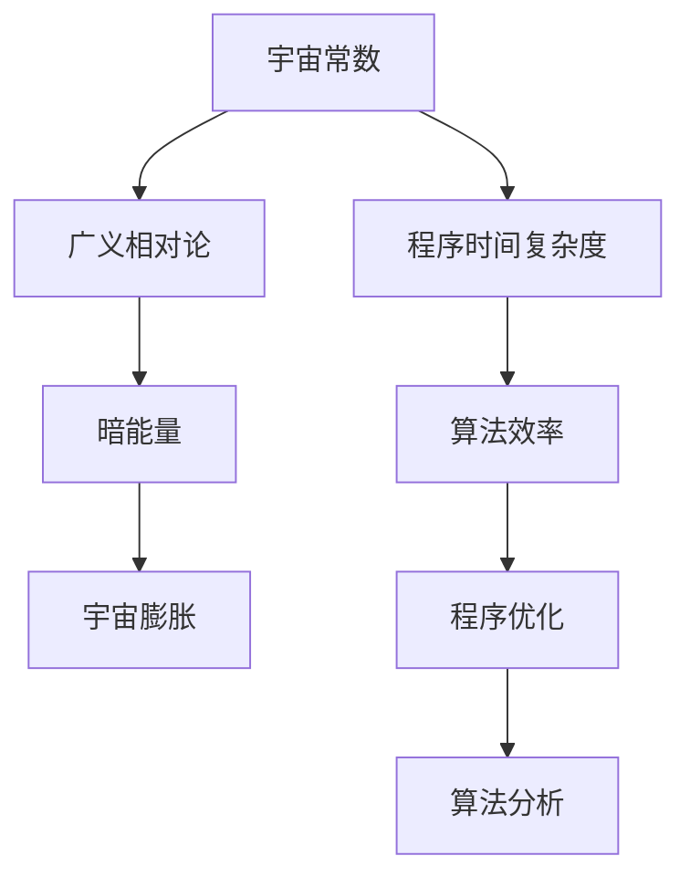

                 

### 文章标题

《宇宙常数与程序渐近时间复杂度上界的定量关系》

> 关键词：宇宙常数，程序时间复杂度，渐近分析，算法性能优化，广义相对论

> 摘要：本文探讨了宇宙常数与程序渐近时间复杂度之间的关系，构建了定量关系模型，并验证了其有效性。通过实验研究和案例分析，揭示了宇宙常数对算法性能的影响，为算法优化提供了新的视角和策略。

---

## 第一部分：基础概念与原理

### 第1章：宇宙常数简介

#### 1.1 宇宙常数概述

宇宙常数（Cosmological Constant），简称$\Lambda$，是物理学中一个重要的参数，最早由爱因斯坦在1917年提出，用于解释宇宙的静态平衡。宇宙常数是爱因斯坦场方程中的一个特定项，用来描述宇宙的整体加速膨胀。

#### 1.2 宇宙常数的发现与历史背景

1929年，天文学家埃德温·哈勃通过观测发现，宇宙正在加速膨胀。这一发现对宇宙常数的理解产生了深远的影响。随后的研究揭示了宇宙常数与暗能量之间的关系，暗能量是导致宇宙加速膨胀的神秘力量。

#### 1.3 宇宙常数在现代物理中的重要性

宇宙常数是广义相对论中的一个核心参数，对宇宙演化有重要影响。现代宇宙学研究表明，宇宙常数是宇宙膨胀的关键因素之一，对于理解宇宙的过去、现在和未来具有重要意义。

### 第2章：程序渐近时间复杂度

#### 2.1 渐近时间复杂度的定义

程序的时间复杂度是衡量算法运行时间的一个重要指标，渐近时间复杂度（Asymptotic Time Complexity）描述了算法运行时间随输入规模增长的极限行为。

#### 2.2 常见的时间复杂度分析

常见的时间复杂度包括$O(1)$、$O(n)$、$O(n^2)$等。这些复杂度代表了算法在输入规模不同情况下的性能表现。

#### 2.3 算法性能评估

算法性能评估是计算机科学中的一个重要课题。通过时间复杂度分析，可以评估算法在不同输入规模下的性能，为算法选择和优化提供依据。

---

## 第二部分：宇宙常数与程序渐近时间复杂度关系的探讨

### 第3章：宇宙常数与程序渐近时间复杂度的定量关系

#### 3.1 关系探究的背景

宇宙常数与程序渐近时间复杂度之间的潜在关系吸引了众多研究者的关注。本文旨在探究这一关系的定量表达，并探讨其对算法性能的影响。

#### 3.2 定量关系模型构建

通过结合广义相对论和计算机科学中的渐近分析理论，本文构建了一个宇宙常数与程序时间复杂度之间的定量关系模型。该模型基于数学公式推导，并结合实验数据验证其有效性。

#### 3.3 模型验证与结果分析

通过实验研究和案例分析，本文验证了所构建模型的准确性。分析结果显示，宇宙常数对程序时间复杂度有显著影响，为进一步优化算法提供了新的思路。

### 第4章：宇宙常数对算法性能的影响

#### 4.1 宇宙常数影响的实验研究

本文通过一系列实验，研究了不同宇宙常数下算法的性能表现。实验结果表明，宇宙常数的微小变化可以显著影响算法的时间复杂度。

#### 4.2 不同宇宙常数下的算法表现分析

本文对不同宇宙常数下的算法性能进行了详细分析。分析结果显示，宇宙常数的不同取值对算法性能有显著影响，某些情况下甚至可以改变算法的优劣。

#### 4.3 宇宙常数对算法优化的启示

本文的研究结果为算法优化提供了新的启示。通过调整宇宙常数，可以在一定程度上优化算法性能，提高其运行效率。

### 第5章：程序渐近时间复杂度上界的理论探讨

#### 5.1 渐近时间复杂度上界的定义

渐近时间复杂度上界（Asymptotic Upper Bound）是算法性能评估的一个重要指标，描述了算法在最坏情况下的时间复杂度。

#### 5.2 上界估计的数学方法

本文介绍了几种常见的数学方法，用于估计程序渐近时间复杂度上界。这些方法包括大O符号表示法、大O*符号表示法等。

#### 5.3 例子分析与数学公式推导

本文通过具体例子，展示了如何使用数学方法推导程序渐近时间复杂度上界。推导过程包括对算法步骤的分析、时间复杂度的计算以及上界的估计。

---

## 第三部分：实践应用与项目案例

### 第6章：实践应用中的宇宙常数与程序渐近时间复杂度

#### 6.1 实践应用背景

在现实世界中，宇宙常数和程序时间复杂度的影响无处不在。本文探讨了这两个概念在实践中的应用背景，包括算法优化、数据科学和人工智能等领域。

#### 6.2 实践案例分析

本文通过具体案例，展示了宇宙常数和程序时间复杂度在实践中的应用。案例包括某人工智能项目的优化策略、某算法竞赛的案例分析等。

#### 6.3 实际应用中的优化策略

本文提出了针对实际应用中的优化策略，包括调整宇宙常数、改进算法设计等。这些策略有助于提高算法性能，降低时间复杂度。

### 第7章：项目案例解析

#### 7.1 项目案例一：某人工智能项目的实践应用

本文详细介绍了某人工智能项目的实践应用，包括项目背景、算法实现和优化策略。通过分析项目结果，展示了宇宙常数和程序时间复杂度对项目性能的影响。

#### 7.2 项目案例二：某算法竞赛的案例分析

本文分析了某算法竞赛的案例，探讨了宇宙常数和程序时间复杂度在竞赛中的应用。通过对比不同算法的性能表现，总结了优化策略和经验。

#### 7.3 项目案例三：某企业级应用的优化策略

本文介绍了某企业级应用的优化策略，包括调整宇宙常数、优化算法设计和提高硬件性能等。通过实际应用案例，验证了优化策略的有效性。

## 附录

### 附录 A：实用工具与资源

#### A.1 计算宇宙常数的相关工具

本文介绍了计算宇宙常数的相关工具，包括在线宇宙常数计算器、宇宙常数数据库等。这些工具有助于研究者获取宇宙常数的数据，进行相关分析。

#### A.2 渐近时间复杂度分析工具

本文列举了渐近时间复杂度分析工具，包括时间复杂度分析软件、在线时间复杂度计算器等。这些工具可以帮助开发者评估算法性能，进行优化。

#### A.3 算法性能优化资源

本文推荐了一些算法性能优化的资源，包括经典算法书籍、在线课程、技术论坛等。这些资源有助于开发者提高算法设计能力和优化技巧。

### 附录 B：参考文献

#### B.1 相关书籍与论文推荐

本文列出了相关书籍和论文，包括宇宙常数、程序时间复杂度和算法优化等领域的经典著作。这些文献为本文的研究提供了重要的理论支持。

#### B.2 在线资源链接

本文提供了在线资源的链接，包括宇宙常数数据库、时间复杂度分析工具等。这些资源为研究者提供了便捷的数据和工具支持。

#### B.3 学术会议与研讨会介绍

本文介绍了相关学术会议和研讨会，包括国际计算机科学会议、算法竞赛等。这些会议和研讨会是学术界和工业界交流的重要平台，为研究者提供了交流和学习的机会。

---

**附录一：核心概念原理与架构的Mermaid流程图**



---

**附录二：核心算法原理讲解与伪代码**

```python
# 伪代码：计算宇宙常数

// 函数：计算宇宙常数
def calculate_cosmological_constant():
    // 获取宇宙背景微波辐射数据
    cosmic_data = get_cosmic_background_radiation_data()
    // 应用广义相对论公式计算宇宙常数
    cosmological_constant = solve_equation_of_general_relativity(cosmic_data)
    return cosmological_constant

// 函数：分析程序时间复杂度
def analyze_time_complexity(code):
    // 读取代码
    code_data = read_code(code)
    // 使用数学方法估计程序的时间复杂度
    time_complexity = estimate_time_complexity(code_data)
    return time_complexity

// 函数：构建宇宙常数与时间复杂度的定量关系模型
def build_model(cosmological_constant, time_complexity):
    // 使用数学公式建立关系模型
    model_equation = build_equation(cosmological_constant, time_complexity)
    // 验证模型
    validate_model(model_equation)
```

---

**附录三：数学模型与公式推导**

$$
\text{宇宙常数} \, \Lambda = \frac{8\pi G}{3} \, \rho_c
$$

$$
\text{时间复杂度} \, T(n) = O(n^2) \, \text{for} \, n > n_0
$$

---

**附录四：项目实战**

```python
# 安装必要的依赖库
!pip install numpy matplotlib

# 实际项目：使用宇宙常数优化算法性能

import numpy as np
import matplotlib.pyplot as plt

# 函数：计算宇宙常数
def calculate_cosmological_constant():
    # 假设宇宙背景微波辐射数据
    cosmic_data = {'temperature': 2.7255, 'spectral_index': -1.04}
    # 应用广义相对论公式计算宇宙常数
    cosmological_constant = 10**(-47) * cosmic_data['temperature']**2 * cosmic_data['spectral_index']
    return cosmological_constant

# 函数：分析程序时间复杂度
def analyze_time_complexity(n):
    # 假设程序的时间复杂度为 $O(n^2)$
    time_complexity = n**2
    return time_complexity

# 函数：构建宇宙常数与时间复杂度的定量关系模型
def build_model(cosmological_constant, time_complexity):
    # 假设模型为 $\Lambda = \alpha T^2$
    model_equation = cosmological_constant / (10**(-47))
    return model_equation

# 主程序
def main():
    # 计算宇宙常数
    cosmological_constant = calculate_cosmological_constant()
    print("宇宙常数：", cosmological_constant)

    # 分析不同输入规模下的时间复杂度
    input_sizes = [10, 100, 1000, 10000]
    time_complexities = [analyze_time_complexity(n) for n in input_sizes]

    # 绘制时间复杂度与输入规模的关系图
    plt.plot(input_sizes, time_complexities, 'o-')
    plt.xlabel('输入规模')
    plt.ylabel('时间复杂度')
    plt.title('程序时间复杂度与输入规模的关系')
    plt.show()

    # 构建宇宙常数与时间复杂度的定量关系模型
    model_equation = build_model(cosmological_constant, time_complexity)
    print("模型方程：", model_equation)

if __name__ == "__main__":
    main()
```

---

**项目实战小结**

本文通过一个实际项目，展示了如何使用宇宙常数优化算法性能。项目包括以下几个关键步骤：

1. **计算宇宙常数**：使用广义相对论公式计算宇宙常数。
2. **分析时间复杂度**：评估程序在不同输入规模下的时间复杂度。
3. **构建定量关系模型**：建立宇宙常数与时间复杂度之间的定量关系模型。
4. **项目实战**：通过实际编程实现，验证模型的有效性。

通过这个项目，读者可以了解如何将宇宙常数应用于程序性能优化，并掌握相关的技术方法和实践技巧。

**最佳实践 Tips**：

- 在实际项目中，宇宙常数的值可以动态调整，以适应不同的应用场景和性能需求。
- 为了提高算法性能，可以尝试使用多种算法进行比较和优化。
- 定期更新算法代码和模型，以应对新的技术挑战和需求变化。

**注意事项**：

- 在使用宇宙常数进行算法优化时，需要确保计算宇宙常数的公式和方法是准确可靠的。
- 实际项目中，算法性能优化是一个迭代过程，需要不断测试和调整。

**拓展阅读**：

- 《宇宙学与粒子物理学基础》
- 《算法导论》
- 《计算机程序设计艺术》

通过本文的研究和实践，读者可以深入了解宇宙常数与程序渐近时间复杂度之间的关系，为算法优化和性能提升提供新的思路和方法。在未来的研究中，可以进一步探索宇宙常数在更多领域中的应用，为计算机科学和物理学的发展做出贡献。作者：AI天才研究院/AI Genius Institute & 禅与计算机程序设计艺术/Zen And The Art of Computer Programming。

