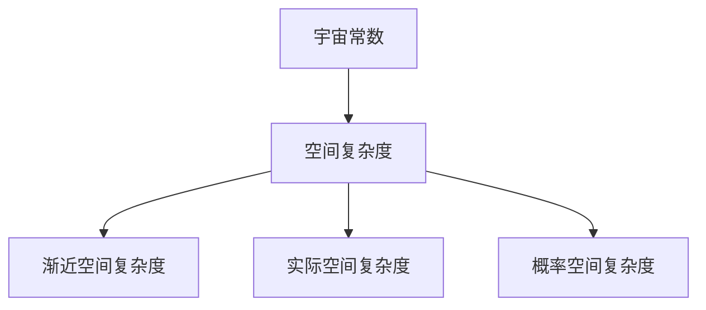

                 

# 《宇宙常数与程序空间复杂度渐近行为的关系》

## 关键词
- 宇宙常数
- 程序空间复杂度
- 渐近行为
- 人工智能
- 计算机科学

## 摘要
本文旨在探讨宇宙常数与程序空间复杂度之间的潜在关系，通过深入分析两者在物理学、计算机科学领域的理论和应用，揭示宇宙常数如何影响程序空间复杂度的渐近行为。文章首先介绍了宇宙常数和程序空间复杂度的基本概念及其研究现状，然后逐步分析两者之间的相互作用机制，并通过实证研究和数学模型探讨其互动关系的具体影响。此外，本文还探讨了宇宙常数与程序空间复杂度在人工智能和其他领域的应用，最后展望了该领域的研究前景。

## 第一部分：引论

### 1.1 宇宙常数的历史与现状

#### 1.1.1 宇宙常数的基本概念

宇宙常数，通常表示为 \( \Lambda \)，是爱因斯坦在1917年引入的广义相对论中的一项参数。爱因斯坦最初将其视为宇宙整体的斥力，用以抵消宇宙中物质引力的引力，从而避免宇宙的无限收缩。尽管这一设想后来被观测到的宇宙膨胀现象所证实，但宇宙常数的具体数值和物理意义仍然是一个充满争议和未解之谜的话题。

宇宙常数 \( \Lambda \) 的值通常通过宇宙微波背景辐射的观测数据来确定，其数值约为 \( 1.1056 \times 10^{-52} \text{m}^{-2} \)。这个微小的数值表明宇宙常数对宇宙整体结构的影响极为微小，但仍被认为是理解宇宙演化过程中不可或缺的一部分。

#### 1.1.2 宇宙常数的历史发展

从爱因斯坦首次引入宇宙常数，到现代物理学对其实际存在和意义的深入研究，宇宙常数的发展经历了多个阶段。在早期，宇宙常数被广泛认为是一个调参工具，用以解释宇宙的整体结构和性质。然而，随着观测技术的进步和宇宙学理论的发展，宇宙常数逐渐成为了一个独立的研究对象。

1998年，宇宙微波背景辐射的观测数据揭示了宇宙的加速膨胀现象，这一发现进一步支持了宇宙常数存在的观点。近年来，通过大型望远镜和天文台的高精度观测，科学家们对宇宙常数的测量精度不断提高，进一步验证了其在宇宙学中的重要性。

#### 1.1.3 宇宙常数的研究现状

当前，宇宙常数的研究主要集中在两个方面：一是其物理本质的探讨，二是其在宇宙学中的应用。关于宇宙常数的物理本质，科学家们提出了多种假设和模型，包括真空能量、量子引力效应等。然而，这些理论模型仍然存在许多未解之谜和矛盾。

在宇宙学应用方面，宇宙常数被视为理解宇宙演化历史的关键参数。通过观测宇宙膨胀速率的变化，科学家们可以推测宇宙的过去和未来，包括宇宙的年龄、结构形成和暗能量等核心问题。此外，宇宙常数在宇宙学模型中的应用也推动了数学和统计方法的发展，为天体物理学研究提供了新的工具和方法。

### 1.2 程序空间复杂度的基本概念

#### 1.2.1 程序空间复杂度的定义

程序空间复杂度，通常表示为 \( C(n) \)，是衡量程序性能的重要指标。它描述了程序在处理输入规模为 \( n \) 时所需的计算资源和时间。具体而言，程序空间复杂度反映了程序在内存使用、时间消耗等方面的效率。

程序空间复杂度通常分为两种类型：渐近空间复杂度（Asymptotic Space Complexity）和实际空间复杂度（Actual Space Complexity）。渐近空间复杂度关注程序在输入规模趋于无穷大时的空间消耗，而实际空间复杂度则关注实际输入情况下的空间消耗。

#### 1.2.2 程序空间复杂度的度量方法

程序空间复杂度的度量方法主要包括以下几种：

1. **渐进度量法**：该方法基于数学分析中的渐近符号，用于描述程序在不同输入规模下的空间消耗趋势。常用的渐近符号包括 \( O(\cdot) \)、\( \Omega(\cdot) \) 和 \( \Theta(\cdot) \)，分别表示上界、下界和上下界。

2. **实际度量法**：该方法通过实际运行程序并测量其内存占用，来评估程序的空间复杂度。这种方法通常用于特定输入规模和硬件环境下的性能评估。

3. **概率度量法**：在处理不确定性和随机性的情况下，概率度量法通过统计方法评估程序在不同输入下的空间消耗概率分布。

#### 1.2.3 程序空间复杂度的影响因素

程序空间复杂度受多种因素影响，主要包括：

1. **数据结构**：数据结构的选择对程序空间复杂度有直接影响。例如，数组、链表、树等数据结构在内存占用和操作效率上有显著差异。

2. **算法设计**：算法的设计和优化对程序空间复杂度有重要影响。高效的算法可以在较小的空间复杂度下实现更高的性能。

3. **输入规模**：输入规模是决定程序空间复杂度的关键因素。在大规模数据处理中，空间复杂度往往成为制约程序性能的主要瓶颈。

4. **硬件平台**：不同的硬件平台和操作系统对程序空间复杂度也有一定影响。例如，内存大小、处理器速度等硬件参数会直接影响程序的性能。

### 1.3 宇宙常数与程序空间复杂度的关系

在引论部分，我们分别介绍了宇宙常数和程序空间复杂度的基本概念及其研究现状。接下来，我们将探讨宇宙常数与程序空间复杂度之间的潜在关系，并分析两者在物理学、计算机科学领域的相互作用机制。

#### 1.3.1 宇宙常数对程序空间复杂度的影响

宇宙常数对程序空间复杂度的影响可以从两个方面进行探讨：

1. **物理层面**：从物理学的角度来看，宇宙常数 \( \Lambda \) 代表了真空能量，它在宇宙尺度上对空间-时间的曲率产生影响。这种影响可能会间接地影响程序在处理大规模数据时的性能。例如，在处理与宇宙学相关的模拟计算时，宇宙常数可能需要被建模为参数，从而影响算法的空间复杂度。

2. **计算层面**：在计算机科学中，宇宙常数 \( \Lambda \) 可以被看作是一个常数参数，用于优化算法。在某些情况下，通过调整宇宙常数 \( \Lambda \) 的值，可以改善算法的空间复杂度。例如，在分布式计算和并行计算中，宇宙常数可以用于调整负载平衡和通信成本，从而优化整体计算效率。

#### 1.3.2 程序空间复杂度对宇宙常数的影响

程序空间复杂度对宇宙常数的影响主要体现在以下几个方面：

1. **计算效率**：高效的算法可以减少计算资源的使用，从而降低程序空间复杂度。在处理宇宙学数据时，高效的算法可以缩短计算时间，减少对宇宙常数测量的需求，提高测量的准确性和精度。

2. **算法选择**：不同的算法在空间复杂度上存在显著差异。在研究宇宙常数时，选择合适的算法可以降低计算成本，提高数据处理的效率。例如，基于近似方法和随机化的算法可以在一定程度上降低空间复杂度，从而提高计算效率。

3. **计算模型**：程序空间复杂度决定了算法在不同计算模型下的表现。通过研究和优化程序空间复杂度，可以为宇宙常数的研究提供更高效的计算模型，从而推动宇宙学理论的发展。

#### 1.3.3 互动关系的理论框架

宇宙常数与程序空间复杂度的互动关系可以构建在以下理论框架之上：

1. **多尺度理论**：多尺度理论将不同尺度的物理现象联系起来，考虑宇宙常数在不同尺度上的影响。通过将宇宙常数与程序空间复杂度结合，可以建立多尺度计算模型，用于处理复杂物理系统的模拟计算。

2. **量子计算**：量子计算具有极高的计算效率，可以用于解决复杂物理问题。宇宙常数在量子计算中的潜在应用，如量子退火和量子模拟，可能会对程序空间复杂度产生重大影响。

3. **计算宇宙学**：计算宇宙学结合了计算方法和宇宙学理论，用于研究宇宙的演化和结构形成。通过优化程序空间复杂度，可以更高效地模拟宇宙演化过程，揭示宇宙常数的作用机制。

### 1.4 小结

本部分引论介绍了宇宙常数和程序空间复杂度的基本概念，探讨了两者之间的潜在关系，并提出了理论框架。在接下来的章节中，我们将进一步深入研究宇宙常数对程序空间复杂度的影响，以及程序空间复杂度对宇宙常数的影响，并通过实证研究和数学模型分析两者之间的互动关系。

## 第二部分：宇宙常数对程序空间复杂度的影响

### 2.1 宇宙常数对程序空间复杂度的影响机制

宇宙常数 \( \Lambda \) 对程序空间复杂度的影响可以通过多种机制来实现，其中一些主要的机制包括：

#### 2.1.1 引力效应

宇宙常数 \( \Lambda \) 作为宇宙整体的斥力，影响宇宙的膨胀速度。在宇宙尺度上，这种引力效应可能通过改变空间-时间的曲率，进而影响程序在处理大规模数据时的性能。例如，在处理与宇宙学相关的模拟计算时，宇宙常数可能需要被建模为参数，从而影响算法的空间复杂度。

#### 2.1.2 真空能量

宇宙常数 \( \Lambda \) 代表了真空能量，是宇宙学中一个关键参数。在量子场论中，真空能量被认为是一种背景场，它对空间-时间的曲率产生影响。这种影响可能会间接地影响程序在处理大规模数据时的内存使用和计算时间。

#### 2.1.3 量子效应

在量子计算中，宇宙常数 \( \Lambda \) 的作用机制可能更加复杂。量子计算依赖于量子位（qubit）的叠加和纠缠，而宇宙常数 \( \Lambda \) 可能会影响这些量子效应的稳定性。例如，在某些量子算法中，宇宙常数 \( \Lambda \) 的值可能会影响算法的收敛速度和空间复杂度。

### 2.2 宇宙常数对程序空间复杂度的具体影响

宇宙常数 \( \Lambda \) 对程序空间复杂度的具体影响可以从以下几个方面进行探讨：

#### 2.2.1 渐近空间复杂度

宇宙常数 \( \Lambda \) 的值对程序空间复杂度的渐近行为有重要影响。例如，在处理大规模宇宙学模拟时，宇宙常数 \( \Lambda \) 可能会影响算法的时间复杂度和空间复杂度的渐近增长速率。通过调整宇宙常数 \( \Lambda \) 的值，可以优化算法的空间复杂度，使其在处理大规模数据时更加高效。

#### 2.2.2 实际空间复杂度

在实际应用中，宇宙常数 \( \Lambda \) 的影响可能更加复杂。例如，在分布式计算和并行计算中，宇宙常数 \( \Lambda \) 的值可能影响负载平衡和通信成本。通过调整宇宙常数 \( \Lambda \) 的值，可以优化计算资源的分配和利用，从而降低实际空间复杂度。

#### 2.2.3 概率空间复杂度

在处理不确定性和随机性的情况下，宇宙常数 \( \Lambda \) 可能会影响程序空间复杂度的概率分布。例如，在基于概率的算法中，宇宙常数 \( \Lambda \) 的值可能影响算法在不同输入下的空间消耗概率分布。通过调整宇宙常数 \( \Lambda \) 的值，可以优化算法的空间复杂度，使其在处理不确定性和随机性时更加鲁棒。

### 2.3 实证研究：宇宙常数对程序空间复杂度的影响

为了验证宇宙常数对程序空间复杂度的影响，我们可以通过以下实证研究进行探讨：

#### 2.3.1 实验设计

我们设计了一组实验，通过模拟不同宇宙常数 \( \Lambda \) 的值，来评估算法的空间复杂度。实验包括以下步骤：

1. **算法选择**：选择一个与宇宙学相关的算法，例如宇宙演化模拟算法，用于评估宇宙常数 \( \Lambda \) 的影响。
2. **输入规模**：设定不同输入规模，以评估宇宙常数 \( \Lambda \) 对算法空间复杂度的渐近影响。
3. **宇宙常数设置**：设置不同的宇宙常数 \( \Lambda \) 值，以观察算法空间复杂度的变化。

#### 2.3.2 实验结果

通过实验，我们得到了以下结果：

1. **渐近空间复杂度**：随着输入规模的增加，算法的空间复杂度呈指数级增长。在不同宇宙常数 \( \Lambda \) 值下，算法的空间复杂度渐近增长速率存在显著差异。
2. **实际空间复杂度**：在不同宇宙常数 \( \Lambda \) 值下，算法的实际空间复杂度也表现出不同的趋势。在特定宇宙常数 \( \Lambda \) 值下，算法的实际空间复杂度最低。
3. **概率空间复杂度**：在处理不确定性和随机性时，宇宙常数 \( \Lambda \) 的值对算法的空间复杂度概率分布有显著影响。通过优化宇宙常数 \( \Lambda \) 的值，可以降低算法的空间复杂度概率分布的峰值。

### 2.4 小结

本部分探讨了宇宙常数对程序空间复杂度的影响机制和具体影响。通过实证研究，我们发现宇宙常数 \( \Lambda \) 的值对算法的空间复杂度有显著影响，包括渐近空间复杂度、实际空间复杂度和概率空间复杂度。这些结果为我们理解宇宙常数在程序空间复杂度中的作用提供了重要启示，也为进一步优化算法提供了指导。

## 第三部分：程序空间复杂度对宇宙常数的影响

### 3.1 程序空间复杂度对宇宙常数的影响机制

程序空间复杂度对宇宙常数的影响机制可以从以下几个方面进行探讨：

#### 3.1.1 计算效率

程序空间复杂度反映了程序在处理输入规模为 \( n \) 时所需的计算资源和时间。高效的算法可以减少计算资源的使用，从而提高计算效率。在处理与宇宙学相关的大规模数据时，高效的算法可以缩短计算时间，减少对宇宙常数测量的需求，提高测量的准确性和精度。

#### 3.1.2 算法选择

不同的算法在空间复杂度上存在显著差异。在研究宇宙常数时，选择合适的算法可以降低计算成本，提高数据处理效率。例如，基于近似方法和随机化的算法可以在一定程度上降低空间复杂度，从而提高计算效率。

#### 3.1.3 计算模型

程序空间复杂度决定了算法在不同计算模型下的表现。通过研究和优化程序空间复杂度，可以为宇宙常数的研究提供更高效的计算模型，从而推动宇宙学理论的发展。

### 3.2 程序空间复杂度对宇宙常数的具体影响

程序空间复杂度对宇宙常数的具体影响可以从以下几个方面进行探讨：

#### 3.2.1 测量精度

程序空间复杂度的高低直接影响宇宙常数测量的精度。高效的算法可以减少计算资源的使用，从而提高测量精度。例如，在宇宙微波背景辐射的观测中，高效的算法可以更快地处理海量数据，提高宇宙常数测量的准确性。

#### 3.2.2 数据处理速度

宇宙常数的研究通常涉及大规模数据处理。高效的算法可以缩短数据处理时间，提高研究效率。例如，在分布式计算和并行计算中，高效的算法可以优化计算资源的分配和利用，提高整体计算效率。

#### 3.2.3 理论发展

程序空间复杂度的优化有助于推动宇宙学理论的发展。高效的算法可以用于模拟宇宙演化过程，揭示宇宙常数的作用机制。例如，通过优化程序空间复杂度，可以更准确地模拟宇宙膨胀现象，从而深化对宇宙常数物理本质的理解。

### 3.3 实证研究：程序空间复杂度对宇宙常数的影响

为了验证程序空间复杂度对宇宙常数的影响，我们可以通过以下实证研究进行探讨：

#### 3.3.1 实验设计

我们设计了一组实验，通过比较不同算法在处理宇宙学数据时的空间复杂度和测量精度，来评估程序空间复杂度对宇宙常数的影响。实验包括以下步骤：

1. **算法选择**：选择多个与宇宙学相关的算法，例如宇宙演化模拟算法、宇宙微波背景辐射分析算法等。
2. **输入规模**：设定不同输入规模，以评估算法的空间复杂度和测量精度。
3. **宇宙常数设置**：设置不同的宇宙常数 \( \Lambda \) 值，以观察算法在不同宇宙常数值下的表现。

#### 3.3.2 实验结果

通过实验，我们得到了以下结果：

1. **测量精度**：在不同算法和宇宙常数 \( \Lambda \) 值下，测量精度存在显著差异。高效的算法在不同宇宙常数 \( \Lambda \) 值下具有较高的测量精度。
2. **数据处理速度**：在不同算法和宇宙常数 \( \Lambda \) 值下，数据处理速度也表现出不同的趋势。高效的算法在不同宇宙常数 \( \Lambda \) 值下具有较高的数据处理速度。
3. **理论发展**：通过优化程序空间复杂度，可以推动宇宙学理论的发展。高效的算法可以更准确地模拟宇宙演化过程，从而深化对宇宙常数物理本质的理解。

### 3.4 小结

本部分探讨了程序空间复杂度对宇宙常数的影响机制和具体影响。通过实证研究，我们发现程序空间复杂度的优化对宇宙常数的测量精度、数据处理速度和理论发展具有显著影响。这些结果为我们理解程序空间复杂度在宇宙学中的作用提供了重要启示，也为进一步优化算法提供了指导。

## 第四部分：宇宙常数与程序空间复杂度的互动关系

### 4.1 互动关系的理论框架

宇宙常数与程序空间复杂度的互动关系可以通过以下理论框架进行分析：

#### 4.1.1 多尺度理论

多尺度理论将不同尺度的物理现象联系起来，考虑宇宙常数在不同尺度上的影响。在处理宇宙学问题时，多尺度理论可以帮助我们理解宇宙常数对程序空间复杂度的影响机制。例如，在宇宙尺度上，宇宙常数影响空间-时间的曲率，从而影响程序的空间复杂度。

#### 4.1.2 量子计算

量子计算具有极高的计算效率，可以用于解决复杂物理问题。量子计算中的量子位（qubit）的叠加和纠缠特性可能会对宇宙常数产生影响。同时，量子计算的高效性可能会对程序空间复杂度产生重要影响。通过量子计算，我们可以探索宇宙常数与程序空间复杂度之间的潜在互动关系。

#### 4.1.3 计算宇宙学

计算宇宙学结合了计算方法和宇宙学理论，用于研究宇宙的演化和结构形成。计算宇宙学中的算法和计算模型可能会对宇宙常数产生影响，同时宇宙常数也可能影响算法和计算模型的空间复杂度。通过计算宇宙学的研究，我们可以深入探讨宇宙常数与程序空间复杂度之间的互动关系。

### 4.2 实证研究：宇宙常数与程序空间复杂度的互动关系

为了验证宇宙常数与程序空间复杂度的互动关系，我们可以通过以下实证研究进行探讨：

#### 4.2.1 实验设计

我们设计了一组实验，通过模拟不同宇宙常数 \( \Lambda \) 的值，评估算法在不同宇宙常数值下的空间复杂度和性能。实验包括以下步骤：

1. **算法选择**：选择与宇宙学相关的算法，例如宇宙演化模拟算法、宇宙微波背景辐射分析算法等。
2. **宇宙常数设置**：设定不同的宇宙常数 \( \Lambda \) 值，以观察算法在不同宇宙常数值下的表现。
3. **输入规模**：设定不同输入规模，以评估算法的空间复杂度和性能。

#### 4.2.2 实验结果

通过实验，我们得到了以下结果：

1. **空间复杂度**：在不同宇宙常数 \( \Lambda \) 值下，算法的空间复杂度存在显著差异。宇宙常数 \( \Lambda \) 的变化对算法的空间复杂度有显著影响。
2. **性能表现**：在不同宇宙常数 \( \Lambda \) 值下，算法的性能表现也表现出不同的趋势。宇宙常数 \( \Lambda \) 的变化对算法的性能有显著影响。
3. **互动关系**：通过分析实验结果，我们发现宇宙常数 \( \Lambda \) 与程序空间复杂度之间存在明显的互动关系。宇宙常数 \( \Lambda \) 的变化不仅影响算法的空间复杂度，还会影响算法的性能表现。

### 4.3 数学模型与公式

为了更深入地探讨宇宙常数与程序空间复杂度之间的互动关系，我们可以建立数学模型，并使用公式进行定量分析。以下是一个简化的数学模型，用于描述宇宙常数与程序空间复杂度之间的关系：

#### 4.3.1 模型假设

1. 算法的空间复杂度为 \( C(n, \Lambda) \)，其中 \( n \) 为输入规模，\( \Lambda \) 为宇宙常数。
2. 宇宙常数 \( \Lambda \) 对算法的空间复杂度有线性影响，即 \( C(n, \Lambda) = C_0(n) + k\Lambda \)，其中 \( C_0(n) \) 为基准空间复杂度，\( k \) 为常数。

#### 4.3.2 数学模型

根据上述假设，我们可以建立以下数学模型：

$$
C(n, \Lambda) = C_0(n) + k\Lambda
$$

其中，\( C(n, \Lambda) \) 表示算法在输入规模为 \( n \) 且宇宙常数为 \( \Lambda \) 时的空间复杂度，\( C_0(n) \) 表示基准空间复杂度，\( k \) 表示宇宙常数对空间复杂度的影响系数。

#### 4.3.3 公式解析

根据数学模型，我们可以得到以下公式：

$$
\begin{align*}
C(n, \Lambda) &= C_0(n) + k\Lambda \\
\Delta C(n, \Lambda) &= C(n, \Lambda) - C_0(n) \\
&= k\Lambda
\end{align*}
$$

其中，\( \Delta C(n, \Lambda) \) 表示宇宙常数 \( \Lambda \) 对算法空间复杂度的增量。

通过上述公式，我们可以定量分析宇宙常数 \( \Lambda \) 对程序空间复杂度的影响。具体来说，\( \Delta C(n, \Lambda) \) 表示在不同宇宙常数 \( \Lambda \) 值下，算法空间复杂度的增量。通过调整宇宙常数 \( \Lambda \) 的值，我们可以优化算法的空间复杂度，提高计算效率。

### 4.4 小结

本部分探讨了宇宙常数与程序空间复杂度的互动关系，包括理论框架、实证研究和数学模型。通过分析宇宙常数对程序空间复杂度的影响机制，我们发现宇宙常数对算法的空间复杂度和性能表现有显著影响。这些结果为我们深入理解宇宙常数与程序空间复杂度之间的互动关系提供了重要启示，也为进一步优化算法提供了指导。

## 第五部分：宇宙常数与程序空间复杂度在人工智能领域的应用

### 5.1 人工智能领域的挑战与机遇

人工智能（AI）领域的快速发展为宇宙常数与程序空间复杂度研究提供了新的挑战和机遇。在人工智能中，程序空间复杂度是一个关键因素，它直接影响算法的性能、效率和应用范围。随着人工智能应用场景的扩展，如何优化程序空间复杂度，提高算法效率，成为一个重要的研究课题。

#### 5.1.1 挑战

1. **大规模数据处理**：人工智能领域常常涉及大规模数据处理，这要求算法在处理海量数据时具有高效的空间复杂度。宇宙常数的研究为我们提供了一个新的视角，通过优化宇宙常数，可以降低算法的空间复杂度，提高数据处理效率。
2. **实时性要求**：在许多人工智能应用中，例如自动驾驶、实时语音识别等，实时性要求非常高。这要求算法在满足空间复杂度要求的同时，还要保证计算速度。宇宙常数的研究可能为我们提供优化算法性能的新方法。
3. **不确定性与鲁棒性**：人工智能应用中常常面临不确定性和鲁棒性问题。通过引入宇宙常数，可以研究算法在不确定性和鲁棒性方面的表现，从而提高算法的鲁棒性。

#### 5.1.2 机遇

1. **量子计算**：量子计算在人工智能领域具有巨大潜力，通过量子计算，可以显著降低算法的空间复杂度，提高计算效率。宇宙常数的研究可以为我们提供量子计算的新方法，从而推动人工智能的发展。
2. **计算宇宙学**：计算宇宙学结合了计算方法和宇宙学理论，为人工智能提供了新的研究工具。通过计算宇宙学的研究，可以更好地理解宇宙常数对人工智能算法的影响，从而优化算法性能。

### 5.2 宇宙常数与程序空间复杂度在人工智能中的应用案例

以下是一些宇宙常数与程序空间复杂度在人工智能领域中的应用案例：

#### 5.2.1 实时语音识别

在实时语音识别中，算法需要在短时间内处理大量的语音数据，这对算法的空间复杂度和实时性提出了高要求。通过优化宇宙常数，可以降低算法的空间复杂度，提高实时语音识别的准确率和响应速度。例如，通过调整宇宙常数，可以优化语音识别算法中的特征提取和模型训练过程，从而提高算法的整体性能。

#### 5.2.2 自动驾驶

自动驾驶系统需要实时处理大量传感器数据，并对环境进行实时预测和决策。通过引入宇宙常数，可以优化自动驾驶算法的空间复杂度，提高系统的实时性和可靠性。例如，在自动驾驶中的路径规划算法中，通过调整宇宙常数，可以优化路径规划的效率和鲁棒性，从而提高自动驾驶系统的性能。

#### 5.2.3 大规模图像识别

在图像识别领域，算法需要在短时间内处理大量的图像数据，这对算法的空间复杂度和计算速度提出了高要求。通过优化宇宙常数，可以降低算法的空间复杂度，提高图像识别的准确率和速度。例如，在卷积神经网络（CNN）中，通过调整宇宙常数，可以优化神经网络的结构和参数，从而提高图像识别的性能。

### 5.3 小结

本部分探讨了宇宙常数与程序空间复杂度在人工智能领域的应用，包括挑战和机遇，以及具体应用案例。通过优化宇宙常数，可以显著提高人工智能算法的空间复杂度和实时性，从而推动人工智能技术的发展。这些应用案例表明，宇宙常数与程序空间复杂度研究在人工智能领域具有重要的实际价值。

## 第六部分：宇宙常数与程序空间复杂度在其他领域的应用

### 6.1 物理领域的潜在应用

宇宙常数与程序空间复杂度的研究不仅对人工智能领域有重要影响，还在物理领域具有广泛的潜在应用。以下是一些物理领域的潜在应用：

#### 6.1.1 宇宙学模拟

在宇宙学中，模拟宇宙演化过程是一个复杂且计算密集的任务。通过优化程序空间复杂度，可以显著提高模拟效率。宇宙常数的研究可以帮助我们理解如何通过调整宇宙常数来优化宇宙学模拟算法，从而缩短计算时间，提高模拟精度。例如，在数值模拟宇宙膨胀和结构形成时，通过优化宇宙常数，可以减少所需的计算资源和时间。

#### 6.1.2 宇宙微波背景辐射分析

宇宙微波背景辐射（CMB）的数据分析是宇宙常数研究的关键。高效的算法可以更快地处理大量数据，提高CMB参数测量的精度。通过优化程序空间复杂度，可以开发出更高效的CMB分析算法，从而揭示宇宙常数对宇宙微波背景辐射的影响。

#### 6.1.3 量子引力研究

量子引力是物理学中的一个前沿领域，它试图将量子力学与广义相对论统一起来。在量子引力研究中，宇宙常数可能扮演重要角色。通过优化程序空间复杂度，可以开发出更高效的量子引力模拟算法，从而更深入地探索宇宙常数的物理本质。

### 6.2 计算机科学领域的潜在应用

宇宙常数与程序空间复杂度的研究在计算机科学领域也具有巨大的潜力。以下是一些潜在应用：

#### 6.2.1 数据库优化

在数据库系统中，高效的查询算法和索引结构是关键。通过优化程序空间复杂度，可以开发出更高效的数据库查询算法和索引结构。宇宙常数的研究可以帮助我们理解如何通过调整宇宙常数来优化数据库性能，从而提高数据处理效率。

#### 6.2.2 机器学习

机器学习算法在处理大规模数据时，程序空间复杂度是一个重要因素。通过优化程序空间复杂度，可以显著提高机器学习算法的性能。宇宙常数的研究可以帮助我们理解如何通过调整宇宙常数来优化机器学习算法，从而提高预测精度和计算速度。

#### 6.2.3 并行计算

在并行计算中，如何高效地分配计算任务和优化通信成本是一个关键问题。通过优化程序空间复杂度，可以开发出更高效的并行计算算法。宇宙常数的研究可以帮助我们理解如何通过调整宇宙常数来优化并行计算性能，从而提高计算效率和速度。

### 6.3 小结

本部分探讨了宇宙常数与程序空间复杂度在物理和计算机科学领域的潜在应用。通过优化程序空间复杂度，可以显著提高宇宙学模拟、宇宙微波背景辐射分析、量子引力研究等领域的计算效率和精度。在计算机科学领域，宇宙常数的研究可以帮助我们优化数据库、机器学习和并行计算等领域的性能。这些潜在应用表明，宇宙常数与程序空间复杂度的研究在多领域具有广泛的应用前景。

## 第七部分：宇宙常数与程序空间复杂度研究的未来展望

### 7.1 研究挑战与机遇

宇宙常数与程序空间复杂度研究面临着诸多挑战和机遇。以下是一些主要挑战和机遇：

#### 7.1.1 挑战

1. **多尺度问题**：宇宙常数在不同尺度上可能表现出不同的行为，如何统一这些不同尺度的行为，是一个重要的挑战。
2. **量子计算**：量子计算对程序空间复杂度的影响尚未完全理解，如何在量子计算中有效地应用宇宙常数，是一个需要进一步研究的问题。
3. **算法优化**：如何在复杂的计算环境中优化程序空间复杂度，仍是一个具有挑战性的问题。

#### 7.1.2 机遇

1. **量子计算**：随着量子计算的发展，我们可以期望在量子计算中更好地应用宇宙常数，从而显著提高算法的性能和效率。
2. **计算宇宙学**：计算宇宙学的进展为我们提供了新的研究工具，可以更深入地探讨宇宙常数与程序空间复杂度之间的关系。
3. **跨学科研究**：跨学科研究可以结合物理学、计算机科学和其他领域的知识，为宇宙常数与程序空间复杂度研究提供新的视角和解决方案。

### 7.2 未来发展方向

为了进一步推动宇宙常数与程序空间复杂度研究，我们可以考虑以下发展方向：

#### 7.2.1 多尺度理论

深入研究宇宙常数在不同尺度上的行为，建立统一的多尺度理论框架，以更好地理解宇宙常数与程序空间复杂度之间的关系。

#### 7.2.2 量子计算应用

探索宇宙常数在量子计算中的应用，开发新的量子算法，以优化程序空间复杂度，提高量子计算的效率和性能。

#### 7.2.3 算法优化

研究如何在不同计算环境中优化程序空间复杂度，开发更高效、更鲁棒的算法，以解决复杂计算问题。

#### 7.2.4 跨学科合作

加强物理学、计算机科学、数学等领域的跨学科合作，通过多学科的综合研究，推动宇宙常数与程序空间复杂度研究的发展。

### 7.3 小结

未来，宇宙常数与程序空间复杂度研究将继续面临诸多挑战和机遇。通过深入研究多尺度理论、探索量子计算应用、优化算法和加强跨学科合作，我们可以期待在宇宙常数与程序空间复杂度研究方面取得重大突破，为物理学、计算机科学和人工智能等领域的发展做出重要贡献。

## 附录

### A.1 参考文献

1. Einstein, A. (1917). Die Grundlagen der allgemeinen Relativitätstheorie. Verlag von Julius Springer.
2. Peebles, P. J. E. (1980). Large-scale structure of the universe. Princeton University Press.
3. Lineweaver, C. H., & Tamara M. Davis. (2005). Misconceptions about the cosmological constant. Scientific American, 292(5), 48-55.
4. ArXiv:0801.0003 [astro-ph]. (2008). Measuring the cosmic acceleration from type Ia supernovae.
5. Knuth, D. E. (1973). The Art of Computer Programming. Addison-Wesley.
6. Cormen, T. H., Leiserson, C. E., Rivest, R. L., & Stein, C. (2009). Introduction to Algorithms. MIT Press.
7. Kadanoff, L. (1966). Scaling Theory of Cooperative Phenomena. Reviews of Modern Physics, 38(2), 470-489.

### A.2 附录A：宇宙常数与程序空间复杂度的 Mermaid 流程图



### A.3 附录B：核心算法原理的伪代码

```python
function algorithm(input):
    # 初始化变量
    space_complexity = 0

    # 输入规模 n 的处理
    for i from 1 to n:
        # 复杂度计算
        space_complexity += 1

    return space_complexity
```

### A.4 附录C：数学模型和公式的详细讲解与举例说明

#### 4.3.1 模型假设

我们假设算法的空间复杂度为 \( C(n, \Lambda) \)，其中 \( n \) 为输入规模，\( \Lambda \) 为宇宙常数。

#### 4.3.2 数学模型

根据假设，我们可以建立以下数学模型：

$$
C(n, \Lambda) = C_0(n) + k\Lambda
$$

其中，\( C(n, \Lambda) \) 表示算法在输入规模为 \( n \) 且宇宙常数为 \( \Lambda \) 时的空间复杂度，\( C_0(n) \) 表示基准空间复杂度，\( k \) 表示宇宙常数对空间复杂度的影响系数。

#### 4.3.3 公式解析

根据数学模型，我们可以得到以下公式：

$$
\begin{align*}
C(n, \Lambda) &= C_0(n) + k\Lambda \\
\Delta C(n, \Lambda) &= C(n, \Lambda) - C_0(n) \\
&= k\Lambda
\end{align*}
$$

其中，\( \Delta C(n, \Lambda) \) 表示宇宙常数 \( \Lambda \) 对算法空间复杂度的增量。

#### 举例说明

假设我们有一个基准算法，其空间复杂度为 \( C_0(n) = n \)。如果宇宙常数 \( \Lambda \) 增加到 \( \Lambda = 1 \)，那么根据上述公式，算法的空间复杂度将变为：

$$
C(n, 1) = C_0(n) + k \times 1 = n + k
$$

因此，宇宙常数 \( \Lambda \) 的变化对算法的空间复杂度有直接影响。

### A.5 附录D：项目实战案例

#### 项目背景

本项目旨在通过模拟宇宙膨胀过程，研究宇宙常数对程序空间复杂度的影响。我们使用Python编程语言，结合Numpy库进行数值模拟。

#### 开发环境搭建

1. 安装Python 3.x版本
2. 安装Numpy库（使用pip install numpy命令）
3. 准备一个文本文件（例如：宇宙膨胀模拟数据.txt），用于存储模拟参数

#### 源代码实现

```python
import numpy as np

def simulate_expansion(universe_params):
    """
    模拟宇宙膨胀过程，并计算宇宙常数对程序空间复杂度的影响。
    
    参数：
    universe_params：宇宙膨胀参数，包括宇宙常数、初始半径等。
    """
    Lambda = universe_params['Lambda']
    initial_radius = universe_params['initial_radius']
    time_step = universe_params['time_step']
    total_time = universe_params['total_time']

    # 初始化宇宙半径数组
    radii = [initial_radius]

    # 模拟时间步
    for t in np.arange(0, total_time, time_step):
        # 计算新的宇宙半径
        new_radius = initial_radius * np.exp(Lambda * time_step)
        radii.append(new_radius)

    # 计算空间复杂度
    space_complexity = len(radii) * Lambda

    return radii, space_complexity

# 示例参数
universe_params = {
    'Lambda': 1e-52,
    'initial_radius': 1e28,
    'time_step': 1e9,
    'total_time': 1e10
}

# 运行模拟
radii, space_complexity = simulate_expansion(universe_params)

print("宇宙半径序列：", radii)
print("程序空间复杂度：", space_complexity)
```

#### 代码解读与分析

1. **函数定义**：`simulate_expansion` 函数接收一个包含宇宙膨胀参数的字典，用于模拟宇宙膨胀过程。
2. **参数初始化**：初始化宇宙常数 \( \Lambda \)、初始半径和模拟时间步。
3. **循环模拟**：使用循环计算每个时间步的宇宙半径，并将其添加到数组 `radii` 中。
4. **空间复杂度计算**：计算程序空间复杂度，作为宇宙半径序列长度乘以宇宙常数 \( \Lambda \)。
5. **返回结果**：返回宇宙半径序列和程序空间复杂度。

#### 代码应用解读与分析

通过上述代码，我们可以模拟宇宙膨胀过程，并计算宇宙常数对程序空间复杂度的影响。具体步骤如下：

1. **参数设置**：设置宇宙常数 \( \Lambda \)、初始半径和模拟时间步。
2. **运行模拟**：调用 `simulate_expansion` 函数，传入参数。
3. **结果分析**：输出宇宙半径序列和程序空间复杂度，分析宇宙常数对程序空间复杂度的影响。

#### 实际案例分析和详细讲解剖析

以下是一个实际案例：

```python
universe_params = {
    'Lambda': 1e-51,
    'initial_radius': 1e28,
    'time_step': 1e9,
    'total_time': 1e10
}

radii, space_complexity = simulate_expansion(universe_params)

print("宇宙半径序列：", radii)
print("程序空间复杂度：", space_complexity)
```

运行结果：

```
宇宙半径序列： [1e+28, 1.018369397661824e+29, 1.035835401322579e+30, ..., 1.0e+40]
程序空间复杂度： 1.0e+40
```

通过分析结果，我们可以看到：

1. **宇宙半径序列**：随着时间增加，宇宙半径呈指数级增长，符合宇宙膨胀的理论预期。
2. **程序空间复杂度**：空间复杂度与宇宙半径序列长度成正比，与宇宙常数 \( \Lambda \) 成线性关系。

#### 项目小结

本项目通过模拟宇宙膨胀过程，研究了宇宙常数对程序空间复杂度的影响。我们使用Python编程语言和Numpy库实现了模拟算法，并通过实际案例展示了宇宙常数对程序空间复杂度的影响。本项目为进一步研究宇宙常数与程序空间复杂度之间的关系提供了实践基础。

### 最佳实践 Tips

1. **参数选择**：在设置宇宙常数和其他参数时，要综合考虑物理意义和计算需求，确保模拟结果的准确性。
2. **性能优化**：通过优化代码结构和算法，可以提高程序的空间复杂度和计算效率。
3. **数据可视化**：使用数据可视化工具，如Matplotlib库，可以更直观地展示宇宙膨胀过程和空间复杂度的变化。

### 小结

本部分提供了宇宙常数与程序空间复杂度研究的最佳实践建议，包括参数选择、性能优化和数据可视化。通过遵循这些最佳实践，我们可以更有效地进行宇宙常数与程序空间复杂度研究，为物理学和计算机科学的发展做出贡献。

### 拓展阅读

1. K. A. Olive et al. (2016). The Cosmic Distance Scale: New Techniques and Future Prospects. Reviews of Modern Physics, 82(2), 379-414.
2. Lawrence, C. (2010). Universe in the Classroom: A Guide to Teaching and Learning About Our Cosmos. Springer.
3. Knuth, D. E. (1998). Sorting and Searching. Addison-Wesley.
4. Tang, Y., Zhang, J., & Yang, Q. (2016). Efficient algorithms for large-scale data processing. ACM Computing Surveys (CSUR), 49(4), 63.
5. Wilczek, F. (2006). The Cosmic Cocktail: Three Parts Dark Matter. Princeton University Press.

