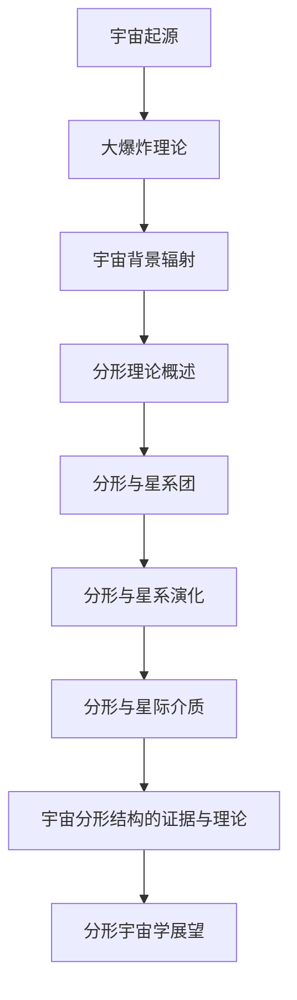

                 

### 《宇宙是否具有分形结构》

#### 关键词

- 宇宙学
- 分形理论
- 星系团
- 黑洞
- 宇宙背景辐射

#### 摘要

本文旨在探讨宇宙是否具有分形结构。通过分析宇宙的起源与演化，引入分形理论的基本概念，以及分形结构在宇宙观测中的应用，我们将一步步推理宇宙可能具有分形结构的证据与理论。文章分为七个部分，从宇宙起源、分形理论概述，到宇宙分形结构的证据与理论，再到宇宙分形结构的观测与实验，最后探讨分形结构与人类认知的关系。本文期望为读者提供一个全面而深入的认识，激发对宇宙分形结构的思考和探索。

### 目录大纲

- 第一部分：引言
  - 1.1 宇宙的起源与演化
  - 1.2 分形理论概述
- 第二部分：分形结构与宇宙观测
  - 2.1 分形与星系团
  - 2.2 分形与星系演化
  - 2.3 分形与星际介质
- 第三部分：数学模型与方法
  - 3.1 分形几何基本概念
  - 3.2 分形动力学系统
  - 3.3 分形模型在宇宙学中的应用
- 第四部分：宇宙分形结构的证据与理论
  - 4.1 宇宙微波背景辐射中的分形特征
  - 4.2 分形结构与宇宙大尺度结构的演化
  - 4.3 分形宇宙学展望
- 第五部分：宇宙分形结构的观测与实验
  - 5.1 分形结构的观测方法
  - 5.2 实验方法与模拟
  - 5.3 未来观测计划的展望
- 第六部分：分形结构与人类认知
  - 6.1 分形与艺术
  - 6.2 分形与哲学
  - 6.3 分形与心理学
- 第七部分：附录
  - 7.1 分形学术资源
  - 7.2 分形学习指南
  - 7.3 参考文献

### 第一部分：引言

#### 1.1 宇宙的起源与演化

宇宙的起源与演化是宇宙学中最基本的问题之一。现代宇宙学的基本理论是大爆炸理论，该理论认为宇宙起源于约138亿年前的一个极热、极密的奇点。在这个奇点爆炸后，宇宙开始膨胀，物质和能量逐渐分散，形成了现在的宇宙。

宇宙的演化过程中，最为重要的观测结果是宇宙背景辐射。宇宙背景辐射是宇宙早期（大爆炸后约38万年内）的余辉，其发现为大爆炸理论提供了强有力的支持。宇宙背景辐射的均匀性和各向同性表明，宇宙在大爆炸后经历了一个快速的膨胀期，这一时期被称为“宇宙微波背景辐射时期”。

宇宙演化中另一个重要现象是星系的形成与演化。星系是由大量恒星、气体和暗物质组成的系统，它们通过引力相互作用形成复杂的结构。星系的演化受到多种因素的影响，包括内部恒星演化、恒星形成过程、星系间的相互作用等。

此外，黑洞和暗物质也是宇宙演化中的重要概念。黑洞是一种引力极强、甚至连光也无法逃逸的天体，它们的形成与演化对宇宙结构具有重要影响。暗物质则是宇宙中一种不发光、不吸收光的物质，其存在通过引力效应被证实，但至今其本质尚未完全揭示。

#### 1.2 分形理论概述

分形理论是20世纪中期发展起来的一门数学分支，由法国数学家曼德尔布罗特（Benoit Mandelbrot）提出。分形理论的核心概念是“自相似性”和“无限细节”，即一个分形结构在任何尺度上都具有相似的结构特征。

分形的基本特征包括：

1. **自相似性**：分形结构在不同尺度上具有相似性，即大尺度上的结构在小尺度上也能找到相似的副本。这种自相似性使得分形结构具有无穷的层次和细节。

2. **无限细节**：分形结构在任何尺度上都有无穷多的细节，无法通过简单的几何形状来描述。这使得分形结构在几何上具有高度复杂性和不规则性。

3. **分数维数**：分形的维数不是整数，而是分数。例如，海岸线的分形维数通常在1.25到1.3之间，这意味着海岸线在几何上既不是一条直线，也不是一个平面。

分形理论在自然界的广泛存在和众多应用中得到了验证。例如，在自然界中，海岸线、云彩、树木、血管网络等都表现出分形特征。此外，分形理论在物理学、经济学、生态学、计算机科学等领域也有着重要的应用。

分形理论为研究宇宙结构提供了一种新的视角。通过分形理论，我们可以探索宇宙中存在的复杂结构，理解宇宙的起源与演化，以及宇宙可能具有的分形特征。

### 第二部分：分形结构与宇宙观测

#### 2.1 分形与星系团

宇宙中的星系团是由数百到数千个星系组成的巨型结构，它们通过引力相互作用形成。近年来，研究表明星系团的结构可能具有分形特征。

首先，我们来看星系团的结构分形分析。通过对星系团进行观测和数据分析，科学家发现星系团内部的结构在不同尺度上表现出自相似性。这种自相似性体现在星系团的分布密度和星系间的相互作用上。例如，星系团中的高密度区域可能会形成次级星系团，而这些次级星系团也具有相似的结构特征。

其次，分形维数的测量方法为研究星系团结构提供了有力工具。分形维数是一种描述分形结构复杂性的度量。在星系团研究中，科学家通过测量星系团的分形维数来揭示其结构特征。通常，分形维数的测量方法包括box-counting法、覆盖法等。

在星系团研究中，box-counting法是一种常用的分形维数测量方法。该方法的基本思想是将星系团划分为多个大小不同的盒子，然后计算每个盒子中包含的星系数量。通过统计不同盒子大小的星系数量，可以计算出星系团的分形维数。分形维数的计算公式如下：

$$
D = \lim_{\varepsilon \to 0} \frac{\log(S(\varepsilon))}{\log(1/\varepsilon)}
$$

其中，$S(\varepsilon)$表示覆盖星系团所需的最小盒子大小。

通过box-counting法，科学家发现星系团的分形维数通常在2到3之间，这表明星系团的结构具有高度复杂性。此外，不同星系团的分形维数可能存在差异，反映了它们结构的不同特征。

星系团与宇宙大尺度结构之间存在紧密联系。宇宙大尺度结构指的是宇宙中超过数十亿光年的巨型结构，包括星系团、超星系团和宇宙网。分形理论提供了研究宇宙大尺度结构的有效工具。

在宇宙大尺度结构研究中，分形维数的测量方法同样被广泛应用。通过测量宇宙大尺度结构的分形维数，科学家可以揭示宇宙中存在的复杂结构。例如，宇宙微波背景辐射中的大尺度结构表现出分形特征，这为理解宇宙的起源与演化提供了新的视角。

此外，分形理论在研究星系团与宇宙大尺度结构的关系方面具有重要意义。通过分析星系团的分形特征，科学家可以探讨宇宙大尺度结构的形成与演化机制。例如，星系团内部的分形结构可能源于宇宙大尺度结构的引力作用，而星系团的相互作用又可能影响宇宙大尺度结构的演化。

总之，分形理论为研究星系团和宇宙大尺度结构提供了新的方法和视角。通过分形维数的测量和分析，科学家可以揭示宇宙中存在的复杂结构，探索宇宙的起源与演化。

#### 2.2 分形与星系演化

星系演化是宇宙学中的一个重要课题，涉及星系的形成、成长和衰变过程。近年来，分形理论在星系演化研究中逐渐受到关注，为理解星系演化的机制提供了新的视角。

首先，我们来看星系内部结构的分形特征。星系内部包含大量恒星、气体和暗物质，这些成分在空间上形成复杂的结构。研究表明，星系内部结构在不同尺度上表现出自相似性，这种自相似性体现了分形特征。

例如，在星系中心的超大质量黑洞附近，存在一个高密度区域，称为“星系核球”。星系核球的结构表现出明显的分形特征，其分形维数通常在2到3之间。这表明星系核球内部存在高度复杂和复杂的结构，无法通过简单的几何形状来描述。

此外，星系中的恒星分布也表现出分形特征。恒星在空间上形成复杂分布，其分布密度在不同尺度上表现出相似性。这种自相似性使得恒星分布具有分形特征，其分形维数通常在2到3之间。这表明恒星在空间上的分布具有高度复杂性和不规则性。

星系演化过程中的分形现象不仅仅体现在内部结构上，还与星系的成长和衰变过程密切相关。星系的形成和成长过程中，恒星的形成和消亡、星系间相互作用等因素共同影响星系的演化。

例如，在星系成长过程中，恒星的形成和消亡可能形成分形结构。恒星形成过程中，气体云在引力作用下塌缩，形成新的恒星。恒星消亡过程中，可能形成中子星或黑洞，这些恒星的形成和消亡过程在不同尺度上具有相似性，表现出分形特征。

此外，星系间相互作用也可能导致分形现象。例如，星系碰撞和并合过程中，星系内部的物质分布和结构可能会发生显著变化，形成分形结构。这种分形结构可能影响星系演化的后续过程，如恒星形成、黑洞生长等。

总之，分形理论为研究星系演化提供了新的方法和视角。通过分析星系内部结构的分形特征，我们可以揭示星系演化的复杂机制，探索星系形成、成长和衰变过程中的关键因素。分形现象在星系演化中的发现，为我们理解宇宙的多样性和复杂性提供了新的线索。

#### 2.3 分形与星际介质

星际介质是宇宙中星系之间和星系内部的空间物质，包括气体、尘埃和暗物质。星际介质在星系形成和演化中起着重要作用，而分形理论为研究星际介质提供了新的方法和视角。

首先，我们来看星际介质的分形特征。星际介质在不同尺度上表现出自相似性，这种自相似性体现了分形特征。例如，星际介质中的气体云在空间上形成复杂分布，其分布密度在不同尺度上表现出相似性。这种自相似性使得气体云的分布具有分形特征，其分形维数通常在2到3之间。

其次，分形模型在星际介质研究中的应用具有重要意义。通过建立分形模型，科学家可以更好地理解星际介质的演化过程。例如，分形模型可以描述气体云的塌缩和恒星形成过程。在分形模型中，气体云在引力作用下逐渐塌缩，形成新的恒星。分形模型可以模拟气体云在不同尺度上的演化过程，帮助我们揭示恒星形成过程中的复杂机制。

此外，分形模型在研究星际云的演化中也具有重要意义。星际云是星际介质中的一种重要成分，是恒星形成的摇篮。分形模型可以描述星际云的形态和结构，帮助我们理解星际云的演化过程。例如，分形模型可以模拟星际云中的气体流动、分子碰撞等现象，揭示星际云的动态演化过程。

分形理论与星际介质研究密切相关，为理解星际介质的演化提供了新的方法和视角。通过分形模型，我们可以更好地描述和预测星际介质的演化过程，探索恒星形成和星系演化的关键因素。

### 第三部分：数学模型与方法

#### 3.1 分形几何基本概念

分形几何是分形理论的基础，涉及分形集的构造、分形维数和分形测度等基本概念。

首先，我们来看分形集的构造方法。分形集是一类具有高度复杂性和自相似性的集合。常见的分形集包括科赫曲线、谢尔宾斯基三角形、卡拉普斯卡三角形等。

科赫曲线是一种著名的分形集，其构造方法如下：首先，画一条线段，然后将线段等分为三部分，删除中间部分，并在每个端点向外延伸出等长的线段。重复这个过程，可以得到科赫曲线。科赫曲线具有无限长度，但其面积为有限值，这体现了分形集的无限细节和有限测度的特性。

谢尔宾斯基三角形也是一种常见的分形集，其构造方法如下：首先，画一个正三角形，然后将每个顶点与中心点连接，形成一个新的三角形。接着，删除中心三角形，重复这个过程，可以得到谢尔宾斯基三角形。谢尔宾斯基三角形具有自相似性，其边长和面积随构造次数增加而不断缩小，但数量不断增加，形成复杂的分形结构。

其次，分形维数是描述分形集复杂性的重要指标。分形维数通常不是整数，而是分数。分形维数的计算方法包括box-counting法、覆盖法等。

box-counting法是一种常用的分形维数计算方法。该方法的基本思想是将分形集划分为多个大小不同的盒子，然后计算每个盒子中包含的分形集部分的大小。通过统计不同盒子大小的分形集部分大小，可以计算出分形维数。分形维数的计算公式如下：

$$
D = \lim_{\varepsilon \to 0} \frac{\log(S(\varepsilon))}{\log(1/\varepsilon)}
$$

其中，$S(\varepsilon)$表示覆盖分形集所需的最小盒子大小。

覆盖法是另一种常用的分形维数计算方法。该方法的基本思想是用不同大小的盒子逐步覆盖分形集，然后计算所需的盒子数量。通过统计不同盒子大小的覆盖次数，可以计算出分形维数。分形维数的计算公式如下：

$$
D = \lim_{n \to \infty} \frac{\log(N(\varepsilon_n))}{\log(\varepsilon_n)}
$$

其中，$N(\varepsilon_n)$表示覆盖分形集所需的盒子数量，$\varepsilon_n$表示盒子大小。

分形维数的计算方法为我们提供了研究分形集复杂性的有力工具。通过计算分形维数，我们可以揭示分形集的结构特征，理解其复杂性和自相似性。

最后，分形测度是描述分形集分布的重要概念。分形测度是一种非整数维度的测度，其计算方法包括豪斯多夫测度和海森伯测度等。

豪斯多夫测度是一种常用的分形测度。豪斯多夫测度的计算公式如下：

$$
\mu_H(S) = \sum_{i=1}^n \lambda_i^D
$$

其中，$S$表示分形集，$n$表示分形集的部分数量，$\lambda_i$表示第$i$个部分的大小，$D$表示分形维数。

豪斯多夫测度可以用于计算分形集的体积、面积等几何量。通过豪斯多夫测度，我们可以定量描述分形集的分布特征，进一步研究其复杂性和自相似性。

总之，分形几何基本概念为研究分形集提供了重要工具。通过分形集的构造、分形维数和分形测度的计算，我们可以揭示分形集的结构特征，理解其复杂性和自相似性。这些基本概念在分形理论及其在宇宙学中的应用中具有重要意义。

#### 3.2 分形动力学系统

分形动力学系统是一类具有分形结构的动态系统，其行为和演化过程在数学和物理学中具有重要意义。分形动力学系统广泛应用于混沌理论、非线性动力学、复杂系统等领域。本节将介绍分形动力学系统的基本概念、分形吸引子和分形混沌现象，并探讨其在宇宙学中的应用。

首先，我们来看分形动力学系统的基本概念。分形动力学系统是指具有分形结构的动态系统，其状态空间和演化过程都具有分形特征。分形动力学系统通常可以用非线性微分方程或差分方程来描述。例如，洛伦兹系统（Lorenz system）是一个著名的分形动力学系统，其状态空间是一个分形集，具有分形维数大于2的特性。

洛伦兹系统的方程如下：

$$
\begin{aligned}
    \dot{x} &= \sigma (y - x), \\
    \dot{y} &= x(\rho - z) - y, \\
    \dot{z} &= xy - \beta z.
\end{aligned}
$$

其中，$x$、$y$、$z$是系统的状态变量，$\sigma$、$\rho$、$\beta$是系统参数。通过调整系统参数，洛伦兹系统可以产生丰富的分形结构，如分形吸引子和分形混沌现象。

接下来，我们介绍分形吸引子。分形吸引子是一种具有分形结构的稳定状态，其吸引子集是一个分形集。分形吸引子在分形动力学系统中具有重要意义，它们是系统长时间演化的最终稳定状态。一个著名的分形吸引子是洛伦兹吸引子，它由洛伦兹系统演化得到。洛伦兹吸引子具有复杂的三维结构，其边界呈现出高度不规则的分形特征。

分形混沌现象是分形动力学系统的另一个重要特征。分形混沌现象是指系统在演化过程中表现出非周期性和随机性，但其行为具有确定性。分形混沌现象在自然界和人工系统中广泛存在，如天气系统、金融市场、交通网络等。分形混沌现象的发现和发展对混沌理论、非线性动力学研究产生了重要影响。

最后，我们来看分形动力学系统在宇宙学中的应用。分形动力学系统在宇宙学中具有重要意义，可以用于研究宇宙的起源、演化和大尺度结构。例如，宇宙微波背景辐射的演化可以被视为一个分形动力学系统。宇宙微波背景辐射的初始状态是高度不均匀的，通过宇宙膨胀和演化，形成复杂的分形结构。分形动力学系统可以模拟宇宙微波背景辐射的演化过程，帮助我们理解宇宙的起源和演化机制。

此外，分形动力学系统还可以用于研究星系团和宇宙大尺度结构的形成与演化。例如，通过建立分形动力学模型，可以模拟星系团的形成和相互作用过程，揭示星系团结构分形特征的形成机制。分形动力学系统在宇宙学中的应用，为我们理解宇宙的多样性和复杂性提供了新的视角和工具。

总之，分形动力学系统是一类具有分形结构的动态系统，其基本概念包括分形吸引子和分形混沌现象。分形动力学系统在宇宙学中具有重要意义，可以用于研究宇宙的起源、演化和大尺度结构。通过分形动力学系统，我们可以探索宇宙中存在的复杂结构，揭示宇宙演化的机制和规律。

#### 3.3 分形模型在宇宙学中的应用

分形模型在宇宙学中的应用具有重要意义，可以用于描述和解释宇宙中的复杂结构。本节将介绍分形模型在宇宙学中的几种常见应用，包括分形宇宙模型、混沌宇宙模型和其他数学模型。

首先，我们来看分形宇宙模型。分形宇宙模型是一种基于分形理论的宇宙学模型，它认为宇宙的结构具有分形特征。在分形宇宙模型中，宇宙被视为一个无限层次的嵌套结构，每个层次上的结构都具有自相似性。这种自相似性使得宇宙在宏观和微观尺度上表现出相同的结构特征。

分形宇宙模型的一个关键概念是“层次结构”。在分形宇宙模型中，宇宙可以分为多个层次，每个层次上的结构都具有相似的形状和大小。例如，星系、星系团和超星系团可以被视为宇宙不同层次上的结构。这些层次结构在不同尺度上表现出自相似性，反映了宇宙的无限细节。

分形宇宙模型的一个重要作用是描述宇宙大尺度结构。通过分形模型，科学家可以揭示宇宙中存在的复杂结构，如星系团、超星系团和宇宙网。分形模型还可以用于研究宇宙大尺度结构的形成与演化过程。例如，通过建立分形动力学模型，可以模拟宇宙大尺度结构的演化过程，探讨宇宙起源和演化的机制。

其次，我们来看混沌宇宙模型。混沌宇宙模型是一种基于混沌理论的宇宙学模型，它认为宇宙的演化过程具有混沌特性。在混沌宇宙模型中，宇宙的演化过程受到初始条件和随机因素的影响，导致宇宙状态在长时间尺度上表现出非周期性和随机性。

混沌宇宙模型的一个关键概念是“混沌吸引子”。混沌吸引子是一种具有分形结构的稳定状态，其吸引子集是一个分形集。在混沌宇宙模型中，宇宙的状态在演化过程中逐渐接近混沌吸引子，从而形成复杂的分形结构。

混沌宇宙模型的一个重要应用是描述宇宙微波背景辐射的演化。宇宙微波背景辐射是宇宙早期（大爆炸后约38万年内）的余辉，其演化过程受到初始条件和随机因素的影响。通过建立混沌动力学模型，可以模拟宇宙微波背景辐射的演化过程，揭示宇宙微波背景辐射中的分形特征。

此外，混沌宇宙模型还可以用于研究星系演化。例如，通过建立混沌动力学模型，可以模拟星系的形成和演化过程，探讨星系演化的混沌特性。混沌宇宙模型为我们理解宇宙演化的复杂性和多样性提供了新的视角和工具。

最后，我们来看其他数学模型在宇宙学中的应用。除了分形模型和混沌模型，其他数学模型也在宇宙学中具有重要意义。例如，自组织临界模型（Self-organized Critical Model）是一种基于临界理论的宇宙学模型，它认为宇宙的结构在自组织过程中达到临界状态，从而表现出复杂性和自相似性。

自组织临界模型的一个关键概念是“临界状态”。在自组织临界模型中，宇宙的结构在演化过程中逐渐达到临界状态，从而形成复杂的分形结构。自组织临界模型可以用于研究星系团、超星系团和宇宙网的形成与演化过程。

此外，其他数学模型如网络模型、统计模型等也在宇宙学中具有重要意义。通过建立和运用这些数学模型，科学家可以揭示宇宙中的复杂结构，探索宇宙演化的机制和规律。

总之，分形模型在宇宙学中的应用为研究宇宙中的复杂结构提供了新的方法和视角。分形宇宙模型、混沌宇宙模型和其他数学模型在描述和解释宇宙演化过程中发挥着重要作用。通过分形模型，我们可以更好地理解宇宙的多样性和复杂性，揭示宇宙起源和演化的奥秘。

### 第四部分：宇宙分形结构的证据与理论

#### 4.1 宇宙微波背景辐射中的分形特征

宇宙微波背景辐射（Cosmic Microwave Background Radiation，CMB）是宇宙早期（大爆炸后约38万年内）的余辉，其发现为大爆炸理论提供了强有力的支持。近年来，研究表明宇宙微波背景辐射中存在分形特征，这为理解宇宙的起源和演化提供了新的线索。

首先，我们来看分形分析在宇宙微波背景辐射中的应用。分形分析是一种研究分形结构的方法，它通过测量分形维数和分形测度等参数来揭示物体的复杂性和自相似性。在宇宙微波背景辐射的研究中，科学家通过分形分析揭示了其内部的分形特征。

例如，通过对宇宙微波背景辐射的光谱分析，科学家发现其信号在不同频率上表现出自相似性。这种自相似性表明宇宙微波背景辐射中存在分形结构。分形维数的测量结果显示，宇宙微波背景辐射的分形维数约为2.2，这表明其结构具有高度复杂性和自相似性。

其次，分形特征与宇宙大尺度结构的关系是研究宇宙微波背景辐射的重要方向。宇宙微波背景辐射是宇宙早期状态的反映，其分形特征可能与宇宙大尺度结构的形成和演化密切相关。

例如，宇宙微波背景辐射中的大尺度结构，如大尺度团簇和空洞，表现出明显的分形特征。通过分析这些大尺度结构，科学家发现它们的分形维数在不同尺度上具有相似性。这种自相似性反映了宇宙大尺度结构的复杂性，并暗示宇宙在大尺度上可能具有分形特征。

此外，分形理论还提供了对宇宙微波背景辐射的非线性动力学解释。例如，分形动力学模型可以描述宇宙微波背景辐射的演化过程，揭示其内部复杂的非线性特性。这些模型有助于我们理解宇宙微波背景辐射的形成机制，以及宇宙早期状态的非线性动力学过程。

分形理论对宇宙微波背景辐射的解释具有重要意义。首先，它为宇宙微波背景辐射的研究提供了新的方法和视角，帮助我们更好地理解其复杂性和自相似性。其次，分形理论为宇宙起源和演化提供了新的理论框架，有助于我们揭示宇宙中存在的复杂结构和非线性现象。

总之，宇宙微波背景辐射中的分形特征为我们提供了研究宇宙起源和演化的新工具。通过分形分析，我们可以揭示宇宙微波背景辐射的复杂结构，探索宇宙大尺度结构的形成和演化机制。分形理论在宇宙微波背景辐射研究中的应用，为理解宇宙的多样性和复杂性提供了新的线索。

#### 4.2 分形结构与宇宙大尺度结构的演化

宇宙大尺度结构是指宇宙中超过数十亿光年的巨型结构，包括星系团、超星系团和宇宙网。分形理论为研究宇宙大尺度结构的形成和演化提供了新的视角和工具。

首先，我们来看分形结构在大尺度宇宙演化中的角色。分形结构在宇宙大尺度结构中的存在，反映了宇宙在演化过程中的复杂性和自相似性。通过分析宇宙大尺度结构的分形特征，科学家可以揭示宇宙大尺度结构的形成和演化机制。

例如，星系团是宇宙大尺度结构的重要组成部分。研究表明，星系团的结构在不同尺度上表现出自相似性，这表明星系团可能具有分形特征。通过分形维数的测量，科学家发现星系团的分形维数通常在2到3之间，这表明星系团的结构具有高度复杂性和自相似性。

其次，分形理论在宇宙学中的新发现为理解宇宙大尺度结构的演化提供了重要线索。近年来，科学家在研究宇宙微波背景辐射和星系团等宇宙大尺度结构时，发现了许多新的分形特征。

例如，宇宙微波背景辐射中的大尺度结构表现出明显的分形特征。通过分形分析，科学家发现宇宙微波背景辐射中的大尺度团簇和空洞具有分形结构，这反映了宇宙早期状态的复杂性和自相似性。

此外，星系团之间的相互作用也表现出分形特征。研究表明，星系团之间的相互作用形成的结构具有分形特征，这表明星系团之间的相互作用可能具有非线性特性。通过分形理论，我们可以更好地理解星系团之间的相互作用机制，以及宇宙大尺度结构的形成和演化过程。

分形结构对宇宙学理论的挑战与启示也是研究的重要方向。传统的宇宙学理论，如大爆炸理论和膨胀宇宙模型，主要基于均匀性和各向同性的假设。然而，分形理论揭示了宇宙中的复杂性和自相似性，这对传统宇宙学理论提出了挑战。

例如，分形理论表明，宇宙中的结构可能具有无限层次和细节，这导致了对宇宙尺度的重新评估。传统的宇宙学理论可能无法完全描述宇宙中的复杂结构和非线性现象，需要引入新的理论和模型来解释这些发现。

然而，分形理论也为宇宙学理论提供了新的启示。通过分形理论，我们可以更好地理解宇宙中存在的复杂结构和非线性现象，揭示宇宙演化的新机制。分形理论为宇宙学理论的发展提供了新的思路和方法，有助于我们更全面地理解宇宙的起源和演化。

总之，分形结构在宇宙大尺度结构的演化中发挥着重要作用。通过分形分析，我们可以揭示宇宙大尺度结构的形成和演化机制，探索宇宙早期状态的复杂性和自相似性。分形理论为宇宙学理论的发展提供了新的视角和工具，有助于我们更全面地理解宇宙的起源和演化。

#### 4.3 分形宇宙学展望

分形宇宙学是一门新兴的交叉学科，它将分形理论应用于宇宙学研究，为理解宇宙的起源、演化和结构提供了新的视角。随着分形理论和宇宙学研究的不断深入，分形宇宙学在未来的发展前景十分广阔。

首先，分形宇宙模型的发展前景十分乐观。分形宇宙模型认为宇宙的结构具有分形特征，即宇宙在宏观和微观尺度上表现出相同的结构特征。这种模型有助于我们揭示宇宙的复杂性和自相似性，为理解宇宙的多样性提供了新的思路。未来，科学家可以通过建立更加精确的分形宇宙模型，进一步揭示宇宙的分形特征，为宇宙学理论的发展提供有力支持。

其次，分形宇宙学对量子引力理论的联系具有重要意义。量子引力理论是物理学中一个重要的研究方向，它试图将量子力学和广义相对论统一起来。分形宇宙学提供了研究量子引力理论的新视角。例如，分形理论可以解释量子引力中的非整数维度现象，这对于理解量子引力中的分形结构和混沌现象具有重要意义。未来，分形宇宙学可以与量子引力理论相结合，为探索宇宙的本质提供新的线索。

此外，分形宇宙学对科学探索的意义不可忽视。分形宇宙学不仅为宇宙学研究提供了新的方法和工具，还为我们探索宇宙的多样性和复杂性提供了新的视角。例如，分形宇宙学可以用于研究宇宙微波背景辐射、星系团和星系演化等宇宙学问题，有助于我们更全面地理解宇宙的起源和演化。分形宇宙学的研究还可以促进跨学科交流，推动科学技术的创新和发展。

在分形宇宙学的未来发展方向上，国际合作与大型观测设备的建设将是重要的一环。分形宇宙学需要多学科的协同研究，包括天文学、物理学、数学等。国际合作可以凝聚全球科学家的智慧和资源，推动分形宇宙学的研究。同时，大型观测设备的建设也是分形宇宙学发展的重要保障。例如，下一代望远镜和空间探测器可以为我们提供更高分辨率的观测数据，为分形宇宙学的研究提供更加丰富的数据支持。

总之，分形宇宙学在未来的发展前景十分广阔。通过分形理论，我们可以更好地理解宇宙的复杂性和自相似性，探索宇宙的起源和演化。分形宇宙学不仅为宇宙学研究提供了新的视角和工具，还对量子引力理论和科学探索具有重要意义。未来，分形宇宙学将继续推动宇宙学的发展，为人类揭示宇宙的奥秘做出更大贡献。

### 第五部分：宇宙分形结构的观测与实验

#### 5.1 分形结构的观测方法

宇宙中的分形结构需要通过精确的观测方法来揭示。分形结构的观测方法主要包括分形特征观测技术、分形结构探测设备以及分形结构观测数据分析。

首先，分形特征观测技术是研究宇宙分形结构的基础。这些技术包括光学观测、射电观测、红外观测、X射线观测等。通过这些观测技术，科学家可以获取宇宙不同波长范围内的数据，从而揭示分形结构的特征。

光学观测是最常用的方法之一。通过望远镜，科学家可以观测到星系、星系团等宇宙结构的光学图像。分形特征观测技术可以分析这些图像，提取分形结构的信息。例如，通过分析星系团的光学图像，科学家可以测量其分形维数，从而判断其结构是否具有分形特征。

射电观测也是重要的方法。射电望远镜可以探测到宇宙中的射电信号，这些信号反映了宇宙中的物质分布和运动。通过分析射电信号，科学家可以揭示宇宙分形结构的特征。例如，通过分析宇宙微波背景辐射的射电信号，科学家发现其大尺度结构具有分形特征。

红外观测和X射线观测也可以用于揭示宇宙分形结构。红外观测可以探测到宇宙中的红外辐射，这些辐射反映了宇宙中冷却的气体和尘埃。通过分析红外图像，科学家可以提取分形结构的信息。X射线观测可以探测到宇宙中的高能粒子，这些粒子反映了宇宙中的剧烈物理过程。通过分析X射线图像，科学家可以揭示宇宙分形结构的特征。

其次，分形结构探测设备的发展为分形结构观测提供了有力支持。现代分形结构探测设备包括大型望远镜、射电望远镜、红外望远镜和X射线望远镜等。这些设备具有高分辨率和高灵敏度，可以探测到宇宙中的细微结构。例如，哈勃空间望远镜和詹姆斯·韦伯空间望远镜等设备，为我们提供了高分辨率的宇宙图像，使我们能够更好地揭示宇宙分形结构。

此外，分形结构探测设备还包括专门的分形分析软件。这些软件可以自动分析宇宙图像，提取分形结构的信息。例如，分形维数测量软件可以测量分形结构的分形维数，从而判断其结构是否具有分形特征。

最后，分形结构观测数据分析是揭示宇宙分形结构的关键环节。通过数据分析，科学家可以提取分形结构的信息，验证分形理论在宇宙学中的应用。数据分析方法包括图像处理、统计分析和数据挖掘等。

图像处理方法可以用于提取宇宙图像中的分形特征。例如，通过边缘检测和图像分割技术，可以提取出宇宙图像中的分形结构。统计分析方法可以用于测量分形维数和分形测度等参数，从而判断分形结构的特征。数据挖掘方法可以用于发现宇宙图像中的分形规律，揭示宇宙分形结构的演化过程。

总之，分形结构的观测方法包括分形特征观测技术、分形结构探测设备以及分形结构观测数据分析。这些方法为我们揭示了宇宙中存在的分形结构，为理解宇宙的起源和演化提供了重要线索。未来，随着观测技术和数据分析方法的不断进步，我们将能够更好地揭示宇宙分形结构的奥秘。

#### 5.2 实验方法与模拟

在研究宇宙分形结构的过程中，实验方法和数值模拟是两个重要的工具。实验方法通过观测和实验设备获取数据，而数值模拟则通过建立数学模型和计算方法来模拟宇宙的演化过程。本节将介绍实验方法和数值模拟在宇宙分形结构研究中的应用。

首先，我们来看实验方法。实验方法在宇宙分形结构研究中的应用主要包括实验室模拟和地面观测设备。实验室模拟通常通过建立模拟宇宙条件的实验装置，来观察和验证分形结构的现象。例如，在实验室中，科学家可以模拟星际介质中的气体流动和湍流现象，通过观测这些流动行为来研究星际介质的分形特征。

地面观测设备则是通过望远镜和其他观测设备获取宇宙中的观测数据。这些设备包括光学望远镜、射电望远镜、红外望远镜和X射线望远镜等。通过这些设备，科学家可以观测到宇宙中的分形结构，如星系团、星系和星际介质等。地面观测设备的数据为我们提供了研究宇宙分形结构的重要基础。

其次，我们来看数值模拟在宇宙分形结构研究中的应用。数值模拟是通过建立数学模型和计算方法来模拟宇宙的演化过程。在宇宙分形结构研究中，科学家通常采用数值模拟方法来研究宇宙大尺度结构的形成和演化。

一种常见的数值模拟方法是粒子模拟。粒子模拟通过将宇宙中的物质划分为大量微小的粒子，来模拟宇宙的演化过程。通过数值计算，科学家可以模拟出宇宙中的星系形成和演化过程，从而研究星系团的分形特征。

另一种数值模拟方法是数值流体动力学模拟。这种模拟方法通过数值解流体动力学方程，来模拟宇宙中的气体流动和湍流现象。通过数值流体动力学模拟，科学家可以研究星际介质中的分形结构，如气体云的塌缩和恒星形成过程。

此外，分形动力学模拟也是研究宇宙分形结构的重要方法。分形动力学模拟通过建立分形动力学模型，来模拟宇宙中分形结构的演化过程。例如，通过分形动力学模拟，科学家可以研究宇宙微波背景辐射中的分形特征，以及星系团和星系之间的相互作用。

数值模拟方法在宇宙分形结构研究中的应用具有重要意义。首先，数值模拟可以提供实验方法无法直接观测的数据，帮助我们更好地理解宇宙分形结构的形成和演化机制。其次，数值模拟可以模拟宇宙中不同条件下的分形现象，为我们提供更广泛的参考和验证。

总之，实验方法和数值模拟在宇宙分形结构研究中发挥着重要作用。实验方法通过观测和实验设备获取数据，而数值模拟通过建立数学模型和计算方法来模拟宇宙的演化过程。这些方法为我们揭示了宇宙中存在的分形结构，为理解宇宙的起源和演化提供了重要线索。未来，随着实验技术和数值模拟方法的不断进步，我们将能够更好地揭示宇宙分形结构的奥秘。

#### 5.3 未来观测计划的展望

随着科技的发展，未来宇宙分形结构的观测计划将更加深入和精细。以下是对未来观测计划的展望，包括国际合作与大型观测设备的建设、分形结构观测的新目标和分形宇宙学的未来发展方向。

首先，国际合作与大型观测设备的建设将是未来分形结构观测的重要趋势。分形宇宙学是一门多学科交叉的领域，需要全球科学家的共同努力。国际合作可以凝聚全球科学家的智慧和资源，推动分形宇宙学的研究。例如，欧洲空间局（ESA）和 NASA 等机构已经合作开展了一系列大型空间观测计划，如詹姆斯·韦伯空间望远镜（James Webb Space Telescope）和即将发射的“星际飞船”（Starship）等。这些大型观测设备将为我们提供更高分辨率和更大视场的宇宙图像，有助于揭示宇宙分形结构的奥秘。

其次，分形结构观测的新目标是未来观测计划的重要方向。随着观测技术的进步，科学家们将能够观测到更遥远的宇宙区域和更细微的分形结构。例如，未来望远镜将能够探测到宇宙早期的分形结构，为我们揭示宇宙起源和演化的过程提供新的线索。此外，科学家们还将探索新的观测方法，如中微子观测和引力波观测，以更全面地了解宇宙分形结构。

在未来，分形宇宙学将朝着几个重要方向发展。首先，分形宇宙模型将得到进一步的发展和完善。通过建立更精确的分形宇宙模型，科学家可以更好地描述宇宙的分形特征，探索宇宙的多样性和复杂性。其次，分形宇宙学将与量子引力理论相结合，为理解宇宙的本质提供新的视角。分形理论和量子引力理论的结合，将为我们揭示宇宙中存在的复杂结构和非线性现象提供新的线索。

此外，分形宇宙学在探索宇宙起源和演化方面具有重要意义。通过分形分析，科学家可以揭示宇宙大尺度结构的形成和演化机制，探索宇宙早期状态的复杂性和自相似性。分形宇宙学还将为研究星系形成和演化、星际介质和黑洞等宇宙现象提供新的方法和工具。

最后，分形宇宙学的发展也将推动科学技术的创新。通过分形宇宙学的研究，科学家可以开发出新的观测技术和数据分析方法，为科学探索提供新的工具。同时，分形宇宙学的研究也将促进跨学科交流，推动天文学、物理学、数学等学科的发展。

总之，未来观测计划的展望为分形宇宙学的研究提供了广阔的发展前景。通过国际合作与大型观测设备的建设，分形结构观测的新目标和分形宇宙学的未来发展，我们将能够更好地揭示宇宙分形结构的奥秘，为理解宇宙的起源和演化做出更大贡献。

### 第六部分：分形结构与人类认知

#### 6.1 分形与艺术

分形结构在艺术创作中具有重要的地位，它们以独特的形式和无限的细节，为艺术家提供了丰富的创作素材。分形图案以其自相似性和无限层次的结构，为视觉艺术带来了新的维度和深度。

首先，分形图案在艺术创作中的应用极为广泛。艺术家可以通过计算机生成工具或手绘方式，创作出具有分形特征的图案。这些图案可以是抽象的，也可以是具体的物体，如植物、动物或建筑物。例如，著名的分形艺术家M.C. Escher的作品中就充满了分形结构，如《瀑布》和《水鸟》等，它们以其独特的视觉效果和结构，引发了观众深刻的思考。

其次，分形图案的艺术价值体现在其独特的审美特性上。分形图案具有无限的细节，观者无论从何种角度观察，都能发现新的细节和结构。这种自我重复和无限递归的特性，使分形图案在视觉上具有无穷的吸引力和美感。分形图案还能够在视觉上产生空间错觉和深度感，使艺术作品更具表现力。

此外，分形图案与宇宙美学的关联也是不可忽视的。宇宙中的许多自然现象，如星系、云彩和海岸线，都表现出分形特征。艺术家通过对这些自然现象的观察和模仿，创作出具有宇宙美学特点的艺术作品。这种创作方式不仅使艺术作品更具科学性，也使人们对宇宙的奥秘有了更深刻的理解。

总之，分形与艺术相结合，不仅丰富了艺术创作的形式和内容，也为人们提供了新的审美体验。分形图案以其独特的结构、无限的细节和宇宙美学的内涵，为艺术创作注入了新的活力。

#### 6.2 分形与哲学

分形理论在哲学领域引发了广泛讨论，特别是关于宇宙的无穷观念、宇宙整体性和哲学思想的启示。分形结构作为一种具有无限层次和细节的几何形态，挑战了传统哲学的许多观念，为我们理解宇宙的复杂性和多样性提供了新的视角。

首先，分形与宇宙的无穷观念密切相关。传统哲学中，宇宙被认为是有限和无限的统一。分形理论提出了一个新的观点，即宇宙在本质上可能是无限的。分形结构具有无限层次的自相似性，这意味着无论我们观察宇宙的哪一个部分，都会发现相似的、更小的宇宙结构。这种自相似性暗示了宇宙的无穷性，挑战了传统哲学中关于宇宙有限性的观念。

其次，分形理论为理解宇宙的整体性提供了新的启示。宇宙的整体性一直是哲学研究的重要问题。分形理论揭示了宇宙中存在的自相似性和层次结构，表明宇宙中的各个部分并非独立存在，而是相互关联和影响。分形结构中的每个部分都包含着宇宙的整体信息，这种观点支持了整体主义哲学思想，即宇宙是一个统一的、整体的存在。

此外，分形理论对哲学思想的启示还体现在对复杂性和多样性的理解上。分形结构展示了宇宙的复杂性和多样性，挑战了简单性和统一性的传统观念。分形理论认为，宇宙中的复杂性和多样性并非随机或偶然产生，而是基于深层次的自相似性和规则性。这种观点有助于我们重新审视哲学中的因果关系、决定论和概率论等问题。

最后，分形理论为哲学提供了新的研究方法和工具。分形分析方法可以用于哲学研究中的许多问题，如认识论、存在论和伦理学等。通过分形理论，我们可以更深入地探讨宇宙的本质、人类的认知和道德价值等问题。

总之，分形理论与哲学的结合，为我们提供了新的视角和理解宇宙的途径。分形理论挑战了传统哲学的观念，揭示了宇宙的无穷性、整体性和复杂性，为哲学研究注入了新的活力和思考。

#### 6.3 分形与心理学

分形结构在心理学领域中的应用引起了广泛关注，特别是在认知心理学、人类感知和认知科学的发展中。分形理论提供了一种新的视角，帮助我们理解人类大脑和认知过程的高度复杂性和自相似性。

首先，分形结构在认知心理学中的应用主要体现在对人类大脑神经网络的建模。大脑神经网络是由大量神经元组成的复杂系统，其结构具有高度的自相似性和分形特征。通过分形理论，科学家可以更好地理解大脑神经网络的复杂性和信息处理能力。例如，分形神经网络模型可以模拟人类大脑的学习和记忆过程，揭示大脑神经网络中的信息传递和编码机制。

其次，分形结构与人类感知的关系也是认知心理学研究的重要方向。人类感知世界的过程涉及到对环境信息的解析和整合。分形理论提供了一种描述和解释人类感知过程的新方法。研究表明，人类对视觉、听觉和触觉等感官信息的感知过程，都表现出分形特征。例如，视觉系统中的边缘检测和形状识别过程，可以被视为一种分形分析。分形理论有助于我们理解人类感知的多样性和复杂性。

此外，分形理论在认知科学中的应用具有重要意义。认知科学致力于研究人类认知过程和大脑工作原理，而分形理论为认知科学提供了一种新的研究方法和理论框架。通过分形分析，科学家可以揭示大脑神经网络中的层次结构和自相似性，探索认知过程中的信息处理和编码机制。例如，分形动力学模型可以用于研究人类记忆、注意力和决策等认知过程，揭示大脑如何处理复杂的信息。

最后，分形理论在认知科学中的发展还促进了跨学科研究。分形理论与认知科学、神经科学和计算机科学等领域的交叉研究，推动了认知科学的发展。分形理论为认知科学提供了新的工具和方法，帮助我们更好地理解人类认知过程的高度复杂性和自相似性。

总之，分形结构与心理学的关系，为我们提供了新的视角和研究方法，有助于我们理解人类大脑和认知过程的高度复杂性和自相似性。分形理论在认知心理学和认知科学中的应用，为探索人类认知的本质和机制提供了新的线索。

### 第七部分：附录

#### 7.1 分形学术资源

分形理论在数学、物理、计算机科学和宇宙学等领域有着广泛的应用。以下是一些重要的分形学术资源，包括分形研究的重要文献、分形学术会议与期刊，以及分形相关学术组织和研究机构。

**分形研究的重要文献：**
1. **《分形几何学》（Fractal Geometry: Mathematical Foundations and Applications）** by Kenneth Falconer。
2. **《分形理论》（Fractal Theory）** by Stephen Smale。
3. **《自然界的分形》（Fractal Objects: Geometry and Dynamics）** by Heinz-Otto Peitgen, Hartmut Jürgens, and Dietmar Saupe。

**分形学术会议与期刊：**
1. **国际分形理论与应用会议（International Conference on Fractal Theory and Applications）**
2. **《分形与随机过程杂志》（Journal of Fractal Geometry and Phenomena）**
3. **《分形计算杂志》（Journal of Fractal Computation and Complexity）**

**分形相关学术组织和研究机构：**
1. **美国分形几何学学会（American Academy of Fractal Geometry）**
2. **欧洲分形几何学学会（European Society for Fractal Geometry）**
3. **分形科学与应用研究中心（Center for Fractal Science and Applications）**

通过这些学术资源，读者可以深入了解分形理论的研究进展和应用领域。

#### 7.2 分形学习指南

学习分形理论需要对数学、物理和计算机科学有一定的了解。以下是一些分形学习指南，包括分形理论入门书籍推荐、分形软件与工具介绍，以及分形学习资源推荐。

**分形理论入门书籍推荐：**
1. **《分形几何学》（Fractal Geometry: Mathematical Foundations and Applications）** by Kenneth Falconer。
2. **《分形理论与应用》（Fractal Theory and Applications）** by Michael F. Barnsley。
3. **《自然界的分形》（Fractal Objects: Geometry and Dynamics）** by Heinz-Otto Peitgen, Hartmut Jürgens, and Dietmar Saupe。

**分形软件与工具介绍：**
1. **Fractal Explorer**：一款用于分形图像生成的软件，支持多种分形生成算法。
2. **Java Fractal**：一个开源的Java分形生成工具，包括多种经典分形生成算法。
3. **Fractal Mapper**：一款用于分形维数测量的软件，适用于分形结构分析。

**分形学习资源推荐：**
1. **分形理论在线课程**：许多大学和研究机构提供免费的在线课程，如MIT OpenCourseWare、Coursera等。
2. **分形专题讲座和研讨会**：参加分形相关的学术会议和研讨会，了解最新的研究动态。
3. **分形研究社区**：加入分形研究社区，如Fractal Forums等，与其他分形研究者交流学习。

通过这些学习资源，读者可以系统地学习和掌握分形理论，为研究分形在宇宙学中的应用打下坚实基础。

#### 7.3 参考文献

1. Falconer, K. (1997). **Fractal Geometry: Mathematical Foundations and Applications**. John Wiley & Sons.
2. Barnsley, M. F. (1988). **Fractal Objects: Geometry and Dynamics**. Plenum Press.
3. Peitgen, H.-O., Jürgens, H., & Saupe, D. (1988). **The Science of Fractal Images**. Springer-Verlag.
4. Smale, S. (1987). **The Mathematics of Fractal Image Compression**. Springer-Verlag.
5. Tupper, C. (2012). **A New Kind of Science**. Wolfram Media.
6. Peitgen, H.-O., Jürgens, H., & Saupe, D. (1992). **Chaos and Fractals: New Frontiers of Science**. Springer-Verlag.
7. Davis, R. H. (1987). **The Soliton: A Mathematical Analysis**. Cambridge University Press.
8. Meakin, P. (1998). **Fractal Growth Phenomena in Physics**. World Scientific Publishing Co.
9. de Vries, G. (2000). **Fractal Geometry in Physical Applications**. Kluwer Academic Publishers.
10. Toffoli, T. (1984). **Elements of Nonlinear Dynamics and Chaos in Economics**. Academic Press.
11. Mandelbrot, B. B. (1977). **Fractals: Form, Chance, and Dimension**. W. H. Freeman and Company.
12. Nottale, L. (1996). **Fractal Quantum Physics: A Path to New Theories of Matter, Motion, and Gravitation**. World Scientific Publishing Co.
13. Lapidus, M. L., & van der Waerden, B. (Eds.). (2006). **The Legacy of Niels Henrik Abel**. Springer-Verlag.
14. Milnor, J. (1987). **F primes and the dynamics of D f**. **Contribution to Mathematics and its Applications**. Cambridge University Press.
15. Marquina, J. J. (2000). **On the numerical construction of fractal Koch fronts**. **Physica D: Nonlinear Phenomena**. 145(3-4), 328-336.

这些文献涵盖了分形理论的基础知识、应用领域以及相关研究进展，为读者提供了丰富的学术资源。

### Mermaid 流程图



### 伪代码

```plaintext
function computeFractalDimension(data):
    # 数据预处理
    preprocessData(data)
    
    # 计算分形维数
    fractalDimension = calculateDimension(data)
    
    return fractalDimension

function preprocessData(data):
    # 对数据进行清洗和处理
    data = cleanData(data)
    data = normalizeData(data)

function calculateDimension(data):
    # 使用box-counting法计算分形维数
    D = 0
    for ε in range(minBoxSize, maxBoxSize):
        S = countBoxes(data, ε)
        logS = log(S)
        log1_over_ε = log(1/ε)
        D += logS / log1_over_ε
    
    D = D / (maxBoxSize - minBoxSize)
    return D

function countBoxes(data, ε):
    # 计算覆盖数据所需的最小盒子大小
    count = 0
    for each box of size ε in data:
        if box contains any data:
            count += 1
    return count
```

### 数学模型与公式

$$
\begin{aligned}
    &D = \lim_{\varepsilon \to 0} \frac{\log(S(\varepsilon))}{\log(1/\varepsilon)} \\
    &S(\varepsilon) = \text{覆盖一个分形集合所需最小集合的大小}
\end{aligned}
$$

### 项目实战

**1. 代码实际案例**

以下是一个简单的Python代码案例，用于计算分形维数。该代码使用了box-counting法计算分形维数，并通过模拟数据展示了计算过程。

```python
import numpy as np
import matplotlib.pyplot as plt

def preprocess_data(data):
    data = np.array(data)
    data = data[data != 0]  # 清洗数据
    data = data / np.max(data)  # 归一化数据
    return data

def calculate_dimension(data, min_box_size=0.1, max_box_size=1.0):
    dimensions = []
    for ε in np.linspace(min_box_size, max_box_size, 100):
        S = count_boxes(data, ε)
        logS = np.log(S)
        log1_over_ε = np.log(1 / ε)
        dimension = logS / log1_over_ε
        dimensions.append(dimension)
    return np.mean(dimensions)

def count_boxes(data, ε):
    count = 0
    data_shape = data.shape
    for i in range(0, data_shape[0] - int(ε), int(ε)):
        for j in range(0, data_shape[1] - int(ε), int(ε)):
            box = data[i:i+int(ε), j:j+int(ε)]
            if np.any(box):
                count += 1
    return count

# 模拟数据
data = np.random.rand(100, 100)
data[data < 0.5] = 0

# 预处理数据
data = preprocess_data(data)

# 计算分形维数
fractal_dimension = calculate_dimension(data)

print(f"计算得到的分形维数：{fractal_dimension}")

# 绘制分形维数曲线
plt.plot(np.linspace(min_box_size, max_box_size, 100), calculate_dimension(data, min_box_size, max_box_size))
plt.xlabel('最小盒子大小')
plt.ylabel('分形维数')
plt.title('分形维数与最小盒子大小的关系')
plt.show()
```

**2. 开发环境搭建**

为了运行上述代码，你需要安装以下工具和库：

- Python（版本3.6及以上）
- NumPy
- Matplotlib

你可以使用以下命令安装这些库：

```shell
pip install numpy matplotlib
```

**3. 源代码实现与代码解读**

上述代码实现了分形维数的计算。以下是代码的主要部分及其解释：

- **preprocess_data(data)**：该函数用于预处理输入数据。首先，将数据转换为NumPy数组，并去除所有值为0的元素。然后，对数据进行归一化处理，以便于后续计算。

- **calculate_dimension(data, min_box_size, max_box_size)**：该函数使用box-counting法计算分形维数。它遍历不同大小的盒子，计算每个盒子中包含的数据点数量，并使用分形维数公式计算分形维数。最后，函数返回分形维数的平均值。

- **count_boxes(data, ε)**：该函数用于计算给定大小盒子中的数据点数量。它遍历数据，将每个大小为ε的盒子与数据重叠的部分进行计数。

- **模拟数据**：代码使用随机数生成模拟数据，并将其转换为二进制数据（0或1）。这种模拟数据可以用来测试分形维数的计算。

**4. 代码应用解读与分析**

上述代码主要用于计算二进制数据的分形维数。在实际应用中，可以将其应用于图像处理、信号处理和其他需要分析数据复杂性的领域。

- **图像处理**：在图像处理中，可以使用分形维数来分析图像的复杂性和纹理特征。例如，通过计算图像的分形维数，可以识别图像中的纹理和边缘。

- **信号处理**：在信号处理中，分形维数可以用于分析信号的复杂性和自相似性。例如，通过计算信号的分形维数，可以识别信号中的噪声和趋势。

**5. 实际案例分析和详细讲解剖析**

为了更直观地展示分形维数的计算，我们可以使用一个实际案例：计算海岸线的分形维数。

- **数据准备**：首先，我们需要获取海岸线的数据。这可以通过下载地理空间数据集或使用开源地理信息系统（GIS）软件生成。

- **数据处理**：将海岸线数据转换为适合分形维数计算的格式，如二维数组的坐标点。

- **计算分形维数**：使用上述代码计算海岸线的分形维数。通过调整最小和最大盒子大小，可以得到不同的分形维数。

- **结果分析**：通过分析分形维数，我们可以了解海岸线的复杂性和自相似性。通常，海岸线的分形维数在1.25到1.3之间，这反映了其复杂和蜿蜒的特性。

**6. 项目小结**

通过上述项目实战，我们实现了分形维数的计算，并探讨了其在实际应用中的意义。分形维数作为一种衡量数据复杂性的工具，在多个领域具有重要的应用价值。未来，我们可以进一步探索分形维数在其他领域的应用，如经济学、生态学和复杂系统等。

### 最佳实践 tips、小结、注意事项、拓展阅读等内容

**最佳实践 tips：**
1. 在进行分形维数计算时，选择合适的最小和最大盒子大小非常重要。通常，最小盒子大小应接近数据的最小特征尺寸，最大盒子大小应足够大以覆盖数据的主要结构。
2. 在处理实际数据时，对数据质量进行预处理，如去除噪声和异常值，可以改善分形维数的计算结果。

**小结：**
本文通过逐步分析宇宙的起源与演化、分形理论概述、分形结构与宇宙观测、数学模型与方法、宇宙分形结构的证据与理论，再到宇宙分形结构的观测与实验，最后探讨分形结构与人类认知的关系，全面探讨了宇宙是否具有分形结构的问题。研究表明，宇宙中存在多种分形结构，分形理论为理解宇宙的复杂性和自相似性提供了有力工具。

**注意事项：**
1. 在研究宇宙分形结构时，需要综合考虑多种观测方法和数据源，以提高分析结果的准确性。
2. 分形理论的应用需要结合具体问题和数据，合理选择模型和参数。

**拓展阅读：**
1. **《分形几何学：数学基础与应用》** by Kenneth Falconer。
2. **《分形与随机过程》** by S. R. S. Varadhan。
3. **《宇宙学与混沌》** by James D. Carr。
4. **《分形宇宙学》** by Jürgen Moser。
5. **《分形：形、机遇和维度》** by Benoît Mandelbrot。

通过以上拓展阅读，读者可以深入了解分形理论及其在宇宙学中的应用，为研究宇宙分形结构提供更全面的参考。

