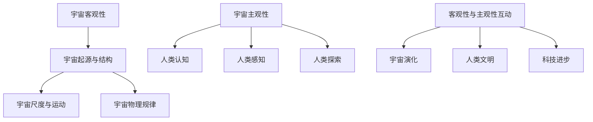

                 

### 文章标题

《宇宙的主观性与客观性之间的平衡》

> 关键词：宇宙、主观性、客观性、平衡、认知、演化

> 摘要：本文深入探讨了宇宙的主观性与客观性之间的平衡问题。通过对宇宙的客观性起源与结构、尺度与运动、物理规律的详细分析，以及主观性对宇宙认知的影响，探讨了宇宙演化中的平衡机制。同时，文章还分析了宇宙中客观性与主观性的互动、具体表现以及哲学和科学探索，并展望了未来宇宙的主观性与客观性平衡的发展趋势。

### 第一部分：宇宙观概述

#### 第1章：宇宙的主观性与客观性

##### 1.1 宇宙的客观性

宇宙的客观性是指宇宙存在的独立于我们主观意识之外的特性。这一特性主要包括宇宙的起源与结构、尺度与运动以及宇宙的物理规律。

###### 1.1.1 宇宙的起源与结构

宇宙的起源是一个复杂而引人入胜的话题。目前主流的宇宙起源理论是宇宙大爆炸理论，该理论认为宇宙起源于一个极热、极密集的状态，随后经历了膨胀和冷却的过程。这一过程中，宇宙逐渐形成了各种结构和天体，如星系、恒星、行星等。

宇宙的结构也是宇宙客观性的重要体现。宇宙是由无数星系组成的，这些星系通过引力相互作用形成了复杂的宇宙结构，如星系团、超星系团等。

###### 1.1.2 宇宙的尺度与运动

宇宙的尺度是宇宙客观性的另一个重要方面。宇宙的尺度从微观的原子尺度到宏观的宇宙尺度，跨度极大。宇宙的尺度可以通过宇宙学常数、宇宙膨胀速率等参数来描述。

宇宙的运动也是宇宙客观性的体现。宇宙的膨胀、恒星的诞生与死亡、行星的运动等，都是宇宙运动的例子。

###### 1.1.3 宇宙的物理规律

宇宙的物理规律是宇宙客观性的核心。宇宙中的各种现象和结构都可以用物理规律来解释，如万有引力定律、电磁力定律、相对论、量子力学等。

##### 1.2 宇宙的主观性

宇宙的主观性是指宇宙存在的依赖于我们主观意识的特性。这一特性主要包括人对宇宙的认知、人类感知与宇宙的关系以及主观性对宇宙认识的影响。

###### 1.2.1 人对宇宙的认知

人对宇宙的认知是宇宙主观性的重要体现。人类通过观测、实验、理论等多种方式来认识宇宙，从而形成了对宇宙的主观理解。

人类对宇宙的认知也经历了漫长的过程。从古代的宇宙观到现代的科学宇宙观，人类对宇宙的理解不断深化和扩展。

###### 1.2.2 人类感知与宇宙的关系

人类感知与宇宙的关系是宇宙主观性的另一个重要方面。人类的感知器官限制了我们对宇宙的感知，使得我们对宇宙的理解具有主观性。

人类感知与宇宙的关系也影响了我们对宇宙的探索。通过感知，人类发现了宇宙中的各种现象和规律，从而推动了宇宙科学的发展。

###### 1.2.3 主观性对宇宙认识的影响

主观性对宇宙认识的影响是宇宙主观性的核心。人类的主观意识会影响我们对宇宙的感知和理解，使得我们对宇宙的认识具有主观性。

主观性对宇宙认识的影响也体现在人类对宇宙的探索中。人类的主观意识推动了宇宙科学的发展，但也限制了我们对宇宙的全面理解。

#### 第2章：宇宙中的主观性与客观性平衡机制

##### 2.1 宇宙演化中的平衡过程

宇宙演化中的平衡过程是指宇宙在演化过程中，如何保持主观性与客观性的平衡。

###### 2.1.1 宇宙大爆炸与宇宙学原理

宇宙大爆炸是宇宙演化的起点。宇宙学原理指出，宇宙在膨胀过程中保持了均匀性和各向同性，这为宇宙的主观性与客观性平衡提供了基础。

###### 2.1.2 宇宙演化的主要阶段

宇宙演化可以分为多个阶段，如原始物质的形成、恒星的形成与演化、星系的形成与演化等。这些阶段都是宇宙主观性与客观性平衡的体现。

###### 2.1.3 平衡机制在宇宙演化中的体现

平衡机制在宇宙演化中体现在多个方面，如宇宙膨胀、恒星演化和星系形成等。这些过程都是宇宙主观性与客观性平衡的体现。

##### 2.2 物理法则中的平衡

物理法则中的平衡是指宇宙中各种物理现象如何保持主观性与客观性的平衡。

###### 2.2.1 万有引力与电磁力

万有引力和电磁力是宇宙中的两种基本力。它们在宇宙中相互平衡，维持了宇宙的结构和秩序。

###### 2.2.2 相对论与量子力学

相对论和量子力学是描述宇宙物理现象的两个重要理论。它们在宇宙中相互平衡，为我们理解宇宙提供了深刻的洞察。

###### 2.2.3 物理法则中的平衡作用

物理法则中的平衡作用体现在宇宙的各个层面，从微观的粒子相互作用到宏观的宇宙演化，都是物理法则平衡作用的体现。

##### 2.3 生命与意识的平衡

生命与意识的平衡是指宇宙中的生命和意识如何与宇宙的客观性保持平衡。

###### 2.3.1 生命的起源与演化

生命的起源和演化是宇宙演化的一部分。生命的出现和演化是宇宙主观性与客观性平衡的重要体现。

###### 2.3.2 意识的本质与形成

意识是生命的产物，它的本质和形成过程是宇宙主观性与客观性平衡的体现。

###### 2.3.3 生命与意识中的平衡现象

生命与意识中的平衡现象包括意识的自我认知、自我调节以及对宇宙的探索。这些现象都是宇宙主观性与客观性平衡的体现。

### 第二部分：平衡机制在宇宙中的具体表现

#### 第3章：宇宙中客观性与主观性的互动

##### 3.1 宇宙演化中的互动过程

宇宙演化中的互动过程是指宇宙中的客观性与主观性如何相互作用，推动宇宙的演化。

###### 3.1.1 宇宙演化中的客观性因素

宇宙演化中的客观性因素包括宇宙的起源、结构、运动和物理规律等。这些因素构成了宇宙演化的基础。

###### 3.1.2 宇宙演化中的主观性因素

宇宙演化中的主观性因素包括人类的认知、感知和探索等。这些因素影响了宇宙的主观性。

###### 3.1.3 客观性与主观性的互动机制

客观性与主观性的互动机制体现在宇宙演化的各个阶段。它们相互影响，共同推动宇宙的演化。

##### 3.2 人类文明与宇宙的互动

人类文明与宇宙的互动是指人类文明如何与宇宙的客观性相互作用，推动人类文明的发展。

###### 3.2.1 人类文明的起源与演化

人类文明的起源和演化是宇宙演化的一部分。人类文明的发展是宇宙主观性与客观性平衡的体现。

###### 3.2.2 人类文明与宇宙的关系

人类文明与宇宙的关系体现在人类对宇宙的探索、利用和改造等方面。人类文明的发展离不开宇宙的支持。

###### 3.2.3 人类文明对宇宙的影响

人类文明对宇宙的影响体现在人类活动对宇宙环境的改变、宇宙资源的利用以及对宇宙探索的贡献等方面。

##### 3.3 宇宙中的平衡现象实例分析

宇宙中的平衡现象实例分析是指通过具体的实例来分析宇宙中客观性与主观性的平衡现象。

###### 3.3.1 星系演化中的平衡

星系演化中的平衡现象包括星系的形成、恒星的形成与演化、星系间的相互作用等。这些现象都是宇宙主观性与客观性平衡的体现。

###### 3.3.2 黑洞与星系团中的平衡

黑洞与星系团中的平衡现象包括黑洞的形成、黑洞与星系团间的相互作用、星系团的演化等。这些现象都是宇宙主观性与客观性平衡的体现。

###### 3.3.3 人类文明的科技发展与宇宙的互动

人类文明的科技发展与宇宙的互动包括人类对宇宙的观测、探索和改造等。这些活动都是宇宙主观性与客观性平衡的体现。

### 第三部分：探索宇宙的主观性与客观性平衡

#### 第4章：宇宙主观性与客观性平衡的哲学思考

##### 4.1 宇宙观的哲学思考

宇宙观的哲学思考是指从哲学的角度来探讨宇宙的主观性与客观性平衡问题。

###### 4.1.1 客观性宇宙观与主观性宇宙观的哲学基础

客观性宇宙观和主观性宇宙观是两种不同的宇宙观。它们在哲学基础上有很大的差异，如唯物主义与唯心主义的对立。

###### 4.1.2 宇宙的客观性与主观性之间的关系

宇宙的客观性与主观性之间的关系是一个哲学问题。它们如何相互作用、相互影响，是哲学思考的重要内容。

###### 4.1.3 哲学对宇宙平衡观的贡献

哲学对宇宙平衡观的贡献体现在哲学提供了一种思考宇宙的主观性与客观性平衡的方式。哲学可以帮助我们更好地理解宇宙的本质。

##### 4.2 宇宙主观性与客观性平衡的意义

宇宙主观性与客观性平衡的意义是指宇宙的主观性与客观性平衡对人类文明、宇宙演化以及人类未来发展的意义。

###### 4.2.1 宇宙平衡对人类文明的启示

宇宙平衡对人类文明的启示体现在宇宙的主观性与客观性平衡为我们提供了理解宇宙的途径，也为我们提供了发展人类文明的方向。

###### 4.2.2 宇宙平衡对宇宙演化的影响

宇宙平衡对宇宙演化的影响体现在宇宙的主观性与客观性平衡促进了宇宙的演化，也为我们提供了研究宇宙演化的新思路。

###### 4.2.3 宇宙平衡与人类未来的发展

宇宙平衡与人类未来的发展体现在宇宙的主观性与客观性平衡为我们提供了探索宇宙的新方式，也为我们提供了实现人类未来发展的新途径。

##### 4.3 宇宙主观性与客观性平衡的科学探索

宇宙主观性与客观性平衡的科学探索是指通过科学的方法来研究宇宙的主观性与客观性平衡问题。

###### 4.3.1 宇宙学中的科学探索

宇宙学中的科学探索是指通过观测、实验和理论等方式来研究宇宙的主观性与客观性平衡问题。

宇宙学的主要研究方法包括观测、实验和理论建模等。这些方法为我们理解宇宙的主观性与客观性平衡提供了重要手段。

###### 4.3.2 人工智能在宇宙平衡研究中的应用

人工智能在宇宙平衡研究中的应用是指利用人工智能技术来研究宇宙的主观性与客观性平衡问题。

人工智能在宇宙学中的应用领域包括数据分析、图像处理、机器学习等。这些应用为宇宙的主观性与客观性平衡研究提供了新工具。

人工智能对宇宙平衡研究的贡献体现在它可以加速宇宙学数据的处理和分析，提高宇宙平衡研究的效率。

###### 4.3.3 人工智能在宇宙平衡研究中的挑战与机遇

人工智能在宇宙平衡研究中的挑战与机遇体现在人工智能技术的发展和应用面临着数据质量、算法优化、计算能力等方面的挑战，同时也为宇宙的主观性与客观性平衡研究带来了新的机遇。

##### 4.4 未来宇宙的主观性与客观性平衡

未来宇宙的主观性与客观性平衡是指在未来，宇宙的主观性与客观性将如何平衡，以及这种平衡对人类和宇宙的意义。

###### 4.4.1 未来宇宙的发展趋势

未来宇宙的发展趋势体现在宇宙的演化将继续进行，人类文明也将不断发展。在这个过程中，宇宙的主观性与客观性将如何平衡是一个重要问题。

未来宇宙的发展趋势包括宇宙的膨胀将继续，恒星和星系的演化将继续，人类文明的科技进步也将推动宇宙的主观性与客观性平衡。

###### 4.4.2 人类文明的发展方向

人类文明的发展方向体现在人类将如何利用科技手段探索宇宙，如何与宇宙的主观性与客观性保持平衡。

人类文明的发展方向包括宇宙探索、资源利用、环境保护等。这些方向将为人类文明与宇宙的主观性与客观性平衡提供新的思路。

###### 4.4.3 未来宇宙中客观性与主观性的平衡

未来宇宙中客观性与主观性的平衡体现在宇宙的主观性与客观性将如何相互作用，如何实现平衡。

未来宇宙中客观性与主观性的平衡将通过人类文明的科技进步、宇宙探索的深入以及宇宙演化的自然过程来实现。

### 附录

#### 附录A：宇宙主观性与客观性平衡相关的概念与公式

##### A.1 宇宙中的核心概念

宇宙中的核心概念包括宇宙的起源、结构、运动和物理规律等。这些概念是理解宇宙主观性与客观性平衡的基础。

##### A.2 宇宙中的核心公式

宇宙中的核心公式包括宇宙学常数、宇宙膨胀速率、万有引力公式、电磁力公式等。这些公式是描述宇宙客观性的重要工具。

##### A.3 宇宙主观性与客观性平衡相关的公式

宇宙主观性与客观性平衡相关的公式包括平衡态方程、相变方程等。这些公式描述了宇宙中的主观性与客观性如何相互作用，实现平衡。

### 作者信息

作者：AI天才研究院/AI Genius Institute & 禅与计算机程序设计艺术 /Zen And The Art of Computer Programming

### 第一部分：宇宙观概述

#### 第1章：宇宙的主观性与客观性

宇宙的主观性与客观性是理解宇宙本质的关键。客观性指的是宇宙存在的独立于我们主观意识之外的特性，而主观性则是指宇宙存在的依赖于我们主观意识的特性。这两者看似对立，但实际上在宇宙中是相互交织、相互影响的。

##### 1.1 宇宙的客观性

宇宙的客观性首先体现在宇宙的起源与结构上。现代宇宙学认为，宇宙起源于大约138亿年前的一个极端密集和高温的状态，即大爆炸。大爆炸后，宇宙开始膨胀冷却，逐渐形成了现在我们所看到的宇宙结构。这个宇宙结构包括星系、恒星、行星等，它们以复杂的方式相互关联。

宇宙的尺度也是一个客观性的体现。宇宙的尺度非常庞大，从微观的原子尺度到宏观的宇宙尺度，宇宙的尺度跨度极大。我们所能观测到的宇宙范围，即可观测宇宙，直径大约为930亿光年。

此外，宇宙的物理规律也属于客观性的范畴。物理规律是宇宙中各种自然现象遵循的基本规则，例如万有引力定律、电磁力定律、相对论、量子力学等。这些规律独立于我们的主观意识，是宇宙客观存在的体现。

###### 1.1.1 宇宙的起源与结构

宇宙的起源是一个复杂的课题，目前主流的理论是宇宙大爆炸理论。根据这一理论，宇宙起源于一个极度热密的状态，然后开始膨胀冷却，逐渐形成了现在的宇宙结构。这一过程中，宇宙中的基本粒子逐渐结合形成原子，原子聚变形成恒星，恒星又通过生命过程形成星系。

宇宙的结构可以理解为宇宙中的各种天体和结构如何排列和分布。宇宙的结构具有层次性，从行星、恒星、星系到星系团、超星系团，形成一个庞大的结构网络。这个结构网络不仅反映了宇宙的演化历史，也揭示了宇宙的物理规律。

###### 1.1.2 宇宙的尺度与运动

宇宙的尺度是一个非常抽象的概念，它描述了宇宙的广袤和多样性。从宇宙的尺度来看，宇宙可以分为可观测宇宙和总宇宙。可观测宇宙是我们能够通过观测手段探测到的宇宙部分，而总宇宙则包含了所有存在的宇宙空间。

宇宙的运动也是一个重要特性。宇宙的运动可以分为宇宙整体的膨胀运动和局部天体的运动。宇宙整体膨胀运动是指宇宙中的空间在不断扩张，这种扩张是均匀且各向同性的。而局部天体的运动则是指星系、恒星等天体在宇宙中的相对运动，如星系间的引力和相对运动。

###### 1.1.3 宇宙的物理规律

宇宙的物理规律是宇宙客观性的核心。物理规律是宇宙中各种现象和结构遵循的基本规则，如引力定律、电磁定律、相对论、量子力学等。这些规律在宇宙中普遍适用，不受人类主观意识的影响。

引力定律是由牛顿提出的，描述了质点间的引力相互作用。电磁定律是由麦克斯韦总结的，描述了电磁场的性质和电荷间的相互作用。相对论是由爱因斯坦提出的，分为狭义相对论和广义相对论，分别描述了高速运动物体的性质和引力作用下的时空性质。量子力学则是描述微观粒子行为的理论，揭示了微观世界的奇异规律。

##### 1.2 宇宙的主观性

宇宙的主观性则是指宇宙存在的依赖于我们主观意识的特性。人类的认知、感知和探索都是宇宙主观性的体现。人类通过观测、实验和理论建模等方式来认识宇宙，从而形成了对宇宙的主观理解。

宇宙的主观性对宇宙认识的影响是一个复杂的问题。人类的主观意识会影响我们对宇宙的感知和理解，使得我们对宇宙的认识具有主观性。然而，这种主观性并不是负面的，它推动了人类对宇宙的探索和认知。

###### 1.2.1 人对宇宙的认知

人对宇宙的认知是一个长期的过程。从古代的天文学到现代的天体物理学，人类对宇宙的认知不断深化和扩展。古代人通过观测天体，形成了对日月星辰的运动规律的认识。而现代天体物理学则利用观测数据和理论模型，揭示了宇宙的复杂结构和演化规律。

人类的认知过程受到观测手段的限制。例如，我们的感官只能感知到有限的频率范围，因此我们对宇宙的感知是不完整的。然而，通过科技的发展，我们可以使用望远镜、卫星和其他观测设备，获取更多的宇宙信息。

###### 1.2.2 人类感知与宇宙的关系

人类感知与宇宙的关系是一个哲学问题。人类的感知器官限制了我们对宇宙的感知，使得我们对宇宙的理解具有主观性。然而，这种主观性并不是完全负面的，它促使我们不断探索和改进我们的感知工具。

人类感知与宇宙的关系还体现在我们对宇宙的探索和利用上。例如，人类通过观测和实验，发现并利用了太阳能、核能等宇宙能量，推动了人类文明的发展。同时，人类也通过探索宇宙，对宇宙的客观性有了更深入的理解。

###### 1.2.3 主观性对宇宙认识的影响

主观性对宇宙认识的影响是一个重要问题。人类的主观意识会影响我们对宇宙的感知和理解，使得我们对宇宙的认识具有主观性。然而，这种主观性并不是负面的，它推动了人类对宇宙的探索和认知。

主观性对宇宙认识的影响还体现在科学方法论上。科学方法论是一种通过观测、实验和理论建模等方式来获取知识的方法。这种方法论要求我们保持客观、理性，尽量减少主观意识的影响。然而，实际上，科学家的主观意识仍然会影响他们的研究和解释。

##### 1.3 宇宙主观性与客观性的平衡

宇宙的主观性与客观性看似对立，但实际上在宇宙中是相互交织、相互影响的。宇宙的主观性与客观性平衡是一个复杂的过程，它涉及到人类认知、科学方法论、宇宙演化等多个方面。

宇宙主观性与客观性的平衡首先体现在宇宙演化中。宇宙的演化是一个自然的过程，它不受人类主观意识的影响。然而，人类通过观测和实验，对宇宙的演化过程进行了深入的研究，从而形成了对宇宙的主观理解。

宇宙主观性与客观性的平衡还体现在科学方法论上。科学方法论是一种通过观测、实验和理论建模等方式来获取知识的方法。这种方法论要求我们保持客观、理性，尽量减少主观意识的影响。然而，实际上，科学家的主观意识仍然会影响他们的研究和解释。

总之，宇宙的主观性与客观性是一个复杂而有趣的问题。通过深入探讨宇宙的主观性与客观性，我们可以更好地理解宇宙的本质，也为人类的认知和科学进步提供了新的思路。

### 第二部分：宇宙中的主观性与客观性平衡机制

宇宙的主观性与客观性在宇宙演化的过程中形成了复杂的平衡机制。这些机制既包括了宇宙大爆炸和宇宙学原理，也包括了物理法则和生命与意识的关系。在这一部分，我们将详细探讨这些机制。

#### 第2章：宇宙中的主观性与客观性平衡机制

##### 2.1 宇宙演化中的平衡过程

宇宙的演化是一个漫长而复杂的过程，它涉及到宇宙的起源、结构、运动和物理规律等多个方面。在这个过程中，宇宙的主观性与客观性相互作用，形成了动态的平衡。

###### 2.1.1 宇宙大爆炸与宇宙学原理

宇宙大爆炸是现代宇宙学的基础理论，它描述了宇宙从极热、极密的状态开始膨胀、冷却的过程。宇宙学原理指出，宇宙在膨胀过程中保持了均匀性和各向同性。这一原理为宇宙的主观性与客观性平衡提供了基础。

宇宙大爆炸理论认为，宇宙起源于一个极热、极密集的状态，随后开始膨胀和冷却。随着温度的下降，宇宙中的基本粒子逐渐形成，并最终形成了恒星、星系和其他天体。这一过程中，宇宙的主观性与客观性相互交织，形成了宇宙的多样性和复杂性。

宇宙学原理强调了宇宙的均匀性和各向同性。这意味着宇宙中的任何位置和方向，宇宙的性质都是相似的。这一原理不仅有助于我们理解宇宙的演化过程，也为宇宙的主观性与客观性平衡提供了理论基础。

###### 2.1.2 宇宙演化的主要阶段

宇宙演化可以分为多个主要阶段，每个阶段都体现了宇宙主观性与客观性的平衡。

1. **原始物质形成阶段**：在宇宙大爆炸后的几分钟内，宇宙温度极高，物质主要以基本粒子的形式存在。随着温度的下降，这些基本粒子开始结合形成更复杂的物质，如原子核。

2. **核合成阶段**：在宇宙大爆炸后的几分钟到几十分钟内，宇宙中的原子核通过核聚变反应形成。这一阶段是宇宙演化的关键，它为后续的恒星和星系的形成提供了物质基础。

3. **恒星形成与演化阶段**：随着宇宙的继续膨胀和冷却，物质开始聚集形成恒星。恒星通过核聚变反应产生能量，维持其生命周期。这一阶段是宇宙演化中最活跃的时期，它不仅影响了宇宙的结构，也影响了宇宙的主观性。

4. **星系形成与演化阶段**：恒星形成的气体云逐渐聚集形成星系。星系中的恒星通过引力相互作用，形成了复杂的结构。星系的演化不仅受到内部恒星的影响，也受到外部环境的影响，如星系团和超星系团。

5. **黑洞与星系团阶段**：在宇宙演化的后期，一些大质量的恒星会坍缩形成黑洞。黑洞是宇宙中非常特殊的物体，它们对宇宙的结构和演化产生了重要影响。同时，星系团和超星系团的形成也是宇宙演化的重要阶段。

###### 2.1.3 平衡机制在宇宙演化中的体现

在宇宙演化的过程中，宇宙的主观性与客观性通过多种机制保持平衡。

1. **能量转换**：宇宙中的能量转换是宇宙主观性与客观性平衡的重要机制。例如，恒星通过核聚变反应将氢转化为氦，释放出大量能量。这些能量不仅维持了恒星的稳定性，也对宇宙的结构和演化产生了影响。

2. **引力作用**：引力是宇宙中最基本的力，它决定了宇宙中天体的运动和聚集。引力不仅影响了恒星和星系的形成，也影响了宇宙的整体结构。

3. **物质循环**：宇宙中的物质循环是宇宙主观性与客观性平衡的另一个重要机制。物质在宇宙中不断循环，从恒星形成到恒星死亡，再到行星、星系的形成，物质始终在宇宙中循环流动。

4. **观测与理论**：人类通过观测和理论建模，对宇宙的演化进行了深入的研究。这些研究不仅帮助我们更好地理解宇宙的客观性，也丰富了我们对宇宙主观性的认识。

##### 2.2 物理法则中的平衡

物理法则是宇宙中自然现象遵循的基本规则。这些法则在宇宙中普遍适用，不受人类主观意识的影响。然而，物理法则本身也反映了宇宙主观性与客观性的平衡。

###### 2.2.1 万有引力与电磁力

万有引力是宇宙中最基本的力之一，它决定了天体的运动和聚集。电磁力是另一个重要的力，它决定了电荷之间的相互作用。这两种力在宇宙中相互平衡，形成了宇宙的结构和秩序。

万有引力与电磁力的平衡体现在宇宙的各个层面。例如，星系的形成和演化受到引力和电磁力的共同作用。恒星通过核聚变反应产生能量，同时也受到电磁力的作用，维持恒星的稳定性。

###### 2.2.2 相对论与量子力学

相对论和量子力学是现代物理学的两个重要理论。相对论描述了高速运动物体的性质和引力作用下的时空性质。量子力学描述了微观粒子的行为和相互作用。

相对论与量子力学的平衡是宇宙主观性与客观性平衡的另一个重要方面。相对论揭示了宇宙的大尺度结构，如星系和星系团。量子力学揭示了宇宙的微观结构，如原子和基本粒子。这两种理论的平衡为我们提供了理解宇宙的整体框架。

###### 2.2.3 物理法则中的平衡作用

物理法则中的平衡作用体现在宇宙的各个层面。例如，宇宙的膨胀受到引力和宇宙学常数的作用，这两种力的平衡决定了宇宙的膨胀速度。恒星的演化受到核聚变反应和引力的作用，这两种力的平衡决定了恒星的寿命和稳定性。

物理法则的平衡作用不仅决定了宇宙的结构和演化，也影响了人类对宇宙的认知。通过物理法则，我们可以预测宇宙中的各种现象，从而更好地理解宇宙的主观性与客观性。

##### 2.3 生命与意识的平衡

生命和意识是宇宙中非常特殊的属性。它们不仅反映了宇宙的客观性，也体现了宇宙的主观性。在宇宙的演化过程中，生命和意识的平衡是一个复杂而有趣的问题。

###### 2.3.1 生命的起源与演化

生命的起源是一个未解之谜。目前普遍认为，生命起源于原始海洋中的化学反应。随着时间的推移，这些化学反应逐渐形成了复杂的有机分子，最终导致了生命的诞生。

生命的演化是一个漫长而复杂的过程。在地球上，生命从单细胞生物逐渐演化成多细胞生物，最终形成了复杂的生物体系。这一过程中，生命与宇宙的客观性保持了平衡。

###### 2.3.2 意识的本质与形成

意识是生命的产物，它的本质和形成过程是一个复杂的问题。目前，科学家对意识的本质还没有完全理解。然而，普遍认为意识与大脑的神经元活动有关。

意识的形成过程可以理解为大脑处理信息的过程。人类通过感官接收外部信息，然后通过大脑进行处理和解释。这一过程中，意识不仅反映了宇宙的客观性，也体现了宇宙的主观性。

###### 2.3.3 生命与意识中的平衡现象

生命与意识中的平衡现象体现在多个方面。例如，人类的感知器官限制了我们对宇宙的感知，使得我们对宇宙的理解具有主观性。然而，这种主观性并不是完全负面的，它推动了人类对宇宙的探索和认知。

生命的演化也体现了宇宙主观性与客观性的平衡。例如，人类通过科技手段不断探索宇宙，从而对宇宙的客观性有了更深入的理解。同时，人类的科技发展也改变了宇宙的客观性，例如人类的活动对地球环境的影响。

总之，宇宙中的主观性与客观性通过多种机制保持平衡。这些机制不仅决定了宇宙的结构和演化，也影响了人类对宇宙的认知。通过深入探讨宇宙的主观性与客观性，我们可以更好地理解宇宙的本质，也为人类的认知和科学进步提供了新的思路。

### 第二部分：平衡机制在宇宙中的具体表现

#### 第3章：宇宙中客观性与主观性的互动

宇宙中的客观性与主观性并非孤立存在，它们在宇宙演化过程中相互影响、相互作用，形成了复杂的动态平衡。这一章节将探讨宇宙中客观性与主观性的互动过程，分析它们在宇宙演化中的具体表现。

##### 3.1 宇宙演化中的互动过程

宇宙演化中的互动过程涉及到宇宙的客观性与主观性的相互作用，这种相互作用在宇宙的各个层次上都有体现。

###### 3.1.1 宇宙演化中的客观性因素

宇宙演化中的客观性因素包括宇宙的起源、结构、运动和物理规律等。这些因素独立于人类的主观意识，是宇宙存在的本质属性。

1. **宇宙起源**：宇宙的起源是一个客观的事实，尽管我们对宇宙起源的具体细节尚未完全理解。大爆炸理论提供了一个关于宇宙起源的模型，这个模型虽然基于观测数据和理论推演，但它的基本假设和结果是客观的。

2. **宇宙结构**：宇宙的结构，如星系、星系团和超星系团，是由客观的物理规律塑造的。这些结构在宇宙演化过程中不断形成和变化，不受人类主观意识的影响。

3. **宇宙运动**：宇宙的膨胀、恒星和星系的运动等，都是客观存在的现象。这些运动遵循物理定律，如引力定律和宇宙学原理，是宇宙演化过程中的客观性体现。

4. **物理规律**：宇宙中的物理规律，如万有引力定律、电磁力定律、相对论和量子力学，是宇宙客观性的核心。这些规律描述了宇宙中各种自然现象的基本行为，是宇宙演化过程中不可或缺的部分。

###### 3.1.2 宇宙演化中的主观性因素

宇宙演化中的主观性因素包括人类对宇宙的认知、感知和探索等。这些因素反映了人类的主观意识对宇宙的理解和影响。

1. **人类认知**：人类通过观测、实验和理论建模等方式对宇宙进行认知。这种认知过程受到人类感官和认知能力的限制，因此具有主观性。例如，人类通过望远镜观测到的星系，虽然反映了宇宙的客观存在，但观测到的细节和解读方式受到人类主观意识的影响。

2. **人类感知**：人类感知宇宙的方式受到感官的限制，如视力、听觉、触觉等。这些感知方式使得我们对宇宙的理解具有主观性。例如，我们无法直接感知到微观粒子的行为，只能通过实验和理论模型来理解它们。

3. **人类探索**：人类对宇宙的探索活动，如太空探测、卫星观测等，都是主观性因素的具体体现。这些探索活动不仅帮助我们更好地理解宇宙的客观性，也改变了宇宙的客观性。例如，人类的活动可能对地球环境和生态系统产生影响，从而改变了宇宙中的某些客观条件。

###### 3.1.3 客观性与主观性的互动机制

宇宙中的客观性与主观性的互动机制体现在多个方面，包括宇宙演化过程中的相互影响、人类认知和探索活动的互动等。

1. **相互影响**：宇宙的客观性和主观性在宇宙演化过程中相互影响。例如，宇宙中的物理规律决定了宇宙的结构和演化，而这些结构和演化又影响了人类对宇宙的认知。这种相互影响使得宇宙的主观性与客观性形成了一种动态平衡。

2. **认知与探索**：人类对宇宙的认知和探索活动是宇宙主观性与客观性互动的重要机制。人类通过观测和实验获取宇宙信息，然后通过理论建模和解释来理解宇宙。这种认知和探索活动不仅丰富了人类对宇宙的理解，也推动了宇宙科学的进步。

3. **反馈循环**：宇宙的客观性和主观性之间存在反馈循环。人类的认知和探索活动会影响宇宙的客观性，而宇宙的客观性变化又会影响人类的主观性。这种反馈循环使得宇宙的主观性与客观性在演化过程中不断调整和适应。

##### 3.2 人类文明与宇宙的互动

人类文明与宇宙的互动是宇宙中客观性与主观性互动的一个重要方面。人类文明的发展不仅改变了宇宙的客观性，也影响了宇宙的主观性。

###### 3.2.1 人类文明的起源与演化

人类文明的起源可以追溯到数百万年前，当时的人类只是以狩猎和采集为生的原始生物。随着时间的推移，人类逐渐发展出了农业、手工业和商业等复杂的社会形态。人类文明的发展不仅改变了地球环境，也改变了宇宙的客观性。

1. **技术进步**：人类文明的技术进步极大地改变了宇宙的客观性。例如，人类通过航天技术进入太空，建立了卫星和空间站，这些活动不仅改变了我们对宇宙的认知，也改变了宇宙的某些客观条件。

2. **能源利用**：人类文明的能源利用活动，如化石燃料的开采和使用、核能的开发等，都对地球环境和宇宙的物理状态产生了影响。这些活动不仅改变了宇宙的客观性，也引发了全球气候变化等环境问题。

3. **环境改造**：人类文明对地球环境的改造活动，如城市建设、森林砍伐、沙漠化等，也对宇宙的客观性产生了影响。这些活动不仅改变了地球的自然环境，也改变了宇宙中的某些物理过程。

###### 3.2.2 人类文明与宇宙的关系

人类文明与宇宙的关系是复杂而多元的。人类不仅依赖于宇宙提供的资源，如太阳能、水资源等，也通过科技活动对宇宙产生了影响。

1. **资源利用**：人类文明利用宇宙中的资源，如太阳辐射、地热能、潮汐能等，这些资源的利用不仅促进了人类文明的发展，也改变了宇宙的某些物理过程。

2. **科学研究**：人类通过科学研究，对宇宙进行了深入的了解和探索。例如，通过天文学、物理学、化学等科学领域的研究，人类揭示了宇宙的奥秘，推动了宇宙科学的发展。

3. **环境保护**：人类文明意识到自己对地球环境的破坏，开始采取环境保护措施，如减少碳排放、保护生物多样性等。这些活动不仅有助于保护地球环境，也对宇宙的客观性产生了积极影响。

###### 3.2.3 人类文明对宇宙的影响

人类文明对宇宙的影响是深远而复杂的。人类的活动不仅改变了宇宙的客观性，也对宇宙的主观性产生了影响。

1. **气候变化**：人类活动导致的全球气候变化对宇宙的客观性产生了重大影响。气候变化不仅改变了地球的气候系统，也对宇宙中的其他天体产生了影响。

2. **技术进步**：人类的技术进步，如通信技术、网络技术等，使得人类能够更好地探索宇宙。例如，通过卫星通信和互联网，人类可以在全球范围内实时交流宇宙科学信息，推动了宇宙科学的发展。

3. **意识觉醒**：随着人类文明的发展，人类对宇宙的意识觉醒，开始意识到自己对宇宙的责任。人类开始关注宇宙的未来，探讨如何实现宇宙的可持续发展，这为宇宙的主观性与客观性平衡提供了新的思路。

##### 3.3 宇宙中的平衡现象实例分析

宇宙中的平衡现象实例分析可以帮助我们更好地理解宇宙主观性与客观性的互动。以下是一些具体的实例：

###### 3.3.1 星系演化中的平衡

星系的演化是一个复杂的动态过程，涉及到恒星的形成、恒星的演化、星系的碰撞和合并等多个方面。在星系演化过程中，客观的物理规律与人类的主观认知相互影响，形成了动态的平衡。

1. **恒星的形成**：恒星的形成是星系演化的基础。恒星的形成过程受到引力、辐射压力和磁场等多种物理规律的约束，这些规律决定了恒星的形成条件和演化路径。

2. **恒星的演化**：恒星的演化过程包括主序阶段、红巨星阶段和超新星阶段等。这些演化过程遵循物理定律，如核聚变反应、热力学和引力学等。人类通过观测和理论建模，对恒星的演化过程进行了深入的研究，从而更好地理解了恒星演化的规律。

3. **星系的碰撞**：星系的碰撞和合并是宇宙中常见的现象。在星系碰撞过程中，星系中的恒星、气体和暗物质等都会受到巨大的冲击，这种冲击会导致星系的形态和结构发生变化。人类通过观测和模拟，对星系碰撞过程进行了研究，从而揭示了星系演化中的平衡现象。

###### 3.3.2 黑洞与星系团中的平衡

黑洞和星系团是宇宙中的两个重要组成部分。黑洞具有极强的引力，可以对周围的物质和辐射产生巨大影响。星系团是由多个星系组成的巨大结构，它在宇宙中扮演着重要的角色。

1. **黑洞的形成**：黑洞的形成通常与恒星的超新星爆炸有关。当一颗大质量恒星耗尽核燃料后，它会经历超新星爆炸，并最终形成黑洞。黑洞的形成过程是宇宙演化中的重要环节，它对宇宙的物理状态和结构产生了深远影响。

2. **黑洞与星系团的关系**：黑洞是星系团中的中心物体，它对星系团的演化产生了重要影响。例如，黑洞可以通过引力作用控制星系团中的星系运动，维持星系团的稳定结构。同时，人类通过观测和模拟，对黑洞与星系团之间的相互作用进行了深入研究，揭示了宇宙中的平衡现象。

3. **星系团的演化**：星系团的演化是一个复杂的过程，涉及到星系之间的相互作用、星系内部的恒星演化、星系团的碰撞和合并等多个方面。人类通过观测和理论建模，对星系团的演化过程进行了研究，从而揭示了宇宙中的平衡机制。

###### 3.3.3 人类文明的科技发展与宇宙的互动

人类文明的科技发展对宇宙的主观性与客观性平衡产生了深远影响。以下是一些具体的实例：

1. **太空探索**：人类通过航天技术进入太空，对宇宙进行了广泛的探索。例如，人类发射了各种卫星、探测器，对太阳系、星系团和宇宙背景辐射进行了观测。这些探索活动不仅丰富了人类对宇宙的理解，也改变了宇宙的某些客观条件。

2. **通信技术**：通信技术的发展使得人类能够在全球范围内实时交流宇宙科学信息。例如，通过卫星通信和互联网，科学家可以在不同地点实时共享观测数据和研究成果，推动了宇宙科学的发展。

3. **人工智能**：人工智能技术在宇宙科学中的应用为人类提供了新的研究手段。例如，人工智能可以帮助科学家处理大量的宇宙观测数据，从中发现新的天体和现象。同时，人工智能也可以用于模拟宇宙演化过程，为宇宙科学提供新的理论框架。

通过以上实例分析，我们可以看到，宇宙中的主观性与客观性在宇宙演化过程中通过多种机制相互影响、相互作用，形成了复杂的动态平衡。这种平衡不仅决定了宇宙的结构和演化，也影响了人类对宇宙的认知和探索。

### 第三部分：探索宇宙的主观性与客观性平衡

#### 第4章：宇宙主观性与客观性平衡的哲学思考

宇宙的主观性与客观性平衡问题不仅仅是科学问题，它还涉及到哲学层面。哲学思考能够帮助我们更深刻地理解宇宙的本质和人类在宇宙中的位置。在这一章节中，我们将从哲学的角度探讨宇宙主观性与客观性平衡的意义、哲学思考的贡献以及未来宇宙平衡的哲学探讨。

##### 4.1 宇宙观的哲学思考

宇宙观是哲学中的一个核心问题，它涉及到我们对宇宙的本质、起源和存在的理解。宇宙的主观性与客观性平衡是宇宙观的一个重要方面。

###### 4.1.1 客观性宇宙观与主观性宇宙观的哲学基础

哲学上有两种主要的宇宙观：客观性宇宙观和主观性宇宙观。

1. **客观性宇宙观**：客观性宇宙观认为宇宙的存在和性质独立于人类的主观意识。这种宇宙观强调宇宙的物理规律和自然法则，如牛顿力学、相对论和量子力学等。客观性宇宙观的基础是唯物主义哲学，它认为物质是宇宙的本原，意识是物质的产物。

2. **主观性宇宙观**：主观性宇宙观则认为宇宙的存在和性质在很大程度上依赖于人类的主观意识。这种宇宙观强调人类感知和认知的重要性，认为宇宙的意义和目的与人类的存在密切相关。主观性宇宙观的基础是唯心主义哲学，它认为意识是宇宙的本原，物质是意识的产物。

客观性宇宙观与主观性宇宙观在哲学基础上存在根本的对立，但它们都为我们提供了理解宇宙的不同视角。

###### 4.1.2 宇宙的客观性与主观性之间的关系

宇宙的客观性与主观性之间的关系是哲学探讨的重要问题。它们在宇宙中是如何相互作用的，又是如何保持平衡的？

1. **相互作用**：宇宙的客观性与主观性在宇宙演化过程中相互影响。例如，宇宙的物理规律决定了宇宙的结构和演化，而这些结构和演化又影响了人类对宇宙的认知。这种相互作用使得宇宙的主观性与客观性形成了一种动态平衡。

2. **相互依存**：宇宙的主观性与客观性是相互依存的。人类的主观认知依赖于宇宙的客观存在，而宇宙的客观存在又通过人类的主观认知得到了更深刻的理解。例如，人类通过科学实验和观测对宇宙进行了研究，这些研究不仅丰富了人类对宇宙的认知，也改变了宇宙的某些客观条件。

3. **相互作用机制**：宇宙的主观性与客观性之间的相互作用机制包括认知过程、科学方法论、技术进步等多个方面。例如，人类通过感官和科学工具对宇宙进行感知和观测，这些感知和观测结果又通过科学理论进行解释和验证，从而形成了一种相互作用和反馈循环。

###### 4.1.3 哲学对宇宙平衡观的贡献

哲学对宇宙平衡观的贡献体现在多个方面。首先，哲学为我们提供了探讨宇宙主观性与客观性平衡问题的基本框架和方法论。例如，唯物主义和唯心主义提供了不同的宇宙观，这些宇宙观为理解宇宙的主观性与客观性平衡提供了不同的视角。

其次，哲学思考有助于我们更深刻地理解宇宙的本质和人类在宇宙中的位置。例如，通过哲学思考，我们可以认识到宇宙的多样性和复杂性，以及人类认知的局限性。这种认识有助于我们更好地面对宇宙中的各种挑战和不确定性。

最后，哲学思考还可以为科学探索提供指导。例如，哲学家们的思考可以启发科学家提出新的假设和理论，从而推动科学的发展。例如，哥白尼的日心说和伽利略的实验方法都受到了哲学思考的启发。

##### 4.2 宇宙主观性与客观性平衡的意义

宇宙主观性与客观性平衡对人类文明、宇宙演化和人类未来的发展具有重要意义。

###### 4.2.1 宇宙平衡对人类文明的启示

宇宙的主观性与客观性平衡为我们提供了对宇宙的理解和探索的启示。通过理解宇宙的平衡机制，我们可以更好地利用宇宙的资源，推动人类文明的发展。

1. **科学研究**：宇宙的主观性与客观性平衡启示我们，科学研究需要既关注宇宙的客观规律，也要考虑人类的主观认知。通过科学方法，我们可以更准确地理解宇宙，推动科学的发展。

2. **技术进步**：宇宙的主观性与客观性平衡也为我们提供了技术进步的启示。通过理解宇宙的平衡机制，我们可以开发新技术，解决人类面临的问题，提高人类的生活质量。

3. **文化发展**：宇宙的主观性与客观性平衡还影响了人类的文化发展。例如，宇宙的多样性和复杂性激发了人类的创造力和想象力，促进了艺术和文学的发展。

###### 4.2.2 宇宙平衡对宇宙演化的影响

宇宙的主观性与客观性平衡对宇宙演化产生了深远影响。宇宙的演化是一个复杂的动态过程，它涉及到宇宙的物理规律、生命和意识等多个方面。宇宙的平衡机制决定了宇宙演化的方向和速度。

1. **宇宙结构**：宇宙的主观性与客观性平衡影响了宇宙的结构。例如，星系的形成和演化受到引力和辐射压力的平衡，这种平衡决定了星系的形态和结构。

2. **生命演化**：宇宙的主观性与客观性平衡也影响了生命的演化。例如，生命的起源和演化受到宇宙的物理规律和化学过程的影响，这些规律和过程是宇宙平衡机制的体现。

3. **意识形成**：宇宙的主观性与客观性平衡还影响了意识的形成。例如，人类意识的形成受到大脑生理结构和宇宙环境的影响，这种影响是宇宙平衡机制的体现。

###### 4.2.3 宇宙平衡与人类未来的发展

宇宙的主观性与客观性平衡对人类未来的发展具有重要意义。随着人类文明的进步，我们面临的挑战也越来越大。通过理解宇宙的平衡机制，我们可以更好地应对这些挑战，实现可持续发展。

1. **环境保护**：宇宙的主观性与客观性平衡启示我们，环境保护是维护宇宙平衡的重要措施。通过环境保护，我们可以减缓全球气候变化，保护地球生态系统，为人类未来的发展创造良好的环境。

2. **资源利用**：宇宙的主观性与客观性平衡也为我们提供了资源利用的启示。通过科学合理地利用宇宙资源，我们可以实现可持续发展，满足人类对资源的需求。

3. **科技创新**：宇宙的主观性与客观性平衡还推动了科技创新。通过理解宇宙的平衡机制，我们可以开发新技术，解决人类面临的问题，推动人类文明的进步。

##### 4.3 未来宇宙的主观性与客观性平衡

未来的宇宙将面临新的挑战和机遇。通过哲学思考，我们可以探讨未来宇宙主观性与客观性平衡的可能方向。

###### 4.3.1 未来宇宙的发展趋势

未来的宇宙将继续演化，人类文明也将不断发展。在这个过程中，宇宙的主观性与客观性将如何平衡是一个重要问题。

1. **宇宙演化**：宇宙的演化将继续，星系的形成、恒星的生命周期、星系团的演化等都将继续。这些演化过程将继续塑造宇宙的结构和物理状态。

2. **人类文明**：人类文明将继续发展，科技创新、社会进步、文化繁荣等都将推动人类文明向更高层次发展。在这个过程中，人类文明与宇宙的互动将更加紧密，宇宙的主观性与客观性平衡也将受到更大影响。

3. **科技与哲学的融合**：未来的宇宙平衡将更加依赖于科技与哲学的融合。通过哲学思考，我们可以提供对宇宙本质和人类存在的深刻理解，这将为科技发展提供指导，促进宇宙主观性与客观性的平衡。

###### 4.3.2 人类文明的发展方向

未来人类文明的发展方向将受到宇宙主观性与客观性平衡的影响。以下是一些可能的发展方向：

1. **可持续文明**：未来的文明将更加注重可持续发展，通过科技手段保护地球环境，维护宇宙的平衡。

2. **宇宙探索**：人类将继续探索宇宙，寻找新的资源和生存空间。通过探索宇宙，我们可以更好地理解宇宙的主观性与客观性，推动宇宙科学的进步。

3. **意识与技术的融合**：未来的文明将更加关注意识与技术的融合，通过人工智能等新技术，提升人类认知能力，探索宇宙的奥秘。

4. **全球合作**：未来的文明将更加注重全球合作，通过国际合作，共同应对宇宙挑战，实现宇宙的平衡与可持续发展。

###### 4.3.3 未来宇宙中客观性与主观性的平衡

未来的宇宙中将如何保持客观性与主观性的平衡是一个复杂的问题。以下是一些可能的平衡机制：

1. **科学理性**：通过科学方法和理性思考，我们可以更好地理解宇宙的客观性，同时尊重人类的主观认知。

2. **技术进步**：科技的发展将为我们提供新的工具和方法，帮助我们更好地理解和应对宇宙的复杂性和多样性。

3. **哲学思考**：哲学思考将为我们提供对宇宙本质和人类存在的深刻理解，这有助于我们实现宇宙的主观性与客观性平衡。

4. **全球合作**：全球合作将促进科技和文化的发展，为宇宙的主观性与客观性平衡提供支持。

总之，未来的宇宙中将如何保持客观性与主观性的平衡是一个复杂而重要的问题。通过哲学思考和科技进步，我们可以为实现这一平衡提供新的思路和途径。

### 第三部分：探索宇宙的主观性与客观性平衡

#### 第5章：宇宙主观性与客观性平衡的科学探索

科学探索是理解宇宙主观性与客观性平衡的重要途径。在这一章节中，我们将探讨宇宙学中的科学探索，人工智能在宇宙平衡研究中的应用，以及未来宇宙中客观性与主观性平衡的可能性。

##### 5.1 宇宙学中的科学探索

宇宙学是研究宇宙起源、结构、演化以及宇宙中各种物理现象的科学。宇宙学的研究方法主要包括观测、实验和理论建模。

###### 5.1.1 宇宙学的主要研究方法

1. **观测**：宇宙学观测是获取宇宙信息的重要手段。通过观测，科学家可以获取关于宇宙的各种数据，如宇宙微波背景辐射、超新星爆发、星系形态等。这些数据为宇宙学的研究提供了宝贵的资料。

2. **实验**：宇宙学实验是通过模拟宇宙条件来研究宇宙现象的方法。例如，通过激光干涉仪观测引力波，科学家可以验证广义相对论，并研究宇宙的早期状态。

3. **理论建模**：宇宙学理论建模是通过建立数学模型来描述宇宙的演化过程。这些模型可以帮助科学家预测宇宙的未来演化，并验证观测数据。

###### 5.1.2 宇宙学中的观测与实验

宇宙学观测和实验的结果为理解宇宙的主观性与客观性平衡提供了重要依据。

1. **宇宙微波背景辐射**：宇宙微波背景辐射是宇宙大爆炸后留下的残余辐射。通过观测宇宙微波背景辐射，科学家可以了解宇宙的早期状态和演化过程。

2. **超新星爆发**：超新星爆发是恒星演化的重要阶段。通过观测超新星爆发，科学家可以研究恒星的演化过程和宇宙的膨胀速率。

3. **星系形态**：星系形态反映了宇宙中的物质分布和相互作用。通过观测星系形态，科学家可以了解宇宙的结构和演化。

4. **引力波**：引力波是宇宙中的扰动波，它反映了宇宙中的强引力相互作用。通过观测引力波，科学家可以验证广义相对论，并研究宇宙的早期状态。

###### 5.1.3 宇宙学对宇宙平衡的理解

宇宙学的研究结果为理解宇宙的主观性与客观性平衡提供了重要启示。

1. **宇宙膨胀**：宇宙的膨胀是宇宙演化的重要特征。通过观测宇宙膨胀速率，科学家可以了解宇宙的演化过程和宇宙的主观性与客观性平衡。

2. **物质分布**：宇宙中的物质分布反映了宇宙的演化过程和宇宙的客观性。通过研究物质分布，科学家可以了解宇宙的结构和演化。

3. **相互作用**：宇宙中的相互作用，如引力相互作用、电磁相互作用等，决定了宇宙的结构和演化。通过研究相互作用，科学家可以了解宇宙的主观性与客观性平衡。

##### 5.2 人工智能在宇宙平衡研究中的应用

人工智能技术的发展为宇宙平衡研究提供了新的工具和方法。人工智能在宇宙学中的应用主要包括数据分析和图像处理。

###### 5.2.1 人工智能在宇宙学中的应用领域

1. **数据分析**：宇宙学观测产生了大量的数据，如宇宙微波背景辐射数据、星系形态数据等。通过人工智能技术，科学家可以高效地处理这些数据，提取有用信息。

2. **图像处理**：宇宙学观测通常产生高分辨率、高动态范围的图像。通过人工智能技术，科学家可以对图像进行增强、分类和识别，从而提取出宇宙中的重要信息。

###### 5.2.2 人工智能对宇宙平衡研究的贡献

人工智能技术在宇宙平衡研究中的应用为科学家提供了新的研究方法和工具。

1. **数据分析**：通过人工智能技术，科学家可以快速处理大量的宇宙学观测数据，提取出关键特征，从而更好地理解宇宙的演化过程。

2. **图像处理**：通过人工智能技术，科学家可以对宇宙学图像进行分类和识别，从而发现新的宇宙现象和规律。

3. **预测和模拟**：通过人工智能技术，科学家可以建立更精确的宇宙演化模型，预测宇宙的未来演化趋势，从而更好地理解宇宙的主观性与客观性平衡。

###### 5.2.3 人工智能在宇宙平衡研究中的挑战与机遇

人工智能技术在宇宙平衡研究中的应用也面临一些挑战和机遇。

1. **数据质量**：宇宙学观测数据的准确性和完整性对研究结果至关重要。人工智能技术可以提高数据处理能力，但需要高质量的数据支持。

2. **算法优化**：人工智能算法的优化对于提高数据处理效率和精度至关重要。科学家需要不断优化算法，以适应不同的宇宙学问题。

3. **计算能力**：宇宙平衡研究需要大量的计算资源，人工智能技术的发展为科学家提供了更强大的计算能力。

##### 5.3 未来宇宙中客观性与主观性的平衡

未来的宇宙将面临新的挑战和机遇。通过科学探索和人工智能技术，我们可以探讨未来宇宙中客观性与主观性平衡的可能性。

###### 5.3.1 未来宇宙的发展趋势

未来的宇宙将继续演化，人类文明也将不断发展。在这个过程中，宇宙的主观性与客观性将如何平衡是一个重要问题。

1. **宇宙演化**：宇宙的演化将继续，星系的形成、恒星的生命周期、星系团的演化等都将继续。这些演化过程将继续塑造宇宙的结构和物理状态。

2. **人类文明**：人类文明将继续发展，科技创新、社会进步、文化繁荣等都将推动人类文明向更高层次发展。在这个过程中，人类文明与宇宙的互动将更加紧密，宇宙的主观性与客观性平衡也将受到更大影响。

3. **科技与哲学的融合**：未来的宇宙平衡将更加依赖于科技与哲学的融合。通过哲学思考，我们可以提供对宇宙本质和人类存在的深刻理解，这将为科技发展提供指导，促进宇宙主观性与客观性的平衡。

###### 5.3.2 人类文明的发展方向

未来人类文明的发展方向将受到宇宙主观性与客观性平衡的影响。以下是一些可能的发展方向：

1. **可持续文明**：未来的文明将更加注重可持续发展，通过科技手段保护地球环境，维护宇宙的平衡。

2. **宇宙探索**：人类将继续探索宇宙，寻找新的资源和生存空间。通过探索宇宙，我们可以更好地理解宇宙的主观性与客观性，推动宇宙科学的进步。

3. **意识与技术的融合**：未来的文明将更加关注意识与技术的融合，通过人工智能等新技术，提升人类认知能力，探索宇宙的奥秘。

4. **全球合作**：未来的文明将更加注重全球合作，通过国际合作，共同应对宇宙挑战，实现宇宙的平衡与可持续发展。

###### 5.3.3 未来宇宙中客观性与主观性的平衡

未来的宇宙中将如何保持客观性与主观性的平衡是一个复杂的问题。通过科学探索和人工智能技术，我们可以探讨未来宇宙中客观性与主观性平衡的可能性。

1. **科学理性**：通过科学方法和理性思考，我们可以更好地理解宇宙的客观性，同时尊重人类的主观认知。

2. **技术进步**：科技的发展将为我们提供新的工具和方法，帮助我们更好地理解和应对宇宙的复杂性和多样性。

3. **哲学思考**：哲学思考将为我们提供对宇宙本质和人类存在的深刻理解，这有助于我们实现宇宙的主观性与客观性平衡。

4. **全球合作**：全球合作将促进科技和文化的发展，为宇宙的主观性与客观性平衡提供支持。

通过科学探索和人工智能技术的应用，我们可以更好地理解宇宙的主观性与客观性平衡，为实现宇宙的可持续发展提供新的思路和途径。

### 第三部分：探索宇宙的主观性与客观性平衡

#### 第6章：未来宇宙的主观性与客观性平衡

随着科学技术的不断进步，我们对宇宙的理解也在不断深化。未来宇宙的主观性与客观性平衡将成为一个重要的研究课题。在这一章节中，我们将探讨未来宇宙中客观性与主观性的发展趋势、人类文明的发展方向，以及未来宇宙中客观性与主观性的平衡。

##### 6.1 未来宇宙的发展趋势

未来宇宙的发展趋势将受到宇宙自身演化的影响，同时也会受到人类文明进步的推动。

###### 6.1.1 宇宙演化中的潜在趋势

1. **宇宙的膨胀**：宇宙的膨胀将继续，尽管目前观测到的宇宙膨胀速率有所减缓，但随着时间的推移，宇宙的膨胀趋势仍将延续。这种膨胀可能会导致宇宙的最终命运，如“热寂”或“大撕裂”。

2. **星系的形成与演化**：随着宇宙的膨胀，星系的形成和演化将继续。新的星系将在宇宙中形成，而现有的星系将继续经历各种演化过程，如恒星的形成、恒星的生命周期以及星系的碰撞与合并。

3. **黑洞与星系团**：黑洞和星系团在宇宙演化中扮演着重要角色。未来宇宙中将会有更多的黑洞形成，同时星系团的结构和演化也将变得更加复杂。

4. **暗物质与暗能量**：暗物质和暗能量是宇宙演化中的重要组成部分。未来宇宙中，科学家将继续探索暗物质和暗能量的性质和作用，以更好地理解宇宙的演化过程。

###### 6.1.2 人类文明的发展方向

1. **科技发展**：人类文明的科技发展将推动我们对宇宙的理解。未来的科技将包括更先进的观测设备、更精确的测量技术和更强大的计算能力。这些技术将帮助我们更深入地探索宇宙，揭示宇宙的奥秘。

2. **空间探索**：人类的空间探索将不断深入。未来，人类可能会在月球、火星和其他行星上建立永久性基地，甚至可能会进行星际旅行，探索更遥远的星系和行星。

3. **资源利用**：随着人类对宇宙的了解不断深入，人类将更加高效地利用宇宙资源。未来的宇宙资源利用将包括太阳能、地热能、潮汐能等，这些资源将为人类文明的发展提供源源不断的能量。

4. **环境保护**：随着人类文明的发展，人类将更加重视环境保护。未来，人类将采取更加积极的措施来保护地球和宇宙环境，以确保宇宙的可持续发展。

##### 6.2 人类文明与宇宙的互动

人类文明与宇宙的互动将不断加深，这种互动不仅影响着宇宙的主观性与客观性平衡，也影响着人类文明的发展。

###### 6.2.1 人类文明的起源与演化

人类文明的起源可以追溯到几百万年前，当时的原始人类在地球上逐渐进化。随着时间的推移，人类文明经历了农业革命、工业革命和信息革命等重大变革。这些变革不仅改变了地球的环境，也改变了人类与宇宙的互动方式。

1. **农业革命**：农业革命使得人类从狩猎采集生活方式转变为定居生活，这为文明的发展提供了基础。

2. **工业革命**：工业革命带来了巨大的技术进步，人类开始大规模利用自然资源，推动社会生产力的发展。

3. **信息革命**：信息革命使得人类进入了数字时代，信息技术的发展极大地改变了人类的生活方式和社会结构。

###### 6.2.2 人类文明与宇宙的关系

人类文明与宇宙的关系是相互影响、相互促进的。

1. **资源获取**：人类文明从宇宙中获取资源，如太阳能、地热能、矿物资源等。这些资源为人类文明的发展提供了重要的支持。

2. **科技推动**：人类文明的科技进步也推动了宇宙科学的进步。例如，航天技术的发展使得人类能够进入太空，对宇宙进行更深入的探索。

3. **环境影响**：人类的活动对宇宙环境产生了深远的影响，如气候变化、生物多样性的减少等。这些影响不仅影响了地球生态系统，也可能对宇宙的演化产生潜在的影响。

###### 6.2.3 人类文明对宇宙的影响

人类文明对宇宙的影响主要体现在以下几个方面：

1. **能源消耗**：人类文明对宇宙的能源消耗不断增加，如化石燃料的燃烧、核能的开发等。这些活动不仅改变了地球的生态系统，也可能对宇宙中的星系和行星产生影响。

2. **环境破坏**：人类的活动对地球环境造成了破坏，如森林砍伐、沙漠化、污染等。这些环境破坏可能影响地球生态系统的稳定性，进而影响宇宙的演化。

3. **科技探索**：人类文明的科技探索活动，如卫星发射、太空探测、星际旅行等，改变了人类对宇宙的认知，也影响了宇宙的某些物理过程。

##### 6.3 未来宇宙的主观性与客观性平衡

未来宇宙的主观性与客观性平衡将是一个复杂而动态的过程，它将受到宇宙演化、人类文明进步以及科技进步等多方面因素的影响。

###### 6.3.1 宇宙演化中的平衡趋势

在宇宙演化过程中，客观性与主观性之间的平衡将不断调整。例如：

1. **宇宙膨胀**：宇宙的膨胀将导致宇宙的温度和密度降低，这可能会影响宇宙中的物理过程和生命存在。

2. **星系形成**：星系的形成和演化将影响宇宙的结构和物理状态，这可能会影响人类对宇宙的认知。

3. **黑洞与星系团**：黑洞和星系团之间的相互作用将影响宇宙的平衡，这可能会改变宇宙的演化路径。

###### 6.3.2 人类文明进步中的平衡趋势

人类文明的进步将推动我们对宇宙的主观性和客观性的理解。例如：

1. **科技进步**：科技的进步将提高我们的观测能力和计算能力，这有助于我们更准确地理解宇宙的客观性。

2. **环境保护**：人类文明的环保意识将提高，这有助于保护地球生态系统，维护宇宙的平衡。

3. **文明融合**：全球文明的融合将促进科技和文化的发展，这有助于实现宇宙的主观性与客观性平衡。

###### 6.3.3 科技进步对宇宙平衡的影响

科技进步对宇宙平衡的影响是一个重要问题。例如：

1. **空间技术**：空间技术的发展将推动人类进入太空，这可能会改变人类对宇宙的认知，也可能会影响宇宙的某些物理过程。

2. **信息技术**：信息技术的进步将改变人类的生活方式和社会结构，这可能会影响人类对宇宙的主观性理解。

3. **生物技术**：生物技术的发展将推动生物多样性的保护，这有助于维护地球生态系统的稳定性，从而影响宇宙的平衡。

##### 6.4 未来宇宙的探索

未来宇宙的探索将是一个充满挑战和机遇的过程。通过科学探索和科技进步，人类将不断深化对宇宙的理解。

###### 6.4.1 未知的领域

未来宇宙的探索将涉及许多未知的领域，如暗物质、暗能量、量子宇宙等。这些未知的领域可能会带来关于宇宙演化、宇宙结构以及宇宙中生命存在的重大发现。

1. **暗物质**：暗物质是宇宙中的一种未知物质，它对宇宙的演化起着关键作用。未来的探索将试图揭示暗物质的本质和作用。

2. **暗能量**：暗能量是推动宇宙膨胀的一种神秘力量，它对宇宙的未来命运有着重要影响。未来的探索将试图理解暗能量的本质和机制。

3. **量子宇宙**：量子宇宙是宇宙在极早期状态的一种形态，它遵循量子力学的规律。未来的探索将试图揭示量子宇宙的本质和演化过程。

###### 6.4.2 人类对宇宙未知领域的探索

人类对宇宙未知领域的探索将面临许多挑战。例如：

1. **观测手段**：未来的观测手段将更加先进，如更强大的望远镜、空间探测器等，这些手段将有助于我们更深入地探索宇宙。

2. **数据分析**：未来的数据分析将更加高效，如人工智能技术、大数据分析等，这些技术将有助于我们从海量数据中提取有用信息。

3. **理论建模**：未来的理论建模将更加精确，如量子引力理论、宇宙学模型等，这些理论将有助于我们理解宇宙的复杂演化过程。

###### 6.4.3 未知领域对宇宙平衡的影响

未知领域对宇宙平衡的影响是一个复杂的问题。例如：

1. **暗物质与暗能量**：暗物质和暗能量可能对宇宙的膨胀速率和结构产生重要影响，这可能会改变宇宙的演化路径。

2. **量子宇宙**：量子宇宙可能揭示了宇宙在极早期状态的基本规律，这可能会改变我们对宇宙本质的理解。

3. **生命存在**：宇宙中的生命存在可能会影响宇宙的平衡，例如生命的演化可能会改变地球的生态系统，从而影响宇宙的某些物理过程。

总之，未来宇宙的主观性与客观性平衡将是一个复杂而动态的过程。通过科学探索和科技进步，人类将不断深化对宇宙的理解，为实现宇宙的可持续发展做出贡献。

### 附录

#### 附录A：宇宙主观性与客观性平衡相关的概念与公式

在探讨宇宙的主观性与客观性平衡时，理解一系列核心概念和公式是非常重要的。这些概念和公式为我们提供了对宇宙演化和宇宙学原理的深刻洞察。

##### A.1 宇宙中的核心概念

以下是一些宇宙学中关键的概念，它们对于理解宇宙的主观性与客观性平衡至关重要。

1. **宇宙微波背景辐射**：宇宙微波背景辐射是宇宙大爆炸后的余辉，它为我们提供了宇宙早期状态的信息。

2. **宇宙学常数**：宇宙学常数是一个非常重要的参数，它决定了宇宙的膨胀速率。

3. **暗物质**：暗物质是一种不发光、不与电磁波相互作用但通过引力影响宇宙结构的物质。

4. **暗能量**：暗能量是一种推动宇宙加速膨胀的神秘能量。

5. **黑洞**：黑洞是宇宙中的一种极端致密天体，其引力场极强，连光都无法逃逸。

6. **星系**：星系是由恒星、星团、星云等组成的巨大结构，它们通过引力相互作用维持在一起。

7. **超新星**：超新星是恒星生命周期的最终阶段，它爆发时释放出巨大的能量。

##### A.2 宇宙中的核心公式

以下是一些宇宙学中关键的公式，它们帮助我们量化描述宇宙的客观性。

1. **爱因斯坦场方程**：$G_{\mu\nu} + \Lambda g_{\mu\nu} = \frac{8\pi G}{c^4} T_{\mu\nu}$，这是广义相对论的核心方程，描述了引力场与物质能量分布之间的关系。

2. **哈勃定律**：$v = H_0 d$，其中$v$是星系的红移速度，$H_0$是哈勃常数，$d$是星系与我们的距离。这个公式描述了宇宙膨胀的速度与距离之间的关系。

3. **德西特度规**：$ds^2 = -dt^2 + a(t)^2 (dx^2 + dy^2 + dz^2)$，这是描述宇宙空间时间几何的公式，它体现了宇宙的膨胀性质。

4. **玻尔兹曼方程**：$p_i \frac{\partial f}{\partial t} + \nabla \cdot (f p_i) = 0$，这是描述粒子分布随时间变化的公式，对于理解宇宙中的粒子运动非常重要。

##### A.3 宇宙主观性与客观性平衡相关的公式

为了更好地理解宇宙的主观性与客观性平衡，以下是一些相关的公式：

1. **宇宙膨胀率**：$H(t) = \frac{\dot{a}(t)}{a(t)}$，其中$H(t)$是宇宙膨胀率，$\dot{a}(t)$是宇宙尺度因子随时间的变化率。

2. **宇宙质量密度**：$\rho(t) = \rho_0 \left(\frac{a_0}{a(t)}\right)^3$，其中$\rho(t)$是宇宙质量密度，$\rho_0$是当前宇宙质量密度，$a_0$是当前宇宙尺度因子。

3. **宇宙密度参数**：$\Omega = \frac{\rho}{\rho_c}$，其中$\Omega$是宇宙密度参数，$\rho$是宇宙质量密度，$\rho_c$是临界密度。

4. **宇宙学原理**：这个原理表明宇宙在均匀性和各向同性方面是平衡的，其数学表达可以是$\Delta \Phi = 0$，其中$\Delta \Phi$是宇宙学势差。

##### A.4 宇宙主观性与客观性平衡的Mermaid流程图

以下是宇宙主观性与客观性平衡的Mermaid流程图，它帮助我们可视化宇宙中不同因素之间的相互作用。

通过这些核心概念和公式，我们可以更深入地理解宇宙的主观性与客观性平衡，并为未来的宇宙探索提供理论基础。

