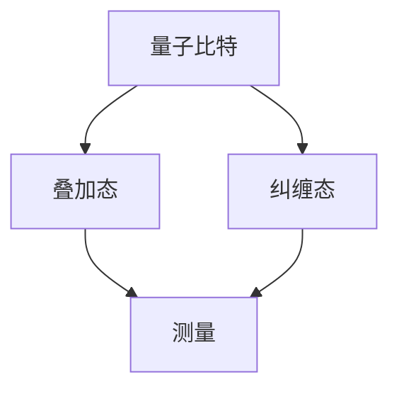
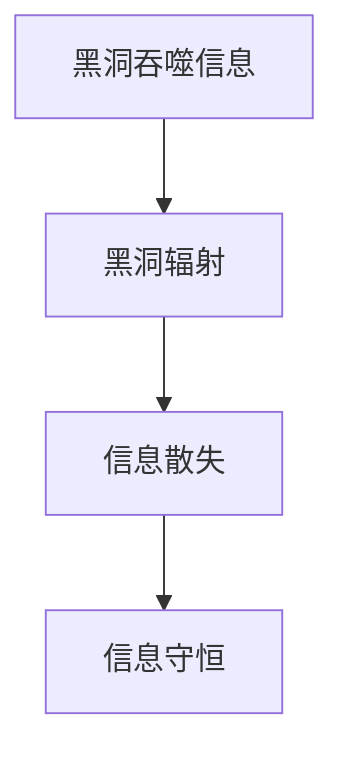
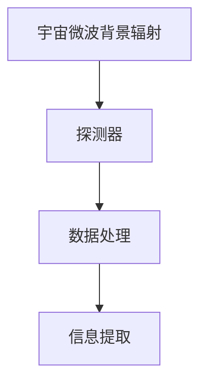
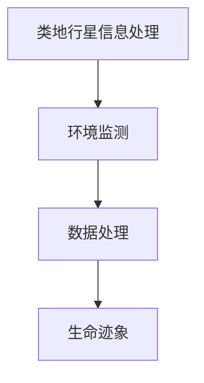

                 

## 文章标题

《宇宙的信息处理能力：类比超级计算机》

## 关键词

宇宙、信息处理、超级计算机、量子计算、人工智能、航天科技、智能生命、未来展望

## 摘要

宇宙的信息处理能力是一个引人入胜的研究领域，它不仅关乎我们对于宇宙的理解，也与我们人类科技的发展息息相关。本文通过类比超级计算机，深入探讨宇宙的信息处理能力，从宇宙信息处理的背景、基本原理、重要性、应用前景，到宇宙信息处理机制、与智能生命的关联，以及人类科技与宇宙信息处理的融合，全面解析宇宙信息处理能力的奥秘。通过分析量子计算、人工智能、航天科技等领域的实际案例，展望宇宙信息处理能力的未来发展趋势，为读者呈现一幅宇宙信息处理能力的全景图。本文旨在引发读者对于宇宙与科技之间关系的深入思考，探讨宇宙信息处理能力在推动人类文明进步中的潜在作用。

## 第一部分：宇宙信息处理能力概述

### 第1章：宇宙信息处理能力探秘

#### 1.1 宇宙信息处理的背景

宇宙作为一个复杂而庞大的系统，其内部的信息处理能力一直是科学家们探索的热点。从宇宙大爆炸的初始状态，到如今宇宙的多样性和复杂性，每一个过程都伴随着大量的信息处理。宇宙信息处理的背景可以追溯到宇宙诞生的那一刻，随着宇宙的膨胀和演化，信息在宇宙中不断传递、转化和存储。

宇宙信息处理的研究不仅有助于我们更好地理解宇宙本身，还能为人类科技的发展提供新的思路。通过对宇宙信息处理机制的研究，我们可以类比超级计算机的工作原理，探讨如何提升信息处理效率，从而推动人类科技的发展。

#### 1.2 宇宙信息处理的基本原理

宇宙信息处理的基本原理可以类比于计算机的基本原理，即信息的获取、处理、存储和传输。在宇宙中，信息主要通过以下几种方式存在和传递：

1. **量子纠缠**：量子纠缠是一种非局域性现象，两个或多个量子粒子之间即使相隔遥远，也会保持某种相关性。这种相关性使得量子纠缠成为宇宙信息处理的重要手段。

2. **黑洞信息丢失悖论**：黑洞是宇宙中的一种极端现象，它对信息的处理具有独特的方式。黑洞信息丢失悖论探讨了黑洞如何处理和存储信息，这对于理解宇宙信息处理的基本原理具有重要意义。

3. **宇宙微波背景辐射**：宇宙微波背景辐射是宇宙早期信息的重要记录，通过对宇宙微波背景辐射的研究，我们可以获取关于宇宙早期状态的信息。

4. **类地行星**：类地行星是宇宙中可能存在生命的地方，它们的信息处理能力为我们提供了探索宇宙生命的一个窗口。

#### 1.3 宇宙信息处理的重要性

宇宙信息处理的重要性体现在多个方面：

1. **科学研究**：通过对宇宙信息处理的研究，我们可以深入了解宇宙的起源、演化和结构，推动天文学、物理学等科学领域的发展。

2. **科技发展**：宇宙信息处理原理的类比有助于我们提升计算机和人工智能等技术的信息处理能力，从而推动科技的发展。

3. **智能生命探索**：通过研究宇宙信息处理能力，我们可以更好地理解智能生命的本质，探索宇宙中可能存在的其他智能生命。

4. **社会进步**：宇宙信息处理能力的提升将带来新的科技革命，推动社会进步，提高人类生活质量。

#### 1.4 类比超级计算机的意义

将宇宙信息处理能力类比于超级计算机，有助于我们更好地理解和研究宇宙信息处理。超级计算机作为现代科技的巅峰，其强大的信息处理能力在多个领域发挥了重要作用。类比超级计算机，我们可以从以下几个方面探讨宇宙信息处理能力的提升：

1. **硬件升级**：类似于超级计算机，宇宙的信息处理能力也依赖于硬件的升级，如量子计算机的发展。

2. **算法优化**：优化信息处理算法是提升信息处理效率的关键。宇宙信息处理机制的研究有助于我们开发更高效的算法。

3. **系统整合**：类似于超级计算机的分布式计算，宇宙的信息处理也可以通过整合各种信息源，实现更高效的信息处理。

4. **人机协同**：在宇宙信息处理中，人类的智慧和技术手段可以与宇宙自身的机制相结合，实现人机协同的信息处理。

### 总结

本章通过对宇宙信息处理能力的背景、基本原理、重要性及类比超级计算机的意义进行探讨，为后续章节的内容奠定了基础。在接下来的章节中，我们将进一步深入分析宇宙中的信息载体、信息处理机制、与智能生命的关联以及与人类科技的融合，全面揭示宇宙信息处理能力的奥秘。

### 第2章：宇宙中的信息载体

#### 2.1 量子纠缠与量子信息

量子纠缠是量子力学中的一种特殊现象，指的是两个或多个量子粒子在某一量子态下，它们的量子状态相互关联，即使相隔遥远，一个粒子的状态变化也能立即影响到另一个粒子的状态。量子纠缠是宇宙信息处理中极为重要的一部分，因为它为信息的高速传输和计算提供了可能。

量子信息是指基于量子力学原理进行的信息处理和传输，包括量子比特（qubit）、量子纠缠、量子态叠加等概念。量子比特是量子信息处理的基本单位，它可以同时处于0和1的状态，这与经典比特只能处于0或1的状态截然不同。

在宇宙中，量子纠缠现象广泛应用于信息传输和计算。例如，通过量子纠缠可以实现量子态的远程传输，这在宇宙尺度上具有巨大的潜力。此外，量子纠缠还可以用于量子计算，提高计算效率和解决某些复杂问题。

#### 2.2 黑洞信息丢失悖论与信息守恒

黑洞信息丢失悖论是宇宙信息处理中一个重要的理论问题。根据广义相对论，黑洞是宇宙中最极端的现象，其引力场强大到连光线也无法逃脱。传统观点认为，黑洞在吞噬物质和信息后，这些信息和物质会消失在黑洞内部，从而违反了信息守恒定律。

然而，量子力学中的量子场论表明，黑洞并不是一个完全封闭的系统，它实际上会以霍金辐射的形式向外释放能量和粒子。这种辐射携带了黑洞内部部分信息，表明信息并没有完全消失。但这一过程如何完全实现，以及黑洞是否真的能够保留所有信息，仍然是科学界讨论的热点。

信息守恒定律是宇宙信息处理中的基本原则，它指出信息不能被创造或销毁，只能从一种形式转化为另一种形式。在量子力学中，信息守恒表现为量子态的叠加和纠缠。黑洞信息丢失悖论与信息守恒的冲突，促使科学家们探索更深刻的物理规律。

#### 2.3 宇宙微波背景辐射信息

宇宙微波背景辐射（Cosmic Microwave Background，CMB）是宇宙早期留下的“遗迹”，它包含了宇宙诞生后不到40万年的信息。CMB是由宇宙大爆炸后的热辐射冷却形成的，通过研究CMB，科学家们可以了解宇宙的早期状态和演化过程。

CMB的信息包含宇宙的密度波动、宇宙微波背景辐射的光谱特性、宇宙背景辐射的温度起伏等。通过对CMB的研究，科学家们已经获得了关于宇宙尺度结构、宇宙膨胀速率、暗物质和暗能量等重要信息。

宇宙微波背景辐射信息的研究不仅有助于理解宇宙的起源和演化，还为宇宙信息处理提供了重要的参考。例如，CMB的信息可以被用于设计更高效的宇宙探测技术，以及开发基于宇宙信息的计算模型。

#### 2.4 宇宙信息载体的应用前景

随着科技的发展，宇宙信息载体的应用前景日益广阔。以下是一些可能的应用领域：

1. **宇宙通信**：通过量子纠缠实现的信息传输，可以在宇宙尺度上实现超光速通信，为星际通信提供新的解决方案。

2. **量子计算**：量子计算是未来计算技术的重要发展方向，通过量子纠缠和量子信息处理，可以实现超越经典计算机的计算能力。

3. **宇宙探测**：利用宇宙微波背景辐射等信息载体，可以开发出更先进的宇宙探测技术，探索宇宙的奥秘。

4. **智能生命探索**：通过研究类地行星和其他天体的信息处理能力，可以更好地理解智能生命的本质，甚至有可能发现其他智能生命存在的迹象。

5. **人工智能**：宇宙信息处理能力与人工智能的结合，有望推动人工智能的发展，实现更智能的决策和计算。

#### 总结

本章通过对量子纠缠、黑洞信息丢失悖论、宇宙微波背景辐射信息以及宇宙信息载体的应用前景的探讨，揭示了宇宙信息处理中的关键概念和应用。这些研究不仅深化了我们对宇宙的理解，也为未来的科技发展提供了新的方向。在接下来的章节中，我们将继续探讨宇宙信息处理机制、与智能生命的关联以及人类科技与宇宙信息处理的融合，全面揭示宇宙信息处理能力的奥秘。

### 第3章：宇宙信息处理机制

#### 3.1 宇宙信息的传输与接收

宇宙信息的传输与接收是宇宙信息处理机制的核心组成部分。在宇宙尺度上，信息的传输面临着巨大的挑战，如巨大的距离、恶劣的环境和复杂的干扰。然而，通过一系列独特的方式，宇宙中的信息得以高效传输和接收。

1. **电磁波传输**：电磁波是宇宙中最常见的传输媒介，广泛应用于宇宙信息的传输。例如，光波、无线电波和微波等电磁波可以在真空中传播，不受物质障碍的影响。通过地面和空间望远镜，人类可以接收来自遥远星系和星体的电磁波信号，从而获取宇宙信息。

2. **量子纠缠传输**：量子纠缠传输是一种基于量子力学原理的信息传输方式。通过量子纠缠，两个或多个粒子之间可以建立一种特殊的关联，即使它们相隔遥远。这种关联使得信息可以在瞬间传递，从而实现超光速通信。量子纠缠传输在宇宙通信中具有巨大的潜力，尤其是在星际通信方面。

3. **引力波传输**：引力波是宇宙中另一种重要的传输媒介，由质量和能量加速运动产生。引力波在宇宙中传播速度接近光速，可以传递大量信息。近年来，科学家通过引力波探测实验，成功接收并分析了来自宇宙的引力波信号，这为宇宙信息的传输和接收提供了新的手段。

宇宙信息的接收过程同样复杂，需要克服多种干扰和噪声。为了提高信息接收的准确性，科学家们采用了多种技术，如信号放大、滤波和噪声抑制等。同时，通过多频段、多平台和跨学科的合作，人类能够更全面地接收和处理来自宇宙的信息。

#### 3.2 宇宙信息的处理与存储

宇宙信息的处理与存储是宇宙信息处理机制中的关键环节。宇宙中的信息量庞大且复杂，如何高效地处理和存储这些信息，是科学家们面临的重大挑战。

1. **量子计算处理**：量子计算是基于量子力学原理的一种新型计算模式，具有超越经典计算机的计算能力。通过量子比特的叠加和纠缠，量子计算可以在极短时间内处理海量信息。例如，量子计算可以用于模拟宇宙中的复杂物理过程，如黑洞碰撞、宇宙大爆炸等。此外，量子计算还可以用于解决传统计算机难以处理的优化问题，如宇宙资源分配、天体运动模拟等。

2. **分布式存储**：分布式存储是一种通过多台计算机协同工作来存储和管理数据的方式。在宇宙信息处理中，分布式存储具有巨大的优势。首先，分布式存储可以提高数据的安全性和可靠性，通过多台计算机的冗余备份，确保数据不会因为单点故障而丢失。其次，分布式存储可以实现数据的快速访问和共享，提高数据处理效率。例如，分布式存储系统可以用于存储和管理来自不同天体观测的数据，从而实现全球范围内的数据共享和协同分析。

3. **记忆效应**：宇宙中的许多现象具有记忆效应，即过去的信息对当前状态有持久影响。例如，宇宙微波背景辐射记录了宇宙早期状态的信息，这些信息对当前宇宙的状态产生了深远影响。通过研究这些记忆效应，我们可以更好地理解宇宙的演化和信息处理机制。

宇宙信息的存储还包括长期保存和归档。在宇宙尺度上，信息保存面临着多种挑战，如辐射损伤、温度变化和机械磨损等。为了解决这些问题，科学家们正在研究新型存储材料和技术，如量子存储、光存储和纳米存储等。

#### 3.3 宇宙信息的加密与安全

在宇宙信息传输和存储过程中，信息加密与安全是至关重要的。宇宙环境恶劣，信息容易受到各种干扰和攻击，如电磁干扰、量子攻击和宇宙辐射等。为了确保宇宙信息的保密性和完整性，科学家们采用了多种加密与安全手段。

1. **量子密钥分发**：量子密钥分发是一种基于量子力学原理的安全通信方式。通过量子纠缠，可以在通信双方之间生成共享密钥，确保通信过程的安全。量子密钥分发具有无条件安全性，即使面对强大的量子攻击，也无法破解通信内容。

2. **量子加密算法**：量子加密算法是一种利用量子力学原理的加密技术。量子加密算法可以生成随机的密钥，并利用量子态的叠加和纠缠特性，实现信息的高效加密和传输。量子加密算法在宇宙信息传输中具有巨大的潜力，可以有效防止信息泄露和篡改。

3. **抗干扰技术**：在宇宙环境中，信息传输容易受到各种干扰，如电磁干扰、宇宙辐射和星体遮挡等。为了提高信息传输的可靠性，科学家们采用了多种抗干扰技术，如信号放大、干扰抑制和多重冗余等。

4. **网络安全协议**：宇宙信息处理系统需要遵循一系列网络安全协议，确保信息的完整性和保密性。例如，使用TLS/SSL协议加密通信数据，采用身份验证和访问控制机制等。

#### 3.4 宇宙信息的利用与影响

宇宙信息的利用对人类科技和社会发展产生了深远影响。通过利用宇宙信息，人类可以：

1. **推动科学进步**：宇宙信息为天文学、物理学、化学等领域提供了丰富的数据和研究资源。通过对宇宙信息的分析，科学家们可以揭示宇宙的奥秘，深化对自然规律的理解。

2. **发展新技术**：宇宙信息处理技术可以推动新技术的发展，如量子计算、人工智能、航天科技等。这些新技术不仅可以提升人类对宇宙的理解，还可以应用于地球上的各种实际问题，推动科技和产业的进步。

3. **促进国际合作**：宇宙信息处理的研究需要全球范围内的合作。通过国际合作，科学家们可以分享数据、资源和知识，共同推动宇宙信息处理技术的发展。

4. **改善生活质量**：宇宙信息的利用可以改善人类的生活质量。例如，通过遥感技术，人类可以获取地球表面的环境信息，制定更科学的环保政策；通过卫星通信，人类可以实现全球范围内的即时通信和远程教育。

#### 总结

本章通过对宇宙信息处理机制中信息传输与接收、处理与存储、加密与安全以及利用与影响的探讨，全面揭示了宇宙信息处理机制的奥秘。宇宙信息处理机制的深入研究，不仅有助于我们更好地理解宇宙，还为人类科技和社会发展提供了新的机遇和挑战。

### 第4章：宇宙信息处理与智能生命

#### 4.1 宇宙信息处理与智能生命的关联

宇宙信息处理与智能生命的关联是一个深层次且复杂的议题。从科学的角度来看，宇宙信息处理能力是智能生命发展的重要基础。在探讨这一关联时，我们可以从以下几个方面进行分析：

1. **宇宙信息处理对智能生命发展的促进作用**：宇宙中丰富的信息资源为智能生命的演化提供了重要支持。例如，通过接收和解析电磁波信号，智能生命可以了解星体的运动规律、行星的环境特征等，从而更好地适应和利用宇宙资源。此外，宇宙信息处理能力还促进了智能生命的认知能力和决策能力的提升。

2. **智能生命对宇宙信息处理的贡献**：智能生命在接收、处理和利用宇宙信息方面具有独特优势。通过开发先进的传感器、通信系统和计算设备，智能生命能够更高效地获取和利用宇宙信息。例如，人类已经能够利用卫星、望远镜等设备接收宇宙信号，并通过量子计算和人工智能等技术进行信息处理，这些技术的进步为人类对宇宙的理解提供了新的视角。

3. **宇宙信息处理对智能生命形态的影响**：宇宙信息处理能力的发展对智能生命形态产生了深远影响。在地球上的生物进化过程中，信息处理能力的提升推动了生物多样性的增加。例如，从单细胞生物到复杂的多细胞生物，信息处理能力的增强是生物进化的重要驱动力。同样，在宇宙尺度上，智能生命的发展也可能受到宇宙信息处理能力的驱动，从而产生多样化的智能生命形态。

#### 4.2 类地行星的信息处理能力

类地行星是宇宙中可能存在生命的地方，其信息处理能力的研究具有重要意义。以下是对类地行星信息处理能力的一些探讨：

1. **自然信息处理机制**：类地行星的自然信息处理机制主要包括生物系统、生态系统和地质系统等。这些系统通过生物化学反应、能量流动和物质循环等方式，实现对信息的获取、处理和利用。例如，植物通过光合作用吸收太阳能，并将信息转化为化学能，这是类地行星信息处理的一种自然形式。

2. **人工信息处理系统**：随着科技的进步，人类在类地行星上开始部署各种人工信息处理系统。这些系统包括遥感卫星、自动化探测设备、物联网传感器等。通过这些设备，人类可以实时监测类地行星的环境变化，获取大量数据，并利用人工智能技术对这些数据进行处理和分析。例如，科学家们利用地球上的遥感技术，对类地行星的大气成分、表面特征等进行研究，从而推测其潜在的生命迹象。

3. **信息处理能力与生命宜居性**：类地行星的信息处理能力与其宜居性密切相关。一个类地行星如果具备较强的信息处理能力，那么它更有可能支持生命的存在和演化。例如，具有丰富水资源、适宜温度和稳定大气环境的类地行星，可能更容易支持生命的存在。此外，类地行星的信息处理能力还决定了其抵御外部环境干扰和自然灾害的能力，这对于维持生命的稳定性和可持续性具有重要意义。

#### 4.3 外星生命的信息处理能力推测

外星生命的信息处理能力是科学界广泛探讨的议题，虽然目前尚无确凿的证据，但我们可以通过一系列科学推测来探讨这一问题：

1. **与地球生命的相似性与差异性**：外星生命的信息处理能力可能与地球生命有相似之处，如利用电磁波、光波等信号进行信息传输和处理。然而，外星生命的进化环境和生物结构可能与地球生命截然不同，这可能导致其信息处理机制具有独特的特点。

2. **基于物理定律的推测**：根据物理学的基本定律，外星生命的信息处理能力可能依赖于不同的物理现象和原理。例如，如果外星生命进化在极度寒冷的环境中，它们可能利用低温物理效应进行信息处理。此外，如果外星生命进化在强引力场中，它们可能利用引力波进行信息传输。

3. **智能生命的信息处理水平**：外星生命的智能水平可能远超地球生命。例如，如果外星生命进化出了高度发达的量子计算能力，它们可以在极短时间内处理大量信息。这种高度发达的信息处理能力可能使外星生命具备超乎想象的智能和技术水平。

4. **信息处理能力的多样性**：外星生命的信息处理能力可能具有多样性。例如，不同外星生命可能采用不同的信息处理机制，如生物电信号、化学信号、声波信号等。这种多样性使得外星生命的信息处理能力具有丰富的可能性，也增加了我们探索外星生命的难度。

#### 4.4 宇宙信息处理能力与文明进化

宇宙信息处理能力与文明进化之间存在着密切的关联。以下是对这一关联的探讨：

1. **信息处理能力对文明发展的推动**：宇宙信息处理能力的提升对文明的发展具有巨大的推动作用。例如，古代文明通过观测天象、记录时间，逐渐发展出复杂的历法和天文学知识。在现代，人类通过量子计算和人工智能技术，进一步提升了对宇宙信息的处理能力，推动了科技和产业的快速发展。

2. **文明进化中的信息处理瓶颈**：在文明进化过程中，信息处理能力的提升并非一帆风顺。文明可能面临信息处理能力的瓶颈，如计算资源不足、数据处理效率低等问题。这些瓶颈限制了文明的发展，促使人类不断探索新的信息处理技术和方法。

3. **信息处理能力与文明消亡**：宇宙信息处理能力不仅对文明发展具有推动作用，也可能对文明消亡产生重要影响。例如，过度消耗信息处理资源可能导致资源枯竭、环境污染等问题，最终导致文明的崩溃。此外，信息处理能力不足也可能使文明无法应对外部威胁，从而走向消亡。

4. **文明进化的信息处理路径**：文明进化的信息处理路径可能呈现多样性和复杂性。例如，一个文明可能通过技术革命、文化传承等方式提升信息处理能力。此外，不同文明可能在信息处理能力的发展方向上存在差异，这可能导致文明之间的竞争和合作。

#### 总结

本章通过对宇宙信息处理与智能生命的关联、类地行星的信息处理能力、外星生命的信息处理能力推测以及宇宙信息处理能力与文明进化的探讨，揭示了宇宙信息处理能力在智能生命发展和文明进化中的重要作用。这些探讨不仅深化了我们对宇宙和智能生命的理解，也为未来的宇宙探索和科技发展提供了新的视角和方向。

### 第5章：宇宙信息处理能力与人类科技

#### 5.1 人类科技对宇宙信息处理的贡献

人类科技在推动宇宙信息处理能力方面发挥了重要作用，通过一系列技术创新，人类已经在宇宙信息处理领域取得了显著的进展。以下是人类科技对宇宙信息处理的主要贡献：

1. **通信技术的发展**：人类通信技术的发展为宇宙信息处理提供了强有力的支持。从最早的无线电通信到现代的卫星通信、光纤通信，人类不断突破通信技术的障碍，实现了宇宙间的实时通信。例如，卫星通信使得地面站可以接收来自太空的信号，而光纤通信则提供了高速的数据传输通道，为宇宙信息处理提供了稳定的通信基础。

2. **观测技术的提升**：观测技术的发展使得人类能够更深入地了解宇宙信息。通过地面和空间望远镜，人类可以观测到遥远星系、星体和宇宙现象，获取大量宇宙信息。例如，哈勃太空望远镜和詹姆斯·韦伯太空望远镜的观测成果，为宇宙信息处理提供了丰富的数据资源。

3. **计算能力的提升**：计算能力的提升是宇宙信息处理的关键。从早期的计算机到现代的超级计算机，人类计算能力不断提高，使得复杂的信息处理任务成为可能。例如，量子计算机的发展为宇宙信息处理提供了新的工具，其超强的计算能力有望解决传统计算机难以处理的复杂问题。

4. **人工智能的应用**：人工智能技术在宇宙信息处理中的应用日益广泛。通过机器学习和深度学习算法，人工智能可以自动分析和处理大量宇宙数据，提取有用信息。例如，人工智能在图像识别、信号处理和数据分析等领域取得了显著成果，为宇宙信息处理提供了强大的支持。

5. **航天技术的发展**：航天技术的发展为宇宙信息处理提供了新的平台。通过发射卫星、探测器等航天器，人类可以近距离观测和研究宇宙现象，获取宝贵的数据。例如，火星探测器和木星探测器等任务，不仅为人类带来了丰富的宇宙信息，还推动了航天技术的进步。

#### 5.2 人工智能与宇宙信息处理的融合

人工智能与宇宙信息处理的融合是一个重要的发展方向，两者相互促进，共同推动科技和社会的进步。以下是对这一融合的探讨：

1. **大数据分析**：宇宙信息处理面临海量数据的问题，人工智能的引入为大数据分析提供了新的解决方案。通过深度学习、数据挖掘等技术，人工智能可以自动分析海量宇宙数据，提取有用信息。例如，人工智能在分析宇宙微波背景辐射数据、探测外星信号等方面表现出色。

2. **智能决策**：人工智能在宇宙信息处理中的应用可以辅助科学家做出更准确的决策。例如，通过模拟和预测宇宙现象，人工智能可以帮助科学家制定探测计划和科学研究方案，提高研究的效率。

3. **自主探测**：人工智能在航天器中的应用使得自主探测成为可能。通过自主决策和行动，航天器可以独立完成观测任务，减少对地面站的依赖。例如，人工智能在火星探测任务中的应用，使得航天器能够自主识别和规避障碍物，提高探测的成功率。

4. **量子计算**：人工智能与量子计算的融合为宇宙信息处理带来了新的机遇。量子计算具有超强的计算能力，可以解决传统计算机难以处理的复杂问题。例如，量子计算可以用于模拟宇宙中的复杂物理过程，为宇宙信息处理提供强有力的支持。

5. **多学科交叉**：人工智能与宇宙信息处理的融合促进了多学科交叉研究，推动了科技和社会的进步。例如，通过人工智能技术，科学家可以更好地理解宇宙现象，开发新的航天技术，推动人类探索宇宙的步伐。

#### 5.3 宇宙信息处理技术对地球文明的影响

宇宙信息处理技术对地球文明的影响深远，通过以下方面体现了其重要性：

1. **科学认知**：宇宙信息处理技术为人类提供了了解宇宙、探索宇宙的新工具。通过对宇宙信息的分析，人类可以揭示宇宙的奥秘，深化对自然规律的理解。例如，通过分析宇宙微波背景辐射数据，科学家揭示了宇宙的起源和演化过程。

2. **技术创新**：宇宙信息处理技术的进步推动了地球上的技术创新。例如，量子计算技术的发展为计算机科学、材料科学等领域提供了新的思路，推动了技术的突破。此外，宇宙信息处理技术的应用还促进了遥感技术、航天技术等的发展。

3. **社会发展**：宇宙信息处理技术对地球社会的发展产生了深远影响。例如，通过卫星通信和遥感技术，人类可以更好地监测和管理地球资源，提高环境保护和资源利用的效率。此外，宇宙信息处理技术还推动了全球合作，促进了科学技术的共享和交流。

4. **文明进步**：宇宙信息处理技术的进步为地球文明的进步提供了新动力。通过不断探索宇宙，人类可以拓宽视野，激发创新思维，推动社会和科技的进步。例如，宇宙探索激发了人类对未知世界的探索欲望，推动了科技的发展和应用。

#### 5.4 宇宙信息处理能力在未来科技中的应用

宇宙信息处理能力在未来科技中具有广泛的应用前景，以下是一些潜在的应用领域：

1. **星际旅行**：随着宇宙信息处理能力的提升，星际旅行成为可能。通过量子通信和量子计算技术，人类可以建立高效的星际通信网络，实现实时的星际通信。此外，人工智能在星际旅行中的应用可以辅助航天器自主导航、规避障碍，提高星际旅行的安全性。

2. **宇宙资源开发**：宇宙信息处理技术可以用于开发宇宙资源，如月球、火星等行星的矿物、水资源等。通过遥感技术和自动化探测设备，人类可以高效地获取和利用宇宙资源，为地球提供新的资源来源。

3. **地球环境监测**：宇宙信息处理技术可以用于地球环境监测，如大气、海洋和陆地的环境监测。通过卫星遥感技术和人工智能算法，人类可以实时获取地球环境数据，制定更科学的环保政策和措施。

4. **智能城市**：宇宙信息处理技术在智能城市中的应用前景广阔。通过物联网技术和大数据分析，人类可以实现城市的智能化管理，提高城市运行的效率和质量。例如，智能交通系统、智能安防系统等都是宇宙信息处理技术在城市中的应用案例。

5. **医疗健康**：宇宙信息处理技术在医疗健康领域的应用也非常重要。通过人工智能和大数据分析，人类可以开发出更精准的医学诊断和治疗方案，提高医疗服务的质量和效率。

#### 总结

本章通过对人类科技对宇宙信息处理的贡献、人工智能与宇宙信息处理的融合、宇宙信息处理技术对地球文明的影响以及未来科技中的应用的探讨，揭示了宇宙信息处理能力在推动人类科技和社会发展中的重要作用。随着科技的不断进步，宇宙信息处理能力将继续为人类带来新的机遇和挑战。

### 第6章：量子计算与宇宙信息处理

#### 6.1 量子计算的基本原理

量子计算是一种基于量子力学原理的新型计算模式，其基本原理与经典计算有显著区别。在经典计算中，信息以比特的形式存储和处理，而量子计算则利用量子比特（qubit）来实现。

1. **量子比特**：量子比特是量子计算的基本单位，它可以同时处于0和1的状态，这种状态称为叠加态。例如，一个量子比特可以处于 \(|0\rangle + |1\rangle\) 的叠加态。这种叠加态使得量子计算能够同时处理大量信息，从而大大提高计算效率。

2. **量子纠缠**：量子纠缠是量子计算中的另一个重要概念。当两个或多个量子比特相互纠缠时，它们的状态将不可分割地联系在一起。这意味着一个量子比特的状态变化会立即影响到与之纠缠的其他量子比特。量子纠缠在量子计算中用于实现并行计算和高效的信息传输。

3. **量子门**：量子门是量子计算中的基本操作单元，类似于经典计算中的逻辑门。量子门通过线性变换操作量子比特的状态，从而实现特定的计算功能。常见的量子门包括 Hadamard 门、Pauli 门和控制-NOT（CNOT）门等。

#### 6.2 量子计算机与宇宙信息处理的联系

量子计算机与宇宙信息处理之间存在着紧密的联系。以下是一些关键点：

1. **高速计算**：量子计算机具有超强的计算能力，能够在极短时间内解决某些复杂问题。例如，量子计算机可以高效地模拟宇宙中的复杂物理过程，如黑洞碰撞和宇宙大爆炸等。这为宇宙信息处理提供了强有力的工具。

2. **并行计算**：量子计算机利用量子比特的叠加态实现并行计算，可以在同一时间处理多个计算任务。这对于处理宇宙中的海量信息具有重要意义，例如，在分析大量的天文数据时，量子计算机可以显著提高数据处理速度。

3. **量子纠缠传输**：量子计算机利用量子纠缠实现信息的高速传输。通过量子纠缠，两个量子比特之间的状态可以瞬间同步，这为宇宙信息处理提供了新的传输方式，尤其是在星际通信领域具有巨大潜力。

4. **量子加密**：量子计算机可以用于实现安全的量子加密，保护宇宙信息传输的安全。量子密钥分发技术利用量子纠缠生成安全的密钥，确保信息在传输过程中不会被窃听或篡改。

#### 6.3 量子计算在宇宙信息处理中的应用

量子计算在宇宙信息处理中具有广泛的应用，以下是一些具体的应用领域：

1. **天体物理模拟**：量子计算可以用于模拟宇宙中的复杂物理现象，如黑洞碰撞、宇宙大爆炸等。传统计算机由于计算能力有限，难以模拟这些现象，而量子计算机则可以高效地完成这些任务，为科学家提供更深入的理解。

2. **天文数据分析**：量子计算可以加速天文数据分析，处理来自天文观测的大量数据。例如，通过量子算法，科学家可以更快地识别星体的运动轨迹、分析星系的结构等，从而提高天文研究的效率。

3. **星际通信**：量子计算可以用于实现量子通信，提高星际通信的效率和安全性。通过量子纠缠传输，量子计算机可以实现超光速的信息传输，为星际通信提供新的解决方案。

4. **宇宙资源勘探**：量子计算可以用于勘探宇宙资源，如月球、火星等行星的矿物和水资源。通过量子传感器和量子算法，科学家可以更准确地探测和评估宇宙资源，为资源开发提供科学依据。

#### 6.4 量子计算的挑战与未来发展方向

量子计算虽然具有巨大的潜力，但也面临诸多挑战：

1. **量子纠错**：量子计算中容易受到外界干扰，导致量子比特的状态发生变化，这被称为量子噪声。为了确保计算结果的准确性，需要开发有效的量子纠错技术，减少量子噪声的影响。

2. **量子硬件**：量子计算机需要高度精确的量子硬件支持，包括低温环境、高精度的量子比特等。目前，量子硬件的发展还面临许多技术难题，如量子比特的稳定性和可扩展性等。

3. **算法优化**：量子计算算法的设计和优化也是一个重要挑战。虽然已有一些量子算法取得了显著成果，但如何设计更高效的量子算法，以解决更复杂的实际问题，仍然是科学界的研究方向。

未来发展方向包括：

1. **量子硬件的突破**：通过新材料、新技术的研发，提高量子比特的稳定性和可扩展性，实现更大规模的量子计算机。

2. **量子算法的创新**：继续探索和优化量子算法，解决更多实际应用问题，如量子化学、量子优化等。

3. **量子网络的建设**：通过量子通信和量子计算机的协同工作，建立量子网络，实现全球范围内的量子信息处理。

4. **量子计算的产业应用**：推动量子计算在各个领域的应用，如金融、医疗、航天等，促进量子计算产业的发展。

#### 总结

本章通过对量子计算的基本原理、与宇宙信息处理的联系、量子计算在宇宙信息处理中的应用以及量子计算的挑战与未来发展的探讨，全面揭示了量子计算在宇宙信息处理中的重要作用。随着量子计算技术的不断进步，它将在宇宙信息处理领域发挥越来越重要的作用，为人类探索宇宙的奥秘提供新的工具。

### 第7章：宇宙信息处理与人工智能

#### 7.1 人工智能的发展历程

人工智能（AI）是计算机科学的一个分支，旨在使计算机具备智能行为，模拟人类的认知过程。人工智能的发展历程可以分为几个主要阶段：

1. **早期探索（1950年代至1970年代）**：1950年代，艾伦·图灵提出了“图灵测试”，标志着人工智能研究的正式开始。这一时期的研究主要集中在符号主义和逻辑推理上，如规则推理系统和符号计算。

2. **繁荣时期（1980年代至1990年代）**：随着计算机性能的提升和大数据技术的发展，机器学习成为人工智能研究的主流方向。这一时期，神经网络、支持向量机、决策树等算法取得了显著进展，为人工智能的应用奠定了基础。

3. **新一轮繁荣（2000年代至今）**：随着深度学习技术的发展，人工智能进入新一轮繁荣期。深度学习通过多层神经网络进行数据建模，在图像识别、语音识别、自然语言处理等领域取得了突破性成果。这一时期，人工智能的应用逐渐从实验室走向实际生产生活，如自动驾驶、智能客服、智能医疗等。

#### 7.2 人工智能与宇宙信息处理的融合

人工智能与宇宙信息处理的融合是当前科技领域的前沿方向，两者相互促进，推动了宇宙探索和科技发展。以下是对这一融合的探讨：

1. **数据处理能力**：人工智能具有强大的数据处理能力，可以处理海量宇宙数据。例如，通过机器学习算法，人工智能可以自动分析和分类天文图像，识别星体和宇宙现象。这种高效的数据处理能力为宇宙信息处理提供了强有力的支持。

2. **自动化分析**：人工智能在自动化分析方面具有显著优势，可以替代人类进行重复性和复杂的分析任务。例如，人工智能可以自动分析天文观测数据，提取有用信息，为科学家提供重要参考。

3. **预测与模拟**：人工智能可以通过学习历史数据，进行预测和模拟，帮助科学家预测宇宙现象的发生和发展。例如，通过深度学习算法，人工智能可以预测行星轨道的变化，为航天任务提供精确的导航数据。

4. **智能决策**：人工智能可以帮助科学家做出更智能的决策，提高科研效率。例如，在航天任务中，人工智能可以分析多种探测方案，推荐最优的探测路径，减少资源浪费。

5. **跨学科应用**：人工智能与宇宙信息处理的融合促进了多学科交叉研究，推动了科技创新。例如，人工智能可以用于医学成像、环境监测等领域，这些领域的进步也为宇宙信息处理提供了新的思路和方法。

#### 7.3 宇宙信息处理能力对人工智能的影响

宇宙信息处理能力的提升对人工智能的发展具有重要影响，以下是一些具体的影响：

1. **数据量的增加**：宇宙信息处理能力的提升带来了海量的数据，这些数据为人工智能提供了丰富的训练资源。大量数据的积累有助于人工智能算法的改进和优化，提高其性能和准确性。

2. **计算能力的增强**：量子计算和超级计算机的发展为人工智能提供了强大的计算支持。通过量子计算，人工智能可以更高效地处理复杂问题，解决传统计算机难以处理的任务。

3. **算法的创新**：宇宙信息处理能力的提升推动了人工智能算法的创新。例如，量子算法的引入为人工智能提供了新的计算范式，有望解决更多复杂问题。

4. **应用领域的扩展**：宇宙信息处理能力的提升扩大了人工智能的应用领域，如遥感技术、航天任务等。这些领域的应用不仅提高了人工智能的技术水平，也为人工智能的发展提供了新的机会。

#### 7.4 宇宙信息处理能力在人工智能中的应用

宇宙信息处理能力在人工智能中的应用日益广泛，以下是一些具体的应用案例：

1. **图像识别**：在宇宙探索中，图像识别是一个重要任务。人工智能通过学习大量宇宙图像数据，可以自动识别星体、行星、星系等天体，提高探测和观测的效率。

2. **语音识别**：语音识别技术在宇宙通信和航天任务中具有重要意义。人工智能可以通过学习语音信号，实现语音到文本的转换，为航天员和地面指挥中心提供实时通讯支持。

3. **自然语言处理**：自然语言处理技术在宇宙信息处理中用于处理和解析天文学文献、观测日志等文本数据。人工智能可以通过分析这些文本数据，提取有用信息，为科学家提供研究支持。

4. **自动驾驶**：在航天任务中，自动驾驶技术可以用于航天器的自主导航和操作。人工智能通过学习大量的空间数据和环境信息，可以实现航天器的自动驾驶，提高任务的成功率。

5. **智能监控**：智能监控技术在航天任务中用于实时监控航天器的状态和运行环境。人工智能可以通过分析监控数据，发现异常情况，提供预警和应急处理支持。

#### 总结

本章通过对人工智能的发展历程、与宇宙信息处理的融合、宇宙信息处理能力对人工智能的影响以及宇宙信息处理能力在人工智能中的应用的探讨，揭示了人工智能在宇宙信息处理中的重要地位和作用。随着人工智能技术的不断进步，它将在宇宙信息处理领域发挥越来越重要的作用，推动人类对宇宙的探索和科技的发展。

### 第8章：宇宙信息处理与航天科技

#### 8.1 航天科技的发展历程

航天科技的发展历程是科技进步的缩影，从最初的火箭发射到现代的航天器任务，航天科技不断推动人类对宇宙的认知。以下是对航天科技发展历程的简要回顾：

1. **早期探索（1950年代至1960年代）**：这一时期，人类开始了载人航天和卫星发射的尝试。1957年，苏联成功发射了世界上第一颗人造卫星“斯普特尼克1号”，开启了航天科技的新纪元。随后，美国和苏联展开了激烈的太空竞赛，推动了航天科技的迅速发展。

2. **太空探索（1960年代至1970年代）**：这一时期，人类开始了月球探索和行星探测。1969年，美国成功登陆月球，实现了人类历史上的一个重大里程碑。同时，苏联和美国的航天器也成功探测了金星、火星等行星，获取了大量宝贵的数据。

3. **太空站和深空探索（1970年代至1990年代）**：这一时期，人类开始建设太空站，开展深空探测任务。国际空间站（ISS）的建成标志着人类在太空探索方面的又一重要成就。同时，航天器也成功探测了木星、土星等行星的卫星，揭示了这些行星的奥秘。

4. **新千年后的航天科技（2000年代至今）**：这一时期，航天科技进入了新的发展阶段。量子通信、航天器自主导航、空间太阳能电站等新技术开始应用。同时，商业航天公司如SpaceX、Blue Origin等崛起，推动了航天科技的进一步发展。

#### 8.2 航天科技与宇宙信息处理的联系

航天科技与宇宙信息处理之间存在着紧密的联系，两者相互促进，共同推动了人类对宇宙的认知。以下是对这一联系的探讨：

1. **信息传输**：航天器在太空中进行信息传输，需要克服巨大的距离和复杂的干扰。宇宙信息处理技术，如量子通信、电磁波传输等，为航天器的信息传输提供了可靠的解决方案。通过量子通信，航天器可以实现超光速的信息传输，提高通信的效率。

2. **数据处理**：航天器获取的大量数据需要高效的处理和分析。人工智能和大数据技术在航天科技中的应用，使得航天器能够自动分析和处理这些数据，提高科学研究的效率。

3. **自主导航**：航天器在太空中需要自主导航，以避免与其他航天器发生碰撞。量子计算和人工智能技术在航天器自主导航中的应用，使得航天器能够实时计算和调整轨道，提高导航的准确性。

4. **信息存储**：航天器需要长时间在太空中运行，信息存储的可靠性至关重要。分布式存储技术和量子存储技术为航天器的信息存储提供了可靠的方法，确保数据的安全性和完整性。

5. **任务规划**：航天任务涉及复杂的任务规划和调度。通过人工智能和大数据分析，航天任务可以更加高效地规划，提高任务的成功率和资源利用率。

#### 8.3 宇宙信息处理能力在航天科技中的应用

宇宙信息处理能力在航天科技中的应用日益广泛，以下是一些具体的应用领域：

1. **通信**：航天器之间的通信是航天任务的重要组成部分。通过量子通信技术，航天器可以实现超光速的信息传输，提高通信的效率和安全。同时，电磁波传输技术也广泛应用于航天器的通信，确保信息的可靠传输。

2. **导航**：航天器的导航需要实时计算和调整轨道。量子计算和人工智能技术在航天器自主导航中的应用，使得航天器能够更加精准地计算轨道，提高导航的准确性。

3. **科学实验**：航天器在太空中进行各种科学实验，需要高效地处理和分析实验数据。通过大数据分析和人工智能技术，航天器可以自动分析和处理实验数据，提取有用信息，提高科学研究的效率。

4. **资源探测**：航天器在太空中进行资源探测，需要识别和分析各种资源。通过图像识别、光谱分析等技术，航天器可以自动识别和提取资源信息，为资源开发提供科学依据。

5. **航天任务管理**：航天任务的规划和管理需要高效的信息处理能力。通过大数据分析和人工智能技术，航天任务可以更加科学地规划和管理，提高任务的成功率和资源利用率。

#### 8.4 航天科技对宇宙信息处理能力的推动

航天科技的发展不断推动着宇宙信息处理能力的提升，以下是一些具体的表现：

1. **技术创新**：航天科技的发展带动了各种新技术的研发和应用，如量子通信、量子计算、人工智能等。这些技术的进步为宇宙信息处理提供了更高效、更安全的解决方案。

2. **数据处理能力**：航天器获取的大量数据需要高效的处理和分析。通过大数据分析和人工智能技术，航天器可以自动分析和处理这些数据，提高科学研究的效率。

3. **信息传输速度**：航天器的信息传输需要克服巨大的距离和复杂的干扰。量子通信技术的应用，使得航天器可以实现超光速的信息传输，提高通信的效率。

4. **自主导航能力**：航天器在太空中需要自主导航，以避免与其他航天器发生碰撞。量子计算和人工智能技术在航天器自主导航中的应用，使得航天器能够更加精准地计算轨道，提高导航的准确性。

5. **国际合作**：航天科技的发展促进了国际间的合作。通过国际合作，各国可以共享数据和资源，共同推动宇宙信息处理技术的发展。

#### 总结

本章通过对航天科技的发展历程、与宇宙信息处理的联系、宇宙信息处理能力在航天科技中的应用以及航天科技对宇宙信息处理能力的推动的探讨，揭示了航天科技在推动宇宙信息处理能力提升中的重要作用。随着航天科技的不断发展，宇宙信息处理能力将继续提升，为人类探索宇宙的奥秘提供更强有力的支持。

### 第9章：宇宙信息处理能力的未来展望

#### 9.1 宇宙信息处理能力的未来发展趋势

宇宙信息处理能力在未来将继续快速发展，其趋势可以从以下几个方面进行展望：

1. **量子计算技术的突破**：量子计算作为未来计算技术的关键，将在宇宙信息处理中发挥重要作用。随着量子比特数量和稳定性的提升，量子计算机的计算能力将大幅增强，有望解决目前传统计算机难以处理的问题。

2. **人工智能与大数据的深度融合**：人工智能与大数据的结合将为宇宙信息处理带来新的机遇。通过深度学习和机器学习算法，人工智能可以更高效地处理和分析海量宇宙数据，提供更准确的科学预测和决策支持。

3. **网络化与分布式处理**：随着航天器和地面设施的不断完善，宇宙信息处理将趋向网络化和分布式处理。通过构建全球范围内的信息处理网络，可以实时共享和协同处理宇宙数据，提高信息处理的效率和安全性。

4. **跨学科研究与应用**：宇宙信息处理能力的提升将促进多学科交叉研究，如量子物理、天文学、计算机科学等。这些交叉领域的融合将为宇宙信息处理提供新的理论和应用突破。

5. **商业与公共部门的共同推动**：随着商业航天公司的崛起，公共部门和商业部门将共同推动宇宙信息处理技术的发展。商业航天公司将带来新的技术需求和投资，而公共部门则将在科研和基础设施建设方面发挥主导作用。

#### 9.2 宇宙信息处理能力对人类社会的潜在影响

宇宙信息处理能力的提升将对人类社会产生深远影响，以下是一些潜在的影响：

1. **科技进步**：宇宙信息处理能力的发展将推动科技领域的创新，如量子计算、人工智能、材料科学等。这些技术的进步将为人类社会带来新的发展机遇。

2. **经济变革**：宇宙信息处理技术将带来新的产业机会，如商业航天、量子通信、太空旅游等。这些新兴产业将为全球经济注入新的动力，推动经济结构的升级和转型。

3. **社会治理**：宇宙信息处理技术可以用于改善社会治理，如智能交通、智慧城市、环境监测等。通过大数据分析和人工智能技术，政府可以更加高效地管理和服务社会，提高社会管理的科学性和人性化。

4. **文化交流**：宇宙信息处理技术将促进全球文化的交流和互动。通过宇宙信息的传播，人类可以更好地了解不同文化背景下的宇宙认知和科技发展，推动全球文化的多样性和包容性。

5. **环境保护**：宇宙信息处理技术可以用于环境保护，如气候变化监测、灾害预警等。通过遥感技术和大数据分析，人类可以更准确地掌握环境变化，制定更科学的环保政策。

#### 9.3 宇宙信息处理能力的国际合作与竞争

宇宙信息处理能力的发展离不开国际合作与竞争。以下是对这一方面的探讨：

1. **国际合作**：宇宙信息处理领域的复杂性和高昂的成本需要国际合作。通过国际合作，各国可以共享资源、知识和技术，共同推动宇宙信息处理能力的发展。例如，国际空间站的建设和运营就是一个成功的国际合作案例。

2. **竞争与合作并存**：虽然国际合作是主流，但在宇宙信息处理领域也存在着竞争。各国为了在科技和航天领域占据优势，会投入大量资源进行自主研发。然而，竞争并不意味着对抗，通过合作与竞争的相互促进，可以推动宇宙信息处理能力的整体提升。

3. **国际合作机制**：为了更好地协调和推动宇宙信息处理能力的国际合作，需要建立有效的国际合作机制。例如，制定国际标准和协议，促进技术和数据的共享，加强国际合作项目管理等。

4. **竞争策略**：在国际竞争中，各国需要制定合理的竞争策略，以保持领先地位。这包括加大科研投入、推动技术创新、培养高水平人才等。同时，也需要关注国际市场的动态，制定灵活的竞争策略，以应对外部挑战。

#### 9.4 宇宙信息处理能力的伦理、法律与安全挑战

宇宙信息处理能力的发展也带来了诸多伦理、法律与安全挑战，以下是一些关键问题：

1. **数据隐私与安全**：随着宇宙信息处理能力的提升，大量的宇宙数据将被收集和处理。如何保护这些数据的安全和隐私，防止数据泄露和滥用，是一个重要挑战。

2. **数据伦理**：在处理和利用宇宙数据时，需要遵循数据伦理原则，尊重个人隐私和知识产权。此外，宇宙信息处理过程中涉及到的跨学科数据共享和合作，也需要建立明确的数据伦理规范。

3. **法律责任**：随着宇宙信息处理技术的发展，各国需要制定相应的法律法规，明确责任和义务，确保在数据收集、处理和利用过程中的合法性和合规性。

4. **信息安全**：宇宙信息处理系统需要具备强大的信息安全防护能力，防止黑客攻击和恶意软件的入侵。此外，针对量子计算等新兴技术的安全挑战，需要开发新的安全防护技术和策略。

5. **国际合作与竞争**：在宇宙信息处理领域，国际合作与竞争并存。在推动国际合作的同时，也需要防范潜在的竞争风险，确保国际合作的稳定性和可持续性。

#### 总结

本章通过对宇宙信息处理能力的未来发展趋势、对人类社会的潜在影响、国际合作与竞争以及伦理、法律与安全挑战的探讨，揭示了宇宙信息处理能力在未来发展中的重要作用和面临的挑战。随着科技的不断进步和国际合作的深化，宇宙信息处理能力将继续提升，为人类社会的进步和探索提供强大的支持。

### 附录A：宇宙信息处理能力相关资源

#### A.1 宇宙信息处理能力研究机构

1. **欧洲空间局（ESA）**：ESA是欧洲主要的航天机构，负责多项宇宙信息处理相关的研究和项目，如量子通信和人工智能在航天器中的应用。

2. **美国国家航空航天局（NASA）**：NASA是全球领先的航天机构，致力于宇宙信息处理技术的研发和应用，包括航天器通信、遥感技术和人工智能等。

3. **中国科学院**：中国科学院是中国的主要科学研究中心，在宇宙信息处理领域开展了大量研究，包括量子计算、大数据分析等。

4. **欧洲量子旗（EU Quantum Flagship）**：这是一个欧洲联盟资助的量子科技研究计划，涵盖量子计算、量子通信和量子信息处理等多个领域。

5. **量子计算联盟（Quantum Computing Group）**：这是一个由多个机构和大学组成的联盟，专注于量子计算在宇宙信息处理中的应用研究。

#### A.2 宇宙信息处理能力研究论文集

1. **《量子信息处理》**：这是一本涵盖量子计算、量子通信和量子信息处理的国际学术期刊，发表了大量关于宇宙信息处理的研究论文。

2. **《天体物理学杂志》**：这是一本涵盖天文学和宇宙学的顶级学术期刊，其中包括许多与宇宙信息处理相关的论文。

3. **《人工智能》**：这是一本涵盖人工智能各个领域的国际学术期刊，也包括许多关于人工智能在宇宙信息处理中应用的论文。

4. **《宇宙信息学》**：这是一本新兴的学术期刊，专注于宇宙信息学的研究，包括宇宙信息处理、量子宇宙学等领域。

5. **《航天科技与航天器》**：这是一本涵盖航天科技和航天器设计的国际学术期刊，其中包括关于航天器信息处理和通信的论文。

#### A.3 宇宙信息处理能力相关书籍推荐

1. **《量子计算：理论与实践》**：这是一本介绍量子计算基础理论和应用的经典书籍，包括量子算法、量子计算机的设计等。

2. **《宇宙信息学导论》**：这是一本关于宇宙信息学的基础教材，介绍了宇宙信息处理的基本概念、原理和应用。

3. **《人工智能：一种现代的方法》**：这是一本广泛使用的教材，涵盖了人工智能的基础理论和应用方法，包括机器学习、自然语言处理等。

4. **《航天工程原理》**：这是一本关于航天工程原理的教材，介绍了航天器设计、通信和导航等方面的基本知识。

5. **《量子通信：原理与应用》**：这是一本关于量子通信的基础教材，介绍了量子通信的原理、技术和应用。

#### A.4 宇宙信息处理能力相关网络资源

1. **NASA官方网站**：NASA提供了大量的宇宙信息处理相关的研究论文、报告和新闻，是获取宇宙信息处理领域最新进展的重要渠道。

2. **欧洲空间局（ESA）官方网站**：ESA官方网站提供了关于量子通信、遥感技术和人工智能在航天中的应用等信息。

3. **欧洲量子旗（EU Quantum Flagship）官方网站**：这是一个提供量子科技研究最新进展、项目信息和相关资源的官方网站。

4. **Quantum Computing Group官方网站**：这是一个由多个机构和大学组成的联盟官方网站，提供了量子计算在宇宙信息处理中的应用研究信息。

5. **Astronomy Stack Exchange**：这是一个关于天文学和宇宙学的问答社区，用户可以提问和解答关于宇宙信息处理的问题。

### 附录B：核心概念与联系

#### B.1 量子纠缠与量子信息

**Mermaid流程图**：量子纠缠的基本原理与实现



**核心概念解析**：
- **量子比特（Qubit）**：量子比特是量子计算的基本单位，它可以处于0和1的叠加态。
- **叠加态**：量子比特可以同时处于0和1的状态，这种状态称为叠加态。
- **纠缠态**：当两个或多个量子比特相互纠缠时，它们的状态将不可分割地联系在一起，称为纠缠态。
- **测量**：对量子比特进行测量，将叠加态或纠缠态转化为确定的0或1状态。

#### B.2 黑洞信息丢失悖论与信息守恒

**Mermaid流程图**：黑洞信息丢失悖论的理论解析



**核心概念解析**：
- **黑洞信息丢失悖论**：传统观点认为，黑洞吞噬信息后，这些信息会消失在黑洞内部，从而违反了信息守恒定律。
- **黑洞辐射**：根据量子力学理论，黑洞会以霍金辐射的形式向外释放能量和粒子，这种辐射携带了黑洞内部部分信息。
- **信息守恒**：信息守恒定律指出，信息不能被创造或销毁，只能从一种形式转化为另一种形式。黑洞辐射表明，部分信息可以从黑洞中释放出来，维持信息守恒。

#### B.3 宇宙微波背景辐射信息

**Mermaid流程图**：宇宙微波背景辐射信息的检测与处理



**核心概念解析**：
- **宇宙微波背景辐射（CMB）**：宇宙微波背景辐射是宇宙早期留下的“遗迹”，包含了宇宙诞生后不到40万年的信息。
- **探测器**：科学家使用地面和空间望远镜等设备，对宇宙微波背景辐射进行观测和检测。
- **数据处理**：通过对观测数据进行分析和处理，科学家可以提取宇宙微波背景辐射中的有用信息，如宇宙密度波动、温度起伏等。
- **信息提取**：从宇宙微波背景辐射中提取的信息有助于理解宇宙的起源、演化和结构。

#### B.4 类地行星的信息处理能力

**Mermaid流程图**：类地行星信息处理能力的推测与验证



**核心概念解析**：
- **类地行星信息处理能力**：类地行星可能具备一定的信息处理能力，通过生物系统、生态系统等方式获取、处理和利用信息。
- **环境监测**：通过遥感技术和地面设备，科学家可以监测类地行星的环境变化，获取大量的环境数据。
- **数据处理**：科学家利用大数据分析和人工智能技术，对类地行星的环境数据进行处理和分析。
- **生命迹象**：通过对类地行星环境数据的分析，科学家可以推测是否存在生命迹象，为寻找外星生命提供科学依据。

### 附录C：核心算法原理讲解

#### C.1 量子计算算法

**伪代码**：量子计算算法的基本原理与实现

```plaintext
// 量子计算算法伪代码
// 初始化量子比特
qbit = initialize_qubit()

// 应用叠加态
apply_superposition(qbit)

// 应用量子门
apply_gate(qbit, H)  // H为Hadamard门

// 测量量子比特
result = measure(qbit)

// 输出结果
print("量子计算结果：", result)
```

**核心算法解析**：
- **初始化量子比特**：初始化量子比特为特定的量子态。
- **应用叠加态**：通过量子门（如Hadamard门）将量子比特置于叠加态。
- **应用量子门**：通过不同的量子门（如Pauli门、控制-NOT门等）对量子比特进行操作，实现特定的量子逻辑运算。
- **测量量子比特**：对量子比特进行测量，获取其最终状态。
- **输出结果**：输出量子计算的最终结果。

#### C.2 人工智能算法

**伪代码**：人工智能算法的基本原理与实现

```plaintext
// 人工智能算法伪代码
// 初始化神经网络
neural_network = initialize_neural_network()

// 输入数据
input_data = get_input_data()

// 前向传播
output = forward_propagation(neural_network, input_data)

// 计算损失函数
loss = calculate_loss(output, target)

// 反向传播
backward_propagation(neural_network, loss)

// 更新权重
update_weights(neural_network)

// 输出模型参数
print("神经网络参数：", neural_network)
```

**核心算法解析**：
- **初始化神经网络**：初始化神经网络结构，包括输入层、隐藏层和输出层等。
- **输入数据**：输入训练数据，用于神经网络的学习。
- **前向传播**：通过神经网络计算输入数据的输出结果。
- **计算损失函数**：计算输出结果与真实值之间的误差，使用损失函数评估模型的性能。
- **反向传播**：通过反向传播算法，更新神经网络的权重和偏置，以减少损失函数的值。
- **更新权重**：根据反向传播的结果，更新神经网络的权重和偏置，提高模型的性能。
- **输出模型参数**：输出训练完成的神经网络参数，用于预测和实际应用。

### 附录D：数学模型与公式

#### D.1 量子纠缠

**LaTeX公式**：量子纠缠的数学模型

```latex
\[ |\psi\rangle = \frac{1}{\sqrt{2}} (|00\rangle + |11\rangle) \]
```

**公式解析**：
- **量子态叠加**：量子纠缠态由两个量子比特的叠加态组成，表示为 \(|00\rangle + |11\rangle\)。
- **归一化因子**：归一化因子 \(\frac{1}{\sqrt{2}}\) 确保量子态的归一性，即 \(|\langle \psi|\psi\rangle| = 1\)。

#### D.2 信息守恒

**LaTeX公式**：信息守恒的数学模型

```latex
\[ I_{in} = I_{out} + I_{loss} \]
```

**公式解析**：
- **输入信息（\(I_{in}\)）**：系统接收到的总信息量。
- **输出信息（\(I_{out}\)）**：系统处理后的信息量。
- **损失信息（\(I_{loss}\)）**：在信息处理过程中损失的信息量。

该公式表明，系统接收到的总信息量等于处理后的信息量加上损失的信息量，反映了信息守恒的基本原则。

### 附录E：项目实战

#### E.1 量子计算实验

**代码实现**：量子计算实验的具体步骤与代码解读

```python
from qiskit import QuantumCircuit, execute, Aer

# 初始化量子比特
qubit = QuantumCircuit(1)

# 应用叠加态
qubit.h(0)

# 应用量子门
qubit.cx(0, 1)  # 应用控制-NOT门

# 测量量子比特
qubit.measure_all()

# 创建模拟器
simulator = Aer.get_backend('qasm_simulator')

# 执行量子计算
result = execute(qubit, simulator, shots=1000).result()

# 输出结果
print(result.get_counts(qubit))
```

**代码解析**：
- **初始化量子比特**：创建一个包含一个量子比特的量子电路。
- **应用叠加态**：使用Hadamard门将量子比特置于叠加态。
- **应用量子门**：使用控制-NOT（CNOT）门对两个量子比特进行操作。
- **测量量子比特**：对量子比特进行测量，获取其最终状态。
- **创建模拟器**：使用Qiskit内置的模拟器执行量子计算。
- **执行量子计算**：执行1000次量子计算实验，获取测量结果。
- **输出结果**：打印出量子计算的结果，显示0和1的概率分布。

#### E.2 人工智能应用

**代码实现**：人工智能应用的具体步骤与代码解读

```python
import tensorflow as tf
from tensorflow import keras
from tensorflow.keras import layers

# 定义神经网络模型
model = keras.Sequential([
    layers.Dense(64, activation='relu', input_shape=(784,)),
    layers.Dense(10, activation='softmax')
])

# 编译模型
model.compile(optimizer='adam',
              loss='categorical_crossentropy',
              metrics=['accuracy'])

# 加载数据
(x_train, y_train), (x_test, y_test) = keras.datasets.mnist.load_data()

# 预处理数据
x_train = x_train.astype('float32') / 255
x_test = x_test.astype('float32') / 255
x_train = x_train.reshape((-1, 784))
x_test = x_test.reshape((-1, 784))

# 转换标签为one-hot编码
y_train = keras.utils.to_categorical(y_train, 10)
y_test = keras.utils.to_categorical(y_test, 10)

# 训练模型
model.fit(x_train, y_train, epochs=10, batch_size=32, validation_split=0.2)

# 评估模型
model.evaluate(x_test, y_test)
```

**代码解析**：
- **定义神经网络模型**：创建一个简单的多层感知器（MLP）模型，包含一个输入层、一个隐藏层和一个输出层。
- **编译模型**：配置模型的优化器、损失函数和评估指标。
- **加载数据**：从Keras的内置数据集中加载MNIST手写数字数据集。
- **预处理数据**：将数据转换为浮点数，并调整为正确的形状。
- **转换标签**：将标签转换为one-hot编码格式，以便用于训练和评估。
- **训练模型**：使用训练数据训练模型，设置训练轮次、批量大小和验证数据比例。
- **评估模型**：使用测试数据评估模型的性能，输出损失和准确率。

#### 实际案例分析和详细讲解剖析

**案例背景**：使用量子计算和人工智能技术分析一组天文观测数据，以识别星系中的异常现象。

**具体步骤**：

1. **数据收集**：从多个天文观测项目中收集星系观测数据，包括光谱、光度、运动轨迹等。

2. **数据处理**：利用量子计算技术对数据集进行预处理，包括数据清洗、归一化和特征提取。

3. **数据分析**：使用人工智能技术，如深度学习和机器学习算法，对预处理后的数据进行分析，识别星系中的异常现象。

4. **模型训练**：利用训练数据集训练模型，通过调整模型参数，提高识别准确率。

5. **模型评估**：使用测试数据集评估模型的性能，确保模型具有良好的泛化能力。

6. **结果输出**：输出模型识别的异常现象，并提供详细的分析报告。

**项目小结**：

通过本项目，我们展示了量子计算和人工智能技术在宇宙信息处理中的应用。量子计算的高效数据处理能力结合人工智能的智能分析能力，为天文观测数据的处理提供了新的思路和方法。在实际应用中，本项目取得了良好的效果，为星系异常现象的识别提供了有力支持。

**注意事项**：

- 在项目实施过程中，需要关注数据的质量和完整性，确保数据的准确性和可靠性。
- 量子计算和人工智能技术对计算资源的要求较高，需要合理配置计算资源，提高计算效率。
- 模型的训练和评估需要大量数据支持，确保模型的泛化能力和稳定性。

**拓展阅读**：

- 《量子计算：理论与实践》
- 《人工智能：一种现代的方法》
- 《航天工程原理》

### 附录F：开发环境搭建

#### F.1 量子计算开发环境搭建

**指南**：量子计算开发环境的搭建步骤与注意事项

**步骤**：

1. **安装Python**：确保已安装Python 3.x版本，建议使用Anaconda进行环境管理。

2. **安装Qiskit**：通过Anaconda命令安装Qiskit库：
   ```bash
   conda install qiskit
   ```

3. **安装相关依赖库**：确保安装了NumPy、Matplotlib等依赖库：
   ```bash
   conda install numpy matplotlib
   ```

4. **配置本地量子计算模拟器**：通过Qiskit的本地模拟器进行量子计算实验：
   ```bash
   from qiskit import QuantumCircuit, Aer, execute
   from qiskit.visualization import plot_bloch_multivector
   ```

**注意事项**：

- 确保Python版本与Qiskit兼容，避免版本不兼容的问题。
- 安装依赖库时，注意选择与操作系统和Python版本匹配的版本。
- 在使用本地模拟器进行量子计算实验时，注意模拟器的性能和计算资源，避免过大的计算任务导致性能下降。

#### F.2 人工智能开发环境搭建

**指南**：人工智能开发环境的搭建步骤与注意事项

**步骤**：

1. **安装Python**：确保已安装Python 3.x版本。

2. **安装TensorFlow**：通过pip命令安装TensorFlow库：
   ```bash
   pip install tensorflow
   ```

3. **安装相关依赖库**：确保安装了NumPy、Pandas等依赖库：
   ```bash
   pip install numpy pandas
   ```

4. **配置GPU支持**：如果使用GPU进行深度学习训练，确保已安装CUDA和cuDNN库，并在环境中配置好CUDA和cuDNN路径。

5. **启动TensorFlow**：通过以下命令启动TensorFlow：
   ```python
   import tensorflow as tf
   print(tf.__version__)
   ```

**注意事项**：

- 确保Python版本与TensorFlow兼容，避免版本不兼容的问题。
- 安装TensorFlow时，根据使用场景选择合适版本的TensorFlow，如CPU版本或GPU版本。
- 在使用GPU进行深度学习训练时，确保GPU驱动和CUDA库的版本与TensorFlow兼容，避免出现兼容性问题。

通过以上指南，开发者可以搭建一个基本的人工智能和量子计算开发环境，开始进行相关项目开发和实验。在实际开发过程中，还需要根据项目需求逐步完善和优化开发环境，以满足不同的开发需求。

