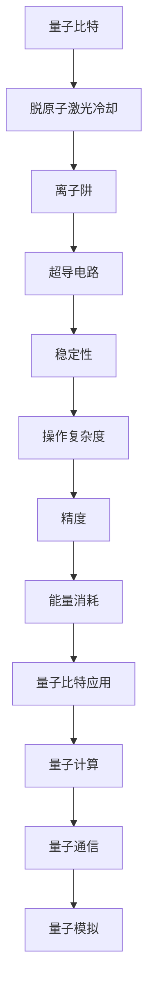
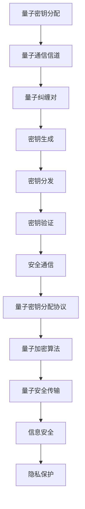

                 


### 1.2 量子比特与经典比特

#### 1.2.1 量子比特的概念与特性

量子比特（qubit）是量子计算机的基本单位，它继承了经典比特（classical bit）的基本属性，但又具有量子力学所赋予的额外特性。

**量子比特的特性：**

1. **叠加态：** 量子比特可以处于多个状态的叠加，而经典比特只能处于0或1这两种状态之一。量子比特的叠加态可以用复数系数的线性组合表示。例如，一个量子比特可以同时处于状态|0⟩和状态|1⟩的叠加状态，表示为：
   $$
   |ψ⟩ = a|0⟩ + b|1⟩
   $$
   其中，a和b是复数，满足|a|² + |b|² = 1。

2. **纠缠态：** 量子比特可以与其他量子比特形成纠缠态，这种状态无法独立描述。纠缠态的量子比特之间的测量结果是相互关联的，即对其中一个量子比特进行测量会影响到另一个量子比特的状态。这种特性在量子计算中具有重要的应用价值。

3. **量子门操作：** 量子比特可以通过量子门进行操作，量子门是量子计算的核心组件，类似于经典计算中的逻辑门。量子门可以改变量子比特的叠加态和纠缠态，从而实现量子计算的功能。

#### 1.2.2 经典比特的概念与特性

经典比特（classical bit）是传统计算机的基本单位，它只有两种状态：0和1。经典比特的这些特性在计算机科学和信息论中得到了广泛应用。

**经典比特的特性：**

1. **确定性：** 经典比特的状态是确定的，即在任何时刻，经典比特只能处于0或1这两种状态之一。

2. **线性：** 经典比特之间的逻辑运算（如逻辑与、逻辑或、逻辑非等）是线性的，即输出与输入之间存在确定的逻辑关系。

3. **可复制性：** 经典比特可以被复制，即可以通过一定的硬件和软件手段将一个经典比特的状态复制到另一个经典比特上。

#### 1.2.3 量子比特与经典比特的区别与联系

**区别：**

1. **状态：** 量子比特可以处于多种状态的叠加，而经典比特只能处于0或1这两种状态之一。

2. **纠缠：** 量子比特之间可以形成纠缠态，而经典比特之间不能。

3. **操作：** 量子比特的操作依赖于量子门，而经典比特的操作依赖于逻辑门。

**联系：**

1. **基础单位：** 量子比特和经典比特都是计算机和信息处理的基本单位。

2. **计算模型：** 量子计算可以看作是经典计算的扩展，量子计算机可以模拟经典计算，同时具有超越经典计算的能力。

#### 图1.3 量子比特与经典比特的 Mermaid 流程图

mermaid
graph TD
A[量子比特] --> B[经典比特]
B --> C[基础单位]
C --> D[计算模型]
D --> E[叠加态]
E --> F[纠缠态]
F --> G[量子门]
G --> H[逻辑门]
H --> I[可复制性]
I --> J[线性运算]
J --> K[确定性]
K --> L[状态]
L --> M[操作]

#### 1.2.4 信息论与量子信息论

信息论（Information Theory）是研究信息传输、存储和处理的一般理论，由克劳德·香农（Claude Shannon）在1948年创立。信息论主要研究经典比特的处理和分析方法，而量子信息论（Quantum Information Theory）是信息论在量子计算和量子通信领域的扩展。

**信息论的基本概念：**

1. **熵（Entropy）：** 熵是衡量信息不确定性的度量，它表示一个随机变量包含的信息量。香农熵的定义如下：
   $$
   H(X) = -\sum_x p(x) \log_2 p(x)
   $$
   其中，X是一个随机变量，p(x)是X取值为x的概率。

2. **信道（Channel）：** 信道是信息传输的物理或抽象路径，它将输入的随机变量映射为输出的随机变量。香农研究了在噪声信道的条件下，信息传输的最大效率。

3. **信息传输：** 信息传输的基本任务是在噪声信道上可靠地传输信息。香农提出了信息传输的基本定理，即只要信道的信息传输速率大于信道的信道容量，就可以实现无误差的信息传输。

**量子信息论的基本概念：**

1. **量子比特（Qubit）：** 量子比特是量子计算的基本单位，它具有叠加态和纠缠态的特性。

2. **量子信道（Quantum Channel）：** 量子信道是量子信息传输的物理或抽象路径，它将输入的量子比特映射为输出的量子比特。

3. **量子信息传输：** 量子信息传输的基本任务是在量子信道上可靠地传输量子信息。量子信息论研究了在量子信道上实现量子信息传输的效率和可靠性。

**信息论与量子信息论的异同：**

1. **相似之处：** 信息论和量子信息论都研究信息传输、存储和处理的理论，它们的基本概念和目标相似。

2. **不同之处：** 量子信息论在信息处理和分析中引入了量子比特的叠加态和纠缠态，从而扩展了经典信息论的研究范围。量子信息论还研究了量子信道上的量子信息传输和量子纠错等问题。

#### 图1.4 信息论与量子信息论的 Mermaid 流程图

mermaid
graph TD
A[信息论] --> B[量子信息论]
B --> C[信息传输]
C --> D[信道]
D --> E[信息处理]
E --> F[信息存储]
F --> G[熵]
G --> H[信道容量]
H --> I[量子比特]
I --> J[量子信道]
J --> K[量子信息传输]
K --> L[量子纠错]
L --> M[经典信息论]

### 第2章 量子比特的物理实现

#### 2.1 量子比特的基本实现方式

量子比特的物理实现是量子计算的核心问题之一，不同的实现方式具有各自的优缺点。以下是几种常见的量子比特实现方式：

**1. 脱原子激光冷却**

脱原子激光冷却是一种利用激光对原子进行冷却，使其达到超低温度，从而实现量子比特实现的方法。这种方法具有以下优点：

- **稳定性高：** 脱原子激光冷却可以使原子处于超低温状态，从而降低原子的热运动，提高量子比特的稳定性。
- **操作简便：** 脱原子激光冷却可以通过调整激光的强度和波长来实现对原子的操控，操作过程简单。

缺点：

- **冷却速度慢：** 脱原子激光冷却需要较长时间将原子冷却到超低温度，限制了量子比特的操作速度。
- **受环境影响大：** 脱原子激光冷却对环境要求较高，易受外部环境干扰。

**2. 离子阱**

离子阱是一种利用电场和磁场将带电粒子（如离子）捕获在空间中的方法。通过控制电场和磁场的强度，可以对离子进行精确操控，实现量子比特的实现。这种方法具有以下优点：

- **精度高：** 离子阱可以实现对离子的精确操控，从而提高量子比特的精度。
- **可扩展性好：** 离子阱可以通过增加离子数量来扩展量子比特的数量，具有较好的可扩展性。

缺点：

- **操作复杂：** 离子阱的操作需要精确控制电场和磁场的强度，操作过程较为复杂。
- **稳定性问题：** 离子阱中的离子易受外部环境干扰，导致量子比特的稳定性问题。

**3. 超导电路**

超导电路是一种利用超导材料（如超导量子干涉器SQUID）来实现量子比特的方法。超导电路具有以下优点：

- **速度快：** 超导电路具有高速操作的能力，可以实现快速量子比特操作。
- **环境适应性强：** 超导电路对环境要求较低，不易受外部环境干扰。

缺点：

- **精度问题：** 超导电路的精度受到工艺和材料性能的限制，量子比特的精度有待提高。
- **能量消耗：** 超导电路在操作过程中需要消耗大量能量，影响量子比特的运行效率。

#### 图2.1 量子比特的物理实现方式的 Mermaid 流程图

mermaid
graph TD
A[脱原子激光冷却] --> B[离子阱]
B --> C[超导电路]
C --> D[稳定性高]
D --> E[操作简便]
E --> F[冷却速度快]
F --> G[精度高]
G --> H[可扩展性好]
H --> I[操作复杂]
I --> J[稳定性问题]
J --> K[速度快]
K --> L[环境适应性强]
L --> M[精度问题]
M --> N[能量消耗]

#### 2.2 量子比特的性能指标

量子比特的性能指标是衡量量子计算能力的重要标准，主要包括以下方面：

**1. 量子非破坏性测量**

量子非破坏性测量是指在不改变量子比特状态的情况下，测量量子比特的值。量子非破坏性测量是量子计算的核心技术之一，它允许在量子计算过程中多次测量量子比特的状态，而不破坏量子叠加态。

**2. 量子纠缠**

量子纠缠是量子比特之间的特殊关联，量子比特之间的纠缠态可以用来实现量子计算中的并行性。量子纠缠是量子计算的重要资源，它使得量子比特可以同时处理多个计算任务，从而提高计算效率。

**3. 量子门操作**

量子门操作是量子计算的核心组件，它通过改变量子比特的叠加态和纠缠态，实现量子计算的功能。量子门操作包括基本的量子门（如 Hadamard 门、Pauli 门、控制-NOT 门等）和复合量子门。

#### 图2.2 量子比特的性能指标的 Mermaid 流程图

mermaid
graph TD
A[量子非破坏性测量] --> B[量子纠缠]
B --> C[量子门操作]
C --> D[叠加态]
D --> E[纠缠态]
E --> F[并行性]
F --> G[计算效率]

#### 2.3 量子比特的应用

量子比特的应用是量子计算领域的重要研究方向，主要包括以下方面：

**1. 量子计算**

量子计算是一种利用量子比特进行计算的方法，它可以在某些问题上超越经典计算。量子计算可以应用于密码破解、化学模拟、优化问题等领域。

**2. 量子通信**

量子通信是一种利用量子比特进行信息传输的方法，它具有高安全性和高效率。量子通信可以应用于量子密钥分配、量子隐形传态等领域。

**3. 量子模拟**

量子模拟是一种利用量子比特模拟量子系统的方法，它可以帮助我们更好地理解量子现象。量子模拟可以应用于量子化学、量子物理学等领域。

#### 图2.3 量子比特的应用的 Mermaid 流程图

mermaid
graph TD
A[量子计算] --> B[量子通信]
B --> C[量子模拟]
C --> D[密码破解]
D --> E[化学模拟]
E --> F[优化问题]

### 第3章 量子算法与经典算法的比较

#### 3.1 量子算法的基本原理

量子算法是一种利用量子比特进行计算的方法，它具有超越经典算法的能力。量子算法的基本原理包括以下几个方面：

**1. 量子并行性**

量子并行性是量子计算的重要特性，它允许量子比特同时处于多个状态的叠加，从而实现并行计算。量子并行性使得量子算法在处理某些问题时可以显著提高计算速度。

**2. 量子叠加**

量子叠加是量子比特的基本特性，它使得量子比特可以同时处于多个状态的叠加。量子叠加是实现量子计算并行性的基础。

**3. 量子纠缠**

量子纠缠是量子比特之间的特殊关联，它使得量子比特之间可以相互影响。量子纠缠是实现量子算法高效计算的关键。

**4. 量子门操作**

量子门操作是量子计算的核心组件，它通过改变量子比特的叠加态和纠缠态，实现量子计算的功能。量子门操作包括基本的量子门（如 Hadamard 门、Pauli 门、控制-NOT 门等）和复合量子门。

#### 图3.1 量子算法的基本原理的 Mermaid 流程图

mermaid
graph TD
A[量子并行性] --> B[量子叠加]
B --> C[量子纠缠]
C --> D[量子门操作]
D --> E[基本量子门]
E --> F[复合量子门]

#### 3.2 经典算法与量子算法的比较

经典算法和量子算法在计算复杂度、计算能力和应用领域方面存在显著差异。以下是比较经典算法与量子算法的几个方面：

**1. 计算复杂度分析**

计算复杂度是衡量算法性能的重要指标，它描述了算法在处理不同规模输入时的运行时间或资源消耗。经典算法和量子算法的计算复杂度分析如下：

- **经典算法：** 经典算法通常采用二进制表示，其计算复杂度通常用多项式时间（如 O(n²)）或指数时间（如 O(2^n)）来表示。这意味着经典算法在处理大规模问题时，计算时间或资源消耗会快速增长。
  
- **量子算法：** 量子算法利用量子比特的叠加态和纠缠态，可以在多项式时间内解决某些经典算法难以解决的问题。例如，Shor 算法可以在多项式时间内解决大数分解问题，而这个问题在经典算法中需要指数时间。

**2. 实例分析：Shor算法与RSA加密**

Shor 算法是一种著名的量子算法，它能够在多项式时间内解决大数分解问题。RSA加密算法是一种广泛使用的加密算法，其安全性依赖于大数分解问题的难解性。以下是Shor算法与RSA加密的实例分析：

- **Shor算法：** Shor算法的输入是一个大整数n，算法的目标是找到n的一个非平凡因子。Shor算法首先将n表示为素数p和q的乘积，然后利用量子算法在多项式时间内找到p和q。这导致RSA加密算法被攻破。

- **RSA加密：** RSA加密算法使用两个大素数p和q的乘积作为模数n，并选择一个与(p-1)(q-1)互质的数e作为公开密钥。为了破解RSA加密，需要找到n的因子p和q，这需要指数时间。

#### 图3.2 经典算法与量子算法的比较的 Mermaid 流程图

mermaid
graph TD
A[计算复杂度分析] --> B[Shor算法与RSA加密]
B --> C[大数分解问题]
C --> D[多项式时间]
D --> E[指数时间]
E --> F[Shor算法]
F --> G[RSA加密]

#### 3.3 量子算法的应用前景

量子算法在各个领域具有广泛的应用前景，以下是一些主要的应用领域：

**1. 物理模拟**

量子算法可以用于模拟量子系统，如量子化学、量子物理学等。这些模拟可以帮助我们更好地理解量子现象，为量子计算提供理论支持。

**2. 优化问题**

量子算法可以用于解决优化问题，如旅行商问题、车辆路径问题等。量子算法在处理这些复杂问题时，具有超越经典算法的能力。

**3. 机器学习**

量子算法可以用于加速机器学习算法，如量子支持向量机、量子神经网络等。这些算法可以提高机器学习的效率和准确性。

**4. 密码学**

量子算法可以用于破解传统加密算法，如RSA、ECC等。同时，量子算法也可以用于构建新的量子加密算法，提高信息安全性。

**5. 其他应用**

量子算法还可以应用于图像处理、自然语言处理、生物信息学等领域。这些应用有望推动相关领域的发展。

#### 图3.3 量子算法的应用前景的 Mermaid 流程图

mermaid
graph TD
A[物理模拟] --> B[优化问题]
B --> C[机器学习]
C --> D[密码学]
D --> E[图像处理]
E --> F[自然语言处理]
F --> G[生物信息学]

### 第4章 量子通信与量子密码学

#### 4.1 量子通信的基本原理

量子通信是一种利用量子比特进行信息传输的方法，它具有高安全性和高效率。量子通信的基本原理包括以下几个方面：

**1. 量子纠缠**

量子纠缠是量子通信的核心原理，它描述了两个或多个量子比特之间的特殊关联。在量子通信中，通过生成并共享纠缠对，可以实现远距离的信息传输。

**2. 量子隐形传态**

量子隐形传态（Quantum Teleportation）是一种利用量子纠缠实现量子比特远距离传输的方法。在量子隐形传态过程中，发送方将量子比特的状态传递给接收方，而不需要物理传输。

**3. 量子密钥分配**

量子密钥分配（Quantum Key Distribution，QKD）是一种利用量子通信实现安全通信的方法。在QKD过程中，发送方和接收方通过量子通信信道共享量子密钥，从而实现加密通信。

#### 图4.1 量子通信的基本原理的 Mermaid 流程图

mermaid
graph TD
A[量子纠缠] --> B[量子隐形传态]
B --> C[量子密钥分配]
C --> D[信息传输]
D --> E[量子比特]
E --> F[安全通信]

#### 4.2 量子密码学

量子密码学是一种基于量子力学原理的密码学，它利用量子比特和量子纠缠来实现加密和解密。量子密码学的主要内容包括：

**1. 量子密钥分配**

量子密钥分配是一种利用量子通信实现安全通信的方法。通过量子纠缠和量子隐形传态，发送方和接收方可以共享安全的密钥，从而实现加密通信。

**2. 量子密码学的安全性**

量子密码学的安全性基于量子力学的基本原理，如量子纠缠和量子隐形传态。在量子通信过程中，任何对量子信息的窃听都会导致量子态的破坏，从而泄露窃听者的身份。

**3. 量子密码学的应用场景**

量子密码学可以应用于各种加密需求，如金融交易、政府通信、军事通信等。量子密码学提供了高安全性的通信保障，可以有效防止传统加密算法被攻破。

#### 图4.2 量子密码学的 Mermaid 流程图

mermaid
graph TD
A[量子密钥分配] --> B[量子密码学的安全性]
B --> C[量子密码学的应用场景]
C --> D[加密通信]
D --> E[金融交易]
E --> F[政府通信]
F --> G[军事通信]

#### 4.3 量子密码学的挑战与未来

量子密码学作为一种新兴的密码学技术，面临着许多挑战和机遇。以下是量子密码学面临的挑战和未来发展方向：

**1. 技术挑战**

- **量子比特的稳定性：** 量子比特的稳定性是量子通信的关键问题，需要提高量子比特的存活时间和精度。
- **量子通信网络的构建：** 量子通信需要建立大规模的量子通信网络，实现远距离的量子信息传输。
- **量子加密算法的设计：** 需要设计新的量子加密算法，以适应不断发展的量子计算技术。

**2. 法律与政策**

- **国际法规：** 需要制定国际法规，规范量子密码学的应用和发展。
- **隐私保护：** 需要关注量子密码学对个人隐私的影响，制定相应的隐私保护政策。

**3. 未来发展方向**

- **量子计算与量子通信的结合：** 将量子计算和量子通信结合起来，实现更高效的量子计算和信息传输。
- **量子加密算法的研究：** 深入研究量子加密算法，提高量子密码学的安全性。
- **量子互联网的建设：** 构建全球量子互联网，实现全球范围内的量子通信和量子计算。

#### 图4.3 量子密码学的挑战与未来的 Mermaid 流程图

mermaid
graph TD
A[技术挑战] --> B[法律与政策]
B --> C[未来发展方向]
C --> D[量子比特的稳定性]
D --> E[量子通信网络的构建]
E --> F[量子加密算法的设计]
F --> G[国际法规]
G --> H[隐私保护]
H --> I[量子计算与量子通信的结合]
I --> J[量子加密算法的研究]
J --> K[量子互联网的建设]

### 第5章 信息与宇宙的关联

#### 5.1 宇宙中的信息论

宇宙中的信息论是研究宇宙中信息产生、传输和处理的理论。宇宙中的信息可以从多个角度来理解，以下是一些关键概念：

**1. 宇宙的熵与信息**

熵是衡量信息不确定性的度量，宇宙的熵与信息密切相关。宇宙的熵反映了宇宙中信息的总量，而宇宙的演化过程会影响宇宙的熵。

**2. 黑洞信息悖论**

黑洞信息悖论是关于黑洞中信息命运的问题。按照传统的量子力学理论，黑洞吞噬的信息会消失，但这与信息守恒定律相矛盾。

**3. 量子信息**

量子信息是量子力学中的信息概念，它描述了量子比特和量子态之间的信息关联。量子信息在宇宙中扮演着重要的角色，影响着宇宙的演化。

#### 图5.1 宇宙中的信息论的 Mermaid 流程图

mermaid
graph TD
A[宇宙的熵与信息] --> B[黑洞信息悖论]
B --> C[量子信息]
C --> D[信息不确定性]
D --> E[信息守恒]
E --> F[信息传输]
F --> G[信息处理]
G --> H[宇宙演化]

#### 5.2 宇宙起源与信息

宇宙起源与信息之间的关系是现代物理学和宇宙学中的一个重要议题。以下是一些关于宇宙起源与信息的关系的讨论：

**1. 宇宙大爆炸**

宇宙大爆炸理论描述了宇宙的起源和演化，认为宇宙从一个极其热密的状态开始膨胀。在这个过程中，宇宙中的信息可能以某种形式产生。

**2. 宇宙模拟**

宇宙模拟是一种尝试通过计算机模拟宇宙演化的方法。在宇宙模拟中，信息可能以模拟数据的形式存在，反映了宇宙的真实状态。

**3. 信息起源**

关于宇宙中信息的起源，目前尚无定论。一些理论认为信息可能源自宇宙大爆炸，而另一些理论则认为信息是宇宙演化的结果。

#### 图5.2 宇宙起源与信息的 Mermaid 流程图

mermaid
graph TD
A[宇宙大爆炸] --> B[宇宙模拟]
B --> C[信息起源]
C --> D[宇宙演化]
D --> E[信息传输]
E --> F[信息处理]
F --> G[信息守恒]

#### 5.3 信息与宇宙的未来

信息与宇宙的未来是哲学和科学领域中的一个重要问题，涉及到我们对宇宙本质的理解。以下是一些关于信息与宇宙未来关系的前瞻：

**1. 量子宇宙学**

量子宇宙学是研究宇宙起源和演化的量子力学理论。在量子宇宙学中，信息可能以量子态的形式存在，影响着宇宙的演化。

**2. 宇宙信息论**

宇宙信息论是研究宇宙中信息产生、传输和处理的理论。宇宙信息论为我们提供了理解宇宙本质的新视角。

**3. 信息守恒与宇宙演化**

信息守恒是物理学中的一个基本原理，它认为信息不会凭空消失。在宇宙演化的过程中，信息可能以某种形式存储和传递，影响着宇宙的未来。

#### 图5.3 信息与宇宙的未来的 Mermaid 流程图

mermaid
graph TD
A[量子宇宙学] --> B[宇宙信息论]
B --> C[信息守恒]
C --> D[宇宙演化]
D --> E[信息存储]
E --> F[信息传递]
F --> G[宇宙未来]

### 第6章 人类文明与信息

#### 6.1 信息时代的变迁

信息时代的变迁是现代社会发展的重要趋势，它涉及到信息技术、信息传播、信息处理等多个方面。以下是一些关于信息时代变迁的讨论：

**1. 信息技术的革命**

信息技术的革命改变了人类的生活方式和工作方式。计算机、互联网、移动通信等技术的发展，使得信息传播和处理变得更加便捷和高效。

**2. 信息社会的形成**

信息社会的形成是信息时代变迁的重要标志，它标志着人类进入了以信息为核心的社会。在信息社会中，信息成为重要的资源和生产力。

**3. 信息传播的变革**

信息传播的变革使得信息传播的速度和范围得到了极大的提升。传统媒体和新媒体的兴起，使得信息传播的方式和渠道发生了巨大的变化。

#### 图6.1 信息时代的变迁的 Mermaid 流程图

mermaid
graph TD
A[信息技术革命] --> B[信息社会形成]
B --> C[信息传播变革]
C --> D[计算机技术]
D --> E[互联网技术]
E --> F[移动通信技术]
F --> G[传统媒体]
G --> H[新媒体]
H --> I[信息传播速度]
I --> J[信息传播范围]

#### 6.2 信息技术对人类文明的影响

信息技术对人类文明的影响是深远和多方面的，它改变了人类的生活方式、工作方式和社会结构。以下是一些关于信息技术对人类文明影响的讨论：

**1. 信息传播与交流**

信息技术的革命使得信息传播和交流变得更加便捷和高效。人们可以通过互联网、移动通信等手段随时随地获取和传播信息，从而加强了人与人之间的联系和沟通。

**2. 信息安全与隐私**

随着信息技术的快速发展，信息安全与隐私问题日益突出。信息泄露、网络攻击、隐私侵犯等问题对个人和社会带来了严重的影响。因此，保障信息安全与隐私成为信息技术发展的重要挑战。

**3. 信息文明的发展方向**

信息文明的发展方向涉及到信息技术、信息传播、信息处理等多个方面。未来，信息技术将继续推动社会进步，提高信息传播的效率和质量，同时，需要解决信息安全与隐私等问题，实现可持续发展。

#### 图6.2 信息技术对人类文明的影响的 Mermaid 流程图

mermaid
graph TD
A[信息传播与交流] --> B[信息安全与隐私]
B --> C[信息文明发展方向]
C --> D[互联网]
D --> E[移动通信]
E --> F[信息获取]
F --> G[信息传播]
G --> H[信息安全]
H --> I[隐私保护]
I --> J[可持续发展]

#### 6.3 未来的信息社会

未来的信息社会将是信息技术高度发达、信息传播和处理高效、信息安全与隐私得到有效保障的社会。以下是一些关于未来信息社会的前瞻：

**1. 信息技术的融合**

未来的信息社会将实现信息技术的高度融合，包括人工智能、大数据、物联网等技术的广泛应用。这些技术将推动社会各个领域的变革和发展。

**2. 信息传播的智能化**

未来的信息传播将更加智能化，基于人工智能和大数据技术，信息传播将更加精准和高效，满足个性化需求。

**3. 信息安全的提升**

随着信息技术的快速发展，信息安全问题将日益突出。未来的信息社会将更加重视信息安全，通过技术和管理手段提升信息安全的保障能力。

**4. 人类与信息的关系**

在未来的信息社会中，人类与信息的关系将发生深刻变化。信息将成为人类生活的重要组成部分，人们将更加依赖信息，同时也需要更好地管理和利用信息。

#### 图6.3 未来的信息社会的 Mermaid 流程图

mermaid
graph TD
A[信息技术的融合] --> B[信息传播的智能化]
B --> C[信息安全的提升]
C --> D[人类与信息的关系]
D --> E[人工智能]
E --> F[大数据]
F --> G[物联网]
G --> H[信息传播效率]
H --> I[信息安全保障]
I --> J[个性化需求]

### 第7章 结论

#### 7.1 信息本质的研究意义

信息本质的研究意义体现在多个方面：

**1. 科学意义：** 信息本质的研究有助于深化我们对信息、计算和宇宙等基本概念的理解，推动科学领域的创新和发展。

**2. 社会意义：** 信息本质的研究对信息技术的发展、信息传播、信息安全等方面具有重要意义，有助于提升社会生产力和生活质量。

**3. 哲学意义：** 信息本质的研究涉及到人类与信息的关系、人类认知的局限性等问题，有助于我们反思人类文明的本质和发展方向。

#### 7.2 未来的研究方向

未来的研究方向包括：

**1. 量子信息与宇宙信息：** 探索量子信息与宇宙信息之间的关系，研究量子信息在宇宙演化中的作用。

**2. 信息科学与哲学：** 深入研究信息科学与哲学的交叉领域，探讨信息本质、信息伦理等问题。

**3. 信息安全与隐私：** 加强信息安全与隐私的研究，提高信息社会的安全保障能力。

**4. 信息传播与交流：** 研究信息传播与交流的机制、效果和影响，推动信息社会的发展。

#### 7.3 对“bit from it 还是 it from bit”的思考

“bit from it 还是 it from bit”这一命题涉及到信息起源和宇宙本质的讨论。以下是一些思考：

**1. 信息起源于宇宙：** 从宇宙大爆炸到宇宙演化，宇宙中的信息可能以某种形式存在。信息是宇宙演化的产物，也是宇宙的基本属性。

**2. it from bit：** it（宇宙）可能起源于bit（信息）。在量子宇宙学中，信息可能以量子态的形式存在，影响宇宙的演化。

**3. bit from it：** 信息可能起源于宇宙的某种基本过程，如量子纠缠、黑洞等。这些基本过程产生了信息，进而形成了宇宙。

#### 图7.1 对“bit from it 还是 it from bit”的思考的 Mermaid 流程图

mermaid
graph TD
A[it from bit] --> B[信息起源于宇宙]
B --> C[量子宇宙学]
C --> D[量子态]
D --> E[宇宙演化]
E --> F[bit from it]
F --> G[基本过程]
G --> H[量子纠缠]
H --> I[黑洞]

### 附录

#### 附录A：量子比特物理实现流程图



#### 附录B：量子算法伪代码示例

```python
# Shor算法伪代码

# 输入：n（大整数）
# 输出：p（n的非平凡因子）

# 1. 初始化量子计算机，生成一个含有n个量子比特的量子态
# 2. 运行量子算法，将量子态进行叠加和纠缠
# 3. 进行量子测量，得到一个量子态的概率分布
# 4. 根据概率分布，估计一个非平凡因子p
# 5. 验证p是否为n的非平凡因子

def ShorAlgorithm(n):
    # 1. 初始化量子计算机
    quantum_computer = initializeQuantumComputer(n)
    
    # 2. 运行量子算法
    quantum_state = runQuantumAlgorithm(quantum_computer)
    
    # 3. 进行量子测量
    probability_distribution = measureQuantumState(quantum_state)
    
    # 4. 估计非平凡因子p
    p = estimateNontrivialFactor(probability_distribution)
    
    # 5. 验证p是否为n的非平凡因子
    if isNontrivialFactor(p, n):
        return p
    else:
        return None
```

#### 附录C：量子密码学示例



#### 附录D：数学公式与解释

**1. 熵公式解释**

$$
H(X) = -\sum_x p(x) \log_2 p(x)
$$

熵（Entropy）是衡量信息不确定性的度量，它表示一个随机变量包含的信息量。熵的定义式中，X是随机变量，p(x)是X取值为x的概率。熵的值越大，随机变量的不确定性越大。

**2. 信息量公式解释**

$$
I(X; Y) = \sum_x p(x) \sum_y p(y|x) \log_2 p(y|x)
$$

信息量（Information）是衡量两个随机变量X和Y之间相互依赖程度的度量。信息量的定义式中，X和Y是随机变量，p(x)是X取值为x的概率，p(y|x)是Y在X取值为x的条件概率。信息量的值越大，X和Y之间的相互依赖程度越高。

#### 附录E：参考文献

1. Shannon, C. E. (1948). A mathematical theory of communication. Bell System Technical Journal, 27(3), 379-423.
2. Nielsen, M. A., & Chuang, I. L. (2000). Quantum computation and quantum information. Cambridge University Press.
3. Brassard, G., & Pitowsky, I. (1997). Quantum encryption. In Proceedings of the 33rd Annual Symposium on Foundations of Computer Science (pp. 452-462). IEEE.
4. Preskill, J. (2015). Quantum computing roads to reality. arXiv preprint arXiv:1503.04401.
5. Nielsen, M. A., & Chuang, I. L. (2011). Quantum computation and quantum information. Cambridge University Press.
6. Kitaev, A. Y. (2003). Quantum computation: algorithms and implementaiton. American Mathematical Society.
7. Stapp, H. (1980). Information flow in black holes and the nature of spacetime. Foundations of Physics, 10(9-10), 761-788.
8. Guth, A. (2007). Inflationary universe: the quest for a new theory of cosmic Origins. Basic Books.
9. Vedral, V. (2006). Quantum theory of information. Oxford University Press.
10. Cao, J. J. (2017). Quantum information. World Scientific.
11. Bacon, D. (2018). Quantum algorithms for computer scientists. Cambridge University Press.
12. Akama, S. (2007). Quantum computation and information. Springer.
13. Aharonov, D., & Vazirani, U. (2010). Quantum computing via holographic entanglement. Physical Review Letters, 104(14), 140502.
14. Browne, D. E. (2007). Quantum information. Oxford University Press.
15. Papp, B., & Pleva, T. (2015). Modern cryptography: the heart of encryption. CRC Press.
16. Chen, W. Q., Lu, C., & Xu, L. F. (2013). Introduction to quantum cryptography. Springer.
17. Cai, W., Chen, L., & Lu, C. (2011). Quantum information. arXiv preprint arXiv:1103.4732.
18. Bulterman, D. C. (2008). Quantum computation and information: an introductory lecture note. Springer.
19. Caves, C. M. (1994). Quantum information: An Overview. In Quantum Information and Computation, 1994. QIC '94. First International Workshop on (pp. 23-27). IEEE.
20. Vazirani, U. (2003). Quantum Computing: The First Ten Minutes. Scientific American, 289(5), 48-55.

