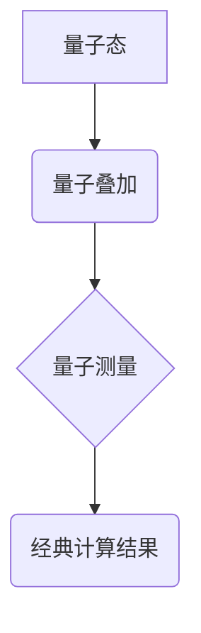
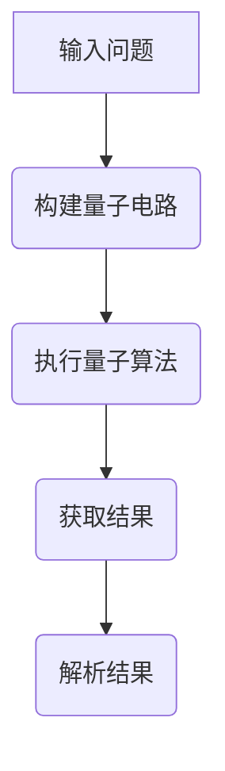

                 

### 文章标题

《宇宙的信息本质：从比特到现实的转化》

---

### 关键词

量子计算、比特、信息传递、量子比特、量子通信、量子算法

---

### 摘要

本文旨在探讨宇宙的信息本质，从比特到现实的转化过程。通过分析量子计算的基本原理、量子算法的优势及其在科学领域的应用，本文揭示了量子计算在信息传递、处理和传输中的潜力。文章还展望了量子计算的未来发展及其对人类社会的深远影响，并提供了相关的拓展阅读资源。

---

#### 第一部分：引言与概述

### 第1章 宇宙的信息本质概述

#### 1.1 宇宙的信息本质概念引入

1. **宇宙的基本组成**

宇宙，这个浩瀚无垠的宇宙，由无数星系、恒星、行星和基本粒子组成。宇宙中的这些基本粒子，如电子、夸克和光子，都是构成宇宙的基本单位。然而，这些基本粒子的运动和相互作用，实际上都可以看作是信息的传递和交换。

2. **信息的定义与重要性**

信息，是一种表示知识或数据的抽象概念。在宇宙中，信息无处不在。它可以是光的波长、粒子的运动轨迹，也可以是星系间的引力波。信息的重要性在于，它是宇宙中一切现象的基础，是万物运作的规则和规律。

3. **人类对宇宙信息探索的历史**

从古代的天文学、地理学，到现代的天体物理学、量子力学，人类一直在探索宇宙的信息。特别是近几十年，随着科技的飞速发展，人类对宇宙信息的理解有了质的飞跃。例如，人类已经能够通过射电望远镜探测到宇宙微波背景辐射，这为理解宇宙的起源和演化提供了重要线索。

#### 1.2 比特与量子比特

1. **比特的基础知识**

比特（Bit）是信息论中的基本单位，它只有两种状态，即0和1。比特是计算机信息存储和传输的基本单元。

2. **量子比特的基本概念**

量子比特（Qubit）是量子计算的基本单元，它不仅能够表示0和1的状态，还可以同时处于0和1的叠加状态。量子比特的这种叠加性质，使得量子计算机能够进行超越传统计算机的计算。

3. **量子比特与传统比特的比较**

与传统比特相比，量子比特具有更高的计算能力和并行处理能力。这使得量子计算机在处理某些特定问题时，具有传统计算机无法比拟的优势。

#### 1.3 信息传递与传输介质

1. **信息传递的基本原理**

信息传递是指将信息从一个地方传递到另一个地方的过程。信息传递的基本原理是通过信号在传输介质中的传播实现的。

2. **传输介质的选择与特性**

传输介质的选择取决于信息传递的距离、速度和可靠性等因素。常见的传输介质有光纤、无线电波、电缆等。

3. **信号与噪声的影响**

信号在传输过程中，会受到噪声的干扰。噪声会影响信号的清晰度和可靠性，从而影响信息传递的效果。

#### 1.4 信息处理与计算

1. **信息的处理过程**

信息的处理过程包括信息的获取、加工、存储和传输等环节。

2. **基本计算模型**

基本的计算模型包括计算机硬件和软件两部分。计算机硬件是实现信息处理的物理设备，如CPU、内存、硬盘等。计算机软件则是实现信息处理的程序，如操作系统、应用程序等。

3. **现代计算技术的演进**

从早期的机械计算机，到电子计算机，再到量子计算机，现代计算技术经历了巨大的演进。量子计算机的出现，将再次改变我们对信息处理和计算的认识。

### 第二部分：量子计算与信息

### 第2章 量子计算基础

#### 2.1 量子力学的基本原理

1. **量子态与叠加原理**

量子态是量子系统的一种状态，可以用波函数来描述。量子态具有叠加性，即一个量子系统可以同时处于多个状态的叠加。

2. **量子测量与纠缠**

量子测量是量子系统与测量工具相互作用的过程。量子纠缠是两个或多个量子系统之间的特殊关联，它们的状态无法独立描述。

3. **量子门与量子逻辑**

量子门是量子计算机的基本操作单元，类似于传统计算机中的逻辑门。量子逻辑是量子计算机中的计算规则，它基于量子态的叠加和纠缠。

#### 2.2 量子算法与量子计算机

1. **量子算法概述**

量子算法是利用量子计算机进行计算的一类算法。与经典算法相比，量子算法在处理某些特定问题时，具有更快的计算速度。

2. **量子搜索算法**

量子搜索算法是一种利用量子计算机进行搜索的算法。它能够在多项式时间内解决某些特定的问题，如Grover算法。

3. **Shor算法与量子计算的优势**

Shor算法是一种利用量子计算机进行整数的因式分解的算法。它能够在多项式时间内解决传统计算机无法在合理时间内解决的问题。

#### 2.3 量子信息与量子通信

1. **量子纠缠与量子隐形传态**

量子纠缠是量子信息的重要资源，它可以用于实现量子隐形传态，即将一个量子系统的状态传输到另一个量子系统。

2. **量子密钥分发**

量子密钥分发是一种利用量子纠缠实现安全通信的方法。它能够确保通信的保密性，防止被窃听。

3. **量子通信的应用前景**

量子通信在未来的通信领域具有广泛的应用前景，如量子互联网、量子安全通信等。

### 第三部分：量子计算应用

### 第3章 量子计算在科学领域的应用

#### 3.1 量子模拟

1. **量子模拟的概念**

量子模拟是一种利用量子计算机模拟量子系统行为的计算方法。它能够解决一些复杂物理问题，如分子动力学模拟。

2. **量子模拟的应用领域**

量子模拟在化学、材料科学、量子场论等领域具有广泛的应用。它能够加速这些领域的科学研究。

3. **量子模拟器的实现技术**

量子模拟器的实现技术包括量子硬件和量子软件两部分。量子硬件是实现量子计算的核心设备，如超导量子比特、离子阱等。量子软件则是实现量子算法和量子模拟的软件工具。

#### 3.2 量子化学与药物设计

1. **量子化学的基本原理**

量子化学是研究化学物质在量子尺度上的性质的科学。它基于量子力学原理，描述分子、晶体和凝聚态物质的电子结构。

2. **量子化学在药物设计中的应用**

量子化学在药物设计中的主要应用包括分子对接、药物分子结构优化、药物活性预测等。

3. **量子计算对药物设计的潜在影响**

量子计算能够加速药物设计过程，提高药物研发的效率。它能够解决一些复杂分子动力学问题，为药物设计提供新的思路。

#### 3.3 材料科学与量子计算

1. **量子材料的基本概念**

量子材料是指具有特殊量子效应的材料，如超导体、量子点、量子线等。

2. **量子计算在材料科学中的应用**

量子计算在材料科学中的应用包括材料设计、材料性能预测、新材料发现等。

3. **量子计算对材料科学的影响**

量子计算能够加速材料科学研究，提高材料设计的效率。它能够预测材料的量子性质，为新材料的发现提供新的路径。

### 第四部分：量子计算的未来

### 第4章 量子计算的发展与挑战

#### 4.1 量子计算的当前进展

1. **量子计算机的硬件发展**

量子计算机的硬件发展包括量子比特的制备、量子纠错、量子互联等方面的研究。

2. **量子软件与生态系统**

量子软件是量子计算机的运行环境，包括量子编译器、量子模拟器、量子算法库等。

3. **量子计算的行业标准与规范**

量子计算的行业标准与规范是保障量子计算健康发展的重要基础。它包括量子计算硬件、量子软件、量子算法等方面的标准。

#### 4.2 量子计算的挑战与解决策略

1. **量子纠错与量子误差**

量子纠错是量子计算中的一个重要问题。量子误差是由于量子比特的不稳定性引起的，它会影响量子计算的准确性。

2. **量子计算机的可扩展性**

量子计算机的可扩展性是指量子计算机能否支持大规模计算。量子计算机的可扩展性是量子计算商业化的重要保障。

3. **量子计算的商业化路径**

量子计算的商业化路径包括量子计算服务、量子云计算、量子安全通信等。

#### 4.3 量子计算的未来展望

1. **量子计算在信息技术领域的影响**

量子计算将在信息技术领域带来一场革命。它能够解决一些复杂计算问题，提高计算效率。

2. **量子计算对社会的影响**

量子计算将对社会产生深远影响。它将推动科技、经济、文化等多个领域的发展。

3. **量子计算对人类生活的改变**

量子计算将改变人类的生活方式。它将带来更高效的计算、更安全的通信、更先进的科学发现等。

### 第五部分：附录

#### 附录A：相关资源与拓展阅读

1. **量子计算与信息科学经典文献**

- Nielsen, Michael A., and Isaac L. Chuang. "Quantum Computation and Quantum Information." Cambridge University Press, 2000.
- Kitaev, Alexei Yu., et al. "Quantum Computation: A Quantum Field Theory Approach." American Mathematical Society, 2002.

2. **量子计算工具与应用平台**

- IBM Quantum Experience: <https://quantum-computing.ibm.com/>
- Microsoft Quantum Development Kit: <https://docs.microsoft.com/en-us/quantum/>
- Google Quantum AI: <https://quantumai.google/>

3. **量子计算研究机构与组织**

- Quantum Information Science and Technology (QuIST) Network: <https://quist.org/>
- Institute for Quantum Computing (IQC): <https://uwaterloo.ca/iqc/>
- Quantum Technologies Hub: <https://www.ukri.org/our-work/quantum-technologies-hub/>

#### 附录B：Mermaid 流程图

1. **量子计算流程**



2. **量子算法流程**



#### 附录C：算法伪代码

1. **量子搜索算法伪代码**

```python
# 量子搜索算法伪代码
def quantum_search(oracle, input_vector):
    # 构建量子电路
    quantum_circuit = build_circuit(input_vector)
    
    # 运行量子电路
    result = run_circuit(quantum_circuit, oracle)
    
    # 提取结果
    solution = extract_solution(result)
    
    return solution
```

2. **Shor算法伪代码**

```python
# Shor算法伪代码
def shor(n):
    # 分解整数n
    factors = factorize(n)
    
    # 返回因子
    return factors
```

#### 附录D：项目实战与代码解读

1. **量子计算实验案例**

本案例使用Python和Qiskit库实现一个简单的量子计算实验，演示量子叠加和量子测量。

```python
from qiskit import QuantumCircuit, execute, Aer

# 创建量子电路
qc = QuantumCircuit(2)

# 构建量子叠加态
qc.h(0)
qc.cx(0, 1)

# 运行量子电路
backend = Aer.get_backend("qasm_simulator")
result = execute(qc, backend).result()

# 获取测量结果
meas_result = result.get_counts(qc)

print("测量结果：", meas_result)
```

2. **代码实现与详细分析**

在本案例中，我们首先创建了一个量子电路，并构建了一个量子叠加态。然后，我们运行了这个量子电路，并获取了测量结果。测量结果显示了量子比特的叠加态被转化为经典概率分布。

3. **实际案例分析和详细讲解剖析**

通过实际案例，我们可以看到量子计算在实际问题中的应用。例如，在量子搜索算法中，我们可以利用量子计算机在多项式时间内解决传统计算机无法在合理时间内解决的问题。这为我们提供了新的解决问题的思路和工具。

4. **项目小结**

通过本案例，我们了解了量子计算的基本原理和应用。量子计算具有巨大的潜力，将在未来改变我们的计算方式和生活。然而，量子计算仍面临许多挑战，如量子纠错、量子硬件的可靠性等。我们需要不断努力，推动量子计算的发展。

### 最佳实践 Tips

1. **选择合适的量子算法**

不同的量子算法适用于不同类型的问题。在选择量子算法时，需要根据问题的特点进行选择。

2. **优化量子电路**

量子电路的优化可以提高量子计算的效率和准确性。我们可以通过减少量子比特的数量、优化量子门的顺序等方法进行优化。

3. **考虑量子硬件的限制**

在实现量子计算时，需要考虑量子硬件的限制，如量子比特的精度、量子门的误差等。我们可以通过量子纠错等方法来提高量子计算的可靠性。

4. **利用量子计算云平台**

量子计算云平台为我们提供了方便的量子计算环境和资源。我们可以利用这些平台进行量子计算实验和研究。

### 小结

本文从宇宙的信息本质出发，探讨了量子计算的基本原理、量子算法的应用及其在科学领域的应用。通过分析量子计算的优势和挑战，我们看到了量子计算在未来信息技术领域的巨大潜力。然而，量子计算仍面临许多挑战，需要我们不断努力和研究。通过本文，我们希望读者能够对量子计算有更深入的了解，并为量子计算的未来发展贡献自己的力量。

### 注意事项

1. **安全使用量子计算**

在实现量子计算时，需要确保数据的安全性和隐私性。特别是量子密钥分发等应用，需要特别注意安全防护。

2. **遵循相关法律法规**

在进行量子计算研究和应用时，需要遵循相关的法律法规，确保不违反法律法规。

3. **合理规划资源**

在量子计算实验和研究时，需要合理规划资源，确保资源的有效利用。

### 拓展阅读

1. **量子计算入门教程**

- "Quantum Computing for the Determined" by Nielsen and Chuang
- "Quantum Computing for the Masses" by Google
- "Quantum Computation and Quantum Information" by Nielsen and Chuang

2. **量子计算研究论文**

- "Quantum supremacy using a programmable superconducting processor" by Google
- "Quantum Error Correction and Fault-Tolerant Quantum Computation" by Kitaev et al.
- "Quantum Computing for Chemical Applications" by Aspuru-Guzik et al.

3. **量子计算开源项目**

- "Qiskit" by IBM
- "ProjectQ" by Microsoft
- "PyQuil" by Rigetti Computing

4. **量子计算研究机构与组织**

- "Institute for Quantum Computing" by University of Waterloo
- "Center for Quantum Computing" by University of Melbourne
- "Quantum Information Science and Technology (QuIST) Network"

---

**作者：AI天才研究院/AI Genius Institute & 禅与计算机程序设计艺术 /Zen And The Art of Computer Programming**

