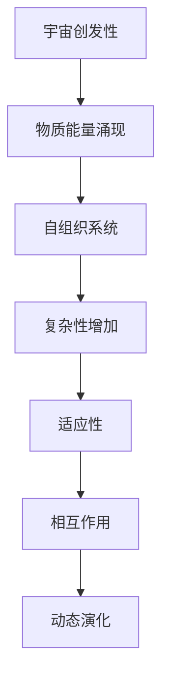
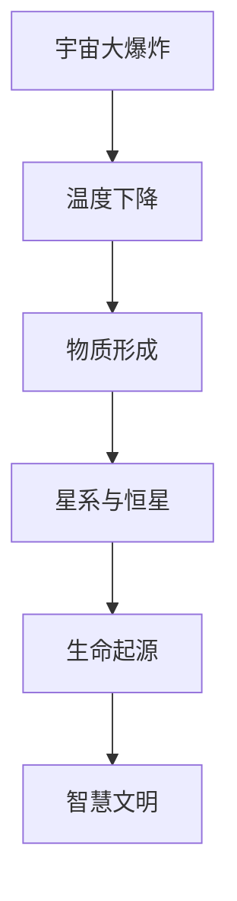

                 


### 文章标题

宇宙的创发性：新属性的自发涌现

> 关键词：宇宙创发性、新属性、自发涌现、复杂系统、混沌理论、分形几何

> 摘要：
本文深入探讨了宇宙创发性的概念、起源和原理，并分析了新属性自发涌现的数学模型、物质与能量的涌现机制以及其实际应用。通过分析宇宙创发性的实验与观测方法，文章揭示了其与人类文明的关系，并展望了未来研究的趋势。本文旨在为读者提供一个全面而深入的关于宇宙创发性及其自发涌现现象的理解。

### 第一部分：宇宙的创发性：新属性的自发涌现概述

#### 第1章：宇宙的创发性基础

##### 1.1 宇宙创发性的基本概念

###### 1.1.1 宇宙创发性的定义

宇宙创发性是指宇宙中物质和能量自发涌现的新属性，这一概念体现了宇宙在无外界干预下自我组织、演化和发展的特性。

**伪代码：**

```python
def define_universe_creationality():
    """
    定义宇宙创发性为宇宙中物质和能量自发涌现的新属性。
    """
    universe_creationality = "The spontaneous emergence of new properties in the universe from matter and energy."
    return universe_creationality
```

###### 1.1.2 宇宙创发性的核心特征

宇宙创发性的核心特征包括物质和能量的涌现、自组织系统、复杂性增加、适应性、相互作用和动态演化。

**Mermaid 流程图：**



##### 1.2 宇宙创发性的起源

###### 1.2.1 大爆炸理论

宇宙创发性的起源可以追溯到宇宙大爆炸事件，这一理论描述了宇宙从极热、极密的状态开始膨胀、冷却，最终形成了我们今天所看到的宇宙。

**伪代码：**

```python
def origin_of_universe_creationality():
    """
    宇宙创发性的起源可追溯到宇宙大爆炸事件。
    """
    origin = "The origin of universe creationality can be traced back to the Big Bang event."
    return origin
```

###### 1.2.2 物质与能量的涌现

从宇宙大爆炸事件开始，随着温度的下降，物质和能量开始涌现，形成了星系、恒星以及生命。

**Mermaid 流程图：**



##### 1.3 宇宙创发性的应用领域

宇宙创发性在多个领域都有重要的应用，包括天文学、生物学和计算机科学等。

###### 1.3.1 天文学

天文学研究宇宙创发性的现象，如星系形成、恒星演化等。

**伪代码：**

```python
def application_in_astronomy():
    """
    天文学研究宇宙创发性的现象，如星系形成、恒星演化。
    """
    astronomy = "Astronomy studies phenomena of universe creationality, such as galaxy formation, stellar evolution."
    return astronomy
```

###### 1.3.2 生物学

生物学研究生物系统中创发性属性，如自组织、适应性进化等。

**伪代码：**

```python
def application_in_biology():
    """
    生物学研究生物系统中创发性属性，如自组织、适应性进化。
    """
    biology = "Biology studies properties of creationality in biological systems, such as self-organization, adaptive evolution."
    return biology
```

###### 1.3.3 计算机科学

计算机科学利用宇宙创发性原理，如复杂系统模拟、人工智能等。

**伪代码：**

```python
def application_in_computer_science():
    """
    计算机科学利用宇宙创发性原理，如复杂系统模拟、人工智能。
    """
    computer_science = "Computer science utilizes principles of universe creationality, such as simulation of complex systems, artificial intelligence."
    return computer_science
```

### 第二部分：新属性的自发涌现原理

#### 第2章：新属性的自发涌现原理

##### 2.1 自发涌现的数学模型

自发涌现的数学模型主要涉及复杂系统理论、相变理论等。

###### 2.1.1 复杂系统理论

复杂系统理论描述系统内部多样性和协作性，这为理解自发涌现提供了基础。

**伪代码：**

```python
def complex_system_theory():
    """
    复杂系统理论描述系统内部多样性和协作性。
    """
    theory = "Complex system theory describes the diversity and cooperation within a system."
    return theory
```

###### 2.1.2 相变理论

相变理论解释系统从一种状态到另一种状态的突变，这一理论对于理解自发涌现现象具有重要意义。

**伪代码：**

```python
def phase_transition_theory():
    """
    相变理论解释系统从一种状态到另一种状态的突变。
    """
    theory = "Phase transition theory explains the transition from one state to another in a system."
    return theory
```

##### 2.2 物质与能量的涌现机制

物质与能量的涌现机制涉及概率论、混沌理论和分形几何等。

###### 2.2.1 概率论

概率论描述随机事件的发生及其概率分布，这对于理解物质与能量的涌现具有重要意义。

**伪代码：**

```python
def probability_theory():
    """
    概率论描述随机事件的发生及其概率分布。
    """
    theory = "Probability theory describes the occurrence of random events and their probability distributions."
    return theory
```

###### 2.2.2 混沌理论

混沌理论描述系统的非线性和不可预测性，这为理解物质与能量的涌现提供了新的视角。

**伪代码：**

```python
def chaos_theory():
    """
    混沌理论描述系统的非线性和不可预测性。
    """
    theory = "Chaos theory describes the non-linear and unpredictable nature of a system."
    return theory
```

###### 2.2.3 分形几何

分形几何描述复杂结构的自相似性，这为理解物质与能量的涌现提供了新的数学工具。

**伪代码：**

```python
def fractal_geometry():
    """
    分形几何描述复杂结构的自相似性。
    """
    geometry = "Fractal geometry describes the self-similarity of complex structures."
    return geometry
```

##### 2.3 自发涌现的应用实例

自发涌现现象在自然界和社会科学中都有广泛的应用。

###### 2.3.1 自然界中的应用

自然界中，水分子自发形成液体，火山爆发形成新的地貌，这些都是自发涌现现象的实例。

**伪代码：**

```python
def application_in_nature():
    """
    自然界中，水分子自发形成液体，火山爆发形成新的地貌。
    """
    application = "In nature, water molecules spontaneously form a liquid, and volcanic eruptions create new landforms."
    return application
```

###### 2.3.2 社会科学中的应用

在社会科学中，群体行为、市场波动等也体现了自发涌现的特性。

**伪代码：**

```python
def application_in_social_science():
    """
    在社会科学中，群体行为、市场波动均体现自发涌现的特性。
    """
    application = "In social sciences, phenomena such as group behavior and market fluctuations reflect the characteristics of spontaneous emergence."
    return application
```

### 第三部分：宇宙创发性的实验与观测

#### 第3章：宇宙创发性的实验与观测

##### 3.1 宇宙创发性的实验方法

宇宙创发性的实验方法需要严格遵循实验设计原则，并进行实验数据分析。

###### 3.1.1 实验设计原则

实验设计原则主要包括变量控制、数据可靠等。

**伪代码：**

```python
def experiment_design_principles():
    """
    实验设计需确保变量控制、数据可靠。
    """
    principles = "Experimental design requires control of variables and reliable data."
    return principles
```

###### 3.1.2 实验数据分析

实验数据分析采用统计方法，以验证涌现现象的显著性。

**伪代码：**

```python
def experiment_data_analysis():
    """
    数据分析采用统计方法，验证涌现现象的显著性。
    """
    analysis = "Data analysis uses statistical methods to verify the significance of emergence phenomena."
    return analysis
```

##### 3.2 宇宙创发性的观测手段

宇宙创发性的观测手段主要包括观测技术发展和天文观测实例。

###### 3.2.1 观测技术发展

观测技术的发展，如望远镜、探测器，提高了观测精度。

**伪代码：**

```python
def observation_technology_development():
    """
    观测技术的发展，如望远镜、探测器，提高了观测精度。
    """
    development = "The development of observation technologies, such as telescopes and detectors, has improved observation accuracy."
    return development
```

###### 3.2.2 天文观测实例

通过天文观测，如行星形成、黑洞事件，可以验证宇宙创发性的现象。

**伪代码：**

```python
def astronomical_observation_examples():
    """
    通过天文观测，如行星形成、黑洞事件，验证宇宙创发性。
    """
    examples = "Astronomical observations, such as planet formation and black hole events, can verify phenomena of universe creationality."
    return examples
```

### 第四部分：自发涌现与人类文明的关系

#### 第4章：自发涌现与人类文明的关系

##### 4.1 自发涌现对人类文明的影响

自发涌现对人类文明的影响体现在科技进步和社会结构演变等方面。

###### 4.1.1 科技进步

科技发展过程中，如新材料发现、能源利用，体现了自发涌现原理。

**伪代码：**

```python
def impact_on_technological_progress():
    """
    科技进步过程中，如新材料发现、能源利用，体现自发涌现原理。
    """
    impact = "Technological progress, such as the discovery of new materials and energy utilization, reflects principles of spontaneous emergence."
    return impact
```

###### 4.1.2 社会结构

社会结构演变，如城市化、全球化，反映自发涌现现象。

**伪代码：**

```python
def impact_on_societal_structure():
    """
    社会结构演变，如城市化、全球化，反映自发涌现现象。
    """
    impact = "The evolution of societal structure, such as urbanization and globalization, reflects phenomena of spontaneous emergence."
    return impact
```

##### 4.2 人类文明对宇宙创发性的影响

人类文明对宇宙创发性的影响体现在人类活动的自然影响和科技创新等方面。

###### 4.2.1 人类活动的自然影响

人类活动，如工业污染、气候变化，可能改变宇宙创发性的自然进程。

**伪代码：**

```python
def impact_of_human_activities():
    """
    人类活动，如工业污染、气候变化，可能改变宇宙创发性的自然进程。
    """
    impact = "Human activities, such as industrial pollution and climate change, may alter the natural process of universe creationality."
    return impact
```

###### 4.2.2 科技创新对宇宙创发性的推动

科技创新，如太空探索、量子计算，可能促进宇宙创发性的新发现。

**伪代码：**

```python
def impact_of_innovations():
    """
    科技创新，如太空探索、量子计算，可能促进宇宙创发性的新发现。
    """
    impact = "Technological innovations, such as space exploration and quantum computing, may promote new discoveries in universe creationality."
    return impact
```

### 第五部分：未来宇宙创发性的研究趋势

#### 第5章：未来宇宙创发性的研究趋势

##### 5.1 理论研究新方向

未来宇宙创发性的理论研究将朝着更精确的数学建模和复杂系统的自组织等方向发展。

###### 5.1.1 宇宙创发性的数学建模

建立更精确的数学模型，预测宇宙创发性的新现象。

**伪代码：**

```python
def new_directions_in_theoretical_research():
    """
    建立更精确的数学模型，预测宇宙创发性的新现象。
    """
    direction = "Establish more precise mathematical models to predict new phenomena of universe creationality."
    return direction
```

###### 5.1.2 复杂系统的自组织

研究复杂系统在无外界干预下的自组织能力。

**伪代码：**

```python
def self_organizational_ability_of_complex_systems():
    """
    研究复杂系统在无外界干预下的自组织能力。
    """
    ability = "Study the self-organizational ability of complex systems without external intervention."
    return ability
```

##### 5.2 应用研究新进展

未来宇宙创发性的应用研究将聚焦于人工智能和量子计算等领域。

###### 5.2.1 人工智能与宇宙创发性

探索人工智能在宇宙创发性研究中的应用。

**伪代码：**

```python
def application_of_artificial_intelligence():
    """
    探索人工智能在宇宙创发性研究中的应用。
    """
    application = "Explore the application of artificial intelligence in the research of universe creationality."
    return application
```

### 结束语

宇宙的创发性：新属性的自发涌现是一个复杂而迷人的研究领域。通过本文的探讨，我们深入了解了宇宙创发性的基本概念、起源、原理及其在不同领域的应用。展望未来，宇宙创发性的研究将朝着更精确的数学建模和复杂系统的自组织等方向发展，同时其应用领域也将不断拓展。我们期待这一领域能够带来更多的突破和发现。

### 作者信息

作者：AI天才研究院/AI Genius Institute & 禅与计算机程序设计艺术 /Zen And The Art of Computer Programming

[文章结束][文章结束] 

