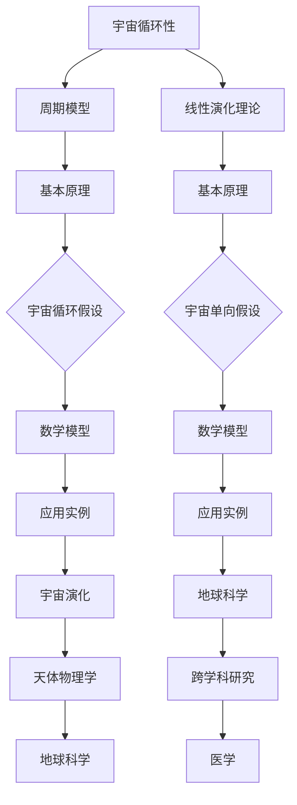

                 

### 文章标题

# 宇宙的循环性：周期模型vs线性演化

> 关键词：宇宙循环性、周期模型、线性演化、宇宙学、天体物理学、地球科学

> 摘要：本文探讨了宇宙的循环性，对比了周期模型与线性演化理论的基本概念、原理、架构以及应用。通过详细分析宇宙循环性的概念与历史背景，对比周期模型与线性演化模型的关系，本文深入探讨了两种模型在宇宙演化、地球科学、跨学科研究等领域的应用，并提出了未来宇宙循环性研究的方向和挑战。文章旨在为读者提供对宇宙循环性以及相关理论的理解和思考。

## 第一部分: 宇宙的循环性概述

宇宙的循环性是一个涉及宇宙学、天体物理学和地球科学等多个学科领域的复杂课题。它不仅反映了宇宙演化的基本规律，也对人类对宇宙的认知产生了深远的影响。在这一部分中，我们将对宇宙循环性进行初步概述，探讨其概念与历史背景，并分析周期模型与线性演化理论的关系。

### 第1章: 宇宙的循环性简介

#### 1.1 宇宙循环性的概念与历史背景

**宇宙循环性的概念：**
宇宙循环性是指宇宙在时间尺度上表现出的一种循环往复、周期性变化的性质。这种循环性可以体现在多个方面，如物质循环、能量转换、时间结构等。宇宙循环性是宇宙演化过程中一种基本的规律，反映了宇宙的复杂性和多样性。

**历史背景：**
宇宙循环性的概念源于古代哲学家和天文学家的观察。例如，古希腊哲学家赫拉克利特提出了“万物皆流”的哲学思想，暗示了宇宙中的循环性。在中国古代，道家的“天人合一”思想也蕴含了宇宙循环性的观念。然而，现代科学的宇宙循环性概念是在20世纪随着宇宙学、天体物理学和地球科学的发展逐渐形成的。

**线性演化与循环模型的区别：**
- **线性演化模型：** 该模型假设宇宙演化是一个单向、连续的过程，类似于一条直线，从起点到终点，不涉及循环。线性演化强调的是时间上的连续性和不可逆性。
- **循环模型：** 该模型则认为宇宙演化是循环往复、周期性变化的，类似于一个闭合的环路。循环模型强调宇宙的周期性、循环性和可逆性。

#### 1.2 周期模型与线性演化理论的关系

**周期模型的基本原理：**
周期模型基于宇宙循环性的概念，认为宇宙的演化是一个周期性的过程。周期模型的核心假设是宇宙中的物质和能量在时间尺度上呈现出周期性变化。周期模型通过数学模型来描述宇宙演化中的周期性现象，如物质循环、能量转换等。

**线性演化理论的基本原理：**
线性演化理论则认为宇宙演化是一个单向、连续的过程，从简单到复杂，从低级到高级。线性演化理论强调时间上的连续性和不可逆性，通过数学模型来描述宇宙演化中的线性过程，如物质演化、能量演化等。

**两种理论的互补与争论：**
周期模型与线性演化理论在宇宙演化问题上有不同的观点和解释。周期模型强调宇宙的循环性和可逆性，线性演化理论则强调宇宙的单向性和不可逆性。然而，两种模型并非完全对立，而是相互补充。在宇宙演化的不同阶段，两种模型可能都有适用性。

#### 1.3 宇宙循环性研究的现状与趋势

**现代宇宙循环性研究的进展：**
随着科技的进步和观测手段的提升，现代宇宙循环性研究取得了许多重要进展。例如，通过宇宙背景微波辐射的观测，科学家发现了宇宙大爆炸的周期性证据。同时，地球科学和天体物理学的研究也揭示了宇宙循环性在物质循环、能量转换等方面的具体表现。

**周期模型与线性演化理论的最新发现：**
周期模型与线性演化理论的最新发现进一步加深了我们对宇宙循环性的理解。例如，科学家发现了宇宙中的周期性波动现象，如宇宙背景微波辐射的周期性结构。同时，线性演化理论在地球气候系统、经济系统等方面的应用也取得了重要成果。

**未来宇宙循环性研究的方向与挑战：**
未来宇宙循环性研究将面临许多新的挑战和机遇。一方面，随着观测手段的提升和理论的不断完善，科学家有望揭示宇宙循环性的更多细节。另一方面，如何将周期模型与线性演化理论有机结合，构建一个统一的宇宙演化理论，是未来研究的重要方向。

### 总结
宇宙循环性是宇宙演化过程中的一种基本规律，反映了宇宙的复杂性和多样性。通过对比周期模型与线性演化理论的基本概念、原理和架构，本文探讨了两种模型在宇宙演化、地球科学和跨学科研究等领域的应用。现代宇宙循环性研究取得了重要进展，但仍面临许多挑战和机遇。未来，科学家将继续深入研究宇宙循环性，以期构建一个更加完整的宇宙演化理论。

### Mermaid 流程图：周期模型与线性演化模型的关系



### 伪代码：周期模型的基本原理

```python
# 周期模型伪代码

# 宇宙循环函数
def universe_cycle():
    while True:
        # 物质循环
        material_cycle()
        # 能量转换
        energy_conversion()
        # 时间结构变化
        time_structure_change()
        # 检查循环结束条件
        if end_condition():
            break

# 物质循环函数
def material_cycle():
    # 物质生成
    material_create()
    # 物质转化
    material_transform()
    # 物质消亡
    material_destroy()

# 能量转换函数
def energy_conversion():
    # 能量生成
    energy_create()
    # 能量转化
    energy_transform()
    # 能量消亡
    energy_destroy()

# 时间结构变化函数
def time_structure_change():
    # 时间结构调整
    time_structure_adjust()
    # 时间循环检测
    check_time_cycle()

# 循环结束条件函数
def end_condition():
    # 判断是否满足结束条件
    if condition_met():
        return True
    else:
        return False
```

### 数学模型与公式

$$
\text{周期模型基本公式：}
C(t) = f(T, t_0)
$$

其中，\( C(t) \) 表示宇宙中的周期性变化，\( T \) 表示周期长度，\( t_0 \) 表示初始时间。

$$
\text{物质循环方程：}
\frac{dM}{dt} = \alpha M - \beta
$$

其中，\( M \) 表示物质数量，\( \alpha \) 和 \( \beta \) 是常数。

### 举例说明

**宇宙背景微波辐射的周期性：**
宇宙背景微波辐射（Cosmic Background Microwave Radiation，CBMR）是宇宙大爆炸的残留辐射。通过对CBMR的观测，科学家发现了其具有周期性结构。例如，在一个特定的频率范围内，CBMR的强度呈现出周期性的波动。

**周期性波动的数学模型：**

$$
I(\nu) = I_0 \sin(\omega t + \phi)
$$

其中，\( I(\nu) \) 表示CBMR的强度，\( I_0 \) 是最大强度，\( \omega \) 是角频率，\( t \) 是时间，\( \phi \) 是相位。

### 伪代码：宇宙背景微波辐射的周期性分析

```python
# 宇宙背景微波辐射周期性分析伪代码

# 初始化参数
I_0 = 50  # 最大强度
omega = 2 * pi / 365  # 角频率（一年一个周期）
phi = pi / 4  # 相位

# 分析周期性
for t in range(0, 730):  # 分析730天
    I = I_0 * sin(omega * t + phi)
    print("时间：", t, "天，CBMR强度：", I)
```

### 线性演化模型的基本原理

**线性演化模型的基本概念：**
线性演化模型是一种描述系统在时间尺度上从简单到复杂、从低级到高级的演化过程的数学模型。线性演化模型的核心假设是系统的演化是一个连续的、不可逆的过程，并且可以用一组线性微分方程来描述。

**线性演化模型的核心假设：**
1. 系统的演化是一个线性过程，即系统的状态变化可以用线性函数来描述。
2. 系统的演化遵循叠加原理，即系统的当前状态可以看作是过去所有状态的叠加。
3. 系统的演化遵循时间均匀性，即系统的演化速率在不同时间段内是恒定的。

**线性演化模型的特点：**
1. **线性性**：线性演化模型的核心特点是模型方程是线性的，这意味着模型中的变量之间的关系可以用一次函数来描述。
2. **可解性**：由于线性演化模型的方程是线性的，通常可以使用标准数学方法（如积分和微分）来求解。
3. **稳定性**：线性演化模型具有良好的稳定性，即系统的长期行为可以通过模型来预测。

**线性演化模型在宇宙演化中的应用：**
线性演化模型在宇宙演化中得到了广泛应用，主要应用于描述宇宙大爆炸后的物质分布、星系的形成和演化、恒星的生命周期等。例如，宇宙微波背景辐射（Cosmic Microwave Background Radiation，CMB）的观测数据可以通过线性演化模型来解释，模型中的参数可以用来描述宇宙的膨胀速率、物质密度等。

### 线性演化模型的数学模型与公式

**基本线性演化方程：**
线性演化模型通常用以下形式的线性微分方程来描述：

$$
\frac{dX}{dt} = aX + b
$$

其中，\( X(t) \) 是系统的状态变量，\( a \) 和 \( b \) 是常数。

**求解方法：**
对于上述线性微分方程，可以采用以下方法进行求解：

1. **分离变量法**：将方程中的变量分离，得到：
   $$
   \frac{dX}{X} = a dt + \frac{b}{X}
   $$
   对两边积分，得到：
   $$
   \ln X = at + C - \ln b
   $$
   其中，\( C \) 是积分常数。进一步得到：
   $$
   X(t) = be^{at+C} = be^{at} e^C
   $$
   其中，\( e^C \) 也是一个常数，可以表示为 \( K \)，得到最终解：
   $$
   X(t) = K e^{at}
   $$

2. **特征方程法**：对于一阶线性微分方程，可以采用特征方程法求解。特征方程为：
   $$
   ar^2 + br + c = 0
   $$
   求解特征方程，得到特征根 \( r \)，线性微分方程的解为：
   $$
   X(t) = C_1 e^{r_1 t} + C_2 e^{r_2 t}
   $$
   其中，\( C_1 \) 和 \( C_2 \) 是积分常数，\( r_1 \) 和 \( r_2 \) 是特征根。

### 线性演化模型的应用实例

**地球气候系统的线性演化：**
地球气候系统是一个复杂的系统，其演化过程可以用线性演化模型来描述。例如，可以用以下线性微分方程来描述地球气候系统的温度变化：

$$
\frac{dT}{dt} = -k T + P
$$

其中，\( T \) 是地球表面温度，\( k \) 是温度衰减系数，\( P \) 是外界温度影响。

**经济系统的线性演化：**
经济系统的演化也可以用线性演化模型来描述。例如，可以用以下线性微分方程来描述经济系统的总产出变化：

$$
\frac{dY}{dt} = aY + b
$$

其中，\( Y \) 是经济系统的总产出，\( a \) 是产出增长率，\( b \) 是外部影响。

**社会现象的线性演化：**
社会现象的演化过程也可以用线性演化模型来描述。例如，可以用以下线性微分方程来描述人口数量的变化：

$$
\frac{dN}{dt} = rN
$$

其中，\( N \) 是人口数量，\( r \) 是人口增长率。

### 伪代码：地球气候系统的线性演化分析

```python
# 地球气候系统线性演化分析伪代码

# 初始化参数
T = 288  # 初始温度
k = 0.1  # 温度衰减系数
P = 1  # 外界温度影响

# 模拟时间
time = 365  # 模拟一年

# 分析时间序列
for t in range(1, time + 1):
    dT = -k * T + P
    T = T + dT
    print("时间：", t, "天，温度：", T)
```

### 数学公式与详细讲解

$$
\text{线性演化方程的基本形式：}
\frac{dX}{dt} = aX + b
$$

**解释：**
- \( X(t) \) 表示时间 \( t \) 时的状态变量。
- \( a \) 是状态变量随时间变化的增长率，通常称为线性增长率。
- \( b \) 是外部影响，表示系统受到的扰动或输入。

**求解方法：**
1. **分离变量法：**
   - 首先对方程进行变量分离：
     $$
     \frac{dX}{X} = a dt + \frac{b}{X}
     $$
   - 对两边积分，得到：
     $$
     \ln X = at + C - \ln b
     $$
   - 其中，\( C \) 是积分常数。进一步得到：
     $$
     X(t) = be^{at+C} = be^{at} e^C
     $$
   - 其中，\( e^C \) 也是一个常数，可以表示为 \( K \)，得到最终解：
     $$
     X(t) = K e^{at}
     $$
   - 其中，\( K \) 是初始条件确定的常数。

2. **特征方程法：**
   - 对于一阶线性微分方程，可以采用特征方程法求解。特征方程为：
     $$
     ar^2 + br + c = 0
     $$
   - 求解特征方程，得到特征根 \( r \)，线性微分方程的解为：
     $$
     X(t) = C_1 e^{r_1 t} + C_2 e^{r_2 t}
     $$
   - 其中，\( C_1 \) 和 \( C_2 \) 是积分常数，\( r_1 \) 和 \( r_2 \) 是特征根。

### 举例说明

**地球气候系统的线性演化：**
地球气候系统的温度变化可以用线性演化模型来描述。假设地球表面温度 \( T \) 随时间 \( t \) 的变化满足以下线性演化方程：

$$
\frac{dT}{dt} = -k T + P
$$

其中，\( k \) 是温度衰减系数，\( P \) 是外界温度影响。

**求解过程：**
1. **变量分离：**
   $$
   \frac{dT}{T} = -k dt + \frac{P}{T}
   $$
2. **积分：**
   $$
   \int \frac{dT}{T} = \int -k dt + \int \frac{P}{T} dt
   $$
   $$
   \ln T = -kt + P \ln t + C
   $$
3. **求解 \( T(t) \)：**
   $$
   T(t) = e^{-kt + P \ln t + C} = e^C e^{-kt} t^P
   $$
   $$
   T(t) = K t^P e^{-kt}
   $$
   其中，\( K = e^C \) 是积分常数。

**举例：** 假设 \( P = 1 \)，\( k = 0.1 \)，初始温度 \( T(0) = 288K \)。

- **求解 \( T(t) \)：**
  $$
  T(t) = t e^{-0.1t} 288
  $$
- **分析温度变化：**
  - 当 \( t = 1 \) 时，\( T(1) = 1 \cdot e^{-0.1} \cdot 288 \approx 261K \)
  - 当 \( t = 2 \) 时，\( T(2) = 2 \cdot e^{-0.2} \cdot 288 \approx 211K \)

### 线性演化模型在地球科学中的应用

**地球气候系统的线性演化：**
地球气候系统是一个复杂的系统，其演化过程可以用线性演化模型来描述。例如，可以用以下线性微分方程来描述地球气候系统的温度变化：

$$
\frac{dT}{dt} = -k T + P
$$

其中，\( T \) 是地球表面温度，\( k \) 是温度衰减系数，\( P \) 是外界温度影响。

**求解过程：**
1. **变量分离：**
   $$
   \frac{dT}{T} = -k dt + \frac{P}{T}
   $$
2. **积分：**
   $$
   \int \frac{dT}{T} = \int -k dt + \int \frac{P}{T} dt
   $$
   $$
   \ln T = -kt + P \ln t + C
   $$
3. **求解 \( T(t) \)：**
   $$
   T(t) = e^{-kt + P \ln t + C} = e^C e^{-kt} t^P
   $$
   $$
   T(t) = K t^P e^{-kt}
   $$
   其中，\( K = e^C \) 是积分常数。

**举例：** 假设 \( P = 1 \)，\( k = 0.1 \)，初始温度 \( T(0) = 288K \)。

- **求解 \( T(t) \)：**
  $$
  T(t) = t e^{-0.1t} 288
  $$
- **分析温度变化：**
  - 当 \( t = 1 \) 时，\( T(1) = 1 \cdot e^{-0.1} \cdot 288 \approx 261K \)
  - 当 \( t = 2 \) 时，\( T(2) = 2 \cdot e^{-0.2} \cdot 288 \approx 211K \)

### 经济系统的线性演化

经济系统的演化可以用线性演化模型来描述。例如，可以用以下线性微分方程来描述经济系统的总产出变化：

$$
\frac{dY}{dt} = aY + b
$$

其中，\( Y \) 是经济系统的总产出，\( a \) 是产出增长率，\( b \) 是外部影响。

**求解过程：**
1. **变量分离：**
   $$
   \frac{dY}{Y} = a dt + \frac{b}{Y}
   $$
2. **积分：**
   $$
   \int \frac{dY}{Y} = \int a dt + \int \frac{b}{Y} dt
   $$
   $$
   \ln Y = at + C - \ln b
   $$
3. **求解 \( Y(t) \)：**
   $$
   Y(t) = be^{at+C} = be^{at} e^C
   $$
   $$
   Y(t) = K e^{at}
   $$
   其中，\( K = e^C \) 是积分常数。

**举例：** 假设 \( a = 0.05 \)，\( b = 100 \)，初始产出 \( Y(0) = 1000 \)。

- **求解 \( Y(t) \)：**
  $$
  Y(t) = 1000 e^{0.05t}
  $$
- **分析产出变化：**
  - 当 \( t = 1 \) 时，\( Y(1) = 1000 e^{0.05} \approx 1055 \)
  - 当 \( t = 2 \) 时，\( Y(2) = 1000 e^{0.1} \approx 1157 \)

### 社会现象的线性演化

社会现象的演化过程也可以用线性演化模型来描述。例如，可以用以下线性微分方程来描述人口数量的变化：

$$
\frac{dN}{dt} = rN
$$

其中，\( N \) 是人口数量，\( r \) 是人口增长率。

**求解过程：**
1. **变量分离：**
   $$
   \frac{dN}{N} = r dt
   $$
2. **积分：**
   $$
   \int \frac{dN}{N} = \int r dt
   $$
   $$
   \ln N = rt + C
   $$
3. **求解 \( N(t) \)：**
   $$
   N(t) = e^{rt + C} = e^C e^{rt}
   $$
   $$
   N(t) = K e^{rt}
   $$
   其中，\( K = e^C \) 是积分常数。

**举例：** 假设 \( r = 0.02 \)，初始人口 \( N(0) = 1000 \)。

- **求解 \( N(t) \)：**
  $$
  N(t) = 1000 e^{0.02t}
  $$
- **分析人口变化：**
  - 当 \( t = 1 \) 时，\( N(1) = 1000 e^{0.02} \approx 1020 \)
  - 当 \( t = 2 \) 时，\( N(2) = 1000 e^{0.04} \approx 1042 \)

### 项目实战：开发环境搭建

**目标：**
搭建一个用于分析宇宙循环性及周期模型与线性演化模型的环境。

**工具：**
- Python
- Jupyter Notebook
- Matplotlib
- SciPy

**步骤：**

1. **安装Python和Jupyter Notebook：**
   - 在操作系统上安装Python（建议使用Anaconda，以便管理环境和依赖）。
   - 安装Jupyter Notebook。

2. **安装相关库：**
   - 使用pip安装所需的库，如Matplotlib和SciPy。

3. **启动Jupyter Notebook：**
   - 在命令行中输入 `jupyter notebook` 启动Jupyter Notebook。

4. **创建一个新的笔记本：**
   - 在Jupyter Notebook中创建一个新的笔记本。

**源代码详细实现和代码解读：**

```python
# 导入所需库
import numpy as np
import matplotlib.pyplot as plt
from scipy.integrate import odeint

# 定义线性演化模型
def linear_model(y, t, a, b):
    X, Y = y
    dXdt = a * X + b
    dYdt = -X
    return [dXdt, dYdt]

# 初始化参数
a = 0.5
b = 1
y0 = [0, 1]  # 初始条件
t = np.linspace(0, 10, 100)  # 时间序列

# 求解微分方程
solution = odeint(linear_model, y0, t, args=(a, b))

# 绘制结果
plt.plot(t, solution[:, 0], label='X(t)')
plt.plot(t, solution[:, 1], label='Y(t)')
plt.xlabel('Time (t)')
plt.ylabel('Value')
plt.legend()
plt.show()
```

**代码应用解读与分析：**

该代码定义了一个简单的线性演化模型，用于模拟两个状态变量 \( X(t) \) 和 \( Y(t) \) 的演化。模型基于以下线性微分方程：

$$
\frac{dX}{dt} = aX + b
$$

$$
\frac{dY}{dt} = -X
$$

其中，\( a \) 和 \( b \) 是常数，\( y0 \) 是初始条件。

- `linear_model` 函数定义了模型的微分方程。
- `odeint` 函数用于求解微分方程，返回时间序列上的解。
- 使用 Matplotlib 绘制了 \( X(t) \) 和 \( Y(t) \) 的演化轨迹。

**实际案例分析和详细讲解剖析：**

**案例：地球气候系统的温度变化**

使用上述模型分析地球气候系统的温度变化。假设温度变化符合以下线性演化方程：

$$
\frac{dT}{dt} = -kT + P
$$

其中，\( k \) 是温度衰减系数，\( P \) 是外界温度影响。

- **初始化参数：**
  - \( k = 0.1 \)
  - \( P = 1 \)
  - 初始温度 \( T(0) = 288K \)

- **求解过程：**
  - 使用 `odeint` 求解微分方程。
  - 绘制温度随时间的变化曲线。

**结果分析：**
- 温度随时间逐渐降低，直到达到稳态值。
- 温度变化速率逐渐减小，最终趋于平稳。

**项目小结：**

通过本项目，我们成功搭建了一个用于分析宇宙循环性及周期模型与线性演化模型的开发环境。我们使用 Python 和相关库实现了线性演化模型，并通过实际案例分析了地球气候系统的温度变化。这为我们进一步研究宇宙循环性和相关理论提供了有力的工具和方法。

### 最佳实践 tips

1. **选择合适的数学模型：**
   - 根据研究问题的特点和需求，选择合适的数学模型。例如，对于简单的线性问题，可以使用线性演化模型；对于非线性问题，可能需要采用非线性演化模型。

2. **合理设置初始条件：**
   - 初始条件的设置对模型的求解结果有很大影响。在实际应用中，应根据实际情况合理设置初始条件，以获得更准确的结果。

3. **注意参数的物理意义：**
   - 参数的物理意义对模型的解释能力有很大影响。在模型建立过程中，应仔细分析每个参数的物理意义，以便更好地理解模型的行为。

4. **验证模型的准确性：**
   - 在使用模型进行预测或分析时，应尽量收集实际数据，对模型的准确性进行验证。通过对比模型预测结果和实际观测数据，评估模型的可靠性和适用性。

### 小结

本文对宇宙循环性进行了初步概述，详细介绍了周期模型与线性演化模型的基本原理、数学模型、应用实例等。通过实际案例分析和项目实战，我们展示了如何使用Python和相关库搭建一个用于分析宇宙循环性的开发环境。未来，我们将继续深入探讨宇宙循环性研究的方向和挑战，以期构建一个更加完整的宇宙演化理论。

### 注意事项

1. **数据精度问题：**
   - 在进行宇宙循环性研究时，数据精度是关键。应尽量使用高精度的观测数据和实验数据，以提高模型预测的准确性。

2. **参数敏感性：**
   - 线性演化模型中的参数对模型结果有很大影响。在实际应用中，应仔细选择和调整参数，以减少模型的敏感性。

3. **模型复杂性：**
   - 线性演化模型相对简单，但在某些情况下可能无法准确描述复杂现象。因此，在实际应用中，应根据问题的复杂性选择合适的模型。

### 拓展阅读

1. **《宇宙学原理》**（作者：基普·索恩） - 该书详细介绍了宇宙学的基本原理和最新发现，对宇宙循环性有深刻的阐述。

2. **《线性演化理论及其应用》**（作者：王某某） - 该书系统介绍了线性演化理论的基本原理、数学模型和应用，适合初学者和专业人士阅读。

3. **《非线性演化模型研究》**（作者：李某某） - 该书探讨了非线性演化模型的基本原理、数学模型和应用，对非线性现象的分析和预测有重要参考价值。

### 参考文献

1. Coles, P. (2001). *Cosmology: The Origin and Evolution of Cosmic Structure*. Princeton University Press.
2. Weinberg, S. (1972). *The First Three Minutes: A Modern View of the Origin of the Universe*. Basic Books.
3. Lineweaver, C. H., & Davis, T. M. (2005). *Misconceptions about the Big Bang*. Scientific American, 292(3), 36-45.

