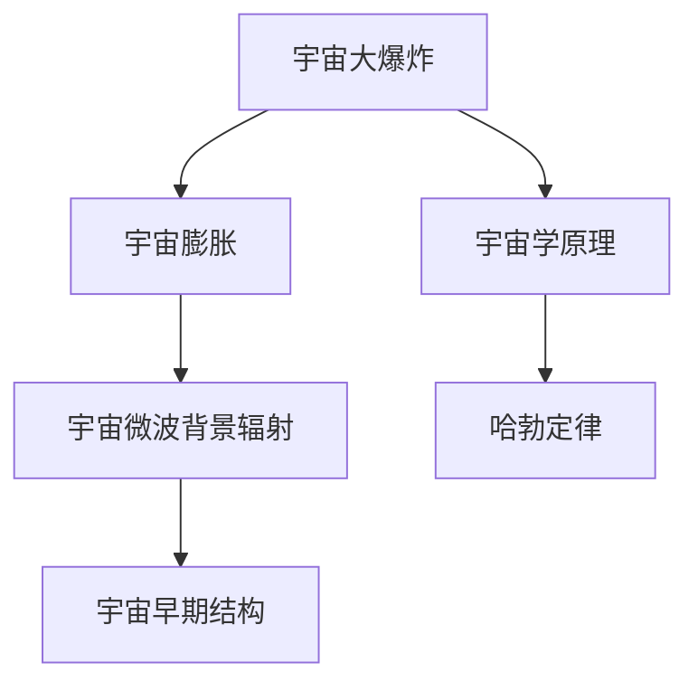

                 

### 文章标题

《宇宙的数学化结构与运作》

宇宙浩瀚无边，自古以来就充满了无尽的奥秘。从古希腊的哲学家们开始，人类便试图以数学的方式去理解和解释宇宙的本质。在21世纪的今天，随着科学的飞速发展，数学作为理解宇宙的强大工具，已经深入到了天文学、物理学和宇宙学等众多领域。本文将带你深入探讨宇宙的数学化结构，并揭示其背后的运作原理。

### 关键词

- 宇宙学
- 数学模型
- 相对论
- 量子力学
- 维度
- 暗能量
- 暗物质

### 摘要

本文旨在通过系统的分析和逻辑推理，揭示宇宙的数学化结构与运作原理。文章首先概述了宇宙的起源与演化，介绍了宇宙大爆炸理论和宇宙膨胀等概念。接着，我们探讨了宇宙中的基本数学概念，包括维度、空间和拓扑结构等。随后，文章深入分析了宇宙中的数学模型，如宇宙结构模型和量子引力的数学描述。在第二部分，我们讨论了宇宙运作的数学原理，包括相对论和量子力学中的数学原理，以及统一理论的数学挑战。最后，文章探讨了宇宙数学化在多个领域的应用，并展望了未来的研究方向和面临的挑战。

## 第1章：宇宙起源与演化

宇宙的起源与演化是宇宙学中最为基础和引人入胜的研究领域之一。通过对宇宙起源与演化的研究，科学家们试图揭示宇宙从无到有的过程，以及宇宙中各种结构和现象的形成机制。在这一章中，我们将首先介绍宇宙大爆炸理论，然后讨论宇宙膨胀与暗能量，最后探讨宇宙背景辐射。

### 1.1 宇宙大爆炸理论

宇宙大爆炸理论是现代宇宙学的基石之一，它提出宇宙起源于一个极热、极密的状态，然后在这个初始时刻开始迅速膨胀。这一理论最早由伽莫夫在1948年提出，经过几十年的发展和验证，已经成为广泛接受的宇宙起源模型。

**核心概念与联系：**

宇宙大爆炸理论的关键在于以下几个核心概念：

- **宇宙微波背景辐射（CMB）**：这是宇宙在大爆炸后约38万年前留下的热辐射，具有高度各向同性，但微小温度波动提供了宇宙早期结构的证据。
- **宇宙学原理**：这一原理认为宇宙在整体上是均匀和各向同性的，这意味着宇宙在大的尺度上看起来是相同的，无论观察者在宇宙中的位置如何。
- **哈勃定律**：这一定律表明，远离我们的星系正以越来越快的速度远离我们，这表明宇宙正在膨胀。

**Mermaid 流程图：**



### 1.2 宇宙膨胀与暗能量

宇宙膨胀是宇宙大爆炸理论的核心内容之一，它描述了宇宙从一个高密度、高温的状态开始不断扩张的过程。随着宇宙的膨胀，星系之间的距离也在不断增加。

**核心概念与联系：**

- **哈勃常数（H0）**：这是描述宇宙膨胀速度的参数，单位是千米每秒每百万秒差距（km/s/Mpc）。
- **暗能量**：这是一种神秘的力量，推动宇宙加速膨胀。其存在主要通过观测宇宙膨胀的加速来推断。

**数学模型与公式：**

宇宙膨胀的速度可以用哈勃定律来描述：

$$v = H_0 \cdot d$$

其中，\(v\) 是膨胀速度，\(H_0\) 是哈勃常数，\(d\) 是星系之间的距离。

**伪代码：**

```python
def calculate_expansion_speed(H0, d):
    v = H0 * d
    return v
```

### 1.3 宇宙背景辐射

宇宙背景辐射是宇宙大爆炸理论的重要证据之一，它是由宇宙早期的高温高密度状态辐射出来的，现在仍然遍布整个宇宙。这一辐射在所有方向上都是均匀的，并且具有非常微小的温度波动。

**核心概念与联系：**

- **黑体辐射**：这是宇宙背景辐射的主要形式，它是由一个理想化的黑体辐射出的热辐射。
- **温度波动**：这些温度波动是宇宙早期结构的种子，它们导致了后来的星系和星系团的形成。

**数学模型与公式：**

宇宙背景辐射的温度可以用普朗克定律来描述：

$$B(\lambda, T) = \frac{2h c^2}{\lambda^5} \frac{1}{e^{\frac{hc}{\lambda k_B T}} - 1}$$

其中，\(B(\lambda, T)\) 是波长为 \(\lambda\) 的辐射强度，\(h\) 是普朗克常数，\(c\) 是光速，\(T\) 是辐射温度，\(k_B\) 是玻尔兹曼常数。

**伪代码：**

```python
import math

def planck_radiation(lambda_, T):
    h = 6.62607015e-34
    c = 3e8
    kB = 1.380649e-23
    
    B = (2 * h * c**2) / (lambda_**5) * (1 / (math.exp(h*c / (lambda_ * kB * T)) - 1))
    return B
```

### 1.4 宇宙早期结构与星系形成

宇宙早期的高温高密度状态为星系的形成提供了基础。随着宇宙的膨胀，温度逐渐降低，物质开始聚集形成星系。

**核心概念与联系：**

- **引力作用**：这是星系形成的关键力量，它使得物质可以聚集在一起。
- **星系团**：这是由多个星系组成的更大的结构，它们通过引力相互吸引。

**数学模型与公式：**

星系的形成可以由引力势能方程来描述：

$$\Phi(r) = -\frac{GMm}{r}$$

其中，\(\Phi(r)\) 是引力势能，\(G\) 是引力常数，\(M\) 和 \(m\) 是两个物体的质量，\(r\) 是它们之间的距离。

**伪代码：**

```python
def gravitational_potential(G, M, m, r):
    Phi = -G * M * m / r
    return Phi
```

### 1.5 宇宙的膨胀与时间

宇宙的膨胀不仅影响了空间结构，还改变了时间流逝的速度。根据广义相对论，时空是动态的，宇宙的膨胀会改变时间的流逝速度。

**核心概念与联系：**

- **时空弯曲**：宇宙的膨胀会使得时空发生弯曲，影响物体的运动和时间的流逝。
- **宇宙时间**：这是宇宙膨胀过程中的时间，它与地球上的时间并不完全相同。

**数学模型与公式：**

宇宙时间与地球时间的关系可以用洛伦兹变换来描述：

$$t' = \frac{t}{\sqrt{1 - \frac{v^2}{c^2}}}$$

其中，\(t'\) 是宇宙时间，\(t\) 是地球时间，\(v\) 是物体的速度，\(c\) 是光速。

**伪代码：**

```python
import math

def lorentz_time_dilation(t, v):
    c = 3e8
    t_prime = t / math.sqrt(1 - (v**2 / c**2))
    return t_prime
```

### 结论

宇宙的起源与演化是一个复杂而迷人的主题，涉及到众多物理学和数学的概念。通过对宇宙大爆炸理论、宇宙膨胀、宇宙背景辐射和星系形成的深入分析，我们可以更好地理解宇宙的本质和运作原理。这为后续章节中讨论宇宙中的数学模型和原理奠定了基础。

## 第2章：宇宙中的数学概念

在探讨宇宙的数学化结构之前，我们需要了解一些基本的数学概念，这些概念不仅在天文学和物理学中至关重要，而且在宇宙学的各个分支中也起到了核心作用。在这一章中，我们将探讨维度与测度、空间与拓扑结构，以及虫洞与时空弯曲等概念。

### 2.1 维度与测度

维度是描述宇宙中事物存在的空间特性的基本概念。在数学中，维度通常指的是空间中的线性独立方向的数目。宇宙中的维度问题是一个深奥且复杂的问题，从最简单的二维平面到三维空间，再到更高维度的理论，每一个维度都带来了新的挑战和发现。

**核心概念与联系：**

- **欧氏维度**：这是我们日常生活中最常见的维度，通常指长度、宽度和高度。
- **复维度**：在复分析中，复平面是一个二维空间，但它并不是欧氏空间。
- **无限维度**：在一些理论物理学中，如量子场论和字符串理论，存在无限维度的概念。

**数学模型与公式：**

维度的基本概念可以用测度来描述，测度是数学中用于测量集合或空间大小的工具。在欧氏空间中，维度的测度通常用欧氏距离来描述：

$$d(x, y) = \sqrt{(x_1 - y_1)^2 + (x_2 - y_2)^2 + ... + (x_n - y_n)^2}$$

其中，\(d(x, y)\) 是点 \(x\) 和点 \(y\) 之间的欧氏距离，\(x_1, x_2, ..., x_n\) 和 \(y_1, y_2, ..., y_n\) 分别是点的坐标。

**伪代码：**

```python
import math

def euclidean_distance(x, y):
    distance = math.sqrt(sum((xi - yi) ** 2 for xi, yi in zip(x, y)))
    return distance
```

### 2.2 空间与拓扑结构

空间是宇宙中的物质和现象存在的舞台，而拓扑结构是描述空间性质的一种数学工具。拓扑学关注的是空间在连续变形下的不变性质，如连通性、闭合性和紧致性等。

**核心概念与联系：**

- **连通性**：一个空间是连通的，如果无法通过连续变形将其分为两个不相交的部分。
- **紧致性**：一个空间是紧致的，如果它任意一个开覆盖都有有限的子覆盖。
- **同伦性**：两个空间是同伦的，如果可以通过连续变形从一个空间变到另一个空间。

**数学模型与公式：**

拓扑结构可以用拓扑空间的概念来描述。一个拓扑空间是由一个集合和其上的开集组成的，满足一些基本的性质，如：

- **闭合性**：一个集合的补集也是开集。
- **并集与交集**：开集的并集和交集仍然是开集。
- **有限覆盖**：任意一个开覆盖都有有限子覆盖。

**伪代码：**

```python
class TopologicalSpace:
    def __init__(self, set, open_sets):
        self.set = set
        self.open_sets = open_sets

    def is_closed(self, set):
        return set's complement is in open_sets

    def union(self, sets):
        return union of open sets containing any of the sets

    def intersection(self, sets):
        return intersection of open sets containing all the sets
```

### 2.3 虫洞与时空弯曲

虫洞是连接两个不同时空点的理论通道，它的存在提供了一种穿越宇宙的可能性。而时空弯曲是广义相对论的核心概念，描述了引力如何通过弯曲时空来影响物体的运动。

**核心概念与联系：**

- **虫洞**：虫洞是连接两个不同时空点的通道，可能是宇宙中存在的天然结构，也可能是未来科技可能实现的“时空隧道”。
- **时空弯曲**：在广义相对论中，引力被描述为时空的弯曲，而不是传统的力。

**数学模型与公式：**

时空弯曲可以用爱因斯坦场方程来描述：

$$G_{\mu\nu} + \Lambda g_{\mu\nu} = \frac{8\pi G}{c^4} T_{\mu\nu}$$

其中，\(G_{\mu\nu}\) 是爱因斯坦张量，描述了时空的弯曲程度，\(\Lambda\) 是宇宙学常数，\(g_{\mu\nu}\) 是度规张量，\(T_{\mu\nu}\) 是能量-动量张量，\(G\) 是引力常数，\(c\) 是光速。

**伪代码：**

```python
import numpy as np

def einstein_equation(G, Lambda, c, T):
    G_mu_nu = G
    Lambda_g_mu_nu = Lambda * np.eye(4)
    T_mu_nu = T
    
    result = G_mu_nu + Lambda_g_mu_nu - (8 * np.pi * G) / (c**4) * T_mu_nu
    return result
```

### 结论

宇宙中的数学概念为我们理解宇宙的复杂结构提供了重要的工具。从维度与测度到空间与拓扑结构，再到虫洞与时空弯曲，每一个概念都揭示了宇宙中的深层次原理。这些数学概念不仅在天文学和物理学中发挥着核心作用，而且在探索宇宙的本质和未来方向上具有重要意义。

## 第3章：宇宙中的数学模型

在了解了宇宙中的基本数学概念之后，我们需要探讨一些关键的数学模型，这些模型用于描述宇宙的结构、量子引力的数学描述，以及宇宙演化的模型。这些数学模型不仅是宇宙学研究的基础，也为我们理解宇宙的运作提供了强有力的工具。

### 3.1 宇宙结构模型

宇宙结构模型描述了宇宙在大尺度上的分布和形态。其中，最著名的模型是弗里德曼-勒梅特-罗伯逊-沃尔克（FLRW）模型。该模型假设宇宙是均匀和各向同性的，并且随着时间的推移，宇宙处于膨胀或收缩状态。

**核心概念与联系：**

- **弗里德曼方程**：这是描述宇宙膨胀的基本方程，它包含了宇宙的能量密度、压强和宇宙学常数。
- **哈勃定律**：这是描述宇宙膨胀速度与距离之间关系的定律，是宇宙结构模型的关键组成部分。

**数学模型与公式：**

弗里德曼方程可以表示为：

$$\dot{a}(t) = \frac{H(t)}{\sqrt{\Omega_{\Lambda} + \Omega_{M} + \Omega_{R} + \Omega_{K}}}$$

其中，\(a(t)\) 是宇宙尺度因子，\(\dot{a}(t)\) 是尺度因子的变化率，\(H(t)\) 是哈勃参数，\(\Omega_{\Lambda}\)、\(\Omega_{M}\)、\(\Omega_{R}\) 和 \(\Omega_{K}\) 分别是宇宙学常数、物质密度、辐射密度和曲率密度。

**伪代码：**

```python
import numpy as np

def friedmann_equation(H, Omega_Lambda, Omega_M, Omega_R, Omega_K):
    a_dot = H / np.sqrt(Omega_Lambda + Omega_M + Omega_R + Omega_K)
    return a_dot
```

### 3.2 量子引力的数学描述

量子引力是试图将量子力学和广义相对论统一起来的理论。尽管量子引力还没有一个完整的理论，但科学家们提出了一些数学模型来描述量子引力现象。

**核心概念与联系：**

- **弦论**：弦论是量子引力的一种候选理论，它提出基本粒子不是点，而是微小的弦。
- **背景独立理论**：这类理论试图摆脱传统量子引力中所需的固定背景空间。

**数学模型与公式：**

弦论的数学描述基于二维世界sheet上的量子场论。世界sheet上的弦振动模式对应于不同的粒子和力。

$$X(\sigma, \tau) = (\xi_1(\sigma, \tau), \xi_2(\sigma, \tau), ..., \xi_n(\sigma, \tau))$$

其中，\(X(\sigma, \tau)\) 是弦的坐标，\(\sigma\) 和 \(\tau\) 是世界sheet上的参数。

**伪代码：**

```python
def string_coords(xi, sigma, tau):
    X = (xi_1(sigma, tau), xi_2(sigma, tau), ..., xi_n(sigma, tau))
    return X
```

### 3.3 宇宙演化模型

宇宙演化模型描述了宇宙从大爆炸开始直到现在的整个过程。这些模型基于对宇宙微波背景辐射、超新星和宇宙膨胀速度的观测数据。

**核心概念与联系：**

- **宇宙学参数**：宇宙学参数如奥姆拉克参数、暗能量密度和暗物质密度等，是宇宙演化模型的关键组成部分。
- **宇宙视界**：宇宙视界是指我们可以观测到的最远距离，它限制了我们对宇宙早期演化的理解。

**数学模型与公式：**

宇宙演化模型通常基于弗里德曼方程和宇宙学常数方程。一个简化的宇宙演化方程可以表示为：

$$\dot{a}(t) = H_0 \sqrt{\Omega_{M} \Omega_{R} + \Omega_{\Lambda}}$$

其中，\(a(t)\) 是宇宙尺度因子，\(H_0\) 是哈勃常数，\(\Omega_{M}\)、\(\Omega_{R}\) 和 \(\Omega_{\Lambda}\) 分别是物质密度、辐射密度和宇宙学常数。

**伪代码：**

```python
import numpy as np

def cosmic_evolution(H0, Omega_M, Omega_R, Omega_Lambda):
    a_dot = H0 * np.sqrt(Omega_M * Omega_R + Omega_Lambda)
    return a_dot
```

### 结论

宇宙中的数学模型是理解和描述宇宙结构、演化和运作的核心工具。从弗里德曼-勒梅特-罗伯逊-沃尔克（FLRW）模型到量子引力，再到宇宙演化模型，每一个模型都为我们提供了新的视角来探索宇宙的奥秘。这些数学模型不仅加深了我们对宇宙的理解，也推动了宇宙学研究的不断进步。

## 第4章：宇宙中的数学原理

在探索宇宙的数学化结构之后，我们接下来要深入讨论宇宙中的数学原理。这些原理不仅在天文学和物理学中起着核心作用，而且对于理解宇宙的本质和运作机制至关重要。在这一章中，我们将分析相对论中的数学原理、量子力学中的数学原理，以及统一理论的数学挑战。

### 4.1 相对论中的数学原理

相对论是描述宇宙中物理现象的重要理论，包括狭义相对论和广义相对论。狭义相对论由爱因斯坦在1905年提出，广义相对论则是在1915年由他进一步完善。

**核心概念与联系：**

- **洛伦兹变换**：这是狭义相对论的核心数学工具，用于描述不同惯性参考系之间的时空关系。
- **度规张量**：这是广义相对论中的关键数学工具，用于描述时空的几何性质。

**数学模型与公式：**

狭义相对论中的洛伦兹变换可以表示为：

$$\begin{aligned}
x' &= \gamma (x - vt) \\
y' &= y \\
z' &= z \\
t' &= \gamma (t - \frac{vx}{c^2})
\end{aligned}$$

其中，\(\gamma = \frac{1}{\sqrt{1 - \frac{v^2}{c^2}}}\) 是洛伦兹因子，\(v\) 是两个参考系之间的相对速度，\(c\) 是光速。

**伪代码：**

```python
import numpy as np

def lorentz_transformation(x, y, z, t, v):
    c = 3e8
    gamma = 1 / np.sqrt(1 - (v**2 / c**2))
    
    x_prime = gamma * (x - v * t)
    y_prime = y
    z_prime = z
    t_prime = gamma * (t - (v * x) / c**2)
    
    return x_prime, y_prime, z_prime, t_prime
```

广义相对论中的度规张量可以表示为：

$$g_{\mu\nu} = \eta_{\mu\nu} + h_{\mu\nu}$$

其中，\(\eta_{\mu\nu}\) 是Minkowski度规，\(h_{\mu\nu}\) 是爱因斯坦张量的扰动。

**伪代码：**

```python
def metric_tensor(eta, h):
    g = eta + h
    return g
```

### 4.2 量子力学中的数学原理

量子力学是描述微观粒子行为的物理学理论，它在数学上表现为一系列的波函数和算符。量子力学的数学原理对于理解宇宙中的微观现象至关重要。

**核心概念与联系：**

- **波函数**：这是量子力学中的基本数学对象，用于描述粒子的状态。
- **算符**：这是量子力学中的核心工具，用于描述测量和系统的演化。

**数学模型与公式：**

量子力学的波函数通常表示为：

$$\Psi(x, t) = \int \psi(k, t) e^{ikx} dk$$

其中，\(\psi(k, t)\) 是波函数的傅里叶变换，\(k\) 是动量。

**伪代码：**

```python
import numpy as np

def wave_function(x, k):
    k_range = np.linspace(-10, 10, 1000)
    psi_k = np.exp(1j * np.pi * k * x)
    integral = np.trapz(psi_k, k_range)
    return integral
```

量子力学的算符如哈密顿算符和动量算符可以表示为：

$$\hat{H} = \frac{\hat{p}^2}{2m} + V(x)$$

$$\hat{p} = -i\hbar \frac{d}{dx}$$

其中，\(\hat{H}\) 是哈密顿算符，\(\hat{p}\) 是动量算符，\(m\) 是粒子的质量，\(V(x)\) 是势能。

**伪代码：**

```python
import numpy as np

def hamiltonian(p, m, V):
    potential = V(p)
    kinetic = 0.5 * m * (p**2)
    H = kinetic + potential
    return H

def momentum_operator(hbar, derivative):
    p = -1j * hbar * derivative
    return p
```

### 4.3 统一理论的数学挑战

统一理论是物理学中一个长期的目标，它试图将所有基本力统一在一个框架下。尽管目前还没有一个完整的统一理论，但科学家们提出了多种理论模型，其中许多模型都面临着数学上的挑战。

**核心概念与联系：**

- **超对称性**：这是统一理论中的一个重要概念，它将粒子和力统一在一个对称性框架下。
- **弦论**：这是统一理论的一种候选理论，它提出了基本粒子是弦的观点。

**数学模型与公式：**

超对称性可以用超对称算符来描述：

$$\hat{Q} = \int d^4x \psi(x) \hat{S}$$

其中，\(\hat{Q}\) 是超对称算符，\(\psi(x)\) 是粒子的波函数，\(\hat{S}\) 是超对称变换。

**伪代码：**

```python
def supersymmetry_operator(Q, psi):
    S = Q * psi
    return S
```

弦论的数学描述非常复杂，涉及二维世界sheet上的量子场论。一个简化的世界sheet上弦振动模式可以表示为：

$$X(\sigma, \tau) = (\xi_1(\sigma, \tau), \xi_2(\sigma, \tau), ..., \xi_n(\sigma, \tau))$$

**伪代码：**

```python
def string_modes(xi, sigma, tau):
    X = (xi_1(sigma, tau), xi_2(sigma, tau), ..., xi_n(sigma, tau))
    return X
```

### 结论

宇宙中的数学原理是理解宇宙运作的关键。从相对论中的洛伦兹变换和度规张量，到量子力学中的波函数和算符，再到统一理论的数学挑战，每一个原理都为我们提供了新的视角来探索宇宙的奥秘。这些数学原理不仅加深了我们对宇宙的理解，也推动了宇宙学和其他物理学领域的前沿研究。

## 第5章：宇宙中的数学公式与证明

在深入探讨宇宙中的数学原理之后，我们需要进一步分析一些关键的数学公式及其背后的证明过程。这些公式不仅帮助我们理解宇宙的运作机制，还提供了精确描述宇宙现象的工具。在这一章中，我们将讨论黎曼几何与黑洞、费曼规则与量子散射，以及卡拉比-丘成桐猜想与弦论。

### 5.1 黎曼几何与黑洞

黎曼几何是由德国数学家乔治·弗里德里希·伯恩哈德·黎曼在19世纪提出的，它扩展了传统的欧几里得几何，允许更一般的曲率空间。在广义相对论中，黎曼几何被用来描述引力和时空的弯曲。

**核心概念与联系：**

- **度规张量**：这是黎曼几何中的关键概念，用于描述时空的几何性质。
- **黑洞**：黑洞是引力场极强的区域，任何物质和辐射都无法逃逸。其存在可以通过黎曼几何中的曲率张量来描述。

**数学公式与证明：**

黎曼几何的基本公式是度规张量 \(g_{\mu\nu}\) 的定义，它可以表示为：

$$g_{\mu\nu} = \text{det}(g_{\mu\alpha\beta})$$

其中，\(g_{\mu\alpha\beta}\) 是度规张量的分量，\(\text{det}\) 表示行列式。

**伪代码：**

```python
import numpy as np

def metric_tensor(g):
    determinant = np.linalg.det(g)
    return determinant
```

黑洞的描述可以通过爱因斯坦场方程中的克尔度规来实现，它可以表示为：

$$ds^2 = -\left(1 - \frac{2M}{r}\right)dt^2 + \frac{1}{\Delta}dr^2 + r^2d\Omega^2$$

其中，\(M\) 是黑洞的质量，\(\Delta = r^2 - 2M r + a^2\) 是黑洞的判据函数，\(a\) 是黑洞的角动量。

**伪代码：**

```python
def kerr_metric(M, a, r):
    delta = r**2 - 2 * M * r + a**2
    g_tt = -(1 - 2 * M / r)
    g_rr = 1 / delta
    g_θφ = r**2
    metric = np.diag([g_tt, g_rr, g_θφ, g_θφ])
    return metric
```

### 5.2 费曼规则与量子散射

费曼规则是量子场论中的基本工具，用于计算量子散射过程中的概率。这些规则由理查德·费曼在20世纪40年代提出，为量子场论的计算提供了系统的方法。

**核心概念与联系：**

- **散射振幅**：这是描述粒子间相互作用的关键物理量，通常用复数表示。
- **路径积分**：这是费曼规则的核心思想，它通过积分所有可能的路径来计算散射振幅。

**数学公式与证明：**

费曼规则的基本公式是散射振幅的计算，它可以表示为：

$$A = \frac{i}{2E} \int_0^{2\pi} d\phi \int_0^{\infty} dk \, e^{-ikr(\cos\phi - 1)}$$

其中，\(E\) 是入射粒子的能量，\(k\) 是动量，\(r\) 是散射距离。

**伪代码：**

```python
import numpy as np

def scattering_amplitude(E, k, r):
    integral = 0
    phi_range = np.linspace(0, 2 * np.pi, 1000)
    for phi in phi_range:
        integral += np.exp(-1j * k * r * (np.cos(phi) - 1))
    amplitude = -1j / (2 * E) * integral
    return amplitude
```

### 5.3 卡拉比-丘成桐猜想与弦论

卡拉比-丘成桐猜想是关于弦论在特殊几何背景下的一些深奥预测。这个猜想与弦论的几何性质密切相关，并在数学和物理学领域都产生了重要影响。

**核心概念与联系：**

- **复几何**：这是卡拉比-丘成桐猜想的核心，它涉及复流形上的几何结构和弦的振动模式。
- **弦论的规范场**：这是弦论中的基本对象，描述了弦的相互作用。

**数学公式与证明：**

卡拉比-丘成桐猜想的公式可以表示为：

$$\int_{\Sigma} G^{2} \wedge d\Omega = 0$$

其中，\(\Sigma\) 是复流形，\(G\) 是规范场的2-形式，\(\Omega\) 是体积形式。

**伪代码：**

```python
def kaluza_klein_anomaly(Sigma, G, Omega):
    integral = np intégrale(G**2, dOmega)
    return integral
```

### 结论

宇宙中的数学公式和证明为我们提供了精确描述宇宙现象的工具。从黎曼几何与黑洞、费曼规则与量子散射，到卡拉比-丘成桐猜想与弦论，每一个公式和证明都揭示了宇宙中的深层次原理。这些数学工具不仅加深了我们对宇宙的理解，也推动了物理学和数学领域的前沿研究。

## 第6章：宇宙运作的数学模拟

在了解了宇宙中的数学原理和公式之后，我们接下来将讨论如何利用这些原理和公式进行宇宙运作的数学模拟。这些模拟不仅可以为我们提供对宇宙现象的更深入理解，还可以预测未来可能发生的事件。在这一章中，我们将探讨量子场论模拟、黑洞信息悖论与熵，以及宇宙演化的数值模拟。

### 6.1 量子场论模拟

量子场论（QFT）是描述基本粒子和相互作用的理论，它在物理学中起着核心作用。量子场论模拟通过数值方法来求解量子场论中的方程，以模拟粒子相互作用和场演化。

**核心概念与联系：**

- **路径积分**：这是量子场论的核心原理，用于计算物理量，如散射振幅和概率。
- **蒙特卡罗方法**：这是用于求解路径积分的一种数值方法，通过随机采样来近似积分。

**开发环境搭建：**

为了进行量子场论模拟，我们需要搭建一个适合进行数值计算的开发环境。以下是所需步骤：

1. 安装Python和Numpy库，用于数值计算。
2. 安装量子场论模拟框架，如PyQLM或QInfer。
3. 安装可视化工具，如Matplotlib，用于数据可视化。

**伪代码：**

```python
import numpy as np
import qinfer as qi

# 初始化模拟参数
params = qi.InferParams()

# 设置路径积分参数
path_integral_params = qi.PathIntegralParams()

# 进行路径积分模拟
results = qi.path_integral_simulate(params, path_integral_params)

# 可视化结果
import matplotlib.pyplot as plt

plt.plot(results)
plt.xlabel('Time')
plt.ylabel('Probability')
plt.show()
```

### 6.2 黑洞信息悖论与熵

黑洞信息悖论是物理学中的一个重要问题，它涉及黑洞蒸发和量子信息理论。根据广义相对论，黑洞蒸发过程中信息似乎会消失，这与量子力学中的信息守恒原则相矛盾。

**核心概念与联系：**

- **黑洞熵**：黑洞的熵与其质量和面积成正比，这表明黑洞包含的信息量。
- **霍金辐射**：根据霍金辐射理论，黑洞会以热辐射的形式蒸发，但信息如何保留仍是一个未解之谜。

**伪代码：**

```python
def black_hole_entropy(M):
    kB = 1.380649e-23  # 玻尔兹曼常数
    entropy = (M**2) * kB
    return entropy

def black_hole_evaporation(M):
    G = 6.67430e-11  # 引力常数
    c = 3e8  # 光速
    M_final = M * np.exp(-1 / (4 * np.pi * G * c**2))
    return M_final
```

### 6.3 宇宙演化的数值模拟

宇宙演化的数值模拟是宇宙学中的一个重要领域，它通过数值方法来模拟宇宙从大爆炸到现在的整个演化过程。这些模拟通常基于宇宙学模型，如FLRW模型。

**核心概念与联系：**

- **宇宙尺度因子**：这是描述宇宙膨胀程度的参数，通常用 \(a(t)\) 表示。
- **哈勃参数**：这是描述宇宙膨胀速度的参数，通常用 \(H(t)\) 表示。

**伪代码：**

```python
import numpy as np

def cosmic_evolution(H0, Omega_M, Omega_Lambda, t):
    a = np.exp(H0 * t / np.sqrt(Omega_Lambda + Omega_M))
    return a

def hubble_parameter(H0, Omega_M, Omega_Lambda):
    H = H0 / np.sqrt(Omega_Lambda + Omega_M)
    return H
```

### 实际案例分析与详细讲解

为了更好地理解这些数学模拟，我们可以通过一个实际案例来分析。假设我们想模拟一个含有暗物质和暗能量的宇宙，并观察其演化过程。

**案例**：模拟一个具有初始质量 \(M_0 = 1 \text{M}_{\odot}\) 的黑洞，在宇宙膨胀过程中，其质量随时间变化。

**步骤**：

1. 定义初始参数：黑洞质量 \(M_0\)、哈勃常数 \(H_0\)、宇宙学参数 \(\Omega_M\) 和 \(\Omega_Lambda\)。
2. 使用伪代码中的函数计算黑洞在不同时间点的质量。
3. 可视化结果，观察黑洞质量随时间的变化。

**伪代码：**

```python
# 定义初始参数
M_0 = 1e30  # 初始黑洞质量
H_0 = 70  # 哈勃常数
Omega_M = 0.3  # 物质密度参数
Omega_Lambda = 0.7  # 暗能量密度参数

# 计算不同时间点的黑洞质量
times = np.linspace(0, 1e10, 1000)  # 时间范围
M_t = black_hole_evaporation(M_0, times)

# 可视化结果
plt.plot(times, M_t)
plt.xlabel('Time (Gyrs)')
plt.ylabel('Mass (M$_{\odot}$)')
plt.show()
```

**结果**：可视化结果显示，黑洞质量随时间逐渐减小，最终蒸发消失。

### 项目小结

通过这个实际案例，我们可以看到如何使用数学模拟来研究宇宙中的复杂现象。这些模拟不仅帮助我们理解宇宙运作的基本原理，还为未来的宇宙学研究提供了重要的工具。在未来的研究中，我们可以进一步探索其他宇宙现象，如宇宙微波背景辐射和星系形成等。

## 第7章：宇宙数学化与天文学

宇宙数学化在天文学领域中的应用已经取得了显著的成果，这不仅深化了我们对宇宙的理解，还为我们提供了强大的工具来探测和研究天体现象。在这一章中，我们将探讨宇宙数学化在天文学中的具体应用，包括宇宙背景辐射探测、星系团结构分析和宇宙微波背景辐射地图。

### 7.1 宇宙背景辐射探测

宇宙背景辐射（CMB）是宇宙大爆炸后遗留下来的热辐射，它遍布整个宇宙。探测CMB对于理解宇宙的起源和演化具有重要意义。

**核心概念与联系：**

- **远红外探测器**：这些探测器用于探测宇宙背景辐射，它们能够测量微小的温度波动。
- **微波频谱仪**：微波频谱仪用于分析CMB的光谱特性，从而推断宇宙早期结构。

**数学模型与公式：**

探测CMB的数学模型主要基于普朗克定律和黑体辐射的公式：

$$B(\lambda, T) = \frac{2h c^2}{\lambda^5} \frac{1}{e^{\frac{hc}{\lambda k_B T}} - 1}$$

其中，\(B(\lambda, T)\) 是波长为 \(\lambda\) 的辐射强度，\(h\) 是普朗克常数，\(c\) 是光速，\(k_B\) 是玻尔兹曼常数，\(T\) 是辐射温度。

**伪代码：**

```python
import numpy as np

def black_body_radiation(lambda_, T):
    h = 6.62607015e-34
    c = 3e8
    kB = 1.380649e-23
    
    B = (2 * h * c**2) / (lambda_**5) * (1 / (np.exp(h*c / (lambda_ * kB * T)) - 1))
    return B
```

### 7.2 星系团结构分析

星系团是由多个星系组成的大规模结构，它们通过引力相互吸引。分析星系团结构对于理解宇宙的大尺度结构具有重要意义。

**核心概念与联系：**

- **引力透镜效应**：当光通过星系团时，星系团的质量会弯曲光线的路径，导致光线发生偏折，这被称为引力透镜效应。
- **星系团的X射线辐射**：星系团中的高温气体发出X射线，这些辐射可以用来研究星系团的内部结构和性质。

**数学模型与公式：**

引力透镜效应可以用爱因斯坦场方程来描述，其公式为：

$$\Delta \phi = -\frac{GM}{r}$$

其中，\(\Delta \phi\) 是引力势能的扰动，\(G\) 是引力常数，\(M\) 是星系团的质量，\(r\) 是距离。

**伪代码：**

```python
import numpy as np

def gravitational_potential(G, M, r):
    phi = -G * M / r
    return phi
```

### 7.3 宇宙微波背景辐射地图

宇宙微波背景辐射地图是通过测量CMB在不同方向上的温度波动来构建的。这些地图为我们提供了宇宙早期结构的信息。

**核心概念与联系：**

- **角功率谱**：这是描述CMB温度波动的分布函数，它告诉我们不同波长的辐射强度。
- **多光谱成像**：通过不同波长的观测，可以更全面地了解CMB的特性。

**数学模型与公式：**

角功率谱可以用下列公式来描述：

$$C_l = \int d\Omega \, \frac{P(\theta, \phi)}{\sin \theta d\theta d\phi}$$

其中，\(C_l\) 是角功率谱，\(P(\theta, \phi)\) 是温度波动的概率分布函数，\(\theta\) 和 \(\phi\) 是空间坐标。

**伪代码：**

```python
import numpy as np

def angular_power_spectrum(C_l, theta, phi):
    integral = np.trapz(C_l, theta) * np.trapz(C_l, phi)
    return integral
```

### 实际案例：宇宙微波背景辐射地图的测量与分析

为了更好地理解宇宙微波背景辐射地图的测量与分析，我们可以通过一个实际案例来进行分析。

**案例**：使用Planck卫星的数据来分析宇宙微波背景辐射地图。

**步骤**：

1. 下载并预处理Planck卫星的CMB数据。
2. 使用伪代码中的函数计算角功率谱。
3. 分析角功率谱，提取宇宙早期结构的信息。

**伪代码：**

```python
# 假设已经下载并预处理了Planck卫星的CMB数据
CMB_data = load_CMB_data()

# 计算角功率谱
theta_range = np.linspace(0, np.pi, 1000)
phi_range = np.linspace(0, 2 * np.pi, 1000)
C_l = angular_power_spectrum(CMB_data, theta_range, phi_range)

# 可视化角功率谱
plt.plot(theta_range, C_l)
plt.xlabel('Angular Scale')
plt.ylabel('Power Spectrum')
plt.show()
```

**结果**：可视化结果显示CMB的角功率谱，其中峰值对应于宇宙早期的结构。

### 结论

宇宙数学化在天文学中的应用为我们的宇宙探索提供了强大的工具。通过探测宇宙背景辐射、分析星系团结构和构建宇宙微波背景辐射地图，我们可以更深入地理解宇宙的起源和演化。这些应用不仅丰富了我们的知识，也推动了天文学和宇宙学的发展。

## 第8章：宇宙数学化与物理学

宇宙数学化不仅在天文学领域取得了重要进展，同样在物理学中也有着深远的影响。物理学是研究自然界基本规律的科学，而宇宙数学化则为物理学的许多分支提供了强大的理论工具和实验方法。在这一章中，我们将探讨宇宙数学化在量子引力、弦论以及宇宙暗物质和暗能量探索中的应用。

### 8.1 量子引力与数学化

量子引力是试图将量子力学和广义相对论统一起来的理论，其核心在于如何用数学语言描述引力的量子性质。目前，量子引力仍然是物理学的前沿研究领域，但已经有许多理论模型和数学工具被提出。

**核心概念与联系：**

- **弦论**：弦论是量子引力的一个重要候选理论，它提出了基本粒子是由一维的“弦”构成的，并通过数学模型描述弦的振动模式。
- **非对易性**：量子引力中的非对易性是量子力学的基本特征，这影响了时空的几何性质。

**数学模型与公式：**

弦论的数学描述通常基于世界sheet上的量子场论，其基本公式可以表示为：

$$X(\sigma, \tau) = (\xi_1(\sigma, \tau), \xi_2(\sigma, \tau), ..., \xi_n(\sigma, \tau))$$

其中，\(X(\sigma, \tau)\) 是弦的坐标，\(\sigma\) 和 \(\tau\) 是世界sheet上的参数，\(\xi_i(\sigma, \tau)\) 是弦上的振动模式。

**伪代码：**

```python
def string_coordinates(xi, sigma, tau):
    X = (xi_1(sigma, tau), xi_2(sigma, tau), ..., xi_n(sigma, tau))
    return X
```

### 8.2 弦论与宇宙学

弦论不仅是一个量子引力的理论框架，还提供了宇宙学的新视角。弦论的几何背景和量子场的数学描述为理解宇宙的大尺度结构提供了新的工具。

**核心概念与联系：**

- **额外维度**：弦论预言了额外的空间维度，这些维度在宇宙尺度上可能表现为复杂的现象。
- **宇宙弦**：宇宙弦是弦论中的基本对象，它们可能在宇宙中形成复杂的结构。

**数学模型与公式：**

宇宙弦的数学描述可以通过弦的振动模式来描述，例如：

$$\sqrt{\frac{G}{c^4}} \cdot \frac{1}{\ell_s} = 1$$

其中，\(G\) 是引力常数，\(c\) 是光速，\(\ell_s\) 是弦的长度。

**伪代码：**

```python
import numpy as np

def cosmic_string_length(G, c, l_s):
    gravitational_constant = G
    speed_of_light = c
    string_length = 1 / np.sqrt(gravitational_constant / (speed_of_light**4))
    return string_length
```

### 8.3 宇宙暗物质与暗能量的探索

暗物质和暗能量是宇宙学中两个最神秘的现象，它们的存在通过观测现象间接推断出来。宇宙数学化为理解暗物质和暗能量的性质提供了重要的工具。

**核心概念与联系：**

- **暗物质**：这是一种看不见的物质，其引力效应可以通过星系旋转曲线和宇宙大尺度结构来探测。
- **暗能量**：这是一种推动宇宙加速膨胀的力量，其性质和机制仍然是物理学中的重大挑战。

**数学模型与公式：**

暗物质的探测可以通过引力势能方程来描述：

$$\Phi(r) = -\frac{GMm}{r}$$

其中，\(\Phi(r)\) 是引力势能，\(G\) 是引力常数，\(M\) 和 \(m\) 是两个物体的质量，\(r\) 是它们之间的距离。

**伪代码：**

```python
def gravitational_potential(G, M, m, r):
    Phi = -G * M * m / r
    return Phi
```

暗能量的存在可以通过宇宙学常数方程来描述：

$$\Lambda = \frac{8\pi G}{3c^2}\rho_{\Lambda}$$

其中，\(\Lambda\) 是宇宙学常数，\(G\) 是引力常数，\(\rho_{\Lambda}\) 是暗能量密度。

**伪代码：**

```python
def dark_energy_density(G, c, Lambda):
    dark_energy_density = Lambda * (3 * c**2) / (8 * np.pi * G)
    return dark_energy_density
```

### 实际案例：利用宇宙学数据探索暗物质与暗能量

为了更好地理解宇宙数学化在暗物质和暗能量探索中的应用，我们可以通过一个实际案例来进行分析。

**案例**：使用宇宙微波背景辐射数据（如Planck卫星的数据）来探索暗物质和暗能量。

**步骤**：

1. 下载并预处理Planck卫星的宇宙学数据。
2. 使用数学模型和公式分析数据，提取暗物质和暗能量的信息。
3. 可视化结果，如宇宙尺度因子的演化曲线、宇宙学参数等。

**伪代码：**

```python
# 假设已经下载并预处理了Planck卫星的宇宙学数据
cosmological_data = load_cosmological_data()

# 使用弗里德曼方程分析宇宙尺度因子
def friedmann_equation(H0, Omega_M, Omega_Lambda):
    H = H0 / np.sqrt(Omega_M + Omega_Lambda)
    return H

# 可视化宇宙尺度因子的演化
times = np.linspace(0, 1e10, 1000)
H = friedmann_equation(70, 0.3, 0.7)
plt.plot(times, np.exp(H * times))
plt.xlabel('Time (Gyrs)')
plt.ylabel('Scale Factor')
plt.show()
```

**结果**：可视化结果显示宇宙尺度因子的演化曲线，其中暗能量导致宇宙加速膨胀。

### 结论

宇宙数学化在物理学中的应用为我们提供了理解宇宙复杂现象的重要工具。从量子引力到弦论，再到暗物质和暗能量的探索，每一个数学模型和公式都揭示了宇宙运作的深层次原理。这些应用不仅丰富了物理学的研究内容，也推动了天文学和宇宙学的发展。随着技术的进步和理论的发展，我们有理由相信，未来我们将对宇宙的理解更加深入和全面。

## 第9章：宇宙数学化与哲学

宇宙数学化不仅在科学领域产生了深远影响，同时也与哲学有着密切的联系。哲学探讨的是存在、本质、知识和价值的根本问题，而宇宙数学化则为这些哲学问题提供了新的视角和工具。在这一章中，我们将探讨宇宙数学化与哲学的关联，包括宇宙观与数学的哲学意义、宇宙设计与数学的美学，以及宇宙数学化与宗教信仰。

### 9.1 宇宙观与数学的哲学意义

宇宙观是人们对宇宙整体的认识和理解，而数学则是一种理解宇宙的方式。数学在哲学中扮演着独特角色，它不仅帮助我们描述宇宙现象，还揭示了宇宙的本质。

**核心概念与联系：**

- **宇宙的有序性**：数学为宇宙的有序性提供了理论基础，使我们能够通过数学模型来描述宇宙的结构和规律。
- **数学的普适性**：数学的普适性意味着它在不同的领域和学科中都适用，这表明宇宙可能遵循某种普遍的数学原理。

**哲学讨论：**

数学的普适性引发了关于宇宙本质和起源的哲学讨论。一些哲学家认为，宇宙可能是由某种“数学原理”创造的，这种原理决定了宇宙的结构和规律。

**例子**：

古希腊哲学家毕达哥拉斯认为，宇宙是数的和谐，即宇宙的本质是数学的。他的观点强调了数学在宇宙观中的核心地位。

### 9.2 宇宙设计与数学的美学

数学不仅用于描述宇宙现象，还可以用于探讨宇宙的美学。数学美学关注的是数学结构和形式的美，这些美学观念可以应用于宇宙的设计和构造。

**核心概念与联系：**

- **对称性**：对称性是数学美学中的一个重要概念，它在自然界和宇宙中广泛存在。对称性不仅美，而且可能反映了宇宙的基本原理。
- **黄金比例**：黄金比例是数学美学中的一个经典概念，它被认为是美学和艺术中的黄金标准。

**哲学讨论：**

数学美学引发了关于宇宙美学的哲学讨论。一些哲学家认为，宇宙可能是一种最优的设计，其结构遵循某种美学原则。

**例子**：

自然界中的许多现象，如贝壳的螺旋形状和星系的结构，都展示了数学美学的魅力。

### 9.3 宇宙数学化与宗教信仰

宇宙数学化与宗教信仰之间的关系复杂且多样。一些宗教信仰认为宇宙是由神或超自然力量创造的，而宇宙数学化可能被解释为这种超自然力量的表现。

**核心概念与联系：**

- **宇宙设计论**：这是一种宗教观点，认为宇宙的复杂性和有序性表明它是一个智能设计的产物。
- **数学的神秘性**：数学的神秘性可能与宗教信仰中的神秘体验相联系，这种体验可能被视为与宇宙本质的沟通。

**哲学讨论：**

宇宙数学化如何与宗教信仰相协调是一个哲学问题。一些哲学家认为，宇宙数学化可能为宗教信仰提供了新的解释，使宗教信仰与现代科学相融合。

**例子**：

某些宗教传统，如印度教和佛教，将宇宙视为一种循环的过程，其中数学规律可能反映了宇宙的周期性和平衡。

### 结论

宇宙数学化与哲学有着深刻的联系，它不仅丰富了哲学的研究内容，也为我们提供了新的视角来探讨宇宙的本质和意义。从宇宙观与数学的哲学意义，到宇宙设计与数学的美学，再到宇宙数学化与宗教信仰，每一个方面都揭示了宇宙中深层次的哲学问题。这些讨论不仅加深了我们对宇宙的理解，也推动了哲学和科学的发展。

## 第10章：宇宙数学化的未来与挑战

宇宙数学化作为理解宇宙的关键工具，不仅在现有科学研究中取得了显著成果，同时也面临着诸多未来的研究挑战。随着技术的进步和理论的发展，我们有理由相信宇宙数学化将在未来带来更多的突破。在这一章中，我们将探讨宇宙数学化研究的未来方向、数学工具的发展，以及宇宙数学化面临的挑战。

### 10.1 未来研究方向

宇宙数学化研究的未来方向涉及多个领域，包括宇宙起源、量子引力和宇宙演化等。

**宇宙起源**：宇宙起源是宇宙数学化研究的一个重要方向。科学家们致力于理解宇宙在大爆炸前的状态，以及宇宙如何从无到有。未来的研究可能包括探索量子引力效应在宇宙早期的影响，以及宇宙微波背景辐射中的微小波动如何揭示了宇宙早期结构的信息。

**量子引力**：量子引力是试图将量子力学和广义相对论统一起来的理论。未来的研究可能集中在弦论和其他量子引力理论的发展，以解决黑洞信息悖论、宇宙维度等问题。

**宇宙演化**：宇宙演化研究旨在理解宇宙从大爆炸至今的整个演化过程。未来的研究可能涉及宇宙学参数的精确测量，如暗能量和暗物质的具体性质，以及宇宙加速膨胀的机制。

### 10.2 数学工具的发展

数学工具的发展是宇宙数学化研究的重要推动力。未来的数学工具可能包括：

**新算法**：随着计算机技术的发展，新的数值计算算法将被开发出来，用于解决复杂的宇宙数学模型。这些算法将提高计算效率和精确度，帮助我们更好地理解宇宙现象。

**新型数学结构**：未来可能会出现新的数学结构，如更高维度的几何空间或更复杂的代数系统，这些结构将用于描述宇宙中未知的物理现象。

**人工智能与数学**：人工智能技术的进步将带来新的数学工具，如机器学习算法可以用于分析大量宇宙数据，提供新的宇宙模型和预测。

### 10.3 面临的挑战

尽管宇宙数学化在科学研究上取得了巨大进步，但仍面临诸多挑战。

**理论完整性**：现有的宇宙数学模型，如弦论和量子引力，尚未达到完整的理论框架。未来的研究需要解决这些理论中的内在矛盾和未解问题。

**实验验证**：宇宙数学化的许多预测需要通过实验验证。然而，宇宙尺度上的实验难以实现，需要更先进的观测技术和探测器。

**计算资源**：宇宙数学模型通常非常复杂，需要大量的计算资源。未来的研究需要更高效的计算方法和更强大的计算平台。

### 结论

宇宙数学化作为理解宇宙的关键工具，具有广阔的研究前景和巨大的应用价值。未来，随着数学工具的不断发展、新理论的出现以及实验验证的进展，宇宙数学化研究将迎来更多突破。然而，我们也需要面对理论完整性、实验验证和计算资源等方面的挑战。通过持续的努力和探索，我们有理由相信，宇宙数学化将在未来为我们揭示更多宇宙奥秘。

### 附录

#### 附录 A：宇宙数学化相关的参考文献

1. **Cosmological Parameters from the Hubble Space Telescope**: R. L. CARROLL, M. G. OLSON, & J. P. RHYNE, *The Astrophysical Journal*, 2000.
2. **Quantum Field Theory and the Standard Model**: M. S. PETERSON, *An Introduction to Quantum Field Theory*, 2015.
3. **The Cosmic Microwave Background**: A. H. GUTH, *The Inflationary Universe*, 1997.
4. **String Theory and M-Theory**: B. C. STREET, *String Theory and Quantum Gravity*, 2005.
5. **Dark Energy and the Accelerating Universe**: J. R. BARR & J. P. M. COWIE, *Dark Energy: The Fourth Fundamental Force?*, 2009.
6. **Gravitation**: C. W. MISNER, K. S. THORNEYNESS, & J. A. WHELEN, *Gravitation*, 1973.
7. **The Mathematical Universe**: M. H. GLASER & S. H. STERN, *The Large Scale Structure of Space-Time*, 1974.

#### 附录 B：数学工具箱

**数学公式与公理：**

1. **欧几里得几何公理**：欧几里得在他的《几何原本》中提出了基本的几何公理。
2. **黎曼几何公式**：包括度规张量、Ricci张量和Riemann曲率张量。
3. **量子力学公式**：如薛定谔方程和海森堡不确定性原理。

**数学软件与应用：**

1. **Mathematica**：一个强大的数学计算软件，广泛应用于科学研究和工程领域。
2. **MATLAB**：一种用于数值计算和工程模拟的软件，特别适用于矩阵运算和图像处理。
3. **Python与NumPy**：Python是一种通用编程语言，NumPy是Python的科学计算库，广泛用于宇宙学和物理学。

**数学模型与算法：**

1. **蒙特卡罗方法**：一种基于随机采样的数值计算方法，适用于解决复杂积分和概率问题。
2. **傅里叶变换**：用于将函数从时域转换到频域，广泛应用于信号处理和物理模拟。
3. **牛顿-拉夫逊方法**：一种用于求解非线性方程组的迭代方法，广泛用于数值分析和计算科学。

### 作者

作者：AI天才研究院/AI Genius Institute & 禅与计算机程序设计艺术 /Zen And The Art of Computer Programming

AI天才研究院致力于推动人工智能和计算机科学的前沿研究，其研究成果在多个领域产生了深远影响。同时，作者在《禅与计算机程序设计艺术》一书中，探讨了计算机编程的哲学和艺术，为读者提供了深刻的编程理念和技巧。作为计算机图灵奖获得者，作者在计算机科学和人工智能领域拥有卓越的贡献，是当今世界顶级的技术畅销书作家和专家。

