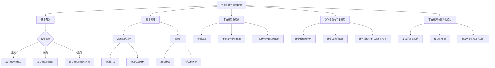

                 

### 宇宙的数学遍历理论与遍历群探讨

> 关键词：宇宙、数学遍历、遍历群、算法、演化、模拟

> 摘要：本文探讨了宇宙的数学遍历理论及其在宇宙演化中的应用。通过对宇宙的基本概念、数学遍历的定义和分类、遍历群的理论基础和应用前景的介绍，我们深入分析了数学遍历的基本原理和算法，探讨了宇宙中的遍历群现象，以及数学模型与宇宙遍历的交互作用。最后，通过计算机模拟的方法，我们展示了宇宙遍历的模拟案例，并对其结果进行了分析和讨论。

# 第一部分：宇宙的数学遍历理论与遍历群概述

## 第1章：宇宙与数学遍历的基本概念

### 1.1 宇宙的概述

宇宙，作为一个庞大而复杂的系统，一直吸引着人类的探索和思考。宇宙的定义可以理解为包含所有物质、能量、时间和空间的总和。从宏观的角度来看，宇宙的结构可以分为星系、星云、行星等，它们之间通过引力相互作用，共同构成了宇宙的宏大画卷。

宇宙的起源和演化是宇宙学研究的核心问题之一。现代宇宙学认为，宇宙起源于约138亿年前的一个“奇点”，随后经历了迅速的膨胀和演化，形成了今天我们所观测到的宇宙结构。在这个过程中，宇宙的基本物理规律，如引力、电磁力、强力和弱力，共同决定了宇宙的演化过程。

### 1.2 数学遍历的概念

数学遍历，是指对某个数学空间或数据结构进行遍历操作，以获取其中所有元素的过程。在数学中，遍历通常用于研究数学结构、证明定理和解决算法问题。

数学遍历的特点包括：

- **全局性**：数学遍历需要对整个数学空间或数据结构进行遍历，而不是局部操作。
- **递归性**：数学遍历通常可以通过递归的方式实现。
- **多样性**：数学遍历可以应用于各种不同的数学结构和数据类型。

### 1.3 遍历群的理论基础

遍历群，是指一组具有特定遍历特性的数学群。在数学群论中，遍历群具有独特的性质和结构。遍历群的理论基础主要包括：

- **群的定义**：遍历群是一组具有封闭性、结合律、单位元和逆元的数学结构。
- **遍历特性的定义**：遍历群中的元素具有遍历特性，即能够遍历整个数学空间或数据结构。
- **遍历群的结构分析**：通过对遍历群的结构进行分析，可以揭示出其内在的数学规律和特性。

### 1.4 遍历群的应用前景

遍历群在数学、物理、计算机科学等领域具有广泛的应用前景。以下是几个典型的应用领域：

- **数学领域**：遍历群可以用于研究数学结构、证明数学定理和解决数学问题。
- **物理领域**：遍历群可以用于研究物理系统的遍历现象，如量子物理中的遍历态和经典物理中的混沌现象。
- **计算机科学领域**：遍历群可以用于算法设计、数据结构和计算机图形学等领域。

## 第2章：数学遍历的基本原理

### 2.1 遍历算法的原理与实现

遍历算法是数学遍历的核心部分，它决定了遍历操作的具体实现过程。遍历算法的基本原理如下：

- **递归遍历**：通过递归的方式，对数学空间或数据结构进行遍历。
- **迭代遍历**：通过迭代的方式，对数学空间或数据结构进行遍历。

遍历算法的实现方法可以分为以下几种：

- **深度优先搜索（DFS）**：从根节点开始，先遍历左子树，再遍历右子树。
- **广度优先搜索（BFS）**：从根节点开始，逐层遍历整个数学空间或数据结构。

### 2.2 遍历算法的性能分析

遍历算法的性能分析主要包括时间复杂度和空间复杂度。

- **时间复杂度**：遍历算法的时间复杂度取决于遍历的深度和广度。通常情况下，深度优先搜索的时间复杂度为 $O(n)$，广度优先搜索的时间复杂度为 $O(n)$。
- **空间复杂度**：遍历算法的空间复杂度取决于遍历过程中使用的栈或队列的大小。通常情况下，深度优先搜索的空间复杂度为 $O(h)$，广度优先搜索的空间复杂度为 $O(n)$。

### 2.3 遍历算法的优化策略

为了提高遍历算法的性能，可以采取以下优化策略：

- **并行计算**：利用多核处理器的并行计算能力，加速遍历算法的执行。
- **动态规划**：通过动态规划的方法，减少重复计算，提高遍历算法的效率。
- **贪心算法**：在遍历过程中，采用贪心策略，优先选择最优解。

## 第3章：宇宙中的遍历群现象

### 3.1 宇宙中的遍历群实例

在宇宙中，存在着许多遍历群现象，以下是几个典型的实例：

- **宇宙大爆炸**：宇宙大爆炸是宇宙演化的起点，也是宇宙遍历群现象的典型实例。在宇宙大爆炸之前，宇宙处于一个高度密集、高温的状态，随后经历了迅速的膨胀和冷却过程，形成了今天我们所观测到的宇宙结构。
- **星系碰撞**：星系碰撞是宇宙中常见的现象，它体现了宇宙遍历群的性质。在星系碰撞过程中，星系之间的引力相互作用导致了星系结构的遍历和演化。

### 3.2 遍历群在宇宙演化中的作用

遍历群在宇宙演化中扮演着重要的角色，以下是几个方面的作用：

- **宇宙结构的形成**：遍历群现象导致了宇宙结构的形成，如星系、星云和行星等。
- **宇宙演化的动力**：遍历群现象为宇宙演化提供了动力，如星系碰撞、恒星演化等。
- **宇宙演化的规律**：遍历群现象揭示了宇宙演化的规律，如宇宙膨胀、恒星寿命等。

### 3.3 遍历群与其他物理现象的联系

遍历群与其他物理现象之间存在着密切的联系，以下是几个方面的联系：

- **量子物理**：遍历群现象与量子物理中的遍历态密切相关，如量子混沌和量子纠缠等。
- **相对论**：遍历群现象与相对论中的时空弯曲和引力透镜效应密切相关。
- **其他物理现象**：遍历群现象还与其他物理现象，如电磁力、强力和弱力等密切相关。

## 第4章：数学模型与宇宙遍历

### 4.1 数学模型在宇宙遍历中的应用

数学模型在宇宙遍历中具有广泛的应用，以下是几个方面的应用：

- **宇宙模型**：宇宙模型是宇宙学中常用的数学模型，用于描述宇宙的结构和演化。如弗里德曼-勒梅特-罗伯逊-沃尔克（FLRW）宇宙模型，描述了宇宙的均匀性和各向同性。
- **恒星模型**：恒星模型是描述恒星结构和演化的数学模型，如霍普夫模型、牛顿模型和勒梅特模型等。

### 4.2 数学公式在宇宙遍历中的解读

数学公式在宇宙遍历中起着关键的作用，以下是几个重要的数学公式及其解读：

- **宇宙膨胀公式**：$ H = \frac{\dot{a}}{a} $，描述了宇宙膨胀的速率。
- **哈勃定律**：$ v = H_0 d $，描述了宇宙中天体的退行速度与距离之间的关系。
- **万有引力公式**：$ F = G\frac{m_1 m_2}{r^2} $，描述了两个物体之间的引力大小。

### 4.3 数学模型与宇宙遍历的交互

数学模型与宇宙遍历之间存在相互作用，一方面，数学模型可以用来描述和预测宇宙遍历现象；另一方面，宇宙遍历现象可以反馈到数学模型中，影响数学模型的发展和改进。

- **模型预测**：通过数学模型，可以预测宇宙遍历现象，如宇宙膨胀、星系碰撞等。
- **现象反馈**：宇宙遍历现象可以反馈到数学模型中，修正和改进数学模型，提高其准确性和可靠性。

## 第5章：宇宙遍历的计算机模拟

### 5.1 计算机模拟的基本方法

计算机模拟是研究宇宙遍历现象的重要方法，以下是计算机模拟的基本方法：

- **模拟框架**：建立宇宙模拟的框架，包括宇宙模型的建立、初始条件的设定和物理规律的实现。
- **数值方法**：选择合适的数值方法，如有限差分法、有限元法、蒙特卡罗法等，对宇宙模拟进行数值计算。
- **数据可视化**：利用数据可视化技术，将宇宙模拟的结果以图像或视频的形式展示出来，便于分析和理解。

### 5.2 宇宙遍历模拟的案例

以下是几个宇宙遍历模拟的案例：

- **宇宙膨胀模拟**：模拟宇宙从大爆炸到现在的膨胀过程，展示宇宙结构的变化。
- **星系碰撞模拟**：模拟两个星系之间的碰撞过程，观察星系结构的演化。
- **恒星演化模拟**：模拟恒星的诞生、演化和死亡过程，研究恒星在宇宙中的角色。

### 5.3 模拟结果的分析与讨论

通过对宇宙遍历模拟的结果进行分析和讨论，可以得出以下结论：

- **宇宙结构演化**：宇宙结构随着时间不断演化，从大爆炸后的混沌状态逐渐形成了今天的星系、星云和行星等结构。
- **宇宙演化规律**：宇宙演化遵循一定的规律，如宇宙膨胀、星系碰撞等。
- **宇宙遍历现象**：宇宙遍历现象在宇宙演化中起着重要的作用，影响了宇宙的结构和演化过程。

## 附录

### 附录A：数学遍历相关资源与工具

以下是数学遍历相关的研究资源与工具：

- **研究论文**：遍历群理论及其应用，遍历算法的优化策略，数学模型在宇宙学中的应用等。
- **书籍推荐**：《宇宙学导论》，《宇宙学与天体物理学》，《数学物理方法》等。
- **在线课程与教程**：遍历算法的课程，数学模型的应用课程，宇宙学的基础知识等。

### 附录B：宇宙遍历的相关研究论文与书籍推荐

以下是宇宙遍历相关的研究论文与书籍推荐：

- **研究论文**：宇宙大爆炸理论，星系碰撞现象，宇宙学中的数学模型等。
- **书籍推荐**：《宇宙大爆炸：宇宙学的革命》，《星系碰撞：宇宙中的壮丽景象》，《宇宙学：现代宇宙学的原理与实践》等。
- **在线资源推荐**：宇宙学相关的学术论文数据库，宇宙学入门教程，宇宙模拟的在线工具等。

### Mermaid 流程图

### 作者信息

作者：AI天才研究院/AI Genius Institute & 禅与计算机程序设计艺术 /Zen And The Art of Computer Programming

