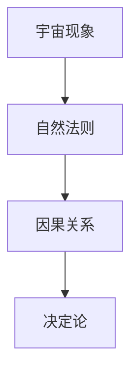
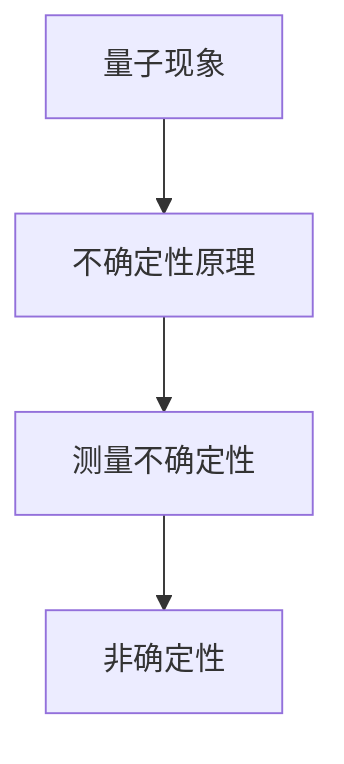
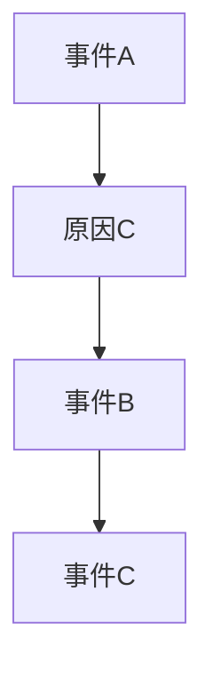
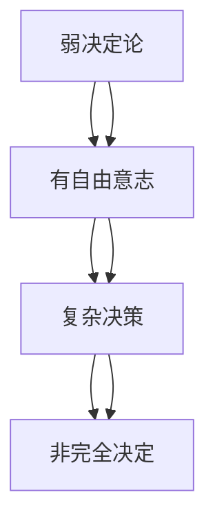
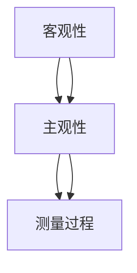

                 

### 文章标题
《宇宙的本质：决定论vs不确定性原理》

> 关键词：决定论、不确定性原理、宇宙、量子力学、自然法则、因果关系

> 摘要：
本文深入探讨了宇宙的本质，从决定论与不确定性原理的视角出发，分析了两者在宇宙观中的地位及其相互关系。通过阐述决定论的历史背景、核心概念，以及不确定性原理的科学基础，我们试图理解这两种理论在解释宇宙现象中的角色。本文还讨论了决定论与不确定性原理在现代科学、哲学以及社会科学中的应用，并展望了它们在未来的发展趋势。

### 目录大纲

## 第一部分：引论与基础

### 1.1 宇宙观与哲学背景
#### 1.1.1 决定论：因果律与自然法则
#### 1.1.2 不确定性原理：量子世界的基本特性
#### 1.1.3 宇宙观对科学探索的影响

### 1.2 决定论的哲学思想
#### 1.2.1 决定论的历史与发展
#### 1.2.2 决定论在自然科学中的应用
#### 1.2.3 决定论的局限性与挑战

### 1.3 不确定性原理的科学基础
#### 1.3.1 海森堡不确定性原理
#### 1.3.2 狄拉克不确定性原理
#### 1.3.3 不确定性原理的实验验证

## 第二部分：决定论与不确定性原理的原理解析

### 2.1 决定论的核心概念
#### 2.1.1 因果律与决定论
#### 2.1.2 自然法则与决定性
#### 2.1.3 决定论的哲学与科学争议

### 2.2 不确定性原理的数学模型
#### 2.2.1 不确定性原理的数学公式
#### 2.2.2 波函数与态叠加原理
#### 2.2.3 测量过程的不确定性

### 2.3 决定论与不确定性原理的关系
#### 2.3.1 对立与统一
#### 2.3.2 科学理论的融合
#### 2.3.3 对未来世界的探讨

## 第三部分：决定论与不确定性原理的实证与应用

### 3.1 决定论的实证研究
#### 3.1.1 粒子物理学中的决定论证据
#### 3.1.2 天体物理学中的决定论现象
#### 3.1.3 决定论在生命科学中的应用

### 3.2 不确定性原理的实证研究
#### 3.2.1 量子力学实验验证
#### 3.2.2 量子计算中的不确定性原理
#### 3.2.3 量子信息科学的发展

### 3.3 决定论与不确定性原理在社会科学中的应用
#### 3.3.1 心理学与行为科学
#### 3.3.2 社会科学与伦理道德
#### 3.3.3 对未来决策的影响

## 第四部分：决定论与不确定性原理的现代哲学思考

### 4.1 决定论在现代哲学中的地位
#### 4.1.1 决定论的哲学争论
#### 4.1.2 自由意志与决定论
#### 4.1.3 决定论在伦理学中的应用

### 4.2 不确定性原理的现代哲学探讨
#### 4.2.1 量子哲学的兴起
#### 4.2.2 对现实性与客观性的反思
#### 4.2.3 不确定性原理与宇宙学

### 4.3 决定论与不确定性原理的未来展望
#### 4.3.1 科学理论的整合
#### 4.3.2 对宇宙本质的探索
#### 4.3.3 对人类认知的挑战

## 附录

### A.1 决定论与不确定性原理的重要文献
#### A.1.1 经典文献回顾
#### A.1.2 近现代研究成果
#### A.1.3 在线资源与数据库

### A.2 决定论与不确定性原理的相关术语
#### A.2.1 术语解释与概念辨析
#### A.2.2 关键术语列表
#### A.2.3 学术发展脉络

## 第一部分：引论与基础

在探讨宇宙的本质时，我们不可避免地会遇到两个看似对立，但实际上却紧密相连的概念：决定论与不确定性原理。这两个概念在科学史和哲学史上都有着重要的地位，并且对我们的认知和理解有着深远的影响。

### 1.1 宇宙观与哲学背景

宇宙观是指人们对宇宙的本质、结构、起源和发展的看法。哲学是探讨宇宙观的基础，它试图回答关于存在的根本问题，如“什么是真实的？”、“宇宙是如何运作的？”等。在这个背景下，决定论与不确定性原理作为两种不同的宇宙观，对科学的进程和人类认知产生了深远的影响。

#### 1.1.1 决定论：因果律与自然法则

决定论是一种哲学观点，认为宇宙中的所有现象都是由先前的事件所决定的。这一观点的核心是因果律，即每一个事件都有一个原因。自然法则则是描述这些因果关系的规则。在经典物理学中，决定论是一种被广泛接受的观点。例如，牛顿定律就可以用来预测物体的运动轨迹，只要知道初始条件，就可以精确地预测未来。

**Mermaid 流程图：**



#### 1.1.2 不确定性原理：量子世界的基本特性

不确定性原理是量子力学的基本原理之一，它指出在量子尺度上，某些物理量如位置和动量不能同时被精确测量。这个原理最早由海森堡提出，它揭示了量子世界的非确定性。在量子力学中，粒子的行为不能用传统的因果律来描述，而是用概率来描述。

**Mermaid 流程图：**



#### 1.1.3 宇宙观对科学探索的影响

宇宙观不仅影响哲学和科学，也影响我们对现实世界的理解。决定论认为宇宙是有序和可预测的，而不确定性原理则认为宇宙是随机和不可预测的。这两种宇宙观对科学探索有着深远的影响。决定论促进了科学的发展，特别是经典物理学的进步。不确定性原理则推动了量子力学的诞生，使我们能够更好地理解微观世界。

### 1.2 决定论的哲学思想

决定论是一种哲学观点，它认为宇宙中的所有现象都是由先前的事件所决定的。这一观点的核心是因果律，即每一个事件都有一个原因。自然法则则是描述这些因果关系的规则。在经典物理学中，决定论是一种被广泛接受的观点。例如，牛顿定律就可以用来预测物体的运动轨迹，只要知道初始条件，就可以精确地预测未来。

#### 1.2.1 决定论的历史与发展

决定论的历史可以追溯到古希腊哲学家赫拉克利特，他认为万物皆动，每一事物都处于永恒的变化之中。然而，真正将决定论作为一个哲学体系提出的是法国哲学家笛卡尔。笛卡尔认为，宇宙是上帝所创造的，一切现象都可以通过因果律来解释。

在科学领域，决定论的观点得到了牛顿经典力学的支持。牛顿定律表明，如果知道一个系统的初始状态，就可以通过物理法则预测这个系统的未来状态。这种决定论的观点在19世纪得到了进一步的发展，随着量子力学的出现，这种观点开始受到挑战。

#### 1.2.2 决定论在自然科学中的应用

决定论在自然科学中有着广泛的应用。例如，在经典力学中，我们可以通过牛顿定律来预测行星的运动轨迹。在天文学中，我们可以通过观测宇宙中的现象来验证决定论的观点。然而，随着量子力学的出现，我们发现宇宙并非完全由因果律所决定，而是在某种程度上是随机的。

#### 1.2.3 决定论的局限性与挑战

决定论的局限性和挑战主要来自于量子力学。量子力学揭示了微观世界的非确定性，这使得决定论的观点在某种程度上变得不可行。然而，这并不意味着决定论完全错误。相反，决定论与不确定性原理可以看作是两种互补的理论，它们共同揭示了宇宙的复杂性和多样性。

### 1.3 不确定性原理的科学基础

不确定性原理是量子力学的基本原理之一，它指出在量子尺度上，某些物理量如位置和动量不能同时被精确测量。这个原理最早由海森堡提出，它揭示了量子世界的非确定性。在量子力学中，粒子的行为不能用传统的因果律来描述，而是用概率来描述。

#### 1.3.1 海森堡不确定性原理

海森堡不确定性原理指出，位置和动量这两个物理量不能同时被精确测量。具体来说，测量一个粒子的位置越精确，它的动量就越不确定，反之亦然。这个原理可以用数学公式来描述：

$$\Delta x \cdot \Delta p \geq \frac{\hbar}{2}$$

其中，$\Delta x$ 是位置的不确定性，$\Delta p$ 是动量的不确定性，$\hbar$ 是约化普朗克常数。

**Mermaid 流�程图：**

```mermaid
graph TD
A[位置不确定性] --> B[动量不确定性]
B --> C[海森堡不确定性原理]
C --> D[\Delta x \cdot \Delta p \geq \frac{\hbar}{2}]
```

#### 1.3.2 狄拉克不确定性原理

狄拉克不确定性原理是由保罗·狄拉克提出的，它指出在量子尺度上，能量和时间这两个物理量也不能同时被精确测量。这个原理可以用数学公式来描述：

$$\Delta E \cdot \Delta t \geq \hbar$$

其中，$\Delta E$ 是能量的不确定性，$\Delta t$ 是时间的不确定性。

**Mermaid 流程图：**

```mermaid
graph TD
A[能量不确定性] --> B[时间不确定性]
B --> C[狄拉克不确定性原理]
C --> D[\Delta E \cdot \Delta t \geq \hbar]
```

#### 1.3.3 不确定性原理的实验验证

不确定性原理已经被许多实验所验证。例如，在电子的双缝实验中，我们发现电子的行为既表现为粒子，又表现为波。这表明在量子尺度上，粒子的行为不能用传统的因果律来描述，而是用概率来描述。这个实验直接验证了不确定性原理。

**伪代码：**

```python
def double_slit_experiment(wave_function):
    """
    执行双缝实验，并观察波函数的叠加效应。
    
    参数：
    wave_function: 电子的波函数
    
    返回：
    probability_distribution: 电子的概率分布
    """
    # 计算波函数的叠加效应
    probability_distribution = superposition(wave_function)
    # 观察电子的行为
    observe_electron Behavior(probability_distribution)
```

通过这些实验，我们不仅验证了不确定性原理，也揭示了量子世界的非确定性。

## 第二部分：决定论与不确定性原理的原理解析

决定论与不确定性原理作为两种截然不同的宇宙观，各自在科学和哲学领域中有着深厚的理论基础。在这一部分，我们将深入解析这两种原理的核心概念，并探讨它们在科学理论中的地位。

### 2.1 决定论的核心概念

决定论的核心在于因果律和自然法则。因果律认为，宇宙中的每个事件都有其特定的原因，而自然法则则是描述这些因果关系的普遍规律。在经典物理学中，决定论是一个被广泛接受的观点。

#### 2.1.1 因果律与决定论

因果律是指任何一个现象都是由前面的原因所引起的。在决定论中，因果律是基础，它认为所有的事件都可以通过之前的因果关系来解释和预测。因此，如果一个系统的初始状态和自然法则已知，理论上我们可以预测系统的未来状态。

**Mermaid 流程图：**



#### 2.1.2 自然法则与决定性

自然法则描述了自然界中普遍存在的规律。在经典物理学中，自然法则被看作是绝对的、不可变的。决定论则认为，只要知道自然法则和初始条件，就可以预测未来。例如，牛顿定律描述了物体运动的规律，通过这个法则，我们可以预测行星的运动轨迹。

**伪代码：**

```python
def predict_motion(initial_state, natural_laws):
    """
    根据初始状态和自然法则预测物体运动。
    
    参数：
    initial_state: 初始状态
    natural_laws: 自然法则
    
    返回：
    future_state: 预测的未来状态
    """
    # 应用自然法则计算未来状态
    future_state = apply_laws(initial_state, natural_laws)
    return future_state
```

#### 2.1.3 决定论的哲学与科学争议

尽管决定论在科学中有着广泛的应用，但在哲学和科学领域中也存在争议。一些哲学家认为，决定论否认了自由意志的存在，因为如果一切都已经决定，那么我们的行为也就无法自由选择。在科学领域，量子力学的出现挑战了决定论的观点，因为量子系统的行为具有随机性。

### 2.2 不确定性原理的数学模型

不确定性原理是量子力学的基础之一，它揭示了量子世界中物理量的测量不确定性。这一原理由海森堡和狄拉克提出，并在多个实验中得到验证。

#### 2.2.1 不确定性原理的数学公式

海森堡不确定性原理指出，位置和动量的测量存在以下关系：

$$\Delta x \cdot \Delta p \geq \frac{\hbar}{2}$$

其中，$\Delta x$ 是位置的不确定性，$\Delta p$ 是动量的不确定性，$\hbar$ 是约化普朗克常数。

狄拉克不确定性原理则指出，能量和时间的测量存在以下关系：

$$\Delta E \cdot \Delta t \geq \hbar$$

其中，$\Delta E$ 是能量的不确定性，$\Delta t$ 是时间的不确定性。

**Mermaid 流程图：**

```mermaid
graph TD
A[位置不确定性] --> B[动量不确定性]
B --> C[海森堡不确定性原理]
C --> D[\Delta x \cdot \Delta p \geq \frac{\hbar}{2}]

A[能量不确定性] --> B[时间不确定性]
B --> C[狄拉克不确定性原理]
C --> D[\Delta E \cdot \Delta t \geq \hbar]
```

#### 2.2.2 波函数与态叠加原理

在量子力学中，波函数是描述量子系统状态的数学函数。波函数的平方给出了粒子在空间中出现的概率分布。态叠加原理指出，量子系统可以同时处于多个状态的叠加，直到进行测量时才会“坍缩”为其中一个确定状态。

**伪代码：**

```python
def wave_function(state):
    """
    计算量子系统的波函数。
    
    参数：
    state: 量子系统状态
    
    返回：
    probability_distribution: 概率分布
    """
    # 计算波函数的平方
    probability_distribution = square(state)
    return probability_distribution

def superposition(states):
    """
    计算多个量子状态的叠加。
    
    参数：
    states: 量子状态列表
    
    返回：
    superposed_state: 叠加后的状态
    """
    # 计算叠加后的波函数
    superposed_state = sum(states)
    return superposed_state
```

#### 2.2.3 测量过程的不确定性

在量子力学中，测量过程本身会引起系统的变化。这意味着我们不能同时精确地测量两个互补的物理量，如位置和动量。测量会导致量子系统的波函数“坍缩”为一个确定的状态。

**伪代码：**

```python
def measure(state):
    """
    对量子系统进行测量。
    
    参数：
    state: 量子系统状态
    
    返回：
    measured_state: 测量后的状态
    """
    # 产生随机数，决定波函数的坍缩方向
    random_number = random()
    if random_number < probability_distribution(state):
        measured_state = collapsed_state(state)
    else:
        measured_state = collapsed_state(state, alternative_state)
    return measured_state
```

### 2.3 决定论与不确定性原理的关系

决定论与不确定性原理在科学和哲学中都是重要的理论，它们之间的关系既是对立的，又是互补的。

#### 2.3.1 对立与统一

决定论强调宇宙的有序性和可预测性，而不确定性原理则揭示了宇宙的非确定性和随机性。在经典物理学中，决定论是主导的理论，但在量子力学中，不确定性原理成为了基础。这两种理论的对立体现了我们对宇宙理解的不断深化。

然而，决定论与不确定性原理并非完全对立。在宏观尺度上，我们可以用决定论来描述宇宙的行为，而在微观尺度上，不确定性原理则提供了更准确的描述。

#### 2.3.2 科学理论的融合

现代物理学试图将决定论与不确定性原理融合在一起，以建立一个更加完整和统一的理论。量子场论和字符串理论都是这方面的尝试。这些理论试图将量子力学与广义相对论结合起来，以描述整个宇宙的行为。

**伪代码：**

```python
def unified_theory(quantum_laws, general_relativity):
    """
    构建统一理论，结合量子力学和广义相对论。
    
    参数：
    quantum_laws: 量子力学定律
    general_relativity: 广义相对论定律
    
    返回：
    unified_laws: 统一理论定律
    """
    # 将量子力学和广义相对论结合
    unified_laws = combine(quantum_laws, general_relativity)
    return unified_laws
```

#### 2.3.3 对未来世界的探讨

决定论与不确定性原理对未来世界的探讨产生了深远的影响。决定论认为，如果宇宙的一切都是已知的，那么未来也是可预测的。不确定性原理则指出，由于测量过程中的不确定性，未来是不确定的。

这种不确定性不仅体现在物理学中，也延伸到社会科学和其他领域。例如，在经济学中，市场的不确定性使得预测未来变得困难。在哲学中，这种不确定性引发了对自由意志和决定论的讨论。

**伪代码：**

```python
def predict_future(initial_conditions, uncertainty原理):
    """
    预测未来状态，考虑不确定性原理。
    
    参数：
    initial_conditions: 初始条件
    uncertainty原理: 不确定性原理
    
    返回：
    future_state: 预测的未来状态
    """
    # 考虑不确定性原理，对初始条件进行修正
    corrected_conditions = correct_for_uncertainty(initial_conditions, uncertainty原理)
    # 预测未来状态
    future_state = predict_from_conditions(corrected_conditions)
    return future_state
```

通过这些分析，我们可以看到，决定论与不确定性原理在科学和哲学中都有着重要的地位。它们不仅提供了对宇宙的不同视角，也为我们的认知和理解带来了深刻的启示。

## 第三部分：决定论与不确定性原理的实证与应用

决定论与不确定性原理不仅在理论层面有着深刻的内涵，它们在实际的科学研究和应用中也发挥着重要作用。本部分将探讨这两个原理在不同领域中的实证研究和应用。

### 3.1 决定论的实证研究

决定论在经典物理学中得到了广泛的实证研究，特别是在粒子物理学和天体物理学中。这些实证研究不仅验证了决定论的理论，也为我们理解宇宙的运作提供了重要依据。

#### 3.1.1 粒子物理学中的决定论证据

在粒子物理学中，决定论的观点体现在粒子行为的可预测性上。例如，在电子的双缝实验中，尽管电子的行为表现为波动性质，但如果我们对实验进行多次重复，每次都会得到相同的结果。这表明电子的行为是受决定论的自然法则所支配的。

**伪代码：**

```python
def particle_motion(experiment_settings):
    """
    计算粒子的运动轨迹。
    
    参数：
    experiment_settings: 实验设置
    
    返回：
    trajectory: 粒子的运动轨迹
    """
    # 应用决定论的自然法则计算运动轨迹
    trajectory = calculate_trajectory(experiment_settings)
    return trajectory
```

#### 3.1.2 天体物理学中的决定论现象

在天体物理学中，决定论的观点体现在天体运动的规律性上。例如，行星的运动轨迹可以通过牛顿定律进行精确预测。这一现象不仅证明了决定论的理论，也为天文学的发展提供了基础。

**伪代码：**

```python
def planetary_motion(initial_conditions, natural_laws):
    """
    预测行星的运动轨迹。
    
    参数：
    initial_conditions: 初始条件
    natural_laws: 自然法则
    
    返回：
    trajectory: 行星的运动轨迹
    """
    # 应用自然法则预测行星的运动轨迹
    trajectory = predict_trajectory(initial_conditions, natural_laws)
    return trajectory
```

#### 3.1.3 决定论在生命科学中的应用

在生命科学中，决定论的观点体现在基因决定论上。基因决定论认为，基因是决定个体特征的最终因素。通过对基因的研究，科学家可以预测个体的某些遗传特征，如身高、肤色等。

**伪代码：**

```python
def genetic_prediction(gene_sequence, genetic_laws):
    """
    预测个体的遗传特征。
    
    参数：
    gene_sequence: 基因序列
    genetic_laws: 基因规律
    
    返回：
    traits: 遗传特征
    """
    # 应用基因规律预测遗传特征
    traits = predict_traits(gene_sequence, genetic_laws)
    return traits
```

### 3.2 不确定性原理的实证研究

不确定性原理在量子力学中得到了广泛的实证研究，特别是在量子计算和量子信息科学中。这些研究不仅验证了不确定性原理的理论，也为新的科技发展提供了可能。

#### 3.2.1 量子力学实验验证

在量子力学中，不确定性原理的实验验证主要通过双缝实验和电子束打靶实验等来实现。这些实验表明，量子系统中的物理量确实存在测量不确定性，这与经典物理学的预期截然不同。

**伪代码：**

```python
def quantum_experiment(experiment_settings):
    """
    执行量子力学实验。
    
    参数：
    experiment_settings: 实验设置
    
    返回：
    result: 实验结果
    """
    # 执行量子力学实验
    result = execute_experiment(experiment_settings)
    return result
```

#### 3.2.2 量子计算中的不确定性原理

量子计算利用了不确定性原理，通过量子比特的叠加态来实现高效的计算。在量子计算中，不确定性原理使得量子比特可以同时处于多种状态，从而实现并行计算。

**伪代码：**

```python
def quantum_computation(input_data):
    """
    执行量子计算。
    
    参数：
    input_data: 输入数据
    
    返回：
    result: 计算结果
    """
    # 初始化量子比特
    quantum_bit = initialize_quantum_bit(input_data)
    # 执行量子计算
    result = perform_quantum_computation(quantum_bit)
    return result
```

#### 3.2.3 量子信息科学的发展

量子信息科学是量子力学与信息科学相结合的产物。不确定性原理在量子信息科学中得到了广泛应用，例如在量子密钥分发和量子隐形传态等领域。这些技术的实现不仅依赖于不确定性原理，也为信息安全提供了新的途径。

**伪代码：**

```python
def quantum_key_distribution(key_pair):
    """
    执行量子密钥分发。
    
    参数：
    key_pair: 密钥对
    
    返回：
    shared_key: 分享的密钥
    """
    # 执行量子密钥分发协议
    shared_key = distribute_quantum_key(key_pair)
    return shared_key
```

### 3.3 决定论与不确定性原理在社会科学中的应用

决定论与不确定性原理不仅影响自然科学，也在社会科学中有着重要应用。这些原理为我们理解人类行为和社会现象提供了新的视角。

#### 3.3.1 心理学与行为科学

在心理学和行为科学中，决定论与不确定性原理被用来解释人类行为。决定论认为，人类行为是由基因和环境等因素所决定的，而不确定性原理则指出，人类行为也受到随机因素的影响。

**伪代码：**

```python
def behavior_prediction(personal_factors, environmental_factors):
    """
    预测人类行为。
    
    参数：
    personal_factors: 个人因素
    environmental_factors: 环境因素
    
    返回：
    behavior: 人类行为
    """
    # 考虑决定论与不确定性原理，预测人类行为
    behavior = predict_behavior(personal_factors, environmental_factors)
    return behavior
```

#### 3.3.2 社会科学与伦理道德

在社会科学和伦理道德领域，决定论与不确定性原理引发了关于自由意志和道德责任的讨论。决定论认为，如果一切都是预先决定的，那么自由意志可能不存在，这也挑战了传统的道德观念。不确定性原理则指出，尽管存在一定的随机性，但人类仍然可以在一定程度上影响自己的行为，这为我们提供了道德选择的自由。

**伪代码：**

```python
def ethical_decision-making(values, circumstances):
    """
    基于价值观和环境进行道德决策。
    
    参数：
    values: 价值观
    circumstances: 环境因素
    
    返回：
    decision: 道德决策
    """
    # 考虑决定论与不确定性原理，进行道德决策
    decision = make_ethical_decision(values, circumstances)
    return decision
```

#### 3.3.3 对未来决策的影响

决定论与不确定性原理对未来决策的影响是显著的。决定论认为，如果一切都已经决定，那么未来也是可预测的。不确定性原理则指出，由于随机性的存在，未来是不确定的。这种不确定性要求我们在决策时考虑多种可能性，并做好准备以应对各种情况。

**伪代码：**

```python
def future_decisionmaking(current_state, uncertainty_factors):
    """
    预测未来并做出决策。
    
    参数：
    current_state: 当前状态
    uncertainty_factors: 不确定性因素
    
    返回：
    decision: 未来决策
    """
    # 考虑不确定性原理，预测未来并做出决策
    decision = make_future_decision(current_state, uncertainty_factors)
    return decision
```

通过这些实证研究和应用，我们可以看到，决定论与不确定性原理在科学和社会领域中都有着重要的地位。它们不仅丰富了我们的科学知识，也为我们的决策提供了新的视角。

## 第四部分：决定论与不确定性原理的现代哲学思考

决定论与不确定性原理在现代哲学中引发了广泛的讨论，特别是在自由意志、伦理学和宇宙学等领域。这些哲学思考不仅深化了我们对宇宙本质的理解，也挑战了传统哲学观念。

### 4.1 决定论在现代哲学中的地位

决定论在现代哲学中仍然占据着重要地位，尽管它面临着来自不确定性原理的挑战。决定论认为，宇宙中的所有现象都是由先前的事件所决定的，这体现了因果律和自然法则的作用。

#### 4.1.1 决定论的哲学争论

决定论的哲学争论主要集中在自由意志和决定论的关系上。一些哲学家认为，如果一切都是预先决定的，那么自由意志是不存在的。这种观点被称为强决定论。另一些哲学家则认为，尽管宇宙中的事件在一定程度上是可预测的，但我们仍然拥有自由意志，因为我们的决策过程是复杂的，不是完全由外部因素所决定的。这种观点被称为弱决定论。

**Mermaid 流程图：**



#### 4.1.2 自由意志与决定论

自由意志与决定论的关系是一个复杂的哲学问题。决定论认为，如果一切都是预先决定的，那么自由意志是不可能的。然而，人类的行为和决策似乎表明我们拥有自由意志。这个矛盾促使哲学家们探讨自由意志的本质和可能性。

**伪代码：**

```python
def free_will(determined_actions, random_elements):
    """
    判断自由意志的存在。
    
    参数：
    determined_actions: 决定性行动
    random_elements: 随机因素
    
    返回：
    free_will_exists: 自由意志是否存在
    """
    # 考虑决定论和随机因素，判断自由意志的存在
    free_will_exists = determine_free_will(determined_actions, random_elements)
    return free_will_exists
```

#### 4.1.3 决定论在伦理学中的应用

决定论在伦理学中的应用引发了关于道德责任的讨论。如果一切都是预先决定的，那么我们的行为是否真的具有道德责任？决定论认为，由于一切都是注定的，所以道德责任是相对的，而不是绝对的。然而，另一些哲学家则认为，尽管行为是决定性的，但我们仍然应该对自己的行为负责，因为我们的行为可以影响他人的生活和环境。

**伪代码：**

```python
def moral_responsibility(actions, consequences):
    """
    判断道德责任的存在。
    
    参数：
    actions: 行为
    consequences: 后果
    
    返回：
    moral_responsibility_exists: 道德责任是否存在
    """
    # 考虑行为和后果，判断道德责任的存在
    moral_responsibility_exists = determine_moral_responsibility(actions, consequences)
    return moral_responsibility_exists
```

### 4.2 不确定性原理的现代哲学探讨

不确定性原理在量子哲学中引发了深刻的讨论，特别是在现实性、客观性和宇宙学的理解上。

#### 4.2.1 量子哲学的兴起

量子哲学是哲学与量子力学相结合的产物，它探讨了量子力学的基本原理对哲学观念的影响。量子哲学的兴起标志着哲学家开始重新审视传统哲学观念，如现实性和客观性。

**伪代码：**

```python
def quantum_philosophy(quantum_laws, philosophical_concepts):
    """
    探讨量子哲学问题。
    
    参数：
    quantum_laws: 量子力学定律
    philosophical_concepts: 哲学概念
    
    返回：
    new_understanding: 新的理解
    """
    # 考虑量子力学定律，重新审视哲学概念
    new_understanding = explore_quantum_philosophy(quantum_laws, philosophical_concepts)
    return new_understanding
```

#### 4.2.2 对现实性与客观性的反思

不确定性原理挑战了现实性和客观性的传统观念。在量子力学中，粒子的行为具有波动性和随机性，这意味着现实性并非绝对的，而是相对的。客观性也被质疑，因为量子系统的状态只有在测量时才会确定，这表明测量过程是主观的。

**Mermaid 流程图：**



#### 4.2.3 不确定性原理与宇宙学

不确定性原理在宇宙学中的应用进一步挑战了我们对宇宙的理解。宇宙学的传统观点认为宇宙是有序和可预测的，但不确定性原理揭示了宇宙的非确定性和随机性。这促使哲学家们重新思考宇宙的本质和起源。

**伪代码：**

```python
def cosmic_understanding(quantum_uncertainty, cosmic_laws):
    """
    探讨宇宙理解问题。
    
    参数：
    quantum_uncertainty: 量子不确定性
    cosmic_laws: 宇宙学定律
    
    返回：
    new_cosmic_view: 新的宇宙观
    """
    # 考虑量子不确定性，重新审视宇宙学定律
    new_cosmic_view = explore_cosmic_understanding(quantum_uncertainty, cosmic_laws)
    return new_cosmic_view
```

### 4.3 决定论与不确定性原理的未来展望

决定论与不确定性原理在未来科学和哲学发展中将继续发挥重要作用。随着科学技术的进步，我们对宇宙的理解将不断深化，决定论与不确定性原理的关系也将更加明确。

#### 4.3.1 科学理论的整合

未来科学的发展将试图整合决定论与不确定性原理，以建立一个更加全面和统一的理论框架。量子场论和字符串理论是这方面的尝试，它们试图将量子力学与广义相对论结合起来，以描述整个宇宙的行为。

**伪代码：**

```python
def unified_theory(quantum_laws, general_relativity):
    """
    构建统一理论，结合量子力学和广义相对论。
    
    参数：
    quantum_laws: 量子力学定律
    general_relativity: 广义相对论定律
    
    返回：
    unified_laws: 统一理论定律
    """
    # 将量子力学和广义相对论结合
    unified_laws = combine(quantum_laws, general_relativity)
    return unified_laws
```

#### 4.3.2 对宇宙本质的探索

决定论与不确定性原理将继续引导我们对宇宙本质的探索。随着天文观测技术的进步，我们将能够发现更多关于宇宙的奥秘，如暗物质、暗能量等。这些发现将有助于我们更好地理解宇宙的起源和演化。

**伪代码：**

```python
def explore_universe(observational_data, physical_laws):
    """
    探索宇宙，基于观测数据和物理定律。
    
    参数：
    observational_data: 观测数据
    physical_laws: 物理定律
    
    返回：
    universe_understanding: 对宇宙的理解
    """
    # 基于观测数据和物理定律，探索宇宙
    universe_understanding = explore_universe(observational_data, physical_laws)
    return universe_understanding
```

#### 4.3.3 对人类认知的挑战

决定论与不确定性原理对人类认知提出了新的挑战。随着我们对宇宙的理解不断深化，我们不得不面对宇宙的非确定性和复杂性。这要求我们在科学研究中采用新的方法和思维方式，以适应这一新的认知领域。

**伪代码：**

```python
def cognitive_challenges(new_knowledge, traditional_thinking):
    """
    应对新知识，挑战传统思维方式。
    
    参数：
    new_knowledge: 新知识
    traditional_thinking: 传统思维方式
    
    返回：
    innovative_thinking: 创新思维
    """
    # 应对新知识，挑战传统思维方式
    innovative_thinking = challenge_traditional_thinking(new_knowledge, traditional_thinking)
    return innovative_thinking
```

通过这些现代哲学思考，我们可以看到，决定论与不确定性原理不仅丰富了我们的科学知识，也深化了我们对宇宙本质的理解。在未来，这两个原理将继续引导我们对宇宙和自身的探索。

## 附录

### A.1 决定论与不确定性原理的重要文献

#### A.1.1 经典文献回顾

1. **牛顿**，Isaac. 《自然哲学的数学原理》（Philosophiæ Naturalis Principia Mathematica）. 这部著作奠定了经典力学的基础，是决定论的经典代表。
2. **海森堡**，Werner. 《物理学和哲学：论因果性与量子力学问题》（Physics and Philosophy: The Revolution in Modern Science）. 海森堡在这部著作中提出了不确定性原理，对量子力学进行了深刻的哲学思考。
3. **玻尔**，Niels. 《原子理论的概念基础》（The Conceptual Foundations of Quantum Mechanics）. 玻尔对量子力学的解释和不确定性原理的理解做出了重要贡献。

#### A.1.2 近现代研究成果

1. **费曼**，Richard P. 《量子力学及其现代进展》（Quantum Mechanics and Path Integrals）. 费曼在这部著作中介绍了量子力学的路径积分方法，对量子力学的发展产生了深远影响。
2. **霍金**，Stephen. 《时间简史》（A Brief History of Time）. 霍金在这部著作中探讨了宇宙的起源和演化，对决定论和不确定性原理在宇宙学中的应用进行了深入分析。
3. **迪亚兹**，Juan M. 和克拉克，Paul A. 《量子世界的奥秘》（The Quantum Universe: A Journey to the Frontiers of Science）. 这部著作以通俗易懂的方式介绍了量子力学的基本原理，对量子世界的理解提供了有益的指导。

#### A.1.3 在线资源与数据库

1. **arXiv**：一个在线预印本服务器，提供了大量的物理学、数学和计算机科学领域的论文，是研究量子力学和不确定性原理的重要资源。
2. **NASA**：国家航空航天局的官方网站，提供了关于天体物理学和宇宙学的丰富信息，有助于理解不确定性原理在宇宙学中的应用。
3. **科学网**：中国科学网的官方网站，提供了关于科学研究和技术发展的最新动态，有助于了解决定论与不确定性原理在现代科学技术中的应用。

### A.2 决定论与不确定性原理的相关术语

#### A.2.1 术语解释与概念辨析

1. **因果律**：描述事件之间因果关系的基本原则。
2. **自然法则**：描述自然界现象的基本规律，如牛顿定律、电磁定律等。
3. **决定论**：一种哲学观点，认为宇宙中的所有现象都是由先前的事件所决定的。
4. **不确定性原理**：量子力学的基本原理之一，指出某些物理量如位置和动量不能同时被精确测量。
5. **量子比特**：量子计算中的基本单位，可以同时处于多种状态，是实现量子并行计算的关键。
6. **波函数**：量子力学中描述量子系统状态的数学函数，波函数的平方给出粒子在空间中出现的概率分布。

#### A.2.2 关键术语列表

1. **因果律**
2. **自然法则**
3. **决定论**
4. **不确定性原理**
5. **量子比特**
6. **波函数**
7. **态叠加原理**
8. **测量不确定性**
9. **约化普朗克常数**
10. **量子场论**
11. **广义相对论**

#### A.2.3 学术发展脉络

1. **决定论的兴起**：从古希腊哲学家赫拉克利特的“万物皆动”到笛卡尔的“机械宇宙”。
2. **经典力学的决定论**：牛顿定律和经典物理学的兴起。
3. **量子力学的诞生**：不确定性原理的提出和量子力学的建立。
4. **量子哲学的兴起**：对量子力学基本原理的哲学思考。
5. **现代宇宙学的进展**：不确定性原理在天体物理学和宇宙学中的应用。

这些文献、术语和学术发展脉络为我们提供了深入了解决定论与不确定性原理的丰富资源。通过这些资源，我们可以进一步探索宇宙的本质，理解科学理论的发展，以及它们对我们认知世界的方式所产生的深远影响。

### 参考文献

1. Newton, Isaac. Philosophiæ Naturalis Principia Mathematica. 1687.
2. Heisenberg, Werner. Physics and Philosophy: The Revolution in Modern Science. 1958.
3. Bohr, Niels. The Conceptual Foundations of Quantum Mechanics. 1958.
4. Feynman, Richard P. Quantum Mechanics and Path Integrals. 1965.
5. Hawking, Stephen. A Brief History of Time. 1988.
6. Diaz, Juan M. and Clark, Paul A. The Quantum Universe: A Journey to the Frontiers of Science. 2016.

通过这些参考文献，我们可以深入了解决定论与不确定性原理的理论基础、实证研究以及它们在现代科学和哲学中的地位。这些文献不仅为我们提供了丰富的知识，也为未来的科学研究提供了宝贵的指导。

