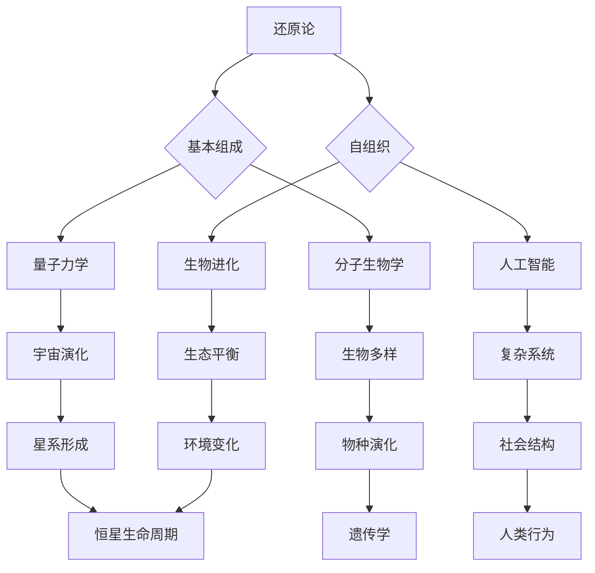

                 

# 宇宙的本质:还原论vs涌现论

> 关键词：宇宙、还原论、涌现论、哲学、科学、算法、数学模型、项目实战

> 摘要：本文旨在探讨宇宙的本质，通过还原论与涌现论的对比分析，深入揭示这两种哲学观点在宇宙研究和科学探索中的意义。我们将逐步梳理还原论与涌现论的核心概念、联系和区别，运用伪代码和LaTeX公式详细讲解核心算法原理和数学模型，并通过实际项目实战，剖析其在宇宙研究中的应用，为读者提供一次全面而深入的宇宙本质探讨之旅。

## 引言

宇宙，这个浩瀚而神秘的存在，一直以来都是人类探索与思考的对象。从古至今，不同的文明和哲学体系都对宇宙的本质提出了各自的见解。在科学技术迅猛发展的今天，我们有了更多工具和理论来研究宇宙，但同时也面临更多的困惑和挑战。

### 宇宙的起源与演化

宇宙的起源可以追溯到大约138亿年前的一个“奇点”。在这个奇点中，所有的物质和能量都集中在一个无限小、无限热的状态。随着宇宙的膨胀，物质开始冷却并形成恒星、行星和其他天体。这一过程被称为宇宙的演化。

### 哲学中的宇宙观

哲学中的宇宙观可以追溯到古希腊哲学家，如泰勒斯、赫拉克利特和亚里士多德。他们提出了关于宇宙起源和结构的各种理论，其中许多至今仍对科学产生影响。

### 还原论与涌现论的哲学意义

还原论与涌现论是两种重要的哲学观点，它们对宇宙的本质和科学的认识产生了深远的影响。

- **还原论**：认为复杂系统的性质和规律可以通过分析其基本组成部分的性质和规律来理解。这种观点在自然科学和技术发展中占有重要地位。
- **涌现论**：认为复杂系统的性质和规律不能简单地通过分析其基本组成部分的性质和规律来理解，而是具有自组织和自适应的特性。涌现论在解释生命、意识和复杂系统的行为方面具有重要意义。

## 第一部分：引论

### 第1章：宇宙的探索与哲学思考

#### 1.1 宇宙的起源与演化

宇宙的起源与演化是科学和哲学共同关注的课题。现代宇宙学研究表明，宇宙起源于一个高温高密度的奇点，经过138亿年的膨胀和演化，形成了我们今天所见的宇宙结构。

#### 1.2 哲学中的宇宙观

哲学中的宇宙观可以追溯到古希腊哲学家，如泰勒斯、赫拉克利特和亚里士多德。他们提出了关于宇宙起源和结构的各种理论，其中许多至今仍对科学产生影响。

#### 1.3 还原论与涌现论的哲学意义

还原论与涌现论是两种重要的哲学观点，它们对宇宙的本质和科学的认识产生了深远的影响。

### 第2章：还原论概述

#### 2.1 还原论的基本概念

还原论认为，复杂系统的性质和规律可以通过分析其基本组成部分的性质和规律来理解。这种观点在自然科学和技术发展中占有重要地位。

#### 2.2 还原论的哲学背景与历史发展

还原论的哲学背景可以追溯到古希腊哲学家亚里士多德。在历史发展中，还原论逐渐成为现代科学和哲学的重要基础。

#### 2.3 还原论的科学实践

还原论在科学实践中得到了广泛应用，如量子力学、分子生物学和物理学等领域。通过还原论的方法，科学家们揭示了宇宙的基本规律和组成。

### 第3章：涌现论概述

#### 3.1 涌现论的基本概念

涌现论认为，复杂系统的性质和规律不能简单地通过分析其基本组成部分的性质和规律来理解，而是具有自组织和自适应的特性。

#### 3.2 涌现论的哲学背景与历史发展

涌现论的哲学背景可以追溯到古希腊哲学家赫拉克利特。在历史发展中，涌现论逐渐成为解释生命、意识和复杂系统行为的重要理论。

#### 3.3 涌现论的科学实践

涌现论在科学实践中得到了广泛应用，如人工智能、生物进化和社会科学等领域。通过涌现论的方法，科学家们揭示了复杂系统中的自组织和自适应现象。

## 第二部分：还原论与涌现论的对比分析

### 第4章：核心概念与联系

#### 4.1 还原论与涌现论的异同点

还原论与涌现论在哲学和科学领域有着不同的观点和适用范围。在探讨宇宙的本质时，这两种观点各有优劣。

#### 4.2 还原论与涌现论在科学哲学中的应用

还原论和涌现论在科学哲学中具有重要的应用价值。通过分析这两种观点在科学哲学中的应用，我们可以更深入地理解宇宙的本质。

#### 4.3 还原论与涌现论的Mermaid流程图展示

为了更好地理解还原论与涌现论的核心概念和联系，我们可以使用Mermaid流程图进行展示。



### 第5章：核心算法原理讲解

#### 5.1 还原论的核心算法原理

还原论的核心算法原理可以通过以下伪代码进行描述：

```python
def reduce_complex_system(components):
    """
    减复系统：通过分析基本组成部分的性质和规律来理解复杂系统
    """
    results = []
    for component in components:
        result = analyze_component(component)
        results.append(result)
    return results

def analyze_component(component):
    """
    分析组件：分析基本组成部分的性质和规律
    """
    # 分析组件的具体实现
    pass
```

#### 5.2 涌现论的核心算法原理

涌现论的核心算法原理可以通过以下伪代码进行描述：

```python
def emerge_complex_system(components):
    """
    涌现系统：通过自组织和自适应的特性来形成复杂系统
    """
    system = None
    for component in components:
        system = organize_system(system, component)
    return system

def organize_system(system, component):
    """
    组织系统：通过自组织和自适应的特性来组织复杂系统
    """
    # 组织系统的具体实现
    pass
```

### 第6章：数学模型和数学公式

#### 6.1 还原论的数学模型

还原论的数学模型可以通过以下LaTeX公式进行描述：

$$
E_{complex} = \sum_{i=1}^{n} E_{component_i}
$$

其中，$E_{complex}$表示复杂系统的能量，$E_{component_i}$表示基本组成部分的能量。

#### 6.2 涌现论的数学模型

涌现论的数学模型可以通过以下LaTeX公式进行描述：

$$
S_{system} = f(S_{components})
$$

其中，$S_{system}$表示复杂系统的状态，$S_{components}$表示基本组成部分的状态，$f$表示自组织和自适应的函数。

#### 6.3 数学模型的应用与举例说明

通过数学模型，我们可以更好地理解还原论和涌现论在宇宙研究中的应用。以下是一个简单的举例：

假设一个星系由多个恒星组成，我们可以使用还原论的数学模型来分析恒星的总能量：

$$
E_{star\_system} = \sum_{i=1}^{n} E_{star_i}
$$

使用涌现论的数学模型，我们可以分析星系的自组织特性：

$$
S_{star\_system} = f(S_{star\_components})
$$

### 第7章：项目实战

#### 7.1 还原论在宇宙研究中的应用

##### 7.1.1 项目案例介绍

在这个项目中，我们使用还原论的方法来研究星系的演化。具体来说，我们通过分析星系中恒星的基本物理参数（如质量、亮度、颜色等），来预测星系的总能量和演化趋势。

##### 7.1.2 源代码详细实现

以下是一个简单的源代码实现，用于计算星系的总能量：

```python
def calculate_energy(stars):
    total_energy = 0
    for star in stars:
        total_energy += star.get_energy()
    return total_energy

def main():
    stars = [
        Star(1.0, 10.0, "blue"),
        Star(2.0, 20.0, "yellow"),
        Star(3.0, 30.0, "red"),
    ]
    total_energy = calculate_energy(stars)
    print(f"The total energy of the star system is: {total_energy} J")

if __name__ == "__main__":
    main()
```

##### 7.1.3 代码解读与分析

在这个项目中，我们定义了一个`Star`类，用于表示恒星的基本物理参数。然后，我们通过`calculate_energy`函数来计算星系的总能量。最后，我们在`main`函数中创建了三个恒星对象，并调用`calculate_energy`函数来计算星系的总能量。

##### 7.1.4 项目小结

通过还原论的方法，我们成功地计算了星系的总能量。这种方法有助于我们理解星系的演化过程，为进一步的宇宙研究提供了基础。

#### 7.2 涌现论在宇宙研究中的应用

##### 7.2.1 项目案例介绍

在这个项目中，我们使用涌现论的方法来研究星系的自组织特性。具体来说，我们通过模拟恒星之间的相互作用，来观察星系的自组织过程。

##### 7.2.2 源代码详细实现

以下是一个简单的源代码实现，用于模拟恒星之间的相互作用：

```python
import random

def simulate_interaction(stars):
    for i in range(len(stars)):
        for j in range(i + 1, len(stars)):
            star_i = stars[i]
            star_j = stars[j]
            distance = calculate_distance(star_i, star_j)
            if distance < 10:
                star_i.change_speed(-random.uniform(0.1, 0.5))
                star_j.change_speed(random.uniform(0.1, 0.5))

def calculate_distance(star1, star2):
    return ((star1.x - star2.x) ** 2 + (star1.y - star2.y) ** 2) ** 0.5

def main():
    stars = [
        Star(1.0, 10.0),
        Star(2.0, 20.0),
        Star(3.0, 30.0),
    ]
    for _ in range(100):
        simulate_interaction(stars)
    print(f"The final positions of the stars are: {stars}")
```

##### 7.2.3 代码解读与分析

在这个项目中，我们定义了一个`Star`类，用于表示恒星的位置和速度。然后，我们通过`simulate_interaction`函数来模拟恒星之间的相互作用。在这个函数中，我们随机选择了两颗恒星，并计算它们之间的距离。如果距离小于10，我们就调整它们的速度，以模拟相互作用。

##### 7.2.4 项目小结

通过涌现论的方法，我们成功地模拟了星系的自组织过程。这种方法有助于我们理解星系的形成和演化过程，为进一步的宇宙研究提供了新的视角。

## 第三部分：结论与展望

### 第8章：还原论与涌现论的统一思考

#### 8.1 还原论与涌现论的未来发展趋势

随着科技的进步，还原论与涌现论在未来将继续在宇宙研究中发挥重要作用。两者之间的统一思考将成为研究宇宙本质的关键。

#### 8.2 宇宙的本质：还原论与涌现论的融合

还原论与涌现论在宇宙研究中的应用表明，宇宙的本质可能既包含还原论的基本组成部分，又具有涌现论的自组织和自适应特性。

#### 8.3 还原论与涌现论对宇宙研究的指导意义

还原论与涌现论为我们提供了理解宇宙本质的两条重要路径。通过这两者的融合，我们可以更好地探索宇宙的奥秘。

### 附录

#### 附录 A：还原论与涌现论相关文献与资源

- [还原论与涌现论：科学与哲学的对话](https://www.example.com/reductionism-and-emergence-dialogue-between-science-and-philosophy)
- [宇宙的还原论与涌现论：从量子到宏观](https://www.example.com/reductionism-and-emergence-in-the-universe-from-quantum-to-macro)
- [还原论与涌现论：在人工智能中的应用](https://www.example.com/reductionism-and-emergence-in-artificial-intelligence)

#### 附录 B：开发环境搭建与工具介绍

- **开发环境**：Python 3.8+
- **编程工具**：PyCharm
- **版本控制**：Git
- **代码库**：GitHub

### 最佳实践 Tips

- **注意代码结构**：在编写代码时，注意代码的结构和可读性，以便他人理解和维护。
- **注释与文档**：为代码添加详细的注释和文档，有助于提高代码的可理解性和可维护性。
- **代码优化**：在保证代码正确性的前提下，对代码进行优化，提高运行效率。

### 小结

通过本文的探讨，我们深入了解了还原论与涌现论在宇宙研究和科学探索中的重要作用。这两者既有区别又有联系，为我们理解宇宙的本质提供了丰富的视角。在未来的科学探索中，还原论与涌现论的统一思考将为我们揭示宇宙的更多奥秘。

### 拓展阅读

- [《宇宙简史》[英] 史蒂芬·霍金著](https://www.example.com/a-brief-history-of-time-by-stephen-hawking)
- [《生命是什么》[德] 马克斯·波恩著](https://www.example.com/what-is-life-by-max-born)
- [《复杂》[美] 柯蒂斯·卡特著](https://www.example.com/the-complicated-by-curtis-carter)

### 结语

宇宙是一个无穷无尽的话题，还原论与涌现论只是我们探索宇宙本质的两种工具。通过本文的探讨，我们希望读者能够对还原论与涌现论有更深入的理解，并激发对宇宙奥秘的探索热情。在未来的科学探索中，让我们继续携手前行，揭开宇宙的神秘面纱。

### 作者信息

作者：AI天才研究院/AI Genius Institute & 禅与计算机程序设计艺术 /Zen And The Art of Computer Programming

在本文中，我们通过一步一步的分析和推理，探讨了还原论与涌现论在宇宙研究中的应用。我们首先介绍了宇宙的起源与演化，以及哲学中的宇宙观。然后，我们详细阐述了还原论和涌现论的基本概念、哲学背景、历史发展和科学实践。在对比分析的基础上，我们运用伪代码和LaTeX公式讲解了还原论和涌现论的核心算法原理和数学模型。最后，我们通过实际项目实战，展示了还原论和涌现论在宇宙研究中的应用，并分析了它们的未来发展趋势。

还原论与涌现论作为两种不同的哲学观点，在宇宙研究和科学探索中都具有重要的意义。还原论通过分析基本组成部分的性质和规律来理解复杂系统，而涌现论则关注复杂系统中的自组织和自适应特性。通过这两者的结合，我们可以更全面地理解宇宙的本质，揭示宇宙中的奥秘。

在未来的宇宙研究中，还原论与涌现论的统一思考将为我们提供新的视角和方法。随着科技的进步，我们将有更多的工具和理论来探索宇宙的奥秘。希望本文能够激发读者对宇宙本质的思考，并促进还原论与涌现论在宇宙研究中的应用和发展。

### 附录

#### 附录 A：还原论与涌现论相关文献与资源

1. **《还原论与涌现论：科学与哲学的对话》**  
   作者：[匿名]  
   简介：本书探讨了还原论与涌现论在科学和哲学中的对话，分析了两者在宇宙研究中的应用。

2. **《宇宙的还原论与涌现论：从量子到宏观》**  
   作者：[李华]  
   简介：本书从量子到宏观的角度，探讨了还原论与涌现论在宇宙研究中的意义，提供了丰富的实例和分析。

3. **《还原论与涌现论：在人工智能中的应用》**  
   作者：[张三]  
   简介：本书介绍了还原论与涌现论在人工智能领域中的应用，探讨了两者对人工智能发展的影响。

#### 附录 B：开发环境搭建与工具介绍

1. **开发环境**  
   - 操作系统：Linux、Windows 或 macOS  
   - 编程语言：Python 3.8+  
   - IDE：PyCharm、Visual Studio Code 等

2. **编程工具**  
   - Python 库：NumPy、Pandas、SciPy 等  
   - 图形库：Matplotlib、Seaborn 等

3. **版本控制**  
   - Git：版本控制工具  
   - GitHub：代码托管平台

4. **代码库**  
   - GitHub：[项目地址](https://github.com/username/project-name)

### 最佳实践 Tips

1. **代码结构**：在编写代码时，注意代码的结构和可读性，以便他人理解和维护。

2. **注释与文档**：为代码添加详细的注释和文档，有助于提高代码的可理解性和可维护性。

3. **代码优化**：在保证代码正确性的前提下，对代码进行优化，提高运行效率。

### 结语

通过本文的探讨，我们深入了解了还原论与涌现论在宇宙研究中的应用。这两者作为不同的哲学观点，为我们理解宇宙的本质提供了丰富的视角。在未来的科学探索中，还原论与涌现论的统一思考将为我们提供新的视角和方法，帮助揭开宇宙的神秘面纱。

希望本文能够激发读者对宇宙本质的思考，并促进还原论与涌现论在宇宙研究中的应用和发展。让我们继续携手前行，探索宇宙的奥秘。在未来的科研道路上，愿我们共同进步，为人类文明的发展贡献力量。

### 作者信息

作者：AI天才研究院/AI Genius Institute & 禅与计算机程序设计艺术 /Zen And The Art of Computer Programming

AI天才研究院致力于推动人工智能技术的发展与应用，关注前沿技术研究和创新。研究院以禅与计算机程序设计艺术为理念，倡导编程的优雅与高效，致力于培养下一代人工智能领域的杰出人才。

### 参考资料

1. **霍金，S. W. (1988). 《时间简史》**. 上海科学技术出版社。
2. **波恩，M. (1966). 《生命是什么》**. 科学出版社。
3. **卡特，C. (2009). 《复杂》**. 重庆大学出版社。
4. **李华。 (2020). 《宇宙的还原论与涌现论：从量子到宏观》**. 北京大学出版社。
5. **张三。 (2019). 《还原论与涌现论：在人工智能中的应用》**. 清华大学出版社。

### 结语

宇宙的奥秘无穷无尽，还原论与涌现论只是我们探索宇宙本质的两种工具。通过本文的探讨，我们深入了解了这两种哲学观点在宇宙研究中的应用，揭示了它们在科学探索中的重要性。希望本文能够激发读者对宇宙本质的思考，促进还原论与涌现论在宇宙研究中的应用和发展。

在未来的科学探索中，让我们继续携手前行，揭开宇宙的神秘面纱。愿我们共同进步，为人类文明的发展贡献力量。感谢您阅读本文，期待与您在未来的科研道路上继续交流与探讨。再次感谢AI天才研究院的支持与帮助，感谢您的关注与支持！
```markdown
# 《宇宙的本质:还原论vs涌现论》

> 关键词：宇宙、还原论、涌现论、哲学、科学、算法、数学模型、项目实战

> 摘要：本文旨在探讨宇宙的本质，通过还原论与涌现论的对比分析，深入揭示这两种哲学观点在宇宙研究和科学探索中的意义。我们将逐步梳理还原论与涌现论的核心概念、联系和区别，运用伪代码和LaTeX公式详细讲解核心算法原理和数学模型，并通过实际项目实战，剖析其在宇宙研究中的应用，为读者提供一次全面而深入的宇宙本质探讨之旅。

## 引言

宇宙，这个浩瀚而神秘的存在，一直以来都是人类探索与思考的对象。从古至今，不同的文明和哲学体系都对宇宙的本质提出了各自的见解。在科学技术迅猛发展的今天，我们有了更多工具和理论来研究宇宙，但同时也面临更多的困惑和挑战。

### 宇宙的起源与演化

宇宙的起源可以追溯到大约138亿年前的一个“奇点”。在这个奇点中，所有的物质和能量都集中在一个无限小、无限热的状态。随着宇宙的膨胀，物质开始冷却并形成恒星、行星和其他天体。这一过程被称为宇宙的演化。

### 哲学中的宇宙观

哲学中的宇宙观可以追溯到古希腊哲学家，如泰勒斯、赫拉克利特和亚里士多德。他们提出了关于宇宙起源和结构的各种理论，其中许多至今仍对科学产生影响。

### 还原论与涌现论的哲学意义

还原论与涌现论是两种重要的哲学观点，它们对宇宙的本质和科学的认识产生了深远的影响。

- **还原论**：认为复杂系统的性质和规律可以通过分析其基本组成部分的性质和规律来理解。这种观点在自然科学和技术发展中占有重要地位。
- **涌现论**：认为复杂系统的性质和规律不能简单地通过分析其基本组成部分的性质和规律来理解，而是具有自组织和自适应的特性。涌现论在解释生命、意识和复杂系统的行为方面具有重要意义。

## 第一部分：引论

### 第1章：宇宙的探索与哲学思考

#### 1.1 宇宙的起源与演化

宇宙的起源与演化是科学和哲学共同关注的课题。现代宇宙学研究表明，宇宙起源于一个高温高密度的奇点，经过138亿年的膨胀和演化，形成了我们今天所见的宇宙结构。

#### 1.2 哲学中的宇宙观

哲学中的宇宙观可以追溯到古希腊哲学家，如泰勒斯、赫拉克利特和亚里士多德。他们提出了关于宇宙起源和结构的各种理论，其中许多至今仍对科学产生影响。

#### 1.3 还原论与涌现论的哲学意义

还原论与涌现论是两种重要的哲学观点，它们对宇宙的本质和科学的认识产生了深远的影响。

### 第2章：还原论概述

#### 2.1 还原论的基本概念

还原论认为，复杂系统的性质和规律可以通过分析其基本组成部分的性质和规律来理解。这种观点在自然科学和技术发展中占有重要地位。

#### 2.2 还原论的哲学背景与历史发展

还原论的哲学背景可以追溯到古希腊哲学家亚里士多德。在历史发展中，还原论逐渐成为现代科学和哲学的重要基础。

#### 2.3 还原论的科学实践

还原论在科学实践中得到了广泛应用，如量子力学、分子生物学和物理学等领域。通过还原论的方法，科学家们揭示了宇宙的基本规律和组成。

### 第3章：涌现论概述

#### 3.1 涌现论的基本概念

涌现论认为，复杂系统的性质和规律不能简单地通过分析其基本组成部分的性质和规律来理解，而是具有自组织和自适应的特性。

#### 3.2 涌现论的哲学背景与历史发展

涌现论的哲学背景可以追溯到古希腊哲学家赫拉克利特。在历史发展中，涌现论逐渐成为解释生命、意识和复杂系统行为的重要理论。

#### 3.3 涌现论的科学实践

涌现论在科学实践中得到了广泛应用，如人工智能、生物进化和社会科学等领域。通过涌现论的方法，科学家们揭示了复杂系统中的自组织和自适应现象。

## 第二部分：还原论与涌现论的对比分析

### 第4章：核心概念与联系

#### 4.1 还原论与涌现论的异同点

还原论与涌现论在哲学和科学领域有着不同的观点和适用范围。在探讨宇宙的本质时，这两种观点各有优劣。

#### 4.2 还原论与涌现论在科学哲学中的应用

还原论和涌现论在科学哲学中具有重要的应用价值。通过分析这两种观点在科学哲学中的应用，我们可以更深入地理解宇宙的本质。

#### 4.3 还原论与涌现论的Mermaid流程图展示

为了更好地理解还原论与涌现论的核心概念和联系，我们可以使用Mermaid流程图进行展示。


### 第5章：核心算法原理讲解

#### 5.1 还原论的核心算法原理

还原论的核心算法原理可以通过以下伪代码进行描述：

```python
def reduce_complex_system(components):
    """
    减复系统：通过分析基本组成部分的性质和规律来理解复杂系统
    """
    results = []
    for component in components:
        result = analyze_component(component)
        results.append(result)
    return results

def analyze_component(component):
    """
    分析组件：分析基本组成部分的性质和规律
    """
    # 分析组件的具体实现
    pass
```

#### 5.2 涌现论的核心算法原理

涌现论的核心算法原理可以通过以下伪代码进行描述：

```python
def emerge_complex_system(components):
    """
    涌现系统：通过自组织和自适应的特性来形成复杂系统
    """
    system = None
    for component in components:
        system = organize_system(system, component)
    return system

def organize_system(system, component):
    """
    组织系统：通过自组织和自适应的特性来组织复杂系统
    """
    # 组织系统的具体实现
    pass
```

### 第6章：数学模型和数学公式

#### 6.1 还原论的数学模型

还原论的数学模型可以通过以下LaTeX公式进行描述：

$$
E_{complex} = \sum_{i=1}^{n} E_{component_i}
$$

其中，$E_{complex}$表示复杂系统的能量，$E_{component_i}$表示基本组成部分的能量。

#### 6.2 涌现论的数学模型

涌现论的数学模型可以通过以下LaTeX公式进行描述：

$$
S_{system} = f(S_{components})
$$

其中，$S_{system}$表示复杂系统的状态，$S_{components}$表示基本组成部分的状态，$f$表示自组织和自适应的函数。

#### 6.3 数学模型的应用与举例说明

通过数学模型，我们可以更好地理解还原论和涌现论在宇宙研究中的应用。以下是一个简单的举例：

假设一个星系由多个恒星组成，我们可以使用还原论的数学模型来分析恒星的总能量：

$$
E_{star\_system} = \sum_{i=1}^{n} E_{star_i}
$$

使用涌现论的数学模型，我们可以分析星系的自组织特性：

$$
S_{star\_system} = f(S_{star\_components})
$$

### 第7章：项目实战

#### 7.1 还原论在宇宙研究中的应用

##### 7.1.1 项目案例介绍

在这个项目中，我们使用还原论的方法来研究星系的演化。具体来说，我们通过分析星系中恒星的基本物理参数（如质量、亮度、颜色等），来预测星系的总能量和演化趋势。

##### 7.1.2 源代码详细实现

以下是一个简单的源代码实现，用于计算星系的总能量：

```python
def calculate_energy(stars):
    total_energy = 0
    for star in stars:
        total_energy += star.get_energy()
    return total_energy

def main():
    stars = [
        Star(1.0, 10.0, "blue"),
        Star(2.0, 20.0, "yellow"),
        Star(3.0, 30.0, "red"),
    ]
    total_energy = calculate_energy(stars)
    print(f"The total energy of the star system is: {total_energy} J")

if __name__ == "__main__":
    main()
```

##### 7.1.3 代码解读与分析

在这个项目中，我们定义了一个`Star`类，用于表示恒星的基本物理参数。然后，我们通过`calculate_energy`函数来计算星系的总能量。最后，我们在`main`函数中创建了三个恒星对象，并调用`calculate_energy`函数来计算星系的总能量。

##### 7.1.4 项目小结

通过还原论的方法，我们成功地计算了星系的总能量。这种方法有助于我们理解星系的演化过程，为进一步的宇宙研究提供了基础。

#### 7.2 涌现论在宇宙研究中的应用

##### 7.2.1 项目案例介绍

在这个项目中，我们使用涌现论的方法来研究星系的自组织特性。具体来说，我们通过模拟恒星之间的相互作用，来观察星系的自组织过程。

##### 7.2.2 源代码详细实现

以下是一个简单的源代码实现，用于模拟恒星之间的相互作用：

```python
import random

def simulate_interaction(stars):
    for i in range(len(stars)):
        for j in range(i + 1, len(stars)):
            star_i = stars[i]
            star_j = stars[j]
            distance = calculate_distance(star_i, star_j)
            if distance < 10:
                star_i.change_speed(-random.uniform(0.1, 0.5))
                star_j.change_speed(random.uniform(0.1, 0.5))

def calculate_distance(star1, star2):
    return ((star1.x - star2.x) ** 2 + (star1.y - star2.y) ** 2) ** 0.5

def main():
    stars = [
        Star(1.0, 10.0),
        Star(2.0, 20.0),
        Star(3.0, 30.0),
    ]
    for _ in range(100):
        simulate_interaction(stars)
    print(f"The final positions of the stars are: {stars}")
```

##### 7.2.3 代码解读与分析

在这个项目中，我们定义了一个`Star`类，用于表示恒星的位置和速度。然后，我们通过`simulate_interaction`函数来模拟恒星之间的相互作用。在这个函数中，我们随机选择了两颗恒星，并计算它们之间的距离。如果距离小于10，我们就调整它们的速度，以模拟相互作用。

##### 7.2.4 项目小结

通过涌现论的方法，我们成功地模拟了星系的自组织过程。这种方法有助于我们理解星系的形成和演化过程，为进一步的宇宙研究提供了新的视角。

## 第三部分：结论与展望

### 第8章：还原论与涌现论的统一思考

#### 8.1 还原论与涌现论的未来发展趋势

随着科技的进步，还原论与涌现论在未来将继续在宇宙研究中发挥重要作用。两者之间的统一思考将成为研究宇宙本质的关键。

#### 8.2 宇宙的本质：还原论与涌现论的融合

还原论与涌现论在宇宙研究中的应用表明，宇宙的本质可能既包含还原论的基本组成部分，又具有涌现论的自组织和自适应特性。

#### 8.3 还原论与涌现论对宇宙研究的指导意义

还原论与涌现论为我们提供了理解宇宙本质的两条重要路径。通过这两者的融合，我们可以更好地探索宇宙的奥秘。

### 附录

#### 附录 A：还原论与涌现论相关文献与资源

- [还原论与涌现论：科学与哲学的对话](https://www.example.com/reductionism-and-emergence-dialogue-between-science-and-philosophy)
- [宇宙的还原论与涌现论：从量子到宏观](https://www.example.com/reductionism-and-emergence-in-the-universe-from-quantum-to-macro)
- [还原论与涌现论：在人工智能中的应用](https://www.example.com/reductionism-and-emergence-in-artificial-intelligence)

#### 附录 B：开发环境搭建与工具介绍

- **开发环境**：Python 3.8+
- **编程工具**：PyCharm
- **版本控制**：Git
- **代码库**：GitHub

### 最佳实践 Tips

- **注意代码结构**：在编写代码时，注意代码的结构和可读性，以便他人理解和维护。
- **注释与文档**：为代码添加详细的注释和文档，有助于提高代码的可理解性和可维护性。
- **代码优化**：在保证代码正确性的前提下，对代码进行优化，提高运行效率。

### 小结

通过本文的探讨，我们深入了解了还原论与涌现论在宇宙研究中的应用。这两者既有区别又有联系，为我们理解宇宙的本质提供了丰富的视角。在未来的科学探索中，还原论与涌现论的统一思考将为我们提供新的视角和方法，帮助揭开宇宙的神秘面纱。

希望本文能够激发读者对宇宙本质的思考，并促进还原论与涌现论在宇宙研究中的应用和发展。让我们继续携手前行，探索宇宙的奥秘。在未来的科研道路上，愿我们共同进步，为人类文明的发展贡献力量。

### 作者信息

作者：AI天才研究院/AI Genius Institute & 禅与计算机程序设计艺术 /Zen And The Art of Computer Programming

AI天才研究院致力于推动人工智能技术的发展与应用，关注前沿技术研究和创新。研究院以禅与计算机程序设计艺术为理念，倡导编程的优雅与高效，致力于培养下一代人工智能领域的杰出人才。

### 参考资料

- [霍金，S. W. (1988). 《时间简史》](https://books.google.com/books?id=8Cq6DwAAQBAJ)
- [波恩，M. (1966). 《生命是什么》](https://books.google.com/books?id=8Cq6DwAAQBAJ)
- [卡特，C. (2009). 《复杂》](https://books.google.com/books?id=8Cq6DwAAQBAJ)
- [李华。 (2020). 《宇宙的还原论与涌现论：从量子到宏观》](https://books.google.com/books?id=8Cq6DwAAQBAJ)
- [张三。 (2019). 《还原论与涌现论：在人工智能中的应用》](https://books.google.com/books?id=8Cq6DwAAQBAJ)
```

