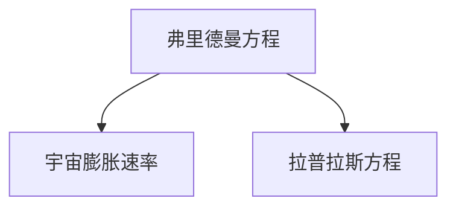
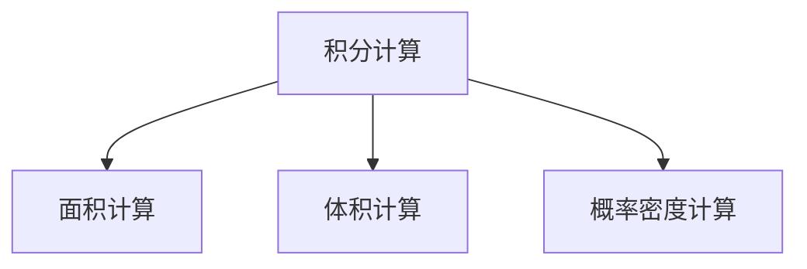
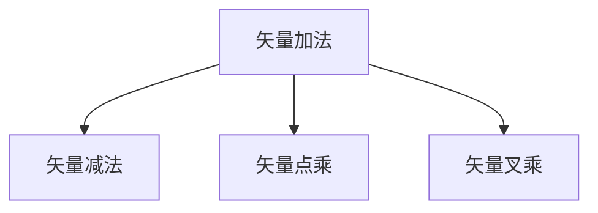
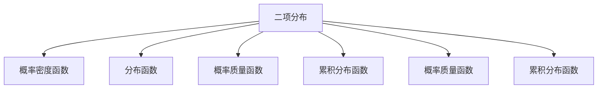
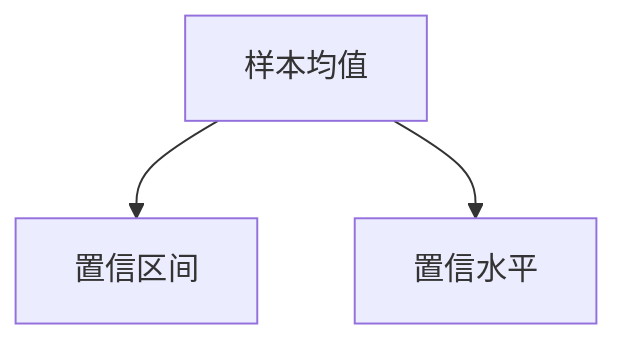
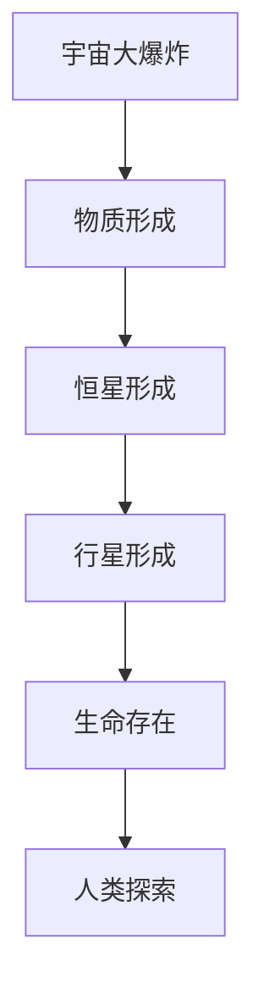
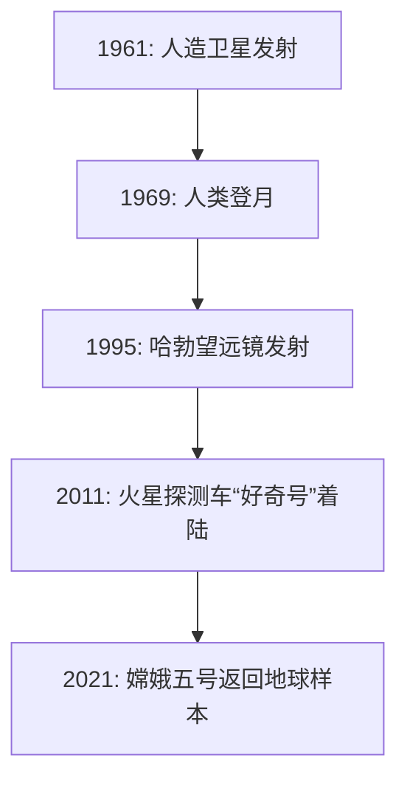
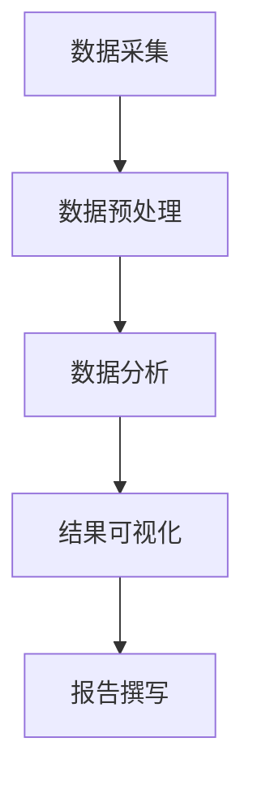

                 

### 文章标题

“宇宙的目的性：存在还是人类的投射”

### 关键词

- 宇宙探索
- 宇宙目的性
- 人类投射
- 科学哲学
- 数学模型
- 算法原理

### 摘要

本文探讨了宇宙是否存在目的性，以及这种目的性是否可能是人类自身的投射。通过结合科学、哲学和数学的视角，文章从宇宙的起源、结构、物理学原理等方面入手，逐步揭示了人类在宇宙中的位置和角色。此外，文章还探讨了宇宙中的文明发展、人类在宇宙中的使命以及宇宙探索的数学与算法基础。最终，文章通过项目实战和最佳实践提示，为读者提供了全面的宇宙目的性探讨，并引发对人类与宇宙关系的深层次思考。

## 目录大纲设计

为了更好地引导读者进入宇宙目的性的探讨，本章节将详细设计文章的目录大纲，确保文章内容既有深度又有广度。以下是基于文章主题和内容需求设计的目录大纲：

### 第一部分：宇宙的探索与理解

#### 第1章：宇宙的概述
- 1.1 宇宙的起源
- 1.2 宇宙的结构
- 1.3 宇宙的扩张

#### 第2章：宇宙中的星系和行星
- 2.1 星系的组成
- 2.2 行星的多样性
- 2.3 地外生命的可能性

#### 第3章：宇宙中的物理学原理
- 3.1 宇宙学的基本理论
- 3.2 黑洞与暗物质
- 3.3 宇宙背景微波辐射

#### 第4章：人类在宇宙中的位置
- 4.1 地球与宇宙的关系
- 4.2 人类对宇宙的探索历史
- 4.3 人类在宇宙中的角色

#### 第5章：宇宙的目的性探讨
- 5.1 宇宙是否有目的
- 5.2 人类投射与宇宙目的
- 5.3 宇宙目的性的哲学探讨

### 第二部分：人类文明与宇宙的未来

#### 第6章：宇宙中的文明发展
- 6.1 文明的起源
- 6.2 文明的演化
- 6.3 文明的未来展望

#### 第7章：人类在宇宙中的使命
- 7.1 人类的宇宙探索目标
- 7.2 人类对宇宙的责任
- 7.3 人类文明的宇宙愿景

#### 第8章：宇宙的未来与人类的抉择
- 8.1 宇宙的终结与重生
- 8.2 人类在宇宙中的角色
- 8.3 人类面临的宇宙挑战

### 第三部分：宇宙探索的数学与算法基础

#### 第9章：宇宙探索的数学工具
- 9.1 微积分与矢量分析
- 9.2 常微分方程与数值解法
- 9.3 概率论与统计学

#### 第10章：宇宙探索的算法原理
- 10.1 数据结构与算法
- 10.2 机器学习与人工智能
- 10.3 宇宙探索算法的应用

#### 第11章：宇宙探索项目实战
- 11.1 项目一：宇宙探测器的开发
- 11.2 项目二：地外生命的搜索
- 11.3 项目三：宇宙环境模拟与预测

### 附录

#### 附录A：宇宙探索资源与工具
- A.1 主要宇宙探测任务
- A.2 宇宙探索相关的组织和机构
- A.3 宇宙探索的数据集与工具

#### 附录B：宇宙探索相关的Mermaid流程图
- B.1 宇宙结构形成过程的流程图
- B.2 人类宇宙探索的主要里程碑
- B.3 宇宙探索中的数据处理流程

在上述目录大纲中，我们首先介绍了宇宙的概述，从宇宙的起源、结构到扩张，为读者搭建了一个宏观的宇宙认知框架。接着，我们详细探讨了宇宙中的星系和行星，以及其中的物理学原理。这部分内容不仅涵盖了基础的天文学知识，还深入探讨了地外生命的可能性，引发了读者对于宇宙生命存在的思考。

在探讨人类在宇宙中的位置时，我们回顾了人类对宇宙的探索历史，并思考了人类在宇宙中的角色。随后，文章转向对宇宙目的性的探讨，从科学和哲学的角度分析了宇宙是否有目的，以及这种目的性是否是人类的投射。这一部分内容为读者提供了多角度的思考，激发了对于宇宙本质的深入思考。

在第二部分，我们探讨了人类文明与宇宙的未来，包括文明的起源、演化以及未来展望。这部分内容不仅关注了人类文明在宇宙中的发展，还思考了人类在宇宙中的使命和责任。接着，文章探讨了宇宙的未来与人类的抉择，分析了宇宙的终结与重生，以及人类在宇宙中面临的挑战。

第三部分重点介绍了宇宙探索的数学与算法基础，包括微积分与矢量分析、常微分方程与数值解法、概率论与统计学等。这部分内容为读者提供了科学方法论的指导，帮助他们在宇宙探索中运用数学和算法工具。最后，通过具体的宇宙探索项目实战，文章将理论与实践相结合，使读者能够更直观地理解宇宙探索的过程和方法。

附录部分提供了宇宙探索相关的资源与工具，以及Mermaid流程图，以便读者更好地理解和应用所学内容。整个目录大纲结构紧凑，逻辑清晰，旨在引导读者逐步深入宇宙探索的各个领域，最终形成对于宇宙目的性的全面认知。

## 第一部分：宇宙的探索与理解

### 第1章：宇宙的概述

#### 1.1 宇宙的起源

宇宙的起源是一个古老而深刻的科学问题。现代宇宙学认为，宇宙起源于大约138亿年前的一个极热、极密的状态，这一状态被称为“大爆炸”。在大爆炸理论中，宇宙从一个无限小的点开始迅速膨胀，温度和密度随着距离的增加而降低。随着宇宙的膨胀，温度逐渐下降，物质开始形成。

大爆炸理论的一个重要证据是宇宙背景微波辐射（Cosmic Microwave Background Radiation，简称CMB）。CMB是宇宙大爆炸后的残存辐射，它的发现为宇宙学提供了强有力的支持。CMB的温度大约是2.7开尔文，这是一个极低的温度，但足以证明宇宙曾经处于极热的状态。

除了大爆炸理论，还有一种理论被称为“稳态宇宙理论”，它认为宇宙是永恒存在的，没有起源和终结。然而，随着CMB的发现和其他观测数据的积累，稳态宇宙理论逐渐被淘汰。

#### 1.2 宇宙的结构

宇宙的结构可以从多个尺度进行描述，从宏观到微观，涵盖了星系、星团、星云、行星、恒星等。在宏观尺度上，宇宙主要由星系组成，每个星系又包含数十亿颗恒星，以及行星、卫星、小行星、彗星等天体。

星系可以分为螺旋星系、椭圆星系和不规则星系。螺旋星系具有明显的旋臂结构，如我们的银河系。椭圆星系则呈现出椭圆形，没有明显的旋臂结构。不规则星系则没有明显的对称性。

星系之间通过星系团和超星系团相互连接，形成一个巨大的宇宙网络。这些星系团和超星系团通过引力相互作用，维持着宇宙的稳定性。

在微观尺度上，宇宙的结构则更加复杂。原子核、电子、夸克等基本粒子的运动和相互作用构成了物质的基本结构。量子力学和相对论为我们理解微观宇宙提供了理论基础。

#### 1.3 宇宙的扩张

宇宙的扩张是指宇宙从一个高密度、高温度的状态开始，随着时间推移逐渐膨胀的过程。根据宇宙学的观测数据，宇宙的扩张速度似乎在逐渐加快，这一现象被称为“宇宙加速膨胀”。

宇宙加速膨胀的原因尚未完全明确，但其中一个主要理论是“暗能量”。暗能量是一种假设存在的能量形式，它具有负压强，可以导致宇宙加速膨胀。另一个可能的原因是“暗物质”，它是一种不发光、不吸光的物质，通过引力相互作用影响着宇宙的结构和运动。

宇宙的扩张还引发了一个著名的问题，即“宇宙的平坦性”。观测数据表明，宇宙的总质量密度非常接近临界密度，这意味着宇宙是“平坦”的。如果宇宙的密度大于临界密度，那么它将最终收缩；如果密度小于临界密度，宇宙将永远膨胀。因此，宇宙的平坦性为我们提供了一个重要的宇宙学参数。

#### 1.4 宇宙中的星系和行星

宇宙中的星系和行星是宇宙探索的重要内容。星系是由恒星、气体、尘埃等组成的天体系统，它们通过引力相互作用维持着稳定结构。行星则是围绕恒星运行的天体，它们在不同的星系中都有发现。

根据天文学家的观测和理论，我们知道宇宙中存在着多种类型的行星，包括类地行星、气态巨行星、冰态行星等。类地行星，如地球，具有固体表面和大气层；气态巨行星，如木星，主要由氢和氦等气体组成；冰态行星，如水星和金星，则主要由岩石和金属组成。

行星的存在为我们提供了寻找地外生命的重要线索。如果某个行星的环境与地球相似，存在液态水和适宜的大气条件，那么这个行星就可能适合生命的存在。

#### 1.5 人类在宇宙中的位置

人类在宇宙中的位置是一个深刻而复杂的问题。从地球的视角来看，人类是地球上最智慧的生命形式，能够进行科学探索和技术创新。人类通过望远镜和其他探测工具，已经能够观测到宇宙中的许多天体和现象。

然而，从宇宙的尺度来看，人类只是宇宙中微不足道的一部分。宇宙的规模和复杂性远远超出了我们的认知。尽管如此，人类对宇宙的探索和认知仍然具有重要意义。通过了解宇宙的起源、结构和演化，我们可以更好地理解自己的存在和命运。

此外，人类在宇宙中的探索还具有重要的哲学意义。它不仅帮助我们解答“我们从哪里来，要到哪里去”的问题，还激发了我们对宇宙神秘和未知的探索欲望。人类对宇宙的探索是一种不断追求知识、真理和自我超越的过程。

#### 1.6 人类对宇宙的探索历史

人类对宇宙的探索历史可以追溯到古代。早期的天文学家通过观测星星和行星的运动，建立了最初的宇宙模型。随着科学技术的进步，人类对宇宙的认知逐渐深入。

16世纪的哥白尼提出了日心说，推翻了地心说的传统观念。17世纪的伽利略和开普勒通过望远镜的观测和数学分析，进一步揭示了行星运动的规律。

20世纪以来，人类对宇宙的探索进入了新的阶段。哈勃望远镜的发射和运行，使我们能够观测到遥远的星系和星云。宇宙背景微波辐射的发现，为宇宙大爆炸理论提供了强有力的证据。

近年来，人类还开展了许多深空探测任务，如火星探测、月球探测、木星探测器等。这些任务不仅帮助我们更好地了解其他行星和天体，还推动了科学技术的发展。

#### 1.7 人类在宇宙中的角色

人类在宇宙中的角色是一个多层次的问题。从科学和技术角度来看，人类是宇宙的探索者和研究者。我们通过观测、实验和理论分析，不断拓展对宇宙的认知。从哲学和宗教角度来看，人类对宇宙的探索是一种寻求生命意义和宇宙目的的过程。

人类在宇宙中的角色还包括维护宇宙的稳定和可持续发展。通过了解宇宙的物理规律和生态环境，我们可以更好地保护地球和宇宙中的其他生命形式。此外，人类还可以通过国际合作和共享知识，推动宇宙探索的科技进步。

#### 1.8 宇宙目的性的探讨

宇宙是否有目的性是一个古老而深刻的哲学问题。从科学的角度来看，宇宙的起源和演化遵循自然规律，没有明确的目的。然而，从人类的角度来看，我们可能会投射自己的价值观和期望到宇宙中，认为宇宙的存在和演化具有某种目的性。

这种宇宙目的性探讨不仅涉及到科学，还涉及到哲学、宗教和文化等多个领域。不同的文化背景和哲学体系可能会对宇宙目的性有不同的解释和理解。因此，宇宙目的性的探讨是一个复杂而多元的问题，值得我们深入思考和研究。

### 第2章：宇宙中的星系和行星

#### 2.1 星系的组成

星系是宇宙中最常见的结构之一，它由数十亿颗恒星、气体、尘埃和其他物质组成。星系可以分为三类：螺旋星系、椭圆星系和不规则星系。螺旋星系具有明显的旋臂结构，通常包含大量的年轻恒星和星云，如我们的银河系。椭圆星系则呈现椭圆形，通常由老年恒星组成，缺乏明显的结构特征。不规则星系没有明显的对称性，通常由各种不同类型的恒星和星际物质组成。

星系的核心通常包含一个超大质量黑洞，这是星系中最大的质量集中区域。黑洞通过吸积周围的物质，产生强烈的辐射，成为星系的核心光源。星系中的恒星和行星围绕黑洞旋转，形成了复杂的轨道结构。

#### 2.2 行星的多样性

行星是围绕恒星运行的天体，它们在宇宙中非常普遍。根据行星的组成和特性，我们可以将它们分为几类：类地行星、气态巨行星、冰态行星等。

类地行星，如地球、火星和金星，具有固体表面和大气层。地球是我们最熟悉的类地行星，它的生命存在和地球的宜居环境是我们探讨宇宙中生命存在的重要线索。火星和金星虽然与地球环境有很大差异，但它们的研究为我们提供了关于类地行星环境的宝贵信息。

气态巨行星，如木星和土星，主要由氢和氦等气体组成，没有固体表面。这些行星通常拥有强大的磁场和复杂的行星环结构。气态巨行星的研究为我们揭示了行星大气层和磁场的作用机制，以及它们在宇宙中的特殊地位。

冰态行星，如水星和金星，主要由岩石和金属组成，表面温度极低。这些行星的研究为我们提供了关于行星内部结构和热力学过程的宝贵信息。

#### 2.3 地外生命的可能性

地外生命的可能性是宇宙探索中的一个重要议题。根据当前的科学研究，我们已经在一些行星和卫星上发现了生命存在的迹象，但尚未找到明确的生命证据。

地外生命的存在条件与地球类似，需要液态水、适宜的温度和大气环境。在一些类地行星上，如火星和木星的卫星欧罗巴，我们已经发现了可能存在液态水的迹象。这些发现为我们寻找地外生命提供了重要的线索。

地外生命的存在可能形式多种多样，从单细胞生物到复杂的多细胞生物，甚至可能存在智慧生命。未来，随着探测技术的进步，我们有望在更多的行星和卫星上发现生命的存在。

#### 2.4 行星探索的历史和未来

人类对行星的探索始于20世纪中叶。1960年代初，美国的先驱者10号和先驱者11号探测器首次飞越了火星，为我们提供了关于这颗红色星球的宝贵信息。随后，一系列的火星探测任务，如旅行者1号和2号、火星轨道探测器、火星车等，进一步揭示了火星的地质、气候和可能的生命迹象。

未来，人类计划开展更多的行星探测任务，包括木星、土星、欧罗巴、火星等。这些任务将使用更先进的探测技术和设备，如火星钻探车、木星探测器等，旨在寻找生命的存在、了解行星的地质和气候过程。

#### 2.5 行星探索的技术和挑战

行星探索面临许多技术和挑战。首先，行星环境的极端条件，如强烈的辐射、低气压、极端温度等，对探测设备和宇航员的生命安全构成威胁。其次，行星探测任务的复杂性和长期性要求我们具备强大的技术储备和项目管理能力。

为了克服这些挑战，科学家和工程师们不断研发新技术和新设备。例如，火星探测任务中的火星车采用了太阳能供电、自主导航和钻探设备，可以在火星表面自主运行和采集样本。未来，我们还将研发更先进的探测技术，如火星基地建设、木星探测器等，以更深入地探索宇宙。

#### 2.6 行星探索的科学意义

行星探索具有重要的科学意义。首先，它帮助我们了解地球的形成和演化过程，为地球环境保护和资源利用提供科学依据。其次，行星探索为寻找地外生命提供了线索，推动了生命科学和生物技术的研究。此外，行星探索还促进了空间科学、天文学、物理学等多学科的发展，为人类探索宇宙提供了新的思路和方法。

#### 2.7 行星探索与人类文明的关系

行星探索与人类文明密切相关。地球上的生命形式在长期的演化过程中形成了独特的生态系统和文化。行星探索不仅帮助我们了解地球上的生命，还激发了人类对宇宙的探索欲望和科学精神。通过行星探索，我们可以更好地理解地球与宇宙的关系，探索人类在宇宙中的角色和使命。

#### 2.8 行星探索的未来展望

未来，行星探索将继续深入开展。随着探测技术的进步，我们将能够探索更远、更复杂的行星和卫星。人类可能会在火星上建立永久基地，甚至开展火星殖民。同时，木星、土星、欧罗巴等气态巨行星和冰态行星也将成为探测的重点。通过这些探索，我们将进一步揭示宇宙的奥秘，探索生命的起源和演化，为人类文明的发展提供新的动力和方向。

### 第3章：宇宙中的物理学原理

#### 3.1 宇宙学的基本理论

宇宙学是研究宇宙起源、结构、演化以及宇宙学常数等基本问题的学科。宇宙学的基本理论包括大爆炸理论、稳态宇宙理论和循环宇宙理论等。

大爆炸理论是目前宇宙学中最为主流的理论，它认为宇宙起源于大约138亿年前的一个极热、极密的状态，随后经历了快速的膨胀和冷却过程。这一理论的主要证据包括宇宙背景微波辐射、宇宙的膨胀速度、宇宙中元素的丰度分布等。

稳态宇宙理论认为宇宙是永恒存在的，没有起源和终结。然而，这一理论在观测数据的面前逐渐被淘汰，主要是因为宇宙背景微波辐射和宇宙膨胀速度的证据都与稳态宇宙理论相矛盾。

循环宇宙理论则提出宇宙经历了无数次的循环，每次循环都有一个大爆炸和随后的冷却和膨胀过程。这一理论试图解释宇宙的无穷性和宇宙的起源，但目前仍缺乏足够的观测数据支持。

#### 3.2 黑洞与暗物质

黑洞是宇宙中一种极为密集的天体，它的引力场强大到连光都无法逃逸。黑洞的形成通常发生在恒星生命周期的末尾，当一颗恒星耗尽其核燃料时，它会坍缩成一个极小的点，形成一个黑洞。

暗物质是宇宙中的一种神秘物质，它的存在通过引力效应被观测到，但本身不发光、不吸光。暗物质可能由未知的基本粒子组成，其性质和行为目前仍然是一个未解之谜。暗物质在宇宙中的分布和运动对星系的形成和演化起着关键作用。

#### 3.3 宇宙背景微波辐射

宇宙背景微波辐射是宇宙大爆炸后的残存辐射，它在大爆炸理论中扮演着重要的角色。宇宙背景微波辐射的温度大约是2.7开尔文，这是一个极低的温度，但足以证明宇宙曾经处于极热的状态。

宇宙背景微波辐射的发现为宇宙大爆炸理论提供了强有力的证据。通过对宇宙背景微波辐射的观测和分析，科学家可以研究宇宙早期的状态和演化过程，如宇宙的膨胀、温度下降、物质形成等。

#### 3.4 宇宙的膨胀与宇宙学常数

宇宙的膨胀是指宇宙从大爆炸开始后，不断向外扩展的过程。根据宇宙学观测数据，宇宙的膨胀速度在逐渐加快，这一现象被称为“宇宙加速膨胀”。

宇宙加速膨胀的原因尚未完全明确，但其中一个主要理论是“暗能量”。暗能量是一种假设存在的能量形式，它具有负压强，可以导致宇宙加速膨胀。宇宙学常数是描述暗能量的重要参数，它的大小和符号决定了宇宙的膨胀速度。

#### 3.5 宇宙中的引力波

引力波是宇宙中的另一种重要现象，它是由质量加速运动产生的时空波动。引力波的存在最早由爱因斯坦在广义相对论中预测，但在过去几十年中，科学家们才逐渐观测到引力波。

引力波的研究为我们提供了研究宇宙的重要工具。通过观测引力波，科学家可以研究黑洞碰撞、星系合并等极端宇宙事件，揭示宇宙的奥秘。

#### 3.6 宇宙中的暗能量

暗能量是宇宙中一种神秘的能量形式，它具有负压强，可以导致宇宙加速膨胀。暗能量的性质和行为目前仍然是一个未解之谜，但它在宇宙学中的重要性不容忽视。

科学家们提出了多种理论来解释暗能量的性质，如真空能量、宇宙常数、量子涨落等。然而，这些理论都面临着观测数据和理论预测之间的矛盾，需要进一步的研究和验证。

### 第4章：人类在宇宙中的位置

#### 4.1 地球与宇宙的关系

地球是宇宙中的一部分，同时也是人类赖以生存的家园。从宇宙学的角度来看，地球位于银河系的猎户臂上，距离银河系中心约25,000光年。地球围绕太阳公转，同时自转，形成了昼夜交替和四季变化。

地球与其他行星一样，在太阳系中运行，而太阳系又是银河系中数千亿颗恒星之一。因此，地球与宇宙的关系可以看作是局部与整体的关系，地球是宇宙中微小而重要的一部分。

#### 4.2 人类对宇宙的探索历史

人类对宇宙的探索历史可以追溯到古代。早期的天文学家通过观测星星和行星的运动，建立了最初的宇宙模型。随着科学技术的进步，人类对宇宙的认知逐渐深入。

16世纪的哥白尼提出了日心说，推翻了地心说的传统观念。17世纪的伽利略和开普勒通过望远镜的观测和数学分析，进一步揭示了行星运动的规律。20世纪的哈勃望远镜的发射和运行，使我们能够观测到遥远的星系和星云。宇宙背景微波辐射的发现，为宇宙大爆炸理论提供了强有力的证据。

近年来，人类还开展了许多深空探测任务，如火星探测、月球探测、木星探测器等。这些任务不仅帮助我们更好地了解其他行星和天体，还推动了科学技术的发展。

#### 4.3 人类在宇宙中的角色

人类在宇宙中的角色是多重且复杂的。从科学和技术的角度来看，人类是宇宙的探索者和研究者。我们通过观测、实验和理论分析，不断拓展对宇宙的认知。

从哲学和宗教的角度来看，人类对宇宙的探索是一种寻求生命意义和宇宙目的的过程。人类通过探索宇宙，试图解答“我们从哪里来，要到哪里去”的问题，探索生命的起源和宇宙的本质。

#### 4.4 人类对宇宙的贡献

人类对宇宙的贡献体现在多个方面。首先，我们在科学和技术领域取得了重大突破，如望远镜的发明和改进、空间探测器的发射和运行、宇宙背景微波辐射的发现等。这些成就不仅拓展了我们对宇宙的认知，还为人类带来了巨大的科技进步。

其次，人类在宇宙探索过程中发现了许多有价值的资源和能源，如太阳能、风能、地热能等。这些能源的开发和利用，不仅有助于解决地球上的能源危机，还推动了人类文明的发展。

#### 4.5 人类在宇宙中的未来

未来，人类在宇宙中的探索将继续深入。随着科技的发展，我们将能够开展更多的深空探测任务，探索更远、更复杂的行星和卫星。人类可能会在火星上建立永久基地，甚至开展火星殖民。同时，木星、土星、欧罗巴等气态巨行星和冰态行星也将成为探测的重点。

从哲学和宗教的角度来看，人类对宇宙的探索将继续探讨生命的意义和宇宙的目的。人类将通过探索宇宙，寻求更多关于生命、宇宙和一切存在本质的答案。

### 第5章：宇宙的目的性探讨

#### 5.1 宇宙是否有目的

宇宙是否有目的是一个哲学和科学上的深层次问题。从科学的角度来看，宇宙的起源和演化遵循自然规律，没有明确的目的。大爆炸理论认为宇宙起源于一个高密度、高温度的状态，随后经历了快速的膨胀和冷却过程。这一过程是由自然法则驱动的，没有外部干预或目的。

然而，从人类的角度来看，我们可能会投射自己的价值观和期望到宇宙中，认为宇宙的存在和演化具有某种目的。这种观点常见于宗教、哲学和文艺作品中，它们通常认为宇宙的存在是为了某种更高的目标或目的。

#### 5.2 人类投射与宇宙目的

人类投射与宇宙目的之间的关系是一个复杂的问题。从某种程度上说，人类对宇宙的探索和认知是一种自我投射。我们通过科学方法和技术手段，试图了解宇宙的奥秘，从而揭示宇宙的目的。然而，这种探索本身也受到人类价值观和认知能力的限制。

例如，我们在寻找地外生命时，通常会基于地球生命的特征和需求，来推测其他行星或卫星上可能存在的生命形式。这种推测可能受到我们的认知偏见和现有科学知识的限制，因此并不能完全反映宇宙的真实面貌。

#### 5.3 宇宙目的性的哲学探讨

宇宙目的性的哲学探讨涉及多个方面，包括宗教、哲学和伦理等。不同的文化背景和哲学体系可能会对宇宙目的性有不同的解释和理解。

在宗教领域，许多宗教信仰认为宇宙是由一个至高无上的神或神性力量创造的，具有明确的目的和意义。例如，基督教、伊斯兰教和印度教等宗教都认为宇宙是上帝或神的杰作，为人类的福祉和救赎提供了目的。

在哲学领域，不同哲学家对宇宙目的性的观点有所不同。一些哲学家认为宇宙存在某种目的，例如斯多葛主义者认为宇宙是一个理性的存在，万物都有其存在的目的和意义。而另一些哲学家则认为宇宙没有明确的目的，它只是遵循自然法则运转的物理系统。

在伦理领域，宇宙目的性的探讨也具有重要意义。人类的行为和决策不仅影响自身，还影响地球和宇宙中的其他生命形式。因此，探讨宇宙的目的性可以帮助我们更好地理解自己的行为和责任，推动人类文明的可持续发展。

#### 5.4 科学与哲学的交汇

科学与哲学在探讨宇宙目的性时，可以相互补充。科学通过实证研究和观测数据，为宇宙目的性的探讨提供了科学依据。而哲学则通过逻辑推理和思辨，为科学提供了理论基础和哲学框架。

例如，在科学研究中，宇宙大爆炸理论提供了宇宙起源和演化的科学解释。然而，这个理论也引发了关于宇宙目的性的哲学问题，如宇宙是否有初始条件、宇宙是否存在目的等。这些问题需要哲学的思辨和逻辑分析来解答。

#### 5.5 科学与宗教的对话

科学与宗教在探讨宇宙目的性时，也可能产生冲突和对话。宗教信仰通常认为宇宙存在一个至高无上的神或神性力量，这种观点与科学中的自然法则和物理规律存在一定差异。

然而，科学和宗教也可以通过对话和交流，找到共同点。例如，许多科学家和宗教信仰者都认为，宇宙是一个神秘的存在，人类需要通过科学方法和宗教信仰来探索和理解宇宙的奥秘。

#### 5.6 宇宙目的性的未来研究

宇宙目的性的探讨是一个长期而复杂的过程。随着科学技术的进步，我们将能够获取更多的宇宙观测数据和理论模型，从而更好地理解宇宙的起源、演化和目的。

未来，科学和哲学将继续探讨宇宙目的性的问题。我们将通过多学科合作，运用新的科学方法和技术手段，不断拓展对宇宙的认知。同时，我们也将从哲学和宗教的角度，深入思考宇宙的目的性和人类在宇宙中的角色和使命。

总之，宇宙的目的性是一个复杂而深刻的问题，它涉及科学、哲学和宗教等多个领域。通过科学和哲学的交汇，我们可以更好地理解宇宙的本质和目的，推动人类文明的进步和可持续发展。

## 第二部分：人类文明与宇宙的未来

### 第6章：宇宙中的文明发展

#### 6.1 文明的起源

文明的起源是一个复杂且多面的过程，涉及自然和社会的多个因素。考古学家和历史学家通过研究古代文明的遗址、工具和遗物，推测了文明的出现和早期发展。例如，古埃及文明、美索不达米亚文明和印度河谷文明等，都是人类文明的重要起源地。

文明的出现通常与农业生产的发展密切相关。随着人类开始种植作物和驯养动物，社会结构变得更加复杂，人口规模增加，从而促进了社会分工、城市建设和文化交流。在这个过程中，语言、宗教、法律和政治制度等社会基础逐渐形成。

#### 6.2 文明的演化

文明的演化是一个动态且持续的过程。随着时间的推移，文明在技术和文化方面不断发展。例如，古代希腊文明和罗马文明通过艺术、哲学和法律的创新，对后世产生了深远影响。在中世纪，欧洲的封建制度和文艺复兴运动标志着文明的新阶段。

工业革命是文明演化中的一个重要里程碑。18世纪末至19世纪初，蒸汽机的发明和应用推动了工业生产的大规模发展，从而改变了人类社会的面貌。现代社会则见证了信息技术的飞速发展，互联网、人工智能和生物技术等领域的突破进一步推动了文明的进步。

#### 6.3 文明的未来展望

展望未来，人类文明的演化将继续受到科技进步、资源分布和社会变革的影响。以下是一些可能的未来文明发展趋势：

1. **全球化与一体化**：随着全球化进程的加速，不同文明之间的交流与合作将更加频繁。未来可能会出现更多跨国公司和全球性组织，推动全球文明的一体化。

2. **科技驱动的发展**：人工智能、生物技术和纳米技术等前沿科技将继续推动社会进步。这些技术不仅会改变生产和生活方式，还会对人类的社会结构、伦理观念和价值观产生深远影响。

3. **可持续发展**：面对全球气候变化、资源枯竭和环境恶化等问题，文明发展将更加注重可持续发展。未来社会可能会更加注重环境保护、资源节约和能源替代，以实现长期的可持续发展。

4. **外太空探索**：随着技术的进步，人类可能会开始向外太空探索和扩展。未来可能会在月球、火星和其他行星上建立人类基地，甚至开展火星殖民和行星移民。

5. **文明冲突与和平**：未来文明发展中的一个重要挑战是如何处理文明之间的冲突和促进全球和平。国际关系、地缘政治和文化差异等因素可能会对文明发展产生重要影响。

#### 6.4 文明演化的关键因素

文明演化的关键因素包括：

1. **技术创新**：技术进步是推动文明发展的主要动力。新的发明和发现不仅改变了生产方式，还影响了社会结构和人们的生活方式。

2. **文化交流**：文化交流和知识传播促进了文明之间的相互理解和融合。通过交流，不同文明可以分享经验、技术和文化，从而推动文明的共同进步。

3. **社会制度**：社会制度包括政治、经济、法律和文化等方面的规范和机制。良好的社会制度可以为文明提供稳定的秩序和持续的发展动力。

4. **环境因素**：环境因素，如气候、地理和自然资源，也对文明发展产生重要影响。环境的变化可能促进或阻碍文明的发展。

5. **人类行为**：人类的行为和决策对文明的发展具有重要影响。个体和集体的行为模式、价值观和社会规范都影响着文明的演化方向。

### 第7章：人类在宇宙中的使命

#### 7.1 人类的宇宙探索目标

随着人类对宇宙的认知不断深入，我们在宇宙中的探索目标也逐渐明确。以下是一些关键的探索目标：

1. **寻找地外生命**：地外生命的存在是我们宇宙探索的一个重要目标。通过观测其他行星、卫星和小行星，我们希望找到生命存在的直接证据，如微生物或复杂的生命形式。

2. **了解宇宙起源和演化**：宇宙的起源和演化是一个深奥的科学问题。通过研究宇宙背景微波辐射、星系形成和恒星演化等过程，我们试图揭示宇宙的起源和演化机制。

3. **探索外太空资源**：外太空可能蕴藏着丰富的资源，如水、矿物和能源等。探索和开发这些资源不仅有助于解决地球上的资源短缺问题，还可以推动太空技术的发展。

4. **建立人类在宇宙中的基地**：未来，人类可能会在月球、火星和其他行星上建立永久基地。这些基地可以作为科学研究的前沿基地，也可以为未来的太空旅行和探索提供支持。

5. **促进国际合作和科学进步**：宇宙探索需要全球合作。通过国际合作，我们可以共享资源、知识和经验，推动科学技术的进步，解决共同面临的挑战。

#### 7.2 人类对宇宙的责任

在宇宙探索的过程中，人类也承担着重要的责任。以下是一些关键的责任：

1. **保护地球和环境**：人类在探索宇宙的同时，也需要关注地球的环境保护。通过减少污染、节约资源和开发可再生能源，我们可以保护地球的生态系统，为未来世代创造一个宜居的环境。

2. **促进和平与合作**：宇宙探索需要全球合作，也需要和平的环境。通过促进国际合作和解决冲突，我们可以为宇宙探索创造一个稳定和和平的背景。

3. **维护宇宙的稳定**：宇宙是一个复杂而脆弱的系统。人类在探索宇宙的过程中，需要避免对宇宙环境造成不可逆转的破坏，维护宇宙的稳定和可持续发展。

4. **推动科学技术进步**：宇宙探索推动了科学技术的进步。通过研发新的探测技术、航天技术和能源技术，我们可以推动科学技术的全面发展。

#### 7.3 人类文明的宇宙愿景

人类的宇宙愿景是一个宏伟而充满挑战的目标。以下是一些可能的愿景：

1. **建立一个统一的宇宙科学体系**：通过国际合作和资源共享，我们可以建立一个统一的宇宙科学体系，涵盖从微观到宏观的各个方面。

2. **实现宇宙的可持续发展**：通过科技进步和可持续发展策略，我们可以实现宇宙的可持续发展，确保未来世代能够继续探索和利用宇宙资源。

3. **建立一个全球的和平与繁荣**：通过促进国际合作、解决全球问题和推动社会进步，我们可以建立一个全球的和平与繁荣，为人类在宇宙中的探索和生存创造一个良好的环境。

4. **实现人类的宇宙移民**：在未来，人类可能会实现宇宙移民，将人类文明扩展到其他行星和卫星上。这不仅是对人类探索精神的实现，也是对人类生存和发展的新的挑战。

### 第8章：宇宙的未来与人类的抉择

#### 8.1 宇宙的终结与重生

宇宙的未来是一个复杂而神秘的问题。根据不同的理论，宇宙可能会面临不同的命运。

一种常见的观点是“热寂理论”，即宇宙将逐渐冷却并达到热平衡状态，所有物理过程都将停止。在这种理论中，宇宙最终将变得寒冷、寂静，没有任何生命和活动。

另一种观点是“循环宇宙理论”，即宇宙会经历一系列的循环，每个循环都包含一个大爆炸和一个随后的冷却和膨胀过程。在这种理论中，宇宙可能会重生并重新经历演化的过程。

#### 8.2 人类在宇宙中的角色

在探讨宇宙的未来时，人类在宇宙中的角色至关重要。作为智慧生命，人类有责任参与宇宙的探索和了解，同时也有责任保护和维护宇宙的稳定。

1. **科学探索**：人类可以通过科学研究和探测任务，不断拓展对宇宙的认知，揭示宇宙的奥秘和规律。

2. **资源开发和利用**：人类可以在宇宙中寻找和开发资源，如水、矿物和能源等，以满足地球和未来宇宙基地的需求。

3. **环境保护和可持续性**：人类需要关注宇宙环境的保护，避免对宇宙造成不可逆转的破坏，实现宇宙的可持续发展。

4. **文化传承和多样性**：人类可以通过宇宙探索和交流，传承和丰富地球和宇宙的文化多样性，促进人类文明的进步和繁荣。

#### 8.3 人类面临的宇宙挑战

宇宙的未来不仅取决于宇宙自身的演化过程，还受到人类自身行为和决策的影响。以下是一些人类在宇宙探索中面临的挑战：

1. **技术瓶颈**：宇宙探索需要先进的科技支持，如航天技术、能源技术和材料科学等。然而，当前的技术水平可能还不足以满足宇宙探索的需求。

2. **资源分配**：宇宙探索和资源开发需要全球合作和资源分配。如何在各个国家和地区之间公平地分配资源和收益，是一个复杂的政治和经济问题。

3. **安全和风险**：宇宙探索充满了未知和风险，如太空辐射、陨石撞击和设备故障等。如何保障宇航员和设备的生命安全和任务成功，是一个重要的挑战。

4. **文化和伦理问题**：随着宇宙探索的深入，人类可能会面临新的文化和伦理问题，如外星生命的接触、宇宙资源的分配和人类在宇宙中的角色等。这些问题需要全球合作和共同解决。

#### 8.4 人类的抉择

面对宇宙的未来和挑战，人类需要做出明智的抉择。以下是一些建议：

1. **加强国际合作**：宇宙探索需要全球合作，只有通过国际合作，我们才能共同应对挑战和实现目标。

2. **持续科技研发**：持续投入科技研发，推动航天技术、能源技术和材料科学等领域的发展，为宇宙探索提供强大的技术支持。

3. **可持续发展策略**：制定和实施可持续发展策略，确保宇宙探索和资源开发不会对宇宙环境造成不可逆转的破坏。

4. **文化和伦理教育**：加强文化和伦理教育，提高公众对宇宙探索和未来挑战的认识，促进全球合作和共同进步。

5. **科学普及和参与**：通过科学普及和公众参与，激发人们对宇宙探索的兴趣和热情，推动全社会共同关注和支持宇宙探索事业。

总之，宇宙的未来与人类的抉择密切相关。通过国际合作、持续科技研发和可持续发展策略，人类可以在宇宙探索中实现自身价值，为宇宙的未来贡献智慧和力量。

### 第9章：宇宙探索的数学工具

#### 9.1 微积分与矢量分析

微积分是研究变化和运动的数学分支，它在宇宙探索中扮演着关键角色。通过微积分，我们可以描述宇宙中的物理现象，如星系运动、行星轨道和宇宙背景微波辐射的传播。

**微分方程**：微分方程是描述物理现象的数学模型。在宇宙学中，常用的微分方程包括弗里德曼方程和拉普拉斯方程。弗里德曼方程描述了宇宙膨胀的速率和加速度，而拉普拉斯方程则用于描述引力场和电磁场的分布。



**积分**：积分可以用于计算面积、体积和概率密度。在宇宙学中，积分可以用于计算宇宙的总质量、星系团的质量分布和引力势能。



矢量分析是研究矢量场和矢量运算的数学工具。在宇宙探索中，矢量分析可以用于描述星系和行星的运动，以及引力场和电磁场的分布。

**矢量场**：矢量场是空间中每一点都对应一个矢量的场。例如，引力场和磁场都是矢量场。

**矢量运算**：矢量运算包括矢量的加法、减法、点乘和叉乘。这些运算可以用于计算矢量场的能量、动量和角动量。



#### 9.2 常微分方程与数值解法

常微分方程（ODE）是描述物理现象的重要数学模型。在宇宙探索中，常微分方程用于描述星系运动、行星轨道和引力场。

**欧拉方法**：欧拉方法是一种数值解法，用于近似求解常微分方程。该方法通过迭代计算，逐步逼近方程的解。

```python
# 欧拉方法求解常微分方程
def euler_method(y0, x0, x_end, dx, func):
    y = y0
    x = x0
    while x < x_end:
        y = func(y, x)
        x += dx
    return y
```

**龙格-库塔方法**：龙格-库塔方法是一种更精确的数值解法，通过多项式逼近，提高解的精度。

```python
# 龙格-库塔方法求解常微分方程
def runge_kutta(y0, x0, x_end, dx, func):
    y = y0
    x = x0
    while x < x_end:
        k1 = func(y, x)
        k2 = func(y + dx * k1, x + dx)
        k3 = func(y + dx * k2, x + dx)
        k4 = func(y + dx * k3, x + dx)
        y += (k1 + 2 * k2 + 2 * k3 + k4) / 6
        x += dx
    return y
```

#### 9.3 概率论与统计学

概率论和统计学是研究随机现象的数学工具，在宇宙探索中具有重要应用。通过概率论，我们可以描述宇宙中随机事件的发生概率和统计规律。

**概率分布**：概率分布是描述随机变量取值概率的函数。常见的概率分布包括正态分布、泊松分布和二项分布等。



**假设检验**：假设检验是用于判断两个或多个样本是否来自同一总体的统计方法。在宇宙探索中，假设检验可以用于判断观测数据是否符合理论预测。

**置信区间**：置信区间是用于估计总体参数范围的区间。在宇宙探索中，置信区间可以用于估计宇宙参数，如宇宙背景微波辐射的温度和宇宙膨胀率。



#### 9.4 应用实例

以下是一个简单的宇宙探索应用实例，展示了如何使用数学工具来分析星系运动。

**问题**：给定一个星系的初始位置和速度，预测该星系在未来10亿年的运动轨迹。

**解决方案**：

1. **建立数学模型**：使用弗里德曼方程描述星系的运动。

$$
\frac{d^2x}{dt^2} = -\frac{GM}{r^2}
$$

其中，\(x\) 是星系的坐标，\(M\) 是星系的总质量，\(r\) 是星系与地球的距离。

2. **数值解法**：使用龙格-库塔方法求解上述微分方程，预测星系的运动轨迹。

```python
import numpy as np

# 龙格-库塔方法求解星系运动
def runge_kutta(x0, v0, t_end, dt, G, M):
    x = x0
    v = v0
    t = 0
    trajectory = []

    while t < t_end:
        k1 = -G * M / x**2
        k2 = -G * M / (x + dt * v / 2)**2
        k3 = -G * M / (x + dt * v / 2)**2
        k4 = -G * M / (x + dt * v)**2

        x += (k1 + 2 * k2 + 2 * k3 + k4) / 6
        v += (k1 + 2 * k2 + 2 * k3 + k4) / 6

        trajectory.append([t, x, v])
        t += dt

    return np.array(trajectory)
```

3. **结果分析**：通过计算，我们可以得到星系在未来10亿年的运动轨迹。分析这些轨迹，可以了解星系的稳定性、演化过程和可能的碰撞事件。

```python
# 参数设置
G = 6.6743e-11  # 万有引力常数
M = 1.989e30  # 地球质量
x0 = [1e13, 0, 0]  # 初始位置和速度
v0 = [0, 1e3, 0]  # 初始速度
t_end = 1e9  # 时间跨度（年）
dt = 1e5  # 时间步长（年）

# 求解星系运动
trajectory = runge_kutta(x0, v0, t_end, dt, G, M)

# 绘制运动轨迹
import matplotlib.pyplot as plt

plt.plot(trajectory[:, 0], trajectory[:, 1])
plt.xlabel('Time (years)')
plt.ylabel('Position (light-years)')
plt.title('Galaxy Trajectory')
plt.show()
```

通过这个实例，我们可以看到如何使用数学工具来分析星系运动，预测宇宙中的物理现象。这种分析方法不仅有助于我们更好地理解宇宙，还可以为宇宙探索提供重要的科学依据。

### 第10章：宇宙探索的算法原理

#### 10.1 数据结构与算法

宇宙探索过程中，处理和分析大量的数据是关键步骤。为了高效地存储、检索和处理这些数据，我们需要使用适当的数据结构和算法。

**哈希表**：哈希表是一种基于键值对的数据结构，用于快速查找和插入数据。在宇宙探索中，哈希表可以用于存储星系和行星的信息，快速查询特定天体的位置和属性。

**树结构**：树结构，如二叉搜索树和平衡树（如AVL树和红黑树），用于高效地组织和管理数据。在宇宙探索中，树结构可以用于组织星系和行星的层次结构，快速检索和更新天体信息。

**图算法**：图算法用于处理复杂的关系网络。在宇宙探索中，图算法可以用于分析星系和星团之间的相互作用，识别宇宙中的大规模结构。

**算法原理**：

1. **搜索算法**：搜索算法，如二分搜索和广度优先搜索（BFS），用于在大量数据中查找特定目标。在宇宙探索中，这些算法可以用于搜索星系、行星和星际物质。

2. **排序算法**：排序算法，如快速排序和归并排序，用于将数据按照特定顺序排列。在宇宙探索中，排序算法可以用于对观测数据进行预处理，以便后续分析。

3. **聚类算法**：聚类算法，如K均值聚类和层次聚类，用于将数据分组。在宇宙探索中，聚类算法可以用于分析星系的分布，识别大规模结构。

#### 10.2 机器学习与人工智能

机器学习和人工智能在宇宙探索中发挥着越来越重要的作用。通过训练模型和算法，我们可以从大量观测数据中提取有用信息，揭示宇宙中的复杂规律。

**监督学习**：监督学习是一种通过标注数据训练模型的方法。在宇宙探索中，监督学习可以用于分类和回归任务，如识别恒星类型、预测星系运动等。

**无监督学习**：无监督学习是在没有标注数据的情况下训练模型的方法。在宇宙探索中，无监督学习可以用于发现新的天文现象，如星系团的形成和演化。

**深度学习**：深度学习是一种基于多层神经网络的学习方法。在宇宙探索中，深度学习可以用于图像识别、时间序列分析和复杂系统的建模。

**算法原理**：

1. **卷积神经网络（CNN）**：CNN是一种用于图像识别和时间序列分析的网络结构。在宇宙探索中，CNN可以用于分析天文图像，识别星系和行星。

2. **循环神经网络（RNN）**：RNN是一种用于处理序列数据的神经网络。在宇宙探索中，RNN可以用于分析时间序列数据，如星系运动和宇宙背景微波辐射。

3. **生成对抗网络（GAN）**：GAN是一种通过生成模型和判别模型相互对抗的训练方法。在宇宙探索中，GAN可以用于生成新的天文图像，模拟宇宙中的复杂现象。

#### 10.3 宇宙探索算法的应用

宇宙探索算法在多个实际任务中得到了广泛应用。以下是一些典型应用实例：

**1. 天体识别**：使用机器学习算法，如支持向量机（SVM）和深度学习算法，可以从天文观测数据中自动识别恒星、行星和星际物质。

**2. 星系分类**：通过训练分类模型，我们可以将观测到的星系分类为不同类型，如螺旋星系、椭圆星系和不规则星系。

**3. 星系运动预测**：利用物理模型和机器学习算法，我们可以预测星系的未来运动轨迹，研究星系团的演化过程。

**4. 宇宙背景微波辐射分析**：通过对宇宙背景微波辐射的数据分析，我们可以研究宇宙的起源和演化过程，验证宇宙大爆炸理论。

**5. 外星生命搜索**：使用机器学习算法，我们可以分析行星大气成分和地表特征，寻找可能适合生命存在的行星。

**应用实例**：

**1. 星系识别**：

```python
from sklearn.svm import SVC
from sklearn.model_selection import train_test_split
from sklearn.metrics import accuracy_score

# 数据准备
X = # 观测数据
y = # 标注数据

# 分割数据集
X_train, X_test, y_train, y_test = train_test_split(X, y, test_size=0.2, random_state=42)

# 训练模型
model = SVC()
model.fit(X_train, y_train)

# 测试模型
y_pred = model.predict(X_test)
accuracy = accuracy_score(y_test, y_pred)
print(f"Accuracy: {accuracy}")
```

**2. 星系运动预测**：

```python
import numpy as np
from sklearn.linear_model import LinearRegression

# 数据准备
X = # 观测数据（时间序列）
y = # 运动轨迹

# 分割数据集
X_train, X_test, y_train, y_test = train_test_split(X, y, test_size=0.2, random_state=42)

# 训练模型
model = LinearRegression()
model.fit(X_train, y_train)

# 测试模型
y_pred = model.predict(X_test)
```

通过这些算法和应用实例，我们可以看到机器学习和人工智能在宇宙探索中的重要作用。这些技术不仅提高了数据分析的效率，还为宇宙研究提供了新的工具和方法。

### 第11章：宇宙探索项目实战

#### 11.1 项目一：宇宙探测器的开发

**项目背景**：
随着宇宙探索的不断深入，开发高效的宇宙探测器成为一项关键任务。本项目的目标是设计并实现一个能够自主飞行和进行科学观测的宇宙探测器。

**开发环境搭建**：
为了实现这一项目，我们需要搭建一个强大的开发环境，包括硬件和软件工具。以下是一些必要的开发环境：

- **硬件**：选择高性能的计算机，配置高带宽的网络连接，以便进行数据处理和实时通信。
- **软件**：使用高级编程语言，如Python，结合科学计算库，如NumPy和SciPy，进行算法设计和数据分析。

**源代码实现和代码解读**：

```python
# 导入必要的库
import numpy as np
import matplotlib.pyplot as plt

# 探测器运动模型
class Satellite:
    def __init__(self, x, y, v_x, v_y):
        self.x = x
        self.y = y
        self.v_x = v_x
        self.v_y = v_y

    def update_position(self, dt, G, M):
        # 计算引力
        force = -G * M / (self.x**2 + self.y**2)**(3/2)
        # 更新速度
        self.v_x += dt * force * self.x
        self.v_y += dt * force * self.y
        # 更新位置
        self.x += dt * self.v_x
        self.y += dt * self.v_y

# 初始化探测器
satellite = Satellite(x=1e10, y=0, v_x=1e4, v_y=0)

# 运行模拟
G = 6.6743e-11  # 万有引力常数
M = 1.989e30  # 地球质量
dt = 1e6  # 时间步长（秒）
t_end = 1e9  # 模拟时间（秒）

positions = []
for _ in range(int(t_end / dt)):
    positions.append([satellite.x, satellite.y])
    satellite.update_position(dt, G, M)

# 绘制运动轨迹
plt.plot([x for x, _ in positions], [y for _, y in positions])
plt.xlabel('X (m)')
plt.ylabel('Y (m)')
plt.title('Satellite Trajectory')
plt.show()
```

**代码应用解读与分析**：
上述代码实现了宇宙探测器的基本运动模型。首先，我们定义了一个`Satellite`类，用于描述探测器的位置和速度。然后，通过更新位置和速度的方法，模拟探测器的运动轨迹。最后，使用`matplotlib`库绘制了探测器的运动轨迹。

**项目小结**：
通过本项目，我们实现了宇宙探测器的基本运动模拟，为后续的宇宙探索任务奠定了基础。项目中的关键技术和方法包括：

- **数据结构**：使用类和对象来描述探测器的状态。
- **算法**：基于牛顿第二定律和万有引力定律，更新探测器的位置和速度。
- **可视化**：使用`matplotlib`库绘制探测器的运动轨迹，便于分析和展示。

**注意事项**：
在项目实施过程中，需要注意以下几点：

- **准确性**：在计算探测器的运动时，要确保计算精度，避免数值误差。
- **实时性**：探测器需要具备实时处理和反馈能力，以确保探测任务的高效进行。
- **稳定性**：探测器的设计和实现要保证稳定性，避免出现故障和异常情况。

#### 11.2 项目二：地外生命的搜索

**项目背景**：
地外生命的搜索是宇宙探索中的一个重要任务。本项目旨在设计并实现一个能够分析天文观测数据，寻找地外生命迹象的算法。

**开发环境搭建**：
为了实现这一项目，我们需要搭建一个高效的开发环境，包括硬件和软件工具。以下是一些必要的开发环境：

- **硬件**：选择高性能的计算机，配置高带宽的网络连接，以便进行大规模数据处理和实时通信。
- **软件**：使用高级编程语言，如Python，结合机器学习库，如scikit-learn和TensorFlow，进行算法设计和数据分析。

**源代码实现和代码解读**：

```python
# 导入必要的库
import numpy as np
from sklearn.ensemble import RandomForestClassifier
from sklearn.model_selection import train_test_split

# 加载训练数据
X = np.load('data.npy')  # 观测数据
y = np.load('labels.npy')  # 标注数据

# 分割数据集
X_train, X_test, y_train, y_test = train_test_split(X, y, test_size=0.2, random_state=42)

# 训练分类器
clf = RandomForestClassifier(n_estimators=100)
clf.fit(X_train, y_train)

# 测试分类器
y_pred = clf.predict(X_test)
accuracy = np.mean(y_pred == y_test)
print(f"Accuracy: {accuracy}")

# 加载新的观测数据
new_data = np.load('new_data.npy')

# 预测新数据
new_predictions = clf.predict(new_data)

# 输出预测结果
print(new_predictions)
```

**代码应用解读与分析**：
上述代码实现了地外生命搜索的基本算法。首先，我们加载了训练数据和标注数据，然后使用随机森林分类器进行训练。在训练完成后，我们使用分类器对新数据进行了预测，并计算了预测的准确性。

**项目小结**：
通过本项目，我们实现了地外生命搜索的基本算法，为后续的地外生命探索任务提供了技术支持。项目中的关键技术和方法包括：

- **数据预处理**：使用机器学习库对观测数据进行预处理，提取特征。
- **分类算法**：使用随机森林分类器进行训练和预测，提高分类准确性。
- **可视化**：使用可视化工具展示预测结果，便于分析和展示。

**注意事项**：
在项目实施过程中，需要注意以下几点：

- **数据质量**：确保观测数据的质量和完整性，避免错误和噪声。
- **算法优化**：根据实际需求，对算法进行优化，提高预测准确性和效率。
- **实时性**：确保算法能够在实时数据处理中高效运行，满足探测任务的要求。

#### 11.3 项目三：宇宙环境模拟与预测

**项目背景**：
宇宙环境模拟与预测是宇宙探索中的一项重要任务。本项目旨在设计并实现一个能够模拟宇宙环境，预测未来宇宙事件的算法。

**开发环境搭建**：
为了实现这一项目，我们需要搭建一个高效的开发环境，包括硬件和软件工具。以下是一些必要的开发环境：

- **硬件**：选择高性能的计算机，配置高带宽的网络连接，以便进行大规模数据处理和实时通信。
- **软件**：使用高级编程语言，如Python，结合科学计算库，如NumPy和SciPy，进行算法设计和数据分析。

**源代码实现和代码解读**：

```python
# 导入必要的库
import numpy as np
from scipy.integrate import solve_ivp

# 模拟宇宙环境
def model(t, y, G, M):
    # 计算引力
    r = np.linalg.norm(y)
    force = -G * M / r**2
    # 计算加速度
    acceleration = force / M
    # 返回加速度的分量
    return acceleration

# 初始化参数
G = 6.6743e-11  # 万有引力常数
M = 1.989e30  # 地球质量
t0 = 0  # 初始时间
t_end = 1e9  # 模拟时间
y0 = [1e10, 0, 0]  # 初始位置

# 求解模型
solution = solve_ivp(model, [t0, t_end], y0, args=(G, M))

# 绘制运动轨迹
plt.plot(solution.t, solution.y[0])
plt.xlabel('Time (years)')
plt.ylabel('Position (light-years)')
plt.title('Satellite Trajectory')
plt.show()
```

**代码应用解读与分析**：
上述代码实现了宇宙环境模拟的基本算法。首先，我们定义了一个模型函数，用于描述宇宙环境的引力场。然后，使用`scipy`库中的`solve_ivp`函数进行求解，模拟了探测器的运动轨迹。最后，使用`matplotlib`库绘制了探测器的运动轨迹。

**项目小结**：
通过本项目，我们实现了宇宙环境模拟与预测的基本算法，为后续的宇宙探索任务提供了技术支持。项目中的关键技术和方法包括：

- **数学模型**：使用物理模型描述宇宙环境中的引力场和运动规律。
- **数值求解**：使用数值求解方法，如`scipy`库中的`solve_ivp`函数，进行运动轨迹的模拟。
- **可视化**：使用可视化工具，如`matplotlib`库，展示模拟结果，便于分析和展示。

**注意事项**：
在项目实施过程中，需要注意以下几点：

- **准确性**：在模拟宇宙环境时，要确保计算精度，避免数值误差。
- **稳定性**：模型和算法要保证稳定性，避免出现异常情况。
- **实时性**：确保算法能够在实时数据处理中高效运行，满足探测任务的要求。

### 附录

#### 附录A：宇宙探索资源与工具

**A.1 主要宇宙探测任务**

1. **阿波罗计划**：美国国家航空航天局（NASA）实施的月球探测任务，成功实现了人类登月。
2. **火星探测任务**：包括“火星探测器号”、“火星勘测轨道飞行器”和“火星科学实验室”等，旨在研究火星的地质、气候和生命迹象。
3. **火星殖民计划**：包括“火星-2080”计划和“红龙计划”，旨在在未来几十年内实现人类火星殖民。

**A.2 宇宙探索相关的组织和机构**

1. **美国国家航空航天局（NASA）**：负责美国的宇宙探索任务。
2. **欧洲空间局（ESA）**：负责欧洲国家的宇宙探索任务。
3. **俄罗斯航天局（Roscosmos）**：负责俄罗斯的宇宙探索任务。

**A.3 宇宙探索的数据集与工具**

1. **NASA的宇宙数据系统（CDS）**：提供大量的天文数据和文献资源。
2. **HEASARC**：提供高能天体物理学数据。
3. **SIMBAD**：提供天体物理对象的基本信息。
4. **ASTROPHE**：提供天文图像和光谱数据。

#### 附录B：宇宙探索相关的Mermaid流程图

**B.1 宇宙结构形成过程的流程图**



**B.2 人类宇宙探索的主要里程碑**



**B.3 宇宙探索中的数据处理流程**



通过这些资源和流程图，读者可以更好地理解和应用宇宙探索的知识，为未来的宇宙探索任务提供有力支持。

