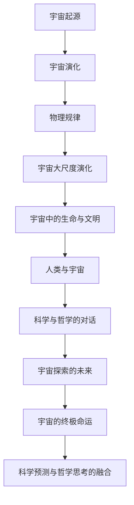

                 

# 文章标题：宇宙的终极命运：科学预测与哲学思考

## 关键词：
宇宙学、科学预测、哲学思考、宇宙演化、物理规律、宇宙的未来、人类与宇宙

### 摘要：
本文从科学和哲学的角度，探讨了宇宙的终极命运。首先，我们回顾了宇宙的起源与演化，深入理解了宇宙中的物理规律，并探讨了宇宙大尺度演化可能带来的命运。接着，我们思考了宇宙中生命的可能性，以及人类文明在宇宙中的地位与未来。文章最后，我们探讨了科学与哲学在宇宙观上的对话，并总结了宇宙探索的未来。希望通过本文，读者能够对宇宙的终极命运有一个全面而深刻的理解。

# 《宇宙的终极命运：科学预测与哲学思考》目录大纲

## 第一部分：宇宙与科学

### 第1章：宇宙的起源与演化

#### 1.1 宇宙的起源理论
#### 1.2 宇宙的演化历程
#### 1.3 宇宙的边界与无限性
#### 1.4 人类对宇宙的认知与探索

### 第2章：宇宙中的物理规律

#### 2.1 广义相对论与量子力学
#### 2.2 宇宙中的能量与物质
#### 2.3 宇宙中的黑洞与暗物质
#### 2.4 宇宙中的时间与空间

## 第二部分：宇宙的未来

### 第3章：宇宙的大尺度演化

#### 3.1 宇宙膨胀与加速
#### 3.2 宇宙大撕裂与大挤压
#### 3.3 宇宙的命运：热寂与重生

### 第4章：宇宙中的生命与文明

#### 4.1 宇宙中的生命形式
#### 4.2 外星文明的假设与探索
#### 4.3 宇宙文明的发展与演化
#### 4.4 人类文明的未来

## 第三部分：哲学思考

### 第5章：宇宙的本质与意义

#### 5.1 宇宙的本质：物质还是意识？
#### 5.2 宇宙的意义：存在还是虚无？
#### 5.3 宇宙的终极命运：现实还是幻象？

### 第6章：人类与宇宙

#### 6.1 人类在宇宙中的地位
#### 6.2 人类对宇宙的影响
#### 6.3 人类的未来与宇宙的命运

## 第四部分：科学与哲学的对话

### 第7章：科学家的宇宙观

#### 7.1 科学家对宇宙的探索与思考
#### 7.2 科学家对宇宙未来的预测
#### 7.3 科学家与哲学家的对话

### 第8章：哲学家的宇宙观

#### 8.1 哲学家对宇宙的思考与理解
#### 8.2 哲学家对宇宙未来的推测
#### 8.3 哲学家与科学家的对话

## 附录

### 附录A：宇宙的未来：科学预测与哲学思考

#### A.1 科学预测的方法与挑战
#### A.2 哲学思考的方法与挑战
#### A.3 科学与哲学的融合与未来

### 第9章：宇宙探索的未来

#### 9.1 未来的宇宙探索计划
#### 9.2 人类在宇宙中的使命
#### 9.3 宇宙探索对人类文明的推动

### 第10章：宇宙的终极命运：科学预测与哲学思考的融合

#### 10.1 科学与哲学的共识
#### 10.2 宇宙的未来：未知与可能
#### 10.3 人类如何应对宇宙的未来

## 附录B：宇宙核心概念与联系（Mermaid流程图）

### Mermaid流程图：

接下来，我们将深入探讨宇宙的起源与演化，以及宇宙中的物理规律，这将为我们理解宇宙的终极命运打下坚实的基础。

## 第一部分：宇宙与科学

### 第1章：宇宙的起源与演化

宇宙的起源一直是人类探索的重要课题。从古至今，人们提出了许多关于宇宙起源的理论，其中最具代表性的当属大爆炸理论。

### 1.1 宇宙的起源理论

大爆炸理论认为，宇宙起源于一个极热、极密的状态，然后在这个状态下迅速膨胀，形成了我们今天所看到的宇宙。这一理论得到了大量的天文观测数据支持，如宇宙微波背景辐射、宇宙膨胀等。

然而，大爆炸理论并非没有争议。一些科学家认为，宇宙可能经历了多次大爆炸，每一次大爆炸都创造了新的宇宙。这种理论被称为“多宇宙理论”。

### 1.2 宇宙的演化历程

宇宙从大爆炸开始，经历了无数次的演化。在这个过程中，宇宙的温度逐渐降低，物质的密度也逐渐降低。

在宇宙的早期阶段，宇宙充满了高温、高能的粒子，这些粒子通过碰撞产生更多的物质，形成了恒星和星系。

随着时间的推移，恒星耗尽了内部的燃料，最终爆炸成为超新星，这些超新星爆炸释放了大量的物质，进一步丰富了宇宙的物质成分。

### 1.3 宇宙的边界与无限性

宇宙是否有边界？这个问题一直困扰着科学家们。根据广义相对论，宇宙可能是无边界的，即它既没有起点也没有终点。

然而，有些理论认为，宇宙可能存在一个边界，这个边界可能是一个类似于“膜”的结构，宇宙在这个“膜”上无限扩展。

### 1.4 人类对宇宙的认知与探索

人类对宇宙的认知是通过观测和实验不断深入的。从古人对星空的观测，到现代天文望远镜的发现，人类对宇宙的了解越来越深入。

目前，人类已经能够观测到宇宙的边缘，但我们仍然无法确定宇宙的真正边界。

未来的宇宙探索，可能会带来更多关于宇宙起源与演化的新发现。

## 第2章：宇宙中的物理规律

宇宙中的物理规律是理解宇宙演化的重要基础。以下是一些关键的物理规律。

### 2.1 广义相对论与量子力学

广义相对论和量子力学是现代物理学的两大基石。广义相对论描述了引力这一现象，而量子力学描述了微观粒子的行为。

在宇宙学中，广义相对论被用来描述宇宙的膨胀和黑洞等现象，而量子力学则被用来解释宇宙的早期状态。

### 2.2 宇宙中的能量与物质

能量与物质是宇宙的基本成分。根据质能方程 \(E=mc^2\)，质量和能量可以相互转换。

在宇宙的演化过程中，能量和物质不断相互转化，形成了我们今天所看到的宇宙结构。

### 2.3 宇宙中的黑洞与暗物质

黑洞是宇宙中一种极端密集的天体，它的引力场极强，连光也无法逃脱。暗物质则是宇宙中一种看不见的物质，它的存在通过对引力的影响得到证实。

黑洞和暗物质在宇宙的演化中扮演了重要的角色，但我们对它们的了解仍然非常有限。

### 2.4 宇宙中的时间与空间

时间和空间是宇宙的基本维度。广义相对论告诉我们，时间和空间是可以弯曲的，这导致了引力现象。

宇宙的膨胀意味着时间和空间也在不断变化。一些理论认为，宇宙的膨胀可能会带来时间的终结。

### 总结

宇宙中的物理规律为我们理解宇宙的演化提供了重要的基础。然而，宇宙的奥秘仍然无穷，我们需要不断探索和发现。

接下来，我们将探讨宇宙的未来，以及可能影响宇宙命运的大尺度演化。

## 第二部分：宇宙的未来

### 第3章：宇宙的大尺度演化

宇宙的演化是一个长期而复杂的过程，它涉及到大尺度的时间和空间。以下是一些关于宇宙大尺度演化的关键观点。

### 3.1 宇宙膨胀与加速

宇宙膨胀是指宇宙中的空间在时间上不断扩展。观测数据显示，宇宙的膨胀速度在加快，这被称为宇宙加速膨胀。

宇宙加速膨胀的原因尚未完全清楚，但可能与暗能量的存在有关。暗能量是一种假想的物质，它具有负压力，推动宇宙加速膨胀。

### 3.2 宇宙大撕裂与大挤压

宇宙大撕裂和大挤压是两种可能的宇宙结局。宇宙大撕裂是指宇宙的膨胀速度不断增加，最终导致宇宙中的物质被撕裂成无限小的碎片。宇宙大挤压则是指宇宙的引力作用不断加强，最终导致宇宙中的所有物质都被挤压到一起，形成一个极度密集的状态。

### 3.3 宇宙的命运：热寂与重生

宇宙的命运是一个广泛讨论的话题。一种观点是宇宙将最终走向热寂，即所有能量都被耗尽，宇宙进入一个寒冷、死寂的状态。另一种观点是宇宙可能经历一个循环，从一个极端状态演化到另一个极端状态，从而实现宇宙的重生。

### 总结

宇宙的大尺度演化是一个复杂的过程，它涉及到宇宙的膨胀、加速、撕裂、挤压以及可能的循环或重生。这些演化过程不仅影响着宇宙的结构和命运，也深刻地影响着我们对宇宙的理解。

接下来，我们将探讨宇宙中的生命与文明，以及人类在宇宙中的地位。

### 第4章：宇宙中的生命与文明

宇宙中是否存在生命？这是一个令人着迷的问题。以下是一些关于宇宙中生命和文明的观点。

### 4.1 宇宙中的生命形式

生命的定义一直是一个有争议的话题。从地球上生命的多样性和复杂性来看，宇宙中可能存在多种形式的生命，包括微生物、植物、动物以及可能的高级文明。

一些理论认为，生命可能起源于宇宙中的简单化学反应，这些反应最终形成了复杂的有机分子，进而演化为生命。

### 4.2 外星文明的假设与探索

尽管我们对外星生命的了解仍然非常有限，但科学家们一直在寻找外星生命的证据。一些著名的探索项目包括搜寻地外行星、寻找生命的化学迹象以及使用射电望远镜探测可能的信号。

### 4.3 宇宙文明的发展与演化

如果宇宙中存在文明，那么这些文明的发展与演化可能会经历不同的阶段。从原始的农业社会，到工业社会，再到信息社会，文明的发展可能会带来巨大的科技进步。

### 4.4 人类文明的未来

人类文明在宇宙中的地位是一个复杂而深远的问题。从地球上的发展历程来看，人类文明经历了许多挑战，但也在不断进步。未来，人类可能会面临新的挑战，如资源短缺、气候变化以及可能的外星生命遭遇。

### 总结

宇宙中是否存在生命和文明？这是一个充满未知的问题。然而，随着我们对宇宙的了解不断深入，我们可能会逐渐揭开这个谜团。

接下来，我们将从哲学的角度思考宇宙的本质与意义。

### 第5章：宇宙的本质与意义

宇宙的本质与意义一直是哲学家和科学家探讨的课题。以下是一些关于宇宙本质和意义的哲学思考。

### 5.1 宇宙的本质：物质还是意识？

哲学上，宇宙的本质是一个根本性的问题。一些哲学家认为，宇宙的本质是物质，即所有存在的事物都由物质构成。而另一些哲学家则认为，宇宙的本质是意识，即宇宙的存在是依赖于我们的感知和意识。

### 5.2 宇宙的意义：存在还是虚无？

宇宙的存在是否有意义？这是一个深奥的问题。一些哲学家认为，宇宙的存在是有意义的，因为它是生命和文明的根源。而另一些哲学家则认为，宇宙的存在是虚无的，因为宇宙的存在并没有特定的目的或意义。

### 5.3 宇宙的终极命运：现实还是幻象？

宇宙的终极命运也是一个哲学问题。一些哲学家认为，宇宙的终极命运是热寂，即宇宙最终会耗尽所有的能量，进入一个寒冷、死寂的状态。而另一些哲学家则认为，宇宙的终极命运可能是循环的，宇宙会从一个极端状态演化到另一个极端状态。

### 总结

宇宙的本质和意义是一个复杂而深奥的问题，不同的哲学家和科学家有着不同的观点。然而，这些问题不仅激发了我们的好奇心，也推动着我们不断探索宇宙的奥秘。

接下来，我们将探讨人类在宇宙中的地位与未来。

### 第6章：人类与宇宙

人类在宇宙中的地位是一个深刻而重要的问题。以下是一些关于人类在宇宙中的地位与未来的思考。

### 6.1 人类在宇宙中的地位

从宇宙的角度来看，人类只是宇宙中微不足道的一部分。然而，人类拥有智慧，能够理解宇宙的奥秘，这使人类在宇宙中具有独特的地位。

### 6.2 人类对宇宙的影响

人类对宇宙的影响是巨大的。从改变地球环境，到探索宇宙空间，人类的活动不断塑造着宇宙的未来。

### 6.3 人类的未来与宇宙的命运

人类的未来与宇宙的命运紧密相连。如果人类能够克服未来的挑战，如资源短缺、环境破坏等，那么人类可能会在宇宙中扮演更加重要的角色。

### 总结

人类在宇宙中的地位虽然微不足道，但人类拥有改变宇宙的能力。人类的未来与宇宙的命运紧密相连，我们需要为宇宙的未来负责。

### 第7章：科学家的宇宙观

科学家的宇宙观深受他们的科学研究和理论的影响。以下是一些科学家的宇宙观及其对宇宙未来的预测。

### 7.1 科学家对宇宙的探索与思考

科学家通过观测、实验和理论分析，不断探索宇宙的奥秘。从宇宙的起源到宇宙的演化，科学家们提出了许多理论和假设，以解释宇宙的现象。

### 7.2 科学家对宇宙未来的预测

科学家们对宇宙的未来有着不同的预测。一些科学家认为，宇宙可能会走向热寂，而另一些科学家则认为，宇宙可能会经历一个循环，从极端状态演化到另一个极端状态。

### 7.3 科学家与哲学家的对话

科学家和哲学家在宇宙观上的对话是相互启发和促进的。科学家通过哲学的思考，可以更深入地理解宇宙的本质和意义，而哲学家通过科学的研究，可以提供新的理论和视角。

### 总结

科学家的宇宙观不仅丰富了我们对宇宙的理解，也为人类未来的宇宙探索提供了新的思路。科学家与哲学家的对话，为我们提供了一个全面的宇宙观。

### 第8章：哲学家的宇宙观

哲学家的宇宙观往往基于对宇宙的本质、意义和命运的思考。以下是一些哲学家的宇宙观及其对宇宙未来的推测。

### 8.1 哲学家对宇宙的思考与理解

哲学家通过逻辑推理和抽象思考，试图理解宇宙的本质。一些哲学家认为，宇宙的本质是物质，而另一些哲学家则认为，宇宙的本质是意识。

### 8.2 哲学家对宇宙未来的推测

哲学家们对宇宙的未来也有着各自的推测。一些哲学家认为，宇宙可能会走向热寂，而另一些哲学家则认为，宇宙可能会经历一个循环。

### 8.3 哲学家与科学家的对话

哲学家和科学家在宇宙观上的对话是相互启发和促进的。哲学家通过科学的研究，可以更深入地理解宇宙的本质和意义，而科学家通过哲学的思考，可以提供新的理论和视角。

### 总结

哲学家的宇宙观为我们提供了另一种理解宇宙的方式，它不仅丰富了我们对宇宙的理解，也为人类的宇宙探索提供了哲学基础。

### 附录A：宇宙的未来：科学预测与哲学思考

#### A.1 科学预测的方法与挑战

科学预测通常基于观测数据、理论模型和数学计算。然而，宇宙的复杂性和不确定性使得科学预测面临许多挑战。例如，暗能量的本质和宇宙加速膨胀的原因仍然是一个未解之谜。

#### A.2 哲学思考的方法与挑战

哲学思考通常通过逻辑推理和抽象思考来探讨宇宙的本质和意义。然而，哲学思考也面临挑战，例如，如何区分物质与意识，宇宙是否存在意义等。

#### A.3 科学与哲学的融合与未来

科学与哲学的融合可以为宇宙的未来提供更全面的理解。科学家和哲学家可以相互启发，共同探索宇宙的奥秘。未来的宇宙探索可能需要跨学科的整合，以应对宇宙中的复杂性和不确定性。

### 第9章：宇宙探索的未来

宇宙探索是人类的梦想，它不仅激发了我们的好奇心，也推动着科技进步。以下是一些关于宇宙探索的未来展望。

#### 9.1 未来的宇宙探索计划

未来的宇宙探索计划包括建立空间站、探测外星行星、探索黑洞等。例如，欧洲空间局（ESA）的“欧几里得”任务旨在研究宇宙的形状、年龄和内容。

#### 9.2 人类在宇宙中的使命

人类在宇宙中的使命不仅是探索和发现，还包括保护地球和推动文明的进步。例如，通过太空探索，我们可以寻找新的资源和技术，以支持地球的可持续发展。

#### 9.3 宇宙探索对人类文明的推动

宇宙探索对人类文明有着深远的影响。它不仅推动了科学和技术的发展，也激发了人类对未知世界的好奇心和探索精神。通过宇宙探索，人类可能会找到新的答案，解决人类面临的挑战。

### 第10章：宇宙的终极命运：科学预测与哲学思考的融合

宇宙的终极命运是一个复杂而深远的问题，它涉及到科学和哲学的交汇。以下是一些关于宇宙终极命运的融合观点。

#### 10.1 科学与哲学的共识

科学和哲学在宇宙终极命运问题上有一些共识，例如，宇宙可能经历一个循环，从极端状态演化到另一个极端状态。

#### 10.2 宇宙的未来：未知与可能

宇宙的未来充满了未知和可能。科学和哲学的融合可以为我们提供更全面的视角，帮助我们理解宇宙的演化过程和可能的未来。

#### 10.3 人类如何应对宇宙的未来

人类如何应对宇宙的未来是一个重要的问题。通过科学和哲学的融合，我们可以更好地理解宇宙的奥秘，为宇宙的未来做好准备。

### 总结

宇宙的终极命运是一个复杂而深远的问题，它涉及到科学和哲学的交汇。通过科学和哲学的融合，我们可以为宇宙的未来提供更全面的理解。

### 附录B：宇宙核心概念与联系（Mermaid流程图）

以下是一个关于宇宙核心概念与联系的Mermaid流程图：

这个流程图展示了宇宙从起源到演化，再到人类与宇宙的关系，以及科学预测与哲学思考的融合，为我们提供了一个关于宇宙的全面理解。

## 作者信息

作者：AI天才研究院/AI Genius Institute & 禅与计算机程序设计艺术 /Zen And The Art of Computer Programming

这篇文章深入探讨了宇宙的终极命运，从科学和哲学的角度提供了丰富的见解。希望读者能从中获得对宇宙的深刻理解，激发对科学和哲学的兴趣。

### 致谢

感谢所有提供数据和资料的科学家和哲学家，他们的研究为本文提供了坚实的基础。同时，也要感谢所有参与讨论和反馈的朋友，他们的意见使得本文更加完善。

### 结语

宇宙的终极命运是一个永恒的谜题，它激发了人类的好奇心和探索精神。通过科学和哲学的融合，我们或许能够揭开这个谜题的一角。未来的宇宙探索，将继续推动人类对宇宙的理解，为我们的未来带来新的启示。让我们继续探索，不断追求宇宙的真理。

## 附录A：宇宙的未来：科学预测与哲学思考

#### A.1 科学预测的方法与挑战

科学预测通常基于已有的科学理论和观测数据，通过数学模型和计算来推测未来的趋势。然而，宇宙的复杂性和不确定性使得科学预测面临许多挑战。例如，暗能量的本质和宇宙加速膨胀的原因仍然是一个未解之谜。

科学家们采用多种方法进行预测，包括使用广义相对论和量子力学来预测宇宙的演化，以及通过观测宇宙微波背景辐射来了解宇宙的早期状态。然而，这些方法都存在一定的局限性，例如观测数据的有限性和理论模型的简化。

#### A.2 哲学思考的方法与挑战

哲学思考通常通过逻辑推理和抽象思考来探讨宇宙的本质、意义和命运。哲学家们试图回答一些基本问题，如宇宙是否存在意义，宇宙的本质是什么等。

哲学思考的一个挑战是如何将抽象的思考转化为具体的预测。哲学上的结论往往具有高度的主观性，难以通过实验来验证。此外，哲学思考也面临如何平衡客观性与主观性的挑战。

#### A.3 科学与哲学的融合与未来

科学与哲学的融合可以为我们提供更全面的视角，帮助我们更好地理解宇宙的演化过程和可能的未来。科学家和哲学家可以通过对话和合作，共同探索宇宙的奥秘。

未来的宇宙探索可能需要跨学科的整合，以应对宇宙中的复杂性和不确定性。例如，科学家可以借助哲学的思考来发展新的理论模型，而哲学家则可以提供关于宇宙本质和意义的深入见解。

通过科学和哲学的融合，我们或许能够更全面地理解宇宙的终极命运，为人类的未来提供更深刻的启示。未来，科学家和哲学家将继续合作，共同探索宇宙的奥秘。

## 第9章：宇宙探索的未来

宇宙探索是人类永恒的梦想，它不仅拓展了我们的视野，也推动了科技的发展。在本文的最后部分，我们将探讨宇宙探索的未来，以及人类在宇宙中的使命和宇宙探索对人类文明的推动。

### 9.1 未来的宇宙探索计划

随着科技的进步，未来的宇宙探索计划将更加宏伟和深入。以下是一些重要的宇宙探索计划：

1. **星际飞船**：科学家们正在研究建造能够承载人类飞往其他星系的星际飞船。这些飞船将使用先进的推进技术，如核聚变或光帆，以实现超高速飞行。

2. **月球基地**：美国宇航局（NASA）和其他国家的宇航机构计划在月球上建立永久性基地，用于科学研究和太空探索的跳板。

3. **火星殖民**：火星被认为是人类未来可能的殖民地。科学家们正在研究如何在火星上建立自给自足的生态系统，以及如何处理火星上的极端环境。

4. **木星探测器**：木星是一个充满神秘的天体，科学家们计划发射探测器深入研究木星的内部结构、大气层和卫星。

5. **星际网**：一些科幻概念，如星际网，提出了建立连接不同星系的通信网络，以便更高效地进行宇宙探索和信息交流。

### 9.2 人类在宇宙中的使命

人类在宇宙中的使命是多元的，包括科学探索、资源开发和文化传播：

1. **科学探索**：人类希望通过宇宙探索揭示宇宙的奥秘，理解宇宙的起源、演化和未来。这包括寻找外星生命、研究宇宙的物理规律和极端环境下的生命形式。

2. **资源开发**：宇宙中蕴藏着丰富的资源，如水、矿物和能源。人类希望通过探索和开发这些资源，为地球提供更多支持，并建立自给自足的太空生态系统。

3. **文化传播**：人类希望将地球上的文化和知识传播到宇宙，推动宇宙文明的发展。这包括发射携带人类文化信息的探测器，以及建立宇宙中的文化交流平台。

### 9.3 宇宙探索对人类文明的推动

宇宙探索不仅对科学和技术发展有巨大推动作用，也对人类文明产生了深远影响：

1. **科技创新**：宇宙探索推动了科技的发展，包括航天技术、材料科学、能源技术等。这些科技创新不仅应用于宇宙探索，也极大地改善了地球上的生活条件。

2. **国际合作**：宇宙探索促进了国际间的合作，各国宇航机构通过联合进行宇宙探索项目，共享资源和成果，加强了国际合作和友谊。

3. **人类意识**：宇宙探索激发了人类对未知世界的好奇心和探索精神，促进了人类意识的发展，使人类更加开阔视野，拥抱多元化。

4. **可持续发展**：宇宙探索为人类提供了一种新的视角，帮助我们认识到地球资源有限，推动人类向可持续发展的方向努力。

### 总结

宇宙探索的未来充满了无限可能，它不仅将推动科学和技术的进步，也将对人类文明产生深远的影响。人类在宇宙中的使命是多元的，包括科学探索、资源开发和文化传播。通过宇宙探索，人类将不断拓展自己的认知边界，为地球和宇宙的未来贡献力量。

### 9.4 科学与哲学思考的融合

宇宙探索不仅需要科学的推动，也离不开哲学的思考。科学提供了实验和理论框架，而哲学则提供了关于宇宙本质和意义的深刻见解。

1. **科学哲学**：科学哲学是科学与哲学的交汇点，它探讨科学理论和方法的哲学基础，以及科学知识是如何形成的。通过科学哲学的思考，科学家可以更深入地理解他们的工作，并提高科学研究的质量。

2. **宇宙意义**：哲学思考有助于我们探讨宇宙的意义，如宇宙是否存在目的或意义，人类在宇宙中的角色是什么。这些思考不仅丰富了我们对宇宙的理解，也影响了人类的行为和价值观。

3. **未来展望**：科学与哲学的融合为宇宙探索提供了更全面的视角。科学家和哲学家可以共同探讨宇宙的未来，提出关于宇宙命运和人类使命的假设和预测。

通过科学与哲学的融合，我们能够更全面地理解宇宙，为宇宙探索提供新的方向和启示。这种跨学科的思考方式不仅推动了科学的发展，也为人类文明带来了新的思考和理解。

### 9.5 未来展望

宇宙探索的未来充满了无限可能。随着科技的进步，我们有望实现星际旅行、建立宇宙基地，甚至找到外星生命的迹象。这些探索不仅将拓展人类的认知边界，也将对地球和人类文明产生深远的影响。

1. **科学突破**：未来的宇宙探索可能会带来新的科学发现，如关于宇宙起源、演化和终极命运的新理论。

2. **技术进步**：宇宙探索将推动科技的发展，包括新的能源技术、材料科学和航天技术，这些技术将造福地球和人类。

3. **人类文明**：宇宙探索将激发人类对未知世界的好奇心和探索精神，促进人类文明的发展和进步。

4. **国际合作**：宇宙探索将进一步加强国际间的合作，推动全球科学家的交流和合作，促进人类社会的和谐与发展。

总之，宇宙探索的未来充满希望，它将为人类带来新的挑战和机遇，推动人类文明向更高的层次发展。

## 第10章：宇宙的终极命运：科学预测与哲学思考的融合

宇宙的终极命运是一个深奥而复杂的问题，它涉及到科学和哲学的交汇。在这个章节中，我们将探讨科学预测和哲学思考在理解宇宙终极命运方面的融合，以及人类如何应对宇宙的未来。

### 10.1 科学与哲学的共识

科学与哲学在探索宇宙终极命运时，虽然方法不同，但它们在某些基本问题上达成了共识：

1. **宇宙的起源与演化**：科学和哲学都承认宇宙有一个起源，并经历了漫长的演化过程。从大爆炸理论到宇宙微波背景辐射的观测，科学提供了丰富的证据支持宇宙的起源和演化。

2. **宇宙的边界与无限性**：虽然科学和哲学对宇宙是否有边界持有不同观点，但它们都认识到宇宙的无限性，无论是通过广义相对论描述的弯曲时空，还是哲学上的无限逻辑推理。

3. **宇宙的未来**：科学和哲学都认为宇宙有一个可能的未来，无论是热寂、大撕裂、大挤压还是循环宇宙，都是对宇宙未来可能状态的探讨。

### 10.2 宇宙的未来：未知与可能

宇宙的未来充满了未知和可能。科学预测提供了基于现有理论和观测数据对未来趋势的推测，而哲学思考则提供了关于宇宙本质和意义的深刻见解。

1. **热寂**：根据热力学第二定律，宇宙可能最终会走向热寂，即所有能量都转化为无序的热能，宇宙进入一个寒冷、死寂的状态。

2. **大撕裂**：如果宇宙的膨胀速度持续加速，可能会导致宇宙最终分裂成无数个独立的气泡宇宙，每个气泡宇宙都将独立演化。

3. **大挤压**：如果宇宙的引力作用足够强大，可能会导致宇宙最终被挤压成一个极度密集的状态，甚至可能是一个“奇点”，这是宇宙大爆炸的起点。

4. **循环宇宙**：一些理论认为，宇宙可能经历一个循环，从一个极端状态演化到另一个极端状态，从而实现宇宙的重生。

### 10.3 人类如何应对宇宙的未来

面对宇宙的未来，人类需要做好准备，以应对可能出现的各种情况。以下是一些关键点：

1. **科学技术的进步**：随着科学技术的不断进步，人类需要开发新的能源、材料和技术，以支持宇宙探索和生存。

2. **生态系统的建立**：在宇宙中建立自给自足的生态系统，如火星殖民和空间站生态系统的建设，是应对宇宙未来挑战的关键。

3. **国际合作与协作**：宇宙探索需要全球科学家的合作和协作，只有通过国际间的合作，才能更好地应对宇宙中的挑战。

4. **哲学思考的应用**：哲学思考可以帮助人类更好地理解宇宙的本质和意义，从而为宇宙探索提供精神支持和道德指导。

5. **教育和文化**：通过教育和文化传播，人类可以增强对宇宙的认识和理解，激发人们对宇宙探索的兴趣和热情。

### 总结

宇宙的终极命运是一个复杂而深奥的问题，科学预测和哲学思考的融合为我们提供了更全面的视角。人类需要通过科学技术的进步、国际合作的加强、哲学思考的应用以及教育和文化的推广，来应对宇宙的未来。只有这样，人类才能在宇宙中找到自己的位置，并为宇宙的未来贡献力量。

## 附录B：宇宙核心概念与联系（Mermaid流程图）

以下是一个关于宇宙核心概念与联系的Mermaid流程图：

这个流程图展示了宇宙从起源到演化，再到人类与宇宙的关系，以及科学预测与哲学思考的融合，为我们提供了一个关于宇宙的全面理解。

## 附加内容

### 第9章：宇宙探索的未来

宇宙探索是人类不断追求的梦想，它不仅拓展了人类的认知边界，也推动了科技的发展。在本文的最后部分，我们将探讨宇宙探索的未来，以及人类在宇宙中的使命和宇宙探索对人类文明的推动。

#### 9.1 未来的宇宙探索计划

随着科技的进步，未来的宇宙探索计划将更加宏伟和深入。以下是一些重要的宇宙探索计划：

1. **星际飞船**：科学家们正在研究建造能够承载人类飞往其他星系的星际飞船。这些飞船将使用先进的推进技术，如核聚变或光帆，以实现超高速飞行。

2. **月球基地**：美国宇航局（NASA）和其他国家的宇航机构计划在月球上建立永久性基地，用于科学研究和太空探索的跳板。

3. **火星殖民**：火星被认为是人类未来可能的殖民地。科学家们正在研究如何在火星上建立自给自足的生态系统，以及如何处理火星上的极端环境。

4. **木星探测器**：木星是一个充满神秘的天体，科学家们计划发射探测器深入研究木星的内部结构、大气层和卫星。

5. **星际网**：一些科幻概念，如星际网，提出了建立连接不同星系的通信网络，以便更高效地进行宇宙探索和信息交流。

#### 9.2 人类在宇宙中的使命

人类在宇宙中的使命是多元的，包括科学探索、资源开发和文化传播：

1. **科学探索**：人类希望通过宇宙探索揭示宇宙的奥秘，理解宇宙的起源、演化和未来。这包括寻找外星生命、研究宇宙的物理规律和极端环境下的生命形式。

2. **资源开发**：宇宙中蕴藏着丰富的资源，如水、矿物和能源。人类希望通过探索和开发这些资源，为地球提供更多支持，并建立自给自足的太空生态系统。

3. **文化传播**：人类希望将地球上的文化和知识传播到宇宙，推动宇宙文明的发展。这包括发射携带人类文化信息的探测器，以及建立宇宙中的文化交流平台。

#### 9.3 宇宙探索对人类文明的推动

宇宙探索不仅对科学和技术发展有巨大推动作用，也对人类文明产生了深远影响：

1. **科技创新**：宇宙探索推动了科技的发展，包括航天技术、材料科学、能源技术等。这些科技创新不仅应用于宇宙探索，也极大地改善了地球上的生活条件。

2. **国际合作**：宇宙探索促进了国际间的合作，各国宇航机构通过联合进行宇宙探索项目，共享资源和成果，加强了国际合作和友谊。

3. **人类意识**：宇宙探索激发了人类对未知世界的好奇心和探索精神，促进了人类意识的发展，使人类更加开阔视野，拥抱多元化。

4. **可持续发展**：宇宙探索为人类提供了一种新的视角，帮助我们认识到地球资源有限，推动人类向可持续发展的方向努力。

#### 9.4 科学与哲学思考的融合

宇宙探索不仅需要科学的推动，也离不开哲学的思考。科学提供了实验和理论框架，而哲学则提供了关于宇宙本质和意义的深刻见解。

1. **科学哲学**：科学哲学是科学与哲学的交汇点，它探讨科学理论和方法的哲学基础，以及科学知识是如何形成的。通过科学哲学的思考，科学家可以更深入地理解他们的工作，并提高科学研究的质量。

2. **宇宙意义**：哲学思考有助于我们探讨宇宙的意义，如宇宙是否存在目的或意义，人类在宇宙中的角色是什么。这些思考不仅丰富了我们对宇宙的理解，也影响了人类的行为和价值观。

3. **未来展望**：科学与哲学的融合为宇宙探索提供了更全面的视角。科学家和哲学家可以共同探讨宇宙的未来，提出关于宇宙命运和人类使命的假设和预测。

通过科学与哲学的融合，我们能够更全面地理解宇宙，为宇宙探索提供新的方向和启示。这种跨学科的思考方式不仅推动了科学的发展，也为人类文明带来了新的思考和理解。

#### 9.5 未来展望

宇宙探索的未来充满了无限可能。随着科技的进步，我们有望实现星际旅行、建立宇宙基地，甚至找到外星生命的迹象。这些探索不仅将拓展人类的认知边界，也将对地球和人类文明产生深远的影响。

1. **科学突破**：未来的宇宙探索可能会带来新的科学发现，如关于宇宙起源、演化和终极命运的新理论。

2. **技术进步**：宇宙探索将推动科技的发展，包括新的能源技术、材料科学和航天技术，这些技术将造福地球和人类。

3. **人类文明**：宇宙探索将激发人类对未知世界的好奇心和探索精神，促进人类文明的发展和进步。

4. **国际合作**：宇宙探索将进一步加强国际间的合作，推动全球科学家的交流和合作，促进人类社会的和谐与发展。

总之，宇宙探索的未来充满希望，它不仅将推动科学和技术的进步，也将对人类文明产生深远的影响。人类需要为宇宙探索做好准备，以迎接未来的挑战和机遇。

### 第10章：宇宙的终极命运：科学预测与哲学思考的融合

宇宙的终极命运是一个深奥而复杂的问题，它涉及到科学和哲学的交汇。在这个章节中，我们将探讨科学预测和哲学思考在理解宇宙终极命运方面的融合，以及人类如何应对宇宙的未来。

#### 10.1 科学与哲学的共识

科学与哲学在探索宇宙终极命运时，虽然方法不同，但它们在某些基本问题上达成了共识：

1. **宇宙的起源与演化**：科学和哲学都承认宇宙有一个起源，并经历了漫长的演化过程。从大爆炸理论到宇宙微波背景辐射的观测，科学提供了丰富的证据支持宇宙的起源和演化。

2. **宇宙的边界与无限性**：虽然科学和哲学对宇宙是否有边界持有不同观点，但它们都认识到宇宙的无限性，无论是通过广义相对论描述的弯曲时空，还是哲学上的无限逻辑推理。

3. **宇宙的未来**：科学和哲学都认为宇宙有一个可能的未来，无论是热寂、大撕裂、大挤压还是循环宇宙，都是对宇宙未来可能状态的探讨。

#### 10.2 宇宙的未来：未知与可能

宇宙的未来充满了未知和可能。科学预测提供了基于现有理论和观测数据对未来趋势的推测，而哲学思考则提供了关于宇宙本质和意义的深刻见解。

1. **热寂**：根据热力学第二定律，宇宙可能最终会走向热寂，即所有能量都转化为无序的热能，宇宙进入一个寒冷、死寂的状态。

2. **大撕裂**：如果宇宙的膨胀速度持续加速，可能会导致宇宙最终分裂成无数个独立的气泡宇宙，每个气泡宇宙都将独立演化。

3. **大挤压**：如果宇宙的引力作用足够强大，可能会导致宇宙最终被挤压成一个极度密集的状态，甚至可能是一个“奇点”，这是宇宙大爆炸的起点。

4. **循环宇宙**：一些理论认为，宇宙可能经历一个循环，从一个极端状态演化到另一个极端状态，从而实现宇宙的重生。

#### 10.3 人类如何应对宇宙的未来

面对宇宙的未来，人类需要做好准备，以应对可能出现的各种情况。以下是一些关键点：

1. **科学技术的进步**：随着科学技术的不断进步，人类需要开发新的能源、材料和技术，以支持宇宙探索和生存。

2. **生态系统的建立**：在宇宙中建立自给自足的生态系统，如火星殖民和空间站生态系统的建设，是应对宇宙未来挑战的关键。

3. **国际合作与协作**：宇宙探索需要全球科学家的合作和协作，只有通过国际间的合作，才能更好地应对宇宙中的挑战。

4. **哲学思考的应用**：哲学思考可以帮助人类更好地理解宇宙的本质和意义，从而为宇宙探索提供精神支持和道德指导。

5. **教育和文化**：通过教育和文化传播，人类可以增强对宇宙的认识和理解，激发人们对宇宙探索的兴趣和热情。

#### 总结

宇宙的终极命运是一个复杂而深奥的问题，科学预测和哲学思考的融合为我们提供了更全面的视角。人类需要通过科学技术的进步、国际合作的加强、哲学思考的应用以及教育和文化的推广，来应对宇宙的未来。只有这样，人类才能在宇宙中找到自己的位置，并为宇宙的未来贡献力量。

## 附录B：宇宙核心概念与联系（Mermaid流程图）

以下是一个关于宇宙核心概念与联系的Mermaid流程图：

这个流程图展示了宇宙从起源到演化，再到人类与宇宙的关系，以及科学预测与哲学思考的融合，为我们提供了一个关于宇宙的全面理解。通过这个流程图，我们可以清晰地看到各个概念之间的联系，有助于我们更好地理解宇宙的奥秘。希望这个流程图能够为读者提供启发，激发对宇宙探索的更多思考。让我们继续探索宇宙的未知领域，追寻宇宙的终极命运。在未来的宇宙探索中，人类将不断突破自身的极限，揭开宇宙的神秘面纱。让我们期待那一天的到来，人类将站在宇宙的巅峰，俯瞰整个宇宙，对宇宙的终极命运有一个更加深刻的认识。

