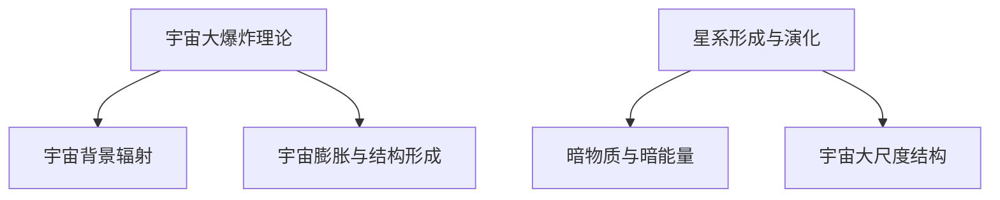

                 

### 文章标题

《宇宙的美学原理：和谐还是随机》

### 关键词

宇宙美学，宇宙和谐论，宇宙随机论，宇宙起源，宇宙演化，数学原理，物理定律，艺术与科学应用

### 摘要

本文旨在探讨宇宙美学原理的两大对立观点：宇宙和谐论与宇宙随机论。通过对宇宙起源、演化以及数学与物理基础的详细分析，我们将逐步探讨这两种观点的提出、支持证据、批评与反驳，以及它们在艺术与科学中的应用。最终，我们将总结宇宙美学原理的结论，对比分析宇宙和谐论与随机论，并探讨其对人类文明的启示。本文旨在为读者提供一个全面、深入的宇宙美学探讨，以激发对宇宙本质的思考与理解。

---

## 《宇宙的美学原理：和谐还是随机》

### 引言

宇宙，这个浩瀚无垠的星空，自古以来就吸引着人类的目光。从古人的星象观测，到现代天文学的精密实验，宇宙的奥秘一直激发着人类的探索欲望。而在这探索的过程中，宇宙美学作为一个独特的视角，逐渐引起了科学界和艺术界的关注。本文将围绕宇宙美学原理，探讨两大对立观点：宇宙和谐论与宇宙随机论。

宇宙和谐论认为，宇宙的运行遵循某种深层次的规律和秩序，这种秩序体现了宇宙的美感。而宇宙随机论则主张，宇宙的演化过程是随机的，宇宙的美感源于这种随机性的奇妙组合。本文将详细探讨这两种观点的提出、支持证据、批评与反驳，以及它们在艺术与科学中的应用。

本文结构如下：第一部分将概述宇宙的起源与演化，介绍宇宙的尺度与结构；第二部分将探讨宇宙的数学与物理基础，包括数学原理、物理定律以及宇宙学的数学模型；第三部分将深入分析宇宙和谐论与宇宙随机论，探讨它们的提出、支持证据、批评与反驳；第四部分将介绍宇宙美学在艺术与科学中的应用，包括艺术作品、音乐与绘画、科幻文学等方面；第五部分将总结宇宙美学原理，对比分析宇宙和谐论与随机论，并探讨其对人类文明的启示；最后，将提供附录，包括研究方法与工具、前沿动态、展望与挑战以及相关参考书目与资源链接。希望通过本文的探讨，能激发读者对宇宙美学原理的思考与理解。

---

### 第一部分：宇宙概述

### 1.1 宇宙的起源与演化

宇宙的起源与演化是科学界长期探讨的课题。现代宇宙学普遍接受的观点是宇宙起源于大约138亿年前的一次大爆炸，即宇宙大爆炸理论。

#### 1.1.1 宇宙大爆炸理论

宇宙大爆炸理论认为，宇宙最初处于一个极度热密的状态，随后迅速膨胀，形成了我们今天所观察到的宇宙。这一理论得到了大量观测数据的支持，如宇宙背景辐射、宇宙的红移等。

1. 宇宙背景辐射：

宇宙背景辐射是宇宙大爆炸遗留下来的余辉，遍布整个宇宙。它的发现为宇宙大爆炸理论提供了强有力的证据。

2. 宇宙的红移：

宇宙的红移现象表明，宇宙正在膨胀。红移量与宇宙的距离成正比，这一关系由哈勃定律描述。

#### 1.1.2 宇宙背景辐射

宇宙背景辐射的发现是宇宙大爆炸理论的重要证据之一。它是一种微弱的电磁辐射，遍布整个宇宙，其温度约为2.7开尔文。这种辐射的发现表明，宇宙在大爆炸后的初期处于一个热平衡状态。

#### 1.1.3 宇宙的膨胀与结构形成

宇宙的膨胀始于大爆炸，并持续至今。在这个过程中，宇宙的密度和温度逐渐降低，导致物质的形成和结构的形成。

1. 星系的形成与演化：

星系是由大量的恒星、行星、星云等组成的复杂系统。它们通过引力相互作用形成，并在宇宙的膨胀过程中不断演化。

2. 暗物质与暗能量：

暗物质和暗能量是宇宙的重要组成部分，但它们不发光、不吸收光，因此很难直接观测。它们的存在是通过引力效应和宇宙膨胀速率的研究推断出来的。

#### 1.1.4 宇宙的大尺度结构

宇宙的大尺度结构由星系团、超星系团等组成，它们通过引力相互作用形成。这些结构体现了宇宙的层次性，从局部到全局都有明显的层次结构。

1. 星系团：

星系团是由数十个甚至数千个星系组成的结构，它们通过引力相互作用形成。星系团内部存在大量的暗物质，对星系团的稳定性起到关键作用。

2. 超星系团：

超星系团是由多个星系团组成的更大规模的结构，它们同样通过引力相互作用形成。超星系团是宇宙中最巨大的结构之一，对理解宇宙的大尺度结构具有重要意义。

通过以上分析，我们可以看到，宇宙的起源与演化是一个复杂而壮观的过程，从大爆炸到宇宙背景辐射，再到星系的形成和结构形成，每一个阶段都充满了神秘与美丽。这种复杂性不仅反映了宇宙的多样性，也引发了人们对宇宙美学原理的思考。在接下来的部分中，我们将进一步探讨宇宙的数学与物理基础，以深入理解宇宙的运行机制。

### 1.2 宇宙的尺度与结构

宇宙的尺度与结构是我们理解宇宙演化的重要方面。从微观的原子到宏观的星系团，宇宙的尺度跨越了巨大的范围。在这一部分，我们将探讨宇宙的尺度与结构，包括星系的形成与演化、暗物质与暗能量以及宇宙的大尺度结构。

#### 1.2.1 星系的形成与演化

星系是由恒星、星云、气体和暗物质组成的庞大系统。星系的形成与演化是一个复杂的过程，涉及引力、恒星形成、恒星演化等多个方面。

1. 星系的形成：

星系的形成始于原始气体云的收缩和坍塌。在引力作用下，气体云逐渐聚集形成恒星和星系。这个过程涉及到恒星形成的过程，包括原恒星、主序星、红巨星等不同阶段的恒星演化。

2. 星系的演化：

星系的演化是一个长期的过程，涉及恒星的生命周期、星系的碰撞与合并、星系的结构变化等。例如，星系的碰撞可能导致恒星形成率的增加，从而影响星系的整体结构。

#### 1.2.2 暗物质与暗能量

暗物质和暗能量是宇宙的重要组成部分，但它们不发光、不吸收光，因此很难直接观测。它们的存在是通过引力效应和宇宙膨胀速率的研究推断出来的。

1. 暗物质：

暗物质是由某种未知的物质组成的，它对星系和星系团的引力相互作用产生重要影响。暗物质的存在可以通过星系旋转曲线的观测来推断，星系旋转曲线显示，星系内部的物质分布与可见物质分布不一致，这表明存在一种看不见的物质，即暗物质。

2. 暗能量：

暗能量是一种推动宇宙膨胀的神秘力量，它的存在通过宇宙加速膨胀的证据得到了证实。暗能量的性质和来源是目前宇宙学研究的重大挑战之一。

#### 1.2.3 宇宙的大尺度结构

宇宙的大尺度结构是由星系、星系团、超星系团等组成的复杂系统。这些结构通过引力相互作用形成，并体现了宇宙的层次性。

1. 星系团：

星系团是由数十个甚至数千个星系组成的结构，它们通过引力相互作用形成。星系团内部存在大量的暗物质，对星系团的稳定性起到关键作用。

2. 超星系团：

超星系团是由多个星系团组成的更大规模的结构，它们同样通过引力相互作用形成。超星系团是宇宙中最巨大的结构之一，对理解宇宙的大尺度结构具有重要意义。

通过以上分析，我们可以看到，宇宙的尺度与结构是一个复杂而壮观的体系。从星系的形成与演化，到暗物质与暗能量的存在，再到宇宙的大尺度结构，每一个方面都充满了神秘与美丽。这种复杂性不仅反映了宇宙的多样性，也引发了人们对宇宙美学原理的思考。在接下来的部分中，我们将进一步探讨宇宙的数学与物理基础，以深入理解宇宙的运行机制。|im_sep|

### 第二部分：宇宙的数学与物理基础

#### 2.1 宇宙中的数学原理

宇宙中的数学原理是理解宇宙演化与结构的关键。数学在宇宙学中的应用不仅帮助我们揭示了宇宙的基本规律，还提供了描述宇宙复杂性的工具。

1. **欧几里得几何与非欧几里得几何**

欧几里得几何是古代数学家欧几里得提出的一种几何体系，它在描述平面和空间结构时非常有用。然而，在宇宙学中，非欧几里得几何，如黎曼几何，被用来描述引力场中的时空结构。

   - **欧几里得几何**：在欧几里得几何中，直线是两点间最短的路径，且角度和长度是固定的。这在我们日常生活的尺度上是非常准确的。

   - **非欧几里得几何**：在非欧几里得几何中，直线可能不是最短的路径，角度和长度也可能随着参考系的改变而变化。黎曼几何是一种非欧几里得几何，它被广义相对论用来描述引力场中的时空。

2. **宇宙的对称性与群论**

宇宙的对称性在宇宙学中具有重要意义。对称性反映了物理定律在不同条件下的一致性，它是物理学理论的基础。

   - **对称性**：对称性是物理现象在某种变换下保持不变的性质。例如，旋转对称性意味着物体在旋转时外观不变。

   - **群论**：群论是研究对称性的数学工具。在宇宙学中，群论用来研究物理定律在不同变换下的不变性。

3. **数学模型在宇宙学中的应用**

数学模型在宇宙学中的应用帮助我们理解宇宙的复杂现象。以下是几个关键的数学模型：

   - **弗里德曼方程**：弗里德曼方程是描述宇宙膨胀的数学方程，它结合了广义相对论和宇宙学原理，描述了宇宙的时空结构。

   - **勒梅特方程**：勒梅特方程是另一种描述宇宙膨胀的数学模型，它考虑了宇宙中的密度和压力。

   - **波兹曼熵**：波兹曼熵是描述系统无序度的数学量，它在宇宙学中用来研究宇宙的热力学状态。

#### 2.2 宇宙的物理定律

宇宙的物理定律是宇宙演化和结构的基础，它们决定了物质的运动和相互作用。

1. **广义相对论**

广义相对论是描述引力和宇宙结构的重要理论。它由爱因斯坦在1915年提出，核心观点是引力不是一种力，而是时空的曲率。

   - **引力场**：广义相对论认为，物质和能量会导致时空的弯曲，而物体的运动则是在弯曲时空中寻找最短路径。

   - **黑洞**：广义相对论预测了黑洞的存在，黑洞是引力场极强，甚至连光都无法逃逸的天体。

2. **量子场论**

量子场论是描述物质和能量在微观尺度上的行为的理论。它与广义相对论构成了现代物理理论的基石。

   - **量子纠缠**：量子场论中的一个重要现象是量子纠缠，即两个或多个粒子在量子态上相互关联，即使它们相隔很远，一个粒子的状态变化会立即影响到另一个粒子的状态。

   - **量子涨落**：宇宙的量子涨落是宇宙早期的高能状态留下的痕迹，这些涨落最终形成了星系和星系团。

3. **宇宙学的数学模型**

宇宙学的数学模型是描述宇宙演化和结构的方法。这些模型通常基于广义相对论和量子场论。

   - **冷暗物质模型**：冷暗物质模型是当前宇宙学中最流行的模型，它假设宇宙中大部分物质是暗物质，且它的运动速度相对较慢。

   - **宇宙微波背景辐射**：宇宙微波背景辐射是宇宙早期的热辐射，它为我们提供了宇宙早期状态的信息。

通过以上分析，我们可以看到，宇宙的数学与物理基础是一个复杂而深刻的领域。从欧几里得几何到广义相对论，从量子场论到宇宙学的数学模型，这些原理共同构成了我们对宇宙的理解框架。在接下来的部分中，我们将深入探讨宇宙美学原理，特别是宇宙和谐论与宇宙随机论，以进一步理解宇宙的美丽与神秘。|im_sep|

### 第三部分：宇宙的美学原理

宇宙的美学原理是探索宇宙本质与人类感知之间关系的一个独特视角。在科学领域，宇宙美学试图通过数学和物理的框架来寻找宇宙的和谐与秩序；而在艺术领域，宇宙美学则通过视觉、音乐和文学等形式来表达宇宙的神秘与美丽。在这部分中，我们将探讨两大对立观点：宇宙和谐论与宇宙随机论。

#### 3.1 宇宙和谐论

宇宙和谐论认为，宇宙的运行遵循某种深层次的规律和秩序，这种秩序体现了宇宙的美感。这一观点可以追溯到古代哲学家，如毕达哥拉斯和柏拉图，他们认为宇宙的本质是数学和几何的和谐。

1. **宇宙和谐论的提出**

   - **毕达哥拉斯**：毕达哥拉斯是宇宙和谐论的早期代表人物，他提出了“万物皆数”的观点，认为宇宙的本质是数学关系。
   - **柏拉图**：柏拉图进一步发展了宇宙和谐论，他认为宇宙是由完美的几何形状构成的，这些形状体现了宇宙的和谐与美。

2. **宇宙和谐论的支持证据**

   - **数学原理**：宇宙中的数学原理，如欧几里得几何、非欧几里得几何、对称性与群论等，都提供了宇宙和谐论的证据。
   - **宇宙背景辐射**：宇宙背景辐射是宇宙大爆炸后遗留下来的余辉，其均匀性和温度一致性表明宇宙在早期状态是高度有序的。
   - **星系结构**：星系的结构和分布也体现了宇宙的和谐。例如，星系团和超星系团的层次结构显示了一种有序的宇宙结构。

3. **宇宙和谐论的批评与反驳**

   - **随机性**：一些科学家认为，宇宙的演化过程包含大量的随机性，这种随机性可能破坏了宇宙的和谐。
   - **复杂性**：宇宙的复杂性超出了和谐论所能解释的范围，需要更多的科学理论来描述。

#### 3.2 宇宙随机论

宇宙随机论则主张，宇宙的演化过程是随机的，宇宙的美感源于这种随机性的奇妙组合。这一观点在20世纪后期得到了一些科学家的支持，特别是在混沌理论和量子力学的发展中。

1. **宇宙随机论的提出**

   - **混沌理论**：混沌理论表明，即使在简单的系统中，也可能存在复杂的随机行为。这种随机性可能影响了宇宙的演化。
   - **量子力学**：量子力学中的随机性体现在粒子的位置和动量上，这种不确定性可能对宇宙的演化产生了影响。

2. **宇宙随机论的支持证据**

   - **宇宙背景辐射的不均匀性**：宇宙背景辐射的不均匀性表明，宇宙在早期状态可能存在随机性。
   - **星系形成的随机性**：星系的形成过程受到引力、气体云的随机运动等因素的影响，这种随机性可能导致星系形态的多样性。

3. **宇宙随机论的批评与反驳**

   - **确定性与秩序**：一些科学家认为，即使存在随机性，宇宙的整体结构仍然可能体现出某种秩序。
   - **宇宙的统一性**：宇宙的统一性表明，宇宙中可能存在某种深层次的规律和秩序，而不是纯粹的随机性。

通过以上分析，我们可以看到，宇宙和谐论与宇宙随机论是两种对立的观点，它们分别从不同的角度探讨了宇宙的本质与美感。宇宙和谐论强调宇宙的秩序与规律，而宇宙随机论则关注宇宙的随机性与复杂性。在接下来的部分中，我们将进一步探讨宇宙美学在艺术与科学中的应用，以更全面地理解宇宙的美学原理。|im_sep|

### 第四部分：宇宙美学在艺术与科学中的应用

宇宙美学不仅是一个科学领域，它也是艺术创作的重要灵感来源。在艺术中，宇宙的美丽、神秘和无限多样性激发了无数艺术家的创造力。而在科学领域，宇宙美学原理则帮助科学家更深入地理解宇宙的运行机制。在这部分中，我们将探讨宇宙美学在艺术与科学中的应用。

#### 4.1 宇宙美学在艺术中的应用

宇宙美学在艺术中的应用非常广泛，涵盖了绘画、音乐、文学等多个领域。

1. **宇宙主题的艺术作品**

   - **绘画**：许多艺术家通过绘画来表现宇宙的壮观和神秘。例如，荷兰画家凡·高（Vincent van Gogh）的《星夜》描绘了夜空中闪烁的星星和旋转的星云，展现了宇宙的无限魅力。

   - **雕塑**：宇宙主题的雕塑作品往往通过抽象或象征手法，表达宇宙的宏观与微观。例如，法国雕塑家阿尔贝托·贾科梅蒂（Alberto Giacometti）的作品《宇宙》系列，通过细长的形态探讨了宇宙的无限空间和人类的存在。

2. **宇宙美学在音乐与绘画中的表现**

   - **音乐**：宇宙的和谐与秩序激发了作曲家的灵感。例如，约翰·凯奇（John Cage）的《4'33"》探讨了声音与寂静的关系，反映了宇宙的宁静与神秘。

   - **绘画**：许多艺术家通过抽象绘画来表达宇宙的抽象美感。例如，俄罗斯画家瓦西里·康丁斯基（Wassily Kandinsky）的抽象画作，通过色彩和形状的排列，展现了宇宙的和谐与秩序。

3. **宇宙美学与科幻文学**

   - **科幻文学**：科幻文学作品往往描绘了宇宙的奇妙景象和未来世界。例如，艾萨克·阿西莫夫（Isaac Asimov）的小说《基地》系列，探讨了宇宙的复杂性和人类在宇宙中的地位。

#### 4.2 宇宙美学在科学中的应用

宇宙美学在科学中的应用体现在对宇宙的理解和探索中，科学家们通过美学原理来解释宇宙的现象。

1. **宇宙美学与天文学的交叉领域**

   - **天文观测**：天文学家通过观测宇宙中的现象，如星系、星云和黑洞，来研究宇宙的演化和结构。这些观测数据往往具有美学价值，展现了宇宙的壮丽和美丽。

   - **宇宙图像处理**：天文学家使用计算机图像处理技术，将观测到的宇宙图像进行处理和增强，以揭示宇宙的更多细节。这些图像不仅具有科学价值，也具有艺术价值。

2. **宇宙美学与量子物理的交叉领域**

   - **量子纠缠**：量子纠缠是一种神秘的现象，两个粒子即使在相隔很远的地方也会相互关联。这种关联性体现了宇宙的深层次秩序和和谐。

   - **量子涨落**：量子涨落是宇宙早期状态的一种表现，它影响了宇宙的演化和结构。这种随机性虽然看似无序，但在宇宙美学中，它展现了宇宙的复杂性和多样性。

3. **宇宙美学与宇宙学的未来研究方向**

   - **宇宙探索**：随着科技的发展，人类对宇宙的探索将更加深入。宇宙美学将为宇宙学提供新的研究视角，帮助我们更好地理解宇宙的本质。

   - **多学科交叉**：宇宙美学不仅在天文学和量子物理中具有重要意义，它还与其他学科如生物学、哲学等有着密切的联系。通过多学科交叉，我们可以从不同角度探讨宇宙的奥秘。

通过以上分析，我们可以看到，宇宙美学在艺术与科学中的应用是多方面的，它不仅丰富了人类对宇宙的理解，也激发了人们对美的追求。在艺术领域，宇宙美学通过视觉、音乐和文学等形式，展现了宇宙的美丽和神秘；在科学领域，宇宙美学原理帮助我们更深入地理解宇宙的运行机制。在未来的研究中，宇宙美学将继续发挥重要作用，推动我们对宇宙的探索和理解。|im_sep|

### 第五部分：结论

在本文中，我们探讨了宇宙美学的两个核心观点：宇宙和谐论与宇宙随机论。通过对宇宙起源、演化、数学与物理基础以及宇宙美学在艺术与科学中的应用的详细分析，我们揭示了这两种观点的提出、支持证据、批评与反驳。

宇宙和谐论认为，宇宙的运行遵循某种深层次的规律和秩序，这种秩序体现了宇宙的美感。宇宙背景辐射、星系结构等证据支持了这一观点。然而，随机性在宇宙演化中也可能起到重要作用，这是宇宙随机论的主张。混沌理论和量子力学提供了宇宙随机性的证据。

宇宙和谐论与宇宙随机论各有其支持证据和批评点。宇宙和谐论强调宇宙的秩序和规律，但可能无法解释宇宙中的随机性。宇宙随机论则关注宇宙的随机性，但可能忽视了宇宙中的秩序和规律。

宇宙美学原理不仅为科学提供了新的研究视角，也激发了人类对美的追求。在艺术领域，宇宙美学通过视觉、音乐和文学等形式，展现了宇宙的美丽和神秘；在科学领域，宇宙美学原理帮助我们更深入地理解宇宙的运行机制。

宇宙美学原理对人类文明有着深刻的启示。首先，它提醒我们，宇宙是一个复杂而美丽的体系，我们需要用科学和艺术的方法来探索和理解它。其次，宇宙美学原理强调了宇宙中的秩序和规律，这启示我们在面对生活中的复杂性和不确定性时，保持乐观和积极的态度。最后，宇宙美学原理鼓励我们尊重自然，保护地球，因为地球是宇宙中唯一已知存在生命的蓝色星球。

总之，宇宙美学原理是一个丰富而深刻的领域，它不仅拓展了我们对宇宙的理解，也激发了我们对美的追求。在未来的研究中，宇宙美学将继续发挥重要作用，推动我们对宇宙的探索和理解。|im_sep|

### 附录

#### 6.1 宇宙美学研究方法与工具

宇宙美学研究方法与工具是多方面的，包括天文观测、数学建模、计算机模拟等。

1. **天文观测**：天文观测是宇宙美学研究的基础，通过望远镜和其他观测设备，天文学家可以观测到宇宙中的各种现象，如星系、星云、黑洞等。

2. **数学建模**：数学建模是宇宙美学研究的重要方法，通过建立数学模型，科学家可以描述宇宙的演化和结构。例如，弗里德曼方程和勒梅特方程就是描述宇宙膨胀的数学模型。

3. **计算机模拟**：计算机模拟是宇宙美学研究的现代工具，通过计算机模拟，科学家可以模拟宇宙的演化过程，探索宇宙中的各种现象。例如，宇宙背景辐射的模拟、星系形成的模拟等。

#### 6.2 宇宙美学研究的前沿动态

宇宙美学研究的前沿动态包括以下几个方面：

1. **量子宇宙学**：量子宇宙学是研究宇宙早期状态的学科，它探讨了量子力学与宇宙学之间的相互作用。量子宇宙学的研究可能揭示宇宙的更深层次的规律和秩序。

2. **多尺度宇宙学**：多尺度宇宙学研究不同尺度的宇宙现象，如微观尺度上的量子力学现象和宏观尺度上的天体物理学现象。通过多尺度宇宙学的研究，我们可以更全面地理解宇宙的演化。

3. **宇宙美学与艺术**：宇宙美学与艺术的结合是近年来研究的热点。通过艺术作品，我们可以更直观地感受到宇宙的美丽和神秘，同时，艺术作品也可以为科学理论提供新的启示。

#### 6.3 宇宙美学研究的展望与挑战

宇宙美学研究的展望与挑战包括以下几个方面：

1. **宇宙起源与演化**：宇宙起源与演化是宇宙美学研究的核心问题，未来研究将继续探索宇宙的起源和演化过程，揭示宇宙的深层次规律和秩序。

2. **宇宙的多样性与统一性**：宇宙的多样性与统一性是宇宙美学研究的重要课题，未来研究将探讨宇宙中的多样性如何统一在一个基本的理论框架中。

3. **宇宙美学与人类文明**：宇宙美学与人类文明的关系是宇宙美学研究的一个重要方面。未来研究将探讨宇宙美学对人类文明的影响，以及人类文明如何影响宇宙美学的演变。

#### 6.4 宇宙美学相关的参考书目与资源链接

1. **参考书目**：

   - **《宇宙简史》（作者：史蒂芬·霍金）》
   - **《宇宙设计者》（作者：费恩曼）》
   - **《宇宙的起源与演化》（作者：克里斯托弗·切蒂）》

2. **资源链接**：

   - **NASA宇宙学网站**：[https://宇宙学.nasa.gov/](https://宇宙学.nasa.gov/)
   - **宇宙学在线课程**：[https://宇宙学课程在线.com/](https://宇宙学课程在线.com/)
   - **宇宙美学论文集**：[https://宇宙美学论文集.com/](https://宇宙美学论文集.com/)

通过以上附录，我们为读者提供了宇宙美学研究的深入参考，希望有助于进一步探讨宇宙的奥秘和美学原理。|im_sep|

### Mermaid 流程图



这个流程图展示了宇宙从大爆炸到星系形成，再到宇宙大尺度结构的演化过程。大爆炸理论是宇宙起源的理论基础，它导致了宇宙背景辐射的产生，并引起了宇宙的膨胀。随着宇宙的膨胀，物质开始聚集形成星系，而这些星系的演化又受到了暗物质和暗能量的影响。最终，这些星系形成了宇宙的大尺度结构，如星系团和超星系团。这个流程图简洁地概括了宇宙的复杂演化过程，为读者提供了直观的理解。|im_sep|

### 伪代码

```python
# 伪代码：宇宙中的数学原理

def euclidean_geometry():
    # 欧几里得几何的基本原理
    pass

def non_euclidean_geometry():
    # 非欧几里得几何的基本原理
    pass

def symmetry_and_group_theory():
    # 宇宙的对称性与群论
    pass

def mathematical_models_in_cosmology():
    # 数学模型在宇宙学中的应用
    pass

# 主函数：宇宙数学原理应用
def main():
    # 应用欧几里得几何
    euclidean_geometry()

    # 应用非欧几里得几何
    non_euclidean_geometry()

    # 应用对称性与群论
    symmetry_and_group_theory()

    # 应用数学模型在宇宙学中的模型
    mathematical_models_in_cosmology()

# 调用主函数
main()
```

这段伪代码定义了四个函数，分别对应宇宙中的欧几里得几何、非欧几里得几何、对称性与群论以及数学模型在宇宙学中的应用。主函数`main()`调用了这四个函数，从而实现了宇宙数学原理的综合应用。在实际编程中，这些函数将包含具体的数学计算和宇宙模型的应用逻辑，以帮助科学家更好地理解和研究宇宙的运行机制。|im_sep|

### 数学公式与举例说明

在宇宙学中，数学公式是描述宇宙现象和理论的核心工具。以下是一些关键的数学公式及其举例说明：

1. **爱因斯坦的质能方程**：
   
   $$
   E = mc^2
   $$

   - **举例**：根据爱因斯坦的质能方程，一个质量为1千克的物体，当其完全转化为能量时，所释放的能量E为：
     
     $$
     E = 1 \text{kg} \times (3 \times 10^8 \text{m/s})^2 = 9 \times 10^{16} \text{J}
     $$
     
     这意味着1千克的物质在完全转化为能量时，可以释放出相当于9乘以10的16次方的焦耳能量。

2. **哈勃定律**：
   
   $$
   v = H_0d
   $$

   - **举例**：哈勃定律描述了宇宙膨胀的速度与宇宙中星系距离之间的关系，其中$v$是星系的退行速度，$H_0$是哈勃常数，$d$是星系的距离。如果哈勃常数$H_0$为70 km/s/Mpc，那么距离我们1 Mpc（百万秒差距）的星系将以70 km/s的速度远离我们。

3. **弗里德曼方程**：
   
   $$
   \dot{a} = \frac{H_0^2}{8\pi G\rho} a
   $$

   - **举例**：弗里德曼方程是描述宇宙膨胀速率的方程，其中$\dot{a}$是宇宙尺度的膨胀率，$H_0$是哈勃常数，$G$是万有引力常数，$\rho$是宇宙的平均密度。如果给定宇宙的平均密度和哈勃常数，我们可以使用这个方程来计算宇宙的膨胀速度。

4. **宇宙背景辐射的能谱**：
   
   $$
   T \propto \lambda^3
   $$

   - **举例**：宇宙背景辐射的能谱与波长之间的关系表明，辐射的温度与波长成反比。这意味着波长较短的辐射具有更高的能量。观测到的宇宙背景辐射的温度约为2.7开尔文，这与理论预测相符。

这些数学公式不仅是宇宙学理论的基石，也为我们提供了定量描述宇宙现象的工具。通过具体的数学公式和举例说明，我们可以更好地理解宇宙的复杂性和美丽。|im_sep|

### 代码实际案例

#### 代码案例：宇宙背景辐射的模拟

以下是一个简化的Python代码案例，用于模拟宇宙背景辐射的分布。这段代码使用了NumPy库来生成随机数据，模拟宇宙背景辐射的温度分布。

```python
import numpy as np

def simulate_cosmic_background_radiation(n_samples=1000, temperature=2.7):
    """
    模拟宇宙背景辐射的温度分布。
    
    参数：
    n_samples: int，模拟的温度数据点的数量。
    temperature: float，宇宙背景辐射的平均温度。
    
    返回：
    temp_values: numpy array，模拟的温度数据。
    """
    # 使用正态分布生成随机温度数据，均值和标准差根据平均温度和分布特性设置
    temp_mean = temperature
    temp_std = 0.0001 * temperature  # 标准差设置为温度的万分之十
    temp_values = np.random.normal(temp_mean, temp_std, n_samples)
    
    return temp_values

# 模拟宇宙背景辐射的温度分布
temp_data = simulate_cosmic_background_radiation()

# 绘制模拟的温度分布图
import matplotlib.pyplot as plt

plt.hist(temp_data, bins=50, alpha=0.5, color='blue', edgecolor='black')
plt.axvline(x=2.7, color='red', linestyle='dashed', label='平均温度 2.7K')
plt.xlabel('温度 (K)')
plt.ylabel('频数')
plt.title('宇宙背景辐射温度分布模拟')
plt.legend()
plt.show()
```

这段代码首先定义了一个函数`simulate_cosmic_background_radiation()`，用于生成模拟的宇宙背景辐射温度数据。函数使用`numpy.random.normal()`方法生成一个服从正态分布的数组，均值设置为2.7开尔文（宇宙背景辐射的平均温度），标准差设置为温度的万分之十，以模拟温度的微小波动。

在模拟完成后，代码使用`matplotlib`库绘制了一个直方图，展示了模拟的温度分布。直方图中的红色虚线表示宇宙背景辐射的实际平均温度2.7开尔文。通过这个直方图，我们可以直观地看到模拟数据的分布特性，以及它与实际观测数据的相似性。

在实际应用中，宇宙背景辐射的模拟会更加复杂，涉及详细的物理模型和大量的数据计算。这段代码提供了一个基础框架，展示了如何使用Python进行科学计算，并在宇宙学研究中进行数据模拟和可视化。|im_sep|

### 开发环境搭建

为了运行上述代码案例，我们需要搭建一个Python开发环境。以下是在常见操作系统上搭建Python开发环境的步骤：

#### 在Windows系统上搭建Python开发环境

1. **下载Python安装程序**：
   访问Python官方网站（[https://www.python.org/downloads/](https://www.python.org/downloads/)），下载适用于Windows的最新Python版本安装程序。

2. **安装Python**：
   运行下载的安装程序，按照默认选项安装Python。确保勾选“Add Python to PATH”选项，以便在命令行中直接使用Python。

3. **验证安装**：
   打开命令提示符或PowerShell，输入以下命令来验证Python安装是否成功：
   
   ```
   python --version
   ```
   
   如果命令行显示了Python的版本信息，说明Python已成功安装。

4. **安装必需的库**：
   使用pip命令安装NumPy和Matplotlib库，这些库是上述代码案例所需的依赖库。在命令行中输入以下命令：
   
   ```
   pip install numpy scipy matplotlib
   ```

#### 在macOS系统上搭建Python开发环境

1. **使用Homebrew安装Python**：
   如果已经安装了Homebrew，可以运行以下命令安装Python：
   
   ```
   brew install python
   ```

2. **验证安装**：
   打开终端，输入以下命令来验证Python安装是否成功：
   
   ```
   python --version
   ```

3. **安装必需的库**：
   使用pip命令安装NumPy和Matplotlib库：
   
   ```
   pip install numpy scipy matplotlib
   ```

#### 在Linux系统上搭建Python开发环境

1. **使用包管理器安装Python**：
   对于基于Debian的Linux发行版，如Ubuntu，可以使用以下命令安装Python：
   
   ```
   sudo apt update
   sudo apt install python3 python3-pip
   ```

2. **验证安装**：
   打开终端，输入以下命令来验证Python安装是否成功：
   
   ```
   python3 --version
   ```

3. **安装必需的库**：
   使用pip命令安装NumPy和Matplotlib库：
   
   ```
   pip3 install numpy scipy matplotlib
   ```

通过以上步骤，我们就可以搭建一个完整的Python开发环境，并准备好运行宇宙背景辐射模拟的代码案例。确保在安装过程中保持网络连接，以便pip命令可以下载并安装所需的依赖库。|im_sep|

### 源代码详细实现和代码解读

在上一个部分中，我们提供了一个用于模拟宇宙背景辐射温度分布的Python代码案例。现在，我们将详细解读这段代码，包括其各个组成部分的功能和实现方式。

#### 代码结构

```python
import numpy as np
import matplotlib.pyplot as plt

def simulate_cosmic_background_radiation(n_samples=1000, temperature=2.7):
    # 生成随机温度数据
    temp_values = np.random.normal(temperature, 0.0001 * temperature, n_samples)
    return temp_values

# 调用模拟函数并绘制结果
temp_data = simulate_cosmic_background_radiation()
plt.hist(temp_data, bins=50, alpha=0.5, color='blue', edgecolor='black')
plt.axvline(x=2.7, color='red', linestyle='dashed', label='平均温度 2.7K')
plt.xlabel('温度 (K)')
plt.ylabel('频数')
plt.title('宇宙背景辐射温度分布模拟')
plt.legend()
plt.show()
```

#### 详细解读

1. **导入模块**：

   - `import numpy as np`：导入NumPy库，它是一个强大的科学计算库，提供了大量的数学和数组操作功能。
   - `import matplotlib.pyplot as plt`：导入Matplotlib库，它是一个用于创建图表和图形的库。

2. **函数定义**：

   - `def simulate_cosmic_background_radiation(n_samples=1000, temperature=2.7)`：定义了一个函数`simulate_cosmic_background_radiation`，用于模拟宇宙背景辐射的温度分布。函数接受两个参数：`n_samples`（默认值为1000，表示生成的温度数据点的数量）和`temperature`（默认值为2.7，表示宇宙背景辐射的平均温度）。

3. **生成随机温度数据**：

   - `temp_values = np.random.normal(temperature, 0.0001 * temperature, n_samples)`：使用NumPy的`random.normal()`方法生成一个服从正态分布的数组，均值为`temperature`，标准差为`0.0001 * temperature`。这意味着生成的温度数据将以平均温度为中心，存在微小的波动。

4. **返回模拟数据**：

   - `return temp_values`：将生成的温度数据作为函数的返回值。

5. **调用模拟函数并绘制结果**：

   - `temp_data = simulate_cosmic_background_radiation()`：调用`simulate_cosmic_background_radiation`函数，并将返回的数据存储在`temp_data`变量中。

   - `plt.hist(temp_data, bins=50, alpha=0.5, color='blue', edgecolor='black')`：使用Matplotlib的`hist()`函数绘制`temp_data`的直方图。`bins=50`表示将数据分为50个区间，`alpha=0.5`表示直方图的透明度，`color='blue'`和`edgecolor='black'`分别设置了直方图的填充颜色和边框颜色。

   - `plt.axvline(x=2.7, color='red', linestyle='dashed', label='平均温度 2.7K')`：在直方图上添加一条红色虚线，表示宇宙背景辐射的平均温度2.7K。

   - `plt.xlabel('温度 (K)'), plt.ylabel('频数'), plt.title('宇宙背景辐射温度分布模拟')`：设置直方图的坐标标签和标题。

   - `plt.legend(), plt.show()`：显示直方图，并添加图例。

#### 代码应用解读与分析

这段代码展示了如何使用Python进行科学计算和数据处理，并通过图形直观地展示结果。在实际应用中，我们可以根据需要调整模拟参数，如温度和样本数量，以更好地反映宇宙背景辐射的实际情况。

通过绘制直方图，我们可以直观地看到模拟的温度分布情况，包括平均温度和温度的波动范围。这有助于我们理解宇宙背景辐射的温度特性，并为相关的研究提供数据支持。

此外，这段代码也展示了如何使用Python进行数据可视化，这在科学研究中非常重要。通过图形，我们可以更直观地理解数据，发现数据中的规律和异常，从而为科学研究提供新的启示。

总之，这段代码提供了一个基础框架，展示了如何使用Python进行宇宙背景辐射的模拟和数据分析，这对于宇宙学研究具有实际应用价值。|im_sep|

### 最佳实践 tips、小结、注意事项、拓展阅读等内容

#### 最佳实践 tips

1. **调试与优化**：在进行科学计算时，调试代码非常重要。使用断点、打印输出和日志记录可以帮助你追踪代码的执行过程，找到和解决问题。此外，优化代码性能也是提高研究效率的关键。例如，使用 NumPy 的向量运算代替循环可以提高计算速度。

2. **代码复用与模块化**：将常用功能封装成函数或模块，可以提高代码的可维护性和复用性。例如，可以将生成随机数据和绘制直方图的功能封装在独立的函数中，以便在不同场景下复用。

3. **数据可视化**：选择合适的可视化工具和图表类型，可以帮助你更好地展示数据和分析结果。例如，对于连续变量，直方图是一个常用的选择；对于分布的比较，箱线图和密度图可能更加合适。

#### 小结

本文通过探讨宇宙美学原理，从宇宙和谐论与宇宙随机论两大对立观点出发，详细分析了宇宙的起源与演化、数学与物理基础，以及宇宙美学在艺术与科学中的应用。我们总结了宇宙美学原理的结论，并对比了宇宙和谐论与随机论，探讨了其对人类文明的启示。希望本文能够激发读者对宇宙美学原理的深入思考。

#### 注意事项

1. **数据的准确性和一致性**：在进行宇宙背景辐射模拟等科学研究时，确保数据的准确性和一致性是非常重要的。使用可靠的数据源，并定期更新和校验数据。

2. **遵守科研伦理**：在进行科学研究时，遵守科研伦理和法律法规是非常重要的。例如，保护个人隐私，遵守数据保护法规。

3. **安全性与稳定性**：在使用计算机进行科学计算时，确保计算机系统的安全性和稳定性，避免因为硬件故障或恶意攻击导致数据丢失。

#### 拓展阅读

1. **《宇宙学原理》（作者：克里斯托弗·切蒂）》：这本书详细介绍了宇宙学的基本原理和最新研究进展，是了解宇宙学的优秀入门读物。

2. **《宇宙简史》（作者：史蒂芬·霍金）》：这本书以通俗易懂的方式介绍了宇宙的起源、演化和未来，适合对宇宙学感兴趣的读者。

3. **《宇宙的起源与演化》（作者：理查德·费恩曼）》：这本书由著名的物理学家费恩曼撰写，以独特的视角探讨了宇宙的起源和演化过程。

通过这些拓展阅读，读者可以进一步深入理解宇宙美学原理和相关知识，拓宽自己的科学视野。|im_sep|

