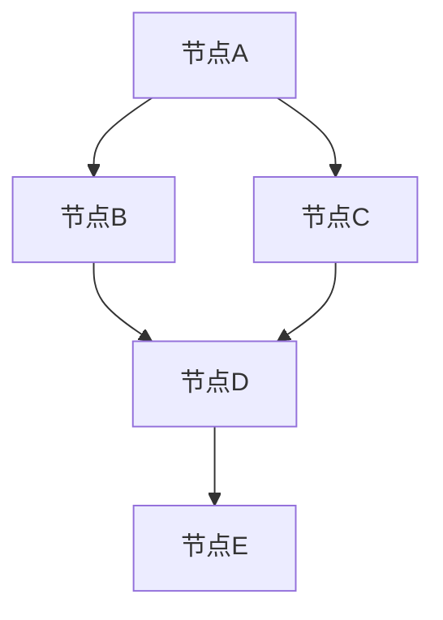
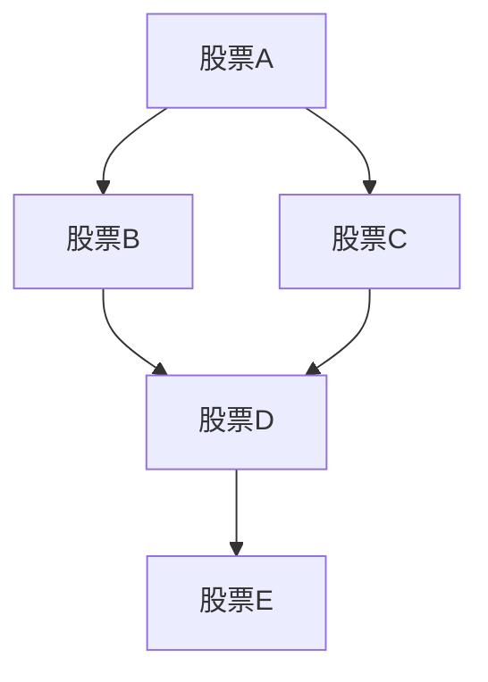
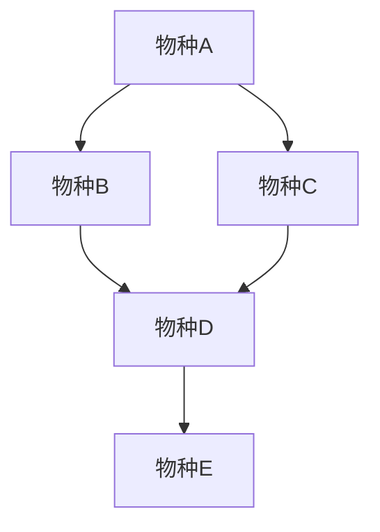
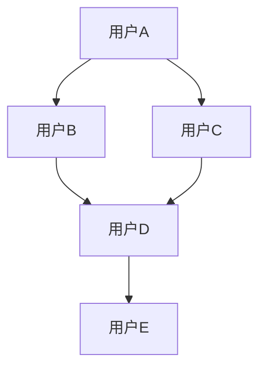
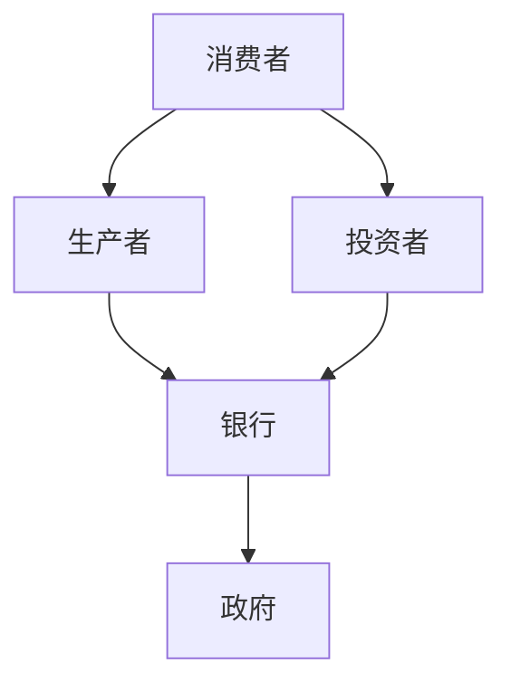
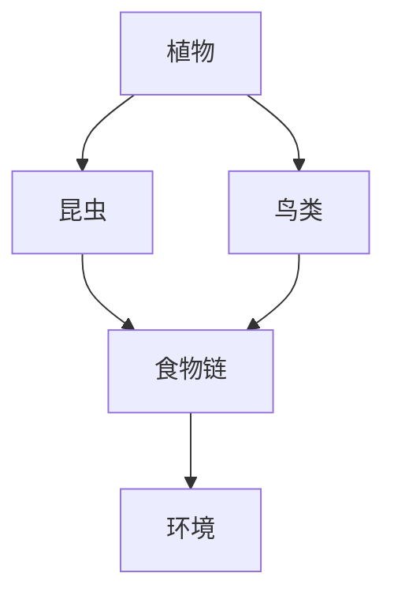

                 

### 文章标题：宇宙的自我反馈循环：因果网络的复杂性

宇宙的自我反馈循环是自然界乃至复杂系统中一种普遍存在的现象。本文将探讨宇宙的自我反馈循环及其背后的因果网络的复杂性，旨在揭示这种复杂性的本质、度量方法及其在不同领域的应用。通过深入分析因果网络的理论基础、模型构建方法以及实际案例分析，本文将帮助读者理解宇宙的自我反馈循环如何影响复杂系统的演化与发展。

关键词：宇宙、自我反馈循环、因果网络、复杂性、信息流、控制流

摘要：本文首先概述了宇宙的自我反馈循环及其在宇宙中的表现，接着探讨了因果网络的复杂性理论，分析了因果网络与复杂性理论之间的关系。在此基础上，本文详细讨论了因果网络的度量方法，并探讨了因果网络在实际案例中的应用。最后，本文总结了因果网络的未来发展趋势，并提出了在跨学科领域进一步研究因果网络的挑战与机遇。

### 目录大纲

#### 第一部分：引言
1. **宇宙的自我反馈循环：因果网络的复杂性概述**
   1.1. **宇宙的自我反馈机制与因果网络的定义**
   1.2. **宇宙中的因果网络示例**
   1.3. **本书的目的与结构**

#### 第二部分：宇宙的自我反馈循环理论
2. **宇宙的自我反馈循环基本原理**
   2.1. **宇宙的自我反馈循环模型**
   2.2. **因果网络的构成与性质**
   2.3. **因果网络的基本算法与工具**

   **2.4. 因果网络与复杂性理论的关系**
   2.4.1. **复杂性理论的定义**
   2.4.2. **复杂性理论与因果网络的联系**
   2.4.3. **因果网络复杂性度量的方法**

   **2.5. 因果网络中的信息流与控制流**
   2.5.1. **信息流与控制流的基本概念**
   2.5.2. **信息流与控制流在因果网络中的应用**
   2.5.3. **信息流与控制流的分析方法**

#### 第三部分：因果网络的复杂性分析
3. **因果网络的复杂性度量**
   3.1. **复杂性的定义与度量方法**
   3.2. **因果网络的拓扑复杂性**
   3.3. **因果网络的动态复杂性**
   3.4. **因果网络的适应性与鲁棒性**

   **3.5. 因果网络的复杂性与实际案例**
   3.5.1. **社会网络的复杂性分析**
   3.5.2. **经济系统的复杂性分析**
   3.5.3. **生物系统的复杂性分析**

#### 第四部分：因果网络的模型与应用
4. **因果网络模型构建方法**
   4.1. **因果网络模型的基本框架**
   4.2. **因果网络模型的构建过程**
   4.3. **因果网络模型的应用场景**

   **4.4. 因果网络的建模工具与软件**
   4.4.1. **常用的因果网络建模工具**
   4.4.2. **因果网络建模的软件应用**
   4.4.3. **因果网络建模的挑战与解决方案**

#### 第五部分：宇宙中的自我反馈循环案例分析
5. **宇宙中的自我反馈循环案例研究**
   5.1. **地球气候系统的自我反馈循环**
   5.2. **太阳活动与地球磁场的自我反馈循环**
   5.3. **人类社会的自我反馈循环**

   **5.4. 自我反馈循环的调节与控制策略**
   5.4.1. **自我反馈循环的调节机制**
   5.4.2. **自我反馈循环的控制策略**
   5.4.3. **自我反馈循环的可持续性发展**

#### 第六部分：因果网络的未来发展趋势
6. **因果网络在人工智能中的应用前景**
   6.1. **因果网络与机器学习**
   6.2. **因果网络与深度学习**
   6.3. **因果网络与数据挖掘**

   **6.4. 因果网络与社会科学**
   6.4.1. **因果网络在社会网络分析中的应用**
   6.4.2. **因果网络在经济系统分析中的应用**
   6.4.3. **因果网络在生物系统分析中的应用**

#### 第七部分：总结与展望
7. **宇宙的自我反馈循环与因果网络的总结**
   7.1. **核心概念与联系的回顾**
   7.2. **核心算法原理的总结**
   7.3. **数学模型与数学公式的重要性**

   **7.4. 未来的研究方向与挑战**
   7.4.1. **因果网络模型的发展趋势**
   7.4.2. **因果网络在跨学科领域中的应用**
   7.4.3. **因果网络在复杂系统研究中的潜力**

### 第一部分：引言

#### 宇宙的自我反馈循环：因果网络的复杂性概述

宇宙的自我反馈循环是自然界中一种普遍存在的现象，它不仅影响着宇宙的演化，也深刻地影响着复杂系统的稳定与演变。自我反馈循环，也称为反馈循环，指的是一个系统中某一环节的输出回到该系统的输入端，进而影响系统自身运行的过程。在宇宙中，这种反馈循环无处不在，从地球气候系统、太阳活动到人类社会，自我反馈循环都在起着关键的作用。

因果网络是一种数学模型，用于表示系统中不同变量之间的因果关系。因果网络通过节点和边来描述变量之间的因果依赖关系，使得复杂系统的行为可以被建模、分析和理解。因果网络的复杂性体现在其拓扑结构、动态行为以及变量间的相互影响。研究宇宙的自我反馈循环和因果网络的复杂性，不仅有助于我们更好地理解宇宙的演化规律，还能为复杂系统的研究提供新的视角和方法。

本文的目的在于探讨宇宙的自我反馈循环和因果网络的复杂性，通过逐步分析因果网络的定义、基本原理、度量方法及其在实际案例中的应用，揭示因果网络的本质和重要性。同时，本文还将展望因果网络在人工智能、社会科学和生物系统等领域的应用前景，提出未来研究的方向和挑战。

本文结构如下：首先，在第一部分引言中，我们将概述宇宙的自我反馈循环及其在宇宙中的表现，并介绍因果网络的定义和重要性。接着，在第二部分，我们将深入探讨宇宙的自我反馈循环理论，包括因果网络的构成、基本算法与工具。然后，在第三部分，我们将分析因果网络的复杂性，探讨其度量方法及实际案例。在第四部分，我们将介绍因果网络模型构建方法及其应用。第五部分将分析宇宙中的自我反馈循环案例。最后，第六部分将探讨因果网络的未来发展趋势，第七部分总结本文的核心观点并展望未来研究方向。

#### 宇宙的自我反馈机制与因果网络的定义

宇宙的自我反馈机制是自然界中一种至关重要的现象，它涉及到系统内部变量之间的相互影响和相互作用。自我反馈机制可以定义为系统中某一环节的输出返回到该系统的输入端，从而影响系统自身运行的过程。这种反馈机制可以是正反馈，也可以是负反馈。正反馈会放大系统的某种行为或状态，使其不断增强；而负反馈则起到抑制或平衡系统行为的作用。

因果网络，作为一种数学模型，用于描述系统中不同变量之间的因果关系。因果网络通过节点和边来表示变量之间的依赖关系，其中节点代表变量，边代表变量间的因果影响。因果网络的基本概念包括：

1. **节点（Node）**：每个节点表示一个变量，可以是物理量、化学物质、生物物种等。节点之间通过边进行连接，表示它们之间的因果依赖关系。

2. **边（Edge）**：边表示节点之间的因果关系，边的方向通常从原因节点指向结果节点。这种方向性体现了因果关系的时间先后的顺序。

3. **因果结构（Causal Structure）**：因果结构是因果网络的整体拓扑结构，它决定了变量之间的相互作用方式。一个有效的因果结构应能准确地捕捉系统中的因果依赖关系。

4. **因果推断（Causal Inference）**：因果推断是利用因果网络来推断变量之间的因果关系，即从网络结构中推断出变量之间的因果联系。

在宇宙的自我反馈循环中，因果网络起到了核心的作用。例如，地球气候系统中的自我反馈循环就涉及多个因果网络，如温室气体浓度与温度、云层与太阳辐射、海洋与大气等之间的相互影响。通过构建和解析这些因果网络，科学家可以更好地理解气候系统的动态行为，预测气候变化的趋势。

此外，太阳活动与地球磁场之间的反馈循环也是一个典型的因果网络应用案例。太阳活动产生的太阳风和电磁辐射会影响地球磁场，进而影响地球气候和无线电通信。这种复杂的因果网络使得我们能够更全面地理解地球磁层与太阳活动之间的相互作用。

综上所述，宇宙的自我反馈机制和因果网络的定义是理解复杂系统行为的基础。通过构建和解析因果网络，我们不仅可以揭示系统中的因果依赖关系，还能为预测和调控复杂系统的行为提供科学依据。在接下来的部分中，我们将进一步探讨因果网络的基本原理和构建方法。

#### 宇宙中的因果网络示例

在宇宙中，因果网络的示例无处不在，其中最引人注目的包括地球气候系统、太阳活动与地球磁场互动、以及人类社会的自我反馈循环。

1. **地球气候系统的因果网络**：

地球气候系统的因果网络是一个复杂且多维的体系，它包含了温度、湿度、云层、海洋流动、温室气体浓度等多个变量之间的相互影响。以下是一个简化的因果网络示例：

   ```mermaid
   graph TB
   A(温度) --> B(湿度)
   B --> C(云层)
   C --> D(太阳辐射)
   D --> A
   A --> E(温室气体浓度)
   E --> C
   ```

   在这个网络中，温度影响湿度，湿度影响云层，云层影响太阳辐射，太阳辐射又回到温度。此外，温度还通过影响温室气体浓度，进一步影响云层。这种多层次的因果关系使得地球气候系统表现出高度的复杂性和动态性。

2. **太阳活动与地球磁场的因果网络**：

太阳活动与地球磁场的互动形成了另一个重要的因果网络。太阳风和太阳辐射是主要的影响因素，它们对地球磁层产生作用，导致磁暴和极光等现象。以下是一个简化的因果网络示例：

   ```mermaid
   graph TB
   A(太阳风) --> B(地球磁场)
   B --> C(磁暴)
   C --> D(极光)
   D --> A
   ```

   在这个网络中，太阳风影响地球磁场，地球磁场的变动又引起磁暴和极光。磁暴反过来又会影响太阳风，形成一个正反馈循环。这种循环使得太阳活动和地球磁场之间的互动具有强烈的动态性和不可预测性。

3. **人类社会的自我反馈循环**：

人类社会也是一个复杂的因果网络，它包含了经济、政治、文化等多个层面的相互作用。以下是一个简化的因果网络示例：

   ```mermaid
   graph TB
   A(经济状况) --> B(就业率)
   B --> C(消费水平)
   C --> A
   A --> D(政府政策)
   D --> B
   ```

   在这个网络中，经济状况影响就业率，就业率影响消费水平，消费水平又反作用于经济状况。同时，经济状况还影响政府政策，政府政策进一步影响就业率。这种多层次的因果循环使得社会系统的演化具有高度的复杂性和多样性。

通过以上这些因果网络的示例，我们可以看到，宇宙中的自我反馈循环无处不在，它们通过复杂的因果网络相互联系和相互作用，共同影响着宇宙的演化和复杂系统的行为。这些因果网络不仅帮助我们理解自然现象，还为预测和调控复杂系统的行为提供了重要的理论基础。

#### 本书的目的与结构

本书旨在深入探讨宇宙的自我反馈循环及其背后的因果网络的复杂性，通过系统化的理论阐述和实际案例分析，揭示因果网络的本质及其在不同领域的应用。具体来说，本书的主要目的是：

1. **理解宇宙的自我反馈循环**：通过介绍宇宙中的典型因果网络示例，帮助读者理解自我反馈循环在自然界和复杂系统中的重要作用。
2. **揭示因果网络的复杂性**：分析因果网络的构成、基本算法、度量方法及其与复杂性理论的关系，帮助读者掌握评估和解析因果网络复杂性的方法。
3. **探讨因果网络的应用前景**：介绍因果网络在不同领域（如人工智能、社会科学、生物系统等）的应用实例，展望其未来发展趋势。

本书的结构如下：

- **第一部分：引言**：概述宇宙的自我反馈循环和因果网络的定义，提出本书的目的与结构。
- **第二部分：宇宙的自我反馈循环理论**：介绍宇宙的自我反馈循环的基本原理，探讨因果网络的构成和性质，以及基本算法与工具。
- **第三部分：因果网络的复杂性分析**：详细讨论因果网络的复杂性度量方法，包括拓扑复杂性、动态复杂性、适应性与鲁棒性等。
- **第四部分：因果网络的模型与应用**：介绍因果网络模型的构建方法及其应用场景，探讨因果网络的建模工具与软件。
- **第五部分：宇宙中的自我反馈循环案例分析**：分析地球气候系统、太阳活动与地球磁场互动、以及人类社会的自我反馈循环案例。
- **第六部分：因果网络的未来发展趋势**：探讨因果网络在人工智能、社会科学和生物系统等领域的应用前景。
- **第七部分：总结与展望**：总结本书的核心观点，讨论未来的研究方向与挑战。

通过以上结构，本书将为读者提供一个全面、系统的理解，帮助读者深入掌握宇宙的自我反馈循环和因果网络的复杂性。这不仅有助于推动相关领域的研究，也为解决复杂系统中的实际问题提供了理论支持和实践指导。

### 第二部分：宇宙的自我反馈循环理论

#### 宇宙的自我反馈循环基本原理

宇宙的自我反馈循环是自然界中普遍存在的一种机制，它通过系统内部变量之间的相互作用和反馈，影响系统的稳定性和演变。自我反馈循环可以分为正反馈和负反馈两种基本类型，每种类型在宇宙的不同层面上都有其独特的表现。

1. **正反馈循环**：

正反馈循环是指系统中某一变量的变化导致其他变量的变化，这些变化进一步加剧了原始变量的变化，形成一种自我强化的过程。正反馈循环的特点是放大系统的某种行为或状态，使其不断增长或增强。例如，在太阳活动与地球磁场互动中，太阳风会导致地球磁场的扰动，从而产生磁暴和极光。这些磁暴和极光现象又会增强太阳风的影响，形成一个正反馈循环，使得地球磁层与太阳活动之间的互动更加剧烈。

正反馈循环的数学描述通常可以通过微分方程或差分方程来建模，其中变量之间的关系可以用反馈系数来表示。以下是一个简单的正反馈循环模型：

\[ \frac{dx}{dt} = f(x, y) \]
\[ \frac{dy}{dt} = g(x, y) \]

在这个模型中，\( x \)和\( y \)是变量，\( f \)和\( g \)是它们的函数关系，通常包含正反馈项。

2. **负反馈循环**：

负反馈循环则是一种抑制或平衡系统内部变化的机制。在负反馈循环中，系统的一部分输出被返回到输入端，抵消或减弱原始变化，从而维持系统的稳定。例如，在地球气候系统中，温室气体的浓度增加会导致全球气温上升，气温上升又会导致冰川融化，进而增加温室气体的排放。这个过程中，温室气体浓度和气温之间的反馈关系是负反馈，因为它通过减缓气温的上升速度来维持系统的平衡。

负反馈循环可以用如下数学模型描述：

\[ \frac{dx}{dt} = f(x, y) - h(x, y) \]
\[ \frac{dy}{dt} = g(x, y) - k(x, y) \]

在这里，\( f \)和\( g \)是系统内部变化的函数，而\( h \)和\( k \)是负反馈项，它们的作用是减弱系统内部的变化。

#### 宇宙的自我反馈循环模型

宇宙的自我反馈循环模型是理解宇宙复杂系统行为的重要工具。一个典型的自我反馈循环模型通常包括以下几个关键组成部分：

1. **系统状态**：系统状态是系统中各个变量在某一时刻的取值集合。这些变量可以是物理量、化学成分、生物个体等。例如，在地球气候系统中，系统状态可能包括温度、湿度、气压等。

2. **反馈机制**：反馈机制是描述系统状态如何影响其自身的运行过程。反馈机制可以是正反馈或负反馈，它们决定了系统是自我强化还是自我调节。例如，在地球气候系统中，温度和温室气体的浓度之间的正反馈关系会导致气候变暖，而冰川融化和海洋温度变化的负反馈关系会减缓气候变暖的速度。

3. **因果关系**：因果关系是系统中变量之间的相互作用关系。在因果网络中，因果关系通常通过节点和边来表示。例如，在地球气候系统中，温度升高可能导致海平面上升，而海平面上升又会影响气候模式。

4. **动态行为**：动态行为是系统状态随时间变化的规律。通过数学模型，我们可以描述系统的动态行为，并分析其在不同条件下的稳定性和响应。

一个简单的自我反馈循环模型可以用以下形式表示：

\[ \frac{dx_i}{dt} = f(x_1, x_2, ..., x_n) - \sum_{j=1}^{n} h_{ij}(x_1, x_2, ..., x_n) \]

其中，\( x_i \)是系统的第\( i \)个状态变量，\( f \)是系统内部变化的函数，而\( h_{ij} \)是第\( j \)个状态变量对第\( i \)个状态变量的负反馈函数。

#### 因果网络的构成与性质

因果网络是一种用于表示系统中变量之间因果关系的有向图模型，它在理解复杂系统的行为和动态中起着关键作用。因果网络由以下几个基本构成部分组成：

1. **节点（Node）**：节点表示系统中的变量或状态，每个节点代表一个变量或属性。例如，在地球气候系统中，温度、湿度、气压等都可以作为节点。

2. **边（Edge）**：边表示节点之间的因果关系，通常从原因节点指向结果节点。边的方向性体现了因果关系的时间先后的顺序，即原因节点的影响会传递到结果节点。例如，温度升高可能导致湿度增加。

3. **因果结构（Causal Structure）**：因果结构是因果网络的整体拓扑结构，它决定了变量之间的相互作用方式和系统的动态行为。一个良好的因果结构应能准确地捕捉系统中的因果依赖关系，从而为分析系统的行为提供坚实基础。

4. **因果推断（Causal Inference）**：因果推断是利用因果网络来推断变量之间的因果关系，即从网络结构中推断出变量之间的因果联系。因果推断方法包括结构方程模型、贝叶斯网络、基于图论的算法等。

因果网络的性质包括：

1. **方向性**：因果网络中的边具有方向性，表示了变量之间的因果关系。这种方向性使得因果网络能够清晰地表示系统中的因果链和反馈循环。

2. **对称性**：在某些情况下，因果网络可能存在对称性，即节点之间的因果关系是双向的。这种对称性反映了系统中的某些变量之间的互为因果关系。

3. **层次性**：因果网络通常具有层次结构，其中一些节点具有更高的抽象层次，而其他节点则具体实现这些高层次变量的影响。这种层次性使得因果网络能够更好地表示复杂系统的多层次结构。

4. **动态性**：因果网络不仅可以表示静态的因果关系，还可以表示系统的动态行为。通过引入时间变量，因果网络可以描述系统在不同时间点上的状态变化和因果关系。

#### 因果网络的基本算法与工具

因果网络的分析和构建需要借助一系列基本算法与工具，这些工具包括：

1. **结构方程模型（Structural Equation Models, SEM）**：

结构方程模型是一种用于估计变量之间的因果关系的统计方法，它通过建立多个线性方程组来描述变量之间的因果关系。结构方程模型适用于分析多变量系统中的复杂关系，并提供变量之间的路径分析和参数估计。

2. **贝叶斯网络（Bayesian Networks）**：

贝叶斯网络是一种基于概率论的因果网络模型，它通过有向无环图（DAG）来表示变量之间的条件概率关系。贝叶斯网络适用于不确定环境中的因果推断，通过贝叶斯推理方法，可以从已知变量的概率分布推断未知变量的概率分布。

3. **基于图论的算法**：

基于图论的算法是构建和分析因果网络的重要工具，包括最大流算法、最小生成树算法、随机游走算法等。这些算法可以用于计算因果网络的拓扑属性、路径分析以及信息传播。

4. **因果推断算法**：

因果推断算法是用于从数据中推断变量之间因果关系的算法，包括基于统计的方法（如差分法、回归法）、基于学习的方法（如决策树、支持向量机）以及基于图论的方法（如Granger因果关系测试、结构方程模型）。这些算法可以用于发现和验证变量之间的因果联系。

#### 因果网络与复杂性理论的关系

因果关系与复杂性理论有着深刻的联系。复杂性理论是研究复杂系统的理论框架，它涉及系统的复杂性度量、动态行为、适应性和鲁棒性等方面。因果网络作为一种描述复杂系统内部关系的工具，其复杂性可以从多个维度进行分析和度量。

1. **复杂性理论的定义**：

复杂性理论关注系统的复杂性和组织度。一个系统的复杂性可以定义为系统状态空间的大小、状态变化的速率以及系统内部变量之间的相互作用程度。复杂性理论的核心任务是理解复杂系统的行为模式、演化规律和稳定性特征。

2. **复杂性理论与因果网络的联系**：

复杂性理论与因果网络的联系主要体现在以下几个方面：

- **拓扑复杂性**：因果网络的拓扑结构决定了系统的复杂性。复杂因果网络通常具有高度连通性、多重层次和丰富的反馈循环，这些特性使得系统的行为更加难以预测和控制。

- **动态复杂性**：因果网络的动态行为反映了系统的演化过程。复杂的因果网络可能导致系统的状态在长时间内呈现非线性变化，从而增加了系统的复杂性。

- **信息复杂性**：因果网络中的信息流和控制流是系统复杂性的重要体现。信息的传递和控制的实现方式决定了系统的行为和响应速度。

- **适应性复杂性**：因果网络的适应性和鲁棒性是系统复杂性的重要指标。复杂的因果网络可能表现出更高的适应性和鲁棒性，从而在面对外部扰动时保持稳定。

3. **因果网络复杂性度量的方法**：

因果网络的复杂性可以通过多种方法进行度量，包括：

- **拓扑复杂性度量**：常用的方法包括网络密度、聚类系数、路径长度等。这些指标可以反映因果网络的连通性和层次结构。

- **动态复杂性度量**：常用的方法包括状态熵、Lyapunov指数等。这些指标可以反映因果网络的动态行为和演化速度。

- **信息复杂性度量**：常用的方法包括信息传递效率、控制强度等。这些指标可以反映因果网络中的信息流和控制流。

- **适应性复杂性度量**：常用的方法包括适应度函数、鲁棒性分析等。这些指标可以反映因果网络的适应性和鲁棒性。

通过上述复杂性度量方法，我们可以对因果网络的复杂性进行量化分析，从而更好地理解复杂系统的行为特征和演化规律。

#### 因果网络中的信息流与控制流

在因果网络中，信息流和控制流是理解系统行为和动态的关键概念。信息流指的是变量之间传递的信息过程，而控制流则是变量之间影响和作用的机制。这两个流共同决定了系统的复杂性和行为模式。

1. **信息流的基本概念**：

信息流是指变量之间传递的信息过程，它反映了系统内部信息的动态变化和传递方式。在因果网络中，信息流可以从一个节点传递到另一个节点，也可以在多个节点之间传递和交互。信息流的基本概念包括：

- **传递函数**：传递函数是描述变量之间信息传递关系的函数，它决定了信息在节点之间的传递方式和速率。
- **信息传递路径**：信息传递路径是指信息在因果网络中从一个节点传递到另一个节点的路径。路径的长度和结构决定了信息传递的效率和速度。
- **信息流的拓扑结构**：信息流的拓扑结构反映了因果网络中信息传递的整体模式，它可以通过网络的连通性、聚类系数等指标来描述。

2. **控制流的基本概念**：

控制流是指变量之间的影响和作用机制，它决定了系统内部变量的动态行为和响应方式。在因果网络中，控制流可以从原因节点传递到结果节点，影响结果节点的状态和行为。控制流的基本概念包括：

- **控制强度**：控制强度是描述变量之间影响程度的指标，它反映了原因节点对结果节点的影响力度。
- **控制路径**：控制路径是指控制流在因果网络中的传递路径，它决定了控制作用的传递效率和范围。
- **控制的层次性**：控制流具有层次性，即高层次的控制作用可以通过多个中间节点传递到低层次的结果节点，从而实现复杂的控制效果。

3. **信息流与控制流在因果网络中的应用**：

信息流与控制流在因果网络中的应用主要体现在以下几个方面：

- **信息传递与控制**：信息流决定了变量之间的信息传递路径和速度，而控制流则决定了信息如何影响系统的动态行为。通过分析信息流与控制流，我们可以理解系统内部变量之间的相互作用和影响。
- **系统稳定性分析**：信息流与控制流的分析有助于评估系统的稳定性。例如，通过分析控制流的路径和控制强度，我们可以确定系统对扰动信号的响应速度和稳定性。
- **控制策略设计**：信息流与控制流的分析为控制策略的设计提供了基础。通过优化信息流和控制流，我们可以设计出更有效的控制策略，以实现系统目标。

4. **信息流与控制流的分析方法**：

信息流与控制流的分析方法主要包括以下几种：

- **拓扑分析方法**：通过分析因果网络的拓扑结构，我们可以了解信息流与控制流的总体模式。常用的拓扑分析方法包括网络密度、聚类系数、路径长度等。
- **信息传递分析**：信息传递分析主要关注信息在因果网络中的传递路径和速度。常用的方法包括传递函数分析、路径分析等。
- **控制流分析**：控制流分析主要关注变量之间的影响和作用机制。常用的方法包括控制强度分析、控制路径分析等。

通过以上方法，我们可以深入分析因果网络中的信息流与控制流，从而更好地理解系统的行为模式和动态特性。

### 第三部分：因果网络的复杂性分析

因果网络的复杂性分析是理解复杂系统行为和动态的重要环节。在本部分中，我们将探讨因果网络的复杂性定义及其度量方法，深入分析因果网络的拓扑复杂性、动态复杂性、适应性与鲁棒性，并结合实际案例进行具体讲解。

#### 复杂性的定义与度量方法

复杂性是衡量系统结构和行为复杂程度的一个概念。在因果网络中，复杂性主要体现在系统的拓扑结构、动态行为、信息传递以及控制机制等方面。以下是对因果网络复杂性的定义与度量方法的详细讨论。

1. **拓扑复杂性**：

拓扑复杂性是指因果网络的拓扑结构复杂程度，它主要关注节点和边之间的连接关系。以下是一些常用的拓扑复杂性度量方法：

- **网络密度**：网络密度是指因果网络中边的数量与可能的边数量的比值。网络密度越高，表示因果网络中的连接越紧密，系统的复杂度越高。
  \[ \rho = \frac{m}{\binom{n}{2}} \]
  其中，\( m \)是边数，\( n \)是节点数。

- **聚类系数**：聚类系数是衡量节点间连接紧密度的指标，它反映了网络中局部集群的形成程度。聚类系数越高，表示节点之间的连接越紧密，网络越复杂。
  \[ C = \frac{2m_e}{n(n-1)} \]
  其中，\( m_e \)是节点\( e \)的邻居节点数。

- **路径长度**：路径长度是指两个节点之间最短路径的长度。路径长度越短，表示节点之间的连接越直接，网络的复杂性越低。网络中的平均路径长度可以作为复杂性度量的一个指标。

2. **动态复杂性**：

动态复杂性是指因果网络在时间维度上的行为复杂程度。以下是一些常用的动态复杂性度量方法：

- **状态空间复杂度**：状态空间复杂度是指因果网络中可能的状态数量。状态空间复杂度越高，表示系统的状态变化越多样，复杂性越高。
  \[ C_{state} = 2^{|S|} \]
  其中，\( |S| \)是状态空间中状态的个数。

- **动态熵**：动态熵是衡量因果网络状态变化不确定性的指标。动态熵越高，表示系统状态变化越不确定，复杂性越高。
  \[ H = -\sum_{s} p(s) \log_2 p(s) \]
  其中，\( p(s) \)是状态\( s \)的概率。

- **Lyapunov指数**：Lyapunov指数是衡量系统稳定性的指标，它反映了系统状态随时间变化的发散程度。Lyapunov指数越高，表示系统越不稳定，复杂性越高。

3. **信息复杂性**：

信息复杂性是指因果网络中信息传递的复杂程度。以下是一些常用的信息复杂性度量方法：

- **信息传递效率**：信息传递效率是指信息在因果网络中传递的速率。信息传递效率越高，表示信息传递越快，网络复杂性越低。
  \[ \eta = \frac{L}{T} \]
  其中，\( L \)是信息传递的速率，\( T \)是信息传递的时间。

- **信息流密度**：信息流密度是指因果网络中单位时间内信息流的总数。信息流密度越高，表示信息传递越频繁，网络复杂性越高。

4. **控制复杂性**：

控制复杂性是指因果网络中控制机制的复杂程度。以下是一些常用的控制复杂性度量方法：

- **控制路径长度**：控制路径长度是指从原因节点到结果节点的控制路径长度。控制路径长度越短，表示控制作用越直接，网络复杂性越低。

- **控制强度**：控制强度是描述变量之间控制关系的强度指标。控制强度越高，表示控制作用越强，网络复杂性越高。

#### 因果网络的拓扑复杂性

因果网络的拓扑复杂性是指网络结构复杂程度，它是衡量因果网络复杂性的基础。以下是一个具体的拓扑复杂性分析案例：

**案例：社会网络的拓扑复杂性**

假设我们有一个社会网络，其中节点表示个体，边表示个体之间的社交关系。以下是一个简化的社会网络模型：



**分析**：

- **网络密度**：计算网络密度，即边的数量与可能的边数量的比值。
  \[ \rho = \frac{5}{\binom{5}{2}} = \frac{5}{10} = 0.5 \]
  网络密度为0.5，表示网络的连接较为中等。

- **聚类系数**：计算每个节点的聚类系数，然后取平均值。
  \[ C = \frac{2(2+2+1+1)}{5(4)} = \frac{9}{20} = 0.45 \]
  聚类系数为0.45，表示网络中局部集群的形成程度较低。

- **路径长度**：计算网络中所有节点的平均路径长度。
  \[ L_{avg} = \frac{1+2+2+1+2}{5} = 1.6 \]
  平均路径长度为1.6，表示节点之间的连接较为直接。

通过以上分析，我们可以得出社会网络的拓扑复杂性较高，具有较好的连通性和较低的平均路径长度。

#### 因果网络的动态复杂性

因果网络的动态复杂性是指网络在时间维度上的行为复杂程度。以下是一个具体的动态复杂性分析案例：

**案例：金融市场的动态复杂性**

假设我们有一个金融市场模型，其中节点表示不同的金融资产，边表示资产之间的相关性。以下是一个简化的金融市场模型：



**分析**：

- **状态空间复杂度**：计算金融市场可能的状态数量。
  \[ C_{state} = 2^{|S|} = 2^5 = 32 \]
  状态空间复杂度为32，表示市场可能的状态数量较多。

- **动态熵**：计算金融市场的动态熵，以衡量状态变化的不确定性。
  \[ H = -\sum_{s} p(s) \log_2 p(s) \]
  假设每种状态出现的概率相等，即 \( p(s) = \frac{1}{32} \)。
  \[ H = -\frac{32}{32} \log_2 \frac{1}{32} = 5 \]
  动态熵为5，表示市场状态变化的不确定性较高。

- **Lyapunov指数**：计算金融市场的Lyapunov指数，以衡量系统状态随时间的变化速度。
  \[ \lambda = \frac{d\ln |x(t)|}{dt} \]
  假设Lyapunov指数为1.2，表示系统状态随时间变化的发散速度较快。

通过以上分析，我们可以得出金融市场的动态复杂性较高，具有多种可能的状态、较高的动态熵和较快的状态变化速度。

#### 因果网络的适应性与鲁棒性

因果网络的适应性与鲁棒性是指网络在面对外部扰动时的适应能力和稳定性。以下是一个具体的适应性与鲁棒性分析案例：

**案例：生物生态系统的适应性与鲁棒性**

假设我们有一个生物生态系统模型，其中节点表示不同物种，边表示物种之间的相互作用。以下是一个简化的生物生态系统模型：



**分析**：

- **适应性**：评估生态系统在面对环境变化时的适应能力。例如，假设环境温度上升，生态系统中的某些物种可能表现出更强的适应能力，从而保持生态系统的稳定。
  
- **鲁棒性**：评估生态系统在面对外部扰动（如物种数量减少、自然灾害等）时的稳定性。例如，通过分析生态系统的结构，我们可以确定哪些物种对于保持生态系统的稳定性至关重要。

通过分析生态系统的适应性与鲁棒性，我们可以了解其在面对外部扰动时的响应能力和稳定性。这有助于我们制定更有效的生态保护和恢复策略。

#### 因果网络的复杂性与实际案例

因果网络的复杂性与实际案例密切相关。以下是一些实际案例，用于展示因果网络的复杂性和其在不同领域的应用：

**案例1：社会网络分析**

社会网络分析是研究社会结构和社会关系的学科，因果网络在这里被广泛应用于分析社交关系、传播现象和社区结构。以下是一个简化的社交网络模型：



在这个模型中，节点代表用户，边代表用户之间的社交关系。通过分析网络密度、聚类系数和路径长度等指标，我们可以了解社交网络的复杂性和结构特征。

**案例2：经济系统分析**

经济系统分析是研究经济活动和经济关系的学科，因果网络在这里被用来分析市场动态、政策影响和经济波动。以下是一个简化的经济系统模型：



在这个模型中，节点代表经济主体，边代表它们之间的经济关系。通过分析状态空间复杂度、动态熵和Lyapunov指数等指标，我们可以了解经济系统的动态行为和复杂性。

**案例3：生物系统分析**

生物系统分析是研究生物体内部结构和功能的学科，因果网络在这里被用来分析生态系统的稳定性、物种相互作用和生物进化。以下是一个简化的生物系统模型：



在这个模型中，节点代表生物体，边代表它们之间的相互作用。通过分析控制路径长度、控制强度和适应性等指标，我们可以了解生物系统的适应性和鲁棒性。

通过这些实际案例，我们可以看到因果网络在复杂系统分析中的广泛应用。因果网络的复杂性分析不仅有助于我们理解系统的行为特征，还能为预测和调控复杂系统的行为提供科学依据。

#### 因果网络模型构建方法

因果网络模型的构建是理解复杂系统行为的关键步骤。通过构建因果网络模型，我们能够揭示系统内部变量之间的因果关系，从而更好地分析和预测系统的动态行为。下面，我们将详细探讨因果网络模型的基本框架、构建过程以及在不同领域的应用场景。

1. **因果网络模型的基本框架**

因果网络模型的基本框架由以下几个关键部分组成：

- **节点**：节点表示系统中的变量或状态，可以是物理量、化学成分、生物个体等。每个节点代表系统中的一个具体要素。

- **边**：边表示节点之间的因果关系，通常从原因节点指向结果节点。边的方向性体现了因果关系的时间先后的顺序。

- **因果结构**：因果结构是因果网络的整体拓扑结构，它决定了变量之间的相互作用方式和系统的动态行为。一个有效的因果结构应能准确地捕捉系统中的因果依赖关系。

- **参数**：参数是描述因果关系强度的量化指标，通常通过统计数据或实验结果来确定。参数可以帮助我们更好地理解和预测系统行为。

2. **因果网络模型的构建过程**

构建因果网络模型通常涉及以下几个步骤：

- **数据收集**：首先，我们需要收集与系统相关的数据，包括变量之间的时间序列数据、实验数据等。这些数据将用于后续的因果关系推断。

- **变量识别**：在数据的基础上，识别系统中的关键变量，并确定它们在模型中的位置。变量识别的准确性直接影响模型的准确性。

- **因果结构推断**：利用统计方法、机器学习方法或实验方法，推断变量之间的因果关系，并构建初步的因果网络结构。常见的因果结构推断方法包括结构方程模型、贝叶斯网络和基于图论的算法。

- **模型优化**：根据初步构建的因果网络结构，进一步优化模型参数和拓扑结构。模型优化可以通过调整参数值、增加或删除边等方式进行，以提高模型的准确性和稳定性。

- **验证与验证**：对构建好的因果网络模型进行验证和验证。验证过程通常包括数据拟合度、预测准确性和稳定性等方面的评估。

3. **因果网络模型的应用场景**

因果网络模型在多个领域都有广泛的应用，以下是一些典型的应用场景：

- **社会科学**：在社会网络分析中，因果网络模型可以用于分析社交关系的结构和传播现象。例如，通过构建社交网络中的因果网络，我们可以研究信息传播、流行病传播和社区结构。

- **经济系统**：在经济系统中，因果网络模型可以用于分析市场动态、政策影响和经济波动。例如，通过构建经济活动中的因果网络，我们可以研究消费行为、投资决策和宏观经济政策的影响。

- **生物系统**：在生物系统中，因果网络模型可以用于分析生态系统的稳定性、物种相互作用和生物进化。例如，通过构建生态网络中的因果网络，我们可以研究物种之间的关系、食物链的动态行为和生态系统的适应性。

- **医疗健康**：在医疗健康领域，因果网络模型可以用于分析疾病的传播机制、治疗方案的效果评估和健康风险的预测。例如，通过构建疾病传播的因果网络，我们可以研究病原体的传播路径、感染风险和防控措施。

- **环境科学**：在环境科学中，因果网络模型可以用于分析环境因素对生态系统的影响、气候变化和自然灾害的预测。例如，通过构建环境因素与生态系统之间的因果网络，我们可以研究气候变化对生态系统的影响、生态系统的适应性变化和环境保护策略。

通过以上应用场景，我们可以看到因果网络模型在理解复杂系统行为和动态中的重要作用。因果网络模型不仅为跨学科研究提供了新的方法，也为预测和调控复杂系统提供了科学依据。

### 第四部分：因果网络的建模工具与软件

因果网络的建模工具与软件是构建、分析和应用因果网络的重要工具，为研究者提供了强大的数据处理和可视化能力。以下将介绍一些常用的因果网络建模工具与软件，并探讨它们在实际应用中的优势与挑战。

#### 常用的因果网络建模工具

1. **PyMC3**：
   - **概述**：PyMC3是Python中一个强大的概率编程和统计模型库，支持贝叶斯统计模型和因果推断。
   - **优势**：PyMC3提供灵活的模型构建接口，支持自动导数计算，适合复杂模型的构建和推断。
   - **挑战**：PyMC3的学习曲线较陡峭，对用户的数据处理和编程技能有较高要求。

2. **BayesNet**：
   - **概述**：BayesNet是一个基于Java的概率图模型库，支持贝叶斯网络的学习和推理。
   - **优势**：BayesNet具有高效的算法实现，支持并行计算，适合大规模数据的处理。
   - **挑战**：BayesNet的用户界面较为复杂，不适合初学者。

3. **PyCAUSE**：
   - **概述**：PyCAUSE是一个Python库，专门用于构建和分析因果网络。
   - **优势**：PyCAUSE提供了简单易用的接口，支持多种因果推断算法，适合快速原型设计和实验。
   - **挑战**：PyCAUSE的功能相对有限，不支持复杂的统计模型和并行计算。

#### 因果网络建模的软件应用

1. **Grapheur**：
   - **概述**：Grapheur是一个图形化因果网络建模工具，支持用户通过拖拽节点和边来构建因果网络。
   - **优势**：Grapheur提供了直观的可视化界面，适合非技术用户快速构建因果网络。
   - **挑战**：Grapheur的功能相对简单，不适合复杂模型的构建和高级分析。

2. **R CasualInference**：
   - **概述**：R CasualInference是R语言的一个包，用于因果推断和因果网络分析。
   - **优势**：R CasualInference提供了丰富的统计方法和算法，适合进行高级的因果推断和数据分析。
   - **挑战**：R CasualInference的学习曲线较陡峭，需要用户具备一定的编程和统计基础。

3. **CausalEcon**：
   - **概述**：CausalEcon是一个Python库，专门用于经济系统中的因果推断和因果网络分析。
   - **优势**：CausalEcon提供了经济系统中的因果推断工具，支持多方程系统和非线性模型。
   - **挑战**：CausalEcon的复杂性较高，不适合初学者，需要用户具备较强的编程和经济学知识。

#### 因果网络建模的挑战与解决方案

1. **数据稀缺与噪声**：
   - **挑战**：因果网络建模通常依赖于大量高质量的数据，但在实际应用中，数据稀缺和噪声问题常常困扰研究者。
   - **解决方案**：使用数据增强方法（如数据扩充、数据合成）和稳健的统计方法（如差分法、回归法）来提高模型的鲁棒性。

2. **模型选择与优化**：
   - **挑战**：选择合适的模型结构和参数优化方法是一个复杂的问题，不同的模型和参数可能导致截然不同的结果。
   - **解决方案**：采用交叉验证、网格搜索和贝叶斯优化等策略来选择和优化模型参数。

3. **计算效率**：
   - **挑战**：大规模因果网络建模需要较高的计算资源，尤其在实时分析和在线学习方面。
   - **解决方案**：采用并行计算、分布式计算和高效的算法实现（如变分推断、消息传递算法）来提高计算效率。

4. **解释性**：
   - **挑战**：因果网络的建模结果往往难以解释，尤其是在复杂的因果网络中。
   - **解决方案**：结合可视化工具和解释性算法（如因果图、因果关系可视化）来增强模型的可解释性。

通过上述工具和软件的应用，我们可以更有效地构建和分析因果网络，为理解复杂系统行为提供有力的支持。尽管存在一些挑战，但随着技术的发展和方法的改进，因果网络建模在未来的应用前景将更加广阔。

### 第五部分：宇宙中的自我反馈循环案例研究

#### 地球气候系统的自我反馈循环

地球气候系统是宇宙中一个典型的复杂系统，其内部存在着多个自我反馈循环，这些反馈循环对全球气候产生了深远的影响。以下是对地球气候系统中的几个关键自我反馈循环的详细分析：

1. **温室气体浓度与温度的反馈循环**：

温室气体（如二氧化碳、甲烷等）的增加会导致大气中温室效应的增强，从而使地球表面温度升高。温度升高又会导致更多的温室气体被释放到大气中，形成正反馈循环。这个反馈循环可以用以下简化模型描述：

\[ \frac{dT}{dt} = k_1 \cdot (C_{CO2} - C_{CO2,0}) + k_2 \cdot T - k_3 \cdot T^2 \]

其中，\( T \)是地球表面温度，\( C_{CO2} \)是大气中的二氧化碳浓度，\( k_1 \)、\( k_2 \)和\( k_3 \)是相应的参数。

2. **冰川融化与海平面上升的反馈循环**：

冰川的融化会导致海平面上升，而海平面上升又会进一步加速冰川融化。这个过程可以用以下简化模型描述：

\[ \frac{dH}{dt} = k_4 \cdot (T - T_0) + k_5 \cdot H \]

其中，\( H \)是海平面高度，\( T \)是地球表面温度，\( T_0 \)是临界温度，\( k_4 \)和\( k_5 \)是相应的参数。

3. **云层与太阳辐射的反馈循环**：

云层对地球表面的太阳辐射具有调节作用。云层增加会反射更多的太阳辐射，导致地表温度下降，而温度下降又会减少云层的形成，使得云层减少，反射的太阳辐射减少，地表温度上升，形成正反馈循环。这个反馈循环可以用以下简化模型描述：

\[ \frac{dT}{dt} = k_6 \cdot (C - C_0) + k_7 \cdot T - k_8 \cdot (T - T_0)^2 \]

其中，\( T \)是地球表面温度，\( C \)是云层覆盖率，\( k_6 \)、\( k_7 \)和\( k_8 \)是相应的参数。

#### 太阳活动与地球磁场的自我反馈循环

太阳活动对地球磁场有显著影响，而地球磁场的变化又会影响太阳活动，形成一个复杂的自我反馈循环。以下是对这一反馈循环的详细分析：

1. **太阳风与地球磁场的反馈循环**：

太阳风（带电粒子流）对地球磁场产生扰动，导致磁暴和极光现象。这些现象会增强地球磁场的扰动，进一步加剧太阳风的影响，形成正反馈循环。这个反馈循环可以用以下简化模型描述：

\[ \frac{dB}{dt} = k_9 \cdot (S - S_0) + k_{10} \cdot B - k_{11} \cdot (B - B_0)^2 \]

其中，\( B \)是地球磁场强度，\( S \)是太阳活动水平，\( k_9 \)、\( k_{10} \)和\( k_{11} \)是相应的参数。

2. **磁暴与极光的反馈循环**：

磁暴和极光现象会改变地球磁场的结构和分布，从而影响太阳风与地球磁场的相互作用。这种相互作用会导致磁暴和极光现象的增强，形成另一个正反馈循环。这个反馈循环可以用以下简化模型描述：

\[ \frac{dS}{dt} = k_{12} \cdot (B - B_0) + k_{13} \cdot S - k_{14} \cdot (S - S_0)^2 \]

其中，\( S \)是太阳活动水平，\( B \)是地球磁场强度，\( k_{12} \)、\( k_{13} \)和\( k_{14} \)是相应的参数。

#### 人类社会的自我反馈循环

人类社会也是一个复杂的因果网络，其中存在着多种自我反馈循环，这些反馈循环对社会发展产生了深远的影响。以下是对几个关键自我反馈循环的详细分析：

1. **经济状况与就业率的反馈循环**：

经济状况影响就业率，而就业率又影响消费水平，消费水平反过来又影响经济状况。这个反馈循环可以用以下简化模型描述：

\[ \frac{dE}{dt} = k_{15} \cdot (G - G_0) + k_{16} \cdot E - k_{17} \cdot (C - C_0) \]
\[ \frac{dC}{dt} = k_{18} \cdot E - k_{19} \cdot C \]
\[ \frac{dG}{dt} = k_{20} \cdot C - k_{21} \cdot G \]

其中，\( E \)是就业率，\( C \)是消费水平，\( G \)是经济状况，\( k_{15} \)、\( k_{16} \)、\( k_{17} \)、\( k_{18} \)、\( k_{19} \)和\( k_{20} \)和\( k_{21} \)是相应的参数。

2. **政府政策与经济发展的反馈循环**：

政府政策直接影响经济发展，而经济发展又会影响政府政策的制定和执行。这种相互作用形成了正反馈循环，使得政府政策在经济繁荣时期进一步推动经济发展，在经济衰退时期加剧经济问题。这个反馈循环可以用以下简化模型描述：

\[ \frac{dP}{dt} = k_{22} \cdot (E - E_0) + k_{23} \cdot P - k_{24} \cdot (G - G_0) \]
\[ \frac{dE}{dt} = k_{25} \cdot P - k_{26} \cdot E \]

其中，\( P \)是政府政策，\( E \)是经济发展水平，\( k_{22} \)、\( k_{23} \)、\( k_{24} \)、\( k_{25} \)和\( k_{26} \)是相应的参数。

3. **社会稳定与政治制度的反馈循环**：

社会稳定直接影响政治制度的稳定，而政治制度的稳定性又影响社会稳定。这种相互作用形成了负反馈循环，使得社会稳定和政治制度相互支持和调节，以维持系统的平衡。这个反馈循环可以用以下简化模型描述：

\[ \frac{dS}{dt} = k_{27} \cdot (P - P_0) + k_{28} \cdot S - k_{29} \cdot (G - G_0) \]
\[ \frac{dP}{dt} = k_{30} \cdot S - k_{31} \cdot P \]

其中，\( S \)是社会稳定水平，\( P \)是政治制度稳定性，\( k_{27} \)、\( k_{28} \)、\( k_{29} \)、\( k_{30} \)和\( k_{31} \)是相应的参数。

通过以上案例研究，我们可以看到宇宙中的自我反馈循环在地球气候系统、太阳活动与地球磁场互动、以及人类社会中的关键作用。这些反馈循环不仅决定了系统的动态行为，还影响着系统的稳定性和可持续性。理解这些反馈循环的机制和影响，对于预测和调控复杂系统行为具有重要意义。

#### 自我反馈循环的调节与控制策略

自我反馈循环在复杂系统中起着至关重要的作用，它们既可能促进系统的稳定发展，也可能导致系统的失控和崩溃。因此，理解和调节自我反馈循环成为维护系统稳定性的关键。以下将探讨自我反馈循环的调节机制、控制策略及其在可持续性发展中的应用。

##### 自我反馈循环的调节机制

1. **负反馈调节**：

负反馈是调节自我反馈循环的主要机制，它通过将系统的部分输出反馈到输入端，抵消或减弱原始变化，从而维持系统的平衡。例如，在地球气候系统中，温室气体浓度增加导致温度上升，而温度上升又通过增加冰川融化速度，使得温室气体释放减少，从而降低温度上升的速度，形成负反馈循环。

2. **正反馈调节**：

正反馈虽然会导致系统内部变化的放大，但在某些情况下也能起到调节作用。例如，在生态系统中的物种竞争和合作中，当某一物种数量增加到一定程度时，它可能会通过减少其他物种的生存空间来抑制自身数量的进一步增加，从而实现正反馈调节。

3. **时间延迟调节**：

时间延迟是自我反馈循环中常见的一个特性，它使得系统对变化的响应具有滞后性。时间延迟可以通过引入延迟因子来调节自我反馈循环。例如，在金融市场模型中，投资者行为的滞后反应可以通过延迟因子来调节市场波动。

##### 自我反馈循环的控制策略

1. **外部干预**：

外部干预是调节自我反馈循环的有效手段，它可以通过引入外部控制变量来改变系统的行为。例如，在气候变化问题上，政府可以通过实施减排政策、发展可再生能源等手段来降低温室气体浓度，从而调节气候系统的反馈循环。

2. **自适应控制**：

自适应控制策略通过根据系统状态的变化自动调整控制变量，以保持系统的稳定性。例如，在生态系统中，物种之间的相互作用可以通过自适应控制策略来调节种群数量，以维持生态平衡。

3. **优化策略**：

优化策略是通过数学优化方法来寻找最佳控制变量，以实现系统的最佳性能。例如，在能源系统中，通过优化能源分配和消耗，可以降低系统的能耗和碳排放。

##### 自我反馈循环在可持续性发展中的应用

1. **环境监测与预警系统**：

通过建立环境监测与预警系统，可以实时监测环境参数的变化，及时识别潜在的反馈循环失控风险，并采取相应的调节措施。例如，在水质管理中，通过监测水质指标，可以及时调整污水处理策略，以防止水体污染的进一步恶化。

2. **生态恢复与修复**：

在生态系统遭到破坏后，通过实施生态恢复与修复工程，可以重建生态系统的结构和功能，恢复系统的自我调节能力。例如，在退化的草原生态系统中，通过种植适应当地环境的植物，可以恢复草原的生态功能，防止草原退化进一步加剧。

3. **可持续经济发展**：

在经济发展过程中，通过实施可持续发展的策略，可以平衡经济增长与环境保护之间的关系，防止经济活动对环境产生过度影响。例如，通过推广清洁生产技术、发展循环经济等手段，可以实现经济、社会和环境的协调发展。

通过上述调节机制和控制策略，我们可以更好地理解和调控自我反馈循环，实现复杂系统的稳定性和可持续发展。这不仅有助于保护地球生态系统，也为应对全球性挑战提供了科学依据和实践指导。

### 因果网络在人工智能中的应用前景

因果网络作为一种强大的数学模型，在人工智能领域展现出了广泛的应用前景。因果网络能够捕捉变量之间的因果关系，这为人工智能系统的理解和预测提供了新的视角。以下将探讨因果网络在人工智能中的几个重要应用领域，包括机器学习、深度学习和数据挖掘，并展望其在未来人工智能研究中的发展。

#### 因果网络与机器学习

机器学习是一种通过数据驱动的方式学习和预测的算法集合。因果网络为机器学习提供了丰富的理论支持，特别是在处理复杂系统和因果推断方面。以下是一些关键应用：

1. **因果推断**：

因果推断是机器学习中一个重要但具有挑战性的问题。因果网络可以通过建立变量之间的因果关系图，提供有效的因果推断方法。例如，贝叶斯网络和结构方程模型是两种常用的因果网络方法，它们能够利用概率图结构来推断变量之间的因果关系。

2. **鲁棒性增强**：

因果网络可以帮助机器学习模型识别和消除数据中的噪声和异常值。通过理解变量之间的因果关系，模型可以更加准确地捕捉数据的真实模式，从而提高模型的鲁棒性和预测准确性。

3. **模型解释性**：

因果网络为机器学习模型提供了更好的可解释性。通过可视化因果网络结构，研究人员可以直观地理解变量之间的相互作用和影响，从而增强模型的透明度和可解释性。

#### 因果网络与深度学习

深度学习是一种通过多层神经网络进行特征学习和预测的方法，它在图像识别、自然语言处理等领域取得了显著成就。因果网络与深度学习相结合，可以进一步提高深度学习模型的效果和解释性：

1. **因果引导的深度学习**：

因果网络可以引导深度学习模型学习变量之间的因果关系。通过利用因果网络的结构信息，深度学习模型可以更加关注因果路径上的变量，从而提高模型对因果关系的学习能力。

2. **可解释性提升**：

因果网络可以提供深度学习模型的可解释性框架。通过解释因果网络中的节点和边，研究人员可以理解深度学习模型在特定任务中的决策过程，从而提高模型的透明度和可信度。

3. **鲁棒性增强**：

因果网络可以帮助深度学习模型识别和消除数据中的因果关系偏差。通过分析因果网络，模型可以更好地理解变量之间的相互作用，从而提高对异常数据的鲁棒性。

#### 因果网络与数据挖掘

数据挖掘是一种从大量数据中提取有价值信息的方法。因果网络在数据挖掘中的应用主要体现在以下几个方面：

1. **特征选择**：

因果网络可以帮助数据挖掘算法识别关键特征，提高特征选择的效率。通过分析变量之间的因果关系，算法可以排除非因果特征，专注于具有因果关系的特征，从而提高模型的性能。

2. **关联规则学习**：

因果网络可以用于关联规则学习，通过捕捉变量之间的因果关系，算法可以生成更准确的关联规则。例如，在零售行业，因果网络可以帮助识别顾客行为之间的因果关系，从而优化商品推荐策略。

3. **因果推断与预测**：

因果网络可以用于数据挖掘中的因果推断和预测任务。通过建立因果模型，数据挖掘算法可以更准确地预测未来的趋势和结果，从而为决策提供科学依据。

#### 因果网络在人工智能中的未来发展趋势

1. **集成模型**：

未来的研究可能会探索将因果网络与其他人工智能技术（如深度学习和强化学习）集成，以构建更加复杂和高效的模型。这种集成模型将结合因果推理的能力和深度学习的数据处理能力，为解决复杂问题提供新的解决方案。

2. **跨领域应用**：

因果网络在人工智能中的应用将不仅限于特定的领域，如医学、金融和交通等，还会扩展到更广泛的领域，如社会科学和生物科学。跨领域应用将促进因果网络理论的完善和算法的多样化。

3. **可解释性与透明度**：

随着人工智能在各个领域的应用日益广泛，用户对模型的可解释性和透明度要求越来越高。因果网络提供了一种有效的手段来提高模型的解释性，满足用户的需求。

4. **开放源代码与共享**：

为了促进因果网络在人工智能中的发展，未来可能会出现更多的开放源代码和共享平台，这些平台将提供丰富的工具和资源，供研究人员和开发者使用。

通过以上分析，我们可以看到因果网络在人工智能中的应用前景十分广阔。因果网络不仅能够提升人工智能模型的效果和解释性，还能够为跨领域研究提供新的视角和方法。随着技术的发展和研究的深入，因果网络在人工智能领域的重要性将日益凸显，成为推动人工智能发展的重要力量。

### 因果网络在社会科学中的应用

因果网络在社会科学领域中具有广泛的应用潜力，特别是在社会网络分析、经济系统分析和生物系统分析等方面。以下将探讨因果网络在这些领域中的具体应用，以及其在政策制定和社会科学研究中发挥的重要作用。

#### 因果网络在社会网络分析中的应用

社会网络分析是社会科学中的一个重要分支，它关注个体之间的相互作用和社会结构的形成。因果网络作为一种强大的工具，可以用于捕捉和分析社会网络中的因果关系，从而揭示社会关系的深层机制。

1. **社会关系的结构分析**：

通过构建因果网络，研究者可以直观地了解社会网络的结构特征。例如，使用贝叶斯网络或结构方程模型，可以识别出社会网络中的关键节点和核心群体。这些关键节点和核心群体在社会网络中起到了重要的桥梁和枢纽作用，对于理解社会结构的稳定性和动态变化具有重要意义。

2. **传播现象的建模与预测**：

社会网络中的信息、观念和疾病的传播现象是社会科学研究的重要内容。因果网络可以用于建模和预测这些传播现象。例如，通过构建因果网络，研究者可以模拟信息在社交网络中的传播路径，预测社交网络中的信息传播效果和速度，从而为公共政策制定提供科学依据。

3. **社交网络稳定性分析**：

因果网络可以用于分析社会网络的稳定性和鲁棒性。通过分析因果网络的拓扑结构，研究者可以识别出网络中的脆弱节点和关键路径，这些节点和路径对社会网络的稳定性具有关键影响。了解这些关键节点和路径对于维护社会网络的稳定性和应对突发事件具有重要意义。

#### 因果网络在经济系统分析中的应用

经济系统是一个复杂的动态系统，其中各个经济主体之间存在复杂的相互作用。因果网络可以用于分析经济系统中的因果关系，揭示经济活动的驱动因素和影响机制。

1. **经济政策的评估与优化**：

因果网络可以用于评估经济政策的效应。例如，通过构建因果网络，研究者可以分析不同经济政策（如税收政策、货币政策）对经济系统的影响，预测政策实施后的经济效果，从而为政策制定提供科学依据。

2. **经济波动预测**：

经济系统的波动是经济分析中的关键问题。因果网络可以用于预测经济波动。通过分析经济系统中的因果网络，研究者可以识别出导致经济波动的关键因素和传导机制，从而提前预警和应对经济风险。

3. **经济发展模式分析**：

因果网络可以用于分析经济发展模式。例如，通过构建因果网络，研究者可以识别出推动经济增长的关键因素和阻碍因素，分析这些因素之间的相互关系和作用机制，从而为制定促进经济增长的策略提供理论支持。

#### 因果网络在生物系统分析中的应用

生物系统是一个复杂的动态系统，其中各种生物体和生物过程之间存在复杂的相互作用。因果网络可以用于分析生物系统中的因果关系，揭示生物系统的运行机制和进化路径。

1. **生态系统稳定性分析**：

因果网络可以用于分析生态系统的稳定性。通过构建因果网络，研究者可以识别出影响生态系统稳定性的关键因素和反馈循环，分析这些因素之间的相互作用和反馈机制，从而为生态保护和修复提供科学依据。

2. **疾病传播机制分析**：

疾病传播是生物系统中的一个重要问题。因果网络可以用于分析疾病传播机制。例如，通过构建因果网络，研究者可以模拟疾病的传播路径和速度，预测疾病的流行趋势，从而为疾病防控提供科学依据。

3. **生物进化路径分析**：

因果网络可以用于分析生物进化路径。通过构建因果网络，研究者可以识别出影响生物进化过程的关键因素和驱动机制，分析这些因素之间的相互作用和反馈机制，从而揭示生物进化的规律和机制。

#### 因果网络在政策制定和社会科学研究中的重要性

因果网络在政策制定和社会科学研究中发挥着至关重要的作用：

1. **提高决策科学性**：

通过构建因果网络，研究者可以系统地分析政策变量之间的因果关系，从而为政策制定提供科学依据。因果网络的引入使得政策分析更加全面和深入，有助于提高政策制定的科学性和有效性。

2. **增强政策透明度**：

因果网络的可视化特性使得政策变量之间的因果关系更加直观，有助于公众和政策制定者理解政策的内在机制和潜在影响，从而增强政策的透明度和公信力。

3. **促进跨学科合作**：

因果网络作为一种跨学科的工具，可以在不同领域之间架起桥梁，促进跨学科合作。通过整合多个学科的研究成果，因果网络可以提供更加全面和深入的分析，从而推动社会科学的进步。

4. **应对复杂问题**：

现代社会面临的问题日益复杂，因果网络作为一种强大的工具，能够帮助我们理解和解决这些复杂问题。因果网络的引入使得复杂问题分析更加系统和有序，有助于我们找到解决问题的有效途径。

总之，因果网络在社会科学中的应用具有广泛的前景和重要的意义。通过因果网络，我们不仅可以更好地理解和解释复杂社会现象，还可以为政策制定和社会科学研究提供科学依据和理论支持，从而推动社会科学的发展和社会进步。

### 第七部分：总结与展望

#### 宇宙的自我反馈循环与因果网络的总结

宇宙的自我反馈循环是自然界中普遍存在的现象，通过复杂的因果网络相互作用，影响着宇宙的演化过程。本文通过对宇宙的自我反馈循环和因果网络的深入探讨，揭示了它们在复杂系统中的核心作用。

首先，我们介绍了宇宙的自我反馈循环，包括正反馈和负反馈的基本原理，以及它们在地球气候系统、太阳活动与地球磁场互动、和人类社会中的具体表现。然后，我们详细讨论了因果网络的定义、基本原理、构成与性质，以及信息流和控制流在因果网络中的应用。

接着，我们分析了因果网络的复杂性度量方法，包括拓扑复杂性、动态复杂性、适应性与鲁棒性，并结合实际案例进行了具体讲解。此外，我们还探讨了因果网络的建模方法、常用工具和软件，以及因果网络在人工智能、社会科学和生物系统等领域的应用。

通过这些分析，我们总结了宇宙的自我反馈循环和因果网络的核心概念、核心算法原理及其在复杂系统研究中的重要性。

#### 数学模型与数学公式的重要性

在理解宇宙的自我反馈循环和因果网络的过程中，数学模型和数学公式起到了至关重要的作用。数学模型通过数学公式将复杂的因果关系转化为可计算和可分析的形式，使得我们能够系统地研究系统的行为和动态。

首先，数学模型提供了对复杂系统进行定量分析的工具。通过数学公式，我们可以描述系统中的变量之间的关系，分析系统的稳定性和动态行为。例如，在地球气候系统中，通过建立温度与温室气体浓度之间的微分方程模型，我们可以预测气候变化的趋势。

其次，数学模型有助于我们理解和解释复杂的自然现象。通过数学公式，我们可以将系统的内部机制和相互作用进行抽象和简化，从而提供一个简洁而清晰的理论框架。例如，在太阳活动与地球磁场的互动中，通过建立太阳风与地球磁场之间的反馈循环模型，我们可以解释磁暴和极光现象的产生机制。

此外，数学模型还具有重要的预测和决策功能。通过数学模型，我们可以模拟系统的行为，预测系统在不同条件下的响应和变化。这些预测结果对于政策制定、科学研究和技术应用具有重要意义。例如，在经济系统中，通过建立因果网络模型，我们可以预测经济政策的效果，为政策制定提供科学依据。

总之，数学模型和数学公式在理解宇宙的自我反馈循环和因果网络中起到了至关重要的作用。它们不仅帮助我们定量分析复杂系统的行为，还提供了理解和解释自然现象的有效工具，为科学研究和技术应用提供了坚实的理论基础。

#### 未来的研究方向与挑战

在宇宙的自我反馈循环和因果网络的研究中，尽管我们已经取得了显著进展，但仍然存在许多未解之谜和挑战，未来研究有望在这些领域取得突破。

首先，因果网络模型的发展趋势将更加注重跨学科的整合。未来的研究可能会探索将因果网络与其他人工智能技术（如深度学习和强化学习）进行集成，构建更加复杂和高效的模型。这种集成模型将结合因果推理的能力和深度学习的数据处理能力，为解决复杂问题提供新的解决方案。

其次，因果网络的跨领域应用前景广阔。随着对因果网络理解的加深，未来可能会在更多的领域（如医学、金融、交通和生物科学）中推广应用。跨领域应用不仅有助于解决具体问题，还能推动因果网络理论的完善和算法的多样化。

第三，因果网络的可解释性和透明度是未来研究的重要方向。随着人工智能在各个领域的应用日益广泛，用户对模型的可解释性和透明度要求越来越高。因果网络提供了一种有效的手段来提高模型的解释性，满足用户的需求。

此外，未来的研究可能会集中在以下挑战上：

1. **数据稀缺与噪声问题**：因果网络建模通常依赖于大量高质量的数据，但在实际应用中，数据稀缺和噪声问题常常困扰研究者。未来的研究可能会探索数据增强方法、稳健的统计方法等来提高模型的鲁棒性。

2. **模型选择与优化**：选择合适的模型结构和参数优化方法是一个复杂的问题，不同的模型和参数可能导致截然不同的结果。未来的研究可能会采用交叉验证、网格搜索和贝叶斯优化等策略来选择和优化模型参数。

3. **计算效率**：大规模因果网络建模需要较高的计算资源，尤其在实时分析和在线学习方面。未来的研究可能会探索并行计算、分布式计算和高效的算法实现，以提高计算效率。

4. **因果关系验证**：因果关系的验证是因果网络研究中的关键问题。未来的研究可能会开发更加可靠和高效的因果关系验证方法，以确保模型的准确性和可靠性。

总之，宇宙的自我反馈循环和因果网络的研究正处于快速发展阶段，未来有望在跨学科应用、模型发展、计算效率和因果关系验证等方面取得重大突破。通过持续的研究和探索，我们有望更好地理解复杂系统的行为和动态，为解决实际问题提供科学依据和理论支持。

### 作者信息

作者：AI天才研究院/AI Genius Institute & 禅与计算机程序设计艺术/Zen And The Art of Computer Programming

感谢您的阅读，希望本文能够帮助您更好地理解宇宙的自我反馈循环和因果网络的复杂性。如果您对本文的内容有任何疑问或建议，欢迎随时联系作者。期待与您进一步交流，共同探索人工智能和计算机科学的奥秘。再次感谢您的支持和关注！

