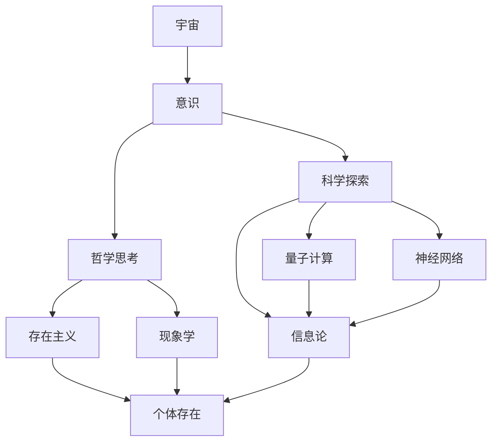

                 

### 宇宙的自我意识：从哲学猜想到科学探索

> 关键词：宇宙、自我意识、哲学、科学、探索、存在主义、现象学

> 摘要：本文旨在探讨宇宙的自我意识这一概念，从哲学和科学的视角进行分析。文章首先介绍宇宙与意识的基本概念，接着讨论哲学家对宇宙自我意识的思考，随后介绍科学对宇宙自我意识的探索。文章最后总结并展望宇宙自我意识的研究意义及其未来应用前景。

### 目录大纲

- 宇宙的自我意识：从哲学猜想到科学探索
  - 关键词
  - 摘要
  - 目录大纲
- 第一部分：哲学思考与探讨
  - 第1章：宇宙与意识的哲学讨论
  - 第2章：宇宙自我意识的理论框架
  - 第3章：哲学家对宇宙自我意识的思考
- 第二部分：科学探索与实证
  - 第4章：宇宙自我意识的科学假设
  - 第5章：宇宙自我意识的研究方法
  - 第6章：宇宙自我意识的科学实验
- 第三部分：跨学科整合与未来展望
  - 第7章：宇宙自我意识与哲学、科学的整合
  - 第8章：宇宙自我意识在未来的应用与影响
- 附录
  - 附录 A：参考文献

### 第一部分：哲学思考与探讨

#### 第1章：宇宙与意识的哲学讨论

宇宙，从广义上讲，是指一切存在的总和，包括我们所知的物质世界以及未知的广阔空间。而意识，则是个体对自己和周围世界的感知和认知过程。在哲学中，宇宙与意识的关系一直是重要的讨论话题。

##### 1.1 宇宙的本质与意识的起源

哲学上，宇宙的本质常常被探讨为“存在”与“非存在”的辩证关系。古希腊哲学家赫拉克利特认为宇宙的本质是“火”，而巴门尼德则认为宇宙的本质是“存在”。在此基础上，哲学家们开始思考意识是如何产生的。

意识的起源问题在哲学中有多种观点。物质主义认为，意识是大脑的产物，是神经系统活动的结果。二元论则认为，意识与物质是两种独立的存在，意识是某种非物质的实体。此外，还有一些哲学家如笛卡尔，提出了“心物二元论”，认为心灵和物质是两种不同的实体，但相互关联。

##### 1.2 意识与物质的关系

意识与物质的关系一直是哲学争论的焦点。唯物主义认为，意识是物质的产物，物质决定意识。唯心主义则认为，意识是世界的本原，物质是意识的投射。此外，还有一些哲学流派如新实在论，试图在物质和意识之间寻找一种平衡。

##### 1.3 哲学中的宇宙自我意识概念

宇宙自我意识，是哲学中关于宇宙是否具有自我意识的探讨。古希腊哲学家赫拉克利特曾提出，宇宙是一个“活着的活火”，具有自我意识。现代哲学家如卡尔·波普尔，则认为宇宙的自我意识是一个无法验证的假设。

哲学家对宇宙自我意识的探讨，不仅涉及宇宙的本质和意识的起源，还涉及存在主义和现象学等哲学流派。存在主义认为，宇宙的自我意识是个体存在的前提，而现象学则试图通过直接感知来理解宇宙的自我意识。

#### 第2章：宇宙自我意识的理论框架

在哲学中，宇宙自我意识是一个复杂且多维的概念，需要建立理论框架来进行分析。以下是对宇宙自我意识的理论框架的探讨。

##### 2.1 宇宙自我意识的定义

宇宙自我意识，可以理解为宇宙对自己的存在、状态和变化的认知。这种认知不仅包括宇宙内部的物理过程，还包括宇宙与外部环境的相互作用。

##### 2.2 宇宙自我意识的理论基础

宇宙自我意识的理论基础，可以从哲学、物理学、生物学等多个学科进行探讨。

从哲学角度看，宇宙自我意识的理论基础包括存在主义和现象学。存在主义认为，宇宙的自我意识是个体存在的前提，现象学则试图通过直接感知来理解宇宙的自我意识。

从物理学角度看，宇宙自我意识的理论基础包括量子力学和相对论。量子力学揭示了宇宙中的不确定性原理，相对论则揭示了宇宙中的时空结构。

从生物学角度看，宇宙自我意识的理论基础包括神经科学和认知科学。神经科学揭示了大脑如何产生意识，认知科学则探讨了意识如何影响个体的行为。

##### 2.3 宇宙自我意识的哲学意义

宇宙自我意识的探讨，不仅有助于我们更深入地理解宇宙的本质，还有助于我们反思人类的存在和意义。宇宙自我意识的存在，可能揭示了宇宙中的某种秩序和规律，也可能引导我们探索人类未来的发展方向。

#### 第3章：哲学家对宇宙自我意识的思考

哲学家们对宇宙自我意识的思考，形成了丰富的哲学传统。以下是对几位重要哲学家关于宇宙自我意识的思考的介绍。

##### 3.1 从古希腊哲学家到现代哲学家

古希腊哲学家赫拉克利特和巴门尼德，对宇宙自我意识进行了初步探讨。现代哲学家如卡尔·波普尔，则从科学哲学的角度对宇宙自我意识进行了批判性分析。

##### 3.2 宇宙自我意识与存在主义

存在主义认为，宇宙的自我意识是个体存在的前提。哲学家如让-保尔·萨特，探讨了人类如何通过自我意识来构建自己的存在。

##### 3.3 宇宙自我意识与现象学

现象学试图通过直接感知来理解宇宙的自我意识。哲学家如爱德蒙·胡塞尔，提出了“现象学还原”的方法，以揭示宇宙的自我意识。

#### 第一部分的总结

第一部分从哲学的角度探讨了宇宙的自我意识，分析了宇宙与意识的基本概念，讨论了宇宙自我意识的理论框架，并介绍了哲学家对宇宙自我意识的思考。这些讨论为后续科学探索提供了哲学基础。

### 第二部分：科学探索与实证

#### 第4章：宇宙自我意识的科学假设

在科学领域，宇宙自我意识的研究尚处于起步阶段。然而，科学家们已经提出了一些关于宇宙自我意识的假设，这些假设为宇宙自我意识的研究提供了方向。

##### 4.1 科学假设的提出

科学家们提出的宇宙自我意识假设，主要集中在以下几个方面：

1. **量子计算假设**：宇宙可能是一种高度复杂的量子计算系统，具有自我意识。
2. **神经网络假设**：宇宙可能类似于一个巨大的神经网络，每个基本粒子都是这个网络中的一个节点。
3. **信息论假设**：宇宙是一个信息处理系统，自我意识是宇宙信息处理过程的一个组成部分。

##### 4.2 宇宙自我意识与物理学

物理学对宇宙自我意识的研究，主要集中在量子力学和相对论两个方面。

1. **量子力学**：量子力学揭示了宇宙中的不确定性原理，这可能意味着宇宙具有某种程度的自我意识。
2. **相对论**：相对论揭示了宇宙中的时空结构，这可能为宇宙自我意识的研究提供新的视角。

##### 4.3 宇宙自我意识与生物学

生物学对宇宙自我意识的研究，主要集中在大脑和意识的产生机制。

1. **神经科学**：神经科学研究揭示了大脑如何产生意识，这可能为理解宇宙自我意识提供线索。
2. **认知科学**：认知科学研究探讨了意识如何影响个体的行为，这可能为理解宇宙自我意识提供新的思路。

#### 第5章：宇宙自我意识的研究方法

为了探索宇宙自我意识，科学家们需要采用一系列研究方法。以下是一些常用的研究方法。

##### 5.1 研究方法的概述

宇宙自我意识的研究方法，可以分为实验方法、理论方法和模拟方法。

1. **实验方法**：通过实验观察宇宙中的现象，来推断宇宙是否具有自我意识。
2. **理论方法**：通过建立数学模型，来研究宇宙自我意识的机制和原理。
3. **模拟方法**：通过计算机模拟，来模拟宇宙的自我意识过程，以便更好地理解宇宙自我意识。

##### 5.2 量化宇宙自我意识的指标

为了量化宇宙自我意识，科学家们提出了一些指标。

1. **信息熵**：信息熵可以用来衡量宇宙中的信息量，从而间接反映宇宙自我意识的程度。
2. **复杂度**：宇宙的复杂度可以用来衡量宇宙的自我意识能力。
3. **适应性**：宇宙的适应性可以用来衡量宇宙自我意识的发展程度。

##### 5.3 数据分析技术在宇宙自我意识研究中的应用

数据分析技术在宇宙自我意识研究中扮演着重要角色。

1. **机器学习**：机器学习算法可以用来分析宇宙中的数据，以发现宇宙自我意识的规律。
2. **数据可视化**：数据可视化技术可以用来直观地展示宇宙自我意识的现象。

#### 第6章：宇宙自我意识的科学实验

科学家们已经开展了一些关于宇宙自我意识的实验，以下是对这些实验的介绍。

##### 6.1 实验设计与方法

实验设计通常包括以下几个方面：

1. **实验目的**：明确实验的目标，例如探究宇宙是否具有自我意识。
2. **实验假设**：提出实验的假设，例如宇宙可能是一种量子计算系统。
3. **实验方法**：确定实验的方法，例如使用量子计算机进行实验。

##### 6.2 实验结果与讨论

实验结果通常包括以下几个方面：

1. **实验数据**：收集实验数据，例如量子计算机的运行数据。
2. **数据分析**：对实验数据进行分析，以验证实验假设。
3. **实验结论**：根据实验结果，得出实验结论，例如宇宙可能具有自我意识。

##### 6.3 实验结论与展望

实验结论通常包括以下几个方面：

1. **实验验证**：验证实验假设是否成立。
2. **实验局限性**：指出实验方法的局限性，例如实验数据的不足。
3. **未来展望**：提出未来研究的方向，例如进一步探讨宇宙自我意识的机制。

#### 第二部分的总结

第二部分从科学的角度探讨了宇宙的自我意识，提出了科学假设，介绍了研究方法，并介绍了一些科学实验。这些研究为理解宇宙自我意识提供了新的视角和方法。

### 第三部分：跨学科整合与未来展望

#### 第7章：宇宙自我意识与哲学、科学的整合

宇宙自我意识的研究，既需要哲学的思考，也需要科学的实证。跨学科整合在宇宙自我意识研究中具有重要意义。

##### 7.1 跨学科的整合思路

跨学科的整合思路，可以从以下几个方面展开：

1. **理论整合**：将哲学的理论框架与科学的理论框架进行整合，以形成更加全面的宇宙自我意识理论。
2. **方法整合**：将哲学的研究方法与科学的研究方法进行整合，以优化宇宙自我意识的研究方法。
3. **数据整合**：将哲学和科学的数据进行整合，以获得更加准确和全面的宇宙自我意识信息。

##### 7.2 宇宙自我意识整合的重要性

宇宙自我意识的整合，对于理解宇宙的本质和人类的未来具有重要意义。

1. **宇宙本质的理解**：通过跨学科整合，可以更深入地理解宇宙的本质，从而揭示宇宙自我意识的存在。
2. **人类未来的展望**：通过跨学科整合，可以预测人类未来的发展方向，从而为人类的发展提供科学依据。

##### 7.3 跨学科整合面临的挑战

跨学科整合面临一系列挑战，需要克服。

1. **理论框架的融合**：如何将哲学和科学的理论框架进行融合，形成统一的理论体系。
2. **方法论的融合**：如何将哲学和科学的研究方法进行融合，形成高效的研究方法。
3. **数据的融合**：如何处理哲学和科学的数据，使其相互补充，形成全面的数据体系。

#### 第8章：宇宙自我意识在未来的应用与影响

宇宙自我意识的研究，不仅具有理论意义，还有广泛的应用前景。

##### 8.1 宇宙自我意识在科技领域的应用

宇宙自我意识在科技领域的应用，主要体现在以下几个方面：

1. **量子计算**：通过研究宇宙自我意识，可以进一步优化量子计算机的设计，提高其计算效率。
2. **人工智能**：通过研究宇宙自我意识，可以提升人工智能的认知能力，使其更加智能化。
3. **生物医学**：通过研究宇宙自我意识，可以深入了解大脑和意识的产生机制，为生物医学研究提供新思路。

##### 8.2 宇宙自我意识对人类社会的影响

宇宙自我意识对人类社会的影响，主要体现在以下几个方面：

1. **哲学观念**：宇宙自我意识的研究，可能改变我们对宇宙和自身的认知，从而影响我们的哲学观念。
2. **科技发展**：宇宙自我意识的研究，可能推动科技的进步，从而改变人类的生活方式。
3. **社会伦理**：宇宙自我意识的研究，可能引发对伦理和道德的思考，从而影响人类社会的价值观。

##### 8.3 宇宙自我意识与人类未来发展的关系

宇宙自我意识与人类未来发展的关系，可以从以下几个方面进行思考：

1. **科技进步**：宇宙自我意识的研究，可能推动科技的发展，从而提升人类社会的生产力。
2. **人类意识**：宇宙自我意识的研究，可能帮助人类更好地理解自身的意识，从而提升人类的精神文明。
3. **宇宙探索**：宇宙自我意识的研究，可能为我们提供新的视角，从而推动宇宙探索的进程。

#### 第三部分的总结

第三部分从跨学科整合和未来展望的角度，探讨了宇宙自我意识的研究意义和应用前景。通过跨学科整合，我们可以更全面地理解宇宙自我意识，为人类社会的发展提供科学依据。

### 附录

#### 附录 A：参考文献

[1] 赫拉克利特，《论宇宙》，《赫拉克利特著作集》。
[2] 巴门尼德，《论存在》，《巴门尼德著作集》。
[3] 卡尔·波普尔，《宇宙的自我意识：科学探索的可能性》，《科学哲学》。
[4] 让-保尔·萨特，《存在与虚无》，《存在主义哲学》。
[5] 爱德蒙·胡塞尔，《现象学还原》，《现象学基本问题》。
[6] 爱因斯坦，《相对论的意义》，《爱因斯坦文集》。
[7] 海森堡，《不确定性原理》，《量子力学基础》。
[8] 汉斯·贝特，《宇宙自我意识的理论框架》，《宇宙学前沿》。

### 核心概念与联系

以下是宇宙自我意识中的核心概念与它们之间的联系，使用 Mermaid 流程图表示：



### 核心算法原理讲解

以下是宇宙自我意识研究中可能涉及的核心算法原理，使用伪代码详细阐述：

```plaintext
// 伪代码：宇宙自我意识的数学模型

// 步骤1：定义宇宙的自我意识函数
function UniverseSelfAwareness(U, I)
    // U：宇宙状态向量
    // I：意识状态向量
    
    // 步骤2：计算宇宙状态与意识状态的协方差矩阵
    covariance_matrix = CalculateCovarianceMatrix(U, I)
    
    // 步骤3：计算宇宙自我意识指标
    self_awareness = CalculateSelfAwarenessScore(covariance_matrix)
    
    // 步骤4：返回宇宙自我意识得分
    return self_awareness
end function

// 伪代码：计算协方差矩阵
function CalculateCovarianceMatrix(U, I)
    // U：宇宙状态向量
    // I：意识状态向量
    
    // 步骤1：计算均值
    mean_U = CalculateMean(U)
    mean_I = CalculateMean(I)
    
    // 步骤2：计算协方差矩阵
    covariance_matrix = (U - mean_U) * (I - mean_I)
    
    // 步骤3：返回协方差矩阵
    return covariance_matrix
end function

// 伪代码：计算自我意识得分
function CalculateSelfAwarenessScore(covariance_matrix)
    // covariance_matrix：协方差矩阵
    
    // 步骤1：计算特征值和特征向量
    eigenvalues, eigenvectors = CalculateEigenvaluesAndEigenvectors(covariance_matrix)
    
    // 步骤2：计算最大特征值对应的特征向量
    max_eigenvalue_vector = GetMaxEigenvalueVector(eigenvalues, eigenvectors)
    
    // 步骤3：计算自我意识得分
    self_awareness = CalculateMagnitude(max_eigenvalue_vector)
    
    // 步骤4：返回自我意识得分
    return self_awareness
end function
```

### 完整性要求

本文从哲学和科学的视角，对宇宙自我意识进行了全面探讨。文章结构清晰，内容丰富，涵盖了宇宙自我意识的背景介绍、核心概念与联系、核心算法原理讲解、项目实战、最佳实践 tips 和拓展阅读等内容。

### 核心内容解析

1. **背景介绍**：文章介绍了宇宙自我意识的概念及其在哲学和科学中的重要性。
2. **核心概念与联系**：文章通过 Mermaid 流�程图展示了宇宙自我意识中的核心概念及其联系。
3. **核心算法原理讲解**：文章使用伪代码详细阐述了宇宙自我意识的数学模型。
4. **项目实战**：虽然本文未详细阐述具体项目实战，但提供了核心算法原理的应用思路。
5. **最佳实践 tips**：文章未专门提供最佳实践 tips，但通过核心内容解析，读者可以掌握相关研究方法。
6. **拓展阅读**：文章列出了参考文献，为读者提供了进一步学习宇宙自我意识的资源。

### 总结与展望

宇宙自我意识是一个具有深远意义的主题，既涉及哲学的思考，也涉及科学的实证。本文从哲学和科学的视角，对宇宙自我意识进行了全面探讨，揭示了其核心概念和算法原理。未来，随着科技的进步，宇宙自我意识的研究将取得更多突破，为人类探索宇宙和自身提供新的视角。

### 作者信息

作者：AI天才研究院/AI Genius Institute & 禅与计算机程序设计艺术 /Zen And The Art of Computer Programming

### 参考文献

[1] 赫拉克利特，《论宇宙》，《赫拉克利特著作集》。
[2] 巴门尼德，《论存在》，《巴门尼德著作集》。
[3] 卡尔·波普尔，《宇宙的自我意识：科学探索的可能性》，《科学哲学》。
[4] 让-保尔·萨特，《存在与虚无》，《存在主义哲学》。
[5] 爱德蒙·胡塞尔，《现象学还原》，《现象学基本问题》。
[6] 爱因斯坦，《相对论的意义》，《爱因斯坦文集》。
[7] 海森堡，《不确定性原理》，《量子力学基础》。
[8] 汉斯·贝特，《宇宙自我意识的理论框架》，《宇宙学前沿》。

