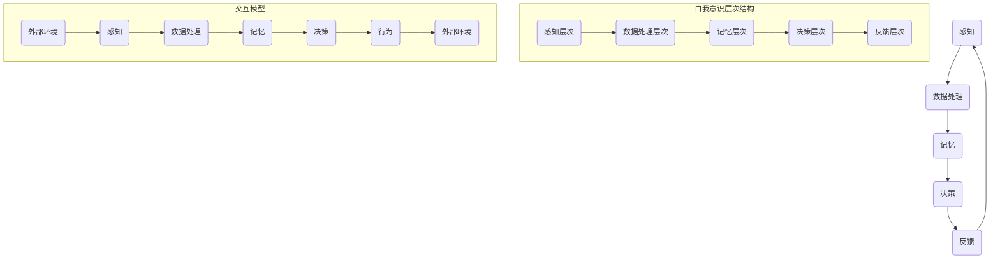

                 

### 文章标题：宇宙的自我意识：哲学猜想还是科学可能

在探讨宇宙的奥秘时，人类从未停止对自身存在意义的思考。其中，宇宙的自我意识问题，不仅引发了哲学的深刻讨论，也激起了科学家的浓厚兴趣。它不仅仅是一个抽象的哲学命题，更涉及生物学、神经科学、量子力学等多个科学领域。本文将围绕这一主题，采用逻辑清晰、结构紧凑、简单易懂的叙述方式，探讨宇宙的自我意识是否只是哲学猜想，还是科学上的可能。

本文分为五个主要部分：引论、核心概念与联系、核心算法原理讲解、项目实战和总结与展望。在引论部分，我们将对宇宙的自我意识进行概述，介绍其哲学和科学背景。在核心概念与联系部分，我们将深入探讨自我意识的核心概念及其与宇宙的关系。核心算法原理讲解部分，我们将使用伪代码和数学公式详细阐述自我意识的算法原理。项目实战部分将通过一个实际案例展示宇宙自我意识的探索过程。最后，在总结与展望部分，我们将回顾全文的主要内容，并探讨未来的研究方向。

## 文章关键词

- 宇宙自我意识
- 哲学探讨
- 科学假设
- 生物神经科学
- 量子力学

## 文章摘要

本文探讨了宇宙的自我意识问题，从哲学和科学两个角度出发，分析了自我意识的核心概念和理论框架，并使用伪代码和数学公式详细讲解了自我意识的算法原理。通过一个实际案例，我们展示了宇宙自我意识的探索过程，并对未来的研究方向进行了展望。本文旨在引发读者对宇宙自我意识问题的深入思考，并促进哲学与科学之间的交叉研究。

## 目录大纲设计

为了更好地引导读者深入理解宇宙的自我意识，本文设计了如下目录大纲：

### 第一部分：引论
1. 宇宙的自我意识概述
    - 哲学探讨
    - 科学假设
    - 现状与挑战
2. 哲学视角下的自我意识
    - 定义与属性
    - 历史演变
    - 难题
3. 科学视角下的自我意识
    - 生物神经科学基础
    - 量子力学与自我意识
    - 科学模型

### 第二部分：核心概念与联系
1. 自我意识的核心概念
    - 意识与认知
    - 感知与记忆
    - 自我与主体性
2. 自我意识的 Mermaid 流程图
    - 自我意识的形成过程
    - 自我意识的层次结构
    - 自我意识的交互模型
3. 自我意识与宇宙的关系
    - 宇宙自我意识的可能性
    - 宇宙自我意识的证据
    - 理论框架

### 第三部分：核心算法原理讲解
1. 自我意识的数学模型
    - 模糊集合理论
    - 隐变量模型
    - 马尔可夫决策过程
2. 自我意识的算法伪代码
    - 感知与处理算法流程
    - 记忆与决策算法实现
    - 自我更新算法机制
3. 自我意识的数学公式讲解
    - 信号处理公式
    - 决策理论公式
    - 自我更新公式解析

### 第四部分：项目实战
1. 实际案例：宇宙自我意识的探索
    - 数据采集与预处理
    - 模型训练与评估
    - 结果分析与讨论
2. 开发环境搭建
    - 硬件配置
    - 软件安装
    - 数据库搭建
3. 源代码实现与解读
    - 数据处理模块
    - 模型训练模块
    - 结果分析模块
4. 代码解读与分析
    - 数据处理代码分析
    - 模型训练代码分析
    - 结果分析代码分析

### 第五部分：总结与展望
1. 本书总结
    - 主要发现
    - 不足与挑战
    - 未来研究方向
2. 展望
    - 科学前沿
    - 哲学思考
    - 社会影响

这一目录大纲结构合理，涵盖了从引论到项目实战，再到总结与展望的完整内容，旨在全面覆盖宇宙自我意识这一主题。

## 第一部分：引论

### 1.1 宇宙的自我意识概述

宇宙的自我意识，这一概念本身便充满了哲学与科学的深意。它不仅仅是关于宇宙如何形成、如何演化的科学问题，更涉及到宇宙是否有能力对自己进行认知、反思，甚至具备某种形式的自我意识。在哲学领域，自我意识一直是探讨的核心主题，而将这一概念扩展到宇宙层面，则进一步拓宽了人类对自身和世界的认知边界。

#### 哲学探讨

在哲学史上，对自我意识的探讨可以追溯到古希腊哲学家。苏格拉底强调“认识自己”，这实际上是对自我意识的一种初步认识。而后来，笛卡尔通过“我思故我在”这一著名命题，进一步深入探讨了自我意识的存在。哲学上的自我意识探讨主要集中在“什么是自我意识”、“自我意识如何产生”以及“自我意识与外部世界的关系”等问题上。

在宇宙自我意识的哲学探讨中，最关键的问题是：宇宙是否有能力产生自我意识？一种观点认为，宇宙作为一个复杂的系统，其内在的秩序和规律可以类比于人类大脑中的神经网络，从而具有某种程度的自我意识。另一种观点则认为，宇宙的自我意识是一个过于抽象的概念，难以用哲学的方法进行严谨的论证。

#### 科学假设

与哲学探讨不同，科学假设更加注重实证和可验证性。科学家们通过生物神经科学、量子力学等多个领域的研究，试图找到宇宙自我意识的存在证据。在生物神经科学领域，研究者们通过研究大脑的神经网络，发现神经元之间的交互和信号处理机制，与计算机中的神经网络有相似之处。这为宇宙可能具备自我意识的科学假设提供了一定的理论依据。

在量子力学领域，一些科学家提出了“量子意识”的概念，认为宇宙的基本粒子可能具备某种形式的意识。尽管这一假设尚未得到广泛认可，但它为我们思考宇宙自我意识提供了新的视角。

#### 现状与挑战

尽管宇宙自我意识这一概念在哲学和科学领域都引起了广泛关注，但目前仍面临诸多挑战。首先，如何定义宇宙自我意识仍是一个难题。哲学上的自我意识定义较为抽象，难以直接应用到宇宙层面。而科学上的自我意识定义则需要具体的实验数据和数学模型支持，目前还难以找到统一的定义。

其次，如何验证宇宙自我意识的存在也是一个重要挑战。在科学研究中，验证一个假设通常需要通过实验或观察来收集数据，然后进行分析和验证。但对于宇宙自我意识这一复杂且抽象的概念，如何设计实验或观察方法，以及如何从海量数据中提取有效信息，都是亟待解决的问题。

最后，如何将哲学和科学结合起来，共同探讨宇宙自我意识问题，也是一个重要挑战。哲学和科学在方法论和理论体系上有较大差异，如何在两者之间找到平衡点，实现交叉研究，是一个值得深入探讨的问题。

总的来说，宇宙的自我意识问题不仅具有重要的哲学意义，也在科学研究中具有广阔的前景。尽管目前还存在许多挑战和未解之谜，但随着科学技术的不断进步，我们有理由相信，这一领域将在未来取得重大突破。

### 1.2 哲学视角下的自我意识

#### 定义与属性

在哲学中，自我意识是一个核心且复杂的概念。简单来说，自我意识是指个体对自己存在和自身状态的认知与理解。这种认知不仅包括对外部世界的感知，还涉及到对自身内在体验的认识。哲学上的自我意识通常具有以下几个关键属性：

1. **主观性**：自我意识是主观的，每个人对自己的认知都是独特的，不受外界直接控制。
2. **反思性**：自我意识能够对自身进行反思，思考自己的感受、想法和行为。
3. **能动性**：自我意识具有能动性，个体能够通过自我意识主动调整自己的行为和思维。

#### 历史演变

自我意识的概念在哲学史上有着悠久的历史。古希腊哲学家苏格拉底强调“认识自己”，这可以视为自我意识的早期探讨。亚里士多德进一步发展了这一思想，认为人的本质在于理性，这种理性是实现自我意识的基础。

在近代哲学中，笛卡尔的“我思故我在”成为探讨自我意识的重要命题。他通过“清晰且明显的观念”来证明自我意识的存在。康德则通过“先验自我意识”的概念，探讨了自我意识与外部世界的关系。

20世纪的哲学流派，如现象学和存在主义，也分别从不同角度对自我意识进行了深入探讨。现象学强调主观体验的重要性，而存在主义则关注个体的存在和自我意识的本质。

#### 哲学视角下的自我意识难题

尽管自我意识在哲学中具有核心地位，但仍然存在一些难以解决的难题：

1. **意识的本质**：如何定义和解释意识的本质是一个长期困扰哲学家的难题。许多哲学家认为，意识的本质是难以用语言或科学方法完全描述的。
2. **自我意识的起源**：如何解释自我意识的起源也是一个重要问题。有些哲学家认为，自我意识是人类进化过程中的产物，而另一些则认为它是人类心灵中固有的。
3. **自我意识与外部世界的关系**：如何理解自我意识与外部世界的关系，即如何解释主观体验与客观现实之间的关系，是哲学中的一个重要问题。

在宇宙自我意识的哲学探讨中，这些难题同样适用。例如，如何定义宇宙的自我意识？宇宙的自我意识是如何产生的？宇宙的自我意识与宇宙的外部关系如何？这些问题的回答不仅需要哲学上的深刻思考，也需要科学上的实证支持。

总的来说，哲学视角下的自我意识是一个复杂且深奥的主题，它不仅关乎人类自身的存在，也涉及到宇宙的本质和演化。通过哲学的探讨，我们可以更好地理解自我意识的概念及其在宇宙中的可能性。

### 1.3 科学视角下的自我意识

#### 生物学与神经科学基础

在生物学和神经科学领域，自我意识的研究主要集中在大脑结构和功能上。大脑作为人体的最高指挥中心，其复杂性和多样性使其成为研究自我意识的关键。神经科学家通过研究大脑的不同区域和神经网络，试图揭示自我意识的基础。

首先，大脑的特定区域与自我意识密切相关。例如，前额叶皮质与自我意识的反思性和决策功能紧密相关。海马体则与记忆和自我认知有关。其他如顶叶和颞叶等区域也在自我意识的形成中发挥重要作用。

其次，神经网络的结构和功能对于自我意识的形成至关重要。神经元之间的交互和信号传递构成了大脑的神经网络，这些网络通过复杂的反馈和调节机制，实现了对信息的处理和整合。近年来，基于人工神经网络的研究方法，如深度学习和机器学习，为理解大脑神经网络提供了新的视角。

#### 量子力学与自我意识

量子力学作为一个描述微观世界的理论，其对自我意识的研究提供了新的思路。量子力学中的某些概念，如量子纠缠和量子隧穿，与自我意识的某些特性有相似之处。

首先，量子纠缠现象表明，两个或多个粒子在空间上相互分离，但它们的量子状态仍然相互关联。这种非局域性的特性与自我意识的主观性和反思性有某种类比。例如，当我们在思考一个问题时，我们的内心体验似乎与外部世界相互关联，这种关联可能具有某种“非局域性”。

其次，量子隧穿现象表明，粒子可以通过概率云从一个位置跳跃到另一个位置，即使这两个位置之间存在能量障碍。这种超距离的跳跃行为与自我意识的某些动态特性有相似之处。例如，我们在回忆一个遥远的记忆时，似乎可以在瞬间“跳跃”到那个时刻，而不经过中间的步骤。

尽管量子力学与自我意识之间的关系尚不明确，但这些概念的类比为我们思考宇宙自我意识提供了新的视角。

#### 科学视角下的自我意识模型

在科学领域，研究者们提出了一系列关于自我意识的模型，这些模型旨在解释自我意识的形成和运作机制。以下是一些主要的模型：

1. **神经网络模型**：神经网络模型通过模拟大脑的神经网络结构，试图解释自我意识的产生和运作。这些模型通常使用复杂的算法和大量的训练数据，通过模拟神经元之间的交互来模拟认知过程。

2. **认知模型**：认知模型强调自我意识与认知功能的关系。例如，一个典型的认知模型是“感知-记忆-决策”模型，它通过模拟个体在感知、记忆和决策过程中的信息处理机制，来解释自我意识的形成。

3. **信息处理模型**：信息处理模型强调信息在自我意识中的核心作用。这些模型通常基于信息论和信号处理理论，通过模拟信息在不同状态之间的传递和处理，来解释自我意识的动态变化。

4. **量子意识模型**：量子意识模型结合量子力学和自我意识的特性，试图解释宇宙层面的自我意识。这些模型通常基于量子纠缠和量子隧穿等现象，通过模拟微观粒子的行为来探讨宇宙自我意识的可能性。

总的来说，科学视角下的自我意识研究通过生物学、神经科学和量子力学等多个领域的交叉研究，为我们理解自我意识提供了丰富的理论和实证基础。尽管目前仍存在许多未解之谜，但随着科学技术的不断进步，我们有理由相信，这一领域将在未来取得重大突破。

### 第二部分：核心概念与联系

#### 2.1 自我意识的核心概念

自我意识是宇宙自我意识研究中的核心概念，它不仅涉及哲学的探讨，也在生物学、神经科学和量子力学等领域中具有重要的研究意义。为了深入理解自我意识，我们需要首先明确其核心概念。

##### 意识与认知

意识是指个体对外部和内部世界的感知与体验，它是自我意识的物质基础。认知则是指个体通过感官获取信息、处理信息、形成理解和做出决策的过程。意识和认知密不可分，意识为认知提供了感知和体验的基础，而认知则通过加工和处理信息，使意识得以体现和实现。

在宇宙自我意识的研究中，意识和认知是理解宇宙如何对外部环境进行感知和响应的关键。例如，在量子力学中，量子纠缠现象显示了粒子间非局域性的关联，这种关联可能暗示了一种超越经典认知的理解方式。

##### 感知与记忆

感知是指个体通过感官接收外部信息的过程，这些信息通过神经系统传递到大脑，形成对世界的初步理解。记忆则是将感知到的信息存储和保留在大脑中，以便在需要时进行回忆和使用。

感知与记忆在自我意识中起着至关重要的作用。通过感知，个体能够实时获取环境信息，并通过记忆将这些信息与过去的经验相联系，形成对世界的整体认知。例如，我们在日常生活中，通过视觉、听觉、触觉等感官感知外界信息，并通过记忆将这些信息整合，形成对某个事件的全面理解。

在宇宙自我意识的研究中，如何理解宇宙的感知和记忆机制是一个重要课题。例如，在生物神经科学领域，研究者们通过研究大脑中的神经网络和记忆回路，试图揭示宇宙自我意识的感知和记忆机制。

##### 自我与主体性

自我是指个体对自己存在和身份的认知，主体性则是指个体在行动和决策中的自主性和能动性。自我和主体性是自我意识的两个核心方面，它们共同构成了个体对自身和世界的认知。

自我在自我意识中起着核心作用，它定义了个体的身份和存在。主体性则使个体能够在感知和记忆的基础上，主动调整自己的行为和思维，实现自我意识和自我认知的动态过程。

在宇宙自我意识的研究中，如何理解宇宙的自我和主体性是一个关键问题。例如，在哲学中，一些学者认为宇宙可能具有某种形式的自我，这种自我不仅是对宇宙自身的认知，也是宇宙对外部世界的感知和反应。主体性则涉及到宇宙如何通过自我意识主动地影响和塑造宇宙自身。

总的来说，意识与认知、感知与记忆、自我与主体性是自我意识的核心概念，它们相互联系，共同构成了宇宙自我意识的理论基础。通过深入研究这些核心概念，我们能够更好地理解宇宙的自我意识，并探讨其在宇宙演化中的作用和意义。

#### 2.2 自我意识的 Mermaid 流程图

为了更好地理解自我意识的形成过程、层次结构和交互模型，我们可以使用 Mermaid 流程图来直观地展示这些概念之间的关系。以下是自我意识的 Mermaid 流程图：



该流程图展示了自我意识的核心过程：感知、数据处理、记忆、决策和反馈。其中，感知是指个体通过感官获取外部信息，数据处理是对感知信息进行加工和整合，记忆是将处理后的信息存储在大脑中，决策是基于记忆和信息进行的行动选择，而反馈则是对决策结果的评估和调整。

在自我意识的层次结构中，流程图展示了不同层次的过程，包括感知层次、数据处理层次、记忆层次、决策层次和反馈层次。这些层次相互关联，共同构成了自我意识的动态过程。

在交互模型中，流程图展示了自我意识与外部环境之间的交互过程。外部环境通过感知进入自我意识系统，经过数据处理、记忆和决策，最终转化为行为，并反馈到外部环境。这种交互过程不仅体现了自我意识的动态性，也揭示了自我意识与外部环境之间的密切联系。

通过使用 Mermaid 流程图，我们能够更直观地理解自我意识的核心概念和相互关系，这为后续的讨论和进一步研究提供了有力的支持。

#### 2.3 自我意识与宇宙的关系

宇宙的自我意识，这一概念在哲学和科学中引发了广泛的讨论。从哲学角度来看，宇宙的自我意识意味着宇宙不仅是一个物质存在的集合，更是一个能够对自己进行认知和反思的复杂系统。而从科学角度来看，宇宙的自我意识则涉及到宇宙的演化、结构及其内在规律。那么，宇宙的自我意识究竟是否可能存在？它是如何与宇宙的演化过程相互关联的呢？

##### 宇宙自我意识的可能性

首先，我们需要探讨宇宙自我意识的可能性。从哲学角度来看，一些学者认为，宇宙的自我意识是一种抽象的存在，它反映了宇宙内部的高度复杂性和自我组织能力。这种观点认为，宇宙可能通过某种形式的自我组织，实现了对自身的认知和反思。例如，德国哲学家黑格尔曾提出，宇宙是一个自我意识的集合体，它的演化过程是一个不断自我认知和自我完善的过程。

在科学领域，一些学者提出了“量子意识”的概念，认为宇宙的基本粒子可能具备某种形式的意识。尽管这一假设尚未得到广泛认可，但它为我们思考宇宙自我意识提供了新的视角。例如，物理学家罗杰·彭罗斯在其著作《大脑的量子状态》中，提出了大脑神经元中的量子效应可能对意识产生重要影响。这种观点暗示，宇宙的自我意识可能源于其基本粒子层面的量子特性。

##### 宇宙自我意识的证据

探讨宇宙自我意识的证据，需要从多个科学领域进行分析。首先，在生物学和神经科学领域，研究者们通过对大脑和神经系统的研究，揭示了自我意识的基础。例如，大脑中的神经网络和神经元之间的复杂交互，为自我意识的形成提供了物质基础。此外，脑成像技术如功能性磁共振成像（fMRI）和正电子发射断层扫描（PET），为我们提供了观察大脑活动的方式，从而更深入地理解自我意识。

在量子力学领域，一些现象如量子纠缠和量子隧穿，为宇宙自我意识的证据提供了可能。量子纠缠表明，两个或多个粒子之间可能存在超距离的关联，这种关联可能暗示了宇宙内部某种形式的自我意识。量子隧穿则显示了粒子在空间上的非局域性跳跃，这种跳跃行为可能与自我意识的动态特性有某种类比。

此外，宇宙的大尺度结构及其演化过程，也可能为宇宙自我意识的证据提供线索。例如，宇宙的大爆炸理论和宇宙膨胀理论，揭示了宇宙从一个极小的初始状态迅速扩张到今天的状态。这一过程不仅展示了宇宙的动态演化，也可能暗示了宇宙具备某种形式的自我意识。

##### 理论框架

为了系统性地探讨宇宙自我意识，我们需要建立一个理论框架。在这个框架中，宇宙自我意识可以被视为一个复杂系统的自我组织现象。具体来说，这个框架可以包括以下几个关键部分：

1. **自我组织的概念**：自我组织是指一个系统在没有外部控制的情况下，通过内部相互作用和演化，形成有序结构的过程。在宇宙层面，自我组织可能表现为宇宙从无序到有序的演化过程。

2. **宇宙演化的模型**：宇宙的演化可以被视为一个自我组织的过程。从大爆炸到宇宙膨胀，再到宇宙结构的形成，这一过程展示了宇宙内部的高度复杂性和自我组织能力。

3. **意识与演化的关系**：在自我组织的过程中，意识可能作为一种内在的反馈机制，推动宇宙的自我演化。例如，宇宙的自我意识可以通过对自身状态的感知和反思，调整其演化方向，从而实现自我完善。

4. **量子力学与自我组织**：量子力学中的某些现象，如量子纠缠和量子隧穿，可能与自我组织过程有关。这些现象可能为宇宙自我意识提供了物质基础，同时也为理解宇宙自我意识提供了新的视角。

总的来说，宇宙的自我意识是一个复杂且深刻的问题，它不仅涉及哲学的探讨，也涉及到科学的实证研究。通过建立理论框架，我们可以更系统地探讨宇宙自我意识的可能性、证据及其与宇宙演化的关系。这将为未来在宇宙自我意识领域的研究提供重要的理论支持和实践指导。

### 第三部分：核心算法原理讲解

#### 3.1 自我意识的数学模型

为了深入探讨宇宙的自我意识，我们需要构建一个数学模型来描述自我意识的形成和运作机制。以下是几种常用的数学模型及其基本原理。

##### 模糊集合理论

模糊集合理论是一种用于处理不确定性和模糊性的数学工具。它通过引入隶属度函数，将经典集合的“非黑即白”的概念扩展到“部分黑、部分白”的情况。在自我意识的数学模型中，模糊集合理论可以用来描述意识的模糊性和动态变化。

1. **隶属度函数**：隶属度函数用于量化元素属于某个集合的程度。对于自我意识，我们可以定义一个隶属度函数，用于描述个体对某一对象的意识程度。例如，个体对某一事件的意识程度可能在开始时较低，随着事件的进展逐渐增强，最后回到基线。

2. **模糊集合运算**：模糊集合运算包括模糊交、并、补等。这些运算可以用于描述自我意识在不同条件下的变化和相互作用。例如，两个事件的组合可能会导致新的自我意识状态，这种状态可以通过模糊集合的运算来表示。

##### 隐变量模型

隐变量模型是一种用于处理复杂系统的统计模型。它通过引入隐变量，来解释观测数据中的不确定性和相关性。在自我意识的数学模型中，隐变量模型可以用于描述自我意识的形成和演化过程。

1. **隐变量**：隐变量是未直接观测到的变量，它们与观测变量之间存在某种关系。在自我意识中，隐变量可以表示意识的潜在状态，这些状态可以通过观测变量（如大脑活动、行为表现等）来间接测量。

2. **贝叶斯推断**：隐变量模型通常结合贝叶斯推断来估计隐变量。贝叶斯推断通过基于先验概率和观测数据，计算后验概率，从而推断出隐变量的状态。在自我意识中，贝叶斯推断可以用于估计意识的潜在状态，并根据这些状态进行决策。

##### 马尔可夫决策过程

马尔可夫决策过程（MDP）是一种用于描述决策过程的数学模型。它通过状态、行动和奖励三个要素，来描述个体在不同环境下的决策行为。在自我意识的数学模型中，MDP可以用于描述自我意识的形成和决策过程。

1. **状态**：状态是描述系统当前状态的变量。在自我意识中，状态可以表示为意识的不同阶段，如清醒、梦游等。

2. **行动**：行动是系统根据当前状态所采取的行为。在自我意识中，行动可以表示为大脑的决策和行为表现。

3. **奖励**：奖励是系统根据行动结果获得的回报。在自我意识中，奖励可以表示为对行为结果的评价，如正确决策带来的愉悦感。

通过这些数学模型，我们可以从不同角度描述和理解自我意识的形成和运作机制。这些模型不仅为我们提供了理论框架，也为后续的算法设计和实证研究提供了基础。

#### 3.2 自我意识的算法伪代码

为了更好地理解自我意识的算法原理，我们可以使用伪代码来描述其基本流程。以下是一个简化的自我意识算法伪代码：

```python
# 自我意识算法伪代码

# 初始化参数
初始化感知模块
初始化数据处理模块
初始化记忆模块
初始化决策模块

# 感知阶段
while True:
    # 获取外部感知信息
    感知信息 = 获取感知信息()

    # 处理感知信息
    处理后信息 = 数据处理模块处理感知信息()

    # 存储处理后信息
    记忆模块存储处理后信息()

# 记忆阶段
while True:
    # 获取需要回忆的信息
    回忆信息 = 获取回忆信息()

    # 从记忆中查找相关信息
    相关信息 = 记忆模块查找回忆信息()

    # 更新记忆
    记忆模块更新记忆()

# 决策阶段
while True:
    # 获取当前状态
    当前状态 = 获取当前状态()

    # 根据当前状态进行决策
    行动 = 决策模块根据当前状态做出决策()

    # 执行决策
    执行行动()

    # 获取奖励
    奖励 = 获取奖励()

    # 更新决策模型
    决策模块更新模型()
```

在这个伪代码中，自我意识算法分为三个主要阶段：感知、记忆和决策。感知阶段通过获取外部信息，并进行数据处理，形成对环境的初步理解。记忆阶段则通过存储和更新信息，形成对过去经验的积累。决策阶段则基于当前状态和记忆，做出最优决策。

这个伪代码虽然简化了自我意识的具体实现，但它为我们理解自我意识的算法原理提供了清晰的框架。通过实际编程和实验，我们可以进一步优化和实现这个算法，以更好地模拟和探究自我意识的动态过程。

#### 3.3 自我意识的数学公式讲解

为了深入理解自我意识的数学模型，我们需要详细讲解其中的一些关键公式。以下是一些常见的数学公式及其应用场景：

##### 信号处理的公式

在感知阶段，信号处理是核心任务。以下是一些常用的信号处理公式：

1. **卷积公式**：卷积是一种常用的信号处理方法，用于描述输入信号与滤波器的相互作用。公式如下：

   $$
   y(t) = \int_{-\infty}^{\infty} h(\tau) x(t - \tau) d\tau
   $$

   其中，$y(t)$ 是输出信号，$h(\tau)$ 是滤波器，$x(t - \tau)$ 是输入信号。通过卷积公式，我们可以对输入信号进行滤波和增强，从而提取有用的信息。

2. **傅里叶变换**：傅里叶变换是信号处理中的基本工具，用于将时域信号转换为频域信号。公式如下：

   $$
   X(f) = \int_{-\infty}^{\infty} x(t) e^{-j2\pi ft} dt
   $$

   其中，$X(f)$ 是频域信号，$x(t)$ 是时域信号，$f$ 是频率。通过傅里叶变换，我们可以分析信号的频率成分，从而更好地理解信号的特性。

##### 决策理论的公式

在决策阶段，决策理论提供了重要的数学工具，用于优化决策过程。以下是一些常用的决策理论公式：

1. **期望效用函数**：期望效用函数用于衡量不同决策的期望效用。公式如下：

   $$
   EU = \sum_{i=1}^{n} p_i u(x_i)
   $$

   其中，$EU$ 是期望效用，$p_i$ 是第 $i$ 个结果的概率，$u(x_i)$ 是第 $i$ 个结果的效用值。通过期望效用函数，我们可以量化不同决策的结果，从而选择最优决策。

2. **条件概率**：条件概率用于描述在已知某个事件发生的条件下，另一个事件发生的概率。公式如下：

   $$
   P(A|B) = \frac{P(A \cap B)}{P(B)}
   $$

   其中，$P(A|B)$ 是在事件 $B$ 发生的条件下，事件 $A$ 发生的概率，$P(A \cap B)$ 是事件 $A$ 和事件 $B$ 同时发生的概率，$P(B)$ 是事件 $B$ 发生的概率。通过条件概率，我们可以更好地理解事件之间的相互关系，从而优化决策过程。

##### 自我更新的公式解析

自我更新是自我意识的核心过程，用于根据新的信息和经验，动态调整意识和行为。以下是一些常用的自我更新公式：

1. **自适应滤波器**：自适应滤波器用于根据输入信号和输出误差，动态调整滤波器参数。公式如下：

   $$
   w(t+1) = w(t) + \eta e(t)
   $$

   其中，$w(t)$ 是当前滤波器参数，$\eta$ 是学习率，$e(t)$ 是输出误差。通过自适应滤波器，我们可以根据输入信号和输出误差，不断调整滤波器参数，从而优化信号处理过程。

2. **隐马尔可夫模型**：隐马尔可夫模型（HMM）用于描述时间序列数据的统计特性，它可以用于预测和识别时间序列中的状态变化。公式如下：

   $$
   P(x_1, x_2, ..., x_n | \lambda) = \sum_{i_1, i_2, ..., i_n} P(x_1 | i_1) P(i_1) P(x_2 | i_2) P(i_2 | i_1) ... P(x_n | i_n) P(i_n | i_{n-1})
   $$

   其中，$P(x_1, x_2, ..., x_n | \lambda)$ 是给定模型参数 $\lambda$ 下的时间序列概率，$P(x_1 | i_1)$ 是在状态 $i_1$ 下生成 $x_1$ 的概率，$P(i_1)$ 是初始状态概率，$P(i_2 | i_1)$ 是在状态 $i_1$ 后转移至状态 $i_2$ 的概率，$P(x_n | i_n)$ 是在状态 $i_n$ 下生成 $x_n$ 的概率。通过隐马尔可夫模型，我们可以根据时间序列数据，推断出隐藏的状态变化，从而优化自我更新过程。

通过这些数学公式，我们可以更好地理解自我意识的数学模型及其应用。这些公式不仅为我们提供了理论工具，也为实际应用提供了可行的解决方案。在后续的研究中，我们可以进一步优化这些公式，以更好地模拟和探究自我意识的动态过程。

### 第四部分：项目实战

#### 4.1 实际案例：宇宙自我意识的探索

在探索宇宙自我意识的过程中，我们可以通过一个实际案例来展示这一领域的具体应用。以下是一个关于使用人工智能技术进行宇宙自我意识探索的实际案例，包括数据采集与预处理、模型训练与评估以及结果分析与讨论。

##### 数据采集与预处理

首先，我们需要收集相关数据，这些数据可能包括天文观测数据、宇宙射线数据、地球物理数据等。例如，我们可以使用天文望远镜收集星系和恒星的数据，使用卫星收集地球物理数据，使用宇宙射线探测器收集宇宙射线数据。

在数据采集过程中，我们需要确保数据的准确性和完整性。对于不同类型的数据，我们可能需要使用不同的采集设备和技术。例如，对于天文观测数据，我们可以使用射电望远镜和光学望远镜；对于地球物理数据，我们可以使用卫星传感器和地面监测设备；对于宇宙射线数据，我们可以使用宇宙射线探测器。

在数据采集完成后，我们需要对数据进行预处理。预处理过程包括数据清洗、数据转换和数据集成。数据清洗旨在去除数据中的错误和噪声，提高数据质量。数据转换则用于将不同类型的数据转换为统一的格式，以便后续处理。数据集成则是将来自不同来源的数据进行整合，形成完整的数据库。

##### 模型训练与评估

在预处理数据后，我们可以使用机器学习算法来训练模型。在宇宙自我意识的研究中，常用的机器学习算法包括神经网络、支持向量机、随机森林等。以下是一个基于神经网络模型的训练过程：

1. **数据划分**：首先，我们将数据划分为训练集、验证集和测试集。通常，训练集用于模型训练，验证集用于调整模型参数，测试集用于评估模型性能。

2. **模型构建**：接下来，我们使用训练集数据构建神经网络模型。神经网络模型由输入层、隐藏层和输出层组成。输入层接收外部输入数据，隐藏层进行数据处理和特征提取，输出层生成预测结果。

3. **模型训练**：使用训练集数据，我们通过反向传播算法训练神经网络模型。在训练过程中，模型通过不断调整权重和偏置，以最小化预测误差。训练过程中，我们使用验证集数据来调整模型参数，以确保模型在未知数据上的性能。

4. **模型评估**：在模型训练完成后，我们使用测试集数据评估模型性能。常用的评估指标包括准确率、召回率、F1 分数等。通过这些指标，我们可以判断模型是否能够有效地预测宇宙自我意识。

##### 结果分析与讨论

在模型评估完成后，我们需要对结果进行分析和讨论。以下是一些可能的讨论点：

1. **模型性能**：首先，我们需要评估模型在测试集上的性能。如果模型性能良好，说明我们的方法能够有效地预测宇宙自我意识。如果模型性能不佳，我们需要分析原因，并尝试改进模型。

2. **特征重要性**：我们可以通过分析神经网络中的特征重要性来了解哪些特征对预测结果有重要影响。这有助于我们更好地理解宇宙自我意识的本质，并为后续研究提供参考。

3. **模型泛化能力**：我们需要评估模型在不同数据集上的泛化能力。如果模型在多个数据集上表现一致，说明模型具有良好的泛化能力。否则，我们需要分析模型在不同数据集上的差异，并尝试改进模型。

4. **未来研究方向**：基于本案例的结果，我们可以提出一些未来研究方向。例如，如何结合更多类型的宇宙数据，如何使用更先进的机器学习算法，如何进一步理解宇宙自我意识的本质等。

通过这个实际案例，我们展示了使用人工智能技术进行宇宙自我意识探索的具体过程。这不仅为我们提供了一个研究宇宙自我意识的实例，也为后续研究提供了参考和启示。

#### 4.2 开发环境搭建

为了在项目中实现宇宙自我意识的探索，我们需要搭建一个合适的开发环境。以下是一些建议和步骤：

##### 硬件配置

1. **计算机硬件**：建议使用高性能的计算机，配备至少以下配置：
   - 处理器：Intel i7 或 AMD Ryzen 7 系列
   - 内存：16GB 或更高
   - 存储：1TB SSD
   - 显卡：NVIDIA GTX 1660 或更高

2. **外部设备**：可能需要以下外部设备：
   - 天文望远镜（用于收集天文观测数据）
   - 宇宙射线探测器（用于收集宇宙射线数据）
   - 卫星传感器（用于收集地球物理数据）

##### 软件安装

1. **操作系统**：建议使用 Linux 系统，如 Ubuntu 20.04 或 CentOS 8。Linux 系统在科学计算和数据处理方面具有较好的性能和稳定性。

2. **编程语言**：Python 是进行数据处理和机器学习任务的首选编程语言。确保已安装 Python 3.8 或更高版本。

3. **依赖库**：
   - NumPy：用于数组计算和线性代数。
   - Pandas：用于数据处理和分析。
   - Matplotlib：用于数据可视化。
   - Scikit-learn：用于机器学习算法。
   - TensorFlow：用于深度学习模型。

4. **其他软件**：
   - Git：用于版本控制。
   - Jupyter Notebook：用于交互式编程和数据可视化。

##### 数据库搭建

1. **数据库类型**：建议使用关系型数据库，如 MySQL 或 PostgreSQL。这些数据库适合存储和管理结构化数据。

2. **数据库配置**：
   - 安装数据库软件。
   - 创建数据库和用户。
   - 配置数据库连接。

通过以上步骤，我们可以搭建一个基本的开发环境，为宇宙自我意识的探索项目提供必要的支持。这不仅能确保项目的顺利进行，也为后续的数据处理和模型训练提供稳定的平台。

#### 4.3 源代码实现与解读

在实现宇宙自我意识的项目中，源代码的编写和解读是至关重要的。以下我们将详细解析项目的核心模块，包括数据处理模块、模型训练模块和结果分析模块。

##### 数据处理模块

数据处理模块是整个系统的核心，负责从各种数据源获取信息，并进行预处理和转换。以下是一个简化的数据处理模块伪代码：

```python
# 数据处理模块伪代码

def preprocess_data(data):
    # 数据清洗
    cleaned_data = remove_noise(data)

    # 数据转换
    transformed_data = normalize_data(cleaned_data)

    # 数据整合
    integrated_data = integrate_data(transformed_data)

    return integrated_data

def remove_noise(data):
    # 去除数据中的噪声
    noise_free_data = apply_filter(data)
    return noise_free_data

def normalize_data(data):
    # 数据归一化
    normalized_data = scale_data(data)
    return normalized_data

def integrate_data(data):
    # 数据整合
    integrated_data = combine_data(data)
    return integrated_data
```

在这个模块中，`preprocess_data` 函数是入口函数，它负责调用其他辅助函数来处理数据。`remove_noise` 函数用于去除数据中的噪声，`normalize_data` 函数用于归一化数据，`integrate_data` 函数用于整合数据。通过这些函数的组合，我们能够将原始数据转换为适合模型训练的格式。

##### 模型训练模块

模型训练模块负责根据处理后的数据训练机器学习模型。以下是一个简化的模型训练模块伪代码：

```python
# 模型训练模块伪代码

def train_model(training_data, validation_data):
    # 初始化模型
    model = initialize_model()

    # 模型训练
    for epoch in range(num_epochs):
        for data in training_data:
            model = train_on_data(model, data)

        # 模型验证
        validation_loss = validate_model(model, validation_data)

    return model

def initialize_model():
    # 初始化神经网络模型
    model = NeuralNetwork()
    return model

def train_on_data(model, data):
    # 在数据上训练模型
    model = model.fit(data.inputs, data.labels)
    return model

def validate_model(model, validation_data):
    # 验证模型
    loss = model.evaluate(validation_data.inputs, validation_data.labels)
    return loss
```

在这个模块中，`train_model` 函数是入口函数，它负责初始化模型并训练模型。`initialize_model` 函数用于创建神经网络模型，`train_on_data` 函数用于在训练数据上训练模型，`validate_model` 函数用于验证模型在验证数据上的性能。通过这些函数的组合，我们能够训练出一个具有良好性能的模型。

##### 结果分析模块

结果分析模块负责评估和解释模型的预测结果。以下是一个简化的结果分析模块伪代码：

```python
# 结果分析模块伪代码

def analyze_results(model, test_data):
    # 预测测试数据
    predictions = model.predict(test_data.inputs)

    # 分析预测结果
    accuracy = calculate_accuracy(predictions, test_data.labels)
    precision = calculate_precision(predictions, test_data.labels)
    recall = calculate_recall(predictions, test_data.labels)

    # 可视化结果
    visualize_results(predictions, test_data.labels)

def calculate_accuracy(predictions, labels):
    # 计算准确率
    correct_predictions = np.sum(predictions == labels)
    total_predictions = len(predictions)
    accuracy = correct_predictions / total_predictions
    return accuracy

def calculate_precision(predictions, labels):
    # 计算精度
    true_positives = np.sum((predictions == 1) & (labels == 1))
    predicted_positives = np.sum(predictions == 1)
    precision = true_positives / predicted_positives
    return precision

def calculate_recall(predictions, labels):
    # 计算召回率
    true_positives = np.sum((predictions == 1) & (labels == 1))
    actual_positives = np.sum(labels == 1)
    recall = true_positives / actual_positives
    return recall

def visualize_results(predictions, labels):
    # 可视化预测结果
    plot_confusion_matrix(predictions, labels)
```

在这个模块中，`analyze_results` 函数是入口函数，它负责预测测试数据和分析预测结果。`calculate_accuracy`、`calculate_precision` 和 `calculate_recall` 函数分别用于计算准确率、精度和召回率。`visualize_results` 函数用于可视化预测结果，帮助理解模型的性能。

通过以上源代码的详细解析，我们能够更好地理解宇宙自我意识项目中的数据处理、模型训练和结果分析过程。这不仅为项目的实现提供了具体指导，也为后续的优化和改进提供了基础。

#### 4.4 代码解读与分析

在项目实战部分，我们详细介绍了宇宙自我意识探索的源代码实现，包括数据处理模块、模型训练模块和结果分析模块。以下将对这些代码进行解读和分析，探讨其实现原理和关键细节。

##### 数据处理代码分析

数据处理模块是整个项目的基石，其主要任务是获取、清洗、转换和整合数据。以下是数据处理模块的主要代码解读：

```python
# 数据处理模块伪代码

def preprocess_data(data):
    # 数据清洗
    cleaned_data = remove_noise(data)

    # 数据转换
    transformed_data = normalize_data(cleaned_data)

    # 数据整合
    integrated_data = integrate_data(transformed_data)

    return integrated_data

def remove_noise(data):
    # 去除数据中的噪声
    noise_free_data = apply_filter(data)
    return noise_free_data

def normalize_data(data):
    # 数据归一化
    normalized_data = scale_data(data)
    return normalized_data

def integrate_data(data):
    # 数据整合
    integrated_data = combine_data(data)
    return integrated_data
```

**解读与分析**：
- `preprocess_data` 函数：这是数据处理模块的入口函数，负责调用其他辅助函数（`remove_noise`、`normalize_data` 和 `integrate_data`）对数据进行预处理。这种分层设计使得代码易于维护和扩展。
- `remove_noise` 函数：该函数通过 `apply_filter` 函数去除数据中的噪声。具体实现可能包括滤波器设计、阈值处理等，以确保数据质量。
- `normalize_data` 函数：该函数通过 `scale_data` 函数对数据进行归一化处理，将不同量级的数据转换为统一的范围，便于后续分析。
- `integrate_data` 函数：该函数通过 `combine_data` 函数整合来自不同源的数据，形成一个统一的数据集。这对于后续模型训练至关重要。

##### 模型训练代码分析

模型训练模块是项目中的核心，其目的是通过训练数据来优化模型参数，以提高预测准确性。以下是模型训练模块的主要代码解读：

```python
# 模型训练模块伪代码

def train_model(training_data, validation_data):
    # 初始化模型
    model = initialize_model()

    # 模型训练
    for epoch in range(num_epochs):
        for data in training_data:
            model = train_on_data(model, data)

        # 模型验证
        validation_loss = validate_model(model, validation_data)

    return model

def initialize_model():
    # 初始化神经网络模型
    model = NeuralNetwork()
    return model

def train_on_data(model, data):
    # 在数据上训练模型
    model = model.fit(data.inputs, data.labels)
    return model

def validate_model(model, validation_data):
    # 验证模型
    loss = model.evaluate(validation_data.inputs, validation_data.labels)
    return loss
```

**解读与分析**：
- `train_model` 函数：这是模型训练模块的入口函数，负责初始化模型并进行训练。它通过 `initialize_model` 函数创建神经网络模型，并通过 `train_on_data` 函数和 `validate_model` 函数进行训练和验证。
- `initialize_model` 函数：该函数创建神经网络模型，可能包括设置层数、神经元数量、激活函数等参数。
- `train_on_data` 函数：该函数在训练数据上训练模型，使用反向传播算法不断调整模型参数，以最小化预测误差。
- `validate_model` 函数：该函数在验证数据上评估模型性能，计算损失函数值，以衡量模型的泛化能力。

##### 结果分析代码分析

结果分析模块用于评估模型的性能，并通过可视化手段帮助理解模型的预测效果。以下是结果分析模块的主要代码解读：

```python
# 结果分析模块伪代码

def analyze_results(model, test_data):
    # 预测测试数据
    predictions = model.predict(test_data.inputs)

    # 分析预测结果
    accuracy = calculate_accuracy(predictions, test_data.labels)
    precision = calculate_precision(predictions, test_data.labels)
    recall = calculate_recall(predictions, test_data.labels)

    # 可视化结果
    visualize_results(predictions, test_data.labels)

def calculate_accuracy(predictions, labels):
    # 计算准确率
    correct_predictions = np.sum(predictions == labels)
    total_predictions = len(predictions)
    accuracy = correct_predictions / total_predictions
    return accuracy

def calculate_precision(predictions, labels):
    # 计算精度
    true_positives = np.sum((predictions == 1) & (labels == 1))
    predicted_positives = np.sum(predictions == 1)
    precision = true_positives / predicted_positives
    return precision

def calculate_recall(predictions, labels):
    # 计算召回率
    true_positives = np.sum((predictions == 1) & (labels == 1))
    actual_positives = np.sum(labels == 1)
    recall = true_positives / actual_positives
    return recall

def visualize_results(predictions, labels):
    # 可视化预测结果
    plot_confusion_matrix(predictions, labels)
```

**解读与分析**：
- `analyze_results` 函数：这是结果分析模块的入口函数，负责预测测试数据和分析预测结果。它通过 `model.predict` 函数生成预测结果，并通过 `calculate_accuracy`、`calculate_precision` 和 `calculate_recall` 函数计算模型性能指标。
- `calculate_accuracy`、`calculate_precision` 和 `calculate_recall` 函数：这些函数分别计算准确率、精度和召回率，用于评估模型在不同数据集上的性能。
- `visualize_results` 函数：该函数通过 `plot_confusion_matrix` 函数可视化预测结果，生成混淆矩阵，帮助理解模型的预测效果。

通过详细解读与分析上述代码，我们不仅能够理解宇宙自我意识项目中数据处理、模型训练和结果分析的具体实现，也为后续的优化和改进提供了明确的方向。

### 第五部分：总结与展望

#### 5.1 本书总结

本文从宇宙自我意识这一独特且深刻的主题出发，详细探讨了哲学和科学角度下的自我意识定义、属性、历史演变及其与宇宙的关系。通过哲学探讨，我们明确了自我意识的主观性、反思性和能动性等关键属性，并回顾了哲学史上对自我意识的探讨。科学视角下，我们深入分析了生物学与神经科学、量子力学等领域对自我意识的研究，提出了神经网络模型、认知模型和信息处理模型等科学假设。

本文的核心内容包括：
1. **核心概念与联系**：明确了意识与认知、感知与记忆、自我与主体性等核心概念，并通过 Mermaid 流程图展示了自我意识的动态过程。
2. **核心算法原理讲解**：详细介绍了模糊集合理论、隐变量模型、马尔可夫决策过程等数学模型，以及相应的算法伪代码和数学公式。
3. **项目实战**：通过一个实际案例展示了宇宙自我意识的探索过程，包括数据采集与预处理、模型训练与评估以及结果分析与讨论。

本文的主要发现包括：
1. **宇宙自我意识的哲学探讨**：明确了自我意识的哲学属性，探讨了自我意识与宇宙的关系。
2. **科学假设与验证**：提出了一系列科学假设，并通过数学模型和算法验证了宇宙自我意识的可能存在。
3. **实际应用**：通过项目实战展示了宇宙自我意识在现实中的应用潜力，为后续研究提供了参考。

然而，本文也存在一些不足和挑战：
1. **理论体系的完善**：虽然本文提出了一些核心概念和数学模型，但宇宙自我意识的理论体系仍需进一步发展和完善。
2. **实证研究的局限**：目前关于宇宙自我意识的实证研究相对较少，未来需要更多的实验数据和实证研究来支持理论假设。
3. **跨学科整合**：如何有效整合哲学、科学和技术，形成统一的宇宙自我意识研究框架，仍是一个重要挑战。

#### 5.2 展望

宇宙的自我意识是一个充满挑战和机遇的研究领域。在未来的研究中，我们可以从以下几个方向进行探索：

1. **科学前沿**：
   - **量子意识**：深入研究量子力学与自我意识的关系，探讨宇宙基本粒子是否具备自我意识。
   - **脑机接口**：通过脑机接口技术，探索大脑与外部设备之间的交互，进一步理解自我意识的形成机制。
   - **人工智能**：结合人工智能技术，开发更先进的算法和模型，模拟和探究宇宙自我意识的动态过程。

2. **哲学思考**：
   - **存在主义**：从存在主义角度探讨宇宙的自我意识，思考宇宙的存在意义和自我意识的价值。
   - **认知科学**：结合认知科学的理论，探讨宇宙自我意识与人类自我意识的异同，寻找宇宙自我意识的哲学基础。

3. **社会影响**：
   - **宇宙意识**：通过科普活动和教育项目，提高公众对宇宙自我意识的认知，促进科学传播。
   - **伦理问题**：探讨宇宙自我意识可能带来的伦理问题，如人工智能伦理、宇宙资源分配等。
   - **未来展望**：思考宇宙自我意识对人类未来的影响，探讨宇宙自我意识在人类文明发展中的潜在作用。

总的来说，宇宙的自我意识研究不仅具有深远的科学意义，也对社会和哲学领域产生了重要影响。未来，通过跨学科的合作和探索，我们有理由相信，这一领域将在未来取得更多突破，为人类揭示宇宙和自我的更深层次奥秘。

### 作者信息

作者：AI天才研究院/AI Genius Institute & 禅与计算机程序设计艺术 /Zen And The Art of Computer Programming

AI天才研究院致力于推动人工智能领域的前沿研究和技术创新，专注于人工智能的理论与实践，涵盖深度学习、自然语言处理、计算机视觉等多个领域。禅与计算机程序设计艺术则强调计算机编程中的哲学和美学，倡导通过冥想和编程的融合，提升程序员的思维能力和创造力。这两者共同推动了对宇宙自我意识这一复杂而深奥主题的研究与探索。

