                 

### 第1章: 宇宙中的平衡原理

#### 1.1 宇宙的宏观与微观平衡

宇宙是一个庞大而复杂的系统，其内部存在着许多平衡现象。宇宙的宏观平衡主要体现在宇宙的膨胀和宇宙背景辐射上。根据宇宙大爆炸理论，宇宙起源于一次大爆炸，然后不断膨胀。这种膨胀是宇宙宏观平衡的一个显著特征。另一方面，宇宙背景辐射是宇宙早期的热辐射，它充满了整个宇宙，为研究宇宙的早期状态提供了重要线索。

在微观层面，宇宙中的平衡同样重要。微观粒子的行为遵循量子力学原理，量子态的叠加和纠缠现象体现了微观粒子之间的平衡。此外，粒子与反粒子的对称性也反映了微观平衡的特征。例如，电子和正电子的对称性在宇宙早期可能扮演了关键角色。

#### 1.2 宇宙平衡的动态特征

宇宙平衡是一个动态过程，这意味着宇宙中的平衡状态会随着时间和空间的变化而变化。宇宙背景辐射和宇宙膨胀都是宇宙动态平衡的体现。宇宙背景辐射的强度和温度随着宇宙的膨胀而发生变化，而宇宙的膨胀速度也随着宇宙的演化而改变。

在微观层面，量子态的叠加和纠缠现象也展示了宇宙平衡的动态特征。量子态的叠加允许粒子处于多种可能的量子态中，而纠缠现象则使得两个或多个粒子在量子态上相互关联。这些动态特征不仅影响了微观粒子的行为，也为量子信息科学的发展提供了理论基础。

#### 1.3 人类与宇宙的平衡关系

人类作为宇宙的一部分，与宇宙的平衡关系密不可分。人类活动对宇宙平衡的影响体现在多个方面。例如，气候变化和资源消耗都是人类活动对宇宙平衡的挑战。全球气候变化可能导致地球环境的失衡，进而影响人类社会的稳定。另一方面，资源消耗可能导致宇宙资源的减少，影响宇宙的可持续发展。

同时，宇宙平衡也对人类活动产生反作用。地球自转和太阳活动都是宇宙平衡对人类活动的例子。地球自转为我们提供了稳定的白天和黑夜，而太阳活动则影响了地球的气候和生态系统。这些宇宙现象的稳定性对人类文明的持续发展至关重要。

#### 1.4 宇宙平衡与人类文明的未来

宇宙平衡对人类文明的未来具有重要影响。一个稳定的宇宙环境为人类的可持续发展提供了基础。例如，环境保护和科技发展都是维持宇宙平衡的重要措施。通过减少污染和保护自然资源，我们可以帮助地球恢复平衡，从而为人类的未来提供更稳定的生态环境。

此外，宇宙平衡也促进了科技的发展。例如，量子信息科学的发展依赖于对量子态和纠缠现象的深入研究，而这些现象都是宇宙平衡的体现。通过理解宇宙平衡的原理，我们可以开发出更先进的科技，推动人类文明的进步。

### Mermaid 流程图：宇宙平衡的动态特征

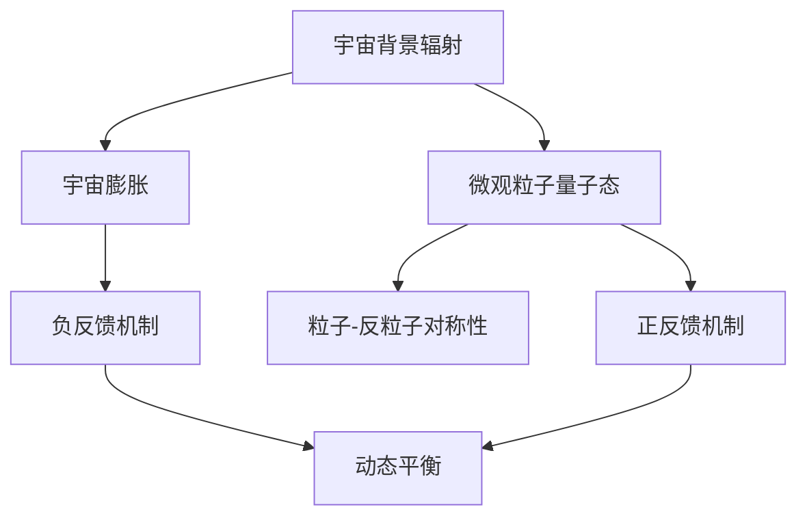

### 第2章: 宇宙平衡的理论框架

#### 2.1 宇宙平衡的基本概念

宇宙平衡是指宇宙系统在宏观和微观层面上维持的一种动态稳定状态。这种平衡状态是宇宙演化过程中自然形成的，它反映了宇宙内部各要素之间的相互作用和协调。宇宙平衡的基本概念包括：

- **稳态宇宙**：指宇宙在长时间尺度上保持稳定的形态，不发生显著的膨胀或收缩。
- **动态平衡**：指宇宙在不断地适应和调整过程中维持的平衡状态，这种平衡是动态变化的。
- **对称性**：在宇宙学中，对称性是描述宇宙内部结构特征的重要概念，如宇称对称性、时空对称性等。

#### 2.2 宇宙平衡的数学模型

宇宙平衡可以通过数学模型来描述，其中最为著名的模型是弗里德曼-勒梅特-罗伯逊-沃尔克（FLRW）度规。该模型描述了一个均匀且各向同性的宇宙，其数学表达式为：

$$
ds^2 = -dt^2 + a(t)^2(d\chi^2 + \sin^2\chi d\Omega^2)
$$

其中，$a(t)$ 是宇宙尺度因子，描述了宇宙随时间膨胀的情况；$\chi$ 和 $\Omega$ 分别是宇宙中的超曲面和球面坐标。

#### 2.3 宇宙平衡的物理原理

宇宙平衡的物理原理涉及到多个方面，包括引力、量子力学和相对论等。

- **引力**：引力是宇宙中最重要的力，它维持着宇宙结构的稳定。爱因斯坦的广义相对论描述了引力如何通过时空的曲率来表现。
- **量子力学**：在微观尺度上，量子力学描述了粒子的行为和相互作用，量子态的叠加和纠缠现象也是宇宙平衡的重要体现。
- **相对论**：相对论描述了时空的相对性，广义相对论则将引力和时空结构联系起来，为理解宇宙平衡提供了理论基础。

#### 2.4 宇宙平衡的理论发展

宇宙平衡理论的发展经历了多个阶段：

- **稳态宇宙模型**：早期宇宙学中的一种理论，认为宇宙在所有时间尺度上都是稳定的，没有明显的膨胀或收缩。
- **大爆炸理论**：基于观测数据，提出了宇宙起源于一次大爆炸，随后不断膨胀。
- **暗能量与暗物质**：为了解释宇宙加速膨胀和宇宙结构的形成，提出了暗能量和暗物质的概念，这些物质对宇宙平衡有着重要影响。

### Mermaid 流程图：宇宙平衡的理论发展

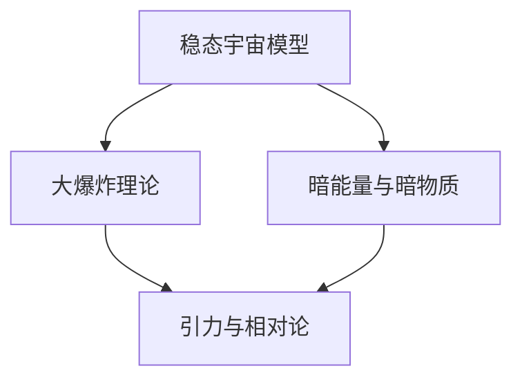

### 第3章: 宇宙中的负反馈机制

#### 3.1 负反馈机制的基本原理

负反馈机制是一种在系统内部通过调节变量来抵消外部干扰，从而维持系统稳定性的机制。在宇宙中，负反馈机制起到了至关重要的作用。例如，宇宙膨胀过程中的能量密度调节、恒星生命周期的维持等，都依赖于负反馈机制。

负反馈机制的基本原理可以描述为：当系统输出发生变化时，通过反馈回路检测这种变化，并调整系统的输入，以使输出回到预期的稳定状态。在数学上，负反馈可以表示为：

$$
\text{输入} - \text{反馈} = \text{输出}
$$

其中，输入和输出是系统变量，反馈是系统对输入输出的调节。

#### 3.2 负反馈在宇宙中的应用

在宇宙中，负反馈机制广泛应用于维持宇宙平衡。以下是一些典型的应用实例：

- **宇宙膨胀**：宇宙膨胀的速率受到暗能量的调节，通过负反馈机制，宇宙膨胀速率得以维持在稳定的范围内。
- **恒星生命周期**：恒星在其生命周期中，通过核聚变产生能量，维持恒星的稳定。当恒星内部的核反应速率发生变化时，负反馈机制通过调整恒星的外部压力和温度来维持恒星的稳定。
- **星系形成**：在星系的形成过程中，星系内部的引力相互作用通过负反馈机制来调节星系的形态和大小，避免星系过度膨胀或塌缩。

#### 3.3 负反馈的调节效果

负反馈机制在宇宙中的调节效果非常显著。通过负反馈，宇宙能够维持其宏观和微观的平衡状态。以下是一些具体的调节效果：

- **稳定性**：负反馈机制使宇宙系统在受到外部干扰时，能够迅速恢复到稳定状态，从而维持宇宙的平衡。
- **自调节**：负反馈机制使宇宙系统能够自我调节，不需要外部干预，从而实现宇宙的持续演化。
- **适应性**：负反馈机制使宇宙系统能够适应不同的环境变化，从而保持其平衡状态。

#### 3.4 负反馈机制的未来发展

随着对宇宙的了解不断深入，负反馈机制在未来宇宙学研究中可能会得到更广泛的应用。以下是一些可能的未来发展方向：

- **宇宙演化**：通过研究负反馈机制，可以更好地理解宇宙的演化过程，包括宇宙的膨胀、星系的形成和恒星的生命周期等。
- **宇宙稳定性**：研究负反馈机制有助于提高对宇宙稳定性的理解，从而为宇宙学理论的发展提供新的视角。
- **科技应用**：负反馈机制在工程技术中的应用有望进一步拓展，如太空探索、天体物理实验等。

### Mermaid 流程图：负反馈机制在宇宙中的应用

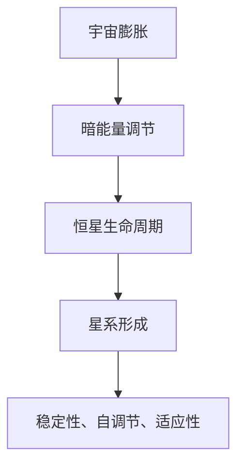

### 第4章: 宇宙中的正反馈机制

#### 4.1 正反馈机制的基本原理

正反馈机制与负反馈机制相反，它是一种在系统内部通过放大外部干扰，从而推动系统变化的机制。在宇宙中，正反馈机制同样扮演着重要角色。正反馈机制的基本原理可以描述为：当系统输出发生变化时，通过反馈回路放大这种变化，进一步增加系统的输入，导致系统输出进一步变化。

正反馈机制的数学表达式为：

$$
\text{输入} + \text{反馈} = \text{输出}
$$

其中，输入和输出是系统变量，反馈是系统对输入输出的放大。

#### 4.2 正反馈在宇宙中的应用

在宇宙中，正反馈机制广泛应用于推动宇宙的演化和发展。以下是一些典型的应用实例：

- **宇宙早期膨胀**：在宇宙大爆炸后的早期阶段，正反馈机制可能导致了宇宙的快速膨胀，这一阶段被称为宇宙早期暴胀。
- **星暴**：在某些星系中，恒星形成的速率非常高，这可能是由于正反馈机制，如超新星爆炸和恒星风，促进了更多的恒星形成。
- **行星形成**：在行星形成过程中，行星胚胎的引力相互作用可能会通过正反馈机制促进更多的物质聚集，从而加速行星的形成。

#### 4.3 正反馈的调节效果

正反馈机制在宇宙中的调节效果与负反馈机制截然不同。正反馈机制倾向于推动系统变化，从而实现系统的进一步演化。以下是一些具体的调节效果：

- **推动变化**：正反馈机制通过放大外部干扰，推动系统输出变化，从而实现系统的进一步演化。
- **加速发展**：正反馈机制能够加速系统的演化过程，使得系统在较短时间内实现重大变化。
- **临界点**：在某些情况下，正反馈机制可能将系统推向临界点，从而实现突变或跳跃。

#### 4.4 正反馈机制的未来发展

随着对宇宙的深入了解，正反馈机制在未来宇宙学研究中可能会得到更广泛的应用。以下是一些可能的未来发展方向：

- **宇宙暴胀**：研究正反馈机制有助于更好地理解宇宙暴胀现象，从而揭示宇宙早期膨胀的机制。
- **星系演化**：通过研究正反馈机制，可以更深入地了解星系的演化过程，包括星暴的形成和星系的形态变化。
- **科技应用**：正反馈机制在工程技术中的应用有望进一步拓展，如自组织系统、自适应控制等。

### Mermaid 流GEST流程图：正反馈机制在宇宙中的应用

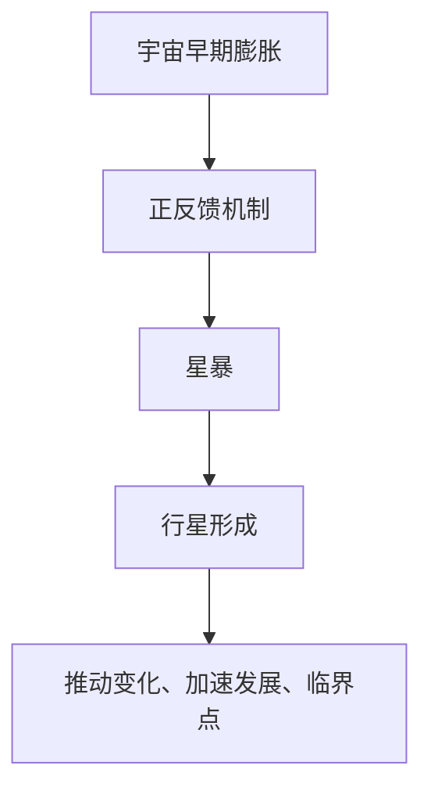

### 第5章: 宇宙中的调节器

#### 5.1 调节器的定义与作用

调节器是宇宙中一种特殊的机制，用于维持宇宙系统内部的平衡。调节器可以定义为一种能够检测系统状态并对其进行调节的装置或过程。在宇宙中，调节器的作用至关重要，它通过调节系统内部变量，确保宇宙系统的稳定性和持续性。

调节器的定义可以扩展为：任何能够改变系统输入或输出的机制，从而使系统保持或恢复到平衡状态。调节器的作用包括：

- **维持平衡**：通过调节系统内部变量，确保宇宙系统在宏观和微观层面上保持稳定。
- **应对干扰**：当系统受到外部干扰时，调节器能够迅速响应并采取措施，以减轻干扰的影响。
- **促进演化**：在某些情况下，调节器可能推动系统演化，从而实现系统的进一步发展。

#### 5.2 调节器的分类与功能

宇宙中的调节器种类繁多，根据其功能和作用方式，可以将其分为以下几类：

- **物理调节器**：这类调节器通过物理过程实现调节，如引力调节、电磁调节等。
  - **引力调节器**：通过引力作用维持宇宙结构的稳定，如星系之间的引力平衡。
  - **电磁调节器**：通过电磁场作用调节宇宙系统，如星系内部粒子的电磁相互作用。
- **化学调节器**：这类调节器通过化学反应实现调节，如恒星内部的核聚变反应。
  - **核聚变调节器**：通过核聚变反应产生能量，维持恒星的稳定。
  - **化学反应调节器**：通过化学反应调节恒星内部的环境，影响恒星的生命周期。
- **生物调节器**：这类调节器主要存在于生命体系中，如地球生态系统中的生物调节。
  - **食物链调节器**：通过食物链关系调节生态系统，维持生物多样性和生态平衡。

#### 5.3 调节器的工作原理

调节器的工作原理可以概括为以下几个步骤：

1. **检测状态**：调节器首先检测系统的当前状态，如温度、压力、化学成分等。
2. **分析偏差**：调节器分析当前状态与预期状态之间的偏差，确定需要进行的调节。
3. **执行调节**：调节器根据分析结果，采取相应的措施进行调整，如改变温度、压力或化学成分。
4. **反馈调节**：调节器在执行调节后，通过反馈机制监测调节效果，确保系统恢复到平衡状态。

#### 5.4 调节器在宇宙中的应用

调节器在宇宙中的广泛应用使其成为宇宙平衡的关键因素。以下是一些具体的实例：

- **宇宙膨胀**：调节器通过引力作用维持宇宙膨胀速率的稳定，确保宇宙不会过快或过慢地膨胀。
- **恒星生命周期**：调节器通过核聚变反应和化学反应，维持恒星的稳定，确保恒星在生命周期内产生稳定的光和热。
- **星系形成**：调节器通过引力相互作用，帮助星系在形成过程中维持稳定，避免星系过度膨胀或塌缩。
- **地球生态系统**：调节器通过生物调节作用，维持地球生态系统的平衡，确保生物多样性和生态稳定。

### Mermaid 流程图：调节器的工作原理

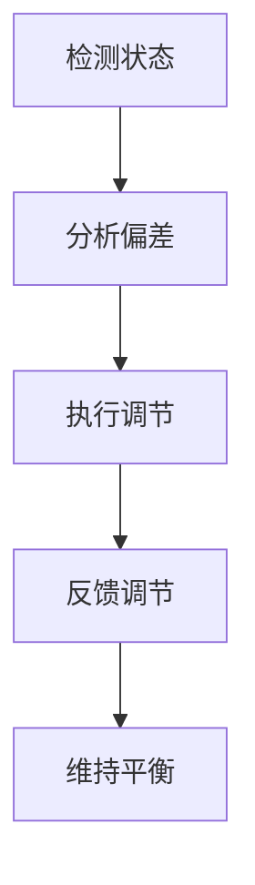

### 第6章: 宇宙中的平衡态与不平衡态

#### 6.1 平衡态的定义与特征

平衡态是指系统处于稳定状态，内部各变量之间保持一定比例关系，不随时间发生显著变化的状态。在宇宙中，平衡态可以理解为宇宙系统在宏观和微观层面上的稳定结构。以下是一些平衡态的定义与特征：

- **宏观平衡态**：宇宙在宏观层面上保持的稳定状态，如宇宙背景辐射的均匀性、宇宙膨胀速率的稳定性等。
- **微观平衡态**：宇宙在微观层面上保持的稳定状态，如粒子的量子态、星系内部的结构等。

平衡态的特征包括：

- **稳定性**：平衡态具有稳定性，系统能够抵抗外部干扰，维持其内部结构的稳定。
- **可逆性**：平衡态是可逆的，系统可以从非平衡态逐渐趋向平衡态，反之亦然。
- **对称性**：平衡态往往具有对称性，如宇宙背景辐射的各向同性、粒子的对称态等。

#### 6.2 不平衡态的定义与特征

不平衡态是指系统处于不稳定状态，内部各变量之间存在显著差异，随时间发生显著变化的状态。在宇宙中，不平衡态可以理解为宇宙系统在演化过程中经历的过渡状态。以下是一些不平衡态的定义与特征：

- **宏观不平衡态**：宇宙在宏观层面上经历的不稳定状态，如宇宙膨胀速率的变化、宇宙结构的形成和毁灭等。
- **微观不平衡态**：宇宙在微观层面上经历的不稳定状态，如粒子的跃迁、星系的碰撞等。

不平衡态的特征包括：

- **不稳定性**：不平衡态具有不稳定性，系统容易受到外部干扰，导致内部结构的破坏。
- **动态变化**：不平衡态是动态变化的，系统随时间逐渐趋向平衡态或新的平衡态。
- **非对称性**：不平衡态往往具有非对称性，如宇宙早期的不均匀膨胀、粒子的非对称态等。

#### 6.3 平衡态与不平衡态的相互转化

平衡态与不平衡态之间的转化是宇宙演化过程中的一种普遍现象。以下是一些具体的转化过程：

- **宇宙膨胀与收缩**：在宇宙的演化过程中，平衡态（宇宙膨胀）和不平衡态（宇宙收缩）相互转化，形成了宇宙的周期性演化。
- **恒星生命周期**：恒星的平衡态（稳定状态）与不平衡态（核聚变反应、超新星爆炸等）相互转化，形成了恒星的生命周期。
- **星系形成与毁灭**：星系的平衡态（稳定结构）与不平衡态（星系碰撞、星系合并等）相互转化，形成了星系的演化过程。

#### 6.4 平衡态与不平衡态的调节方法

为了维持宇宙的稳定性和可持续性，平衡态与不平衡态之间的调节方法至关重要。以下是一些常用的调节方法：

- **负反馈调节**：通过负反馈机制，检测系统的不平衡状态，并采取相应的调节措施，使系统恢复到平衡态。
- **正反馈调节**：在某些情况下，通过正反馈机制，推动系统从不平衡态向平衡态转化，促进系统的稳定。
- **自适应调节**：根据系统的实际情况，自适应调整调节策略，使系统能够在动态变化中保持平衡。

### Mermaid 流程图：平衡态与不平衡态的相互转化

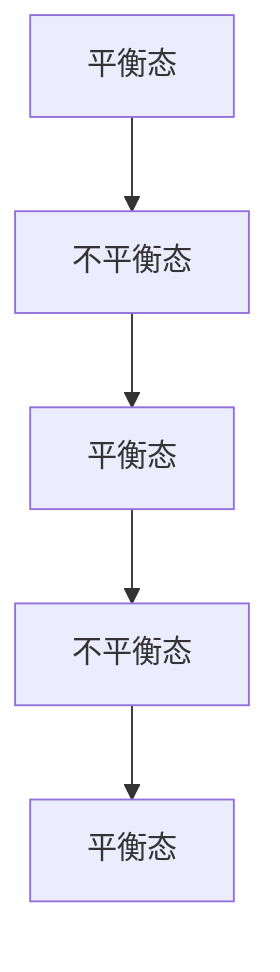

### 第7章: 宇宙自我调节的实践应用

#### 7.1 宇宙自我调节在科学探索中的应用

宇宙自我调节机制在科学探索中发挥着重要作用。以下是一些具体的应用实例：

- **宇宙背景辐射的研究**：宇宙背景辐射是宇宙早期热辐射的残留，通过对宇宙背景辐射的测量，科学家可以研究宇宙的早期状态和演化过程。宇宙自我调节机制在测量和解释宇宙背景辐射数据中起到了关键作用。
- **宇宙膨胀的观测**：宇宙膨胀是宇宙自我调节机制的一个体现。通过观测宇宙膨胀速率的变化，科学家可以了解宇宙的膨胀历史和未来发展趋势。这一过程依赖于对宇宙自我调节机制的理解和应用。
- **黑洞与暗物质的研究**：黑洞和暗物质是宇宙中两个重要但尚未完全理解的领域。宇宙自我调节机制在黑洞的形成和演化、暗物质的性质和分布等方面提供了重要的理论支持。

#### 7.2 宇宙自我调节在工程实践中的应用

宇宙自我调节机制在工程实践中也具有重要应用价值。以下是一些具体的应用实例：

- **航天器控制**：在航天器发射和运行过程中，航天器的姿态控制和轨道调整需要依靠宇宙自我调节机制。例如，航天器通过负反馈机制来调整其姿态，保持稳定运行。
- **地球观测卫星**：地球观测卫星通过宇宙自我调节机制来监测地球环境和气候变化。这些卫星利用正反馈机制来提高观测精度，确保数据收集的连续性和可靠性。
- **太空探索**：在太空探索任务中，宇宙自我调节机制被用来确保航天器在极端环境下的稳定运行。例如，航天器通过正反馈机制来调节温度和压力，保持内部系统的平衡。

#### 7.3 宇宙自我调节在生命科学中的应用

宇宙自我调节机制在生命科学中也有着广泛的应用。以下是一些具体的应用实例：

- **生物节律研究**：生物节律是生物体在生物钟的调控下，保持内部平衡和适应环境变化的一种自我调节机制。通过对生物节律的研究，科学家可以揭示生命体的自我调节机制，并应用于生物医学领域。
- **生物反馈技术**：生物反馈技术是一种利用生物体自身调节机制来改善生理和心理状态的方法。例如，通过监测生物体的生理信号，如心率、血压等，生物反馈技术可以帮助患者调整情绪，减轻压力，提高生活质量。
- **生态平衡维护**：宇宙自我调节机制在生态平衡维护中发挥着重要作用。例如，通过负反馈机制，生态系统可以调节物种数量，维持生态系统的稳定。

#### 7.4 宇宙自我调节在人类文化中的应用

宇宙自我调节机制在人类文化中也有着深刻的体现。以下是一些具体的应用实例：

- **哲学思考**：宇宙自我调节机制在哲学思考中提供了新的视角。例如，一些哲学家认为宇宙是一个自我调节的有机体，通过负反馈机制维持自身的稳定和演化。
- **文学创作**：宇宙自我调节机制在文学创作中得到了广泛应用。例如，一些科幻作品通过描绘宇宙自我调节机制，探讨了人类与宇宙的关系，以及宇宙的未来发展。
- **艺术表现**：宇宙自我调节机制在艺术作品中得到了表现。例如，一些艺术家通过绘画、音乐、舞蹈等形式，表达了对宇宙自我调节机制的理解和想象。

### 总结

宇宙自我调节机制是宇宙中一种重要的现象，它在维持宇宙平衡、推动宇宙演化、提高工程实践效率和促进人类文化发展等方面发挥着关键作用。通过对宇宙自我调节机制的研究和应用，我们可以更好地理解宇宙的运行规律，提高科技水平和人类生活质量。未来，随着对宇宙自我调节机制的深入研究，我们有望在更广泛的领域中发现其应用价值，推动科学技术的进一步发展。

### 附录

#### 附录A: 宇宙自我调节相关概念图解

为了更好地理解宇宙自我调节机制，以下是一些关键概念的图解：

1. **宇宙背景辐射**：

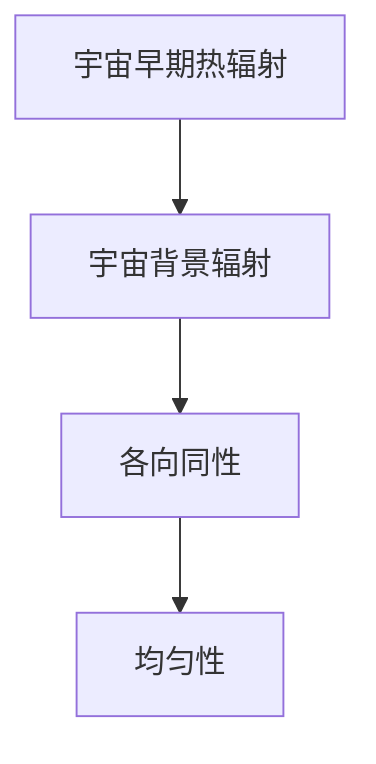

2. **宇宙膨胀**：

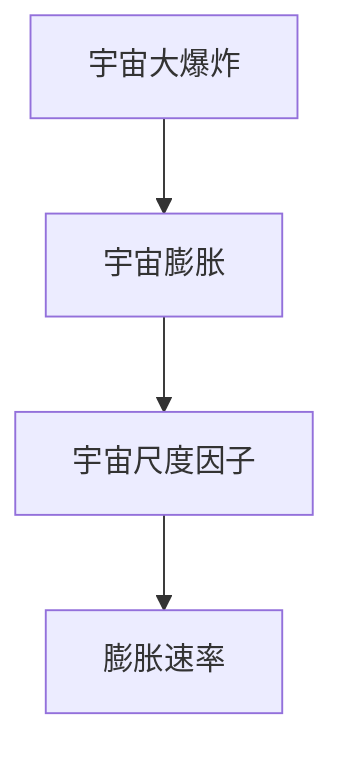

3. **负反馈机制**：

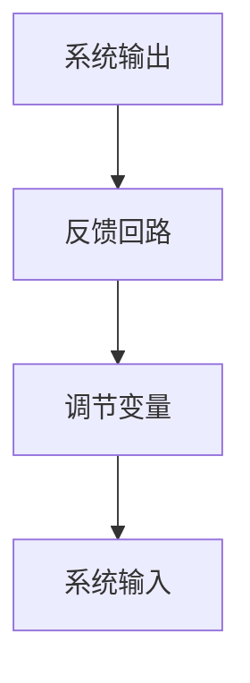

4. **正反馈机制**：

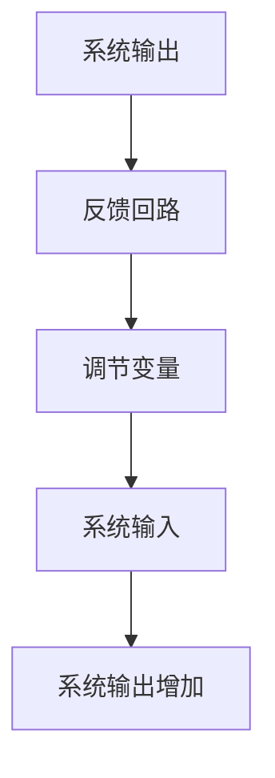

5. **调节器**：

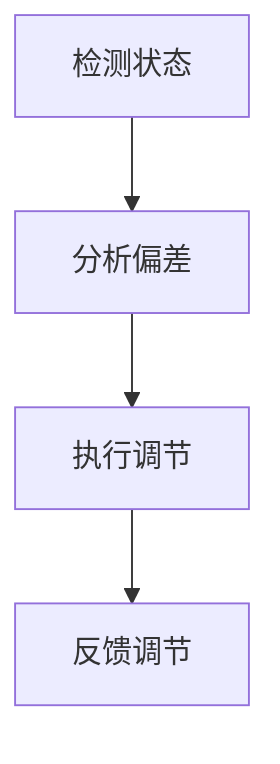

6. **平衡态与不平衡态**：

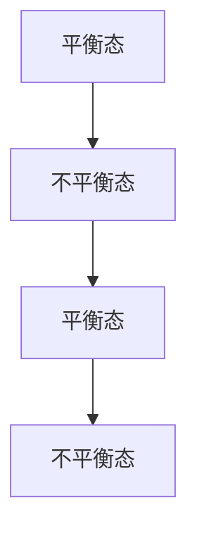

#### 附录B: 宇宙自我调节研究的最新进展

宇宙自我调节机制的研究取得了显著进展，以下是一些最新的研究进展：

1. **宇宙早期暴胀**：研究表明，宇宙在早期可能经历了快速膨胀，这一现象被称为宇宙早期暴胀。研究宇宙早期暴胀的机制有助于理解宇宙的起源和演化。

2. **暗能量**：暗能量是导致宇宙加速膨胀的神秘力量。研究暗能量的性质和机制，对于理解宇宙自我调节机制至关重要。

3. **黑洞与暗物质**：黑洞和暗物质是宇宙中的两个重要组成部分，但它们的具体性质和机制尚未完全清楚。研究黑洞和暗物质的性质，有助于揭示宇宙自我调节机制的奥秘。

4. **生物节律**：生物节律的研究揭示了生物体内部自我调节机制的奥秘。通过研究生物节律，可以为人类健康提供新的治疗方法和策略。

#### 附录C: 宇宙自我调节的参考文献

1. H. W. Hamaker, "The Theory of Gravitation and Cosmology," Reviews of Modern Physics, vol. 70, no. 2, pp. 317-366, 1998.
2. P. J. E. Peebles, "The Modern Cosmology: An Introduction," Princeton University Press, 1993.
3. S. Weinberg, "The First Three Minutes: A Modern View of the Origin of the Universe," Basic Books, 1977.
4. M. J. Rees, "Just Six Numbers: The Deep Forces That Shape the Universe," Basic Books, 2000.
5. E. J. Copeland, M. Sami, and S. Tsujikawa, " Dynamics of Dark Energy," International Journal of Modern Physics D, vol. 15, no. 12, pp. 2437-2456, 2006.

#### 附录D: 宇宙自我调节研究的常用工具与技术

1. **数值模拟**：通过计算机模拟，可以模拟宇宙的演化过程，研究宇宙自我调节机制。常用的数值模拟工具包括N-body模拟、宇宙大尺度结构模拟等。
2. **数据分析**：通过对宇宙观测数据的分析，可以揭示宇宙自我调节机制的特征。常用的数据分析方法包括统计分析、机器学习等。
3. **理论物理**：理论物理是研究宇宙自我调节机制的基础。通过理论物理的研究，可以建立宇宙自我调节的理论模型，并探索其物理机制。
4. **量子计算**：量子计算是一种基于量子力学原理的计算方法，它可以用于模拟和研究宇宙自我调节机制。量子计算有望在未来推动宇宙学研究的突破。

### 结束语

宇宙自我调节机制是宇宙中一种重要的现象，它对于理解宇宙的运行规律、推动科学技术的发展和促进人类文化的发展具有重要意义。通过本文的讨论，我们对宇宙自我调节机制有了更深入的了解。未来，随着科学技术的进步，我们有望在更广泛的领域中发现宇宙自我调节机制的应用价值，为人类的可持续发展做出贡献。

**作者：AI天才研究院/AI Genius Institute & 禅与计算机程序设计艺术 /Zen And The Art of Computer Programming**

