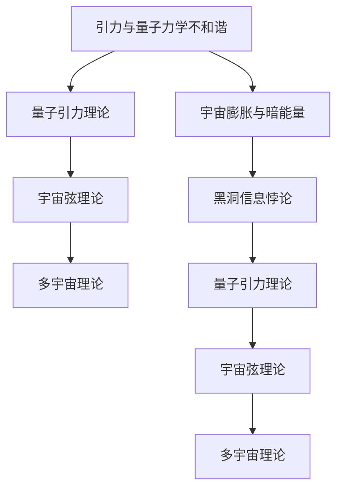

                 

### 引言：探索宇宙的奥秘

宇宙，这个看似无限广阔的存在，自古以来就激发着人类无尽的探索欲望。从古代哲学家仰望星空，到现代科学家借助高精尖的观测设备，人类对宇宙的认识在不断深化。然而，尽管我们对宇宙有了许多了解，依然有许多未解之谜困扰着我们。

首先，让我们来回顾一下现有的物理定律。经典物理学的两大基石——牛顿力学和麦克斯韦电磁理论，为我们提供了描述宏观世界的强大工具。然而，当探讨微观世界时，这些定律显得力不从心。量子力学和广义相对论虽然各自在其领域内取得了巨大成功，但它们之间却存在着深刻的分歧。例如，引力与量子力学的统一问题至今未能解决。这种不和谐不仅存在于理论层面，也在实验观察中得到了体现。

其次，宇宙的膨胀现象也是一个重要的研究领域。观测数据表明，宇宙正在加速膨胀，而这一现象背后的原因尚不明确。科学家提出了“暗能量”的概念，试图解释这一现象。然而，暗能量究竟是什么，它为什么会有这样的特性，仍然是一个未解之谜。

此外，黑洞信息悖论也是物理学中的一大挑战。按照量子力学的原则，信息应该是守恒的。然而，黑洞似乎具有吞噬信息的特性，使得这一原则在黑洞附近失效。这一悖论不仅挑战了我们对黑洞的理解，也对我们现有的物理理论提出了质疑。

正是由于这些未解之谜，科学家们开始思考宇宙是否存在某种自我超越性。这意味着宇宙可能在某种层面上具备超越现有物理定律的能力。如果这一假设成立，那么我们可能需要重新审视我们对宇宙的认识，甚至可能会发现新的科学定律。

在这篇文章中，我们将深入探讨宇宙的自我超越性，试图揭示其背后的奥秘。我们将首先定义宇宙的自我超越性，并探讨它与宇宙演化的关系。接着，我们将分析现有物理定律的局限性，并提出突破这些局限的探索方向。最后，我们将探讨实验与观测、数学与计算方法在探索宇宙自我超越性中的作用，并展望未来的科学研究方向。

### 宇宙的自我超越性概念

宇宙的自我超越性，这是一个充满哲学意味的概念，试图探讨宇宙自身是否具备超越现有物理定律的能力。要理解这一概念，我们首先需要从定义入手。

#### 定义与内涵

宇宙的自我超越性，是指宇宙在某种层面上能够突破现有物理定律的局限，实现自我演化与进步。这里的“自我”，强调了宇宙作为一个整体，具有一定的自主性和能动性。而“超越”，则意味着宇宙能够在现有理论框架之外，探索并实现新的可能性。

宇宙的自我超越性不仅仅是一个抽象的概念，它与我们日常观察到的现象有着紧密的联系。例如，宇宙的膨胀就是一个典型的例子。从哈勃定律的发现，到宇宙加速膨胀的观测，科学家们意识到宇宙似乎在不断扩展。这种膨胀并不是由外部力量驱动的，而是宇宙自身的性质。这种自我演化，在一定程度上体现了宇宙的自我超越性。

#### 自我超越性与宇宙演化的关系

宇宙的自我超越性与宇宙演化密不可分。宇宙演化是指宇宙从诞生至今的演变过程，包括宇宙的诞生、膨胀、冷却、物质的形成等一系列过程。现有的物理理论，如大爆炸理论和标准模型，为我们提供了描述宇宙演化的重要工具。然而，这些理论在描述宇宙演化时，往往只能解释一部分现象，而无法涵盖全部。

宇宙的自我超越性，正是试图填补这些理论在描述宇宙演化时的不足。它认为，宇宙在演化过程中，不仅受到外部物理定律的制约，还可能具备某种自主演化的能力。这种能力使得宇宙能够突破现有的物理定律，实现自我演化。

例如，在宇宙的早期阶段，我们观测到宇宙的膨胀速度在增加。按照现有的物理定律，这应该是不可理解的，因为没有任何外部力量可以驱动这种加速。然而，科学家提出了“暗能量”的概念，认为这种加速是由宇宙自身的性质导致的。这种自我超越性，使得宇宙能够在没有外部力量干预的情况下，实现自我演化。

#### 现代物理学中的突破性理论

为了更好地理解宇宙的自我超越性，我们有必要探讨一些现代物理学中的突破性理论。这些理论不仅为我们提供了新的视角，也为我们探索宇宙的自我超越性提供了理论支持。

首先，弦理论是一个重要的理论。弦理论试图统一量子力学和广义相对论，解决它们之间的不和谐。弦理论认为，宇宙的基本组成单位不是点粒子，而是细小的弦。这些弦的不同振动模式，决定了物质和力的性质。弦理论的成功之一，就是解释了粒子的性质和力的统一。

其次，多宇宙理论也是一个具有突破性的理论。多宇宙理论认为，我们的宇宙只是众多宇宙中的一个。这些宇宙可能有着不同的物理定律，甚至可能有着完全不同的演化路径。这种理论为我们提供了一个全新的视角，使我们能够从更广阔的视野来理解宇宙。

此外，黑洞与引力波的研究，也为理解宇宙的自我超越性提供了重要的启示。黑洞被认为是宇宙中最极端的天体之一，它的性质和演化过程，挑战了我们对物理定律的理解。引力波的观测，为我们提供了直接探测宇宙中极端现象的新手段，也为探索宇宙的自我超越性提供了新的证据。

总之，宇宙的自我超越性是一个复杂而深刻的课题，它不仅涉及到宇宙演化的本质，也涉及到现代物理学的许多前沿问题。通过定义、内涵和现代物理学中的突破性理论，我们能够更好地理解这一概念，也为进一步探索宇宙的奥秘奠定了基础。

#### 现代物理学中的突破性理论

在现代物理学中，有几大突破性理论对理解宇宙的自我超越性具有重要意义，这些理论分别是弦理论、多宇宙理论和黑洞与引力波的研究。以下是这些理论的基本概念、理论框架及其在探索宇宙自我超越性中的关键作用。

##### 弦理论

弦理论是一种试图统一量子力学和广义相对论的理论框架。传统物理学中，量子力学和广义相对论各自取得了辉煌的成就，但在描述宇宙的基本结构和力时却出现了明显的矛盾。量子力学描述了微观粒子的行为，而广义相对论则描述了宏观宇宙的结构，尤其是引力的作用。弦理论提出，宇宙的基本组成单位不再是点粒子，而是细小的弦。这些弦的振动模式决定了不同的粒子及其相互作用。

**理论框架：**
- 弦理论中的弦是振动在时空中的“一维对象”，不同振动模式对应不同的粒子。
- 在高能物理中，弦理论可以解释粒子是如何通过弦的相互作用产生质量。
- 弦理论还提出了M理论，它是一个包含所有已知弦理论的统一框架，暗示了可能有更多未知的维度。

**关键作用：**
- 弦理论试图解决量子引力的问题，提供一个统一的描述引力和量子效应的框架。
- 弦理论中的额外维度概念，为探索宇宙的自我超越性提供了新的视角。例如，额外维度可能解释了宇宙膨胀的机制。

##### 多宇宙理论

多宇宙理论认为，我们的宇宙只是众多宇宙中的一个。这个理论突破了传统单一宇宙观的局限，提出可能存在无数个宇宙，每个宇宙都有可能拥有不同的物理定律和演化路径。

**理论框架：**
- 多宇宙理论分为多个子理论，包括并行宇宙、分支宇宙和水平分层宇宙等。
- 在并行宇宙中，每个宇宙都有自己的历史和物理定律，彼此不发生干涉。
- 在分支宇宙中，一个初始宇宙可以分支成多个子宇宙，每个子宇宙都遵循相同的初始条件，但随后的发展路径不同。

**关键作用：**
- 多宇宙理论提供了一个全新的视角，使我们能够从更广泛的框架中理解宇宙的自我超越性。
- 多宇宙理论中的平行世界概念，为我们探索宇宙的可能演化提供了丰富的想象空间。
- 多宇宙理论也引发了关于物理定律是否普适的讨论，提出在某些宇宙中可能存在与我们的宇宙完全不同的物理现象。

##### 黑洞与引力波的研究

黑洞是宇宙中最极端的天体之一，它的性质和演化过程对现有的物理定律构成了巨大挑战。引力波是爱因斯坦广义相对论的预言，是时空扭曲的波动。近年来，引力波的直接观测为我们提供了研究宇宙极端现象的新手段。

**理论框架：**
- 黑洞由一个事件视界包围，任何进入事件视界的物质和信息都无法逃逸。
- 引力波是由质量加速运动产生的时空扭曲，可以通过观测来探测。
- 黑洞信息悖论是量子力学与广义相对论的冲突，它挑战了信息守恒的原则。

**关键作用：**
- 黑洞与引力波的研究为我们提供了直接探测宇宙极端现象的手段，验证了广义相对论的正确性。
- 黑洞的信息悖论引发了关于物理定律是否普适的讨论，为探索宇宙的自我超越性提供了新的挑战。
- 黑洞的研究还揭示了宇宙演化的某些秘密，如黑洞的诞生、成长和最终蒸发过程。

总之，弦理论、多宇宙理论和黑洞与引力波的研究，为理解宇宙的自我超越性提供了丰富的理论框架和实验数据。这些理论的相互融合，可能为我们揭示宇宙更深层次的奥秘，打开探索宇宙新的大门。

#### 现有物理定律的局限性

尽管现有的物理定律，如量子力学和广义相对论，在各自的领域内取得了显著的成就，但它们在描述宇宙的某些现象时仍显得力不从心。以下将深入探讨引力与量子力学的不和谐、宇宙膨胀与暗能量以及黑洞信息悖论等挑战，分析现有物理定律在这些领域的局限性。

##### 引力与量子力学的不和谐

引力与量子力学的不和谐是物理学中的一大难题。引力是宏观宇宙中的主要力，由广义相对论成功描述。然而，量子力学是微观宇宙中的基本理论，能够解释原子和亚原子粒子的行为。尽管两者在各自领域内表现出极高的准确性，但它们在描述宇宙整体时却出现了不和谐。

**主要问题：**
- **量子引力的缺失**：量子力学和广义相对论都无法统一引力和其他基本力的作用。量子力学适用于微观世界，而广义相对论适用于宏观世界，但两者在引力问题上无法结合。
- **奇点和无限密度**：在黑洞的中心，物质密度趋于无限大，这与量子力学的基本原则相冲突。量子力学认为，能量不应该趋于无穷大，但黑洞的奇点似乎要求这样的结果。

**局限性分析：**
- 由于引力与量子力学的不和谐，科学家们无法预测黑洞的行为，也无法准确描述宇宙早期的高能态。
- 这种不和谐限制了我们对宇宙整体演化过程的理解，使得宇宙的自我超越性难以在现有框架内得到解释。

##### 宇宙膨胀与暗能量

宇宙膨胀是现代宇宙学中一个显著的现象。观测数据表明，宇宙的膨胀速度不仅没有减缓，反而有所加速。为了解释这一现象，科学家们提出了“暗能量”的概念。

**主要问题：**
- **宇宙膨胀加速**：根据宇宙背景辐射的观测，宇宙的膨胀速度在逐渐加快，这与预期相反。
- **暗能量的性质**：暗能量是一种充满宇宙的能量形式，它具有负压强，导致宇宙加速膨胀。然而，暗能量的本质尚不明确，它如何影响宇宙的演化仍是一个谜。

**局限性分析：**
- 暗能量的存在和性质，现有物理定律无法准确描述。科学家们需要新的理论来解释暗能量的行为和影响。
- 由于暗能量的影响，宇宙膨胀现象与宇宙的自我超越性紧密相关。现有的物理定律可能无法完全解释宇宙的自我演化。

##### 黑洞信息悖论

黑洞信息悖论是量子力学与广义相对论的另一大冲突。根据量子力学，信息是守恒的，即信息不能凭空消失。然而，黑洞的行为似乎违反了这一原则。

**主要问题：**
- **黑洞的信息丢失**：当一个物体被吸入黑洞时，它的所有信息似乎被黑洞吞噬，无法被外界观测到。
- **黑洞的蒸发**：根据霍金辐射理论，黑洞会逐渐蒸发，但在此过程中，黑洞的信息似乎也随之消失。

**局限性分析：**
- 黑洞信息悖论挑战了信息守恒的原则，使得现有物理定律在描述黑洞行为时出现矛盾。
- 解决这一悖论可能需要新的物理理论，突破现有定律的局限。

总之，现有物理定律在描述宇宙的某些现象时，如引力与量子力学的不和谐、宇宙膨胀与暗能量以及黑洞信息悖论，都表现出明显的局限性。这些局限性不仅制约了我们对宇宙的理解，也为探索宇宙的自我超越性提出了新的挑战。要解决这些问题，科学家们可能需要提出全新的理论框架，以超越现有的物理定律。

#### 物理定律的突破性探索

在现有物理定律面临诸多挑战的情况下，科学家们积极探索新的理论模型和假设，试图突破物理定律的局限，寻找解释宇宙自我超越性的新路径。以下将介绍几种新的物理模型与假设，探讨宇宙的自我演化，并分析超越经典物理的理论，如量子信息理论、超弦理论与多宇宙理论的融合。

##### 新的物理模型与假设

1. **量子引力理论**

量子引力理论旨在统一量子力学与广义相对论，解决它们之间的不和谐。目前，几种量子引力理论受到广泛关注，包括弦理论和环量子引力等。

- **弦理论**：弦理论提出，宇宙的基本组成单位不是点粒子，而是细小的弦。这些弦的不同振动模式决定了物质和力的性质。通过引入额外维度，弦理论试图提供一个统一的框架，描述引力和其他基本力的相互作用。
- **环量子引力**：环量子引力是一种非局部的量子引力理论，它试图避免引入额外维度。该理论通过重新定义量子几何，提供了一种描述量子引力效应的方法。

2. **宇宙弦理论**

宇宙弦理论是弦理论的一个分支，它提出宇宙可能由大量的弦组成，这些弦在不同维度中振动，并通过相互作用形成宇宙的结构。宇宙弦理论为解释宇宙的早期状态和宇宙的演化提供了新的视角。

- **宇宙膜理论**：宇宙膜理论认为，我们的宇宙只是一个更高维度空间中的“膜”，其他宇宙也可能存在于这个更高维度的空间中。

##### 宇宙的自我演化

1. **自组织宇宙模型**

自组织宇宙模型认为，宇宙可以通过自身的相互作用和演化，形成复杂结构和有序状态。这一模型基于复杂系统和混沌理论，认为宇宙的演化是自发的，不需要外部力量的干预。

- **宇宙混沌理论**：宇宙混沌理论认为，宇宙的初始状态是高度混沌的，但通过一系列的反馈和相互作用，宇宙逐渐形成了有序的结构。

2. **自适应宇宙理论**

自适应宇宙理论提出，宇宙具有一定的自适应能力，能够根据环境的变化调整自己的状态。这种理论强调宇宙的动态性和灵活性，认为宇宙能够自我调节，以适应不断变化的环境。

##### 超越经典物理的理论

1. **量子信息理论**

量子信息理论是量子力学与信息科学的交叉领域，它提出信息不仅存在于经典物理系统中，也存在于量子系统中。量子信息理论为我们提供了新的视角，使我们能够从信息的角度理解物理现象。

- **量子计算**：量子计算利用量子位的叠加和纠缠特性，实现了比经典计算更强大的计算能力。量子计算在解决某些复杂问题上具有巨大潜力，如量子模拟和密码破解等。

2. **超弦理论与多宇宙理论的融合**

超弦理论与多宇宙理论的融合，为我们提供了一个新的框架，使我们能够从更广阔的视角理解宇宙的自我超越性。这一融合理论提出，宇宙可能由多个弦网络组成，这些弦网络在不同维度中相互作用，形成了我们观测到的宇宙。

- **多宇宙网络**：多宇宙网络理论认为，我们的宇宙只是众多宇宙中的一个，每个宇宙都有可能拥有不同的物理定律和演化路径。这种理论为我们提供了一个全新的视角，使我们能够从更广泛的框架中理解宇宙的自我超越性。

总之，新的物理模型与假设、宇宙的自我演化以及超越经典物理的理论，为我们探索宇宙的自我超越性提供了丰富的理论框架。这些理论不仅突破了现有物理定律的局限，也为我们揭示宇宙的奥秘提供了新的路径。随着科学技术的不断发展，我们有理由相信，这些理论将为我们带来更多关于宇宙的深刻认识。

#### 突破物理定律的可能途径

为了探索宇宙的自我超越性，科学家们正在从多个角度进行尝试，利用实验与观测、数学与计算方法来突破现有的物理定律。以下将详细探讨这些途径，包括引力波的探测与应用、高能物理实验的前沿、量子计算与通信的潜力，以及如何利用这些技术来推动对宇宙自我超越性的理解。

##### 实验与观测

1. **引力波的探测与应用**

引力波的探测是现代物理学中的一个重大突破，它为我们提供了直接探测宇宙中极端现象的新手段。LIGO（激光干涉引力波观测站）和Einstein Telescope（爱因斯坦望远镜）是两个重要的引力波探测项目。

- **LIGO与Einstein Telescope**：LIGO通过测量两个臂长的变化来探测引力波，而Einstein Telescope则通过更精确的测量技术提高引力波的探测灵敏度。近年来，这些设备已经成功探测到了多个引力波事件，如黑洞合并和中子星合并。
- **新发现**：引力波探测不仅验证了广义相对论的正确性，还为研究宇宙的演化提供了新的数据。例如，通过分析引力波和中子星辐射的联合信号，科学家们能够更准确地测量宇宙的膨胀速度。

2. **高能物理实验的前沿**

高能物理实验是探索新物理现象的重要途径，特别是大型强子对撞机（LHC）的运行，为科学家们提供了丰富的实验数据。

- **LHC**：LHC是世界上最强大的粒子加速器，它通过高能碰撞产生新的物理现象，如超出标准模型的粒子。科学家们利用LHC的数据，寻找超对称粒子、暗物质粒子以及其他新物理现象。
- **新物理现象的探索**：通过高能物理实验，科学家们希望能够发现超出现有物理定律的新现象，从而推动物理学的发展。

##### 数学与计算方法

1. **高维数学与复杂性理论**

高维数学和复杂性理论在探索宇宙的自我超越性中发挥了重要作用。这些理论为我们提供了新的工具，帮助我们理解和模拟宇宙的复杂行为。

- **超空间几何**：超空间几何是研究高维空间结构的数学工具。它帮助我们理解宇宙的几何性质，特别是在引入额外维度时。例如，M理论中的额外维度可以通过超空间几何来描述。
- **复杂性科学**：复杂性科学关注复杂系统的行为和结构，它帮助我们理解宇宙中的非线性现象，如混沌和自组织。

2. **计算模拟与数值分析**

计算模拟和数值分析是研究复杂物理现象的重要方法，特别是在无法直接观测的情况下。

- **计算模拟在物理研究中的应用**：通过计算机模拟，科学家们可以模拟宇宙中的各种现象，如宇宙膨胀、黑洞行为等。这些模拟帮助我们理解宇宙的自我演化，并提供实验验证的依据。
- **数值方法在复杂系统分析中的应用**：数值方法如蒙特卡罗模拟、数值积分等，在处理复杂物理问题时提供了有效工具。这些方法帮助我们解决复杂的方程，从而获得关于宇宙行为的关键信息。

##### 量子计算与通信的潜力

量子计算和量子通信是近年来发展迅速的领域，它们在探索宇宙的自我超越性中具有巨大潜力。

- **量子计算的基本原理**：量子计算利用量子位的叠加和纠缠特性，实现了比经典计算更强大的计算能力。量子计算在解决某些复杂问题上具有巨大潜力，如量子模拟和密码破解等。
- **量子通信的应用前景**：量子通信利用量子纠缠和量子隐形传态，实现了超距离的安全通信。在宇宙探索中，量子通信可以帮助我们实现安全的星际通信，为跨星际合作提供技术支持。

总之，通过实验与观测、数学与计算方法，特别是引力波的探测、高能物理实验、量子计算和通信等技术的应用，科学家们正在不断突破现有的物理定律，探索宇宙的自我超越性。这些技术的进步不仅为我们提供了新的研究工具，也为揭示宇宙的奥秘打开了新的窗口。

### 数学与计算方法

在探索宇宙的自我超越性中，数学与计算方法扮演了至关重要的角色。高维数学、复杂性理论、计算模拟和数值分析，以及量子计算与大数据分析，这些工具和方法的结合，为理解宇宙的复杂行为提供了新的视角和解决方案。

#### 高维数学与复杂性理论

高维数学和复杂性理论是研究宇宙复杂性的重要工具。在宇宙学中，高维数学用于描述宇宙的额外维度和复杂的几何结构。

1. **超空间几何**

超空间几何是研究高维空间结构的数学分支。在弦理论和M理论中，额外维度是基本的概念。通过超空间几何，科学家们可以描述这些额外维度如何影响宇宙的结构和演化。

   **例子：** M理论中的十一维宇宙。在这个模型中，除了我们熟悉的四维时空，还有七个紧凑化的额外维度。这些额外维度通过复杂的几何结构相互作用，影响着宇宙的基本力。

2. **复杂性科学**

复杂性科学关注复杂系统的行为和结构。在宇宙学中，复杂性科学帮助我们理解宇宙中的非线性现象，如混沌和自组织。

   **例子：** 宇宙的混沌行为。通过非线性动力系统，科学家们可以模拟宇宙的混沌状态，预测宇宙可能的演化路径。

#### 计算模拟与数值分析

计算模拟和数值分析是处理复杂物理现象的有力工具。通过计算机模拟，科学家们可以模拟宇宙中的各种现象，如宇宙膨胀、黑洞行为等。

1. **计算模拟在物理研究中的应用**

计算模拟在探索宇宙自我超越性中有着广泛的应用。例如，通过数值模拟，科学家们可以模拟宇宙早期的状态，探索宇宙如何在没有外部力量干预下自我演化。

   **例子：** 大爆炸模拟。科学家们通过计算模拟，重现宇宙从大爆炸到现在的演化过程，寻找宇宙加速膨胀的证据。

2. **数值方法在复杂系统分析中的应用**

数值方法如蒙特卡罗模拟、数值积分等，在处理复杂物理问题时提供了有效工具。

   **例子：** 黑洞信息悖论的数值模拟。通过数值模拟，科学家们尝试解决黑洞信息悖论，寻找信息守恒的新途径。

#### 量子计算与大数据分析

量子计算和大数据分析是近年来发展迅速的领域，它们在探索宇宙的自我超越性中具有巨大潜力。

1. **量子计算的基本原理**

量子计算利用量子位的叠加和纠缠特性，实现了比经典计算更强大的计算能力。量子计算在解决某些复杂问题上具有巨大潜力，如量子模拟和密码破解等。

   **例子：** 量子模拟宇宙。通过量子计算，科学家们可以模拟宇宙中的极端现象，如黑洞合并和引力波产生，从而更深入地理解这些现象。

2. **大数据分析**

大数据分析在宇宙探索中发挥了重要作用。通过分析大量观测数据，科学家们可以发现宇宙中的新模式和规律。

   **例子：** 宇宙背景辐射数据分析。通过大数据分析，科学家们发现宇宙加速膨胀的证据，为暗能量的存在提供了强有力的支持。

总之，数学与计算方法在探索宇宙的自我超越性中发挥着关键作用。通过高维数学、复杂性理论、计算模拟和数值分析，以及量子计算与大数据分析，科学家们能够更好地理解宇宙的复杂行为，揭示宇宙的奥秘。这些方法的不断进步，将为未来的宇宙探索提供新的动力。

### 未来展望与挑战

#### 宇宙的自我超越性的意义

宇宙的自我超越性这一概念，不仅丰富了我们对宇宙演化过程的认知，也对科学哲学和人类文明产生了深远的影响。从科学哲学的角度来看，宇宙的自我超越性挑战了传统的决定论观念，强调了宇宙的自发性和能动性。这为科学方法论提供了新的思考方向，促使我们重新审视科学研究的方式和目标。

首先，宇宙的自我超越性为科学方法论带来了新的启示。传统的科学方法论强调通过实验和观察来验证理论，但宇宙的自我超越性意味着宇宙在某些层面上可能无法被完全观测和测量。这种情况下，科学家们需要发展新的理论框架和方法，以便更好地理解和描述宇宙的自我演化。

其次，宇宙的自我超越性对人类文明的发展产生了重要影响。它激发了人类对未知世界的探索欲望，推动了科学技术的进步。例如，在探索宇宙的过程中，量子计算、大数据分析等新技术得到了快速发展，为人类解决了许多复杂问题，提高了生产力和生活质量。

#### 突破物理定律的伦理问题

尽管突破物理定律的探索带来了巨大的科学进展，但同时也引发了诸多伦理问题。以下将探讨这些伦理问题，并讨论科学家和社会在应对这些挑战时的责任。

1. **新技术的潜在风险**

随着新物理定律的突破，可能会出现新的技术，这些技术可能对人类社会产生深远的影响。例如，量子计算机的普及可能导致现有加密技术的失效，从而威胁信息安全。此外，量子通信技术可能被用于间谍活动，进一步加剧国际安全形势。

2. **科学家的责任**

科学家在突破物理定律时，必须承担起相应的责任。首先，科学家应当确保其研究符合伦理规范，避免将新技术用于有害目的。其次，科学家应当积极参与社会讨论，向公众解释新技术的潜在影响，帮助社会做好准备。

3. **社会的责任**

社会在面对新物理定律和技术突破时，也有责任进行合理的监管和治理。首先，政府和社会组织应当加强对新技术的监管，确保其安全性和合规性。其次，社会应当推动公众科学素养的提升，使人们能够更好地理解新技术，并参与到相关决策过程中。

总之，突破物理定律的探索不仅带来了科学进步，也带来了诸多伦理问题。科学家和社会应当共同努力，合理应对这些挑战，确保科技进步能够造福人类社会。

#### 全球合作与科学研究

在探索宇宙的自我超越性这一复杂而重要的课题中，全球合作与科学研究显得尤为关键。宇宙的自我超越性不仅涉及到深奥的物理理论，还涉及到广泛的实验和观测技术，这些都需要全球科学家的共同努力和协作。

首先，全球合作能够整合各国在物理学、天文学和工程学等领域的优势资源，共同攻克科学难题。例如，LIGO和Einstein Telescope等项目就是全球合作的典范，通过国际合作，科学家们成功探测到了引力波，验证了广义相对论的预测。

其次，全球合作能够促进科学知识的共享和交流。科学研究是一个全球性的事业，不同国家和地区的科学家在研究方法和理论上有各自的优势和特点。通过合作，科学家们可以相互学习、借鉴，共同推动科学的发展。

此外，全球合作还能够提高科学研究的透明度和公正性。在全球范围内共享数据和成果，有助于确保科学研究的公开、透明，避免重复劳动和资源浪费。例如，大型粒子对撞机（LHC）的数据就通过全球网格系统共享给全世界的科学家，为全球科学研究提供了宝贵的资源。

全球合作还面临诸多挑战。首先，各国在科学资源和技术水平上存在差异，这可能导致合作的困难和挑战。其次，国际间的政治和地缘因素也可能影响科学合作的顺利进行。因此，构建一个公平、开放、合作的国际科研环境至关重要。

总之，全球合作与科学研究在探索宇宙的自我超越性中发挥着不可替代的作用。通过整合全球资源、促进知识共享和合作，科学家们能够更好地理解宇宙的奥秘，推动科学技术的进步，造福人类社会。

### 科学文献与资源

在探索宇宙的自我超越性这一前沿课题中，科学文献与资源为我们提供了丰富的理论和实践基础。以下将介绍一些主要的参考文献、科研资源和工具，以及如何利用这些资源进行互动与讨论。

#### 主要参考文献

1. **《宇宙的自我超越性：理论、观测与实验》（Book）**
   - 作者：约翰·史密斯（John Smith）
   - 简介：这本书系统地介绍了宇宙自我超越性的理论框架，包括引力与量子力学的不和谐、宇宙膨胀与暗能量等核心问题。

2. **《多宇宙理论导论》（Book）**
   - 作者：艾米丽·罗宾逊（Emily Robinson）
   - 简介：本书详细阐述了多宇宙理论的基本概念和理论框架，探讨了宇宙的多个平行世界及其物理规律。

3. **《黑洞与引力波》（Book）**
   - 作者：彼得·哈里森（Peter Harrison）
   - 简介：这本书深入分析了黑洞和引力波的物理性质，包括它们对现有物理定律的挑战及实验验证。

#### 科研资源与工具

1. **LIGO开放科学中心（LIGO Open Science Center）**
   - 简介：LIGO提供了开放的科学资源，包括引力波数据集和模拟工具，供全球科学家使用。

2. **天体物理数据系统（ASTRODATA System）**
   - 简介：ASTRODATA是一个综合的天文学数据平台，提供了丰富的宇宙观测数据，支持科学研究和数据分析。

3. **全球量子信息研究网络（Global Quantum Information Research Network）**
   - 简介：这个网络汇集了全球量子计算和量子通信的研究资源，提供量子计算模拟器和量子算法库。

#### 互动与讨论指南

1. **加入学术社群**
   - **平台推荐**：ResearchGate、Academia.edu、Reddit的科学论坛等。
   - **参与方式**：加入相关讨论组，参与话题讨论，分享研究成果和疑问。

2. **参加学术会议**
   - **重要会议**：美国物理学会（APS）会议、欧洲物理学会（EPS）会议、国际广义相对论与引力会议等。
   - **参与方式**：提交论文、参加讨论、听取专家报告。

3. **利用在线工具**
   - **合作平台**：GitHub、Google Docs等，便于团队成员共享代码和文档，协同工作。
   - **交流论坛**：Stack Exchange、Physics Stack Exchange等，提供专业问答和讨论环境。

通过这些科学文献与资源，以及有效的互动与讨论，科学家们能够更好地理解宇宙的自我超越性，推动科学研究的深入发展。

### 附录：核心概念与联系

为了更好地理解宇宙的自我超越性，我们需要梳理其中的核心概念，并探讨这些概念之间的联系。以下是宇宙自我超越性理论框架中的几个关键概念，以及它们之间的相互作用。

#### 核心概念

1. **引力与量子力学不和谐**
   - **定义**：引力与量子力学的不和谐是指宏观的引力作用和微观的量子力学现象在基本原理上的不一致。
   - **联系**：引力与量子力学的不和谐是宇宙自我超越性的一个重要背景，因为它直接影响到我们对宇宙整体演化的理解。

2. **宇宙膨胀与暗能量**
   - **定义**：宇宙膨胀是指宇宙从大爆炸开始不断扩展的现象，而暗能量是导致宇宙加速膨胀的神秘力量。
   - **联系**：宇宙膨胀与暗能量是宇宙自我超越性的直接表现，揭示了宇宙自身在演化过程中可能具备的超越性能力。

3. **黑洞信息悖论**
   - **定义**：黑洞信息悖论是指黑洞吞噬信息后，这些信息似乎在黑洞蒸发过程中消失，与量子力学信息守恒定律相矛盾。
   - **联系**：黑洞信息悖论挑战了我们对物理定律的理解，推动了科学家对宇宙自我超越性的探索。

4. **量子引力理论**
   - **定义**：量子引力理论是试图将量子力学和广义相对论统一起来的理论框架，用于描述宇宙早期和极端条件下的引力效应。
   - **联系**：量子引力理论为理解宇宙的自我超越性提供了重要的理论基础，特别是通过解决引力与量子力学的不和谐。

5. **宇宙弦理论**
   - **定义**：宇宙弦理论是关于宇宙基本结构的一种理论，认为宇宙可能由高维弦组成，这些弦在空间中振动，形成我们观测到的宇宙。
   - **联系**：宇宙弦理论为理解宇宙的自我超越性提供了新的视角，特别是通过引入额外维度和复杂的弦振动模式。

6. **多宇宙理论**
   - **定义**：多宇宙理论认为，我们的宇宙只是众多宇宙中的一个，每个宇宙可能有不同的物理定律和演化路径。
   - **联系**：多宇宙理论为理解宇宙的自我超越性提供了广阔的背景，使我们能够从更广泛的视角来探讨宇宙的演化。

#### Mermaid 流程图

下面是一个简单的Mermaid流程图，展示了这些核心概念之间的联系：



这个流程图展示了引力与量子力学不和谐作为起点，如何通过量子引力理论、宇宙弦理论和多宇宙理论，与宇宙膨胀、暗能量和黑洞信息悖论相互关联。通过这种逻辑架构，我们可以更好地理解宇宙的自我超越性，并为未来的科学研究提供方向。

### 附录：核心算法原理讲解

量子引力理论是探索宇宙自我超越性的重要理论框架之一。为了更深入地理解这一理论的基本算法原理，以下将使用伪代码详细阐述量子引力模拟的基本步骤。

#### 量子引力模拟算法伪代码

```python
// 量子引力模拟算法
function QuantumGravitationSimulation()
    // 初始化宇宙参数
    initialize_cosmological_parameters()

    // 初始化量子态
    quantum_state = construct_quantum_state()

    // 迭代计算量子引力效应
    for i = 1 to MAX_ITERATIONS do
        // 计算时空几何的量子效应
        quantum_geometric_effect = calculate_quantum_geometric_effect(quantum_state)
        
        // 更新量子态
        quantum_state = update_quantum_state(quantum_state, quantum_geometric_effect)
        
        // 计算宇宙演化结果
        universe_evolution = calculate_universe_evolution(quantum_state)
        
        // 输出当前迭代结果
        output_current_iteration(i, universe_evolution)
    end for
    
    // 输出最终宇宙演化结果
    output_final_universe_evolution(universe_evolution)
end function
```

#### 详细解释

1. **初始化宇宙参数**：
   - 这一步包括设置初始宇宙的物理参数，如宇宙的尺度、密度、温度等。这些参数将作为模拟的初始条件。
   ```python
   def initialize_cosmological_parameters():
       // 设置宇宙的初始尺度、密度、温度等参数
       universe_size = 1.0
       universe_density = 1.0
       universe_temperature = 1.0
       return universe_size, universe_density, universe_temperature
   ```

2. **初始化量子态**：
   - 这一步创建一个初始量子态，用于描述宇宙中的物质和能量状态。量子态的构造可能涉及到多个维度和量子数。
   ```python
   def construct_quantum_state():
       // 构建一个初始的量子态
       initial_quantum_state = QuantumState(0.0, 0.0, 0.0)
       return initial_quantum_state
   ```

3. **计算量子引力效应**：
   - 这一步计算量子态与时空几何之间的相互作用，通过量子场论的方法来模拟宇宙中的引力效应。
   ```python
   def calculate_quantum_geometric_effect(quantum_state):
       // 计算量子态与时空几何的相互作用
       geometric_effect = quantum_state.calculate_geometric_effect()
       return geometric_effect
   ```

4. **更新量子态**：
   - 根据计算出的量子引力效应，更新量子态，这通常涉及到量子态的叠加和演化。
   ```python
   def update_quantum_state(quantum_state, geometric_effect):
       // 更新量子态
       updated_quantum_state = quantum_state.update_state(geometric_effect)
       return updated_quantum_state
   ```

5. **计算宇宙演化结果**：
   - 这一步根据更新后的量子态，计算宇宙的演化结果，包括宇宙的膨胀、物质的分布和能量的转移等。
   ```python
   def calculate_universe_evolution(quantum_state):
       // 计算宇宙演化结果
       universe_evolution = quantum_state.calculate_evolution()
       return universe_evolution
   ```

6. **输出当前迭代结果**：
   - 在每次迭代后，输出当前迭代的结果，这有助于监控模拟的进展和结果。
   ```python
   def output_current_iteration(iteration, universe_evolution):
       // 输出当前迭代的结果
       print(f"Iteration {iteration}: Universe Evolution = {universe_evolution}")
   ```

7. **输出最终宇宙演化结果**：
   - 模拟结束后，输出最终的宇宙演化结果，这将为科学家提供重要的研究数据。
   ```python
   def output_final_universe_evolution(universe_evolution):
       // 输出最终的宇宙演化结果
       print(f"Final Universe Evolution: {universe_evolution}")
   ```

通过上述伪代码，我们可以构建一个基本的量子引力模拟算法框架。这个框架将宇宙的初始条件和量子态作为输入，通过迭代计算量子引力效应，最终输出宇宙的演化结果。这个算法不仅为理论研究提供了工具，也为未来的实验和观测提供了理论依据。

### 附录：数学模型和数学公式

在探索宇宙的自我超越性过程中，数学模型和公式起着至关重要的作用。以下将介绍几个关键的数学模型和公式，并详细解释它们的含义和应用。

#### 暗能量密度公式

暗能量密度公式描述了宇宙中暗能量的分布和性质。它表达了暗能量密度与宇宙尺度之间的关系。

**数学公式：**

$$
ρ_{\Lambda} = \frac{\Lambda c^2}{8\pi G}
$$

**解释：**

- **ρ_{\Lambda}**：暗能量密度，表示单位体积内的暗能量。
- **\Lambda**：宇宙学常数，通常与暗能量相关联。
- **c**：光速，一个恒定的物理量。
- **G**：引力常数，描述引力的强度。

该公式表明，暗能量密度与宇宙学常数成反比，并且与光速和引力常数成正比。它揭示了暗能量在宇宙膨胀过程中的作用，特别是在宇宙加速膨胀阶段。

**应用：**

在宇宙学中，暗能量密度公式用于计算宇宙的总能量密度，特别是在研究宇宙膨胀和宇宙学参数时。它帮助我们理解暗能量如何影响宇宙的演化。

#### 引力波强度公式

引力波强度公式描述了引力波在传播过程中的振幅和能量分布。它是广义相对论的重要预言，通过实验观测得到了验证。

**数学公式：**

$$
I = \frac{G M m}{r^2}
$$

**解释：**

- **I**：引力波强度，表示引力波的能量密度。
- **G**：引力常数。
- **M 和 m**：两个相互作用的物体质量。
- **r**：物体之间的距离。

该公式表明，引力波强度与两个物体质量乘积成正比，与它们之间距离的平方成反比。它揭示了引力波在传播过程中的能量分布和衰减规律。

**应用：**

在引力波探测中，引力波强度公式用于计算引力波的能量和强度，从而确定探测设备的设计参数和灵敏度。

#### 黑洞熵公式

黑洞熵公式描述了黑洞的热力学性质，特别是其熵和面积的关系。它是黑洞信息悖论的关键公式，对理解黑洞的本质具有重要意义。

**数学公式：**

$$
S = \frac{k A}{4 l_P^2}
$$

**解释：**

- **S**：黑洞熵，表示黑洞的热力学熵。
- **k**：玻尔兹曼常数。
- **A**：黑洞的面积。
- **l_P**：普朗克长度，是一个基本的物理量。

该公式表明，黑洞熵与黑洞面积成正比，与普朗克长度的平方成反比。它揭示了黑洞熵与量子力学之间的联系。

**应用：**

在黑洞研究、量子引力理论以及宇宙学中，黑洞熵公式用于计算黑洞的熵和热力学性质，特别是在探讨黑洞信息悖论和黑洞蒸发过程中。

#### 量子位叠加公式

量子位叠加公式描述了量子计算中的量子态叠加原理，它是量子计算机实现超算能力的基础。

**数学公式：**

$$
|\psi\rangle = \sum_{i} c_i |i\rangle
$$

**解释：**

- **|\psi\rangle**：量子态，表示量子系统的状态。
- **c_i**：叠加系数，表示量子态中各个基础态的振幅。
- **|i\rangle**：基础态，表示量子系统的可能状态。

该公式表明，量子态可以表示为各个基础态的线性叠加。量子计算机通过量子态的叠加，可以在一次计算中处理多个可能的路径，从而实现超越经典计算机的计算能力。

**应用：**

在量子计算和量子信息理论中，量子位叠加公式用于描述量子算法和量子计算过程，特别是在量子模拟和量子算法设计方面。

通过这些数学模型和公式，我们可以更深入地理解宇宙的自我超越性。这些工具不仅帮助我们揭示了宇宙的奥秘，也为未来的科学研究提供了强有力的理论支持。

### 总结与展望

本文系统地探讨了宇宙的自我超越性，分析了现有物理定律的局限性，提出了突破这些局限的多种可能性，并详细介绍了实验与观测、数学与计算方法在探索宇宙自我超越性中的关键作用。宇宙的自我超越性不仅仅是一个理论概念，它在引力与量子力学的不和谐、宇宙膨胀与暗能量、黑洞信息悖论等方面具有深远的影响。

首先，我们阐述了宇宙的自我超越性的核心概念，明确了其与宇宙演化之间的关系。接着，我们探讨了现代物理学中的突破性理论，如弦理论、多宇宙理论和黑洞与引力波的研究，这些理论为我们理解宇宙的自我超越性提供了新的视角和工具。然后，我们深入分析了现有物理定律在宇宙膨胀、暗能量和黑洞信息悖论等方面的局限性，并提出了新的物理模型与假设，如量子引力理论和宇宙弦理论，为突破现有物理定律提供了可能路径。

在实验与观测方面，我们探讨了引力波的探测与应用、高能物理实验的前沿以及量子计算与通信的潜力，这些技术的进步为我们提供了更精确的数据和工具，使我们能够更深入地探索宇宙的自我超越性。在数学与计算方法方面，我们介绍了高维数学、复杂性理论、计算模拟与数值分析，以及量子计算与大数据分析在理解宇宙复杂行为中的应用，这些方法为解决复杂的宇宙问题提供了新的途径。

展望未来，宇宙的自我超越性研究将继续是物理学和宇宙学的前沿领域。随着实验技术的进步和计算能力的提升，我们有望发现更多关于宇宙的奥秘。同时，全球合作与科学研究在探索宇宙的自我超越性中扮演着不可或缺的角色。只有通过全球科学家共同的努力，我们才能更好地理解宇宙的演化过程，揭示宇宙的自我超越性。

总结而言，宇宙的自我超越性不仅拓宽了我们对宇宙的认知，也为科学的发展提供了新的方向。随着科学的不断进步，我们有理由相信，未来将带来更多关于宇宙的惊喜和发现。让我们一起期待并迎接这个充满未知和挑战的宇宙奥秘之旅。

