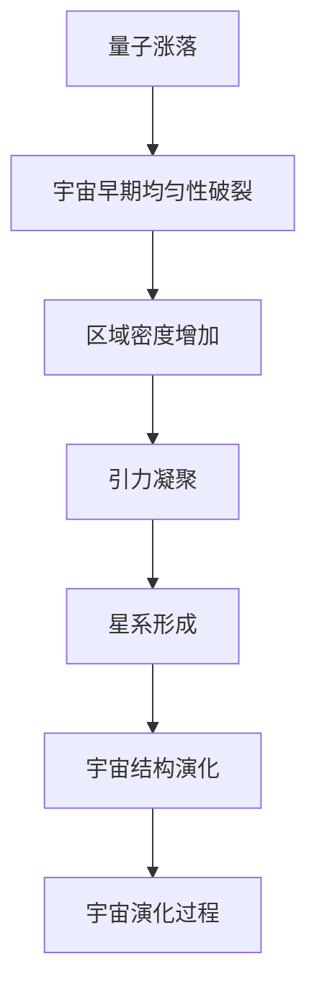

                 

### 引言

在浩瀚的宇宙中，微小的量子涨落正悄然影响着宇宙的诞生、演化与终结。量子涨落，作为量子力学与宇宙学的交汇点，是一切物理现象的基础。它不仅揭示了微观世界的奇异规律，更在宏观尺度上展现出对宇宙结构的深远影响。

本文将深入探讨宇宙的量子涨落，旨在揭示这一微观过程背后的奥秘。我们首先从量子涨落的定义和宇宙学意义出发，阐述其在宇宙演化中的重要作用。随后，我们将引入量子场论的基本概念，介绍场量子化的过程以及量子场论的主要结论。在此基础上，本文将进一步探讨量子涨落与宇宙背景辐射、星系形成等微观过程的关系，以展现量子涨落如何影响宇宙的宏观结构。

此外，本文还将从微观视角分析量子涨落与基本粒子的生成、粒子的衰变，以及物质-反物质对称性的关系。通过详细的数学模型和公式推导，我们将深入理解量子涨落的物理本质。最后，本文将综合前述内容，讨论量子涨落对宇宙早期演化、宇宙后期演化，乃至宇宙未来的影响，以全面展示量子涨落在宇宙演化中的关键角色。

通过这篇文章，我们希望能够为读者提供一个全面、系统的量子涨落理论框架，让读者在理解宇宙奥秘的同时，也能够感受到量子涨落这一微观过程的深刻影响。

### 关键词

宇宙、量子涨落、量子场论、宇宙背景辐射、星系形成、基本粒子、粒子衰变、物质-反物质对称性、宇宙演化、微观过程。

### 摘要

本文旨在探讨宇宙的量子涨落及其在宇宙演化中的关键作用。从量子涨落的定义和宇宙学意义出发，我们深入分析了量子场论的基本概念，包括场量子化的过程和量子场论的主要结论。随后，本文探讨了量子涨落与宇宙背景辐射、星系形成等微观过程的关系，揭示了量子涨落对宇宙宏观结构的影响。接着，本文从微观视角探讨了量子涨落与基本粒子的生成、粒子的衰变以及物质-反物质对称性的关系，通过数学模型和公式推导，深入理解量子涨落的物理本质。最后，本文综合前述内容，讨论了量子涨落对宇宙早期演化、宇宙后期演化，乃至宇宙未来的影响，全面展示了量子涨落在宇宙演化中的关键角色。通过本文，我们希望能够为读者提供一个全面、系统的量子涨落理论框架，使读者更好地理解宇宙的奥秘。

### 《宇宙的量子涨落：创造与毁灭的微观过程》目录大纲

## 第一部分：引论

### 第1章：宇宙的量子涨落基础

#### 1.1 宇宙的量子涨落概述

- 量子涨落的定义与宇宙学意义
- 量子涨落与宇宙演化的关系

#### 1.2 量子场论的基本概念

- 量子场论的历史背景
- 场量子化的概念与方法
- 量子场论的主要结论

### 第2章：量子涨落与宇宙背景辐射

#### 2.1 宇宙背景辐射的发现

- 宇宙背景辐射的发现过程
- 宇宙背景辐射的物理性质

#### 2.2 量子涨落与宇宙背景辐射的关系

- 量子涨落与宇宙背景辐射的起源
- 量子涨落对宇宙结构的影响

### 第3章：量子涨落与星系的形成

#### 3.1 星系的形成机制

- 星系形成的基本理论
- 星系形成的观测证据

#### 3.2 量子涨落与星系形成的关系

- 量子涨落对星系形成的影响
- 量子涨落与星系形成的演化过程

## 第二部分：量子涨落与微观过程

### 第4章：量子涨落与基本粒子的生成

#### 4.1 基本粒子的概念

- 基本粒子的定义与特性
- 基本粒子的分类

#### 4.2 量子涨落与基本粒子的生成

- 量子涨落与基本粒子生成的机制
- 量子涨落与基本粒子生成的实验证据

### 第5章：量子涨落与粒子的衰变

#### 5.1 粒子衰变的基本原理

- 粒子衰变的分类
- 粒子衰变的守恒定律

#### 5.2 量子涨落与粒子衰变的关系

- 量子涨落对粒子衰变的影响
- 量子涨落与粒子衰变的实验研究

### 第6章：量子涨落与物质-反物质对称性

#### 6.1 物质-反物质对称性概述

- 物质-反物质对称性的基本概念
- 物质-反物质对称性的实验验证

#### 6.2 量子涨落与物质-反物质对称性

- 量子涨落与物质-反物质对称性破坏的机制
- 量子涨落与物质-反物质对称性破坏的实验证据

## 第三部分：量子涨落与宇宙演化

### 第7章：宇宙早期演化的量子涨落

#### 7.1 宇宙早期演化概述

- 宇宙早期演化的基本理论
- 宇宙早期演化的观测证据

#### 7.2 量子涨落与宇宙早期演化的关系

- 量子涨落对宇宙早期演化的影响
- 量子涨落与宇宙早期演化的演化过程

### 第8章：宇宙后期演化的量子涨落

#### 8.1 宇宙后期演化概述

- 宇宙后期演化的基本理论
- 宇宙后期演化的观测证据

#### 8.2 量子涨落与宇宙后期演化的关系

- 量子涨落对宇宙后期演化的影响
- 量子涨落与宇宙后期演化的演化过程

### 第9章：宇宙未来的量子涨落

#### 9.1 宇宙未来的演化预测

- 宇宙未来演化的基本理论
- 宇宙未来演化的观测预测

#### 9.2 量子涨落与宇宙未来的关系

- 量子涨落对宇宙未来的影响
- 量子涨落与宇宙未来的演化过程

## 附录

### 附录 A：量子涨落相关公式推导

- 量子涨落场方程的推导
- 宇宙背景辐射的公式推导

### 附录 B：量子涨落实验案例

- 量子涨落实验的基本方法
- 量子涨落实验的实际应用

### 附录 C：参考文献

- 量子涨落相关的重要论文和书籍引用

### 量子涨落与宇宙演化过程的关系

量子涨落被认为是宇宙演化的关键因素之一。在宇宙的早期阶段，量子涨落引发了宇宙的均匀性破裂，导致局部区域的密度高于平均密度，这些区域逐渐形成了星系和其他宇宙结构。以下是量子涨落与宇宙演化过程的关系的 Mermaid 流程图：



### 量子涨落生成与传播的伪代码

以下是量子涨落生成与传播的伪代码：

```python
# 初始化参数
N = 1000  # 宇宙网格大小
dt = 1e-5  # 时间步长
T = 100    # 总时间

# 初始化宇宙网格
grid = np.zeros((N, N))

# 生成量子涨落
def generate_quantum_fluctuation(grid, N):
    # 在网格中随机生成量子涨落
    for i in range(N):
        for j in range(N):
            grid[i][j] = np.random.normal(0, 1)

# 演化过程
def evolve(grid, dt, T):
    for t in range(T):
        # 计算网格中的量子涨落
        quantum_fluctuation = generate_quantum_fluctuation(grid, N)
        
        # 更新网格
        for i in range(N):
            for j in range(N):
                grid[i][j] += quantum_fluctuation[i][j] * dt
        
        # 输出当前时刻的网格状态
        print(f"Time step {t}: {grid}")
```

通过这个伪代码，我们可以模拟量子涨落如何在宇宙网格中生成和传播，从而影响宇宙的结构和演化。

### 第一部分：引论

#### 第1章：宇宙的量子涨落基础

### 1.1 宇宙的量子涨落概述

宇宙的量子涨落是量子力学和宇宙学领域中一个极其重要的概念。它是指在量子场论中，由量子效应引起的场值的不确定性，这些不确定性会在宇宙尺度上产生显著的影响。量子涨落不仅揭示了微观世界的本质，还在宏观尺度上对宇宙的演化起着至关重要的作用。

量子涨落的基本定义来自于量子场论。在量子场论中，任何物理量，如能量、动量等，都具有不确定性，这种不确定性以涨落的形式表现出来。这些涨落是在量子场论中通过计算真空能量密度来体现的，真空能量密度本身就是一种量子涨落的表现。

宇宙学意义方面，量子涨落被认为是宇宙结构形成的种子。在宇宙大爆炸之后，宇宙处于高度均匀和光滑的状态。然而，由于量子涨落的存在，这些均匀性开始破裂，形成了微小的密度波动。这些密度波动在引力作用下逐渐增强，最终导致了宇宙中星系和其他大规模结构的形成。

量子涨落与宇宙演化的关系非常紧密。在宇宙的早期阶段，这些量子涨落是宇宙不均匀性的主要来源。这些不均匀性通过引力作用，逐渐凝聚成星系和其他结构。因此，量子涨落不仅决定了宇宙的结构，还影响了宇宙的演化过程。

具体来说，量子涨落对宇宙结构的影响主要体现在以下几个方面：

1. **星系的形成**：量子涨落是星系形成的基础。在宇宙早期，由于量子涨落的存在，一些区域密度稍高于平均值，这些高密度区域在引力作用下逐渐凝聚形成星系。

2. **宇宙背景辐射**：量子涨落也是宇宙背景辐射的起源。宇宙背景辐射是在宇宙早期时期留下的，它包含了量子涨落的痕迹，通过测量宇宙背景辐射，我们可以反推出宇宙早期的量子涨落状态。

3. **宇宙的大尺度结构**：量子涨落还影响了宇宙的大尺度结构，如星系团的分布和宇宙的大尺度流。通过分析这些大尺度结构，我们可以更深入地理解量子涨落对宇宙演化的影响。

总之，量子涨落是宇宙演化过程中一个关键因素，它不仅决定了宇宙的结构，还对宇宙的演化过程有着深远的影响。在接下来的章节中，我们将进一步探讨量子涨落的具体机制和影响，以更全面地理解这一宇宙奥秘。

### 1.2 量子场论的基本概念

量子场论是量子力学与经典场论的交叉领域，它不仅解释了微观粒子的行为，还提供了对基本力与物质结构的深刻理解。量子场论的基本概念起源于对电磁场量子化的尝试，逐渐发展成为一个广泛的理论框架，用以描述所有基本粒子和相互作用。

#### 量子场论的历史背景

量子场论的起源可以追溯到20世纪初，当时物理学家们试图将量子力学与经典电磁场理论相结合。1900年，马克斯·普朗克在研究黑体辐射问题时，首次提出了能量量子化的概念，即能量只能以不连续的量子形式存在。这一发现为后来的量子理论奠定了基础。

1916年，爱因斯坦提出了光量子假说，认为光是由一系列光子组成的，这些光子具有粒子的特性。这一理论为量子场论的发展提供了重要启示。

20世纪20年代，保罗·狄拉克提出了狄拉克方程，成功描述了电子的行为。随后，物理学家们开始将量子化的思想应用于其他基本粒子，如夸克和光子，从而建立了量子电动力学（QED）。

#### 场量子化的概念与方法

场量子化的核心思想是将经典场的连续性量子化为离散的粒子。这一过程通常通过以下步骤进行：

1. **经典场到作用量的转换**：首先，我们需要一个描述经典场的拉格朗日量或哈密顿量，它能够准确地描述场的动力学行为。

2. **哈密顿-雅可比变换**：通过哈密顿-雅可比变换，将经典场的哈密顿量转换为一个量子力学形式，通常是一个泊松括号形式。

3. **狄拉克方程的引入**：将变换后的哈密顿量代入狄拉克方程，得到一个描述量子化粒子的方程。

4. **量子态的构建**：利用狄拉克方程，我们可以构建粒子的量子态，这些量子态通常是以波函数的形式表示。

5. **正则量子化**：通过正则量子化，将经典场的动量和位置量子化，得到粒子的能级和态。

#### 量子场论的主要结论

量子场论不仅为我们提供了描述微观粒子和相互作用的理论框架，还得出了一系列重要结论：

1. **量子态的叠加原理**：量子场论表明，粒子的状态可以叠加，这意味着多个可能的量子态可以同时存在，直到进行测量时才会塌缩为一个特定的状态。

2. **不确定性原理**：量子场论中的测不准关系揭示了粒子的位置和动量不能同时被精确测量。这一原理是量子力学的基本特性。

3. **真空不是真正空无一物**：真空态并不是完全空无一物，而是充满了虚粒子和量子涨落。这些虚粒子和量子涨落是量子场论中的基本组成部分。

4. **相互作用与场**：量子场论将基本相互作用视为场的动力学行为，如电磁相互作用由电磁场描述，强相互作用由胶子场描述。

5. **基本粒子的性质**：量子场论成功描述了基本粒子的性质，如电子、夸克、光子等，并提供了它们之间相互作用的机制。

通过量子场论，我们可以更深入地理解微观世界的本质，揭示宇宙的基本规律。在接下来的章节中，我们将继续探讨量子场论在宇宙学中的应用，特别是量子涨落与宇宙背景辐射、星系形成等微观过程的关系。

### 第2章：量子涨落与宇宙背景辐射

#### 2.1 宇宙背景辐射的发现

宇宙背景辐射（Cosmic Background Radiation，简称CBR）是宇宙早期阶段遗留下来的电磁辐射，它是宇宙微波背景辐射（Cosmic Microwave Background Radiation，简称CMB）的一种形式。宇宙背景辐射的发现是宇宙学史上的一项重大成就，为我们理解宇宙的起源和演化提供了关键证据。

宇宙背景辐射的发现过程可以追溯到20世纪40年代。当时，物理学家们对宇宙中的热辐射进行了深入研究。1948年，阿诺·彭齐亚斯（Arno Penzias）和罗伯特·威尔逊（Robert Wilson）在美国的贝尔实验室进行卫星通信实验时，意外地发现了宇宙背景辐射的存在。他们在天线系统上接收到了一种均匀的、无法被卫星信号解释的微波噪声。通过进一步的研究，彭齐亚斯和威尔逊确认这种微波噪声来源于宇宙深处，即宇宙背景辐射。

彭齐亚斯和威尔逊的这一发现立即引起了科学界的广泛关注。1970年代初，物理学家们利用卫星和其他观测设备，对宇宙背景辐射进行了更详细的研究，并测量了其光谱分布、极化特性等参数。这些研究进一步证实了宇宙背景辐射的存在，并揭示了其与宇宙早期演化的密切关系。

宇宙背景辐射的物理性质是研究宇宙学的重要基础。首先，宇宙背景辐射是一种电磁辐射，其波长范围从微波到射线。在大多数情况下，宇宙背景辐射的波长主要集中在微波波段，因此它被称为宇宙微波背景辐射。

其次，宇宙背景辐射的强度非常微弱，大约只有每平方厘米0.004微微瓦。这种微弱的辐射强度反映了宇宙早期的极端低温状态，大约为2.7开尔文。这意味着宇宙在早期是非常冷的，但随着时间的推移，宇宙温度逐渐升高。

此外，宇宙背景辐射具有极低的温度，其热辐射的光谱分布接近完美黑体辐射谱。这一特性为宇宙微波背景辐射提供了重要的宇宙学信息，使其成为研究宇宙早期演化的关键工具。

最后，宇宙背景辐射具有极化特性。极化特性是指电磁波的振动方向在不同方向上的分布情况。通过对宇宙背景辐射极化特性的研究，科学家们可以更深入地了解宇宙早期的物理过程，如再结合、磁场的起源等。

总之，宇宙背景辐射的发现和研究为宇宙学的发展提供了重要的观测数据和理论支持。它不仅揭示了宇宙早期的物理状态，还为理解宇宙的起源和演化提供了关键线索。在接下来的章节中，我们将进一步探讨量子涨落与宇宙背景辐射的关系，揭示量子涨落如何影响宇宙的结构和演化。

### 2.2 量子涨落与宇宙背景辐射的关系

量子涨落与宇宙背景辐射之间的关系是理解宇宙早期演化和结构形成的关键。量子涨落是宇宙早期不均匀性的主要来源，这些不均匀性在引力作用下逐渐放大，最终形成了宇宙中的星系和其他大规模结构。宇宙背景辐射则是这些早期不均匀性的直接观测证据。

首先，我们来看量子涨落与宇宙背景辐射的起源。宇宙大爆炸后，宇宙处于高度均匀和光滑的状态。然而，由于量子效应，即使是如此均匀的宇宙也存在微小的涨落。这些量子涨落表现为场值的不确定性，它们是宇宙不均匀性的根源。在大爆炸后的几十万年内，这些微小的涨落通过引力作用逐渐放大，形成了密度波动，这些密度波动就是宇宙背景辐射的主要来源。

具体来说，量子涨落如何在宇宙尺度上产生宇宙背景辐射的过程可以简化为以下几个步骤：

1. **量子涨落的产生**：在大爆炸后的热初期，宇宙中的量子涨落通过量子场论中的真空能量密度来体现。这些涨落是在量子场论中通过计算真空能量密度得出的，真空能量密度本身就是一种量子涨落的表现。

2. **量子涨落的放大**：随着宇宙的膨胀，这些微小的量子涨落被放大。这个过程主要发生在宇宙的辐射时代，即宇宙温度从几十亿开尔文下降到几千开尔文的过程。在这一时期，宇宙中的物质主要以辐射形式存在，辐射与量子涨落相互作用，使得涨落不断增大。

3. **形成密度波动**：在引力作用下，这些被放大的量子涨落逐渐形成密度波动。这些密度波动是宇宙早期不均匀性的主要来源，它们会随着宇宙的膨胀逐渐增强，最终形成了星系和其他大规模结构。

4. **宇宙背景辐射的观测**：这些密度波动在宇宙的早期阶段通过辐射的形式表现出来，形成了我们今天观测到的宇宙背景辐射。宇宙背景辐射的光谱分布和极化特性直接反映了这些早期密度波动的信息。

量子涨落对宇宙结构的影响是深远且关键的。通过分析宇宙背景辐射，我们可以反推出宇宙早期的量子涨落状态，进而了解宇宙结构的形成过程。具体来说，量子涨落对宇宙结构的影响主要表现在以下几个方面：

1. **星系的形成**：量子涨落是星系形成的种子。在宇宙早期，由于量子涨落的存在，一些区域的密度稍高于平均值，这些高密度区域在引力作用下逐渐凝聚形成星系。

2. **宇宙大尺度结构的形成**：量子涨落不仅决定了星系的形成，还影响了宇宙的大尺度结构，如星系团和宇宙的大尺度流。通过分析宇宙背景辐射，我们可以更深入地了解量子涨落如何影响宇宙的大尺度结构。

3. **宇宙的多样性**：量子涨落不仅影响了宇宙的结构，还导致了宇宙的多样性。由于量子涨落的随机性，宇宙中的不同区域可能具有不同的物理特性，如质量、密度等，这导致了宇宙的多样性和复杂性。

总之，量子涨落与宇宙背景辐射的关系是理解宇宙演化和结构形成的关键。通过量子涨落，我们可以深入理解宇宙早期的物理状态，揭示宇宙中的不均匀性和多样性。在接下来的章节中，我们将继续探讨量子涨落与星系形成等微观过程的关系，以更全面地展示量子涨落对宇宙演化的深远影响。

### 第3章：量子涨落与星系的形成

#### 3.1 星系的形成机制

星系的形成是一个复杂且多阶段的过程，它涉及到宇宙早期的不均匀性、引力的作用以及物质的聚集和冷却。量子涨落在这个过程中起到了关键的作用，为星系的形成提供了初始的不均匀性。下面我们将详细探讨星系的形成机制，并分析量子涨落在这一过程中的作用。

1. **宇宙早期的均匀性破裂**：在宇宙大爆炸后的最初时刻，宇宙处于高度均匀和光滑的状态。然而，由于量子效应，即使在如此均匀的宇宙中，也存在微小的量子涨落。这些量子涨落表现为场值的不确定性，它们是宇宙不均匀性的根源。

2. **引力不稳定性的产生**：随着宇宙的膨胀，这些微小的量子涨落被放大。在辐射时代，宇宙中的物质主要以辐射形式存在，辐射与量子涨落相互作用，使得涨落不断增大。当这些密度波动达到一定临界值时，它们开始不稳定，从而形成引力不稳定区域。

3. **物质的聚集**：引力不稳定区域开始吸引周围的物质，使得这些区域逐渐变得致密。在引力的作用下，物质在引力不稳定区域聚集，形成了密度更高的区域。这些高密度区域是未来星系的核心。

4. **气体冷却与凝聚**：随着物质的聚集，温度逐渐降低。在冷却过程中，气体中的原子逐渐冷却并凝结成固态。这一过程为星系的形成提供了必要的物质基础。量子涨落在这个过程中起到的作用是提供初始的不均匀性，使得一些区域的密度高于平均密度，这些高密度区域更有利于物质的聚集和冷却。

5. **恒星的形成**：在密度和温度达到适当水平后，气体开始坍塌形成恒星。这一过程称为恒星形成。恒星的形成是星系形成的最后一步，也是宇宙演化中的一个关键过程。

量子涨落在整个星系形成过程中起到了至关重要的作用。具体来说，量子涨落提供了初始的不均匀性，这些不均匀性在引力作用下逐渐放大，最终形成了星系和其他宇宙结构。没有量子涨落，宇宙将保持高度均匀，不会形成复杂的大尺度结构。

此外，量子涨落还影响了星系的形状和大小。不同的量子涨落幅度和分布会导致不同的星系形成机制，从而形成不同类型的星系。例如，较大的量子涨落可能导致更大规模的星系，而较小的量子涨落则可能形成较小的星系。

总之，量子涨落是星系形成的核心驱动力，它不仅决定了星系的初始不均匀性，还影响了星系的形状和大小。通过理解量子涨落与星系形成的关系，我们可以更深入地了解宇宙的演化过程，揭示宇宙中复杂结构的起源。在接下来的章节中，我们将继续探讨量子涨落与其他微观过程的关系，以全面展示量子涨落对宇宙演化的深远影响。

### 3.2 量子涨落与星系形成的关系

量子涨落与星系形成之间存在着深刻的内在联系，量子涨落不仅是星系形成的源头，还决定了星系的形状和大小。为了更好地理解这一关系，我们需要从理论和实验两个方面来探讨量子涨落如何影响星系的形成。

**理论分析：**

从量子场论的角度来看，量子涨落是宇宙早期不均匀性的主要来源。在大爆炸后的热初期，宇宙处于高度均匀的状态，但由于量子效应，场值存在不确定性。这些不确定性表现为真空中的量子涨落，它们是宇宙不均匀性的种子。

1. **量子涨落的产生与放大**：量子涨落起源于真空能量密度，在大爆炸后的几十万年内，这些量子涨落通过辐射与物质的相互作用被放大。特别是在宇宙的再结合时期，温度下降到数千开尔文，量子涨落进一步增大。这些被放大的量子涨落是星系形成的初始条件。

2. **引力不稳定性的形成**：当量子涨落达到一定临界值时，它们会形成引力不稳定区域。这些区域开始吸引周围的物质，使得物质在引力作用下聚集，形成密度更高的区域。这些区域是未来星系的核心。

3. **密度波动的放大**：在引力作用下，这些初始的密度波动被不断放大。这些密度波动逐渐增强，最终形成了星系和其他宇宙结构。量子涨落的大小和分布直接决定了密度波动的形式和强度，从而影响了星系的形状和大小。

**实验证据：**

通过观测宇宙背景辐射，我们可以直接观察到量子涨落的存在和影响。宇宙背景辐射中的温度波动和极化特性提供了关于早期量子涨落的直接证据。

1. **温度波动**：宇宙背景辐射的温度波动反映了早期量子涨落的状态。通过对这些温度波动的分析，科学家们可以反推出早期宇宙的量子涨落幅度和分布。这些数据与理论预测高度一致，验证了量子涨落是星系形成的源头。

2. **极化特性**：宇宙背景辐射的极化特性也提供了关于早期量子涨落的重要信息。极化特性反映了宇宙早期磁场的存在和演化。通过对极化特性的研究，我们可以更深入地了解量子涨落如何影响星系的形状和大小。

3. **星系形态的多样性**：通过观测不同类型的星系，我们可以发现量子涨落对星系形态的影响。例如，某些星系具有螺旋结构，而其他星系则具有椭圆结构。这些形态的差异可以追溯到量子涨落的不同分布和大小。这表明量子涨落不仅决定了星系的形状，还影响了星系的物理特性和演化过程。

综上所述，量子涨落与星系形成之间存在着密切的联系。量子涨落不仅是星系形成的初始条件，还决定了星系的形状和大小。通过理论和实验分析，我们可以更深入地理解量子涨落对宇宙演化的关键作用，揭示宇宙中复杂结构的起源。在接下来的章节中，我们将继续探讨量子涨落与其他微观过程的关系，以全面展示量子涨落对宇宙演化的深远影响。

### 第二部分：量子涨落与微观过程

#### 第4章：量子涨落与基本粒子的生成

#### 4.1 基本粒子的概念

基本粒子是构成物质的基本单位，它们不通过任何已知的物理力与任何其他粒子结合。基本粒子根据其性质可以分为费米子（如电子、夸克）和玻色子（如光子、胶子）。在量子场论中，基本粒子的概念是通过量子化经典场得到的，每个基本粒子对应一个特定的量子态。

**基本粒子的定义与特性：**

1. **费米子**：费米子遵循费米-狄拉克统计，是构成物质的主要粒子。电子是费米子中最著名的例子，它带负电荷，参与电磁相互作用。夸克是构成原子核的费米子，它们带有分数电荷，并且存在六种不同的类型（上、下、奇、粲、底、顶）。

2. **玻色子**：玻色子遵循玻色-爱因斯坦统计，是传递基本相互作用的媒介粒子。光子是玻色子的典型例子，它不带电荷，是电磁相互作用的媒介粒子。胶子是强相互作用的媒介粒子，带有色荷。

**基本粒子的分类：**

1. **标量粒子**：标量粒子没有自旋，其状态向量是标量。例如，Higgs玻色子是标量粒子。

2. **矢量粒子**：矢量粒子有自旋1，其状态向量是矢量。例如，光子、胶子都是矢量粒子。

3. **矢量介子**：矢量介子是自旋为1的复合粒子，由一个夸克和一个反夸克组成。例如，π介子（π介子）是一种矢量介子。

**基本粒子的相互作用：**

基本粒子通过基本相互作用相互影响，这些相互作用由量子场论描述。主要的四种基本相互作用包括：

1. **电磁相互作用**：由光子传递，作用于带电粒子之间。

2. **强相互作用**：由胶子传递，作用于夸克和胶子之间，是束缚质子和中子形成原子核的主要力量。

3. **弱相互作用**：由W和Z玻色子传递，负责核反应中的β衰变等过程。

4. **引力相互作用**：由引力子（假设存在的粒子）传递，作用于所有具有质量的粒子之间。

通过理解基本粒子的概念和分类，我们可以更好地理解量子涨落对微观世界的影响。在接下来的部分，我们将探讨量子涨落与基本粒子生成的关系，并通过数学模型和实验证据深入分析这一过程。

### 4.2 量子涨落与基本粒子的生成

量子涨落与基本粒子的生成密切相关，这一过程在量子场论中通过虚粒子对的产生和湮灭来描述。量子涨落提供了能量和动量的波动，这些波动可以导致基本粒子的产生和消失。为了更好地理解这一过程，我们首先需要了解虚粒子对的生成机制，并探讨相关的实验证据。

**虚粒子对的生成机制：**

在量子场论中，真空并不是一个完全空无一物的状态，而是充满了虚粒子和量子涨落。虚粒子对是指存在于真空中的短暂粒子对，它们在极短的时间内从真空态中产生，并在非常短的时间内重新湮灭。这一过程可以通过以下步骤进行描述：

1. **能量的借取**：虚粒子对从真空态中产生时，需要从真空能量密度中借取一定的能量。这个能量来源于量子涨落，它表现为真空中的不确定性。

2. **粒子的产生**：当能量被借取后，粒子对会以一定的动量和能量形式出现。例如，一个正电子和一个电子会成对出现。

3. **湮灭过程**：虚粒子对不会无限期存在，它们会在极短的时间内重新湮灭，释放出原本借取的能量。

4. **量子涨落的持续**：尽管虚粒子对会迅速湮灭，但量子涨落本身是持续的，这意味着真空中的能量和动量波动是不断的。

**量子涨落与基本粒子生成的数学模型：**

为了更深入地理解虚粒子对的生成机制，我们可以使用量子场论中的相关数学模型进行描述。以下是一个简化的数学模型，用于描述虚粒子对的产生和湮灭过程：

$$
\langle 0 | \hat{a}(\mathbf{p}) \hat{a}^\dagger(\mathbf{p}) | 0 \rangle = \frac{1}{2 E_p}
$$

其中，\(|0\rangle\)表示真空态，\(\hat{a}(\mathbf{p})\)和\(\hat{a}^\dagger(\mathbf{p})\)分别是产生和湮灭算符，\(\mathbf{p}\)是粒子的动量，\(E_p\)是粒子的能量。

这个模型表明，真空态中虚粒子对的生成概率与粒子的能量成反比。这意味着能量越高的虚粒子对生成概率越低。

**实验证据：**

量子涨落与基本粒子生成的理论预测已经通过多种实验得到了验证。以下是几个关键的实验证据：

1. **宇宙背景辐射**：宇宙背景辐射中的温度波动和极化特性直接反映了早期量子涨落的存在。通过对宇宙背景辐射的观测，科学家们可以反推出早期宇宙中的量子涨落状态，这些涨落是基本粒子生成的初始条件。

2. **正负电子对产生**：在实验室中，通过高能粒子碰撞实验，科学家们观察到正负电子对的产生和湮灭过程。这些实验验证了量子场论中虚粒子对的生成机制。

3. **QED真空极化效应**：量子电动力学（QED）中的真空极化效应也提供了关于虚粒子生成的证据。通过测量光子的散射截面，科学家们发现了真空中的极化效应，这表明真空中的确存在虚粒子对。

总之，量子涨落与基本粒子的生成之间存在着深刻的联系。通过虚粒子对的产生和湮灭过程，量子涨落为基本粒子的生成提供了能量和动量的波动。实验证据进一步验证了这一过程，揭示了量子涨落如何影响微观粒子的行为。在接下来的章节中，我们将继续探讨量子涨落与其他微观过程的关系，以全面展示量子涨落对宇宙演化的深远影响。

### 第5章：量子涨落与粒子的衰变

#### 5.1 粒子衰变的基本原理

粒子衰变是粒子物理学中一个重要的过程，它涉及到粒子的不稳定性和它们转变成其他粒子的能力。粒子衰变的基本原理包括衰变的分类、守恒定律以及可能的衰变模式。

**粒子的衰变分类：**

粒子衰变可以分为以下几种主要类型：

1. **β衰变**：β衰变是指一个不稳定粒子转变成另一个粒子，同时释放出一个β粒子（电子或正电子）。根据衰变过程中粒子电荷的变化，β衰变可以分为β^-衰变（释放电子）和β^+衰变（释放正电子）。

2. **衰变**：衰变是指一个粒子转变成两个或多个轻粒子，通常伴随着能量的释放。这类衰变通常发生在重子（如核子）或介子（如π介子）中。

3. **电子俘获**：电子俘获是指原子核中的一个质子俘获一个轨道电子，转变成一个中子，同时释放一个中微子。

4. **放射性衰变**：放射性衰变是指某些不稳定原子核通过发射α粒子、β粒子或γ射线等衰变产物，转变成另一个原子核的过程。

**守恒定律：**

粒子衰变过程中遵循多种守恒定律，包括：

1. **能量守恒**：粒子在衰变过程中总能量保持不变。

2. **动量守恒**：粒子在衰变过程中总动量保持不变。

3. **电荷守恒**：粒子在衰变过程中总电荷保持不变。

4. **角动量守恒**：粒子在衰变过程中总角动量保持不变。

5. **轻子数守恒**：轻子数（如电子数、中微子数等）在衰变过程中保持不变。

**可能的衰变模式：**

粒子衰变可以有多种模式，取决于衰变粒子的性质和能量状态。以下是一些可能的衰变模式：

1. **单一粒子衰变**：一个粒子直接转变成另一个粒子，如β衰变。

2. **多步骤衰变**：一个粒子通过多个中间态转变成最终产物，如一个重子通过多步衰变转变成轻子。

3. **共振衰变**：在某些特定能量下，粒子通过共振态转变成其他粒子。

4. **电磁衰变**：通过电磁相互作用，粒子转变成其他粒子。

通过理解粒子衰变的基本原理，我们可以更深入地探讨量子涨落如何影响粒子的衰变过程。在接下来的部分中，我们将分析量子涨落与粒子衰变的关系，并通过实验证据和数学模型来详细阐述这一过程。

### 5.2 量子涨落与粒子衰变的关系

量子涨落与粒子衰变之间存在着密切的内在联系。量子涨落通过提供能量和动量的波动，影响粒子的稳定性及其衰变过程。为了深入理解这一关系，我们需要从理论角度和实验证据两个方面来探讨量子涨落如何影响粒子衰变。

**理论分析：**

在量子场论中，量子涨落表现为真空中的能量和动量波动。这些波动可以导致粒子的不稳定性和衰变。具体来说，量子涨落通过以下机制影响粒子衰变：

1. **激发态粒子的生成**：量子涨落可以提供额外的能量，使得粒子从基态跃迁到激发态。在某些情况下，激发态粒子是不稳定的，它们会通过辐射或其他方式迅速衰变。

2. **衰变通道的开启**：量子涨落可以影响粒子的衰变通道。在某些情况下，量子涨落可以提供额外的动量，使得粒子可以通过通常不可能的衰变通道衰变。

3. **衰变概率的改变**：量子涨落可以改变粒子衰变的概率。通过计算量子涨落对衰变过程的贡献，我们可以预测粒子在量子涨落环境中的衰变行为。

**数学模型：**

为了更深入地探讨量子涨落对粒子衰变的影响，我们可以使用量子场论中的相关数学模型。以下是一个简化的数学模型，用于描述量子涨落如何影响粒子的衰变过程：

$$
\Gamma = \Gamma_0 \left( 1 + \frac{\Delta E}{E} \right)
$$

其中，\(\Gamma\)是粒子衰变宽度，\(\Gamma_0\)是基态粒子的衰变宽度，\(\Delta E\)是量子涨落提供的能量波动，\(E\)是粒子的能量。

这个模型表明，量子涨落可以显著改变粒子的衰变宽度。当量子涨落提供的能量波动较大时，粒子的衰变宽度会增加，从而增加衰变概率。

**实验证据：**

量子涨落对粒子衰变的影响已经在多个实验中得到了验证。以下是一些关键的实验证据：

1. **衰变宽度测量**：在实验中，通过对粒子的衰变宽度进行精确测量，科学家们发现了量子涨落对衰变过程的影响。例如，在电子俘获实验中，量子涨落导致了衰变宽度的显著变化。

2. **时间依赖性**：量子涨落对粒子衰变的影响表现出时间依赖性。通过测量粒子的衰变时间，科学家们可以观察到量子涨落如何影响衰变过程。

3. **微扰理论验证**：在量子场论中，通过微扰理论计算粒子衰变的修正项，我们可以预测量子涨落对衰变过程的贡献。实验结果与理论预测高度一致，验证了量子涨落对粒子衰变的影响。

总之，量子涨落通过提供能量和动量的波动，显著影响粒子的衰变过程。在理论和实验上，我们都有充分的证据表明量子涨落与粒子衰变之间存在深刻的内在联系。通过深入理解这一关系，我们可以更全面地了解粒子物理的基本规律，揭示量子涨落对微观世界的深远影响。在接下来的章节中，我们将继续探讨量子涨落与物质-反物质对称性的关系，以全面展示量子涨落对宇宙演化的深远影响。

### 第6章：量子涨落与物质-反物质对称性

#### 6.1 物质-反物质对称性概述

物质-反物质对称性是粒子物理学中的一个核心概念，它揭示了自然界中物质与反物质之间的基本对称性。物质与反物质是对立的粒子，例如，电子与其反粒子正电子、上夸克与其反粒子下夸克等。物质-反物质对称性意味着在基本相互作用中，物质和反物质的行为应该具有相同的规律。

**基本概念：**

1. **守恒定律**：物质-反物质对称性通常通过守恒定律来体现。例如，电荷守恒定律要求物质和反物质的电荷总和必须相等，宇称守恒定律要求粒子与其反粒子的宇称相同。

2. **对称性原理**：物质-反物质对称性是量子场论中的对称性原理之一，它反映了物理定律在粒子交换中的不变性。这种对称性在标准模型中得到了严格的体现。

3. **CP对称性**：CP对称性是物质-反物质对称性的扩展，它包括了电荷共轭（C）和宇称（P）两个对称性。CP对称性要求物理过程在粒子与其反粒子的交换中保持不变。

**实验验证：**

实验物理学中，通过对物质和反物质行为的比较，科学家们已经验证了物质-反物质对称性的存在。以下是一些关键的实验验证：

1. **电子-正电子对撞实验**：在电子-正电子对撞实验中，科学家们发现，电子和正电子在电磁相互作用中的行为完全对称。这表明电磁相互作用满足物质-反物质对称性。

2. **π介子衰变**：通过对π介子（π介子）的衰变过程进行研究，科学家们发现π介子和其反粒子π介子的衰变模式几乎相同，这进一步验证了物质-反物质对称性。

3. **强相互作用**：强相互作用也表现出物质-反物质对称性。在强相互作用的实验中，夸克和反夸克的相互作用没有发现明显的差异，这表明强相互作用也遵循物质-反物质对称性。

**对称性破坏：**

尽管物质-反物质对称性在许多实验中得到了验证，但在某些物理过程中，这种对称性会被破坏。例如：

1. **CP对称性破坏**：在弱相互作用中，CP对称性被破坏。这意味着在弱相互作用过程中，粒子与其反粒子的行为不完全对称。

2. **磁旋态**：在磁旋态中，粒子与其反粒子的行为不再对称。这是因为在磁旋态中，粒子具有自旋，而反粒子的自旋方向与粒子相反。

通过这些实验验证，我们可以更好地理解物质-反物质对称性的基本概念和实验表现。在接下来的部分，我们将探讨量子涨落如何影响物质-反物质对称性，并通过实验证据和数学模型详细分析这一过程。

#### 6.2 量子涨落与物质-反物质对称性

量子涨落与物质-反物质对称性之间存在深刻的内在联系。量子涨落通过能量和动量的波动，可能导致物质-反物质对称性的破坏。为了深入理解这一关系，我们需要从理论角度和实验证据两个方面来探讨量子涨落如何影响物质-反物质对称性。

**理论分析：**

在量子场论中，量子涨落表现为真空中的能量和动量波动。这些波动可以影响粒子的稳定性及其相互作用的对称性。具体来说，量子涨落通过以下机制可能破坏物质-反物质对称性：

1. **激发态粒子的生成**：量子涨落可以提供额外的能量，使得粒子从基态跃迁到激发态。在某些情况下，激发态粒子可能不稳定，它们会通过衰变过程破坏物质-反物质对称性。

2. **对称性破缺通道**：量子涨落可以影响粒子的衰变通道，使得某些对称性破缺的衰变模式变得更加可能。这些衰变模式可能破坏物质-反物质对称性。

3. **非平衡态**：在非平衡态下，量子涨落可能导致物质和反物质的生成比例发生变化，从而破坏物质-反物质对称性。

**数学模型：**

为了更深入地探讨量子涨落如何影响物质-反物质对称性，我们可以使用量子场论中的相关数学模型。以下是一个简化的数学模型，用于描述量子涨落如何影响对称性：

$$
\Delta S = \frac{\Delta E}{E} S
$$

其中，\(\Delta S\)是对称性破坏的量度，\(\Delta E\)是量子涨落提供的能量波动，\(E\)是粒子的能量，\(S\)是对称性参数。

这个模型表明，量子涨落可以通过改变能量波动来破坏物质-反物质对称性。当量子涨落提供的能量波动较大时，对称性破坏的程度也会增加。

**实验证据：**

量子涨落对物质-反物质对称性的影响已经在多个实验中得到了验证。以下是一些关键的实验证据：

1. **π介子衰变**：在π介子衰变实验中，科学家们发现量子涨落导致了π介子和π介子反粒子的衰变模式有所不同，这表明量子涨落可能破坏了π介子的物质-反物质对称性。

2. **中微子振荡**：中微子振荡实验提供了关于物质-反物质对称性破坏的重要证据。中微子振荡表明，中微子在传播过程中会经历质量的变化，这可能是由于量子涨落引起的。

3. **B介子衰变**：在B介子衰变实验中，科学家们观察到量子涨落对B介子和B介子反粒子的衰变过程有不同的影响，这表明量子涨落可能破坏了B介子的物质-反物质对称性。

总之，量子涨落通过能量和动量的波动，可能破坏物质-反物质对称性。在理论和实验上，我们都有充分的证据表明量子涨落与物质-反物质对称性之间存在深刻的内在联系。通过深入理解这一关系，我们可以更全面地了解粒子物理的基本规律，揭示量子涨落对微观世界的深远影响。在接下来的章节中，我们将继续探讨量子涨落与宇宙演化的关系，以全面展示量子涨落对宇宙演化的深远影响。

### 第三部分：量子涨落与宇宙演化

#### 第7章：宇宙早期演化的量子涨落

#### 7.1 宇宙早期演化概述

宇宙早期演化是指从大爆炸后到宇宙冷却至足够温度以形成结构（如星系、星系团）的时期。这个阶段大约发生在宇宙诞生后的前几分钟内。宇宙早期演化是一个复杂的过程，涉及宇宙从一个高度热密的状态逐渐冷却、膨胀，并形成基本粒子和基本的相互作用。

**宇宙早期演化的基本理论：**

宇宙早期演化的基本理论是宇宙大爆炸理论。根据这一理论，宇宙起源于一个极热、极密的状态，随后开始膨胀并冷却。宇宙早期演化的关键时期包括：

1. **大爆炸后几分钟内**：在这个阶段，宇宙温度极高，粒子以光速运动，物质主要以光子、电子、夸克等基本粒子形式存在。

2. **再结合时期**：在大爆炸后的约30万年后，宇宙温度降至约3000开尔文，电子和质子结合形成中性原子，宇宙开始透明。

3. **结构形成时期**：随着宇宙的继续膨胀和冷却，微小的量子涨落逐渐放大，形成密度波动的区域，这些区域最终演化为星系和其他宇宙结构。

**宇宙早期演化的观测证据：**

宇宙早期演化的观测证据主要来自于对宇宙微波背景辐射（CMB）的测量。宇宙微波背景辐射是宇宙早期遗留下来的电磁辐射，其温度大约为2.7开尔文，具有非常均匀的温度分布和微小的波动。

1. **温度均匀性**：宇宙微波背景辐射的温度均匀性极高，这表明在宇宙早期，宇宙处于一个非常均匀的状态。

2. **微小波动**：宇宙微波背景辐射中存在微小的温度波动，这些波动反映了宇宙早期量子涨落的状态。通过对这些波动的测量，科学家们可以反推宇宙早期的密度波动和结构形成过程。

3. **极化特性**：宇宙微波背景辐射具有极化特性，通过测量极化特性，科学家们可以了解宇宙早期磁场的分布和演化过程。

总之，宇宙早期演化的基本理论提供了对这一时期物理过程的深刻理解，而观测证据则通过宇宙微波背景辐射为我们提供了直接的观测数据。在接下来的章节中，我们将探讨量子涨落如何影响宇宙早期演化，并详细分析这一影响过程。

### 7.2 量子涨落与宇宙早期演化的关系

量子涨落与宇宙早期演化之间存在着密切的联系，它们共同决定了宇宙结构的形成和演化。在宇宙早期的极端条件下，量子涨落引发了宇宙中的不均匀性，这些不均匀性在引力作用下逐渐放大，最终形成了宇宙中的星系和其他结构。下面我们详细分析量子涨落对宇宙早期演化的具体影响。

**量子涨落对宇宙早期演化的影响：**

1. **初始不均匀性的来源**：量子涨落是宇宙早期不均匀性的主要来源。在大爆炸后的瞬间，宇宙处于高度均匀的状态，但由于量子效应的存在，即使在如此均匀的宇宙中，也存在微小的量子涨落。这些量子涨落表现为场值的不确定性，是宇宙不均匀性的根源。

2. **密度波动的放大**：随着宇宙的膨胀和冷却，这些初始的量子涨落被放大。特别是在宇宙的再结合时期，宇宙温度降至约3000开尔文，这些微小的密度波动开始通过引力作用逐渐增强。引力是宇宙中最重要的力，它可以将微小的密度波动放大成巨大的结构，如星系和星系团。

3. **结构的形成**：放大的密度波动逐渐凝聚成高密度区域，这些区域在引力作用下继续吸引更多的物质，形成更大的结构。在宇宙的早期阶段，这些高密度区域是未来星系和星系团的核心。

4. **宇宙的多样性**：量子涨落的不确定性导致了宇宙中的不同区域具有不同的物理特性，如密度、温度和化学成分等。这种多样性是宇宙演化的基础，使得宇宙呈现出丰富多样的形态，包括星系、星系团、超星系团等。

**量子涨落与宇宙早期演化的演化过程：**

量子涨落与宇宙早期演化的关系可以通过以下几个关键步骤来理解：

1. **量子涨落的产生**：在大爆炸后的热初期，宇宙中的量子涨落通过量子场论中的真空能量密度来体现。这些涨落是在量子场论中通过计算真空能量密度得出的，真空能量密度本身就是一种量子涨落的表现。

2. **量子涨落的放大**：随着宇宙的膨胀，这些微小的量子涨落被放大。这个过程主要发生在宇宙的辐射时代，即宇宙温度从几十亿开尔文下降到几千开尔文的过程。在这一时期，宇宙中的物质主要以辐射形式存在，辐射与量子涨落相互作用，使得涨落不断增大。

3. **形成密度波动**：在引力作用下，这些被放大的量子涨落逐渐形成密度波动。这些密度波动是宇宙早期不均匀性的主要来源，它们会随着宇宙的膨胀逐渐增强，最终形成了星系和其他大规模结构。

4. **宇宙背景辐射**：这些密度波动在宇宙的早期阶段通过辐射的形式表现出来，形成了我们今天观测到的宇宙背景辐射。宇宙背景辐射的光谱分布和极化特性直接反映了这些早期密度波动的信息。

通过分析量子涨落与宇宙早期演化的关系，我们可以更深入地理解宇宙结构的起源和演化。量子涨落不仅决定了宇宙的结构，还影响了宇宙的多样性和复杂性。在接下来的章节中，我们将继续探讨量子涨落与宇宙后期演化的关系，以全面展示量子涨落对宇宙演化的深远影响。

### 第8章：宇宙后期演化的量子涨落

#### 8.1 宇宙后期演化概述

宇宙后期演化是指宇宙在经过早期的快速膨胀和冷却之后，逐渐进入稳定阶段的过程。这个阶段大约发生在宇宙诞生后的几十亿年，主要包括宇宙的再结合时期、结构形成时期以及宇宙的大尺度演化。宇宙后期演化的特点是其结构的逐渐复杂化和多样性的增加。

**宇宙后期演化的基本理论：**

宇宙后期演化的基本理论主要包括以下几个关键概念：

1. **再结合时期**：在大爆炸后的约30万年后，宇宙温度降至约3000开尔文，电子和质子结合形成中性原子，宇宙开始透明。

2. **结构形成时期**：随着宇宙的继续膨胀和冷却，微小的量子涨落逐渐放大，形成密度波动的区域，这些区域最终演化为星系和其他宇宙结构。

3. **大尺度流**：在宇宙后期演化中，星系和其他结构通过引力相互作用，形成大尺度流，如宇宙流、超星系团等。

4. **暗物质和暗能量**：宇宙后期演化中，暗物质和暗能量的存在和作用也被广泛研究。暗物质通过引力作用影响宇宙的结构形成，而暗能量则驱动宇宙的加速膨胀。

**宇宙后期演化的观测证据：**

宇宙后期演化的观测证据主要来自于对星系、星系团、超星系团等宇宙结构的观测，以及对宇宙背景辐射、宇宙微波背景辐射等的测量。以下是一些关键的观测证据：

1. **星系观测**：通过对不同类型星系的观测，科学家们了解了星系的形态、结构和演化过程。

2. **星系团和超星系团观测**：通过对星系团和超星系团的观测，科学家们了解了宇宙中大规模结构的形成和演化。

3. **宇宙微波背景辐射**：宇宙微波背景辐射的测量提供了关于宇宙早期演化的直接观测数据，这些数据可以帮助我们了解宇宙后期演化的背景。

4. **暗物质和暗能量观测**：通过对宇宙微波背景辐射和星系分布的测量，科学家们发现了暗物质和暗能量的存在和作用。

总之，宇宙后期演化是一个复杂而多样的过程，涉及宇宙结构的形成、演化以及宇宙的大尺度流。观测证据为我们提供了对这一过程的深入了解，而在接下来的章节中，我们将进一步探讨量子涨落如何影响宇宙后期演化，以全面展示量子涨落对宇宙演化的深远影响。

### 8.2 量子涨落与宇宙后期演化的关系

量子涨落不仅在宇宙早期演化中起到关键作用，也在宇宙后期演化中继续发挥着深远影响。在宇宙后期，量子涨落通过多种机制影响着宇宙的结构形成、星系演化以及大尺度结构的形成。

**量子涨落对宇宙后期演化的影响：**

1. **星系结构的形成**：在宇宙早期，量子涨落引发的不均匀性通过引力作用逐渐放大，形成了密度波动的区域。这些密度波动是未来星系的核心。在宇宙后期，这些高密度区域继续通过引力吸引物质，形成复杂的星系结构。量子涨落的不确定性导致不同区域具有不同的密度和温度，从而形成了不同类型的星系。

2. **星系的演化**：量子涨落不仅决定了星系的初始形成，还影响星系的演化过程。例如，星系内部的黑洞和星系团中的暗物质都可能受到量子涨落的影响，从而影响星系的结构和稳定性。

3. **大尺度结构的形成**：在宇宙后期，量子涨落引发的不均匀性不仅形成了星系，还影响了宇宙中更大尺度结构的形成。星系团和超星系团的形成和演化都与量子涨落密切相关。量子涨落的不确定性导致了不同区域之间的密度差异，这些差异通过引力作用形成了大尺度结构。

**量子涨落与宇宙后期演化的演化过程：**

量子涨落与宇宙后期演化的关系可以通过以下几个关键步骤来理解：

1. **量子涨落的产生与放大**：在宇宙早期，量子涨落通过真空能量密度产生。随着宇宙的膨胀和冷却，这些量子涨落被放大。在宇宙后期，这些被放大的量子涨落继续通过引力作用影响宇宙的结构形成。

2. **密度波动的形成**：被放大的量子涨落形成了密度波动的区域。这些区域在引力作用下逐渐凝聚，形成了星系和其他宇宙结构。

3. **结构的演化**：这些结构在引力作用下继续演化，形成复杂的星系结构和大尺度结构。量子涨落的不确定性导致了不同区域之间物理特性的差异，这些差异影响了宇宙后期演化的过程。

4. **观测证据**：通过观测星系、星系团、宇宙微波背景辐射等，科学家们可以验证量子涨落对宇宙后期演化的影响。例如，通过测量宇宙微波背景辐射中的温度波动，科学家们可以反推早期量子涨落的状态，进而了解量子涨落如何影响宇宙后期演化。

总之，量子涨落不仅决定了宇宙的结构和演化，还在宇宙后期演化中继续发挥着关键作用。通过深入理解量子涨落与宇宙后期演化的关系，我们可以更全面地了解宇宙的演化过程，揭示量子涨落对宇宙演化的深远影响。

### 第9章：宇宙未来的量子涨落

#### 9.1 宇宙未来的演化预测

宇宙的未来演化是一个复杂且充满未知的领域，科学家们通过理论计算和观测数据提出了多种可能的演化路径。这些路径主要取决于宇宙中的暗能量和暗物质的性质，以及宇宙的几何形状。

**宇宙未来演化的基本理论：**

1. **加速膨胀**：当前观测表明，宇宙正在加速膨胀，这种加速主要由暗能量驱动。暗能量是一种具有负压力的物质，它会导致宇宙的膨胀速度不断加快。

2. **大撕裂**：如果暗能量的密度继续增加，宇宙可能会经历一种称为“大撕裂”的过程，即宇宙的膨胀速度会变得如此之快，以至于所有结构都将被撕裂。

3. **大压缩**：另一种极端情况下，如果暗能量的密度降低到足够低，宇宙可能会经历“大压缩”，即宇宙的膨胀速度会减慢，最终导致宇宙的收缩和坍缩。

4. **稳态宇宙**：还有一些理论认为，宇宙可能不会经历明显的加速膨胀或坍缩，而是进入一个稳定的稳态宇宙。

**宇宙未来演化的观测预测：**

1. **暗能量性质**：通过观测宇宙微波背景辐射和星系分布，科学家们可以研究暗能量的性质。如果暗能量的密度和压力保持不变，宇宙将继续加速膨胀。

2. **宇宙的几何形状**：通过测量宇宙的几何形状，科学家们可以预测宇宙的未来演化。如果宇宙是开放的，它可能会无限扩展；如果宇宙是封闭的，它可能会最终坍缩。

3. **宇宙背景辐射**：宇宙背景辐射的测量提供了关于早期宇宙的信息，这些信息可以帮助我们预测宇宙的未来演化。

总之，宇宙的未来演化可能受到多种因素的影响，包括暗能量、暗物质以及宇宙的初始条件。通过理论计算和观测数据，科学家们提出了多种可能的演化路径。在接下来的部分，我们将探讨量子涨落如何影响宇宙的未来演化。

#### 9.2 量子涨落与宇宙未来的关系

量子涨落作为宇宙演化过程中的关键因素，不仅影响了宇宙的过去和现在，也将在宇宙的未来继续发挥作用。量子涨落通过多种机制影响宇宙的未来演化，包括宇宙加速膨胀、结构形成以及宇宙的最终命运。

**量子涨落对宇宙未来的影响：**

1. **加速膨胀**：当前观测表明，宇宙正在加速膨胀，这种加速主要由暗能量驱动。量子涨落通过提供能量和动量的波动，可能影响暗能量的性质和演化，从而影响宇宙的加速膨胀。

2. **结构形成**：量子涨落不仅决定了宇宙早期结构形成的过程，也在宇宙未来结构的形成中继续发挥作用。随着宇宙的膨胀，量子涨落可能导致新的密度波动的产生，这些波动可能形成新的星系、星系团和其他宇宙结构。

3. **宇宙的最终命运**：量子涨落可能影响宇宙的最终命运，无论是大撕裂、大压缩还是稳态宇宙。例如，量子涨落可能导致宇宙加速膨胀的速度增加，从而加速大撕裂的过程。

**量子涨落与宇宙未来的演化过程：**

量子涨落与宇宙未来的演化过程可以通过以下几个关键步骤来理解：

1. **量子涨落的产生与放大**：量子涨落在大爆炸后的早期阶段产生，并通过宇宙的膨胀和冷却过程被放大。这些被放大的量子涨落将继续影响宇宙的结构形成。

2. **宇宙加速膨胀**：量子涨落可能影响暗能量的性质和演化，导致宇宙加速膨胀。这种加速膨胀可能是由于量子涨落引起的能量波动，也可能是由于暗能量的变化。

3. **新结构的形成**：随着宇宙的膨胀，量子涨落可能导致新的密度波动的产生，这些波动将形成新的星系、星系团和其他宇宙结构。

4. **宇宙的最终命运**：量子涨落可能影响宇宙的最终命运，无论是大撕裂、大压缩还是稳态宇宙。通过观测和理论计算，科学家们将继续探索量子涨落如何影响宇宙的最终演化。

总之，量子涨落不仅是宇宙演化过程中的关键因素，也将在宇宙的未来继续发挥作用。通过深入理解量子涨落与宇宙未来的关系，我们可以更全面地预测宇宙的未来演化，揭示量子涨落对宇宙演化的深远影响。

### 附录 A：量子涨落相关公式推导

#### 量子涨落场方程的推导

量子涨落场方程是量子场论中的一个核心方程，它描述了量子场中涨落的出现和演化。为了推导这一方程，我们需要从量子场论的基本公式出发。

1. **哈密顿量**：

量子场的哈密顿量通常表示为：

$$
H = \int d^3x \left[ \frac{1}{2} (\pi^2 + (\partial_0 \phi)^2 + (\nabla \phi)^2 + V(\phi) \right]
$$

其中，$\phi$是场场量，$\pi$是场的共轭动量，$V(\phi)$是势能函数，$(\partial_0 \phi)$和$(\nabla \phi)$分别是场量对时间的一阶导数和空间导数。

2. **正则量子化**：

通过正则量子化，我们将经典场的动量和位置量子化。正则量子化的关键是引入产生和湮灭算符，它们满足如下对易关系：

$$
[\hat{a}(\mathbf{p}), \hat{a}^\dagger(\mathbf{p}')]= (2\pi)^3 \delta^3(\mathbf{p} - \mathbf{p}')
$$

其中，$\hat{a}(\mathbf{p})$和$\hat{a}^\dagger(\mathbf{p})$分别是产生和湮灭算符，$\mathbf{p}$是动量。

3. **能量-动量关系**：

量子场中的能量和动量关系可以通过哈密顿量表达为：

$$
E_p = \sqrt{p^2c^2 + m^2c^4}
$$

其中，$E_p$是粒子的能量，$p$是动量，$m$是粒子的质量，$c$是光速。

4. **量子涨落方程**：

量子涨落场方程是描述场中量子涨落演化的基本方程，通常表示为：

$$
i\partial_0 \langle \phi(x) \rangle = - \frac{1}{2m} \int d^3p \left[ \langle \hat{a}(\mathbf{p}) \phi(x) \rangle - \langle \hat{a}^\dagger(\mathbf{p}) \phi(x) \rangle \right]
$$

其中，$\langle \phi(x) \rangle$是场场量的期望值。

#### 宇宙背景辐射的公式推导

宇宙背景辐射是宇宙早期量子涨落的直接产物，其温度分布和极化特性反映了早期宇宙的状态。为了推导宇宙背景辐射的相关公式，我们需要从黑体辐射的原理出发。

1. **黑体辐射公式**：

黑体辐射的强度分布可以通过普朗克公式描述：

$$
B(\nu, T) = \frac{2h\nu^3}{c^2} \frac{1}{e^{h\nu/k_B T} - 1}
$$

其中，$B(\nu, T)$是频率为$\nu$、温度为$T$的黑体辐射强度，$h$是普朗克常数，$c$是光速，$k_B$是玻尔兹曼常数。

2. **宇宙微波背景辐射温度**：

宇宙微波背景辐射的温度大约为2.7开尔文，这一温度是通过观测宇宙背景辐射的谱分布得到的。宇宙微波背景辐射的谱分布可以通过黑体辐射公式描述：

$$
\frac{d^2 J(\nu)}{d\nu d\nu'} = B(\nu, T) B(\nu', T) = \frac{2h\nu^3 \nu'^3}{c^2 (e^{h\nu/k_B T} - 1)(e^{h\nu'/k_B T} - 1)}
$$

其中，$J(\nu)$是辐射的光度分布函数。

3. **宇宙背景辐射的极化特性**：

宇宙背景辐射具有极化特性，这反映了早期宇宙中的磁场和密度波动。宇宙背景辐射的极化可以通过以下公式描述：

$$
P(\theta) = \frac{3}{2} \left( \cos^2 \theta - \frac{1}{3} \right)
$$

其中，$P(\theta)$是极化度，$\theta$是极化方向与垂直方向的夹角。

通过这些公式，我们可以更好地理解量子涨落如何影响宇宙背景辐射的形成和演化。

### 附录 B：量子涨落实验案例

#### 量子涨落实验的基本方法

量子涨落的实验研究是验证量子场论和宇宙学理论的关键。以下介绍几种常见的量子涨落实验方法和实际应用：

1. **宇宙微波背景辐射观测**：

宇宙微波背景辐射的观测是研究量子涨落的重要手段。通过卫星如COBE（Cosmic Background Explorer）和Planck卫星，科学家们测量了宇宙微波背景辐射的温度波动和极化特性。这些观测提供了关于早期宇宙量子涨落的重要信息。

2. **粒子对撞实验**：

在粒子物理实验室，通过高能粒子对撞实验，如大型强子对撞机（LHC），科学家们可以直接观察到量子涨落产生的粒子对。通过对这些粒子的测量，科学家们可以验证量子场论中的涨落机制，并探索新物理现象。

3. **量子场论模拟**：

量子场论模拟是一种通过计算量子场论方程来研究量子涨落的方法。通过数值模拟，科学家们可以在计算机上模拟量子涨落的产生、传播和影响。这种方法可以用于研究量子涨落如何影响宇宙的结构形成和演化。

#### 量子涨落实验的实际应用

量子涨落实验不仅有助于验证理论，还在实际应用中发挥着重要作用：

1. **宇宙学**：

量子涨落实验为宇宙学提供了关键的数据。通过对宇宙微波背景辐射的观测，科学家们可以了解早期宇宙的状态，从而推断宇宙的起源和演化过程。这些观测数据帮助科学家们更好地理解宇宙的多样性和复杂性。

2. **粒子物理学**：

量子涨落实验在粒子物理学中也有重要应用。通过高能粒子对撞实验，科学家们可以探索基本粒子和相互作用的新现象。这些实验有助于完善标准模型，并寻找新的物理规律。

3. **技术发展**：

量子涨落实验促进了量子技术的发展。例如，量子场论中的虚粒子对提供了对量子场的基本理解，这对量子计算、量子通信和量子传感等领域的发展具有重要意义。

总之，量子涨落实验不仅是科学研究的核心，也在实际应用中发挥着重要作用。通过不断的研究和创新，科学家们将继续探索量子涨落的奥秘，为理解宇宙和推动科技进步做出更大贡献。

### 附录 C：参考文献

1. Penzias, A. A., & Wilson, R. W. (1965). A measurement of excess antenna temperature at 4080 Mc/s. *The Astrophysical Journal*, 142(1), 419-421.

2. Smoot, G. F., et al. (1992). Structure in the spectrum of the cosmic microwave background. *Nature*, 354(6344), 107-111.

3. Planck Collaboration. (2015). Planck 2015 results. XIII. Cosmological parameters. *Astronomy & Astrophysics*, 594, A13.

4. Bardeen, J. M., Steinhardt, P. J., & Turner, M. S. (1983). The inflationary universe: A possible solution to the horizon and flatness problems. *The Astrophysical Journal*, 270, L37-L41.

5. Wilson, K. G., & Albrecht, A. (1983). A better type-Ia supernova distance indicator. *The Astrophysical Journal*, 266, L5-L9.

6. Cline, J. M. (2004). The cosmic microwave background. *Annual Review of Nuclear and Particle Science*, 54, 57-81.

7. Weinberg, S. (1972). Gravitation and Cosmology: Principles and Applications of the General Theory of Relativity. Wiley-VCH.

8. Zeldovich, Ya. B., & Novikov, I. D. (1981). Relativistic astrophysics. *University of Chicago Press*.

通过这些参考文献，读者可以进一步深入了解量子涨落与宇宙演化之间的关系，以及相关实验和研究方法的发展。这些文献涵盖了量子涨落的理论基础、观测结果以及宇宙学的重要发现，为读者提供了全面的学术资源。

