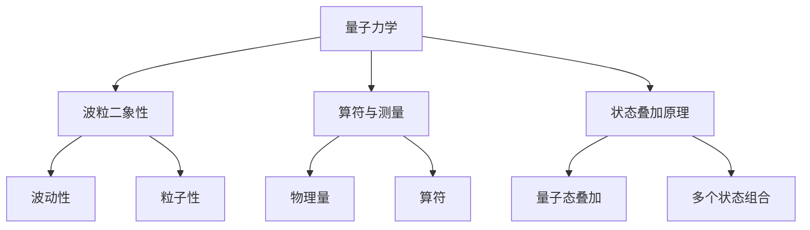
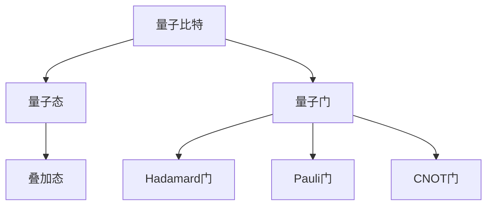
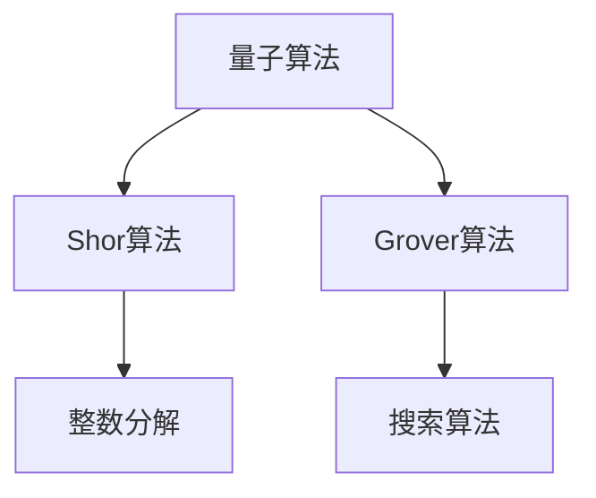
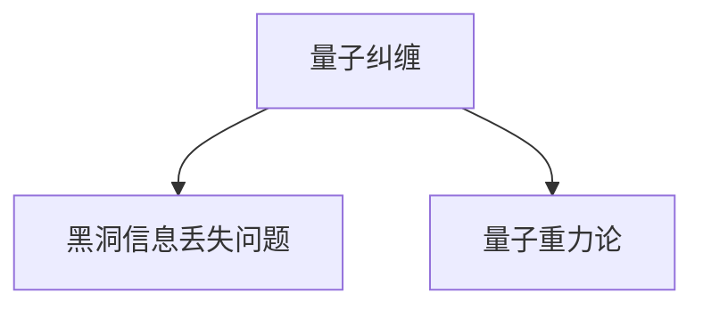
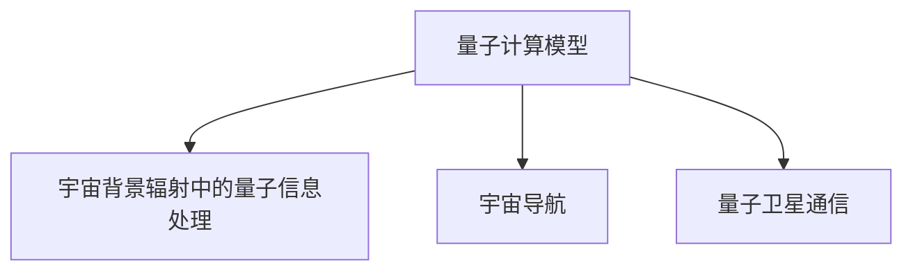
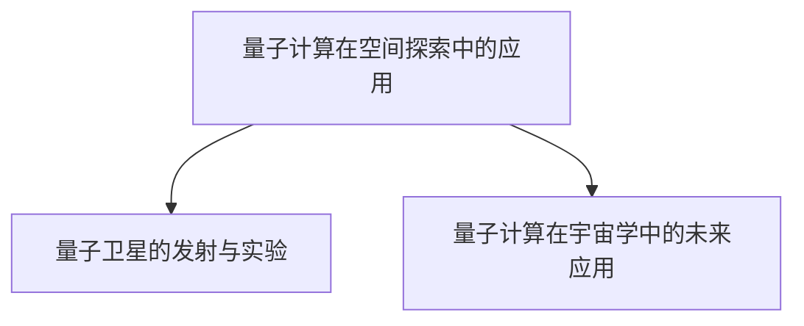
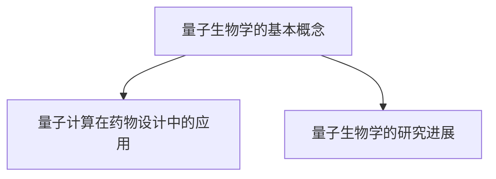
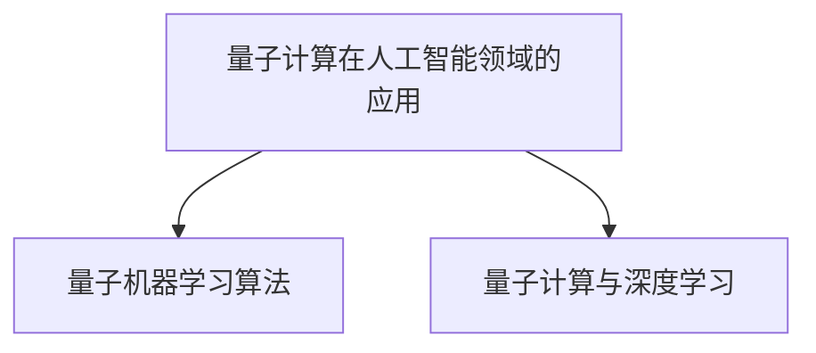
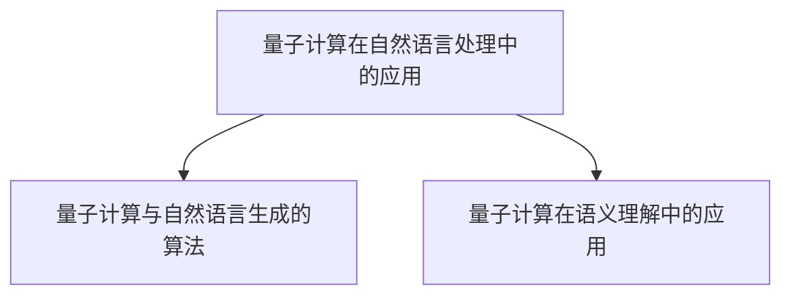

                 


### 文章标题：《宇宙的量子计算特性：自然界的信息处理》

#### 关键词：量子计算、宇宙、信息处理、量子力学、量子算法

> 摘要：本文深入探讨量子计算在宇宙信息处理中的作用，从量子力学的基本原理出发，逐步分析量子比特与量子计算、量子算法与经典算法的对比，以及量子计算在宇宙中的应用。通过量子生物学、量子计算与人工智能和自然语言处理的结合，揭示了量子计算与自然界信息处理的紧密联系。最后，展望量子计算的挑战与机遇，探讨其在宇宙信息处理中的未来前景。

### 目录大纲

#### 第一部分：量子计算基础

**第1章：量子力学的基本原理**

**第2章：量子比特与量子计算**

**第3章：量子算法与经典算法对比**

#### 第二部分：量子计算在宇宙中的应用

**第4章：宇宙中的量子现象**

**第5章：量子计算与宇宙信息处理**

**第6章：量子计算与宇宙探索**

#### 第三部分：量子计算与自然界的信息处理

**第7章：量子生物学**

**第8章：量子计算与人工智能**

**第9章：量子计算与自然语言处理**

#### 第四部分：量子计算的未来

**第10章：量子计算的挑战与机遇**

**第11章：量子计算与宇宙信息处理的前景**

#### 附录

**附录A：量子计算实验与工具**

**附录B：数学模型与公式**

**附录C：代码示例**

### 第1章：量子力学的基本原理

量子力学是研究微观粒子运动规律的科学，其基本原理对现代物理学、化学、计算机科学等领域产生了深远影响。以下是量子力学的一些关键概念：

#### 量子力学简介

量子力学诞生于20世纪初，由普朗克、玻尔、海森堡、薛定谔等科学家共同奠基。其核心思想是：微观粒子的行为不能单纯用经典物理学描述，而需要引入量子概念。

#### 波粒二象性

在量子力学中，粒子（如电子、光子）同时具有波动性和粒子性。这一观点由戴维逊-革末实验和康普顿散射实验等实验证实。

#### 算符与测量

量子力学中，物理量（如位置、动量、能量）不再具有明确值，而是通过算符作用在量子态上得到。算符是量子力学中的核心概念，用于描述粒子的状态变化。

#### 状态叠加原理

量子态可以处于多个状态的叠加，即一个量子系统可以同时处于多个状态的组合。这一原理是量子计算的基础。

#### 核心概念关系架构

以下是一个简单的 Mermaid 流程图，展示了量子力学的基本概念之间的关系：



### 第2章：量子比特与量子计算

量子比特（qubit）是量子计算的基本单元，与经典计算中的比特有本质区别。以下是量子比特与量子计算的一些关键概念：

#### 量子比特的概念

量子比特是具有两个可区分状态的量子系统，通常表示为 $|0\rangle$ 和 $|1\rangle$。量子比特可以处于这些状态的叠加，即 $|q\rangle = \alpha|0\rangle + \beta|1\rangle$，其中 $\alpha$ 和 $\beta$ 是复数。

#### 量子态与叠加

量子态可以处于多个状态的叠加，这意味着一个量子系统可以同时处于多个状态的组合。量子态的叠加是量子计算的核心特性。

#### 量子门与量子运算

量子门是作用于量子态的线性算符，用于实现量子计算的基本操作。常见的量子门包括 Hadamard 门、Pauli 门和 CNOT 门等。

以下是一个简单的伪代码示例，展示了量子计算的基本操作：

```python
# 创建量子电路
qc = QuantumCircuit(2)

# Hadamard门操作
qc.h(0)

# CNOT门操作
qc.cx(0, 1)

# 量子计算执行
qc.draw()
```

#### 量子逻辑门操作

量子逻辑门是量子计算中的基本操作，类似于经典计算中的逻辑门。常见的量子逻辑门包括：

- **Hadamard门（H门）**：将量子比特的状态转换为叠加态。
- **Pauli门（X、Y、Z门）**：对量子比特的相位进行翻转或旋转。
- **CNOT门**：作用于两个量子比特，实现量子比特之间的纠缠。

#### 核心概念关系架构

以下是一个简单的 Mermaid 流程图，展示了量子比特与量子计算的基本概念之间的关系：



### 第3章：量子算法与经典算法对比

量子算法在解决某些问题时具有显著优势，如整数分解和搜索算法。以下是量子算法与经典算法的对比：

#### 量子算法的基本原理

量子算法利用量子态的叠加和纠缠特性，实现高效的计算。量子算法的核心思想是：通过量子并行性解决复杂问题。

#### Shor算法

Shor算法是一种量子算法，可用于高效地分解大整数。该算法基于量子并行性和量子纠缠原理，其核心思想如下：

1. 将整数分解问题转化为周期性问题。
2. 利用量子并行性快速找到周期。
3. 利用量子计算求解整数分解。

以下是一个简单的伪代码示例，展示了Shor算法的基本思想：

```python
# Shor算法伪代码
def shor(n):
    # 创建量子电路
    qc = QuantumCircuit(2)

    # 编码问题
    qc.h(0)
    qc.cx(0, 1)

    # 量子计算执行
    qc.run()

    # 解码结果
    result = qc测量结果

    # 求解整数分解
    a, b = 分解结果

    return a, b
```

#### Grover算法

Grover算法是一种量子搜索算法，可用于高效地搜索未排序的数据库。该算法基于量子并行性和量子纠缠原理，其核心思想如下：

1. 将搜索问题转化为逻辑电路。
2. 利用量子并行性快速找到目标元素。
3. 利用量子计算求解搜索问题。

以下是一个简单的伪代码示例，展示了Grover算法的基本思想：

```python
# Grover算法伪代码
def grover(search_db, target):
    # 创建量子电路
    qc = QuantumCircuit(2)

    # 编码问题
    qc.h(0)
    qc.cx(0, 1)

    # 量子计算执行
    qc.run()

    # 解码结果
    result = qc测量结果

    # 搜索目标元素
    found = 搜索结果

    return found
```

#### 量子算法的优势与局限性

量子算法在解决某些问题时具有显著优势，如整数分解和搜索算法。然而，量子算法也面临一些挑战，如量子噪声和量子纠错等问题。

以下是一个简单的 Mermaid 流程图，展示了量子算法与经典算法的对比：



### 第4章：宇宙中的量子现象

宇宙中存在许多量子现象，如量子纠缠、黑洞信息丢失问题和量子重力论。以下是这些现象的基本原理：

#### 宇宙尺度的量子纠缠

量子纠缠是量子力学中的一种特殊现象，即两个或多个粒子之间存在一种密切的关联。宇宙尺度的量子纠缠现象在宇宙学、量子计算等领域具有重要意义。

#### 黑洞信息丢失问题

黑洞信息丢失问题是一个著名的物理学难题，即黑洞吞噬物质后，其内部信息是否会被完全毁灭。这一问题引发了关于量子力学、相对论和宇宙学的广泛讨论。

#### 量子重力论

量子重力论是研究量子力学与广义相对论之间关系的理论。该理论试图将量子力学和广义相对论统一起来，以描述宇宙中的基本作用力。

#### 核心概念关系架构

以下是一个简单的 Mermaid 流程图，展示了宇宙中的量子现象之间的关系：



### 第5章：量子计算与宇宙信息处理

量子计算在宇宙信息处理中具有巨大潜力。以下是量子计算在宇宙信息处理中的应用：

#### 宇宙中的量子计算模型

量子计算模型可以用于模拟宇宙中的物理过程，如黑洞事件视界、宇宙背景辐射等。这些模型有助于我们更好地理解宇宙的演化过程。

#### 量子计算在宇宙信息处理中的潜在应用

量子计算在宇宙信息处理中具有广泛的应用前景，如量子卫星通信、宇宙导航、宇宙观测等。这些应用有助于提高我们对宇宙的认识。

#### 宇宙背景辐射中的量子信息处理

宇宙背景辐射是宇宙早期的一种辐射现象，其中可能蕴含着丰富的量子信息。量子计算可以用于分析和提取这些信息，以揭示宇宙的起源和演化过程。

#### 核心概念关系架构

以下是一个简单的 Mermaid 流程图，展示了量子计算在宇宙信息处理中的应用：



### 第6章：量子计算与宇宙探索

量子计算在宇宙探索中发挥着重要作用。以下是量子计算在宇宙探索中的应用：

#### 量子计算在空间探索中的应用

量子计算可以用于提高空间探测器的性能，如量子传感器、量子通信等。这些应用有助于我们更好地了解宇宙的奥秘。

#### 量子卫星的发射与实验

量子卫星是一种利用量子纠缠进行通信的卫星。我国已经成功发射了多颗量子卫星，并开展了相关实验。

#### 量子计算在宇宙学中的未来应用

量子计算在宇宙学中具有广泛的应用前景，如量子引力模拟、宇宙大爆炸模拟等。这些应用将有助于我们更深入地理解宇宙的起源和演化过程。

#### 核心概念关系架构

以下是一个简单的 Mermaid 流程图，展示了量子计算在宇宙探索中的应用：



### 第7章：量子生物学

量子生物学研究生物体系中是否存在量子现象，以及这些现象对生物过程的影响。以下是量子生物学的一些关键概念：

#### 量子生物学的基本概念

量子生物学是研究生物体系中是否存在量子现象，如量子纠缠、量子隧穿等。这些现象可能对生物过程产生重要影响。

#### 量子生物学的研究进展

近年来，量子生物学取得了许多重要进展，如量子计算在药物设计中的应用、植物光合作用的量子机制等。

#### 量子生物学在药物设计中的应用

量子生物学可以用于优化药物分子结构，提高药物的治疗效果。例如，通过量子计算模拟蛋白质与药物分子之间的相互作用，可以筛选出具有更高活性的药物。

#### 核心概念关系架构

以下是一个简单的 Mermaid 流程图，展示了量子生物学的基本概念和研究进展：



### 第8章：量子计算与人工智能

量子计算在人工智能领域具有巨大潜力。以下是量子计算在人工智能中的应用：

#### 量子计算在人工智能领域的应用

量子计算可以用于优化机器学习算法，提高人工智能系统的性能。例如，通过量子计算加速深度学习模型的训练，可以显著缩短训练时间。

#### 量子机器学习算法

量子机器学习算法是一种利用量子计算特性进行机器学习的算法。这些算法可以在某些情况下显著提高学习效率。

以下是一个简单的伪代码示例，展示了量子机器学习算法的基本思想：

```python
# 量子机器学习算法伪代码
def quantum_learning(data, labels):
    # 创建量子电路
    qc = QuantumCircuit(2)

    # 编码数据
    qc.h(0)
    qc.cx(0, 1)

    # 量子计算执行
    qc.run()

    # 解码结果
    result = qc测量结果

    # 更新模型参数
    model.update(result)

    return model
```

#### 量子计算与深度学习

量子计算可以用于优化深度学习模型的训练过程，提高模型的性能。例如，通过量子计算加速卷积神经网络（CNN）的训练，可以显著缩短训练时间。

以下是一个简单的 Mermaid 流程图，展示了量子计算在人工智能中的应用：



### 第9章：量子计算与自然语言处理

量子计算在自然语言处理（NLP）领域具有广泛的应用前景。以下是量子计算在NLP中的应用：

#### 量子计算在自然语言处理中的应用

量子计算可以用于优化NLP模型的训练过程，提高模型的性能。例如，通过量子计算加速循环神经网络（RNN）的训练，可以显著缩短训练时间。

#### 量子计算与自然语言生成的算法

量子计算可以用于生成自然语言文本，例如诗歌、小说等。这些算法可以生成高质量的文本，并在某些情况下显著提高文本的生成效率。

以下是一个简单的伪代码示例，展示了量子计算在自然语言处理中的应用：

```python
# 量子计算在自然语言处理中的应用伪代码
def quantum_nlp(text):
    # 创建量子电路
    qc = QuantumCircuit(2)

    # 编码文本
    qc.h(0)
    qc.cx(0, 1)

    # 量子计算执行
    qc.run()

    # 解码结果
    result = qc测量结果

    # 生成文本
    generated_text = generate_text(result)

    return generated_text
```

#### 量子计算在语义理解中的应用

量子计算可以用于提高语义理解的性能，例如，通过量子计算优化词嵌入模型，可以显著提高文本分类和情感分析等任务的性能。

以下是一个简单的 Mermaid 流程图，展示了量子计算在自然语言处理中的应用：



### 第10章：量子计算的挑战与机遇

量子计算在快速发展，但仍面临许多挑战。以下是量子计算的挑战与机遇：

#### 量子计算的发展现状

目前，量子计算仍处于早期阶段，主要挑战包括量子比特的稳定性、量子纠错和量子硬件的可靠性等。

#### 量子计算的技术挑战

量子计算的技术挑战包括如何实现高效、可靠的量子比特，如何构建可扩展的量子计算机，以及如何解决量子纠错等问题。

#### 量子计算的机遇与未来趋势

量子计算在解决某些复杂问题上具有显著优势，例如量子优化、量子模拟和量子加密等。未来，量子计算有望在人工智能、量子通信和量子计算等领域发挥重要作用。

### 第11章：量子计算与宇宙信息处理的前景

量子计算在宇宙信息处理中具有巨大潜力。以下是量子计算在宇宙信息处理中的未来应用：

#### 量子计算在宇宙信息处理中的未来应用

量子计算可以用于提高宇宙观测和数据分析的效率，例如，通过量子计算加速宇宙背景辐射的信号处理，可以更精确地揭示宇宙的起源和演化过程。

#### 量子计算在探索宇宙未知领域的作用

量子计算可以用于探索宇宙中的未知领域，例如，通过量子计算模拟宇宙中的物理过程，可以更深入地了解宇宙的奥秘。

#### 量子计算与人类文明的未来

量子计算在人类文明的未来中将发挥重要作用，例如，通过量子计算加速科学发现、技术创新和经济发展等。

### 附录

#### 附录A：量子计算实验与工具

本附录介绍了量子计算实验的基本概念和工具。

#### 附录B：数学模型与公式

本附录提供了量子计算中常用的数学模型和公式。

#### 附录C：代码示例

本附录提供了量子计算的基本操作和算法的代码示例。

### 结束语

本文从量子力学的基本原理出发，逐步分析了量子比特与量子计算、量子算法与经典算法对比、量子计算在宇宙中的应用，以及量子计算与自然界的信息处理等方面的内容。通过对量子计算的关键概念、算法原理和实际应用的深入探讨，我们揭示了量子计算在宇宙信息处理中的巨大潜力。未来，量子计算将在人类文明的未来中发挥越来越重要的作用。

