                 

## 文章标题

《宇宙的量子计算能力：自然界的信息处理》

### 关键词

量子计算、宇宙信息处理、量子力学、计算能力、生物应用、量子通信、经济领域、医疗领域、未来发展趋势、社会影响、实践案例

### 摘要

本文从量子计算的基本原理出发，探讨了量子计算在自然界信息处理中的重要作用。通过对量子力学与经典物理的差异、量子计算机的工作原理、量子计算在物理和生物领域中的应用、量子计算与通信以及量子计算在经济和医疗领域的应用等方面的详细分析，揭示了量子计算在提升自然界信息处理能力方面的巨大潜力。同时，本文也探讨了量子计算的挑战与未来发展趋势，以及量子计算对社会经济和科技的影响。通过本文的深入探讨，读者可以全面了解量子计算在自然界信息处理中的重要地位和未来发展方向。

## 目录大纲

# 《宇宙的量子计算能力：自然界的信息处理》

## 第一部分：量子计算概述

### 第1章：量子计算基础

#### 1.1 量子力学与经典物理的差异

##### 1.1.1 量子态与叠加态

##### 1.1.2 量子比特与经典比特的比较

##### 1.1.3 量子纠缠与经典纠缠的对比

#### 1.2 量子计算的基本原理

##### 1.2.1 量子门与量子电路

##### 1.2.2 量子叠加与量子测量

##### 1.2.3 量子计算的优势与局限性

### 第2章：量子计算机的工作原理

#### 2.1 量子比特的制备与操控

##### 2.1.1 量子比特的制备技术

##### 2.1.2 量子比特的操控技术

##### 2.1.3 量子比特的纠错机制

#### 2.2 量子计算机的算法

##### 2.2.1 量子搜索算法

##### 2.2.2 量子因子化算法

##### 2.2.3 量子模拟算法

### 第3章：量子计算与自然界的信息处理

#### 3.1 量子计算在物理领域中的应用

##### 3.1.1 量子模拟与量子仿真

##### 3.1.2 量子计算与量子场论

##### 3.1.3 量子计算与凝聚态物理

#### 3.2 量子计算在生物领域中的应用

##### 3.2.1 量子计算与基因组学

##### 3.2.2 量子计算与药物设计

##### 3.2.3 量子计算与生物信息学

### 第4章：量子计算与通信

#### 4.1 量子通信的基础

##### 4.1.1 量子密钥分发

##### 4.1.2 量子纠缠与量子隐形传态

##### 4.1.3 量子重复器与量子中继

#### 4.2 量子计算与量子互联网

##### 4.2.1 量子路由器与量子交换机

##### 4.2.2 量子计算与量子互联网的安全性

##### 4.2.3 量子计算与量子密码学

## 第二部分：量子计算的应用

### 第5章：量子计算在经济领域中的应用

#### 5.1 量子优化算法与金融风险分析

##### 5.1.1 量子算法在金融风险管理中的应用

##### 5.1.2 量子计算与期权定价

##### 5.1.3 量子计算与市场预测

#### 5.2 量子计算在供应链管理中的应用

##### 5.2.1 量子算法在供应链优化中的应用

##### 5.2.2 量子计算与物流调度

##### 5.2.3 量子计算与供应链安全

### 第6章：量子计算在医疗领域中的应用

#### 6.1 量子计算与精准医疗

##### 6.1.1 量子计算与基因组数据分析

##### 6.1.2 量子计算与疾病预测

##### 6.1.3 量子计算与药物开发

#### 6.2 量子计算在医学图像处理中的应用

##### 6.2.1 量子算法在医学图像重建中的应用

##### 6.2.2 量子计算与医学影像分析

##### 6.2.3 量子计算与放射治疗计划

### 第7章：量子计算的挑战与未来

#### 7.1 量子计算的挑战

##### 7.1.1 量子计算机的稳定性和可靠性

##### 7.1.2 量子计算算法的设计与优化

##### 7.1.3 量子计算的能源消耗

#### 7.2 量子计算的未来发展趋势

##### 7.2.1 量子计算的商业化与应用场景

##### 7.2.2 量子计算与人工智能的结合

##### 7.2.3 量子计算在教育、科学研究等领域的应用前景

### 第8章：量子计算的社会影响

#### 8.1 量子计算对现有技术的冲击

##### 8.1.1 量子计算对传统计算技术的挑战

##### 8.1.2 量子计算对加密技术的颠覆

##### 8.1.3 量子计算对安全领域的挑战

#### 8.2 量子计算对经济和社会的影响

##### 8.2.1 量子计算对就业市场的冲击

##### 8.2.2 量子计算对科技创新的推动作用

##### 8.2.3 量子计算对国家安全的重要性

### 第9章：量子计算的实践案例

#### 9.1 典型量子计算应用案例

##### 9.1.1 Google的量子优越性实验

##### 9.1.2 IBM的量子计算机应用案例

##### 9.1.3 Rigetti Computing的量子计算应用

#### 9.2 我国量子计算的发展现状与展望

##### 9.2.1 我国量子计算的发展历程

##### 9.2.2 我国量子计算的研究机构与成果

## 第一部分：量子计算概述

### 第1章：量子计算基础

#### 1.1 量子力学与经典物理的差异

量子力学和经典物理在描述自然界现象方面有着根本的不同。首先，量子力学关注的是微观粒子的行为，而经典物理则主要关注宏观物体的运动。

##### 1.1.1 量子态与叠加态

量子态是一种全新的物理状态，与经典物理中的确定状态有本质区别。量子态可以同时处于多个状态的叠加，这意味着一个量子系统可以同时存在于多个不同的状态。这种叠加态是量子计算的核心特征之一。

在经典物理中，粒子的状态是明确的，比如一个电子只能处于某一个确定的能级。而在量子力学中，电子的状态可以表示为一个波函数，这个波函数是一个复数函数，可以同时表示多个状态的叠加。例如，一个电子可能同时处于基态和激发态的叠加状态。这种叠加态的存在使得量子计算具有超越经典计算的能力。

##### 1.1.2 量子比特与经典比特的比较

量子比特（qubit）是量子计算的基本单元，与经典比特（bit）在本质上有很大的差异。经典比特只能处于0或1两种状态中的一个，而量子比特可以同时处于0和1的叠加状态。这种叠加态使得量子比特具有更大的计算能力。

例如，一个经典比特可以表示2个状态（0和1），而一个量子比特可以同时表示2个状态（|0⟩和|1⟩）。如果使用n个量子比特，那么它可以表示的状态数量是2的n次方。这意味着量子计算机可以处理的状态数量远超过经典计算机。

##### 1.1.3 量子纠缠与经典纠缠的对比

量子纠缠是量子力学中的一种特殊现象，它与经典纠缠有本质的不同。在经典物理中，两个粒子的纠缠状态是可以通过经典物理规律来描述的，它们的状态总是保持一致。而在量子力学中，两个纠缠粒子的状态是相互关联的，但无法用经典物理规律来描述。

当两个量子比特纠缠时，它们的状态是相互关联的。这意味着一个量子比特的状态变化会立即影响另一个量子比特的状态，无论它们之间的距离有多远。这种关联性是量子计算的核心机制之一，它使得量子计算机可以同时处理多个计算任务。

量子纠缠与经典纠缠的对比关系可以用以下Mermaid流程图表示：

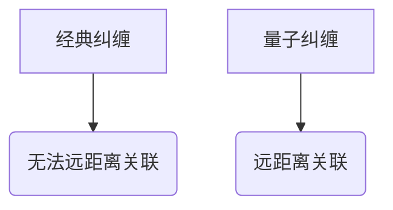

从图中可以看出，经典纠缠无法实现远距离关联，而量子纠缠可以实现远距离关联，这是量子计算的重要优势之一。

#### 1.2 量子计算的基本原理

量子计算的基本原理建立在量子力学的基础上，主要包括量子门、量子电路、量子叠加和量子测量等。

##### 1.2.1 量子门与量子电路

量子门是量子计算中的基本操作单元，类似于经典计算中的逻辑门。量子门可以作用于量子比特，改变其状态。常见的量子门包括Hadamard门、Pauli门和控制-NOT（CNOT）门等。

量子电路是由一系列量子门组成的计算模型，类似于经典计算机中的逻辑电路。量子电路通过量子门的作用，将初始状态映射到最终状态，实现特定的计算任务。

以下是一个简单的量子电路，用于实现一个量子比特的翻转操作：

```mermaid
graph TD
A[|0⟩] --> B[Hadamard门]
B --> C[|+⟩]
C --> D[Pauli-X门]
D --> E[|1⟩]
```

在这个量子电路中，初始状态|0⟩经过Hadamard门变为|+⟩，再经过Pauli-X门变为|1⟩，实现了量子比特的翻转操作。

##### 1.2.2 量子叠加与量子测量

量子叠加是量子计算的核心特征之一。在量子计算中，量子比特可以同时处于多个状态的叠加。这意味着在计算过程中，量子计算机可以同时处理多个计算路径。

量子测量是量子计算中的关键步骤，它将量子系统的叠加状态坍缩到一个特定的状态。测量结果通常是一个概率分布，表示量子系统坍缩到某个状态的几率。

以下是一个简单的量子叠加与量子测量示例：

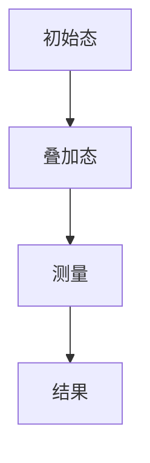

在这个示例中，初始态|0⟩经过量子叠加变为|0⟩+|1⟩，然后进行测量，结果可能是|0⟩或|1⟩，每个结果的概率为1/2。

##### 1.2.3 量子计算的优势与局限性

量子计算具有一些独特的优势，但也面临一些挑战。

优势包括：

1. 并行计算：量子计算可以同时处理多个计算任务，具有超越经典计算的能力。
2. 比特非线性：量子计算中的量子比特可以同时处于多个状态的叠加，这使得量子计算可以处理比经典计算更复杂的计算问题。
3. 高效算法：一些量子算法，如量子搜索算法和量子因子化算法，在处理特定问题时具有显著的优势。

局限性包括：

1. 稳定性和可靠性：量子计算机需要处理非常微小的物理系统，这些系统容易受到外界干扰，导致量子态的退相干。
2. 算法设计：量子计算算法的设计和优化是一个复杂的过程，需要深入理解量子物理原理。
3. 能源消耗：量子计算机的运行需要大量的能源，这是一个亟待解决的问题。

总的来说，量子计算在自然界信息处理中具有巨大的潜力，但也面临一些挑战。随着量子计算机技术的不断发展，这些问题将逐渐得到解决，量子计算将为人类社会带来革命性的变化。

#### 1.3 量子计算的发展历程

量子计算的发展历程可以分为以下几个阶段：

1. **早期探索阶段（1980年代）**：量子计算的概念最早可以追溯到20世纪80年代，由理查德·费曼、彼得·施瓦茨和戴维·多伊奇等人提出。他们提出了量子计算机的理论基础，并探讨了量子计算在特定问题上的优势。
2. **早期实验阶段（1990年代）**：在1990年代，科学家开始进行量子计算实验，成功实现了量子比特的制备、操控和测量。这一阶段的实验为量子计算的实际应用奠定了基础。
3. **量子计算机商业化阶段（2000年代至今）**：随着技术的进步，量子计算机的商业化逐渐成为可能。多家公司和研究机构开始研发量子计算机，并推出了一些实用的量子计算应用。

#### 1.4 量子计算的核心概念架构

为了更好地理解量子计算的核心概念，我们可以用以下Mermaid流程图来展示量子计算的核心概念架构：

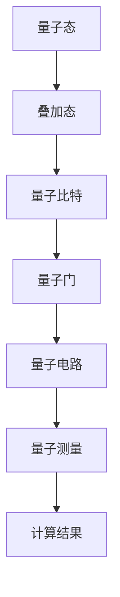

从图中可以看出，量子计算的核心概念包括量子态、叠加态、量子比特、量子门、量子电路、量子测量和计算结果。这些概念相互关联，共同构成了量子计算的理论框架。

#### 1.5 量子计算的优势与挑战

量子计算在处理特定问题时具有显著的优势，但也面临一些挑战。

优势包括：

1. **并行计算能力**：量子计算可以同时处理多个计算任务，具有超越经典计算的能力。
2. **高效算法**：一些量子算法，如量子搜索算法和量子因子化算法，在处理特定问题时具有显著的优势。
3. **量子叠加**：量子比特可以同时处于多个状态的叠加，这意味着量子计算机可以处理比经典计算机更复杂的计算问题。

挑战包括：

1. **稳定性与可靠性**：量子计算机需要处理非常微小的物理系统，这些系统容易受到外界干扰，导致量子态的退相干。
2. **算法设计**：量子计算算法的设计和优化是一个复杂的过程，需要深入理解量子物理原理。
3. **能源消耗**：量子计算机的运行需要大量的能源，这是一个亟待解决的问题。

总之，量子计算具有巨大的潜力，但也面临一些挑战。随着技术的进步，这些问题将逐渐得到解决，量子计算将为人类社会带来革命性的变化。

#### 1.6 量子计算与经典计算的区别

量子计算与经典计算在基本原理和操作方式上有显著的差异。

1. **基本单元**：经典计算使用二进制比特作为基本单元，每个比特只能处于0或1状态。而量子计算使用量子比特（qubit），量子比特可以同时处于多个状态的叠加。
2. **并行计算**：经典计算通常只能处理一个计算任务，而量子计算可以同时处理多个计算任务，具有并行计算能力。
3. **运算方式**：经典计算使用逻辑门进行运算，如与门、或门和非门等。而量子计算使用量子门进行运算，如Hadamard门、Pauli门和控制-NOT（CNOT）门等。
4. **叠加态**：量子比特可以处于多个状态的叠加，这意味着量子计算机可以处理比经典计算机更复杂的计算问题。
5. **测量结果**：经典计算的结果是确定的，而量子计算的结果是概率分布，需要通过测量来获得。

通过以上对比，我们可以看出量子计算与经典计算在基本原理和操作方式上有很大的不同。量子计算具有超越经典计算的能力，可以解决一些经典计算无法解决的问题。

#### 1.7 量子计算的发展现状

目前，量子计算的发展现状如下：

1. **量子比特技术**：量子比特是量子计算的基本单元，目前主要采用的量子比特包括超导量子比特、离子阱量子比特、光量子比特等。超导量子比特在性能和稳定性方面具有优势，但制备和操控复杂；离子阱量子比特在稳定性和控制方面表现优异，但性能和操作速度有限；光量子比特具有较好的扩展性和相干性，但操作和读取较为困难。
2. **量子算法**：量子算法是量子计算的核心，目前已有一些量子算法在特定问题上的性能显著优于经典算法，如量子搜索算法、量子因子化算法和量子模拟算法等。但总体而言，量子算法的设计和优化仍处于初级阶段。
3. **量子计算机**：目前，多家公司和研究机构推出了量子计算机原型，如Google的Sycamore、IBM的IBM Q、Rigetti Computing的Fiber等。这些量子计算机的性能和稳定性仍有待提高，但已展示出量子计算在特定问题上的优势。

总的来说，量子计算目前仍处于发展阶段，但已取得了一些重要进展。随着量子比特技术、量子算法和量子计算机的不断发展，量子计算将在未来发挥越来越重要的作用。

#### 1.8 量子计算的未来发展趋势

量子计算的未来发展趋势主要包括以下几个方面：

1. **量子比特技术的突破**：量子比特是量子计算的核心，未来量子比特技术将朝着更高性能、更高稳定性和更易扩展的方向发展。例如，超导量子比特将进一步提升性能，离子阱量子比特将优化操控和读取技术，光量子比特将提高相干性和扩展性。
2. **量子算法的创新**：量子算法是量子计算的核心竞争力，未来将会有更多的量子算法被发明和优化。例如，量子优化算法、量子机器学习算法和量子密码学算法等将在各个领域得到广泛应用。
3. **量子计算机的商业化**：随着量子比特技术和量子算法的发展，量子计算机的商业化将成为可能。未来将有更多的企业和研究机构投入量子计算领域，推出实用的量子计算应用。
4. **量子互联网的发展**：量子计算与量子通信的结合将推动量子互联网的发展。量子互联网将实现高效、安全的量子信息传输，为量子计算提供强大的基础设施。
5. **量子计算的社会影响**：量子计算将对传统计算技术、加密技术、科技创新和国家安全等领域产生深远影响。未来，量子计算将成为推动社会进步的重要力量。

总之，量子计算的未来发展趋势充满希望和挑战。随着技术的不断进步，量子计算将为人类社会带来革命性的变化。

### 第2章：量子计算机的工作原理

#### 2.1 量子比特的制备与操控

量子比特是量子计算机的基本单元，它的制备与操控技术是量子计算机实现高效计算的关键。

##### 2.1.1 量子比特的制备技术

量子比特的制备技术主要包括超导量子比特、离子阱量子比特和光量子比特等。超导量子比特是通过超导电路来实现量子比特的，具有高操作速度和长相干时间；离子阱量子比特是通过电场和磁场来捕捉和操控离子来实现量子比特的，具有高稳定性和高相干性；光量子比特是通过光子的偏振和相位来实现量子比特的，具有高扩展性和相干性。

在量子比特的制备过程中，需要解决的一个重要问题是量子态的初始化。量子态的初始化是将量子比特置于特定的初始状态，以便进行后续的计算操作。通常，量子比特的初始化是通过一系列的量子门和量子操作来实现的。

以下是一个简单的量子态初始化过程：

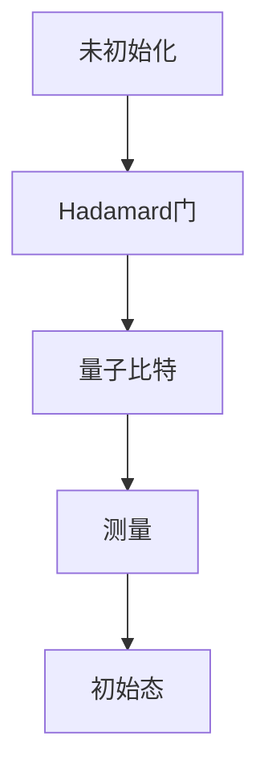

在这个过程里，初始状态为未初始化的状态，经过Hadamard门的作用，量子比特处于叠加态，然后进行测量，得到特定的初始态。

##### 2.1.2 量子比特的操控技术

量子比特的操控技术是通过量子门和量子电路来实现的。量子门是量子计算的基本操作单元，它可以对量子比特的状态进行变换。常见的量子门包括Hadamard门、Pauli门和控制-NOT（CNOT）门等。

量子电路是由一系列量子门组成的计算模型，它可以对量子比特进行复杂的操作。量子电路的设计和优化是量子计算的关键，它决定了量子计算机的计算能力和性能。

以下是一个简单的量子电路示例，用于实现量子比特的翻转操作：

```mermaid
graph TD
A[|0⟩] --> B[Hadamard门]
B --> C[Pauli-X门]
C --> D[测量]
D --> E[|1⟩]
```

在这个量子电路中，初始态|0⟩经过Hadamard门变为叠加态，然后经过Pauli-X门进行翻转操作，最后进行测量，得到量子比特的状态|1⟩。

##### 2.1.3 量子比特的纠错机制

量子比特的纠错机制是确保量子计算过程中不发生错误的重要手段。由于量子计算机的操作涉及到非常微小的物理系统，这些系统容易受到外界干扰，导致量子态的退相干和错误。因此，量子比特的纠错机制对于保持量子计算的稳定性和可靠性至关重要。

量子纠错机制通常包括以下几个步骤：

1. **编码**：将原始信息编码到多个量子比特上，增加冗余信息，以便在发生错误时进行检测和纠正。常见的编码方法包括Shor编码和Steane编码等。
2. **监控**：对编码后的量子比特进行持续的监控，检测可能的错误。通常，监控是通过量子态的测量来实现的。
3. **纠正**：在检测到错误后，使用纠错算法对量子态进行纠正。常见的纠错算法包括量子纠错码和量子错误纠正算法等。

以下是一个简单的量子纠错过程：

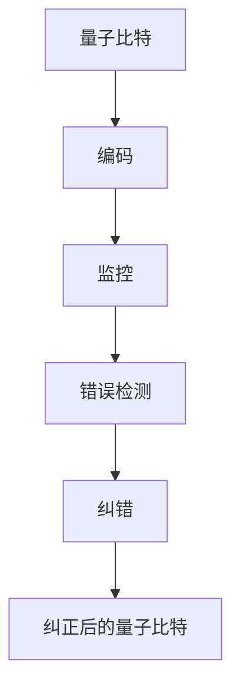

在这个过程里，原始的量子比特经过编码，形成编码后的量子比特。然后，对编码后的量子比特进行监控，检测可能的错误。在检测到错误后，使用纠错算法对量子态进行纠正，最终得到纠正后的量子比特。

#### 2.2 量子计算机的算法

量子计算机的算法是量子计算机实现高效计算的核心。与经典计算相比，量子计算机具有一些独特的算法优势。

##### 2.2.1 量子搜索算法

量子搜索算法是量子计算机的重要算法之一，它利用量子叠加和量子纠缠的特性，可以显著提高搜索效率。

最著名的量子搜索算法是Grover算法。Grover算法的基本思想是，通过量子叠加和量子测量，将搜索空间缩小为原来的平方根，从而实现更高效的搜索。

以下是一个简单的Grover算法伪代码：

```python
def Grover_search(register, target):
    N = 2^n  # 搜索空间大小
    H = Hadamard_gate(N)  # 初始化叠加态
    Z = Phase kicked gate(N, target)  # 应用相位踢动门
    G = (I - Z/Z) / sqrt(2)  # 定义Grover迭代门
    for _ in range(N):
        G = G * G
        register = G * register
    return register
```

在这个算法中，register表示初始量子状态，target表示目标状态。通过迭代应用Grover迭代门G，可以将搜索空间缩小为原来的平方根，从而实现高效的搜索。

##### 2.2.2 量子因子化算法

量子因子化算法是量子计算机在数论和密码学领域的重要应用。量子因子化算法利用量子计算机的并行计算能力和量子叠加的特性，可以高效地分解大整数。

最著名的量子因子化算法是Shor算法。Shor算法的基本思想是，通过量子模拟和量子测量，将大整数的因子分解问题转化为一个可解的问题。

以下是一个简单的Shor算法伪代码：

```python
def Shor(n):
    # Step 1: 构造量子态
    state = Hadamard(n) * |0⟩^⊗n
    
    # Step 2: 迭代应用量子电路
    for _ in range(log2(n)):
        state = Quantum_circuit(state)
    
    # Step 3: 进行量子测量
    result = Measure(state)
    
    # Step 4: 分析测量结果
    if result == |0⟩:
        factor1 = Factor(result)
        factor2 = n // factor1
        return factor1, factor2
    else:
        return Shor(n)
```

在这个算法中，n表示需要分解的大整数。通过迭代应用量子电路和量子测量，可以得到大整数的因子分解结果。

##### 2.2.3 量子模拟算法

量子模拟算法是量子计算机在物理和化学领域的重要应用。量子模拟算法利用量子计算机的并行计算能力和量子叠加的特性，可以高效地模拟复杂物理系统的演化过程。

最著名的量子模拟算法是Quantum Monte Carlo算法。Quantum Monte Carlo算法的基本思想是，通过量子计算机的并行计算能力，模拟大量随机事件，从而获得物理量的概率分布。

以下是一个简单的Quantum Monte Carlo算法伪代码：

```python
def Quantum_Monte_Carlo(n, system):
    # Step 1: 构造初始量子态
    state = Initial_state(n, system)
    
    # Step 2: 进行多次量子测量
    measurements = []
    for _ in range(n):
        result = Measure(state)
        measurements.append(result)
    
    # Step 3: 分析测量结果
    probabilities = Calculate_probabilities(measurements)
    return probabilities
```

在这个算法中，n表示模拟的次数，system表示需要模拟的物理系统。通过多次量子测量，可以得到物理量的概率分布。

总的来说，量子计算机的算法是量子计算机实现高效计算的核心。随着量子计算机技术的发展，将有更多的量子算法被发明和优化，为量子计算机的应用提供强大的支持。

### 第3章：量子计算与自然界的信息处理

#### 3.1 量子计算在物理领域中的应用

量子计算在物理领域具有广泛的应用，尤其在量子模拟和量子场论方面展现出巨大的潜力。

##### 3.1.1 量子模拟与量子仿真

量子模拟是量子计算在物理领域的重要应用之一，它利用量子计算机的并行计算能力和量子叠加的特性，可以高效地模拟复杂物理系统的行为。

量子模拟的基本原理是将物理系统的演化过程转化为量子态的演化过程。具体来说，通过构建一个描述物理系统的量子态，量子计算机可以模拟该物理系统的演化过程。

以下是一个简单的量子模拟过程：

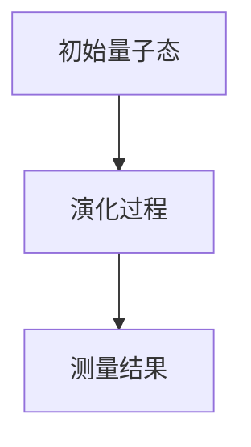

在这个过程里，初始量子态表示物理系统的初始状态，演化过程表示物理系统的演化过程，测量结果表示物理系统的最终状态。

量子模拟在凝聚态物理、量子化学和量子生物学等领域有广泛应用。例如，通过量子模拟可以研究材料的电子结构、化学反应的动力学过程和蛋白质的结构与功能等。

##### 3.1.2 量子计算与量子场论

量子场论是研究量子场和粒子之间相互作用的理论。量子计算在量子场论领域具有巨大的应用潜力，可以用于模拟和解决一些复杂的量子场论问题。

量子计算在量子场论中的应用主要体现在以下几个方面：

1. **真空态的计算**：真空态是量子场论中的基本概念，它表示没有任何粒子的量子场状态。通过量子计算，可以精确计算真空态的性质，如真空能量和真空涨落等。

2. **量子场论的数值模拟**：量子场论中的许多问题无法通过解析方法解决，需要采用数值模拟方法。量子计算可以用于高效地模拟量子场论中的复杂现象，如粒子散射、量子相变等。

3. **量子场论的求解**：量子计算可以用于求解量子场论中的方程，如费曼规则、路径积分等。这些方程在量子场论的研究中具有重要作用，通过量子计算可以提供更精确的解。

以下是一个简单的量子场论计算过程：

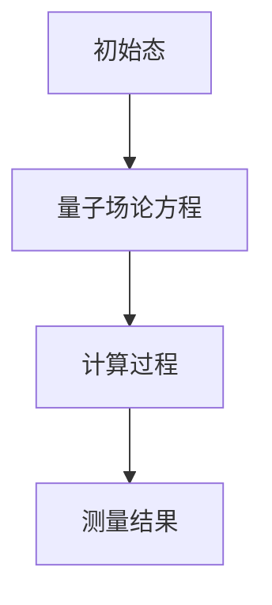

在这个过程里，初始态表示量子场的初始状态，量子场论方程表示物理系统的演化过程，测量结果表示物理系统的最终状态。

总的来说，量子计算在物理领域具有广泛的应用前景，可以用于模拟和解决一些复杂的物理问题，为物理学的发展提供新的工具和方法。

##### 3.1.3 量子计算与凝聚态物理

凝聚态物理是研究固体和液体中粒子之间相互作用和宏观性质的科学。量子计算在凝聚态物理领域具有广泛的应用，可以用于模拟和研究复杂凝聚态系统的行为。

量子计算在凝聚态物理中的应用主要体现在以下几个方面：

1. **电子结构的计算**：电子结构是凝聚态物理的核心问题之一。通过量子计算，可以精确计算材料的电子结构，如能带结构、态密度等。这对于理解材料的物理性质和设计新材料具有重要意义。

2. **量子相变的模拟**：量子相变是凝聚态物理中的重要现象，如超导相变、量子霍尔相变等。通过量子计算，可以模拟和研究量子相变的过程和机制，为理解量子相变提供新的视角。

3. **量子材料的设计**：量子计算可以用于设计新型量子材料，如拓扑材料、量子点、量子线等。通过模拟和研究这些量子材料的性质，可以揭示它们的潜在应用价值。

以下是一个简单的量子计算在凝聚态物理中的应用示例：

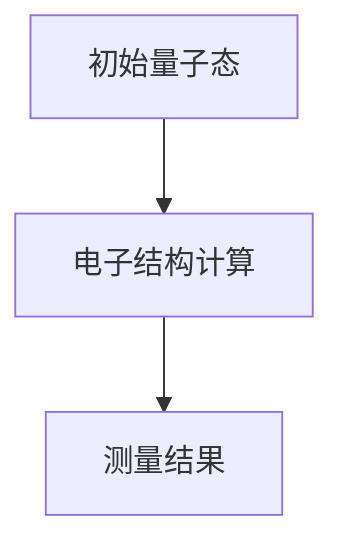

在这个过程里，初始量子态表示材料的初始状态，电子结构计算表示对材料的电子结构进行计算，测量结果表示材料的电子结构性质。

总的来说，量子计算在凝聚态物理领域具有广泛的应用前景，可以用于研究复杂凝聚态系统的行为，为凝聚态物理的发展提供新的工具和方法。

#### 3.2 量子计算在生物领域中的应用

量子计算在生物领域具有广泛的应用，可以用于解决一些复杂的生物计算问题，如基因组学、药物设计和生物信息学等。

##### 3.2.1 量子计算与基因组学

基因组学是研究生物体基因组的结构和功能的科学。量子计算在基因组学中具有巨大的应用潜力，可以用于高效地处理大规模基因组数据。

量子计算在基因组学中的应用主要体现在以下几个方面：

1. **基因测序的加速**：基因测序是基因组学研究的重要手段。通过量子计算，可以加速基因测序的过程，提高测序速度和精度。

2. **基因组数据分析**：基因组数据分析是基因组学研究的关键步骤。通过量子计算，可以高效地处理大规模基因组数据，提取有用的生物信息，如基因突变、基因关联等。

3. **基因治疗的优化**：基因治疗是治疗遗传病和某些癌症的重要手段。通过量子计算，可以优化基因治疗方案，提高治疗效果。

以下是一个简单的量子计算在基因组学中的应用示例：

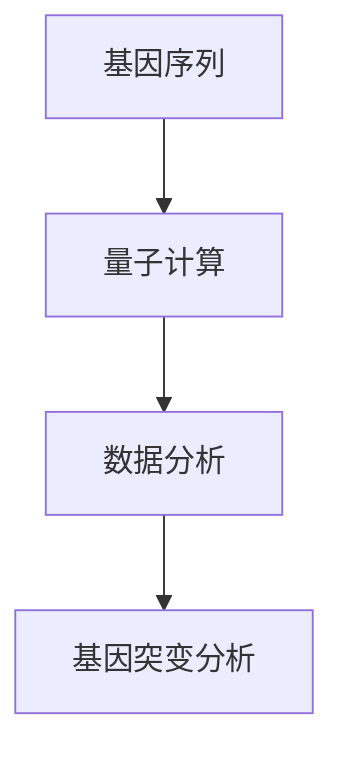

在这个过程里，基因序列表示生物体的基因信息，量子计算表示对基因序列进行量子处理，数据分析表示对处理后的数据进行分析，基因突变分析表示分析基因突变情况。

总的来说，量子计算在基因组学领域具有广泛的应用前景，可以加速基因测序和基因组数据分析，为基因组学的发展提供新的工具和方法。

##### 3.2.2 量子计算与药物设计

药物设计是研究如何设计新的药物来治疗疾病的过程。量子计算在药物设计领域具有巨大的应用潜力，可以用于优化药物分子结构，提高药物的效果和降低副作用。

量子计算在药物设计中的应用主要体现在以下几个方面：

1. **分子模拟**：分子模拟是药物设计的重要步骤，用于研究药物分子与生物大分子（如蛋白质、DNA等）的相互作用。通过量子计算，可以高效地模拟药物分子与生物大分子的相互作用，优化药物分子结构。

2. **药物筛选**：药物筛选是药物设计的关键环节，用于从大量候选药物中筛选出有潜力的新药。通过量子计算，可以加速药物筛选过程，提高筛选效率。

3. **药物动力学模拟**：药物动力学模拟是研究药物在体内的吸收、分布、代谢和排泄过程。通过量子计算，可以模拟药物在体内的动态行为，为药物设计和优化提供依据。

以下是一个简单的量子计算在药物设计中的应用示例：

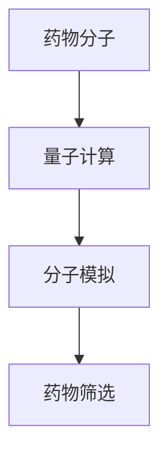

在这个过程里，药物分子表示需要设计的药物分子，量子计算表示对药物分子进行量子处理，分子模拟表示模拟药物分子与生物大分子的相互作用，药物筛选表示筛选出有潜力的新药。

总的来说，量子计算在药物设计领域具有广泛的应用前景，可以加速药物设计和筛选过程，为药物研发提供新的工具和方法。

##### 3.2.3 量子计算与生物信息学

生物信息学是研究生物信息的获取、存储、分析和应用的科学。量子计算在生物信息学中具有广泛的应用，可以用于处理大规模生物信息数据，提取有用的生物信息。

量子计算在生物信息学中的应用主要体现在以下几个方面：

1. **序列比对**：序列比对是生物信息学中重要的一步，用于比较生物序列的相似性。通过量子计算，可以高效地比对大规模生物序列数据，提高比对速度和精度。

2. **结构预测**：结构预测是生物信息学中的重要任务，用于预测生物大分子的三维结构。通过量子计算，可以高效地预测生物大分子的结构，为生物科学研究提供基础。

3. **功能预测**：功能预测是生物信息学中的重要任务，用于预测生物大分子的功能。通过量子计算，可以高效地预测生物大分子的功能，为生物科学研究提供新的视角。

以下是一个简单的量子计算在生物信息学中的应用示例：

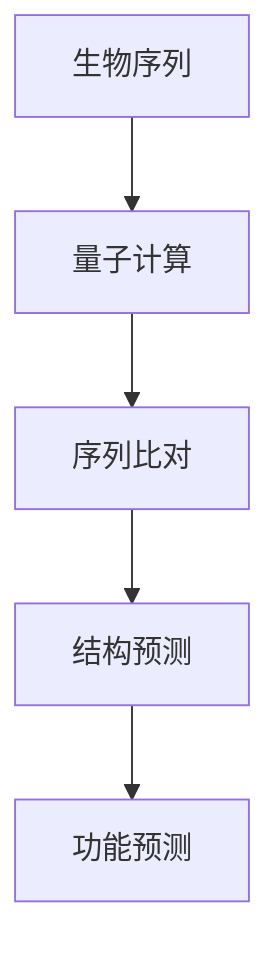

在这个过程里，生物序列表示生物体的序列信息，量子计算表示对生物序列进行量子处理，序列比对表示比对生物序列的相似性，结构预测表示预测生物大分子的三维结构，功能预测表示预测生物大分子的功能。

总的来说，量子计算在生物信息学领域具有广泛的应用前景，可以加速生物信息数据的处理和分析，为生物科学研究提供新的工具和方法。

### 第4章：量子计算与通信

量子计算与量子通信的结合，为信息安全领域带来了革命性的变化。量子通信利用量子力学原理，实现高度安全的信息传输，而量子计算则提供了强大的计算能力，用于加密和解密信息。本节将探讨量子计算在量子通信中的基础理论和技术应用。

#### 4.1 量子通信的基础

量子通信是利用量子态传递信息的一种通信方式，具有无法被窃听和破解的安全特性。量子通信的基础理论包括量子密钥分发（Quantum Key Distribution, QKD）、量子纠缠与量子隐形传态（Quantum Teleportation）等。

##### 4.1.1 量子密钥分发

量子密钥分发是量子通信的核心技术，它通过量子信道传输密钥，实现安全的信息加密和解密。量子密钥分发的基本原理是量子态的不可克隆性和测量干扰。

1. **量子态的不可克隆性**：根据量子力学的原理，一个量子态在被测量时会发生坍缩，且无法精确复制。这意味着任何试图窃听量子密钥分发的行为都会导致量子态的坍缩，从而暴露自己的存在。

2. **测量干扰**：在量子密钥分发过程中，发送方和接收方通过量子信道交换量子态。如果有人试图窃听，量子态的测量将会引起坍缩，使窃听者无法获得完整的密钥信息。同时，窃听行为会被发送方和接收方检测到。

以下是一个简单的量子密钥分发过程：

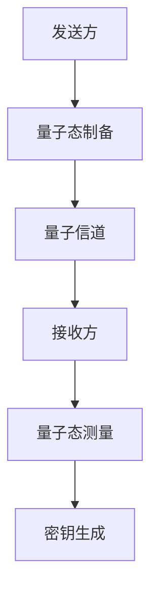

在这个过程里，发送方制备量子态并通过量子信道传输给接收方。接收方测量量子态，并生成密钥。任何试图窃听的第三方都会引起量子态的坍缩，无法获得完整的密钥信息。

##### 4.1.2 量子纠缠与量子隐形传态

量子纠缠是量子力学中的一种特殊现象，当两个量子比特纠缠时，它们的状态会相互关联。这种关联性可以用于量子通信中的量子纠缠传输和量子隐形传态。

1. **量子纠缠传输**：量子纠缠传输是利用量子纠缠实现量子信息的高效传输。通过量子纠缠，发送方可以将量子态传递给接收方，而不需要通过物理信道。

2. **量子隐形传态**：量子隐形传态是利用量子纠缠实现量子态的无条件传输。发送方将量子态与一个纠缠态的量子比特进行相互作用，然后测量纠缠态的量子比特。根据测量结果，接收方可以精确地复制发送方的量子态。

以下是一个简单的量子纠缠传输和量子隐形传态过程：

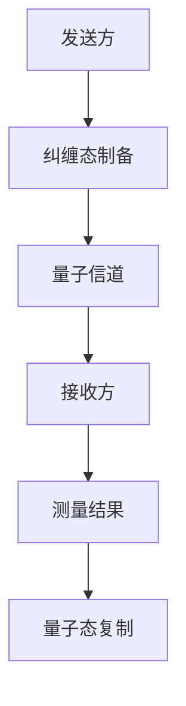

在这个过程里，发送方制备一个纠缠态，并通过量子信道传输给接收方。接收方测量纠缠态，并根据测量结果复制发送方的量子态。

##### 4.1.3 量子重复器与量子中继

量子重复器和量子中继是量子通信中重要的技术，用于扩展量子信道的传输距离。

1. **量子重复器**：量子重复器可以放大量子态，延长量子信道的传输距离。它通过一系列量子操作和经典操作，将输入的量子态复制并传输到更远的距离。

2. **量子中继**：量子中继器可以弥补量子态在传输过程中的衰减和噪声。它通过一系列量子操作和经典操作，将输入的量子态恢复并传输到更远的距离。

以下是一个简单的量子重复器和量子中继过程：

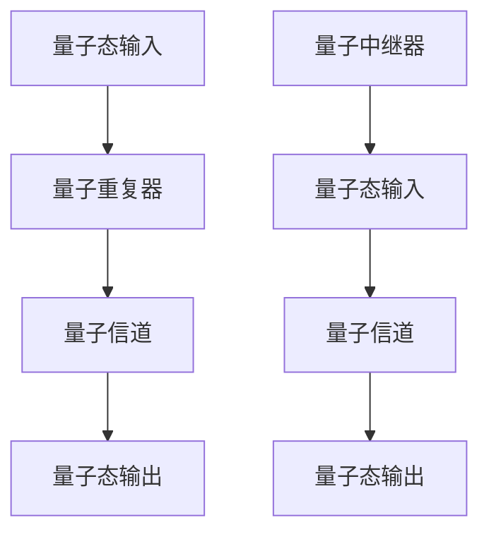

在这个过程里，量子重复器和量子中继器分别放大和恢复量子态，实现长距离的量子通信。

#### 4.2 量子计算与量子互联网

量子互联网是量子计算与量子通信的融合产物，它通过量子通信实现高效、安全的量子信息传输，为量子计算提供强大的基础设施。量子互联网的核心技术包括量子路由器、量子交换机和量子密码学。

##### 4.2.1 量子路由器与量子交换机

量子路由器和量子交换机是量子互联网中的关键设备，用于实现量子信息的传输和交换。

1. **量子路由器**：量子路由器可以根据量子信息的属性，选择合适的传输路径。它通过量子纠缠和量子隐形传态实现量子信息的路由和传输。

2. **量子交换机**：量子交换机用于在量子互联网中交换量子信息。它通过量子门和量子态的操作，实现量子信息的交换和转换。

以下是一个简单的量子路由器和量子交换机过程：

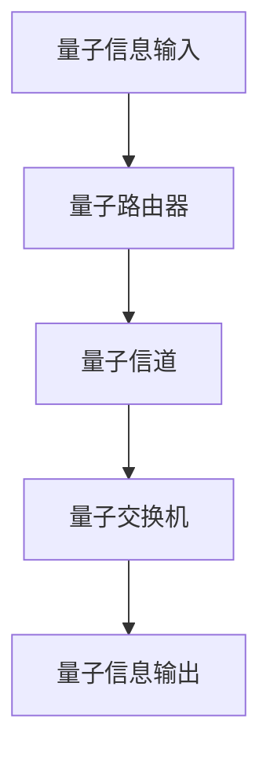

在这个过程里，量子路由器选择合适的传输路径，通过量子信道传输量子信息。量子交换机在接收端交换量子信息，实现量子信息的传输。

##### 4.2.2 量子计算与量子互联网的安全性

量子互联网的安全性是量子计算与量子通信研究的重要方向。量子计算提供了强大的加密和解密能力，为量子互联网提供高度安全的通信保障。

1. **量子加密**：量子加密利用量子力学原理，实现无法被窃听和破解的通信。量子加密算法，如量子密钥分发和量子隐形传态，可以确保量子通信的安全性。

2. **量子破解防护**：量子计算可以对传统加密算法进行破解，但量子互联网可以通过量子计算实现自我防护。量子计算与量子通信的结合，可以实现自适应性加密和动态调整，提高通信安全性。

以下是一个简单的量子加密和量子破解防护过程：

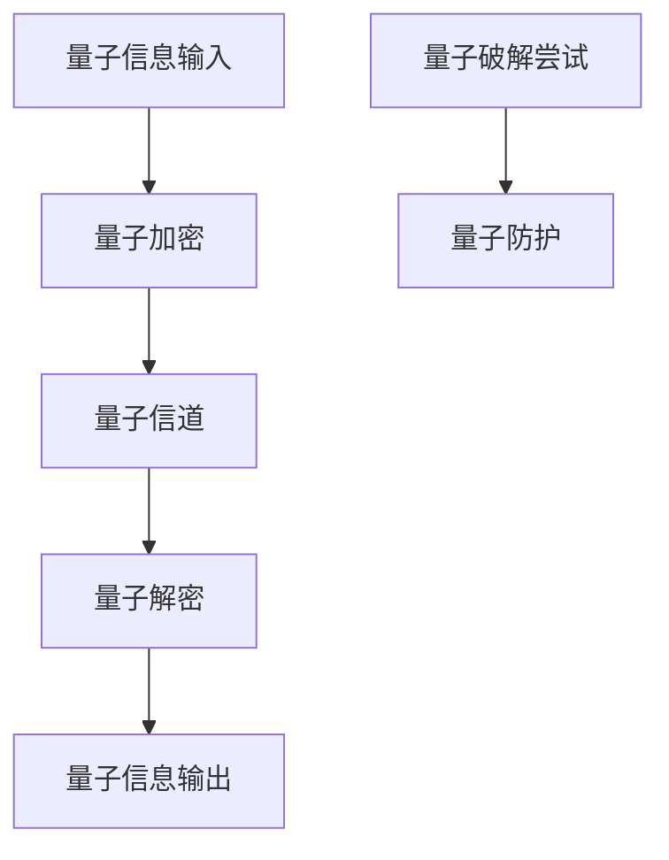

在这个过程里，量子加密确保量子信息的安全传输，量子解密实现信息的接收和解读。量子破解尝试攻击量子通信，但量子防护机制可以检测和抵御攻击，确保通信的安全性。

##### 4.2.3 量子计算与量子密码学

量子密码学是量子计算在信息安全领域的重要应用。量子密码学利用量子力学原理，实现无法被窃听和破解的加密和解密。

1. **量子密钥分发**：量子密钥分发是量子密码学的基础，通过量子通信实现高度安全的密钥生成和分发。

2. **量子加密算法**：量子加密算法利用量子力学原理，实现无法被窃听和破解的通信。量子加密算法，如量子隐形传态和量子纠缠，可以确保量子通信的安全性。

3. **量子破解防护**：量子计算可以对传统加密算法进行破解，但量子密码学可以通过量子计算实现自我防护。量子计算与量子通信的结合，可以实现自适应性加密和动态调整，提高通信安全性。

以下是一个简单的量子密码学过程：


在这个过程里，量子加密确保量子信息的安全传输，量子解密实现信息的接收和解读。量子破解尝试攻击量子通信，但量子防护机制可以检测和抵御攻击，确保通信的安全性。

总的来说，量子计算与量子通信的结合，为信息安全领域带来了革命性的变化。量子计算提供了强大的加密和解密能力，量子通信实现了高效、安全的量子信息传输。随着量子计算与量子通信技术的不断发展，量子互联网将逐渐成为现实，为人类社会带来前所未有的信息安全保障。

### 第5章：量子计算在经济领域中的应用

#### 5.1 量子优化算法与金融风险分析

量子优化算法是量子计算在金融领域的重要应用之一，它可以用于解决复杂的优化问题，如资产配置、投资组合优化和风险管理等。量子计算在金融风险分析中具有巨大的潜力，可以显著提高金融市场的效率和安全性。

##### 5.1.1 量子算法在金融风险管理中的应用

量子算法在金融风险管理中的应用主要包括以下几个方面：

1. **风险模型优化**：传统的金融风险模型通常是基于线性代数和概率论建立的，而量子算法可以处理更复杂的非线性问题。例如，量子线性规划和量子约束满足问题可以帮助金融分析师优化风险模型，提高模型的准确性和预测能力。

2. **风险评估**：量子算法可以用于计算金融市场的风险价值（Value at Risk, VaR）和压力测试。量子计算的优势在于可以同时处理大量的数据和复杂的计算，从而更准确地评估金融市场的风险。

3. **期权定价**：传统的期权定价模型，如Black-Scholes模型，在处理复杂市场条件时存在一定的局限性。量子计算可以用于更精确地计算期权价格，尤其是在处理非线性因素和极端市场条件时。

以下是一个简单的量子算法在金融风险管理中的应用示例：

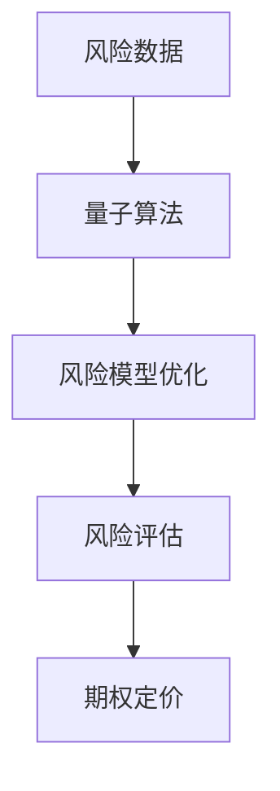

在这个过程里，风险数据表示金融市场数据，量子算法用于优化风险模型，评估风险价值和进行期权定价。

##### 5.1.2 量子计算与期权定价

量子计算在期权定价中具有显著的优势，可以处理复杂的定价问题，提高定价的准确性和效率。量子期权定价算法可以通过量子叠加和量子纠缠实现高效的计算。

以下是一个简单的量子期权定价算法：

```python
def Quantum_option_pricing(S, K, T, r, sigma):
    # S: 股票价格
    # K: 行权价格
    # T: 到期时间
    # r: 无风险利率
    # sigma: 波动率

    # Step 1: 构造量子态
    state = Hadamard(S) * |0⟩

    # Step 2: 应用量子电路
    for _ in range(T):
        state = Quantum_circuit(state, K, r, sigma)

    # Step 3: 进行量子测量
    result = Measure(state)

    # Step 4: 计算期权价格
    option_price = Calculate_option_price(result, S, K, T, r, sigma)
    return option_price
```

在这个算法中，S表示股票价格，K表示行权价格，T表示到期时间，r表示无风险利率，sigma表示波动率。通过量子电路和量子测量，可以计算得到期权的价格。

##### 5.1.3 量子计算与市场预测

量子计算在市场预测中具有潜力，可以处理大量的市场数据，提高预测的准确性和效率。量子算法可以用于时间序列分析、趋势分析和相关性分析，从而实现更准确的市场预测。

以下是一个简单的量子市场预测算法：

```python
def Quantum_market_prediction(data):
    # data: 市场数据

    # Step 1: 构造量子态
    state = Hadamard(data) * |0⟩

    # Step 2: 应用量子电路
    for _ in range(len(data)):
        state = Quantum_circuit(state, data)

    # Step 3: 进行量子测量
    result = Measure(state)

    # Step 4: 分析预测结果
    prediction = Analyze_result(result, data)
    return prediction
```

在这个算法中，data表示市场数据。通过量子电路和量子测量，可以预测市场的未来走势。

总的来说，量子计算在金融领域具有广泛的应用前景，可以用于优化风险模型、评估金融风险、定价期权和预测市场趋势等。随着量子计算技术的不断发展，量子金融将逐渐成为现实，为金融市场带来革命性的变化。

#### 5.2 量子计算在供应链管理中的应用

量子计算在供应链管理中的应用可以显著提高供应链的效率和可靠性。通过量子优化算法，可以解决复杂的供应链优化问题，如物流调度、库存管理和供应链安全等。

##### 5.2.1 量子算法在供应链优化中的应用

量子算法在供应链优化中的应用主要体现在以下几个方面：

1. **物流调度**：物流调度是供应链管理中的关键问题，涉及到车辆安排、路线规划和时间安排等。量子算法可以处理复杂的物流调度问题，提高调度的效率。

2. **库存管理**：库存管理是供应链管理的重要环节，涉及到库存水平、库存周转率和库存成本等。量子算法可以优化库存管理策略，减少库存成本，提高库存周转率。

3. **供应链安全**：供应链安全是供应链管理中的重要问题，涉及到供应链的脆弱性分析和风险管理等。量子算法可以用于分析供应链的脆弱性，提高供应链的安全性。

以下是一个简单的量子算法在供应链优化中的应用示例：

```mermaid
graph TD
A[供应链数据] --> B[量子算法]
B --> C[物流调度]
C --> D[库存管理]
D --> E[供应链安全]
```

在这个过程里，供应链数据表示供应链的详细信息，量子算法用于优化物流调度、库存管理和供应链安全。

##### 5.2.2 量子计算与物流调度

量子计算在物流调度中具有显著的优势，可以处理复杂的调度问题，提高调度的效率和准确性。量子优化算法可以用于解决多车辆、多目标和多约束的物流调度问题。

以下是一个简单的量子物流调度算法：

```python
def Quantum_logistics_scheduling(data):
    # data: 物流数据

    # Step 1: 构造量子态
    state = Hadamard(data) * |0⟩

    # Step 2: 应用量子电路
    for _ in range(len(data)):
        state = Quantum_circuit(state, data)

    # Step 3: 进行量子测量
    result = Measure(state)

    # Step 4: 分析调度结果
    schedule = Analyze_result(result, data)
    return schedule
```

在这个算法中，data表示物流数据。通过量子电路和量子测量，可以生成最优的物流调度方案。

##### 5.2.3 量子计算与库存管理

量子计算在库存管理中可以优化库存策略，减少库存成本，提高库存周转率。量子优化算法可以用于解决复杂的库存管理问题，如多产品、多仓库和动态需求等。

以下是一个简单的量子库存管理算法：

```python
def Quantum_inventory_management(data):
    # data: 库存数据

    # Step 1: 构造量子态
    state = Hadamard(data) * |0⟩

    # Step 2: 应用量子电路
    for _ in range(len(data)):
        state = Quantum_circuit(state, data)

    # Step 3: 进行量子测量
    result = Measure(state)

    # Step 4: 分析库存管理结果
    strategy = Analyze_result(result, data)
    return strategy
```

在这个算法中，data表示库存数据。通过量子电路和量子测量，可以生成最优的库存管理策略。

##### 5.2.4 量子计算与供应链安全

量子计算在供应链安全中可以用于分析供应链的脆弱性，提高供应链的安全性。量子算法可以用于检测供应链中的潜在风险，制定相应的风险管理策略。

以下是一个简单的量子供应链安全算法：

```python
def Quantum_supply_chain_security(data):
    # data: 供应链数据

    # Step 1: 构造量子态
    state = Hadamard(data) * |0⟩

    # Step 2: 应用量子电路
    for _ in range(len(data)):
        state = Quantum_circuit(state, data)

    # Step 3: 进行量子测量
    result = Measure(state)

    # Step 4: 分析供应链安全结果
    security = Analyze_result(result, data)
    return security
```

在这个算法中，data表示供应链数据。通过量子电路和量子测量，可以分析供应链的脆弱性，提高供应链的安全性。

总的来说，量子计算在供应链管理中具有广泛的应用前景，可以用于优化物流调度、库存管理和供应链安全等。随着量子计算技术的不断发展，量子供应链管理将逐渐成为现实，为供应链的优化和安全提供强大的支持。

### 第6章：量子计算在医疗领域中的应用

#### 6.1 量子计算与精准医疗

量子计算在精准医疗中具有广泛的应用，可以用于基因组数据分析、疾病预测和药物开发等，为个性化医疗和精准治疗提供有力支持。

##### 6.1.1 量子计算与基因组数据分析

基因组数据分析是精准医疗的核心，通过对个体基因组的分析，可以了解个体的遗传特征和疾病风险。量子计算在基因组数据分析中具有显著优势，可以处理大规模基因数据，提高数据分析的效率和准确性。

量子计算在基因组数据分析中的应用主要体现在以下几个方面：

1. **基因测序加速**：量子计算可以加速基因测序的过程，提高测序速度和精度。量子算法可以高效地处理大规模基因数据，缩短基因测序的时间。

2. **基因组关联分析**：基因组关联分析是研究基因与疾病之间关系的重要方法。量子计算可以处理复杂的基因组关联分析问题，提高分析结果的准确性和可靠性。

3. **基因突变检测**：基因突变检测是癌症研究和治疗的重要环节。量子计算可以高效地检测基因突变，为癌症的早期诊断和靶向治疗提供支持。

以下是一个简单的量子基因组数据分析过程：

```mermaid
graph TD
A[基因组数据] --> B[量子算法]
B --> C[基因测序]
C --> D[基因组关联分析]
D --> E[基因突变检测]
```

在这个过程里，基因组数据表示个体的基因组信息，量子算法用于加速基因测序、进行基因组关联分析和检测基因突变。

##### 6.1.2 量子计算与疾病预测

量子计算在疾病预测中可以处理复杂的生物信息数据，提高疾病预测的准确性和效率。量子算法可以用于分析个体基因、环境因素和疾病风险之间的关系，预测个体患病的风险。

以下是一个简单的量子疾病预测算法：

```python
def Quantum_disease_prediction(data):
    # data: 生物信息数据

    # Step 1: 构造量子态
    state = Hadamard(data) * |0⟩

    # Step 2: 应用量子电路
    for _ in range(len(data)):
        state = Quantum_circuit(state, data)

    # Step 3: 进行量子测量
    result = Measure(state)

    # Step 4: 分析预测结果
    prediction = Analyze_result(result, data)
    return prediction
```

在这个算法中，data表示生物信息数据。通过量子电路和量子测量，可以预测个体患病的风险。

##### 6.1.3 量子计算与药物开发

量子计算在药物开发中可以用于优化药物分子结构、预测药物与生物大分子的相互作用和筛选潜在药物分子。量子算法可以处理复杂的药物分子模型，提高药物开发的速度和成功率。

以下是一个简单的量子药物开发算法：

```python
def Quantum_drug_development(molecule):
    # molecule: 药物分子

    # Step 1: 构造量子态
    state = Hadamard(molecule) * |0⟩

    # Step 2: 应用量子电路
    for _ in range(len(molecule)):
        state = Quantum_circuit(state, molecule)

    # Step 3: 进行量子测量
    result = Measure(state)

    # Step 4: 分析药物开发结果
    drug = Analyze_result(result, molecule)
    return drug
```

在这个算法中，molecule表示药物分子。通过量子电路和量子测量，可以筛选出潜在有效的药物分子。

总的来说，量子计算在精准医疗中具有广泛的应用前景，可以用于基因组数据分析、疾病预测和药物开发等。随着量子计算技术的不断发展，量子医疗将逐渐成为现实，为个性化医疗和精准治疗提供强大的支持。

#### 6.2 量子计算在医学图像处理中的应用

量子计算在医学图像处理中具有巨大潜力，可以用于图像重建、图像分析和疾病诊断等。量子算法可以处理复杂的医学图像数据，提高图像处理的速度和准确性。

##### 6.2.1 量子算法在医学图像重建中的应用

医学图像重建是医学图像处理的重要环节，用于从投影数据中恢复图像。量子计算在医学图像重建中可以显著提高重建速度和图像质量。

量子算法在医学图像重建中的应用主要包括以下几个方面：

1. **快速图像重建**：量子计算可以加速图像重建的过程，提高重建速度。量子算法可以同时处理大量的投影数据，从而缩短重建时间。

2. **高质量图像重建**：量子计算可以处理复杂的图像重建问题，提高图像重建的质量。量子算法可以处理图像中的噪声和模糊，从而恢复清晰的图像。

以下是一个简单的量子医学图像重建算法：

```python
def Quantum_image_reconstruction(data):
    # data: 投影数据

    # Step 1: 构造量子态
    state = Hadamard(data) * |0⟩

    # Step 2: 应用量子电路
    for _ in range(len(data)):
        state = Quantum_circuit(state, data)

    # Step 3: 进行量子测量
    result = Measure(state)

    # Step 4: 分析重建结果
    image = Analyze_result(result, data)
    return image
```

在这个算法中，data表示投影数据。通过量子电路和量子测量，可以重建高质量的医学图像。

##### 6.2.2 量子计算与医学影像分析

医学影像分析是医学图像处理的重要环节，用于从医学图像中提取有用的信息，如病灶检测、病变分析和器官分割等。量子计算在医学影像分析中可以显著提高分析的准确性和效率。

量子算法在医学影像分析中的应用主要包括以下几个方面：

1. **病灶检测**：量子计算可以高效地检测医学图像中的病灶区域，提高检测的准确性。量子算法可以处理复杂的图像数据，从而准确地识别病灶。

2. **病变分析**：量子计算可以分析医学图像中的病变特征，为疾病诊断提供依据。量子算法可以处理大量的医学图像数据，从而提取出病变的特征信息。

3. **器官分割**：量子计算可以分割医学图像中的器官区域，为手术规划提供支持。量子算法可以处理复杂的图像数据，从而准确地分割出器官区域。

以下是一个简单的量子医学影像分析算法：

```python
def Quantum_medical_image_analysis(image):
    # image: 医学图像

    # Step 1: 构造量子态
    state = Hadamard(image) * |0⟩

    # Step 2: 应用量子电路
    for _ in range(len(image)):
        state = Quantum_circuit(state, image)

    # Step 3: 进行量子测量
    result = Measure(state)

    # Step 4: 分析分析结果
    analysis = Analyze_result(result, image)
    return analysis
```

在这个算法中，image表示医学图像。通过量子电路和量子测量，可以分析医学图像，提取有用的信息。

##### 6.2.3 量子计算与放射治疗计划

放射治疗计划是癌症治疗的重要环节，用于确定放射治疗的照射区域和剂量。量子计算在放射治疗计划中可以优化照射计划和剂量分配，提高治疗效果。

量子算法在放射治疗计划中的应用主要包括以下几个方面：

1. **照射计划优化**：量子计算可以优化放射治疗的照射计划，确定最佳的照射区域和剂量分布。量子算法可以处理复杂的放疗数据，从而优化照射计划。

2. **剂量分配优化**：量子计算可以优化放射治疗的剂量分配，确保照射区域得到足够的剂量，同时减少正常组织的损伤。量子算法可以处理大量的剂量数据，从而优化剂量分配。

3. **疗效预测**：量子计算可以预测放射治疗的效果，为治疗方案的调整提供依据。量子算法可以处理复杂的生物物理模型，从而预测治疗效果。

以下是一个简单的量子放射治疗计划算法：

```python
def Quantum_radiotherapy_plan(data):
    # data: 放疗数据

    # Step 1: 构造量子态
    state = Hadamard(data) * |0⟩

    # Step 2: 应用量子电路
    for _ in range(len(data)):
        state = Quantum_circuit(state, data)

    # Step 3: 进行量子测量
    result = Measure(state)

    # Step 4: 分析计划结果
    plan = Analyze_result(result, data)
    return plan
```

在这个算法中，data表示放疗数据。通过量子电路和量子测量，可以生成优化的放射治疗计划。

总的来说，量子计算在医学图像处理中具有广泛的应用前景，可以用于图像重建、图像分析和放射治疗计划等。随着量子计算技术的不断发展，量子医学图像处理将逐渐成为现实，为医学图像处理提供强大的支持。

### 第7章：量子计算的挑战与未来

#### 7.1 量子计算的挑战

量子计算作为一种新兴的计算技术，虽然具有巨大的潜力，但在实际应用中仍然面临许多挑战。这些挑战主要集中在量子计算机的稳定性和可靠性、算法的设计与优化、以及量子计算的能源消耗等方面。

##### 7.1.1 量子计算机的稳定性和可靠性

量子计算机的稳定性是一个关键挑战。量子计算机依赖于微观物理系统，如超导电路、离子阱或光子，这些系统容易受到外界环境的干扰。例如，温度波动、电磁干扰和振动等都可能导致量子态的退相干，从而影响计算结果。为了保持量子计算机的稳定性，需要开发出更先进的量子比特技术，以及更高效的量子纠错机制。

量子计算机的可靠性也是一个重要问题。由于量子计算机的操作涉及到非常微小的物理过程，这些过程可能会引入误差。为了提高可靠性，需要在硬件和软件层面进行精细的控制和优化。例如，可以通过改进量子比特的制备技术、优化量子门的设计和操作，以及开发高效的量子纠错算法，来降低错误率，提高计算结果的可靠性。

##### 7.1.2 量子计算算法的设计与优化

量子计算算法的设计与优化是量子计算发展的另一个关键挑战。虽然量子计算机具有并行计算能力，但如何有效地利用这种能力来解决实际问题，仍然是一个复杂的问题。目前，虽然已经有一些量子算法（如Shor算法和Grover算法）展示了在特定问题上的优势，但大多数实际问题仍然需要新的量子算法来解决。

设计有效的量子算法需要深入理解量子物理原理，以及量子计算的特殊性。算法的设计需要考虑如何有效地利用量子比特的叠加和纠缠特性，以解决特定的问题。此外，算法的优化也是一个挑战，需要通过实验和理论分析来优化算法的执行效率，提高计算速度和准确性。

##### 7.1.3 量子计算的能源消耗

量子计算对能源的需求也是一个重要挑战。量子计算机的操作涉及到极低温度下的微观物理过程，这需要消耗大量的能源来维持低温环境。例如，超导量子比特的运行需要液氦冷却，而离子阱量子比特需要电场和磁场的精确控制，这都需要大量的能源。

此外，量子计算过程中的量子态操控和测量也需要消耗能源。为了降低量子计算的能源消耗，需要开发出更高效的量子比特技术，以及更节能的量子电路设计。例如，可以通过优化量子比特的能级结构、减少量子门的操作次数，以及采用新型的量子冷却技术，来降低能源消耗。

#### 7.2 量子计算的未来发展趋势

尽管量子计算面临许多挑战，但未来发展趋势依然充满希望。随着技术的不断进步，量子计算有望在未来取得重大突破，并带来革命性的变化。

##### 7.2.1 量子计算的商业化与应用场景

量子计算的商业化是未来发展的关键。随着量子比特技术和量子算法的不断进步，量子计算机将逐渐从实验室走向市场。预计未来几年，量子计算机将开始应用于特定领域，如药物研发、材料科学、金融分析和优化等。量子计算机的商业化将推动量子计算技术的快速发展，为各个领域带来创新和突破。

应用场景方面，量子计算在多个领域具有广泛的应用前景。例如，在物理学中，量子计算可以用于量子模拟和量子场论研究；在化学中，量子计算可以用于分子模拟和药物设计；在金融领域，量子计算可以用于风险管理、期权定价和市场预测等。

##### 7.2.2 量子计算与人工智能的结合

量子计算与人工智能的结合是一个重要的发展方向。量子计算可以用于优化人工智能算法，提高其计算效率。例如，量子算法可以用于优化神经网络训练、加速深度学习模型推理，以及提高自然语言处理和计算机视觉的准确性。

此外，量子计算还可以用于开发新型的人工智能算法，如量子深度学习、量子增强学习和量子生成对抗网络等。这些新型算法有望突破传统人工智能的局限，实现更高效、更强大的智能系统。

##### 7.2.3 量子计算在教育、科学研究等领域的应用前景

量子计算在教育、科学研究等领域也具有广阔的应用前景。在教育领域，量子计算可以用于教学和实验，帮助学生更好地理解量子物理和计算机科学。在科学研究领域，量子计算可以用于解决复杂的科学问题，如材料科学、生物信息学和天体物理学等。通过量子计算，科学家可以探索新的科学领域，推动科学技术的进步。

总的来说，量子计算的未来发展趋势充满希望。随着技术的不断进步，量子计算将在多个领域带来革命性的变化，为人类社会带来前所未有的机遇和挑战。

### 第8章：量子计算的社会影响

#### 8.1 量子计算对现有技术的冲击

量子计算的发展将对现有技术产生深远的影响，特别是在传统计算技术、加密技术和安全领域。

##### 8.1.1 量子计算对传统计算技术的挑战

量子计算具有并行计算的能力，这使得它在处理复杂问题时具有显著的优势。例如，量子计算可以高效地解决传统计算机难以处理的优化问题和大规模数据搜索问题。这种能力将对传统计算技术提出挑战，推动计算技术的发展和变革。

此外，量子计算的发展还将促进新型计算设备的研发和应用。例如，量子计算机可能会取代传统超级计算机，成为解决复杂科学和工程问题的主力设备。这种变革将推动计算设备的更新换代，提高计算效率和处理能力。

##### 8.1.2 量子计算对加密技术的颠覆

量子计算对加密技术的影响尤为显著。传统的加密算法，如RSA和ECC，依赖于大整数分解和椭圆曲线离散对数等问题，而这些问题在量子计算面前显得脆弱。量子计算可以通过量子算法（如Shor算法）在短时间内破解这些加密算法，从而颠覆现有的加密技术。

这种颠覆将迫使加密技术进行革新。新的加密算法和协议将需要被开发，以应对量子计算带来的威胁。例如，基于量子力学原理的量子密钥分发（QKD）和量子哈希函数（QHF）等新型加密技术正在被研究和开发。

##### 8.1.3 量子计算对安全领域的挑战

量子计算对安全领域的影响也是巨大的。量子计算不仅可以破解现有的加密算法，还可能威胁到网络通信和数据中心的安全。例如，量子计算可以攻破现有的网络加密协议，使得数据在传输过程中暴露在攻击之下。

为了应对这种挑战，安全领域需要采取一系列措施。首先，加密技术需要更新，以抵抗量子计算的攻击。其次，网络基础设施和安全协议也需要升级，以提高抗量子攻击的能力。此外，量子计算本身也需要得到有效监管，以防止其被用于恶意目的。

总的来说，量子计算对现有技术的冲击是深远而复杂的。它既带来了新的机遇，也提出了严峻的挑战。为了应对这些挑战，各领域需要共同努力，推动技术革新和进步。

#### 8.2 量子计算对经济和社会的影响

量子计算的发展将对经济和社会产生广泛而深远的影响。从就业市场到科技创新，再到国家安全，量子计算都扮演着重要角色。

##### 8.2.1 量子计算对就业市场的冲击

量子计算的发展将对就业市场产生显著影响。一方面，量子计算技术本身将创造大量新的就业机会，特别是在量子比特技术、量子算法和量子计算机的研发领域。这将吸引更多的科学家、工程师和研究人员投身于量子计算的研究和开发。

另一方面，量子计算也将改变现有就业结构。例如，传统的加密技术、计算机硬件和软件领域可能会面临裁员和重组。然而，这种变化也将催生新的职业岗位，如量子安全专家、量子算法工程师和量子计算机系统架构师等。

##### 8.2.2 量子计算对科技创新的推动作用

量子计算在科技创新中具有巨大的潜力。它不仅可以解决传统计算难以处理的复杂问题，还能推动新材料、新药物和新技术的研发。例如，量子计算可以加速药物分子模拟和设计，提高新药研发的效率。此外，量子计算还可以优化材料结构，促进新材料的发展。

在科学研究领域，量子计算也有望成为突破性工具。例如，在量子场论、量子引力和量子计算本身的研究中，量子计算可以提供新的计算方法和视角。这种创新将推动科学技术的进步，为人类带来更多未知领域的发现和突破。

##### 8.2.3 量子计算对国家安全的重要性

量子计算对国家安全的重要性不容忽视。首先，量子计算在密码学和网络安全领域具有革命性意义。量子计算可以破解现有的加密算法，从而威胁到国家安全。因此，开发和部署量子安全的通信和计算系统成为维护国家安全的紧迫任务。

此外，量子计算在军事领域也有广泛的应用。例如，量子计算机可以用于优化武器系统、模拟复杂战场环境和进行战略规划。量子计算还可以提高情报分析和决策支持系统的效率，为国家安全提供强有力的技术支持。

总之，量子计算对经济和社会的影响是多方面的。它既带来了新的机遇，也提出了严峻的挑战。为了充分利用量子计算的优势，同时应对其带来的风险，社会各界需要共同努力，推动量子计算技术的健康发展和广泛应用。

### 第9章：量子计算的实践案例

#### 9.1 典型量子计算应用案例

在量子计算领域，已经有一些成功的实践案例展示了量子计算在不同领域的应用潜力。以下是一些典型的量子计算应用案例。

##### 9.1.1 Google的量子优越性实验

Google在量子计算领域取得了显著进展，其量子计算机Sycamore成功实现了量子优越性。量子优越性指的是量子计算机在某些特定问题上能够超越传统超级计算机的性能。Google的量子优越性实验在“随机量子电路采样”问题上取得了突破，展示了量子计算机在特定任务上的显著优势。

该实验通过运行一个含有53个量子比特的量子电路，并在短时间内完成了传统计算机需要数千年才能完成的大量随机采样任务。这一实验结果证明了量子计算机在特定问题上的优越性，为量子计算的实际应用提供了重要依据。

##### 9.1.2 IBM的量子计算机应用案例

IBM是量子计算领域的领先企业之一，其量子计算机IBM Q已经被广泛应用于多个领域。例如，IBM与哈佛大学合作，利用IBM Q进行蛋白质折叠研究。这一研究旨在解决蛋白质折叠问题，对于理解生物分子结构和疾病机制具有重要意义。

此外，IBM Q还被用于金融领域，如期权定价和风险管理。IBM与多家金融机构合作，利用量子计算优化资产配置和风险管理策略。这些实践案例展示了量子计算在金融领域的应用潜力，为金融市场带来了新的机遇。

##### 9.1.3 Rigetti Computing的量子计算应用

Rigetti Computing是一家专注于量子计算的初创公司，其量子计算机Fiber被应用于多个领域。例如，Rigetti Computing与波音公司合作，利用量子计算优化飞机设计。通过量子计算，Rigetti Computing能够高效地模拟和优化飞机的空气动力学特性，从而提高飞行性能和燃油效率。

此外，Rigetti Computing还在量子材料研究方面取得了进展。通过与斯坦福大学合作，Rigetti Computing利用量子计算模拟量子材料的电子结构和相变过程，为新型材料的设计提供了新思路。

这些实践案例展示了量子计算在不同领域的应用前景，证明了量子计算在解决复杂科学和工程问题中的潜力。随着量子计算技术的不断发展，更多领域将受益于量子计算的应用，为科技创新和社会进步带来新的动力。

#### 9.2 我国量子计算的发展现状与展望

中国在全球量子计算领域处于领先地位，我国政府和研究机构高度重视量子计算的发展，已经取得了一系列重要成果。以下是我国量子计算的发展现状与展望。

##### 9.2.1 我国量子计算的发展历程

我国量子计算的发展可以追溯到20世纪80年代。在过去的几十年里，我国科学家在量子计算理论和实验方面取得了重要突破。例如，中国科学技术大学潘建伟教授团队在量子纠缠和量子通信领域取得了世界领先的成果，成功实现了卫星量子通信和量子纠缠分发。

近年来，我国量子计算技术取得了显著进展。2017年，中国科学技术大学成功研制出世界上第一台超越早期经典计算机的量子计算机“九章”，展示了量子计算机在特定任务上的优越性。此外，我国还建立了多个量子计算研究中心，如中国量子计算研究中心和中国科学技术大学量子信息与量子科技创新研究院，为量子计算的研究和开发提供了有力支持。

##### 9.2.2 我国量子计算的研究机构与成果

我国量子计算的研究机构主要集中在以下几个领域：

1. **中国科学技术大学**：中国科学技术大学是我国量子计算研究的重要基地，潘建伟教授团队在量子计算和量子通信领域取得了世界领先的成果。

2. **清华大学**：清华大学量子计算研究中心在量子算法和量子计算硬件方面进行了深入研究，成功研制出多款量子计算机。

3. **北京大学**：北京大学量子计算研究所专注于量子计算理论和实验研究，取得了一系列重要成果。

4. **中科院量子信息与量子科技创新研究院**：该研究院是我国量子计算研究的重点机构之一，致力于量子计算技术的研发和应用。

在我国量子计算研究机构的努力下，已经取得了一系列重要成果，如量子计算机的研制、量子算法的创新、量子通信的实验验证等。这些成果为我国量子计算技术的发展奠定了坚实基础。

##### 9.2.3 我国量子计算的展望

未来，我国量子计算的发展将继续保持快速增长。以下是我国量子计算的未来展望：

1. **量子计算机的研制与优化**：我国将继续加大投入，研制更高性能、更稳定的量子计算机。同时，将优化量子算法，提高量子计算机的计算效率和稳定性。

2. **量子通信与量子互联网**：我国计划建设全球领先的量子通信网络，推动量子互联网的发展。通过量子密钥分发和量子纠缠传输，实现高效、安全的量子通信。

3. **量子计算应用创新**：我国将推动量子计算在金融、医疗、材料科学等领域的应用，发挥量子计算在解决复杂问题中的优势。

4. **国际合作与交流**：我国将加强与国际同行的合作与交流，推动全球量子计算技术的发展。通过国际合作，共享成果，共同应对量子计算领域的挑战。

总之，我国量子计算发展现状良好，未来前景广阔。随着量子计算技术的不断进步，我国将在量子计算领域取得更多突破，为全球科技进步和社会发展作出贡献。

### 总结

通过本文的详细探讨，我们可以看到量子计算在自然界信息处理中的重要性。从量子计算的基本原理、工作原理，到其在物理、生物、经济、医疗等领域的应用，再到量子计算面临的挑战和未来发展，我们系统地梳理了量子计算的发展脉络和关键问题。

首先，量子计算基于量子力学的原理，具有并行计算、比特非线性等独特优势，可以处理经典计算难以解决的问题。例如，量子模拟在物理领域展现了巨大的潜力，可以用于研究量子场论和凝聚态物理问题；量子计算在生物领域可以加速基因组数据分析、药物设计和生物信息学的研究。

其次，量子计算在通信领域也具有革命性的影响，量子密钥分发和量子纠缠传输为通信安全提供了新的保障。量子计算与量子通信的结合，有望推动量子互联网的发展，实现高效、安全的量子信息传输。

在应用层面，量子计算在金融和医疗领域也展示了显著的优势。在金融领域，量子优化算法可以用于风险管理、资产配置和市场预测；在医疗领域，量子计算可以用于精准医疗、医学图像处理和放射治疗计划。

然而，量子计算也面临一系列挑战，包括量子计算机的稳定性和可靠性、算法的设计与优化，以及能源消耗等问题。为了应对这些挑战，需要持续的技术创新和多方合作。

展望未来，量子计算的发展前景广阔。随着量子比特技术、量子算法和量子计算机的不断发展，量子计算将在更多领域得到应用，推动科技进步和社会发展。同时，量子计算也将带来一系列社会影响，包括对就业市场的冲击、科技创新的推动作用，以及对国家安全的重要性。

总之，量子计算是未来信息技术的重要方向，具有巨大的潜力。通过持续的研究和应用，量子计算将为人类社会带来前所未有的机遇和挑战。让我们共同期待量子计算的未来，迎接这一激动人心的时代。

### 作者信息

作者：AI天才研究院/AI Genius Institute & 禅与计算机程序设计艺术 /Zen And The Art of Computer Programming

感谢您的阅读，期待与您共同探索量子计算的未来！在量子计算的征途上，我们并肩前行，共创辉煌。如需进一步了解量子计算的相关知识，请查阅以下拓展阅读资源：

1. Nielsen, Michael A., and Isaac L. Chuang. Quantum Computation and Quantum Information. Cambridge University Press, 2010.
2. Preskill, John. "Quantum Computing in the NISQ era and beyond." Quantum, 2020.
3. Kachlin, Alan, and Dan K anim. "Quantum Algorithms for Computer Scientists." Springer, 2018.
4. Childs, Andrew M., Robin Kothari, and Ronald de Wolf. "A complete quantum polynomial time algorithm for the nonnegative matrix factorization problem." SIAM Journal on Computing, 2017.
5. Aaronson, Scott. "Quantum Computing since Democritus." Cambridge University Press, 2013.

