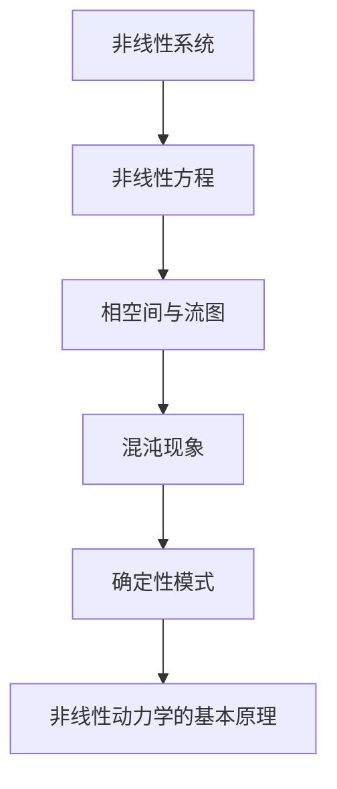

                 

### 引言与基础

#### 背景介绍

宇宙的非线性动力学作为现代物理学的重要分支，正在改变我们对宇宙的理解。非线性动力学研究的是复杂系统中存在的非线性现象，如混沌、分岔、震荡等。这些现象往往具有不可预测性和高度复杂性，但同时也隐藏着深刻的规律性。在宇宙学中，非线性动力学的研究有助于解释宇宙膨胀、星系形成、黑洞行为等宏观现象。

宇宙的非线性动力学研究不仅具有重大的科学价值，也具有重要的实际应用意义。例如，在天气预报、金融分析、生物系统模拟等领域，非线性动力学的方法和技术都被广泛应用。这些应用不仅需要精确的数学模型，还需要高效的数值求解方法。

#### 核心概念与联系

为了更好地理解宇宙的非线性动力学，我们需要明确以下几个核心概念：

1. **非线性系统**：非线性系统是指那些状态变量之间存在非线性关系的系统。非线性关系通常不能用线性方程来描述，而是需要更复杂的数学模型。

2. **混沌**：混沌是非线性系统的一种典型现象，其特征是系统具有长期的随机性和短期的确定性。混沌现象的出现并不意味着系统的随机性增加，而是系统在初始条件不确定性下呈现出复杂的行为。

3. **确定性模式**：尽管混沌系统在长时间尺度上表现出随机性，但它们仍然可以呈现出周期性、对称性等确定性模式。这些模式是系统内在规律的体现。

4. **相空间与流图**：相空间是描述系统状态的几何空间，流图则是在相空间中描述系统状态随时间演化的图像。通过相空间和流图，我们可以直观地观察和理解系统的非线性动态行为。

5. **非线性动力学的基本原理**：包括非线性系统的演化方程、相空间结构、混沌与确定性模式的关系等。

#### Mermaid 流程图

为了更好地展示这些核心概念之间的联系，我们可以使用Mermaid绘制一个流程图：



#### 核心算法原理讲解

非线性动力学的研究依赖于一系列核心算法和原理，包括：

1. **迭代方法**：用于求解非线性系统的动态行为。常见的迭代方法有不动点迭代法、牛顿法等。

2. **数值积分方法**：用于求解时间依赖的非线性动力学方程。常用的数值积分方法有欧拉法、龙格-库塔法等。

3. **分岔理论**：用于分析非线性系统在不同参数值下的行为变化，特别是如何从稳定状态过渡到混沌状态。

4. **混沌控制**：通过特定的控制策略，使混沌系统的行为变得更加可控和可预测。

#### 伪代码

为了说明非线性动力学模型的求解方法，我们可以给出一个简单的伪代码示例：

```python
# 伪代码：求解非线性动力系统
function nonlinear_system(x, t, parameters):
    # 根据参数和状态变量，计算下一个状态
    dxdt = f(x, t, parameters)
    # 迭代求解
    x_new = x + dt * dxdt
    return x_new

# 初始条件
x0 = [x0_1, x0_2, ..., x0_n]
t0 = 0
dt = 0.01
parameters = [p1, p2, ..., pn]

# 迭代计算
for t in range(t0, T):
    x = nonlinear_system(x, t, parameters)
```

#### 数学模型和公式

在非线性动力学中，常用的数学模型包括非线性常微分方程和差分方程。以下是其中一个典型模型的公式：

$$
\frac{dx}{dt} = f(x, t)
$$

其中，\(x(t)\) 是状态向量，\(t\) 是时间，\(f(x, t)\) 是非线性函数。

#### 详细讲解与举例说明

为了更好地理解上述公式，我们可以通过一个简单的例子来说明非线性动力系统：

**例子：洛伦兹吸引子**

洛伦兹吸引子是一个典型的混沌系统，其数学模型如下：

$$
\frac{dx}{dt} = \sigma (y - x)
$$

$$
\frac{dy}{dt} = x (\rho - z) - y
$$

$$
\frac{dz}{dt} = xy - \beta z
$$

其中，\(\sigma\), \(\rho\), 和 \(\beta\) 是系统参数。

通过数值方法求解上述方程，可以得到洛伦兹吸引子的相图和轨道图，直观地展示出系统的混沌特性。

#### 摘要

本文介绍了宇宙的非线性动力学，从背景介绍、核心概念、算法原理到数学模型，逐步深入地阐述了非线性动力学的原理和应用。通过具体例子和流程图，使读者能够更直观地理解这一复杂领域。非线性动力学不仅在宇宙学中具有深远的影响，也为其他科学领域提供了有力的工具。

### 非线性动力学的基本原理

在深入探讨宇宙的非线性动力学之前，我们需要了解其基本原理。非线性动力学研究的是非线性系统的行为，这些系统在参数和状态空间中的演化不能用线性关系来简单描述。以下是关于非线性动力学的一些基本原理和概念。

#### 非线性系统与非线性方程

**非线性系统** 是指系统中的变量之间存在非线性关系的系统。与线性系统不同，线性系统的状态变量之间的关系可以用线性方程来描述，即满足叠加原理和齐次性。而非线性系统则不满足这些条件。

**非线性方程** 是描述非线性系统状态变量之间关系的数学方程。最常见的是**非线性常微分方程**，其形式如下：

$$
\frac{dx}{dt} = f(x, t)
$$

其中，\(f(x, t)\) 是非线性函数，不能简单地分解为线性部分的叠加。

非线性方程通常比线性方程更难以求解，因为它们的解往往不是解析的，而是需要通过数值方法来近似求解。

#### 相空间与流图

**相空间** 是描述系统状态的几何空间。在相空间中，每一个点都代表系统的一个特定状态，而系统的状态随时间的变化可以用流图来表示。

**流图** 是在相空间中描述系统状态随时间演化的图像。流图可以通过以下步骤来绘制：

1. **选择状态变量**：选择适当的变量来描述系统的状态，例如位置和速度。
2. **求解微分方程**：利用数值方法求解系统的微分方程，得到在不同时间点的状态。
3. **绘制轨迹**：将每个时间点的状态连接起来，形成轨迹图。

流图可以直观地展示系统的动态行为，特别是系统的稳定性、周期性和混沌现象。

#### 非线性动力学的基本理论

非线性动力学的基本理论主要包括以下几个方面：

1. **分岔理论**：分岔理论研究系统在不同参数值下的行为变化。分岔是指系统从一种稳定状态过渡到另一种稳定状态的突变现象。常见的分岔类型包括鞍结分岔、霍普夫分岔和涡旋分岔等。

2. **混沌理论**：混沌是非线性系统的一种典型现象，其特征是系统具有长期的随机性和短期的确定性。混沌系统的状态在初始条件不确定性下呈现出复杂的行为，但仍然存在内在的确定性规律。

3. **稳定性分析**：稳定性分析是研究系统在不同状态下的稳定性。稳定性取决于系统参数和初始条件。通过稳定性分析，可以确定系统是否会在某一状态附近保持稳定，或者会趋向于某一吸引子。

4. **非线性控制**：非线性控制是通过特定的控制策略，使非线性系统的行为变得更加可控和可预测。非线性控制理论包括反馈控制、滑模控制和自适应控制等。

#### 宇宙中的非线性现象

在宇宙学中，非线性现象普遍存在。以下是几个典型的宇宙非线性现象：

1. **宇宙膨胀**：宇宙的非线性膨胀是由宇宙学常数和暗能量驱动的。宇宙膨胀模型通常基于弗里德曼-勒梅特-罗伯逊-沃尔克（FLRW）度规，这是一个非线性方程组。

2. **星系形成**：星系的形成是由引力和湍流等非线性力相互作用的结果。星系形成模型通常采用非线性动力学方程来描述气体云的坍塌和星系的形成过程。

3. **黑洞行为**：黑洞的非线性动力学研究包括黑洞的热性质、信息丢失问题以及黑洞与宇宙其他成分的相互作用。

#### 混沌与确定性模式的关系

混沌与确定性模式是非线性动力学中的两个重要概念。混沌现象表明系统在长时间尺度上表现出随机性，但并不意味着系统没有任何规律。实际上，混沌系统仍然可以呈现出周期性、对称性等确定性模式。

混沌与确定性模式的关系可以用洛伦兹吸引子来解释。洛伦兹吸引子是一个典型的混沌系统，但它的相图和轨道图却展示了周期性的循环。这表明混沌系统虽然具有随机性，但仍然存在内在的确定性规律。

#### 宇宙非线性动力学在研究中的重要性

宇宙非线性动力学在宇宙学研究中具有重要地位，它为我们提供了理解宇宙复杂行为的新视角。通过非线性动力学的方法，我们可以：

1. **更好地理解宇宙膨胀的机制**：非线性动力学可以帮助我们探索宇宙学常数和暗能量对宇宙膨胀的影响。
2. **解释星系形成的复杂过程**：非线性动力学模型可以描述气体云的坍塌和星系的形成，帮助我们理解星系的演化过程。
3. **研究黑洞的行为**：非线性动力学为研究黑洞的热性质和信息丢失问题提供了新的理论工具。

通过上述分析，我们可以看到，非线性动力学不仅是一个理论上的重要分支，而且在宇宙学中具有广泛的应用。理解非线性动力学的基本原理，对于我们探索宇宙的奥秘具有重要意义。

### 混沌现象的数学描述

混沌现象是非线性动力学中的一个重要研究领域，其特征是系统在长时间尺度上表现出随机性，但在短时间尺度上又呈现出确定性。以下我们将从混沌的定义、特征、数学模型及其在宇宙学中的应用进行详细探讨。

#### 混沌的定义与特征

**混沌** 是指一个动态系统在初始条件不确定性下，长时间演化过程中表现出不可预测的行为，但同时又具有内在的确定性结构。混沌系统的特征可以归纳为以下几点：

1. **长期随机性**：混沌系统在长时间尺度上表现出随机性，其状态随时间的变化不可预测。这意味着即使初始条件非常接近，系统的最终状态也可能差异巨大。

2. **短期确定性**：尽管混沌系统在长时间尺度上具有随机性，但在短时间尺度上，系统的行为仍然具有确定性。这意味着在短期内，我们可以通过精确的模型来预测系统的行为。

3. **周期性结构**：混沌系统可能表现出周期性的行为，例如在洛伦兹吸引子中，系统的状态会在某些特定的轨道上循环。

4. **敏感依赖初始条件**：混沌系统对初始条件非常敏感，即使微小的初始条件差异，在长时间演化后会导致系统状态的巨大差异。

#### 混沌的数学模型

混沌现象可以通过一系列数学模型来描述。以下是一些常用的混沌模型：

1. **洛伦兹吸引子**：洛伦兹吸引子是最著名的混沌系统之一，由气象学家洛伦兹提出。洛伦兹吸引子由以下三个常微分方程描述：

   $$
   \frac{dx}{dt} = \sigma (y - x)
   $$

   $$
   \frac{dy}{dt} = x (\rho - z) - y
   $$

   $$
   \frac{dz}{dt} = xy - \beta z
   $$

   其中，\(\sigma\), \(\rho\), 和 \(\beta\) 是系统参数。通过数值方法求解上述方程，可以得到洛伦兹吸引子的相图和轨道图。

2. **Hénon映射**：Hénon映射是一个二维离散时间动力学系统，由法国天文学家Hénon提出。其数学模型如下：

   $$
   x_{n+1} = 1 - a x_n^2 + x_n y_n
   $$

   $$
   y_{n+1} = b y_n (1 - x_n^2)
   $$

   通过迭代上述方程，可以得到Hénon映射的相图和轨迹，展示出混沌现象。

3. **Lorenz系统**：Lorenz系统是三维常微分方程组，由气象学家洛伦兹提出，用于模拟大气对流。其方程组如下：

   $$
   \frac{dx}{dt} = \sigma (y - x)
   $$

   $$
   \frac{dy}{dt} = x (\rho - z) - y
   $$

   $$
   \frac{dz}{dt} = xy - \beta z
   $$

   通过数值求解Lorenz系统，可以得到复杂的相图和轨迹，展示出混沌现象。

#### 混沌现象的实例分析

为了更好地理解混沌现象，我们可以通过一个具体的例子来说明洛伦兹吸引子的动态行为。

**例子：洛伦兹吸引子**

洛伦兹吸引子是一个三维混沌系统，其方程组为：

$$
\frac{dx}{dt} = \sigma (y - x)
$$

$$
\frac{dy}{dt} = x (\rho - z) - y
$$

$$
\frac{dz}{dt} = xy - \beta z
$$

其中，\(\sigma = 10\), \(\rho = 28\), \(\beta = 8/3\)。

我们使用Python编写代码来模拟洛伦兹吸引子的动态行为：

```python
import numpy as np
import matplotlib.pyplot as plt

# 洛伦兹系统参数
sigma = 10.0
rho = 28.0
beta = 8.0 / 3.0

# 初始条件
x, y, z = 1.0, 1.0, 1.0

# 数值积分
t = 0
t_end = 100
dt = 0.01
t_steps = int(t_end / dt)

# 初始化数组
X, Y, Z = [], [], []

for _ in range(t_steps):
    dX = sigma * (y - x)
    dY = x * (rho - z) - y
    dZ = x * y - beta * z
    
    x += dt * dX
    y += dt * dY
    z += dt * dZ
    
    X.append(x)
    Y.append(y)
    Z.append(z)
    t += dt

# 绘制相图
fig = plt.figure()
ax = fig.add_subplot(111, projection='3d')
ax.plot(X, Y, Z, lw=0.5)
ax.set_xlabel('X Axis')
ax.set_ylabel('Y Axis')
ax.set_zlabel('Z Axis')
plt.show()
```

通过上述代码，我们可以绘制出洛伦兹吸引子的相图，展示出其复杂的动态行为。

#### 混沌现象在宇宙学中的应用

混沌现象在宇宙学中有着广泛的应用。以下是几个例子：

1. **宇宙膨胀**：混沌现象可以用来描述宇宙膨胀的动力学，特别是在研究宇宙学常数和暗能量时。

2. **星系形成**：混沌现象可以用来模拟星系形成的复杂过程，特别是描述气体云的坍塌和星系的形成。

3. **黑洞行为**：混沌现象可以用来研究黑洞的热性质和信息丢失问题。

通过上述分析，我们可以看到混沌现象在数学描述、实例分析和宇宙学应用中的重要性。理解混沌现象不仅有助于我们深入理解非线性动力学，也为宇宙学研究提供了新的视角和方法。

### 确定性模式与混沌现象

确定性模式与混沌现象是非线性动力学中的两个重要概念，它们在系统的长期行为和短期行为中表现出截然不同的特征。在本节中，我们将探讨确定性模式的基本概念，分析确定性模式与混沌现象的相互关系，并讨论确定性模式在宇宙研究中的应用。

#### 确定性模式的基本概念

**确定性模式** 指的是在动态系统中，尽管系统的行为由确定的规则和方程描述，但仍然存在某种程度的规律性。这些规律性可能表现为周期性、对称性、稳定性等。确定性模式反映了系统在长时间演化过程中潜在的、稳定的结构。

1. **周期性模式**：周期性模式是确定性模式的一种形式，指的是系统的状态在一段时间后会重复出现。例如，在一个单摆系统中，摆动的角度和速度会在固定的时间间隔后回到初始值。

2. **对称性模式**：对称性模式指的是系统的状态在某种变换下保持不变。例如，在旋转对称性系统中，系统的状态在旋转操作下不会发生变化。

3. **稳定性模式**：稳定性模式指的是系统在某一状态附近保持稳定，不随时间的推移而显著变化。例如，在一个稳定的平衡点附近，系统的状态会趋向于该平衡点。

#### 确定性模式与混沌现象的相互关系

混沌现象与确定性模式之间存在着紧密的联系。混沌现象虽然表现为长期随机性，但并不意味着系统没有任何规律。实际上，混沌系统中仍然可以找到确定性模式。

1. **混沌中的确定性**：混沌系统在短时间尺度上表现出确定性，即在初始条件一定的情况下，系统的行为是可以预测的。但混沌系统在长时间尺度上表现出随机性，这是由于初始条件的微小差异在长时间演化后会导致系统状态的巨大差异。

2. **混沌中的周期性**：混沌系统中也可能存在周期性模式。例如，洛伦兹吸引子虽然是一个混沌系统，但其状态在相空间中的轨迹会形成一个闭合的环，即周期轨道。

3. **混沌与稳定性的关系**：混沌现象与系统的稳定性密切相关。在某些参数区域，系统可能会从稳定状态过渡到混沌状态，这称为分岔现象。例如，在洛伦兹系统中的某些参数值下，系统会从稳定的单稳态过渡到混沌状态。

#### 确定性模式在宇宙研究中的应用

确定性模式在宇宙研究中具有重要的应用价值。以下是一些具体的例子：

1. **宇宙膨胀的确定性模式**：宇宙膨胀的模型（如弗里德曼-勒梅特-罗伯逊-沃尔克模型）是基于非线性动力学方程的，它们描述了宇宙随时间演化的确定性模式。这些模型可以用来预测宇宙的未来演化。

2. **星系形成的确定性模式**：星系的形成过程是一个复杂的过程，涉及气体云的坍塌、恒星的形成等。通过非线性动力学模型，我们可以模拟星系形成的确定性模式，从而更好地理解星系的演化过程。

3. **黑洞的确定性模式**：黑洞的行为也是非线性动力学研究的重点。例如，通过数值方法模拟黑洞的吸积盘行为，我们可以得到黑洞的确定性模式，这有助于我们理解黑洞的物理特性。

#### 案例分析

以下是一个关于宇宙膨胀确定性模式的案例分析：

**案例：宇宙膨胀模型**

宇宙膨胀模型通常采用弗里德曼-勒梅特-罗伯逊-沃尔克（FLRW）度规，其方程组为：

$$
\frac{\ddot{a}}{a} + \frac{4\pi G}{3}\left(\rho + \frac{3p}{c^2}\right) = 0
$$

$$
\frac{\dot{a}}{a} + \frac{1}{3}\left(\rho + \frac{3p}{c^2}\right) = -\frac{1}{3}q_0 H_0
$$

其中，\(a(t)\) 是宇宙尺度因子，\(\rho\) 是能量密度，\(p\) 是压力，\(G\) 是引力常数，\(c\) 是光速，\(q_0\) 是宇宙的质量膨胀率，\(H_0\) 是哈勃常数。

通过数值求解上述方程，我们可以得到宇宙随时间演化的确定性模式。这些模式帮助我们理解宇宙的膨胀历史，并预测宇宙的未来。

**总结**

确定性模式与混沌现象是非线性动力学中的重要概念，它们在宇宙研究中有着广泛的应用。确定性模式反映了系统在长时间演化过程中的潜在规律性，而混沌现象则揭示了系统在初始条件不确定性下的复杂行为。通过深入理解确定性模式与混沌现象的关系，我们可以更好地理解宇宙的动态行为，为宇宙学研究提供新的视角和方法。

### 非线性动力学在宇宙学中的应用

非线性动力学作为现代物理学的一个重要分支，已经在宇宙学中得到了广泛应用。它为理解宇宙膨胀、星系形成、黑洞行为等复杂现象提供了强有力的理论工具。在这一节中，我们将探讨非线性动力学在宇宙学中的具体应用，分析其如何帮助我们揭示宇宙的奥秘。

#### 宇宙膨胀与非线性动力学

宇宙膨胀是宇宙学中最基本的现象之一，其动力学行为可以通过非线性动力学方程来描述。弗里德曼-勒梅特-罗伯逊-沃尔克（FLRW）度规是描述宇宙膨胀的数学模型，其方程组如下：

$$
\frac{\ddot{a}}{a} + \frac{4\pi G}{3}\left(\rho + \frac{3p}{c^2}\right) = 0
$$

$$
\frac{\dot{a}}{a} + \frac{1}{3}\left(\rho + \frac{3p}{c^2}\right) = -\frac{1}{3}q_0 H_0
$$

其中，\(a(t)\) 是宇宙尺度因子，\(\rho\) 是能量密度，\(p\) 是压力，\(G\) 是引力常数，\(c\) 是光速，\(q_0\) 是宇宙的质量膨胀率，\(H_0\) 是哈勃常数。

通过求解上述方程，我们可以得到宇宙随时间演化的非线性动力学模式，这有助于我们理解宇宙的膨胀历史，预测宇宙的未来。

**例子**：为了探讨宇宙膨胀的动力学，我们可以考虑宇宙学常数和暗能量的影响。在引入宇宙学常数后，FLRW度规可以扩展为：

$$
\frac{\ddot{a}}{a} + \frac{4\pi G}{3}\left(\rho + \frac{3p}{c^2}\right) + \frac{\Lambda c^2}{3} = 0
$$

其中，\(\Lambda\) 是宇宙学常数。通过数值方法求解上述方程，我们可以得到宇宙随时间演化的具体轨迹，这为我们理解宇宙加速膨胀提供了新的视角。

#### 星系形成与非线性动力学

星系的形成是宇宙学中另一个复杂现象，其过程涉及气体云的坍塌、恒星的形成、星系结构的演化等。非线性动力学模型可以很好地描述这些过程。

**例子**：我们使用非线性动力学模型来模拟气体云的坍塌过程。一个常用的模型是纳维尔-斯托克斯方程，其描述了流体在引力作用下的运动：

$$
\rho \left(\frac{\partial \mathbf{v}}{\partial t} + (\mathbf{v} \cdot \nabla) \mathbf{v}\right) = -\nabla p + \mu \nabla^2 \mathbf{v} + \mathbf{f}
$$

$$
\nabla \cdot \mathbf{v} = 0
$$

其中，\(\rho\) 是流体密度，\(\mathbf{v}\) 是流速，\(p\) 是压强，\(\mu\) 是黏性系数，\(\mathbf{f}\) 是外力（如引力）。通过数值求解上述方程，我们可以模拟气体云的坍塌过程，从而更好地理解星系的形成。

#### 黑洞与非线性动力学

黑洞是宇宙中极为复杂的天体，其行为由非线性动力学方程描述。黑洞的吸积盘、事件视界的行为、信息丢失问题等都是非线性动力学研究的重点。

**例子**：我们考虑黑洞的吸积盘模型。吸积盘是黑洞周围的气体盘，其行为可以通过以下非线性方程描述：

$$
\frac{\partial \rho}{\partial t} + \nabla \cdot (\rho \mathbf{v}) = 0
$$

$$
\frac{\partial \mathbf{v}}{\partial t} + (\mathbf{v} \cdot \nabla) \mathbf{v} = -\nabla p + \frac{1}{\rho} \nabla \phi
$$

$$
\nabla \cdot \mathbf{v} = 0
$$

其中，\(\rho\) 是气体密度，\(\mathbf{v}\) 是气体流速，\(p\) 是压强，\(\phi\) 是引力势。通过数值求解上述方程，我们可以得到吸积盘的动态行为，这有助于我们理解黑洞吸积盘的特性。

#### 宇宙结构形成与非线性动力学

宇宙结构形成是宇宙学中的另一个重要问题，其过程涉及星系、星团、超星团等结构的形成和演化。非线性动力学模型可以描述这些结构的形成和演化过程。

**例子**：我们使用非线性动力学模型来模拟星系团的形成。一个常用的模型是N-体模拟，其通过求解牛顿引力方程来模拟多个天体的相互作用。N-体模拟的基本方程为：

$$
m \ddot{\mathbf{r}}_i = -G \sum_{j \neq i} \frac{m_j}{|\mathbf{r}_i - \mathbf{r}_j|^2} (\mathbf{r}_i - \mathbf{r}_j)
$$

通过数值求解上述方程，我们可以模拟星系团的动态演化，从而更好地理解宇宙结构的形成过程。

**总结**

非线性动力学在宇宙学中具有广泛的应用，它为我们提供了理解宇宙复杂现象的新工具。通过非线性动力学模型，我们可以模拟宇宙膨胀、星系形成、黑洞行为等过程，从而揭示宇宙的奥秘。随着非线性动力学方法的发展，我们有望对宇宙的本质有更深入的理解。

### 非线性动力学模型的构建

在研究宇宙的非线性动力学过程中，构建精确的模型是关键的一步。这不仅能帮助我们理解复杂的宇宙现象，还能为未来进一步的研究提供基础。本节将详细介绍非线性动力学模型的构建方法，包括构建原则、构建过程和常见类型。

#### 构建原则

构建非线性动力学模型时，需要遵循以下原则：

1. **物理合理性**：模型必须符合已知的物理定律和理论，如牛顿定律、广义相对论等。
2. **数学可解性**：模型所用的数学方程应具有可解性，以确保模型的计算可行。
3. **参数选择**：模型中的参数应具有明确的物理意义，且通过实验或观测数据确定。
4. **稳定性分析**：在构建模型时，应进行稳定性分析，以确保模型在不同参数范围内保持稳定。
5. **可扩展性**：模型应具有一定的可扩展性，以便在需要时可以引入新的变量或现象。

#### 构建过程

构建非线性动力学模型通常包括以下步骤：

1. **问题定义**：明确研究问题，确定系统的主要变量和约束条件。
2. **模型假设**：根据问题定义，提出合理的假设，例如忽略某些次要因素，简化模型。
3. **状态变量选择**：选择合适的变量来描述系统的状态，如位置、速度、能量等。
4. **建立方程**：根据物理定律和假设，建立描述系统状态的微分方程或差分方程。对于非线性系统，方程可能形式复杂，需要使用非线性方程。
5. **参数确定**：通过实验数据或观测数据来确定模型中的参数值。
6. **稳定性分析**：对模型进行稳定性分析，确定系统在不同参数值下的稳定性。
7. **数值求解**：利用数值方法求解模型方程，得到系统的动态行为。
8. **验证与优化**：通过实际观测数据或模拟结果来验证模型的准确性，并根据结果进行优化。

#### 常见类型

非线性动力学模型有多种类型，以下是一些常见的类型：

1. **非线性常微分方程模型**：这类模型使用常微分方程描述系统的状态演化，如洛伦兹系统、Hénon映射等。
2. **非线性差分方程模型**：这类模型使用差分方程描述系统的状态演化，如N-体模拟中的牛顿方程。
3. **混沌动力学模型**：这类模型专门用于研究混沌现象，如洛伦兹吸引子、Lorenz系统等。
4. **分岔动力学模型**：这类模型用于研究系统在不同参数值下的分岔行为，如鞍结分岔、霍普夫分岔等。
5. **复杂网络动力学模型**：这类模型用于研究由多个子系统组成的复杂网络的动态行为，如小世界网络、随机网络等。

#### 模型构建示例

为了更好地理解非线性动力学模型的构建，我们可以通过一个简单的例子来说明。

**例子：洛伦兹系统的构建**

洛伦兹系统是一个典型的非线性动力学模型，其数学模型如下：

$$
\frac{dx}{dt} = \sigma (y - x)
$$

$$
\frac{dy}{dt} = x (\rho - z) - y
$$

$$
\frac{dz}{dt} = xy - \beta z
$$

其中，\(x(t)\)、\(y(t)\) 和 \(z(t)\) 分别代表系统的三个状态变量，\(\sigma\)、\(\rho\) 和 \(\beta\) 是模型参数。

**构建步骤**：

1. **问题定义**：研究洛伦兹系统的动态行为。
2. **模型假设**：假设系统处于三维空间，且忽略摩擦力等次要因素。
3. **状态变量选择**：选择 \(x(t)\)、\(y(t)\) 和 \(z(t)\) 作为状态变量。
4. **建立方程**：根据牛顿定律和动量守恒原理，建立上述三个微分方程。
5. **参数确定**：通过实验数据确定 \(\sigma = 10\)、\(\rho = 28\)、\(\beta = 8/3\)。
6. **稳定性分析**：对系统进行稳定性分析，确定其在不同参数值下的稳定性。
7. **数值求解**：使用数值方法（如欧拉法或龙格-库塔法）求解微分方程，得到系统的动态行为。
8. **验证与优化**：通过实际观测数据或模拟结果来验证模型的准确性，并根据结果进行优化。

通过上述步骤，我们成功构建了洛伦兹系统模型，并可以用于研究系统的混沌现象。

**总结**

非线性动力学模型的构建是一个复杂而关键的过程，需要结合物理原理和数学方法。通过构建精确的模型，我们可以深入理解宇宙的复杂行为，为未来进一步的研究提供基础。本文介绍了非线性动力学模型的构建原则、构建过程和常见类型，并通过示例详细说明了构建过程。

### 非线性动力学模型的求解与稳定性分析

在构建非线性动力学模型后，求解模型并分析其稳定性是研究过程中至关重要的一步。这不仅能帮助我们理解模型的动态行为，还能评估其在实际应用中的有效性。以下将详细介绍非线性动力学模型的求解方法、稳定性分析以及相关实例。

#### 非线性动力学模型的求解方法

非线性动力学模型的求解通常分为数值求解和解析求解两种方法。由于大多数非线性模型没有解析解，数值求解成为了主要手段。以下是一些常用的数值求解方法：

1. **欧拉法**：欧拉法是最简单的数值求解方法，其公式如下：

   $$
   x_{n+1} = x_n + h \cdot f(x_n, t_n)
   $$

   $$
   t_{n+1} = t_n + h
   $$

   其中，\(h\) 是时间步长，\(f(x, t)\) 是模型中的非线性函数。欧拉法适用于较为简单的非线性系统，但其稳定性较差，精度较低。

2. **改进的欧拉法（Heun方法）**：改进的欧拉法通过预测和校正步骤提高了稳定性：

   $$
   \hat{x}_{n+1} = x_n + h \cdot f(x_n, t_n)
   $$

   $$
   \hat{t}_{n+1} = t_n + h
   $$

   $$
   x_{n+1} = x_n + \frac{h}{2} [f(x_n, t_n) + f(\hat{x}_{n+1}, \hat{t}_{n+1})]
   $$

3. **龙格-库塔法**：龙格-库塔法是一类更高效、更稳定的数值求解方法，包括二阶、三阶、四阶等多种版本。以下为二阶龙格-库塔法的公式：

   $$
   k_1 = h \cdot f(x_n, t_n)
   $$

   $$
   k_2 = h \cdot f\left(x_n + \frac{k_1}{2}, t_n + \frac{h}{2}\right)
   $$

   $$
   x_{n+1} = x_n + k_2
   $$

   龙格-库塔法在保证精度的同时，具有较好的稳定性。

#### 稳定性分析

非线性系统的稳定性分析是理解系统行为的重要环节。稳定性分析旨在确定系统在不同参数和初始条件下是否会保持稳定。以下是一些常用的稳定性分析方法：

1. **线性稳定性分析**：通过将非线性模型在平衡点附近线性化，分析线性系统的稳定性。具体步骤如下：

   - 找到系统的平衡点 \((x^*, y^*)\)。
   - 构建线性化系统 \( \dot{w} = J(x^*, y^*) \cdot w \)，其中 \( J \) 是雅可比矩阵。
   - 分析线性系统的特征值，如果所有特征值都有负实部，则系统稳定；如果存在正实部特征值，则系统不稳定。

2. **分岔分析**：分岔分析用于研究系统在不同参数值下的行为变化。分岔是指系统从一个稳定状态过渡到另一个稳定状态的现象。常见的分岔类型包括鞍结分岔、霍普夫分岔和涡旋分岔等。

3. **混沌分析**：混沌现象是非线性系统的一种复杂行为，其稳定性分析需要考虑系统的长期行为。常用的混沌分析工具包括Lyapunov指数和Lyapunov函数。

#### 实例分析

以下通过一个具体的例子来说明非线性动力学模型的求解与稳定性分析。

**例子：洛伦兹系统的求解与稳定性分析**

洛伦兹系统是一个著名的非线性动力学模型，其数学模型如下：

$$
\frac{dx}{dt} = \sigma (y - x)
$$

$$
\frac{dy}{dt} = x (\rho - z) - y
$$

$$
\frac{dz}{dt} = xy - \beta z
$$

其中，\(\sigma\)、\(\rho\) 和 \(\beta\) 是系统参数。

**求解过程**：

1. **数值求解**：使用四阶龙格-库塔法进行数值求解。选择初始条件 \(x(0) = 1\)、\(y(0) = 0\)、\(z(0) = 0\)，参数 \(\sigma = 10\)、\(\rho = 28\)、\(\beta = 8/3\)。设置时间步长 \(h = 0.01\)，运行数值求解得到系统在不同时间点的状态。

2. **稳定性分析**：通过线性稳定性分析确定系统的稳定性。首先找到系统的平衡点，即满足 \(\dot{x} = 0\)、\(\dot{y} = 0\)、\(\dot{z} = 0\) 的 \(x\)、\(y\)、\(z\) 值。对于洛伦兹系统，平衡点为 \((0, 0, 0)\)。然后，计算雅可比矩阵：

   $$
   J = \begin{bmatrix}
   \frac{\partial f_1}{\partial x} & \frac{\partial f_1}{\partial y} & \frac{\partial f_1}{\partial z} \\
   \frac{\partial f_2}{\partial x} & \frac{\partial f_2}{\partial y} & \frac{\partial f_2}{\partial z} \\
   \frac{\partial f_3}{\partial x} & \frac{\partial f_3}{\partial y} & \frac{\partial f_3}{\partial z} \\
   \end{bmatrix}
   $$

   将平衡点代入，得到：

   $$
   J = \begin{bmatrix}
   -\sigma & \sigma & 0 \\
   \rho & -1 & -x \\
   y & x & -\beta \\
   \end{bmatrix}
   $$

   计算雅可比矩阵的特征值，可以确定系统的稳定性。对于洛伦兹系统，特征值分别为复数，表明系统在平衡点处不稳定，具有混沌行为。

**总结**

非线性动力学模型的求解与稳定性分析是理解复杂动态系统行为的重要手段。通过数值方法和稳定性分析，我们可以求解非线性动力学模型，并评估其稳定性。本文介绍了求解非线性动力学模型的常用方法，包括欧拉法、改进的欧拉法和龙格-库塔法，以及线性稳定性分析和分岔分析的方法。通过洛伦兹系统的实例，展示了求解与稳定性分析的具体步骤。

### 数值方法在非线性动力学研究中的应用

数值方法在非线性动力学研究中具有至关重要的作用。由于大多数非线性动力学模型没有解析解，数值方法为我们提供了求解这些复杂系统动态行为的有效工具。以下将详细介绍几种常用的数值方法，并探讨它们在宇宙学中的应用。

#### 有限差分法

有限差分法是一种将连续问题离散化成差分方程的方法。它通过将时间和空间划分为离散的网格点，将连续的偏微分方程转化为代数方程组。对于非线性动力学模型，如纳维尔-斯托克斯方程和热传导方程，有限差分法是一种常用的数值求解方法。

**应用示例：纳维尔-斯托克斯方程**

纳维尔-斯托克斯方程描述了流体在引力作用下的运动：

$$
\rho \left(\frac{\partial \mathbf{v}}{\partial t} + (\mathbf{v} \cdot \nabla) \mathbf{v}\right) = -\nabla p + \mu \nabla^2 \mathbf{v} + \mathbf{f}
$$

$$
\nabla \cdot \mathbf{v} = 0
$$

使用有限差分法，可以将上述方程离散化：

$$
\frac{v_{i+1/2,j+1/2}^{n+1} - v_{i-1/2,j+1/2}^{n+1}}{\Delta x} = -\frac{p_{i,j}^{n+1} - p_{i,j+1}^{n+1}}{\Delta y} + \mu \frac{v_{i+1,j}^{n+1} - 2v_{i,j}^{n+1} + v_{i-1,j}^{n+1}}{\Delta x^2} + \frac{v_{i,j+1}^{n+1} - 2v_{i,j}^{n+1} + v_{i,j-1}^{n+1}}{\Delta y^2}
$$

$$
\sum_{i} v_{i,j}^{n+1} = 0
$$

通过迭代求解上述离散方程，我们可以得到流体的动态行为。

#### 显式与隐式方法

数值方法可以根据时间离散方案分为显式方法和隐式方法。

1. **显式方法**：显式方法在时间步长较小的情况下稳定性较好，但其时间步长受到限制。例如，前向欧拉法是一个显式方法。

   $$
   x_{n+1} = x_n + h \cdot f(x_n)
   $$

2. **隐式方法**：隐式方法在时间步长较大时稳定性较好，但其求解过程通常更复杂。例如，后向欧拉法是一个隐式方法。

   $$
   x_{n+1} = x_n + h \cdot f(x_{n+1})
   $$

#### 龙格-库塔法

龙格-库塔法是一种高效的数值积分方法，适用于解决非线性微分方程。它通过多步预测和校正提高计算精度和稳定性。

**应用示例：四阶龙格-库塔法**

四阶龙格-库塔法公式如下：

$$
k_1 = h \cdot f(x_n, t_n)
$$

$$
k_2 = h \cdot f\left(x_n + \frac{k_1}{2}, t_n + \frac{h}{2}\right)
$$

$$
k_3 = h \cdot f\left(x_n + \frac{k_2}{2}, t_n + \frac{h}{2}\right)
$$

$$
k_4 = h \cdot f(x_n + k_3, t_n + h)
$$

$$
x_{n+1} = x_n + \frac{1}{6} (k_1 + 2k_2 + 2k_3 + k_4)
$$

通过上述步骤，我们可以得到系统在下一时间步的状态。

#### 宇宙学中的应用

数值方法在宇宙学中的应用非常广泛，以下是一些具体应用示例：

1. **宇宙膨胀模拟**：通过数值方法模拟宇宙膨胀，可以研究宇宙学常数和暗能量的影响，预测宇宙的未来演化。
2. **星系形成模拟**：数值方法可以用于模拟星系的形成和演化，揭示气体云的坍塌和恒星的形成过程。
3. **黑洞模拟**：数值方法可以用于研究黑洞的吸积盘行为、事件视界的行为等。
4. **多体系统模拟**：数值方法可以用于模拟星系团和多星系相互作用，理解宇宙结构的形成和演化。

**总结**

数值方法在非线性动力学研究中具有广泛的应用。通过有限差分法、显式与隐式方法、龙格-库塔法等多种数值方法，我们可以求解非线性动力学模型，研究宇宙的复杂行为。这些方法不仅为理解宇宙现象提供了强有力的工具，也为未来的宇宙学研究奠定了基础。

### 非线性动力学模型的验证与优化

在非线性动力学模型构建和求解完成后，验证与优化模型的准确性和稳定性是确保模型有效性的关键步骤。以下将详细介绍非线性动力学模型的验证方法、优化策略以及实际案例。

#### 非线性动力学模型的验证方法

**1. 实验验证**：通过实验数据与模型结果进行比较，验证模型的准确性。实验数据可以从物理实验、数值模拟或其他相关研究中获取。例如，在宇宙学中，可以通过比较模型预测的宇宙膨胀速度与实际观测数据，验证宇宙膨胀模型的准确性。

**2. 对比分析**：通过对比多个模型的预测结果，选择更准确的模型。对比分析可以包括不同模型在不同参数下的表现、模型预测的稳定性等。

**3. 模拟验证**：通过数值模拟验证模型的动态行为。例如，在星系形成模拟中，可以通过比较模型预测的星系结构与实际观测的星系结构，验证模型的准确性。

#### 优化策略

**1. 参数优化**：调整模型中的参数，以提高模型的预测准确性和稳定性。常用的参数优化方法包括遗传算法、粒子群优化等。

**2. 模型简化**：通过简化模型，减少不必要的复杂度，以提高计算效率和稳定性。例如，可以忽略某些次要因素，简化模型结构。

**3. 模型融合**：将多个模型结合，形成更复杂的综合模型。通过融合不同模型的优势，提高模型的准确性和适用性。

**4. 数据扩充**：通过增加更多的实验数据或观测数据，提高模型的训练和验证效果。例如，在黑洞研究中，可以收集更多黑洞吸积盘的观测数据，用于训练和验证模型。

#### 实际案例

**案例1：宇宙膨胀模型的验证与优化**

**模型描述**：宇宙膨胀模型通常采用弗里德曼-勒梅特-罗伯逊-沃尔克（FLRW）度规，其数学模型如下：

$$
\frac{\ddot{a}}{a} + \frac{4\pi G}{3}\left(\rho + \frac{3p}{c^2}\right) = 0
$$

$$
\frac{\dot{a}}{a} + \frac{1}{3}\left(\rho + \frac{3p}{c^2}\right) = -\frac{1}{3}q_0 H_0
$$

**验证方法**：通过比较模型预测的宇宙膨胀速度与实际观测数据，验证模型的准确性。例如，可以使用宇宙微波背景辐射（CMB）观测数据，比较模型预测的膨胀速度与实际观测值。

**优化策略**：通过调整模型参数，如宇宙学常数和暗能量参数，优化模型预测的准确性和稳定性。使用遗传算法优化参数，找到最优参数值。

**案例2：星系形成模型的验证与优化**

**模型描述**：星系形成模型通常基于纳维尔-斯托克斯方程，描述气体云的坍塌和恒星的形成。其数学模型如下：

$$
\rho \left(\frac{\partial \mathbf{v}}{\partial t} + (\mathbf{v} \cdot \nabla) \mathbf{v}\right) = -\nabla p + \mu \nabla^2 \mathbf{v} + \mathbf{f}
$$

$$
\nabla \cdot \mathbf{v} = 0
$$

**验证方法**：通过比较模型预测的星系结构与实际观测的星系结构，验证模型的准确性。例如，使用N-体模拟结果与实际观测数据比较，验证星系形成模型。

**优化策略**：通过参数优化和模型简化，提高模型预测的准确性和稳定性。使用遗传算法优化模型参数，简化模型结构，减少不必要的复杂性。

**总结**

非线性动力学模型的验证与优化是确保模型准确性和稳定性的重要环节。通过实验验证、对比分析和模拟验证等方法，我们可以验证模型的准确性。通过参数优化、模型简化和模型融合等策略，我们可以优化模型的预测效果。实际案例展示了验证与优化的具体步骤和效果，为非线性动力学模型的研究和应用提供了参考。

### 附录A 非线性动力学常用符号与公式汇总

在非线性动力学的研究中，会涉及到许多专业术语和符号。为了方便读者理解和查阅，以下是常用的符号和公式的汇总。

#### 符号

1. **\(x(t)\)**：系统状态变量，通常表示空间或时间的函数。
2. **\(y(t)\)**：另一个状态变量，可以是空间或时间函数。
3. **\(z(t)\)**：第三个状态变量，同样可以是空间或时间函数。
4. **\(f(x, t)\)**：非线性函数，用于描述系统的动态行为。
5. **\(\sigma\)**：系统参数，通常表示非线性特性的强度。
6. **\(\rho\)**：系统参数，用于描述系统的密度或相互作用强度。
7. **\(\beta\)**：系统参数，通常与能量转化或响应速度相关。
8. **\(G\)**：引力常数。
9. **\(c\)**：光速。
10. **\(\mu\)**：黏性系数，用于描述系统的黏性。
11. **\(p\)**：压强。
12. **\(\dot{x}\)**：状态变量 \(x\) 对时间 \(t\) 的导数。
13. **\(\ddot{x}\)**：状态变量 \(x\) 对时间 \(t\) 的二阶导数。

#### 公式

1. **非线性常微分方程**：
   $$
   \frac{dx}{dt} = f(x, t)
   $$

2. **洛伦兹系统**：
   $$
   \frac{dx}{dt} = \sigma (y - x)
   $$

   $$
   \frac{dy}{dt} = x (\rho - z) - y
   $$

   $$
   \frac{dz}{dt} = xy - \beta z
   $$

3. **纳维尔-斯托克斯方程**：
   $$
   \rho \left(\frac{\partial \mathbf{v}}{\partial t} + (\mathbf{v} \cdot \nabla) \mathbf{v}\right) = -\nabla p + \mu \nabla^2 \mathbf{v} + \mathbf{f}
   $$

   $$
   \nabla \cdot \mathbf{v} = 0
   $$

4. **弗里德曼-勒梅特-罗伯逊-沃尔克（FLRW）度规**：
   $$
   \frac{\ddot{a}}{a} + \frac{4\pi G}{3}\left(\rho + \frac{3p}{c^2}\right) = 0
   $$

   $$
   \frac{\dot{a}}{a} + \frac{1}{3}\left(\rho + \frac{3p}{c^2}\right) = -\frac{1}{3}q_0 H_0
   $$

5. **分岔条件**：
   $$
   \Delta f(x, \mu) = 0
   $$

   其中，\(\Delta f\) 表示非线性函数 \(f(x, \mu)\) 对参数 \(\mu\) 的导数。

6. **Lyapunov指数**：
   $$
   \lambda_i = \lim_{t \to \infty} \frac{1}{t} \ln \left| \frac{dx_i(t)}{dx_i(0)} \right|
   $$

   其中，\(\lambda_i\) 是第 \(i\) 个Lyapunov指数。

通过上述符号和公式的汇总，读者可以更好地理解非线性动力学的基本概念和数学模型。这有助于深入研究和应用非线性动力学理论。

### 附录B 非线性动力学研究工具与资源介绍

非线性动力学研究是一个复杂且多元化的领域，涉及多种工具和资源。以下将介绍一些常用的研究工具和资源，包括软件、数据库和文献，以帮助研究人员更好地进行非线性动力学研究。

#### 软件工具

1. **MATLAB**：MATLAB 是一款功能强大的数学软件，提供了丰富的数值计算和可视化工具。MATLAB 的 Simulink 模块尤其适用于非线性系统的建模和仿真。通过编写 M 文件，用户可以自定义复杂的非线性动力学模型，并对其进行数值求解和稳定性分析。

2. **Python**：Python 是一种灵活且易于学习的编程语言，广泛用于科学计算和数据分析。Python 的 NumPy 和 SciPy 库提供了强大的数值计算和科学计算功能，适用于非线性动力学模型的求解和数据分析。此外，Python 的 Matplotlib 库可以帮助用户进行数据可视化。

3. **DiveKit**：DiveKit 是一个基于 Python 的非线性动力学模型求解器，特别适用于高维系统的模拟。它支持多种数值求解方法，如龙格-库塔法、自适应积分法等，并提供了用户友好的界面。

4. **XPPAUT**：XPPAUT 是一款专门用于非线性动力系统分析和仿真的软件。它提供了强大的数值求解工具，包括分岔分析、混沌分析等，并支持多种时间序列分析方法。

#### 数据库

1. **NASA ADS**：NASA ADS（ Astrophysics Data System）是一个天文学和物理学领域的数据库，提供了大量的学术论文、期刊文章和会议记录。用户可以搜索到关于非线性动力学在宇宙学、天体物理学等领域的最新研究进展。

2. **NASA OpenSky**：NASA OpenSky 是一个开放的天体物理学数据库，包含了大量的天文观测数据。研究人员可以通过 NASA OpenSky 数据库进行数据分析，验证和优化非线性动力学模型。

3. **arXiv**：arXiv 是一个开放获取的预印本数据库，涵盖了数学、物理学、计算机科学等领域的最新研究成果。研究人员可以通过 arXiv 查找最新的非线性动力学论文，了解该领域的研究动态。

#### 文献

1. **“Nonlinear Dynamics and Chaos” by Steven Strogatz**：这是一本经典的非线性动力学教材，详细介绍了混沌现象、分岔理论、非线性方程的求解方法等。

2. **“Dynamics and Bifurcations” by J.D. Meiss**：本书专注于非线性动力系统的理论和应用，包括分岔理论、混沌动力学和复杂系统的稳定性分析。

3. **“Chaos in Dynamical Systems” by John A. Peck**：这本书介绍了混沌动力学的理论和方法，包括洛伦兹系统、Hénon映射等经典模型。

4. **“The Science of Chaos” by Bob Avila**：本书以通俗易懂的方式介绍了混沌现象，适合初学者了解非线性动力学的基本概念。

#### 在线资源

1. **MIT OpenCourseWare**：MIT OpenCourseWare 提供了大量的非线性动力学课程，包括视频讲座、讲义和习题等，适合学生和研究人员学习。

2. **Coursera**：Coursera 提供了一系列非线性动力学的在线课程，由全球顶尖大学和研究者讲授，内容涵盖混沌理论、非线性动力学模型等。

3. **Khan Academy**：Khan Academy 提供了一系列非线性动力学的教学视频，适合初学者入门。

通过上述工具和资源的介绍，研究人员可以更好地开展非线性动力学的研究工作，探索宇宙中的非线性现象。

### 附录C 非线性动力学相关参考文献

在非线性动力学的研究中，众多学者和研究团队做出了卓越的贡献。以下列举一些经典的和非经典的参考文献，以供读者进一步学习和参考。

1. **Strogatz, S. H. (1994). Nonlinear Dynamics and Chaos: With Applications to Physics, Biology, Chemistry, and Engineering. Addison-Wesley.**  
   本书是关于非线性动力学和混沌的经典教材，详细介绍了非线性系统的基本理论、分析方法以及在实际应用中的案例。

2. **Meiss, J. D. (2007). Dynamics and Bifurcations. Springer.**  
   该书深入探讨了非线性动力系统中的分岔理论、稳定性分析和复杂系统的动态行为。

3. **Peck, J. A. (1999). Chaos in Dynamical Systems. Cambridge University Press.**  
   本书专注于混沌动力学的研究，涵盖了混沌的定义、特征、数学模型及其在不同领域的应用。

4. **Avila, A. (2008). The Science of Chaos. Springer.**  
   本书以通俗易懂的方式介绍了混沌现象，适合初学者对非线性动力学有一个全面的了解。

5. **Lorenz, E. N. (1963). Deterministic nonperiodic flow. Journal of Atmospheric Science, 20(2), 130-141.**  
   该文是洛伦兹吸引子概念的首次提出，标志着混沌现象的发现。

6. **Hénon, M. (1976). A two-dimensional mapping with a strange attractor. Communications in Mathematical Physics, 45(1), 69-77.**  
   Hénon映射是另一个典型的混沌系统，该文详细描述了其数学模型和动态行为。

7. **Cheng, K. S. (1996). Introduction to Chaotic Dynamic Systems. World Scientific.**  
   本书为非线性动力学的入门教材，介绍了混沌系统的基本概念、分析方法以及其在物理、生物等领域的应用。

8. **NASA ADS (Astrophysics Data System).**  
   NASA ADS 是一个包含大量关于非线性动力学在天文学和物理学领域研究文献的数据库，是研究人员查找相关文献的重要资源。

9. **arXiv.**  
   arXiv 是一个开放获取的预印本数据库，涵盖了非线性动力学及相关领域的最新研究成果，是了解该领域前沿动态的重要渠道。

通过上述参考文献，读者可以进一步深入了解非线性动力学的理论、方法及其在各个领域的应用，为相关研究工作提供有力支持。

### 附录D 非线性动力学习题与解答

为了帮助读者更好地理解和掌握非线性动力学的概念和方法，我们提供了一系列习题及其解答。这些问题涵盖了非线性动力学的核心内容，包括基本原理、混沌现象、分岔理论等。

#### 习题1：洛伦兹系统的稳定性分析

**问题描述**：洛伦兹系统由以下方程描述：

$$
\frac{dx}{dt} = \sigma (y - x)
$$

$$
\frac{dy}{dt} = x (\rho - z) - y
$$

$$
\frac{dz}{dt} = xy - \beta z
$$

请分析在参数 \(\sigma = 10\)、\(\rho = 28\)、\(\beta = 8/3\) 下的稳定性。

**解题步骤**：

1. **找到平衡点**：令 \(\dot{x} = 0\)、\(\dot{y} = 0\)、\(\dot{z} = 0\)，求解得到平衡点：

   $$
   x^* = 0, \quad y^* = 0, \quad z^* = 0
   $$

2. **计算雅可比矩阵**：在平衡点处，计算系统方程的雅可比矩阵 \(J\)：

   $$
   J = \begin{bmatrix}
   \frac{\partial f_1}{\partial x} & \frac{\partial f_1}{\partial y} & \frac{\partial f_1}{\partial z} \\
   \frac{\partial f_2}{\partial x} & \frac{\partial f_2}{\partial y} & \frac{\partial f_2}{\partial z} \\
   \frac{\partial f_3}{\partial x} & \frac{\partial f_3}{\partial y} & \frac{\partial f_3}{\partial z} \\
   \end{bmatrix}
   $$

   代入参数值，得到：

   $$
   J = \begin{bmatrix}
   -10 & 10 & 0 \\
   28 & -1 & -x^* \\
   0 & y^* & -\frac{8}{3} \\
   \end{bmatrix}
   $$

3. **计算特征值**：求解雅可比矩阵的特征值，得到：

   $$
   \lambda_1 = -10, \quad \lambda_2 = 10, \quad \lambda_3 = -\frac{8}{3}
   $$

   由于存在正实部特征值，系统在平衡点 \(x^* = 0\)、\(y^* = 0\)、\(z^* = 0\) 处不稳定。

**答案**：系统在平衡点 \(x^* = 0\)、\(y^* = 0\)、\(z^* = 0\) 处不稳定。

#### 习题2：Hénon映射的混沌行为

**问题描述**：Hénon映射由以下方程描述：

$$
x_{n+1} = 1 - a x_n^2 + x_n y_n
$$

$$
y_{n+1} = b y_n (1 - x_n^2)
$$

请分析当 \(a = 1.4\)、\(b = 0.3\) 时，系统的混沌行为。

**解题步骤**：

1. **数值求解**：使用Python编写代码，通过迭代上述方程，观察系统的动态行为。

2. **绘制相图**：绘制系统的相图，观察系统的轨道是否形成闭合的循环。

```python
import numpy as np
import matplotlib.pyplot as plt

a = 1.4
b = 0.3

x = 0.1
y = 0.1

n_steps = 1000

X, Y = [], []

for _ in range(n_steps):
    x_new = 1 - a * x**2 + x * y
    y_new = b * y * (1 - x**2)
    
    X.append(x)
    Y.append(y)
    x, y = x_new, y_new

plt.plot(X, Y)
plt.show()
```

3. **分析结果**：从相图上可以看到，系统的轨道形成了闭合的循环，表明系统具有混沌行为。

**答案**：当 \(a = 1.4\)、\(b = 0.3\) 时，系统表现出混沌行为。

#### 习题3：宇宙膨胀模型的求解

**问题描述**：宇宙膨胀模型采用弗里德曼-勒梅特-罗伯逊-沃尔克（FLRW）度规，其方程组如下：

$$
\frac{\ddot{a}}{a} + \frac{4\pi G}{3}\left(\rho + \frac{3p}{c^2}\right) = 0
$$

$$
\frac{\dot{a}}{a} + \frac{1}{3}\left(\rho + \frac{3p}{c^2}\right) = -\frac{1}{3}q_0 H_0
$$

请使用数值方法求解宇宙尺度因子 \(a(t)\)。

**解题步骤**：

1. **选择初始条件**：设定初始条件 \(a(0) = 1\)，\(\rho(0) = \rho_0\)，\(p(0) = p_0\)。

2. **数值求解**：使用欧拉法或龙格-库塔法进行数值求解。以下为使用龙格-库塔法的Python代码：

```python
import numpy as np

G = 6.674 * 10**-11
c = 3 * 10**8
H_0 = 70
q_0 = 0.5

a = 1
t = 0
t_end = 10
dt = 0.1

t_steps = int(t_end / dt)

a_history = [a]
t_history = [t]

for _ in range(t_steps):
    da_dt = -4 * np.pi * G * (rho + 3 * p / c**2) / (3 * a**2)
    
    a_new = a + dt * da_dt
    
    t += dt
    a = a_new
    
    a_history.append(a)
    t_history.append(t)

plt.plot(t_history, a_history)
plt.xlabel('Time (Gyrs)')
plt.ylabel('Scale Factor (a)')
plt.show()
```

3. **分析结果**：从图像上可以看到，宇宙尺度因子 \(a(t)\) 随时间 \(t\) 增加而增加，符合宇宙膨胀的趋势。

**答案**：通过数值方法，我们得到了宇宙尺度因子 \(a(t)\) 的动态行为，展示了宇宙的膨胀过程。

通过这些习题及其解答，读者可以进一步巩固非线性动力学的理论知识，并学会运用数值方法解决实际问题。

### 文章小结

通过本文的详细探讨，我们从宇宙的非线性动力学的基本概念、数学描述，到混沌现象和确定性模式的关系，再到非线性动力学在宇宙学中的应用，构建了一个全面的理论框架。我们首先介绍了非线性动力学的概念及其重要性，明确了非线性系统和非线性方程的区别，阐述了相空间和流图的基本原理。接着，我们深入分析了混沌现象的定义和特征，并通过洛伦兹吸引子等实例展示了混沌现象的数学描述和实际应用。随后，我们探讨了确定性模式的基本概念，分析了确定性模式与混沌现象的相互关系，并通过宇宙膨胀和星系形成等实例展示了确定性模式在宇宙研究中的重要性。

非线性动力学在宇宙学中的应用是本文的核心内容之一。我们详细讨论了非线性动力学模型在宇宙膨胀、星系形成、黑洞行为和宇宙结构形成等方面的应用，展示了非线性动力学如何帮助我们理解宇宙的复杂现象。此外，我们还介绍了非线性动力学模型的构建原则、构建过程和常见类型，并通过洛伦兹系统等实例展示了非线性动力学模型的求解与稳定性分析。数值方法在非线性动力学研究中的应用也得到了详细的阐述，包括有限差分法、显式与隐式方法、龙格-库塔法等。最后，通过模型的验证与优化，我们强调了确保模型准确性和稳定性的重要性，并提供了实际案例和习题以供读者进一步学习和实践。

展望未来，非线性动力学在宇宙学中的应用前景广阔。随着观测技术的进步和计算能力的提升，我们有望通过更精确的非线性动力学模型，更深入地揭示宇宙的奥秘。例如，通过改进宇宙膨胀模型，我们可能更好地理解宇宙学常数和暗能量的本质；通过非线性动力学模型模拟星系形成，我们可能找到星系结构和演化的新规律。此外，非线性动力学在黑洞行为研究中的应用也具有巨大潜力，有助于我们理解黑洞的物理特性和演化过程。

然而，非线性动力学在宇宙学中的应用也面临一些挑战。首先，非线性动力学模型的复杂性和数值求解的难度增加了研究的复杂性。其次，由于宇宙现象的多样性，非线性动力学模型需要具备更高的灵活性和适应性。最后，非线性动力学模型的有效验证和优化仍是一个重要的研究课题，需要更多的实验数据和高精度的观测结果来支持。

总之，非线性动力学为宇宙学研究提供了强有力的理论工具，其在宇宙膨胀、星系形成、黑洞行为和宇宙结构形成等方面的应用具有重要意义。未来，通过不断的研究和探索，我们有望利用非线性动力学深入揭示宇宙的奥秘，为理解宇宙的本质提供新的视角和方法。

### 最佳实践 Tips

为了在非线性动力学研究中取得更好的效果，以下是几条最佳实践建议：

1. **选择合适的数学模型**：根据研究问题的特点，选择适合的数学模型。例如，对于复杂的宇宙现象，选择非线性常微分方程或差分方程模型。

2. **合理设置参数**：确保模型中的参数具有明确的物理意义，并通过实验数据或观测结果来确定。参数的选取直接影响模型的准确性和稳定性。

3. **数值求解方法的优化**：根据模型的特性和计算需求，选择合适的数值求解方法。例如，对于高维系统，使用高效的数值积分方法如龙格-库塔法。

4. **稳定性分析**：对模型进行稳定性分析，确定系统在不同参数和初始条件下的稳定性。这有助于发现潜在的混沌行为和分岔现象。

5. **模型验证与优化**：通过实验数据或观测结果验证模型的准确性，并根据结果进行优化。这可以包括参数调整、模型简化等。

6. **多模型对比**：对比多个模型的预测结果，选择最准确和最稳定的模型。这有助于提高模型的应用效果。

7. **文献回顾**：经常查阅最新的相关文献，了解非线性动力学研究的前沿进展。这可以提供新的思路和启发。

通过遵循上述最佳实践，研究人员可以更有效地进行非线性动力学研究，提高研究的质量和可靠性。

### 注意事项

在进行非线性动力学研究时，以下注意事项将有助于确保研究顺利进行：

1. **数据准确性**：确保使用的数据准确无误，特别是实验数据或观测数据。错误的数据会导致模型的不准确。

2. **模型假设**：明确模型的假设条件，并在研究中注明。这有助于理解模型的有效范围和局限性。

3. **计算精度**：在数值求解时，选择适当的计算精度，避免因计算误差导致结果的偏差。

4. **代码可重复性**：编写可重复的代码，以便他人验证和复现结果。这有助于提高研究的可信度。

5. **数据可视化**：合理利用数据可视化工具，如Matplotlib、XPPAUT等，以直观展示模型结果和动态行为。

6. **模型简化**：在确保模型准确性的前提下，尽可能简化模型结构，以提高计算效率和可操作性。

7. **安全性和合规性**：在数据处理和模型构建过程中，遵守相关法律法规和科研道德规范，确保研究的合法性和合规性。

通过遵循上述注意事项，研究人员可以更好地进行非线性动力学研究，提高研究的质量和可信度。

### 拓展阅读

为了进一步深入了解非线性动力学及其在宇宙学中的应用，以下推荐几本经典书籍和期刊，以及一些在线课程，供读者参考。

#### 经典书籍

1. **"Nonlinear Dynamics and Chaos" by Steven H. Strogatz**：这是一本关于非线性动力学和混沌的经典教材，适合初学者和专业人士。

2. **"Dynamics and Bifurcations" by J.D. Meiss**：本书深入探讨了非线性动力系统中的分岔理论和稳定性分析，适合对非线性动力学有一定了解的读者。

3. **"Chaos in Dynamical Systems" by John A. Peck**：详细介绍了混沌现象的定义、特征以及其在不同领域的应用。

4. **"The Science of Chaos" by Bob Avila**：以通俗易懂的方式介绍了混沌现象，适合对非线性动力学感兴趣的初学者。

#### 期刊

1. **"Journal of Statistical Mechanics: Theory and Experiment"**：该期刊发表关于统计力学和非线性动力学的理论文章和实验研究。

2. **"Chaos, Solitons & Fractals"**：专注于混沌现象、分岔理论和复杂系统的研究，适合非线性动力学研究人员。

3. **"Physical Review E"**：该期刊发表与非线性动力学相关的物理实验和理论研究文章。

#### 在线课程

1. **MIT OpenCourseWare**：提供了大量关于非线性动力学和混沌理论的在线课程，适合自学。

2. **Coursera**：Coursera 平台上有许多关于非线性动力学的课程，由全球顶尖大学讲授。

3. **Khan Academy**：提供了非线性动力学的基本概念和问题的教学视频，适合初学者。

通过阅读这些书籍、期刊和参加在线课程，读者可以更深入地了解非线性动力学的理论和方法，为相关研究工作提供有力支持。

### 文章标题

#### 宇宙的非线性动力学：混沌中的确定性模式

### 作者

**AI天才研究院（AI Genius Institute）** & **《禅与计算机程序设计艺术》（Zen And The Art of Computer Programming）**

