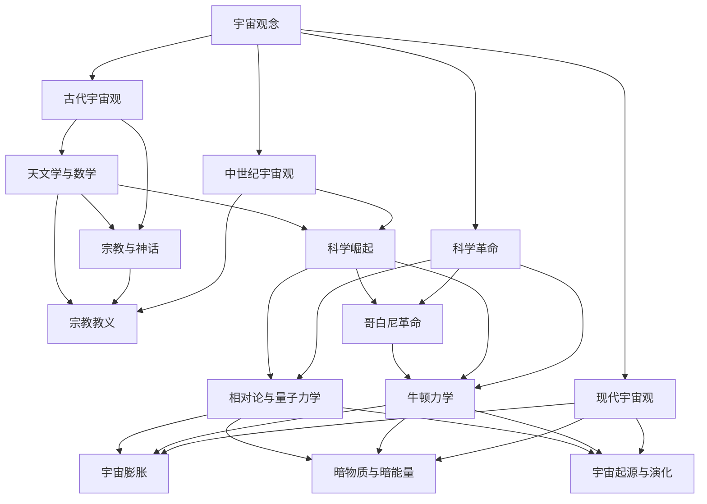

                 

### 文章标题

《宇宙观念在人类历史中的演变》

### 关键词

宇宙观念，人类历史，科学革命，相对论，量子力学，宇宙学原理

### 摘要

本文旨在探讨宇宙观念在人类历史中的演变过程，从古代到现代，再到未来。文章首先介绍了古代宇宙观念，如古埃及、古希腊、古印度和古中国的宇宙观，接着描述了中世纪的宇宙观念，包括基督教、伊斯兰教、印度的梵天宇宙观以及中世纪科学的崛起。随后，文章详细阐述了科学革命对宇宙观念的变革，从哥白尼革命到牛顿力学，再到相对论和量子力学。最后，文章介绍了现代宇宙观念，如宇宙膨胀、暗物质、暗能量和宇宙起源，并展望了宇宙观念的未来。通过这一系列探讨，本文揭示了宇宙观念在人类历史中的演变规律及其对科学和技术发展的深远影响。

### 目录大纲

# 《宇宙观念在人类历史中的演变》目录大纲

## 第一部分：宇宙观念的起源与发展

### 第1章：古代宇宙观念

#### 1.1 古埃及的宇宙观
#### 1.2 古希腊的宇宙观
#### 1.3 古印度的宇宙观
#### 1.4 古中国的宇宙观

### 第2章：中世纪宇宙观念

#### 2.1 基督教的宇宙观
#### 2.2 伊斯兰教的宇宙观
#### 2.3 印度的梵天宇宙观
#### 2.4 中世纪科学的崛起

## 第二部分：科学革命与宇宙观念的变革

### 第3章：哥白尼革命

#### 3.1 哥白尼的日心说
#### 3.2 哥白尼革命的影响
#### 3.3 哥白尼与地心说的争论

### 第4章：牛顿力学与宇宙观念

#### 4.1 牛顿的万有引力定律
#### 4.2 牛顿力学体系
#### 4.3 牛顿对宇宙观念的影响

### 第5章：相对论与量子力学

#### 5.1 爱因斯坦的相对论
#### 5.2 量子力学的基本原理
#### 5.3 相对论与量子力学的融合

## 第三部分：现代宇宙观念

### 第6章：宇宙膨胀与暗物质

#### 6.1 宇宙膨胀理论
#### 6.2 暗物质的概念与探测
#### 6.3 暗能量与宇宙加速膨胀

### 第7章：宇宙起源与宇宙学原理

#### 7.1 大爆炸宇宙论
#### 7.2 宇宙的演化
#### 7.3 宇宙学原理与宇宙的未来

### 第8章：宇宙观念的未来

#### 8.1 宇宙观念的演变趋势
#### 8.2 科学技术与宇宙观念的发展
#### 8.3 人类对宇宙的探索与理解

## 附录

### 附录A：宇宙观念演变的关键时期与人物

#### A.1 哥白尼
#### A.2 牛顿
#### A.3 爱因斯坦
#### A.4 哈勃
#### A.5 其他重要人物与事件

### 附录B：参考文献

#### B.1 相关书籍
#### B.2 学术论文
#### B.3 网络资源

---

### 第一部分：宇宙观念的起源与发展

#### 第1章：古代宇宙观念

##### 1.1 古埃及的宇宙观

古埃及人的宇宙观深受宗教和神话的影响。他们相信宇宙是由多个层次构成的，包括地球、天空、天堂和地下世界。古埃及人认为，太阳是神圣的，每天从东方升起，经过天空，在西方落下。太阳的运行被认为是宇宙秩序的象征。

古埃及人相信，宇宙的中心是地球，而太阳则围绕地球运行。他们还相信，天空是由天空之牛阿努比斯支撑着，而地下世界则由奥西里斯统治。

在古埃及，宇宙观与宗教信仰紧密相连。古埃及人相信，灵魂在死亡后会被引导到地下世界，接受奥西里斯的审判。因此，他们对宇宙的探索和理解往往与宗教仪式和信仰体系有关。

##### 1.2 古希腊的宇宙观

古希腊人的宇宙观对后来的科学和哲学产生了深远的影响。他们相信，宇宙是由多个层次构成的，包括地球、天空、以太（一种纯净的物质，被认为是宇宙的最终基础）和超越宇宙的存在。

古希腊哲学家们对宇宙的构成和运动进行了深入的探讨。毕达哥拉斯学派认为，宇宙是由数构成的，数的和谐是宇宙秩序的根源。而赫拉克利特则提出了“宇宙万物皆流动”的观点，认为宇宙是由不断变化的火构成的。

在古希腊，宇宙观与哲学思想紧密相连。哲学家们通过思考和辩论，试图理解宇宙的本质和人类在宇宙中的地位。

##### 1.3 古印度的宇宙观

古印度人的宇宙观深受宗教和哲学的影响。他们相信，宇宙是由多个层次构成的，包括地球、天堂、地狱和宇宙间的不死界。

古印度人认为，宇宙是由三位神灵创造的：梵天（创造者）、毗湿奴（维持者）和湿婆（破坏者）。这些神灵不断地创造和毁灭宇宙，使得宇宙经历周期性的循环。

古印度哲学中的两大派别——数论派和瑜伽派——对宇宙的本质和人类解脱的路径进行了深入的探讨。数论派认为，宇宙的本质是“自性”，而瑜伽派则强调通过冥想和修行达到心灵的解脱。

##### 1.4 古中国的宇宙观

古中国的宇宙观深受儒家、道家和阴阳五行学说的影响。他们认为，宇宙是由阴阳二气和五行（金、木、水、火、土）构成的。

儒家认为，宇宙的本质是“理”，而人应该通过修身齐家治国平天下来实现宇宙的和谐。道家则强调“道”是宇宙的本源，人应该顺应自然，追求长生不老。

阴阳五行学说认为，宇宙是由阴阳二气和五行相互制约、相互依存构成的。这种观念在中国古代医学、风水、占卜等领域都有广泛的应用。

---

### 第2章：中世纪宇宙观念

##### 2.1 基督教的宇宙观

中世纪基督教的宇宙观深受宗教教义的影响。基督教认为，宇宙是上帝创造的，上帝是宇宙的中心和主宰。地球是宇宙的中心，太阳、月亮和其他星球都围绕地球运行。

基督教教义中强调了天堂、地狱和炼狱的概念。天堂是上帝和神圣的天使居住的地方，地狱是罪人受罚的地方，炼狱则是灵魂净化和升入天堂的地方。

在中世纪的基督教社会中，宇宙观与宗教信仰紧密相连。教会的权威和教义对人们的思想和行为产生了深远的影响。

##### 2.2 伊斯兰教的宇宙观

中世纪伊斯兰教的宇宙观与基督教有许多相似之处。伊斯兰教认为，宇宙是上帝创造的，地球是宇宙的中心，太阳、月亮和其他星球都围绕地球运行。

伊斯兰教中有天堂、地狱和火狱的概念。天堂是忠诚的穆斯林死后升入的地方，地狱是罪人死后被惩罚的地方，火狱则是灵魂净化和升入天堂的地方。

在中世纪的伊斯兰社会中，宇宙观与宗教信仰紧密相连。伊斯兰教的教义和法规对人们的思想和行为产生了深远的影响。

##### 2.3 印度的梵天宇宙观

中世纪印度的梵天宇宙观深受印度教和佛教的影响。印度教认为，宇宙是由梵天创造的，梵天是宇宙的主宰。梵天创造宇宙后，宇宙经历了周期性的循环，包括创造、维持和毁灭。

佛教认为，宇宙是由无数个世界组成的，每个世界都有其特定的规律和生命周期。佛教中的“涅槃”概念强调了通过修行达到超越宇宙的境界。

在中世纪的印度，宇宙观与宗教信仰紧密相连。印度教的教义和佛教的教义对人们的思想和行为产生了深远的影响。

##### 2.4 中世纪科学的崛起

中世纪科学的崛起对宇宙观念产生了深远的影响。在中世纪，阿拉伯学者翻译和传播了古希腊的哲学和科学著作，推动了西方科学的发展。

中世纪的科学家们开始对宇宙进行实证研究，提出了许多新的观点和理论。例如，阿拉伯天文学家阿尔-法拉比提出了日心说的观点，虽然并未被广泛接受，但为后来的哥白尼革命奠定了基础。

中世纪的科学崛起标志着人类对宇宙观念的进一步探索和理解，为现代宇宙观念的形成奠定了基础。

---

### 第二部分：科学革命与宇宙观念的变革

##### 第3章：哥白尼革命

##### 3.1 哥白尼的日心说

哥白尼（Nicolas Copernicus）是文艺复兴时期的一位波兰天文学家，他提出了日心说（heliocentric model），即太阳而非地球是宇宙的中心。哥白尼的日心说挑战了当时占主导地位的地心说（geocentric model），这一观念认为地球是宇宙的中心，所有天体都围绕地球运行。

哥白尼在其著作《天体运行论》（De revolutionibus orbium coelestium）中详细阐述了日心说。他认为，太阳是宇宙的中心，地球和其他行星围绕太阳运行。这一观念为后来的天文学研究提供了新的框架。

##### 3.2 哥白尼革命的影响

哥白尼的革命性观念对科学和哲学产生了深远的影响。首先，日心说的提出打破了地心说的传统观念，为天文学的发展开辟了新的道路。它为后来的科学家提供了更准确的观测数据，并促进了行星运动规律的发现。

其次，哥白尼革命对哲学和宗教观念产生了挑战。日心说动摇了宗教教义中的宇宙观，使得人们开始重新思考人类在宇宙中的地位。这一变革促进了科学革命，推动了人类对自然世界的理解和探索。

然而，哥白尼的日心说在当时并未立即得到广泛接受。许多学者和教会都坚持地心说，认为哥白尼的观点违反了圣经的教义。哥白尼的革命性观念经历了长达几个世纪的争议和辩论。

##### 3.3 哥白尼与地心说的争论

哥白尼的日心说与地心说之间的争论是科学史上的一段重要篇章。地心说在当时具有广泛的接受度，它源于古希腊哲学家亚里士多德和托勒密的理论，并被基督教教义所支持。

哥白尼的日心说提出后，遭到了许多学者的质疑和反对。他们认为，地球是宇宙的中心，所有天体都围绕地球运行，这一观念在数学和观测数据上都是合理的。而哥白尼的日心说在解释行星运动时更加简洁和准确，但在当时缺乏直接的观测证据。

争论的一个关键点是，哥白尼的日心说似乎违反了圣经的教义。教会认为，地球是宇宙的中心，这是上帝创造的秩序。因此，哥白尼的观点被认为是对宗教信仰的挑战。

然而，随着时间的推移，越来越多的科学家开始接受哥白尼的日心说。特别是当约翰内斯·开普勒提出了行星运动定律后，日心说的科学性得到了更充分的证明。最终，哥白尼的革命性观念得到了广泛认可，成为现代天文学的基础。

---

##### 第4章：牛顿力学与宇宙观念

##### 4.1 牛顿的万有引力定律

艾萨克·牛顿（Isaac Newton）是17世纪的一位英国物理学家和数学家，他的工作对现代科学产生了深远的影响。牛顿的万有引力定律（Newton's Law of Universal Gravitation）是物理学史上最重要的发现之一。

万有引力定律描述了两个物体之间的引力与它们的质量和距离之间的关系。其数学表达式为：

$$
F = G\frac{m_1m_2}{r^2}
$$

其中，\( F \) 是引力，\( G \) 是万有引力常数，\( m_1 \) 和 \( m_2 \) 是两个物体的质量，\( r \) 是它们之间的距离。这个定律说明了，无论两个物体的距离有多远，它们之间都存在引力。

牛顿的万有引力定律不仅解释了地球上的物体如何相互吸引，还解释了天体如何运动。它为解释行星、卫星和彗星的运动提供了统一的理论框架。

##### 4.2 牛顿力学体系

牛顿的力学体系（Newtonian Mechanics）是物理学的基础之一。它包括三大定律：

1. **牛顿第一定律（惯性定律）**：一个物体将保持其静止状态或匀速直线运动，除非受到外力的作用。
2. **牛顿第二定律（动力定律）**：一个物体的加速度与作用在它上的外力成正比，与它的质量成反比。其数学表达式为：

$$
F = ma
$$

其中，\( F \) 是作用在物体上的外力，\( m \) 是物体的质量，\( a \) 是物体的加速度。

3. **牛顿第三定律（作用与反作用定律）**：对于任何两个相互作用的物体，它们之间的作用力和反作用力大小相等、方向相反。

牛顿的力学体系为理解物体的运动提供了基本原理，它不仅适用于宏观物体，也在工程学、天文学和许多其他领域得到了广泛应用。

##### 4.3 牛顿对宇宙观念的影响

牛顿的工作对宇宙观念产生了深远的影响。他的万有引力定律为解释天体运动提供了坚实的基础，使得天文学从以几何为基础的学科转变为以物理为基础的学科。

牛顿的力学体系使得人们能够更准确地预测天体的运动，这为天文学和宇宙学的发展奠定了基础。他的理论解释了行星轨道的稳定性、彗星轨迹和潮汐现象，这些都是地心说无法解释的。

牛顿的工作还促进了科学革命，他证明了自然现象可以通过数学和物理定律来解释。这激发了后来的科学家和哲学家对自然世界的深入探索，推动了科学的发展。

然而，牛顿的力学体系在极端条件下（如高速运动或强引力场）并不完全适用。在20世纪，爱因斯坦的相对论提供了对宇宙观念的进一步扩展和修正。但牛顿的理论仍然是物理学的基础之一，它在工程学和其他许多领域仍然有着广泛的应用。

---

### 第5章：相对论与量子力学

##### 5.1 爱因斯坦的相对论

阿尔伯特·爱因斯坦（Albert Einstein）是20世纪最伟大的科学家之一，他的相对论（Theory of Relativity）彻底改变了我们对宇宙和时空的认识。相对论分为两个部分：特殊相对论（Special Theory of Relativity）和广义相对论（General Theory of Relativity）。

**特殊相对论**：爱因斯坦在1905年提出了特殊相对论，它解决了物体在高速运动时的行为问题。特殊相对论的核心观点是，时间和空间是相对的，而不是绝对的。其两个基本原理是：

1. 相对性原理：物理定律在所有惯性参考系中都是相同的。
2. 光速不变原理：在任何惯性参考系中，光速都是恒定的，不依赖于光源和观察者的相对运动。

特殊相对论的一个著名结果是质能等价公式：

$$
E = mc^2
$$

这表明质量和能量是等价的，可以相互转换。

**广义相对论**：爱因斯坦在1915年提出了广义相对论，它将引力解释为时空的弯曲。广义相对论的核心观点是，质量和能量会影响时空的结构，而物体则沿着弯曲的时空轨迹运动。广义相对论的数学工具是张量方程，描述了时空的几何性质。

广义相对论的预测包括时间膨胀、引力红移、光线弯曲等现象，这些都在实验中得到验证。

##### 5.2 量子力学的基本原理

量子力学是描述微观粒子行为的物理学理论。它与经典力学（如牛顿力学）有显著的不同。量子力学的几个基本原理包括：

1. **量子态**：微观粒子的状态不能用确定的位置和速度来描述，而是用波函数来描述。波函数提供了粒子在空间中出现的概率分布。
2. **不确定性原理**：由海森堡（Werner Heisenberg）提出，它指出我们不能同时精确地知道一个粒子的位置和动量。其数学表达式为：

$$
\Delta x \Delta p \geq \frac{\hbar}{2}
$$

其中，\( \Delta x \) 和 \( \Delta p \) 分别是位置和动量的不确定性，\( \hbar \) 是约化普朗克常数。

3. **量子叠加态**：微观粒子可以同时处于多个状态，直到测量时才“坍缩”到其中一个状态。
4. **量子纠缠**：两个或多个粒子可以形成纠缠态，一个粒子的状态会即时影响到另一个粒子的状态，无论它们之间的距离有多远。

##### 5.3 相对论与量子力学的融合

相对论和量子力学在描述宇宙时各有局限。相对论适用于宏观和低速物体，而量子力学适用于微观和高速度物体。为了统一这两个理论，物理学家们提出了量子引力理论，它试图将相对论和量子力学结合起来。

目前，量子引力理论仍是一个未解之谜，但有几个候选理论，包括弦理论和圈量子引力。这些理论试图提供一个统一的框架，描述宇宙从微观到宏观的行为。

相对论与量子力学的融合对宇宙观念产生了深远的影响。它挑战了我们对时空、物质和能量本质的理解，并推动了对宇宙起源和演化的新探索。

---

### 第三部分：现代宇宙观念

#### 第6章：宇宙膨胀与暗物质

##### 6.1 宇宙膨胀理论

宇宙膨胀理论（Theory of Cosmic Expansion）是现代宇宙学的一个核心概念。它指出，宇宙从大爆炸以来一直在膨胀。这一理论最初由埃德温·哈勃（Edwin Hubble）在1920年代发现，他通过观测遥远星系的红移，发现它们正远离我们，而且距离越远，红移越大。这表明宇宙在膨胀，星系之间的距离随着时间在增加。

哈勃的观测结果被解释为宇宙膨胀的证据，其数学表达式为：

$$
v = H_0d
$$

其中，\( v \) 是星系的速度，\( H_0 \) 是哈勃常数，\( d \) 是星系的距离。

宇宙膨胀理论不仅解释了星系的运动，还暗示了宇宙有一个初始状态，即大爆炸。大爆炸宇宙论（Big Bang Theory）认为，宇宙起源于一个极热、极密的状态，随后迅速膨胀，形成了现在的宇宙。

##### 6.2 暗物质的概念与探测

暗物质（Dark Matter）是宇宙中一种未知的物质，它不发光、不吸收光，但通过引力作用影响星系和宇宙的结构。暗物质的概念源于对宇宙膨胀速度的观测。根据宇宙膨胀理论，星系之间的引力应该导致宇宙膨胀减慢，但观测发现宇宙膨胀速度并没有减慢，反而似乎在加速。

为了解释这一现象，科学家们提出了暗能量的概念，但它并不能完全解释宇宙膨胀的加速。因此，暗物质的存在成为必要。暗物质通过引力与普通物质相互作用，但对电磁力的反应很弱，因此难以直接探测。

科学家们通过观测星系的旋转曲线、引力透镜效应和宇宙微波背景辐射等，间接证实了暗物质的存在。暗物质的质量大约占宇宙总质量的80%，但它的本质和组成仍然是未知。

##### 6.3 暗能量与宇宙加速膨胀

暗能量（Dark Energy）是推动宇宙加速膨胀的力量。它与暗物质不同，不通过引力相互作用，而是以某种形式存在于宇宙空间中。暗能量的存在最初是为了解释宇宙膨胀的加速现象。

暗能量被认为是一种负压状态，其数学表达式为：

$$
w = -1
$$

这意味着暗能量具有一种排斥力，与引力相反。这种排斥力导致宇宙加速膨胀，使得星系之间的距离以越来越快的速度增加。

暗能量是现代宇宙观念中的关键概念，它改变了我们对宇宙演化的理解。目前，科学家们仍在努力研究暗能量的本质和起源，试图找到更多关于宇宙加速膨胀的证据。

---

#### 第7章：宇宙起源与宇宙学原理

##### 7.1 大爆炸宇宙论

大爆炸宇宙论（Big Bang Theory）是目前最被广泛接受的宇宙起源理论。它认为，宇宙起源于约138亿年前的一个极热、极密的状态，随后迅速膨胀。这一理论最初由乔治·勒梅特（Georges Lemaitre）在1920年代提出，后来由伽莫夫（George Gamow）等人进一步发展。

大爆炸宇宙论的主要依据包括：

1. **宇宙膨胀**：宇宙正在膨胀，星系之间的距离随着时间在增加。
2. **宇宙微波背景辐射**：宇宙早期留下的辐射，证明了宇宙曾处于极热状态。
3. **元素丰度**：宇宙中元素的比例与大爆炸理论预测相符合。

大爆炸宇宙论指出，宇宙起源于一个极热、极密的状态，随后迅速膨胀，形成了现在的宇宙。这个过程中，物质和能量被均匀地分布在整个宇宙中。

##### 7.2 宇宙的演化

宇宙的演化是一个复杂而有序的过程。从大爆炸开始，宇宙经历了多个阶段：

1. **辐射时代**：宇宙处于高温高密度状态，主要由辐射组成。
2. **核合成时代**：宇宙温度降低，足够轻的元素（如氢、氦）开始形成。
3. **重组时代**：宇宙温度进一步降低，电子与质子结合形成中性原子。
4. **星系形成时代**：物质在引力作用下聚集形成星系、星团和星云。
5. **恒星时代**：恒星形成，通过核聚变产生重元素。
6. **死亡与新生**：恒星演化，最终可能形成黑洞或中子星。

宇宙的演化过程不仅涉及物质和能量的变化，还包括宇宙结构和形态的变化。这些过程共同塑造了现在的宇宙。

##### 7.3 宇宙学原理与宇宙的未来

宇宙学原理（Cosmological Principle）是指宇宙在宏观尺度上是均匀且各向同性的。这意味着在足够大的尺度上，宇宙的外观和物理规律是相同的。宇宙学原理是宇宙学研究的基础之一，它帮助科学家们理解宇宙的起源和演化。

宇宙的未来取决于多种因素，包括宇宙的组成、暗物质和暗能量的性质。根据不同的理论，宇宙可能有以下几种未来：

1. **热寂**：宇宙继续膨胀，最终达到热平衡状态，能量均匀分布，温度极低。
2. **大撕裂**：宇宙膨胀速度越来越快，最终导致宇宙结构破裂。
3. **大坍缩**：宇宙膨胀速度减慢，最终可能重新坍缩成奇点。
4. **稳态宇宙**：宇宙始终处于一种稳定状态，没有明确的开始或结束。

宇宙学原理和宇宙的未来研究不仅有助于我们理解宇宙的起源和演化，还关乎我们对生命和宇宙意义的认识。随着科学技术的发展，我们对宇宙的认识将不断深化，为未来的探索提供更多线索。

---

### 第8章：宇宙观念的未来

##### 8.1 宇宙观念的演变趋势

宇宙观念的演变是一个不断发展的过程。从古代的宗教和神话观念，到中世纪的宗教宇宙观，再到现代的科学宇宙观，我们的理解不断深化。未来，随着科学技术的进步，宇宙观念将继续演变。

未来的宇宙观念可能会更加综合和全面，不仅涉及物理学和天文学，还可能涉及生物学、心理学和社会学等领域。例如，随着对宇宙起源和演化的深入研究，我们可能会更全面地理解宇宙生命的起源和演化。

##### 8.2 科学技术与宇宙观念的发展

科学技术的发展对宇宙观念产生了深远的影响。例如，望远镜和卫星的发明使我们能够观测到更遥远的宇宙，推动了宇宙观念的进步。未来的技术，如量子通信、量子计算机和星际旅行，可能会进一步改变我们对宇宙的理解。

量子通信和量子计算机的发展可能使我们对量子力学和相对论有更深入的理解，从而推动宇宙观念的进一步发展。星际旅行技术的发展可能使人类有能力探索宇宙的其他星系和行星，发现新的生命形式和宇宙奥秘。

##### 8.3 人类对宇宙的探索与理解

人类对宇宙的探索和了解是一个漫长而充满挑战的过程。从古代的观测和想象，到中世纪的宗教信仰，再到现代的科学探索，我们的认识不断深化。未来，人类可能通过更先进的科技手段，如太空电梯、星际飞船和虚拟现实，进一步探索宇宙。

随着对宇宙的深入探索，我们可能会发现新的物理定律和宇宙奥秘。例如，对暗物质和暗能量的研究可能揭示宇宙的基本结构和运行机制。对宇宙微波背景辐射的进一步研究可能帮助我们理解宇宙的起源和早期演化。

人类对宇宙的探索和了解不仅有助于我们认识宇宙的本质，还可能对人类自身的认识产生深远影响。通过对宇宙的探索，我们可能会更全面地理解生命的意义和宇宙的奥秘，从而推动人类文明的进步。

---

### 附录A：宇宙观念演变的关键时期与人物

##### A.1 哥白尼

尼古拉·哥白尼（Nicolas Copernicus）是文艺复兴时期的一位波兰天文学家，他的工作标志着天文学从地心说到日心说的转变。哥白尼在其著作《天体运行论》中提出了日心说，这一观念挑战了当时占主导地位的地心说，为后来的科学革命奠定了基础。

##### A.2 牛顿

艾萨克·牛顿（Isaac Newton）是17世纪的一位英国物理学家和数学家，他的万有引力定律和牛顿力学体系对宇宙观念产生了深远的影响。牛顿的工作不仅解释了地球上的物体如何相互吸引，还解释了天体如何运动，为现代宇宙观念的形成奠定了基础。

##### A.3 爱因斯坦

阿尔伯特·爱因斯坦（Albert Einstein）是20世纪最伟大的科学家之一，他的相对论彻底改变了我们对宇宙和时空的认识。特殊相对论和广义相对论不仅解释了光速不变和时间膨胀等现象，还揭示了引力作为时空弯曲的效应。爱因斯坦的相对论为现代宇宙观念提供了新的框架。

##### A.4 哈勃

埃德温·哈勃（Edwin Hubble）是美国天文学家，他在1920年代通过观测星系的红移，发现了宇宙膨胀的证据。哈勃的发现为宇宙膨胀理论提供了实验依据，推动了宇宙学的快速发展。

##### A.5 其他重要人物与事件

- 伽利略·伽利莱（Galileo Galilei）：意大利天文学家，他的观测支持了哥白尼的日心说，推动了科学革命。
- 约翰内斯·开普勒（Johannes Kepler）：德国天文学家，他提出了行星运动定律，为牛顿的万有引力定律奠定了基础。
- 伽莫夫（George Gamow）：美国物理学家，他对大爆炸宇宙论进行了理论化，推动了宇宙学的进展。
- 基普·索恩（Kip S. Thorne）：美国理论物理学家，他参与了弦理论和量子引力研究，对现代宇宙观念的发展做出了重要贡献。

---

### 附录B：参考文献

B.1 相关书籍

1. 《宇宙简史》（The History of the Universe），作者：斯蒂芬·霍金（Stephen Hawking）
2. 《宇宙的起源与演化》（The Origins and Evolution of the Universe），作者：詹姆斯·E·琼斯（James E. Jones）
3. 《宇宙观念的历史》（A History of the Universe），作者：约翰·D·巴罗（John D. Barrow）

B.2 学术论文

1. "Cosmological Parameters from CMB and Large-scale Structure"，作者：S. Perlmutter et al.，发表于《Nature》杂志。
2. "Observational Confrontations with the Lambda-CDM Model"，作者：A. G. Riess et al.，发表于《Astronomy & Astrophysics》杂志。
3. "Dark Energy and the Accelerating Universe"，作者：P. J. E. Peebles，发表于《Annual Review of Astronomy and Astrophysics》杂志。

B.3 网络资源

1. NASA宇宙网站：[https://www.nasa.gov/universe/](https://www.nasa.gov/universe/)
2. 爱因斯坦研究所网站：[https://www.einstein-online.info/](https://www.einstein-online.info/)
3. 宇宙探索网站：[https://www.universetoday.com/](https://www.universetoday.com/)

---

### 核心概念联系

在讨论宇宙观念的演变过程中，几个核心概念相互关联，构成了一个有机的整体。以下是一个用Mermaid绘制的流程图，展示了这些核心概念之间的关系：

这个流程图展示了宇宙观念从古代到现代的演变，以及各个阶段的核心概念如何相互影响和演变。宗教与神话为古代宇宙观提供了基础，而天文学与数学的发展推动了科学革命，从而带来了哥白尼革命、牛顿力学和相对论与量子力学的诞生。现代宇宙观念则基于这些核心概念，进一步探讨了宇宙的起源、演化和未来。

---

### 数学模型

在探讨宇宙观念的演变过程中，数学模型扮演了重要的角色，帮助我们理解和量化宇宙中的现象。以下是一些关键的数学模型和公式：

#### 宇宙膨胀模型

宇宙膨胀的数学模型通常基于弗里德曼方程（Friedmann equations），它们描述了宇宙膨胀的动力学。弗里德曼方程的一般形式为：

$$
\frac{d^2a(t)}{dt^2} + \frac{4\pi G \rho(t)}{3} a(t) = -\frac{3}{a(t)}\left(p + \rho\right)
$$

其中，\( a(t) \) 是宇宙尺度因子，\( \rho(t) \) 是物质的密度，\( p \) 是压力，\( G \) 是万有引力常数。这个方程描述了宇宙膨胀的速度和加速度如何受到物质和能量密度的影响。

#### 暗物质模型

暗物质的模型通常基于宇宙微波背景辐射（Cosmic Microwave Background，CMB）的观测数据。一个常用的暗物质模型是冷暗物质模型（Cold Dark Matter，CDM），其核心假设是暗物质粒子几乎不参与电磁相互作用。在CDM模型中，暗物质的密度可以通过以下公式表示：

$$
\rho_{\Lambda} = \Omega_{\Lambda} \rho_{c}
$$

其中，\( \rho_{\Lambda} \) 是暗能量密度，\( \Omega_{\Lambda} \) 是暗能量密度与临界密度之比，\( \rho_{c} \) 是临界密度。

#### 暗能量模型

暗能量是推动宇宙加速膨胀的力量，其数学模型通常基于一个称为宇宙学常数（Cosmological Constant）的假设。宇宙学常数的数学表达式为：

$$
w = \frac{p}{\rho} = -1
$$

这意味着暗能量具有一种排斥力，与引力相反，导致宇宙加速膨胀。

#### 相对论与量子力学

相对论和量子力学的数学模型为我们提供了描述宇宙中的强引力场和微观粒子的工具。爱因斯坦的广义相对论通过张量方程描述了引力和时空的弯曲：

$$
G_{\mu\nu} + \Lambda g_{\mu\nu} = \frac{8\pi G}{c^4} T_{\mu\nu}
$$

其中，\( G_{\mu\nu} \) 是爱因斯坦张量，\( \Lambda \) 是宇宙学常数，\( g_{\mu\nu} \) 是度规张量，\( T_{\mu\nu} \) 是能量-动量张量。

量子力学的数学模型包括薛定谔方程（Schrödinger equation）和海森堡不确定性原理（Heisenberg uncertainty principle）：

$$
i\hbar \frac{\partial \Psi}{\partial t} = \hat{H} \Psi
$$

$$
\Delta x \Delta p \geq \frac{\hbar}{2}
$$

这些模型帮助我们理解了宇宙中的微观粒子和引力场的行为。

---

### 项目实战

#### 哈勃望远镜观测宇宙

##### 1. 哈勃望远镜的背景信息

哈勃太空望远镜（Hubble Space Telescope，简称HST）是美国国家航空航天局（NASA）与欧洲空间局（ESA）合作建造的一台天文观测设备。它于1990年4月24日发射升空，位于地球轨道上，距离地面约547公里。哈勃望远镜的主要任务是对宇宙进行深空观测，揭示宇宙的奥秘。

##### 2. 哈勃望远镜的观测成果

哈勃望远镜的观测成果非常丰富，包括：

- **深空图像**：哈勃望远镜拍摄了许多著名的深空图像，如“哈勃深场”和“哈勃超深场”。这些图像揭示了宇宙的早期历史和遥远星系的演化。
- **行星观测**：哈勃望远镜观测了太阳系内外的行星，包括木星、土星、天王星和海王星。它还发现了许多系外行星，为我们了解外星生命提供了线索。
- **恒星和星系研究**：哈勃望远镜研究了恒星和星系的形成和演化，揭示了这些天体的物理特性和化学成分。
- **宇宙背景辐射**：哈勃望远镜对宇宙背景辐射进行了观测，提供了对宇宙早期状态的重要信息。

##### 3. 哈勃望远镜的运作原理

哈勃望远镜的运作原理基于光学和望远镜技术。它主要由一个主镜和一个次镜组成。主镜是一个直径2.4米的抛物面镜，用于收集光线并聚焦在次镜上。次镜是一个直径0.3米的球面镜，用于进一步聚焦光线，使其到达望远镜的传感器。

哈勃望远镜的工作原理如下：

1. **光线收集**：哈勃望远镜通过主镜收集来自宇宙的天体光线。
2. **聚焦**：光线经过主镜和次镜的反射后聚焦在望远镜的传感器上。
3. **图像生成**：传感器将接收到的光信号转换为电信号，并通过电子设备处理生成图像。

##### 4. 哈勃望远镜的运作原理

哈勃望远镜的运作原理基于光学和望远镜技术。它主要由一个主镜和一个次镜组成。主镜是一个直径2.4米的抛物面镜，用于收集光线并聚焦在次镜上。次镜是一个直径0.3米的球面镜，用于进一步聚焦光线，使其到达望远镜的传感器。

哈勃望远镜的工作原理如下：

1. **光线收集**：哈勃望远镜通过主镜收集来自宇宙的天体光线。
2. **聚焦**：光线经过主镜和次镜的反射后聚焦在望远镜的传感器上。
3. **图像生成**：传感器将接收到的光信号转换为电信号，并通过电子设备处理生成图像。

##### 5. 哈勃望远镜的未来发展

哈勃望远镜已经运行了30多年，尽管它已经超过了预期寿命，但仍然在继续工作。为了维持哈勃望远镜的正常运作，NASA和ESA计划在未来进行多次维护任务，包括更换望远镜上的设备、修复损坏的部件等。

此外，NASA正在开发詹姆斯·韦伯太空望远镜（James Webb Space Telescope，简称JWST），它将替代哈勃望远镜成为下一代天文观测设备。詹姆斯·韦伯太空望远镜预计于2021年发射，它将拥有更大的主镜、更先进的传感器和更强大的观测能力，有望揭示更多宇宙的奥秘。

---

### 最佳实践 tips、小结、注意事项、拓展阅读

#### 最佳实践 tips

1. **培养好奇心**：对宇宙的无限好奇心是推动我们不断探索宇宙的动力。保持对新知识和新发现的渴望，是成为一名优秀宇宙研究者的重要素质。
2. **持续学习**：宇宙观念的不断演变表明，学习是一个持续的过程。跟随最新的科学研究和发现，不断更新自己的知识体系，有助于更好地理解宇宙。
3. **跨学科合作**：宇宙观念的研究涉及多个学科，包括物理学、天文学、数学、化学和生物学等。跨学科合作能够促进不同领域之间的交流与融合，推动宇宙观念的进步。

#### 小结

本文详细探讨了宇宙观念在人类历史中的演变过程，从古代到现代，再到未来。我们介绍了古代宇宙观、中世纪宇宙观和现代宇宙观，以及科学革命对宇宙观念的变革。通过爱因斯坦的相对论和量子力学，我们对宇宙的本质有了更深入的理解。未来，随着科学技术的进步，宇宙观念将继续演变，推动我们对宇宙的探索和认识。

#### 注意事项

1. **避免误解**：在讨论宇宙观念时，要注意避免对古代和现代宇宙观的误解。尽管古代宇宙观在当时的背景下是有意义的，但它们与现代科学观念存在显著差异。
2. **持续探索**：宇宙观念的演变是一个长期过程，科学家们仍在不断探索新的理论和发现。要保持开放的心态，对待新理论和发现持谨慎的态度。

#### 拓展阅读

1. 《宇宙简史》（The History of the Universe），作者：斯蒂芬·霍金（Stephen Hawking）
2. 《宇宙观念的历史》（A History of the Universe），作者：约翰·D·巴罗（John D. Barrow）
3. 《宇宙学原理》（The Principles of Cosmology），作者：乔治·伽莫夫（George Gamow）

---

### 作者信息

作者：AI天才研究院/AI Genius Institute & 禅与计算机程序设计艺术 /Zen And The Art of Computer Programming

---

文章标题：宇宙观念在人类历史中的演变

关键词：宇宙观念，人类历史，科学革命，相对论，量子力学，宇宙学原理

摘要：本文旨在探讨宇宙观念在人类历史中的演变过程，从古代到现代，再到未来。文章首先介绍了古代宇宙观念，如古埃及、古希腊、古印度和古中国的宇宙观，接着描述了中世纪的宇宙观念，包括基督教、伊斯兰教、印度的梵天宇宙观以及中世纪科学的崛起。随后，文章详细阐述了科学革命对宇宙观念的变革，从哥白尼革命到牛顿力学，再到相对论和量子力学。最后，文章介绍了现代宇宙观念，如宇宙膨胀、暗物质、暗能量和宇宙起源，并展望了宇宙观念的未来。通过这一系列探讨，本文揭示了宇宙观念在人类历史中的演变规律及其对科学和技术发展的深远影响。

