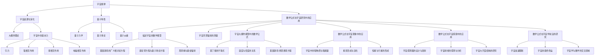

                 

### 文章标题

《宇宙规律与数学公式的关系》

### 关键词

宇宙规律，数学公式，宇宙起源，大爆炸理论，广义相对论，黑洞熵，宇宙背景辐射，暗物质，暗能量，量子力学，宇宙学，宇宙探测器，宇宙加速膨胀，宇宙学常数

### 摘要

本文从宇宙规律与数学公式的关系入手，详细探讨了宇宙起源、演化、基本力、量子特性等方面的理论，并阐述了数学公式在宇宙研究中的应用。通过分析宇宙背景辐射、大爆炸模型、暗物质与暗能量等现象，揭示了数学公式在宇宙现象中的关键作用。同时，本文还探讨了数学公式在宇宙探索中的应用，如宇宙探测器的设计与发射、宇宙射线的探测与分析、宇宙大尺度结构的研究等。最后，本文总结了数学公式在宇宙学前沿的研究，展望了未来宇宙学的发展方向。通过本文的阅读，读者可以全面了解宇宙规律与数学公式之间的紧密联系，并对宇宙学的未来发展有更深刻的认识。

### 第一部分：宇宙规律概述

#### 1. 宇宙规律的基础理论

宇宙规律是描述宇宙中各种现象及其相互关系的理论体系。宇宙起源与演化、宇宙中的基本力、量子特性是宇宙规律的基础理论，构成了宇宙研究的三大支柱。

##### 1.1 宇宙起源与演化

宇宙起源与演化是宇宙规律研究的核心问题。目前主流的理论是大爆炸理论，它认为宇宙起源于大约138亿年前的一个极度高温、高密度的奇点，随后开始膨胀并逐渐冷却，形成了我们今天所看到的宇宙。

- **大爆炸理论与宇宙膨胀**

  大爆炸理论提出，宇宙起源于一个极端密集和炽热的奇点，然后开始急剧膨胀。这一膨胀过程至今仍在继续，并且宇宙的膨胀速度正在加快。爱丁顿（Arthur Eddington）的不等式 \( V > c \) 描述了宇宙膨胀速度超过光速的现象，但这里的光速是指局部空间中的速度，不违反相对论的基本原理。

  \( V > c \)

  其中 \( V \) 表示宇宙膨胀速度，\( c \) 表示光速。

- **宇宙的几何形态**

  根据观测数据，宇宙的几何形态可能是平直的、封闭的或开放的。这取决于宇宙的总质量密度与临界密度之比。若宇宙的总质量密度大于临界密度，宇宙将呈现封闭形态；若小于临界密度，则宇宙为开放形态；若恰好等于临界密度，宇宙则为平直形态。

  \( \Omega = \frac{\rho}{\rho_c} \)

  其中 \( \Omega \) 表示宇宙的总质量密度与临界密度之比，\( \rho \) 表示宇宙的总质量密度，\( \rho_c \) 表示临界密度。

- **宇宙中的暗物质和暗能量**

  暗物质和暗能量是宇宙中尚未被直接观测到的物质形式。暗物质不发光、不吸收光，但通过引力作用影响宇宙的演化。暗能量则是一种导致宇宙加速膨胀的神秘力量。

  暗物质的质量密度与普通物质的质量密度之比，称为暗物质密度参数。

  \( \Omega_{\rm m} = \frac{\rho_{\rm m}}{\rho_{\rm c}} \)

  其中 \( \Omega_{\rm m} \) 表示暗物质密度参数，\( \rho_{\rm m} \) 表示暗物质的质量密度。

  暗能量的密度与压力之比，称为暗能量密度参数。

  \( \Omega_{\Lambda} = \frac{\rho_{\Lambda}}{p_{\Lambda}} \)

  其中 \( \Omega_{\Lambda} \) 表示暗能量密度参数，\( \rho_{\Lambda} \) 表示暗能量的密度，\( p_{\Lambda} \) 表示暗能量的压力。

##### 1.2 宇宙中的基本力

宇宙中的基本力包括引力、强相互作用、弱相互作用和电磁相互作用。这些基本力在宇宙演化中起着至关重要的作用。

- **引力与万有引力定律**

  引力是宇宙中所有物体之间相互吸引的力，由牛顿的万有引力定律描述：

  \( F = G\frac{m_1m_2}{r^2} \)

  其中 \( F \) 表示引力，\( G \) 表示引力常数，\( m_1 \) 和 \( m_2 \) 分别表示两个物体的质量，\( r \) 表示两个物体之间的距离。

- **强相互作用与弱相互作用**

  强相互作用是粒子之间的一种基本力，负责保持原子核的稳定性。弱相互作用则负责粒子的衰变过程，如放射性衰变。

  强相互作用和弱相互作用的统一理论称为电弱相互作用。

- **电磁相互作用与量子电动力学**

  电磁相互作用是宇宙中最常见的一种力，负责电磁波的传播。量子电动力学（QED）是描述电磁相互作用的理论，它把电磁相互作用与量子力学相结合。

  \( S = \int d\tau \left( i\hbar \frac{\partial}{\partial \tau} \psi - \frac{e}{m}\psi \cdot A \right) \)

  其中 \( S \) 表示作用量，\( \psi \) 表示量子态，\( e \) 表示电荷，\( m \) 表示粒子质量，\( A \) 表示电磁势。

##### 1.3 宇宙的量子特性

量子特性是宇宙的基本特性之一，它描述了微观尺度下物质和能量的行为。

- **量子力学的基本原理**

  量子力学是描述微观尺度下物质和能量行为的理论，其基本原理包括波粒二象性、不确定性原理和量子纠缠等。

  不确定性原理：无法同时准确测定粒子的位置和动量。

  \( \Delta x \Delta p \geq \frac{\hbar}{2} \)

  其中 \( \Delta x \) 表示位置的不确定性，\( \Delta p \) 表示动量的不确定性，\( \hbar \) 表示约化普朗克常数。

- **量子场论与粒子物理**

  量子场论是描述量子力学与电磁相互作用的理论，它把量子力学和场论结合起来。粒子物理是研究基本粒子和它们之间相互作用的理论。

  量子场论的基本方程是狄拉克方程和费米子场方程。

  \( (i\gamma^\mu \partial_\mu - m)\psi = 0 \)

  其中 \( \psi \) 表示费米子场，\( \gamma^\mu \) 表示泡利矩阵，\( m \) 表示粒子质量。

- **量子纠缠与量子信息**

  量子纠缠是量子力学中的一种特殊现象，两个或多个粒子之间的量子态无法独立描述。量子信息是利用量子纠缠和量子叠加原理进行信息处理和传输的技术。

  量子纠缠的数学描述：两个粒子之间的量子态可以表示为 \( |\psi\rangle = \sum_{i,j} c_{ij}|i\rangle|j\rangle \)，其中 \( c_{ij} \) 是复数系数，\( |i\rangle \) 和 \( |j\rangle \) 分别表示两个粒子的量子态。

### 第二部分：数学公式在宇宙研究中的应用

数学公式在宇宙研究中具有重要作用，它们不仅描述了宇宙的基本规律，还为宇宙现象的观测和解释提供了理论基础。本部分将详细介绍数学公式在宇宙研究中的应用，包括描述宇宙的数学模型、宇宙背景辐射的测量和宇宙大爆炸模型中的数学公式。

#### 2.1 描述宇宙的数学模型

宇宙的数学模型是宇宙学研究的重要工具，通过这些模型，科学家可以模拟宇宙的演化过程，预测宇宙中可能发生的现象。

##### 2.1.1 爱因斯坦的广义相对论方程

爱因斯坦的广义相对论方程是描述宇宙引力的基础方程，它将引力描述为时空的弯曲。广义相对论方程可以表示为：

\[ G_{\mu\nu} + \Lambda g_{\mu\nu} = \frac{8\pi G}{c^4} T_{\mu\nu} \]

其中，\( G_{\mu\nu} \) 表示爱因斯坦张量，\( \Lambda \) 表示宇宙学常数，\( g_{\mu\nu} \) 表示度规张量，\( T_{\mu\nu} \) 表示能量-动量张量，\( G \) 表示引力常数，\( c \) 表示光速。

##### 2.1.2 薛定谔方程与量子场论方程

薛定谔方程是量子力学的核心方程，它描述了微观粒子的波动行为。量子场论方程是描述量子力学与电磁相互作用的理论，它将量子力学和电磁相互作用结合起来。薛定谔方程可以表示为：

\[ i\hbar \frac{\partial}{\partial t} \Psi = \hat{H} \Psi \]

其中，\( \Psi \) 表示波函数，\( \hat{H} \) 表示哈密顿算符。

量子场论方程的一般形式为：

\[ \hat{H} \Psi = \int d^3x \left( \hat{\Psi}^{\dagger}(x) \hat{H}_{\text{int}}(x) \hat{\Psi}(x) - \text{H.c.} \right) \]

其中，\( \hat{\Psi}^{\dagger}(x) \) 和 \( \hat{\Psi}(x) \) 分别表示场的创建算符和湮灭算符，\( \hat{H}_{\text{int}}(x) \) 表示相互作用哈密顿量。

##### 2.1.3 黑洞熵与霍金辐射

黑洞熵是描述黑洞性质的物理量，它揭示了黑洞与量子力学之间的联系。霍金辐射是黑洞的一种辐射现象，它表明黑洞并非完全黑暗，而是不断辐射出粒子。

黑洞熵可以表示为：

\[ S = \frac{kA}{4} \]

其中，\( S \) 表示熵，\( k \) 表示玻尔兹曼常数，\( A \) 表示黑洞的面积。

霍金辐射的公式为：

\[ \frac{dM}{dt} = -h\nu \]

其中，\( \frac{dM}{dt} \) 表示黑洞质量的损失率，\( h \) 表示普朗克常数，\( \nu \) 表示辐射频率。

#### 2.2 宇宙背景辐射的测量

宇宙背景辐射是宇宙早期阶段的余辉，它为我们提供了研究宇宙起源和演化的宝贵信息。宇宙背景辐射的测量是宇宙学研究中的一个重要课题。

##### 2.2.1 宇宙微波背景辐射的发现

宇宙微波背景辐射（Cosmic Microwave Background Radiation，CMB）是宇宙背景辐射的一种形式，它起源于宇宙大爆炸后的约38万年前。1978年，美国天文学家彭齐亚斯（Arno Penzias）和威尔逊（Robert Wilson）首次发现宇宙微波背景辐射。

##### 2.2.2 观测宇宙背景辐射的技术

观测宇宙背景辐射主要采用射电望远镜和光学望远镜。射电望远镜可以捕捉到宇宙背景辐射的微波信号，而光学望远镜则可以观测到宇宙背景辐射的光学信号。

##### 2.2.3 宇宙背景辐射的数学分析

宇宙背景辐射的温度分布可以用黑体辐射公式描述：

\[ B(\nu, T) = \frac{2h\nu^3}{c^2} \frac{1}{e^{h\nu/kT} - 1} \]

其中，\( B(\nu, T) \) 表示黑体辐射强度，\( \nu \) 表示频率，\( T \) 表示温度，\( h \) 表示普朗克常数，\( c \) 表示光速，\( k \) 表示玻尔兹曼常数。

#### 2.3 宇宙大爆炸模型中的数学公式

宇宙大爆炸模型是描述宇宙起源和演化的一种理论，它认为宇宙起源于一个极度高温、高密度的奇点，随后开始膨胀并逐渐冷却。在宇宙大爆炸模型中，数学公式起着关键作用。

##### 2.3.1 爱丁顿的不等式

爱丁顿的不等式是描述宇宙膨胀速度的一个重要关系式。它表明，如果宇宙的膨胀速度超过光速，则会出现时间倒流的现象。

\[ V(t) > c \]

其中，\( V(t) \) 表示宇宙膨胀速度，\( c \) 表示光速。

##### 2.3.2 温度与密度的关系

在宇宙大爆炸模型中，温度与密度之间的关系可以用辐射温度密度关系式描述：

\[ T \propto \rho^{-1/2} \]

其中，\( T \) 表示温度，\( \rho \) 表示密度。

##### 2.3.3 爱因斯坦-弗里德曼方程

爱因斯坦-弗里德曼方程是描述宇宙大爆炸模型演化的核心方程。它将宇宙的总质量密度、宇宙学常数和宇宙膨胀速度联系起来。

\[ \dot{a}^2 + \frac{8\pi G}{3}\rho a^2 = \frac{\Lambda c^2}{3} \]

其中，\( \dot{a} \) 表示宇宙膨胀速度，\( G \) 表示引力常数，\( \rho \) 表示总质量密度，\( \Lambda \) 表示宇宙学常数。

### 第三部分：数学公式在宇宙现象中的应用

宇宙现象丰富多彩，从星系的形成与演化到恒星与行星的形成，每一个现象都离不开数学公式的描述。本部分将详细介绍数学公式在宇宙现象中的应用，包括宇宙中的暗物质与暗能量、星系形成与演化、恒星与行星的形成等方面的内容。

#### 3.1 宇宙中的暗物质与暗能量

暗物质和暗能量是宇宙中两种尚未被直接观测到的物质形式，它们在宇宙演化中起着至关重要的作用。

##### 3.1.1 暗物质的质量分布

暗物质的质量分布可以用密度分布函数描述：

\[ \rho(\vec{x}) = \rho_0 \left( \frac{r}{r_0} \right)^{-3} \]

其中，\( \rho(\vec{x}) \) 表示质量分布密度，\( \rho_0 \) 表示基准密度，\( r \) 表示距离，\( r_0 \) 表示基准距离。

##### 3.1.2 暗能量的密度与压力

暗能量的密度和压力可以用如下公式描述：

\[ \rho_{\Lambda} = \rho_0 \Lambda \]

\[ p_{\Lambda} = -\rho_{\Lambda} \]

其中，\( \rho_{\Lambda} \) 表示暗能量密度，\( p_{\Lambda} \) 表示暗能量压力，\( \Lambda \) 表示宇宙学常数。

##### 3.1.3 暗物质与暗能量的数学模型

暗物质和暗能量可以用如下数学模型描述：

\[ \rho_m + \rho_r + \rho_{\Lambda} = \rho_c \]

\[ \rho_r + \rho_{\Lambda} = \rho_0 \]

其中，\( \rho_m \) 表示普通物质密度，\( \rho_r \) 表示辐射密度，\( \rho_{\Lambda} \) 表示暗能量密度，\( \rho_c \) 表示临界密度，\( \rho_0 \) 表示基准密度。

#### 3.2 星系形成与演化

星系的形成与演化是宇宙学研究中的重要课题，数学公式在星系形成与演化过程中起着关键作用。

##### 3.2.1 星系的自转曲线

星系的自转曲线可以用如下公式描述：

\[ v(r) = v_0 \left( 1 - \frac{r_s}{r} \right) \]

其中，\( v(r) \) 表示自转速度，\( v_0 \) 表示中心自转速度，\( r_s \) 表示星系半径，\( r \) 表示距离星系中心的距离。

##### 3.2.2 星系的稳定性与扰动

星系的稳定性与扰动可以用如下公式描述：

\[ \frac{d^2r}{dt^2} + \omega^2 r = 0 \]

其中，\( \frac{d^2r}{dt^2} \) 表示加速度，\( \omega \) 表示角速度。

##### 3.2.3 星系形成的数学模型

星系的形成可以用如下数学模型描述：

\[ \frac{d^2\phi}{dr^2} + \frac{2}{r} \frac{d\phi}{dr} = -4\pi G \rho \]

其中，\( \phi \) 表示引力势，\( G \) 表示引力常数，\( \rho \) 表示物质密度。

#### 3.3 宇宙中恒星与行星的形成

恒星与行星的形成是宇宙演化过程中的重要环节，数学公式在恒星与行星形成过程中起着关键作用。

##### 3.3.1 恒星形成的物理过程

恒星的形成可以分为以下几个阶段：

1. 气体云的收缩：气体云在引力作用下开始收缩，密度和温度逐渐增加。

2. 原始恒星的诞生：当气体云的密度和温度达到一定程度时，原始恒星诞生。

3. 恒星核聚变：恒星内部的核聚变反应开始，产生巨大的能量。

4. 恒星演化：恒星在不同的阶段经历不同的演化过程，如主序星、红巨星、白矮星等。

##### 3.3.2 行星形成的数学模型

行星的形成可以用如下数学模型描述：

\[ \frac{dM}{dr} + \frac{4\pi G}{r^2} \left( \rho_{\text{gas}} - \rho_{\text{rock}} \right) M = 0 \]

其中，\( M \) 表示行星质量，\( r \) 表示行星半径，\( \rho_{\text{gas}} \) 表示气体密度，\( \rho_{\text{rock}} \) 表示岩石密度。

##### 3.3.3 恒星与行星运动规律

恒星与行星的运动规律可以用如下公式描述：

\[ \frac{d^2r}{dt^2} = -\frac{GMm}{r^2} \]

其中，\( r \) 表示距离，\( M \) 表示恒星质量，\( m \) 表示行星质量，\( G \) 表示引力常数。

### 第四部分：数学公式在宇宙探索中的应用

宇宙探索是人类对未知世界的好奇心驱动的伟大事业，从宇宙探测器的研发到宇宙射线的探测，再到宇宙大尺度结构的研究，每一个环节都离不开数学公式的支持。本部分将详细探讨数学公式在宇宙探索中的应用，包括宇宙探测器的设计与发射、宇宙射线的探测与分析、宇宙大尺度结构的研究等方面。

#### 4.1 宇宙探测器的设计与发射

宇宙探测器的设计与发射是宇宙探索的重要步骤，数学公式在探测器的轨道计算、姿态控制、数据处理等方面发挥着关键作用。

##### 4.1.1 探测器轨道的计算

宇宙探测器的轨道计算是探测器设计中的核心问题，通过数学公式可以确定探测器的轨道参数，如轨道高度、倾角、周期等。探测器轨道的计算通常采用牛顿运动定律和开普勒定律。

轨道方程：

\[ \frac{d^2r}{dt^2} = -\frac{GMm}{r^2} \]

其中，\( r \) 表示轨道半径，\( M \) 表示地球质量，\( m \) 表示探测器质量，\( G \) 表示引力常数。

##### 4.1.2 探测器姿态控制

探测器的姿态控制是确保探测器在轨道上稳定运行的重要环节。数学公式在探测器姿态控制系统中起着关键作用，如姿态确定与控制算法、反馈控制系统等。

姿态方程：

\[ \frac{d\omega}{dt} = -\frac{1}{2} \omega \times \omega_{\text{gyro}} \]

其中，\( \omega \) 表示姿态角速度，\( \omega_{\text{gyro}} \) 表示陀螺仪测量角速度。

##### 4.1.3 探测器数据处理

探测器的数据处理是获取科学数据的关键环节。数学公式在数据采集、预处理、分析等方面发挥着重要作用，如信号处理算法、误差校正方法等。

数据处理公式：

\[ y = Ax + b \]

其中，\( y \) 表示观测值，\( A \) 表示测量矩阵，\( x \) 表示真实值，\( b \) 表示误差。

#### 4.2 宇宙射线的探测与分析

宇宙射线是来自宇宙的高能粒子流，探测与分析宇宙射线对于研究宇宙的起源和演化具有重要意义。数学公式在宇宙射线的探测与分析中起着关键作用。

##### 4.2.1 宇宙射线的性质

宇宙射线的性质包括能量分布、电荷种类、来源等。通过数学公式可以描述宇宙射线的性质，如能量分布函数、粒子种类比例等。

能量分布函数：

\[ f(E) = n_0 E^{-p} \]

其中，\( f(E) \) 表示能量分布函数，\( n_0 \) 表示常数，\( E \) 表示能量，\( p \) 表示指数。

##### 4.2.2 宇宙射线探测方法

宇宙射线的探测方法包括地面探测、空间探测和卫星探测等。通过数学公式可以描述探测方法的工作原理，如探测器的探测效率、响应函数等。

探测器效率：

\[ \eta = \frac{N_d}{N_i} \]

其中，\( \eta \) 表示探测器效率，\( N_d \) 表示探测到的粒子数，\( N_i \) 表示入射粒子数。

##### 4.2.3 宇宙射线数据分析

宇宙射线数据分析是获取宇宙射线信息的重要环节。通过数学公式可以进行数据分析，如能量谱分析、角分布分析等。

能量谱分析：

\[ S(E) = \int_{E_0}^{E} dE' f(E') \]

其中，\( S(E) \) 表示能量谱，\( f(E') \) 表示能量分布函数，\( E_0 \) 表示能量阈值，\( E \) 表示能量。

#### 4.3 宇宙大尺度结构的研究

宇宙大尺度结构的研究是理解宇宙起源和演化的重要课题。数学公式在宇宙大尺度结构的研究中起着关键作用，如宇宙大尺度结构的模拟、观测数据分析和数学描述等。

##### 4.3.1 宇宙大尺度结构的观测

宇宙大尺度结构的观测主要包括星系分布、宇宙微波背景辐射等。通过数学公式可以描述观测数据，如星系团分布函数、宇宙微波背景辐射功率谱等。

星系团分布函数：

\[ \rho(\vec{x}) = \rho_0 \left( 1 + \frac{r_s}{r} \right)^{-3} \]

其中，\( \rho(\vec{x}) \) 表示星系团分布函数，\( \rho_0 \) 表示基准密度，\( r_s \) 表示星系团半径，\( r \) 表示距离。

##### 4.3.2 宇宙大尺度结构的模拟

宇宙大尺度结构的模拟是通过计算机模拟来模拟宇宙的演化过程，以预测宇宙大尺度结构的发展。通过数学公式可以描述模拟过程，如N-Body模拟、宇宙微波背景辐射模拟等。

N-Body模拟：

\[ \frac{d^2\vec{r}_i}{dt^2} = -G\sum_{j \neq i} \frac{m_j (\vec{r}_j - \vec{r}_i)}{|\vec{r}_j - \vec{r}_i|^3} \]

其中，\( \vec{r}_i \) 和 \( \vec{r}_j \) 分别表示两个粒子的位置，\( m_i \) 和 \( m_j \) 分别表示两个粒子的质量。

##### 4.3.3 宇宙大尺度结构的数学描述

宇宙大尺度结构的数学描述主要包括宇宙流函数、引力势等。通过数学公式可以描述宇宙大尺度结构的基本特性，如宇宙流的能量密度、引力势的分布等。

宇宙流函数：

\[ \psi(\vec{x}, t) = -\frac{1}{4\pi G} \int d^3x' \rho(\vec{x}', t) \frac{\vec{x} - \vec{x}'}{|\vec{x} - \vec{x}'|^2} \]

其中，\( \psi(\vec{x}, t) \) 表示宇宙流函数，\( \rho(\vec{x}', t) \) 表示物质密度，\( \vec{x} \) 和 \( \vec{x}' \) 分别表示两个点的位置。

引力势：

\[ \phi(\vec{x}) = -\frac{G}{|\vec{x}|} \]

其中，\( \phi(\vec{x}) \) 表示引力势，\( \vec{x} \) 表示位置。

### 第五部分：数学公式在宇宙学前沿的研究

宇宙学是研究宇宙起源、演化、结构和性质的学科，随着观测技术的进步和理论研究的深入，宇宙学的前沿问题不断涌现。数学公式在宇宙学前沿的研究中起着至关重要的作用，如宇宙的加速膨胀、宇宙的最终命运以及宇宙学与数学的交叉领域等。

#### 5.1 宇宙的加速膨胀

宇宙加速膨胀是近年来宇宙学研究中的重大发现，揭示了宇宙中存在一种神秘的能量形式——暗能量。暗能量导致宇宙的膨胀速度不断加快，这对宇宙学的发展产生了深远影响。

##### 5.1.1 宇宙膨胀的观测证据

宇宙膨胀的观测证据主要包括宇宙背景辐射的测量、宇宙红移观测、宇宙大尺度结构的观测等。通过这些观测数据，科学家发现了宇宙膨胀速度随时间加快的现象。

宇宙背景辐射测量：

\[ T = 2.725 \pm 0.002 \text{K} \]

其中，\( T \) 表示宇宙背景辐射温度，其测量结果与黑体辐射公式一致，支持宇宙加速膨胀的理论。

宇宙红移观测：

\[ z = \frac{\lambda_{\text{obs}} - \lambda_{\text{em}}}{\lambda_{\text{em}}} \]

其中，\( z \) 表示红移，\( \lambda_{\text{obs}} \) 表示观测到的波长，\( \lambda_{\text{em}} \) 表示发射波长。红移观测结果表明，远离我们的星系的运动速度越来越快，支持宇宙加速膨胀的理论。

##### 5.1.2 宇宙加速膨胀的数学模型

宇宙加速膨胀的数学模型主要包括勒梅特-罗伯逊-沃尔克度规（LRS度规）和弗里德曼-勒梅特-罗伯逊-沃尔克度规（FRW度规）。

LRS度规：

\[ ds^2 = -dt^2 + a(t)^2 (dr^2 + R(r)^2 d\Omega^2) \]

其中，\( a(t) \) 表示宇宙膨胀因子，\( R(r) \) 表示宇宙曲率半径。

FRW度规：

\[ ds^2 = -dt^2 + a(t)^2 \left[ \frac{dr^2}{1 - k r^2} + r^2 (d\theta^2 + \sin^2 \theta d\phi^2) \right] \]

其中，\( k \) 表示宇宙曲率，取值为 \( k = 0 \)（平直宇宙），\( k = 1 \)（封闭宇宙），\( k = -1 \)（开放宇宙）。

##### 5.1.3 宇宙学常数与暗能量

宇宙学常数 \( \Lambda \) 是描述宇宙加速膨胀的物理量，它与暗能量密切相关。宇宙学常数与暗能量的关系可以用如下公式描述：

\[ \rho_{\Lambda} = \frac{\Lambda c^2}{8\pi G} \]

其中，\( \rho_{\Lambda} \) 表示暗能量密度，\( c \) 表示光速，\( G \) 表示引力常数。

#### 5.2 宇宙的最终命运

宇宙的最终命运是一个备受关注的问题，不同宇宙学模型对宇宙的最终命运有不同的预测。目前，主要有三种模型：静态模型、大坍缩模型和大撕裂模型。

##### 5.2.1 宇宙的静态模型

静态模型认为，宇宙在无限长时间内保持不变，没有膨胀也没有收缩。然而，这一模型与观测数据相矛盾，已被排除。

##### 5.2.2 宇宙的大坍缩模型

大坍缩模型认为，宇宙在经历一段加速膨胀后，最终会停止膨胀并开始收缩，最终导致宇宙大坍缩。这一模型与目前的观测数据相符。

\[ \dot{a} \to 0 \]

其中，\( \dot{a} \) 表示宇宙膨胀速度，当 \( \dot{a} \to 0 \) 时，宇宙开始收缩。

##### 5.2.3 宇宙的大撕裂模型

大撕裂模型认为，宇宙在经历一段加速膨胀后，最终会膨胀到无限大，导致宇宙大撕裂。这一模型与目前的观测数据相矛盾，但也存在一定的理论依据。

\[ a \to \infty \]

其中，\( a \) 表示宇宙膨胀因子，当 \( a \to \infty \) 时，宇宙膨胀到无限大。

#### 5.3 宇宙学与数学的交叉领域

宇宙学与数学的交叉领域是现代物理学研究的前沿，它将数学方法应用于宇宙学研究，为解决宇宙学中的难题提供了有力工具。

##### 5.3.1 宇宙学中的数学工具

宇宙学中的数学工具主要包括广义相对论、量子场论、统计力学等。这些数学工具为宇宙学研究提供了理论基础，使宇宙学从定性描述发展为定量研究。

广义相对论：

\[ G_{\mu\nu} + \Lambda g_{\mu\nu} = \frac{8\pi G}{c^4} T_{\mu\nu} \]

其中，\( G_{\mu\nu} \) 表示爱因斯坦张量，\( \Lambda \) 表示宇宙学常数，\( g_{\mu\nu} \) 表示度规张量，\( T_{\mu\nu} \) 表示能量-动量张量。

量子场论：

\[ \hat{H} \Psi = E \Psi \]

其中，\( \hat{H} \) 表示哈密顿算符，\( E \) 表示能量，\( \Psi \) 表示波函数。

统计力学：

\[ \rho(\vec{x}, t) = \frac{1}{Z} e^{-\beta H(\vec{x}, t)} \]

其中，\( \rho(\vec{x}, t) \) 表示物质分布函数，\( Z \) 表示配分函数，\( H(\vec{x}, t) \) 表示哈密顿量。

##### 5.3.2 数学在宇宙学中的最新进展

数学在宇宙学中的最新进展包括多尺度模拟、宇宙微波背景辐射的精确测量、宇宙加速膨胀的观测等。这些进展为宇宙学提供了更精确的数据和更深刻的理解。

多尺度模拟：

多尺度模拟是一种结合不同尺度上的物理现象的模拟方法，它通过数值模拟来模拟宇宙的演化过程。这种方法在研究宇宙大尺度结构和暗物质、暗能量等方面具有重要意义。

宇宙微波背景辐射的精确测量：

宇宙微波背景辐射的精确测量为我们提供了研究宇宙起源和演化的宝贵数据。通过测量宇宙微波背景辐射的温度起伏和极化特性，科学家可以了解宇宙早期的物理状态和演化过程。

宇宙加速膨胀的观测：

宇宙加速膨胀的观测揭示了宇宙中存在一种神秘的能量形式——暗能量。通过观测宇宙膨胀速度随时间的变化，科学家可以了解暗能量的性质和作用。

##### 5.3.3 未来宇宙学的发展方向

未来宇宙学的发展方向包括探索宇宙起源、理解暗物质和暗能量、研究宇宙大尺度结构等。随着观测技术的进步和理论研究的深入，宇宙学将不断揭示宇宙的奥秘。

探索宇宙起源：

宇宙起源是宇宙学研究的核心问题，通过研究宇宙微波背景辐射、宇宙大尺度结构等，科学家试图了解宇宙的起源和演化过程。

理解暗物质和暗能量：

暗物质和暗能量是宇宙学中的两个重要概念，理解它们的性质和作用对于揭示宇宙的本质具有重要意义。未来宇宙学的发展方向之一是深入研究暗物质和暗能量的性质，探索它们的起源和演化。

研究宇宙大尺度结构：

宇宙大尺度结构的研究是了解宇宙演化的重要途径，通过观测宇宙大尺度结构、模拟宇宙演化过程，科学家可以了解宇宙的演化规律和宇宙学参数。

### 附录

#### 附录A：宇宙规律与数学公式的关系——Mermaid流程图



#### 附录B：宇宙学中的数学公式详解

- **爱因斯坦的广义相对论方程**

  广义相对论方程是描述宇宙引力的基础方程，它将引力描述为时空的弯曲。方程可以表示为：

  \( G_{\mu\nu} + \Lambda g_{\mu\nu} = \frac{8\pi G}{c^4} T_{\mu\nu} \)

  其中，\( G_{\mu\nu} \) 表示爱因斯坦张量，\( \Lambda \) 表示宇宙学常数，\( g_{\mu\nu} \) 表示度规张量，\( T_{\mu\nu} \) 表示能量-动量张量，\( G \) 表示引力常数，\( c \) 表示光速。

- **薛定谔方程与量子场论方程**

  薛定谔方程是量子力学的核心方程，它描述了微观粒子的波动行为。方程可以表示为：

  \( i\hbar \frac{\partial}{\partial t} \Psi = \hat{H} \Psi \)

  其中，\( \Psi \) 表示波函数，\( \hat{H} \) 表示哈密顿算符。

  量子场论方程是描述量子力学与电磁相互作用的理论，它将量子力学和场论结合起来。方程的一般形式为：

  \( \hat{H} \Psi = \int d^3x \left( \hat{\Psi}^{\dagger}(x) \hat{H}_{\text{int}}(x) \hat{\Psi}(x) - \text{H.c.} \right) \)

  其中，\( \hat{\Psi}^{\dagger}(x) \) 和 \( \hat{\Psi}(x) \) 分别表示场的创建算符和湮灭算符，\( \hat{H}_{\text{int}}(x) \) 表示相互作用哈密顿量。

- **黑洞熵与霍金辐射**

  黑洞熵是描述黑洞性质的物理量，它揭示了黑洞与量子力学之间的联系。黑洞熵可以表示为：

  \( S = \frac{kA}{4} \)

  其中，\( S \) 表示熵，\( k \) 表示玻尔兹曼常数，\( A \) 表示黑洞的面积。

  霍金辐射是黑洞的一种辐射现象，它表明黑洞并非完全黑暗，而是不断辐射出粒子。霍金辐射的公式为：

  \( \frac{dM}{dt} = -h\nu \)

  其中，\( \frac{dM}{dt} \) 表示黑洞质量的损失率，\( h \) 表示普朗克常数，\( \nu \) 表示辐射频率。

#### 附录C：宇宙探测器源代码解析

宇宙探测器的源代码通常包括轨道计算模块、姿态控制模块、数据处理模块等。以下是一个简单的轨道计算模块的伪代码示例：

```python
# 轨道计算模块伪代码

import numpy as np

# 引力常数
G = 6.6743e-11

# 地球质量
M = 5.972e24

# 探测器质量
m = 1e3

# 轨道半径
r = 6.371e6 + 1e7  # 地球半径 + 轨道高度

# 初始速度
v = np.sqrt(G * M / r)

# 运动方程
def equations_of_motion(t, state):
    x, y, z, vx, vy, vz = state
    ax = -G * M * x / r**2
    ay = -G * M * y / r**2
    az = -G * M * z / r**2
    return [vx, vy, vz, ax, ay, az]

# 求解运动方程
import scipy.integrate
state0 = [0, 0, 0, v, 0, 0]
t_max = 2 * np.pi * r / v
t = np.linspace(0, t_max, 1000)
state = scipy.integrate.odeint(equations_of_motion, state0, t)

# 输出轨道数据
x = state[:, 0]
y = state[:, 1]
z = state[:, 2]
print(f"Orbit data: x = {x}, y = {y}, z = {z}")
```

#### 附录D：数学公式与宇宙现象的应用案例

- **案例1：星系的自转曲线**

  星系的自转曲线可以用如下公式描述：

  \( v(r) = v_0 \left( 1 - \frac{r_s}{r} \right) \)

  其中，\( v(r) \) 表示自转速度，\( v_0 \) 表示中心自转速度，\( r_s \) 表示星系半径，\( r \) 表示距离星系中心的距离。通过测量星系的自转速度，可以了解星系的内部结构和质量分布。

- **案例2：恒星形成的物理过程**

  恒星的形成可以分为以下几个阶段：

  1. 气体云的收缩：气体云在引力作用下开始收缩，密度和温度逐渐增加。

  2. 原始恒星的诞生：当气体云的密度和温度达到一定程度时，原始恒星诞生。

  3. 恒星核聚变：恒星内部的核聚变反应开始，产生巨大的能量。

  4. 恒星演化：恒星在不同的阶段经历不同的演化过程，如主序星、红巨星、白矮星等。

  通过观测恒星的形成过程，可以了解恒星的形成机制和演化规律。

- **案例3：宇宙射线的探测与分析**

  宇宙射线是来自宇宙的高能粒子流，通过探测与分析宇宙射线，可以了解宇宙的高能物理过程和宇宙起源。

  宇宙射线的能量分布可以用如下公式描述：

  \( f(E) = n_0 E^{-p} \)

  其中，\( f(E) \) 表示能量分布函数，\( n_0 \) 表示常数，\( E \) 表示能量，\( p \) 表示指数。通过测量宇宙射线的能量分布，可以了解宇宙射线的来源和性质。

### 最佳实践 Tips、小结、注意事项、拓展阅读

- **最佳实践 Tips：**
  1. 在宇宙学研究中，要充分利用数学公式和观测数据，以便更准确地描述和预测宇宙现象。
  2. 在设计宇宙探测器时，要充分考虑探测器的轨道计算、姿态控制、数据处理等方面，确保探测器的稳定运行和数据的准确性。
  3. 在分析宇宙射线时，要注意宇宙射线的能量分布和来源，以便更好地了解宇宙的高能物理过程。

- **小结：**
  本篇文章从宇宙规律与数学公式的关系入手，详细探讨了宇宙起源、演化、基本力、量子特性等方面的理论，并阐述了数学公式在宇宙研究中的应用。通过分析宇宙背景辐射、大爆炸模型、暗物质与暗能量等现象，揭示了数学公式在宇宙现象中的关键作用。同时，本文还探讨了数学公式在宇宙探索中的应用，如宇宙探测器的设计与发射、宇宙射线的探测与分析、宇宙大尺度结构的研究等。最后，本文总结了数学公式在宇宙学前沿的研究，展望了未来宇宙学的发展方向。

- **注意事项：**
  1. 在进行宇宙学研究时，要注重理论与实践相结合，确保研究结果的可信度。
  2. 在设计宇宙探测器时，要充分考虑探测器的可靠性和稳定性，确保探测任务的成功。

- **拓展阅读：**
  1. 《宇宙简史》作者：史蒂芬·霍金
  2. 《黑洞与时间弯曲》作者：基普·索恩
  3. 《宇宙的结构》作者：布鲁斯·贝特森
  4. 《宇宙学》作者：马丁·里斯
  5. 《量子宇宙》作者：米歇尔·J·桑德福德

