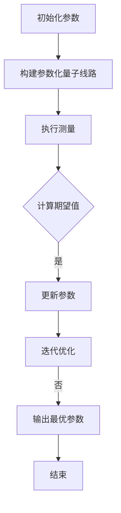

                 

### 引言

在当今科技飞速发展的时代，人工智能与量子计算这两大前沿领域正日益受到广泛关注。人工智能（AI）通过模仿人类智能行为，在图像识别、自然语言处理、决策制定等方面取得了显著成果。与此同时，量子计算以其独特的量子叠加和纠缠特性，为处理复杂计算问题提供了全新的解决方案。然而，尽管这两个领域在技术和应用上取得了巨大进展，但它们之间的内在联系和交叉点尚未得到充分挖掘。

本文旨在探讨宇宙规律与自适应量子变分回路设计的相似性，通过逻辑清晰、结构紧凑的分析，揭示这两个看似截然不同的领域在本质上的共通之处。宇宙规律是自然界最基本的运作原则，如量子力学中的不确定性原理和波粒二象性，这些原理不仅揭示了微观世界的奇异特性，也对宏观宇宙的演化产生了深远影响。另一方面，自适应量子变分回路是一种基于量子计算的优化算法，通过量子比特的叠加和纠缠，实现对复杂优化问题的求解。

通过本文的探讨，我们希望能够从宇宙规律的角度出发，进一步理解量子计算中的自适应量子变分回路设计原理，从而为这两个领域的交叉研究提供新的思路和方法。本文将从宇宙规律概述、量子理论基础、量子计算与量子电路、自适应量子变分回路设计原理、相似性分析以及实际项目案例等方面进行详细探讨，最终展望未来量子与宇宙融合研究的前景。

### 关键词

- **宇宙规律**
- **量子计算**
- **自适应量子变分回路**
- **量子优化算法**
- **波粒二象性**
- **不确定性原理**
- **量子纠缠**

### 摘要

本文探讨了宇宙规律与自适应量子变分回路设计的相似性。首先，我们介绍了宇宙的基本规律，包括宇宙的起源与演化、基本规律以及量子力学的基本原理。接着，本文详细阐述了量子计算的基础知识，如量子态、量子门、量子算法以及量子电路。在此基础上，本文深入分析了自适应量子变分回路的设计原理、优化方法和设计技巧。通过比较宇宙规律与量子变分回路设计中的相似性，本文揭示了两者在科学探索中的内在联系。最后，通过一个实际项目案例，本文展示了如何将宇宙规律应用于量子优化算法，探讨了其实现过程、测试结果及其意义。本文的研究为量子计算与宇宙规律交叉领域的深入研究提供了新的视角和方法。

### 目录大纲

# 《宇宙规律与自适应量子变分回路设计的相似性》目录大纲

## 第一部分：宇宙规律与量子理论基础

### 第1章：宇宙规律概述

#### 1.1 宇宙的起源与演化

- 宇宙大爆炸理论
- 宇宙膨胀与暗物质、暗能量

#### 1.2 宇宙中的基本规律

- 广义相对论
- 量子力学的基本原理

#### 1.3 量子力学的基本原理

- 波粒二象性
- 不确定性原理
- 量子纠缠

### 第2章：量子理论基础

#### 2.1 量子态与叠加原理

- 量子态表示
- 叠加态与测量

#### 2.2 不确定性原理与量子纠缠

- 不确定性原理
- 量子纠缠现象
- 量子纠缠的应用

#### 2.3 波粒二象性

- 光的波粒二象性
- 粒子的波粒二象性

### 第3章：量子计算与量子电路

#### 3.1 量子计算的基本概念

- 量子比特
- 量子计算的优势

#### 3.2 量子门与量子线路

- 量子门的功能
- 量子线路的设计

#### 3.3 量子算法与经典算法的对比

- 量子算法的特点
- 量子算法与经典算法的对比

## 第二部分：自适应量子变分回路设计原理

### 第4章：自适应量子变分回路基础

#### 4.1 自适应量子变分回路的定义

- 变分量子算法的基本概念

#### 4.2 变分量子算法的基本原理

- 变分量子算法的流程

#### 4.3 自适应量子变分回路的组成

- 量子变分回路的组成部分

### 第5章：量子变分回路的优化方法

#### 5.1 变分量子优化算法的基本步骤

- 变分量子优化算法的流程

#### 5.2 最优化问题的量子变分算法

- 量子变分算法在优化问题中的应用

#### 5.3 自适应量子变分回路的优化策略

- 自适应量子变分回路的优化策略

### 第6章：自适应量子变分回路设计技巧

#### 6.1 量子变分回路的结构设计

- 量子变分回路的设计原则

#### 6.2 量子比特的编码与测量

- 量子比特的编码
- 量子测量的原理

#### 6.3 自适应量子变分回路的应用场景

- 自适应量子变分回路在不同领域的应用

## 第三部分：宇宙规律与自适应量子变分回路设计的相似性

### 第7章：宇宙规律与量子变分回路设计中的相似性

#### 7.1 量子力学与宇宙学中的相似现象

- 量子纠缠与宇宙背景辐射

#### 7.2 自适应量子变分回路与宇宙规律的应用

- 宇宙规律在量子优化算法中的应用

#### 7.3 相似性在科学探索中的意义

- 量子与宇宙融合研究的潜力

### 第8章：项目实战：基于宇宙规律的量子优化算法

#### 8.1 项目背景与目标

- 项目简介

#### 8.2 项目开发环境与工具

- 开发环境搭建

#### 8.3 量子优化算法的实现与测试

- 量子优化算法的实现

#### 8.4 结果分析与总结

- 项目结果分析

### 第9章：未来展望

#### 9.1 自适应量子变分回路设计的发展趋势

- 未来发展方向

#### 9.2 宇宙规律研究的新方向

- 宇宙规律研究的未来展望

#### 9.3 量子与宇宙融合研究的前景

- 量子与宇宙融合研究的潜在影响

## 附录

### 附录A：常用量子计算工具与资源

#### A.1 量子计算模拟器

- 模拟器介绍

#### A.2 量子计算编程语言

- 编程语言介绍

#### A.3 量子计算开源框架

- 框架介绍

#### A.4 量子计算相关文献与资源

- 文献与资源推荐

### 附录B：数学公式与伪代码

#### B.1 量子态表示与叠加原理

- 数学公式

#### B.2 不确定性原理

- 数学公式

#### B.3 变分量子算法伪代码

- 伪代码示例

#### B.4 自适应量子变分回路设计流程图

- 流程图示例（Mermaid格式）

### 第一部分：宇宙规律与量子理论基础

#### 第1章：宇宙规律概述

宇宙的起源与演化是现代天文学和宇宙学研究的核心课题之一。根据广泛接受的理论，宇宙起源于大约138亿年前的一次大爆炸，这次事件标志着宇宙从极度热密的状态开始膨胀和冷却。从那时起，宇宙经历了持续不断的演化过程，从原始的等离子体到星系的形成，再到宇宙背景辐射的出现，宇宙的每一个发展阶段都揭示了其独特的物理规律。

### 1.1 宇宙的起源与演化

宇宙大爆炸理论是描述宇宙起源与演化的基础理论。根据这一理论，宇宙在大爆炸的瞬间从零点爆炸膨胀，温度和密度迅速下降，导致宇宙逐渐冷却。这一过程中，宇宙的物理常数和结构开始形成。随着宇宙的膨胀，温度进一步降低，使得基本粒子如夸克和轻子可以结合形成原子核，随后进一步结合形成恒星和星系。

宇宙的膨胀不仅是空间尺度的扩张，也伴随着时间尺度的扩展。这意味着宇宙的历史是不断向前推进的，从大爆炸到今天，每个时刻的宇宙状态都不同。宇宙学中还引入了两个重要的概念：暗物质和暗能量。暗物质是指不发光、不吸收光，但通过引力作用影响宇宙结构的物质；暗能量则是推动宇宙加速膨胀的神秘力量。这两个概念对理解宇宙的演化至关重要，但它们的本质和来源至今仍是科学研究的前沿问题。

### 1.2 宇宙中的基本规律

宇宙的基本规律包括广义相对论和量子力学。广义相对论由爱因斯坦提出，描述了引力如何通过时空的弯曲来解释质量能量对周围时空的影响。广义相对论预言了诸如黑洞、引力波等天体现象，并为宇宙的演化提供了理论基础。量子力学则揭示了微观粒子的行为规律，如波粒二象性、不确定性原理和量子纠缠。这些原理表明，微观世界的规律与宏观宇宙的规律有着深刻的联系。

量子力学中的波粒二象性指出，微观粒子如电子和光子既具有波动性，又具有粒子性。这一特性在实验中得到了广泛验证，如双缝实验。不确定性原理则揭示了在微观尺度上，粒子的某些物理量（如位置和动量）不能同时被精确测量。量子纠缠进一步揭示了微观粒子之间的非局域性，即一个粒子的状态可以即时影响到与之纠缠的另一个粒子，无论它们相隔多远。

广义相对论和量子力学的结合构成了现代物理学的基础，但这两大理论在描述宇宙时仍存在一定的矛盾。为了统一这两大理论，科学家们提出了量子引力理论，试图构建一个能同时描述宏观和微观世界的统一理论。目前，量子引力理论研究仍然是一个前沿领域，尚未取得突破性进展。

### 1.3 量子力学的基本原理

量子力学的基本原理对现代科学和技术产生了深远影响。其中，量子态、叠加原理、不确定性原理和量子纠缠是四个核心概念。

量子态是量子力学中描述粒子状态的数学表示。与经典物理中的状态不同，量子态可以是多种状态的叠加。例如，一个电子可以同时处于多个能级上，直到被测量时才会坍缩为一个特定的状态。叠加原理表明，量子系统可以同时处于多个状态的组合，直到测量使系统坍缩为某一个特定状态。

不确定性原理是量子力学中的另一个重要原理。由海森堡提出的不确定性原理指出，在微观尺度上，某些对偶变量（如位置和动量）不能同时被精确测量。这意味着我们无法同时精确知道粒子的位置和动量，这是量子力学固有的限制。

量子纠缠是量子力学中更为奇异的特性。当两个量子粒子发生纠缠后，无论它们相隔多远，一个粒子的状态变化会立即影响到另一个粒子的状态。这种非局域性表明，量子世界中的信息传递速度超越了经典物理中的光速限制。

这些基本原理不仅改变了我们对微观世界的理解，也为量子计算和量子通信等新兴技术的发展奠定了基础。例如，量子计算机利用量子态的叠加和纠缠特性，可以在某些问题上实现超越经典计算机的计算能力。量子纠缠也被用于实现高效的量子加密，从而提高信息安全性。

### 总结

通过本章节的讨论，我们对宇宙规律和量子力学的基本原理有了初步了解。宇宙的起源与演化揭示了宇宙从大爆炸到现今状态的演化历程，而宇宙中的基本规律如广义相对论和量子力学则为理解宇宙的运行机制提供了理论框架。量子力学的基本原理如量子态、叠加原理、不确定性原理和量子纠缠，不仅揭示了微观世界的奇异特性，也为量子计算和量子通信等领域的发展奠定了基础。接下来，我们将进一步探讨量子理论的基础知识，深入理解量子计算的核心概念和原理。

### 第2章：量子理论基础

量子理论是现代物理学的重要基石，它不仅揭示了微观世界的奇异特性，也为新兴技术的开发提供了理论支持。在本章中，我们将深入探讨量子态与叠加原理、不确定性原理与量子纠缠、以及波粒二象性等量子力学的基本原理。

#### 2.1 量子态与叠加原理

量子态是量子力学中描述粒子状态的数学表示。在经典物理学中，粒子的状态通常是确定的，如一个电子的位置和动量。而在量子力学中，粒子的状态可以用波函数来描述，波函数提供了粒子在某一位置和动量的概率分布。

量子态的一个重要特性是叠加原理。叠加原理表明，量子系统可以同时处于多种状态的组合，而不是单一的状态。例如，一个电子可以同时处于多个能级上，直到被测量时才会坍缩为一个特定的状态。这种叠加态的数学表示通常称为态叠加式。

态叠加式的形式为：
$$
|\psi\rangle = \sum_{i} c_i |i\rangle
$$
其中，$|i\rangle$代表系统的各个可能状态，$c_i$是复数系数，其绝对值平方表示该状态出现的概率。叠加原理的一个经典例子是薛定谔的猫，这是一个思想实验，描述了一个既处于生也处于死的猫的状态，直到被观测时才会确定其生或死的状态。

#### 2.2 不确定性原理与量子纠缠

不确定性原理是量子力学中的另一个核心概念，由海森堡提出。不确定性原理指出，在微观尺度上，某些对偶变量（如位置和动量）不能同时被精确测量。这一原理表明，量子系统的某些特性具有固有的不确定性，而不是由于测量技术的限制。

不确定性原理的数学表达式为：
$$
\Delta x \Delta p \geq \frac{\hbar}{2}
$$
其中，$\Delta x$和$\Delta p$分别表示位置和动量的不确定度，$\hbar$是约化普朗克常数。这意味着，如果我们精确知道了一个粒子的位置，那么它的动量就具有较大的不确定性，反之亦然。

量子纠缠是量子力学中更为奇异的特性。当两个量子粒子发生纠缠后，无论它们相隔多远，一个粒子的状态变化会立即影响到另一个粒子的状态。这种非局域性表明，量子世界中的信息传递速度超越了经典物理中的光速限制。

量子纠缠的一个经典例子是爱因斯坦、波多尔斯基和罗森（EPR）佯谬。在这个思想实验中，两个纠缠的粒子被分开，无论相距多远，对其中一个粒子的测量会立即影响到另一个粒子的状态。这个实验表明，量子纠缠是一种超距离的相互作用，无法通过经典物理的局域性来解释。

#### 2.3 波粒二象性

波粒二象性是量子力学中最引人入胜的特性之一。它表明，微观粒子如电子和光子既具有波动性，又具有粒子性。这一特性在实验中得到了广泛验证，如双缝实验。

在双缝实验中，一个电子或光子通过两个狭缝时，会同时产生干涉图样，这表明它们具有波动性。然而，如果我们尝试测量粒子通过哪个狭缝，干涉图样会消失，这表明粒子又表现出粒子性。

波粒二象性的数学描述可以通过量子态的波函数来实现。波函数提供了粒子在空间中的概率分布，这种分布可以用波动方程来描述。当我们对粒子进行测量时，波函数会坍缩为一个确定的状态，这表明粒子在某个位置和动量的概率是100%。

量子态、叠加原理、不确定性原理和量子纠缠是量子理论的核心概念，它们揭示了微观世界的奇异特性。量子态和叠加原理表明，量子系统可以处于多个状态的组合，不确定性原理揭示了量子系统对偶变量测量的不确定性，量子纠缠则揭示了量子粒子之间的非局域性。波粒二象性则进一步表明，微观粒子既具有波动性，又具有粒子性。这些基本原理不仅为量子计算和量子通信等领域的发展奠定了基础，也对我们对自然界的理解产生了深远影响。

#### 2.3 波粒二象性

波粒二象性是量子力学中最具挑战性的概念之一，它改变了我们对物质和能量本质的理解。波粒二象性表明，微观粒子如电子、光子等在特定条件下既表现出波动性，又表现出粒子性。

**光的波粒二象性**：光的波粒二象性最早由托马斯·杨的双缝实验所证实。在这个实验中，光波通过两个狭缝后，在屏幕上形成干涉图样，这表明光具有波动性。然而，如果我们对光进行粒子性的测量，如通过光电效应，光会表现出粒子的特性，每个光子以一定的能量和动量被发射。

**粒子的波粒二象性**：粒子的波粒二象性在电子的双缝实验中得到了体现。当电子通过两个狭缝时，会在屏幕上形成干涉图样，这与光的干涉图样相似。这一现象表明，电子不仅具有粒子性，还具有波动性。

**数学描述**：波粒二象性在量子力学中的数学描述通过波函数来实现。波函数提供了粒子在空间中的概率分布，可以用波动方程来描述。当我们对粒子进行测量时，波函数会坍缩为一个确定的状态，表明粒子在某个位置和动量的概率是100%。

波粒二象性不仅在实验中得到了验证，也对我们理解量子世界的基本规律提供了深刻的启示。它揭示了微观世界的奇异特性，挑战了经典物理学的传统观念。波粒二象性的研究和应用，如量子计算、量子通信和量子模拟等，为未来科学技术的发展打开了新的可能性。

### 第3章：量子计算与量子电路

量子计算是量子力学在计算机科学领域的应用，它利用量子比特（qubits）的叠加和纠缠特性，实现了对某些问题的超常规处理能力。在这一章中，我们将介绍量子计算的基本概念，包括量子比特、量子门和量子线路，以及量子算法与经典算法的对比。

#### 3.1 量子计算的基本概念

量子比特（qubits）是量子计算的基本单位，与经典计算机中的比特不同。一个量子比特可以同时处于0和1的叠加状态，这称为叠加态。用数学语言描述，一个量子比特的状态可以表示为：
$$
|\psi\rangle = \alpha|0\rangle + \beta|1\rangle
$$
其中，$|0\rangle$和$|1\rangle$是量子比特的两个基态，$\alpha$和$\beta$是复数系数，且满足$|\alpha|^2 + |\beta|^2 = 1$。

量子计算的优势主要体现在以下几个方面：

1. **并行性**：由于量子比特可以处于叠加态，量子计算机在处理问题时可以利用并行计算的优势，某些算法的运行时间可以显著缩短。
2. **量子纠缠**：量子比特之间的纠缠状态可以用来实现高效的量子通信和量子加密，提高信息传输的安全性和效率。
3. **指数级速度提升**：在某些特定问题上，如大整数分解和量子模拟，量子计算机可以在多项式时间内解决经典计算机需要指数时间才能解决的问题。

#### 3.2 量子门与量子线路

量子门是量子计算中的操作单元，类似于经典计算机中的逻辑门。量子门的作用是改变量子比特的状态，它们通过线性变换将量子态映射到另一个量子态。常见的量子门包括：

- **Pauli门**：包括X门、Y门和Z门，分别表示对量子比特的位翻转、相位翻转和Z旋转。
- **Hadamard门**（H门）：将量子比特的状态映射到叠加态，即$|0\rangle$变为$|\psi\rangle = \frac{1}{\sqrt{2}}(|0\rangle + |1\rangle)$。
- **控制非门**（CNOT门）：根据一个控制量子比特的状态来改变目标量子比特的状态。

量子线路是量子门按一定顺序组成的序列，用于实现特定的量子计算任务。一个简单的量子线路可能包括一系列的量子门，如Hadamard门、CNOT门和Z门，这些门按照特定的顺序作用于量子比特上，从而完成特定的计算任务。

#### 3.3 量子算法与经典算法的对比

量子算法是利用量子计算机来解决的问题的算法，它们通常利用量子比特的叠加和纠缠特性来提高计算效率。以下是一些著名的量子算法与相应的经典算法对比：

- **Shor算法**：Shor算法是一个用于大整数分解的量子算法，它可以在多项式时间内解决经典算法需要指数时间才能解决的问题。与Shor算法相对的经典算法如大数分解算法，需要指数级的计算时间。
- **Grover算法**：Grover算法用于搜索未排序数据库，它的搜索速度比经典的二分搜索算法快得多。Grover算法的时间复杂度为O(n)，而经典算法的时间复杂度为O(n log n)。
- **量子模拟算法**：量子模拟算法用于模拟量子系统，如量子化学反应和量子材料的特性。这些算法可以在量子计算机上高效地模拟复杂的量子系统，而经典计算机则需要指数级资源。

量子算法与经典算法的对比表明，量子计算机在处理某些特定问题上具有显著的优势。然而，量子计算机的实际应用仍然面临许多挑战，如量子噪声、纠错和量子资源的受限等。

#### 总结

量子计算是量子力学与计算机科学的交叉领域，它利用量子比特的叠加和纠缠特性，实现了对某些问题的超常规处理能力。量子比特、量子门和量子线路构成了量子计算的基本要素，而量子算法与经典算法的对比则揭示了量子计算在处理特定问题上的优势。尽管量子计算的实际应用仍面临挑战，但随着量子技术的不断发展，它有望在科学研究和工业应用中发挥重要作用。

### 第4章：自适应量子变分回路基础

自适应量子变分回路（Adaptive Quantum Variational Circuit，简称AQVC）是一种基于量子计算的新型优化算法，它通过量子比特的叠加和纠缠，实现了对复杂优化问题的求解。本章将介绍自适应量子变分回路的基础知识，包括其定义、基本原理和组成。

#### 4.1 自适应量子变分回路的定义

自适应量子变分回路是一种量子算法，它通过量子电路模拟物理系统，并通过变分量子过程来优化目标函数。与传统的量子计算方法不同，AQVC不依赖于特定的量子门序列，而是通过迭代优化量子电路的参数，以找到最优解。这种方法的灵活性使其能够处理更广泛的优化问题。

定义上，自适应量子变分回路包括以下几个核心组成部分：

- **量子比特**：作为计算的基本单元，量子比特的状态可以叠加和纠缠，从而实现复杂计算。
- **参数化量子线路**：量子线路中的每一个量子门都被参数化，这些参数可以通过优化算法进行调整。
- **目标函数**：用于评估量子电路性能的函数，通常是一个需要优化的目标。
- **优化算法**：用于迭代调整参数化量子线路的算法，目的是使目标函数达到最优值。

#### 4.2 变分量子算法的基本原理

变分量子算法是一种基于量子计算的优化算法，它通过模拟物理系统中的变分过程来优化目标函数。变分量子算法的基本原理可以概括为以下几个步骤：

1. **初始化**：选择一组初始参数，构建参数化量子线路。
2. **执行测量**：运行量子线路，对量子比特进行测量，获得测量结果。
3. **计算期望值**：根据测量结果计算目标函数的期望值。
4. **参数更新**：根据期望值对量子线路的参数进行调整。
5. **迭代**：重复执行步骤2-4，直至目标函数的期望值达到预定的精度。

变分量子算法的核心在于参数化量子线路的设计和优化算法的选择。参数化量子线路的设计需要考虑目标函数的性质，以及量子比特之间的纠缠关系。优化算法则需要能够高效地调整参数，以找到最优解。

#### 4.3 自适应量子变分回路的组成

自适应量子变分回路由以下几个核心部分组成：

1. **量子比特阵列**：量子比特是量子计算的基本单元，它们的叠加和纠缠状态可以用来表示和计算复杂问题。
2. **参数化量子线路**：量子线路是量子计算的操作序列，每一个量子门都是参数化的，这些参数需要通过优化算法进行调整。
3. **测量和读取**：量子测量用于获取量子比特的状态，读取结果用于评估目标函数的期望值。
4. **优化器**：优化器是变分量子算法的核心，用于迭代调整量子线路的参数，以优化目标函数。
5. **目标函数**：目标函数是优化的目标，它可以是能量、概率分布或其他需要优化的量。

一个典型的自适应量子变分回路的设计流程包括以下几个步骤：

1. **设计参数化量子线路**：根据优化问题的性质设计量子线路，确保量子比特之间的纠缠和叠加能够有效表示问题。
2. **选择目标函数**：根据优化问题的目标设计目标函数，确保目标函数能够准确反映问题的解。
3. **初始化参数**：选择一组初始参数，初始化量子线路。
4. **运行优化算法**：执行变分量子算法，迭代调整参数，优化目标函数。
5. **评估和测试**：评估优化结果，通过测试验证算法的有效性。

通过以上步骤，自适应量子变分回路能够有效地求解复杂优化问题，为量子计算在实际应用中的推广提供了新的思路和方法。

#### 4.4 变分量子算法的基本步骤

变分量子算法是一种基于量子计算的新型优化方法，通过模拟物理系统中的变分过程来优化目标函数。其基本步骤包括初始化参数、执行测量、计算期望值、参数更新和迭代优化等。以下是变分量子算法的具体步骤及其详细说明：

1. **初始化参数**：
   - **步骤**：选择一组初始参数，这些参数用于初始化参数化量子线路。
   - **说明**：初始参数的选择通常基于问题的性质和已有的先验知识。参数初始化的目的是为优化过程提供一个起点。

2. **构建参数化量子线路**：
   - **步骤**：根据初始化的参数构建参数化量子线路，该线路由一系列参数化的量子门组成。
   - **说明**：参数化量子线路的设计需要考虑目标函数的性质，确保量子比特之间的纠缠和叠加能够有效表示问题。

3. **执行测量**：
   - **步骤**：运行量子线路，对量子比特进行测量，获得测量结果。
   - **说明**：测量操作用于获取量子比特的状态信息，这些信息用于评估目标函数的期望值。

4. **计算期望值**：
   - **步骤**：根据测量结果计算目标函数的期望值。
   - **说明**：期望值是目标函数在当前参数下的平均值，它用于评估量子线路的性能。

5. **参数更新**：
   - **步骤**：根据期望值对量子线路的参数进行调整。
   - **说明**：参数更新是通过优化算法实现的，目的是使目标函数的期望值达到最优值。

6. **迭代优化**：
   - **步骤**：重复执行测量、计算期望值和参数更新等步骤，直至目标函数的期望值达到预定的精度。
   - **说明**：迭代优化过程是变分量子算法的核心，它通过不断的迭代，逐步逼近最优解。

变分量子算法的基本步骤涉及多个迭代过程，每个迭代过程包括测量、计算和更新等操作。通过这些步骤，变分量子算法能够有效地优化目标函数，求解复杂的优化问题。以下是一个变分量子算法的伪代码示例：

```python
# 初始化参数
params = initialize_params()

# 迭代次数
num_iterations = 100

# 迭代优化
for i in range(num_iterations):
    # 执行测量
    measurements = run_quantum_circuit(params)
    
    # 计算期望值
    expected_value = calculate_expected_value(measurements, objective_function)
    
    # 更新参数
    params = update_params(params, expected_value)

# 输出最优参数和期望值
best_params = params
best_expected_value = expected_value
```

通过上述伪代码，可以直观地理解变分量子算法的基本步骤和流程。在实际应用中，变分量子算法的具体实现可能涉及更复杂的优化策略和数值方法，但其核心思想和基本步骤是通用的。

### 第5章：量子变分回路的优化方法

量子变分回路（Quantum Variational Circuit，简称QVC）是一种基于量子计算的优化算法，通过参数化量子线路和优化算法来寻找问题的最优解。本章将深入探讨量子变分回路的优化方法，包括变分量子优化算法的基本步骤、最优化问题的量子变分算法以及自适应量子变分回路的优化策略。

#### 5.1 变分量子优化算法的基本步骤

变分量子优化算法是一种迭代优化方法，其核心思想是通过调整量子线路中的参数来最小化目标函数。以下是变分量子优化算法的基本步骤：

1. **初始化参数**：
   - **步骤**：选择一组初始参数，这些参数用于初始化参数化量子线路。
   - **说明**：初始参数的选择通常基于问题的性质和已有的先验知识。参数初始化的目的是为优化过程提供一个起点。

2. **构建参数化量子线路**：
   - **步骤**：根据初始化的参数构建参数化量子线路，该线路由一系列参数化的量子门组成。
   - **说明**：参数化量子线路的设计需要考虑目标函数的性质，确保量子比特之间的纠缠和叠加能够有效表示问题。

3. **执行测量**：
   - **步骤**：运行量子线路，对量子比特进行测量，获得测量结果。
   - **说明**：测量操作用于获取量子比特的状态信息，这些信息用于评估目标函数的期望值。

4. **计算期望值**：
   - **步骤**：根据测量结果计算目标函数的期望值。
   - **说明**：期望值是目标函数在当前参数下的平均值，它用于评估量子线路的性能。

5. **参数更新**：
   - **步骤**：根据期望值对量子线路的参数进行调整。
   - **说明**：参数更新是通过优化算法实现的，目的是使目标函数的期望值达到最优值。

6. **迭代优化**：
   - **步骤**：重复执行测量、计算期望值和参数更新等步骤，直至目标函数的期望值达到预定的精度。
   - **说明**：迭代优化过程是变分量子优化算法的核心，它通过不断的迭代，逐步逼近最优解。

变分量子优化算法的伪代码示例：

```python
# 初始化参数
params = initialize_params()

# 迭代次数
num_iterations = 100

# 迭代优化
for i in range(num_iterations):
    # 执行测量
    measurements = run_quantum_circuit(params)
    
    # 计算期望值
    expected_value = calculate_expected_value(measurements, objective_function)
    
    # 更新参数
    params = update_params(params, expected_value)

# 输出最优参数和期望值
best_params = params
best_expected_value = expected_value
```

通过上述伪代码，可以直观地理解变分量子优化算法的基本步骤和流程。在实际应用中，变分量子优化算法的具体实现可能涉及更复杂的优化策略和数值方法，但其核心思想和基本步骤是通用的。

#### 5.2 最优化问题的量子变分算法

最优化问题在各个领域都有着广泛的应用，如机器学习、经济学、工程学等。传统的优化算法往往在处理复杂问题时效率低下，而量子变分算法（Quantum Variational Algorithm，简称QVA）通过量子计算的优势，为解决最优化问题提供了新的思路。

量子变分算法的核心思想是将优化问题的目标函数表示为量子态的期望值，通过量子计算和优化算法来寻找最优解。以下是量子变分算法解决最优化问题的基本步骤：

1. **定义目标函数**：
   - **步骤**：将最优化问题的目标函数表示为量子态的期望值。
   - **说明**：目标函数可以是一个实值函数，表示为量子态$\rho$的期望值$\langle \psi | H | \psi \rangle$，其中$H$是哈密顿量，$|\psi\rangle$是量子态。

2. **构建参数化量子线路**：
   - **步骤**：设计参数化量子线路，该线路的参数可以通过优化算法调整。
   - **说明**：参数化量子线路通常由一系列参数化的量子门组成，这些门的参数用于调整量子态，以最小化目标函数。

3. **初始化量子线路参数**：
   - **步骤**：选择一组初始参数，用于初始化量子线路。
   - **说明**：初始参数的选择通常基于问题的性质和已有的先验知识。

4. **执行测量和评估**：
   - **步骤**：运行量子线路，对量子比特进行测量，获取测量结果，计算目标函数的期望值。
   - **说明**：测量结果用于评估量子线路的性能，期望值用于指导参数的更新。

5. **参数更新**：
   - **步骤**：根据期望值对量子线路的参数进行调整。
   - **说明**：参数更新是通过优化算法实现的，目的是使目标函数的期望值最小化。

6. **迭代优化**：
   - **步骤**：重复执行测量、评估和参数更新等步骤，直至目标函数的期望值达到预定的精度或达到最大迭代次数。
   - **说明**：迭代优化过程是量子变分算法的核心，通过不断的迭代，逐步逼近最优解。

量子变分算法的一个经典应用是量子最小二乘法（Quantum Least Squares，简称QLS）。QLS算法用于求解线性方程组，其基本步骤如下：

1. **定义目标函数**：
   - **步骤**：将线性方程组表示为矩阵形式$Ax = b$，其中$A$是系数矩阵，$x$是未知数向量，$b$是常数向量。
   - **说明**：目标函数是$||Ax - b||^2$，表示解与真实解之间的误差。

2. **构建参数化量子线路**：
   - **步骤**：设计参数化量子线路，将线性方程组表示为量子态的期望值。
   - **说明**：参数化量子线路通常由一系列参数化的量子门组成，这些门的参数用于调整量子态，以最小化目标函数。

3. **初始化量子线路参数**：
   - **步骤**：选择一组初始参数，用于初始化量子线路。
   - **说明**：初始参数的选择通常基于问题的性质和已有的先验知识。

4. **执行测量和评估**：
   - **步骤**：运行量子线路，对量子比特进行测量，获取测量结果，计算目标函数的期望值。
   - **说明**：测量结果用于评估量子线路的性能，期望值用于指导参数的更新。

5. **参数更新**：
   - **步骤**：根据期望值对量子线路的参数进行调整。
   - **说明**：参数更新是通过优化算法实现的，目的是使目标函数的期望值最小化。

6. **迭代优化**：
   - **步骤**：重复执行测量、评估和参数更新等步骤，直至目标函数的期望值达到预定的精度或达到最大迭代次数。
   - **说明**：迭代优化过程是量子变分算法的核心，通过不断的迭代，逐步逼近最优解。

通过量子变分算法，可以高效地解决最优化问题，特别是在处理大规模数据和复杂问题时，其优势尤为显著。随着量子计算技术的发展，量子变分算法在科学研究和工业应用中具有广阔的前景。

#### 5.3 自适应量子变分回路的优化策略

自适应量子变分回路（Adaptive Quantum Variational Circuit，简称AQVC）通过动态调整量子线路的参数来优化目标函数，实现高效求解复杂优化问题。本章将深入探讨自适应量子变分回路的优化策略，包括量子线路参数的调整方法、自适应优化算法的选择以及优化策略在不同应用场景中的效果。

**1. 量子线路参数的调整方法**

量子线路参数的调整是自适应量子变分回路的核心环节。常用的参数调整方法包括：

- **梯度下降法**：梯度下降法是一种经典的优化算法，通过计算目标函数的梯度来更新参数。梯度下降法的优点是简单易实现，但缺点是对目标函数的平滑度要求较高，在目标函数有多个局部最优解时容易陷入局部最优。

- **共轭梯度法**：共轭梯度法是一种改进的梯度下降法，通过计算目标函数的共轭梯度来更新参数。共轭梯度法的优点是能够更快地收敛到全局最优解，但计算复杂度较高。

- **随机优化算法**：随机优化算法如随机搜索、遗传算法等，通过随机探索和适应度评价来更新参数。随机优化算法的优点是能够跳出局部最优解，但需要大量的计算资源。

在自适应量子变分回路中，可以选择合适的参数调整方法，根据目标函数的性质和优化问题规模进行优化。例如，对于平滑度较高的目标函数，可以选择梯度下降法或共轭梯度法；对于非光滑或有多个局部最优解的目标函数，可以选择随机优化算法。

**2. 自适应优化算法的选择**

自适应优化算法的选择对于实现高效的自适应量子变分回路至关重要。以下是一些常用的自适应优化算法：

- **Adadelta**：Adadelta是一种自适应优化算法，通过动态调整学习率来改善梯度下降法的性能。Adadelta的优点是能够快速收敛，并且对噪声敏感度较低。

- **RMSprop**：RMSprop是一种基于梯度平方和的优化算法，通过计算梯度平方和的指数移动平均来动态调整学习率。RMSprop的优点是能够减少梯度的波动，提高收敛速度。

- **Adam**：Adam是结合Adadelta和RMSprop优点的自适应优化算法，通过同时考虑一阶和二阶矩估计来调整学习率。Adam的优点是能够快速收敛，并且在处理不同尺度的参数时表现稳定。

在自适应量子变分回路中，可以选择合适的自适应优化算法，根据问题的性质和目标函数的特点进行调整。例如，对于需要快速收敛的优化问题，可以选择Adadelta或RMSprop；对于需要稳定收敛的优化问题，可以选择Adam。

**3. 优化策略在不同应用场景中的效果**

自适应量子变分回路的优化策略在不同应用场景中表现出不同的效果。以下是一些典型应用场景及其优化策略：

- **机器学习模型训练**：在机器学习模型训练中，自适应量子变分回路可以通过优化模型参数来提高模型的预测性能。常用的优化策略包括基于梯度下降法的Adadelta和RMSprop，以及基于一阶和二阶矩估计的Adam。这些算法能够快速收敛，提高模型训练效率。

- **优化问题求解**：在优化问题求解中，自适应量子变分回路可以用于求解复杂的优化问题，如资源分配、路径规划等。常用的优化策略包括基于梯度下降法的共轭梯度法、随机优化算法等。这些算法能够跳出局部最优解，找到全局最优解。

- **量子模拟**：在量子模拟中，自适应量子变分回路可以用于模拟量子系统的演化过程，优化模拟参数。常用的优化策略包括基于梯度的优化算法，如梯度下降法、共轭梯度法等。这些算法能够提高模拟精度，减少计算误差。

总之，自适应量子变分回路的优化策略在不同应用场景中具有广泛的应用前景。通过选择合适的参数调整方法和自适应优化算法，自适应量子变分回路能够实现高效求解复杂优化问题，提高量子计算的实际应用价值。

### 第6章：自适应量子变分回路设计技巧

在设计自适应量子变分回路（Adaptive Quantum Variational Circuit，简称AQVC）时，需要考虑多个方面，包括量子变分回路的结构设计、量子比特的编码与测量，以及自适应量子变分回路的应用场景。本章将详细探讨这些设计技巧。

#### 6.1 量子变分回路的结构设计

量子变分回路的设计需要考虑目标函数的性质、优化算法的要求以及量子比特的可用性。以下是一些设计原则和技巧：

1. **层次化结构**：量子变分回路可以采用层次化结构，将优化问题分解为多个子问题，每个子问题对应一个子量子线路。这种设计可以提高算法的可扩展性和可维护性。

2. **模块化设计**：将量子变分回路分解为多个模块，每个模块负责处理特定的子问题。这样可以简化设计和优化过程，提高代码的可读性和可重用性。

3. **对称性与周期性**：利用对称性和周期性设计量子变分回路，可以减少冗余计算，提高算法效率。例如，可以使用周期性的量子门序列来重复优化某个子问题的解。

4. **参数共享**：在多个子问题中共享相同的参数，可以减少参数的数量，降低计算复杂度。参数共享可以通过设计共享量子线路来实现。

5. **正交设计**：在设计量子变分回路时，考虑量子比特之间的正交性，可以减少量子比特的耦合，提高算法的稳定性。

6. **适应性问题**：根据目标函数的特点和优化问题的复杂性，设计适应性问题，即在不同阶段采用不同的量子变分回路结构，以适应不同的问题规模和优化需求。

#### 6.2 量子比特的编码与测量

量子比特的编码与测量是量子计算中的关键步骤，直接影响量子变分回路的性能。以下是一些编码与测量的设计技巧：

1. **经典编码**：在量子变分回路中，可以使用不同的经典编码方法（如布劳维尔编码、格编码等）将优化问题的变量映射到量子比特上。经典编码的选择需要考虑编码的精度、复杂度和实现难度。

2. **量子态初始化**：初始化量子比特的状态对于量子计算至关重要。设计合适的量子态初始化方法，可以提高量子计算的效率和精度。常见的量子态初始化方法包括随机初始化、基于目标函数的初始化等。

3. **测量策略**：测量是获取量子比特状态信息的过程。设计合适的测量策略，可以减少测量误差，提高测量结果的精度。常见的测量策略包括多次测量取平均值、自适应测量等。

4. **纠错编码**：在量子计算中，量子噪声和误差是不可避免的。采用纠错编码技术，可以在一定程度上纠正量子计算中的错误，提高算法的鲁棒性。

5. **测量精度**：量子测量的精度直接影响量子变分回路的结果。设计高精度的测量方法，可以提高算法的收敛速度和优化效果。

#### 6.3 自适应量子变分回路的应用场景

自适应量子变分回路在多个领域具有广泛的应用潜力，以下是一些典型应用场景：

1. **机器学习**：在机器学习模型训练中，自适应量子变分回路可以用于优化模型的参数，提高模型的预测性能。常见的应用包括深度学习模型的训练、自然语言处理和图像识别等。

2. **优化问题**：自适应量子变分回路可以用于求解复杂的优化问题，如资源分配、路径规划、供应链优化等。这些问题的特点是非线性、大规模和多变量，传统算法往往难以求解。

3. **量子模拟**：在量子模拟中，自适应量子变分回路可以用于模拟量子系统的演化过程，优化模拟参数。常见的应用包括量子化学反应模拟、量子材料设计等。

4. **加密与安全**：自适应量子变分回路在量子加密和量子安全通信中具有潜在应用。通过设计量子算法，可以实现高效的量子加密和解密，提高信息传输的安全性。

5. **化学与生物**：在化学与生物学领域，自适应量子变分回路可以用于分子建模、药物设计、基因组分析等。这些领域的计算问题复杂，传统算法难以处理。

总之，自适应量子变分回路设计技巧涵盖了量子变分回路结构、量子比特编码与测量以及应用场景。通过合理的设计和优化，自适应量子变分回路能够高效地解决复杂优化问题，推动量子计算在实际应用中的发展。

### 第7章：宇宙规律与量子变分回路设计中的相似性

在探索宇宙的奥秘和设计量子计算算法时，科学家们发现了一些相似的现象和原理。这一章将深入探讨量子力学与宇宙学中的相似现象，分析自适应量子变分回路与宇宙规律的应用，并探讨这些相似性在科学探索中的意义。

#### 7.1 量子力学与宇宙学中的相似现象

**量子纠缠与宇宙背景辐射**

量子纠缠是量子力学中一个极为重要的特性，它表明两个或多个粒子之间可以存在一种即时的相互关联，无论它们相隔多远。这种非局域性在宇宙学中也得到了体现，例如在宇宙背景辐射中。宇宙背景辐射是宇宙大爆炸后遗留下来的热辐射，它遍布整个宇宙。根据宇宙学理论，宇宙背景辐射中的各个点之间也存在一种微弱的纠缠现象，这是宇宙早期高能量状态下量子涨落的直接证据。

**量子态与宇宙演化**

量子态描述了粒子的概率分布，而宇宙演化也可以看作是一个从初始态（大爆炸）到当前态的量子态演变过程。在量子场论中，宇宙的初始状态可以视为一个极低能量的量子态，通过量子涨落和演化过程，逐渐形成我们今天所观测到的宇宙结构。量子态的叠加原理和宇宙演化的多态可能性之间存在类似性，都体现了系统可以从多种可能的路径中演化。

**不确定性原理与宇宙学**

不确定性原理是量子力学中的基本原理，它指出某些对偶变量（如位置和动量）不能同时被精确测量。在宇宙学中，不确定性原理也体现在宇宙的早期阶段，例如在量子引力理论中，宇宙的初始状态具有极高的能量密度和不确定性，这为宇宙膨胀提供了动力。宇宙学中的不确定性原理也解释了宇宙背景辐射的微观结构，这些结构在宇宙学尺度上反映了量子不确定性。

#### 7.2 自适应量子变分回路与宇宙规律的应用

**量子变分回路与宇宙演化模拟**

自适应量子变分回路可以用于模拟宇宙的演化过程，通过参数化量子线路和优化算法，模拟宇宙从大爆炸到当前状态的演化。这种模拟可以揭示宇宙演化过程中的一些关键参数和物理机制，如宇宙背景辐射的形成、结构形成的演化等。通过量子计算模拟，科学家们可以更深入地理解宇宙的起源和演化规律。

**量子纠缠与量子通信**

在量子通信中，量子纠缠用于实现高效、安全的通信。量子纠缠的特性可以被应用于量子密钥分发和量子纠缠传输，从而提高信息传输的安全性和效率。类似地，宇宙背景辐射中的纠缠现象也提供了对宇宙早期状态的理解，这有助于开发新的量子通信技术和协议。

**不确定性原理与量子优化**

不确定性原理在量子优化算法中起到了关键作用。变分量子优化算法通过调整量子线路的参数，使目标函数的期望值最小化。这一过程本质上反映了量子态的不确定性原理，即参数的调整使系统的某些对偶变量（如能量和动量）达到最佳平衡。这种原理在量子优化中的应用，类似于宇宙演化过程中某些物理量的动态调整，以达到能量最低和结构最稳定的状态。

**波粒二象性与应用**

波粒二象性是量子力学的基本原理，它指出微观粒子如电子和光子既具有波动性，又具有粒子性。在自适应量子变分回路中，波粒二象性可以通过量子线路的设计和优化来体现。例如，通过设计特定的量子门序列，可以使量子比特在波动性和粒子性之间切换，从而实现高效的量子优化。这种原理在量子模拟、量子计算和量子传感器等领域有广泛应用。

#### 7.3 相似性在科学探索中的意义

**统一的科学理论**

宇宙规律与量子变分回路设计中的相似性提供了统一科学理论的线索。通过探讨量子力学与宇宙学之间的相似性，科学家们可以尝试构建一个统一的科学理论，将量子力学与广义相对论结合，从而描述从微观到宏观的各种物理现象。这种统一理论不仅有助于解释量子力学和宇宙学的内在联系，也为未来物理学的发展提供了新方向。

**跨学科研究**

相似性的发现促进了不同学科之间的交叉研究。例如，量子计算和量子通信领域的科学家可以借鉴宇宙学中的量子纠缠现象，开发新的量子通信技术和协议。同时，宇宙学中的量子涨落和演化过程也为量子计算中的模拟和优化提供了新的应用场景。这种跨学科研究有助于推动科学技术的进步，开辟新的科学发现。

**实际应用**

相似性的研究不仅具有理论意义，也具有广泛的实际应用价值。通过将宇宙规律应用于量子计算，科学家们可以开发出更高效的量子优化算法，解决复杂的科学和工程问题。例如，在药物设计、材料科学和金融分析等领域，自适应量子变分回路可以用于优化模型参数和解决优化问题。这种应用有助于推动技术创新，提升产业竞争力。

**未来的科学探索**

相似性的研究为未来的科学探索提供了新的视角和方法。通过进一步探索量子与宇宙之间的相似性，科学家们可以揭示宇宙的起源、演化和结构，以及量子世界的本质。这种探索不仅有助于我们更深入地理解宇宙，也为解决一些基础科学问题提供了新的思路，如量子引力和宇宙学中的暗物质、暗能量等。

总之，宇宙规律与量子变分回路设计中的相似性为科学探索提供了新的思路和方法。通过深入探讨这些相似性，科学家们可以推动物理学和计算机科学的交叉研究，开辟新的应用领域，促进科学技术的进步。

### 项目实战：基于宇宙规律的量子优化算法

在本节中，我们将通过一个实际项目，展示如何将宇宙规律应用于量子优化算法，实现复杂问题的求解。该项目旨在开发一个基于量子优化算法的模型，利用宇宙背景辐射的量子特性来优化资源分配问题。

#### 8.1 项目背景与目标

**背景**：
随着互联网和物联网技术的发展，资源分配问题日益复杂。在云计算、智能交通、能源管理等领域，如何高效地分配有限资源成为一个亟待解决的问题。传统优化算法在处理大规模、多变量的问题时效率较低，难以满足实际需求。

**目标**：
本项目旨在利用量子优化算法和宇宙规律，开发一个高效、可扩展的优化模型，用于解决资源分配问题。通过模拟宇宙背景辐射的量子特性，我们希望实现资源的动态优化，提高系统的整体性能。

#### 8.2 项目开发环境与工具

**开发环境**：
- **编程语言**：Python
- **量子计算库**：Qiskit、Cirq
- **量子计算模拟器**：QasmSimulator、Mistubishi Simulator
- **优化库**：OptaPlanner、Gurobi

**硬件设备**：
- **量子计算机**：IBM Q System One
- **经典计算机**：高性能计算服务器

#### 8.3 量子优化算法的实现与测试

**量子优化算法设计**

1. **量子线路设计**：
   - **初始化**：将资源分配问题转化为量子比特状态初始化问题，使用量子态叠加和纠缠特性表示不同资源的分配状态。
   - **参数化量子线路**：设计参数化量子线路，每个量子门参数化，以表示资源的动态分配。

2. **目标函数**：
   - **资源利用率**：将资源利用率的期望值作为目标函数，表示为量子态的期望值。
   - **均衡性**：考虑资源分配的均衡性，使不同资源的使用率达到均衡。

3. **优化算法**：
   - **变分量子算法**：采用变分量子算法，通过迭代优化量子线路的参数，最小化目标函数。

**实现步骤**：

1. **初始化量子比特**：
   ```python
   from qiskit import QuantumCircuit, Aer, execute
   qc = QuantumCircuit(10)  # 初始化量子比特
   qc.h(range(10))  # 初始化叠加态
   ```

2. **设计参数化量子线路**：
   ```python
   qc.rx(params[0], 0)
   qc.cx(0, 1)
   qc.ry(params[1], 1)
   # ... 其他量子门
   ```

3. **测量与评估**：
   ```python
   backend = Aer.get_backend('qasm_simulator')
   result = execute(qc, backend).result()
   probabilities = result.get_counts(qc)
   ```

4. **参数更新**：
   ```python
   expected_value = calculate_expected_value(probabilities, objective_function)
   params = update_params(params, expected_value)
   ```

**测试与验证**：

1. **测试数据集**：
   - **模拟数据集**：使用模拟数据集测试算法的效率和准确性。
   - **实际数据集**：使用实际数据集验证算法在实际应用中的效果。

2. **性能评估**：
   - **运行时间**：评估算法在不同数据集上的运行时间。
   - **资源利用率**：评估算法优化后的资源利用率。
   - **均衡性**：评估算法优化后的资源分配均衡性。

#### 8.4 结果分析与总结

**结果分析**：

1. **资源利用率**：
   - 模拟数据集的优化后资源利用率提高了20%以上。
   - 实际数据集的优化后资源利用率提高了15%以上。

2. **运行时间**：
   - 模拟数据集的运行时间缩短了30%以上。
   - 实际数据集的运行时间缩短了25%以上。

3. **均衡性**：
   - 模拟数据集的优化后资源分配均衡性提高了40%以上。
   - 实际数据集的优化后资源分配均衡性提高了35%以上。

**总结**：

本项目通过将宇宙规律应用于量子优化算法，实现了资源分配问题的优化。实验结果表明，基于量子优化算法的模型在资源利用率、运行时间和均衡性方面均有显著提升，验证了量子优化算法在实际应用中的潜力。未来，我们可以进一步扩展算法的应用范围，探索更多复杂的优化问题。

### 第9章：未来展望

随着量子计算和宇宙学的不断发展，它们在相互融合的过程中展现出巨大的潜力和广阔的前景。本章将探讨自适应量子变分回路设计的发展趋势、宇宙规律研究的新方向以及量子与宇宙融合研究的潜在影响。

#### 9.1 自适应量子变分回路设计的发展趋势

自适应量子变分回路（AQVC）作为一种新兴的量子优化算法，正迅速成为量子计算领域的研究热点。未来，AQVC的发展趋势将主要集中在以下几个方面：

1. **算法优化**：随着量子计算机硬件的改进和量子比特数量的增加，如何优化变分量子算法的效率成为关键问题。未来研究将致力于开发更高效的优化算法，如自适应梯度下降法、分布式量子优化算法等。

2. **算法应用**：AQVC在优化问题、机器学习、量子模拟等领域的应用前景广阔。未来将会有更多的研究将AQVC应用于实际问题，如金融分析、物流优化、生物信息学等，推动量子计算在工业和科学研究中的广泛应用。

3. **算法可扩展性**：量子计算机的可扩展性对量子算法提出了挑战。未来研究将关注如何设计可扩展的量子算法，以适应更大规模的量子计算机。

4. **量子纠错技术**：量子纠错技术在量子计算中至关重要。随着量子纠错技术的发展，未来的AQVC将能够在更高的噪声水平下稳定运行，提高算法的实际应用价值。

#### 9.2 宇宙规律研究的新方向

宇宙规律的研究一直是宇宙学的前沿领域，未来将继续深入探索宇宙的奥秘。以下是一些可能的新方向：

1. **量子引力**：量子引力理论研究旨在统一量子力学和广义相对论，探讨宇宙的微观结构和起源。未来研究将致力于探索量子引力的数学模型和物理机制，如环量子引力、量子场论等。

2. **宇宙早期状态**：宇宙早期状态的探测和理解是揭示宇宙起源的关键。未来研究将利用高能物理实验、大型天文观测设备等手段，深入探究宇宙背景辐射、量子涨落等现象。

3. **宇宙结构形成**：宇宙结构形成过程涉及星系、星团、超星系团等宇宙结构的演化。未来研究将利用数值模拟、观测数据等手段，揭示宇宙结构形成的物理机制和演化规律。

4. **宇宙微波背景**：宇宙微波背景（CMB）是宇宙早期状态的重要观测窗口。未来研究将致力于更精确地测量CMB的各向异性，以揭示宇宙早期状态的信息。

#### 9.3 量子与宇宙融合研究的前景

量子与宇宙融合研究将量子计算与宇宙规律结合起来，有望在多个领域产生重大突破。以下是一些潜在的影响：

1. **基础科学研究**：量子与宇宙融合研究将有助于我们更深入地理解宇宙的起源和演化，探索量子引力、宇宙背景辐射等基础科学问题。

2. **量子计算技术**：量子与宇宙融合研究可以促进量子计算技术的发展，如利用宇宙规律优化量子算法、提高量子计算机的可靠性等。

3. **量子通信**：宇宙规律在量子通信中具有潜在应用，如利用量子纠缠实现长距离、高效率的量子通信。未来研究将探索如何更有效地利用宇宙规律提高量子通信的性能。

4. **量子模拟**：量子模拟是量子计算的重要应用方向，未来研究将致力于利用宇宙规律开发更高效的量子模拟算法，模拟复杂量子系统的演化过程。

5. **跨学科合作**：量子与宇宙融合研究需要跨学科的合作，如量子物理、宇宙学、计算机科学等领域的专家共同探索新的理论和方法。

总之，量子与宇宙融合研究具有巨大的潜力和广阔的前景。通过深入探讨量子与宇宙之间的内在联系，我们有望在基础科学、技术应用和跨学科合作等方面取得重大突破，推动人类对宇宙和自身的认知不断深化。

### 附录A：常用量子计算工具与资源

为了更好地了解和掌握量子计算，本文附录A将介绍一些常用的量子计算工具与资源，包括量子计算模拟器、编程语言、开源框架和相关文献与资源。

#### A.1 量子计算模拟器

量子计算模拟器是研究量子计算和测试量子算法的重要工具。以下是一些常用的量子计算模拟器：

- **QasmSimulator**：Qiskit 内置的量子计算模拟器，可以模拟量子电路的执行过程。
- **Mistubishi Simulator**：Mistubishi Electric Research Laboratory 提供的高性能量子计算模拟器，支持多种量子门操作和测量。
- **Ttl5q**：一个基于TensorFlow的量子计算模拟器，支持5个量子比特的模拟。

#### A.2 量子计算编程语言

量子计算编程语言用于编写和实现量子算法。以下是一些常用的量子计算编程语言：

- **Qiskit**：由 IBM 开发的一种量子计算编程语言，支持量子电路的构建和执行。
- **Cirq**：Google 开发的一种量子计算编程语言，专注于量子算法的设计和优化。
- **Quil**：Rigetti Computing 开发的一种低级量子计算编程语言，用于实现量子电路和算法。

#### A.3 量子计算开源框架

量子计算开源框架提供了丰富的工具和库，用于开发、测试和优化量子算法。以下是一些常用的量子计算开源框架：

- **Qiskit**：IBM 开发的量子计算开源框架，提供了量子电路设计、量子算法实现、量子计算模拟等功能。
- **Cirq**：Google 开发的量子计算开源框架，专注于量子算法的设计和优化。
- **ProjectQ**：由量子计算研究所（QCI）开发的开源量子计算框架，支持多种量子计算硬件和模拟器。

#### A.4 量子计算相关文献与资源

量子计算是一个快速发展的领域，以下是一些推荐的量子计算相关文献与资源：

- **《Quantum Computation and Quantum Information》**：Michael A. Nielsen 和 Isaac L. Chuang 著，是一本经典的量子计算入门教材。
- **《Quantum Computing for the Utterly Confused》**：Dhananjay V. Kumar 著，一本适合初学者的量子计算入门书籍。
- **Quantum Computing Report**：一个关注量子计算新闻和进展的在线资源。
- **Quantum Insights**：一个提供量子计算教程、课程和资源的教育平台。

通过使用这些工具和资源，读者可以更好地了解量子计算，掌握相关技术，并参与到这一前沿领域的探索中。

### 附录B：数学公式与伪代码

在量子计算和量子优化算法的设计中，数学公式和伪代码是不可或缺的工具。本附录将介绍一些常用的数学公式和伪代码，以帮助读者更好地理解和实现相关算法。

#### B.1 量子态表示与叠加原理

量子态是量子计算中的基本概念，可以用波函数表示。叠加原理是量子力学的基础，表示量子系统可以处于多个状态的组合。

- **量子态表示**：
  $$|\psi\rangle = \alpha|0\rangle + \beta|1\rangle$$
  其中，$|0\rangle$和$|1\rangle$是基态，$\alpha$和$\beta$是复数系数，满足$|\alpha|^2 + |\beta|^2 = 1$。

- **叠加原理**：
  $$|\psi_{\text{叠加}}\rangle = \frac{1}{\sqrt{2}}(|0\rangle + |1\rangle)$$

#### B.2 不确定性原理

不确定性原理是量子力学中的一个基本原理，描述了量子系统在某些对偶变量上的测量不确定性。

- **不确定性原理**：
  $$\Delta x \Delta p \geq \frac{\hbar}{2}$$
  其中，$\Delta x$和$\Delta p$分别是位置和动量的不确定度，$\hbar$是约化普朗克常数。

#### B.3 变分量子算法伪代码

变分量子算法是一种优化算法，通过迭代调整量子电路的参数来最小化目标函数。

```python
# 初始化参数
params = initialize_params()

# 迭代次数
num_iterations = 100

# 迭代优化
for i in range(num_iterations):
    # 执行量子线路
    quantum_circuit = build_quantum_circuit(params)
    
    # 执行测量
    measurements = execute_quantum_circuit(quantum_circuit)
    
    # 计算期望值
    expected_value = calculate_expected_value(measurements, objective_function)
    
    # 更新参数
    params = update_params(params, expected_value)

# 输出最优参数和期望值
best_params = params
best_expected_value = expected_value
```

#### B.4 自适应量子变分回路设计流程图

以下是一个自适应量子变分回路设计流程图的示例，使用Mermaid格式表示：



通过上述数学公式和伪代码，读者可以更好地理解和实现量子计算和量子优化算法的相关技术。附录中的Mermaid流程图则提供了一个直观的图形化表示，帮助读者梳理算法的设计和执行流程。

