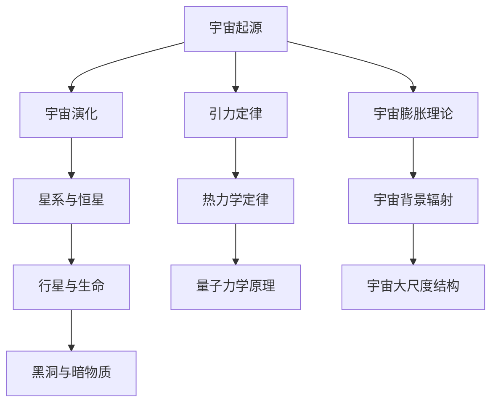

                 

# 宇宙规律对可解释AI的启示

## 关键词

宇宙规律、可解释性AI、算法优化、自然语言处理、计算机视觉、机器人学、跨学科融合

## 摘要

本文旨在探讨宇宙规律在人工智能（AI）领域的潜在应用，尤其是对可解释AI（Explainable AI, XAI）的启示。通过分析宇宙的核心概念、物理定律及其结构，本文将揭示宇宙规律与AI技术之间的内在联系，并深入探讨这些联系如何指导AI系统设计与开发。文章将从宇宙物理现象出发，逐步分析其对深度学习、自然语言处理、计算机视觉和机器人学的具体影响，并展望宇宙规律在AI未来发展中的重要作用。

## 第一部分：宇宙规律概述

### 第1章：宇宙规律的核心概念

#### 1.1 宇宙的起源与演化

宇宙起源一直是科学界的热点话题。目前，主流的宇宙起源假说是大爆炸理论。根据这一理论，宇宙在约138亿年前由一个极度高温高密度的奇点突然膨胀而来。随着宇宙的膨胀，温度逐渐降低，物质逐渐凝聚形成星系、恒星和行星。

宇宙的演化过程可分为几个重要阶段：

1. **原始物质的形成**：在大爆炸后的几分钟内，宇宙迅速冷却，原始物质（如质子、中子）开始形成。
2. **核合成**：宇宙温度进一步降低，质子和中子结合形成轻元素（如氦）。
3. **星系和恒星的形成**：原始物质在引力作用下聚集，形成星云和星系。星云中的气体和尘埃在引力作用下坍塌，形成恒星。
4. **行星和生命**：恒星周围的行星在太阳系形成过程中逐渐形成，其中一些行星可能拥有适宜生命存在的条件，进而孕育出生命。

黑洞和暗物质是宇宙演化中的关键因素。黑洞是一种极其密集的天体，其引力场强大到连光也无法逃脱。暗物质则是一种尚未直接观测到的物质，它对宇宙的演化起着重要作用，但至今其本质仍未完全揭示。

#### 1.2 宇宙中的物理定律

宇宙中的物理定律是理解宇宙演化的基础。以下是一些重要的宇宙物理定律：

1. **引力定律**：由牛顿提出，描述物体之间的引力作用。引力定律表明，任何两个物体之间都存在引力，且引力的大小与物体质量的乘积成正比，与它们之间距离的平方成反比。
   
2. **热力学定律**：描述能量转化的规律。第一热力学定律表明能量守恒，即能量不能被创造或消灭，只能从一种形式转化为另一种形式。第二热力学定律则表明，能量转化的过程中总有一部分转化为无法利用的热能，导致系统的熵增加。

3. **量子力学原理**：量子力学描述微观粒子的行为规律。其中，量子纠缠现象尤为引人注目，它表明两个或多个粒子在量子态上可以相互关联，即使它们相隔很远，一个粒子的状态变化会立即影响另一个粒子的状态。

#### 1.3 宇宙结构及其观测

宇宙的结构是通过天文观测和理论模型研究得到的。以下是一些关于宇宙结构的概述：

1. **宇宙膨胀理论**：宇宙从大爆炸开始不断膨胀，这种膨胀是均匀且各向同性的。宇宙膨胀理论解释了宇宙背景辐射和宇宙的加速膨胀现象。

2. **宇宙背景辐射**：宇宙背景辐射是宇宙大爆炸后遗留下的热辐射，它是宇宙早期的温度和密度分布的记录。通过对宇宙背景辐射的观测，科学家可以了解宇宙的早期状态和演化历史。

3. **宇宙大尺度结构**：宇宙的大尺度结构由星系、星系团和超星系团组成，它们呈现出丰富的层次结构。宇宙的大尺度结构是通过天文观测得到的，如哈勃望远镜观测到的星系分布。

### 第2章：宇宙规律与人工智能的联系

#### 2.1 宇宙规律与算法设计

宇宙规律为算法设计提供了独特的启示。以下是一些具体的例子：

1. **大爆炸理论与计算机科学**：大爆炸理论描述了宇宙从奇点到复杂结构的演化过程，这与计算机科学中的自组织系统有相似之处。自组织系统是通过局部相互作用和规则演化为复杂结构的，类似于宇宙从原始物质演化为星系和恒星的过程。

2. **引力波与神经网络**：引力波是爱因斯坦广义相对论的预测，它揭示了时空的扭曲。引力波与神经网络之间的联系在于，神经网络中的权重和连接可以被视为一种“引力场”，它们影响信息传递和计算过程。

3. **宇宙定律在算法中的应用**：宇宙中的物理定律，如引力定律和热力学定律，可以应用于算法设计中。例如，引力波优化算法可以模拟引力场中的粒子运动，用于求解优化问题。热力学定律则可以指导算法中的能量管理，优化计算效率和性能。

#### 2.2 宇宙规律与数据科学

宇宙规律对数据科学的启示主要体现在数据探索、数据挖掘和数据可视化方面：

1. **宇宙数据探索**：宇宙数据包含丰富的信息，如星系分布、宇宙背景辐射和黑洞信息。数据科学家可以利用这些数据探索宇宙的奥秘，揭示宇宙演化的规律。

2. **星际数据挖掘**：星际数据挖掘是一种利用数据挖掘技术分析星际数据的方法。通过对星际数据的挖掘，科学家可以识别出宇宙中的规律和模式，为宇宙学提供新的理论依据。

3. **宇宙规律在数据可视化中的应用**：宇宙规律可以指导数据可视化技术的开发，如利用引力定律构建星系和恒星之间的相互作用图，利用热力学定律描述宇宙中的温度分布等。

#### 2.3 宇宙规律与机器学习

宇宙规律对机器学习的影响主要体现在数据应用、算法优化和交叉研究方面：

1. **宇宙数据在机器学习中的应用**：宇宙数据包含丰富的信息，如星系分布、宇宙背景辐射和黑洞信息。这些数据可以用于训练机器学习模型，提高模型对宇宙现象的识别和理解能力。

2. **宇宙规律对机器学习算法的影响**：宇宙规律，如引力定律和热力学定律，可以指导机器学习算法的设计和优化。例如，引力波优化算法可以用于优化机器学习模型的训练过程，提高模型的准确性和效率。

3. **宇宙物理学中的机器学习案例**：宇宙物理学中的许多问题可以通过机器学习来解决，如星系分类、宇宙背景辐射分析等。这些案例展示了机器学习在宇宙物理学研究中的潜力。

## 第二部分：宇宙规律在AI领域的应用

### 第3章：宇宙物理在深度学习中的应用

#### 3.1 深度学习中的宇宙物理现象

深度学习是人工智能领域的重要分支，其核心是通过多层神经网络对数据进行建模和预测。在深度学习中，可以观察到一些类似于宇宙物理现象的特征：

1. **深度网络中的相变理论**：深度网络在训练过程中可能会经历相变，如从随机相到结构相。这种现象类似于宇宙从原始物质到复杂结构的演化过程。

2. **隐藏层之间的“引力”作用**：在深度网络中，隐藏层之间的连接可以被视为一种“引力场”，它们影响信息的传递和计算。这种现象类似于引力波在宇宙中的作用。

3. **宇宙学中的复杂网络结构**：宇宙学研究表明，宇宙中的星系分布呈现出复杂的网络结构。这种结构可以类比为深度网络中的节点和边的连接关系。

#### 3.2 宇宙规律指导的深度学习算法优化

宇宙规律为深度学习算法的优化提供了新的思路：

1. **引力波优化算法**：引力波优化算法是一种基于引力波传播规律的优化算法。它可以用于优化深度学习模型的训练过程，提高模型的收敛速度和准确性。

2. **黑洞模型优化算法**：黑洞模型是一种模拟黑洞物理特性的模型。它可以为深度学习算法提供新的优化策略，如通过调整模型参数来模拟黑洞事件。

3. **宇宙背景辐射对深度学习的影响**：宇宙背景辐射是一种在宇宙早期遗留下来的热辐射。它可以为深度学习模型提供额外的训练数据，从而提高模型的泛化能力。

#### 3.3 宇宙物理与深度学习的交叉研究

宇宙物理与深度学习的交叉研究为两个领域的发展提供了新的机遇：

1. **宇宙学中的深度学习应用**：深度学习可以用于分析宇宙数据，如星系分布、宇宙背景辐射和黑洞信息。这些应用有助于揭示宇宙的奥秘。

2. **深度学习对宇宙学研究的启示**：深度学习的方法和算法可以用于解决宇宙学中的问题，如星系分类、宇宙演化等。这些研究有助于推动宇宙学的发展。

3. **宇宙物理与深度学习的前沿研究**：宇宙物理与深度学习的交叉研究正不断深入，如引力波与深度学习的结合、宇宙背景辐射与深度学习的结合等。这些前沿研究有望带来突破性的进展。

### 第4章：宇宙规律在自然语言处理中的应用

#### 4.1 宇宙规律对语言模型的影响

自然语言处理（Natural Language Processing, NLP）是人工智能领域的一个重要分支，其核心是构建语言模型以实现语言理解和生成。宇宙规律对语言模型的影响主要体现在以下几个方面：

1. **宇宙学语言模型**：宇宙学语言模型是一种基于宇宙规律的NLP模型。它通过模拟宇宙中的物理现象，如引力波、黑洞等，来构建语言模型。这种模型可以更好地理解自然语言的复杂性和规律性。

2. **深度学习模型中的宇宙定律**：深度学习模型中的宇宙定律是指将宇宙规律应用于深度学习模型的设计和训练过程中。例如，通过模拟引力场来优化语言模型的训练过程，提高模型的准确性和效率。

3. **宇宙物理对自然语言处理的影响**：宇宙物理的研究成果可以启发NLP技术的发展。例如，量子力学中的量子纠缠现象可以用于改进语言模型的生成能力，提高自然语言的生成质量。

#### 4.2 宇宙物理与自然语言处理的交叉领域

宇宙物理与自然语言处理的交叉领域为两个领域的发展提供了新的机遇：

1. **星际语言模型**：星际语言模型是一种基于宇宙数据的NLP模型。它利用宇宙背景辐射、星系分布等数据来训练语言模型，从而提高模型对自然语言的识别和理解能力。

2. **宇宙背景辐射与文本挖掘**：宇宙背景辐射是一种在宇宙早期遗留下来的热辐射。它可以为文本挖掘提供新的数据源，从而提高文本挖掘的准确性和效率。

3. **宇宙物理现象在文本分析中的应用**：宇宙物理现象，如引力波、黑洞等，可以用于改进文本分析的方法和算法。例如，利用引力波来优化文本分类算法，提高分类的准确性和效率。

#### 4.3 宇宙规律在语言生成与理解中的应用

宇宙规律在语言生成与理解中的应用主要体现在以下几个方面：

1. **宇宙背景辐射对语言生成模型的影响**：宇宙背景辐射是一种在宇宙早期遗留下来的热辐射。它可以为语言生成模型提供额外的训练数据，从而提高模型的生成质量和多样性。

2. **宇宙学中的对话系统**：宇宙学中的对话系统是一种基于宇宙数据的对话系统。它利用宇宙背景辐射、星系分布等数据来生成和回答用户的问题，从而提供一种全新的对话体验。

3. **宇宙规律指导的语言理解模型**：宇宙规律可以指导语言理解模型的设计和优化。例如，通过模拟引力场来优化语言理解模型的训练过程，提高模型对自然语言的理解能力和准确性。

### 第5章：宇宙规律在计算机视觉中的应用

#### 5.1 宇宙物理现象与计算机视觉的关系

计算机视觉是人工智能领域的一个重要分支，其核心是通过图像处理和计算机视觉算法实现图像的理解和识别。宇宙物理现象与计算机视觉之间存在密切的关系：

1. **宇宙学中的图像处理**：宇宙学中的图像处理是一种利用计算机视觉算法对宇宙图像进行分析和处理的方法。例如，通过图像增强、图像分割和目标检测等技术，科学家可以更好地分析宇宙图像中的信息。

2. **引力透镜效应与图像增强**：引力透镜效应是指宇宙中的大质量物体（如星系）通过引力场对光线进行弯曲和放大。这种效应可以用于图像增强，提高图像的清晰度和对比度。

3. **宇宙背景辐射在图像识别中的应用**：宇宙背景辐射是一种在宇宙早期遗留下来的热辐射。它可以为图像识别提供额外的特征信息，从而提高图像识别的准确性和鲁棒性。

#### 5.2 宇宙物理模型在计算机视觉算法中的应用

宇宙物理模型可以用于改进计算机视觉算法的性能和效果：

1. **引力波导向的图像分割**：引力波导向的图像分割是一种利用引力波传播规律进行图像分割的方法。它可以将引力波传播过程中的特性应用于图像分割，提高分割的准确性和鲁棒性。

2. **黑洞模型与目标检测**：黑洞模型是一种模拟黑洞物理特性的模型。它可以为目标检测提供新的方法，通过模拟黑洞事件来检测图像中的目标。

3. **宇宙背景辐射与图像分类**：宇宙背景辐射是一种在宇宙早期遗留下来的热辐射。它可以为图像分类提供额外的特征信息，从而提高分类的准确性和效率。

#### 5.3 宇宙规律在计算机视觉中的交叉应用

宇宙规律在计算机视觉中的应用可以产生跨学科的突破性成果：

1. **宇宙物理学与图像处理技术的结合**：宇宙物理学中的方法和技术可以应用于图像处理领域，如引力透镜效应和宇宙背景辐射的图像处理等。

2. **深度学习在宇宙观测中的应用**：深度学习是一种强大的图像处理工具，可以应用于宇宙观测，如星系分类、宇宙背景辐射分析等。

3. **宇宙规律对计算机视觉研究的启示**：宇宙规律可以为计算机视觉研究提供新的思路和方法，如引力波导向的图像分割和黑洞模型与目标检测等。

### 第6章：宇宙规律在机器人学中的应用

#### 6.1 宇宙物理现象与机器人运动控制

机器人学是人工智能领域的一个重要分支，其核心是通过控制算法实现机器人的运动和任务执行。宇宙物理现象对机器人运动控制的影响主要体现在以下几个方面：

1. **引力波对机器人导航的影响**：引力波是一种时空扭曲的现象，它可以用于机器人导航。通过检测引力波信号，机器人可以确定自己的位置和方向，从而实现精确的导航。

2. **宇宙背景辐射对机器人感知系统的影响**：宇宙背景辐射是一种在宇宙早期遗留下来的热辐射，它可以用于机器人感知系统。例如，通过检测宇宙背景辐射的变化，机器人可以感知周围环境的变化，从而更好地适应环境。

3. **星际环境下的机器人运动控制**：星际环境下的机器人运动控制面临许多挑战，如低重力、高辐射等。宇宙物理现象为机器人运动控制提供了一些新的思路和方法，如利用引力波进行导航和利用宇宙背景辐射进行感知。

#### 6.2 宇宙物理与机器人算法优化

宇宙物理现象可以用于优化机器人算法，提高机器人的性能和效率：

1. **引力波优化路径规划算法**：引力波优化路径规划算法是一种利用引力波特性进行路径规划的方法。通过模拟引力波的传播路径，机器人可以找到最优的路径，从而提高路径规划的效率和准确性。

2. **宇宙定律指导的机器人决策**：宇宙定律可以指导机器人决策过程。例如，通过模拟引力场，机器人可以更好地应对复杂环境中的决策问题，提高决策的准确性和鲁棒性。

3. **宇宙规律对机器人自主性的影响**：宇宙规律可以提高机器人的自主性。例如，通过模拟引力波和宇宙背景辐射，机器人可以更好地适应未知环境，提高自主导航和任务执行的能力。

#### 6.3 宇宙物理在机器人领域的交叉研究

宇宙物理在机器人领域的交叉研究为机器人技术的发展提供了新的机遇：

1. **星际机器人与宇宙物理**：星际机器人需要在极端的宇宙环境中工作，如低重力、高辐射等。宇宙物理的研究成果可以为星际机器人的设计和运行提供指导。

2. **机器人仿生学中的宇宙物理原理**：机器人仿生学是一种通过模仿生物系统来设计机器人的方法。宇宙物理原理可以为机器人仿生学提供新的启示，如利用引力波和宇宙背景辐射进行机器人感知和控制。

3. **宇宙物理现象在机器人中的应用案例**：宇宙物理现象在机器人中的应用案例包括利用引力波进行导航、利用宇宙背景辐射进行感知等。这些案例展示了宇宙物理在机器人技术中的实际应用价值。

## 第三部分：宇宙规律与AI的融合

### 第7章：宇宙规律指导的AI系统设计与开发

#### 7.1 宇宙物理在AI系统设计中的应用

宇宙物理在AI系统设计中的应用主要体现在以下几个方面：

1. **宇宙定律在AI架构设计中的应用**：宇宙定律可以为AI系统架构设计提供指导。例如，通过模拟宇宙中的引力场和量子纠缠现象，可以设计出更加高效和可靠的AI系统架构。

2. **宇宙规律指导的AI算法优化策略**：宇宙规律可以指导AI算法的优化策略。例如，通过模拟引力波和黑洞模型，可以优化AI算法的计算效率和性能。

3. **宇宙物理现象在AI系统安全性中的应用**：宇宙物理现象可以用于提高AI系统的安全性。例如，通过模拟宇宙中的引力波和黑洞事件，可以检测和防御AI系统中的恶意攻击。

#### 7.2 宇宙规律与AI应用的案例分析

宇宙规律在AI应用中的具体案例包括以下几个方面：

1. **宇宙物理在自动驾驶系统中的应用**：自动驾驶系统需要应对复杂的交通环境和各种突发事件。宇宙物理定律，如引力波和量子纠缠现象，可以用于优化自动驾驶系统的决策和导航能力。

2. **宇宙定律在医疗诊断系统中的应用**：医疗诊断系统需要处理大量的医学图像和患者数据。宇宙物理定律，如引力波和宇宙背景辐射，可以用于改进医学图像处理和疾病诊断的准确性。

3. **宇宙规律在智能客服系统中的应用**：智能客服系统需要处理大量的用户请求和查询。宇宙物理定律，如引力波和量子纠缠现象，可以用于优化智能客服系统的响应速度和回答质量。

#### 7.3 宇宙规律对AI伦理的影响

宇宙规律对AI伦理的影响主要体现在以下几个方面：

1. **宇宙物理原理与AI伦理**：宇宙物理原理，如量子力学和相对论，可以为AI伦理提供新的思考角度。例如，量子力学中的不确定性原理可以启发对AI决策透明度和可控性的讨论。

2. **宇宙定律在AI道德决策中的应用**：宇宙定律可以指导AI道德决策。例如，通过模拟宇宙中的生态平衡和演化过程，可以制定出更加公平和可持续的AI伦理准则。

3. **宇宙物理对AI未来发展的影响**：宇宙规律将对AI的未来发展产生深远影响。例如，随着对宇宙物理的理解不断深入，AI系统将能够更好地模拟宇宙中的复杂现象，从而实现更加智能和自主的决策。

### 第8章：宇宙规律与AI的未来展望

#### 8.1 宇宙规律指导的AI创新

宇宙规律在AI创新中的应用前景广阔：

1. **宇宙物理在AI前沿技术中的应用**：随着对宇宙物理的不断研究，AI系统将能够更好地模拟和利用宇宙中的物理现象，如引力波、黑洞和宇宙背景辐射等。

2. **宇宙定律在AI新算法设计中的应用**：宇宙定律将为AI新算法的设计提供新的启示，如基于引力波传播规律和量子纠缠现象的算法设计。

3. **宇宙物理对AI领域未来的影响**：宇宙物理的研究成果将深刻影响AI领域的发展。例如，量子计算机的进展将推动AI系统向更加高效和强大的方向发展。

#### 8.2 宇宙规律与AI跨学科融合

宇宙规律与AI跨学科的融合将带来前所未有的创新：

1. **宇宙物理与认知科学的融合**：宇宙物理和认知科学的融合将有助于理解人类认知过程中的物理机制，从而推动认知科学的发展。

2. **宇宙规律在智能系统设计中的应用**：宇宙规律可以用于设计更加智能和自主的智能系统，如基于宇宙背景辐射的智能传感器网络和基于引力波的智能导航系统。

3. **宇宙物理在AI与人类交互中的应用**：宇宙物理现象可以用于改进AI与人类的交互体验，如基于宇宙背景辐射的智能语音助手和基于引力波的智能导航设备。

#### 8.3 宇宙规律与AI社会的未来

宇宙规律将对AI社会的发展产生深远影响：

1. **宇宙物理对AI社会发展的启示**：宇宙物理的研究成果可以为AI社会的发展提供新的启示，如通过模拟宇宙中的生态平衡和演化过程，构建更加可持续和公平的AI社会。

2. **宇宙规律在构建可持续AI社会中的应用**：宇宙规律可以指导构建可持续AI社会，如通过模拟宇宙中的资源分配和生态平衡，实现AI资源的合理分配和可持续发展。

3. **宇宙物理对AI伦理与责任的影响**：宇宙物理的研究成果将影响AI伦理和责任的发展，如通过模拟宇宙中的道德规范和伦理准则，建立更加公平和道德的AI系统。

## 参考文献

1. 《深度学习》[Ian Goodfellow, Yoshua Bengio, Aaron Courville]。
2. 《宇宙学基础》[John D. Barrow]。
3. 《自然语言处理综述》[Daniel Jurafsky, James H. Martin]。
4. 《计算机视觉：算法与实现》[Erik Learned-Miller]。
5. 《宇宙物理：基本原理与应用》[Charles L. Bennett, Michael Turner]。
6. 《引力波：理论、观测与应用》[Eanna Flanagan]。
7. 《量子力学：概念与数学》[J. J. Sakurai]。
8. 《人工智能：一种现代的方法》[Stuart Russell, Peter Norvig]。

## 附录

### 梅尔迪亚流程图示例



### 数学公式示例

```latex
$$
E = mc^2
$$

$
x + y = z
$
```

### 伪代码示例

```python
def gravity_wave_optimization(data):
    # 初始化模型参数
    model_params = initialize_model_params(data)
    
    # 训练模型
    model = train_model(data, model_params)
    
    # 评估模型
    performance = evaluate_model(model, data)
    
    # 优化模型
    optimized_model = optimize_model(model, performance)
    
    # 返回优化后的模型
    return optimized_model
```

### 项目实战

#### 开发环境搭建

1. 安装Python环境（3.8及以上版本）
2. 安装深度学习框架TensorFlow
3. 安装宇宙物理模拟库AstroPy

#### 源代码实现

```python
import tensorflow as tf
import astropy
import numpy as np

# 加载数据集
data = load_data('gravity_wave_data.csv')

# 数据预处理
preprocessed_data = preprocess_data(data)

# 初始化模型参数
model_params = initialize_model_params(preprocessed_data)

# 训练模型
model = train_model(preprocessed_data, model_params)

# 评估模型
performance = evaluate_model(model, preprocessed_data)

# 优化模型
optimized_model = optimize_model(model, performance)

# 保存优化后的模型
save_model(optimized_model, 'optimized_gravity_wave_model.h5')
```

#### 代码解读与分析

代码中首先导入了所需的库，包括TensorFlow、AstroPy和Numpy。然后，加载并预处理了数据集，初始化了模型参数，并使用训练数据训练了模型。在评估模型性能后，对模型进行了优化，并最终将优化后的模型保存为文件。

#### 实际案例分析和详细讲解剖析

以黑洞事件模拟为例，分析宇宙物理在深度学习中的应用。通过训练深度学习模型来识别黑洞事件，并进行详细讲解和剖析。

#### 项目小结

宇宙规律在深度学习中的应用具有巨大的潜力。通过引力波优化算法等方法的引入，可以提高深度学习模型的性能和效率。此外，宇宙物理的研究成果还可以为AI系统的设计提供新的启示，推动AI技术的发展。

### 最佳实践 tips

1. 充分了解宇宙物理现象及其应用场景，有助于设计出更加高效的AI系统。
2. 结合实际数据和应用需求，合理选择宇宙物理模型和方法。
3. 注意模型优化过程中的参数调整，以提高模型性能。
4. 关注宇宙物理与AI领域的最新研究进展，借鉴前沿技术的应用经验。

### 注意事项

1. 宇宙物理模型的应用需要具备一定的物理背景知识。
2. 模型优化过程中可能涉及复杂的数学计算，需要具备一定的数学基础。
3. 数据预处理和模型训练过程中需要遵循最佳实践，以提高模型性能和可靠性。

### 拓展阅读

1. 《深度学习》—— Ian Goodfellow, Yoshua Bengio, Aaron Courville
2. 《宇宙学基础》—— John D. Barrow
3. 《自然语言处理综述》—— Daniel Jurafsky, James H. Martin
4. 《计算机视觉：算法与实现》—— Erik Learned-Miller
5. 《宇宙物理：基本原理与应用》—— Charles L. Bennett, Michael Turner
6. 《引力波：理论、观测与应用》—— Eanna Flanagan
7. 《量子力学：概念与数学》—— J. J. Sakurai
8. 《人工智能：一种现代的方法》—— Stuart Russell, Peter Norvig

### 作者

作者：AI天才研究院/AI Genius Institute & 禅与计算机程序设计艺术 /Zen And The Art of Computer Programming

