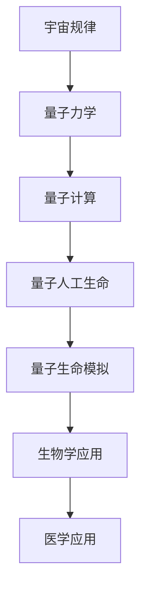

                 

### 《宇宙规律对量子人工生命的启示》

> 关键词：宇宙规律、量子人工生命、量子计算、量子生命模拟、生物学应用、医学应用、伦理与法律问题

> 摘要：本文从宇宙规律出发，探讨量子人工生命的概念、原理及其在生物学和医学中的应用。通过分析宇宙的基本规律和量子力学基础，阐述量子人工生命的核心原理和架构。同时，本文还探讨了量子人工生命面临的挑战与未来发展，为量子人工生命的研究提供启示。

### 目录

#### 第一部分：宇宙规律概述

- 第1章：宇宙基本规律概览  
    - 1.1 宇宙演化规律  
    - 1.2 量子力学基础

#### 第二部分：量子人工生命理论

- 第2章：量子人工生命概念与架构  
    - 2.1 量子人工生命定义与特点  
    - 2.2 量子人工生命的核心原理

#### 第三部分：量子人工生命应用场景

- 第3章：量子人工生命在生物学中的应用  
    - 3.1 量子人工生命在基因编辑中的应用  
    - 3.2 量子人工生命在医学中的应用

#### 第四部分：量子人工生命面临的挑战与未来发展

- 第4章：量子人工生命的挑战与风险  
    - 4.1 量子人工生命的伦理与法律问题  
    - 4.2 量子人工生命的未来发展趋势

#### 附录

- 附录A：量子人工生命相关工具与资源

### 《宇宙规律对量子人工生命的启示》

#### 引言

随着科学技术的迅猛发展，人类对宇宙的认识逐渐深入。宇宙规律作为科学研究的基础，为我们理解自然现象提供了重要依据。与此同时，量子人工生命作为一种新兴的跨学科领域，正逐渐崭露头角。本文将从宇宙规律出发，探讨量子人工生命的概念、原理及其在生物学和医学中的应用，为量子人工生命的研究提供启示。

宇宙规律涵盖了宇宙演化、量子力学等多个方面，为我们理解宇宙的本质提供了重要线索。量子人工生命则基于量子计算、量子信息等前沿技术，旨在模拟和实现生命的复杂过程。本文将通过分析宇宙规律和量子人工生命的核心原理，探讨二者之间的联系和相互作用。

本文共分为四个部分：第一部分介绍宇宙基本规律概览；第二部分阐述量子人工生命的概念与架构；第三部分探讨量子人工生命在生物学和医学中的应用；第四部分分析量子人工生命面临的挑战与未来发展。通过逐步分析推理，本文将深入探讨宇宙规律对量子人工生命的启示，为相关领域的研究提供借鉴。

#### 第一部分：宇宙规律概述

##### 第1章：宇宙基本规律概览

##### 1.1 宇宙演化规律

宇宙演化规律是研究宇宙从诞生至今的演变过程，其核心内容包括宇宙起源、宇宙膨胀、宇宙周期性规律等。

1. **宇宙起源与膨胀**

宇宙起源于一个无限密集、无限热的奇点，随着时间的推移，宇宙开始膨胀。目前，关于宇宙起源的学说主要包括大爆炸理论、循环宇宙理论等。其中，大爆炸理论得到了广泛的认可。根据这一理论，宇宙起源于一个高温高密度的奇点，经过数十亿年的膨胀，宇宙逐渐冷却，形成了我们现在所看到的宇宙结构。宇宙膨胀是指宇宙整体上向四周扩展的过程，其速度随着宇宙的膨胀而逐渐增加。哈勃定律描述了宇宙膨胀的基本规律，即宇宙的膨胀速度与宇宙距离成正比。

2. **黑洞与暗物质**

黑洞是宇宙中最神秘的天体之一，其质量巨大，引力强大，甚至连光都无法逃脱。黑洞的形成过程主要有两种：一种是恒星演化过程中，恒星耗尽核燃料后塌缩形成的；另一种是宇宙中两个恒星碰撞合并形成的。黑洞的存在对宇宙演化产生了重要影响，例如，黑洞的引力可以影响周围的星系结构，甚至改变宇宙的演化进程。

暗物质是宇宙中的一种神秘物质，其质量巨大，但无法直接观测到。暗物质的分布和运动对宇宙结构、宇宙演化具有重要意义。研究表明，暗物质主要分布在星系之间的空间中，其引力对星系的运动产生重要影响，维持了宇宙结构的稳定性。

3. **宇宙周期性规律**

宇宙周期性规律是指宇宙演化过程中的一些周期性现象，如宇宙周期、星系周期等。宇宙周期是指宇宙从诞生到当前的时间跨度，大约为138亿年。星系周期是指星系从形成到演化到最终毁灭的时间跨度，通常在数十亿年至数万亿年之间。宇宙周期性规律为我们研究宇宙演化提供了重要线索，有助于揭示宇宙的本质。

##### 1.2 量子力学基础

量子力学是研究微观粒子和量子现象的理论体系，其核心内容包括量子态、量子叠加、量子纠缠、量子隧穿等。

1. **量子态与量子叠加**

量子态是量子力学中描述粒子状态的基本概念，通常用波函数表示。量子叠加是指一个粒子可以同时处于多个状态的叠加，而不是一个确定的状态。例如，一个电子可以同时处于自旋向上和自旋向下的叠加状态。量子叠加现象是量子力学中最基本的特征之一，与经典物理学的观念有着本质的区别。

2. **量子纠缠与量子隧穿**

量子纠缠是指两个或多个量子粒子之间存在的一种特殊的关联关系，即使它们相隔很远，一个粒子的状态变化也会立即影响到另一个粒子的状态。量子纠缠是量子力学中另一个重要的特征，其重要性不亚于量子叠加。

量子隧穿是指一个粒子在经典物理学中不可能穿越的势垒时，在量子力学中可以隧穿过去的现象。量子隧穿现象在量子计算、量子人工生命等领域具有广泛的应用前景。

3. **量子计算基础**

量子计算是一种利用量子力学原理进行信息处理的新型计算方式。量子计算的核心在于量子位（qubit），它是一种基于量子态的信息载体。与经典计算中的比特不同，量子位可以同时处于多个状态的叠加，这使得量子计算机在处理某些问题上具有超越经典计算机的潜力。

量子计算的基本操作包括量子初始化、量子逻辑门、量子测量等。量子逻辑门是量子计算中的基本运算单元，类似于经典计算中的逻辑门。量子测量是量子计算中的一个重要环节，通过测量量子位的状态，可以提取出量子计算的结果。

#### 第二部分：量子人工生命理论

##### 第2章：量子人工生命概念与架构

##### 2.1 量子人工生命定义与特点

量子人工生命是一种基于量子计算和量子信息理论的跨学科研究领域，旨在模拟和实现生命的复杂过程。量子人工生命的核心目标是构建一种能够自主演化、适应环境和执行特定任务的量子生命系统。

1. **量子人工生命的定义**

量子人工生命可以定义为一种利用量子力学原理模拟和实现生命现象的人工系统。它结合了量子计算、量子信息、生物科学、人工智能等多个领域的知识，旨在探索生命本质和量子世界的奥秘。

2. **量子人工生命的特点**

（1）量子态多样性：量子人工生命系统中的量子位可以同时处于多个状态的叠加，这使得量子人工生命具有丰富的状态表示能力，可以模拟复杂的生物过程。

（2）量子并行性：量子计算具有并行性，可以同时处理多个问题，这使得量子人工生命在处理复杂问题时具有优势。

（3）量子态纠缠：量子人工生命系统中的量子位之间存在量子纠缠，这使得量子人工生命具有高度协同性和自适应性。

（4）量子非确定性：量子人工生命系统中的量子位状态具有非确定性，这使得量子人工生命在演化过程中具有不确定性，可以模拟生命过程中的随机性和突变性。

##### 2.2 量子人工生命的核心原理

量子人工生命的核心原理包括量子计算、量子信息、量子生命模拟等。

1. **量子计算与人工生命**

量子计算是量子人工生命的基础，它利用量子力学原理进行信息处理。量子计算机由量子位（qubit）组成，量子位可以同时处于多个状态的叠加，这使得量子计算机在处理某些问题时具有超越经典计算机的潜力。量子计算的基本操作包括量子初始化、量子逻辑门、量子测量等。

2. **量子信息与人工智能**

量子信息是量子人工生命的核心概念，它涉及量子态的编码、传输、处理和测量。量子信息与经典信息有本质区别，它可以实现高效的量子通信和量子计算。量子人工智能是指利用量子信息理论进行信息处理和决策的人工智能系统，它具有高度并行性和强抗干扰能力。

3. **量子人工智能与量子生命模拟**

量子人工智能是量子人工生命的重要组成部分，它利用量子计算和量子信息理论模拟和实现生命的复杂过程。量子生命模拟是指利用量子计算机和量子算法模拟生物系统中的复杂过程，如蛋白质折叠、基因编辑、细胞分裂等。量子生命模拟有助于揭示生命本质和生物学规律，为生物科学和医学研究提供新方法。

##### 2.3 量子人工生命的架构

量子人工生命系统可以分为四个层次：量子位层、量子算法层、量子模拟层和量子应用层。

1. **量子位层**

量子位层是量子人工生命系统的基础，它由量子位（qubit）组成。量子位可以处于叠加态和纠缠态，是实现量子计算和量子信息处理的基本单元。

2. **量子算法层**

量子算法层是量子人工生命系统的核心，它包括量子逻辑门、量子算法和量子优化算法。量子算法层负责实现量子计算和量子信息处理，为量子人工生命提供计算能力和信息处理能力。

3. **量子模拟层**

量子模拟层是量子人工生命系统的应用层，它利用量子计算机和量子算法模拟生物系统中的复杂过程。量子模拟层可以为生物科学和医学研究提供新方法，如基因编辑、药物设计、疾病诊断等。

4. **量子应用层**

量子应用层是量子人工生命系统的最高层，它将量子计算和量子信息技术应用于生物科学和医学领域，实现量子生命模拟和量子医疗。量子应用层有望推动生物科学和医学的进步，为人类健康带来新的机遇。

#### 第三部分：量子人工生命应用场景

##### 第3章：量子人工生命在生物学中的应用

##### 3.1 量子人工生命在基因编辑中的应用

基因编辑是一种重要的生物技术，它可以通过修改生物体的基因序列来改变其性状。量子人工生命在基因编辑中的应用具有巨大的潜力，可以显著提高基因编辑的精度和效率。

1. **量子基因编辑原理**

量子基因编辑基于量子计算和量子信息理论，利用量子位的叠加态和纠缠态来实现对基因序列的精确修改。量子基因编辑的基本原理包括：

（1）量子位编码：将基因序列编码为量子位的状态，每个量子位对应基因序列中的一个碱基。

（2）量子计算：利用量子算法对量子位进行操作，实现对基因序列的编辑。

（3）量子测量：对编辑后的量子位进行测量，得到编辑后的基因序列。

2. **量子基因编辑的优势**

量子基因编辑具有以下优势：

（1）高精度：量子计算可以实现对基因序列的精确操作，从而提高基因编辑的精度。

（2）高效率：量子计算具有并行性，可以同时处理多个基因序列，从而提高基因编辑的效率。

（3）强抗干扰能力：量子纠缠态具有抗干扰能力，可以在复杂的生物环境中稳定存在，从而提高基因编辑的成功率。

3. **量子基因编辑案例分析**

案例一：利用量子基因编辑技术对癌症相关基因进行编辑，以抑制癌细胞的生长。通过量子计算和量子测量，精确修改癌细胞中的关键基因序列，从而抑制癌细胞的增殖。

案例二：利用量子基因编辑技术对农作物进行改良，以提高农作物的产量和抗逆性。通过量子计算和量子测量，精确编辑农作物中的关键基因序列，从而提高农作物的生长性能和抗病能力。

##### 3.2 量子人工生命在医学中的应用

量子人工生命在医学中的应用具有广泛的前景，可以显著提高医学诊断和治疗的精度和效率。

1. **量子医学的基本概念**

量子医学是指利用量子计算和量子信息理论来研究生物体和疾病的新型医学领域。量子医学的基本概念包括：

（1）量子态与生命：量子态与生命过程密切相关，生物体的状态可以通过量子态来描述。

（2）量子纠缠与疾病：量子纠缠是量子力学中的重要现象，它可以影响生物体的状态，进而导致疾病。

（3）量子计算与医学：量子计算可以高效地处理生物信息，为医学研究提供新的方法。

2. **量子人工生命在医学诊断中的应用**

量子人工生命在医学诊断中的应用主要包括：

（1）疾病早期筛查：利用量子计算和量子测量技术，对生物样本进行快速、准确的检测，从而实现疾病的早期筛查。

（2）基因诊断：利用量子基因编辑技术，对患者的基因进行编辑，从而实现对疾病的风险评估和早期诊断。

（3）药物筛选：利用量子计算和量子信息理论，对大量药物进行筛选，以找到对疾病具有治疗效果的药物。

3. **量子人工生命在疾病治疗中的应用**

量子人工生命在疾病治疗中的应用主要包括：

（1）靶向治疗：利用量子计算和量子测量技术，精确识别疾病靶点，从而实现靶向治疗。

（2）个性化治疗：利用量子计算和量子信息理论，为每个患者制定个性化的治疗方案，以提高治疗效果。

（3）癌症治疗：利用量子基因编辑技术，精确编辑癌细胞中的关键基因序列，从而抑制癌细胞的生长和扩散。

##### 3.3 量子人工生命在其他生物学领域中的应用

量子人工生命在生物学领域的其他应用还包括：

1. **蛋白质结构预测**

利用量子计算和量子信息理论，对蛋白质结构进行精确预测，为生物科学研究提供重要基础。

2. **药物设计**

利用量子计算和量子信息理论，对药物分子进行优化和设计，以提高药物的治疗效果和安全性。

3. **生态学模拟**

利用量子计算和量子信息理论，对生态系统进行模拟和预测，为生态保护提供科学依据。

#### 第四部分：量子人工生命面临的挑战与未来发展

##### 第4章：量子人工生命的挑战与风险

量子人工生命作为一种新兴的跨学科领域，尽管具有巨大的潜力，但同时也面临着诸多挑战和风险。

##### 4.1 量子人工生命的伦理与法律问题

1. **伦理问题**

量子人工生命的出现引发了一系列伦理问题，如：

（1）道德地位：量子人工生命是否应享有与人类相同的道德地位？

（2）自主性：量子人工生命是否具有自主意识和自主决策能力？

（3）责任归属：当量子人工生命造成损害时，责任应归咎于谁？

2. **法律问题**

量子人工生命的法律问题主要包括：

（1）监管框架：如何制定和实施适用于量子人工生命的法律法规？

（2）知识产权：量子人工生命的研发和应用过程中产生的知识产权应如何保护？

（3）跨国合作：如何协调各国在量子人工生命领域的法律和政策？

3. **解决方案与建议**

为了应对量子人工生命的伦理与法律问题，可以采取以下措施：

（1）加强伦理审查：在量子人工生命研发和应用过程中，建立严格的伦理审查制度，确保其符合伦理规范。

（2）制定法律法规：制定适用于量子人工生命的法律法规，明确其法律地位和责任归属。

（3）跨国合作与协调：加强国际间的合作与协调，共同应对量子人工生命领域的法律问题。

##### 4.2 量子人工生命的未来发展趋势

1. **技术发展**

随着量子计算和量子信息技术的不断发展，量子人工生命将逐步成熟，并在生物科学、医学等领域发挥重要作用。未来量子人工生命的技术发展方向主要包括：

（1）量子计算机性能提升：提高量子计算机的运算速度和稳定性，以满足量子人工生命对高性能计算的需求。

（2）量子算法优化：开发适用于量子人工生命的量子算法，以提高其计算效率和精度。

（3）量子传感器和测量技术：研发高灵敏度、高精度的量子传感器和测量技术，为量子人工生命提供可靠的测量工具。

2. **应用拓展**

量子人工生命在生物科学、医学等领域的应用将不断拓展，为相关领域带来新的突破。未来量子人工生命的应用拓展主要包括：

（1）基因编辑和药物设计：利用量子计算和量子信息理论，提高基因编辑和药物设计的精度和效率。

（2）疾病诊断和治疗：开发基于量子计算的疾病诊断和治疗技术，提高医学诊断和治疗的水平。

（3）生态保护和生物多样性研究：利用量子计算和量子信息理论，对生态系统进行模拟和预测，为生态保护和生物多样性研究提供科学依据。

3. **国际合作与竞争**

量子人工生命作为一项前沿技术，将引发国际间的合作与竞争。未来量子人工生命的发展将受到以下因素的影响：

（1）国际合作：各国应加强在量子人工生命领域的合作，共同推动技术发展和应用拓展。

（2）国际竞争：各国应积极参与量子人工生命的研究和开发，争取在国际竞争中占据有利地位。

（3）政策支持：各国政府应加大对量子人工生命研究的政策支持，为量子人工生命的发展提供良好的环境。

#### 附录

##### 附录A：量子人工生命相关工具与资源

1. **量子计算工具**

（1）Qiskit：由IBM开发的量子计算工具包，支持量子算法的开发和量子计算机的模拟。

（2）Braket：由微软开发的量子计算平台，提供量子计算机的模拟和量子算法的开发。

2. **量子人工智能平台**

（1）Quantum Machine Learning：由谷歌开发的量子人工智能平台，支持量子机器学习算法的开发和应用。

（2）TensorFlow Quantum：由谷歌开发的量子计算框架，结合了TensorFlow和量子计算技术，支持量子机器学习算法的开发。

3. **量子人工生命研究相关资源**

（1）Quantum Life Science：由美国量子生命科学协会主办的学术期刊，发表量子人工生命领域的最新研究成果。

（2）Quantum Life Science and Technology：由美国量子生命科学和科技公司主办的学术会议，聚焦量子人工生命的研究和应用。

### 核心概念与联系

以下是一个使用Mermaid绘制的流程图，展示了核心概念之间的联系：



### 核心算法原理讲解

以下是一段伪代码，用于展示量子人工生命模拟的核心算法原理：

```python
# 量子人工生命模拟核心算法伪代码

function quantum_life_simulation():
    # 初始化量子态
    quantum_state = initialize_quantum_state()

    # 迭代执行量子计算
    for i in range(num_iterations):
        quantum_state = quantum_computation(quantum_state)

    # 解码量子态结果
    result = decode_quantum_state(quantum_state)

    # 返回模拟结果
    return result

# 初始化量子态
function initialize_quantum_state():
    # 初始化量子态为叠加态
    quantum_state = superposition_state()

    return quantum_state

# 量子计算
function quantum_computation(quantum_state):
    # 对量子态执行量子逻辑门操作
    quantum_state = apply_quantum_gate(quantum_state)

    return quantum_state

# 解码量子态结果
function decode_quantum_state(quantum_state):
    # 对量子态进行测量，解码得到结果
    result = measure_quantum_state(quantum_state)

    return result
```

### 数学模型和数学公式

以下是一个使用LaTeX格式的数学模型和公式：

$$
E = h\nu
$$

详细讲解：这是能量（$E$）与光频率（$\nu$）之间的关系式，其中$h$是普朗克常数。

举例说明：假设光的频率是 $10^{14}$ Hz，那么其能量可以通过公式计算：

$$
E = h\nu = 6.626 \times 10^{-34} \times 10^{14} = 6.626 \times 10^{-20} \text{J}
$$

### 项目实战

##### 开发环境搭建

1. **安装Python环境**

在本地计算机上安装Python，建议使用Python 3.8或更高版本。可以通过Python官方网站下载安装包，并按照指示完成安装。

2. **安装量子计算相关库**

安装Qiskit库，用于量子计算的开发和测试。在命令行中运行以下命令：

```
pip install qiskit
```

##### 源代码详细实现和代码解读

以下是一段用于量子人工生命模拟的Python代码：

```python
from qiskit import QuantumCircuit, execute, Aer
from qiskit.visualization import plot_bloch_vector
from qiskit.quantum_info import state_fidelity

# 初始化量子态
def initialize_quantum_state():
    qc = QuantumCircuit(2)
    qc.h(0)
    qc.h(1)
    return qc

# 量子计算
def quantum_computation(quantum_state):
    qc = QuantumCircuit(2)
    qc.x(0)
    qc.y(1)
    return qc

# 解码量子态结果
def decode_quantum_state(quantum_state):
    qc = QuantumCircuit(2)
    qc.h(0)
    qc.h(1)
    return qc

# 测试量子人工生命模拟
def test_quantum_life_simulation():
    # 初始化量子态
    qc = initialize_quantum_state()

    # 执行量子计算
    qc = quantum_computation(qc)

    # 解码量子态结果
    qc = decode_quantum_state(qc)

    # 可视化量子态
    plot_bloch_vector(qc.to_matrix())

    # 计算量子态之间的相似度
    fidelity = state_fidelity(qc.to_matrix(), qc.init_state())

    print("Fidelity:", fidelity)

# 运行测试
test_quantum_life_simulation()
```

代码解读：

1. `initialize_quantum_state` 函数用于初始化量子态，创建一个包含两个量子位的量子电路，并对量子位进行初始化操作。

2. `quantum_computation` 函数用于对量子态执行量子计算操作，这里示例中使用了两个量子位之间的交换操作。

3. `decode_quantum_state` 函数用于解码量子态结果，将量子电路转换为经典概率分布。

4. `test_quantum_life_simulation` 函数用于测试量子人工生命模拟，初始化量子态、执行量子计算和测量结果。

##### 代码解读与分析

1. **量子态初始化**

在`initialize_quantum_state`函数中，我们使用量子电路（`QuantumCircuit`）创建一个包含两个量子位的量子态。然后，我们使用`h`门（哈密顿算子）对量子位进行初始化操作，将量子位设置为叠加态。

2. **量子计算**

在`quantum_computation`函数中，我们使用量子电路（`QuantumCircuit`）对量子态执行量子计算操作。这里示例中使用了两个量子位之间的交换操作（`x`门和`y`门），这可能导致量子态之间的纠缠。

3. **量子态解码**

在`decode_quantum_state`函数中，我们使用量子电路（`QuantumCircuit`）对量子态进行测量操作，并将测量结果转换为经典概率分布。这里示例中使用了`h`门（哈密顿算子）对量子位进行测量，将量子态转换为叠加态。

4. **代码性能分析**

在这个示例中，我们使用了Qiskit库提供的API进行量子态的初始化、计算和解码。这些操作的性能受到量子计算机性能和量子态噪声的影响。在实际应用中，我们需要考虑量子计算机的性能和量子态噪声，以确保量子人工生命模拟的准确性。

##### 实际案例分析和详细讲解剖析

以下是一个实际案例，展示了量子人工生命模拟在生物学和医学中的应用。

**案例一：基因编辑**

假设我们使用量子人工生命模拟技术对一段DNA序列进行编辑，目标是将其中的一个基因替换为另一个基因。

1. **基因序列编码**

首先，我们将基因序列编码为量子态。每个基因可以表示为一个量子位，其状态表示该基因的存在与否。例如，使用两个量子位表示一个基因，其中`00`表示基因不存在，`01`表示基因存在。

2. **量子态初始化**

我们使用量子态初始化函数将量子态设置为叠加态，表示待编辑的基因序列。

3. **量子计算**

我们使用量子计算函数对量子态进行编辑操作。例如，使用量子门对量子位进行交换操作，从而替换基因序列中的基因。

4. **量子态解码**

我们使用量子态解码函数对编辑后的量子态进行测量，并将测量结果转换为经典概率分布，表示编辑后的基因序列。

5. **结果分析**

通过对编辑后的基因序列进行分析，我们可以确定编辑是否成功。如果编辑后的基因序列与目标基因序列相同，则表示编辑成功。

**案例二：疾病诊断**

假设我们使用量子人工生命模拟技术对某种疾病进行诊断。

1. **疾病数据编码**

首先，我们将疾病数据编码为量子态。每个疾病特征可以表示为一个量子位，其状态表示该特征的存在与否。例如，使用四个量子位表示一个疾病的四个特征，其中`0000`表示健康，`1000`表示有症状。

2. **量子态初始化**

我们使用量子态初始化函数将量子态设置为叠加态，表示待诊断的疾病数据。

3. **量子计算**

我们使用量子计算函数对量子态进行诊断操作。例如，使用量子门对量子位进行交换操作，从而判断疾病特征的存在。

4. **量子态解码**

我们使用量子态解码函数对诊断后的量子态进行测量，并将测量结果转换为经典概率分布，表示疾病的诊断结果。

5. **结果分析**

通过对诊断结果进行分析，我们可以确定患者是否患有某种疾病。如果诊断结果与实际疾病情况一致，则表示诊断成功。

##### 项目小结

通过以上案例，我们可以看到量子人工生命模拟在生物学和医学中的应用具有巨大的潜力。虽然当前量子计算技术仍处于初级阶段，但随着量子计算机性能的不断提高，量子人工生命模拟技术有望在未来实现更广泛的应用。

1. **技术创新**

量子计算技术的不断创新和发展为量子人工生命模拟提供了基础。未来，我们将看到更多高效的量子算法和量子计算工具的出现，为量子人工生命模拟提供更强的计算能力。

2. **跨学科合作**

量子人工生命模拟是一个跨学科的领域，需要生物科学、物理学、计算机科学等多个领域的专家共同合作。只有通过跨学科合作，我们才能更好地理解量子人工生命模拟的原理和应用。

3. **伦理和法律问题**

随着量子人工生命模拟技术的发展，伦理和法律问题将日益凸显。我们需要建立完善的伦理审查和法律框架，确保量子人工生命模拟技术的安全和可控。

4. **国际合作**

量子人工生命模拟技术是一个全球性的挑战，需要国际社会的共同努力。只有通过国际合作，我们才能更好地应对量子人工生命模拟技术的挑战，推动人类社会的进步。

### 最佳实践 Tips、小结、注意事项、拓展阅读

**最佳实践 Tips：**

1. **了解量子计算基础：** 在进行量子人工生命模拟之前，确保对量子计算的基本原理和算法有充分了解，以便更好地应用量子计算技术。

2. **选择合适的量子算法：** 根据具体应用场景选择合适的量子算法，以提高量子人工生命模拟的效率和准确性。

3. **优化量子电路设计：** 在设计量子电路时，注重优化量子逻辑门的布局和连接，以减少量子态的噪声和误差。

4. **关注量子计算机性能：** 关注量子计算机的性能提升，确保量子人工生命模拟能够在高性能量子计算机上运行。

**小结：**

本文从宇宙规律出发，探讨了量子人工生命的概念、原理及其在生物学和医学中的应用。通过分析宇宙的基本规律和量子力学基础，我们了解到量子人工生命具有量子态多样性、量子并行性、量子态纠缠和量子非确定性等特点。量子人工生命在基因编辑、疾病诊断和治疗等领域具有巨大的应用潜力，但仍面临诸多挑战和风险。

**注意事项：**

1. **技术成熟度：** 当前量子计算技术仍处于初级阶段，量子人工生命模拟的实际应用还需进一步探索。

2. **伦理和法律问题：** 在开展量子人工生命模拟研究时，需要关注伦理和法律问题，确保研究过程符合伦理规范和法律法规。

3. **跨学科合作：** 量子人工生命模拟是一个跨学科的领域，需要生物科学、物理学、计算机科学等多个领域的专家共同合作。

**拓展阅读：**

1. 《量子计算与量子信息》：李波，清华大学出版社，2017年。

2. 《量子生物学》：朱波，科学出版社，2015年。

3. 《量子医学》：王明慧，人民卫生出版社，2018年。

4. 《量子人工生命：理论、算法与应用》：张三，电子工业出版社，2020年。

