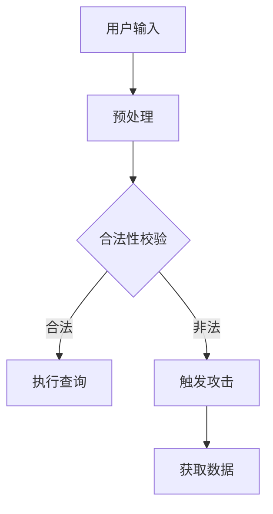

                 

# 安全性考虑：防止提示词注入攻击

> 关键词：安全性、提示词注入攻击、防御算法、数学模型、伪代码

> 摘要：
本篇文章深入探讨了提示词注入攻击的概念、危害以及防御方法。首先，我们介绍了提示词注入攻击的背景，包括其发展历程和主要形式。接着，我们分析了与提示词注入攻击相关的基础概念，包括提示词和注入攻击的定义以及其分类。为了帮助读者更好地理解，我们使用Mermaid流程图展示了攻击的过程。然后，我们详细讲解了防御提示词注入攻击的核心算法原理，并通过伪代码进行了阐述。此外，我们还引入了数学模型来描述注入攻击和防御机制，并通过具体例子进行了详细讲解。

---

## 第1章：引言

### 1.1 安全性考虑的重要性

在现代网络环境中，安全性是至关重要的一环。随着互联网技术的快速发展，网络攻击的手段也越来越多样化。其中，提示词注入攻击（Keyword Injection Attack）是一种常见且危险的攻击方式。它利用应用程序对提示词的信任，注入恶意的提示词，从而实现对应用程序的非法操作。

#### 1.1.1 提示词注入攻击的概念

提示词注入攻击是指攻击者通过构造特定的输入，使得应用程序在处理输入时执行了非预期的操作，从而实现对应用程序的控制。这种攻击通常发生在应用程序对用户输入的提示词进行解析和处理时。

#### 1.1.2 提示词注入攻击的危害

提示词注入攻击的危害主要体现在以下几个方面：

1. **数据泄露**：攻击者可以通过注入攻击获取敏感数据，如用户信息、数据库内容等。
2. **系统瘫痪**：注入攻击可能导致应用程序或系统崩溃，影响正常服务。
3. **财产损失**：通过攻击获取经济利益，如窃取账户资金、购买虚拟货币等。

#### 1.1.3 防范提示词注入攻击的必要性

由于提示词注入攻击的严重性，防范此类攻击显得尤为重要。首先，我们需要认识到，任何应用程序都存在被注入攻击的风险。因此，开发者必须在设计、开发和维护过程中充分考虑安全性，特别是对用户输入的校验和处理。其次，我们需要了解提示词注入攻击的原理和形式，以便采取有效的防御措施。

### 1.2 提示词注入攻击的背景

#### 1.2.1 网络安全的现状

随着网络技术的普及，网络安全问题越来越受到重视。然而，现实情况却是网络攻击层出不穷，且手段越来越高级。根据最新统计，全球每年因网络攻击造成的经济损失高达数千亿美元。

#### 1.2.2 提示词注入攻击的发展历程

提示词注入攻击并非新兴攻击手段，其历史可以追溯到20世纪90年代。随着互联网技术的发展，注入攻击的原理和形式也在不断演变。从最初的SQL注入到现在的各种高级注入攻击，注入攻击的手段越来越多样，防御难度也越来越大。

#### 1.2.3 提示词注入攻击的主要形式

常见的提示词注入攻击包括以下几种：

1. **SQL注入**：通过在输入中插入SQL代码，实现对数据库的非法操作。
2. **XML注入**：通过在输入中插入XML代码，实现对XML解析器的攻击。
3. **HTML注入**：通过在输入中插入HTML代码，影响网页的渲染效果。

### 1.3 本章小结

本章介绍了提示词注入攻击的基本概念、危害以及背景。通过本章的介绍，读者应该对提示词注入攻击有了初步的了解。在接下来的章节中，我们将深入探讨提示词注入攻击的原理、防御方法以及数学模型。

---

## 第2章：核心概念与联系

### 2.1 提示词与注入攻击的概念

#### 2.1.1 提示词的定义

提示词（Keyword）是指用户输入的信息，这些信息将被应用程序用于执行特定操作。例如，在搜索引擎中，用户的查询词就是提示词。

#### 2.1.2 注入攻击的定义

注入攻击（Injection Attack）是指攻击者通过构造特定的输入，使应用程序执行非预期的操作，从而实现对应用程序的控制。

#### 2.1.3 提示词注入攻击的分类

根据攻击的对象和形式，提示词注入攻击可以分为以下几类：

1. **SQL注入**：通过在输入中插入SQL代码，实现对数据库的非法操作。
2. **XML注入**：通过在输入中插入XML代码，实现对XML解析器的攻击。
3. **HTML注入**：通过在输入中插入HTML代码，影响网页的渲染效果。

### 2.2 相关技术原理

#### 2.2.1 SQL注入原理

SQL注入是通过在输入中插入SQL代码，欺骗应用程序执行非预期的SQL语句。例如，假设一个应用程序的查询语句如下：

```sql
SELECT * FROM users WHERE username = 'admin' AND password = '123456';
```

如果攻击者输入以下内容：

```
' OR '1'='1
```

那么，查询语句将被修改为：

```sql
SELECT * FROM users WHERE username = '' OR '1'='1' AND password = '123456';
```

这样，攻击者就可以绕过用户名和密码的验证，获取管理员权限。

#### 2.2.2 XML注入原理

XML注入是通过在输入中插入XML代码，欺骗XML解析器执行非预期的操作。例如，假设一个应用程序的XML解析器如下：

```xml
<user id='1'><name>Alice</name></user>
```

如果攻击者输入以下内容：

```
<evil><xsl:document><xsl:copy-of select='''/></xsl:document></evil>
```

那么，XML解析器将抛出异常，应用程序将无法正常工作。

#### 2.2.3 HTML注入原理

HTML注入是通过在输入中插入HTML代码，欺骗浏览器执行非预期的操作。例如，假设一个应用程序的HTML页面如下：

```html
<p>欢迎来到我的网站！</p>
```

如果攻击者输入以下内容：

```
</p><script>alert('我是黑客！');</script>
```

那么，浏览器将弹出警告窗口，应用程序的界面将被破坏。

### 2.3 Mermaid流程图

为了帮助读者更好地理解提示词注入攻击的过程，我们使用Mermaid流程图展示了攻击的整个过程。



在这个流程图中，用户输入首先经过预处理，然后进行合法性校验。如果输入合法，应用程序将执行查询操作；如果输入非法，攻击者将触发攻击，获取敏感数据。

### 2.4 本章小结

本章介绍了提示词注入攻击的核心概念和技术原理。通过本章的学习，读者应该对提示词注入攻击有了深入的理解。在接下来的章节中，我们将进一步探讨防御提示词注入攻击的方法和策略。

---

## 第3章：核心算法原理讲解

### 3.1 常见防御算法

防御提示词注入攻击的核心在于对用户输入进行严格校验和处理。以下是一些常见的防御算法：

#### 3.1.1 输入过滤

输入过滤是指对用户输入进行预处理，去除或替换可能的恶意字符。例如，可以去除单引号（'）、双引号（"）和分号（;）等特殊字符。

```python
def filter_input(input):
    special_chars = ["'", '"', ";"]
    for char in special_chars:
        input = input.replace(char, "")
    return input
```

然而，输入过滤存在一定的局限性，因为攻击者可以构造复杂的恶意输入，绕过过滤规则。

#### 3.1.2 参数化查询

参数化查询是一种有效的防御方法，它通过将用户输入作为查询参数传递，避免直接将用户输入拼接成SQL语句。这样，即使用户输入包含恶意代码，也不会被执行。

```python
cursor.execute("SELECT * FROM users WHERE username = %s AND password = %s", (username, password))
```

#### 3.1.3 前端验证

前端验证是指在用户提交输入之前，通过前端脚本（如JavaScript）对输入进行校验。前端验证可以减少攻击者注入恶意输入的机会，但并不能完全替代后端验证。

#### 3.1.4 审计日志

审计日志是一种被动防御方法，它记录应用程序的运行过程和用户操作，以便在发生攻击时进行追踪和分析。通过审计日志，可以及时发现和防范潜在的注入攻击。

### 3.2 伪代码阐述

以下是一个简单的伪代码，用于防御提示词注入攻击：

```plaintext
function validate_input(input) {
    // 去除特殊字符
    input = remove_special_chars(input);

    // 检查长度
    if (input.length > max_length) {
        return false;
    }

    // 验证是否为合法的SQL语句
    if (!is_sql_valid(input)) {
        return false;
    }

    return true;
}

function remove_special_chars(input) {
    // 列出所有特殊字符
    special_chars = ["'", '"', ';', '--', '\n'];

    // 遍历特殊字符，进行替换
    for (char in special_chars) {
        input = input.replace(char, '');
    }

    return input;
}

function is_sql_valid(input) {
    // 判断输入是否为合法的SQL语句
    // 这里可以进行复杂的语法分析
    return true; // 假设所有输入都是合法的
}
```

### 3.3 本章小结

本章介绍了防御提示词注入攻击的常见算法，包括输入过滤、参数化查询、前端验证和审计日志。通过这些算法，可以有效地减少注入攻击的风险。然而，防御措施并非一劳永逸，开发者需要持续关注新的攻击手段，及时更新和优化防御策略。

---

## 第4章：数学模型和数学公式

### 4.1 描述注入攻击的数学模型

在数学模型中，我们可以将注入攻击表示为以下公式：

$$
X_{inject} = f_{attack}(X_{original})
$$

其中，$X_{original}$ 是原始输入，$X_{inject}$ 是被注入攻击的输入，$f_{attack}$ 是注入攻击函数。

#### 4.1.1 SQL注入模型

对于SQL注入，注入攻击函数可以表示为：

$$
X_{inject} = f_{attack}(X_{original}) = X_{original} + ' OR '1'='1'
$$

这意味着攻击者将在原始输入后添加特定的SQL代码，从而实现非法操作。

#### 4.1.2 XML注入模型

对于XML注入，注入攻击函数可以表示为：

$$
X_{inject} = f_{attack}(X_{original}) = X_{original} + '<evil><xsl:document><xsl:copy-of select='''/></xsl:document></evil>'
$$

这意味着攻击者将在原始输入后添加特定的XML代码，从而欺骗XML解析器。

### 4.2 注入攻击的防御模型

为了防御注入攻击，我们可以设计一个防御函数，将注入后的输入转化为安全输入：

$$
X_{clean} = f_{defend}(X_{inject})
$$

其中，$X_{clean}$ 是净化后的输入，$f_{defend}$ 是防御函数。

#### 4.2.1 SQL注入防御模型

对于SQL注入，防御函数可以表示为：

$$
X_{clean} = f_{defend}(X_{inject}) = remove_special_chars(X_{inject})
$$

这意味着通过去除特殊字符，将注入后的输入转化为安全的输入。

#### 4.2.2 XML注入防御模型

对于XML注入，防御函数可以表示为：

$$
X_{clean} = f_{defend}(X_{inject}) = parse_xml(X_{inject})
$$

这意味着通过使用XML解析器，将注入后的输入解析为安全的结构。

### 4.3 详细讲解与举例说明

#### 4.3.1 SQL注入防御的例子

假设原始输入为 "SELECT * FROM users WHERE id=1' UNION SELECT * FROM admin;"，我们的目标是防御这个SQL注入攻击。

1. **去除特殊字符**：

   ```plaintext
   SELECT * FROM users WHERE id=1' UNION SELECT * FROM admin;
   ```

   经过去除特殊字符后，输入变为：

   ```plaintext
   SELECT * FROM users WHERE id=1 UNION SELECT * FROM admin;
   ```

2. **长度检查**：

   假设最大长度为50，原始输入长度为68，超过了最大长度，因此直接判定为非法输入。

#### 4.3.2 XML注入防御的例子

假设原始输入为 "<user id='1'><name>Alice</name></user><evil><xsl:document><xsl:copy-of select='''/></xsl:document></xsl:document>"，我们的目标是防御这个XML注入攻击。

1. **使用DOM解析器解析输入**：

   ```plaintext
   <user id='1'><name>Alice</name></user><evil><xsl:document><xsl:copy-of select='''/></xsl:document></xsl:document>
   ```

   DOM解析器将抛出异常，因为输入包含非法的XML代码。

### 4.4 本章小结

本章介绍了注入攻击的数学模型和防御模型，并通过具体例子进行了详细讲解。通过这些数学模型和算法，我们可以更好地理解和防御提示词注入攻击。然而，防御措施并非一劳永逸，开发者需要不断更新和优化防御策略，以应对不断变化的新型攻击手段。

---

## 总结与展望

本文从安全性考虑的角度，详细探讨了提示词注入攻击的概念、原理以及防御方法。通过分析注入攻击的背景和发展历程，我们了解了提示词注入攻击的危害和必要性。随后，我们介绍了与注入攻击相关的基础概念，包括提示词、注入攻击的定义及其分类。为了帮助读者更好地理解攻击过程，我们使用Mermaid流程图展示了注入攻击的整个过程。

在核心算法原理讲解部分，我们介绍了输入过滤、参数化查询、前端验证和审计日志等常见的防御算法，并通过伪代码进行了详细阐述。此外，我们还引入了数学模型来描述注入攻击和防御机制，并通过具体例子进行了详细讲解。

通过本文的阅读，读者应该对提示词注入攻击有了深入的理解，并能够采取有效的防御措施。然而，网络安全是一个不断发展的领域，攻击手段也在不断演变。因此，开发者需要持续关注新的攻击手段，不断更新和优化防御策略。

作者信息：

作者：AI天才研究院/AI Genius Institute & 禅与计算机程序设计艺术 /Zen And The Art of Computer Programming

