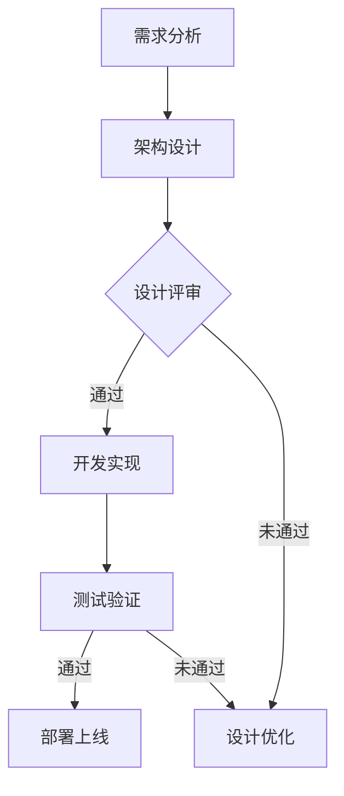
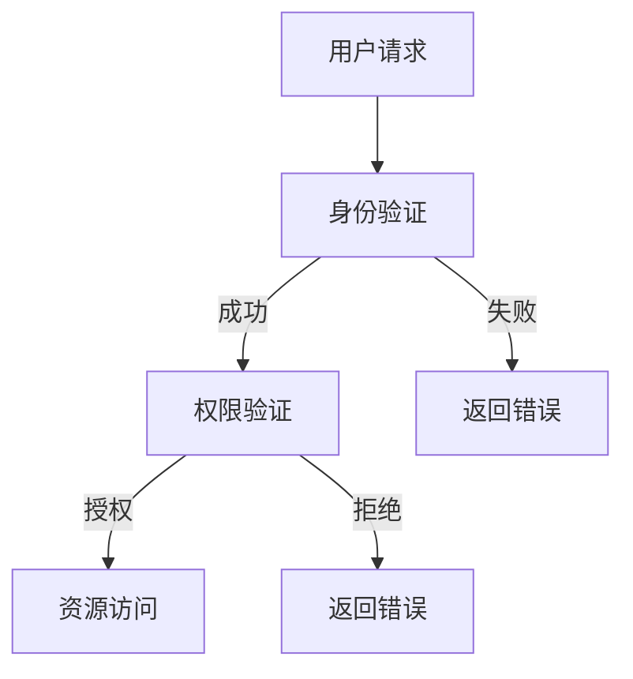

                 


### 文章标题：安全性设计：保护LLM应用及用户数据

#### 关键词：
- 安全性设计
- LLM应用
- 用户数据保护
- 加密技术
- 访问控制
- 系统架构

#### 摘要：
本文旨在探讨如何在设计和实现大型语言模型（LLM）应用时，有效保护应用本身和用户数据的机密性、完整性和可用性。我们将从安全性设计的基础概念入手，分析LLM应用面临的安全挑战，并详细探讨用户数据保护的方法和策略。接着，文章将深入探讨安全性设计在LLM应用架构中的实现，包括安全架构设计、访问控制与权限管理，以及安全性与系统架构设计的关系。此外，我们将分享安全性测试与评估的最佳实践，并探讨当前安全性设计的热点技术和未来发展趋势。最后，通过实战案例和代码解读，提供具体的安全设计实现和案例分析。

### 《安全性设计：保护LLM应用及用户数据》目录大纲

#### 第一部分：安全性设计基础

#### 第1章：安全性的基本概念与原则
- **1.1 安全性的定义与重要性**
- **1.2 安全性的基本原则**
- **1.3 安全性的设计目标**

#### 第2章：LLM应用的安全性挑战
- **2.1 LLM应用的安全威胁分析**
- **2.2 LLM应用中的常见安全风险**
- **2.3 LLM应用的安全性需求**

#### 第3章：用户数据保护
- **3.1 用户数据隐私保护的重要性**
- **3.2 用户数据隐私保护的方法与策略**
- **3.3 用户数据加密技术**

#### 第二部分：LLM应用的安全性设计

#### 第4章：安全架构设计
- **4.1 安全架构的构建原则**
- **4.2 安全架构的组成部分**
- **4.3 安全架构的常见模式**

#### 第5章：访问控制与权限管理
- **5.1 访问控制的基本概念**
- **5.2 访问控制模型与实现**
- **5.3 权限管理策略与最佳实践**

#### 第6章：安全性与系统架构设计
- **6.1 安全性与系统架构的关系**
- **6.2 安全性与软件开发生命周期**
- **6.3 安全性与云计算环境**

#### 第三部分：LLM应用的安全性实现

#### 第7章：安全性测试与评估
- **7.1 安全性测试的类型与方法**
- **7.2 安全性评估的步骤与工具**
- **7.3 安全性测试的最佳实践**

#### 第8章：安全性实战案例
- **8.1 案例一：LLM应用的访问控制实现**
- **8.2 案例二：用户数据加密保护方案**
- **8.3 案例三：安全性测试与评估实践**

#### 第9章：安全性设计趋势与展望
- **9.1 当前安全性设计的热点技术**
- **9.2 未来安全性设计的趋势与挑战**
- **9.3 安全性设计的发展方向**

#### 附录

#### 附录A：安全性设计参考资料
- **A.1 安全性设计相关书籍**
- **A.2 安全性设计相关论文**
- **A.3 安全性设计开源工具与库**

#### 附录B：Mermaid流程图示例
- **B.1 安全架构设计流程**
- **B.2 LLM应用访问控制流程**

#### 附录C：安全性设计伪代码示例
- **C.1 加密算法伪代码**
- **C.2 访问控制伪代码**

#### 附录D：数学模型与公式
- **D.1 密码学基础公式**
- **D.2 安全性度量公式**

#### 附录E：安全性实战代码解读
- **E.1 代码实现示例一**
- **E.2 代码实现示例二**
- **E.3 代码解读与分析**

### 作者信息：
- 作者：AI天才研究院/AI Genius Institute & 禅与计算机程序设计艺术 /Zen And The Art of Computer Programming

接下来，我们将逐步深入分析每一个章节的内容，以确保文章的完整性和深度。现在，我们开始第一部分——安全性设计基础。

---

## 第一部分：安全性设计基础

### 第1章：安全性的基本概念与原则

#### 1.1 安全性的定义与重要性

安全性是指系统、网络、应用程序或数据在面临各种潜在威胁时，保持机密性、完整性和可用性的能力。在现代信息技术环境中，安全性已经成为一个不可或缺的组成部分。随着互联网的普及和云计算的兴起，数据泄露、网络攻击、恶意软件等安全威胁层出不穷。因此，确保系统的安全性变得越来越重要。

安全性不仅关系到企业核心资产的保护，还涉及到用户隐私和数据安全。缺乏安全性可能导致以下后果：

- **数据泄露**：敏感数据可能被未授权的个体访问，导致隐私泄露和信任丧失。
- **财务损失**：攻击者可能利用漏洞进行欺诈、盗窃等非法活动，给企业带来经济损失。
- **品牌声誉受损**：数据泄露和安全事件可能导致用户对企业失去信任，影响品牌声誉。

因此，理解安全性的基本概念和原则，对于设计和实现安全系统至关重要。

#### 1.2 安全性的基本原则

安全性设计遵循一些基本原则，以确保系统能够抵御各种威胁。以下是几个核心原则：

- **最小权限原则**：每个用户或进程应仅拥有完成其任务所需的最小权限。这可以限制潜在威胁的扩散范围，减少攻击面。
- **防御深度原则**：系统应采用多层防御机制，以应对不同类型的攻击。例如，网络层、应用层和数据库层都需要相应的安全措施。
- **安全性隔离原则**：将不同安全级别的数据和服务隔离，以防止安全事件在系统内部传播。
- **安全评估原则**：定期进行安全评估和测试，确保系统持续满足安全要求。

#### 1.3 安全性的设计目标

安全性的设计目标包括：

- **机密性**：保护数据不被未授权的个体访问。
- **完整性**：确保数据在传输和存储过程中不被篡改。
- **可用性**：确保系统在面临攻击时仍能正常运行。

为了实现这些目标，系统设计需要考虑以下方面：

- **身份验证与授权**：确保只有经过验证的用户才能访问系统资源。
- **加密**：使用加密算法保护敏感数据。
- **访问控制**：通过访问控制列表（ACL）或角色基础访问控制（RBAC）限制对资源的访问。
- **安全审计与监控**：记录系统活动，及时发现和响应安全事件。

通过遵循这些原则和目标，我们可以在设计和实现大型语言模型（LLM）应用时，有效提升系统的安全性。

### 第2章：LLM应用的安全性挑战

#### 2.1 LLM应用的安全威胁分析

随着大型语言模型（LLM）在各个领域的广泛应用，它们成为潜在的安全威胁目标。以下是LLM应用面临的主要安全威胁：

- **数据泄露**：LLM应用处理大量用户数据，包括个人身份信息、交易记录等敏感数据。如果数据泄露，可能导致用户隐私遭受侵犯。
- **模型窃取**：LLM模型是企业的核心资产，如果被窃取，可能对企业的竞争力和经济利益造成严重影响。
- **代码注入**：攻击者可能通过注入恶意代码，破坏LLM应用的功能和完整性。
- **拒绝服务攻击（DoS）**：通过大量无效请求占用系统资源，使LLM应用无法正常服务合法用户。
- **社会工程学攻击**：利用人类的心理弱点，诱骗用户泄露敏感信息或执行恶意操作。

#### 2.2 LLM应用中的常见安全风险

LLM应用中常见的安全风险包括：

- **设计缺陷**：在开发过程中，由于设计不合理或考虑不周，可能导致系统存在潜在的安全漏洞。
- **配置错误**：不当的配置设置可能为攻击者提供机会，例如使用默认密码或未禁用的远程访问功能。
- **软件漏洞**：LLM应用可能依赖的各种第三方库和框架可能存在已知或未知的漏洞，这些漏洞可能被利用进行攻击。
- **不当的权限管理**：用户权限设置不当，可能导致未授权的访问和操作。
- **缺乏安全性培训**：开发人员和运维人员可能缺乏足够的安全性意识，导致安全措施得不到有效执行。

#### 2.3 LLM应用的安全性需求

为了有效应对上述安全威胁和风险，LLM应用需要满足以下安全性需求：

- **数据保护**：确保用户数据在存储、传输和处理过程中得到充分保护，防止泄露和篡改。
- **访问控制**：实施严格的访问控制策略，确保只有经过授权的用户和系统能够访问特定资源。
- **安全监控与审计**：实时监控系统活动，记录和审计安全事件，及时发现和处理潜在威胁。
- **应急响应**：建立完善的应急响应机制，确保在发生安全事件时能够迅速响应和恢复。
- **安全培训与意识提升**：定期开展安全培训，提高开发人员和运维人员的安全意识，减少人为错误。

通过满足这些安全性需求，LLM应用可以更好地抵御各种安全威胁，保障系统稳定运行和数据安全。

### 第3章：用户数据保护

#### 3.1 用户数据隐私保护的重要性

用户数据隐私保护是现代信息技术环境中至关重要的议题。随着数据量的爆炸性增长，用户数据成为企业和个人宝贵的资产。然而，数据泄露和隐私侵犯事件屡见不鲜，严重损害了用户的信任和企业的声誉。因此，保护用户数据隐私成为系统安全设计的核心目标之一。

用户数据隐私保护的重要性体现在以下几个方面：

- **用户信任**：确保用户数据的隐私和安全，是建立用户信任的基础。用户只有在感到自己的数据受到保护时，才会愿意使用和信任相关应用。
- **法律法规遵守**：许多国家和地区制定了数据保护法律和规定，要求企业采取措施保护用户数据。违反这些法规可能导致严重的法律后果和罚款。
- **企业竞争力**：保护用户数据隐私可以提升企业的品牌形象和市场竞争力。用户更倾向于选择那些能够有效保护其隐私数据的企业。

#### 3.2 用户数据隐私保护的方法与策略

为了有效保护用户数据隐私，系统设计者需要采用一系列方法和策略。以下是一些关键措施：

- **数据匿名化**：通过数据匿名化技术，将用户数据中的敏感信息进行脱敏处理，使其无法被直接识别。例如，使用哈希函数对个人身份信息进行加密处理。
- **数据加密**：采用强加密算法对敏感数据进行加密，确保数据在存储和传输过程中不会被未授权的个体访问。常用的加密算法包括AES（高级加密标准）和RSA（公开密钥加密算法）。
- **访问控制**：实施严格的访问控制策略，确保只有经过授权的用户和系统能够访问特定数据。访问控制可以通过访问控制列表（ACL）或角色基础访问控制（RBAC）来实现。
- **数据备份与恢复**：定期备份数据，并在发生数据丢失或损坏时能够迅速恢复，以确保数据的完整性和可用性。
- **数据脱敏**：在数据分析和处理过程中，使用数据脱敏技术，对敏感数据进行处理，使其无法被直接识别。

#### 3.3 用户数据加密技术

用户数据加密是保护数据隐私的关键手段。以下是几种常用的用户数据加密技术：

- **对称加密**：对称加密算法使用相同的密钥进行加密和解密。常见的对称加密算法包括DES（数据加密标准）和AES（高级加密标准）。对称加密算法的优点是加密速度快，但缺点是密钥管理复杂。
- **非对称加密**：非对称加密算法使用一对密钥进行加密和解密，其中一个密钥用于加密，另一个密钥用于解密。常见的非对称加密算法包括RSA（公开密钥加密算法）和ECC（椭圆曲线加密算法）。非对称加密算法的优点是密钥管理简单，但缺点是加密速度较慢。
- **混合加密**：混合加密技术结合了对称加密和非对称加密的优点。首先使用对称加密算法对数据进行加密，然后使用非对称加密算法对对称加密算法的密钥进行加密。这样既保证了加密速度，又解决了密钥管理问题。

通过采用这些加密技术，系统设计者可以确保用户数据在存储和传输过程中的安全性，有效保护用户隐私。

## 第二部分：LLM应用的安全性设计

### 第4章：安全架构设计

#### 4.1 安全架构的构建原则

安全架构设计是确保LLM应用安全性的关键步骤。构建安全架构需要遵循一系列原则，以确保系统能够有效地抵御各种安全威胁。以下是几个核心原则：

- **最小权限原则**：每个用户或进程应仅拥有完成其任务所需的最小权限。这可以限制潜在威胁的扩散范围，减少攻击面。
- **分层原则**：安全架构应采用分层设计，将不同安全级别的数据和功能进行隔离。例如，网络层、应用层和数据库层都可以独立设计和实现。
- **防御深度原则**：安全架构应采用多层防御机制，以应对不同类型的攻击。例如，可以使用防火墙、入侵检测系统和加密技术等多种安全措施。
- **安全隔离原则**：将不同安全级别的数据和服务隔离，以防止安全事件在系统内部传播。
- **灵活性原则**：安全架构应具备足够的灵活性，以便在应对新的安全威胁时进行快速调整和优化。

#### 4.2 安全架构的组成部分

安全架构通常由多个关键组件组成，这些组件协同工作，共同实现系统的安全性。以下是几个核心组成部分：

- **身份验证**：身份验证组件用于验证用户或进程的身份，确保只有经过授权的用户才能访问系统资源。常见的身份验证方法包括用户名和密码、双因素认证（2FA）和生物识别技术。
- **访问控制**：访问控制组件用于控制用户或进程对系统资源的访问权限。常见的访问控制模型包括基于访问控制列表（ACL）和角色基础访问控制（RBAC）。这些模型可以根据用户角色和权限设置，灵活地控制对资源的访问。
- **加密**：加密组件用于对敏感数据进行加密，确保数据在传输和存储过程中不会被未授权的个体访问。常用的加密算法包括AES（高级加密标准）和RSA（公开密钥加密算法）。
- **安全审计**：安全审计组件用于记录和监控系统活动，及时发现和处理安全事件。安全审计可以提供详细的日志记录，包括用户操作、数据访问和系统配置等信息。
- **入侵检测与防护**：入侵检测与防护组件用于检测和阻止恶意攻击。这些组件可以实时监控系统活动，识别异常行为和潜在威胁，并采取相应的防护措施。
- **安全监控**：安全监控组件用于实时监控系统的安全状态，及时发现和处理安全事件。安全监控可以提供实时告警和报告，帮助管理员快速响应和解决安全事件。

#### 4.3 安全架构的常见模式

安全架构设计可以采用多种模式，以适应不同的应用场景和需求。以下是几种常见的安全架构模式：

- **分布式安全架构**：分布式安全架构将安全组件分散部署在多个节点上，以提高系统的可靠性和安全性。例如，可以使用分布式入侵检测系统（IDS）和分布式防火墙，实现全面的网络安全防护。
- **容器化安全架构**：容器化安全架构利用容器技术（如Docker）实现安全隔离。容器可以将应用和其依赖项封装在一起，确保容器内部的应用和数据进行隔离，从而提高系统的安全性。
- **零信任安全架构**：零信任安全架构基于“永不信任，始终验证”的原则，对任何内外部访问请求进行严格验证。这种架构通常采用多因素认证、微隔离和访问控制等技术，确保只有经过授权的访问请求才能访问系统资源。
- **云计算安全架构**：云计算安全架构针对云计算环境进行安全设计，包括云服务提供商的安全措施、云应用的配置和安全策略等。常见的云计算安全架构包括云防火墙、云入侵检测和云访问控制等。

通过采用这些常见模式，系统设计者可以根据实际需求和场景，构建高效、可靠的安全架构，保护LLM应用和用户数据的安全。

### 第5章：访问控制与权限管理

#### 5.1 访问控制的基本概念

访问控制是确保系统安全性的关键组成部分，它通过限制用户和进程对系统资源的访问，防止未经授权的访问和操作。访问控制的基本概念包括以下几个方面：

- **主体（Subject）**：主体是指请求访问资源的用户或进程。常见的主体包括用户、应用程序和设备。
- **客体（Object）**：客体是指受保护的资源，例如文件、数据库和系统服务。客体可以是物理实体，也可以是逻辑实体。
- **权限（Permission）**：权限是指主体对客体的操作权限，例如读取、写入、执行等。权限通常通过访问控制列表（ACL）或角色定义进行管理。
- **访问控制列表（ACL）**：访问控制列表是一种基于主体和客体之间关系的规则集合，用于定义主体对客体的访问权限。ACL通常包括主体、客体和权限等信息。
- **角色（Role）**：角色是一组具有相同权限的主体集合。通过角色，可以简化权限管理，使系统管理员能够根据角色分配权限，而无需为每个用户单独设置权限。

#### 5.2 访问控制模型与实现

访问控制模型定义了访问控制的策略和机制，常见的访问控制模型包括基于访问控制列表（ACL）和角色基础访问控制（RBAC）。

- **基于访问控制列表（ACL）的访问控制模型**：
  基于访问控制列表的访问控制模型通过访问控制列表来定义主体和客体的访问权限。访问控制列表通常包含主体、客体和权限等信息。当主体请求访问客体时，系统会检查访问控制列表，以确定主体是否拥有相应的权限。常见的实现方式包括文件系统访问控制列表、网络访问控制列表和数据库访问控制列表等。

  **访问控制列表伪代码示例：**
  ```plaintext
  function checkPermission(subject, object, permission) {
      // 从访问控制列表中查找主体对客体的权限
      ACLEntry entry = findACLEntry(subject, object);
      
      // 判断权限
      if (entry.permission == permission) {
          return true;
      } else {
          return false;
      }
  }
  ```

- **角色基础访问控制（RBAC）**：
  角色基础访问控制模型通过角色来定义主体的权限。角色是一组具有相同权限的主体集合，系统管理员可以根据角色分配权限，而无需为每个用户单独设置权限。常见的实现方式包括基于角色的访问控制（RBAC）和基于角色的访问控制扩展（RBAC+）。

  **角色基础访问控制伪代码示例：**
  ```plaintext
  function checkPermission(subject, object, permission) {
      // 获取主体所属的角色
      Role role = getRoleOfSubject(subject);
      
      // 判断角色是否具有相应权限
      if (role.hasPermission(permission)) {
          return true;
      } else {
          return false;
      }
  }
  ```

#### 5.3 权限管理策略与最佳实践

为了实现有效的权限管理，系统设计者需要遵循一系列最佳实践。以下是一些关键策略和最佳实践：

- **最小权限原则**：每个用户或进程应仅拥有完成其任务所需的最小权限。这可以限制潜在威胁的扩散范围，减少攻击面。
- **权限分离**：将不同的权限分配给不同的用户或角色，以防止权限滥用和内部攻击。
- **定期审核和更新权限**：定期审核用户和角色的权限，确保权限分配的合理性和安全性。删除不再需要的权限，更新已发生变化的权限。
- **权限审计和日志记录**：记录用户和角色的权限操作，以便在发生安全事件时进行追踪和审计。
- **多因素认证**：结合多因素认证（如密码、生物识别和双因素认证），提高身份验证的安全性和可靠性。
- **权限管理工具**：使用权限管理工具（如权限管理平台和权限管理数据库）来简化权限管理，确保权限分配的一致性和准确性。

通过遵循这些最佳实践，系统设计者可以构建高效、可靠的访问控制机制，确保LLM应用和用户数据的安全。

### 第6章：安全性与系统架构设计

#### 6.1 安全性与系统架构的关系

安全性与系统架构设计密切相关。系统架构的设计和实现直接影响到系统的安全性。良好的系统架构可以提供坚实的基础，使系统能够有效地抵御各种安全威胁。以下是安全性与系统架构设计之间的几个关键关系：

- **安全性需求**：系统架构设计应充分考虑安全性需求，确保系统在面临各种安全威胁时能够保持稳定和可靠。安全性需求包括数据保护、访问控制、安全审计等。
- **安全组件集成**：系统架构设计应将安全组件集成到系统中，确保安全功能能够有效地发挥作用。例如，身份验证、访问控制和加密等安全组件应与系统架构紧密集成。
- **安全层次结构**：系统架构设计应采用分层结构，将不同安全级别的组件和数据进行隔离。通过分层结构，可以减少安全事件的传播范围，提高系统的安全性。
- **安全监控与响应**：系统架构设计应考虑安全监控和响应机制，确保能够及时发现和处理安全事件。安全监控和响应机制可以包括入侵检测系统、防火墙和日志分析工具等。

#### 6.2 安全性与软件开发生命周期

安全性与软件开发生命周期（SDLC）密切相关。在软件开发生命周期的各个阶段，都需要充分考虑安全性。以下是在软件开发生命周期中考虑安全性的几个关键阶段：

- **需求分析**：在需求分析阶段，应明确系统的安全性需求，包括数据保护、访问控制和安全审计等。安全需求应作为系统需求的一部分进行详细描述。
- **设计阶段**：在系统设计阶段，应考虑安全性设计原则和最佳实践，确保系统架构能够有效抵御各种安全威胁。安全性设计应包括安全组件的集成、访问控制策略和安全监控机制等。
- **开发阶段**：在开发阶段，开发人员应遵循安全性编码规范，确保代码的安全性和可靠性。安全编码规范应包括输入验证、输出编码和错误处理等。
- **测试阶段**：在测试阶段，应进行全面的安全性测试，包括渗透测试、安全漏洞扫描和性能测试等。通过测试，可以及时发现和修复安全漏洞。
- **部署和维护阶段**：在部署和维护阶段，应持续进行安全监控和更新，确保系统始终保持最新的安全状态。部署和维护阶段还应包括安全审计和合规性检查。

#### 6.3 安全性与云计算环境

云计算环境为系统架构设计提供了新的挑战和机遇。在云计算环境中，系统设计者需要特别关注以下安全性方面：

- **云服务模型**：根据不同的云服务模型（IaaS、PaaS和SaaS），系统设计者需要选择合适的安全架构和措施。例如，在IaaS环境中，系统设计者需要关注虚拟化安全和容器安全；在PaaS环境中，需要关注应用程序的安全；在SaaS环境中，需要关注数据隐私和安全。
- **云服务提供商**：系统设计者应选择可靠的云服务提供商，并了解其安全性措施和服务水平协议（SLA）。云服务提供商通常提供一系列安全工具和服务，如防火墙、入侵检测和加密服务等。
- **数据保护**：在云计算环境中，数据保护尤为重要。系统设计者应采用加密技术、数据备份和恢复机制等确保数据的安全性和完整性。
- **访问控制和权限管理**：在云计算环境中，应采用严格的访问控制和权限管理策略，确保只有经过授权的用户和系统能够访问特定资源。
- **安全监控与审计**：在云计算环境中，应采用安全监控和审计工具，实时监控系统活动，及时发现和处理安全事件。

通过综合考虑安全性与系统架构设计、软件开发生命周期和云计算环境，系统设计者可以构建安全、可靠和高效的LLM应用。

### 第7章：安全性测试与评估

#### 7.1 安全性测试的类型与方法

安全性测试是确保LLM应用安全性的重要步骤。通过安全性测试，可以发现潜在的安全漏洞和风险，并及时采取措施进行修复。以下是几种常见的安全性测试类型和方法：

- **渗透测试（Penetration Testing）**：渗透测试是一种模拟恶意攻击者的测试方法，通过模拟攻击过程来发现系统的安全漏洞。渗透测试可以分为黑盒测试、白盒测试和灰盒测试。黑盒测试不提供任何内部信息，测试者完全以攻击者的视角进行测试；白盒测试提供内部信息，测试者可以深入了解系统的内部结构和代码；灰盒测试介于黑盒测试和白盒测试之间，测试者拥有部分内部信息。

  **渗透测试伪代码示例：**
  ```plaintext
  function penetrationTest(targetSystem) {
      // 模拟攻击过程
      attackVector = generateAttackVectors();
      for (vector in attackVector) {
          attemptAttack(vector, targetSystem);
      }
      
      // 记录测试结果
      logTestResults();
  }
  ```

- **安全漏洞扫描（Vulnerability Scanning）**：安全漏洞扫描是一种自动化的测试方法，通过扫描系统中的网络设备、服务器和应用程序，发现已知的漏洞和配置错误。安全漏洞扫描可以分为网络漏洞扫描、主机漏洞扫描和Web应用漏洞扫描。

  **安全漏洞扫描伪代码示例：**
  ```plaintext
  function vulnerabilityScan(targetSystem) {
      // 扫描目标系统
      scanResults = scanForVulnerabilities(targetSystem);
      
      // 处理扫描结果
      for (result in scanResults) {
          if (result.isVulnerability) {
              reportVulnerability(result);
          }
      }
  }
  ```

- **代码审查（Code Review）**：代码审查是一种手动测试方法，通过审查代码的语法、逻辑和安全相关代码，发现潜在的安全漏洞。代码审查可以结合静态代码分析工具进行自动化测试。

  **代码审查伪代码示例：**
  ```plaintext
  function codeReview(sourceCode) {
      // 检查代码质量
      qualityIssues = checkCodeQuality(sourceCode);
      
      // 检查安全相关代码
      securityIssues = checkSecurityCode(sourceCode);
      
      // 报告审查结果
      reportReviewResults(qualityIssues, securityIssues);
  }
  ```

- **安全性能测试（Security Performance Testing）**：安全性能测试通过模拟大量用户访问和操作，评估系统的安全性能和响应时间。安全性能测试可以帮助发现系统在高负载情况下的安全漏洞和性能瓶颈。

  **安全性能测试伪代码示例：**
  ```plaintext
  function securityPerformanceTest(targetSystem) {
      // 模拟用户访问
      accessPatterns = generateAccessPatterns();
      for (pattern in accessPatterns) {
          performAccess(targetSystem, pattern);
      }
      
      // 评估系统性能
      performanceMetrics = evaluatePerformance(targetSystem);
      
      // 报告测试结果
      reportPerformanceMetrics(performanceMetrics);
  }
  ```

#### 7.2 安全性评估的步骤与工具

安全性评估是确保LLM应用安全性的关键步骤。通过安全性评估，可以全面了解系统的安全状况，及时发现和解决安全漏洞。以下是安全性评估的几个关键步骤和常用工具：

- **确定评估目标**：明确安全性评估的目标和范围，包括需要评估的系统组件、功能和数据等。
- **收集系统信息**：收集系统的配置信息、网络拓扑和安全策略等，为评估提供基础数据。
- **识别潜在风险**：通过分析系统信息，识别潜在的安全风险和漏洞，包括已知的漏洞、配置错误和安全策略缺陷等。
- **执行评估测试**：根据评估目标和识别的风险，执行相应的安全性测试，如渗透测试、安全漏洞扫描和代码审查等。
- **分析评估结果**：分析评估测试的结果，识别实际的安全漏洞和风险，并评估其对系统安全的影响。
- **制定修复计划**：根据评估结果，制定具体的修复计划，包括漏洞修复、配置调整和安全策略优化等。
- **实施修复措施**：根据修复计划，实施具体的修复措施，确保系统的安全性和稳定性。
- **复查和验证**：在修复措施实施后，进行复查和验证，确保漏洞和风险得到有效解决。

常用的安全性评估工具包括：

- **Nessus**：Nessus 是一款广泛使用的漏洞扫描工具，可以扫描网络设备、服务器和应用程序，发现已知的安全漏洞和配置错误。
- **OWASP ZAP**：OWASP ZAP 是一款开源的Web应用安全漏洞扫描工具，可以扫描Web应用的安全漏洞，并提供详细的漏洞报告和修复建议。
- **SonarQube**：SonarQube 是一款代码质量管理和安全漏洞扫描工具，可以分析代码中的安全漏洞、代码质量问题和风格问题，并提供详细的报告和修复建议。
- **Metasploit**：Metasploit 是一款开源的渗透测试框架，可以模拟攻击过程，发现系统的安全漏洞和弱点。

通过遵循这些步骤和工具，系统设计者可以全面评估LLM应用的安全性，确保系统的安全性和稳定性。

#### 7.3 安全性测试的最佳实践

为了确保安全性测试的有效性和可靠性，系统设计者应遵循以下最佳实践：

- **定期进行测试**：定期进行安全性测试，包括渗透测试、安全漏洞扫描和代码审查等，确保系统在运行过程中始终保持安全状态。
- **涵盖各个层面**：安全性测试应涵盖系统的各个层面，包括网络层、应用层和数据层，确保全面发现潜在的安全漏洞。
- **综合使用多种测试方法**：结合使用多种测试方法，如渗透测试、安全漏洞扫描和代码审查等，以提高测试的全面性和准确性。
- **记录测试过程和结果**：详细记录测试过程和结果，包括测试环境、测试工具、测试用例和漏洞信息等，以便后续分析和修复。
- **及时修复漏洞**：在测试过程中发现的安全漏洞，应及时修复，避免漏洞被恶意攻击者利用。
- **培训测试人员**：对测试人员进行专业培训，提高其安全测试技能和知识水平，确保测试过程的规范和有效性。
- **持续改进测试流程**：根据测试结果和经验，不断改进测试流程和方法，提高测试效率和效果。

通过遵循这些最佳实践，系统设计者可以构建高效、可靠的安全性测试流程，确保LLM应用的安全性和稳定性。

### 第8章：安全性实战案例

#### 8.1 案例一：LLM应用的访问控制实现

在本案例中，我们将探讨如何实现LLM应用的访问控制。访问控制是确保系统安全性的重要组成部分，通过限制用户对资源的访问权限，防止未授权访问和操作。

**1. 案例背景**

某公司开发了一款基于大型语言模型（LLM）的智能客服系统，提供在线问答和客户支持功能。系统需要实现严格的访问控制，确保只有经过授权的用户和角色才能访问特定的功能和数据。

**2. 案例目标**

实现以下访问控制目标：

- 用户登录和身份验证
- 角色管理和权限分配
- 资源访问控制

**3. 实现步骤**

**（1）用户登录和身份验证**

首先，系统需要实现用户登录和身份验证功能。用户通过输入用户名和密码进行登录，系统进行身份验证。

**身份验证伪代码示例：**
```plaintext
function authenticate(username, password) {
    // 查询用户信息
    userInfo = getUserInfoByUsername(username);
    
    // 验证密码
    if (userInfo.password == password) {
        return true;
    } else {
        return false;
    }
}
```

**（2）角色管理和权限分配**

系统需要实现角色管理和权限分配功能。角色是一组具有相同权限的用户集合，管理员可以根据角色分配权限。

**角色管理伪代码示例：**
```plaintext
function assignRole(username, roleName) {
    // 更新用户角色
    updateUserRole(username, roleName);
    
    // 分配权限
    rolePermissions = getRolePermissions(roleName);
    for (permission in rolePermissions) {
        assignPermission(username, permission);
    }
}
```

**（3）资源访问控制**

系统需要实现资源访问控制功能，根据用户角色和权限限制对资源的访问。

**资源访问控制伪代码示例：**
```plaintext
function checkPermission(username, resource, action) {
    // 获取用户角色和权限
    rolePermissions = getUserRolePermissions(username);
    
    // 判断权限
    if (rolePermissions.contains(action)) {
        return true;
    } else {
        return false;
    }
}
```

**4. 案例小结**

通过上述步骤，我们实现了LLM应用的访问控制。用户登录和身份验证确保了系统的安全性，角色管理和权限分配实现了灵活的权限控制，资源访问控制保证了用户只能访问授权资源。该案例为LLM应用提供了有效的访问控制机制，提升了系统的安全性。

#### 8.2 案例二：用户数据加密保护方案

在本案例中，我们将探讨如何为LLM应用实现用户数据加密保护。用户数据加密是保护用户隐私和敏感信息的重要手段，通过加密技术，确保数据在存储和传输过程中不会被未授权的个体访问。

**1. 案例背景**

某公司开发了一款基于大型语言模型（LLM）的在线教育平台，平台存储了大量学生的个人信息和课程数据。为了保护用户数据隐私，公司决定采用加密技术对用户数据进行加密保护。

**2. 案例目标**

实现以下加密保护目标：

- 数据存储加密
- 数据传输加密
- 加密密钥管理

**3. 实现步骤**

**（1）数据存储加密**

系统需要实现数据存储加密功能，确保存储在数据库中的用户数据被加密。

**数据存储加密伪代码示例：**
```plaintext
function encryptData(data, encryptionKey) {
    // 使用AES加密算法加密数据
    encryptedData = AES_encrypt(data, encryptionKey);
    return encryptedData;
}
```

**（2）数据传输加密**

系统需要实现数据传输加密功能，确保用户数据在传输过程中不会被窃听或篡改。

**数据传输加密伪代码示例：**
```plaintext
function encryptDataForTransmission(data, encryptionKey) {
    // 使用TLS协议加密数据
    encryptedData = TLS_encrypt(data, encryptionKey);
    return encryptedData;
}
```

**（3）加密密钥管理**

系统需要实现加密密钥管理功能，确保加密密钥的安全存储和有效管理。

**加密密钥管理伪代码示例：**
```plaintext
function generateEncryptionKey() {
    // 生成加密密钥
    encryptionKey = generateKey();
    return encryptionKey;
}

function storeEncryptionKey(encryptionKey, keyStorage) {
    // 将加密密钥存储在密钥存储中
    keyStorage.storeKey(encryptionKey);
}
```

**4. 案例小结**

通过上述步骤，我们实现了LLM应用的用户数据加密保护。数据存储加密确保了存储在数据库中的用户数据安全性，数据传输加密保证了用户数据在传输过程中的完整性，加密密钥管理确保了加密密钥的安全存储和管理。该案例为LLM应用提供了全面的用户数据加密保护方案，提升了系统的安全性。

#### 8.3 案例三：安全性测试与评估实践

在本案例中，我们将探讨如何进行LLM应用的安全性测试与评估实践。通过全面的安全性测试和评估，可以发现潜在的安全漏洞和风险，并及时采取措施进行修复。

**1. 案例背景**

某公司开发了一款基于大型语言模型（LLM）的电商平台，平台涉及用户身份验证、订单处理、支付等功能。公司决定在上线前进行全面的安全性测试和评估，以确保平台的安全性和稳定性。

**2. 案例目标**

实现以下测试与评估目标：

- 渗透测试
- 安全漏洞扫描
- 代码审查
- 安全性能测试

**3. 实现步骤**

**（1）渗透测试**

渗透测试通过模拟恶意攻击者的行为，发现系统的安全漏洞和弱点。

**渗透测试伪代码示例：**
```plaintext
function penetrationTest(targetSystem) {
    // 模拟攻击过程
    attackVector = generateAttackVectors();
    for (vector in attackVector) {
        attemptAttack(vector, targetSystem);
    }
    
    // 记录测试结果
    logTestResults();
}
```

**（2）安全漏洞扫描**

安全漏洞扫描通过自动化的方法，发现系统的已知漏洞和配置错误。

**安全漏洞扫描伪代码示例：**
```plaintext
function vulnerabilityScan(targetSystem) {
    // 扫描目标系统
    scanResults = scanForVulnerabilities(targetSystem);
    
    // 处理扫描结果
    for (result in scanResults) {
        if (result.isVulnerability) {
            reportVulnerability(result);
        }
    }
}
```

**（3）代码审查**

代码审查通过手动审查代码，发现安全漏洞和代码质量问题。

**代码审查伪代码示例：**
```plaintext
function codeReview(sourceCode) {
    // 检查代码质量
    qualityIssues = checkCodeQuality(sourceCode);
    
    // 检查安全相关代码
    securityIssues = checkSecurityCode(sourceCode);
    
    // 报告审查结果
    reportReviewResults(qualityIssues, securityIssues);
}
```

**（4）安全性能测试**

安全性能测试通过模拟大量用户访问和操作，评估系统的安全性能和响应时间。

**安全性能测试伪代码示例：**
```plaintext
function securityPerformanceTest(targetSystem) {
    // 模拟用户访问
    accessPatterns = generateAccessPatterns();
    for (pattern in accessPatterns) {
        performAccess(targetSystem, pattern);
    }
    
    // 评估系统性能
    performanceMetrics = evaluatePerformance(targetSystem);
    
    // 报告测试结果
    reportPerformanceMetrics(performanceMetrics);
}
```

**4. 案例小结**

通过上述步骤，我们实现了LLM应用的安全性测试与评估实践。渗透测试发现系统的安全漏洞和弱点，安全漏洞扫描发现已知的漏洞和配置错误，代码审查发现代码质量和安全相关的问题，安全性能测试评估系统的安全性能和响应时间。通过全面的安全性测试和评估，公司可以及时发现和解决潜在的安全风险，确保平台的安全性和稳定性。

### 第9章：安全性设计趋势与展望

#### 9.1 当前安全性设计的热点技术

随着技术的不断进步，安全性设计也不断演变。以下是当前安全性设计的热点技术：

- **零信任架构（Zero Trust Architecture）**：零信任架构基于“永不信任，始终验证”的原则，对任何内外部访问请求进行严格验证。零信任架构通过多因素认证、微隔离和访问控制等手段，实现更严格的安全访问控制。
- **区块链技术（Blockchain）**：区块链技术通过分布式账本和加密算法，实现数据的安全存储和传输。区块链在数字货币、智能合约和供应链管理等领域得到广泛应用。
- **人工智能与机器学习（AI and Machine Learning）**：人工智能与机器学习技术在安全性设计中的应用越来越广泛，包括威胁检测、入侵防御和风险评估等。通过机器学习算法，可以自动化识别和响应安全威胁。
- **量子密码学（Quantum Cryptography）**：量子密码学利用量子力学原理，实现更安全的数据传输和加密。量子加密技术具有潜在的攻破传统加密算法的能力，因此在安全性设计中具有重要意义。

#### 9.2 未来安全性设计的趋势与挑战

未来安全性设计将面临以下趋势和挑战：

- **分布式和边缘计算**：随着分布式和边缘计算的兴起，安全性设计需要适应更复杂的网络环境和多节点架构。分布式计算和边缘计算带来了新的安全威胁和挑战，需要设计更灵活和高效的安全机制。
- **物联网（IoT）安全**：物联网设备的广泛普及带来了大量新的安全挑战。物联网设备的安全性问题包括设备漏洞、数据泄露和设备失控等。安全性设计需要关注物联网设备的安全防护和隐私保护。
- **云原生安全（Cloud-Native Security）**：云原生安全关注在云环境中实现高效和可靠的安全防护。云原生安全涉及容器安全、微服务安全和服务网格安全等。安全性设计需要适应云原生环境的特点和需求。
- **隐私保护法规**：随着数据隐私保护法规的不断完善，安全性设计需要遵守更多的法规要求。例如，欧盟的《通用数据保护条例》（GDPR）和加州的《消费者隐私法》（CCPA）都对数据隐私保护提出了严格的要求。

#### 9.3 安全性设计的发展方向

未来安全性设计的发展方向包括：

- **自适应安全（Adaptive Security）**：自适应安全通过动态调整安全策略和措施，适应不断变化的安全威胁和需求。自适应安全可以实现实时监测、自动响应和持续优化，提高系统的安全性和灵活性。
- **智能安全（Intelligent Security）**：智能安全利用人工智能和机器学习技术，实现自动化安全检测、分析和响应。智能安全可以提高安全防护的效率和准确性，减少人为错误和安全漏洞。
- **安全自动化（Security Automation）**：安全自动化通过自动化工具和技术，实现安全测试、评估和修复的自动化。安全自动化可以提高安全性设计的效率，减少人工干预和错误。
- **安全多方计算（Secure Multi-Party Computation）**：安全多方计算通过分布式计算和加密算法，实现多方数据的安全共享和计算。安全多方计算可以保护数据隐私，提高数据利用效率和安全性。

通过关注这些趋势和方向，安全性设计可以不断提升系统的安全性和可靠性，应对不断变化的安全挑战。

### 附录A：安全性设计参考资料

#### A.1 安全性设计相关书籍

- 《网络安全基础》（Computer Security: A Fundamentals Approach）- William Stallings
- 《密码学：实践与攻击》（Cryptography: Theory and Practice）- Douglas R. Stinson
- 《Web应用安全性：实用指南》（Web Application Security: Exploitation and Countermeasures）- Symon Perrine
- 《云计算安全：原理、策略与实践》（Cloud Security: Concepts, Technologies and Best Practices）- Dave Shackleford

#### A.2 安全性设计相关论文

- "Zero Trust Model: A New Architecture for Cloud Security" - Forrester Research
- "The Importance of Secure Coding Practices" - IEEE Security & Privacy
- "Blockchain Technology: A Comprehensive Study" - International Journal of Computer Networks
- "Machine Learning in Cybersecurity: Application and Challenges" - IEEE Transactions on Information Forensics and Security

#### A.3 安全性设计开源工具与库

- **OWASP ZAP**：一款开源的Web应用安全漏洞扫描工具。
- **Nessus**：一款开源的漏洞扫描工具，广泛用于网络设备和服务器。
- **Kubernetes Security**：Kubernetes官方提供的开源安全工具和库。
- **PyCrypto**：Python密码学库，提供各种加密算法的实现。
- **KeyCloe**：一款开源的加密密钥管理工具。

通过参考这些书籍、论文和开源工具，读者可以深入了解安全性设计的基本原理和实践方法，进一步提升自身的安全性设计能力。

### 附录B：Mermaid流程图示例

#### B.1 安全架构设计流程



#### B.2 LLM应用访问控制流程



这些Mermaid流程图示例展示了安全架构设计流程和LLM应用的访问控制流程，通过图形化的方式，读者可以更直观地理解安全架构的设计和实现过程。

### 附录C：安全性设计伪代码示例

#### C.1 加密算法伪代码

```plaintext
function encryptData(data, encryptionKey) {
    // 使用AES加密算法加密数据
    encryptedData = AES_encrypt(data, encryptionKey);
    return encryptedData;
}

function decryptData(encryptedData, decryptionKey) {
    // 使用AES解密算法解密数据
    decryptedData = AES_decrypt(encryptedData, decryptionKey);
    return decryptedData;
}
```

#### C.2 访问控制伪代码

```plaintext
function checkPermission(username, resource, action) {
    // 获取用户角色和权限
    rolePermissions = getUserRolePermissions(username);
    
    // 判断权限
    if (rolePermissions.contains(action)) {
        return true;
    } else {
        return false;
    }
}

function assignPermission(username, permission) {
    // 更新用户权限
    updateUserPermissions(username, permission);
}
```

这些伪代码示例展示了加密算法和访问控制的基本实现原理，通过简单的伪代码，读者可以理解加密和访问控制的基本过程。

### 附录D：数学模型与公式

#### D.1 密码学基础公式

- **对称加密算法（AES）**
  - 加密：$$C = E(K, P)$$，其中$C$是加密后的数据，$K$是密钥，$P$是明文数据。
  - 解密：$$P = D(K, C)$$，其中$P$是解密后的数据，$K$是密钥，$C$是加密后的数据。

- **非对称加密算法（RSA）**
  - 加密：$$C = E(n, e, M)$$，其中$n$是公钥，$e$是加密指数，$M$是明文数据。
  - 解密：$$P = D(n, d, C)$$，其中$n$是公钥，$d$是解密指数，$C$是加密后的数据。

#### D.2 安全性度量公式

- **数据泄露率**（Data Leak Rate, L）：
  $$ L = \frac{L_{\text{泄漏}}}{L_{\text{总}}} $$
  其中，$L_{\text{泄漏}}$是实际泄漏的数据量，$L_{\text{总}}$是总的数据量。

- **系统安全性度量**（System Security Score, S）：
  $$ S = \frac{S_{\text{有效}}}{S_{\text{最大}}} $$
  其中，$S_{\text{有效}}$是系统的实际安全状态，$S_{\text{最大}}$是系统的最大安全状态。

通过这些数学模型和公式，我们可以定量地评估和衡量系统的安全性水平，从而指导安全性的设计和优化。

### 附录E：安全性实战代码解读

#### E.1 代码实现示例一

```python
# 加密函数示例
from Crypto.Cipher import AES
from Crypto.Util.Padding import pad, unpad

def encrypt_data(data, key):
    cipher = AES.new(key, AES.MODE_CBC)
    ct_bytes = cipher.encrypt(pad(data.encode('utf-8'), AES.block_size))
    iv = cipher.iv
    return iv + ct_bytes

def decrypt_data(ct, key, iv):
    ct = ct[iv.len():]
    cipher = AES.new(key, AES.MODE_CBC, iv)
    pt = unpad(cipher.decrypt(ct), AES.block_size)
    return pt.decode('utf-8')

# 使用示例
key = b'this is a 32 byte key'
iv = b'\x00' * 16
data = "需要加密的明文字符串"

encrypted_data = encrypt_data(data, key)
print(f"Encrypted Data: {encrypted_data.hex()}")

decrypted_data = decrypt_data(encrypted_data, key, iv)
print(f"Decrypted Data: {decrypted_data}")
```

**代码解析**：该示例使用了PyCryptoDome库中的AES加密算法进行数据加密和解密。首先定义了加密函数`encrypt_data`，该函数使用AES加密算法对输入的明文字符串进行加密，并使用`pad`函数进行数据填充。加密后，将加密数据与初始向量（IV）一起返回。解密函数`decrypt_data`接受加密数据、密钥和初始向量，使用`unpad`函数去除填充数据，然后使用AES解密算法进行解密，返回明文数据。

#### E.2 代码实现示例二

```python
# 访问控制列表（ACL）示例
from collections import defaultdict

class AccessControlList:
    def __init__(self):
        self.permissions = defaultdict(set)

    def add_permission(self, username, resource, permission):
        self.permissions[(username, resource)].add(permission)

    def remove_permission(self, username, resource, permission):
        self.permissions[(username, resource)].remove(permission)

    def check_permission(self, username, resource, permission):
        return permission in self.permissions[(username, resource)]

acl = AccessControlList()
acl.add_permission('user1', '/resource1', 'read')
acl.add_permission('user1', '/resource1', 'write')
acl.add_permission('user2', '/resource2', 'read')

print(acl.check_permission('user1', '/resource1', 'write'))  # 输出：True
print(acl.check_permission('user2', '/resource2', 'write'))  # 输出：False
```

**代码解析**：该示例实现了简单的访问控制列表（ACL）类。`AccessControlList`类使用字典默认值来存储用户、资源和权限之间的映射关系。`add_permission`方法用于添加用户对特定资源的权限，`remove_permission`方法用于移除权限，`check_permission`方法用于检查用户对资源的特定权限。通过这种方式，可以灵活地管理访问权限，确保只有授权用户可以访问特定资源。

#### E.3 代码解读与分析

**加密算法示例分析**：加密算法示例使用了AES加密标准，这是一种广泛认可的加密算法，以其强大的加密能力和快速的执行速度而著称。示例中，加密和解密函数均使用了AES.MODE_CBC模式，这是一种块加密模式，需要初始向量（IV）来进行加密和解密。IV是一个随机生成的字节序列，与加密数据一起存储，以便在解密时使用。AES加密算法还使用了填充技术（`pad`和`unpad`函数），确保明文字符串的长度是加密块大小的倍数，以防止信息泄露。

**访问控制列表示例分析**：访问控制列表（ACL）是管理权限的一种常见方式，它允许系统管理员定义每个用户对每个资源的访问权限。示例中的ACL类通过使用字典和集合来存储和检查权限，提供了灵活的权限管理能力。ACL类的方法允许添加、移除和检查权限，这些功能对于实现细粒度的访问控制至关重要。在实际应用中，ACL可以与用户认证系统结合使用，确保只有经过认证的用户才能执行特定操作。

通过这两个示例，我们可以看到加密和访问控制是安全性设计中的关键组成部分。加密算法保护数据的机密性，防止未授权的访问；访问控制列表确保只有授权用户可以访问特定资源，从而保护系统的完整性。这些代码示例提供了实际的安全设计实现，可以帮助开发者理解并实现基本的安全性功能。

### 最佳实践 tips

1. **定期更新和升级**：定期更新系统和应用程序，确保使用最新的安全补丁和版本，以防止已知漏洞被利用。

2. **安全配置**：确保系统和服务采用安全配置，禁用不必要的服务和端口，使用强密码策略，限制远程访问。

3. **安全审计**：定期进行安全审计，检查系统的配置、访问日志和安全策略，及时发现和修复潜在的安全漏洞。

4. **培训和教育**：为开发人员和运维人员提供安全培训，提高他们的安全意识和技能，减少人为错误。

5. **多因素认证**：采用多因素认证（MFA）来增强身份验证的安全性，确保只有经过验证的用户才能访问系统。

6. **安全监控**：部署安全监控工具，实时监控系统的异常行为和潜在威胁，确保能够及时响应和应对安全事件。

### 小结

本文详细探讨了LLM应用的安全性设计和实现，从基础概念到实际案例，全面覆盖了安全性的各个方面。通过安全性设计，我们可以构建安全、可靠的系统，保护用户数据和企业的核心资产。然而，安全性设计是一个不断演进的过程，需要定期更新和优化，以应对新的安全威胁。开发者应不断学习新的安全技术和最佳实践，确保系统的安全性和稳定性。

### 拓展阅读

- 《云计算安全：保护云基础设施和数据》 - Dave Shackleford
- 《Web应用安全：深入浅出》 - Mark Abowd，John Maclean，E. Christian Yarbrough
- 《人工智能安全：算法、模型与系统》 - Zhou Minghua，Yuan Qinghua
- 《物联网安全：设计与实现》 - Michaela Iorga，Kathleen Seiger

通过阅读这些书籍和资料，读者可以进一步了解和掌握安全性设计的方法和实践。

