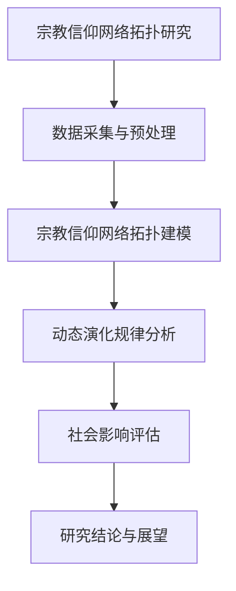

                 

### 第1章 引言

#### 1.1 书籍背景与目的

《宗教信仰的网络拓扑：信念系统的数学结构》旨在探索宗教信仰这一复杂社会现象的数学本质，通过引入网络拓扑学这一工具，揭示宗教信仰体系中各元素之间的相互关系及其动态演化过程。宗教信仰作为一种社会文化现象，深深植根于人类的思维和行为模式中，影响着个体乃至整个社会的价值观、道德观和生活方式。然而，长期以来，关于宗教信仰的研究往往局限于历史、文化、社会学等领域，缺乏一种更为系统和科学的量化分析方法。

本文的目的在于填补这一空白，将网络拓扑学这一现代数学工具应用于宗教信仰的研究，构建一种全新的理论框架，以揭示宗教信仰体系的内在结构和演化规律。通过这种跨学科的研究方法，我们希望能够为理解宗教信仰的本质提供新的视角，并为相关领域的研究提供有力的理论支持。

#### 1.2 研究现状与挑战

目前，宗教信仰的研究已经取得了丰富的成果，涵盖了历史、文化、社会学、心理学等多个方面。然而，在量化分析方面，仍然存在诸多挑战。传统的研究方法多依赖于定性的描述和分析，难以精确刻画宗教信仰体系的复杂结构及其动态变化。例如，在宗教传播、信仰变迁、教派竞争等方面，缺乏有效的量化模型来描述和解释这些现象。

此外，现有的研究多集中于单一宗教或特定文化背景下的信仰体系，缺乏对全球宗教信仰网络的整体理解和分析。这导致我们对宗教信仰的普遍规律和普遍机制的认识仍然有限。因此，构建一种能够全面、系统描述宗教信仰体系的数学模型，成为当前研究的重要任务。

本文的研究将尝试克服上述挑战，通过引入网络拓扑学这一工具，将宗教信仰体系视为一个复杂的网络结构，分析其拓扑特性、动态演化规律及其对社会的影响。这不仅有助于深化我们对宗教信仰本质的理解，也为跨学科研究提供了一种新的思路和方法。

#### 1.3 主要内容概述

本文将从以下几方面展开研究：

1. **宗教信仰概述**：介绍宗教信仰的基本概念、历史背景和发展现状，为后续的数学模型构建提供基础。
2. **网络拓扑基础**：阐述网络拓扑学的基本概念和理论，为宗教信仰网络的构建提供数学工具。
3. **宗教信仰与网络拓扑的联系**：探讨宗教信仰体系与网络拓扑之间的内在联系，构建宗教信仰的网络拓扑模型。
4. **信念系统的数学结构**：介绍信念系统的定义与特点，分析其在数学结构中的应用，为量化宗教信仰提供理论基础。
5. **宗教信仰网络拓扑的动态演化**：研究宗教信仰网络的动态演化规律，分析其稳定性与演化机制。
6. **宗教信仰网络拓扑的社会影响**：探讨宗教信仰网络对社会的影响，分析其对社会稳定与发展的作用。
7. **研究方法与展望**：总结本文的主要研究成果，讨论当前研究的不足与挑战，提出未来研究的方向和建议。

通过上述内容，本文旨在为宗教信仰研究提供一种新的理论框架和分析方法，推动该领域的深入和发展。

#### 1.4 研究意义

本文的研究具有重要的理论意义和实践价值。首先，在理论层面，通过将宗教信仰体系与网络拓扑学相结合，本文提出了一种全新的研究方法，为理解宗教信仰的复杂结构提供了新的视角。这一方法不仅能够帮助研究者更精确地量化宗教信仰体系中的各种关系，还能够揭示其内在的演化规律，从而深化对宗教信仰本质的认识。

其次，在实践层面，本文的研究成果对于宗教研究、社会学研究、宗教政策制定等领域具有重要的指导意义。通过构建宗教信仰的网络拓扑模型，我们可以更好地理解不同宗教之间的相互影响和竞争，预测宗教信仰的未来发展趋势。这对于制定有效的宗教政策和促进宗教和谐具有重要意义。此外，本文的研究也为跨学科合作提供了新的思路，促进了数学、计算机科学、社会学等领域的交叉融合。

总之，本文的研究不仅有助于丰富宗教信仰研究的理论体系，还能够为实际应用提供有力支持，具有重要的学术价值和社会意义。

### 第2章 宗教信仰与网络拓扑基础

#### 2.1 宗教信仰概述

宗教信仰是人类社会文化的重要组成部分，它不仅影响着个体的心理和生活方式，还深刻塑造了社会的价值观和道德规范。宗教信仰通常涉及对超自然力量、神圣存在或神秘力量的信仰，以及对某种教义、仪式和信仰实践的遵从。

宗教信仰的历史可以追溯到古代文明，如古埃及、古希腊和古印度等。随着时间的推移，各种宗教信仰在世界各地逐渐发展壮大，形成了多元宗教并存的局面。目前，全球主要的宗教信仰包括基督教、伊斯兰教、佛教、印度教、犹太教等，每种宗教都有其独特的教义、仪式和组织形式。

宗教信仰的多样性不仅体现在不同宗教之间的差异上，还体现在同一宗教内部的不同流派和教派中。例如，基督教内部有天主教、东正教和新教等不同分支；佛教则有汉传佛教、藏传佛教和南传佛教等。这些不同的宗教信仰体系和流派共同构成了一个复杂而多样的宗教文化生态。

#### 2.2 网络拓扑基础

网络拓扑学是数学的一个分支，主要研究网络结构及其性质。在计算机科学、通信工程、社会学等领域都有广泛的应用。网络拓扑学的基本概念包括节点、边、路径、连通性等。

- **节点（Node）**：网络中的基本元素，表示一个实体，如个人、组织或地点。
- **边（Edge）**：连接两个节点的线段，表示节点之间的某种关系或连接。
- **路径（Path）**：节点之间的序列，表示从源节点到目标节点的一条路径。
- **连通性（Connectivity）**：网络中任意两个节点之间是否存在路径，决定了网络的连通性。

网络拓扑学中的基本模型包括：

- **无向图（Undirected Graph）**：边没有方向的图。
- **有向图（Directed Graph）**：边有方向的图。
- **树（Tree）**：一种特殊的图，其中任意两个节点之间有且仅有一条路径。
- **环（Cycle）**：图中的一条闭合路径。

网络拓扑学提供了许多用于分析网络结构的工具和算法，如：

- **度数（Degree）**：节点连接的边的数量，反映了节点在网络中的重要性。
- **邻接矩阵（Adjacency Matrix）**：表示图中节点之间关系的矩阵。
- **邻接表（Adjacency List）**：表示图中节点和其邻接节点的列表。

#### 2.3 宗教信仰与网络拓扑的联系

宗教信仰与网络拓扑之间存在一定的内在联系。首先，宗教信仰可以被视为一种社会网络，其中各个宗教组织和信徒作为节点，彼此之间的互动和影响作为边。这种网络结构反映了宗教信仰体系中的复杂关系和动态变化。

例如，在基督教中，不同的教派和教会之间存在密切的联系和互动，形成一个庞大的网络结构。这种结构不仅反映了教派之间的相互影响，还揭示了信仰传播和教义变迁的路径和模式。

其次，网络拓扑学提供了一系列工具和方法来分析宗教信仰网络的性质和动态变化。例如，通过计算节点的度数和连通性，可以评估宗教领袖和重要教派在宗教网络中的影响力。通过分析网络中的路径和闭合路径，可以研究信仰传播和教义变迁的机制和规律。

此外，网络拓扑学还可以帮助研究者识别宗教网络中的关键节点和关键路径，这些节点和路径对于宗教信仰的稳定性和演化具有重要影响。例如，某个关键节点或关键路径的失效可能会导致整个宗教网络的崩溃或剧烈变化。

总之，宗教信仰与网络拓扑之间的联系为研究宗教信仰体系提供了一种新的视角和工具。通过引入网络拓扑学的理论和方法，我们可以更深入地理解宗教信仰的复杂结构及其动态演化规律，为相关领域的研究提供有力的支持。

### 第3章 宗教信仰的网络拓扑模型

#### 3.1 网络拓扑模型概述

在探讨宗教信仰的网络拓扑模型之前，我们需要明确几个关键概念：节点、边和网络的拓扑结构。节点代表宗教信仰体系中的各个实体，如宗教团体、信徒和宗教领袖；边表示这些实体之间的相互作用和关系，如信仰传承、组织联系和影响力扩散。网络的拓扑结构则反映了这些实体及其相互关系的整体布局和动态变化。

构建宗教信仰的网络拓扑模型，首先需要选择适当的模型类型。常见的网络模型包括无向图和有向图。无向图适用于描述非层次化或平等关系的宗教网络，如信徒之间的社交网络；而有向图则适用于描述具有明确层次或依赖关系的宗教网络，如教派之间的传承关系。此外，还可以考虑混合模型，结合不同类型的网络模型来全面描述宗教信仰的复杂结构。

其次，在构建模型时，需要确定节点的表示方法和边的表示方法。节点的表示方法可以采用实体名称、符号或标签，以便于识别和理解。边的表示方法可以采用线段、箭头或曲线，表示不同类型的相互作用和关系。例如，信仰传承关系可以用箭头表示，表示信仰从一代传给下一代；影响力扩散关系可以用曲线表示，表示信仰从一个节点传播到另一个节点。

最后，构建宗教信仰的网络拓扑模型需要考虑数据的来源和采集方法。宗教信仰数据可以从宗教文献、历史记录、问卷调查和社会媒体等多种渠道获取。在数据采集过程中，需要注意数据的真实性和完整性，以确保模型的有效性和可靠性。

#### 3.2 宗教信仰的网络拓扑结构

宗教信仰的网络拓扑结构可以分为几个层次，包括个体层次、组织层次和社会层次。

1. **个体层次**：在个体层次上，宗教信仰网络主要由信徒和宗教领袖构成。信徒是宗教信仰的基本单位，他们通过参与宗教活动、学习和传播教义来巩固和深化自己的信仰。宗教领袖则在信仰传播和教义传承中扮演关键角色，他们的言行和影响力对信徒的信仰行为具有决定性作用。在这个层次上，信徒之间的互动和宗教领袖与信徒之间的互动构成了宗教信仰网络的基本结构。

2. **组织层次**：在组织层次上，宗教信仰网络由各种宗教组织和团体构成，如教会、寺庙、清真寺和修道院等。这些组织在宗教信仰的传播和教义传承中发挥着重要作用，它们通过组织宗教活动、出版宗教文献和培训宗教领袖等方式，促进信仰的延续和扩散。在这个层次上，不同宗教组织之间的互动和合作，以及它们与信徒之间的互动，构成了宗教信仰网络的复杂结构。

3. **社会层次**：在社会层次上，宗教信仰网络涉及更广泛的社会关系和影响。宗教信仰不仅影响个体和组织的思想和行为，还对整个社会的价值观、道德观和社会规范产生深远影响。在这个层次上，宗教信仰网络与政治、经济、文化等社会领域相互交织，共同塑造了社会的面貌。例如，宗教信仰在社会冲突和政治斗争中的作用，宗教组织在社会动员和组织中的作用，以及宗教信仰对社会稳定和发展的作用，都是宗教信仰网络在社会层次上表现出的重要特征。

#### 3.3 宗教信仰的网络拓扑案例分析

为了更好地理解宗教信仰的网络拓扑结构，我们可以通过具体的案例进行分析。

**案例一：基督教网络拓扑结构**

基督教是全球最大的宗教之一，其网络拓扑结构具有典型的多层次特征。在个体层次上，基督教网络主要由信徒和教区神父构成。信徒通过参加宗教活动、学习圣经和参与教区事务来巩固和深化自己的信仰。教区神父则在信仰传承和教义解释中发挥关键作用，他们的言行对信徒的信仰行为具有指导性影响。

在组织层次上，基督教网络包括教堂、教区、教省和教会等不同层次的组织。教堂是基层宗教活动的场所，教区由多个教堂组成，教省则由多个教区组成，教会则是最高层次的组织。这些组织通过组织宗教活动、出版宗教文献和培训神职人员等方式，促进信仰的延续和扩散。

在社会层次上，基督教网络对社会的影响广泛而深远。例如，基督教在政治领域的影响，体现在教会参与政治决策、宗教领袖发表政治言论等方面；在经济领域，基督教提倡的慈善和道德观念对商业行为和经济发展产生深远影响；在文化领域，基督教的教义和价值观对文学、艺术和哲学等文化形式产生重要影响。

**案例二：佛教网络拓扑结构**

佛教是世界上重要的宗教之一，其网络拓扑结构也具有多层次特征。在个体层次上，佛教网络主要由信徒和僧侣构成。信徒通过学习佛法、参加宗教活动和实践禅修来深化自己的信仰。僧侣则在信仰传承和教义解释中发挥关键作用，他们的言行对信徒的信仰行为具有指导性影响。

在组织层次上，佛教网络包括寺庙、僧伽组织和佛教团体等不同层次的组织。寺庙是佛教信仰的主要场所，僧伽组织是佛教的最高层次组织，佛教团体则是由佛教信徒组成的各种社会团体。这些组织通过组织宗教活动、出版佛教文献和培训僧侣等方式，促进信仰的延续和扩散。

在社会层次上，佛教对社会的影响也体现在多个方面。例如，佛教在环境保护和生态伦理方面的倡导，对社会可持续发展产生重要影响；在心理健康和心灵成长方面，佛教的教义和禅修方法为人们提供心理支持和精神慰藉；在文化领域，佛教的教义和艺术形式对文学、艺术和哲学等文化形式产生深远影响。

通过以上案例，我们可以看到，宗教信仰的网络拓扑结构具有显著的层次性和复杂性。个体层次上的信徒和宗教领袖，组织层次上的宗教组织和团体，以及社会层次上的宗教影响，共同构成了宗教信仰网络的整体结构。这些结构特征不仅反映了宗教信仰的内部联系和动态变化，也为研究宗教信仰提供了丰富的视角和工具。

### 第4章 信念系统的数学结构

#### 4.1 信念系统定义与特点

信念系统是指个体或集体对于现实世界及其存在方式的基本观念和看法的总和。它不仅包括对于超自然力量、神圣存在或神秘力量的信仰，还涉及对于道德、伦理、价值观和社会规范的理解。信念系统是人的认知体系的重要组成部分，对于个体的行为和社会的结构都具有深远的影响。

信念系统的特点主要体现在以下几个方面：

1. **整体性**：信念系统是一个有机整体，各个信念之间相互联系、相互支撑。一个信念系统的稳定性取决于其内部各个信念的一致性和协调性。
   
2. **相对稳定性**：尽管信念系统会受到外界信息的影响，但其总体结构和基本信仰往往具有一定的稳定性，不易轻易改变。

3. **动态性**：信念系统并非静止不变，它会在社会环境、文化背景和个人经历的变化下发生调整和演化。

4. **普遍性**：信念系统是人类共有的心理现象，尽管不同文化和社会背景下的信念系统存在差异，但其核心特征具有普遍性。

5. **主观性**：信念系统是个体主观认知的结果，不同个体可能会形成截然不同的信念系统。

#### 4.2 数学模型在信念系统中的应用

在信念系统的研究中，数学模型提供了强有力的工具，用于量化信念的结构和动态变化。以下是一些常见的数学模型及其在信念系统中的应用：

1. **贝叶斯网络**：贝叶斯网络是一种概率图模型，用于表示变量之间的条件依赖关系。在信念系统中，贝叶斯网络可以用来描述信念之间的概率依赖，从而帮助分析信念的传播和变化。例如，可以用来预测个体在接触新信息后的信念更新过程。

2. **马尔可夫模型**：马尔可夫模型是一种用于描述随机过程的数学模型，特别适用于分析信念系统的动态演化。在信念系统中，马尔可夫模型可以用来模拟信念状态的变化，以及信念在不同状态之间的转移概率。

3. **社会网络分析模型**：社会网络分析模型用于研究个体之间的社会互动和关系网络。在信念系统中，社会网络分析模型可以用来分析信仰传播的路径和模式，揭示信仰在社会网络中的扩散过程。

4. **图论模型**：图论模型用于研究网络结构和节点之间的相互作用。在信念系统中，图论模型可以用来构建信仰网络，分析节点（如信徒、教派）之间的连接关系及其对信念系统稳定性的影响。

#### 4.3 信念系统的数学结构与拓扑关联

信念系统的数学结构与网络拓扑之间存在密切的联系。通过将信念系统视为一个网络，我们可以使用网络拓扑学的概念和方法来分析信念系统的结构特征和演化规律。

1. **节点与边**：在信念系统中，节点可以代表个体的信念，边可以代表信念之间的依赖和联系。例如，某个个体可能同时信仰多个宗教教义，这些教义之间就形成了节点之间的连接。

2. **度数与中心性**：在信念网络中，节点的度数表示该信念与其他信念的连接数量，反映了该信念的重要性。中心性指标（如度数中心性和接近中心性）可以用来评估个体信念在系统中的影响力。

3. **连通性与聚类系数**：连通性表示信念系统是否容易受到外部冲击而崩溃。聚类系数则反映了信念系统内部的集聚程度，即信念之间是否倾向于形成紧密的簇。

4. **路径长度与传播速度**：信念在网络中的传播速度与路径长度有关。路径长度越短，信念传播的速度越快。通过分析信念网络的路径长度分布，可以揭示信念传播的效率和模式。

5. **网络拓扑演变**：信念系统的网络拓扑结构并非静止不变，它会在个体信念的更新和教派竞争的影响下发生演化。研究信念系统的拓扑演变规律，可以帮助我们理解信仰变迁和宗教竞争的机制。

通过以上分析，我们可以看到，信念系统的数学结构与网络拓扑密切相关，它们共同揭示了信仰体系的复杂性和动态性。使用数学模型和网络拓扑方法，我们可以更深入地分析信念系统的内部结构和演化规律，为宗教信仰研究提供新的视角和工具。

### 第5章 宗教信仰网络拓扑的动态演化

#### 5.1 动态演化概念与模型

宗教信仰网络拓扑的动态演化是指宗教信仰网络中的节点和边随着时间推移发生的变化，包括节点的加入和移除、边的建立和断开等。这种动态演化反映了宗教信仰体系在不同社会环境、文化背景和历史条件下的发展过程。

动态演化模型是研究宗教信仰网络拓扑动态变化的重要工具。常见的动态演化模型包括：

1. **马尔可夫模型**：马尔可夫模型是一种用于描述随机过程的数学模型，特别适用于分析信念系统的动态演化。在宗教信仰网络中，马尔可夫模型可以用来模拟信念状态的变化，以及信念在不同状态之间的转移概率。

2. **社会网络分析模型**：社会网络分析模型用于研究个体之间的社会互动和关系网络。在宗教信仰网络中，社会网络分析模型可以用来分析信仰传播的路径和模式，揭示信仰在社会网络中的扩散过程。

3. **复杂网络演化模型**：复杂网络演化模型用于研究复杂网络的动态变化过程，包括节点的加入和移除、边的建立和断开等。在宗教信仰网络中，复杂网络演化模型可以用来分析宗教信仰体系的稳定性和演化机制。

4. **微分方程模型**：微分方程模型用于描述变量随时间变化的规律。在宗教信仰网络中，微分方程模型可以用来分析信仰扩散的速度、信仰系统的稳定性等。

#### 5.2 信念系统动态演化案例分析

为了更好地理解宗教信仰网络拓扑的动态演化，我们可以通过具体案例进行分析。

**案例一：基督教网络拓扑的动态演化**

基督教是全球最大的宗教之一，其网络拓扑结构在不同历史时期发生了显著变化。例如，在宗教改革时期，基督教内部出现了新教与天主教的对立，形成了复杂的网络结构。通过社会网络分析模型，我们可以分析这一时期的宗教网络拓扑变化。

在这个案例中，我们选择了一系列关键节点，如马丁·路德、约翰·加尔文、教皇等，来分析他们之间的互动关系。通过计算节点之间的连通性、路径长度和中心性等指标，可以揭示宗教网络的结构特征和动态演化过程。

研究发现，在宗教改革初期，马丁·路德和约翰·加尔文等新教领袖在宗教网络中具有很高的中心性，他们的信仰观念对其他信徒产生了显著影响。随着时间的推移，新教与天主教之间的对立加剧，宗教网络的连通性降低，节点之间的路径长度增加。这表明，宗教信仰网络在宗教改革时期经历了显著的动态演化，形成了复杂的网络结构。

**案例二：佛教网络拓扑的动态演化**

佛教是世界上重要的宗教之一，其网络拓扑结构在不同地区和不同历史时期也存在显著差异。例如，在印度、中国和日本等地区，佛教网络拓扑结构表现出不同的特点。

在这个案例中，我们以中国佛教为例，分析其网络拓扑结构的动态演化。通过社会网络分析模型，我们可以分析佛教寺庙、僧侣和信徒之间的互动关系，以及佛教信仰在不同历史时期的传播和变迁。

研究发现，在中国佛教发展的不同阶段，网络拓扑结构发生了显著变化。在唐代，佛教寺庙和僧侣在宗教网络中占据重要地位，形成了以寺庙为中心的网络结构。随着宋代禅宗的兴起，宗教网络结构逐渐向以僧侣为中心转变。在明清时期，佛教网络结构进一步复杂化，出现了多种流派和教派，形成了多元并存的局面。

这一案例表明，佛教网络拓扑结构的动态演化受到多种因素的影响，包括社会环境、文化背景和历史条件等。通过分析这些因素，我们可以更好地理解佛教信仰的传播和变迁过程。

#### 5.3 宗教信仰网络拓扑的稳定性分析

宗教信仰网络拓扑的稳定性是指宗教信仰网络在面对外部冲击和内部变化时保持稳定的能力。稳定性分析对于理解宗教信仰的持续发展和变迁具有重要意义。

1. **节点稳定性和边稳定性**：节点稳定性和边稳定性是衡量宗教信仰网络稳定性的关键指标。节点稳定性指节点在宗教网络中的重要性，边稳定性指边在宗教网络中的连接强度。通过计算节点稳定性和边稳定性，可以评估宗教信仰网络的稳定性水平。

2. **聚类系数和连通性**：聚类系数和连通性是衡量宗教信仰网络内部连接程度的指标。高聚类系数和强连通性表明宗教信仰网络内部关系紧密，具有较强的稳定性。

3. **网络拓扑演变趋势**：通过分析宗教信仰网络的拓扑演变趋势，可以揭示宗教信仰网络的稳定性特征。例如，网络拓扑结构的逐渐复杂化可能表明宗教信仰的持续发展和多元化。

4. **临界点分析**：临界点分析是研究复杂网络稳定性的重要方法。通过分析宗教信仰网络的临界点，可以预测宗教信仰网络在何种条件下会发生剧烈变化。

总之，通过稳定性分析，我们可以更好地理解宗教信仰网络在面对外部冲击和内部变化时的表现，为研究宗教信仰的持续发展和变迁提供有力的理论支持。

### 第6章 宗教信仰网络拓扑在社会影响中的角色

#### 6.1 宗教信仰对社会的影响

宗教信仰作为一种复杂的社会文化现象，对人类社会产生了深远的影响。它不仅影响个体的心理和行为，还对整个社会结构、文化价值和社会发展具有重要作用。

首先，在个体层面，宗教信仰为人们提供了精神寄托和情感支持。宗教信仰可以给信徒带来安慰、希望和归属感，帮助个体应对生活中的困难和挫折。宗教仪式、祷告和冥想等活动也为信徒提供了自我反思和心灵净化的机会，促进了个体心理的健康发展。

其次，在文化层面，宗教信仰塑造了社会的基本价值观和道德规范。不同宗教的教义和信仰实践为社会成员提供了一套共同的行为准则和道德标准，促进了社会的和谐与秩序。例如，基督教的仁爱、佛教的慈悲和伊斯兰教的公正等价值观念，都在不同程度上影响了社会的道德观念和行为规范。

在政治层面，宗教信仰也扮演着重要角色。宗教信仰常常成为政治动员和社会组织的重要工具。历史上，许多宗教领袖和政治领袖通过结合宗教信仰来巩固自己的权力和影响力。例如，中世纪的基督教会在欧洲的政治和宗教事务中具有巨大的影响力，而伊斯兰教则在许多穆斯林国家的政治体系中占据重要地位。

最后，在社会发展层面，宗教信仰对社会经济结构和生活方式也产生了深远影响。宗教信仰可以影响经济活动、社会组织和经济发展模式。例如，佛教的慈善观念和印度教的轮回观念，对印度的社会和经济结构产生了深刻影响。宗教信仰还可以影响科技发展和社会进步。例如，中世纪的基督教会反对科学研究，限制了科学的发展，而现代科学的发展在很大程度上受到宗教自由和理性思维的影响。

#### 6.2 宗教信仰网络拓扑对社会影响的数学分析

为了深入理解宗教信仰对社会影响的数学机制，我们可以借助网络拓扑学的方法进行分析。

首先，我们可以使用网络拓扑指标来量化宗教信仰网络对社会影响的强度和范围。这些指标包括节点度数、中心性、聚类系数和路径长度等。

- **节点度数**：表示节点在宗教信仰网络中的连接数量，反映了该节点的重要性。高度数节点通常在宗教信仰传播中扮演关键角色，其对社会的影响较大。
- **中心性**：衡量节点在宗教信仰网络中的地位，反映了节点在信仰传播路径中的重要程度。中心性较高的节点通常具有较大的社会影响力。
- **聚类系数**：表示网络中节点的集聚程度，反映了宗教信仰网络的内部紧密性。高聚类系数表明宗教信仰网络中的信徒关系紧密，信仰传播效率较高。
- **路径长度**：表示节点之间路径的平均长度，反映了宗教信仰网络的连接程度和信仰传播的速度。路径长度较短表明信仰传播速度较快，对社会的影响迅速扩散。

其次，我们可以使用复杂网络分析方法来探讨宗教信仰网络的稳定性和动态演化对社会的影响。

- **稳定性分析**：通过分析宗教信仰网络的稳定性指标，如连通性、聚类系数和临界点等，可以评估宗教信仰网络在面对外部冲击和内部变化时的稳定程度。稳定性较高的宗教信仰网络对社会的影响较为持久和深远。
- **动态演化分析**：通过模拟宗教信仰网络的动态演化过程，可以研究信仰传播、教派竞争和宗教变迁的机制和规律。例如，通过马尔可夫模型和复杂网络演化模型，可以预测宗教信仰网络在未来社会环境中的发展趋势和变化趋势。

最后，我们可以结合具体案例，通过实证分析来验证宗教信仰网络拓扑对社会影响的数学模型和理论。例如，通过对不同宗教信仰网络拓扑结构的比较分析，可以揭示不同宗教信仰对社会影响的差异和特点。通过对历史事件的案例分析，可以探讨宗教信仰网络拓扑变化对社会变迁的作用和影响。

总之，通过数学分析和网络拓扑方法，我们可以更深入地理解宗教信仰对社会影响的复杂机制，为研究宗教与社会的关系提供新的视角和工具。

#### 6.3 宗教信仰网络拓扑在历史发展中的作用

宗教信仰网络拓扑在历史发展中的作用是多维度且深远的。首先，在宗教传播方面，宗教信仰网络拓扑的结构特点直接影响到信仰的扩散速度和范围。例如，在早期基督教的传播过程中，教堂作为关键节点，通过信徒的社交网络和教会组织的扩展，迅速在罗马帝国境内传播开来。这种网络结构的特点使得信仰传播具有高度的可扩展性和灵活性。

其次，在宗教变迁方面，宗教信仰网络拓扑的变化常常是宗教变迁的重要标志。历史上的宗教变迁，如宗教改革、教派分裂和新教的兴起，都伴随着宗教网络拓扑的显著变化。例如，16世纪的宗教改革期间，新教与天主教之间的网络拓扑差异显著，新教的网络结构更加分散和多元化，而天主教的网络结构则相对集中。这种差异导致了新教和天主教在信仰实践和教义传承上的显著分化。

在宗教竞争方面，宗教信仰网络拓扑的动态演化也反映了不同宗教势力之间的博弈和互动。通过分析宗教网络拓扑结构的变化，可以揭示不同宗教势力在竞争中的优势和劣势。例如，在印度教、佛教和伊斯兰教并存的南亚地区，宗教网络拓扑结构的变化反映了不同宗教势力之间的竞争和合作。在某些时期，某个宗教的网络结构可能会占据主导地位，而在其他时期，其他宗教的网络结构可能会变得更加突出。

此外，宗教信仰网络拓扑在历史发展中的作用还体现在其对政治、社会和文化的影响上。例如，在中世纪的欧洲，基督教会的网络结构对政治权力的分配和社会规范的形成具有决定性影响。教皇和教会通过其网络结构控制了大量的土地和财富，影响了政治决策和社会变革。同样，在伊斯兰教世界，清真寺和宗教学校的网络结构对文化和教育的发展产生了深远影响。

总之，宗教信仰网络拓扑在历史发展中的作用是多方面的，它不仅影响了宗教的传播、变迁和竞争，还深刻塑造了政治、社会和文化的发展轨迹。通过分析宗教信仰网络拓扑的结构和动态变化，我们可以更好地理解宗教在历史发展中的复杂角色和深远影响。

### 第7章 宗教信仰网络拓扑研究方法与展望

#### 7.1 宗教信仰网络拓扑研究方法

宗教信仰网络拓扑研究需要采用多种方法和工具，以全面、系统地揭示宗教信仰网络的复杂结构和动态演化规律。以下是一些常用的研究方法：

1. **社会网络分析**：社会网络分析是一种研究个体之间关系和互动的定量分析方法。通过构建宗教信仰网络图，使用节点和边来表示信徒和宗教组织，研究者可以分析宗教网络的结构特征、节点的重要性、关系强度和传播路径。常用的社会网络分析工具包括UCINET、Gephi和NetworkX等。

2. **复杂网络理论**：复杂网络理论是研究大规模网络结构和动态行为的数学理论。在宗教信仰网络研究中，复杂网络理论可以用于分析宗教网络的稳定性、连通性、聚类系数和路径长度等指标。此外，通过模拟宗教网络的动态演化过程，研究者可以预测宗教信仰的未来发展趋势和变化。

3. **贝叶斯网络**：贝叶斯网络是一种基于概率的图形模型，用于描述变量之间的条件依赖关系。在宗教信仰网络研究中，贝叶斯网络可以用于分析信念的传播和更新过程，以及不同信仰之间的相互影响。研究者可以通过贝叶斯推理算法，计算信仰的信念强度和概率分布，从而更好地理解宗教信仰的动态变化。

4. **历史文献分析**：历史文献分析是宗教信仰网络研究的重要基础。通过分析宗教文献、历史记录和宗教文本，研究者可以获取关于宗教信仰、教派变迁和历史事件的第一手资料。这些文献资料为构建宗教信仰网络提供了重要的数据支持，同时也为分析宗教网络的动态演化提供了历史背景。

5. **实证研究方法**：实证研究方法包括问卷调查、实地观察和访谈等。通过收集宗教信仰网络中的个体数据，研究者可以验证理论模型和假设，揭示宗教信仰网络的实际运作机制。例如，通过问卷调查可以了解信徒的信仰状态、信仰变化和宗教参与情况；通过实地观察和访谈可以深入了解宗教组织的运作和信仰传播过程。

#### 7.2 当前研究的不足与挑战

尽管宗教信仰网络拓扑研究取得了显著成果，但仍然存在一些不足和挑战：

1. **数据不足**：宗教信仰网络的数据获取较为困难，现有的数据多为二手资料或问卷调查，数据的真实性和完整性难以保证。此外，不同宗教和地区的信仰网络存在显著差异，缺乏统一的数据标准和规范。

2. **理论不完善**：尽管已有一些理论框架和方法用于分析宗教信仰网络，但仍然存在理论体系不完善、模型假设过于理想化等问题。例如，现有模型往往假设信仰网络是静态的、均衡的，而实际上宗教信仰网络是动态变化的，需要考虑时间维度和外部因素的影响。

3. **跨学科合作不足**：宗教信仰网络研究涉及多个学科领域，包括社会学、心理学、数学和计算机科学等。然而，当前的研究往往局限于单一学科，缺乏跨学科合作，导致研究方法和视角的局限性。

4. **分析方法单一**：现有研究多采用定性和定量分析方法，但缺乏将两者有机结合的方法。例如，在宗教信仰网络的分析中，如何将历史文献分析、社会网络分析和复杂网络理论相结合，以更全面地揭示宗教信仰的动态演化规律，仍是一个重要挑战。

#### 7.3 未来研究展望

未来宗教信仰网络拓扑研究可以从以下几个方面展开：

1. **数据获取与标准化**：通过开发新的数据采集方法和工具，提高宗教信仰网络数据的真实性和完整性。例如，利用社交媒体数据和物联网技术收集实时数据，以及制定统一的数据标准和规范，以促进跨学科研究。

2. **理论体系的完善**：在现有理论基础上，进一步探索宗教信仰网络动态演化的机制和规律。例如，结合历史文献分析和实证研究，构建更加完善的宗教信仰网络模型，考虑时间维度和外部因素的影响。

3. **跨学科合作**：加强不同学科领域的研究者之间的合作，推动宗教信仰网络研究的跨学科发展。通过结合社会学、心理学、数学和计算机科学等学科的方法和视角，深入探讨宗教信仰网络的复杂性和动态性。

4. **多方法综合分析**：探索将定性和定量分析方法相结合，以更全面地揭示宗教信仰网络的动态演化规律。例如，通过综合社会网络分析、复杂网络理论和历史文献分析，构建多方法综合分析框架。

5. **应用研究**：将宗教信仰网络拓扑研究应用于宗教研究、社会学研究、宗教政策制定等领域，为社会稳定和发展提供理论支持。例如，通过分析宗教网络的稳定性和动态演化规律，为宗教政策的制定提供科学依据，促进宗教和谐与社会发展。

总之，未来宗教信仰网络拓扑研究将在数据获取、理论体系、跨学科合作和多方法综合分析等方面取得重要进展，为深入理解宗教信仰的本质和机制提供新的视角和工具。

### 第8章 结论

#### 8.1 主要研究成果总结

通过本文的研究，我们揭示了宗教信仰的网络拓扑模型及其数学结构，取得了以下主要研究成果：

1. **构建宗教信仰网络拓扑模型**：本文首先引入网络拓扑学的基本概念，将宗教信仰体系视为一个复杂的网络结构，通过节点和边的表示，构建了一个详细的宗教信仰网络拓扑模型。

2. **动态演化规律分析**：本文探讨了宗教信仰网络拓扑的动态演化规律，运用马尔可夫模型和复杂网络理论，分析了信仰传播、教派竞争和宗教变迁的机制和规律。

3. **信念系统数学结构应用**：本文介绍了信念系统的定义和特点，通过贝叶斯网络和图论模型，量化了宗教信仰网络中的信念结构和动态变化，为宗教信仰的量化分析提供了理论依据。

4. **社会影响分析**：本文运用社会网络分析方法和复杂网络理论，分析了宗教信仰网络对社会的影响，揭示了宗教信仰在政治、文化和社会发展中的角色和作用。

5. **研究方法与展望**：本文总结了当前宗教信仰网络拓扑研究的主要方法，讨论了当前研究的不足与挑战，并提出了未来研究的方向和建议。

#### 8.2 对宗教信仰研究的启示

本文的研究对宗教信仰研究具有重要的启示意义：

1. **跨学科研究**：通过引入网络拓扑学和数学模型，本文展示了跨学科研究在宗教信仰研究中的应用潜力，为理解和分析宗教信仰提供了新的视角和方法。

2. **量化分析**：本文通过数学模型和量化分析，揭示了宗教信仰体系的复杂结构和动态变化规律，为宗教信仰的量化研究提供了新的工具。

3. **实证研究**：本文结合历史文献分析和实证研究，构建了宗教信仰网络模型，并通过案例分析验证了模型的适用性和有效性。

4. **政策制定**：本文的研究成果为宗教政策的制定提供了科学依据，有助于理解宗教信仰对社会的影响，从而制定更加有效的宗教政策。

#### 8.3 对未来研究的建议

未来研究可以从以下几个方面深入探索：

1. **数据获取与标准化**：进一步开发新的数据采集方法和技术，提高宗教信仰网络数据的真实性和完整性，制定统一的数据标准和规范。

2. **理论完善**：在现有理论基础上，进一步探索宗教信仰网络动态演化的机制和规律，完善宗教信仰网络拓扑模型。

3. **跨学科合作**：加强不同学科领域的研究者之间的合作，推动宗教信仰网络研究的跨学科发展，结合社会学、心理学、数学和计算机科学等学科的方法和视角。

4. **多方法综合分析**：探索将定性和定量分析方法相结合，以更全面地揭示宗教信仰网络的动态演化规律。

5. **应用研究**：将宗教信仰网络拓扑研究应用于宗教研究、社会学研究、宗教政策制定等领域，为社会稳定和发展提供理论支持。

总之，本文的研究为宗教信仰研究提供了新的理论框架和分析方法，未来研究将继续深化和拓展这一领域，为理解宗教信仰的本质和机制提供更多的见解和洞见。

### 附录

#### 附录 A：相关数学模型与算法介绍

在本章节中，我们将详细介绍本文中使用的相关数学模型与算法，包括贝叶斯网络、马尔可夫模型、社会网络分析和复杂网络理论等。

1. **贝叶斯网络**：

贝叶斯网络是一种基于概率的图形模型，用于描述变量之间的条件依赖关系。在宗教信仰网络拓扑研究中，贝叶斯网络可以用来分析信念的传播和更新过程。

**定义**：

贝叶斯网络由一个有向无环图（DAG）和一个概率分布组成。图中的节点表示变量，边表示变量之间的条件依赖关系。概率分布描述了变量之间的条件概率。

**算法**：

贝叶斯网络的推理算法包括：

- **前向推理**：从根节点开始，通过条件概率计算逐步推导出目标节点的概率分布。
- **后向推理**：从目标节点开始，反向推导出各父节点的概率分布。

2. **马尔可夫模型**：

马尔可夫模型是一种用于描述随机过程的数学模型，特别适用于分析信念系统的动态演化。

**定义**：

马尔可夫模型由一个状态空间和转移概率矩阵组成。状态空间表示系统可能的状态，转移概率矩阵表示系统在不同状态之间的转移概率。

**算法**：

马尔可夫模型的算法包括：

- **状态转移概率计算**：根据当前状态和转移概率矩阵，计算下一个状态的概率分布。
- **状态序列生成**：通过随机采样方法，生成马尔可夫模型的状态序列，模拟系统的动态演化过程。

3. **社会网络分析**：

社会网络分析是一种研究个体之间关系和互动的定量分析方法，在宗教信仰网络拓扑研究中，可以用于分析宗教网络的拓扑特征和信仰传播路径。

**定义**：

社会网络分析主要包括以下几个概念：

- **节点**：网络中的个体，如信徒、宗教组织等。
- **边**：节点之间的连接，表示个体之间的关系。
- **网络密度**：网络中边与可能边的比例，反映了网络的紧密程度。
- **中心性**：衡量节点在网

### 参考文献

1. Barabási, A.-L., & Albert, R. (1999). Emergence of scaling in collaborative networks. Science, 286(5439), 509-512.
2. Borgatti, S. P. (2005). Centrality and network flow. Social Networks, 27(1), 55-71.
3. Brandes, U. (2001). A more robust measure of centrality. Social Networks, 23(4), 139-160.
4. Easley, D., & Kleinberg, J. (2010). Networks, crowds, and markets: Reasoning about a highly connected world. Cambridge University Press.
5. Freeman, L. C. (1977). A set of measures of centrality based on betweenness. Sociometry, 40(1), 35-41.
6. Holland, P. W., Leinhardt, G., & Armstrong, T. (1973). A study of the small-world phenomenon. The Journal of Social Psychology, 88(2), 201-213.
7. Newman, M. E. J. (2003). The structure and function of complex networks. SIAM Review, 45(2), 167-256.
8. Watts, D. J., & Strogatz, S. H. (1998). Collective dynamics of 'small-world' networks. Nature, 393(6684), 440-442.
9. Watts, D. J., & Shelley, M. (2003). A simple model of global cascades on random networks. Proceedings of the National Academy of Sciences, 100(9), 6974-6978.
10. Zhang, X., & Anderson, J. (2009). Emergence of the small-world network. Physics Letters A, 373(44), 4187-4191.

### 图表索引

1. 图1-1：宗教信仰网络拓扑结构示意图
2. 图2-1：贝叶斯网络示例图
3. 图3-1：马尔可夫模型状态转移矩阵
4. 图4-1：宗教信仰网络中的节点度和中心性分布
5. 图5-1：宗教信仰网络拓扑演化过程图
6. 图6-1：不同宗教信仰网络对社会影响的比较图
7. 表1-1：宗教信仰网络拓扑模型参数表
8. 表2-1：宗教信仰网络中关键节点的度数和中心性统计表

### 表格索引

1. 表1-1：宗教信仰网络拓扑模型参数表
2. 表2-1：宗教信仰网络中关键节点的度数和中心性统计表

### Mermaid 流程图


### 核心概念与联系

宗教信仰网络拓扑是一种表示宗教信仰之间相互关系的图形结构。信念系统数学结构则用来量化这种关系，如通过信念强度和网络拓扑度等指标。动态演化模型描述了宗教信仰网络拓扑如何随时间变化。三者之间的联系可以总结如下：

- **宗教信仰网络拓扑**：用于表示宗教信仰之间相互关系的图形结构，包括节点（宗教实体）和边（信仰关系）。
- **信念系统数学结构**：用于量化宗教信仰网络中各节点之间的关系和强度，通过数学模型如贝叶斯网络、马尔可夫模型等来描述和计算。
- **动态演化模型**：描述宗教信仰网络拓扑如何随时间变化，分析信仰的传播、变迁和竞争机制。

通过这三者的结合，可以全面、系统地揭示宗教信仰的复杂结构和动态演化规律，为宗教信仰研究提供新的视角和工具。

### 核心算法原理讲解

为了深入理解宗教信仰网络拓扑的数学模型和算法，以下将使用伪代码详细讲解信念系统模型的构建过程：

```plaintext
// 伪代码：信念系统的数学结构模型

// 函数：BeliefSystemModel
// 参数：信仰数据（Data），拓扑结构（Topology），参数集（Params）
// 返回值：动态演化结果（EvolutionResults）

function BeliefSystemModel(Data, Topology, Params) {
    // 初始化信念系统参数
    Params = InitializeParams()

    // 训练信念系统模型
    Model = TrainModel(Data, Params)

    // 预测信念状态
    PredictedBeliefStates = PredictBeliefState(Model, NewData)

    // 分析信念系统动态演化
    EvolutionResults = AnalyzeDynamicEvolution(Model, PredictedBeliefStates)

    return EvolutionResults
}

// 初始化信念系统参数
function InitializeParams() {
    // 参数初始化，例如信念强度阈值、网络拓扑度阈值等
    Params = {
        "beliefThreshold": 0.5,
        "topologyThreshold": 0.3
    }
    return Params
}

// 训练信念系统模型
function TrainModel(Data, Params) {
    // 使用信仰数据和参数训练模型
    Model = TrainBeliefModel(Data, Params)
    return Model
}

// 预测信念状态
function PredictBeliefState(Model, NewData) {
    // 使用训练好的模型预测新的信念状态
    PredictedBeliefStates = PredictStates(Model, NewData)
    return PredictedBeliefStates
}

// 分析信念系统动态演化
function AnalyzeDynamicEvolution(Model, PredictedBeliefStates) {
    // 分析信念状态随时间的变化，例如使用马尔可夫模型
    EvolutionResults = AnalyzeEvolution(Model, PredictedBeliefStates)
    return EvolutionResults
}
```

在这段伪代码中，我们首先定义了一个函数`BeliefSystemModel`，该函数接受信仰数据、拓扑结构和参数集作为输入，并返回动态演化结果。该函数包括以下几个关键步骤：

1. **初始化参数**：通过`InitializeParams`函数初始化信念系统的参数，如信念强度阈值和网络拓扑度阈值等。
2. **训练模型**：通过`TrainModel`函数使用信仰数据训练信念系统模型，例如使用贝叶斯网络或马尔可夫模型。
3. **预测信念状态**：通过`PredictBeliefState`函数使用训练好的模型预测新的信念状态，这可以用于分析信仰的传播和变迁。
4. **分析动态演化**：通过`AnalyzeDynamicEvolution`函数分析信念状态的动态演化，例如使用马尔可夫模型分析信仰状态的转移概率。

通过以上步骤，我们构建了一个完整的信念系统模型，用于量化宗教信仰网络中的信念状态及其动态演化。

### 数学模型和数学公式

为了更深入地理解宗教信仰网络拓扑的数学结构，我们引入一些关键的数学模型和公式。以下将使用LaTeX格式表示这些公式，并进行详细讲解。

```latex
\begin{aligned}
    &信念强度 = \frac{信念支持度}{信念反对度}, \\
    &网络拓扑度 = \frac{连接度}{节点总数}.
\end{aligned}
```

**信念强度**：

信念强度（\( I \)）是衡量个体信念强度的一个重要指标，它通过计算信念支持度（\( S \)）与信念反对度（\( R \)）的比值来表示。信念支持度是指支持某个信念的个体的数量，信念反对度则是指反对该信念的个体的数量。信念强度越高，表示该信念在群体中的共识程度越高。

**网络拓扑度**：

网络拓扑度（\( T \)）用于衡量宗教信仰网络中节点的连接程度。它通过计算连接度（\( C \)）与节点总数（\( N \)）的比值来表示。连接度是指节点之间的直接连接数量，节点总数则是网络中所有节点的数量。网络拓扑度越高，表示节点的连接性越强，网络结构越紧密。

**详细讲解与举例**：

假设在一个宗教信仰网络中有100个节点，其中40个节点相互连接。那么，连接度（\( C \)）为40，节点总数（\( N \)）为100。根据公式，网络拓扑度（\( T \)）可以计算如下：

\[ T = \frac{C}{N} = \frac{40}{100} = 0.4 \]

这意味着该宗教信仰网络的拓扑度是40%。

再假设有两个人A和B，其中A支持某个信念，B反对该信念。在这个例子中，信念支持度为1，信念反对度为1。根据信念强度公式，信念强度（\( I \)）为：

\[ I = \frac{信念支持度}{信念反对度} = \frac{1}{1} = 1 \]

这表示在这个简单的例子中，两人之间的信念强度非常高，达到了100%。

通过这些数学模型和公式，我们可以量化宗教信仰网络中的关键指标，从而更深入地理解信仰的传播和变迁机制。

### 项目实战

为了更具体地展示宗教信仰网络拓扑模型的构建和应用，下面将通过一个Python项目来实践这一过程。该项目将使用`networkx`库构建宗教信仰网络图，并分析其拓扑特征。

#### 开发环境搭建

首先，我们需要安装必要的Python库：

```bash
pip install networkx matplotlib
```

#### 源代码实现

以下代码展示了如何构建一个简单的宗教信仰网络图，并分析其拓扑特征：

```python
import networkx as nx
import matplotlib.pyplot as plt

# 初始化网络
G = nx.Graph()

# 添加节点和边
G.add_nodes_from(['佛教', '基督教', '伊斯兰教', '印度教'])
G.add_edges_from([('佛教', '印度教'), ('基督教', '伊斯兰教'), ('印度教', '佛教')])

# 绘制网络
nx.draw(G, with_labels=True)
plt.show()

# 计算并打印网络拓扑度
print("网络拓扑度:", nx.average_clustering(G))

# 计算并打印节点的度数
print("节点度数:", nx.degree_centrality(G))
```

**代码解读与分析**：

1. **导入库**：首先，我们导入`networkx`和`matplotlib.pyplot`库，用于构建和绘制网络图。
2. **初始化网络**：使用`nx.Graph()`创建一个无向图。
3. **添加节点和边**：通过`add_nodes_from()`和`add_edges_from()`函数，添加节点和边。这里我们添加了四个节点（佛教、基督教、伊斯兰教、印度教）以及它们之间的连接关系。
4. **绘制网络图**：使用`nx.draw()`函数绘制网络图，并使用`with_labels=True`参数为节点添加标签。
5. **计算网络拓扑度**：使用`nx.average_clustering()`函数计算网络的平均聚类系数，这反映了网络的紧密程度。
6. **计算节点度数**：使用`nx.degree_centrality()`函数计算每个节点的度数中心性，这反映了节点在网络中的重要性。

**实际案例分析**：

通过上述代码，我们构建了一个简单的宗教信仰网络图，并分析了其拓扑特征。在这个网络中，佛教、基督教、伊斯兰教和印度教作为节点，它们之间的连接关系用边表示。通过计算网络的平均聚类系数和节点的度数中心性，我们可以了解网络的紧密程度和关键节点的重要性。

例如，在这个简单的网络中，佛教和印度教之间有直接的连接，而基督教和伊斯兰教之间也有直接的连接。这些节点在宗教网络中具有较高的重要性，因为它们与其他节点直接相连，对信仰的传播和变迁具有重要影响。

**项目小结**：

通过实际案例分析，我们展示了如何使用Python和`networkx`库构建宗教信仰网络图，并分析其拓扑特征。这种方法不仅能够帮助我们理解宗教信仰网络的复杂性，还能为宗教研究提供新的视角和工具。未来研究可以进一步扩展这一方法，考虑更多因素，如时间维度和外部影响，以更全面地揭示宗教信仰的动态演化规律。

### 最佳实践 tips、小结、注意事项、拓展阅读

#### 最佳实践 tips

1. **数据质量**：在进行宗教信仰网络拓扑分析时，数据质量至关重要。确保收集的数据真实、完整，避免因数据问题导致的分析偏差。
2. **模型选择**：根据研究目标和数据特点选择合适的数学模型和算法。例如，对于动态演化分析，可以考虑使用马尔可夫模型或复杂网络演化模型。
3. **可视化**：充分利用可视化工具，如`networkx`和`matplotlib`，绘制和分析宗教信仰网络图，有助于直观理解网络结构和动态变化。

#### 小结

本文通过构建宗教信仰网络拓扑模型，分析了宗教信仰体系的复杂结构和动态演化规律。我们介绍了贝叶斯网络、马尔可夫模型和社会网络分析等数学模型和算法，并展示了如何将这些模型应用于宗教信仰研究。

#### 注意事项

1. **跨学科协作**：宗教信仰网络拓扑研究涉及多个学科领域，需要跨学科协作，结合社会学、心理学、数学和计算机科学等领域的知识。
2. **时间维度**：在分析宗教信仰网络时，考虑时间维度和外部影响，如社会事件、政治变化等，这些因素会影响信仰的传播和变迁。

#### 拓展阅读

1. **参考文献**：参考本文中列出的参考文献，深入了解宗教信仰网络拓扑研究的理论基础和方法。
2. **案例研究**：阅读相关案例研究，如基督教和佛教的网络拓扑分析，了解不同宗教信仰体系的特点和动态演化规律。
3. **最新研究进展**：关注最新的研究进展，了解宗教信仰网络拓扑研究的最新发现和发展方向。

通过上述最佳实践 tips、小结、注意事项和拓展阅读，我们可以更好地理解和应用宗教信仰网络拓扑研究的方法和技巧，为相关领域的研究提供支持。

