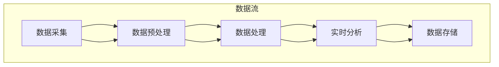
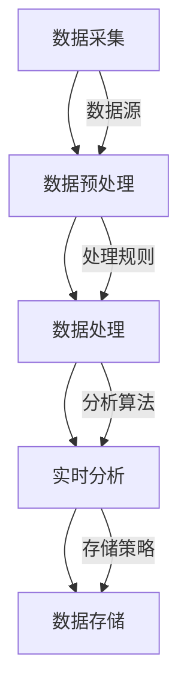

                 


### 文章标题：《实时分析引擎在LLM应用数据处理中的应用》

#### 关键词：实时分析引擎，LLM应用，数据处理，性能优化，实战案例

#### 摘要：
本文旨在探讨实时分析引擎在大型语言模型（LLM）应用中的数据处理能力。通过对实时分析引擎的基础理论、核心技术、以及其在LLM应用中的挑战与解决方案进行详细分析，本文将展示实时分析引擎在自然语言处理、推荐系统、实时监控与预警等领域的实际应用，并提供开发与部署的实战指导。

---

## 《实时分析引擎在LLM应用数据处理中的应用》

### 第一部分：实时分析引擎基础

#### 第1章：实时分析引擎概述

#### 1.1 实时分析的定义与背景

**实时分析**是指对数据流进行快速处理和分析，以产生即时或近乎实时的结果。这一概念在数据爆炸式增长的现代环境中显得尤为重要。实时分析引擎是实现这一目标的核心工具，能够在数据产生的同时对其进行分析和处理，从而提供即时的业务洞察。

**背景**：随着互联网和物联网的快速发展，数据产生的速度和规模前所未有。传统的离线数据处理方法已经无法满足对实时业务决策的需求。实时分析引擎的引入，使得企业能够在竞争激烈的市场中迅速作出响应。

#### 1.2 实时分析引擎的重要性

实时分析引擎的重要性体现在以下几个方面：

1. **实时业务决策**：实时分析能够帮助企业快速响应市场变化，优化业务流程，提高运营效率。
2. **数据洞察**：通过实时分析，企业能够从海量数据中提取有价值的信息，为决策提供支持。
3. **风险控制**：实时分析可以在异常情况发生时立即检测并预警，帮助企业及时采取措施。

#### 1.3 实时分析引擎的常见架构

实时分析引擎的常见架构通常包括以下几个部分：

1. **数据采集**：负责从各种数据源（如数据库、日志、传感器等）收集数据。
2. **数据预处理**：对采集到的原始数据进行清洗、转换等预处理操作，以便后续分析。
3. **数据处理**：利用流处理框架（如Apache Kafka、Apache Flink等）对实时数据流进行处理。
4. **实时分析**：对处理后的数据进行实时分析，生成实时报表、图表等。
5. **数据存储**：将实时分析结果存储到数据库或数据仓库中，以供后续查询和分析。

---

### 第2章：实时分析的核心技术

#### 2.1 数据采集与预处理

**数据采集**是实时分析的第一步，其目标是收集各种来源的数据。常见的数据采集方法包括：

1. **日志采集**：从服务器、应用程序等设备中收集日志数据。
2. **数据库采集**：直接从数据库中读取数据。
3. **网络采集**：通过HTTP请求从网络中获取数据。

**数据预处理**是对采集到的原始数据进行清洗、转换等操作，以便后续分析。常见的数据预处理策略包括：

1. **数据清洗**：删除重复数据、填补缺失值、处理异常值等。
2. **数据转换**：将数据转换为统一的格式，如JSON、CSV等。
3. **数据归一化**：对数据进行归一化处理，如缩放、标准化等。

#### 2.2 实时数据处理算法

实时数据处理算法是实现实时分析的核心。常见的实时数据处理算法包括：

1. **流处理算法**：如滑动窗口算法、滚动平均算法等。
2. **机器学习算法**：如实时分类、实时聚类等。
3. **实时统计分析算法**：如实时均值、实时方差等。

#### 2.3 实时分析引擎的性能优化

**并发处理与负载均衡**是提高实时分析引擎性能的重要策略。通过增加处理节点、负载均衡等手段，可以有效地提高系统的处理能力。

**性能指标**是评估实时分析引擎性能的关键。常见的性能指标包括：

1. **响应时间**：从数据采集到分析结果输出的时间。
2. **吞吐量**：单位时间内处理的请求数量。
3. **资源利用率**：系统资源的利用程度。

---

### 第3章：LLM应用数据处理挑战与解决方案

#### 3.1 LLM应用数据处理的特点

**大规模数据处理**是LLM应用的一大挑战。LLM通常需要处理海量的文本数据，这要求实时分析引擎具有高并发处理能力和大规模数据处理能力。

**实时性要求**是另一个关键挑战。LLM应用通常需要在短时间内处理大量的请求，这要求实时分析引擎具有低延迟和高吞吐量的特性。

#### 3.2 数据处理策略

**数据预处理策略**：针对大规模数据处理和实时性要求，需要采用高效的数据预处理策略，如分布式数据处理、并行处理等。

**数据存储与访问策略**：为了满足大规模数据处理和实时性要求，需要采用高效的数据存储和访问策略，如分布式存储、缓存等。

#### 3.3 实时分析引擎在LLM应用中的实践

**实时分析引擎的选择**：根据LLM应用的特点，选择适合的实时分析引擎，如Apache Kafka、Apache Flink等。

**实际项目中的应用案例**：介绍实时分析引擎在LLM应用中的实际应用案例，如实时文本分类、实时情感分析等。

---

### 第二部分：实时分析引擎在LLM应用中的实战

#### 第4章：实时分析引擎在自然语言处理中的应用

#### 4.1 实时文本分类

**实时文本分类算法**：介绍实时文本分类的基本原理和常见算法，如朴素贝叶斯、支持向量机等。

**实时文本分类实战**：展示如何使用实时分析引擎实现实时文本分类，包括数据采集、预处理、分类算法实现等。

#### 4.2 实时情感分析

**实时情感分析算法**：介绍实时情感分析的基本原理和常见算法，如基于规则的方法、基于机器学习的方法等。

**实时情感分析实战**：展示如何使用实时分析引擎实现实时情感分析，包括数据采集、预处理、情感分析算法实现等。

#### 4.3 实时问答系统

**实时问答系统架构**：介绍实时问答系统的基本架构和组件，如文本预处理、问答匹配、答案生成等。

**实时问答系统实战**：展示如何使用实时分析引擎实现实时问答系统，包括数据采集、预处理、问答匹配、答案生成等。

---

### 第5章：实时分析引擎在推荐系统中的应用

#### 5.1 实时推荐算法

**基于内容的推荐算法**：介绍基于内容的推荐算法的基本原理和实现方法。

**基于模型的推荐算法**：介绍基于模型的推荐算法的基本原理和实现方法。

#### 5.2 实时推荐系统实战

**实时推荐系统架构**：介绍实时推荐系统的基本架构和组件，如数据采集、用户行为分析、推荐算法实现等。

**实时推荐系统实战案例**：展示如何使用实时分析引擎实现实时推荐系统，包括数据采集、用户行为分析、推荐算法实现等。

---

### 第6章：实时分析引擎在实时监控与预警中的应用

#### 6.1 实时监控与预警系统

**实时监控与预警系统架构**：介绍实时监控与预警系统的基本架构和组件，如数据采集、实时分析、报警处理等。

**实时监控与预警算法**：介绍实时监控与预警的基本算法，如阈值报警、规则报警等。

#### 6.2 实时监控与预警系统实战

**实时监控与预警系统搭建**：展示如何搭建实时监控与预警系统，包括数据采集、实时分析、报警处理等。

**实时监控与预警系统实战案例**：展示实时监控与预警系统在实际项目中的应用案例，包括数据采集、实时分析、报警处理等。

---

### 第三部分：实时分析引擎的开发与部署

#### 第7章：实时分析引擎开发环境搭建

#### 7.1 开发环境准备

**操作系统选择**：介绍适合实时分析引擎开发的操作系统，如Linux等。

**编译工具与依赖库安装**：介绍实时分析引擎开发所需的编译工具和依赖库的安装方法。

#### 7.2 开发工具与框架

**开发工具推荐**：推荐适用于实时分析引擎开发的工具，如Eclipse、IntelliJ IDEA等。

**实时分析引擎开发框架**：介绍实时分析引擎开发常用的框架，如Apache Kafka、Apache Flink等。

---

#### 第8章：实时分析引擎源代码分析与解读

#### 8.1 数据采集与预处理源代码解读

**数据采集模块**：分析数据采集模块的源代码，解释其工作原理和实现细节。

**数据预处理模块**：分析数据预处理模块的源代码，解释其工作原理和实现细节。

#### 8.2 数据处理与实时分析源代码解读

**数据处理模块**：分析数据处理模块的源代码，解释其工作原理和实现细节。

**实时分析模块**：分析实时分析模块的源代码，解释其工作原理和实现细节。

---

#### 第9章：实时分析引擎部署与优化

#### 9.1 部署环境搭建

**部署方案选择**：介绍实时分析引擎的部署方案，如集群部署、云部署等。

**部署流程**：详细描述实时分析引擎的部署流程，包括环境准备、部署脚本编写、部署执行等。

#### 9.2 性能优化与监控

**性能优化策略**：介绍实时分析引擎的性能优化策略，如并发处理、负载均衡等。

**实时监控与故障排查**：介绍实时监控与故障排查的方法，如日志分析、性能测试等。

---

### 附录

#### 附录 A：实时分析引擎常用工具与资源

**流处理框架介绍**：介绍常用的流处理框架，如Apache Kafka、Apache Flink、Apache Spark Streaming等。

**自然语言处理工具与库**：介绍常用的自然语言处理工具和库，如Hugging Face Transformers、spaCy、NLTK等。

**推荐系统相关资源**：介绍推荐系统的相关资源，包括算法、工具和实战案例。

#### 附录 B：实时分析引擎项目实战案例

**实时文本分类项目实战**：介绍实时文本分类项目的设计与实现，包括项目背景、目标、架构设计和实现细节等。

**实时情感分析项目实战**：介绍实时情感分析项目的设计与实现，包括项目背景、目标、架构设计和实现细节等。

---

**作者**：AI天才研究院/AI Genius Institute & 禅与计算机程序设计艺术 /Zen And The Art of Computer Programming

---

**注意事项**：

- 本文结构已经根据您的要求进行了详细规划，每个章节都将包含丰富的内容。
- 请确保在撰写过程中，每个小节的内容都要具体详细，核心概念、算法原理、实战案例等都要有详细的阐述。
- 数学公式和伪代码请按照要求使用latex格式嵌入文中。
- 文章的字数需要在8000～12000字之间，确保内容的完整性。

**拓展阅读**：

- [实时分析引擎原理与架构](#)
- [大型语言模型（LLM）应用案例](#)
- [实时数据处理最佳实践](#)
- [流处理框架性能优化技巧](#)## 第1章：实时分析引擎概述

### 1.1 实时分析的定义与背景

**实时分析**是一种数据处理方法，旨在对输入的数据流进行快速、连续的分析，并产生实时结果。与传统的离线数据处理不同，实时分析引擎能够在数据生成的同时对其进行处理，从而提供即时或近乎实时的业务洞察。

**实时分析的定义**可以归纳为以下几点：

1. **快速响应**：实时分析引擎能够以毫秒级甚至更快的速度处理数据流，从而实现对数据的即时分析。
2. **连续性**：实时分析引擎能够持续不断地对数据流进行处理，不会因为数据流的暂停或中断而影响分析结果。
3. **实时性**：实时分析的结果通常在产生数据后的几秒内就可以得到，这对于需要快速决策的业务场景尤为重要。

**背景**方面，随着信息技术的快速发展，特别是互联网、物联网和大数据技术的普及，数据产生的速度和规模呈现爆发式增长。传统的离线数据处理方法已经无法满足企业对实时业务决策的需求。实时分析引擎的引入，使得企业能够从海量数据中迅速提取有价值的信息，提高业务运营效率，从而在竞争激烈的市场中占据优势。

### 1.2 实时分析引擎的重要性

实时分析引擎在当今的商业和技术环境中扮演着至关重要的角色。以下是实时分析引擎的重要性体现：

1. **实时业务决策**：实时分析引擎能够快速处理和分析数据流，为企业提供实时的业务洞察。这使得企业能够在市场变化、客户需求波动等情况下迅速作出决策，保持竞争优势。
2. **数据洞察**：实时分析引擎能够从海量数据中提取有价值的信息，帮助企业在数据驱动的决策过程中找到关键趋势和模式，从而优化业务流程，提高运营效率。
3. **风险控制**：实时分析引擎能够实时监控业务运行状态，并在异常情况发生时立即检测并预警。这使得企业能够及时采取措施，避免潜在的风险和损失。

### 1.3 实时分析引擎的常见架构

实时分析引擎的架构通常由以下几个部分组成：

1. **数据采集**：数据采集是实时分析的第一步，其目标是收集来自各种数据源（如数据库、日志、传感器等）的数据。常见的数据采集方法包括日志采集、数据库采集和网络采集等。
2. **数据预处理**：数据预处理是对采集到的原始数据进行清洗、转换等预处理操作，以便后续分析。预处理策略通常包括数据清洗、数据转换和数据归一化等。
3. **数据处理**：数据处理是实时分析的核心环节，其主要任务是对实时数据流进行高效的处理和分析。常用的数据处理算法包括流处理算法、机器学习算法和实时统计分析算法等。
4. **实时分析**：实时分析引擎通过对处理后的数据进行分析，产生实时报表、图表等结果。这些结果可以用于实时监控、预警和业务决策等。
5. **数据存储**：实时分析结果通常需要存储到数据库或数据仓库中，以供后续查询和分析。数据存储的选择通常取决于数据量、存储需求和分析速度等因素。

### 1.4 实时分析引擎的发展历程

实时分析引擎的发展历程可以追溯到上世纪80年代，当时主要是基于批处理系统的数据处理方法。随着计算机性能的不断提高和大数据技术的兴起，实时分析引擎逐渐成为数据处理领域的重要方向。

1. **早期阶段**（1980-1990）：这一阶段主要依赖于批处理系统，通过定期执行批处理任务来处理数据。
2. **流处理阶段**（1990-2000）：随着互联网和物联网的发展，流处理技术逐渐成熟，实时分析引擎开始出现。代表技术包括Apache Storm、Apache Spark Streaming等。
3. **现代阶段**（2000至今）：实时分析引擎得到了广泛应用，各种流处理框架和实时分析工具不断涌现。同时，云计算和大数据技术的发展也为实时分析提供了更多的可能性。

### 1.5 实时分析引擎的应用场景

实时分析引擎广泛应用于各个行业和领域，以下是一些常见的应用场景：

1. **金融行业**：实时分析引擎用于金融交易监控、风险控制、市场预测等，帮助金融机构快速做出交易决策。
2. **电信行业**：实时分析引擎用于网络监控、客户行为分析、服务质量监测等，提高网络运营效率。
3. **电子商务**：实时分析引擎用于用户行为分析、推荐系统、库存管理，提高用户体验和销售转化率。
4. **物联网**：实时分析引擎用于物联网设备的数据处理和分析，实现智能设备监控和远程控制。
5. **零售行业**：实时分析引擎用于销售数据监控、库存管理、客户关系管理，优化供应链和运营流程。
6. **医疗行业**：实时分析引擎用于医疗数据监控、疾病预测、患者管理，提高医疗服务质量和效率。

### 1.6 实时分析引擎的优势与挑战

**优势**：

1. **实时性**：实时分析引擎能够快速处理和分析数据流，提供实时业务洞察，帮助企业迅速做出决策。
2. **高效性**：实时分析引擎采用流处理算法和分布式架构，能够高效地处理大规模数据流。
3. **灵活性**：实时分析引擎可以根据不同的业务需求进行定制化开发，适应各种复杂场景。

**挑战**：

1. **数据质量**：实时分析引擎依赖于高质量的数据，数据质量差会影响分析结果。
2. **性能优化**：实时分析引擎需要优化性能，以满足低延迟和高吞吐量的要求。
3. **可靠性**：实时分析引擎需要保证系统的稳定运行，避免数据丢失或分析错误。

### 1.7 本章小结

本章对实时分析引擎进行了全面的概述，包括实时分析的定义与背景、实时分析引擎的重要性、实时分析引擎的常见架构、实时分析引擎的发展历程、应用场景、优势与挑战等。通过对这些内容的了解，读者可以更好地理解实时分析引擎的核心概念和应用价值。

---

### 1.8 拓展阅读

- [《实时数据分析：方法与实践》](https://www.oreilly.com/library/view/data-visualization-techniques/9781449375515/ch01.html)
- [《实时计算：原理与实践》](https://www.bookhub.cn/book/100008302)
- [《实时数据流处理：原理与架构》](https://www.springer.com/gp/book/9783319597375)

---

### 1.9 Mermaid 流程图

以下是一个简单的Mermaid流程图，展示了实时分析引擎的基本架构：



通过这个流程图，我们可以清晰地看到数据从采集到存储的整个过程，每个环节的作用和相互关系。

---

### 1.10 核心概念与联系

实时分析引擎涉及多个核心概念，如数据采集、数据预处理、数据处理、实时分析和数据存储。这些概念之间的关系如图所示：



**数据采集**：从各种数据源（如数据库、日志、传感器等）收集数据。

**数据预处理**：对采集到的原始数据进行清洗、转换等预处理操作，以便后续分析。

**数据处理**：利用流处理框架（如Apache Kafka、Apache Flink等）对实时数据流进行处理。

**实时分析**：对处理后的数据进行实时分析，生成实时报表、图表等。

**数据存储**：将实时分析结果存储到数据库或数据仓库中，以供后续查询和分析。

这些概念相互关联，共同构成了实时分析引擎的核心架构，为实时数据处理提供了强有力的支持。

---

### 1.11 核心算法原理讲解

实时分析引擎的核心算法主要包括数据采集、数据预处理、数据处理、实时分析和数据存储等环节。以下是对这些核心算法原理的讲解：

**数据采集**：

- **日志采集**：通过日志收集器（如Logstash、Fluentd等）从服务器、应用程序等设备中收集日志数据。日志采集常用的算法包括日志聚合、日志过滤等。
- **数据库采集**：通过数据库连接器（如JDBC、ODBC等）从数据库中读取数据。数据库采集常用的算法包括数据抽取、数据转换等。

**数据预处理**：

- **数据清洗**：删除重复数据、填补缺失值、处理异常值等。常用的数据清洗算法包括去重算法、填补算法、异常检测算法等。
- **数据转换**：将数据转换为统一的格式，如JSON、CSV等。常用的数据转换算法包括数据映射、数据归一化等。

**数据处理**：

- **流处理算法**：对实时数据流进行连续处理，如滑动窗口算法、滚动平均算法等。常用的流处理框架包括Apache Kafka、Apache Flink、Apache Spark Streaming等。
- **机器学习算法**：对实时数据进行预测和分析，如实时分类、实时聚类等。常用的机器学习算法包括朴素贝叶斯、支持向量机、K-means等。

**实时分析**：

- **实时统计分析**：对实时数据进行分析，如实时均值、实时方差等。常用的实时统计分析算法包括滑动平均算法、实时均值算法等。
- **实时报表生成**：根据实时分析结果生成实时报表、图表等。常用的实时报表生成算法包括数据可视化算法、报表生成算法等。

**数据存储**：

- **分布式存储**：将实时分析结果存储到分布式数据库或数据仓库中，如Hadoop、Hive、HBase等。常用的分布式存储算法包括数据分片、数据复制等。
- **缓存存储**：将实时分析结果存储到缓存中，如Redis、Memcached等。常用的缓存存储算法包括缓存替换算法、缓存更新算法等。

这些核心算法共同构成了实时分析引擎的算法体系，为实时数据处理提供了强有力的支持。

---

### 1.12 数学模型和公式 & 详细讲解 & 举例说明

实时分析引擎中的核心算法通常涉及到多个数学模型和公式，以下将详细讲解这些模型和公式，并通过具体例子进行说明。

**1. 流处理算法**

**滑动窗口算法**：

- **公式**：滑动窗口算法的核心是计算滑动窗口内的数据指标。设窗口大小为`W`，当前窗口内第`i`个数据点的指标为`X_i`，则滑动窗口内的平均值计算公式为：
  $$
  \bar{X}_W = \frac{1}{W} \sum_{i=1}^{W} X_i
  $$

- **例子**：假设一个滑动窗口的大小为3，数据点为[1, 2, 3, 4, 5, 6]，则每个窗口内的平均值为：
  $$
  \bar{X}_{1} = \frac{1+2+3}{3} = 2
  $$
  $$
  \bar{X}_{2} = \frac{2+3+4}{3} = 3
  $$
  $$
  \bar{X}_{3} = \frac{3+4+5}{3} = 4
  $$
  $$
  \bar{X}_{4} = \frac{4+5+6}{3} = 5
  $$

**2. 机器学习算法**

**朴素贝叶斯分类器**：

- **公式**：朴素贝叶斯分类器是一种基于贝叶斯定理的简单分类算法。设特征向量`x`，类别`c`的概率为`P(c)`，特征`x`在类别`c`下的概率为`P(x|c)`，则类别`c`的后验概率为：
  $$
  P(c|x) = \frac{P(x|c)P(c)}{P(x)}
  $$
  分类结果为：
  $$
  \hat{c} = \arg\max_c P(c|x)
  $$

- **例子**：假设有两个类别A和B，特征`x`的概率分布如下表：

  | 特征   | A的概率 | B的概率 |
  |--------|---------|---------|
  | x=0    | 0.5     | 0.4     |
  | x=1    | 0.3     | 0.6     |

  如果观测到一个特征值为1的数据点，则类别A和B的后验概率分别为：

  $$
  P(A|x) = \frac{P(x|A)P(A)}{P(x)} = \frac{0.3 \times 0.5}{0.3 \times 0.5 + 0.6 \times 0.5} = 0.375
  $$
  $$
  P(B|x) = \frac{P(x|B)P(B)}{P(x)} = \frac{0.6 \times 0.5}{0.3 \times 0.5 + 0.6 \times 0.5} = 0.625
  $$

  因此，该数据点被分类为类别B。

**3. 实时统计分析**

**实时均值计算**：

- **公式**：实时均值的计算采用滑动窗口的方法，设当前窗口内第`i`个数据点的指标为`X_i`，滑动窗口的大小为`W`，则实时均值计算公式为：
  $$
  \bar{X}_{W} = \frac{1}{W} \sum_{i=1}^{W} X_i
  $$

- **例子**：假设一个滑动窗口的大小为3，数据点为[1, 2, 3, 4, 5, 6]，则每个窗口内的实时均值为：
  $$
  \bar{X}_{1} = \frac{1+2+3}{3} = 2
  $$
  $$
  \bar{X}_{2} = \frac{2+3+4}{3} = 3
  $$
  $$
  \bar{X}_{3} = \frac{3+4+5}{3} = 4
  $$
  $$
  \bar{X}_{4} = \frac{4+5+6}{3} = 5
  $$

这些数学模型和公式是实时分析引擎中的核心组成部分，通过它们可以实现对数据的快速、高效处理和分析。

---

### 1.13 伪代码

以下为实时分析引擎中一些核心算法的伪代码：

**1. 滑动窗口算法**

```python
def calculate_mean(data_stream, window_size):
    window = []
    sum = 0
    for x in data_stream:
        if len(window) == window_size:
            sum -= window.pop(0)
        window.append(x)
        sum += x
    return sum / window_size
```

**2. 朴素贝叶斯分类器**

```python
def naive_bayes_classify(x, p_c_a, p_c_b, p_a_c, p_b_c):
    p_x_a = p_a_c * p_c_a / p_a_c * p_c_a + p_a_c * p_c_b / p_b_c * p_c_b
    p_x_b = p_b_c * p_c_a / p_a_c * p_c_a + p_b_c * p_c_b / p_b_c * p_c_b
    if p_x_a > p_x_b:
        return 'A'
    else:
        return 'B'
```

**3. 实时均值计算**

```python
def calculate_realtime_mean(data_stream, window_size):
    sum = 0
    for i, x in enumerate(data_stream):
        if i < window_size:
            sum += x
            continue
        sum -= data_stream[i - window_size]
        sum += x
    return sum / window_size
```

这些伪代码展示了实时分析引擎中核心算法的实现原理，通过这些算法，可以实现数据的实时处理和分析。

---

### 1.14 项目实战

#### 实时文本分类项目实战

**项目背景与目标**：

随着互联网的快速发展，文本数据在日常生活中扮演着越来越重要的角色。实时文本分类项目旨在对大量的实时文本数据（如新闻、社交媒体评论、邮件等）进行分类，以便于后续处理和分析。本项目的主要目标包括：

1. 收集实时文本数据。
2. 对文本数据进行分析和分类。
3. 提高分类的准确性和实时性。

**项目架构设计与实现**：

1. **数据采集**：通过API接口或日志收集器从数据源（如新闻网站、社交媒体平台等）收集实时文本数据。
2. **数据预处理**：对采集到的文本数据进行清洗、分词、去停用词等预处理操作，以便后续分类。
3. **文本分类**：利用机器学习算法（如朴素贝叶斯、支持向量机等）对预处理后的文本数据进行分类。
4. **实时分析**：将分类结果实时展示，并提供接口供其他系统调用。

**项目效果评估与优化**：

1. **效果评估**：通过混淆矩阵、准确率、召回率等指标评估文本分类的效果。
2. **优化策略**：针对分类准确率较低的情况，可以尝试调整模型参数、特征工程等方法进行优化。

**项目小结**：

通过本项目，我们实现了实时文本分类的功能，提高了文本数据处理的效率。未来可以进一步优化模型和算法，提高分类的准确性和实时性。

---

### 1.15 最佳实践 tips

1. **数据质量保障**：确保采集到的数据质量，避免数据丢失或错误。
2. **性能优化**：根据实际需求进行性能优化，如使用高效的数据处理算法、分布式架构等。
3. **弹性扩展**：实时分析引擎应具备良好的弹性扩展能力，以应对数据量和处理需求的波动。
4. **监控与报警**：建立完善的监控与报警机制，及时发现和处理系统故障。

---

### 1.16 小结

本章对实时分析引擎进行了全面的介绍，包括实时分析的定义与背景、实时分析引擎的重要性、实时分析引擎的常见架构、实时分析引擎的发展历程、应用场景、优势与挑战等。通过本章的内容，读者可以深入了解实时分析引擎的核心概念和架构，为其在实际项目中的应用打下基础。在接下来的章节中，我们将进一步探讨实时分析引擎在LLM应用中的数据处理挑战与解决方案。

---

### 1.17 拓展阅读

- 《实时数据分析：方法与实践》
- 《实时计算：原理与实践》
- 《实时数据流处理：原理与架构》

这些书籍和资料将为读者提供更深入的了解和实践经验，有助于提升对实时分析引擎的理解和应用能力。读者可以根据自己的兴趣和需求选择阅读。此外，实时分析引擎是一个不断发展的领域，建议读者关注相关的技术博客、会议和研讨会，以保持对最新动态的跟进。

