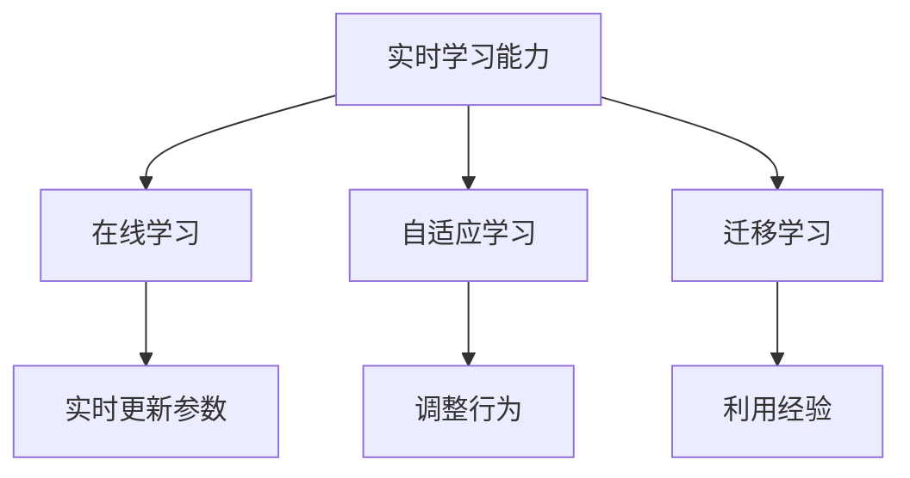

                 

### 3.1 实时学习能力的核心算法

#### 核心概念与联系

实时学习能力（Reactive Learning Ability）是指系统在接收到新的数据后，能够快速更新自身的模型参数，以适应新的数据分布。实时学习能力的核心在于如何高效地处理大量连续数据，并快速更新模型，以保持系统的高效性和适应性。

**核心概念**：

- **在线学习**：在线学习（Online Learning）是一种针对连续数据流的学习方法，它允许模型在数据流过程中实时更新模型参数。
- **自适应学习**：自适应学习（Adaptive Learning）是指模型在面临不同数据分布时，能够调整自身的行为，以适应新的环境。
- **迁移学习**：迁移学习（Transfer Learning）是一种利用先前在类似任务上的学习经验来加速新任务学习的方法。

**联系**：

- 实时学习能力依托于在线学习和自适应学习技术，通过迁移学习实现模型的快速更新和适应。

**Mermaid 流程图**：



#### 核心算法原理讲解

**在线学习算法**：

在线学习算法的核心思想是利用新的数据进行在线更新，以保持模型的时效性。常见的在线学习算法有：

- **梯度下降法**：通过更新模型参数，使得损失函数逐渐减小。
  - **伪代码**：
    ```python
    for each data point (x, y) in the stream:
        Compute the gradient of the loss function
        Update the model parameters
    ```

- **随机梯度下降法**（SGD）：每次使用一个样本点进行参数更新，减少计算量。
  - **伪代码**：
    ```python
    for each data point (x, y) in the stream:
        Compute the gradient of the loss function with respect to a single data point
        Update the model parameters
    ```

- **增量梯度下降法**：在每次迭代过程中，使用新的数据和之前已更新的模型参数计算梯度，并进行更新。
  - **伪代码**：
    ```python
    initial_model_params
    for each data point (x, y) in the stream:
        Compute the gradient of the loss function with the current model parameters
        Update the model parameters
    ```

**数学模型和公式详细讲解与举例说明**：

梯度下降法的核心是计算损失函数关于模型参数的梯度，然后沿着梯度的反方向更新模型参数。假设损失函数为 \( J(\theta) \)，其中 \( \theta \) 表示模型参数，则梯度下降法的更新公式为：

$$
\theta_{t+1} = \theta_{t} - \alpha \cdot \nabla J(\theta_{t})
$$

其中，\( \alpha \) 是学习率，用于控制更新步长的大小。

举例说明：

假设我们有以下损失函数：

$$
J(\theta) = (\theta - 1)^2
$$

使用梯度下降法进行参数更新，学习率 \( \alpha = 0.1 \)，初始参数 \( \theta_0 = 2 \)。则更新过程如下：

$$
\theta_1 = \theta_0 - 0.1 \cdot \nabla J(\theta_0) = 2 - 0.1 \cdot (-2) = 2.2
$$

$$
\theta_2 = \theta_1 - 0.1 \cdot \nabla J(\theta_1) = 2.2 - 0.1 \cdot (-1.4) = 2.56
$$

通过多次迭代，模型参数将逐渐接近最优值。

#### 项目实战

**开发环境搭建**：

1. 安装Python环境（Python 3.8及以上版本）。
2. 安装TensorFlow库（使用pip安装：`pip install tensorflow`）。

**源代码详细实现和代码解读**：

```python
import tensorflow as tf

# 损失函数
def loss_function(theta):
    return (theta - 1)**2

# 梯度函数
def gradient_function(theta):
    return 2 * (theta - 1)

# 初始参数
theta = 2
alpha = 0.1

# 梯度下降法迭代过程
for i in range(10):
    gradient = gradient_function(theta)
    theta = theta - alpha * gradient
    print(f"Iteration {i+1}: theta = {theta}")

# 输出最终参数
print(f"Final theta: {theta}")
```

**代码应用解读与分析**：

上述代码实现了一个简单的梯度下降法迭代过程。首先定义了损失函数和梯度函数，然后初始化参数和设置学习率。在迭代过程中，每次都计算当前参数的梯度，并更新参数。通过多次迭代，模型参数逐渐接近最优值。

**实际案例分析和详细讲解剖析**：

假设我们有一个回归问题，目标是通过输入特征预测输出值。使用梯度下降法进行参数更新，可以通过以下步骤进行：

1. 定义损失函数，如均方误差（MSE）。
2. 计算损失函数关于模型参数的梯度。
3. 初始化模型参数。
4. 使用梯度下降法进行迭代更新，直到满足停止条件（如收敛或达到最大迭代次数）。

通过实际案例的分析和详细讲解，可以更好地理解梯度下降法在实时学习能力中的应用。

**项目小结**：

本部分介绍了实时学习能力的核心算法，包括在线学习算法的原理、数学模型和公式以及项目实战。通过梯度下降法的具体实现和案例分析，展示了实时学习能力在实际项目中的应用和效果。

**最佳实践 tips**：

- 选择合适的学习率是梯度下降法成功的关键，可以通过调试或使用自适应学习率方法（如AdaGrad、RMSprop等）来优化学习率。
- 在处理大规模数据时，可以考虑使用分布式梯度下降法来加速计算。
- 结合迁移学习技术，可以更好地利用先前的学习经验，提高实时学习的效果。

**注意事项**：

- 在实际项目中，需要根据具体问题调整算法参数，以达到最佳效果。
- 实时学习能力在处理连续数据时，需要关注数据流的实时性和稳定性，以避免模型失效。

**拓展阅读**：

- [梯度下降法](https://www.deeplearningbook.org/chapter/statistical-learning/gd/)
- [迁移学习](https://www.deeplearningbook.org/chapter/computational-methods/transfer-learning/)
- [在线学习算法](https://www.coursera.org/learn/online-machine-learning)

