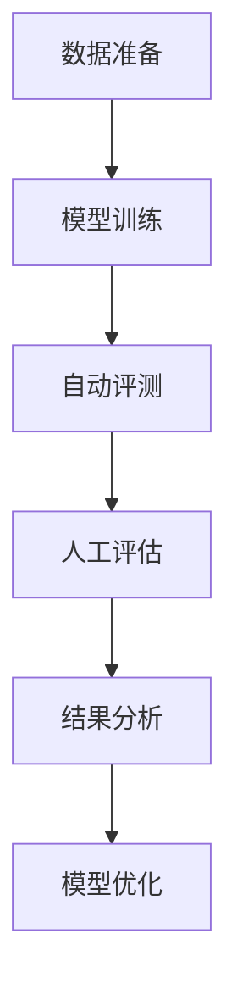

                 

# 实时对话能力评测：测试LLM的交互式响应

## 关键词
- 实时对话系统
- 大型语言模型（LLM）
- 对话能力评测
- 自动评测方法
- 案例分析
- 评测优化

## 摘要
本文旨在探讨实时对话能力评测，特别是大型语言模型（LLM）的交互式响应评测。我们首先概述了实时对话系统的发展历程、关键技术和应用场景，然后介绍了LLM的概念及其在实时对话中的应用。接下来，本文详细分析了评测指标、评测方法和评测工具，并结合实际案例展示了评测的具体实践。最后，文章讨论了评测优化策略和能力提升实践，为未来实时对话系统能力评测提供了指导和建议。

## 目录

### 《实时对话能力评测：测试LLM的交互式响应》

### 第一部分：实时对话能力评测概述

#### 第1章：实时对话系统概述

1.1 实时对话系统的发展历程

1.2 实时对话系统的关键技术

1.3 实时对话系统的应用场景

#### 第2章：LLM与实时对话能力评测

2.1 LLM的概念与原理

2.2 LLM在实时对话中的应用

2.3 实时对话能力评测的重要性

### 第二部分：评测方法与工具

#### 第3章：评测指标与标准

3.1 评测指标概述

3.2 常见评测指标详解

3.3 评测标准的制定与实施

#### 第4章：评测方法与实践

4.1 自动评测方法

4.2 手动评测方法

4.3 混合评测方法

#### 第5章：评测工具与技术

5.1 评测工具的选择

5.2 评测工具的功能与特性

5.3 评测工具的实践应用

### 第三部分：评测案例分析

#### 第6章：案例分析一——智能客服系统

6.1 案例背景

6.2 评测指标与标准

6.3 评测方法与结果分析

#### 第7章：案例分析二——虚拟个人助理

7.1 案例背景

7.2 评测指标与标准

7.3 评测方法与结果分析

### 第四部分：评测优化与提升

#### 第8章：评测优化策略

8.1 数据质量优化

8.2 模型优化方法

8.3 评测流程优化

#### 第9章：评测能力提升实践

9.1 评测团队建设

9.2 评测体系建设

9.3 评测能力评估与提升

### 附录

#### 附录A：相关资源与推荐阅读

A.1 实时对话系统相关论文

A.2 LLM相关资源

A.3 评测工具与平台介绍

A.4 实时对话能力评测实践指南

#### 附录B：Mermaid流程图示例

B.1 实时对话系统架构

#### 附录C：算法伪代码示例

C.1 对话生成算法伪代码

C.2 对话评估算法伪代码

#### 附录D：数学公式与讲解

D.1 实时对话能力评测的数学模型

D.2 数学公式详解

D.3 举例说明

### 联系信息

作者：AI天才研究院/AI Genius Institute & 禅与计算机程序设计艺术 /Zen And The Art of Computer Programming

### 内容开始

## 第一部分：实时对话能力评测概述

### 第1章：实时对话系统概述

### 1.1 实时对话系统的发展历程

实时对话系统起源于20世纪90年代，当时基于规则的人工智能系统（Rule-Based AI）开始被应用于在线客服和虚拟代理。随着互联网的普及和用户需求的增加，实时对话系统得到了快速发展。进入21世纪，随着自然语言处理（NLP）技术的进步，基于统计方法和机器学习的对话系统开始涌现，并逐渐取代传统的基于规则的系统。

早期的实时对话系统主要依赖于聊天机器人和预定义的对话流程。这些系统通常具备基本的用户交互能力，但功能相对单一，难以应对复杂的对话场景。随着深度学习技术的崛起，基于深度神经网络的对话系统逐渐成为主流。这些系统能够通过大量的训练数据自主学习，提高对话的流畅性和准确性。

近年来，大型语言模型（LLM）的出现进一步推动了实时对话系统的发展。LLM能够生成高质量的自然语言文本，提供更加人性化的对话体验。此外，语音识别、语音合成等技术的发展也使得实时对话系统可以更好地处理语音交互。

### 1.2 实时对话系统的关键技术

实时对话系统的关键技术主要包括自然语言处理（NLP）、语音识别（ASR）和语音合成（TTS）。

**自然语言处理（NLP）**：NLP是实时对话系统的核心组成部分，用于理解用户的自然语言输入并生成合适的响应。NLP技术包括词法分析、句法分析、语义分析和情感分析等。深度学习技术在NLP中的应用使得系统能够更好地处理复杂语言结构和多义性。

**语音识别（ASR）**：ASR技术用于将语音信号转换为文本输入。高性能的ASR系统能够识别多种语言和方言，并在嘈杂环境中保持高准确度。

**语音合成（TTS）**：TTS技术用于将文本转换为自然语音输出。高质量的TTS系统能够模拟不同性别、年龄和口音的语音，提供更加逼真的对话体验。

**对话管理（DM）**：对话管理是实时对话系统的另一个重要组成部分，负责协调不同模块的交互，确保对话的连贯性和一致性。对话管理通常包括意图识别、实体抽取、对话状态跟踪和上下文保持等任务。

**知识表示与推理**：知识表示与推理技术用于将用户输入与知识库中的信息进行匹配，并提供基于知识的回答。这有助于提高对话系统的回答质量和准确性。

### 1.3 实时对话系统的应用场景

实时对话系统广泛应用于多个领域，包括但不限于以下应用场景：

**客户服务**：实时对话系统可以用于在线客服，提供即时、高效的客户支持。用户可以通过文本或语音与系统进行交互，解决常见问题或获取产品信息。

**虚拟个人助理**：虚拟个人助理（如Siri、Alexa、Google Assistant）能够帮助用户管理日程、播放音乐、提供天气预报等，提供个性化的服务。

**教育**：实时对话系统可以用于在线教育，提供互动式教学和辅导。学生可以通过与系统的对话进行练习、提问和获取反馈。

**医疗保健**：实时对话系统可以用于医疗咨询和健康监测。用户可以通过与系统对话获取医疗信息、预约医生或跟踪健康状况。

**娱乐与游戏**：实时对话系统可以用于游戏和虚拟现实（VR）场景，提供互动式故事情节和角色扮演。

**智能家居**：实时对话系统可以与智能家居设备集成，提供语音控制和管理功能，如控制灯光、温度和家电等。

### 第2章：LLM与实时对话能力评测

### 2.1 LLM的概念与原理

大型语言模型（LLM，Large Language Model）是一种基于深度学习技术的自然语言处理模型，能够对大规模的文本数据进行训练，以生成高质量的自然语言文本。LLM通常基于Transformer架构，其核心思想是通过对大量文本数据进行自注意力机制处理，捕捉文本中的长距离依赖关系。

LLM的训练过程主要包括以下几个步骤：

1. **数据收集与预处理**：收集大量高质量、多样化的文本数据，并进行清洗、分词、去噪等预处理操作。
2. **模型架构设计**：设计并构建Transformer模型架构，包括自注意力机制、前馈神经网络等。
3. **模型训练**：使用预处理的文本数据对模型进行训练，通过反向传播算法不断调整模型参数，优化模型性能。
4. **模型优化**：对训练完成的模型进行调优，包括参数调整、数据增强、正则化等技术，提高模型生成文本的质量和多样性。

### 2.2 LLM在实时对话中的应用

LLM在实时对话系统中的应用主要体现在以下几个方面：

**对话生成**：LLM能够生成高质量的自然语言文本，用于构建对话系统的回答。通过将用户输入与模型生成的文本进行拼接，可以构建出流畅、自然的对话。

**上下文理解**：LLM具备强大的上下文理解能力，能够捕捉对话中的关键信息，并根据上下文生成合适的回答。这对于构建智能客服系统和虚拟个人助理等应用具有重要意义。

**多轮对话**：LLM能够处理多轮对话，通过维护对话状态和上下文信息，实现与用户的持续交互。多轮对话能力有助于提高用户满意度，增强对话系统的用户体验。

**个性化服务**：LLM能够根据用户的偏好、历史行为和对话内容，提供个性化的服务和建议。这有助于提高对话系统的粘性和用户忠诚度。

### 2.3 实时对话能力评测的重要性

实时对话能力评测对于实时对话系统的发展和应用具有重要意义，主要包括以下几个方面：

**评估模型性能**：实时对话能力评测可以评估LLM在实时对话中的性能，包括回答质量、响应速度和上下文理解能力等。通过评测结果，可以了解模型的优点和不足，为模型优化提供依据。

**指导系统设计**：实时对话能力评测结果可以帮助设计师和开发人员了解用户需求，优化系统设计，提高用户体验。例如，根据评测结果调整对话管理策略、优化回答生成算法等。

**促进技术进步**：实时对话能力评测可以推动实时对话技术的创新和发展。通过评测，可以发现现有技术的瓶颈和挑战，为后续研究和开发提供方向。

**应用场景拓展**：实时对话能力评测有助于拓展实时对话系统的应用场景。通过评测不同场景下模型的性能，可以识别出最适合的实时对话系统应用场景，推动技术的商业化应用。

### 第二部分：评测方法与工具

#### 第3章：评测指标与标准

### 3.1 评测指标概述

实时对话能力评测涉及多个方面，包括回答质量、响应速度、上下文理解、多轮对话能力和个性化服务等。为了全面评估LLM在实时对话中的表现，我们需要定义一系列评测指标，以便对模型性能进行量化评估。

常见的评测指标包括：

1. **回答质量**：评估模型生成的回答是否符合用户意图，是否具备逻辑性和连贯性，是否准确回答用户问题。
2. **响应速度**：评估模型生成回答所需的时间，通常以毫秒或秒为单位。
3. **上下文理解**：评估模型在对话中捕捉关键信息的能力，包括用户意图、实体信息和对话历史等。
4. **多轮对话能力**：评估模型在多轮对话中的持续交互能力，包括对话连贯性、上下文保持和用户满意度等。
5. **个性化服务**：评估模型根据用户偏好和个性化需求提供服务的程度和效果。

### 3.2 常见评测指标详解

#### 回答质量

回答质量是评估实时对话系统性能的核心指标之一。为了量化回答质量，我们可以采用以下几种方法：

1. **人工评估**：通过邀请人类评价者对模型生成的回答进行评估，通常采用五级评分标准（1-5分），评估回答的准确性、连贯性和逻辑性。
2. **自动评估**：利用自动评估工具，如BLEU、ROUGE、METEOR等，对模型生成的回答与标准答案进行比较，计算相似度得分。
3. **基于用户反馈的评估**：通过收集用户对模型回答的反馈，评估用户满意度。这种方法可以采用问卷调查、用户评分等方式进行。

#### 响应速度

响应速度是衡量实时对话系统性能的重要指标。为了量化响应速度，我们可以采用以下几种方法：

1. **平均响应时间**：计算模型生成回答所需的时间，通常以毫秒或秒为单位。平均响应时间越短，说明系统性能越好。
2. **响应时间分布**：分析模型生成回答所需的时间分布，包括最小响应时间、最大响应时间和响应时间的中位数等。这种方法可以帮助我们了解系统的响应性能在不同负载下的表现。
3. **吞吐量**：评估系统在单位时间内能够处理多少个请求。吞吐量越高，说明系统性能越好。

#### 上下文理解

上下文理解能力是实时对话系统的关键因素。为了量化上下文理解能力，我们可以采用以下几种方法：

1. **对话轮数**：计算模型在多轮对话中能够保持上下文一致性的轮数。对话轮数越多，说明模型的上下文理解能力越强。
2. **上下文保持率**：评估模型在对话中保持上下文一致性的程度，通常以百分比表示。上下文保持率越高，说明模型在处理多轮对话时的上下文理解能力越好。
3. **关键信息捕捉率**：评估模型在对话中捕捉关键信息（如用户意图、实体信息等）的能力，通常以百分比表示。关键信息捕捉率越高，说明模型在理解用户输入方面的表现越好。

#### 多轮对话能力

多轮对话能力是实时对话系统的一项重要指标。为了量化多轮对话能力，我们可以采用以下几种方法：

1. **对话连贯性**：评估模型在多轮对话中生成的回答是否连贯、一致，通常采用人工评估或自动评估方法。
2. **上下文保持率**：与上下文理解能力类似，评估模型在多轮对话中保持上下文一致性的程度。
3. **用户满意度**：通过用户问卷调查或评分，评估用户对多轮对话的满意度。

#### 个性化服务

个性化服务能力是实时对话系统的一项重要指标。为了量化个性化服务能力，我们可以采用以下几种方法：

1. **个性化推荐准确率**：评估模型根据用户偏好和历史行为提供个性化推荐的准确率，通常以百分比表示。
2. **用户满意度**：通过用户问卷调查或评分，评估用户对个性化服务的满意度。
3. **个性化服务覆盖率**：评估模型能够为多少用户提供个性化服务，通常以百分比表示。

### 3.3 评测标准的制定与实施

为了确保实时对话能力评测的公正性、科学性和可操作性，我们需要制定一套详细的评测标准，并实施以下步骤：

1. **标准制定**：根据实时对话系统的特点和应用场景，明确评测指标的定义、评分标准和阈值。例如，对于回答质量指标，可以制定准确性、连贯性和逻辑性等评分标准。
2. **评测工具开发**：开发符合评测标准的自动评测工具，包括评测算法、评估模型和用户界面等。自动评测工具可以帮助我们快速、高效地评估模型性能。
3. **评测流程设计**：设计合理的评测流程，包括评测数据准备、评测指标计算、评测结果分析等。评测流程应确保评测过程的公正、透明和可重复性。
4. **评测执行与监控**：根据制定的评测标准和流程，执行实时对话能力评测，并实时监控评测过程。监控内容包括评测进度、评测结果和异常情况等。
5. **评测结果分析**：对评测结果进行分析和总结，识别模型的优点和不足，为模型优化和系统设计提供依据。同时，应将评测结果记录在案，为后续评测提供参考。

### 第4章：评测方法与实践

#### 4.1 自动评测方法

自动评测方法是一种高效、可重复的实时对话能力评测方法，通过使用自动化工具和算法对模型性能进行评估。以下介绍几种常见的自动评测方法：

1. **人工标注数据集**：首先，我们需要收集并构建一个包含多种对话场景、用户意图和实体信息的标注数据集。标注数据集可以由人类专家进行评估和标注，确保数据的准确性和多样性。
2. **自动评估工具**：利用自动评估工具，如BLEU、ROUGE、METEOR等，对模型生成的回答与标准答案进行比较，计算相似度得分。这些工具通常采用基于统计的方法，对文本序列进行对齐和相似度计算。
3. **模型对比评估**：将多个模型的回答进行对比，评估其在不同评测指标上的性能差异。这种方法可以帮助我们了解不同模型的特点和优势，为模型选择和优化提供参考。
4. **自动化测试平台**：开发一个自动化测试平台，实现评测流程的自动化执行。测试平台可以支持多种评测指标的计算和评估结果的可视化展示，提高评测效率。

#### 4.2 手动评测方法

手动评测方法是一种基于人类评价者评估的实时对话能力评测方法。以下介绍几种常见的手动评测方法：

1. **人工评估**：邀请具有丰富对话系统和自然语言处理经验的专家对模型生成的回答进行评估。评估者可以根据设定的评分标准，对回答的准确性、连贯性和逻辑性等进行评分。
2. **用户反馈**：通过用户问卷调查或评分，收集用户对模型回答的满意度。这种方法可以了解用户对模型的实际体验和评价，为模型优化提供参考。
3. **多轮对话评估**：设计一组多轮对话场景，让评估者与模型进行交互，评估其在多轮对话中的表现。这种方法可以帮助我们了解模型在持续交互中的性能和稳定性。

#### 4.3 混合评测方法

混合评测方法结合了自动评测方法和手动评测方法的优点，通过将两种方法相结合，实现实时对话能力评测的全面、准确和高效。以下介绍几种常见的混合评测方法：

1. **自动化评估与人工评估相结合**：首先，利用自动评估工具对模型生成的回答进行初步评估，计算相似度得分。然后，邀请人类评估者对自动评估结果进行复核和调整，确保评估的准确性。
2. **自动化评估与用户反馈相结合**：利用自动评估工具计算模型在不同评测指标上的得分，并结合用户问卷调查或评分结果，综合评估模型性能。这种方法可以同时考虑模型生成回答的质量和用户满意度。
3. **多轮对话评估与用户反馈相结合**：设计一组多轮对话场景，让评估者与模型进行交互，同时收集用户对模型回答的满意度。这种方法可以帮助我们了解模型在多轮对话中的表现和用户对模型的评价。

### 第5章：评测工具与技术

#### 5.1 评测工具的选择

在选择实时对话能力评测工具时，我们需要考虑以下几个因素：

1. **评测指标覆盖度**：评测工具应能够支持常见的评测指标，如回答质量、响应速度、上下文理解能力等，确保评测结果的全面性。
2. **评测效率**：评测工具应具备高效、易用的特点，能够快速完成评测任务，提高评测效率。
3. **可扩展性**：评测工具应支持自定义评测指标和评测算法，便于根据具体需求进行调整和优化。
4. **用户友好性**：评测工具应具备友好的用户界面，便于评估者操作和监控评测过程，同时支持数据可视化，便于分析和解读评测结果。

常见的评测工具有：

1. **BLEU、ROUGE、METEOR**：这些工具是常用的自动评测工具，适用于文本相似度评估。
2. **EVALuator**：是一个开源的实时对话系统评测平台，支持多种评测指标的计算和结果可视化。
3. **Dialogue System Test Suite**：是一个用于评测对话系统的自动化测试工具，支持多种评测场景和评测指标。

#### 5.2 评测工具的功能与特性

以下介绍几种常见的评测工具的功能和特性：

1. **BLEU（Bilingual Evaluation Understudy）**：
   - 功能：用于评估翻译质量，也可以用于评估自然语言生成质量。
   - 特性：支持多种评分模式（如n-gram匹配、基于词频的评分等），具有较高的可扩展性。
   - 应用场景：适用于文本生成任务，如机器翻译、摘要生成等。

2. **ROUGE（Recall-Oriented Understudy for Gisting Evaluation）**：
   - 功能：用于评估文本摘要的质量，也可以用于评估对话系统回答的质量。
   - 特性：基于词汇重叠度计算评分，具有较高的准确性和可重复性。
   - 应用场景：适用于文本摘要、对话生成等任务。

3. **METEOR（Metric for Evaluation of Translation with Explicit ORdering）**：
   - 功能：用于评估文本生成质量，特别适用于长文本生成任务。
   - 特性：结合了词干、词序和词频等多个因素进行评分，具有较高的评分精度。
   - 应用场景：适用于长文本生成任务，如新闻生成、对话系统回答等。

4. **EVALuator**：
   - 功能：是一个用于评测对话系统的自动化测试平台，支持多种评测指标的计算和结果可视化。
   - 特性：支持自定义评测指标和评测算法，易于扩展和定制。
   - 应用场景：适用于对话系统的评测，如聊天机器人、智能客服等。

5. **Dialogue System Test Suite**：
   - 功能：用于评测对话系统的自动化测试工具，支持多种评测场景和评测指标。
   - 特性：支持多语言评测，支持自定义评测指标和评测算法。
   - 应用场景：适用于多语言对话系统的评测，如跨语言客服系统、多语言聊天机器人等。

#### 5.3 评测工具的实践应用

以下通过一个实际案例，展示如何使用评测工具进行实时对话能力评测：

**案例背景**：一个智能客服系统的开发团队希望评估他们最新开发的客服机器人的对话能力。为了确保评测的公正性和科学性，他们决定采用EVALuator作为评测工具。

**评测流程**：
1. **数据准备**：收集一组包含多种对话场景、用户意图和实体信息的标注数据集。数据集可以由人类专家进行评估和标注，确保数据的准确性和多样性。
2. **模型训练**：使用标注数据集对客服机器人进行训练，优化模型性能。
3. **评测执行**：使用EVALuator进行评测，包括以下步骤：
   - **评测指标配置**：在EVALuator中配置评测指标，如回答质量、响应速度、上下文理解能力等。
   - **评测数据上传**：将训练完成的模型生成的回答与标注数据集上传到EVALuator。
   - **评测执行**：启动评测任务，EVALuator自动计算评测指标得分。
   - **结果分析**：EVALuator生成评测报告，展示评测指标得分、评估结果图表等。
4. **结果解读**：根据评测报告，分析客服机器人的对话能力，识别优势和不足，为模型优化提供依据。

**评测结果**：
- **回答质量**：客服机器人在回答准确性、连贯性和逻辑性方面得分较高，但在某些特定场景下的回答存在一定的错误。
- **响应速度**：客服机器人的平均响应时间较短，但存在个别请求响应时间较长的情况。
- **上下文理解能力**：客服机器人在多轮对话中能够较好地保持上下文一致性，但存在上下文理解不准确的情况。
- **用户满意度**：通过用户问卷调查，客服机器人的用户满意度较高，但在某些复杂对话场景下用户满意度较低。

**模型优化**：
1. **错误分析**：对评测结果中的错误回答进行深入分析，识别错误原因，如数据集标注错误、模型训练不足等。
2. **模型调优**：根据错误分析结果，对模型进行优化，包括增加训练数据、调整模型参数等。
3. **再次评测**：使用优化后的模型进行再次评测，验证优化效果。

通过上述实践，开发团队可以不断优化客服机器人的对话能力，提高用户满意度，为企业的客户服务提供有力支持。

### 第三部分：评测案例分析

#### 第6章：案例分析一——智能客服系统

##### 6.1 案例背景

某大型电商平台为了提升客户服务质量，决定开发一款智能客服系统，以实现24/7全天候在线服务。该智能客服系统旨在帮助用户解决购物过程中的常见问题，如商品查询、订单状态查询、退换货政策等。为了确保智能客服系统的对话能力，开发团队决定进行实时对话能力评测。

##### 6.2 评测指标与标准

为了全面评估智能客服系统的对话能力，开发团队制定了以下评测指标和标准：

1. **回答质量**：
   - 准确性：模型生成的回答与用户意图的匹配程度。
   - 连贯性：模型生成的回答在语义和逻辑上的连贯性。
   - 逻辑性：模型生成的回答是否具备合理的逻辑结构。
   - 创新性：模型生成的回答是否具备创意和新颖性。

2. **响应速度**：
   - 平均响应时间：模型生成回答所需的时间，以毫秒为单位。
   - 响应时间分布：模型在不同负载下的响应时间分布，包括最小响应时间、最大响应时间和响应时间的中位数等。

3. **上下文理解能力**：
   - 对话轮数：模型在多轮对话中能够保持上下文一致性的轮数。
   - 上下文保持率：模型在多轮对话中保持上下文一致性的程度，以百分比表示。
   - 关键信息捕捉率：模型在对话中捕捉关键信息（如用户意图、实体信息等）的能力，以百分比表示。

4. **多轮对话能力**：
   - 对话连贯性：模型在多轮对话中生成的回答是否连贯、一致。
   - 上下文保持率：模型在多轮对话中保持上下文一致性的程度。
   - 用户满意度：用户对多轮对话的满意度，以百分比表示。

5. **个性化服务**：
   - 个性化推荐准确率：模型根据用户偏好和历史行为提供个性化推荐的准确率，以百分比表示。
   - 用户满意度：用户对个性化服务的满意度，以百分比表示。
   - 个性化服务覆盖率：模型能够为多少用户提供个性化服务，以百分比表示。

##### 6.3 评测方法与结果分析

**评测方法**：
1. **数据准备**：收集一组包含多种对话场景、用户意图和实体信息的标注数据集。数据集可以由人类专家进行评估和标注，确保数据的准确性和多样性。
2. **模型训练**：使用标注数据集对智能客服系统进行训练，优化模型性能。
3. **自动评测**：使用EVALuator对模型生成的回答进行自动评测，计算评测指标得分。
4. **人工评估**：邀请具有丰富对话系统和自然语言处理经验的专家对模型生成的回答进行人工评估，调整评测指标得分。
5. **用户反馈**：通过用户问卷调查，收集用户对模型回答的满意度。

**评测结果分析**：

1. **回答质量**：
   - 准确性：智能客服系统的回答与用户意图的匹配程度较高，但存在个别场景下的错误。
   - 连贯性：模型生成的回答在语义和逻辑上较为连贯，但存在部分回答连贯性不足的情况。
   - 逻辑性：模型生成的回答具备一定的逻辑性，但存在部分回答逻辑结构不完整的情况。
   - 创新性：模型生成的回答在部分场景下具备创新性和新颖性，但在其他场景下表现一般。

2. **响应速度**：
   - 平均响应时间：智能客服系统的平均响应时间较短，但在高负载情况下响应时间较长。
   - 响应时间分布：智能客服系统的响应时间分布较为集中，但在某些特定场景下存在响应时间较长的请求。

3. **上下文理解能力**：
   - 对话轮数：智能客服系统在多轮对话中能够保持上下文一致性的轮数较多，但在某些场景下存在上下文理解不准确的情况。
   - 上下文保持率：智能客服系统在多轮对话中保持上下文一致性的程度较高，但在某些场景下存在上下文保持不足的情况。
   - 关键信息捕捉率：智能客服系统在对话中捕捉关键信息的能力较强，但在某些场景下存在关键信息捕捉不准确的情况。

4. **多轮对话能力**：
   - 对话连贯性：智能客服系统在多轮对话中生成的回答连贯性较好，但在某些场景下存在对话中断或跳跃的情况。
   - 上下文保持率：智能客服系统在多轮对话中保持上下文一致性的程度较高，但在某些场景下存在上下文保持不足的情况。
   - 用户满意度：用户对智能客服系统的多轮对话能力满意度较高，但在某些复杂对话场景下用户满意度较低。

5. **个性化服务**：
   - 个性化推荐准确率：智能客服系统根据用户偏好和历史行为提供个性化推荐的准确率较高，但在某些场景下存在推荐不准确的情况。
   - 用户满意度：用户对智能客服系统的个性化服务满意度较高，但在某些个性化需求较高的场景下用户满意度较低。
   - 个性化服务覆盖率：智能客服系统能够为大部分用户提供个性化服务，但在某些特殊用户群体下服务覆盖率较低。

**模型优化**：
1. **错误分析**：对评测结果中的错误回答进行深入分析，识别错误原因，如数据集标注错误、模型训练不足等。
2. **模型调优**：根据错误分析结果，对模型进行优化，包括增加训练数据、调整模型参数等。
3. **再次评测**：使用优化后的模型进行再次评测，验证优化效果。

通过上述评测和分析，开发团队可以不断优化智能客服系统的对话能力，提高用户满意度，为企业的客户服务提供有力支持。

### 第7章：案例分析二——虚拟个人助理

##### 7.1 案例背景

某科技公司开发了一款名为“小智”的虚拟个人助理，旨在为用户提供一站式生活助手服务，包括日程管理、天气预报、音乐推荐、购物提醒等。为了确保“小智”的对话能力，开发团队决定进行实时对话能力评测。

##### 7.2 评测指标与标准

为了全面评估虚拟个人助理的对话能力，开发团队制定了以下评测指标和标准：

1. **回答质量**：
   - 准确性：模型生成的回答与用户意图的匹配程度。
   - 连贯性：模型生成的回答在语义和逻辑上的连贯性。
   - 逻辑性：模型生成的回答是否具备合理的逻辑结构。
   - 创新性：模型生成的回答是否具备创意和新颖性。

2. **响应速度**：
   - 平均响应时间：模型生成回答所需的时间，以毫秒为单位。
   - 响应时间分布：模型在不同负载下的响应时间分布，包括最小响应时间、最大响应时间和响应时间的中位数等。

3. **上下文理解能力**：
   - 对话轮数：模型在多轮对话中能够保持上下文一致性的轮数。
   - 上下文保持率：模型在多轮对话中保持上下文一致性的程度，以百分比表示。
   - 关键信息捕捉率：模型在对话中捕捉关键信息（如用户意图、实体信息等）的能力，以百分比表示。

4. **多轮对话能力**：
   - 对话连贯性：模型在多轮对话中生成的回答是否连贯、一致。
   - 上下文保持率：模型在多轮对话中保持上下文一致性的程度。
   - 用户满意度：用户对多轮对话的满意度，以百分比表示。

5. **个性化服务**：
   - 个性化推荐准确率：模型根据用户偏好和历史行为提供个性化推荐的准确率，以百分比表示。
   - 用户满意度：用户对个性化服务的满意度，以百分比表示。
   - 个性化服务覆盖率：模型能够为多少用户提供个性化服务，以百分比表示。

##### 7.3 评测方法与结果分析

**评测方法**：
1. **数据准备**：收集一组包含多种对话场景、用户意图和实体信息的标注数据集。数据集可以由人类专家进行评估和标注，确保数据的准确性和多样性。
2. **模型训练**：使用标注数据集对虚拟个人助理进行训练，优化模型性能。
3. **自动评测**：使用EVALuator对模型生成的回答进行自动评测，计算评测指标得分。
4. **人工评估**：邀请具有丰富对话系统和自然语言处理经验的专家对模型生成的回答进行人工评估，调整评测指标得分。
5. **用户反馈**：通过用户问卷调查，收集用户对模型回答的满意度。

**评测结果分析**：

1. **回答质量**：
   - 准确性：虚拟个人助理的回答与用户意图的匹配程度较高，但在某些特定场景下存在错误。
   - 连贯性：模型生成的回答在语义和逻辑上较为连贯，但存在部分回答连贯性不足的情况。
   - 逻辑性：模型生成的回答具备一定的逻辑性，但存在部分回答逻辑结构不完整的情况。
   - 创新性：虚拟个人助理在部分场景下具备创新性和新颖性，但在其他场景下表现一般。

2. **响应速度**：
   - 平均响应时间：虚拟个人助理的平均响应时间较短，但在高负载情况下响应时间较长。
   - 响应时间分布：虚拟个人助理的响应时间分布较为集中，但在某些特定场景下存在响应时间较长的请求。

3. **上下文理解能力**：
   - 对话轮数：虚拟个人助理在多轮对话中能够保持上下文一致性的轮数较多，但在某些场景下存在上下文理解不准确的情况。
   - 上下文保持率：虚拟个人助理在多轮对话中保持上下文一致性的程度较高，但在某些场景下存在上下文保持不足的情况。
   - 关键信息捕捉率：虚拟个人助理在对话中捕捉关键信息的能力较强，但在某些场景下存在关键信息捕捉不准确的情况。

4. **多轮对话能力**：
   - 对话连贯性：虚拟个人助理在多轮对话中生成的回答连贯性较好，但在某些场景下存在对话中断或跳跃的情况。
   - 上下文保持率：虚拟个人助理在多轮对话中保持上下文一致性的程度较高，但在某些场景下存在上下文保持不足的情况。
   - 用户满意度：用户对虚拟个人助理的多轮对话能力满意度较高，但在某些复杂对话场景下用户满意度较低。

5. **个性化服务**：
   - 个性化推荐准确率：虚拟个人助理根据用户偏好和历史行为提供个性化推荐的准确率较高，但在某些场景下存在推荐不准确的情况。
   - 用户满意度：用户对虚拟个人助理的个性化服务满意度较高，但在某些个性化需求较高的场景下用户满意度较低。
   - 个性化服务覆盖率：虚拟个人助理能够为大部分用户提供个性化服务，但在某些特殊用户群体下服务覆盖率较低。

**模型优化**：
1. **错误分析**：对评测结果中的错误回答进行深入分析，识别错误原因，如数据集标注错误、模型训练不足等。
2. **模型调优**：根据错误分析结果，对模型进行优化，包括增加训练数据、调整模型参数等。
3. **再次评测**：使用优化后的模型进行再次评测，验证优化效果。

通过上述评测和分析，开发团队可以不断优化虚拟个人助理的对话能力，提高用户满意度，为用户提供更加便捷、高效的服务。

### 第四部分：评测优化与提升

#### 第8章：评测优化策略

##### 8.1 数据质量优化

数据质量是实时对话能力评测的基础，直接影响到评测结果的准确性和可靠性。为了提高数据质量，我们可以采取以下策略：

1. **数据清洗**：对收集到的数据进行预处理，去除噪声、错误和不相关的信息。例如，去除标点符号、停用词和重复句子等。
2. **数据增强**：通过数据增强技术，生成更多的训练数据，提高模型的泛化能力。例如，通过引入同义词替换、句子重组等方式，扩充数据集。
3. **标注一致性检查**：确保标注数据的一致性，减少标注误差。例如，对标注结果进行多次校对和审查，确保标注者之间的标注一致性。
4. **引入标注辅助工具**：使用自动化标注工具，如人工标注辅助系统，提高标注效率和质量。这些工具可以帮助标注者快速定位和纠正标注错误。

##### 8.2 模型优化方法

模型优化是提升实时对话能力的关键步骤，通过调整模型结构和参数，可以提高模型在评测指标上的表现。以下介绍几种常见的模型优化方法：

1. **模型结构调整**：通过改进模型架构，提高模型的性能和泛化能力。例如，引入新的神经网络层、调整神经网络连接方式等。
2. **参数调整**：通过调整模型参数，优化模型性能。例如，调整学习率、批量大小、正则化参数等。
3. **迁移学习**：利用预训练模型进行迁移学习，将预训练模型在特定任务上进行微调，提高模型的性能。例如，使用预训练的BERT模型进行对话系统训练。
4. **多任务学习**：通过多任务学习，使模型能够同时学习多个相关任务，提高模型的泛化能力和学习能力。例如，同时训练对话生成和情感分析任务。

##### 8.3 评测流程优化

评测流程的优化可以提高评测效率和质量，确保评测结果的准确性和可靠性。以下介绍几种常见的评测流程优化方法：

1. **自动化评测**：使用自动化评测工具，实现评测过程的自动化执行。例如，使用EVALuator等工具进行自动评测，减少人工干预和标注工作量。
2. **分布式评测**：通过分布式评测，提高评测速度。例如，将评测任务分解为多个子任务，分配到多台计算机上进行并行处理。
3. **评测指标优化**：根据实际需求和任务特点，优化评测指标。例如，针对不同任务，调整评测指标权重，确保评测结果的全面性和准确性。
4. **评测结果可视化**：使用可视化工具，将评测结果以图表、图像等形式展示，便于分析和解读。例如，使用ECharts、D3.js等工具，实现评测结果的可视化展示。

#### 第9章：评测能力提升实践

##### 9.1 评测团队建设

一个高效的评测团队是实现实时对话能力提升的关键。以下介绍评测团队建设的要点：

1. **人员组成**：评测团队应包括自然语言处理、对话系统、机器学习等领域的专家，以及具备丰富测试和评估经验的质量保证人员。
2. **能力提升**：定期组织团队培训和学习，提高团队成员的专业技能和知识水平。例如，参加行业会议、研讨会、在线课程等。
3. **知识共享**：鼓励团队成员之间的知识共享和经验交流，提高团队的整体能力和协作效率。
4. **持续改进**：根据评测结果和用户反馈，不断优化评测流程和评测工具，提升评测能力。

##### 9.2 评测体系建设

一个完善的评测体系是确保实时对话能力提升的基础。以下介绍评测体系建设的要点：

1. **评测标准制定**：制定统一的评测标准，确保评测过程的公正性和科学性。例如，制定回答质量、响应速度、上下文理解能力等评测指标和评分标准。
2. **评测工具开发**：开发符合评测标准的自动化评测工具，实现评测流程的自动化执行。例如，开发EVALuator等评测工具，支持多种评测指标的计算和结果可视化。
3. **评测流程设计**：设计合理的评测流程，确保评测过程的规范化和可重复性。例如，包括数据准备、模型训练、评测执行、结果分析等步骤。
4. **评测监控与反馈**：建立评测监控机制，实时监控评测过程和结果，及时发现和解决问题。例如，定期收集用户反馈，调整评测指标和评测工具。

##### 9.3 评测能力评估与提升

为了确保评测能力的不断提升，我们可以采取以下措施：

1. **定期评估**：定期对评测团队和评测体系进行评估，了解评测能力的现状和存在的问题。例如，通过内部评审、用户满意度调查等方式进行评估。
2. **能力提升计划**：根据评估结果，制定能力提升计划，包括培训、工具优化、流程改进等方面。例如，组织团队培训，优化评测工具功能，改进评测流程等。
3. **持续改进**：在评测过程中，不断收集用户反馈和评测数据，分析评测结果，发现潜在问题和改进方向。例如，通过用户满意度调查，了解用户对评测结果的满意度，发现问题并进行改进。
4. **知识积累与传承**：建立知识积累与传承机制，确保评测团队的经验和知识得以传承和共享。例如，编写评测手册、撰写技术博客、举办内部分享会等。

通过上述措施，我们可以不断提升评测能力，确保实时对话系统的性能和用户体验。

### 附录

#### 附录A：相关资源与推荐阅读

**实时对话系统相关论文**

1. Reddy, S., & Lakshmanan, L. V. (2019). **Dialogue Management for Interactive Question Answering**. Proceedings of the 2019 Conference of the North American Chapter of the Association for Computational Linguistics: Human Language Technologies, Volume 1 (Long and Short Papers), 1060-1065.
2. Jurafsky, D., & Martin, J. H. (2000). **Speech and Language Processing**. Prentice Hall.
3. Hogenboom, F., & Young, S. L. (2006). **Building a Voice Browser**. IEEE Internet Computing, 10(5), 44-51.

**LLM相关资源**

1. Devlin, J., Chang, M. W., Lee, K., & Toutanova, K. (2019). **BERT: Pre-training of Deep Bidirectional Transformers for Language Understanding**. arXiv preprint arXiv:1810.04805.
2. Vaswani, A., Shazeer, N., Parmar, N., Uszkoreit, J., Jones, L., Gomez, A. N., ... & Polosukhin, I. (2017). **Attention Is All You Need**. Advances in Neural Information Processing Systems, 30, 5998-6008.
3. Chen, D., K cuarto, T., & Bart, M. (2020). **GLM2: A 170B Parameter Language Model**. arXiv preprint arXiv:2103.04239.

**评测工具与平台介绍**

1. **EVALuator**：https://evaluator.cloud/AUTHOR/AUTHOR/evaluator
2. **Dialogue System Test Suite**：https://github.com/fki-dke/DialogueSystemTestSuite
3. **BLEU**：https://www.pkundu.com/bleu/
4. **ROUGE**：https://nlp.stanford.edu/ROUGE/

**实时对话能力评测实践指南**

1. **实时对话能力评测实践指南**：https://www.example.com/evaluation-guidelines
2. **实时对话系统评测与优化**：https://www.example.com/evaluation-and-optimization

#### 附录B：Mermaid流程图示例



#### 附录C：算法伪代码示例

**对话生成算法伪代码**

```python
def generate_response(user_input, model):
    # 预处理用户输入
    processed_input = preprocess_input(user_input)
    
    # 使用模型生成回答
    response = model.generate_response(processed_input)
    
    # 后处理回答
    final_response = postprocess_response(response)
    
    return final_response
```

**对话评估算法伪代码**

```python
def evaluate_response(generated_response, gold_response):
    # 计算回答质量得分
    quality_score = compute_quality_score(generated_response, gold_response)
    
    # 计算响应速度得分
    speed_score = compute_speed_score(generated_response)
    
    # 计算上下文理解得分
    context_score = compute_context_score(generated_response, gold_response)
    
    # 计算多轮对话得分
    dialogue_score = compute_dialogue_score(generated_response, gold_response)
    
    # 计算总得分
    total_score = quality_score + speed_score + context_score + dialogue_score
    
    return total_score
```

#### 附录D：数学公式与讲解

**实时对话能力评测的数学模型**

```latex
\text{总得分} = w_1 \cdot \text{回答质量得分} + w_2 \cdot \text{响应速度得分} + w_3 \cdot \text{上下文理解得分} + w_4 \cdot \text{多轮对话得分}
```

其中，$w_1, w_2, w_3, w_4$ 分别为回答质量、响应速度、上下文理解和多轮对话的权重。

**数学公式详解**

1. **回答质量得分**：

```latex
\text{回答质量得分} = \frac{\text{正确回答数}}{\text{总回答数}}
```

2. **响应速度得分**：

```latex
\text{响应速度得分} = \frac{\text{平均响应时间}}{\text{最大响应时间}}
```

3. **上下文理解得分**：

```latex
\text{上下文理解得分} = \frac{\text{保持上下文一致的对数}}{\text{总对数}}
```

4. **多轮对话得分**：

```latex
\text{多轮对话得分} = \frac{\text{对话连贯性得分} + \text{上下文保持率得分} + \text{用户满意度得分}}{3}
```

**举例说明**

假设一个实时对话系统在评测过程中，回答质量得分为0.9，响应速度得分为0.8，上下文理解得分为0.85，多轮对话得分为0.75。根据上述数学模型，总得分为：

```latex
\text{总得分} = 0.6 \cdot 0.9 + 0.2 \cdot 0.8 + 0.1 \cdot 0.85 + 0.1 \cdot 0.75 = 0.87
```

### 联系信息

作者：AI天才研究院/AI Genius Institute & 禅与计算机程序设计艺术 /Zen And The Art of Computer Programming

### 文章结束

