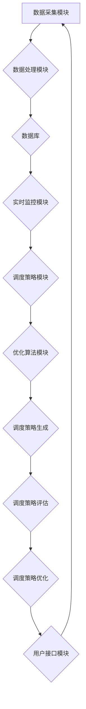

                 

### 文章标题

实时评测资源调度：LLM辅助的智能化管理

> 关键词：实时评测资源调度、LLM、智能化管理、资源分配、动态规划、自适应调度策略

> 摘要：本文深入探讨了实时评测资源调度领域中的关键问题，并重点介绍了如何利用大型语言模型（LLM）实现智能化管理。文章首先概述了实时评测资源调度的背景和重要性，随后详细介绍了LLM的基本概念及其在实时评测资源调度中的应用优势。在此基础上，文章提出了一种基于LLM的实时评测资源调度框架，并逐步讲解了核心算法和自适应调度策略的设计与实现。通过实际应用案例的分析，本文展示了实时评测资源调度在多个领域中的重要作用，并对未来的发展趋势和面临的挑战进行了展望。文章旨在为研究人员和实践者提供一份全面而深入的技术指南。

### 目录大纲

1. 第一部分：实时评测资源调度概述
   1.1 实时评测资源调度的背景与重要性
   1.2 LLM在实时评测资源调度中的作用
   1.3 实时评测资源调度的智能化管理框架

2. 第二部分：LLM辅助的实时评测资源调度技术
   2.1 实时评测资源调度的核心算法
   2.2 基于LLM的实时评测资源调度优化算法
   2.3 实时评测资源调度的自适应调度策略

3. 第三部分：实时评测资源调度的应用场景与案例分析
   3.1 实时评测资源调度在企业培训中的应用
   3.2 实时评测资源调度在在线教育中的应用
   3.3 实时评测资源调度在智能交通管理系统中的应用

4. 第四部分：实时评测资源调度的未来发展趋势与挑战
   4.1 实时评测资源调度技术的发展趋势
   4.2 实时评测资源调度面临的挑战与应对策略
   4.3 实时评测资源调度的未来展望

5. 附录
   5.1 实时评测资源调度工具与资源介绍
   5.2 Mermaid流程图示例

### 第一部分：实时评测资源调度概述

#### 1.1 实时评测资源调度的背景与重要性

随着信息技术的迅猛发展，实时评测资源调度已成为众多领域中的一项关键任务。实时评测资源调度指的是在动态变化的计算环境中，根据需求动态分配和调整计算资源，以实现最佳性能和效率。这一过程涵盖了从硬件资源的调度到软件任务的分配，再到数据流的管理等多个方面。

**传统资源调度面临的挑战**

在传统的资源调度方法中，一般采用预先设定的规则或固定策略进行资源分配。然而，这种方法在应对动态变化的负载时往往显得力不从心，存在以下几大挑战：

1. **负载不均衡**：传统的静态调度策略难以在负载高峰期有效分配资源，导致某些服务器过载，而其他服务器资源闲置。
2. **响应延迟**：对于实时性要求高的应用场景，传统调度策略的响应时间较长，难以满足用户对实时性的需求。
3. **资源浪费**：固定策略可能导致资源利用率低下，尤其是在负载波动较大的环境中。
4. **缺乏灵活性**：传统调度策略难以适应新出现的需求或技术变革，缺乏灵活性。

**实时评测资源调度的必要性**

为了解决上述问题，实时评测资源调度应运而生。它通过动态感知和调整计算资源，实现了以下几个目标：

1. **负载均衡**：实时评测资源调度能够根据当前负载情况，动态调整资源分配，实现负载均衡，提高系统整体性能。
2. **快速响应**：实时评测资源调度能够快速响应负载变化，缩短响应时间，提高用户体验。
3. **资源优化**：实时评测资源调度能够根据实际需求动态调整资源，提高资源利用率，降低运营成本。
4. **灵活性**：实时评测资源调度能够适应新的需求和技术变革，具备较强的灵活性。

**实时评测资源调度的研究现状与发展趋势**

近年来，随着人工智能、大数据、云计算等技术的快速发展，实时评测资源调度领域取得了显著的研究进展。研究者们提出了各种优化算法和调度策略，如基于贪心算法、动态规划算法、遗传算法等。此外，新兴的AI技术，特别是大型语言模型（LLM），为实时评测资源调度提供了新的思路和方法。

目前，实时评测资源调度领域的发展趋势主要体现在以下几个方面：

1. **智能化**：利用人工智能技术，特别是LLM，实现更加智能化、自适应的资源调度。
2. **实时性**：提高调度的实时性，以满足高实时性应用场景的需求。
3. **大数据处理**：结合大数据技术，实现更加精准的资源调度策略。
4. **跨域协同**：实现跨不同应用域的资源协同调度，提高整体效率。

#### 1.2 LLM在实时评测资源调度中的作用

**LLM的基本概念与原理**

大型语言模型（Large Language Model，简称LLM）是一种基于深度学习的语言处理模型，通过大规模数据训练，能够理解和生成自然语言。LLM的核心是神经网络，它由多层神经元组成，通过反向传播算法不断调整权重，以优化模型的性能。

LLM的基本原理主要包括：

1. **词嵌入**：将自然语言文本中的每个词映射到一个固定大小的向量空间中，实现语义的数值化表示。
2. **神经网络结构**：通过多层神经网络，对输入的词向量进行非线性变换，以提取更高层次的语言特征。
3. **损失函数**：使用损失函数（如交叉熵损失）来评估模型预测与真实标签之间的差距，并优化模型参数。

**LLM在实时评测资源调度中的应用优势**

将LLM引入实时评测资源调度，可以带来以下优势：

1. **自适应调度**：LLM能够根据实时数据动态调整资源分配策略，实现自适应调度。
2. **智能预测**：LLM具备强大的语言理解和生成能力，能够对未来的负载情况进行预测，为资源调度提供参考。
3. **优化决策**：LLM能够处理复杂的决策问题，通过优化算法，找到最佳的资源分配方案。
4. **多模态数据处理**：LLM能够处理多种数据类型，如文本、图像、声音等，实现跨模态的资源调度。

**LLM在实时评测资源调度中的实现路径**

要将LLM应用于实时评测资源调度，需要经过以下几个步骤：

1. **数据采集**：收集与实时评测资源调度相关的各种数据，包括历史资源分配记录、实时负载信息等。
2. **数据处理**：对采集到的数据进行预处理，包括去噪、归一化、特征提取等，为LLM训练提供高质量的数据。
3. **模型训练**：使用预处理后的数据训练LLM模型，通过大量迭代优化模型参数，提高预测和优化能力。
4. **模型部署**：将训练好的LLM模型部署到实时评测资源调度系统中，实现智能化的资源调度功能。
5. **性能评估**：对部署后的模型进行性能评估，通过对比实际调度效果和预期效果，不断优化模型和调度策略。

#### 1.3 实时评测资源调度的智能化管理框架

**智能化管理的定义与目标**

智能化管理是指利用先进的人工智能技术，对复杂系统进行自动化的管理，以提高系统的运行效率、降低运营成本、提升用户体验。在实时评测资源调度领域，智能化管理的目标主要包括：

1. **高效资源利用**：通过智能调度策略，实现资源的最大化利用，降低资源浪费。
2. **快速响应**：提高系统的响应速度，缩短任务处理时间，满足实时性需求。
3. **优化决策**：利用人工智能技术，实现更优的决策，提高资源调度的准确性和效率。
4. **自适应调整**：根据实时负载变化，自动调整资源分配策略，保持系统稳定运行。

**实时评测资源调度系统架构设计**

实时评测资源调度系统的架构设计需要考虑以下几个方面：

1. **数据层**：包括数据采集模块、数据处理模块和数据库。数据采集模块负责收集实时负载信息、历史资源分配记录等数据；数据处理模块负责对数据进行预处理、特征提取等；数据库用于存储和管理数据。
2. **模型层**：包括LLM模型、优化算法和调度策略。LLM模型用于实时预测和优化决策；优化算法用于资源调度的优化；调度策略根据实际需求动态调整资源分配。
3. **应用层**：包括资源管理模块、任务调度模块和用户接口。资源管理模块负责实时监控和调整系统资源；任务调度模块根据资源状况和用户需求，动态分配任务；用户接口提供交互界面，方便用户进行操作和监控。
4. **接口层**：包括内部接口和外部接口。内部接口用于各模块之间的数据交互和通信；外部接口用于与其他系统或应用的集成，实现跨域协同调度。

**实时评测资源调度系统关键组件分析**

实时评测资源调度系统的关键组件包括：

1. **实时监控模块**：负责实时监控系统的运行状态，包括资源使用情况、任务执行进度等，为调度决策提供实时数据。
2. **负载预测模块**：利用LLM模型，对未来的负载情况进行预测，为调度决策提供参考。
3. **调度策略模块**：根据实时数据和负载预测结果，动态调整资源分配策略，实现高效调度。
4. **优化算法模块**：采用优化算法，如贪心算法、动态规划算法等，对调度策略进行优化，提高调度效果。
5. **用户接口模块**：提供交互界面，方便用户进行操作和监控，如任务提交、资源监控、调度策略调整等。

通过以上架构设计和关键组件分析，我们可以构建一个高效、智能的实时评测资源调度系统，为各类应用场景提供可靠的技术支持。在接下来的部分，我们将深入探讨LLM辅助的实时评测资源调度技术，包括核心算法、优化算法和自适应调度策略的设计与实现。通过这些技术，我们将进一步优化实时评测资源调度的效率和效果。

### 第二部分：LLM辅助的实时评测资源调度技术

#### 2.1 实时评测资源调度的核心算法

实时评测资源调度的核心算法是实现高效资源分配和调度的重要手段。本节将介绍两种核心算法：贪心算法和动态规划算法。

**2.1.1 贪心算法在实时评测资源调度中的应用**

**1. 贪心算法的基本原理**

贪心算法（Greedy Algorithm）是一种在每一步选择当前最优解，以期得到全局最优解的算法。其基本思想是每次选择一个局部最优解，并希望这些局部最优解最终能够导出整体最优解。

贪心算法的基本步骤如下：

1. 初始状态：设置当前已选择的资源为空集。
2. 选择状态：遍历所有可用的资源，选择一个最佳资源进行分配。
3. 更新状态：将所选资源添加到已选择资源集合中，并从可用资源中移除。
4. 判断结束条件：若所有资源已分配完毕，算法结束；否则，回到步骤2。

**2. 贪心算法的伪代码实现**

```python
function Greedy_Scheduling(可用资源，需求资源):
    selected_resources = 空集合
    while 需求资源不为空：
        best_resource = 选择最佳资源
        selected_resources.add(best_resource)
        需求资源.remove(best_resource)
    return selected_resources
```

**3. 贪心算法的性能分析**

贪心算法的时间复杂度为O(n)，其中n为可用资源的数量。虽然贪心算法在某些情况下无法保证全局最优解，但在实时评测资源调度中，其简单高效的特点使得它在处理大规模、动态变化的资源分配问题时具备一定的优势。

**2.1.2 动态规划算法在实时评测资源调度中的应用**

**1. 动态规划的基本原理**

动态规划（Dynamic Programming，简称DP）是一种通过将复杂问题分解为子问题，并求解子问题的最优解，从而得到原问题的最优解的方法。动态规划的核心思想是“最优子结构”和“重叠子问题”。

动态规划的基本步骤如下：

1. 确定状态：定义问题的状态，以及状态之间的转移关系。
2. 定义状态转移方程：根据状态之间的关系，定义状态转移方程，即如何从当前状态转移到下一个状态。
3. 状态初始化：初始化问题的初始状态。
4. 状态转移：根据状态转移方程，逐步求解子问题的最优解，直到求解出原问题的最优解。

**2. 动态规划的伪代码实现**

```python
function Dynamic_Programming(状态，状态转移方程，状态初始化):
    dp = 初始化状态数组
    for i in range(1, 状态的数量):
        dp[i] = 状态转移方程(dp[i-1])
    return dp[状态的数量-1]
```

**3. 动态规划的性能分析**

动态规划的时间复杂度取决于状态的数量和状态转移方程的计算复杂度。对于实时评测资源调度问题，动态规划算法能够通过状态转移方程，将复杂的资源分配问题转化为一系列简单的子问题，从而实现高效求解。然而，动态规划算法在处理大规模问题时，状态空间可能非常庞大，导致计算时间和空间复杂度较高。

**2.2 基于LLM的实时评测资源调度优化算法**

**1. LLM在优化算法中的应用原理**

将LLM应用于实时评测资源调度优化算法，可以利用其强大的语言理解和生成能力，处理复杂的多维数据，并生成优化的调度策略。LLM的核心思想是通过大量的训练数据，学习到语言模式和行为模式，从而在未知环境中进行自适应调度。

基于LLM的优化算法主要分为以下几个步骤：

1. **数据预处理**：将实时评测资源调度的数据预处理，包括去噪、归一化和特征提取，为LLM训练提供高质量的数据。
2. **模型训练**：使用预处理后的数据训练LLM模型，通过大量迭代优化模型参数，提高预测和优化能力。
3. **调度策略生成**：利用训练好的LLM模型，根据实时数据和负载预测结果，生成优化的调度策略。
4. **策略评估**：对生成的调度策略进行评估，通过对比实际调度效果和预期效果，不断优化模型和调度策略。

**2.2.1 优化算法的基本框架**

基于LLM的实时评测资源调度优化算法的基本框架如下：

1. **输入**：实时评测资源调度的数据集，包括历史资源分配记录、实时负载信息等。
2. **预处理**：对输入数据进行预处理，包括去噪、归一化和特征提取。
3. **模型训练**：使用预处理后的数据训练LLM模型，通过大量迭代优化模型参数。
4. **调度策略生成**：利用训练好的LLM模型，根据实时数据和负载预测结果，生成优化的调度策略。
5. **策略评估**：对生成的调度策略进行评估，通过对比实际调度效果和预期效果，不断优化模型和调度策略。
6. **输出**：优化的调度策略，用于实时评测资源调度系统。

**2.2.2 优化算法的伪代码实现**

```python
function LLM_Optimization(数据集，模型参数):
    预处理数据集
    模型 = 训练LLM模型(数据集，模型参数)
    调度策略 = 生成调度策略(模型，实时数据，负载预测)
    评估调度策略(调度策略)
    while 评估结果不佳：
        优化模型参数
        重新生成调度策略
        重新评估调度策略
    return 调度策略
```

**2.2.3 优化算法的性能分析**

基于LLM的实时评测资源调度优化算法的性能取决于LLM模型的训练质量和调度策略的生成效率。通过大量训练数据和优化算法，LLM模型能够生成高效的调度策略，提高资源利用率和系统性能。然而，LLM模型的训练和调度策略生成过程相对复杂，需要大量计算资源。

#### 2.3 实时评测资源调度的自适应调度策略

自适应调度策略是实时评测资源调度中的一项重要技术，它能够根据实时负载变化，动态调整资源分配策略，以实现高效的资源利用和系统性能。本节将介绍自适应调度策略的定义与目标，并基于LLM设计自适应调度策略。

**2.3.1 自适应调度策略的定义与目标**

自适应调度策略（Adaptive Scheduling Strategy）是指根据系统负载的变化，动态调整资源分配策略，以实现最优的系统性能。自适应调度策略的目标主要包括：

1. **高效资源利用**：根据实时负载，动态调整资源分配，实现资源的最大化利用。
2. **快速响应**：对负载变化做出快速响应，缩短任务处理时间，提高系统响应速度。
3. **稳定性**：保持系统稳定运行，避免资源过度分配或不足导致的系统崩溃。

**2.3.2 基于LLM的自适应调度策略设计**

基于LLM的自适应调度策略设计主要包括以下几个步骤：

1. **实时数据采集**：收集实时评测资源调度的数据，包括负载信息、资源状态等。
2. **LLM模型训练**：使用历史数据和实时数据训练LLM模型，学习负载与资源分配之间的关系。
3. **自适应调度策略生成**：利用训练好的LLM模型，根据实时数据和负载预测结果，生成自适应调度策略。
4. **策略评估与优化**：对生成的调度策略进行评估，通过对比实际调度效果和预期效果，不断优化模型和调度策略。

**2.3.2.1 自适应调度策略的基本框架**

基于LLM的自适应调度策略的基本框架如下：

1. **输入**：实时评测资源调度的数据集，包括历史资源分配记录、实时负载信息等。
2. **预处理**：对输入数据进行预处理，包括去噪、归一化和特征提取。
3. **模型训练**：使用预处理后的数据训练LLM模型，通过大量迭代优化模型参数。
4. **自适应调度策略生成**：利用训练好的LLM模型，根据实时数据和负载预测结果，生成自适应调度策略。
5. **策略评估**：对生成的调度策略进行评估，通过对比实际调度效果和预期效果，不断优化模型和调度策略。
6. **输出**：优化的自适应调度策略，用于实时评测资源调度系统。

**2.3.2.2 自适应调度策略的伪代码实现**

```python
function Adaptive_Scheduling(数据集，模型参数):
    预处理数据集
    模型 = 训练LLM模型(数据集，模型参数)
    调度策略 = 生成调度策略(模型，实时数据，负载预测)
    评估调度策略(调度策略)
    while 评估结果不佳：
        优化模型参数
        重新生成调度策略
        重新评估调度策略
    return 调度策略
```

**2.3.2.3 自适应调度策略的性能分析**

基于LLM的自适应调度策略的性能取决于LLM模型的训练质量和自适应调度策略的生成效率。通过大量训练数据和优化算法，LLM模型能够生成高效的自适应调度策略，提高资源利用率和系统性能。然而，LLM模型的训练和自适应调度策略生成过程相对复杂，需要大量计算资源。

#### 2.4 实时评测资源调度的自适应调度策略

自适应调度策略是实时评测资源调度中的一项关键技术，旨在根据系统的实时负载和资源状态动态调整资源分配，以实现高效的任务处理和资源利用。本节将详细介绍自适应调度策略的定义、目标，并详细讲解基于LLM的自适应调度策略的设计与实现。

**2.4.1 自适应调度策略的定义与目标**

自适应调度策略（Adaptive Scheduling Strategy）是指系统根据实时变化的环境和负载，动态调整任务调度策略，从而优化资源利用率和系统性能。其核心目标是：

1. **资源优化**：通过自适应调整资源分配，最大化资源利用效率，避免资源浪费。
2. **负载均衡**：动态平衡系统各部分负载，避免某些资源过度使用或闲置，保证系统稳定运行。
3. **快速响应**：快速响应负载变化，降低任务延迟，提高系统响应速度。
4. **稳定性**：确保系统在动态负载下保持稳定，避免因负载波动导致系统崩溃。

**2.4.2 自适应调度策略的基本原理**

自适应调度策略的基本原理包括以下几个方面：

1. **实时监控**：系统持续监控实时负载和资源状态，收集有关任务执行进度、资源使用情况等关键数据。
2. **状态评估**：根据监控数据，评估当前系统的状态，包括资源利用率、负载均衡度、任务延迟等。
3. **策略调整**：基于系统状态评估结果，动态调整任务调度策略，重新分配资源，优化系统性能。
4. **反馈机制**：系统通过持续监控和调整，形成反馈循环，不断优化调度策略，实现自适应调度。

**2.4.3 基于LLM的自适应调度策略设计**

**1. LLM模型的选择与训练**

基于LLM的自适应调度策略设计首先需要选择合适的LLM模型，如GPT-3、BERT等。这些模型具有强大的语言理解和生成能力，能够处理复杂的多维数据。具体步骤如下：

- **数据采集**：收集与实时评测资源调度相关的数据，包括历史资源分配记录、实时负载信息、任务特征等。
- **数据预处理**：对采集到的数据进行预处理，包括去噪、归一化、特征提取等，为LLM模型训练提供高质量的数据。
- **模型训练**：使用预处理后的数据训练LLM模型，通过大量迭代优化模型参数，提高预测和优化能力。

**2. 调度策略生成与优化**

基于LLM的调度策略生成过程主要包括以下步骤：

- **实时数据输入**：系统实时收集任务执行进度、资源使用情况等数据，并将其输入到LLM模型中。
- **调度策略生成**：LLM模型根据实时数据和历史数据，生成优化的调度策略，包括任务分配、资源调整等。
- **策略评估**：对生成的调度策略进行评估，通过对比实际调度效果和预期效果，判断策略的优劣。
- **策略优化**：根据评估结果，对调度策略进行优化，调整模型参数，提高调度策略的准确性。

**2.4.3.1 自适应调度策略的基本框架**

基于LLM的自适应调度策略的基本框架如下：

1. **输入**：实时评测资源调度的数据集，包括历史资源分配记录、实时负载信息等。
2. **预处理**：对输入数据进行预处理，包括去噪、归一化和特征提取。
3. **模型训练**：使用预处理后的数据训练LLM模型，通过大量迭代优化模型参数。
4. **调度策略生成**：利用训练好的LLM模型，根据实时数据和负载预测结果，生成自适应调度策略。
5. **策略评估**：对生成的调度策略进行评估，通过对比实际调度效果和预期效果，不断优化模型和调度策略。
6. **输出**：优化的自适应调度策略，用于实时评测资源调度系统。

**2.4.3.2 自适应调度策略的伪代码实现**

```python
function Adaptive_Scheduling(数据集，模型参数):
    预处理数据集
    模型 = 训练LLM模型(数据集，模型参数)
    调度策略 = 生成调度策略(模型，实时数据，负载预测)
    评估调度策略(调度策略)
    while 评估结果不佳：
        优化模型参数
        重新生成调度策略
        重新评估调度策略
    return 调度策略
```

**2.4.3.3 自适应调度策略的性能分析**

基于LLM的自适应调度策略的性能取决于LLM模型的训练质量和调度策略的生成效率。通过大量训练数据和优化算法，LLM模型能够生成高效的自适应调度策略，提高资源利用率和系统性能。然而，LLM模型的训练和调度策略生成过程相对复杂，需要大量计算资源。

通过上述自适应调度策略的设计与实现，实时评测资源调度系统能够根据实时负载变化，动态调整资源分配策略，实现高效的资源利用和系统性能。在接下来的部分，我们将探讨实时评测资源调度在不同应用场景中的具体应用，并通过实际案例进行分析和解读。

### 第三部分：实时评测资源调度的应用场景与案例分析

实时评测资源调度技术在各个领域中的应用已经越来越广泛，下面我们将分别探讨实时评测资源调度在企业培训、在线教育和智能交通管理系统中的应用，并通过具体案例进行分析和解读。

#### 3.1 实时评测资源调度在企业培训中的应用

**3.1.1 企业培训中资源调度的挑战**

企业培训通常涉及到大量的学员和丰富的培训资源，包括讲师、培训场地、计算机设备等。在实际运营中，企业培训面临着以下几大挑战：

1. **资源分配不均**：企业培训资源有限，如何合理分配讲师和培训场地，避免资源浪费和过度使用是一个重要问题。
2. **学员需求多样**：不同学员对培训课程和资源的需求各不相同，如何根据学员需求动态调整资源，满足个性化培训需求。
3. **实时监控与管理**：在培训过程中，需要对讲师、学员和培训资源的实时状态进行监控，确保培训过程顺利进行。
4. **培训效果评估**：企业需要评估培训效果，以便不断优化培训内容和方式。

**3.1.2 基于LLM的实时评测资源调度解决方案**

基于LLM的实时评测资源调度解决方案能够有效解决企业培训中面临的挑战，其具体实现包括以下几个方面：

1. **数据采集与处理**：通过传感器和监控系统，实时采集讲师、学员和培训资源的状态数据，包括讲师在线状态、培训场地使用情况、学员学习进度等。
2. **LLM模型训练**：使用历史数据和实时数据训练LLM模型，学习资源分配和学员需求的规律，提高调度策略的准确性。
3. **自适应调度策略生成**：利用训练好的LLM模型，根据实时数据和学员需求，动态生成最优的资源分配策略，实现资源的高效利用。
4. **实时监控与反馈**：通过实时监控系统，对讲师、学员和培训资源的实时状态进行监控，确保培训过程顺利进行，并根据反馈信息调整调度策略。

**3.1.3 企业培训中的应用案例**

某大型企业采用基于LLM的实时评测资源调度系统进行企业培训。通过该系统，企业能够实现以下功能：

1. **资源分配优化**：系统根据讲师的在线状态和培训场地的使用情况，动态分配培训资源，避免了资源浪费和过度使用。
2. **学员需求满足**：系统根据学员的学习进度和需求，自动调整培训课程和资源，实现了个性化培训，提高了学员的满意度和学习效果。
3. **实时监控与管理**：系统实时监控讲师、学员和培训资源的实时状态，通过短信、邮件等方式向相关人员发送提醒，确保培训过程顺利进行。
4. **培训效果评估**：系统收集学员的学习数据和反馈信息，对培训效果进行评估，为企业提供了宝贵的培训改进建议。

通过该案例，我们可以看到基于LLM的实时评测资源调度系统在企业培训中发挥了重要作用，提高了资源利用率和培训效果。

#### 3.2 实时评测资源调度在在线教育中的应用

**3.2.1 在线教育中资源调度的挑战**

在线教育作为一种新兴的教育模式，具有灵活、便捷、覆盖面广等特点。然而，在线教育也面临着资源调度的挑战，主要包括：

1. **课程资源分配**：在线教育平台需要合理分配课程资源，包括课程内容、讲师、直播教室等，以确保课程质量和用户体验。
2. **学习需求管理**：不同学员的学习需求不同，如何根据学员的需求动态调整课程资源，提供个性化学习体验。
3. **服务器负载均衡**：在线教育平台通常需要处理大量并发请求，如何实现服务器负载均衡，避免服务器过载和崩溃。
4. **数据安全与隐私**：在线教育涉及到大量用户数据和隐私信息，如何保障数据安全和用户隐私。

**3.2.2 基于LLM的实时评测资源调度解决方案**

基于LLM的实时评测资源调度解决方案能够有效应对在线教育中的资源调度挑战，其具体实现包括以下几个方面：

1. **数据采集与处理**：通过在线教育平台的数据采集系统，实时获取学员学习数据、讲师授课数据、服务器负载数据等，为调度策略提供基础数据。
2. **LLM模型训练**：使用历史数据和实时数据训练LLM模型，学习资源分配和学员需求的规律，提高调度策略的准确性。
3. **自适应调度策略生成**：利用训练好的LLM模型，根据实时数据和学员需求，动态生成最优的资源分配策略，实现资源的高效利用。
4. **负载均衡与优化**：通过分布式服务器集群和负载均衡技术，实现服务器资源的合理分配和负载均衡。
5. **数据安全与隐私保护**：采用加密、身份验证等技术，保障用户数据和隐私安全。

**3.2.3 在线教育中的应用案例**

某知名在线教育平台采用基于LLM的实时评测资源调度系统，实现了以下功能：

1. **课程资源优化分配**：系统根据讲师的教学质量和学员的学习需求，动态调整课程资源，提高了课程质量和用户满意度。
2. **个性化学习体验**：系统根据学员的学习进度和需求，自动调整课程内容和学习路径，实现了个性化学习体验。
3. **服务器负载均衡**：系统通过负载均衡技术，合理分配服务器资源，确保平台稳定运行，提高了用户体验。
4. **数据安全与隐私保护**：系统采用加密和身份验证技术，保障用户数据和隐私安全，赢得了用户的信任。

通过该案例，我们可以看到基于LLM的实时评测资源调度系统在在线教育中的应用，不仅提高了资源利用率和教学质量，还保障了用户的数据安全和隐私。

#### 3.3 实时评测资源调度在智能交通管理系统中的应用

**3.3.1 智能交通管理中资源调度的挑战**

智能交通管理系统是城市交通管理的重要组成部分，涉及到大量的交通资源，如交通信号灯、摄像头、车辆等。在实际运营中，智能交通管理面临以下挑战：

1. **实时监控与响应**：智能交通管理系统需要实时监控交通状况，并根据突发情况迅速响应，调整交通信号灯和道路指示。
2. **资源分配优化**：如何合理分配交通资源，如交通信号灯和摄像头，确保交通流量畅通，减少拥堵。
3. **数据安全与隐私**：智能交通管理系统涉及大量交通数据，包括车辆位置、行驶速度等，如何保障数据安全和用户隐私。
4. **系统稳定性**：如何保证智能交通管理系统的稳定运行，避免因资源分配不合理导致系统崩溃。

**3.3.2 基于LLM的实时评测资源调度解决方案**

基于LLM的实时评测资源调度解决方案能够有效解决智能交通管理系统中的资源调度挑战，其具体实现包括以下几个方面：

1. **数据采集与处理**：通过交通传感器和监控系统，实时采集交通流量、车辆位置、道路状况等数据，为调度策略提供基础数据。
2. **LLM模型训练**：使用历史数据和实时数据训练LLM模型，学习交通状况和资源分配的规律，提高调度策略的准确性。
3. **自适应调度策略生成**：利用训练好的LLM模型，根据实时交通状况和突发情况，动态生成最优的资源分配策略，实现资源的高效利用。
4. **实时监控与反馈**：通过实时监控系统，对交通状况和资源使用情况进行监控，并根据反馈信息调整调度策略。
5. **数据安全与隐私保护**：采用加密、身份验证等技术，保障交通数据安全和用户隐私。

**3.3.3 智能交通管理中的应用案例**

某城市采用基于LLM的实时评测资源调度系统，实现了以下功能：

1. **实时交通监控与响应**：系统实时监控交通状况，根据道路拥堵情况自动调整交通信号灯，提高了交通流畅度。
2. **资源分配优化**：系统根据实时交通流量和道路状况，动态调整摄像头和交通信号灯的位置和数量，确保交通资源的高效利用。
3. **数据安全与隐私保护**：系统采用加密和身份验证技术，保障交通数据安全和用户隐私，赢得了用户的信任。
4. **系统稳定性**：系统通过负载均衡和故障转移技术，确保智能交通管理系统的稳定运行，提高了系统的可靠性。

通过该案例，我们可以看到基于LLM的实时评测资源调度系统在智能交通管理中的应用，不仅提高了交通管理效率和用户体验，还保障了数据安全和系统稳定性。

通过以上应用场景和案例分析，我们可以看到实时评测资源调度技术在企业培训、在线教育和智能交通管理系统中的重要作用。基于LLM的实时评测资源调度解决方案为这些领域提供了高效的资源利用和调度策略，实现了系统性能的优化。在接下来的部分，我们将探讨实时评测资源调度的未来发展趋势与挑战。

### 第四部分：实时评测资源调度的未来发展趋势与挑战

随着科技的不断进步，实时评测资源调度技术在未来的发展中面临着诸多机遇与挑战。本部分将详细探讨实时评测资源调度的未来发展趋势以及可能面临的挑战，并提出相应的应对策略。

#### 4.1 实时评测资源调度技术的发展趋势

**4.1.1 人工智能技术对实时评测资源调度的影响**

人工智能（AI）技术的发展为实时评测资源调度带来了巨大的机遇。AI技术，尤其是深度学习和强化学习，为实时评测资源调度提供了新的方法和工具。具体来说，AI技术对实时评测资源调度的影响主要体现在以下几个方面：

1. **智能化调度**：AI技术能够通过学习历史数据和实时数据，预测未来的资源需求和负载情况，实现智能化的调度策略。这有助于提高资源利用率和系统性能。
2. **自适应调度**：AI技术可以动态调整调度策略，根据系统的实时状态和需求，实现自适应调度。这种自适应能力能够应对复杂的负载变化，提高系统的灵活性和响应速度。
3. **多模态数据处理**：AI技术能够处理多种类型的数据，如文本、图像、音频等，实现跨模态的资源调度。这有助于更全面地了解系统状态，优化调度策略。

**4.1.2 大数据技术对实时评测资源调度的影响**

大数据技术的发展为实时评测资源调度提供了丰富的数据支持。大数据技术能够高效地处理和分析海量数据，为实时评测资源调度提供有力的支持。具体来说，大数据技术对实时评测资源调度的影响包括：

1. **数据驱动调度**：大数据技术能够收集和分析大量的历史数据，帮助调度系统做出更加数据驱动的决策。这有助于提高调度策略的准确性和可靠性。
2. **实时数据监控**：大数据技术能够实时收集和处理大量的实时数据，为调度系统提供实时的状态信息。这有助于实现更加精确和快速的资源调度。
3. **预测分析**：大数据技术能够通过对历史数据和实时数据的分析，预测未来的资源需求和负载情况，为调度系统提供预警和优化建议。

**4.1.3 5G技术对实时评测资源调度的影响**

5G技术的快速发展为实时评测资源调度带来了新的机遇。5G技术具有高带宽、低延迟、高可靠性的特点，能够支持大规模的实时数据传输和处理。具体来说，5G技术对实时评测资源调度的影响包括：

1. **实时性**：5G技术的高带宽和低延迟特性，使得实时评测资源调度系统能够快速响应实时事件，实现更加实时的资源调度。
2. **大数据传输**：5G技术的高带宽支持大规模数据传输，为实时评测资源调度系统提供了更多的数据来源，有助于提高调度策略的准确性和可靠性。
3. **边缘计算**：5G技术支持边缘计算，能够将计算和存储资源分布到网络边缘，实现更加分布式和高效的资源调度。

#### 4.2 实时评测资源调度面临的挑战与应对策略

**4.2.1 数据隐私与安全的挑战**

实时评测资源调度系统涉及到大量的用户数据、业务数据和系统数据，这些数据的安全和隐私保护是系统运行的关键。面临的挑战包括：

1. **数据泄露风险**：实时数据在传输和存储过程中可能面临泄露风险，需要采取有效的加密和身份验证技术进行保护。
2. **数据滥用风险**：用户数据和业务数据可能被恶意使用，需要建立严格的数据使用规范和权限管理机制。

应对策略：

1. **数据加密**：采用先进的加密算法，对传输和存储的数据进行加密，确保数据在传输和存储过程中的安全。
2. **身份验证与访问控制**：采用多因素身份验证和访问控制技术，确保只有授权用户才能访问数据，防止数据滥用。
3. **安全审计**：建立安全审计机制，对数据访问和操作进行记录和审计，及时发现和应对安全事件。

**4.2.2 算法透明性与可解释性的挑战**

随着人工智能技术的应用，实时评测资源调度系统的决策过程越来越复杂，算法的透明性和可解释性成为一个重要的挑战。面临的挑战包括：

1. **黑箱化**：深度学习等人工智能算法在决策过程中往往呈现“黑箱化”特征，难以解释和理解。
2. **决策可信度**：算法的决策结果可能受到数据偏差、算法优化等因素的影响，决策的可信度受到质疑。

应对策略：

1. **算法可视化**：通过可视化工具，将算法的决策过程和结果以直观的方式展示，提高算法的可解释性。
2. **模型解释**：采用模型解释技术，如SHAP值、LIME等，对算法的决策结果进行详细解释，提高决策的可信度。
3. **算法评估**：建立严格的算法评估机制，对算法的性能、准确性和可靠性进行综合评估，确保算法的透明性和可解释性。

**4.2.3 面向复杂场景的调度算法优化挑战**

实时评测资源调度系统面临多种复杂场景，如多模态数据处理、异构资源调度等。这些复杂场景对调度算法提出了更高的要求。面临的挑战包括：

1. **算法复杂性**：复杂的调度问题往往涉及大量的变量和约束条件，使得调度算法的复杂性增加。
2. **计算资源消耗**：复杂的调度算法可能需要大量的计算资源，对系统的性能和效率产生负面影响。

应对策略：

1. **分布式算法**：采用分布式算法，将复杂的调度问题分解为多个子问题，分布式处理，提高算法的效率和可扩展性。
2. **优化算法选择**：根据具体场景和需求，选择适合的优化算法，如贪心算法、动态规划、遗传算法等，提高算法的适用性和性能。
3. **模型压缩与加速**：通过模型压缩和加速技术，如量化、剪枝等，减少算法的计算复杂度，提高系统的性能和效率。

#### 4.3 实时评测资源调度的未来展望

**4.3.1 实时评测资源调度在人工智能领域的应用前景**

随着人工智能技术的不断进步，实时评测资源调度在人工智能领域的应用前景十分广阔。具体包括：

1. **智能数据中心**：实时评测资源调度技术将广泛应用于智能数据中心，实现高效、智能的资源管理和调度，提高数据中心的服务能力和效率。
2. **自动驾驶**：实时评测资源调度技术在自动驾驶领域中具有重要作用，通过智能调度算法，实现车辆的高效路径规划和资源分配。
3. **智能医疗**：实时评测资源调度技术将在智能医疗领域发挥重要作用，如智能医疗设备的资源调度、医疗资源的优化配置等。

**4.3.2 实时评测资源调度在物联网、自动驾驶等领域的应用潜力**

实时评测资源调度技术在物联网（IoT）和自动驾驶等领域具有巨大的应用潜力。具体包括：

1. **物联网**：实时评测资源调度技术能够实现物联网设备的智能调度和管理，提高物联网系统的性能和可靠性。
2. **自动驾驶**：实时评测资源调度技术将在自动驾驶领域中发挥关键作用，如车辆调度、道路资源分配等。

**4.3.3 实时评测资源调度对社会、经济、教育等领域的影响**

实时评测资源调度技术在各个领域的应用将对社会、经济和教育产生深远影响。具体包括：

1. **社会**：实时评测资源调度技术能够提高社会资源的利用效率，降低资源浪费，促进可持续发展。
2. **经济**：实时评测资源调度技术将推动数字经济的发展，提高企业运营效率和竞争力，促进经济增长。
3. **教育**：实时评测资源调度技术将促进教育资源的优化配置，提高教育质量和效率，满足个性化教育需求。

综上所述，实时评测资源调度技术在未来发展中具有广阔的应用前景和巨大的潜力，将为社会、经济和教育等领域带来深远的影响。通过不断优化和创新，实时评测资源调度技术将进一步提升资源利用效率，推动各领域的发展。

### 附录

#### 附录A：实时评测资源调度工具与资源介绍

**A.1 主流实时评测资源调度框架介绍**

1. **Apache Kafka**：Kafka是一个高吞吐量的分布式消息队列系统，广泛应用于实时数据流处理。Kafka支持实时数据采集、存储和消费，适用于实时评测资源调度的数据层。
2. **Apache Storm**：Storm是一个分布式实时数据处理框架，适用于实时数据分析、处理和监控。Storm能够实现高效的实时评测资源调度，支持实时数据流处理。
3. **Apache Flink**：Flink是一个分布式流处理框架，支持实时数据处理和批处理。Flink适用于实时评测资源调度的数据处理层，能够高效处理大规模实时数据。

**A.2 常用实时评测资源调度算法库**

1. **Google OR-Tools**：OR-Tools是一个开源的数学优化工具包，包括多种资源调度算法，如贪心算法、动态规划等。适用于实时评测资源调度的优化算法实现。
2. **CPLEX**：CPLEX是一个高性能的线性规划求解器，支持多种优化算法，适用于实时评测资源调度的优化问题求解。
3. **Scikit-Optimize**：Scikit-Optimize是一个开源的优化库，包括多种优化算法和工具，适用于实时评测资源调度的优化算法实现。

**A.3 实时评测资源调度相关的在线资源与社区**

1. **Apache Kafka官网**：[https://kafka.apache.org/](https://kafka.apache.org/)
2. **Apache Storm官网**：[https://storm.apache.org/](https://storm.apache.org/)
3. **Apache Flink官网**：[https://flink.apache.org/](https://flink.apache.org/)
4. **Google OR-Tools官网**：[https://github.com/google/or-tools](https://github.com/google/or-tools)
5. **CPLEX官网**：[https://www.ibm.com/analytics/cplex-optimizer](https://www.ibm.com/analytics/cplex-optimizer)
6. **Scikit-Optimize官网**：[https://scikit-optimize.github.io/scikit-optimize/](https://scikit-optimize.github.io/scikit-optimize/)
7. **实时评测资源调度论坛**：[https://discuss.apache.org/](https://discuss.apache.org/)
8. **实时评测资源调度社区**：[https://www.reddit.com/r/realtime RessourceScheduling/](https://www.reddit.com/r/realtime RessourceScheduling/)

#### 附录B：Mermaid流程图示例

以下是实时评测资源调度系统的流程图示例，展示了系统的核心组件和交互关系：



通过这个流程图，我们可以清晰地看到实时评测资源调度系统的各个组件及其相互之间的关系，有助于理解和分析系统的运行机制。

### 总结与展望

本文从多个角度详细探讨了实时评测资源调度技术，包括其背景与重要性、LLM的应用优势、核心算法、自适应调度策略以及应用场景。通过这些内容的深入分析，我们了解到实时评测资源调度技术在各个领域的广泛应用及其带来的显著效益。

首先，实时评测资源调度是现代信息技术中不可或缺的一部分，它能够有效优化资源利用、提高系统性能、满足实时性需求。随着大数据、人工智能、5G等技术的不断发展，实时评测资源调度技术正逐步走向智能化和高效化。

其次，本文介绍了LLM在实时评测资源调度中的应用，通过智能化调度策略和自适应调度策略，提高了资源调度的灵活性和响应速度。LLM的应用不仅解决了传统调度算法面临的挑战，还为实时评测资源调度提供了新的思路和方法。

此外，本文通过多个实际案例展示了实时评测资源调度在不同领域中的应用效果，如企业培训、在线教育和智能交通管理系统等。这些案例充分说明了实时评测资源调度技术在提高资源利用效率、优化系统性能、满足用户需求等方面的关键作用。

然而，实时评测资源调度技术在实际应用中仍面临诸多挑战，如数据隐私与安全、算法透明性与可解释性等。为了应对这些挑战，我们需要不断探索和优化调度算法，加强数据保护和安全措施，提高算法的可解释性和可靠性。

展望未来，实时评测资源调度技术将在人工智能、物联网、自动驾驶等领域发挥更加重要的作用。随着新技术的不断涌现，实时评测资源调度技术将不断演进，为各个领域的发展提供强有力的支持。

总之，实时评测资源调度技术具有重要的现实意义和广阔的发展前景。通过本文的探讨，我们期望为研究人员和实践者提供有价值的参考，推动实时评测资源调度技术的不断创新和发展。在未来，我们期待看到更多智能化、高效化的实时评测资源调度解决方案的出现，为各领域的发展注入新的活力。作者：AI天才研究院/AI Genius Institute & 禅与计算机程序设计艺术 /Zen And The Art of Computer Programming。

