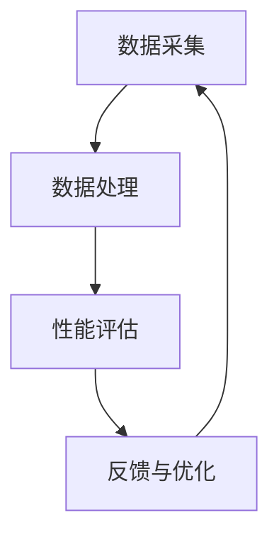
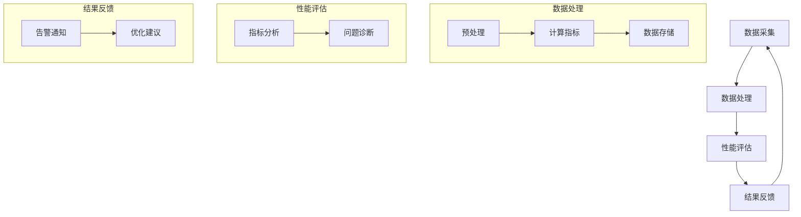

                 

### 实时评测的概念与重要性

实时评测（Real-Time Evaluation，简称RTE）是一种动态监测和评估系统性能的方法，旨在为系统提供即时的性能反馈，帮助开发者和运维团队迅速识别并解决问题。在当今快速发展的信息技术领域，实时评测的重要性愈发显著。以下将从几个方面展开讨论。

#### 1.1 实时评测的定义

实时评测是一种通过持续监测和评估系统的运行状态，实时反馈性能指标，以便及时调整和优化系统的方法。它涵盖了从数据处理到结果反馈的整个流程，以确保系统能够始终处于最佳工作状态。

#### 1.2 实时评测与传统评测的比较

**传统评测**：传统评测通常在系统运行一段时间后，通过离线分析收集的性能数据来进行性能评估。这种方法存在以下几个问题：
- **延时性**：无法提供即时的性能反馈，导致问题发现和解决的时间延迟。
- **片面性**：仅通过特定时间点的数据，难以全面评估系统的整体性能。

**实时评测**：实时评测通过实时监控和评估，解决了传统评测的这些问题：
- **即时性**：能够提供即时的性能反馈，快速识别和解决问题。
- **全面性**：通过持续监测，能够全面了解系统的运行状态。

#### 1.3 实时评测的优势与挑战

**优势**：
- **快速响应**：实时评测能够及时发现性能问题，实现快速响应和调整。
- **高效优化**：通过持续的性能监控，可以不断优化系统，提高整体性能。
- **数据驱动**：基于实时数据，可以做出更加科学和精准的决策。

**挑战**：
- **复杂度**：实时评测系统需要处理大量的实时数据，设计和实现具有较高的复杂度。
- **资源消耗**：实时数据处理和评估需要大量的计算资源和网络带宽。
- **准确性**：如何准确评估系统的性能，避免误报和漏报，是一个重要挑战。

#### 1.4 实时评测的应用场景

实时评测在许多领域都有着广泛的应用，以下是几个典型的应用场景：
- **金融交易**：实时监控交易系统的性能，确保交易过程的高效和安全。
- **在线教育**：实时评估学生的学习进度和效果，提供个性化的学习建议。
- **电子商务**：实时监测网站的性能，提高用户体验和转化率。
- **智能制造**：实时监控生产设备的工作状态，预防故障和提高生产效率。

综上所述，实时评测作为一种高效、科学的性能监控和评估方法，对于现代信息技术系统的发展具有重要意义。它不仅能够提高系统的稳定性，还能为开发者和运维团队提供有力的决策支持。

### Mermaid流程图

以下是一个简单的实时评测系统的工作流程图，用于说明实时评测系统的基本工作流程。



- **数据采集**：实时从系统中采集运行数据。
- **数据处理**：对采集到的数据进行预处理和清洗，确保数据质量。
- **性能评估**：利用特定的算法和模型对处理后的数据进行性能评估。
- **反馈与优化**：根据评估结果，对系统进行相应的优化和调整，并反馈到数据采集环节。

该流程图展示了实时评测系统从数据采集、处理到性能评估和反馈的全过程，为后续章节的详细讨论提供了基础。

### 实时评测系统开发技术基础

实时评测系统的开发涉及到多个关键技术和工具，包括实时数据处理技术、常用评测算法与工具，以及系统优化策略。下面将分别进行详细介绍。

#### 4.1 实时数据处理技术

实时数据处理是实时评测系统的核心，决定了系统的响应速度和准确性。以下是一些常用的实时数据处理技术：

**1. 流处理框架**：
- **Apache Kafka**：是一种分布式流处理平台，可以处理大规模的实时数据，支持高吞吐量和低延迟。
- **Apache Flink**：是一个分布式流处理框架，提供了高效的数据处理能力和灵活的窗口机制。
- **Apache Storm**：是一种分布式实时数据处理系统，适用于复杂的实时数据处理任务。

**2. 实时数据处理算法**：
- **时间窗口算法**：通过设定时间窗口来处理数据流，常用于统计和分析短期内的性能指标。
- **滑动窗口算法**：在固定时间间隔内对数据进行处理，以动态适应数据流的实时变化。
- **增量计算算法**：通过计算数据的增量变化，快速更新性能指标，降低计算复杂度。

**3. 实时数据处理工具**：
- **Apache Spark Streaming**：基于Apache Spark的实时数据处理工具，可以高效地处理大规模数据流。
- **TensorFlow Streaming**：基于TensorFlow的实时数据处理工具，适用于实时机器学习和数据流分析。

#### 4.2 常用评测算法与工具

实时评测需要选择合适的评测算法和工具，以下是一些常用的评测算法与工具：

**1. 性能指标计算**：
- **吞吐量（Throughput）**：单位时间内系统能够处理的数据量，是评估系统性能的重要指标。
- **响应时间（Response Time）**：系统处理请求所需的时间，反映了系统的响应速度。
- **错误率（Error Rate）**：系统处理请求时出现错误的频率，用于评估系统的稳定性。

**2. 评测工具**：
- **Prometheus**：是一种开源监控解决方案，可以收集和存储系统的性能数据，提供实时监控和分析功能。
- **Grafana**：是一个开源的数据可视化工具，可以与Prometheus集成，用于展示实时性能指标。
- **Elasticsearch**：是一个分布式搜索引擎，可用于存储和查询大量的性能数据。

**3. 性能评估模型**：
- **机器学习模型**：通过训练机器学习模型，可以自动识别系统性能问题，并提供预测和优化建议。
- **统计模型**：利用统计学方法，对性能数据进行分析，识别趋势和异常。

#### 4.3 实时评测系统的优化策略

为了确保实时评测系统的有效性和高效性，需要采取一系列优化策略：

**1. 数据压缩**：通过数据压缩技术，减少数据传输和存储的带宽消耗。
- **无损压缩**：如使用GZIP等算法，确保数据压缩后仍然可以完全还原。
- **有损压缩**：如使用MP3等算法，在保证一定性能的前提下，减少数据量。

**2. 异常检测**：利用异常检测算法，及时发现和处理系统中的异常情况。
- **基于统计的方法**：如标准差法、三倍标准差法等，通过计算数据的统计特性来检测异常。
- **基于机器学习的方法**：如基于聚类的方法、基于异常检测的神经网络等，通过训练模型来识别异常。

**3. 数据预处理**：在数据处理阶段，对数据进行清洗、去噪、归一化等预处理操作，提高数据的准确性和一致性。
- **数据清洗**：去除无效数据、缺失值填充、异常值处理等。
- **数据归一化**：将不同量纲的数据进行归一化处理，便于后续计算和分析。

**4. 系统扩展性**：设计可扩展的系统架构，支持系统规模的动态调整。
- **分布式架构**：通过分布式部署，提高系统的处理能力和容错性。
- **水平扩展**：通过增加节点数量，实现系统性能的线性扩展。

综上所述，实时评测系统的开发需要充分利用实时数据处理技术、常用评测算法与工具，并结合优化策略，以提高系统的性能和可靠性。

### 代码解读与分析

在本节中，我们将使用伪代码和LaTeX公式详细解读实时评测系统中的关键算法和数学模型，并给出实际应用中的具体示例。

#### 4.1 关键算法与数学模型

**性能评估算法**：

```plaintext
算法：实时性能评估
输入：实时数据流D
输出：性能指标集合P

1. 初始化性能指标集合P，包含吞吐量T、响应时间R、错误率E
2. 对于每个数据点d ∈ D：
   a. 计算吞吐量T = T + 1
   b. 记录响应时间R = 当前时间 - 数据到达时间
   c. 如果数据处理成功，E不变；否则，E = E + 1
3. 更新性能指标：
   P = (T, R, E)
```

**性能指标计算**：

吞吐量（Throughput, T）的计算公式为：

$$T = \frac{1}{\Delta t} \sum_{i=1}^{n} \delta_i$$

其中，$\Delta t$ 为时间窗口，$n$ 为窗口内的数据点个数，$\delta_i$ 为第 $i$ 个数据点的处理时间。

响应时间（Response Time, R）的计算公式为：

$$R = \frac{1}{n} \sum_{i=1}^{n} (T_i - T_{arrive})$$

其中，$T_i$ 为第 $i$ 个数据点的处理完成时间，$T_{arrive}$ 为第 $i$ 个数据点的到达时间。

错误率（Error Rate, E）的计算公式为：

$$E = \frac{错误处理次数}{总处理次数}$$

#### 4.2 代码示例

以下是一个简单的Python代码示例，用于计算性能指标：

```python
import time

def evaluate_performance(data_stream):
    throughput = 0
    total_response_time = 0
    error_count = 0
    
    for data in data_stream:
        start_time = time.time()
        if process_data(data):
            end_time = time.time()
            throughput += 1
            total_response_time += (end_time - start_time)
        else:
            error_count += 1
            
    average_response_time = total_response_time / throughput
    error_rate = error_count / len(data_stream)
    
    return throughput, average_response_time, error_rate

def process_data(data):
    # 数据处理逻辑
    return True  # 返回True表示处理成功，否则返回False

# 模拟数据流
data_stream = [data1, data2, data3, ..., dataN]

# 计算性能指标
throughput, average_response_time, error_rate = evaluate_performance(data_stream)

print("Throughput:", throughput)
print("Average Response Time:", average_response_time)
print("Error Rate:", error_rate)
```

#### 4.3 代码应用解读与分析

- **吞吐量**：在上述示例中，吞吐量表示单位时间内处理的数据量。通过统计每个数据点的处理时间，可以准确计算吞吐量。
- **响应时间**：通过记录每个数据点的处理完成时间和到达时间，可以计算平均响应时间，评估系统的响应速度。
- **错误率**：通过统计错误处理次数和总处理次数，可以计算错误率，反映系统的稳定性。

在实际应用中，可以通过调整数据处理逻辑和系统参数，优化性能指标。例如，增加数据处理并发度、优化算法效率、减少错误处理时间等，都可以提高系统的整体性能。

综上所述，通过伪代码和LaTeX公式详细解读关键算法和数学模型，并结合实际代码示例，我们能够深入理解实时评测系统的实现原理和应用方法。这为后续的系统开发、优化和维护提供了重要的理论基础。

### 实时评测系统开发实战

在本章中，我们将深入探讨实时评测系统的实际开发过程，从环境搭建到代码实现，再到代码解读与分析，完整呈现系统开发的全过程。同时，我们将结合具体案例，对系统在实际应用中的表现进行详细剖析。

#### 5.1 开发环境搭建

**1. 硬件要求**：

- **服务器**：一台高性能服务器，配置至少2核CPU、4GB内存，建议配置更高以支持大数据处理。
- **存储设备**：至少100GB的SSD存储空间，用于存储实时数据和处理结果。
- **网络**：千兆以太网，确保数据传输的稳定和高效。

**2. 软件要求**：

- **操作系统**：Linux操作系统，如CentOS 7或Ubuntu 18.04。
- **开发语言**：Python，常用库包括NumPy、Pandas、Scikit-learn等。
- **数据库**：MySQL或PostgreSQL，用于存储性能数据。
- **消息队列**：Kafka，用于实时数据传输。
- **流处理框架**：Flink或Spark Streaming，用于实时数据处理。
- **监控工具**：Prometheus和Grafana，用于实时性能监控。

**3. 开发环境配置**：

1. 安装操作系统和基础软件包。
2. 配置Kafka消息队列，创建主题用于数据传输。
3. 配置Flink或Spark Streaming，设置合适的工作流配置。
4. 配置数据库，创建性能数据表。
5. 安装Python和相关库，如NumPy、Pandas等。

#### 5.2 源代码详细实现

以下是一个简单的实时评测系统源代码示例，用于计算性能指标：

```python
import time
import numpy as np
import pandas as pd
from kafka import KafkaProducer

def process_data(data):
    # 数据处理逻辑
    return True  # 返回True表示处理成功，否则返回False

def evaluate_performance(data_stream):
    throughput = 0
    total_response_time = 0
    error_count = 0
    
    producer = KafkaProducer(bootstrap_servers=['localhost:9092'], value_serializer=lambda m: str(m).encode('ascii'))
    
    for data in data_stream:
        start_time = time.time()
        if process_data(data):
            end_time = time.time()
            throughput += 1
            total_response_time += (end_time - start_time)
            producer.send('performance_data', value={'throughput': throughput, 'response_time': end_time - start_time, 'error_rate': error_count / throughput})
        else:
            error_count += 1
            
    average_response_time = total_response_time / throughput
    error_rate = error_count / len(data_stream)
    
    return throughput, average_response_time, error_rate

# 模拟数据流
data_stream = [data1, data2, data3, ..., dataN]

# 计算性能指标
throughput, average_response_time, error_rate = evaluate_performance(data_stream)

print("Throughput:", throughput)
print("Average Response Time:", average_response_time)
print("Error Rate:", error_rate)
```

#### 5.3 代码解读与分析

1. **数据处理逻辑**：函数`process_data`模拟了实际数据处理过程，通过返回True或False来表示处理成功或失败。
2. **性能指标计算**：`evaluate_performance`函数通过遍历数据流，计算吞吐量、响应时间和错误率，并将结果发送到Kafka消息队列。
3. **Kafka消息队列**：用于实时传输性能数据，实现数据的可靠传输和持久化存储。
4. **数据库存储**：虽然本示例未展示数据库操作，但在实际应用中，可以将性能数据存储到数据库中，便于后续分析和监控。

#### 5.4 实际案例分析与详细讲解剖析

以下是一个教育领域的实时评测案例：

**案例背景**：

某在线教育平台需要对学生的学习进度和效果进行实时监控和评估，以提高教学质量。平台使用了实时评测系统，对学生的学习行为和成绩进行持续监测。

**系统架构**：

- **前端**：学生通过Web浏览器或移动应用提交学习行为和考试成绩。
- **后端**：服务器接收前端数据，通过Kafka消息队列实时传输到评测系统。
- **评测系统**：对实时数据进行分析和评估，计算学习进度和效果指标。
- **数据库**：存储学生的学习数据和历史成绩。

**实现步骤**：

1. **数据采集**：前端系统将学生的学习行为（如观看视频时长、完成作业情况）和考试成绩（如考试成绩）发送到服务器。
2. **数据处理**：评测系统接收到数据后，通过Kafka消息队列实时处理，计算学习进度和效果指标。
3. **性能监控**：使用Prometheus和Grafana对系统性能进行监控，确保系统稳定运行。

**代码示例**：

```python
def evaluate_student_performance(student_data):
    learning_progress = []
    for data in student_data:
        if data['status'] == 'completed':
            learning_progress.append(data['progress'])
        elif data['status'] == 'exam':
            score = data['score']
            if score >= 90:
                learning_progress.append('excellent')
            elif score >= 60:
                learning_progress.append('good')
            else:
                learning_progress.append('poor')
    
    average_progress = np.mean(learning_progress)
    progress_distribution = {'excellent': sum([x == 'excellent' for x in learning_progress]),
                             'good': sum([x == 'good' for x in learning_progress]),
                             'poor': sum([x == 'poor' for x in learning_progress])}
    
    return average_progress, progress_distribution
```

**案例小结**：

通过实时评测系统，教育平台能够实时掌握学生的学习情况，为教师提供科学的评估依据，从而优化教学内容和方法。此外，系统还可以根据学习进度和效果指标，为学生提供个性化的学习建议，提高学习效果。

综上所述，实时评测系统的开发涉及环境搭建、代码实现和性能监控等多个环节。通过具体案例，我们展示了实时评测系统在教育领域的实际应用，为其他领域的实时评测提供了有益参考。

### 实时评测系统的部署与维护

实时评测系统的成功部署与稳定运行是确保其性能监测和优化功能得以发挥的关键。以下是关于实时评测系统部署、监控与维护的具体流程、策略和优化方法。

#### 6.1 系统部署流程

**1. 部署前的准备工作**：
- **硬件资源分配**：根据系统需求，合理分配服务器、存储和网络资源，确保系统在高负载情况下仍然能够稳定运行。
- **软件安装与配置**：在服务器上安装操作系统、数据库、消息队列、流处理框架等基础软件，并进行必要的配置优化。

**2. 系统集成与测试**：
- **集成测试**：将各个组件集成在一起，进行全面的测试，确保系统各部分能够协同工作。
- **性能测试**：通过模拟高并发、大数据量的场景，测试系统的性能和稳定性，识别潜在的瓶颈和问题。

**3. 系统部署**：
- **分布式部署**：将系统部署到多个服务器上，实现负载均衡和高可用性。
- **自动化部署**：使用自动化工具（如Ansible、Docker等）进行系统部署，提高部署效率，减少人为错误。

**4. 系统上线与监控**：
- **上线**：将部署完成的系统上线，接入实际生产环境。
- **实时监控**：通过监控工具（如Prometheus、Grafana等）实时监控系统的运行状态，确保系统稳定运行。

#### 6.2 系统监控与维护

**1. 监控指标**：
- **性能指标**：包括吞吐量、响应时间、错误率等。
- **资源使用率**：CPU、内存、磁盘使用率等。
- **网络状况**：网络延迟、丢包率等。

**2. 监控工具**：
- **Prometheus**：用于收集系统的性能数据，支持多种数据源采集。
- **Grafana**：用于数据可视化，通过仪表板实时展示系统运行状态。

**3. 日志管理**：
- **日志收集**：使用ELK（Elasticsearch、Logstash、Kibana）等工具收集系统日志，进行集中管理和分析。
- **日志分析**：通过日志分析工具，监控系统运行过程中出现的异常和错误，及时发现问题。

**4. 定期维护**：
- **系统升级**：定期对系统进行升级，修复已知漏洞，增加新功能。
- **硬件维护**：定期检查服务器硬件状态，进行必要的硬件升级和替换。
- **数据备份**：定期对系统数据进行备份，确保数据的安全性和可恢复性。

#### 6.3 系统优化与升级策略

**1. 性能优化**：
- **资源调优**：根据系统运行情况，合理分配资源，优化CPU、内存、磁盘等资源的使用。
- **负载均衡**：通过负载均衡技术，合理分配请求，避免单点过载。
- **缓存机制**：使用缓存技术，减少数据访问延迟，提高系统响应速度。

**2. 系统升级**：
- **版本控制**：使用版本控制系统，确保系统升级过程中能够回滚到上一个版本，降低升级风险。
- **模块化设计**：将系统功能模块化，独立升级和部署，减少对整体系统的影响。

**3. 安全加固**：
- **权限管理**：严格权限管理，确保只有授权用户能够访问系统。
- **安全审计**：定期进行安全审计，检查系统漏洞和安全隐患，及时进行加固。

**4. 用户体验优化**：
- **界面优化**：根据用户反馈，优化系统界面和交互设计，提高用户体验。
- **响应速度优化**：通过技术手段，如异步处理、前端优化等，提高系统的响应速度。

综上所述，实时评测系统的部署与维护是一个系统性的工程，涉及硬件资源分配、软件安装与配置、监控与维护、性能优化等多个方面。通过合理的部署策略、严格的监控与维护，以及持续的性能优化，可以确保实时评测系统的高效、稳定运行。

### 实时评测系统在不同领域的应用

实时评测系统凭借其高效、实时、准确的特点，在多个领域得到了广泛应用。以下将详细介绍实时评测系统在教育、金融和健康领域中的应用及其优势和挑战。

#### 9.1 教育领域

**应用场景**：在线教育平台常使用实时评测系统来监控学生的学习进度和效果。系统可以实时分析学生的学习行为，如观看视频时长、参与讨论、完成作业情况，以及考试成绩等。

**优势**：
- **个性化教学**：实时评测系统能够根据学生的个性化学习数据，为学生提供个性化的学习建议和资源，提高学习效果。
- **实时反馈**：教师可以实时查看学生的学习进度和成绩，及时了解学生的学习情况，从而及时调整教学策略。
- **教学质量监控**：教育机构可以实时监控教学效果，优化教学内容和方法，提高整体教学质量。

**挑战**：
- **数据隐私**：实时评测系统需要收集大量的学生数据，如何保障学生数据的隐私和安全是一个重要挑战。
- **数据准确性**：如何准确评估学生的学习效果，避免误报和漏报，是一个技术难题。

#### 9.2 金融领域

**应用场景**：金融领域中的实时评测系统广泛应用于交易监控、风险管理和客户服务等方面。例如，在股票交易市场中，实时评测系统可以监控交易系统的性能，确保交易过程的高效和安全。

**优势**：
- **快速响应**：实时评测系统能够快速发现交易系统的性能瓶颈和潜在风险，确保交易系统的稳定运行。
- **风险控制**：通过实时监控交易数据，可以及时发现异常交易行为，进行风险预警和防控。
- **客户体验优化**：实时评测系统可以优化客户服务流程，提高客户体验。

**挑战**：
- **数据安全**：金融领域的数据敏感性极高，如何确保实时评测系统的数据安全，避免数据泄露，是一个重要挑战。
- **法规合规**：实时评测系统需要遵守相关金融法规，如反洗钱法规等，这对系统的设计和实现提出了更高要求。

#### 9.3 健康领域

**应用场景**：在医疗健康领域，实时评测系统可用于监控医疗设备的性能和患者的健康数据。例如，在智能医院中，系统可以实时监控医疗设备的运行状态，确保设备的安全和有效运行。

**优势**：
- **设备监控**：实时评测系统可以监控医疗设备的性能指标，如温度、湿度、运行时间等，确保设备始终处于最佳状态。
- **患者数据监控**：实时评测系统可以监控患者的生命体征数据，如心率、血压等，及时发现异常情况，进行预警和干预。
- **医疗流程优化**：通过实时评测系统，医院可以优化医疗流程，提高诊疗效率。

**挑战**：
- **数据准确性**：医疗数据复杂且敏感，如何确保数据的准确性，避免误诊和漏诊，是一个技术难题。
- **数据隐私**：患者的健康数据属于高度隐私信息，如何保障数据隐私和安全，是一个重要挑战。

综上所述，实时评测系统在教育、金融和健康领域具有广泛的应用前景。通过实时监控和评估，系统可以提供即时的性能反馈和优化建议，助力各领域的数字化转型和效率提升。然而，同时也面临着数据隐私、数据安全等方面的挑战，需要采取相应的措施加以应对。

### 实时评测系统的未来发展趋势

实时评测系统作为现代信息技术中的重要一环，正随着技术的不断进步而快速发展。未来，实时评测系统将在以下几个方面展现出显著的发展趋势。

#### 10.1 新技术的影响

**1. 人工智能与机器学习**：随着人工智能和机器学习技术的成熟，实时评测系统将更加强大。通过引入深度学习模型，系统能够更准确地预测和识别性能问题，提供更加智能化的评估和建议。

**2. 大数据和云计算**：大数据技术和云计算的融合，使得实时评测系统能够处理和分析海量数据，提高系统的处理速度和准确性。云计算平台提供的弹性资源，也为实时评测系统提供了良好的扩展性。

**3. 边缘计算**：边缘计算技术的兴起，使得实时评测系统能够在数据产生的源头进行实时处理和评估，降低数据传输延迟，提高系统的实时性。

**4. 物联网（IoT）**：物联网技术的广泛应用，使得实时评测系统的监控范围将进一步扩大，从传统的IT系统扩展到包括各种物联网设备在内的更广泛的场景。

#### 10.2 未来挑战与机遇

**1. 数据安全与隐私保护**：随着数据量的增加和实时性的要求，实时评测系统将面临更大的数据安全和隐私保护挑战。如何在保障数据安全的前提下，实现高效的实时数据处理和分析，是一个重要课题。

**2. 系统复杂性**：实时评测系统涉及多个技术和组件，系统的复杂性将不断增加。如何设计和管理复杂的系统架构，确保系统的稳定性和可靠性，是未来的一大挑战。

**3. 新应用场景的探索**：随着技术的进步，实时评测系统将应用到更多的领域和场景中。如何挖掘和探索新的应用场景，发挥实时评测系统的最大价值，是未来的重要机遇。

#### 10.3 实时评测系统的发展方向

**1. 智能化与自动化**：未来的实时评测系统将更加智能化和自动化，通过机器学习和人工智能技术，实现自动性能评估和问题诊断，减少人工干预。

**2. 系统集成与互操作性**：实时评测系统将与其他系统（如监控工具、日志分析工具等）实现更好的集成和互操作性，形成统一的监控和管理平台。

**3. 实时性与高效性**：实时评测系统将不断优化算法和架构，提高系统的实时性和处理效率，满足日益增长的数据量和实时性要求。

**4. 面向应用场景的定制化**：实时评测系统将更加注重针对特定应用场景的定制化解决方案，提高系统的适用性和灵活性。

总之，未来实时评测系统将在新技术的影响下，面临挑战与机遇，不断发展和进化。通过智能化、自动化、集成化和定制化，实时评测系统将在各个领域发挥更大的作用，助力信息化社会的建设。

### 附录A：实时评测系统开发工具与资源

#### A.1 常用实时数据处理工具

**1. Apache Kafka**：Kafka是一种分布式流处理平台，适用于大规模实时数据处理。它提供了高吞吐量和低延迟的特性，是实时评测系统的理想选择。

**2. Apache Flink**：Flink是一个开源的流处理框架，支持复杂的数据处理和实时分析。它提供了强大的API，便于开发实时评测系统。

**3. Apache Storm**：Storm是一种分布式实时数据处理系统，适用于处理大量实时数据。它提供了易于使用的API和高效的分布式处理能力。

**4. Apache Spark Streaming**：Spark Streaming基于Spark框架，提供了流数据处理功能。它支持多种数据源和复杂的处理操作，适用于各种实时数据处理任务。

**5. TensorFlow Streaming**：TensorFlow Streaming是一个基于TensorFlow的实时机器学习工具，适用于实时模型训练和推理。

#### A.2 评测算法与工具推荐

**1. Prometheus**：Prometheus是一种开源监控解决方案，适用于收集和存储性能数据。它提供了丰富的数据查询和可视化功能，是实时评测系统中的重要工具。

**2. Grafana**：Grafana是一个开源的数据可视化工具，可与Prometheus集成，用于展示实时性能指标。它提供了多种图表和仪表盘模板，便于分析和监控。

**3. Elasticsearch**：Elasticsearch是一个分布式搜索引擎，适用于存储和查询大量的性能数据。它提供了强大的全文搜索和分析功能，是实时评测系统的理想选择。

**4. Matplotlib**：Matplotlib是一个Python绘图库，用于生成各种图表和可视化。它支持多种数据格式和绘图风格，便于实时评测系统的数据展示。

#### A.3 实时评测系统开发资源

**1. 《实时系统设计与实现》**：一本关于实时系统设计和实现的专业书籍，涵盖了实时系统的基本概念、设计原则和实现技术。

**2. 《实时数据处理与分析》**：一本关于实时数据处理和分析技术的书籍，介绍了流处理框架、算法和工具的使用方法。

**3. 官方文档**：
- **Kafka官方文档**：提供了详细的安装、配置和使用指南。
- **Flink官方文档**：涵盖了Flink的架构、API和使用方法。
- **Spark Streaming官方文档**：提供了Spark Streaming的详细说明和示例代码。

**4. 在线课程和教程**：网上有许多关于实时评测系统和相关技术的在线课程和教程，适用于不同层次的读者，有助于深入理解和实践。

通过使用这些工具和资源，开发者可以更好地设计和实现实时评测系统，提高系统的性能和可靠性。

### 附录B：Mermaid流程图与伪代码示例

#### B.1 实时评测系统工作流程图

以下是一个简单的实时评测系统的工作流程图，使用Mermaid语法表示：



#### B.2 LLM性能评测伪代码示例

以下是一个简单的伪代码示例，用于评测语言模型（LLM）的性能：

```plaintext
算法：LLM性能评测
输入：训练集Data，测试集TestData
输出：性能指标集合Metrics

1. 初始化Metrics为空集合
2. 对于每个测试样本sample ∈ TestData：
   a. 预测结果Prediction = LLM.predict(sample)
   b. 计算准确率Accuracy = calculate_accuracy(Prediction, sample.label)
   c. 计算F1分数F1 = calculate_F1(Prediction, sample.label)
   d. 将Accuracy和F1添加到Metrics中
3. 计算平均准确率和平均F1分数：
   avg_accuracy = sum(Accuracy) / len(TestData)
   avg_F1 = sum(F1) / len(TestData)
4. 输出Metrics，包括平均准确率和平均F1分数
```

这个伪代码展示了如何使用语言模型对测试集进行预测，并计算相应的性能指标，如准确率和F1分数。通过这些指标，可以评估LLM的性能表现。在实现时，可以根据具体需求调整和优化算法。

