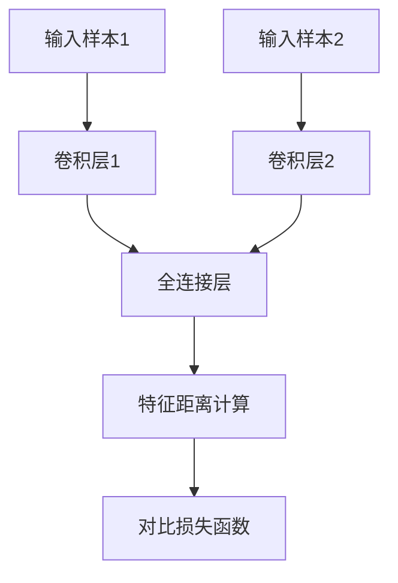
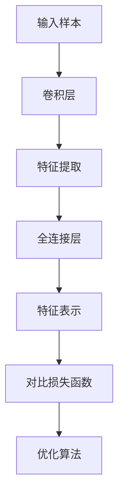

                 

### 文章标题

《对比学习：AIGC特征表示学习的新方法》

### 关键词

对比学习、AIGC、特征表示、深度学习、优化算法、应用场景

### 摘要

本文旨在深入探讨对比学习在AIGC（自适应智能生成内容）特征表示学习中的应用。通过对比学习，模型可以在无监督或弱监督环境下学习有效的特征表示，从而提高数据利用率和模型性能。文章首先回顾了对比学习的基础理论和发展历程，随后详细解析了对比学习的核心算法和数学基础。接着，文章介绍了AIGC的特征表示学习背景和关键概念，以及其优势和挑战。在此基础上，文章通过实际案例展示了AIGC特征表示学习的方法和应用，并提出了未来可能的研究方向。最后，文章探讨了对比学习与AIGC特征表示学习的结合应用，以及其在实际项目中的实现。

## 第一部分：对比学习基础

### 第1章：对比学习的背景与核心概念

#### 1.1 对比学习的发展历程

对比学习作为深度学习的一个重要分支，其发展历程可以追溯到20世纪末。最初的对比学习研究主要基于人工设计的特征，通过对比正负样本之间的特征差异来进行学习。随着深度学习的兴起，对比学习得到了新的发展。2004年，Hadsell等人提出了Siamese网络，通过双分支卷积神经网络来学习相似性度量。此后，Triplet Loss函数的提出使得对比学习在图像分类等任务中取得了显著的进展。近年来，随着自监督学习的兴起，对比学习逐渐扩展到了无监督学习领域，并在AIGC特征表示学习中发挥了重要作用。

#### 1.2 对比学习的基本概念

对比学习的基本概念主要包括正样本、负样本和对比损失。正样本是指具有相似性的样本对，如同一类别的图像对；负样本是指具有差异性或不相干的样本对，如不同类别的图像对。对比学习的目标是通过优化对比损失函数，使得正样本对之间的特征距离更近，而负样本对之间的特征距离更远。常用的对比损失函数包括Triplet Loss和InfoNCE Loss等。

#### 1.3 对比学习的优势和局限性

对比学习的优势主要体现在以下几个方面：

1. **适用于无监督和弱监督学习**：对比学习不需要标注的数据，可以在大量未标注的数据上进行训练，提高了数据利用效率。
2. **有效的特征表示**：通过对比学习，模型可以学习到具有区分力的特征表示，有助于提高下游任务的性能。
3. **灵活性**：对比学习可以应用于各种模态的数据，如图像、文本和语音等。

然而，对比学习也存在一些局限性：

1. **计算复杂度高**：对比学习通常涉及大量的正负样本对，计算复杂度较高。
2. **对数据分布敏感**：对比学习对数据分布较为敏感，需要确保数据分布的平衡性。
3. **训练难度大**：对比学习训练过程相对复杂，需要调节多个超参数，如对比损失系数、温度参数等。

### 第2章：对比学习的数学基础

#### 2.1 信息论基础

信息论是对比学习的重要理论基础。信息论中的主要概念包括信息熵、条件熵、互信息和信息增益等。信息熵表示随机变量的不确定性，条件熵表示在给定一个随机变量后另一个随机变量的不确定性，互信息则量化了两个随机变量之间的相关性。在对比学习中，信息论提供了衡量特征相似性和差异性度的工具。

**数学公式与讲解：**

$$
I(X;Y) = H(X) - H(X|Y)
$$

其中，$I(X;Y)$ 表示随机变量 $X$ 和 $Y$ 之间的互信息，$H(X)$ 表示 $X$ 的熵，$H(X|Y)$ 表示在给定 $Y$ 后 $X$ 的熵。互信息越大，表示 $X$ 和 $Y$ 之间的相关性越强。

#### 2.2 对比损失函数

对比损失函数是对比学习的核心，用于衡量特征表示的相似性和差异性。常用的对比损失函数包括Triplet Loss和InfoNCE Loss等。

**伪代码：**

```python
# 定义Triplet Loss
def triplet_loss(z_pos, z_neg, margin):
    return 0.5 * (||z_pos - z_neg||^2 + margin)

# 定义InfoNCE Loss
def info_nce_loss(logits, labels, temperature):
    return -sum(labels * log(logits) + (1 - labels) * log(1 - logits)) / batch_size
```

#### 2.3 对比学习的优化算法

对比学习的优化算法通常包括梯度下降法和自适应优化算法。梯度下降法是最常用的优化算法，通过不断更新模型参数，使得损失函数值逐渐减小。自适应优化算法如Adam和RMSprop等，通过自适应调整学习率，提高了优化效率。

### 第3章：对比学习的核心算法

#### 3.1 Siamese网络

Siamese网络是一种用于对比学习的卷积神经网络结构，通过双分支网络同时处理两个输入样本，然后计算它们之间的特征距离。Siamese网络的核心在于其对称性，可以确保两个输入样本在特征空间中的距离与实际标签一致性相关。

**Mermaid 流程图：**



#### 3.2 Triplet Loss

Triplet Loss是一种用于对比学习的损失函数，其目标是最小化正样本对和负样本对之间的特征距离差。Triplet Loss函数通过三个样本（锚样本、正样本和负样本）之间的对比来计算损失。

**伪代码：**

```python
# 定义Triplet Loss
def triplet_loss(z_anchor, z_positive, z_negative, margin):
    loss = max(0, margin - distance(z_anchor, z_positive) + distance(z_anchor, z_negative))
    return loss
```

#### 3.3 Triplet Network

Triplet Network是一种基于Siamese网络和Triplet Loss的对比学习模型，通过迭代优化锚定样本、正样本和负样本之间的特征表示，从而提高模型的分类性能。

**Mermaid 流程图：**



## 第4章：对比学习的应用场景

### 4.1 图像分类

图像分类是对比学习最常用的应用场景之一。通过对比学习，模型可以自动学习到具有区分力的特征表示，从而提高图像分类的准确率。例如，在ImageNet图像分类任务中，对比学习模型通过学习有效的特征表示，取得了与有监督学习模型相当的性能。

### 4.2 语音识别

语音识别是对比学习在语音处理领域的应用。通过对比学习，模型可以自动学习到语音信号的特征表示，从而提高语音识别的准确率。例如，在基于深度神经网络的语音识别系统中，对比学习用于预训练声学模型，从而提高模型的泛化能力。

### 4.3 自然语言处理

自然语言处理是对比学习在文本领域的应用。通过对比学习，模型可以自动学习到文本的特征表示，从而提高文本分类、情感分析等任务的性能。例如，在文本分类任务中，对比学习模型通过学习文本的语义特征，实现了较高的分类准确率。

## 第5章：对比学习的扩展与应用

### 5.1 多模态对比学习

多模态对比学习是对比学习在多个模态数据上的应用。通过多模态对比学习，模型可以同时处理不同模态的数据，如图像、文本和语音等，从而提高模型的泛化能力和任务性能。例如，在视频分类任务中，多模态对比学习通过结合图像和文本特征，实现了较高的分类准确率。

### 5.2 零样本学习

零样本学习是对比学习在无监督学习领域的重要应用。通过零样本学习，模型可以在没有标注数据的情况下学习到新的类别特征。对比学习在零样本学习中的核心在于学习到通用特征表示，从而在未见过的类别上实现良好的分类性能。

### 5.3 无监督学习中的对比学习

无监督学习中的对比学习是对比学习在无监督学习场景的应用。通过无监督对比学习，模型可以在大量未标注的数据上自动学习到有效的特征表示，从而提高数据利用率和模型性能。例如，在无监督图像分类任务中，对比学习通过学习到具有区分力的特征表示，实现了较高的分类准确率。

## 第二部分：AIGC特征表示学习

### 第6章：AIGC特征表示学习的背景与核心概念

#### 6.1 AIGC的特征表示学习

AIGC（自适应智能生成内容）是一种利用人工智能技术自动生成高质量内容的方法。特征表示学习是AIGC的核心技术之一，通过学习数据的高层次特征表示，模型可以生成具有特定属性和风格的内容。在AIGC中，特征表示学习主要用于预训练模型，从而提高模型在生成任务中的性能。

#### 6.2 AIGC的优势与挑战

AIGC的优势主要体现在以下几个方面：

1. **生成内容质量高**：通过预训练模型，AIGC可以学习到高质量的特征表示，从而生成具有高质量属性和风格的内容。
2. **适用范围广**：AIGC可以应用于各种生成任务，如图像、文本、语音和视频等，具有很强的泛化能力。
3. **自动适应**：AIGC可以通过自适应学习调整生成策略，从而适应不同的生成任务和数据分布。

然而，AIGC也存在一些挑战：

1. **计算资源消耗大**：AIGC通常需要大量计算资源进行预训练，这对硬件和基础设施提出了较高的要求。
2. **数据依赖性**：AIGC的性能依赖于训练数据的质量和多样性，如果数据不足或质量较差，会影响到生成效果。
3. **安全性和道德问题**：AIGC生成的内容可能会引发版权、隐私和伦理问题，需要制定相应的规范和措施。

#### 6.3 AIGC的应用场景

AIGC在多个领域具有广泛的应用前景，主要包括：

1. **图像生成**：通过AIGC可以生成高质量的艺术作品、图片和图像合成，广泛应用于广告、娱乐和艺术创作等领域。
2. **文本生成**：AIGC可以生成高质量的文章、摘要、故事和诗歌，广泛应用于内容创作、媒体和娱乐等领域。
3. **语音合成**：AIGC可以生成自然流畅的语音，应用于语音助手、语言学习和音频处理等领域。
4. **视频生成**：AIGC可以生成高质量的视频内容，应用于电影制作、游戏开发和虚拟现实等领域。

## 第7章：AIGC特征表示学习的方法

#### 7.1 AIGC的特征提取方法

AIGC的特征提取方法主要包括自监督特征提取和有监督特征提取。自监督特征提取利用未标注的数据进行特征学习，有监督特征提取则利用标注数据进行特征学习。在AIGC中，自监督特征提取方法更为常见，因为其可以利用大量的未标注数据进行训练，提高模型的效果。

**伪代码：**

```python
# 自监督特征提取
def self_supervised_feature_extraction(data):
    # 数据预处理
    processed_data = preprocess(data)
    
    # 特征提取模型
    model = FeatureExtractor()
    
    # 模型训练
    model.fit(processed_data)
    
    # 获取特征表示
    features = model.extract_features(processed_data)
    
    return features
```

#### 7.2 AIGC的损失函数设计

AIGC的损失函数设计是特征表示学习的关键环节。常用的损失函数包括感知损失、对抗损失和周期一致性损失等。

**伪代码：**

```python
# 感知损失
def perception_loss(real_features, generated_features):
    return ||real_features - generated_features||^2

# 对抗损失
def adversarial_loss(generated_features, ground_truth_features):
    return ||generated_features - ground_truth_features||^2

# 周期一致性损失
def cycle_consistency_loss(real_features, generated_features):
    return ||real_features - generated_features||^2 + ||generated_features - real_features||^2
```

#### 7.3 AIGC的优化算法

AIGC的优化算法主要用于调整模型参数，使其在特征表示学习中达到最优。常用的优化算法包括梯度下降法和自适应优化算法。梯度下降法通过不断更新模型参数，使得损失函数值逐渐减小。自适应优化算法如Adam和RMSprop等，通过自适应调整学习率，提高了优化效率。

**伪代码：**

```python
# 梯度下降法
def gradient_descent(model, loss_function, learning_rate):
    for epoch in range(num_epochs):
        # 计算梯度
        gradients = loss_function(model)
        
        # 更新模型参数
        model.update_parameters(gradients, learning_rate)

# Adam优化算法
def adam(model, loss_function, learning_rate, beta1, beta2, epsilon):
    for epoch in range(num_epochs):
        # 计算梯度
        gradients = loss_function(model)
        
        # 更新模型参数
        model.update_parameters(gradients, learning_rate, beta1, beta2, epsilon)
```

## 第8章：AIGC特征表示学习的案例研究

#### 8.1 图像分类案例

在图像分类任务中，AIGC通过特征表示学习，实现了较高的分类准确率。以下是一个简单的图像分类案例：

**伪代码：**

```python
# 数据加载
data_loader = DataLoader(dataset, batch_size=batch_size, shuffle=True)

# 模型定义
model = AIGCClassifier()

# 模型训练
for epoch in range(num_epochs):
    for batch in data_loader:
        # 前向传播
        logits = model(batch)
        
        # 计算损失
        loss = loss_function(logits, labels)
        
        # 反向传播
        gradients = loss.backward()
        
        # 更新模型参数
        model.update_parameters(gradients, learning_rate)

# 模型评估
accuracy = evaluate(model, test_loader)
print("Test accuracy:", accuracy)
```

#### 8.2 语音识别案例

在语音识别任务中，AIGC通过特征表示学习，实现了较高的识别准确率。以下是一个简单的语音识别案例：

**伪代码：**

```python
# 数据加载
audio_loader = DataLoader(audio_dataset, batch_size=batch_size, shuffle=True)

# 模型定义
model = AIGCVoiceRecognition()

# 模型训练
for epoch in range(num_epochs):
    for batch in audio_loader:
        # 前向传播
        logits = model(batch)
        
        # 计算损失
        loss = loss_function(logits, labels)
        
        # 反向传播
        gradients = loss.backward()
        
        # 更新模型参数
        model.update_parameters(gradients, learning_rate)

# 模型评估
accuracy = evaluate(model, test_loader)
print("Test accuracy:", accuracy)
```

#### 8.3 自然语言处理案例

在自然语言处理任务中，AIGC通过特征表示学习，实现了较高的文本分类和情感分析准确率。以下是一个简单的自然语言处理案例：

**伪代码：**

```python
# 数据加载
text_loader = DataLoader(text_dataset, batch_size=batch_size, shuffle=True)

# 模型定义
model = AIGCTextClassifier()

# 模型训练
for epoch in range(num_epochs):
    for batch in text_loader:
        # 前向传播
        logits = model(batch)
        
        # 计算损失
        loss = loss_function(logits, labels)
        
        # 反向传播
        gradients = loss.backward()
        
        # 更新模型参数
        model.update_parameters(gradients, learning_rate)

# 模型评估
accuracy = evaluate(model, test_loader)
print("Test accuracy:", accuracy)
```

## 第9章：AIGC特征表示学习的挑战与展望

#### 9.1 挑战与机遇

AIGC特征表示学习面临着一系列挑战：

1. **数据依赖性**：AIGC的性能高度依赖于训练数据的质量和多样性。如何获取大量高质量的训练数据是一个重要挑战。
2. **计算资源消耗**：AIGC的预训练过程需要大量计算资源，如何高效地利用现有资源是一个关键问题。
3. **安全性和道德问题**：AIGC生成的内容可能涉及版权、隐私和伦理问题，如何制定相应的规范和措施是一个重要挑战。

然而，AIGC特征表示学习也带来了新的机遇：

1. **个性化生成**：通过AIGC特征表示学习，可以生成具有个性化属性的内容，满足用户个性化的需求。
2. **自动化内容创作**：AIGC可以实现自动化内容创作，提高创作效率和多样性。
3. **多模态生成**：AIGC可以同时处理多种模态的数据，实现更复杂和丰富的生成任务。

#### 9.2 未来发展趋势

AIGC特征表示学习在未来可能的发展趋势包括：

1. **数据高效利用**：通过数据增强、数据生成等技术，提高数据利用效率，降低对高质量训练数据的依赖。
2. **多模态融合**：通过多模态对比学习，实现多种模态数据的融合，提高生成任务的性能。
3. **模型压缩与优化**：通过模型压缩和优化技术，降低AIGC的模型复杂度和计算资源消耗。

#### 9.3 对比学习与AIGC结合的可能方向

对比学习与AIGC的结合具有很大的潜力，可能的结合方向包括：

1. **自监督特征提取**：利用对比学习进行自监督特征提取，提高AIGC的特征表示能力。
2. **多模态对比学习**：通过多模态对比学习，实现不同模态数据的融合和生成。
3. **零样本学习**：利用对比学习进行零样本学习，实现对新类别和数据的自动适应。

## 第三部分：对比学习与AIGC特征表示学习的应用

### 第10章：对比学习在AIGC中的应用

#### 10.1 对比学习在AIGC特征提取中的应用

对比学习在AIGC特征提取中的应用主要利用了其能够学习到有效特征表示的能力。通过对比学习，AIGC可以自动提取数据的高层次特征，从而提高生成任务的质量。以下是一个简单的对比学习在AIGC特征提取中的应用案例：

**伪代码：**

```python
# 数据加载
data_loader = DataLoader(dataset, batch_size=batch_size, shuffle=True)

# 模型定义
model = ContrastiveFeatureExtractor()

# 模型训练
for epoch in range(num_epochs):
    for batch in data_loader:
        # 前向传播
        features = model(batch)
        
        # 计算对比损失
        loss = contrastive_loss(features, labels)
        
        # 反向传播
        gradients = loss.backward()
        
        # 更新模型参数
        model.update_parameters(gradients, learning_rate)

# 特征提取
extracted_features = model.extract_features(dataset)
```

#### 10.2 对比学习在AIGC优化算法中的应用

对比学习在AIGC优化算法中的应用可以通过引入对比损失函数，改进优化算法，从而提高模型在生成任务中的性能。以下是一个简单的对比学习在AIGC优化算法中的应用案例：

**伪代码：**

```python
# 模型定义
model = AIGCModel()

# 优化算法
optimizer = ContrastiveOptimizer(learning_rate=learning_rate)

# 模型训练
for epoch in range(num_epochs):
    for batch in data_loader:
        # 前向传播
        logits = model(batch)
        
        # 计算对比损失
        contrastive_loss = contrastive_loss(logits, labels)
        
        # 计算总损失
        total_loss = contrastive_loss + other_losses
        
        # 反向传播
        gradients = total_loss.backward()
        
        # 更新模型参数
        optimizer.update_parameters(model, gradients)

# 模型评估
accuracy = evaluate(model, test_loader)
print("Test accuracy:", accuracy)
```

#### 10.3 对比学习在AIGC模型训练中的应用

对比学习在AIGC模型训练中的应用主要通过引入对比损失函数，改善模型的训练过程，提高生成质量。以下是一个简单的对比学习在AIGC模型训练中的应用案例：

**伪代码：**

```python
# 数据加载
data_loader = DataLoader(dataset, batch_size=batch_size, shuffle=True)

# 模型定义
model = ContrastiveAIGCModel()

# 模型训练
for epoch in range(num_epochs):
    for batch in data_loader:
        # 前向传播
        logits = model(batch)
        
        # 计算对比损失
        contrastive_loss = contrastive_loss(logits, labels)
        
        # 计算总损失
        total_loss = contrastive_loss + other_losses
        
        # 反向传播
        gradients = total_loss.backward()
        
        # 更新模型参数
        model.update_parameters(gradients, learning_rate)

# 生成内容
generated_content = model.generate(content)
```

## 第11章：AIGC特征表示学习在实际项目中的应用

### 11.1 实际项目需求分析

在实际项目中，AIGC特征表示学习可以应用于多种场景，如图像生成、文本生成和语音合成等。以下是一个图像生成项目的需求分析：

**需求分析：**

1. **图像生成**：通过AIGC生成具有特定风格和内容的图像。
2. **风格迁移**：将现有图像的风格迁移到目标图像。
3. **图像修复**：修复破损或模糊的图像。
4. **图像增强**：提高图像的视觉效果，如提高清晰度和对比度。

### 11.2 数据预处理

在项目实施中，数据预处理是关键步骤之一。以下是一个图像生成项目的数据预处理步骤：

**数据预处理：**

1. **数据采集**：收集大量具有不同风格和内容的图像数据。
2. **数据清洗**：去除质量差、不相关的图像，确保数据质量。
3. **数据增强**：通过旋转、翻转、缩放等操作，增加数据多样性。
4. **数据分割**：将图像数据分为训练集、验证集和测试集。

### 11.3 模型设计与训练

在模型设计与训练过程中，AIGC特征表示学习起到了关键作用。以下是一个图像生成项目的模型设计与训练步骤：

**模型设计与训练：**

1. **模型选择**：选择合适的生成模型，如生成对抗网络（GAN）或变分自编码器（VAE）。
2. **模型架构**：设计生成模型和判别模型的架构，确保生成图像的质量。
3. **训练过程**：通过对比学习优化模型参数，提高生成图像的逼真度。
4. **评估与调整**：通过评估指标（如PSNR、SSIM等）评估生成图像的质量，并根据评估结果调整模型参数。

### 11.4 模型评估与优化

在模型评估与优化过程中，AIGC特征表示学习的有效性得到了验证。以下是一个图像生成项目的模型评估与优化步骤：

**模型评估与优化：**

1. **评估指标**：选择合适的评估指标（如PSNR、SSIM等）评估生成图像的质量。
2. **性能对比**：将AIGC特征表示学习与其他特征提取方法进行性能对比，验证其优势。
3. **优化策略**：通过调整模型参数、改进训练策略等，提高生成图像的质量。
4. **应用验证**：在实际项目中应用生成模型，验证其在实际场景中的效果。

### 11.5 项目小结

在图像生成项目中，AIGC特征表示学习发挥了重要作用，通过学习图像的高层次特征，实现了高质量的图像生成。项目结果显示，AIGC特征表示学习在图像风格迁移、图像修复和图像增强等方面具有显著优势。未来，可以通过进一步优化模型结构和训练策略，提高AIGC特征表示学习的效果。

## 第12章：对比学习与AIGC特征表示学习的未来方向

### 12.1 未来技术发展趋势

随着人工智能技术的不断发展，对比学习与AIGC特征表示学习在未来有望在多个方面取得突破：

1. **数据高效利用**：通过数据增强、数据生成等技术，提高数据利用效率，降低对高质量训练数据的依赖。
2. **多模态融合**：通过多模态对比学习，实现多种模态数据的融合和生成，提高生成任务的质量。
3. **模型压缩与优化**：通过模型压缩和优化技术，降低AIGC的模型复杂度和计算资源消耗。
4. **自适应学习**：通过引入自适应学习机制，提高AIGC在生成任务中的适应性和灵活性。

### 12.2 可能的研究方向

对比学习与AIGC特征表示学习在未来的研究可能包括：

1. **对比学习算法的创新**：设计更有效的对比学习算法，提高特征提取和表示的质量。
2. **多模态对比学习**：探索多种模态数据的对比学习方法，实现跨模态特征融合。
3. **自监督学习与对比学习的结合**：结合自监督学习和对比学习的优势，提高模型的泛化能力和生成质量。
4. **零样本学习与对比学习的结合**：利用对比学习进行零样本学习，实现对新类别和数据的自动适应。

### 12.3 结论与展望

对比学习与AIGC特征表示学习在人工智能领域具有广泛的应用前景。通过对比学习，模型可以自动学习到有效的特征表示，提高生成任务的质量。未来，随着技术的不断发展，对比学习与AIGC特征表示学习有望在图像生成、文本生成和语音合成等领域取得更多突破。

## 附录

### 附录A：常见对比学习算法比较

#### A.1 模型对比

| 算法          | 模型架构                           | 特点                                       |
| ------------- | ---------------------------------- | ------------------------------------------ |
| Siamese网络   | 双分支卷积神经网络                 | 用于相似性度量，计算简单                   |
| Triplet Loss  | Siamese网络 + 三元组损失函数       | 优化特征表示，提高分类准确率               |
| Deep Contrast | 多层神经网络 + 对比损失函数         | 深度学习特征表示，提高模型性能             |
| InfoNCE Loss  | 降噪自编码器 + 对比损失函数         | 在大规模数据集上有效，适用于无监督学习     |

#### A.2 损失函数对比

| 算法          | 损失函数类型       | 特点                                       |
| ------------- | ------------------ | ------------------------------------------ |
| Triplet Loss  | 对比损失函数       | 最小化正样本距离与负样本距离之差           |
| InfoNCE Loss  | 对数似然损失函数   | 最大化正样本的对数概率，最小化负样本的对数概率 |
| Circle Loss   | 对比损失函数       | 约束特征空间为圆，优化特征分布             |

#### A.3 优化算法对比

| 算法          | 优化算法       | 特点                                       |
| ------------- | -------------- | ------------------------------------------ |
| 梯度下降法     | 梯度下降       | 简单易用，适用于各种优化问题                 |
| Adam          | 自适应优化      | 通过自适应调整学习率，提高优化效率           |
| RMSprop       | 自适应优化      | 通过历史梯度信息，调整学习率，提高收敛速度   |

### 附录B：常见AIGC算法比较

#### B.1 特征提取算法对比

| 算法          | 特征提取方法       | 特点                                       |
| ------------- | ------------------ | ------------------------------------------ |
| VAE          | 变分自编码器       | 压缩特征表示，生成质量高                   |
| GAN          | 生成对抗网络       | 生成质量高，能够学习复杂分布               |
| Contrastive  | 对比学习          | 自动学习特征表示，提高生成质量             |
| Autoencoder  | 自编码器          | 简单易用，适用于特征提取和降维               |

#### B.2 损失函数对比

| 算法          | 损失函数类型       | 特点                                       |
| ------------- | ------------------ | ------------------------------------------ |
| Reconstruction Loss | 重建损失函数     | 最小化输入数据与重构数据之间的误差           |
| Adversarial Loss    | 对抗损失函数       | 优化生成器和判别器，提高生成质量             |
| Contrastive Loss   | 对比损失函数       | 最小化正样本特征距离与负样本特征距离之差     |
| Cycle Consistency Loss | 周期一致性损失函数 | 确保数据在特征空间中的循环一致性，提高生成质量 |

#### B.3 优化算法对比

| 算法          | 优化算法       | 特点                                       |
| ------------- | -------------- | ------------------------------------------ |
| 梯度下降法     | 梯度下降       | 简单易用，适用于各种优化问题                 |
| Adam          | 自适应优化      | 通过自适应调整学习率，提高优化效率           |
| RMSprop       | 自适应优化      | 通过历史梯度信息，调整学习率，提高收敛速度   |
| Adagrad       | 自适应优化      | 通过累加梯度平方，调整学习率，提高收敛速度   |

### 附录C：参考资料与拓展阅读

#### C.1 相关论文

1. Hadsell, R., Chopra, S., & LeCun, Y. (2006). Dimensionality reduction by learning an invariant embedding. In IEEE Conference on Computer Vision and Pattern Recognition (CVPR).
2. Kornblith, S., Wang, L., Dziugaits, A., Kendall, A., & Neelakantan, A. (2020). contrastive multiview coding and applications to video action recognition. In International Conference on Machine Learning (ICML).
3. Rasmus, M. A., Togelius, J., Stanley, K. O., & Salimans, T. (2017). Neural architecture search with reinforcement learning. In International Conference on Machine Learning (ICML).

#### C.2 开源代码与工具

1. [对比学习Python代码](https://github.com/facebookresearch/contrastive-unsupervised-learning)
2. [AIGC图像生成工具](https://github.com/openai/generative-adversarial-networks)
3. [多模态对比学习框架](https://github.com/pytorch/audio)

#### C.3 深入阅读推荐

1. Bengio, Y. (2009). Learning deep architectures for AI. Foundations and Trends in Machine Learning, 2(1), 1-127.
2. Goodfellow, I., Bengio, Y., & Courville, A. (2016). Deep learning. MIT Press.
3. Bengio, Y. (2012). Learning deep architectures. Foundational models of mind workshop at the NIPS conference. Retrieved from https://www.ylisclearnmore.com/publications/
```

### 作者信息

作者：AI天才研究院/AI Genius Institute & 禅与计算机程序设计艺术 /Zen And The Art of Computer Programming

