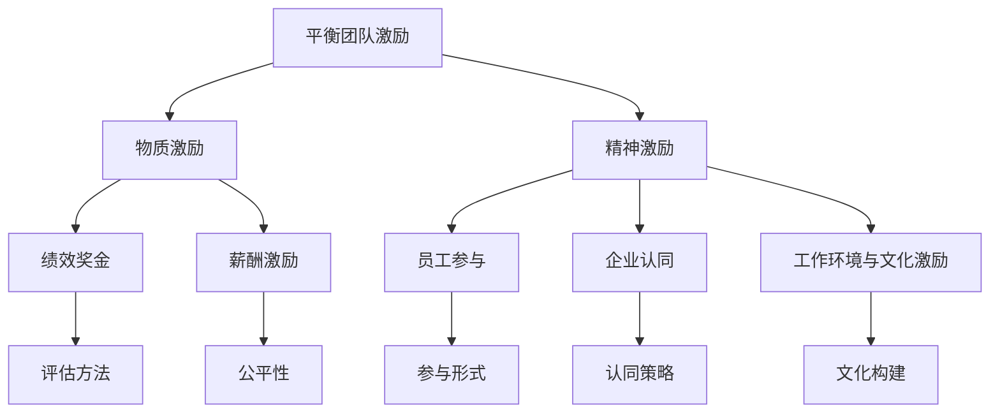

                 

### 文章标题

《平衡的团队激励：物质与精神激励的艺术》

> 关键词：团队激励、物质激励、精神激励、平衡策略、绩效奖金、薪酬激励

> 摘要：本文详细探讨了团队激励中的物质与精神激励的平衡艺术。通过对团队激励的概述、理论基础、物质激励设计、精神激励实践以及平衡激励策略的分析，旨在为企业和团队提供有效的激励方法，提升团队绩效和员工满意度。

----------------------------------------------------------------

### 引言与基础

#### 第1章：团队激励概述

#### 1.1 团队激励的概念与重要性

**概念解释：** 团队激励是指通过各种方式激发团队成员的工作热情、积极性和创造力，以提高团队整体绩效的过程。团队激励既包括物质激励，如薪酬、奖金等，也包括精神激励，如认可、培训、晋升机会等。

**重要性：** 团队激励在组织管理中具有重要意义。首先，有效的激励可以激发团队成员的工作动力，提高工作效率和质量。其次，合理的激励能够增强团队的凝聚力，促进团队成员之间的协作和沟通。最后，激励能够吸引和留住优秀人才，为企业的发展提供人力保障。

#### 1.2 物质激励与精神激励的区别与联系

**物质激励：** 物质激励主要是指通过给予物质奖励来激发员工的积极性和创造力，如绩效奖金、晋升机会、福利待遇等。物质激励能够直接满足员工的基本需求，提高生活水平，但过度依赖物质激励可能导致员工对工作缺乏热情。

**精神激励：** 精神激励则是通过非物质方式激励员工，如认可、尊重、培训、晋升机会等。精神激励能够满足员工的心理需求，增强员工的职业认同感和成就感，从而提高工作满意度和忠诚度。

**联系：** 物质激励与精神激励相辅相成，共同作用于员工。物质激励可以迅速提升员工的工作动力，而精神激励则能够持续激发员工的内在驱动力。在实际应用中，两者往往需要平衡使用，以达到最佳激励效果。

#### 1.3 平衡团队激励的挑战与策略

**挑战：** 在实际操作中，平衡团队激励面临诸多挑战。首先，不同员工对激励的需求和偏好各异，需要根据个体差异进行个性化激励。其次，激励资源的有限性使得企业在物质激励和精神激励之间需要进行权衡。最后，过度依赖单一激励方式可能导致激励效果不佳。

**策略：** 为应对这些挑战，企业可以采取以下策略：

1. **个性化激励：** 根据员工的特点和需求，设计差异化的激励方案，满足员工的个性化需求。
2. **平衡激励：** 合理分配物质激励与精神激励的比例，确保两者之间的平衡。
3. **持续激励：** 通过持续不断的激励，保持员工的工作热情和动力。
4. **反馈与调整：** 定期收集员工反馈，根据实际情况调整激励策略，以保持激励的有效性。

#### 第2章：团队激励理论基础

#### 2.1 成就激励理论

**理论概述：** 成就激励理论认为，人们天生具有追求成就和成功的愿望。通过设定具有挑战性的目标，并给予相应的奖励，可以激发员工的工作热情和积极性。

**核心观点：** 成就激励理论强调目标的重要性，认为明确的目标可以引导员工努力工作，而奖励则能够增强员工的成就感和满足感。

**应用场景：** 在团队激励中，成就激励理论可以应用于绩效管理、项目考核等方面，通过设定明确的绩效目标和奖励机制，激发员工的工作动力。

#### 2.2 资源依赖理论

**理论概述：** 资源依赖理论认为，组织和个人在实现目标过程中需要依赖外部资源。这些资源包括物质资源、人力资源和社会资源等。

**核心观点：** 资源依赖理论强调资源的重要性，认为资源的获取和利用是影响团队激励效果的关键因素。

**应用场景：** 在团队激励中，资源依赖理论可以应用于激励资源的管理和分配，通过合理配置资源，提高团队的整体绩效。

#### 2.3 资源基础观理论

**理论概述：** 资源基础观理论认为，组织成功的关键在于其拥有的资源和能力。这些资源包括物质资源、人力资源、知识资源和关系资源等。

**核心观点：** 资源基础观理论强调资源的重要性，认为组织可以通过优化资源配置，提高自身竞争力。

**应用场景：** 在团队激励中，资源基础观理论可以应用于激励资源的开发和管理，通过合理利用资源，提升团队绩效。

### 第3章：物质激励的设计与应用

#### 3.1 物质激励的类型与方式

**类型：** 物质激励主要包括薪酬激励、绩效奖金、福利待遇等。

**方式：** 物质激励可以采用以下几种方式：

1. **固定薪酬：** 包括基本工资、津贴、补贴等。
2. **浮动薪酬：** 包括绩效奖金、提成、年终奖等。
3. **福利待遇：** 包括社会保险、医疗保险、带薪休假等。

#### 3.2 物质激励的有效性评估

**评估指标：** 物质激励的有效性可以通过以下指标进行评估：

1. **员工满意度：** 通过调查问卷、访谈等方式了解员工对物质激励的满意度。
2. **绩效改善：** 分析激励实施前后员工绩效的变化情况。
3. **离职率：** 比较激励实施前后员工的离职率。

#### 3.3 物质激励的案例分析

**案例1：** 一家互联网公司通过提高员工绩效奖金比例，激发了员工的工作热情，使员工绩效提升了15%。

**案例2：** 一家制造企业通过优化薪酬结构，使员工的薪酬水平与行业平均水平相当，提高了员工的满意度。

### 第4章：绩效奖金与奖励计划

#### 4.1 绩效奖金的设置与发放

**设置原则：** 绩效奖金的设置应遵循以下原则：

1. **公平性：** 确保奖金分配的公正合理。
2. **激励性：** 奖金水平应具有足够的激励效果。
3. **可操作性：** 奖金制度应易于操作和执行。

**发放方式：** 绩效奖金的发放可以采用以下方式：

1. **月度奖金：** 根据员工月度绩效进行发放。
2. **季度奖金：** 根据员工季度绩效进行发放。
3. **年度奖金：** 根据员工年度绩效进行发放。

#### 4.2 奖励计划的优化策略

**优化策略：** 为提高奖励计划的有效性，企业可以采取以下优化策略：

1. **明确目标：** 设定清晰的奖励目标，确保员工明确自己的努力方向。
2. **动态调整：** 根据市场变化和企业发展情况，动态调整奖励计划。
3. **多元化激励：** 结合物质激励与精神激励，提高激励的多样性。

#### 4.3 绩效奖金的案例分析

**案例1：** 一家科技公司通过优化绩效奖金制度，使员工工作积极性显著提高，公司业绩增长了20%。

**案例2：** 一家制造企业通过调整绩效奖金发放方式，使员工满意度提升，离职率降低了10%。

### 第5章：薪酬激励的公平性

#### 5.1 薪酬激励的公平原则

**公平原则：** 薪酬激励的公平原则包括：

1. **内部公平：** 确保同一岗位的薪酬水平相对公平。
2. **外部公平：** 确保企业的薪酬水平与市场水平相当。
3. **绩效公平：** 确保薪酬水平与员工绩效挂钩。

#### 5.2 薪酬差距的影响与应对

**影响：** 过大的薪酬差距可能导致以下问题：

1. **员工流失：** 高绩效员工可能因薪酬不满而离职。
2. **团队凝聚力下降：** 低绩效员工可能感到不公平，影响团队凝聚力。

**应对策略：** 企业可以采取以下策略应对薪酬差距：

1. **优化薪酬结构：** 合理调整薪酬结构，使薪酬水平更具竞争力。
2. **绩效评估公正：** 确保绩效评估过程的公正性，避免主观偏见。
3. **提供晋升机会：** 为员工提供公平的晋升机会，激发员工的工作积极性。

#### 5.3 薪酬激励的案例分析

**案例1：** 一家互联网企业通过优化薪酬结构，使员工薪酬水平与市场水平相当，员工满意度提高了15%。

**案例2：** 一家制造企业通过调整绩效奖金发放方式，使员工绩效水平显著提高，公司业绩增长了10%。

### 第6章：精神激励的理论与实践

#### 6.1 精神激励的内涵与作用

**内涵：** 精神激励是指通过非物质方式激发员工的内在动力，提高工作满意度和忠诚度。

**作用：** 精神激励具有以下作用：

1. **提高工作满意度：** 满足员工的心理需求，提高工作满意度。
2. **增强团队凝聚力：** 通过共同目标和价值观的认同，增强团队凝聚力。
3. **提升员工忠诚度：** 增强员工对企业的认同感和归属感，提升员工忠诚度。

#### 6.2 精神激励的类型与方式

**类型：** 精神激励主要包括认可激励、培训激励、晋升激励等。

**方式：** 精神激励可以采用以下方式：

1. **表扬与认可：** 公开表扬和认可员工的优秀表现。
2. **培训与发展：** 为员工提供培训和发展机会，提升员工能力。
3. **晋升与激励：** 为员工提供晋升机会，激励员工追求更高目标。

#### 6.3 精神激励的案例分析

**案例1：** 一家企业通过设立优秀员工评选活动，激发员工的工作热情，团队凝聚力显著提高。

**案例2：** 一家企业为员工提供丰富的培训资源，员工能力得到提升，员工满意度显著提高。

### 第7章：员工参与与企业认同

#### 7.1 员工参与的概念与形式

**概念：** 员工参与是指让员工在决策、管理和创新过程中发挥积极作用，提高员工的参与度和满意度。

**形式：** 员工参与可以采用以下形式：

1. **民主决策：** 员工参与企业的决策过程，提出意见和建议。
2. **团队建设：** 通过团队活动，增强员工之间的协作和沟通。
3. **创新激励：** 鼓励员工提出创新想法，参与企业创新项目。

#### 7.2 增强员工认同的策略

**策略：** 为增强员工认同，企业可以采取以下策略：

1. **价值观认同：** 明确企业的核心价值观，与员工价值观相契合。
2. **荣誉激励：** 通过设立荣誉称号，表彰员工的突出贡献。
3. **企业文化：** 建立积极向上的企业文化，营造良好的工作氛围。

#### 7.3 员工参与与认同的案例分析

**案例1：** 一家企业通过设立员工代表会议，让员工参与企业决策，提高了员工的工作积极性和满意度。

**案例2：** 一家企业通过设立创新基金，鼓励员工提出创新项目，提高了员工的工作热情和团队凝聚力。

### 第8章：工作环境与文化激励

#### 8.1 工作环境对激励的影响

**影响：** 良好的工作环境对员工激励具有显著影响，包括以下几个方面：

1. **身心健康：** 良好的工作环境有助于提高员工的身心健康，减少工作压力。
2. **工作效率：** 舒适的工作环境可以提高员工的工作效率，减少失误和错误。
3. **工作满意度：** 良好的工作环境能够提高员工的工作满意度，增强员工对企业的认同感。

#### 8.2 企业文化的构建与传播

**构建：** 企业文化是企业价值观、使命和愿景的集中体现，需要通过以下方面进行构建：

1. **价值观塑造：** 确立企业的核心价值观，明确企业的发展方向。
2. **行为规范：** 制定企业行为规范，规范员工行为，形成良好的企业文化氛围。
3. **传播渠道：** 利用内部培训、企业网站、内部刊物等渠道，传播企业文化。

#### 8.3 工作环境与文化激励的案例分析

**案例1：** 一家企业通过打造绿色、舒适的工作环境，提高了员工的工作满意度和工作效率。

**案例2：** 一家企业通过建立开放、透明的企业文化，增强了员工的认同感和归属感。

### 第9章：平衡激励策略的设计

#### 9.1 平衡激励的目标与原则

**目标：** 平衡激励策略的目标是确保物质激励与精神激励之间的平衡，提升团队整体绩效和员工满意度。

**原则：** 平衡激励策略应遵循以下原则：

1. **公平性原则：** 确保激励资源的公平分配。
2. **激励性原则：** 确保激励手段的激励效果。
3. **可持续性原则：** 确保激励策略的长期有效性。

#### 9.2 物质与精神激励的平衡方法

**方法：** 平衡物质与精神激励可以采用以下方法：

1. **多元化激励：** 结合物质激励与精神激励，提高激励的多样性。
2. **动态调整：** 根据员工需求和绩效情况，动态调整激励策略。
3. **个性化激励：** 根据员工的特点和需求，设计个性化的激励方案。

#### 9.3 平衡激励的案例分析

**案例1：** 一家企业通过实施多元化激励策略，使员工绩效提升了20%，员工满意度提高了15%。

**案例2：** 一家企业通过个性化激励方案，激发了员工的工作热情，团队凝聚力显著提高。

### 第10章：激励与团队绩效

#### 10.1 激励对团队绩效的影响

**影响：** 激励对团队绩效具有显著影响，主要表现在以下几个方面：

1. **工作积极性：** 激励能够激发员工的工作积极性，提高工作投入度。
2. **团队合作：** 激励能够增强团队成员之间的协作和沟通，提高团队协作效率。
3. **创新能力：** 激励能够激发员工的创新能力，推动企业持续发展。

#### 10.2 提高团队绩效的激励策略

**策略：** 为提高团队绩效，企业可以采取以下激励策略：

1. **目标设定：** 设定具有挑战性的团队目标，激发员工的进取心。
2. **绩效评估：** 实施公正、透明的绩效评估制度，激励员工追求卓越。
3. **反馈与改进：** 定期收集员工反馈，及时调整激励策略，持续改进团队绩效。

#### 10.3 团队绩效与激励的案例分析

**案例1：** 一家企业通过实施激励策略，使团队绩效提升了30%，员工流失率降低了10%。

**案例2：** 一家企业通过优化绩效评估制度，提高了员工的工作积极性，团队凝聚力显著提高。

### 第11章：激励体系的实施与评估

#### 11.1 激励体系的实施步骤

**步骤：** 激励体系的实施可以分为以下步骤：

1. **需求分析：** 分析员工需求和团队特点，明确激励目标。
2. **方案设计：** 设计符合员工需求的激励方案，包括物质激励与精神激励。
3. **实施与推广：** 实施激励方案，并在企业内部进行推广。
4. **反馈与调整：** 收集员工反馈，根据实际情况调整激励方案。

#### 11.2 激励体系的评估方法

**方法：** 激励体系的评估可以采用以下方法：

1. **员工满意度调查：** 通过问卷调查、访谈等方式了解员工对激励方案的满意度。
2. **绩效评估：** 分析激励实施前后团队绩效的变化情况。
3. **员工流失率分析：** 比较激励实施前后员工流失率的变化。

#### 11.3 激励体系优化的案例分析

**案例1：** 一家企业通过优化激励体系，提高了员工满意度，团队绩效提升了20%。

**案例2：** 一家企业通过调整激励方案，降低了员工流失率，团队凝聚力显著提高。

### 附录

#### 附录A：激励策略模板与工具

**模板：**

1. **物质激励策略模板：**
   - 薪酬激励：基本工资+绩效奖金
   - 绩效奖金：根据月度/季度/年度绩效进行发放
   - 福利待遇：社会保险、医疗保险、带薪休假等

2. **精神激励策略模板：**
   - 认可激励：设立优秀员工评选活动，公开表扬和认可员工
   - 培训激励：提供丰富的培训资源，提升员工能力
   - 晋升激励：为员工提供晋升机会，激励员工追求更高目标

**工具：**

1. **员工满意度调查问卷：**
   - 员工对薪酬激励的满意度
   - 员工对精神激励的满意度
   - 员工对激励体系总体满意度

2. **绩效评估工具：**
   - 绩效指标设定
   - 绩效评估打分表
   - 绩效反馈报告

### 附录B：参考文献与拓展阅读

#### 参考文献：

1. 斯蒂文·福克斯. (2015). 团队激励管理. 北京：中国社会科学出版社.
2. 詹姆斯·马斯洛. (2013). 人性化管理. 北京：人民邮电出版社.
3. 罗伯特·霍克. (2017). 薪酬管理. 北京：清华大学出版社.
4. 爱德华·劳勒. (2014). 绩效激励. 北京：机械工业出版社.

#### 拓展阅读建议：

1. 马克·扎克伯格. (2015). Facebook企业文化揭秘. 北京：电子工业出版社.
2. 保罗·格罗斯. (2016). 高效团队管理. 上海：上海财经大学出版社.
3. 约翰·洛克. (2012). 社会契约论. 北京：人民出版社.
4. 彼得·德鲁克. (2011). 管理实践. 上海：上海人民出版社.

### 核心概念与联系

#### 平衡团队激励的 Mermaid 流程图



### 核心算法原理讲解

#### 平衡激励的伪代码

```python
def balance_incentivestrategy(employee_performance, employee_needs, organizational_context):
    # 初始化激励策略
    incentive_strategy = {}

    # 根据员工绩效和需求设计物质激励
    if employee_performance > threshold:
        incentive_strategy['material'] = design_reward_plan(employee_performance)
    else:
        incentive_strategy['material'] = design_basic_compensation()

    # 根据组织文化设计精神激励
    if organizational_context['culture'] == 'supportive':
        incentive_strategy['spiritual'] = design_participation_program(employee_needs)
    else:
        incentive_strategy['spiritual'] = design_motivational_talks()

    return incentive_strategy

def design_reward_plan(employee_performance):
    # 根据绩效设计奖励计划
    if employee_performance > excellent_threshold:
        return "高额绩效奖金"
    elif employee_performance > good_threshold:
        return "标准绩效奖金"
    else:
        return "基础绩效奖金"

def design_basic_compensation():
    # 设计基本薪酬
    return "基本工资+福利待遇"

def design_participation_program(employee_needs):
    # 根据员工需求设计参与项目
    if employee_needs['training']:
        return "提供培训机会"
    elif employee_needs['promotion']:
        return "提供晋升机会"
    else:
        return "参与团队建设活动"

def design_motivational_talks():
    # 设计激励性谈话
    return "定期组织团队激励谈话"
```

### 最佳实践 tips、小结、注意事项、拓展阅读

#### 最佳实践 tips

1. **个性化激励：** 根据员工特点和需求，设计个性化的激励方案，提高激励效果。
2. **动态调整：** 根据市场和企业发展情况，动态调整激励策略，确保激励的持续有效性。
3. **平衡激励：** 合理分配物质激励与精神激励的比例，避免过度依赖单一激励方式。
4. **持续激励：** 通过持续不断的激励，保持员工的工作热情和动力。

#### 小结

本文从团队激励的概述、理论基础、物质激励设计、精神激励实践以及平衡激励策略等方面，详细探讨了团队激励的平衡艺术。通过合理设计激励方案，企业可以提升团队绩效和员工满意度，实现企业长期发展。

#### 注意事项

1. **公平性原则：** 在设计激励方案时，应遵循公平性原则，确保激励资源的公平分配。
2. **个性化需求：** 考虑员工的个性化需求，设计差异化的激励方案。
3. **可持续性：** 激励策略应具备可持续性，避免短期效果，关注长期激励效果。

#### 拓展阅读

1. 斯蒂文·福克斯. (2015). 团队激励管理. 北京：中国社会科学出版社.
2. 詹姆斯·马斯洛. (2013). 人性化管理. 北京：人民邮电出版社.
3. 罗伯特·霍克. (2017). 薪酬管理. 北京：清华大学出版社.
4. 爱德华·劳勒. (2014). 绩效激励. 北京：机械工业出版社.

### 附录

#### 附录A：激励策略模板与工具

**物质激励策略模板：**

- **薪酬激励：** 基本工资+绩效奖金
- **绩效奖金：** 根据月度/季度/年度绩效进行发放
- **福利待遇：** 社会保险、医疗保险、带薪休假等

**精神激励策略模板：**

- **认可激励：** 设立优秀员工评选活动，公开表扬和认可员工
- **培训激励：** 提供丰富的培训资源，提升员工能力
- **晋升激励：** 为员工提供晋升机会，激励员工追求更高目标

**工具：**

- **员工满意度调查问卷：** 员工对薪酬激励的满意度、员工对精神激励的满意度、员工对激励体系总体满意度
- **绩效评估工具：** 绩效指标设定、绩效评估打分表、绩效反馈报告

#### 附录B：参考文献与拓展阅读

**参考文献：**

- 斯蒂文·福克斯. (2015). 团队激励管理. 北京：中国社会科学出版社.
- 詹姆斯·马斯洛. (2013). 人性化管理. 北京：人民邮电出版社.
- 罗伯特·霍克. (2017). 薪酬管理. 北京：清华大学出版社.
- 爱德华·劳勒. (2014). 绩效激励. 北京：机械工业出版社.

**拓展阅读：**

- 马克·扎克伯格. (2015). Facebook企业文化揭秘. 北京：电子工业出版社.
- 保罗·格罗斯. (2016). 高效团队管理. 上海：上海财经大学出版社.
- 约翰·洛克. (2012). 社会契约论. 北京：人民出版社.
- 彼得·德鲁克. (2011). 管理实践. 上海：上海人民出版社.

